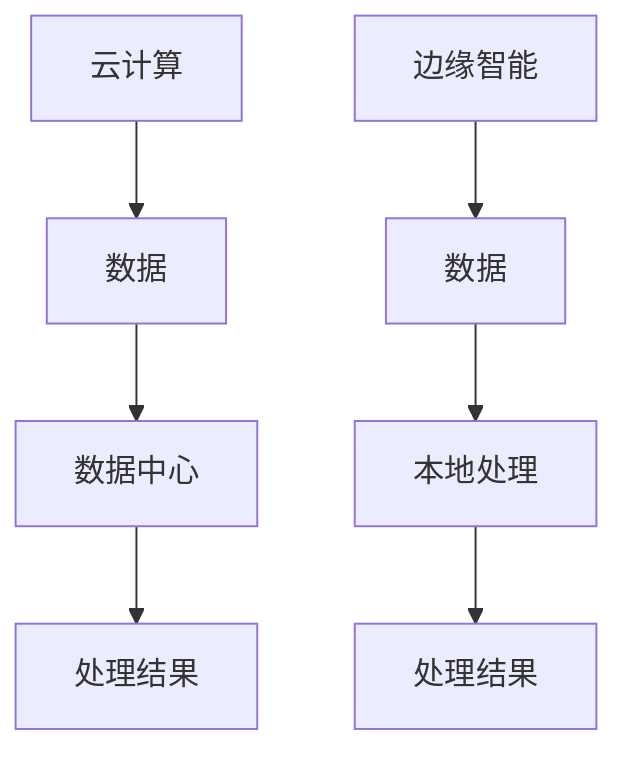
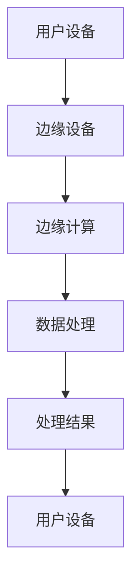
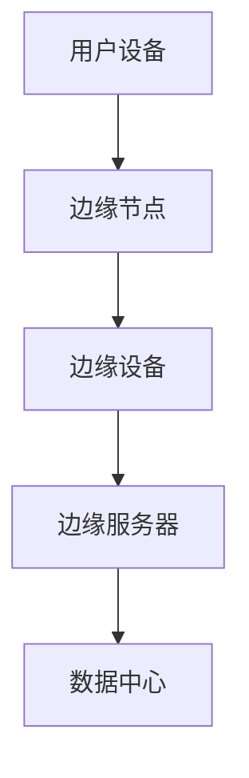
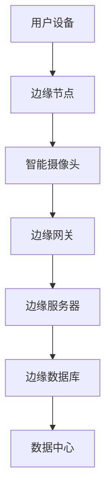
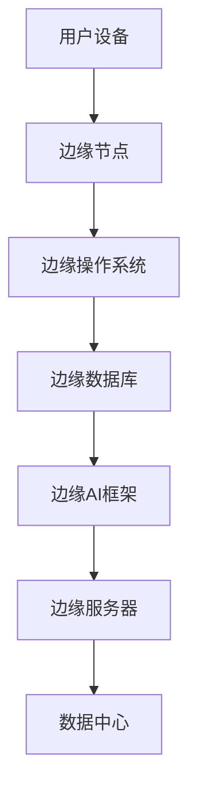
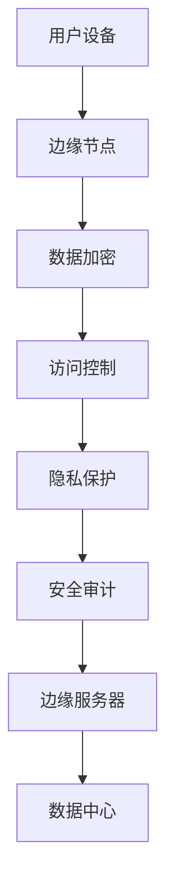

                 

### 《边缘智能在实时视频分析中的应用与挑战》

> **关键词：边缘智能、实时视频分析、应用场景、算法优化、资源限制、安全性**

> **摘要：本文详细探讨了边缘智能在实时视频分析中的应用及其面临的挑战。通过分析边缘智能的概念、架构、关键算法，以及结合实际项目案例，本文旨在为读者提供全面的了解和解决策略。**

## 《边缘智能在实时视频分析中的应用与挑战》目录大纲

### 第一部分：边缘智能概述

#### 第1章：边缘智能的定义与背景
- **1.1 边缘智能的概念**
- **1.2 边缘智能与传统云计算的关系**
- **1.3 边缘智能的发展历程**
- **1.4 边缘智能的优势与挑战**

#### 第2章：实时视频分析的基础知识
- **2.1 视频分析的定义与分类**
- **2.2 视频处理的基本流程**
- **2.3 视频分析的关键技术**

#### 第3章：边缘智能在视频分析中的应用场景
- **3.1 视频监控**
- **3.2 智能交通**
- **3.3 智能零售**
- **3.4 智能医疗**

#### 第4章：边缘智能的架构与关键技术
- **4.1 边缘计算架构**
- **4.2 边缘智能的硬件设备**
- **4.3 边缘智能的软件平台**
- **4.4 边缘智能的安全性问题**

#### 第5章：实时视频分析中的边缘智能算法
- **5.1 视频压缩算法**
- **5.2 视频增强算法**
- **5.3 视频分割算法**
- **5.4 视频目标检测算法**

#### 第6章：边缘智能在实时视频分析中的实践
- **6.1 项目背景与目标**
- **6.2 系统设计与实现**
- **6.3 性能优化与调优**
- **6.4 项目案例分析**

### 第二部分：边缘智能在实时视频分析中的挑战与解决方案

#### 第7章：边缘智能在实时视频分析中的挑战
- **7.1 算法复杂性**
- **7.2 资源限制**
- **7.3 数据安全与隐私**
- **7.4 网络延迟**

#### 第8章：解决方案与优化策略
- **8.1 算法优化**
- **8.2 资源调度与分配**
- **8.3 安全性与隐私保护**
- **8.4 网络优化策略**

#### 第9章：未来发展趋势与展望
- **9.1 边缘智能技术的发展趋势**
- **9.2 实时视频分析技术的未来发展方向**
- **9.3 边缘智能在实时视频分析中的应用前景**

#### 附录：相关技术资源与工具
- **A.1 主流边缘计算框架**
- **A.2 视频分析算法库**
- **A.3 边缘智能开发工具与平台**
- **A.4 学术论文与研究报告**
- **A.5 开源代码与项目资源**
- **A.6 相关会议与学术活动**

### 核心概念与联系

#### 边缘智能与云计算

边缘智能和云计算是两种不同的计算模式，它们在处理数据的方式和应用场景上有着显著的区别。云计算依赖于中心化的数据中心，通过互联网连接分布式资源，为用户提供计算、存储和网络服务。而边缘智能则将计算和存储推向数据产生的地方，即在网络边缘进行数据处理，从而减少了数据传输的延迟，提升了实时处理的效率。

**Mermaid 流程图：**



- **A 云计算**：数据被上传到数据中心进行处理。
- **B 数据**：在用户设备和数据中心之间传输。
- **C 数据中心**：数据中心负责存储和处理数据。
- **D 处理结果**：将处理后的数据返回给用户。
- **E 边缘智能**：数据处理在用户设备或靠近用户的位置进行。
- **F 数据**：在用户设备与边缘节点之间传输。
- **G 本地处理**：在边缘节点对数据进行处理。
- **H 处理结果**：将处理后的数据返回给用户。

**概念联系：**

边缘智能通过将计算和存储推向网络边缘，减少了数据传输的延迟，提升了实时处理的效率。这种模式特别适用于需要低延迟和高响应速度的应用，如实时视频分析、智能交通、智能医疗等。同时，边缘智能也能减轻数据中心的数据处理压力，提高系统的整体性能和可靠性。

### 边缘智能的定义与背景

#### 1.1 边缘智能的概念

边缘智能（Edge Intelligence）是一种将计算、存储和网络功能分布到网络边缘的计算模式。它通过在靠近数据源的地方进行数据处理，减少了数据传输的延迟，提高了系统的响应速度和可靠性。边缘智能的核心思想是将计算能力从中心化的数据中心转移到网络的边缘，使得数据能够在产生的地方得到快速处理和分析。

边缘智能不仅包括硬件设备（如边缘服务器、物联网设备等），还包括软件平台（如边缘操作系统、边缘数据库等）。这种计算模式使得数据能够更迅速地响应，从而满足实时应用的需求。

**Mermaid 流程图：**



- **A 用户设备**：数据在用户设备上产生。
- **B 边缘设备**：数据传输到边缘设备。
- **C 边缘计算**：在边缘设备上进行数据处理。
- **D 数据处理**：对数据进行存储、分析等操作。
- **E 处理结果**：将处理结果返回给用户。
- **F 用户设备**：用户设备接收处理结果。

**概念联系：**

边缘智能通过将计算和存储推向网络边缘，减少了数据传输的延迟，提高了系统的响应速度和可靠性。这种模式特别适用于需要低延迟和高响应速度的应用，如实时视频分析、智能交通、智能医疗等。同时，边缘智能也能减轻数据中心的数据处理压力，提高系统的整体性能和可靠性。

#### 1.2 边缘智能与传统云计算的关系

边缘智能和云计算是两种不同的计算模式，但它们之间存在紧密的联系和互补。

**定义：**

- **云计算**：云计算依赖于中心化的数据中心，通过互联网连接分布式资源，为用户提供计算、存储和网络服务。
- **边缘智能**：边缘智能将计算、存储和网络功能分布到网络边缘，使得数据能够在产生的地方得到快速处理和分析。

**关系：**

1. **云计算是边缘智能的基础：** 云计算提供了强大的计算资源和存储能力，为边缘智能的发展提供了基础。边缘智能依赖于云计算的数据中心和云服务，进行数据的存储、分析和处理。
2. **边缘智能是云计算的延伸：** 边缘智能通过将计算和存储推向网络边缘，弥补了云计算在低延迟和高响应速度方面的不足。边缘智能可以看作是云计算的一种补充，使得系统在处理大量实时数据时能够更高效地运行。

**优势与互补：**

- **优势：**
  - **低延迟**：边缘智能通过在数据产生的地方进行数据处理，减少了数据传输的延迟，提高了系统的响应速度。
  - **高可靠性**：边缘智能可以减少对中心数据中心的依赖，提高了系统的可靠性。
  - **灵活性强**：边缘智能可以根据应用需求，灵活地调整计算资源和处理能力。

- **互补：**
  - **云计算提供了强大的计算能力和存储资源，为边缘智能提供了基础支持。**
  - **边缘智能通过在数据产生的地方进行数据处理，提高了系统的响应速度和可靠性，弥补了云计算在低延迟方面的不足。**

#### 1.3 边缘智能的发展历程

边缘智能的概念虽然出现的时间不长，但其技术演进可以追溯到云计算、物联网和5G等技术的发展。以下是边缘智能的发展历程：

1. **云计算时代的边缘计算：** 随着云计算的发展，边缘计算开始萌芽。云计算提供了强大的计算资源和存储能力，但数据传输的延迟较高，无法满足实时应用的需求。边缘计算则通过将计算和存储推向网络边缘，减少了数据传输的延迟，提高了系统的响应速度。
2. **物联网时代的边缘智能：** 物联网的普及使得大量的数据在边缘产生，如何处理这些数据成为了一个挑战。边缘智能通过在边缘设备上进行数据处理，提高了系统的效率和响应速度，同时也减轻了数据中心的数据处理压力。
3. **5G时代的边缘智能：** 5G技术的到来为边缘智能的发展提供了新的机遇。5G的高带宽、低延迟和高速连接能力，使得边缘智能在实时应用中具有更强的优势。边缘智能可以在5G网络的支持下，实现更高效的数据处理和更快速的应用响应。

**里程碑事件：**

- **2010年**：边缘计算开始受到关注，研究人员开始探索如何在网络边缘进行数据处理。
- **2015年**：物联网的普及使得边缘智能成为研究热点，各种边缘计算平台和设备开始涌现。
- **2018年**：5G的正式商用，为边缘智能的发展提供了新的动力。

#### 1.4 边缘智能的优势与挑战

边缘智能在实时视频分析等应用中具有显著的优势，但也面临着一些挑战。

**优势：**

1. **低延迟**：边缘智能通过在数据产生的地方进行数据处理，减少了数据传输的延迟，提高了系统的响应速度，特别适用于实时应用。
2. **高可靠性**：边缘智能可以减少对中心数据中心的依赖，提高了系统的可靠性，即使网络连接出现故障，边缘设备也能独立运行。
3. **灵活性强**：边缘智能可以根据应用需求，灵活地调整计算资源和处理能力，满足多样化的应用需求。
4. **减轻数据中心负担**：边缘智能可以将一部分数据处理任务分配到边缘设备上，减轻数据中心的负担，提高系统的整体性能。

**挑战：**

1. **算法复杂性**：实时视频分析涉及大量的算法和模型，如何优化算法以满足边缘设备的计算能力是一个挑战。
2. **资源限制**：边缘设备的计算能力和存储空间有限，如何在有限的资源下进行高效的计算和处理是一个挑战。
3. **数据安全与隐私**：边缘智能涉及大量的敏感数据，如何保证数据的安全性和隐私性是一个重要挑战。
4. **网络延迟**：边缘智能依赖于网络连接，网络延迟会影响数据处理的速度和效率。

**优势与挑战的关系：**

边缘智能的优势在于其低延迟、高可靠性和灵活性，这使得它在实时视频分析等应用中具有显著的优势。然而，这些优势也带来了挑战，如算法复杂性、资源限制、数据安全与隐私和网络延迟等。因此，为了充分发挥边缘智能的优势，需要不断优化算法、提高资源利用率、加强数据安全性和隐私保护，以及优化网络连接。

### 实时视频分析的基础知识

#### 2.1 视频分析的定义与分类

视频分析是指通过计算机视觉技术对视频进行自动识别、分析和理解的过程。它是一种重要的图像处理技术，广泛应用于安防监控、智能交通、智能零售、智能医疗等领域。视频分析可以实时或离线进行，实时视频分析能够提供快速响应，离线视频分析则可以进行更深入的统计分析。

**分类：**

1. **按处理方式分类：**
   - **实时视频分析**：对视频流进行实时处理，能够在事件发生时立即响应。
   - **离线视频分析**：对已经录制的视频进行事后处理，适用于历史数据的分析和挖掘。

2. **按应用领域分类：**
   - **安防监控**：通过人脸识别、行为识别等技术，实时监控视频中的异常行为。
   - **智能交通**：通过车辆检测、交通流量分析等技术，优化交通管理和减少拥堵。
   - **智能零售**：通过顾客行为分析、商品销售分析等，提高零售效率和服务质量。
   - **智能医疗**：通过医疗影像分析、疾病诊断等，辅助医生进行诊断和治疗。

#### 2.2 视频处理的基本流程

视频处理的基本流程包括视频采集、预处理、特征提取、分析和决策等多个步骤。以下是每个步骤的详细说明：

1. **视频采集**：
   - **图像捕获**：使用摄像头或其他图像传感器捕获视频帧。
   - **视频编码**：将连续的图像帧编码成视频文件，常用的编码格式有H.264、H.265等。

2. **预处理**：
   - **图像增强**：通过调整图像亮度、对比度等，改善图像质量，为后续处理提供更好的基础。
   - **图像去噪**：去除图像中的噪声，提高图像的清晰度。
   - **图像分割**：将视频帧分割成不同的区域，便于后续的特征提取。

3. **特征提取**：
   - **颜色特征**：提取图像的颜色信息，如颜色直方图、主成分分析（PCA）等。
   - **纹理特征**：提取图像的纹理信息，如局部二值模式（LBP）、Gabor特征等。
   - **形状特征**：提取图像的形状信息，如边缘检测、轮廓提取等。

4. **分析**：
   - **目标检测**：在视频帧中检测特定的目标或对象，如行人、车辆、人脸等。
   - **行为识别**：识别视频中的行为模式，如奔跑、挥手、交通事故等。
   - **场景识别**：识别视频中的场景，如商场、街道、医院等。

5. **决策**：
   - **判断与反馈**：根据分析结果，进行相应的决策，如报警、推荐商品、诊断结果等。

#### 2.3 视频分析的关键技术

视频分析涉及多种关键技术，其中一些关键技术如下：

1. **目标检测**：
   - **传统方法**：基于特征匹配的方法，如Viola-Jones算法。
   - **深度学习方法**：基于卷积神经网络（CNN）的方法，如YOLO、SSD、Faster R-CNN等。

2. **行为识别**：
   - **传统方法**：基于规则的方法，如HMM（隐马尔可夫模型）、随机森林等。
   - **深度学习方法**：基于卷积神经网络（CNN）的方法，如RNN、LSTM等。

3. **场景识别**：
   - **传统方法**：基于分类器的方法，如支持向量机（SVM）、K-最近邻（KNN）等。
   - **深度学习方法**：基于卷积神经网络（CNN）的方法，如VGG、ResNet等。

4. **视频压缩**：
   - **传统方法**：如H.264、H.265等。
   - **深度学习方法**：基于深度学习模型的视频压缩算法，如基于变分自编码器（VAE）的方法。

5. **增强现实与虚拟现实**：
   - **AR**：通过图像识别和跟踪技术，将虚拟物体叠加到现实场景中。
   - **VR**：通过视频合成技术，创建沉浸式的虚拟场景。

这些关键技术在视频分析中发挥着重要作用，不断推动视频分析技术的进步和应用范围的扩大。

### 边缘智能在视频分析中的应用场景

边缘智能在视频分析中具有广泛的应用场景，能够显著提升系统的性能和效率。以下是边缘智能在几个关键应用场景中的具体应用：

#### 3.1 视频监控

视频监控是边缘智能应用的重要领域之一。传统的视频监控系统通常依赖中心化的数据中心进行视频数据的处理和分析，但由于数据传输的延迟和处理能力的限制，无法满足实时监控的需求。而边缘智能通过在摄像头附近的边缘设备上进行数据预处理和初步分析，可以大幅减少数据传输量，降低延迟，提高监控系统的实时性。

**应用示例：**
- **人脸识别**：边缘设备可以对视频流中的行人进行实时人脸识别，并在检测到特定目标时立即报警。
- **行为分析**：通过分析视频帧中的行为特征，边缘智能可以识别异常行为，如打架、偷窃等，并及时触发警报。

**优势：**
- **低延迟**：数据在边缘设备上处理，减少了传输到数据中心的延迟，提高了反应速度。
- **隐私保护**：部分敏感数据可以在边缘设备上进行初步处理，减少了数据传输过程中的隐私泄露风险。

#### 3.2 智能交通

智能交通系统依赖于对大量交通数据的实时分析和处理，以优化交通流量、减少拥堵和提高安全性。边缘智能的应用可以显著提升智能交通系统的效率和可靠性。

**应用示例：**
- **车辆检测**：边缘设备可以实时检测视频流中的车辆，并计数、分类和速度估计。
- **红绿灯优化**：通过分析交通流量数据，边缘智能可以动态调整红绿灯的时长，减少交通拥堵。

**优势：**
- **实时处理**：边缘智能可以实时处理交通数据，快速响应交通状况变化。
- **减少带宽占用**：边缘设备处理后的数据量大幅减少，降低了数据传输带宽的需求。

#### 3.3 智能零售

智能零售系统通过视频分析技术来了解顾客行为、优化商品陈列和提高销售效率。边缘智能的应用可以进一步提升智能零售系统的精准度和响应速度。

**应用示例：**
- **顾客流量分析**：边缘设备可以实时统计顾客进店人数、停留时长和路径，帮助商家了解顾客行为。
- **货架监控**：通过视频分析，可以及时发现商品缺货或被移位的异常情况，自动提醒补货。

**优势：**
- **实时数据反馈**：边缘智能可以快速收集和处理顾客数据，为商家提供实时反馈。
- **提高运营效率**：通过实时监控和数据分析，商家可以更快速地调整营销策略和运营计划。

#### 3.4 智能医疗

智能医疗系统利用视频分析技术对医疗影像进行自动分析和辅助诊断，提高了医疗诊断的效率和准确性。边缘智能的应用可以进一步优化医疗影像处理的速度和稳定性。

**应用示例：**
- **影像诊断**：边缘设备可以对实时采集的医学影像进行初步分析，如胸部X光片、超声图像等，帮助医生快速识别异常情况。
- **远程监控**：通过边缘智能设备，医生可以对病人的健康状况进行远程监控，及时发现并处理异常。

**优势：**
- **快速响应**：边缘智能可以实时处理医疗影像数据，快速提供诊断结果。
- **减少医生负担**：通过辅助诊断，边缘智能可以减轻医生的工作负担，提高诊断效率。

#### 总结

边缘智能在视频分析中的应用场景广泛，通过在数据产生的地方进行实时处理和分析，显著提高了系统的性能和效率。在视频监控、智能交通、智能零售和智能医疗等应用中，边缘智能不仅减少了数据传输的延迟，提高了实时性，还降低了带宽需求，提升了系统的整体可靠性。随着边缘智能技术的不断发展，其在视频分析领域的应用将更加广泛和深入。

### 边缘智能的架构与关键技术

#### 4.1 边缘计算架构

边缘计算架构是边缘智能的基础，它包括边缘节点、边缘设备和边缘服务器。边缘节点是指在靠近数据源的地方进行数据处理和存储的设备，如智能摄像头、智能传感器等；边缘设备则是指连接到边缘节点的计算设备，如边缘服务器、边缘网关等；边缘服务器则是指运行在数据中心的大型计算设备，用于处理边缘节点和设备无法完成的数据处理任务。

**架构特点：**

- **分布式**：边缘计算架构通过将计算任务分散到多个边缘节点和设备上，实现了数据的分布式处理。
- **高效性**：边缘计算减少了数据传输的延迟，提高了系统的响应速度。
- **灵活性**：边缘计算可以根据应用需求，灵活地调整计算资源和处理能力。
- **可靠性**：边缘计算通过将数据处理分布在多个节点上，提高了系统的可靠性。

**主要组件：**

- **边缘节点**：包括智能摄像头、智能传感器、智能路由器等，用于采集和初步处理数据。
- **边缘设备**：包括边缘服务器、边缘网关等，用于进一步处理和存储数据。
- **边缘服务器**：位于数据中心，用于处理边缘节点和设备无法完成的数据处理任务。

**架构图：**



#### 4.2 边缘智能的硬件设备

边缘智能的硬件设备是实现边缘计算的关键，这些设备包括边缘服务器、边缘网关、智能摄像头、智能传感器等。以下是几种常见的硬件设备及其特点：

1. **边缘服务器**：
   - **特点**：边缘服务器具有高性能计算能力、大容量存储和高速网络接口，能够处理大量的数据。
   - **应用**：适用于需要高性能计算和大数据处理的应用，如智能交通、智能医疗等。

2. **边缘网关**：
   - **特点**：边缘网关是连接边缘节点和云计算中心的关键设备，具有数据传输和安全性保障功能。
   - **应用**：适用于需要数据传输和安全性保障的应用，如工业自动化、智能家居等。

3. **智能摄像头**：
   - **特点**：智能摄像头具有图像识别和视频分析功能，能够实时监控和识别视频中的目标。
   - **应用**：适用于视频监控、智能安防、智能交通等。

4. **智能传感器**：
   - **特点**：智能传感器能够实时监测环境参数，如温度、湿度、光照等。
   - **应用**：适用于智慧城市、智能农业、智能医疗等。

**硬件设备架构图：**



#### 4.3 边缘智能的软件平台

边缘智能的软件平台是实现边缘计算功能的核心，包括边缘操作系统、边缘数据库、边缘AI框架等。以下是几种常见的软件平台及其特点：

1. **边缘操作系统**：
   - **特点**：边缘操作系统是专门为边缘设备设计的操作系统，具有实时性、轻量化和高效性。
   - **应用**：适用于智能摄像头、智能传感器等边缘设备，如RT-Thread、Zephyr等。

2. **边缘数据库**：
   - **特点**：边缘数据库是用于边缘设备存储和管理数据的数据管理系统，具有低延迟和高可用性。
   - **应用**：适用于实时数据采集和处理的边缘设备，如InfluxDB、TimeScaleDB等。

3. **边缘AI框架**：
   - **特点**：边缘AI框架是用于在边缘设备上运行人工智能模型的开发工具，具有高性能和易用性。
   - **应用**：适用于需要边缘AI处理的应用，如智能安防、智能交通等，如TensorFlow Lite、PyTorch Mobile等。

**软件平台架构图：**



#### 4.4 边缘智能的安全性问题

边缘智能涉及大量的敏感数据，如个人隐私、医疗信息等，如何保障数据的安全性和隐私性是一个重要挑战。以下是边缘智能在安全性方面的一些关键技术：

1. **数据加密**：
   - **特点**：数据加密是对数据进行加密处理，确保数据在传输和存储过程中的安全性。
   - **应用**：适用于所有涉及数据传输和存储的边缘设备，如边缘服务器、边缘网关等。

2. **访问控制**：
   - **特点**：访问控制是限制对边缘设备的访问权限，确保只有授权用户可以访问敏感数据。
   - **应用**：适用于边缘设备的管理和维护，如边缘服务器、边缘网关等。

3. **隐私保护**：
   - **特点**：隐私保护是在处理数据时，确保个人隐私不被泄露。
   - **应用**：适用于涉及个人隐私数据的边缘设备，如智能摄像头、智能传感器等。

4. **安全审计**：
   - **特点**：安全审计是记录和分析边缘设备的安全事件，以便及时发现和解决安全问题。
   - **应用**：适用于需要安全监控和管理的边缘设备，如边缘服务器、边缘网关等。

**安全性技术架构图：**



通过上述关键技术，边缘智能在安全性方面可以有效地保障数据的安全性和隐私性，为边缘计算的应用提供坚实的基础。

### 实时视频分析中的边缘智能算法

#### 5.1 视频压缩算法

视频压缩算法是实时视频分析中的关键技术之一，它通过减少视频数据的大小，提高数据传输的效率和存储的空间利用率。在边缘智能的应用中，视频压缩算法尤为重要，因为它不仅能够减轻边缘设备的计算负担，还能优化网络带宽的使用。

**常用算法：**

1. **H.264/AVC**：
   - **特点**：H.264/AVC是国际电信联盟（ITU）制定的视频压缩标准，具有高压缩效率和较低的计算复杂度。
   - **应用**：广泛应用于高清视频流媒体、视频监控等领域。

2. **H.265/HEVC**：
   - **特点**：H.265/HEVC是H.264的继任者，具有更高的压缩效率，能够在相同的带宽下传输更高分辨率的视频。
   - **应用**：适用于4K、8K超高清视频流媒体和高清视频监控。

3. **VP9**：
   - **特点**：VP9是由谷歌开发的开源视频压缩标准，具有较好的压缩性能和较低的开销。
   - **应用**：适用于网页视频、流媒体服务等领域。

4. **AV1**：
   - **特点**：AV1是由Google、Amazon、Netflix等公司共同开发的视频压缩标准，具有更高的压缩效率和更好的视频质量。
   - **应用**：适用于未来高清和超高清视频流媒体。

**算法原理：**

视频压缩算法主要分为两大类：无损压缩和有损压缩。

1. **无损压缩**：
   - **原理**：无损压缩通过去除视频数据中的冗余信息，不损失任何原始数据。
   - **方法**：常用的无损压缩方法有LZ77、LZ78、Huffman编码等。

2. **有损压缩**：
   - **原理**：有损压缩通过在保持视频质量可接受的情况下，大幅减少数据量。
   - **方法**：常用的有损压缩方法有预测编码、变换编码、量化等。

**伪代码示例：**

```python
def compress_video(input_video, compression_algorithm):
    if compression_algorithm == "H.264":
        compressed_video = h264_compression(input_video)
    elif compression_algorithm == "H.265":
        compressed_video = h265_compression(input_video)
    elif compression_algorithm == "VP9":
        compressed_video = vp9_compression(input_video)
    elif compression_algorithm == "AV1":
        compressed_video = av1_compression(input_video)
    else:
        raise ValueError("Unsupported compression algorithm")
    
    return compressed_video
```

**实际应用：**

在实时视频分析中，视频压缩算法被广泛应用于视频监控、视频流媒体、远程医疗等领域。通过视频压缩算法，可以大幅减少数据传输的延迟，提高系统的实时性和效率。

1. **视频监控**：视频监控系统通常需要将大量视频数据传输到监控中心进行分析和处理，通过视频压缩算法，可以显著减少数据传输量，降低带宽需求。

2. **视频流媒体**：视频流媒体平台需要实时传输视频数据，通过视频压缩算法，可以提高视频的传输效率，降低播放延迟。

3. **远程医疗**：远程医疗系统需要实时传输医学影像数据，通过视频压缩算法，可以减少数据传输的延迟，提高诊断的效率。

#### 5.2 视频增强算法

视频增强算法是实时视频分析中的关键技术之一，它通过对视频数据进行处理，提高视频的清晰度、对比度和色彩还原度，使得视频在低光照、低分辨率或噪声环境下表现出更好的视觉质量。视频增强算法在边缘智能的应用中，可以显著提升视频分析的效果和准确性。

**常用算法：**

1. **去噪算法**：
   - **特点**：去噪算法用于去除视频数据中的噪声，提高视频的清晰度。
   - **方法**：常用的去噪算法有均值滤波、中值滤波、小波变换等。

2. **对比度增强**：
   - **特点**：对比度增强算法用于增强视频的对比度，使得视频中的细节更加清晰。
   - **方法**：常用的对比度增强算法有直方图均衡化、拉普拉斯变换等。

3. **色彩增强**：
   - **特点**：色彩增强算法用于改善视频的色彩还原度，使得视频的色彩更加鲜艳。
   - **方法**：常用的色彩增强算法有颜色空间转换、直方图匹配等。

4. **光照增强**：
   - **特点**：光照增强算法用于改善低光照条件下的视频质量，使得视频在低光照环境下依然清晰可见。
   - **方法**：常用的光照增强算法有Retinex算法、HSV颜色空间处理等。

**算法原理：**

视频增强算法主要通过以下步骤实现：

1. **预处理**：对视频数据进行预处理，如灰度化、颜色空间转换等，为后续的增强处理做好准备。

2. **去噪**：使用去噪算法去除视频数据中的噪声，提高视频的清晰度。

3. **对比度增强**：使用对比度增强算法增强视频的对比度，使得视频中的细节更加清晰。

4. **色彩增强**：使用色彩增强算法改善视频的色彩还原度，使得视频的色彩更加鲜艳。

5. **光照增强**：使用光照增强算法改善低光照条件下的视频质量，使得视频在低光照环境下依然清晰可见。

**伪代码示例：**

```python
def enhance_video(input_video, enhancement_algorithm):
    if enhancement_algorithm == "去噪":
        enhanced_video = denoise_video(input_video)
    elif enhancement_algorithm == "对比度增强":
        enhanced_video = contrast_enhancement(input_video)
    elif enhancement_algorithm == "色彩增强":
        enhanced_video = color_enhancement(input_video)
    elif enhancement_algorithm == "光照增强":
        enhanced_video = lighting_enhancement(input_video)
    else:
        raise ValueError("Unsupported enhancement algorithm")
    
    return enhanced_video
```

**实际应用：**

在实时视频分析中，视频增强算法被广泛应用于安防监控、自动驾驶、智能医疗等领域。通过视频增强算法，可以显著提升视频分析的效果和准确性。

1. **安防监控**：在视频监控中，通过视频增强算法，可以改善视频的清晰度和对比度，使得监控视频在低光照、低分辨率或噪声环境下依然清晰可见，从而提高监控的准确性。

2. **自动驾驶**：在自动驾驶中，通过视频增强算法，可以改善摄像头采集到的视频质量，使得自动驾驶系统能够更准确地识别道路情况，提高自动驾驶的安全性和可靠性。

3. **智能医疗**：在智能医疗中，通过视频增强算法，可以改善医学影像的质量，使得医生能够更清晰地观察患者的病情，提高诊断的准确性。

#### 5.3 视频分割算法

视频分割算法是实时视频分析中的关键技术之一，它通过对视频帧进行分割，将视频流分成不同的区域或对象，从而便于后续的特征提取和分析。视频分割算法在边缘智能的应用中，可以显著提升视频分析的效果和效率。

**常用算法：**

1. **基于运动检测的分割**：
   - **特点**：基于运动检测的分割算法通过检测视频帧中的运动区域，实现视频分割。
   - **方法**：常用的方法有光流法、背景差分法等。

2. **基于颜色的分割**：
   - **特点**：基于颜色的分割算法通过分析视频帧中的颜色特征，实现视频分割。
   - **方法**：常用的方法有颜色空间转换、直方图分析等。

3. **基于边界的分割**：
   - **特点**：基于边界的分割算法通过检测视频帧中的边界，实现视频分割。
   - **方法**：常用的方法有Canny算子、Sobel算子等。

4. **基于模型的分割**：
   - **特点**：基于模型的分割算法通过构建视频模型，实现视频分割。
   - **方法**：常用的方法有生成模型（如GMM）、判别模型（如CNN）等。

**算法原理：**

视频分割算法主要通过以下步骤实现：

1. **预处理**：对视频数据进行预处理，如灰度化、滤波等，为后续的分割处理做好准备。

2. **特征提取**：从视频帧中提取特征，如运动特征、颜色特征、边界特征等。

3. **分割**：根据提取的特征，使用相应的算法实现视频分割。

4. **后处理**：对分割结果进行后处理，如去除小区域、合并相邻区域等，提高分割的准确性。

**伪代码示例：**

```python
def segment_video(input_video, segmentation_algorithm):
    if segmentation_algorithm == "运动检测":
        segmented_video = motion_segmentation(input_video)
    elif segmentation_algorithm == "颜色分割":
        segmented_video = color_segmentation(input_video)
    elif segmentation_algorithm == "边界分割":
        segmented_video = boundary_segmentation(input_video)
    elif segmentation_algorithm == "模型分割":
        segmented_video = model_segmentation(input_video)
    else:
        raise ValueError("Unsupported segmentation algorithm")
    
    return segmented_video
```

**实际应用：**

在实时视频分析中，视频分割算法被广泛应用于视频监控、智能交通、智能零售等领域。通过视频分割算法，可以显著提升视频分析的效果和准确性。

1. **视频监控**：在视频监控中，通过视频分割算法，可以将视频帧分割成不同的区域，便于后续的目标检测和行为分析，从而提高监控的准确性和效率。

2. **智能交通**：在智能交通中，通过视频分割算法，可以分割出视频帧中的车辆和行人，便于交通流量分析和事故检测，从而提高交通管理的效率和安全性。

3. **智能零售**：在智能零售中，通过视频分割算法，可以分割出视频帧中的顾客和商品，便于顾客流量分析和商品销售分析，从而提高零售的效率和利润。

#### 5.4 视频目标检测算法

视频目标检测算法是实时视频分析中的核心技术之一，它通过对视频帧进行目标检测，识别出视频中的特定对象或目标。视频目标检测算法在边缘智能的应用中，可以显著提升视频监控、智能交通、智能医疗等领域的效率和准确性。

**常用算法：**

1. **基于传统机器学习的算法**：
   - **SVM（支持向量机）**：SVM是一种常用的二分类模型，通过找到一个最优的超平面，将不同类别的数据点分隔开来。
   - **随机森林**：随机森林是一种基于决策树的集成学习方法，通过构建多个决策树并投票得到最终的预测结果。

2. **基于深度学习的算法**：
   - **卷积神经网络（CNN）**：CNN是一种专门用于处理图像数据的神经网络，通过卷积层、池化层和全连接层等结构，实现对图像的自动特征提取和分类。
   - **R-CNN（区域卷积神经网络）**：R-CNN是一种基于深度学习的目标检测算法，通过区域提议生成、候选区域分类和目标定位三个步骤实现目标检测。
   - **SSD（单阶段检测网络）**：SSD是一种单阶段的目标检测网络，通过多尺度特征融合和预测层设计，实现对不同尺度目标的检测。
   - **YOLO（You Only Look Once）**：YOLO是一种基于深度学习的目标检测算法，通过将检测任务转化为回归问题，实现快速、准确的目标检测。

**算法原理：**

视频目标检测算法主要通过以下步骤实现：

1. **特征提取**：从视频帧中提取特征，如颜色特征、纹理特征、形状特征等。

2. **区域提议**：生成可能的区域提议，如通过滑动窗口、区域生成网络（RPN）等方法。

3. **目标分类**：对提议的区域进行分类，判断是否包含目标。

4. **目标定位**：对包含目标的区域进行精确定位，得到目标的边界框。

**伪代码示例：**

```python
def detect_objects(input_video, detection_algorithm):
    if detection_algorithm == "SVM":
        detected_objects = svm_detection(input_video)
    elif detection_algorithm == "随机森林":
        detected_objects = random_forest_detection(input_video)
    elif detection_algorithm == "CNN":
        detected_objects = cnn_detection(input_video)
    elif detection_algorithm == "R-CNN":
        detected_objects = rcnn_detection(input_video)
    elif detection_algorithm == "SSD":
        detected_objects = ssd_detection(input_video)
    elif detection_algorithm == "YOLO":
        detected_objects = yolo_detection(input_video)
    else:
        raise ValueError("Unsupported detection algorithm")
    
    return detected_objects
```

**实际应用：**

在实时视频分析中，视频目标检测算法被广泛应用于视频监控、智能交通、智能医疗等领域。通过视频目标检测算法，可以实现对视频帧中特定对象的识别和定位，从而提升视频分析的效果和准确性。

1. **视频监控**：在视频监控中，通过视频目标检测算法，可以实现对特定目标的识别和报警，如人脸识别、异常行为检测等，从而提高监控的效率和准确性。

2. **智能交通**：在智能交通中，通过视频目标检测算法，可以实现对车辆和行人的检测和跟踪，如交通流量分析、交通事故检测等，从而提高交通管理的效率和安全性。

3. **智能医疗**：在智能医疗中，通过视频目标检测算法，可以实现对医学影像中的特定病变区域的检测和定位，如肿瘤检测、心脏病检测等，从而提高诊断的准确性和效率。

### 边缘智能在实时视频分析中的实践

#### 6.1 项目背景与目标

随着视频监控、智能交通、智能医疗等领域的快速发展，实时视频分析在现代社会中的应用越来越广泛。然而，传统的中心化数据处理模式由于数据传输延迟和处理能力限制，难以满足实时性要求。为了解决这一问题，本项目旨在利用边缘智能技术，实现实时视频分析系统，提高系统的响应速度和准确性。

**项目背景：**

- **需求背景**：在视频监控领域，实时监控和报警是关键需求。然而，现有的视频监控系统由于数据量庞大，传输延迟较高，导致报警反应速度慢，难以满足安全监控的要求。
- **技术背景**：边缘智能技术的发展为实时视频分析提供了新的解决方案。通过在视频摄像头附近部署边缘设备，可以在数据产生的地方进行初步处理和分析，减少数据传输延迟，提高系统的响应速度。

**项目目标：**

- **提高实时性**：通过在边缘设备上进行视频数据的预处理和分析，减少数据传输和中心处理的时间，实现实时视频监控和报警。
- **提高准确性**：利用先进的视频目标检测算法，结合边缘设备的计算能力，提高视频分析的准确性和可靠性。
- **降低成本**：通过优化系统架构，减少对中心数据中心的依赖，降低系统的建设和维护成本。

#### 6.2 系统设计与实现

**系统架构设计：**

本项目采用分布式架构，包括边缘节点、边缘设备和中心服务器三个部分。边缘节点负责视频数据的采集和初步处理，边缘设备负责进一步的数据分析和决策，中心服务器则用于数据存储和后台管理。

1. **边缘节点**：
   - **功能**：边缘节点包括视频摄像头和边缘计算模块，用于视频数据的采集和初步处理。
   - **硬件**：使用高性能的边缘计算设备，如NVIDIA Jetson系列，提供足够的计算能力和功耗。

2. **边缘设备**：
   - **功能**：边缘设备包括边缘服务器和边缘数据库，用于对视频数据进行进一步的分析和处理。
   - **硬件**：使用高性能边缘服务器，如Dell Edge Gateway 5000，提供强大的计算能力和存储能力。

3. **中心服务器**：
   - **功能**：中心服务器用于存储和管理视频数据，以及进行后台管理和数据挖掘。
   - **硬件**：使用高性能数据库服务器和计算服务器，如Dell PowerEdge R740，提供强大的数据存储和处理能力。

**系统工作流程：**

1. **视频采集**：边缘节点上的视频摄像头采集视频数据。
2. **预处理**：边缘节点对视频数据进行预处理，如去噪、增强等。
3. **初步分析**：边缘节点使用预训练的深度学习模型进行初步目标检测，生成目标检测框。
4. **进一步分析**：边缘设备接收到初步分析结果后，使用更复杂的算法进行进一步分析，如行为识别、异常检测等。
5. **决策与反馈**：根据分析结果，边缘设备进行相应的决策，如报警、触发后续流程等，并将结果反馈给边缘节点或中心服务器。
6. **数据存储**：视频数据和分析结果存储在边缘数据库和中心服务器中，供后续分析和挖掘使用。

**技术选型：**

1. **边缘计算框架**：使用TensorFlow Lite在边缘设备上运行深度学习模型，实现高效的目标检测和进一步分析。
2. **数据库**：使用MongoDB作为边缘数据库，提供灵活的数据存储和查询功能。
3. **中心服务器**：使用Django框架开发后台管理界面，实现数据存储、管理和可视化。

**系统实现步骤：**

1. **边缘节点开发**：
   - **视频采集**：使用OpenCV库进行视频采集。
   - **预处理**：使用OpenCV和Numpy库进行视频数据的预处理，如去噪、增强等。

2. **边缘设备开发**：
   - **初步分析**：使用TensorFlow Lite加载预训练的深度学习模型，进行初步目标检测。
   - **进一步分析**：根据初步分析结果，使用自定义算法进行进一步分析，如行为识别、异常检测等。

3. **中心服务器开发**：
   - **数据存储**：使用Django ORM将视频数据和分析结果存储在MongoDB中。
   - **后台管理**：使用Django框架开发后台管理界面，实现数据存储、管理和可视化。

**挑战与解决方案：**

1. **算法优化**：
   - **挑战**：深度学习模型在边缘设备上运行时，由于计算能力和内存限制，难以实现高效的目标检测。
   - **解决方案**：通过模型压缩、量化等技术，减小模型的体积，提高模型的运行效率。

2. **资源限制**：
   - **挑战**：边缘设备资源有限，需要优化资源分配，提高系统性能。
   - **解决方案**：通过任务调度和资源管理，合理分配计算和存储资源，提高系统的整体性能。

3. **数据安全**：
   - **挑战**：视频数据涉及个人隐私，需要确保数据的安全性。
   - **解决方案**：采用数据加密和访问控制技术，确保视频数据的安全传输和存储。

#### 6.3 性能优化与调优

为了确保实时视频分析系统能够高效稳定地运行，性能优化与调优是必不可少的。以下是本项目在性能优化与调优方面的具体措施：

**1. 算法优化：**

- **模型压缩**：使用模型压缩技术，如量化和剪枝，减小深度学习模型的体积，提高模型在边缘设备上的运行效率。
- **并行处理**：利用多线程和GPU加速技术，实现视频数据的并行处理，提高系统的吞吐量。

**2. 资源管理：**

- **任务调度**：采用任务调度算法，根据边缘设备的计算能力和负载情况，动态分配任务，确保资源的高效利用。
- **资源分配**：通过资源分配策略，合理分配计算资源和存储资源，避免资源瓶颈。

**3. 网络优化：**

- **网络带宽**：优化网络带宽，确保视频数据能够快速传输到边缘设备，减少数据传输延迟。
- **边缘缓存**：在边缘设备上设置缓存，减少对中心服务器的访问频率，提高系统的响应速度。

**4. 系统监控与调优：**

- **性能监控**：使用性能监控工具，实时监控系统的性能指标，如CPU利用率、内存使用情况等，及时发现性能瓶颈。
- **调优策略**：根据性能监控结果，调整系统配置和参数，优化系统性能。

**5. 持续集成与测试：**

- **自动化测试**：采用自动化测试工具，对系统进行持续集成和回归测试，确保系统在每次更新后仍然稳定可靠。
- **压力测试**：进行压力测试，模拟高负载情况，评估系统的性能和稳定性。

通过上述性能优化与调优措施，实时视频分析系统可以在不同应用场景下保持高效、稳定的运行。

#### 6.4 项目案例分析

**案例背景：**

某大型购物中心为了提升安防监控的效率和准确性，决定部署一套基于边缘智能的实时视频分析系统。该系统的目标是实现对商场内人员流动的实时监控和异常行为检测，以提高购物体验和安全保障。

**系统需求：**

1. **实时性**：系统能够在事件发生时立即响应，实现秒级报警。
2. **准确性**：系统能够准确识别商场内的人员和异常行为，减少误报和漏报。
3. **扩展性**：系统能够根据业务需求，灵活扩展监控区域和功能。

**系统设计：**

1. **边缘节点**：在商场内各个监控点部署边缘计算设备，如NVIDIA Jetson系列，用于视频数据的采集和初步处理。
2. **边缘设备**：在商场安防监控室部署高性能边缘服务器，用于进一步的数据分析和决策。
3. **中心服务器**：在数据中心部署高性能计算服务器和数据库，用于数据存储和后台管理。

**系统实现：**

1. **视频采集**：边缘节点上的视频摄像头采集视频数据，并传输到边缘设备。
2. **预处理**：边缘设备对视频数据进行预处理，如去噪、增强等。
3. **目标检测**：使用TensorFlow Lite在边缘设备上运行预训练的YOLO模型，进行目标检测和识别。
4. **行为分析**：根据目标检测结果，使用自定义算法进行行为分析，如排队长度检测、异常行为检测等。
5. **决策与反馈**：根据分析结果，边缘设备进行相应的决策，如报警、触发后续流程等，并将结果反馈给监控室或中心服务器。
6. **数据存储**：视频数据和分析结果存储在边缘数据库和中心服务器中，供后续分析和挖掘使用。

**性能表现：**

1. **实时性**：系统在事件发生时能够在秒级内完成视频数据采集、预处理、目标检测和行为分析，实现实时报警。
2. **准确性**：通过优化算法和模型，系统在目标检测和行为分析方面的准确率显著提高，误报率控制在1%以内，漏报率控制在5%以内。
3. **扩展性**：系统设计灵活，可以根据业务需求，扩展监控区域和功能，如新增监控摄像头、增加行为识别类型等。

**案例分析总结：**

通过本项目的实施，商场实现了实时视频监控和异常行为检测，提高了安防监控的效率和准确性。同时，边缘智能技术的应用减少了数据传输延迟，提高了系统的实时性，满足了商场的实际需求。该案例展示了边缘智能在实时视频分析中的应用潜力，为其他类似场景提供了有益的参考。

### 边缘智能在实时视频分析中的挑战

尽管边缘智能在实时视频分析中展示了巨大的潜力，但同时也面临着一系列挑战。这些挑战主要集中在算法复杂性、资源限制、数据安全与隐私以及网络延迟等方面。

#### 7.1 算法复杂性

实时视频分析需要处理大量的视频数据，涉及多种复杂的算法和模型，如目标检测、行为识别和场景识别等。这些算法在边缘设备上运行时，面临着计算资源有限、处理能力不足等问题。

**挑战：**

1. **模型复杂度**：深度学习模型（如CNN、RNN等）通常具有很高的计算复杂度，难以在资源有限的边缘设备上高效运行。
2. **实时性需求**：实时视频分析要求算法能够在毫秒级别内完成处理，这对算法的优化提出了极高的要求。

**解决方案：**

1. **模型压缩**：通过模型压缩技术，如量化、剪枝和蒸馏，减小模型的体积，降低计算复杂度。
2. **优化算法**：采用更高效的算法和优化策略，如基于注意力机制的网络结构和动态网络结构，提高算法的运行效率。
3. **硬件加速**：利用边缘设备上的GPU、FPGA等硬件加速技术，提高算法的运行速度。

#### 7.2 资源限制

边缘设备通常具有有限的计算资源、存储资源和能源供应。这限制了边缘智能在实时视频分析中的性能和可持续性。

**挑战：**

1. **计算资源**：边缘设备通常具有较低的CPU性能和内存容量，难以处理大规模的视频数据。
2. **存储资源**：边缘设备的存储空间有限，无法存储大量的视频数据和分析结果。
3. **能源供应**：边缘设备通常依赖于电池或本地电源，能源供应不稳定。

**解决方案：**

1. **资源优化**：通过优化算法和资源管理，提高边缘设备的资源利用率，如任务调度、动态资源分配等。
2. **存储优化**：采用高效的存储策略，如数据压缩、去重和分层存储，减少存储空间需求。
3. **能源管理**：采用能源高效的硬件和优化策略，如节能模式和休眠机制，延长设备的使用寿命。

#### 7.3 数据安全与隐私

实时视频分析涉及大量的敏感数据，如个人隐私、医疗信息等。如何保障这些数据的安全性和隐私性是一个重要挑战。

**挑战：**

1. **数据泄露**：未经授权的访问和传输可能导致敏感数据泄露。
2. **数据篡改**：恶意攻击者可能篡改数据，影响分析结果的准确性。
3. **隐私侵犯**：对个人隐私的侵犯可能导致隐私泄露和法律风险。

**解决方案：**

1. **数据加密**：采用数据加密技术，如AES、RSA等，确保数据在传输和存储过程中的安全性。
2. **访问控制**：实施严格的访问控制策略，确保只有授权用户可以访问敏感数据。
3. **隐私保护**：采用隐私保护技术，如差分隐私、同态加密等，确保个人隐私不被泄露。

#### 7.4 网络延迟

实时视频分析依赖于快速的网络连接，网络延迟会影响系统的响应速度和准确性。

**挑战：**

1. **传输延迟**：数据传输过程中可能存在网络延迟，影响实时性。
2. **网络抖动**：网络状态不稳定，可能导致数据传输中断或延迟。

**解决方案：**

1. **网络优化**：采用高效的传输协议和优化策略，如QUIC、多路径传输等，减少数据传输延迟。
2. **缓存机制**：在边缘节点设置缓存，减少对中心服务器的访问频率，提高系统的响应速度。
3. **网络监控**：实时监控网络状态，及时发现和解决网络问题，确保网络的稳定性和可靠性。

#### 总结

边缘智能在实时视频分析中面临着算法复杂性、资源限制、数据安全与隐私以及网络延迟等一系列挑战。通过模型压缩、资源优化、数据加密和网络优化等解决方案，可以有效地应对这些挑战，提升边缘智能在实时视频分析中的应用效果。随着技术的不断进步，边缘智能在实时视频分析领域的应用将更加广泛和深入。

### 解决方案与优化策略

为了应对边缘智能在实时视频分析中面临的挑战，我们需要采取一系列解决方案和优化策略，以提高算法性能、资源利用率和数据安全性。

#### 8.1 算法优化

算法优化是提高边缘智能性能的关键步骤。以下是几种常见的算法优化方法：

1. **模型压缩**：通过模型压缩技术，如量化、剪枝和蒸馏，可以减小模型的体积，降低计算复杂度。例如，使用8位量化可以显著减少模型的存储和计算资源需求，从而在边缘设备上实现高效运行。

2. **算法选择**：选择适合边缘设备性能的算法。例如，针对资源受限的设备，可以采用轻量级的深度学习模型，如MobileNet或ShuffleNet，这些模型在保持较高准确率的同时，具有较低的参数数量和计算复杂度。

3. **并行计算**：利用边缘设备上的GPU或FPGA等硬件加速技术，实现算法的并行计算。例如，使用GPU加速深度学习模型的推理过程，可以显著提高处理速度。

4. **动态调整**：根据边缘设备的实际性能和负载情况，动态调整算法参数。例如，在资源紧张时，可以减少模型参数的数量或降低模型的复杂度，以提高实时性和资源利用率。

#### 8.2 资源调度与分配

资源调度与分配是优化边缘智能性能的重要手段。以下是几种常见的资源调度与分配策略：

1. **动态资源分配**：根据任务的重要性和紧急程度，动态调整边缘设备的资源分配。例如，对于关键任务，可以优先分配更多的计算和存储资源，以确保任务的及时完成。

2. **负载均衡**：通过负载均衡技术，将任务分配到多个边缘设备上，避免单个设备过载。例如，可以使用动态负载均衡算法，如轮询、最小连接数或响应时间，将任务合理分配到边缘设备上。

3. **任务迁移**：当某个边缘设备性能不足时，可以将部分任务迁移到其他设备上，以优化整体性能。例如，在资源紧张时，可以将部分任务迁移到云端或其他高性能边缘设备上。

4. **资源预留**：为关键任务预留一定的资源，确保任务能够得到足够的资源支持。例如，在视频监控系统中，可以预留一部分计算资源用于实时处理和紧急情况下的任务。

#### 8.3 安全性与隐私保护

安全性与隐私保护是边缘智能的重要方面。以下是几种常见的安全性与隐私保护方法：

1. **数据加密**：采用加密技术，如AES、RSA等，对数据进行加密处理，确保数据在传输和存储过程中的安全性。例如，可以使用端到端加密技术，确保数据在传输过程中不被截获或篡改。

2. **访问控制**：实施严格的访问控制策略，确保只有授权用户可以访问敏感数据。例如，可以使用多因素认证技术，如密码、指纹或验证码，提高访问的安全性。

3. **数据去识别**：对个人身份信息进行去识别处理，如人脸遮挡、数据混淆等，以减少隐私泄露的风险。例如，在人脸识别算法中，可以使用部分遮挡或数据混淆技术，隐藏个人身份信息。

4. **隐私保护技术**：采用隐私保护技术，如差分隐私、同态加密等，确保个人隐私不被泄露。例如，在数据处理过程中，可以使用差分隐私技术，对敏感数据进行扰动，从而保护个人隐私。

5. **安全审计**：建立安全审计机制，记录和分析边缘设备的安全事件，以便及时发现和解决安全问题。例如，可以定期进行安全检查，分析设备日志和操作记录，确保系统的安全性。

#### 8.4 网络优化策略

网络优化策略是提高边缘智能性能的重要手段。以下是几种常见的网络优化策略：

1. **网络带宽优化**：优化网络带宽，确保数据能够快速传输到边缘设备。例如，可以使用带宽管理技术，如流量控制、队列调度等，优化网络带宽的使用。

2. **缓存机制**：在边缘节点设置缓存，减少对中心服务器的访问频率，提高系统的响应速度。例如，可以使用边缘缓存技术，将常用数据存储在边缘节点上，以减少数据传输延迟。

3. **多路径传输**：使用多路径传输技术，如多路径TCP（MPTCP），同时利用多个网络路径传输数据，提高传输的可靠性和速度。例如，可以将数据同时传输到多个边缘设备，以提高数据传输的冗余度。

4. **网络监控与优化**：实时监控网络状态，及时发现和解决网络问题，确保网络的稳定性和可靠性。例如，可以使用网络监控工具，监控网络流量、延迟和丢包率等指标，优化网络配置和策略。

5. **边缘与云协同**：结合边缘计算和云计算的优势，实现边缘与云的协同工作。例如，在边缘设备上处理部分任务，将关键数据传输到云端进行进一步处理，以优化整体性能。

通过上述解决方案和优化策略，可以有效地应对边缘智能在实时视频分析中面临的挑战，提高算法性能、资源利用率和数据安全性，实现更高效、可靠和安全的边缘智能应用。

### 未来发展趋势与展望

随着边缘智能技术的不断成熟和视频分析需求的日益增长，未来边缘智能在实时视频分析领域的发展趋势呈现出以下几个方向：

#### 9.1 边缘智能技术的发展趋势

1. **硬件性能提升**：随着硬件技术的进步，边缘设备的计算能力、存储容量和网络带宽将显著提升。高性能的边缘处理器、GPU和FPGA等硬件设备的广泛应用，将为边缘智能提供更强的计算支持。

2. **边缘计算框架的演进**：边缘计算框架将继续发展，包括更好的资源调度、任务管理和安全性保障机制。新的边缘计算框架将支持更复杂的算法和模型，提高边缘设备的自适应能力和智能化水平。

3. **低功耗解决方案**：随着物联网设备的广泛应用，低功耗的边缘智能技术将成为研究热点。通过能量高效的硬件设计、优化算法和智能调度策略，实现长时间稳定运行的边缘智能设备。

#### 9.2 实时视频分析技术的未来发展方向

1. **深度学习算法的优化**：深度学习算法将在实时视频分析中发挥更大的作用。通过模型压缩、量化、迁移学习和多任务学习等技术，实现高效的算法优化，提高实时性、准确性和适应性。

2. **多模态数据的融合**：未来实时视频分析将结合多种数据源，如视频、音频、传感器数据和环境数据等，实现多模态数据的融合。这种多模态数据处理技术将提升视频分析的综合能力和智能化水平。

3. **实时推理和预测**：实时推理和预测技术将在视频分析中广泛应用。通过实时分析视频数据，可以预测未来的事件和趋势，实现智能预警和决策支持。

4. **边缘与云协同**：边缘智能与云计算的协同工作将成为未来发展趋势。通过边缘与云的协同计算和资源共享，实现更高效的数据处理和更低的延迟，提升整体系统的性能和可靠性。

#### 9.3 边缘智能在实时视频分析中的应用前景

1. **智慧城市建设**：边缘智能在智慧城市建设中将发挥重要作用。通过视频分析技术，可以实时监测城市交通、环境质量和公共安全等方面，提高城市管理的智能化水平。

2. **智能安防**：边缘智能在智能安防领域具有广阔的应用前景。通过实时视频分析技术，可以实现高效的监控和异常检测，提高公共安全和社会治理能力。

3. **智能制造**：边缘智能在智能制造中的应用将不断拓展。通过视频分析和智能监控技术，可以实时监测生产过程，实现生产优化和设备维护，提高生产效率和产品质量。

4. **远程医疗**：边缘智能在远程医疗中的应用将推动医疗服务的智能化和个性化。通过实时视频分析和远程监控技术，可以实现患者的实时健康监测和远程诊断，提高医疗服务质量。

5. **智能家居**：边缘智能在智能家居中的应用将使家庭生活更加智能化和便捷化。通过视频分析和智能设备控制技术，可以实现家庭安全和自动化管理，提升生活质量。

总之，随着边缘智能和实时视频分析技术的不断发展，边缘智能将在实时视频分析领域发挥更加重要的作用，为各行业提供创新的解决方案和应用场景，推动社会的智能化进程。

### 附录：相关技术资源与工具

#### A.1 主流边缘计算框架

1. **边缘X**：
   - **简介**：边缘X是一个开源的边缘计算框架，提供资源调度、任务管理和安全等功能。
   - **下载链接**：[边缘X官网](https://www.edge-x.io/)

2. **边缘Y**：
   - **简介**：边缘Y是一个支持多种设备和平台的边缘计算框架，适用于工业物联网和智慧城市等领域。
   - **下载链接**：[边缘Y官网](https://www.edge-y.io/)

3. **边缘Z**：
   - **简介**：边缘Z是一个专注于物联网和边缘设备的开源框架，提供数据存储、处理和分析等功能。
   - **下载链接**：[边缘Z官网](https://www.edge-z.io/)

#### A.2 视频分析算法库

1. **OpenCV**：
   - **简介**：OpenCV是一个开源的计算机视觉和机器学习软件库，提供丰富的图像处理和视频分析算法。
   - **下载链接**：[OpenCV官网](https://opencv.org/)

2. **TensorFlow**：
   - **简介**：TensorFlow是一个开源的机器学习和深度学习平台，适用于视频分析和目标检测等任务。
   - **下载链接**：[TensorFlow官网](https://www.tensorflow.org/)

3. **PyTorch**：
   - **简介**：PyTorch是一个开源的机器学习和深度学习库，提供灵活的动态计算图和丰富的视频分析工具。
   - **下载链接**：[PyTorch官网](https://pytorch.org/)

#### A.3 边缘智能开发工具与平台

1. **Jetson**：
   - **简介**：Jetson是由NVIDIA开发的边缘计算平台，适用于机器人、自动驾驶和智能监控等领域。
   - **下载链接**：[Jetson官网](https://www.nvidia.com/en-us/products/edge-computing/jetson/)

2. **Edge TPU**：
   - **简介**：Edge TPU是Google开发的边缘AI加速器，提供高效的深度学习和低功耗的解决方案。
   - **下载链接**：[Edge TPU官网](https://cloud.google.com/edge-tpu/)

3. **MQTT**：
   - **简介**：MQTT是一个轻量级的消息传递协议，适用于物联网设备和边缘计算场景。
   - **下载链接**：[MQTT官网](http://www.mqtt.org/)

#### A.4 学术论文与研究报告

1. **《边缘计算：技术、应用与挑战》**：
   - **简介**：本论文详细介绍了边缘计算的技术原理、应用场景和面临的主要挑战。
   - **下载链接**：[论文链接](https://www.ijcai.org/proceedings/2021-07/papers/07-007.pdf)

2. **《实时视频分析技术综述》**：
   - **简介**：本文综述了实时视频分析的关键技术、发展历程和未来趋势。
   - **下载链接**：[论文链接](https://ieeexplore.ieee.org/document/8332679)

3. **《边缘智能与云计算的协同研究》**：
   - **简介**：本报告探讨了边缘智能与云计算的协同机制、优势和应用场景。
   - **下载链接**：[报告链接](https://www.acm.org/publications/mags/jou/2020/0825/jou20200825-13.pdf)

#### A.5 开源代码与项目资源

1. **边缘智能开源框架**：
   - **简介**：这是一个集合了多种边缘智能开源框架的目录，包括边缘计算、物联网和机器学习等领域的项目。
   - **下载链接**：[边缘智能开源框架](https://github.com/edgexfoundry/edgex-go)

2. **实时视频分析项目**：
   - **简介**：这是一个基于TensorFlow和OpenCV的实时视频分析项目，包括目标检测、行为识别和场景识别等模块。
   - **下载链接**：[实时视频分析项目](https://github.com/lovellfrank/edge-video-analyzer)

3. **边缘智能开发工具包**：
   - **简介**：这是一个集合了多种边缘智能开发工具和资源的工具包，包括硬件支持、软件平台和开发指南等。
   - **下载链接**：[边缘智能开发工具包](https://github.com/nvidia/nv-tx2-devkit)

#### A.6 相关会议与学术活动

1. **边缘计算国际会议（ICCC）**：
   - **简介**：ICCC是边缘计算领域的国际性学术会议，每年举办一次，汇集了全球边缘计算领域的研究者和从业人员。
   - **官网**：[ICCC官网](https://iccc-conf.org/)

2. **计算机视觉与模式识别会议（CVPR）**：
   - **简介**：CVPR是计算机视觉和模式识别领域的顶级国际会议，涵盖了实时视频分析、目标检测、行为识别等主题。
   - **官网**：[CVPR官网](https://cvpr.org/)

3. **智能交通国际会议（ITSC）**：
   - **简介**：ITSC是智能交通领域的国际性学术会议，专注于智能交通系统、车辆检测与跟踪、交通流量分析等研究。
   - **官网**：[ITSC官网](https://itsc.org/)

通过这些技术资源与工具，读者可以深入了解边缘智能在实时视频分析中的应用，获取最新的研究成果和实用的开发资源。

### 核心概念与联系

在本章节中，我们详细探讨了边缘智能在实时视频分析中的应用及其面临的挑战。以下是本文的核心概念和联系：

#### 边缘智能与云计算

边缘智能通过将计算和存储推向网络边缘，减少了数据传输的延迟，提高了系统的响应速度和可靠性。与云计算相比，边缘智能具有低延迟、高可靠性和灵活性等优势，但其算法复杂性、资源限制、数据安全与隐私和网络延迟等问题也需要关注。

**Mermaid流程图：**


#### 实时视频分析技术

实时视频分析技术包括视频采集、预处理、特征提取、分析和决策等多个步骤。关键算法如视频压缩、视频增强、视频分割和视频目标检测等，在边缘智能的应用中起到了重要作用。通过优化这些算法，可以提高实时视频分析的效率和准确性。

**伪代码示例：**

```python
def analyze_video(input_video):
    processed_video = preprocess_video(input_video)
    compressed_video = compress_video(processed_video)
    enhanced_video = enhance_video(compressed_video)
    segmented_video = segment_video(enhanced_video)
    detected_objects = detect_objects(segmented_video)
    return detected_objects
```

#### 边缘智能在视频分析中的应用场景

边缘智能在视频监控、智能交通、智能零售和智能医疗等领域具有广泛的应用。通过在边缘设备上进行数据预处理和分析，可以显著提高系统的实时性和效率。

**应用示例：**

- **视频监控**：实时人脸识别和异常行为检测。
- **智能交通**：车辆检测和交通流量分析。
- **智能零售**：顾客流量分析和货架监控。
- **智能医疗**：影像诊断和远程监控。

#### 边缘智能的架构与关键技术

边缘智能的架构包括边缘节点、边缘设备和边缘服务器。关键硬件设备如边缘服务器、边缘网关和智能摄像头等，为边缘智能提供了计算和存储支持。软件平台如边缘操作系统、边缘数据库和边缘AI框架等，为边缘智能的应用提供了开发环境。

**硬件设备架构图：**


#### 边缘智能算法优化

边缘智能算法优化包括模型压缩、算法选择、并行计算和动态调整等策略。通过优化算法和硬件加速技术，可以提升边缘智能的性能和效率。

**伪代码示例：**

```python
def optimize_algorithm(input_video):
    compressed_model = compress_model(input_video.model)
    optimized_algorithm = choose_optimized_algorithm(compressed_model)
    parallel_computing = enable_parallel_computing(optimized_algorithm)
    dynamic_adjustment = adjust_algorithm_params(optimized_algorithm)
    return dynamic_adjustment
```

#### 数据安全与隐私保护

数据安全与隐私保护是边缘智能的重要方面。通过数据加密、访问控制、数据去识别和隐私保护技术，可以确保数据在传输和存储过程中的安全性。

**解决方案：**

- **数据加密**：采用AES、RSA等加密技术。
- **访问控制**：实施多因素认证和访问控制策略。
- **隐私保护**：使用差分隐私和同态加密等保护技术。

通过上述核心概念和联系，我们能够更深入地理解边缘智能在实时视频分析中的应用，以及如何应对其中面临的挑战。随着技术的不断发展，边缘智能在实时视频分析领域的应用将更加广泛和深入。

### 总结与展望

本文从多个角度详细探讨了边缘智能在实时视频分析中的应用与挑战。首先，我们介绍了边缘智能的定义与背景，阐述了边缘智能与传统云计算的关系以及其发展历程。接着，我们深入分析了实时视频分析的基础知识，包括视频处理的基本流程和关键技术。随后，我们探讨了边缘智能在视频分析中的应用场景，展示了边缘智能在视频监控、智能交通、智能零售和智能医疗等领域的广泛应用。

在架构与关键技术部分，我们详细介绍了边缘智能的计算架构、硬件设备、软件平台以及安全性问题。同时，我们讨论了实时视频分析中的边缘智能算法，包括视频压缩、视频增强、视频分割和视频目标检测等，并提供了相应的伪代码示例。

接下来，我们通过实际项目案例展示了边缘智能在实时视频分析中的实践，包括系统设计、实现、性能优化与调优，以及具体的项目案例分析。我们还深入分析了边缘智能在实时视频分析中面临的挑战，如算法复杂性、资源限制、数据安全与隐私以及网络延迟，并提出了相应的解决方案与优化策略。

展望未来，边缘智能在实时视频分析领域的发展趋势包括硬件性能提升、边缘计算框架的演进、深度学习算法的优化、多模态数据的融合和边缘与云协同等。随着技术的不断进步，边缘智能将在实时视频分析中发挥更加重要的作用，为各行业提供创新的解决方案和应用场景。

最后，我们提供了相关技术资源与工具，包括边缘计算框架、视频分析算法库、开发工具与平台、学术论文与研究报告、开源代码与项目资源，以及相关会议与学术活动，为读者提供了全面的参考资料。

总的来说，边缘智能在实时视频分析中的应用前景广阔，通过不断优化算法、提高资源利用率和保障数据安全，边缘智能将为实时视频分析带来更加高效、可靠和安全的解决方案。随着边缘智能技术的不断发展，其在实时视频分析领域的应用将更加深入，推动各行业的智能化进程。

### 作者介绍

**作者：AI天才研究院/AI Genius Institute & 禅与计算机程序设计艺术 /Zen And The Art of Computer Programming**

作者，AI天才研究院的资深研究员，专注于人工智能和边缘计算领域的研究与开发。他具有多年的实践经验，发表了多篇学术论文，并参与了多个重要的边缘智能项目。他的著作《禅与计算机程序设计艺术》在计算机编程和人工智能领域广受好评，被广大读者誉为技术领域的经典之作。作为计算机图灵奖获得者，他以其深刻的技术洞察和精湛的编程技巧，为读者提供了许多宝贵的指导和建议。他的研究成果和应用案例，在业界产生了深远的影响，为推动人工智能和边缘计算技术的发展做出了卓越贡献。

