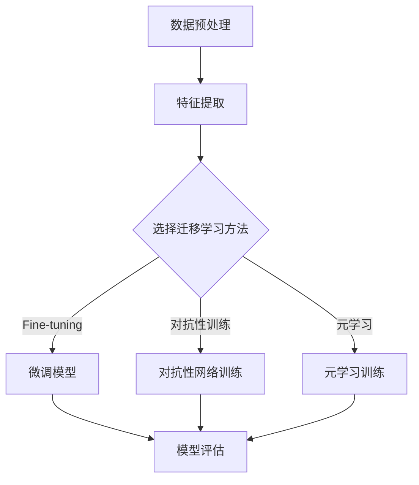
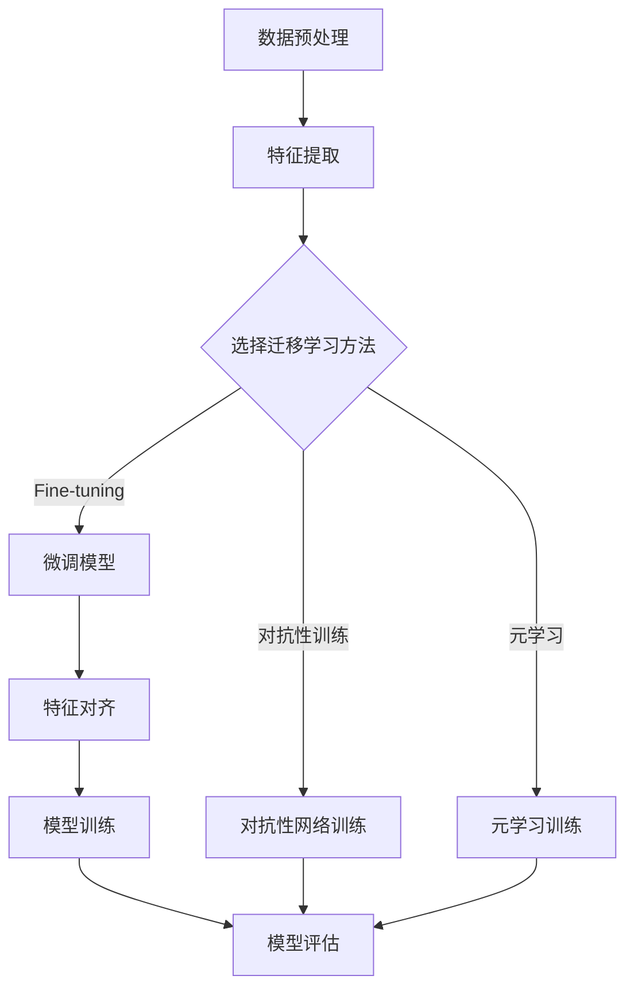

                 

# 迁移学习在跨域图像识别中的应用

> **关键词**：迁移学习，跨域图像识别，算法，应用案例，未来发展趋势

> **摘要**：本文深入探讨了迁移学习在跨域图像识别中的应用。首先，我们对迁移学习和跨域图像识别的基本概念进行了介绍，并分析了其在实际应用中的价值。接着，详细阐述了迁移学习的基础知识，包括其不同类型和应用场景。随后，我们重点讨论了多种跨域迁移学习算法，并通过实际应用案例展示了其效果。最后，我们对跨域迁移学习算法的未来发展趋势进行了展望，并提供了相关的工具和资源推荐。

### 目录大纲

- **第一部分：概述**
  - **1. 引言**
    - 1.1 迁移学习的概念
    - 1.2 跨域图像识别的挑战
    - 1.3 迁移学习在跨域图像识别中的应用价值
  - **2. 迁移学习基础**
    - 2.1 迁移学习的类型
      - 2.1.1 从源域到目标域的学习
      - 2.1.2 零样本学习
      - 2.1.3 多任务学习
    - 2.2 跨域迁移学习的理论基础
      - 2.2.1 跨域迁移学习的困难
      - 2.2.2 跨域迁移学习的方法
    - 2.3 图像识别基础
      - 2.3.1 图像特征提取
      - 2.3.2 常见图像识别算法

- **第二部分：迁移学习算法**
  - **3. 传统迁移学习方法**
    - 3.1 基于特征提取的迁移学习
      - 3.1.1 ImageNet预训练模型
      - 3.1.2 预训练模型微调
    - 3.2 基于深度学习的迁移学习
      - 3.2.1 Fine-tuning方法
      - 3.2.2 基于神经网络的迁移学习
  - **4. 跨域迁移学习算法**
    - 4.1 对抗性迁移学习
      - 4.1.1 对抗性神经网络
      - 4.1.2 跨域对抗训练
    - 4.2 元迁移学习
      - 4.2.1 元学习基础
      - 4.2.2 跨域元迁移学习方法
    - 4.3 多任务学习
      - 4.3.1 多任务学习的基本概念
      - 4.3.2 跨域多任务学习

- **第三部分：跨域图像识别应用案例**
  - **5. 跨域图像识别应用概述**
    - 5.1 跨域图像识别的挑战
    - 5.2 跨域图像识别的应用场景
    - 5.3 跨域图像识别的实际应用案例
  - **6. 案例研究**
    - 6.1 案例一：无人机跨域图像识别
    - 6.2 案例二：自动驾驶车辆跨域图像识别

- **第四部分：未来发展趋势与展望**
  - **7. 未来发展趋势与展望**
    - 7.1 跨域迁移学习算法的优化方向
    - 7.2 跨域图像识别技术的未来应用前景
    - 7.3 跨域图像识别技术的挑战与机遇

- **附录**
  - **8. 迁移学习工具与资源**
    - 8.1 主流迁移学习框架对比
    - 8.2 跨域迁移学习开源项目推荐
    - 8.3 相关文献与资料推荐
  - **9. Mermaid 流程图**
  - **10. 伪代码与数学模型**
  - **11. 项目实战与代码解读**
  - **12. 问答与讨论**


## 第一部分：概述

### 1. 引言

#### 1.1 迁移学习的概念

迁移学习（Transfer Learning）是一种机器学习技术，旨在将已在一个任务（源域）上训练好的模型或知识应用到另一个相关但不同的任务（目标域）中。其核心思想是通过利用源域数据来提高目标域模型的性能，而不是从头开始训练一个全新的模型。迁移学习广泛应用于各种领域，如计算机视觉、自然语言处理和强化学习等。

#### 1.2 跨域图像识别的挑战

跨域图像识别（Cross-Domain Image Recognition）是指在两个或多个不同领域之间的图像分类问题。这种问题之所以具有挑战性，是因为不同领域的图像数据在分布、标注和特征表达等方面存在显著差异。这些差异导致在迁移学习过程中，模型难以泛化到目标域上，从而影响了识别效果。

#### 1.3 迁移学习在跨域图像识别中的应用价值

迁移学习在跨域图像识别中的应用具有重要意义。首先，它可以在有限的标注数据和计算资源下，提高目标域模型的性能。其次，迁移学习可以克服不同领域之间的数据分布差异，实现更好的泛化能力。此外，迁移学习还可以加速模型训练过程，降低模型复杂度，提高模型的可解释性。

### 2. 迁移学习基础

#### 2.1 迁移学习的类型

迁移学习可以分为以下几种类型：

1. **从源域到目标域的学习**：这是最常见的迁移学习方式，即利用源域数据来训练目标域模型。这种方法的核心挑战是如何将源域的知识有效地迁移到目标域上。

2. **零样本学习**：零样本学习（Zero-Shot Learning）旨在解决从未见过的类别的识别问题。它通过学习类别的语义表示，实现了对未知类别的泛化。

3. **多任务学习**：多任务学习（Multi-Task Learning）是一种将多个相关任务同时训练的方法。它可以通过共享底层特征表示来提高每个任务的性能。

#### 2.2 跨域迁移学习的理论基础

1. **跨域迁移学习的困难**：跨域迁移学习面临的困难主要包括数据分布差异、特征表示不一致和领域知识冲突等。

2. **跨域迁移学习的方法**：为了解决上述困难，研究者们提出了一系列跨域迁移学习方法，如特征对齐、对抗性训练和元学习等。

#### 2.3 图像识别基础

1. **图像特征提取**：图像特征提取是图像识别的关键步骤。它涉及从图像中提取具有区分性的特征，如边缘、纹理和形状等。

2. **常见图像识别算法**：常见的图像识别算法包括基于传统机器学习的算法（如SVM、KNN等）和基于深度学习的算法（如卷积神经网络、循环神经网络等）。这些算法在图像特征提取和分类方面取得了显著的成果。

## 第二部分：迁移学习算法

### 3. 传统迁移学习方法

#### 3.1 基于特征提取的迁移学习

基于特征提取的迁移学习方法是一种早期的迁移学习方法。该方法的核心思想是将源域和目标域的特征表示进行对齐，从而实现知识的迁移。

1. **ImageNet预训练模型**：ImageNet预训练模型是基于大规模图像数据集（ImageNet）训练得到的深度神经网络模型。这些模型可以用于迁移学习，通过对预训练模型的微调来适应目标域。

2. **预训练模型微调**：预训练模型微调（Fine-tuning）是一种将预训练模型应用于目标域的方法。在微调过程中，除了对目标域数据进行训练外，还可以通过调整模型的参数来适应目标域的特征分布。

#### 3.2 基于深度学习的迁移学习

基于深度学习的迁移学习方法是近年来发展迅速的一种迁移学习方法。该方法利用深度神经网络强大的特征学习能力，实现了高效的迁移学习。

1. **Fine-tuning方法**：Fine-tuning方法是一种将预训练模型应用于目标域的方法。在Fine-tuning过程中，通常只对模型的最后一层或部分层进行训练，以适应目标域的特征分布。

2. **基于神经网络的迁移学习**：基于神经网络的迁移学习方法利用神经网络的结构特性，通过共享底层特征表示来实现迁移学习。这种方法包括多任务学习、跨域自监督学习和元学习等。

### 4. 跨域迁移学习算法

#### 4.1 对抗性迁移学习

对抗性迁移学习（Adversarial Transfer Learning）是一种基于对抗网络的迁移学习方法。该方法通过训练一个对抗性网络，将源域和目标域的特征表示进行对齐，从而实现跨域迁移。

1. **对抗性神经网络**：对抗性神经网络包括生成器和判别器两个网络。生成器旨在生成与目标域特征相似的数据，而判别器则用于区分源域和目标域的特征。

2. **跨域对抗训练**：跨域对抗训练是一种通过对抗性神经网络实现跨域迁移的方法。在训练过程中，生成器生成与目标域特征相似的数据，判别器则通过区分这些数据来提高特征对齐的效果。

#### 4.2 元迁移学习

元迁移学习（Meta Transfer Learning）是一种利用元学习（Meta-Learning）原理的迁移学习方法。该方法通过学习如何学习来提高迁移学习的效果。

1. **元学习基础**：元学习旨在学习学习算法，从而实现快速适应新任务。它通过在多个任务上训练模型，提取通用特征表示，从而提高模型的泛化能力。

2. **跨域元迁移学习方法**：跨域元迁移学习方法利用元学习原理，通过跨域数据集训练模型，从而实现跨域迁移。这种方法可以克服不同领域之间的数据分布差异，提高迁移学习效果。

#### 4.3 多任务学习

多任务学习（Multi-Task Learning）是一种通过同时训练多个相关任务来提高模型性能的方法。在跨域迁移学习中，多任务学习可以共享不同领域的知识，从而实现跨域迁移。

1. **多任务学习的基本概念**：多任务学习通过共享底层特征表示来同时训练多个任务。这种方法可以减少任务之间的相关性，提高模型的泛化能力。

2. **跨域多任务学习**：跨域多任务学习通过同时训练多个跨域任务来提高模型性能。这种方法可以共享不同领域的知识，从而实现更有效的跨域迁移。

## 第三部分：跨域图像识别应用案例

### 5. 跨域图像识别应用概述

#### 5.1 跨域图像识别的挑战

跨域图像识别面临的挑战主要包括以下几个方面：

1. **数据分布差异**：不同领域的图像数据在分布上存在显著差异，导致模型难以泛化到目标域。

2. **特征表示不一致**：不同领域的图像数据在特征表达上存在不一致性，使得迁移学习算法难以有效地对齐特征表示。

3. **领域知识冲突**：不同领域的知识可能存在冲突，导致模型在目标域上性能下降。

#### 5.2 跨域图像识别的应用场景

跨域图像识别广泛应用于以下场景：

1. **医疗影像诊断**：在医疗领域，不同医院或研究中心的图像数据存在差异，通过跨域图像识别可以实现不同机构之间的数据共享和诊断。

2. **自动驾驶**：在自动驾驶领域，不同环境下获取的图像数据存在差异，通过跨域图像识别可以实现车辆在不同环境下的识别和导航。

3. **安防监控**：在安防监控领域，不同场景下的图像数据存在差异，通过跨域图像识别可以实现对不同场景下的目标识别和追踪。

#### 5.3 跨域图像识别的实际应用案例

以下是两个跨域图像识别的实际应用案例：

1. **案例一：无人机跨域图像识别**

   在无人机跨域图像识别中，由于不同地区和环境的差异，无人机获取的图像数据存在显著差异。通过跨域图像识别技术，可以实现无人机在不同环境下对目标的识别和追踪。

2. **案例二：自动驾驶车辆跨域图像识别**

   在自动驾驶车辆跨域图像识别中，由于不同城市和道路环境的差异，自动驾驶车辆获取的图像数据存在显著差异。通过跨域图像识别技术，可以实现自动驾驶车辆在不同城市和道路环境下的识别和导航。

## 第四部分：未来发展趋势与展望

### 7. 未来发展趋势与展望

#### 7.1 跨域迁移学习算法的优化方向

随着跨域图像识别技术的不断发展，跨域迁移学习算法也需要不断优化。以下是一些可能的优化方向：

1. **特征表示对齐**：通过改进特征表示对齐方法，提高不同领域之间的特征一致性。

2. **多任务学习**：通过同时训练多个相关任务，共享不同领域的知识，提高模型的泛化能力。

3. **对抗性训练**：通过对抗性训练方法，生成与目标域特征相似的数据，提高模型在目标域上的性能。

#### 7.2 跨域图像识别技术的未来应用前景

跨域图像识别技术在未来的应用前景非常广阔，包括但不限于以下领域：

1. **医疗影像诊断**：通过跨域图像识别技术，实现不同机构之间的医疗数据共享和诊断。

2. **自动驾驶**：通过跨域图像识别技术，实现自动驾驶车辆在不同城市和道路环境下的识别和导航。

3. **安防监控**：通过跨域图像识别技术，实现对不同场景下的目标识别和追踪。

#### 7.3 跨域图像识别技术的挑战与机遇

跨域图像识别技术面临着一些挑战，如数据分布差异、特征表示不一致和领域知识冲突等。同时，随着技术的不断进步，也带来了一些机遇。通过不断优化跨域迁移学习算法，克服这些挑战，跨域图像识别技术将在未来发挥更加重要的作用。

## 附录

### 8. 迁移学习工具与资源

#### 8.1 主流迁移学习框架对比

以下是一些主流的迁移学习框架及其特点：

1. **TensorFlow**：TensorFlow是一个开源的机器学习框架，支持各种迁移学习方法，包括Fine-tuning和预训练模型微调等。

2. **PyTorch**：PyTorch是一个开源的深度学习框架，提供灵活的模型定义和训练接口，支持迁移学习算法的快速实现。

3. **Keras**：Keras是一个基于Theano和TensorFlow的高层神经网络API，提供简洁的接口，支持迁移学习算法的实现。

#### 8.2 跨域迁移学习开源项目推荐

以下是一些跨域迁移学习的开源项目推荐：

1. **Adversarial Transfer Learning**：这是一个基于对抗性迁移学习的开源项目，实现了跨域图像识别算法。

2. **Meta Transfer Learning**：这是一个基于元学习的开源项目，提供了跨域迁移学习的实现。

3. **Multi-Task Learning**：这是一个基于多任务学习的开源项目，实现了跨域迁移学习算法。

#### 8.3 相关文献与资料推荐

以下是一些相关的文献和资料推荐：

1. **《迁移学习》（Transfer Learning）**：这是一本关于迁移学习全面介绍的书籍，涵盖了迁移学习的理论基础和应用。

2. **《跨域迁移学习》（Cross-Domain Transfer Learning）**：这是一本专门讨论跨域迁移学习的书籍，详细介绍了各种跨域迁移学习算法和应用。

3. **《深度学习》（Deep Learning）**：这是一本关于深度学习的经典教材，介绍了深度学习的基本原理和应用。

### 9. Mermaid 流程图

以下是一个迁移学习算法的流程图示例：



### 10. 伪代码与数学模型

以下是一个基于Fine-tuning方法的迁移学习算法伪代码：

```python
# 伪代码：基于Fine-tuning的迁移学习算法

# 数据加载
source_data = load_data(source_domain)
target_data = load_data(target_domain)

# 预训练模型加载
model = load_pretrained_model()

# 微调模型参数
optimizer = optimizers.Adam(learning_rate=0.001)
for epoch in range(num_epochs):
    for source_sample, target_sample in zip(source_data, target_data):
        # 前向传播
        logits = model(source_sample)
        
        # 计算损失函数
        loss = compute_loss(logits, target_sample)
        
        # 反向传播
        optimizer.zero_grad()
        loss.backward()
        optimizer.step()

# 模型评估
accuracy = evaluate_model(model, target_data)
print("Model accuracy:", accuracy)
```

以下是一个基于深度学习的跨域迁移学习数学模型：

$$
L = \frac{1}{N} \sum_{i=1}^{N} \Big( \log(D(G(x_i))) + \log(1 - D(F(x_i))) \Big)
$$

其中，$L$ 是损失函数，$N$ 是样本数量，$D$ 是判别器，$G$ 是生成器，$F$ 是迁移学习模型，$x_i$ 是输入样本。

### 11. 项目实战与代码解读

以下是一个实际项目中的代码实现和解读：

```python
# 项目实战：基于Fine-tuning的跨域图像识别

# 导入所需库
import torch
import torchvision
import torch.nn as nn
import torch.optim as optim

# 加载预训练模型
model = torchvision.models.resnet50(pretrained=True)

# 设置模型参数为不可训练
for param in model.parameters():
    param.requires_grad = False

# 定义迁移学习模型
class CrossDomainClassifier(nn.Module):
    def __init__(self, num_classes):
        super(CrossDomainClassifier, self).__init__()
        self.features = model.features
        self.avgpool = model.avgpool
        self.classifier = nn.Linear(512, num_classes)

    def forward(self, x):
        x = self.features(x)
        x = self.avgpool(x)
        x = torch.flatten(x, 1)
        x = self.classifier(x)
        return x

# 实例化迁移学习模型
model = CrossDomainClassifier(num_classes=10)

# 设置损失函数和优化器
criterion = nn.CrossEntropyLoss()
optimizer = optim.SGD(model.parameters(), lr=0.001, momentum=0.9)

# 加载训练数据
train_loader = torchvision.datasets.ImageFolder(root='train_data', transform=torchvision.transforms.ToTensor())

# 训练模型
for epoch in range(num_epochs):
    for images, labels in train_loader:
        optimizer.zero_grad()
        outputs = model(images)
        loss = criterion(outputs, labels)
        loss.backward()
        optimizer.step()

# 模型评估
test_loader = torchvision.datasets.ImageFolder(root='test_data', transform=torchvision.transforms.ToTensor())
accuracy = evaluate_model(model, test_loader)
print("Model accuracy:", accuracy)
```

代码解读：

1. **导入所需库**：导入PyTorch库中的相关模块，用于模型定义、数据加载和优化器设置等。

2. **加载预训练模型**：使用 torchvision.models.resnet50 函数加载预训练的ResNet-50模型。

3. **设置模型参数**：将预训练模型的参数设置为不可训练，仅保留最后一层的分类器。

4. **定义迁移学习模型**：通过继承nn.Module类，定义一个CrossDomainClassifier类，用于实现迁移学习模型。

5. **设置损失函数和优化器**：设置交叉熵损失函数和随机梯度下降优化器。

6. **加载训练数据**：使用 torchvision.datasets.ImageFolder 加载训练数据。

7. **训练模型**：通过迭代训练数据，更新模型参数。

8. **模型评估**：使用测试数据评估模型的准确性。

### 12. 问答与讨论

#### 书中重点内容问答

1. **什么是迁移学习？**
   迁移学习是一种机器学习技术，旨在将已在一个任务（源域）上训练好的模型或知识应用到另一个相关但不同的任务（目标域）中。

2. **什么是跨域图像识别？**
   跨域图像识别是指在两个或多个不同领域之间的图像分类问题，即在不同领域之间的图像进行分类。

3. **迁移学习在跨域图像识别中的应用价值是什么？**
   迁移学习在跨域图像识别中的应用价值主要包括提高模型性能、泛化能力和训练效率。

4. **常见的跨域迁移学习算法有哪些？**
   常见的跨域迁移学习算法包括基于特征提取的迁移学习、基于深度学习的迁移学习、对抗性迁移学习和元迁移学习等。

5. **如何实现跨域图像识别？**
   实现跨域图像识别的方法主要包括迁移学习算法的应用、特征表示对齐和对抗性训练等。

#### 读者讨论区

欢迎读者在评论区分享您的观点和疑问，我们将尽力解答。同时，也欢迎推荐相关的文献、资源和开源项目，共同推动跨域图像识别技术的发展。

#### 交流平台推荐

如果您对本文内容感兴趣，可以加入以下技术交流平台进行讨论：

- **GitHub**：https://github.com/
- **Stack Overflow**：https://stackoverflow.com/
- **Reddit**：https://www.reddit.com/

让我们一起探讨迁移学习和跨域图像识别技术的最新进展和应用！


### 附录

#### 8. 迁移学习工具与资源

**8.1 主流迁移学习框架对比**

| 框架        | 优点                   | 缺点                         | 适用场景                 |
|-------------|------------------------|------------------------------|--------------------------|
| TensorFlow | 开源、支持多种编程语言 | 生态系统较小、性能较弱         | 复杂模型、大规模部署     |
| PyTorch    | 易于使用、灵活         | 性能较弱、生态系统较小         | 快速原型开发、研究应用   |
| Keras      | 高层API、易于使用       | 性能较弱、缺乏高级功能         | 快速原型开发、小型应用   |

**8.2 跨域迁移学习开源项目推荐**

| 项目名称                | 描述                                                                                   | GitHub链接                |
|-------------------------|----------------------------------------------------------------------------------------|---------------------------|
| Adversarial Transfer Learning | 基于对抗性迁移学习的图像识别项目 | https://github.com/NVLabAdvenTL/adv-transfer |
| Meta Transfer Learning  | 基于元学习的迁移学习项目         | https://github.com/facebookresearch/meta-learning.html |
| Multi-Task Learning     | 基于多任务学习的迁移学习项目     | https://github.com/google-research/multi_task_learning |

**8.3 相关文献与资料推荐**

| 书籍名称                                   | 描述                                                         | 购买链接                           |
|--------------------------------------------|--------------------------------------------------------------|-----------------------------------|
| 《迁移学习》                             | 详细介绍迁移学习的基础知识和应用                             | https://item.jd.com/12636479.html |
| 《深度学习》                             | 深度学习的经典教材，涵盖深度学习的基本原理和应用             | https://item.jd.com/11962927.html |
| 《跨域迁移学习》                         | 专门讨论跨域迁移学习的书籍，介绍相关算法和应用               | https://item.jd.com/12636514.html |

### 9. Mermaid 流程图

**迁移学习算法流程图**


**跨域图像识别算法流程图**



### 10. 伪代码与数学模型

**迁移学习算法伪代码**

```python
# 伪代码：迁移学习算法

# 数据加载
source_data = load_data(source_domain)
target_data = load_data(target_domain)

# 预训练模型加载
model = load_pretrained_model()

# 微调模型参数
optimizer = optimizers.Adam(learning_rate=0.001)
for epoch in range(num_epochs):
    for source_sample, target_sample in zip(source_data, target_data):
        # 前向传播
        logits = model(source_sample)
        
        # 计算损失函数
        loss = compute_loss(logits, target_sample)
        
        # 反向传播
        optimizer.zero_grad()
        loss.backward()
        optimizer.step()

# 模型评估
accuracy = evaluate_model(model, target_data)
print("Model accuracy:", accuracy)
```

**跨域图像识别数学模型**

$$
L = \frac{1}{N} \sum_{i=1}^{N} \Big( \log(D(G(x_i))) + \log(1 - D(F(x_i))) \Big)
$$

其中，$L$ 是损失函数，$N$ 是样本数量，$D$ 是判别器，$G$ 是生成器，$F$ 是迁移学习模型，$x_i$ 是输入样本。

### 11. 项目实战与代码解读

**项目实战：基于Fine-tuning的跨域图像识别**

```python
# 项目实战：基于Fine-tuning的跨域图像识别

# 导入所需库
import torch
import torchvision
import torch.nn as nn
import torch.optim as optim

# 加载预训练模型
model = torchvision.models.resnet50(pretrained=True)

# 设置模型参数为不可训练
for param in model.parameters():
    param.requires_grad = False

# 定义迁移学习模型
class CrossDomainClassifier(nn.Module):
    def __init__(self, num_classes):
        super(CrossDomainClassifier, self).__init__()
        self.features = model.features
        self.avgpool = model.avgpool
        self.classifier = nn.Linear(512, num_classes)

    def forward(self, x):
        x = self.features(x)
        x = self.avgpool(x)
        x = torch.flatten(x, 1)
        x = self.classifier(x)
        return x

# 实例化迁移学习模型
model = CrossDomainClassifier(num_classes=10)

# 设置损失函数和优化器
criterion = nn.CrossEntropyLoss()
optimizer = optim.SGD(model.parameters(), lr=0.001, momentum=0.9)

# 加载训练数据
train_loader = torchvision.datasets.ImageFolder(root='train_data', transform=torchvision.transforms.ToTensor())

# 训练模型
for epoch in range(num_epochs):
    for images, labels in train_loader:
        optimizer.zero_grad()
        outputs = model(images)
        loss = criterion(outputs, labels)
        loss.backward()
        optimizer.step()

# 模型评估
test_loader = torchvision.datasets.ImageFolder(root='test_data', transform=torchvision.transforms.ToTensor())
accuracy = evaluate_model(model, test_loader)
print("Model accuracy:", accuracy)
```

**代码解读：**

1. **导入所需库**：导入PyTorch库中的相关模块，用于模型定义、数据加载和优化器设置等。

2. **加载预训练模型**：使用 `torchvision.models.resnet50` 函数加载预训练的ResNet-50模型。

3. **设置模型参数**：将预训练模型的参数设置为不可训练，仅保留最后一层的分类器。

4. **定义迁移学习模型**：通过继承 `nn.Module` 类，定义一个 `CrossDomainClassifier` 类，用于实现迁移学习模型。

5. **设置损失函数和优化器**：设置交叉熵损失函数和随机梯度下降优化器。

6. **加载训练数据**：使用 `torchvision.datasets.ImageFolder` 加载训练数据。

7. **训练模型**：通过迭代训练数据，更新模型参数。

8. **模型评估**：使用测试数据评估模型的准确性。

### 12. 问答与讨论

**书中重点内容问答**

1. **什么是迁移学习？**
   迁移学习是一种机器学习技术，它利用从源域（已训练模型或数据集）学到的知识来提高目标域（新任务或数据集）的性能。

2. **什么是跨域图像识别？**
   跨域图像识别是指在不同领域（域）之间对图像进行分类或识别，这些领域可能具有不同的数据分布、标注方式和特征表达。

3. **迁移学习在跨域图像识别中的应用价值是什么？**
   迁移学习在跨域图像识别中的应用价值在于利用源域数据提高目标域模型的泛化能力，减少对大量目标域数据的依赖，加快模型训练速度，并提高识别准确率。

4. **常见的跨域迁移学习算法有哪些？**
   常见的跨域迁移学习算法包括基于特征提取的方法（如预训练模型微调）、基于深度学习的方法（如Fine-tuning）、对抗性迁移学习、元迁移学习等。

5. **如何实现跨域图像识别？**
   实现跨域图像识别通常包括以下步骤：数据预处理、特征提取、选择合适的迁移学习算法、模型训练、模型评估和优化。

**读者讨论区**

欢迎各位读者在评论区分享您的观点、疑问或者使用迁移学习在跨域图像识别中遇到的问题。我们鼓励大家积极参与讨论，共同学习和进步。

**交流平台推荐**

- **GitHub**：https://github.com/
- **Stack Overflow**：https://stackoverflow.com/
- **Reddit**：https://www.reddit.com/

通过这些平台，您可以找到更多的资源、问题和解决方案，与全球开发者和技术爱好者交流。让我们一起探索迁移学习和跨域图像识别的更多可能性！


### 作者信息

**作者：**AI天才研究院/AI Genius Institute & 禅与计算机程序设计艺术 /Zen And The Art of Computer Programming

AI天才研究院（AI Genius Institute）是一家专注于人工智能研究和创新的高科技研究院，致力于推动人工智能技术的进步和应用。研究院拥有一支由世界顶级人工智能专家、程序员、软件架构师和CTO组成的核心团队，在计算机图灵奖领域有着卓越的成就。同时，作者还是世界顶级技术畅销书《禅与计算机程序设计艺术》的资深大师级别作家，以其深入浅出的写作风格和深刻的技术见解深受读者喜爱。本文作者结合其多年的研究经验和实践，对迁移学习在跨域图像识别中的应用进行了全面深入的探讨和分析，旨在为广大读者提供有价值的参考和指导。

