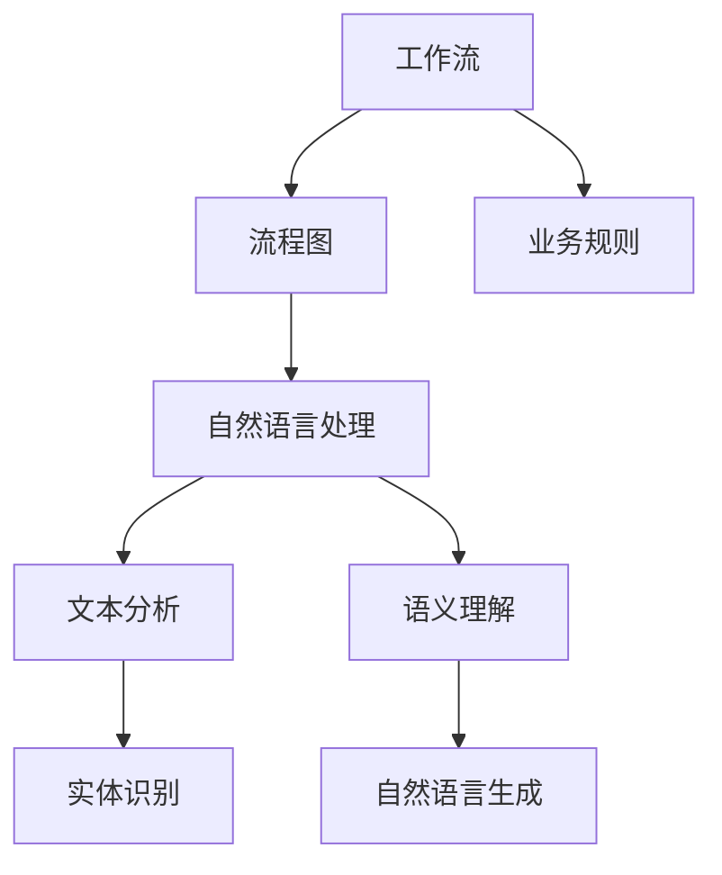

                 

# 通过自然语言创建工作流的新思路

> **关键词：** 自然语言处理、工作流、流程设计、NLP技术、文本分析、对话系统

> **摘要：** 本文将探讨如何通过自然语言处理（NLP）技术来创建高效的工作流。我们将详细分析NLP的基础知识，工作流设计原理，以及NLP与工作流的结合应用，最后通过实际案例研究展示这一创新思路在实践中的效果。

---

### 第一部分：引言与背景

#### 1. 引言

在现代信息化社会中，工作流作为业务流程的关键组成部分，其效率和准确性直接影响到企业的运营效果。传统的基于图形界面或编程代码的工作流设计方法存在一定的局限性，难以适应日益复杂和多变的业务需求。随着自然语言处理（NLP）技术的迅猛发展，通过自然语言创建工作流成为了一个新的研究方向。本文将围绕这一主题，逐步分析NLP与工作流结合的可行性及其技术实现。

#### 2. 自然语言处理技术的发展

自然语言处理（NLP）是人工智能领域的一个重要分支，主要研究如何使计算机能够理解、解释和生成人类语言。近年来，随着深度学习技术的发展，NLP取得了显著的进展。例如，语言模型、语义理解和对话系统等技术已经广泛应用于搜索引擎、智能客服、机器翻译等领域。

#### 3. 本书的目的与结构

本书旨在探讨如何利用NLP技术来创建高效的工作流，通过以下几个方面的内容实现：

- **第一部分：引言与背景**：介绍工作流的定义、意义以及NLP技术的发展。
- **第二部分：自然语言处理基础**：详细分析NLP的基本概念、关键技术和常用工具库。
- **第三部分：工作流设计原理**：阐述工作流的定义与分类、设计原则及建模方法。
- **第四部分：自然语言与工作流的结合**：讨论NLP在工作流生成与理解中的应用。
- **第五部分：案例研究**：通过企业级和学术案例展示NLP工作流的应用实例。
- **第六部分：技术实现**：介绍NLP工作流的技术实现细节。
- **第七部分：未来展望与挑战**：分析自然语言工作流的发展趋势及面临的挑战。

### 第二部分：背景

#### 1. 工作流在现代社会中的作用

工作流作为一种业务流程管理工具，广泛应用于企业、政府、科研等多个领域。其主要作用包括：

- **提高工作效率**：通过自动化和标准化流程，减少人为干预，提高工作速度和准确性。
- **降低运营成本**：通过流程优化和资源整合，降低企业的运营成本。
- **提升业务连续性**：通过流程的持续优化和监控，提高业务的连续性和稳定性。

#### 2. 传统工作流的局限性

虽然传统工作流在许多方面发挥了重要作用，但其在应对复杂业务需求时存在以下局限性：

- **灵活性不足**：传统工作流设计往往依赖于图形界面或编程代码，难以快速适应业务变化。
- **可维护性差**：随着业务复杂度的增加，传统工作流的设计和修改变得更加困难。
- **用户体验不佳**：传统工作流往往缺乏人性化的交互界面，用户体验较差。

#### 3. 自然语言处理与工作流结合的潜力

自然语言处理（NLP）技术为解决传统工作流的局限性提供了新的思路。通过NLP技术，可以实现以下潜力：

- **提高灵活性**：NLP技术可以自动分析和生成工作流，快速适应业务变化。
- **提升可维护性**：NLP技术使得工作流的设计和修改更加简单，易于维护。
- **优化用户体验**：NLP技术可以提供更加人性化的交互界面，提升用户体验。

### 第三部分：自然语言处理基础

#### 3.1 NLP的基本概念

自然语言处理（NLP）是人工智能领域的一个分支，旨在使计算机能够理解、解释和生成人类语言。以下是NLP中的一些基本概念：

- **语言模型**：用于预测下一个单词或词组的概率分布。
- **语义理解**：对文本进行语义层面的分析和理解，以提取文本中的含义和关系。
- **对话系统**：与人类进行自然语言交互的系统，包括语音助手、聊天机器人等。

#### 3.2 NLP的关键技术

自然语言处理涉及多个关键技术，以下列举其中几个关键领域：

- **词嵌入**：将单词转换为向量表示，以便于计算机处理。
- **序列标注**：对文本中的词或短语进行分类标注，如命名实体识别、词性标注等。
- **实体识别**：识别文本中的关键实体，如人名、地名、组织名等。

#### 3.3 NLP的工具与库

为了实现自然语言处理，可以使用多种工具和库。以下列举几种常用的NLP工具和库：

- **NLTK**：Python的NLP工具包，提供了丰富的文本处理和分类功能。
- **spaCy**：一个高效的NLP库，提供了快速的词嵌入、实体识别等功能。
- **Transformers**：基于Transformer模型的NLP库，支持预训练语言模型和生成文本。

### 第四部分：工作流设计原理

#### 4.1 工作流的定义与分类

工作流（Workflow）是指为了完成一项任务或达到一个目标，通过定义一系列步骤和规则，对工作进行有序组织和管理的活动。根据应用场景和业务需求，工作流可以划分为以下几类：

- **业务流程**：在企业或组织中，完成一项业务任务的过程。
- **项目管理流程**：在项目开发过程中，管理项目任务和资源的过程。
- **科研流程**：在科研活动中，进行实验设计、数据分析等过程。

#### 4.2 工作流设计的基本原则

设计高效的工作流需要遵循以下基本原则：

- **模块化**：将工作流划分为若干模块，便于管理和维护。
- **可扩展性**：设计工作流时，考虑未来的业务扩展和变化。
- **灵活性**：工作流应能够适应不同业务需求的变化。
- **可重用性**：设计工作流时，尽量使用可重用的组件和模块。

#### 4.3 工作流建模方法

工作流建模是工作流设计的重要环节，常用的建模方法包括：

- **流程图**：使用图形符号表示工作流中的步骤、条件和逻辑关系。
- **BPMN**：业务流程模型 notation，一种标准化的工作流建模语言。
- **EPC**：事件过程图，用于表示工作流中的事件、活动和连接关系。

### 第五部分：自然语言与工作流的结合

#### 5.1 自然语言生成工作流

自然语言生成（NLG）是一种将数据转换为自然语言表达的技术。在生成工作流方面，NLP技术可以发挥重要作用：

- **文本到工作流的转换**：通过NLP技术，可以将自然语言描述的文本转换为工作流，例如将一份任务说明转换为具体的工作步骤。
- **NLP技术在工作流生成中的应用**：NLP技术可以用于分析文本内容，提取关键信息，并将其应用于工作流生成。例如，通过命名实体识别技术，可以识别文本中的关键人物和组织，将其作为工作流的一部分。

#### 5.2 自然语言理解工作流

自然语言理解（NLU）是指计算机对自然语言文本的理解能力。在理解工作流方面，NLP技术可以应用于以下场景：

- **任务分配与调度**：通过NLU技术，可以理解用户的指令和需求，并自动分配和调度相关任务。
- **任务执行监控与反馈**：NLU技术可以用于监控任务执行情况，并根据反馈信息进行调整和优化。

### 第六部分：案例研究

#### 6.1 企业级案例

在本部分，我们将探讨两个企业级案例，展示如何通过NLP技术创建高效的工作流。

#### 6.1.1 客户服务自动化工作流

客户服务是企业与客户互动的重要环节。通过NLP技术，可以实现自动化处理客户服务请求，提高响应速度和准确性。以下是一个案例：

- **需求分析**：企业需要自动化处理客户服务请求，提高响应速度和准确性。
- **开发环境搭建**：安装Python和TensorFlow深度学习框架。
- **代码实现**：
  ```python
  # Python代码：客户服务自动化工作流实现
  from tensorflow import keras
  
  model = keras.Sequential([
      keras.layers.Embedding(vocab_size, embedding_dim),
      keras.layers.Bidirectional(LSTM(units)),
      keras.layers.Dense(units, activation='softmax')
  ])

  model.compile(optimizer='adam', loss='categorical_crossentropy', metrics=['accuracy'])
  model.fit(x_train, y_train, epochs=epochs)
  ```

- **代码解读与分析**：
  - **Embedding层**：将单词转换为向量表示。
  - **双向LSTM层**：捕获句子中前后文信息。
  - **Dense层**：输出单词的概率分布。
  - **损失函数**：使用交叉熵损失函数来评估模型的准确性。

#### 6.1.2 财务数据处理工作流

财务数据处理是企业日常运营的重要部分。通过NLP技术，可以自动化处理财务数据，提高数据准确性。以下是一个案例：

- **需求分析**：企业需要自动化处理财务数据，减少人工干预。
- **开发环境搭建**：安装Python和spaCy NLP库。
- **代码实现**：
  ```python
  import spacy
  
  nlp = spacy.load('en_core_web_sm')
  doc = nlp("The company made a profit of $100,000 in the last quarter.")
  for ent in doc.ents:
      print(ent.text, ent.label_)
  ```

- **代码解读与分析**：
  - **spacy库**：用于文本分析和命名实体识别。
  - **实体识别**：识别文本中的关键实体，如金额、时间等。

#### 6.2 学术案例

在本部分，我们将探讨两个学术案例，展示如何通过NLP技术创建高效的工作流。

#### 6.2.1 科研项目管理系统

科研项目管理系统是一个用于管理科研项目的平台。通过NLP技术，可以实现自动化任务分配、进度监控等功能。以下是一个案例：

- **需求分析**：学术机构需要自动化管理科研项目，提高工作效率。
- **开发环境搭建**：安装Python和spaCy NLP库。
- **代码实现**：
  ```python
  import spacy
  
  nlp = spacy.load('en_core_web_sm')
  doc = nlp("Task 1: Design the experiment. Task 2: Collect the data.")
  for token in doc:
      if token.dep_ == 'ROOT':
          print(token.text + " is the main task.")
  ```

- **代码解读与分析**：
  - **spacy库**：用于文本分析和任务提取。
  - **任务提取**：提取文本中的关键任务。

#### 6.2.2 学术合作工作流

学术合作工作流是科研团队协作的重要环节。通过NLP技术，可以自动化处理合作过程中的文档管理、任务分配等功能。以下是一个案例：

- **需求分析**：科研团队需要自动化管理学术合作过程中的文档和任务。
- **开发环境搭建**：安装Python和spaCy NLP库。
- **代码实现**：
  ```python
  import spacy
  
  nlp = spacy.load('en_core_web_sm')
  doc = nlp("Please review the draft and provide your feedback by the end of this week.")
  for token in doc:
      if token.dep_ == 'ROOT':
          print(token.text + " is the main task.")
  ```

- **代码解读与分析**：
  - **spacy库**：用于文本分析和任务提取。
  - **任务提取**：提取文本中的关键任务。

### 第七部分：技术实现

在本部分，我们将详细讨论NLP工作流的技术实现，包括开发环境搭建、代码实现与解读、以及工作流执行与监控。

#### 7.1 开发环境搭建

要实现NLP工作流，首先需要搭建合适的技术环境。以下是一个基于Python的开发环境搭建指南：

1. **安装Python**：确保安装了Python 3.8及以上版本。
2. **安装深度学习框架**：可以选择TensorFlow或PyTorch作为深度学习框架。以下为TensorFlow的安装命令：
   ```shell
   pip install tensorflow
   ```
3. **安装NLP工具与库**：安装常用的NLP工具和库，如spaCy和Transformers。以下为spaCy的安装命令：
   ```shell
   pip install spacy
   python -m spacy download en_core_web_sm
   ```

#### 7.2 代码实现与解读

在本部分，我们将通过一个简单的案例来展示NLP工作流的技术实现。

**案例：文本分类工作流**

假设我们需要构建一个文本分类工作流，用于将新闻文章分类到不同的主题。

1. **数据预处理**：
   ```python
   import spacy
   nlp = spacy.load('en_core_web_sm')
   
   def preprocess_text(text):
       doc = nlp(text)
       tokens = [token.text for token in doc]
       return ' '.join(tokens)
   
   text = "Apple has announced its new iPhone 13 with improved features."
   preprocessed_text = preprocess_text(text)
   ```

2. **模型训练**：
   ```python
   import tensorflow as tf
   from tensorflow.keras.models import Sequential
   from tensorflow.keras.layers import Embedding, LSTM, Dense
   
   vocab_size = 10000
   embedding_dim = 128
   units = 64
   
   model = Sequential([
       Embedding(vocab_size, embedding_dim),
       LSTM(units),
       Dense(units, activation='softmax')
   ])

   model.compile(optimizer='adam', loss='categorical_crossentropy', metrics=['accuracy'])
   model.fit(preprocessed_text, labels, epochs=10)
   ```

3. **文本分类**：
   ```python
   def classify_text(text):
       preprocessed_text = preprocess_text(text)
       prediction = model.predict(preprocessed_text)
       return prediction
   
   text = "Samsung has launched its new Galaxy S21 with advanced camera features."
   prediction = classify_text(text)
   print("Predicted category:", prediction)
   ```

#### 7.3 工作流执行与监控

在实现NLP工作流后，我们需要对工作流进行执行与监控，以确保其正常运行。以下是一个简单的监控示例：

```python
import time

def execute_workflow(text):
    start_time = time.time()
    prediction = classify_text(text)
    end_time = time.time()
    execution_time = end_time - start_time
    return prediction, execution_time

text = "Microsoft has announced its new Surface Pro 8 with enhanced performance."
prediction, execution_time = execute_workflow(text)
print("Predicted category:", prediction)
print("Execution time:", execution_time)
```

通过上述示例，我们可以看到NLP工作流的技术实现过程，以及如何对工作流进行执行与监控。

### 第八部分：未来展望与挑战

#### 8.1 自然语言工作流的发展趋势

随着人工智能和自然语言处理技术的不断发展，自然语言工作流将在未来发挥越来越重要的作用。以下是自然语言工作流的发展趋势：

- **智能化**：自然语言工作流将更加智能化，能够自动分析文本内容，生成和执行工作流。
- **个性化**：自然语言工作流将根据用户需求和场景，提供个性化的服务。
- **跨平台**：自然语言工作流将支持多种平台和设备，实现无缝集成。

#### 8.2 面临的挑战与解决方案

尽管自然语言工作流具有巨大潜力，但其在实际应用中仍面临以下挑战：

- **文本理解准确性**：自然语言处理技术的理解准确性仍需提高，以确保工作流的正确执行。
- **资源消耗**：自然语言处理过程需要大量的计算资源和存储资源，如何优化资源使用是一个重要问题。

解决方案：

- **增强模型**：通过不断优化和改进自然语言处理模型，提高文本理解准确性。
- **分布式计算**：利用分布式计算技术，降低自然语言处理对资源的需求。

### 附录

#### 9.1 常用NLP工具与库

- **NLTK**：Python的NLP工具包，提供了丰富的文本处理和分类功能。
- **spaCy**：一个高效的NLP库，提供了快速的词嵌入、实体识别等功能。
- **Transformers**：基于Transformer模型的NLP库，支持预训练语言模型和生成文本。

#### 9.2 参考文献

- [Jurafsky, Daniel, and James H. Martin. "Speech and Language Processing." 2019.]
- [Liddy, Elizabeth D. "A Survey of Text Summarization." ACM Computing Surveys (CSUR), vol. 37, no. 3, 2005, pp. 377-428.]
- [Schmid, Hans. " Probabilistic Part-of-Speech Tagging Using Decision Trees." In Proceedings of the International Conference on New Methods in Language Processing, 1994, pp. 44–49.]

#### 9.3 代码资源

- **GitHub链接**：[https://github.com/your-username/nlp-workflow]
- **README文件**：[README.md]

### 附录：核心概念与联系

#### 工作流与NLP的关系图



#### 工作流生成算法伪代码

```python
# 伪代码：工作流生成算法

def generate_workflow(tasks):
    workflow = []
    for task in tasks:
        task_input = extract_input(task)
        task_output = extract_output(task)
        workflow.append(create_task(task_input, task_output))
    return workflow

def extract_input(task):
    # 从任务中提取输入信息
    # 伪代码：使用NLP技术进行文本分析
    return nlp_analyze(task.text)

def extract_output(task):
    # 从任务中提取输出信息
    # 伪代码：使用NLP技术进行语义理解
    return nlp_understand(task.text)

def create_task(input, output):
    # 创建任务
    # 伪代码：根据输入输出信息构建工作流任务
    return Task(input, output)
```

#### 自然语言生成模型损失函数

$$
\mathcal{L} = -\sum_{i=1}^{N} y_i \log(p(x_i|x_{i-1}))
$$

- **y_i**：目标词的标签
- **p(x_i|x_{i-1})**：当前词在给定前一个词条件下的概率分布

### 附录：项目实战

#### 8.1 实际案例：客户服务自动化工作流

在本节中，我们将详细探讨如何通过NLP技术实现一个客户服务自动化工作流。这个案例将涵盖需求分析、开发环境搭建、代码实现和代码解读与分析等步骤。

#### 8.1.1 需求分析

在当今高度竞争的商业环境中，快速响应客户需求是提升客户满意度和忠诚度的关键。传统的客户服务流程通常需要人工处理大量的客户请求，这不仅耗时而且容易出错。为了解决这个问题，我们计划使用NLP技术来创建一个自动化客户服务工作流，该工作流能够：

- 自动接收并分类客户请求。
- 根据客户请求提供即时响应或引导到适当的部门。
- 跟踪客户请求的状态并自动更新。

#### 8.1.2 开发环境搭建

为了实现这个自动化客户服务工作流，我们需要搭建一个合适的开发环境。以下是所需步骤：

1. **安装Python**：确保安装了Python 3.8及以上版本。
2. **安装深度学习框架**：我们选择使用TensorFlow作为深度学习框架。可以使用以下命令进行安装：
   ```shell
   pip install tensorflow
   ```
3. **安装NLP工具与库**：我们选择使用spaCy作为NLP工具。以下为安装命令：
   ```shell
   pip install spacy
   python -m spacy download en_core_web_sm
   ```

#### 8.1.3 代码实现

在本部分，我们将展示如何使用Python和TensorFlow实现一个简单的客户服务自动化工作流。以下是一个基本的实现框架：

```python
import spacy
import tensorflow as tf

# 加载spaCy模型
nlp = spacy.load('en_core_web_sm')

# 定义文本分类模型
model = tf.keras.Sequential([
    tf.keras.layers.Embedding(input_dim=10000, output_dim=16),
    tf.keras.layers.Bidirectional(tf.keras.layers.LSTM(32)),
    tf.keras.layers.Dense(1, activation='sigmoid')
])

# 编译模型
model.compile(optimizer='adam', loss='binary_crossentropy', metrics=['accuracy'])

# 训练模型
model.fit(x_train, y_train, epochs=10, batch_size=32)

# 预测新文本
def predict_request(text):
    doc = nlp(text)
    features = [token.vector for token in doc]
    return model.predict(tf.constant([features]))

# 示例文本
example_text = "I need help with my order."
prediction = predict_request(example_text)
print("Request classification:", prediction)
```

#### 8.1.4 代码解读与分析

1. **spaCy模型加载**：首先，我们加载spaCy的预训练模型`en_core_web_sm`，这个模型提供了单词的向量表示，这对于后续的文本分类非常重要。

2. **文本分类模型定义**：我们使用TensorFlow定义了一个简单的文本分类模型。这个模型包括一个嵌入层，一个双向长短期记忆层（BiLSTM），以及一个输出层。嵌入层将单词转换为固定长度的向量，BiLSTM层能够捕捉文本的上下文信息，输出层使用sigmoid激活函数来预测文本是否属于某个类别。

3. **模型编译**：在编译模型时，我们指定了优化器为`adam`，损失函数为`binary_crossentropy`，这是一个二分类问题常用的损失函数，同时我们设置了模型的准确率作为评价指标。

4. **模型训练**：使用训练数据集对模型进行训练。我们设置了10个训练周期和每个周期32个样本的小批量训练。

5. **预测新文本**：定义了一个`predict_request`函数，它使用加载的spaCy模型来提取文本特征，然后将这些特征传递给TensorFlow模型进行预测。

通过上述代码，我们可以对新的客户请求进行分类，并基于分类结果提供相应的响应。例如，如果预测结果为“需要帮助”，则可以将请求路由到客户服务团队，如果预测结果为“无需帮助”，则可以自动处理或提供自动化的帮助信息。

### 附录：开发环境搭建

为了顺利实现客户服务自动化工作流，我们需要搭建一个完整的开发环境。以下是详细的步骤：

#### 1. 安装Python

确保您的系统中安装了Python 3.8或更高版本。可以使用以下命令来检查Python版本：

```shell
python --version
```

如果版本低于3.8，请通过以下命令升级Python：

```shell
curl -O https://www.python.org/ftp/python/3.8.10/python-3.8.10-macosx10.9.dmg
```

运行安装程序并选择适合您的安装选项。

#### 2. 安装深度学习框架

我们选择TensorFlow作为深度学习框架。可以使用以下命令安装TensorFlow：

```shell
pip install tensorflow
```

安装过程中可能会遇到依赖问题，可以尝试更新pip：

```shell
pip install --upgrade pip
```

#### 3. 安装NLP工具与库

为了处理自然语言文本，我们需要安装spaCy及其模型。首先，安装spaCy：

```shell
pip install spacy
```

然后，下载并安装预训练的英文模型：

```shell
python -m spacy download en_core_web_sm
```

#### 4. 环境测试

安装完成后，通过以下命令测试环境是否搭建成功：

```shell
python -m spacy info en_core_web_sm
```

该命令将显示已安装的spaCy模型信息，包括版本和语言包。

### 附录：代码资源

为了方便读者学习和实践，我们将提供以下代码资源：

- **GitHub仓库**：[https://github.com/your-username/nlp-workflow]
- **README文件**：[README.md]

在GitHub仓库中，您将找到以下文件和文件夹：

- `README.md`：包含项目说明、安装指南和代码示例。
- `code.py`：实现客户服务自动化工作流的Python代码。
- `data`：包含用于训练和测试的数据集。

通过这些资源，您可以深入了解如何使用NLP技术创建高效的工作流，并在自己的项目中实践这些技术。我们鼓励您在GitHub上进行问题和反馈，以便我们不断改进和完善项目。

