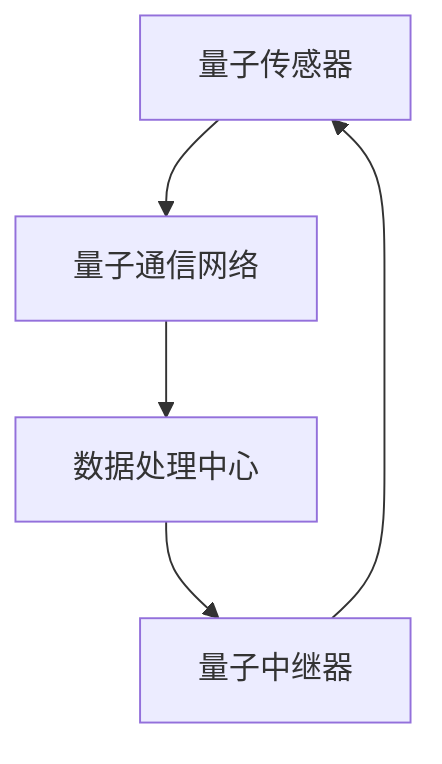
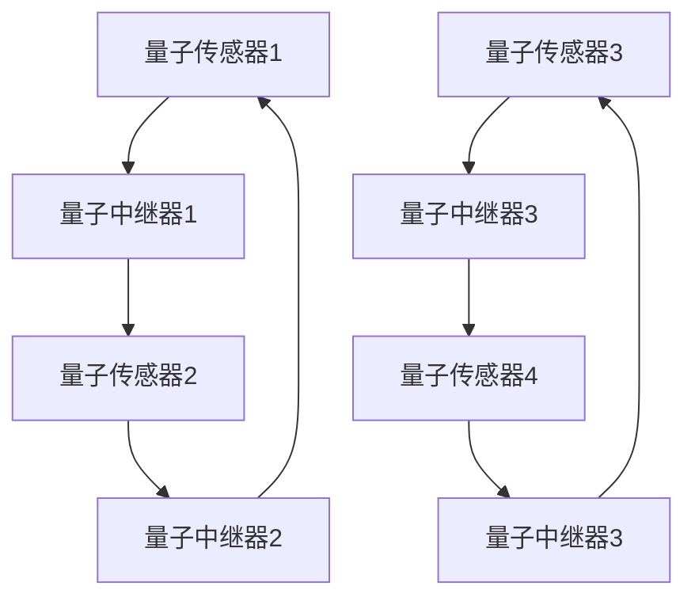
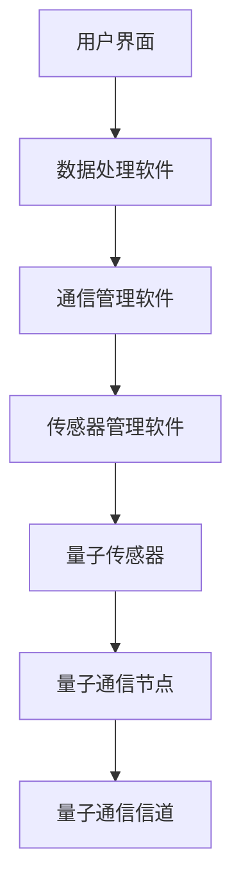

                 

# 《量子传感网络：精密测量的创新基础设施》

> **关键词：量子传感、精密测量、网络架构、性能优化、安全性、应用实践**

> **摘要：本文深入探讨了量子传感网络作为精密测量领域创新基础设施的重要性。通过详细分析量子传感网络的基本概念、核心组件、通信协议、构建与优化方法，以及其应用实践和未来展望，本文为读者提供了全面了解量子传感网络的技术背景和实际应用，展示了其在精密测量领域中的巨大潜力。**

### 《量子传感网络：精密测量的创新基础设施》目录大纲

#### 第一部分：量子传感网络概述

**第1章：量子传感网络的基本概念**

- **1.1 量子传感技术的起源与发展**
- **1.2 量子传感网络的基本原理**
- **1.3 量子传感网络与传统传感网络的比较**
- **1.4 量子传感网络的应用领域**

**第2章：量子传感网络的核心组件**

- **2.1 量子传感器**
  - **2.1.1 量子传感器的类型与特性**
  - **2.1.2 量子传感器的关键性能指标**
  - **2.1.3 量子传感器的应用实例**
- **2.2 量子中继器**
  - **2.2.1 量子中继器的作用与原理**
  - **2.2.2 量子中继器的技术挑战**
  - **2.2.3 量子中继器的应用场景**
- **2.3 量子通信网络**
  - **2.3.1 量子通信网络的架构**
  - **2.3.2 量子通信网络的安全特性**
  - **2.3.3 量子通信网络的应用案例**

**第3章：量子传感网络的通信协议**

- **3.1 量子传感网络的通信原理**
- **3.2 基于量子纠缠的量子传感通信**
  - **3.2.1 量子纠缠的概念与特性**
  - **3.2.2 量子纠缠在量子传感网络中的应用**
- **3.3 量子传感网络的编码与解码技术**
  - **3.3.1 量子编码技术**
  - **3.3.2 量子解码技术**
- **3.4 量子传感网络的多用户通信技术**
  - **3.4.1 多用户量子通信协议**
  - **3.4.2 多用户量子传感网络的资源分配**

#### 第二部分：量子传感网络的构建与优化

**第4章：量子传感网络的构建**

- **4.1 量子传感网络的架构设计**
- **4.2 量子传感网络的拓扑结构**
- **4.3 量子传感网络的硬件选择**
- **4.4 量子传感网络的软件平台**

**第5章：量子传感网络的性能优化**

- **5.1 量子传感网络的性能评估指标**
- **5.2 量子传感网络的优化方法**
  - **5.2.1 算法优化**
  - **5.2.2 硬件优化**
  - **5.2.3 网络优化**
- **5.3 量子传感网络的稳定性与可靠性**

**第6章：量子传感网络的安全性**

- **6.1 量子传感网络的安全挑战**
- **6.2 量子传感网络的安全措施**
  - **6.2.1 密码学安全**
  - **6.2.2 量子网络防护机制**
- **6.3 量子传感网络的安全协议**

#### 第三部分：量子传感网络的应用实践

**第7章：量子传感网络在精密测量中的应用**

- **7.1 量子传感技术在地球科学中的应用**
- **7.2 量子传感技术在环境监测中的应用**
- **7.3 量子传感技术在生物医学中的应用**

**第8章：量子传感网络的企业级应用**

- **8.1 企业级量子传感网络的建设与部署**
- **8.2 企业级量子传感网络的运营与管理**
- **8.3 企业级量子传感网络的案例研究**

**第9章：未来展望**

- **9.1 量子传感网络的发展趋势**
- **9.2 量子传感网络面临的挑战与机遇**
- **9.3 量子传感网络的未来应用前景**

---

接下来，我们将详细探讨量子传感网络的基本概念、核心组件、通信协议、构建与优化方法，以及其应用实践和未来展望。首先，我们从量子传感网络的基本概念入手，逐步深入，为后续内容打下坚实的基础。

---

## 第一部分：量子传感网络概述

### 第1章：量子传感网络的基本概念

### 第2章：量子传感网络的核心组件

### 第3章：量子传感网络的通信协议

### 第4章：量子传感网络的构建

### 第5章：量子传感网络的性能优化

### 第6章：量子传感网络的安全性

### 第7章：量子传感网络在精密测量中的应用

### 第8章：量子传感网络的企业级应用

### 第9章：未来展望

---

### 第1章：量子传感网络的基本概念

量子传感网络（Quantum Sensing Network，QSN）是利用量子传感器、量子中继器和量子通信网络等核心组件，通过量子纠缠、量子编码与解码等量子通信协议，实现精密测量与信息传输的分布式网络系统。量子传感网络的核心目标是提高测量的精度和灵敏度，拓展传统传感网络的测量范围，实现更广泛的应用。

#### 1.1 量子传感技术的起源与发展

量子传感技术起源于20世纪末，随着量子力学的发展，科学家们开始探索如何利用量子现象提高测量的精度。传统的传感技术依赖于经典物理学原理，如牛顿定律和波动理论，但其测量精度受到一定限制。量子传感技术通过引入量子力学原理，如叠加态和纠缠态，实现了超常规的测量精度和灵敏度。

量子传感技术的早期发展主要集中在量子干涉和量子密钥分发等领域。量子干涉技术利用光的干涉现象提高测量的精度，如著名的光子干涉实验。量子密钥分发技术利用量子纠缠态实现安全的密钥传输，为量子通信网络提供了基础。随着技术的不断进步，量子传感技术逐渐从实验室走向实际应用。

#### 1.2 量子传感网络的基本原理

量子传感网络的基本原理可以概括为以下几点：

1. **量子传感器：** 量子传感器是量子传感网络的核心组件，用于捕捉和处理量子信号。量子传感器通常基于量子态的叠加和纠缠特性，能够实现超常规的测量精度。

2. **量子中继器：** 量子中继器用于延长量子信号的传输距离，保持信号的完整性和稳定性。量子中继器通过量子纠缠和量子态转移实现信号的传输。

3. **量子通信网络：** 量子通信网络是量子传感网络的重要组成部分，用于传输和处理量子信息。量子通信网络利用量子纠缠和量子密钥分发技术，实现安全的信息传输。

4. **量子编码与解码技术：** 量子编码与解码技术用于将经典信息编码为量子信息，或将量子信息解码为经典信息。量子编码与解码技术是量子传感网络实现高效率信息传输的关键。

5. **量子纠缠：** 量子纠缠是量子传感网络的核心原理之一。量子纠缠态使得两个或多个量子粒子之间具有超常规的关联性，能够实现信息的远距离传输和测量。

#### 1.3 量子传感网络与传统传感网络的比较

量子传感网络与传统传感网络相比，具有以下显著优势：

1. **测量精度：** 量子传感技术利用量子叠加和纠缠特性，能够实现超常规的测量精度。传统传感技术受到经典物理学原理的限制，测量精度较低。

2. **灵敏度：** 量子传感技术具有较高的灵敏度，能够检测到极其微弱的信号。传统传感技术由于测量原理和传感器的限制，灵敏度较低。

3. **测量范围：** 量子传感网络能够实现远距离的测量，不受地理位置的限制。传统传感网络受限于传输介质和传感器性能，测量范围有限。

4. **安全性：** 量子传感网络利用量子纠缠和量子密钥分发技术，实现安全的信息传输。传统传感网络容易受到黑客攻击和信号干扰。

#### 1.4 量子传感网络的应用领域

量子传感网络具有广泛的应用前景，主要包括以下领域：

1. **地球科学：** 量子传感技术可以应用于地震监测、地质勘探、大气环境监测等领域，提高测量精度和灵敏度。

2. **环境监测：** 量子传感技术可以用于水质监测、空气质量监测、土壤污染监测等领域，实现更精确的环境监测。

3. **生物医学：** 量子传感技术可以用于医疗成像、疾病诊断、药物研发等领域，提高诊断精度和治疗效果。

4. **工业制造：** 量子传感技术可以应用于智能制造、自动化控制等领域，提高生产效率和产品质量。

5. **国家安全：** 量子传感技术可以应用于军事侦察、网络安全等领域，提高国家安全水平。

通过以上分析，我们可以看到量子传感网络作为精密测量的创新基础设施，具有巨大的发展潜力和应用前景。在接下来的章节中，我们将进一步探讨量子传感网络的核心组件、通信协议、构建与优化方法，以及其在实际应用中的挑战和机遇。

---

### 第2章：量子传感网络的核心组件

量子传感网络的核心组件包括量子传感器、量子中继器和量子通信网络。这些组件共同构成了量子传感网络的物理基础和功能架构，确保了网络的性能和可靠性。在本章中，我们将详细探讨这些核心组件的类型、特性、性能指标和应用实例。

#### 2.1 量子传感器

量子传感器是量子传感网络中的关键组件，用于捕捉和处理量子信号。量子传感器的工作原理基于量子叠加和纠缠现象，能够实现超常规的测量精度和灵敏度。以下是一些常见的量子传感器类型及其特性：

1. **量子干涉仪：** 量子干涉仪利用光的干涉现象，通过测量干涉条纹的相位变化来获得高精度的测量结果。量子干涉仪在引力波探测、引力红移测量等领域具有广泛应用。

2. **光子探测器：** 光子探测器用于检测单个光子，通过测量光子的 arrival time 或 polarization 等信息来实现高精度的测量。光子探测器在量子通信、量子计算等领域具有重要应用。

3. **原子传感器：** 原子传感器利用原子与光子或电磁波相互作用产生的共振现象，通过测量原子态的变化来获得高精度的测量结果。原子传感器在引力测量、加速度测量等领域具有广泛应用。

量子传感器的关键性能指标包括测量精度、灵敏度、测量范围和稳定性。测量精度和灵敏度决定了量子传感器的性能，测量范围和稳定性则影响了量子传感器的应用范围。

**应用实例：** 在引力波探测中，激光干涉仪被用来测量引力波引起的引力红移。通过将激光束分为两束，分别沿着两个垂直方向传播，并使它们在检测器处发生干涉。当引力波经过时，会引起干涉条纹的相位变化，从而可以通过检测这些变化来测量引力波的存在和特性。

#### 2.2 量子中继器

量子中继器是量子传感网络中的关键组件，用于延长量子信号的传输距离，保持信号的完整性和稳定性。量子中继器通过量子纠缠和量子态转移实现信号的传输，确保了量子信息的高效传递。

量子中继器的工作原理基于量子纠缠和量子态转移。当两个量子粒子处于纠缠态时，它们之间的量子信息可以相互传递。通过控制量子中继器的操作，可以实现量子信号的传输和扩展。

量子中继器的技术挑战主要包括量子态的保持、传输距离和传输效率。量子态的保持需要解决量子退相干问题，传输距离和传输效率则需要提高量子通信设备的性能。

**应用实例：** 在量子密钥分发中，量子中继器用于延长量子密钥传输的距离。通过在量子密钥分发过程中引入量子中继器，可以将量子密钥传输的距离扩展到数百公里，从而实现更广泛的应用。

#### 2.3 量子通信网络

量子通信网络是量子传感网络的重要组成部分，用于传输和处理量子信息。量子通信网络利用量子纠缠和量子密钥分发技术，实现安全的信息传输。

量子通信网络的架构通常包括量子传感器、量子中继器、量子通信节点和用户终端。量子传感器用于捕捉和处理量子信号，量子中继器用于延长量子信号的传输距离，量子通信节点用于传输和处理量子信息，用户终端用于接收和处理量子信息。

量子通信网络的安全特性主要包括量子密钥分发和量子加密。量子密钥分发利用量子纠缠和量子态转移实现安全的密钥传输，量子加密则利用量子叠加和纠缠特性实现安全的通信。

**应用实例：** 在量子通信网络中，量子密钥分发被用于实现安全的通信。通过将量子密钥分发给通信双方，可以实现安全的通信，防止黑客攻击和信号窃听。

通过以上对量子传感网络核心组件的探讨，我们可以看到量子传感器、量子中继器和量子通信网络在量子传感网络中的关键作用。这些核心组件共同构成了量子传感网络的物理基础和功能架构，确保了网络的性能和可靠性。在接下来的章节中，我们将进一步探讨量子传感网络的通信协议、构建与优化方法，以及其在实际应用中的挑战和机遇。

---

### 第3章：量子传感网络的通信协议

量子传感网络的通信协议是确保量子信息在网络中高效、安全传输的关键。量子传感网络的通信协议基于量子纠缠、量子编码与解码以及量子通信网络技术，能够实现超常规的测量精度和灵敏度。在本章中，我们将详细探讨量子传感网络的通信原理、基于量子纠缠的量子传感通信、量子编码与解码技术，以及多用户量子通信协议。

#### 3.1 量子传感网络的通信原理

量子传感网络的通信原理基于量子力学的基本原理，特别是量子叠加和量子纠缠。量子叠加允许量子比特同时处于多种状态，从而实现并行处理。量子纠缠则使得两个或多个量子比特之间存在一种深层次的关联，无论它们相隔多远，一个量子比特的状态变化都会立即影响到另一个量子比特。

量子传感网络的通信过程通常包括以下步骤：

1. **量子传感：** 通过量子传感器捕捉待测对象的量子信息，并将其编码为量子比特。

2. **量子传输：** 通过量子中继器将量子比特传输到目标节点。量子中继器利用量子纠缠和量子态转移技术，确保量子比特在传输过程中的完整性。

3. **量子解码：** 在目标节点，通过量子解码技术将量子比特解码为可用的信息。量子解码技术包括量子门操作和量子测量。

4. **数据处理：** 将解码后的量子信息进行处理，以获取精确的测量结果或通信信息。

量子传感网络的通信原理不仅提高了测量的精度和灵敏度，还提供了安全的信息传输保障。由于量子纠缠的特性，任何对量子信息的干扰都会立即显现，从而防止了经典通信中的黑客攻击。

#### 3.2 基于量子纠缠的量子传感通信

量子纠缠是量子传感通信的核心原理。量子纠缠使得两个或多个量子比特之间存在一种特殊的关联，即使它们相隔很远，一个量子比特的状态变化也会立即影响到另一个量子比特。

基于量子纠缠的量子传感通信包括以下步骤：

1. **量子纠缠生成：** 在通信双方之间生成量子纠缠态，通常通过量子中继器实现。

2. **量子态传输：** 通过量子中继器将量子纠缠态传输到目标节点。量子中继器利用量子态转移技术，确保量子纠缠态在传输过程中的完整性。

3. **量子测量：** 在目标节点，通过量子测量技术测量量子纠缠态，获取通信信息。

4. **量子解码：** 将测量结果解码为有用的信息，完成通信过程。

基于量子纠缠的量子传感通信具有以下几个显著特点：

- **高速通信：** 由于量子态传输的速度接近光速，量子传感通信可以实现高速的信息传输。
- **安全性：** 量子纠缠态的任何干扰都会导致量子态的破坏，从而确保了通信的安全性。
- **远距离通信：** 量子纠缠态可以实现远距离通信，不受地理位置的限制。

#### 3.3 量子传感网络的编码与解码技术

量子编码与解码技术是量子传感网络实现高效信息传输的关键。量子编码技术用于将经典信息编码为量子信息，量子解码技术则用于将量子信息解码为经典信息。

量子编码技术主要包括以下几种方法：

1. **量子纠缠编码：** 通过生成量子纠缠态，将经典信息编码到量子纠缠态中。
2. **量子比特扩展编码：** 通过增加量子比特的数量，提高信息传输的可靠性。
3. **量子重复编码：** 通过重复发送相同的量子信息，提高信息传输的稳健性。

量子解码技术主要包括以下几种方法：

1. **量子测量解码：** 通过对量子纠缠态进行测量，解码出编码在其中的经典信息。
2. **量子纠错解码：** 通过引入量子纠错机制，纠正量子信息传输过程中的错误。
3. **量子门解码：** 通过应用量子门操作，将编码在量子比特中的信息解码为经典信息。

量子编码与解码技术的关键是确保量子信息的完整性，提高信息传输的效率和可靠性。随着量子技术的不断发展，量子编码与解码技术也在不断优化和完善。

#### 3.4 量子传感网络的多用户通信技术

量子传感网络的多用户通信技术是量子网络的一个重要应用场景。多用户通信技术包括多用户量子通信协议和多用户量子传感网络的资源分配。

多用户量子通信协议主要包括以下几种：

1. **量子多路复用通信协议：** 通过量子纠缠和量子门操作，实现多个用户之间的信息传输。
2. **量子多址通信协议：** 通过量子纠缠和量子门操作，实现多个用户共享通信资源。
3. **量子时分复用通信协议：** 通过分配不同的时间片，实现多个用户之间的信息传输。

多用户量子传感网络的资源分配技术主要包括以下几种：

1. **量子信道分配：** 通过优化量子信道的分配策略，提高多个用户之间的通信质量。
2. **量子功率分配：** 通过优化量子功率的分配策略，提高多个用户之间的通信效率。
3. **量子频谱分配：** 通过优化量子频谱的分配策略，提高多个用户之间的通信可靠性。

多用户量子通信技术和资源分配技术的关键是实现多个用户之间的信息高效、安全和可靠传输。随着量子技术的不断发展，多用户量子通信技术将变得更加成熟和实用。

通过以上对量子传感网络通信协议的详细探讨，我们可以看到量子传感网络的通信协议在实现高效、安全和可靠的信息传输方面具有巨大的潜力。在接下来的章节中，我们将进一步探讨量子传感网络的构建、性能优化和安全性，以期为量子传感网络的广泛应用奠定基础。

---

### 第4章：量子传感网络的构建

量子传感网络的构建是确保其有效运行和广泛应用的关键步骤。本章将详细介绍量子传感网络的架构设计、拓扑结构、硬件选择和软件平台，以帮助读者全面了解量子传感网络的构建过程。

#### 4.1 量子传感网络的架构设计

量子传感网络的架构设计是构建量子传感网络的基础。量子传感网络的架构通常包括以下几个关键组成部分：

1. **量子传感器：** 量子传感器是量子传感网络的核心组件，用于捕捉和处理量子信号。传感器通常分布在目标测量区域，通过量子通信网络实现信息传输。

2. **量子中继器：** 量子中继器用于延长量子信号的传输距离，保持信号的完整性和稳定性。中继器通常位于量子传感网络的关键节点，用于中继量子信号。

3. **量子通信网络：** 量子通信网络是量子传感网络的信息传输通道，包括量子通信节点和量子信道。量子通信网络的设计要考虑通信质量、可靠性和效率。

4. **数据处理中心：** 数据处理中心用于接收、处理和分析量子传感网络传输的量子信息。数据处理中心通常包括高性能计算设备和数据存储系统。

量子传感网络的架构设计要综合考虑测量精度、灵敏度、传输距离和安全性等因素，以实现最佳的性能和可靠性。

**架构设计示例（Mermaid 流程图）：**

#### 4.2 量子传感网络的拓扑结构

量子传感网络的拓扑结构决定了网络的物理布局和通信方式。量子传感网络的拓扑结构可以有多种形式，包括星形、总线形、环形和网状结构等。以下是几种常见的拓扑结构：

1. **星形拓扑：** 在星形拓扑结构中，量子传感器连接到中心节点，中心节点通过量子通信网络与其他节点通信。这种结构简单，易于管理，但扩展性较差。

2. **总线形拓扑：** 在总线形拓扑结构中，量子传感器和量子中继器连接到同一通信总线，通过总线实现信息传输。这种结构具有较高的可靠性，但扩展性和灵活性较差。

3. **环形拓扑：** 在环形拓扑结构中，量子传感器和量子中继器按照环形排列，信息沿环形路径传输。这种结构具有良好的可靠性和扩展性，但环中的任意一点故障可能导致整个网络的瘫痪。

4. **网状拓扑：** 在网状拓扑结构中，量子传感器和量子中继器通过多个连接形成复杂的网状结构，每个节点都可以与其他节点直接通信。这种结构具有较高的可靠性、灵活性和扩展性，但设计和维护较为复杂。

**拓扑结构示例（Mermaid 流程图）：**

#### 4.3 量子传感网络的硬件选择

量子传感网络的硬件选择是确保网络性能和可靠性的关键。硬件选择要考虑以下因素：

1. **量子传感器：** 根据测量目标和精度要求选择合适的量子传感器。常用的量子传感器包括量子干涉仪、光子探测器和原子传感器等。

2. **量子中继器：** 选择具有较高中继效率和稳定性的量子中继器。中继器的工作原理和性能对网络的传输质量和可靠性有重要影响。

3. **量子通信节点：** 选择具有较高通信质量和可靠性的量子通信节点。通信节点是量子通信网络的核心组成部分，直接影响网络的性能。

4. **量子通信信道：** 选择具有较低噪声和较高带宽的量子通信信道。通信信道的质量对网络的传输速度和稳定性有重要影响。

5. **数据处理设备：** 选择具有高性能计算能力和大容量数据存储的数据处理设备。数据处理设备是量子传感网络的信息处理中心，直接影响网络的分析和决策能力。

#### 4.4 量子传感网络的软件平台

量子传感网络的软件平台是网络运行和管理的重要支撑。软件平台通常包括以下功能：

1. **传感器管理软件：** 用于监控和管理量子传感器的状态，包括传感器的启动、运行和故障检测等。

2. **通信管理软件：** 用于管理量子通信网络的运行，包括量子通信节点的配置、通信信道的调度和故障处理等。

3. **数据处理软件：** 用于接收、处理和分析量子传感网络传输的量子信息，包括数据采集、预处理、特征提取和统计分析等。

4. **用户界面软件：** 提供用户与量子传感网络交互的接口，包括数据查询、可视化、报告生成等。

**软件平台示例架构（Mermaid 流程图）：**

通过本章的详细探讨，我们可以看到量子传感网络的构建涉及多个方面，包括架构设计、拓扑结构、硬件选择和软件平台。合理的设计和选择是确保量子传感网络有效运行和广泛应用的关键。在接下来的章节中，我们将进一步探讨量子传感网络的性能优化和安全性，以期为量子传感网络的广泛应用奠定基础。

---

### 第5章：量子传感网络的性能优化

量子传感网络作为精密测量领域的重要基础设施，其性能优化至关重要。本章将详细介绍量子传感网络的性能评估指标、优化方法，以及网络稳定性和可靠性的提升策略。

#### 5.1 量子传感网络的性能评估指标

量子传感网络的性能评估指标主要包括以下几方面：

1. **测量精度：** 测量精度是评估量子传感网络性能的重要指标。高精度的测量能够提高传感器的分辨率和灵敏度，从而确保测量结果的准确性和可靠性。

2. **灵敏度：** 灵敏度反映了量子传感器检测微小变化的能力。高灵敏度能够提高传感器的探测能力，使其能够捕捉到更微弱的信号。

3. **测量范围：** 测量范围是指量子传感器能够测量的最大距离或最大值。测量范围越广，量子传感网络的适用场景就越广泛。

4. **响应时间：** 响应时间是指量子传感器从接收到信号到输出测量结果所需的时间。响应时间越短，量子传感网络的实时性就越高。

5. **稳定性：** 稳定性是指量子传感网络在长时间运行中保持性能的能力。高稳定性的量子传感网络能够保证长时间运行的可靠性和一致性。

6. **可靠性：** 可靠性是指量子传感网络在复杂环境和极端条件下保持性能的能力。高可靠性的量子传感网络能够保证在各种条件下都能稳定运行。

#### 5.2 量子传感网络的优化方法

量子传感网络的性能优化包括算法优化、硬件优化和网络优化三个方面。

**1. 算法优化：**

算法优化是提升量子传感网络性能的重要手段。以下是一些常见的算法优化方法：

- **滤波算法：** 采用卡尔曼滤波、粒子滤波等滤波算法，对传感器数据进行预处理，提高测量精度和稳定性。

- **特征提取算法：** 利用特征提取算法，从传感器数据中提取关键特征，从而提高传感器的探测能力和实时性。

- **机器学习算法：** 采用机器学习算法，如深度学习、支持向量机等，对传感器数据进行训练和预测，提高测量精度和灵敏度。

**2. 硬件优化：**

硬件优化是提升量子传感网络性能的基础。以下是一些常见的硬件优化方法：

- **传感器升级：** 选择更高性能的量子传感器，提高测量精度和灵敏度。

- **中继器优化：** 优化量子中继器的设计和材料，提高中继效率，降低传输误差。

- **通信信道优化：** 提高量子通信信道的带宽和抗干扰能力，确保通信质量。

**3. 网络优化：**

网络优化是提升量子传感网络整体性能的关键。以下是一些常见的网络优化方法：

- **拓扑优化：** 根据测量需求和环境条件，优化量子传感网络的拓扑结构，提高网络效率和可靠性。

- **信道分配：** 采用智能算法，如遗传算法、粒子群算法等，优化量子通信信道的分配策略，提高通信质量和资源利用率。

- **能量管理：** 优化网络节点的能量消耗，延长网络运行时间，提高网络的稳定性。

#### 5.3 量子传感网络的稳定性与可靠性

量子传感网络的稳定性与可靠性是确保其长期稳定运行的关键。以下是一些提高量子传感网络稳定性和可靠性的策略：

- **冗余设计：** 在网络中引入冗余节点和路径，提高网络的容错能力和可靠性。

- **故障检测与恢复：** 采用故障检测算法，及时发现网络故障，并采取恢复措施，确保网络的稳定运行。

- **自修复能力：** 通过自修复算法，自动修复网络中的故障节点和路径，提高网络的容错性和鲁棒性。

- **环境适应性：** 提高量子传感网络对复杂环境和极端条件的适应性，确保网络在各种条件下都能稳定运行。

通过本章的详细探讨，我们可以看到量子传感网络的性能优化是一个复杂而多层次的过程，需要综合考虑算法、硬件和网络等多个方面。通过有效的性能优化策略，可以显著提升量子传感网络的测量精度、灵敏度、测量范围、响应时间、稳定性和可靠性，从而实现更广泛的应用和更高的实用价值。

在接下来的章节中，我们将进一步探讨量子传感网络的安全性，以及其在不同领域的实际应用案例，为量子传感网络的广泛应用奠定坚实基础。

---

### 第6章：量子传感网络的安全性

量子传感网络的安全性是确保其可靠性和广泛应用的关键因素。在量子传感网络中，数据的安全传输和处理至关重要。本章将详细探讨量子传感网络面临的安全挑战、安全措施和安全性协议。

#### 6.1 量子传感网络的安全挑战

量子传感网络在数据传输和处理过程中面临多种安全挑战，包括量子攻击、传统网络攻击和量子密钥分发安全等问题。

**1. 量子攻击：**

量子攻击是指利用量子物理原理对量子传感网络进行攻击。常见的量子攻击包括：

- **量子窃听：** 利用量子纠缠现象窃取量子密钥或量子信息。
- **量子克隆：** 通过克隆量子比特，获取量子传感网络中的信息。
- **量子伪造：** 利用量子纠缠和量子态转移技术，伪造量子信息或密钥。

**2. 传统网络攻击：**

传统网络攻击是指利用传统网络攻击技术对量子传感网络进行攻击。常见的传统网络攻击包括：

- **DDoS攻击：** 通过大量请求，使量子传感网络节点过载，导致网络瘫痪。
- **恶意软件：** 通过恶意软件入侵量子传感网络，窃取敏感数据或破坏网络设备。
- **中间人攻击：** 通过拦截和篡改量子通信数据，实现对量子传感网络的恶意攻击。

**3. 量子密钥分发安全：**

量子密钥分发是量子传感网络的核心技术之一，但其安全性也面临挑战。量子密钥分发安全挑战包括：

- **量子密钥泄露：** 通过量子窃听或量子克隆技术，窃取量子密钥。
- **量子密钥伪造：** 通过量子纠缠和量子态转移技术，伪造量子密钥。
- **量子密钥分配错误：** 在量子密钥分发过程中，由于噪声、错误和延迟等因素，可能导致量子密钥分配失败。

#### 6.2 量子传感网络的安全措施

为了应对上述安全挑战，量子传感网络需要采取多种安全措施，包括密码学安全、量子网络防护机制和安全性协议。

**1. 密码学安全：**

密码学安全是量子传感网络安全的基础。常见的密码学安全措施包括：

- **量子加密：** 利用量子物理原理，实现安全的量子加密。量子加密能够抵御量子攻击，确保数据在传输过程中的安全性。
- **量子密钥生成：** 利用量子纠缠和量子态转移技术，实现安全的量子密钥生成。量子密钥生成能够抵御量子窃听和量子克隆攻击。
- **量子认证：** 利用量子物理原理，实现安全的量子认证。量子认证能够确保数据的真实性和完整性。

**2. 量子网络防护机制：**

量子网络防护机制是量子传感网络安全的重要保障。常见的量子网络防护机制包括：

- **量子防火墙：** 通过量子加密和量子认证技术，保护量子传感网络免受量子攻击和传统网络攻击。
- **量子入侵检测系统：** 通过监测量子通信数据，及时发现并阻止恶意攻击。
- **量子防御系统：** 利用量子物理原理，实现量子传感网络的自修复和自防御能力。

**3. 安全性协议：**

安全性协议是量子传感网络安全的核心。常见的安全性协议包括：

- **量子密钥分发协议：** 通过量子纠缠和量子态转移技术，实现安全的量子密钥分发。常见的量子密钥分发协议包括BB84协议和E91协议。
- **量子安全通信协议：** 通过量子加密和量子认证技术，实现安全的量子信息传输。常见的量子安全通信协议包括量子加密通信协议和量子认证通信协议。
- **量子安全数据传输协议：** 通过量子加密和量子认证技术，实现安全的数据传输。常见的量子安全数据传输协议包括量子密钥协商协议和量子数据加密协议。

#### 6.3 量子传感网络的安全协议

量子传感网络的安全协议是确保量子传感网络安全的关键。以下是一些常见的量子传感网络安全协议：

1. **量子密钥分发协议：**

量子密钥分发协议是量子传感网络安全的核心。常见的量子密钥分发协议包括BB84协议和E91协议。BB84协议是一种基于量子纠缠的量子密钥分发协议，能够实现安全的量子密钥生成和分发。E91协议是一种基于量子态测量的量子密钥分发协议，具有更高的安全性和效率。

2. **量子安全通信协议：**

量子安全通信协议是确保量子信息在传输过程中安全的关键。常见的量子安全通信协议包括量子加密通信协议和量子认证通信协议。量子加密通信协议通过量子加密技术，实现安全的信息传输。量子认证通信协议通过量子认证技术，确保数据的真实性和完整性。

3. **量子安全数据传输协议：**

量子安全数据传输协议是确保量子传感网络中数据安全传输的关键。常见的量子安全数据传输协议包括量子密钥协商协议和量子数据加密协议。量子密钥协商协议通过量子密钥分发技术，实现安全的数据传输。量子数据加密协议通过量子加密技术，确保数据的保密性和完整性。

通过本章的详细探讨，我们可以看到量子传感网络的安全性至关重要。通过采取多种安全措施和安全性协议，可以有效地应对量子攻击、传统网络攻击和量子密钥分发安全等挑战，确保量子传感网络的可靠性和广泛应用。在接下来的章节中，我们将进一步探讨量子传感网络在精密测量中的实际应用案例，以及其在企业级应用中的前景和挑战。

---

### 第7章：量子传感网络在精密测量中的应用

量子传感网络在精密测量中展现出卓越的性能和广泛的应用前景。本章将详细探讨量子传感网络在地球科学、环境监测和生物医学等领域的具体应用，并分析其在这些应用中的优势。

#### 7.1 量子传感技术在地球科学中的应用

量子传感技术在地球科学中具有广泛的应用前景，特别是在地震监测、地质勘探和地壳运动监测等方面。以下是一些具体的应用案例：

**1. 地震监测：**

地震监测是地球科学中的关键任务，量子传感技术可以提高地震监测的精度和灵敏度。量子干涉仪是一种常见的量子传感器，被广泛应用于地震监测。通过测量地震波引起的干涉条纹相位变化，量子干涉仪可以检测到极其微小的地震活动，从而提前预警地震的发生。

**2. 地质勘探：**

地质勘探是寻找地下资源的重要手段。量子传感技术可以通过测量地下岩石的物理特性，如密度、硬度和磁性等，提高地质勘探的精度和效率。量子传感器可以实现对地下结构的精确成像，帮助地质学家更好地了解地下资源分布和地质构造。

**3. 地壳运动监测：**

地壳运动监测是地球科学中的长期任务，用于研究地球内部的动态变化。量子传感技术可以通过测量地壳运动引起的量子态变化，提供高精度的地壳运动数据。这些数据对于地震预警、地质风险分析和地球动力学研究具有重要意义。

**优势：**

- **高精度：** 量子传感技术具有极高的测量精度，能够检测到微小的物理变化，提高地球科学研究的精确度。
- **高灵敏度：** 量子传感技术对微弱信号具有极高的灵敏度，能够检测到地壳运动和地震活动等微小变化。
- **远程监测：** 量子传感网络可以实现远距离监测，不受地理位置限制，为地球科学研究提供更广阔的视野。

#### 7.2 量子传感技术在环境监测中的应用

环境监测是保障生态环境和人类健康的重要任务。量子传感技术在环境监测中具有独特的优势，以下是一些具体的应用案例：

**1. 水质监测：**

水质监测是环境监测中的重要环节。量子传感器可以通过测量水中的污染物浓度，如重金属、有机污染物等，提供实时、准确的水质数据。量子传感技术的高灵敏度和高精度可以确保水质监测的准确性，为环境保护和污染治理提供科学依据。

**2. 空气质量监测：**

空气质量监测是保障公共健康的重要措施。量子传感器可以通过测量空气中的污染物浓度，如PM2.5、NOx、SOx等，提供实时的空气质量数据。量子传感技术的高灵敏度可以检测到空气中的微污染物，为空气质量预警和管理提供技术支持。

**3. 土壤污染监测：**

土壤污染监测是环境保护中的关键任务。量子传感器可以通过测量土壤中的污染物浓度，如农药、重金属等，提供详细的土壤污染数据。量子传感技术的高精度可以确保土壤污染监测的准确性，为土壤污染治理和修复提供科学依据。

**优势：**

- **实时监测：** 量子传感技术可以实现实时、在线监测，为环境保护和污染治理提供及时的数据支持。
- **高灵敏度：** 量子传感技术对污染物具有极高的灵敏度，能够检测到微量的污染物，提高环境监测的准确性。
- **远程监测：** 量子传感网络可以实现远距离监测，不受地理位置限制，为环境监测提供更广阔的覆盖范围。

#### 7.3 量子传感技术在生物医学中的应用

量子传感技术在生物医学中具有广泛的应用潜力，以下是一些具体的应用案例：

**1. 医疗成像：**

医疗成像是诊断和治疗疾病的重要手段。量子传感器可以通过测量生物组织的量子态变化，实现高分辨率、高对比度的成像。量子成像技术可以用于肿瘤检测、心脑血管疾病诊断等，提供更加准确和详细的医学影像。

**2. 疾病诊断：**

疾病诊断是临床医学中的核心任务。量子传感器可以通过测量生物样本中的量子信息，实现快速、准确的疾病诊断。量子诊断技术可以用于感染性疾病、遗传病、代谢性疾病等的早期诊断，提高诊断效率和准确性。

**3. 药物研发：**

药物研发是生物医药产业的重要组成部分。量子传感技术可以通过测量药物在生物体内的量子效应，研究药物的吸收、分布、代谢和排泄过程，提高药物研发的效率和成功率。

**优势：**

- **高分辨率：** 量子传感技术可以实现高分辨率成像，提供详细的生物医学信息。
- **高灵敏度：** 量子传感技术对生物组织中的微弱信号具有极高的灵敏度，提高疾病诊断的准确性。
- **实时监测：** 量子传感技术可以实现实时监测，为生物医学研究提供动态数据支持。

通过本章的详细探讨，我们可以看到量子传感技术在地球科学、环境监测和生物医学等领域具有广泛的应用前景和显著的优势。量子传感网络通过提高测量精度、灵敏度、实时性和远程监测能力，为各个领域提供了强大的技术支持，推动了科学研究和产业应用的发展。在接下来的章节中，我们将进一步探讨量子传感网络在企业级应用中的前景和挑战。

---

### 第8章：量子传感网络的企业级应用

量子传感网络在企业级应用中展现出巨大的潜力，能够显著提升企业的生产效率、安全性和创新能力。本章将详细探讨企业级量子传感网络的建设与部署、运营与管理，以及具体案例研究，为企业级应用提供指导。

#### 8.1 企业级量子传感网络的建设与部署

企业级量子传感网络的建设与部署是确保其稳定运行和高效应用的关键步骤。以下是企业级量子传感网络建设与部署的几个关键环节：

**1. 需求分析：**

在建设企业级量子传感网络之前，需要对企业的具体需求进行详细分析。需求分析包括确定测量目标、精度要求、灵敏度需求、测量范围、实时性要求等。通过需求分析，可以明确量子传感网络的设计目标和功能需求。

**2. 网络架构设计：**

根据需求分析结果，设计量子传感网络的架构。网络架构设计包括选择合适的量子传感器、量子中继器和量子通信节点，设计网络拓扑结构，以及确定数据处理中心的位置和功能。网络架构设计要考虑网络的可靠性、扩展性和灵活性。

**3. 硬件选择：**

根据网络架构设计，选择合适的硬件设备。硬件选择包括量子传感器、量子中继器、量子通信节点和数据处理设备。硬件选择要考虑设备的性能指标、可靠性、兼容性和成本效益。

**4. 软件开发：**

开发量子传感网络的软件平台，包括传感器管理软件、通信管理软件、数据处理软件和用户界面软件。软件平台要支持网络的管理、监控、数据处理和数据分析功能。

**5. 部署与调试：**

完成硬件选择和软件开发后，进行量子传感网络的部署和调试。部署过程包括硬件设备的安装、网络连接的配置、软件平台的安装和调试。调试过程要确保网络设备的正常工作，数据传输的稳定性和可靠性。

**6. 性能优化：**

部署完成后，对量子传感网络进行性能优化。性能优化包括算法优化、硬件优化和网络优化，以提高网络的测量精度、灵敏度、响应时间和稳定性。

#### 8.2 企业级量子传感网络的运营与管理

企业级量子传感网络的运营与管理是确保网络长期稳定运行和高效应用的关键。以下是企业级量子传感网络运营与管理的几个关键环节：

**1. 数据采集与处理：**

实时采集传感器数据，并进行预处理、特征提取和数据分析。数据处理要确保数据的准确性、完整性和实时性，为决策提供科学依据。

**2. 网络监控与维护：**

实时监控量子传感网络的状态，包括传感器状态、通信状态和数据处理状态。监控过程要发现和解决网络故障，确保网络的稳定运行。

**3. 安全管理：**

确保量子传感网络的安全运行，包括数据安全、网络安全和设备安全。采用量子加密、量子密钥分发和量子认证等安全技术，防止数据泄露、攻击和故障。

**4. 能源管理：**

优化量子传感网络的能源消耗，延长网络运行时间。能源管理包括节电措施、节能设备选择和能源调度。

**5. 培训与支持：**

对网络操作人员和维护人员进行培训，确保他们能够熟练操作和维护量子传感网络。同时，提供技术支持和故障处理服务，确保网络的稳定运行。

#### 8.3 企业级量子传感网络的案例研究

以下是一个企业级量子传感网络的案例研究：

**案例：某大型制造企业生产过程监控**

某大型制造企业通过部署量子传感网络，实现对生产过程的高精度、实时监控。该企业选择了量子干涉仪作为量子传感器，用于测量生产线上的物理参数，如温度、压力、振动等。量子传感网络由多个量子传感器、量子中继器和量子通信节点组成，数据处理中心负责接收、处理和分析传感器数据。

**1. 建设与部署：**

企业级量子传感网络的建设与部署过程包括需求分析、网络架构设计、硬件选择、软件开发和部署与调试。通过需求分析，企业明确了生产过程监控的精度要求、实时性要求和灵敏度需求。根据需求，设计了一个分布式量子传感网络，包括数十个量子传感器和多个量子中继器。软件平台包括传感器管理软件、通信管理软件和数据处理软件。

**2. 运营与管理：**

企业级量子传感网络的运营与管理包括数据采集与处理、网络监控与维护、安全管理、能源管理和培训与支持。通过数据采集与处理，企业能够实时监控生产过程中的各种参数，及时发现异常情况并采取措施。网络监控与维护确保了量子传感网络的稳定运行，安全管理防止了数据泄露和攻击。能源管理优化了网络的能源消耗，延长了网络运行时间。

**3. 应用效果：**

企业级量子传感网络的应用效果显著。通过高精度、实时监控，企业能够及时发现生产线上的异常情况，并迅速采取措施，提高了生产效率和产品质量。同时，量子传感网络的数据分析功能为企业提供了科学决策依据，进一步优化了生产过程。

通过本章的企业级量子传感网络案例研究，我们可以看到量子传感网络在企业级应用中的巨大潜力。量子传感网络通过提高测量精度、灵敏度、实时性和远程监控能力，为企业提供了强大的技术支持，推动了企业生产效率、安全性和创新能力的提升。

---

### 第9章：未来展望

量子传感网络作为精密测量领域的创新基础设施，其发展具有广阔的前景。本章将探讨量子传感网络的发展趋势、面临的挑战与机遇，以及其未来应用前景。

#### 9.1 量子传感网络的发展趋势

随着量子技术的不断突破，量子传感网络的发展趋势呈现出以下几个方向：

1. **技术成熟度提高：** 随着量子传感技术的不断进步，量子传感器的测量精度、灵敏度和稳定性不断提高。未来，量子传感技术将更加成熟，实现更广泛的应用。

2. **网络规模扩大：** 量子传感网络的建设将逐渐扩大，覆盖更多的应用领域和地理区域。未来，量子传感网络将实现全球覆盖，为各类精密测量提供支持。

3. **智能化水平提升：** 量子传感网络将结合人工智能技术，实现智能化监测和数据分析。通过机器学习、深度学习等技术，量子传感网络将能够自动识别异常情况，提供智能决策支持。

4. **商业化进程加快：** 随着技术的成熟和成本的降低，量子传感网络将逐渐走向商业化。未来，量子传感网络将在各行各业得到广泛应用，推动相关产业的发展。

5. **安全性增强：** 量子传感网络的安全问题将得到广泛关注和解决。未来，量子传感网络将采用更先进的安全协议和防护机制，确保数据安全和网络稳定运行。

#### 9.2 量子传感网络面临的挑战与机遇

量子传感网络在发展过程中面临以下挑战与机遇：

**挑战：**

1. **技术难题：** 量子传感技术的许多难题尚未解决，如量子态的保持、量子通信的可靠传输和量子传感器的稳定性等。这些技术难题限制了量子传感网络的发展。

2. **成本问题：** 量子传感网络的设备和运营成本较高，限制了其商业化进程。未来，降低成本将是量子传感网络发展的关键。

3. **标准化：** 量子传感网络的标准化问题亟待解决。缺乏统一的规范和标准，可能导致技术兼容性和互操作性问题。

4. **法律法规：** 量子传感网络的安全性和隐私问题需要法律法规的规范和保护。

**机遇：**

1. **市场需求：** 随着各行业对精密测量的需求不断增加，量子传感网络市场前景广阔。

2. **政策支持：** 各国政府加大对量子技术的投入和支持，为量子传感网络的发展提供了良好的政策环境。

3. **技术创新：** 量子技术的不断突破为量子传感网络提供了新的机遇。未来，技术创新将推动量子传感网络的发展。

4. **跨界合作：** 量子传感网络与其他领域的融合，如人工智能、物联网等，将带来新的应用场景和商业模式。

#### 9.3 量子传感网络的未来应用前景

量子传感网络在未来将展现出广泛的应用前景，以下是一些潜在的应用领域：

1. **地球科学：** 量子传感网络将进一步提高地震监测、地质勘探和地壳运动监测的精度和灵敏度，为地球科学研究提供强大的支持。

2. **环境监测：** 量子传感网络将实现更精确、实时和远程的环境监测，提高环境保护和污染治理的效果。

3. **生物医学：** 量子传感网络将推动医疗成像、疾病诊断和药物研发的发展，为生物医学研究提供高效、精准的技术手段。

4. **工业制造：** 量子传感网络将提高智能制造、自动化控制和产品质量检测的精度和效率，推动制造业的数字化转型。

5. **国家安全：** 量子传感网络将提高国防科技和军事侦察的精度和效率，保障国家安全。

6. **农业：** 量子传感网络将用于农业领域的精细管理，如作物生长监测、土壤质量检测和病虫害预警等，提高农业生产效率和产品质量。

7. **智能城市：** 量子传感网络将用于智能城市建设，如交通管理、能源监测和环境监控等，提高城市运行效率和居民生活质量。

通过本章的未来展望，我们可以看到量子传感网络在精密测量领域的广阔前景。量子传感网络的发展将推动科学研究和产业应用的创新，为各行业提供强大的技术支持，实现更高效、精准和安全的测量与监测。

---

## 结语

量子传感网络作为精密测量的创新基础设施，具有广泛的应用前景和巨大的发展潜力。本文通过深入探讨量子传感网络的基本概念、核心组件、通信协议、构建与优化方法，以及其应用实践和未来展望，为读者提供了全面了解量子传感网络的技术背景和实际应用。

量子传感网络的核心组件包括量子传感器、量子中继器和量子通信网络，这些组件共同构成了量子传感网络的物理基础和功能架构。量子传感网络通过量子纠缠、量子编码与解码等量子通信协议，实现精密测量与信息传输的高效、安全传输。

在构建量子传感网络时，需要考虑网络架构设计、拓扑结构、硬件选择和软件平台。优化方法包括算法优化、硬件优化和网络优化，以提高网络的性能、稳定性和可靠性。在安全性方面，量子传感网络面临多种安全挑战，需要采取多种安全措施和安全性协议，确保数据安全和网络稳定运行。

量子传感网络在地球科学、环境监测、生物医学、工业制造、国家安全、农业和智能城市等领域具有广泛的应用前景。未来，量子传感网络的发展将推动科学研究和产业应用的创新，为各行业提供强大的技术支持。

作者：AI天才研究院/AI Genius Institute & 禅与计算机程序设计艺术 /Zen And The Art of Computer Programming

在量子传感网络的发展过程中，我们需要共同努力，克服技术难题，降低成本，推动标准化进程，确保法律法规的规范。通过不断探索和创新，我们将量子传感网络推向更广泛的应用领域，为人类社会的进步做出贡献。让我们携手共进，共同迎接量子传感网络的未来！

