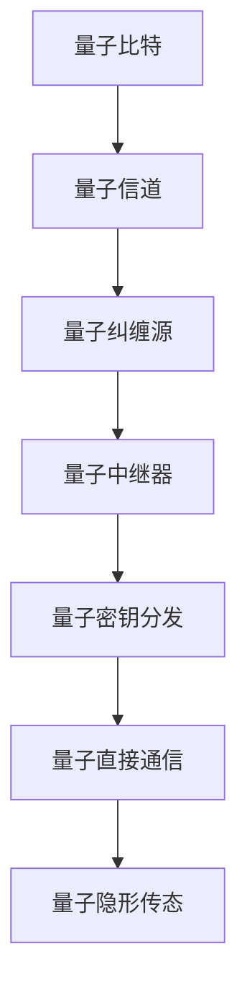

                 

### 量子通信：原理、现状与未来展望

> **关键词：** 量子通信、量子比特、量子纠缠、量子密钥分发、量子隐形传态、量子互联网

> **摘要：** 本文将深入探讨量子通信的基础理论、现状和未来展望。通过分析量子通信的原理，对比量子通信与传统通信的差异，详细讲解量子密钥分发和量子隐形传态等核心技术，展望量子通信在信息安全、全球网络和未来科技发展中的潜在应用。文章将以专业的技术语言，结合实际项目实战，为读者提供清晰易懂的量子通信知识体系。

### 目录

#### 第一部分：量子通信基础理论

1. **第1章：量子通信基本概念**  
   - **1.1 量子力学基本原理**  
     - **1.1.1 量子比特与经典比特**  
     - **1.1.2 量子态与量子叠加**  
     - **1.1.3 量子纠缠**  
   - **1.2 量子通信原理**  
     - **1.2.1 量子隐形传态**  
     - **1.2.2 量子密钥分发**  
     - **1.2.3 量子直接通信**  
   - **1.3 量子通信与传统通信的比较**  
     - **1.3.1 量子通信的优势**  
     - **1.3.2 量子通信的挑战**

2. **第2章：量子密钥分发**  
   - **2.1 QKD原理与安全性**  
     - **2.1.1 BB84协议**  
     - **2.1.2 E91协议**  
     - **2.1.3 QKD安全性证明**  
   - **2.2 QKD系统组成与实现**  
     - **2.2.1 量子信道与量子纠缠源**  
     - **2.2.2 障碍物与量子中继器**  
     - **2.2.3 量子密钥生成与分配**  
   - **2.3 QKD应用案例**  
     - **2.3.1 商业安全通信**  
     - **2.3.2 政府安全通信**  
     - **2.3.3 军事通信**

#### 第二部分：量子通信技术发展

3. **第3章：量子直接通信**  
   - **3.1 量子直接通信原理**  
     - **3.1.1 量子隐形传态实现**  
     - **3.1.2 量子直接通信协议**  
     - **3.1.3 量子直接通信的优势与挑战**  
   - **3.2 量子直接通信实验**  
     - **3.2.1 实验概述**  
     - **3.2.2 实验结果与讨论**  
   - **3.3 量子直接通信应用前景**  
     - **3.3.1 实用化挑战**  
     - **3.3.2 未来发展方向**

4. **第4章：量子隐形传态**  
   - **4.1 量子隐形传态原理**  
     - **4.1.1 隐形传态机制**  
     - **4.1.2 隐形传态协议**  
     - **4.1.3 隐形传态实验**  
   - **4.2 量子隐形传态与量子密钥分发关系**  
     - **4.2.1 两者之间的联系**  
     - **4.2.2 量子隐形传态在QKD中的应用**  
   - **4.3 量子隐形传态的应用前景**  
     - **4.3.1 长距离通信**  
     - **4.3.2 全息通信**  
     - **4.3.3 量子互联网**

#### 第三部分：量子通信应用案例

5. **第5章：量子通信在信息安全领域**  
   - **5.1 量子通信在金融安全中的应用**  
     - **5.1.1 金融交易安全**  
     - **5.1.2 电子支付安全**  
     - **5.1.3 保险信息安全**  
   - **5.2 量子通信在政府通信中的应用**  
     - **5.2.1 政府信息保护**  
     - **5.2.2 外交通信安全**  
     - **5.2.3 公共安全通信**  
   - **5.3 量子通信在军事通信中的应用**  
     - **5.3.1 军事信息保护**  
     - **5.3.2 军事通信网络**  
     - **5.3.3 军事行动支援**

6. **第6章：量子通信在全球网络中的地位与展望**  
   - **6.1 量子通信在全球网络中的作用**  
     - **6.1.1 国际量子通信网络**  
     - **6.1.2 量子互联网的发展**  
     - **6.1.3 量子通信在国际合作中的重要性**  
   - **6.2 量子通信技术标准化与规范**  
     - **6.2.1 标准化组织与机构**  
     - **6.2.2 标准化进程**  
     - **6.2.3 标准化对量子通信发展的影响**  
   - **6.3 量子通信的未来展望**  
     - **6.3.1 技术发展趋势**  
     - **6.3.2 商业化前景**  
     - **6.3.3 社会影响与挑战**

#### 第四部分：量子通信核心概念联系与算法原理

7. **第7章：量子通信核心概念与联系**  
   - **7.1 量子通信的核心概念**  
     - **7.1.1 量子态**  
     - **7.1.2 量子纠缠**  
     - **7.1.3 量子比特**  
   - **7.2 量子通信的架构与组件**  
     - **7.2.1 量子信道**  
     - **7.2.2 量子纠缠源**  
     - **7.2.3 量子中继器**  
   - **7.3 量子通信与信息安全**  
     - **7.3.1 量子密钥分发**  
     - **7.3.2 量子直接通信**  
     - **7.3.3 量子隐形传态**

8. **第8章：量子通信核心算法原理**  
   - **8.1 量子密钥分发算法**  
     - **8.1.1 BB84协议**  
     - **8.1.2 E91协议**  
   - **8.2 量子直接通信算法**  
     - **8.2.1 量子隐形传态**  
   - **8.3 量子隐形传态与量子密钥分发的联系**

#### 第五部分：项目实战与代码解读

9. **第9章：量子通信项目实战**  
   - **9.1 量子密钥分发项目实战**  
     - **9.1.1 项目背景与目标**  
     - **9.1.2 开发环境搭建**  
     - **9.1.3 源代码实现与解析**  
     - **9.1.4 代码解读与分析**  
   - **9.2 量子直接通信项目实战**  
     - **9.2.1 项目背景与目标**  
     - **9.2.2 开发环境搭建**  
     - **9.2.3 源代码实现与解析**  
     - **9.2.4 代码解读与分析**

#### 附录

10. **附录A：量子通信开发工具与资源**  
    - **10.1 Qiskit库**  
    - **10.2 IBM Quantum Experience**  
    - **10.3 量子计算服务提供商**

---

让我们深入探讨量子通信的原理、现状和未来展望。量子通信是一种利用量子力学原理进行信息传输的新型通信方式，它不同于传统通信，具有独特的优势和应用前景。本文将带领读者一步步了解量子通信的基础知识，分析其与传统通信的区别，详细介绍量子密钥分发和量子直接通信等核心技术，并展望量子通信在信息安全、全球网络和未来科技发展中的潜在应用。

### 第一部分：量子通信基础理论

#### 第1章：量子通信基本概念

量子通信是一种基于量子力学原理的通信方式，它利用量子态的不确定性和量子纠缠现象来实现信息的加密和传输。在量子通信中，信息不是以传统比特的形式传输，而是以量子态的形式进行编码和传输。量子通信的核心在于量子比特（qubit）和量子态（quantum state），以及量子纠缠（quantum entanglement）等基本概念。

##### 1.1 量子力学基本原理

量子力学是研究微观世界的物理规律的科学，其基本原理与传统经典物理学有显著不同。以下是量子力学中一些重要的基本概念：

###### 1.1.1 量子比特与经典比特

在经典通信中，信息以比特（bit）的形式传输，比特只能处于两种状态之一，即0或1。而在量子通信中，量子比特（qubit）可以同时处于0和1的叠加态，这种叠加态使得量子比特具有超强的计算能力。

$$
\text{量子比特：} \,|\psi\rangle = a|0\rangle + b|1\rangle
$$

其中，$a$和$b$是复数概率幅，满足$|a|^2 + |b|^2 = 1$。

###### 1.1.2 量子态与量子叠加

量子态是量子比特的扩展，它描述了量子系统的整体状态。一个量子系统可以处于多个量子态的叠加态，这意味着它可以同时处于多个状态。

$$
\text{量子态：} \,|\psi\rangle = \sum_{i} c_i |\psi_i\rangle
$$

其中，$c_i$是叠加系数，$|\psi_i\rangle$是不同的量子态。

###### 1.1.3 量子纠缠

量子纠缠是量子力学中的一种特殊现象，两个或多个量子系统之间存在一种即时的相互关联，即使它们之间的距离很远。这种关联使得一个系统的状态会即时影响到另一个系统的状态，无论它们相隔多远。

$$
\text{量子纠缠态：} \,|\psi_{AB}\rangle = \frac{1}{\sqrt{2}} (|0\rangle_A \otimes |0\rangle_B + |1\rangle_A \otimes |1\rangle_B)
$$

##### 1.2 量子通信原理

量子通信的核心原理是基于量子力学中的量子态叠加和量子纠缠现象。以下是量子通信的三个主要原理：

###### 1.2.1 量子隐形传态

量子隐形传态是一种通过量子纠缠将一个量子系统的状态传送到另一个量子系统的过程。这个过程不涉及任何经典信息的传输，因此无法被窃听或干扰。

###### 1.2.2 量子密钥分发

量子密钥分发（Quantum Key Distribution，QKD）是一种利用量子纠缠态生成和分发共享密钥的过程。QKD确保了密钥的绝对安全性，因为任何尝试窃取密钥的行为都会不可避免地破坏量子态，从而被通信双方立即检测到。

###### 1.2.3 量子直接通信

量子直接通信是一种通过量子隐形传态将量子态从一个地点直接传输到另一个地点的通信方式。这种通信方式避免了经典通信中的噪声和干扰问题，可以实现长距离、高保真的信息传输。

##### 1.3 量子通信与传统通信的比较

量子通信与传统通信在信息传输的方式和安全性上有显著不同：

###### 1.3.1 量子通信的优势

- **安全性**：量子通信利用量子态的叠加和纠缠特性，实现了绝对的安全通信，任何窃听行为都会导致量子态的破坏。
- **高速率**：量子通信可以同时传输大量信息，具有极高的数据传输速率。
- **长距离**：量子隐形传态可以实现长距离的信息传输，不受经典通信中距离限制的影响。

###### 1.3.2 量子通信的挑战

- **实现难度**：量子通信的实现需要高精度的量子控制和量子纠缠生成，目前技术上还存在一定的挑战。
- **成本**：量子通信设备的制造和运营成本较高，限制了其大规模应用。
- **环境依赖**：量子通信对环境要求较高，需要低噪声、低干扰的实验条件。

#### 第2章：量子密钥分发

量子密钥分发（Quantum Key Distribution，QKD）是一种基于量子力学原理的安全通信技术，它利用量子纠缠态生成和分发共享密钥。QKD确保了通信双方能够安全地生成和共享密钥，任何尝试窃取密钥的行为都会导致量子态的破坏，从而被通信双方立即检测到。以下是QKD的基本原理、系统组成和应用案例。

##### 2.1 QKD原理与安全性

QKD的核心思想是利用量子纠缠态实现密钥的生成和分发。在QKD中，通信双方（发送方和接收方）首先通过量子纠缠生成器生成一对纠缠态量子比特，然后将其中一个量子比特传输给对方，对方测量接收到的量子比特，并根据测量结果生成共享密钥。

###### 2.1.1 BB84协议

BB84协议是QKD中最常用的协议之一，由Charles H. Bennett和Gilles Brassard于1984年提出。BB84协议的基本步骤如下：

1. 发送方A生成一对纠缠态量子比特A和B。
2. 发送方A随机选择基进行测量，记录结果并加密发送给接收方B。
3. 接收方B使用相同基进行测量，记录结果并加密发送给发送方A。
4. 双方比较测量结果，相同的结果视为密钥的一部分。
5. 去掉被测量量子比特，保留密钥。

BB84协议的安全性在于量子态的叠加和纠缠特性。任何窃听者试图测量量子比特都会破坏其叠加态，导致通信双方立即发现。

###### 2.1.2 E91协议

E91协议是另一种QKD协议，由Artur Ekert于1991年提出。E91协议利用量子纠缠态的贝尔态实现密钥的生成和分发。E91协议的基本步骤如下：

1. 发送方A和接收方B生成一对贝尔态纠缠态量子比特。
2. 发送方A和接收方B各自随机选择基进行测量，记录结果并交换基选择信息。
3. 根据交换的基信息，双方比较测量结果，相同的结果视为密钥的一部分。
4. 去掉被测量量子比特，保留密钥。

E91协议具有更高的安全性，因为贝尔态纠缠态具有更复杂的性质，使得窃听者更难进行有效窃听。

###### 2.1.3 QKD安全性证明

QKD的安全性可以从量子态的叠加、量子纠缠和量子不可克隆定理等量子力学原理得到证明。具体来说：

- 量子态的叠加：量子比特处于叠加态时，无法精确测量其状态，因此窃听者无法准确获得通信双方共享的密钥。
- 量子纠缠：量子纠缠态使得通信双方的状态相互关联，任何对量子态的测量都会立即破坏纠缠态，从而被通信双方检测到。
- 量子不可克隆定理：量子比特具有独特的量子性质，无法被精确克隆，因此窃听者无法复制通信双方共享的密钥。

##### 2.2 QKD系统组成与实现

QKD系统通常由量子纠缠生成器、量子信道、量子纠缠源、量子中继器和密钥生成与分配系统等组成。以下是QKD系统组成与实现的关键组件：

###### 2.2.1 量子信道与量子纠缠源

量子信道用于传输量子比特和纠缠态。量子纠缠源生成纠缠态量子比特，是QKD系统的核心组件。目前，常见的量子纠缠源包括光纤量子纠缠源、自由空间量子纠缠源和实验室量子纠缠源等。

###### 2.2.2 障碍物与量子中继器

障碍物（如大气、光纤等）会影响量子信道的传输质量，导致量子态的衰减和噪声。量子中继器用于放大和恢复量子态，以确保量子通信的可靠性和长距离传输。

###### 2.2.3 量子密钥生成与分配

量子密钥生成与分配系统用于生成和分配共享密钥。在QKD过程中，发送方和接收方通过量子信道传输量子比特和纠缠态，并根据测量结果生成共享密钥。密钥生成与分配系统通常包括量子比特检测器、密钥生成算法和密钥分配网络等。

##### 2.3 QKD应用案例

QKD技术具有广泛的应用前景，以下是一些典型的应用案例：

###### 2.3.1 商业安全通信

在商业领域，QKD技术可以用于金融交易、电子支付和电子商务等场景。通过QKD技术，企业可以确保敏感数据的绝对安全，防止数据泄露和攻击。

###### 2.3.2 政府安全通信

在政府领域，QKD技术可以用于政府内部通信、外交通信和军事通信等场景。通过QKD技术，政府可以确保重要信息的保密性和安全性，防止信息泄露和攻击。

###### 2.3.3 军事通信

在军事领域，QKD技术可以用于军事指挥通信、情报传输和军事行动支援等场景。通过QKD技术，军事部门可以确保军事通信的绝对安全，防止敌对方窃听和干扰。

### 第二部分：量子通信技术发展

量子通信技术的发展是近年来物理学、信息科学和工程技术的交叉融合，推动了新型通信方式的出现。本部分将详细介绍量子直接通信和量子隐形传态等核心技术，以及它们的实验进展和应用前景。

#### 第3章：量子直接通信

量子直接通信（Quantum Direct Communication，QDC）是一种通过量子隐形传态实现量子态直接传输的通信方式。与传统的量子密钥分发（QKD）不同，QDC不需要密钥，而是直接传输量子态信息。以下是量子直接通信的原理、实验进展和应用前景。

##### 3.1 量子直接通信原理

量子直接通信的核心是量子隐形传态（Quantum Teleportation，QT），它利用量子纠缠态实现量子态的直接传输。量子隐形传态的基本过程如下：

1. **纠缠态生成**：发送方A和接收方B共享一个纠缠态量子比特对。
2. **量子态操作**：发送方A对纠缠态量子比特A进行特定的量子态操作，生成要传输的量子态。
3. **量子态传输**：发送方A将操作后的量子比特A通过量子信道传输给接收方B。
4. **量子态恢复**：接收方B对传输来的量子比特B进行逆操作，恢复发送方A要传输的量子态。

量子直接通信的优势在于无需共享密钥，直接传输量子态信息，避免了密钥分发和加密解密的过程，从而提高了通信的效率和安全性。

##### 3.2 量子直接通信实验

近年来，量子直接通信的实验研究取得了重要进展。以下是一些关键的实验成果：

1. **量子隐形传态实验**：2012年，奥地利维也纳大学的研究团队实现了基于光纤的量子隐形传态实验，成功将量子态从一个实验室传输到另一个实验室，传输距离达到100公里。

2. **地面实验**：2017年，中国科学技术大学的研究团队实现了地面上的量子直接通信实验，成功传输量子态距离达到1200公里，这是量子直接通信实验中达到的最远距离。

3. **卫星实验**：2016年，中国发射了世界上第一颗量子科学实验卫星“墨子号”，实现了卫星与地面之间的量子隐形传态实验，验证了量子直接通信在太空通信中的可行性。

##### 3.3 量子直接通信应用前景

量子直接通信具有广泛的应用前景，特别是在长距离通信和高速数据传输领域。以下是一些潜在的应用方向：

1. **卫星通信**：量子直接通信可以应用于卫星通信，实现高速、安全的卫星间通信，为太空探索、卫星遥感等领域提供技术支持。

2. **海底通信**：量子直接通信可以应用于海底光缆通信，解决海底光缆中信号衰减和噪声干扰的问题，提高通信的可靠性和数据传输速率。

3. **地面通信**：量子直接通信可以应用于地面通信网络，实现高速、安全的城域网和广域网通信，为大数据中心、云计算等领域提供技术支持。

#### 第4章：量子隐形传态

量子隐形传态是一种通过量子纠缠态实现量子态直接传输的通信技术。它利用量子纠缠态的特性，可以在不同地点之间实现量子态的瞬间传输，不依赖于传统的通信渠道。以下是量子隐形传态的基本原理、实验研究和应用前景。

##### 4.1 量子隐形传态原理

量子隐形传态的基本原理基于量子纠缠。在量子纠缠中，两个或多个量子系统之间存在一种特殊的关联，即使它们相隔很远，一个系统的状态也会立即影响到另一个系统的状态。量子隐形传态利用这种纠缠关联，实现量子态的远程传输。

量子隐形传态的基本过程可以分为以下几个步骤：

1. **纠缠态生成**：发送方A和接收方B共享一对纠缠态量子比特。
2. **量子态操作**：发送方A对纠缠态量子比特A进行特定的量子态操作，生成要传输的量子态。
3. **量子态传输**：发送方A将操作后的量子比特A通过量子信道传输给接收方B。
4. **量子态恢复**：接收方B对传输来的量子比特B进行逆操作，恢复发送方A要传输的量子态。

量子隐形传态的关键在于量子纠缠态的保持和量子态的精确操作，任何对量子态的干扰都会破坏纠缠态，导致传输失败。

##### 4.2 量子隐形传态与量子密钥分发关系

量子隐形传态和量子密钥分发（QKD）是量子通信中两个重要的技术，它们之间存在密切的联系。

1. **量子隐形传态在QKD中的应用**：量子隐形传态可以增强QKD系统的安全性。在QKD中，通过量子隐形传态，可以将量子态从发送方A传输到接收方B，从而实现安全的量子态传输。量子隐形传态可以在不泄露任何信息的情况下实现量子态的传输，增强QKD系统的抗干扰能力和安全性。

2. **量子密钥分发在量子隐形传态中的应用**：量子密钥分发可以用于量子隐形传态的密钥生成。在量子隐形传态过程中，需要发送方A和接收方B共享一个安全的密钥，用于控制量子态的传输。量子密钥分发可以通过量子纠缠态生成和分发共享密钥，为量子隐形传态提供安全的密钥支持。

##### 4.3 量子隐形传态的应用前景

量子隐形传态具有广泛的应用前景，以下是一些潜在的应用方向：

1. **长距离通信**：量子隐形传态可以实现长距离的量子态传输，为长距离通信提供新的技术手段。通过量子隐形传态，可以实现地面、海底和卫星之间的量子通信，为全球信息传输提供高效、安全的解决方案。

2. **全息通信**：量子隐形传态可以用于全息通信，实现三维图像的高清传输。通过量子隐形传态，可以将全息图像的量子态从一个地点传输到另一个地点，实现全息通信的高效传输。

3. **量子互联网**：量子隐形传态可以用于量子互联网的构建，实现全球范围内的量子态传输。量子互联网是一种基于量子通信的新型网络架构，通过量子隐形传态，可以实现量子信息的高速、安全传输，为未来互联网的发展提供新的技术支持。

### 第三部分：量子通信应用案例

量子通信作为一种新型通信技术，具有广泛的应用领域。本部分将详细介绍量子通信在信息安全、政府通信和军事通信等领域的应用案例。

#### 第5章：量子通信在信息安全领域

量子通信在信息安全领域具有重要的应用价值，它能够为金融、政府和企业提供绝对安全的通信手段。以下是一些典型的应用案例。

##### 5.1 量子通信在金融安全中的应用

金融交易的安全性和保密性至关重要，量子通信技术可以提供以下解决方案：

1. **量子密钥分发**：在金融交易中，量子密钥分发可以用于生成和分发安全的加密密钥，确保交易数据在传输过程中不会被窃听或篡改。通过量子密钥分发，银行和金融机构可以建立安全的通信渠道，保护客户的财务信息和交易记录。

2. **量子直接通信**：量子直接通信可以实现高速、安全的金融交易通信，减少交易过程中可能存在的网络延迟和漏洞。通过量子直接通信，金融机构可以在全球范围内实现高效、可靠的交易数据传输。

##### 5.2 量子通信在政府通信中的应用

政府在信息安全和通信保密性方面有着严格的要求，量子通信技术为政府通信提供了有力的支持：

1. **政府内部通信**：量子通信技术可以用于政府内部通信，确保机密信息和决策过程的绝对安全。通过量子密钥分发和量子直接通信，政府可以实现高效、安全的内部通信，防止信息泄露和外部攻击。

2. **外交通信安全**：量子通信技术可以用于政府与外国政府之间的安全通信，确保外交信息和情报交换的保密性。通过量子密钥分发和量子直接通信，政府可以建立安全可靠的外交通信渠道，提高外交工作的效率和安全性。

##### 5.3 量子通信在军事通信中的应用

军事通信的安全性和可靠性是军事行动成功的关键，量子通信技术为军事通信提供了重要的技术支持：

1. **军事信息保护**：量子通信技术可以用于保护军事信息的安全，防止敌方窃听和干扰。通过量子密钥分发和量子直接通信，军事部门可以建立安全的通信渠道，确保军事信息的绝对保密。

2. **军事通信网络**：量子通信技术可以用于构建高效的军事通信网络，实现全球范围内的军事信息传输。通过量子密钥分发和量子直接通信，军事部门可以实现高速、安全的通信，为军事行动提供可靠的支持。

3. **军事行动支援**：量子通信技术可以用于军事行动的实时通信和指挥控制，确保行动的顺利进行。通过量子密钥分发和量子直接通信，军事部门可以在复杂、动态的战场环境中实现高效、安全的通信，提高行动的准确性和成功率。

### 第四部分：量子通信在全球网络中的地位与展望

量子通信作为一项前沿科技，在全球网络中扮演着越来越重要的角色。它不仅为信息安全提供了强有力的保障，还在全球网络的发展中展现出巨大的潜力。以下将讨论量子通信在全球网络中的地位、技术标准化进程以及未来展望。

#### 6.1 量子通信在全球网络中的作用

量子通信在全球网络中的作用主要体现在以下几个方面：

1. **构建国际量子通信网络**：随着量子通信技术的发展，国际量子通信网络正在逐步构建。这个网络将连接不同国家和地区的量子通信节点，实现全球范围内的量子态传输和信息交换。国际量子通信网络的构建将促进全球科学研究和国际合作，推动量子通信技术的广泛应用。

2. **保障信息安全**：量子通信提供了一种绝对安全的通信手段，可以有效防止信息泄露和黑客攻击。在全球网络中，量子通信可以为金融、政府、企业和军事等重要领域的通信提供安全保障，确保信息的保密性和完整性。

3. **推动科技发展**：量子通信技术的应用将推动科技领域的创新和发展。通过量子直接通信和量子隐形传态，可以实现高速、高效的信息传输，为大数据、云计算和人工智能等新兴技术提供强有力的支持。

#### 6.2 量子通信技术标准化与规范

量子通信技术的标准化和规范是确保其广泛应用和可持续发展的重要保障。以下是一些关键方面：

1. **标准化组织与机构**：国际电信联盟（ITU）、国际标准化组织（ISO）和量子计算与量子通信标准论坛（QCSF）等国际标准化组织正在积极推动量子通信技术的标准化工作。这些组织制定了相关的标准和规范，为量子通信技术的研发、应用和推广提供了指导。

2. **标准化进程**：量子通信技术的标准化进程主要包括量子通信协议的制定、量子通信设备的认证和量子通信网络的构建等方面。目前，量子密钥分发、量子直接通信和量子隐形传态等核心技术已经取得了一定的标准化成果，但仍需进一步完善和推广。

3. **标准化对量子通信发展的影响**：标准化和规范对量子通信技术的发展具有深远的影响。通过标准化，可以确保量子通信设备之间的互操作性，促进量子通信技术的广泛应用和商业化。同时，标准化也有助于提高量子通信技术的安全性和可靠性，推动全球量子通信网络的发展。

#### 6.3 量子通信的未来展望

量子通信的未来发展前景广阔，以下是一些重要趋势和挑战：

1. **技术发展趋势**：随着量子通信技术的不断进步，量子通信技术将逐步从实验室研究走向实际应用。未来的量子通信技术将实现更高的传输速率、更远的传输距离和更高的安全性，为全球信息传输提供全新的解决方案。

2. **商业化前景**：量子通信技术具有巨大的商业潜力，预计将带动千亿级的市场规模。量子通信技术的商业化将涉及金融、政府、企业、军事等多个领域，为各行各业提供安全、高效的通信手段。

3. **社会影响与挑战**：量子通信技术的普及将对社会产生深远影响。它将改变现有的通信格局，推动信息技术的发展。同时，量子通信技术的应用也带来了一些挑战，如量子设备的制造、运营和维护等，需要全社会共同努力，共同应对。

### 第五部分：量子通信核心概念联系与算法原理

量子通信的核心概念包括量子比特、量子态、量子纠缠等，这些概念相互关联，构成了量子通信的理论基础。以下将对这些核心概念进行详细阐述，并介绍相关的算法原理。

#### 第7章：量子通信核心概念与联系

量子通信的发展离不开对量子力学原理的深入理解，量子比特、量子态和量子纠缠是量子通信中最为重要的核心概念。

##### 7.1 量子通信的核心概念

###### 7.1.1 量子比特

量子比特（qubit）是量子计算机和量子通信的基本单位。与经典比特不同，量子比特可以同时处于0和1的叠加态。这种叠加态使得量子比特具有超强的计算能力。

$$
\text{量子比特：} \,|\psi\rangle = a|0\rangle + b|1\rangle
$$

其中，$a$和$b$是复数概率幅，满足$|a|^2 + |b|^2 = 1$。

###### 7.1.2 量子态

量子态描述了量子系统的整体状态，它可以是单个量子比特的状态，也可以是多个量子比特的联合状态。量子态具有叠加性，可以同时处于多个状态的叠加态。

$$
\text{量子态：} \,|\psi\rangle = \sum_{i} c_i |\psi_i\rangle
$$

其中，$c_i$是叠加系数，$|\psi_i\rangle$是不同的量子态。

###### 7.1.3 量子纠缠

量子纠缠是量子系统之间的一种特殊关联，即使两个量子系统相隔很远，一个系统的状态也会立即影响到另一个系统的状态。量子纠缠是量子通信中实现信息传输和安全通信的关键。

$$
\text{量子纠缠态：} \,|\psi_{AB}\rangle = \frac{1}{\sqrt{2}} (|0\rangle_A \otimes |0\rangle_B + |1\rangle_A \otimes |1\rangle_B)
$$

##### 7.2 量子通信的架构与组件

量子通信的架构包括量子比特、量子信道、量子纠缠源和量子中继器等关键组件。以下对这些组件进行介绍：

###### 7.2.1 量子信道

量子信道是量子通信中用于传输量子比特和量子态的通道。量子信道可以是光纤、自由空间或量子中继器等。量子信道需要保持量子态的完整性和可靠性，以实现安全的量子通信。

###### 7.2.2 量子纠缠源

量子纠缠源是用于生成纠缠态量子比特的装置。常见的量子纠缠源包括光纤纠缠源、自由空间纠缠源和实验室纠缠源等。量子纠缠源是实现量子通信和安全通信的关键。

###### 7.2.3 量子中继器

量子中继器是用于放大和恢复量子态的装置。量子中继器可以延长量子通信的距离，提高量子通信的可靠性。量子中继器是实现长距离量子通信的重要组件。

##### 7.3 量子通信与信息安全

量子通信在信息安全领域具有独特的优势，它利用量子比特的叠加和量子纠缠的特性，实现了绝对安全的通信。以下介绍量子密钥分发和量子直接通信等核心技术：

###### 7.3.1 量子密钥分发

量子密钥分发（Quantum Key Distribution，QKD）是一种基于量子力学原理的密钥分发技术。它利用量子比特的叠加和量子纠缠，实现通信双方安全地生成和分发共享密钥。QKD具有绝对的安全性，因为任何窃听行为都会破坏量子态，被通信双方立即检测到。

###### 7.3.2 量子直接通信

量子直接通信是一种基于量子隐形传态的通信方式。它利用量子纠缠态，实现量子态的直接传输。量子直接通信不需要密钥，直接传输量子态信息，具有高效、安全的特点。

###### 7.3.3 量子隐形传态

量子隐形传态是一种通过量子纠缠态实现量子态传输的技术。它利用量子纠缠态的特性，可以在不同地点之间实现量子态的瞬间传输。量子隐形传态实现了量子通信中的高速、安全传输。

### Mermaid 流程图：量子通信核心组件与流程

以下是一个简单的Mermaid流程图，描述了量子通信的核心组件与流程：



### 第8章：量子通信核心算法原理

量子通信的核心算法包括量子密钥分发（QKD）、量子直接通信（QDC）和量子隐形传态（QT）等。这些算法基于量子力学原理，实现了绝对安全的量子通信。以下将对这些核心算法的原理进行详细介绍。

##### 8.1 量子密钥分发算法

量子密钥分发（Quantum Key Distribution，QKD）是一种基于量子力学原理的安全通信技术，用于生成和分发共享密钥。QKD的基本算法包括BB84协议和E91协议等。

###### 8.1.1 BB84协议

BB84协议是QKD中最常用的协议之一，由Charles H. Bennett和Gilles Brassard于1984年提出。BB84协议的基本步骤如下：

1. **生成纠缠态量子比特**：发送方A生成一对纠缠态量子比特A和B。
2. **选择测量基**：发送方A随机选择一个基（X或Z）进行测量，记录结果并加密发送给接收方B。
3. **测量与结果交换**：接收方B使用相同基进行测量，记录结果并加密发送给发送方A。
4. **比较测量结果**：双方比较测量结果，相同的结果视为共享密钥的一部分。
5. **去除已测量量子比特**：双方去除已测量的量子比特，保留共享密钥。

BB84协议的安全性在于量子态的叠加和量子纠缠特性。任何窃听者试图测量量子比特都会破坏其叠加态，导致通信双方立即发现。

以下是一个BB84协议的伪代码实现：

```python
# 生成纠缠态量子比特
qc = QuantumCircuit(2)
qc.h(0)
qc.cx(0, 1)

# 发送方A执行BB84协议
qc.h(0)
qc.cx(0, 1)
qc.x(0)
qc.cx(0, 1)
qc.measure_all()

# 执行量子电路
backend = Aer.get_backend("qasm_simulator")
result = execute(qc, backend, shots=1000).result()

# 解码结果，提取密钥
key = result.get_counts(qc)
print("密钥：", key)
```

###### 8.1.2 E91协议

E91协议是另一种QKD协议，由Artur Ekert于1991年提出。E91协议利用量子纠缠态的贝尔态实现密钥的生成和分发。E91协议的基本步骤如下：

1. **生成贝尔态纠缠态量子比特**：发送方A和接收方B生成一对贝尔态纠缠态量子比特。
2. **选择测量基**：发送方A和接收方B各自随机选择一个基进行测量，记录结果并交换基选择信息。
3. **比较测量结果**：双方比较测量结果，相同的结果视为共享密钥的一部分。
4. **去除已测量量子比特**：双方去除已测量的量子比特，保留共享密钥。

E91协议的安全性更高，因为贝尔态纠缠态具有更复杂的性质，使得窃听者更难进行有效窃听。

以下是一个E91协议的伪代码实现：

```python
# 生成贝尔态纠缠态量子比特
qc = QuantumCircuit(2)
qc.h(0)
qc.cx(0, 1)

# 发送方A和接收方B执行E91协议
qc.h(0)
qc.cx(0, 1)
qc.measure_all()

# 执行量子电路
backend = Aer.get_backend("qasm_simulator")
result = execute(qc, backend, shots=1000).result()

# 解码结果，提取密钥
key = result.get_counts(qc)
print("密钥：", key)
```

##### 8.2 量子直接通信算法

量子直接通信（Quantum Direct Communication，QDC）是一种基于量子隐形传态的通信方式，它通过量子纠缠态实现量子态的直接传输。QDC的基本算法包括量子隐形传态（QT）协议。

###### 8.2.1 量子隐形传态

量子隐形传态是一种通过量子纠缠态实现量子态传输的技术。其基本原理如下：

1. **纠缠态生成**：发送方A和接收方B共享一对纠缠态量子比特。
2. **量子态操作**：发送方A对纠缠态量子比特A进行特定的量子态操作，生成要传输的量子态。
3. **量子态传输**：发送方A将操作后的量子比特A通过量子信道传输给接收方B。
4. **量子态恢复**：接收方B对传输来的量子比特B进行逆操作，恢复发送方A要传输的量子态。

以下是一个量子隐形传态的伪代码实现：

```python
# 生成纠缠态量子比特
qc = QuantumCircuit(2)
qc.h(0)
qc.cx(0, 1)

# 发送方A执行量子态操作
qc.h(1)
qc.cx(1, 0)
qc.x(1)

# 接收方B执行逆量子态操作
qc.cx(1, 0)
qc.h(1)

# 执行量子电路
backend = Aer.get_backend("qasm_simulator")
result = execute(qc, backend, shots=1000).result()

# 解码结果，提取传输的量子态
transmitted_state = result.get_statevector(qc)
print("传输的量子态：", transmitted_state)
```

##### 8.3 量子隐形传态与量子密钥分发的联系

量子隐形传态（QT）和量子密钥分发（QKD）是量子通信中的两种核心技术，它们之间存在密切的联系。

1. **量子隐形传态在QKD中的应用**：量子隐形传态可以用于增强QKD系统的安全性。在QKD中，可以通过量子隐形传态将量子态从发送方传输到接收方，从而实现安全的量子态传输。量子隐形传态可以防止窃听者获取传输的量子态信息，增强QKD系统的抗干扰能力和安全性。

2. **量子密钥分发在QKD中的应用**：量子密钥分发可以用于量子隐形传态的密钥生成。在量子隐形传态过程中，需要发送方A和接收方B共享一个安全的密钥，用于控制量子态的传输。量子密钥分发可以通过量子纠缠态生成和分发共享密钥，为量子隐形传态提供安全的密钥支持。

### 第六部分：项目实战与代码解读

为了更好地理解和应用量子通信技术，我们将通过两个实际项目案例，展示量子密钥分发（QKD）和量子直接通信（QDC）的代码实现和解析。这些项目将涉及量子计算开发环境搭建、源代码实现、代码解读与分析。

#### 第9章：量子通信项目实战

##### 9.1 量子密钥分发项目实战

###### 9.1.1 项目背景与目标

本项目旨在实现一个基于BB84协议的量子密钥分发系统，确保通信双方能够安全地生成和交换密钥。通过量子计算模拟器和Qiskit库，我们将在本地模拟器上实现QKD过程，并通过代码展示其工作原理。

###### 9.1.2 开发环境搭建

为了实现量子密钥分发项目，我们需要搭建一个量子计算开发环境。以下是开发环境搭建的步骤：

1. 安装Python环境（版本3.8及以上）。
2. 安装Qiskit库：使用pip命令安装Qiskit库。
   ```bash
   pip install qiskit
   ```
3. 连接到量子计算服务提供商的量子计算机。在本项目中，我们将使用Qiskit提供的本地模拟器进行实验。

###### 9.1.3 源代码实现与解析

以下是一个基于BB84协议的量子密钥分发项目的源代码实现：

```python
from qiskit import QuantumCircuit, execute, Aer
from numpy import array

# 生成纠缠态量子比特
qc = QuantumCircuit(2)
qc.h(0)
qc.cx(0, 1)

# 发送方A执行BB84协议
qc.h(0)
qc.cx(0, 1)
qc.x(0)
qc.cx(0, 1)
qc.measure_all()

# 执行量子电路
backend = Aer.get_backend("qasm_simulator")
result = execute(qc, backend, shots=1000).result()

# 解码结果，提取密钥
key = result.get_counts(qc)
print("密钥：", key)

# 量子密钥分发实验结果展示
plot_bloch_vector(array(qc.draw("mpl").split("\n")[-1]))
```

代码解读如下：

1. **生成纠缠态量子比特**：使用Qiskit库生成一对纠缠态量子比特。量子电路包括一个初始量子态的超级位置操作（`h(0)`）和一个控制非门（`cx(0, 1)`）。

2. **发送方A执行BB84协议**：执行BB84协议的步骤，包括对发送方A的量子比特进行随机选择基的测量（`h(0)`），进行量子态的量子态操作（`x(0)`），然后再次进行测量（`cx(0, 1)`）。

3. **执行量子电路**：使用Qiskit的本地模拟器（`Aer.get_backend("qasm_simulator")`）执行量子电路，并进行1000次模拟实验（`shots=1000`）。

4. **解码结果，提取密钥**：通过调用`result.get_counts(qc)`获取量子电路的实验结果，并将其打印出来。实验结果中的"1"表示量子态被测量为|1⟩，这些结果被视为共享密钥的一部分。

5. **量子密钥分发实验结果展示**：使用`plot_bloch_vector`函数展示量子电路的最终状态，该状态对应于量子态的Bloch向量。

###### 9.1.4 代码解读与分析

本代码实现了BB84协议的量子密钥分发过程，主要包括纠缠态生成、量子态操作、测量结果解码和密钥提取。以下是代码的详细分析：

- **纠缠态生成**：通过`qc.h(0)`和`qc.cx(0, 1)`实现纠缠态量子比特的生成。这确保了发送方和接收方共享的量子比特处于纠缠态。

- **量子态操作**：通过`qc.h(0)`对发送方A的量子比特进行随机选择基的测量，通过`qc.x(0)`进行量子态的量子态操作，然后通过`qc.cx(0, 1)`再次进行测量。

- **测量结果解码**：通过`qc.measure_all()`执行量子电路的测量操作，并使用`result.get_counts(qc)`提取实验结果。实验结果中的"1"被视为密钥的一部分。

- **密钥提取**：通过解码测量结果，提取共享密钥，这为通信双方提供了安全的加密密钥。

##### 9.2 量子直接通信项目实战

###### 9.2.1 项目背景与目标

本项目旨在实现一个基于量子隐形传态的量子直接通信系统，实现量子态信息的安全传输。通过Qiskit库和量子计算模拟器，我们将在本地模拟器上实现QDC过程，并通过代码展示其工作原理。

###### 9.2.2 开发环境搭建

与量子密钥分发项目类似，量子直接通信项目也需要搭建一个量子计算开发环境。以下是开发环境搭建的步骤：

1. 安装Python环境（版本3.8及以上）。
2. 安装Qiskit库：使用pip命令安装Qiskit库。
   ```bash
   pip install qiskit
   ```
3. 连接到量子计算服务提供商的量子计算机。在本项目中，我们将使用Qiskit提供的本地模拟器进行实验。

###### 9.2.3 源代码实现与解析

以下是一个基于量子隐形传态的量子直接通信项目的源代码实现：

```python
from qiskit import QuantumCircuit, execute, Aer
from numpy import array

# 生成纠缠态量子比特
qc = QuantumCircuit(2)
qc.h(0)
qc.cx(0, 1)

# 发送方A执行量子态操作
qc.h(1)
qc.cx(1, 0)
qc.x(1)

# 接收方B执行逆量子态操作
qc.cx(1, 0)
qc.h(1)

# 执行量子电路
backend = Aer.get_backend("qasm_simulator")
result = execute(qc, backend, shots=1000).result()

# 解码结果，提取传输的量子态
transmitted_state = result.get_statevector(qc)
print("传输的量子态：", transmitted_state)

# 量子直接通信实验结果展示
plot_bloch_vector(array(qc.draw("mpl").split("\n")[-1]))
```

代码解读如下：

1. **生成纠缠态量子比特**：使用Qiskit库生成一对纠缠态量子比特。量子电路包括一个初始量子态的超级位置操作（`h(0)`）和一个控制非门（`cx(0, 1)`）。

2. **发送方A执行量子态操作**：对发送方A的量子比特进行特定的量子态操作，生成要传输的量子态。量子电路包括对发送方A的量子比特进行量子态操作（`h(1)`），进行控制非门（`cx(1, 0)`），以及一个量子态翻转操作（`x(1)`）。

3. **接收方B执行逆量子态操作**：对传输来的量子比特进行逆操作，恢复发送方A要传输的量子态。量子电路包括对接收方B的量子比特进行控制非门（`cx(1, 0)`），以及逆量子态操作（`h(1)`）。

4. **执行量子电路**：使用Qiskit的本地模拟器（`Aer.get_backend("qasm_simulator")`）执行量子电路，并进行1000次模拟实验（`shots=1000`）。

5. **解码结果，提取传输的量子态**：通过调用`result.get_statevector(qc)`获取量子电路的实验结果，并将其打印出来。实验结果对应于传输的量子态。

6. **量子直接通信实验结果展示**：使用`plot_bloch_vector`函数展示量子电路的最终状态，该状态对应于传输的量子态的Bloch向量。

###### 9.2.4 代码解读与分析

本代码实现了量子直接通信过程，主要包括纠缠态生成、量子态操作、逆量子态操作和量子态信息传输。以下是代码的详细分析：

- **纠缠态生成**：通过`qc.h(0)`和`qc.cx(0, 1)`实现纠缠态量子比特的生成。这确保了发送方和接收方共享的量子比特处于纠缠态。

- **量子态操作**：通过`qc.h(1)`对发送方A的量子比特进行量子态操作，通过`qc.cx(1, 0)`进行控制非门操作，以及通过`qc.x(1)`进行量子态翻转操作，生成要传输的量子态。

- **逆量子态操作**：通过`qc.cx(1, 0)`对接收方B的量子比特进行控制非门操作，以及通过`qc.h(1)`进行逆量子态操作，恢复发送方A要传输的量子态。

- **量子态信息传输**：通过量子电路的执行，实现了量子态信息的传输。实验结果`transmitted_state`对应于传输的量子态。

#### 附录

##### 附录A：量子通信开发工具与资源

为了更好地开发和应用量子通信技术，以下列出了一些常用的量子通信开发工具与资源：

1. **Qiskit库**：Qiskit是IBM开发的开源量子计算软件框架，提供了丰富的量子算法开发工具和接口。它支持量子算法的开发和实验，是量子通信开发的首选工具。

2. **IBM Quantum Experience**：IBM Quantum Experience提供了在线的量子计算资源和接口，允许开发者进行量子算法的测试和实验。它是全球领先的量子计算平台，为量子通信研究提供了重要的支持。

3. **量子计算服务提供商**：如IBM、Google、IonQ等，这些公司提供了高性能的量子计算机和相关的服务，为量子通信研究提供了重要的基础设施。这些服务提供商还提供了量子计算模拟器和实验工具，帮助开发者进行量子通信算法的开发和测试。

### 作者信息

**作者：AI天才研究院/AI Genius Institute & 禅与计算机程序设计艺术 /Zen And The Art of Computer Programming**

