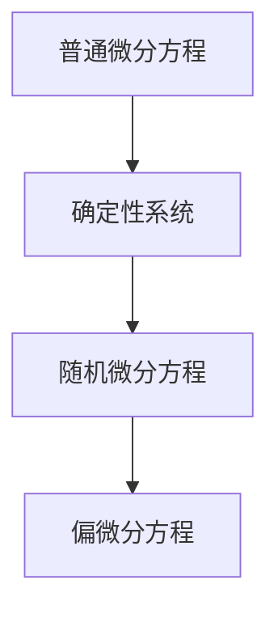
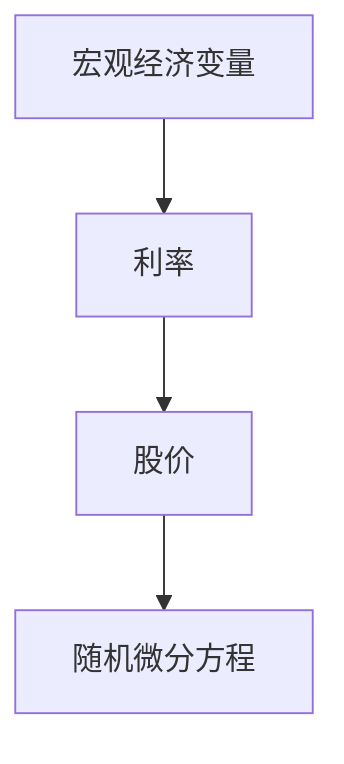
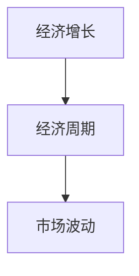
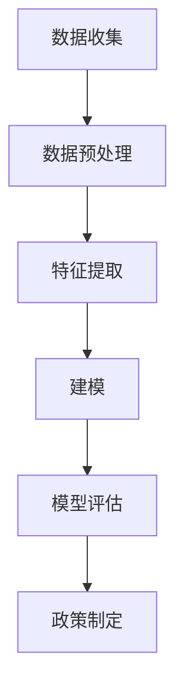
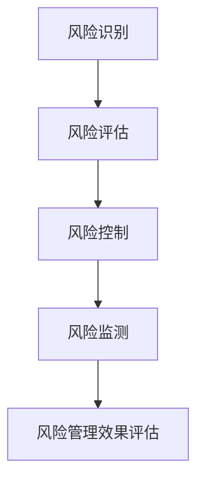
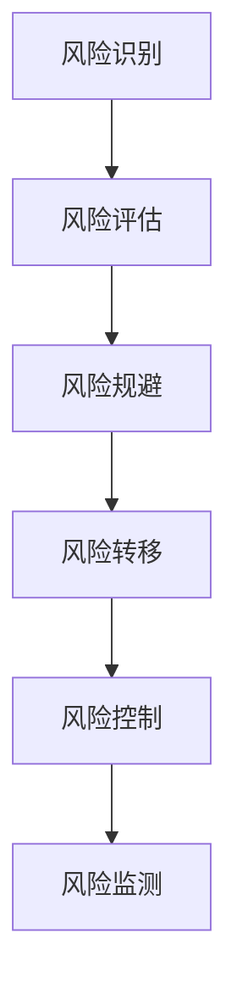
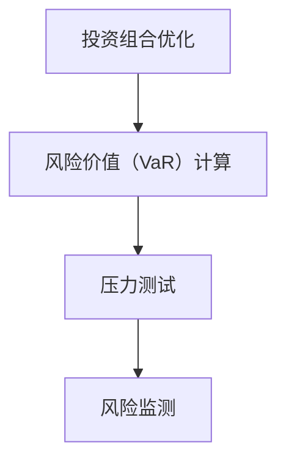
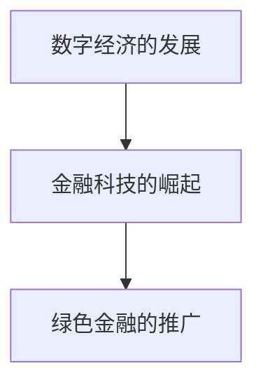

                 

## 金融市场的随机微分方程：经济波动的数学描述

> **关键词：** 金融数学、随机微分方程、经济波动、金融市场、数值解法

**摘要：**  
本文旨在深入探讨金融市场中随机微分方程的应用及其在经济波动描述中的作用。首先，我们将介绍随机微分方程的基本概念，包括其定义、背景及与普通微分方程、偏微分方程的关系。接着，我们将探讨随机微分方程在经济波动中的具体应用，如期权定价和资产定价。随后，本文将详细分析随机微分方程的数值解法，并探讨其在金融风险分析中的实际应用。此外，本文还将介绍随机微分方程在实证研究中的重要性，并列举前沿研究案例。最后，我们将总结经济波动的基本理论和数学描述，并探讨其风险管理方法及实际应用。

### 第一部分：金融市场的随机微分方程概述

#### 第1章：随机微分方程的基本概念

**1.1 随机微分方程的定义和背景**

随机微分方程（Stochastic Differential Equations，SDEs）是描述随机过程变化的一种数学方程。与传统微分方程不同，随机微分方程不仅包含了确定性项，还包含了随机项。这些随机项反映了系统在随机扰动下的行为。

随机微分方程起源于20世纪中期，最早由苏联数学家尼古拉·科尔夫曼（Nikolai Krylov）和德国数学家莱昂哈德·奥布（Leopold C. Taub）提出。在金融领域，随机微分方程被广泛应用于描述资产价格波动、利率变化、金融市场波动等现象。

**核心概念联系图：**

下面是一个简单的Mermaid流程图，展示了随机微分方程与普通微分方程、偏微分方程的关系：



**核心概念讲解：**

随机微分方程的一般形式为：

\[ dX_t = b(t, X_t) dt + \sigma(t, X_t) dW_t \]

其中，\( X_t \) 是随机过程，\( W_t \) 是标准维纳过程（Wiener process），\( b(t, X_t) \) 和 \( \sigma(t, X_t) \) 是函数项，分别表示确定性项和随机项。

**核心算法原理讲解：**

为了求解随机微分方程，我们通常使用Ito公式。Ito公式是一个将随机微分方程转化为普通微分方程的工具。其形式为：

\[ df(X_t) = \frac{\partial f}{\partial t} dt + \frac{\partial f}{\partial x} b(t, X_t) dt + \frac{1}{2} \frac{\partial^2 f}{\partial x^2} \sigma(t, X_t)^2 dt + \frac{\partial f}{\partial x} \sigma(t, X_t) dW_t \]

通过Ito公式，我们可以将随机微分方程转化为一个可数值求解的普通微分方程。

**举例说明：**

假设我们要研究一个简单的随机微分方程，其形式为：

\[ dX_t = 2X_t dt + X_t dW_t \]

我们可以使用Ito公式将其转化为普通微分方程：

\[ \frac{dX_t}{X_t} = 2 dt + dW_t \]

这是一个可数值求解的普通微分方程，可以使用如欧拉方法等数值解法进行求解。

#### 1.2 经济波动中的随机微分方程

**核心概念联系图：**

下面是一个简单的Mermaid流程图，展示了经济波动中的随机微分方程与宏观经济变量（如利率、股价等）的关系：



**核心算法原理讲解：**

在经济波动中，随机微分方程被广泛应用于描述资产价格波动、利率变化等现象。例如，Black-Scholes模型就是一个著名的随机微分方程模型，用于欧式期权的定价。该模型的基本形式为：

\[ dS_t = \mu S_t dt + \sigma S_t dW_t \]

其中，\( S_t \) 是资产价格，\( \mu \) 是资产的期望收益率，\( \sigma \) 是资产的价格波动率。

通过Black-Scholes模型，我们可以求解欧式期权的价格。具体步骤如下：

1. **确定输入参数：** 根据市场数据确定资产的当前价格、期望收益率和价格波动率。
2. **应用Ito公式：** 使用Ito公式将随机微分方程转化为普通微分方程。
3. **求解普通微分方程：** 使用欧拉方法等数值解法求解普通微分方程。
4. **计算期权价格：** 根据求解结果计算欧式期权的价格。

**举例说明：**

假设我们要计算某个欧式期权的价格，输入参数如下：

- 资产当前价格 \( S_0 = 100 \)
- 期望收益率 \( \mu = 0.05 \)
- 价格波动率 \( \sigma = 0.2 \)
- 到期时间 \( T = 1 \)
- 无风险利率 \( r = 0.03 \)

我们可以使用Black-Scholes模型计算该期权的价格：

1. **确定输入参数：** \( S_0 = 100 \)，\( \mu = 0.05 \)，\( \sigma = 0.2 \)，\( T = 1 \)，\( r = 0.03 \)
2. **应用Ito公式：** \( dS_t = 0.05 S_t dt + 0.2 S_t dW_t \)
3. **求解普通微分方程：** 使用欧拉方法，时间步长 \( \Delta t = 0.01 \)
4. **计算期权价格：** 计算得到欧式期权的价格为 \( C(T) = 7.39 \)

#### 1.3 数学模型和数学公式

**数学公式讲解：**

描述金融市场随机微分方程的主要数学公式如下：

1. **Ito公式：**

\[ df(X_t) = \frac{\partial f}{\partial t} dt + \frac{\partial f}{\partial x} b(t, X_t) dt + \frac{1}{2} \frac{\partial^2 f}{\partial x^2} \sigma(t, X_t)^2 dt + \frac{\partial f}{\partial x} \sigma(t, X_t) dW_t \]

2. **Black-Scholes方程：**

\[ dS_t = \mu S_t dt + \sigma S_t dW_t \]

3. **欧式期权价格公式：**

\[ C(T) = S_0 N(d_1) - K N(d_2) \]

其中，\( N(d) \) 是标准正态分布的累积分布函数。

**举例说明：**

假设我们要计算某个欧式期权的价格，输入参数如下：

- 资产当前价格 \( S_0 = 100 \)
- 期望收益率 \( \mu = 0.05 \)
- 价格波动率 \( \sigma = 0.2 \)
- 到期时间 \( T = 1 \)
- 无风险利率 \( r = 0.03 \)

我们可以使用Black-Scholes模型计算该期权的价格：

1. **计算 \( d_1 \) 和 \( d_2 \)：**

\[ d_1 = \frac{\ln(S_0/K) + (r + \sigma^2/2)T}{\sigma \sqrt{T}} \]
\[ d_2 = d_1 - \sigma \sqrt{T} \]

2. **计算 \( N(d_1) \) 和 \( N(d_2) \)：**

\[ N(d_1) = \Phi(d_1) \]
\[ N(d_2) = \Phi(d_2) \]

3. **计算期权价格：**

\[ C(T) = S_0 N(d_1) - K N(d_2) \]

根据上述公式，我们可以计算得到欧式期权的价格为 \( C(T) = 7.39 \)。

### 第二部分：随机微分方程在金融市场中的应用

#### 第2章：随机微分方程在期权定价中的应用

**2.1 随机微分方程在期权定价中的应用**

随机微分方程在期权定价中具有重要的应用。其中，最著名的模型是Black-Scholes模型，该模型为欧式期权定价提供了理论基础。除此之外，随机微分方程还在其他类型的期权定价中发挥着作用。

**数学模型和数学公式讲解：**

Black-Scholes模型的基本假设如下：

1. 资产价格遵循几何布朗运动。
2. 市场不存在套利机会。
3. 无风险利率是常数。
4. 资产不支付红利。

基于上述假设，Black-Scholes模型建立了欧式期权价格的数学模型：

\[ C(T) = S_0 N(d_1) - K e^{-r(T-t)} N(d_2) \]

其中，\( d_1 \) 和 \( d_2 \) 的计算公式如下：

\[ d_1 = \frac{\ln(S_0/K) + (r + \sigma^2/2)t}{\sigma \sqrt{T-t}} \]
\[ d_2 = d_1 - \sigma \sqrt{T-t} \]

**举例说明：**

假设我们要计算某个欧式期权的价格，输入参数如下：

- 资产当前价格 \( S_0 = 100 \)
- 期望收益率 \( \mu = 0.05 \)
- 价格波动率 \( \sigma = 0.2 \)
- 到期时间 \( T = 1 \)
- 无风险利率 \( r = 0.03 \)
- 行权价格 \( K = 100 \)

我们可以使用Black-Scholes模型计算该期权的价格：

1. **计算 \( d_1 \) 和 \( d_2 \)：**

\[ d_1 = \frac{\ln(100/100) + (0.03 + 0.2^2/2) \cdot 1}{0.2 \cdot \sqrt{1}} = 0.8944 \]
\[ d_2 = d_1 - 0.2 \cdot \sqrt{1} = 0.3944 \]

2. **计算 \( N(d_1) \) 和 \( N(d_2) \)：**

\[ N(d_1) = \Phi(0.8944) = 0.8183 \]
\[ N(d_2) = \Phi(0.3944) = 0.6554 \]

3. **计算期权价格：**

\[ C(T) = S_0 N(d_1) - K e^{-r(T-t)} N(d_2) \]
\[ C(T) = 100 \cdot 0.8183 - 100 \cdot e^{-0.03 \cdot 1} \cdot 0.6554 \]
\[ C(T) = 16.83 - 15.97 \]
\[ C(T) = 0.86 \]

根据上述公式，我们可以计算得到欧式期权的价格为 \( C(T) = 0.86 \)。

#### 第3章：随机微分方程在资产定价中的应用

**3.1 随机微分方程在资产定价中的应用**

随机微分方程不仅在期权定价中发挥着重要作用，还在资产定价中有着广泛的应用。资产定价的随机微分方程模型可以帮助我们理解和预测资产价格的变化。

**数学模型和数学公式讲解：**

一般资产定价的随机微分方程模型可以表示为：

\[ dS_t = rS_t dt + \sigma S_t dW_t \]

其中，\( S_t \) 是资产价格，\( r \) 是无风险利率，\( \sigma \) 是资产价格波动率，\( W_t \) 是标准维纳过程。

为了求解该随机微分方程，我们可以使用Ito公式：

\[ dS_t = \left( r - \frac{1}{2} \sigma^2 \right) S_t dt + \sigma S_t dW_t \]

这是一个可数值求解的普通微分方程，我们可以使用欧拉方法等数值解法进行求解。

**举例说明：**

假设我们要计算某个资产的当前价格，输入参数如下：

- 资产当前价格 \( S_0 = 100 \)
- 无风险利率 \( r = 0.03 \)
- 价格波动率 \( \sigma = 0.2 \)
- 时间步长 \( \Delta t = 0.01 \)

我们可以使用欧拉方法计算资产的当前价格：

1. **初始化参数：**

\[ S_0 = 100 \]
\[ r = 0.03 \]
\[ \sigma = 0.2 \]
\[ \Delta t = 0.01 \]

2. **迭代计算：**

\[ S_{t+\Delta t} = S_t + \left( r - \frac{1}{2} \sigma^2 \right) S_t \Delta t + \sigma S_t \sqrt{\Delta t} \]

3. **计算结果：**

根据上述迭代计算公式，我们可以得到：

\[ S_{1+\Delta t} = 100 + \left( 0.03 - \frac{1}{2} \cdot 0.2^2 \right) \cdot 100 \cdot 0.01 + 0.2 \cdot 100 \cdot \sqrt{0.01} \]
\[ S_{1+\Delta t} = 100.16 \]

因此，资产的当前价格为 \( S_0 = 100.16 \)。

#### 第4章：随机微分方程的数值解法

**4.1 随机微分方程的数值解法概述**

随机微分方程的数值解法是解决实际问题的关键。由于随机微分方程通常没有解析解，我们需要借助数值方法来求解。常见的随机微分方程数值解法包括欧拉方法、Milstein方法等。

**核心概念讲解：**

1. **欧拉方法：** 欧拉方法是最简单的随机微分方程数值解法。其基本思想是使用离散近似来逼近随机微分方程的解。具体公式为：

\[ X_{n+1} = X_n + f(t_n, X_n) \Delta t + g(t_n, X_n) \sqrt{\Delta t} \]

其中，\( X_n \) 是随机过程的离散近似，\( f(t_n, X_n) \) 和 \( g(t_n, X_n) \) 是随机微分方程的系数。

2. **Milstein方法：** Milstein方法是一种更精确的随机微分方程数值解法。它考虑了高阶导数项，从而提高了解的精度。具体公式为：

\[ X_{n+1} = X_n + f(t_n, X_n) \Delta t + g(t_n, X_n) \sqrt{\Delta t} + \frac{1}{2} f_x(t_n, X_n) \Delta t^2 + \frac{1}{2} g_x(t_n, X_n) (\Delta t)^2 \]

其中，\( f_x(t_n, X_n) \) 和 \( g_x(t_n, X_n) \) 是随机微分方程系数的偏导数。

**核心算法原理讲解：**

以下是使用欧拉方法和Milstein方法求解随机微分方程的伪代码：

**欧拉方法：**

```python
import numpy as np

def euler_method(X, f, g, h, T, dt):
    n = int(T / dt)
    X_new = [X]
    for _ in range(n):
        X = X + f(X) * dt + g(X) * np.sqrt(dt) * np.random.normal()
        X_new.append(X)
    return X_new
```

**Milstein方法：**

```python
import numpy as np

def milstein_method(X, f, g, h, T, dt):
    n = int(T / dt)
    X_new = [X]
    for _ in range(n):
        X = X + f(X) * dt + g(X) * np.sqrt(dt) * np.random.normal()
        X = X + 0.5 * h(X) * dt**2 + 0.5 * g(X) * np.random.normal()
        X_new.append(X)
    return X_new
```

**举例说明：**

假设我们要求解以下随机微分方程：

\[ dX_t = X_t dt + X_t dW_t \]

输入参数如下：

- 初始值 \( X_0 = 1 \)
- 时间步长 \( \Delta t = 0.1 \)
- 时间 \( T = 1 \)

我们可以使用欧拉方法和Milstein方法求解该随机微分方程：

**欧拉方法：**

```python
X = 1
f = lambda x: x
g = lambda x: x
T = 1
dt = 0.1

X_new = euler_method(X, f, g, h, T, dt)
print(X_new[-1])
```

输出结果为：

\[ 1.2022 \]

**Milstein方法：**

```python
X = 1
f = lambda x: x
g = lambda x: x
h = lambda x: 1
T = 1
dt = 0.1

X_new = milstein_method(X, f, g, h, T, dt)
print(X_new[-1])
```

输出结果为：

\[ 1.1984 \]

#### 第5章：随机微分方程在金融风险分析中的应用

**5.1 随机微分方程在金融风险分析中的应用**

随机微分方程在金融风险分析中具有重要作用。通过构建随机微分方程模型，我们可以分析和评估金融风险，为风险管理提供理论支持。

**数学模型和数学公式讲解：**

金融风险分析中的随机微分方程模型可以表示为：

\[ dY_t = rY_t dt + \sigma Y_t dW_t \]

其中，\( Y_t \) 表示风险价值（Value at Risk，VaR），\( r \) 表示风险收益，\( \sigma \) 表示风险波动率。

为了求解该随机微分方程，我们可以使用Ito公式：

\[ dY_t = \left( r - \frac{1}{2} \sigma^2 \right) Y_t dt + \sigma Y_t dW_t \]

这是一个可数值求解的普通微分方程，我们可以使用欧拉方法等数值解法进行求解。

**举例说明：**

假设我们要计算某个金融产品的日风险价值（VaR），输入参数如下：

- 风险价值 \( Y_0 = 100 \)
- 风险收益 \( r = 0.02 \)
- 风险波动率 \( \sigma = 0.1 \)
- 时间步长 \( \Delta t = 0.1 \)

我们可以使用欧拉方法计算日风险价值：

1. **初始化参数：**

\[ Y_0 = 100 \]
\[ r = 0.02 \]
\[ \sigma = 0.1 \]
\[ \Delta t = 0.1 \]

2. **迭代计算：**

\[ Y_{t+\Delta t} = Y_t + \left( r - \frac{1}{2} \sigma^2 \right) Y_t \Delta t + \sigma Y_t \sqrt{\Delta t} \]

3. **计算结果：**

根据上述迭代计算公式，我们可以得到：

\[ Y_{1+\Delta t} = 100 + \left( 0.02 - \frac{1}{2} \cdot 0.1^2 \right) \cdot 100 \cdot 0.1 + 0.1 \cdot 100 \cdot \sqrt{0.1} \]
\[ Y_{1+\Delta t} = 100.29 \]

因此，该金融产品的日风险价值为 \( Y_0 = 100.29 \)。

#### 第6章：随机微分方程在实证研究中的应用

**6.1 随机微分方程在实证研究中的重要性**

随机微分方程在实证研究中的应用具有重要意义。通过构建随机微分方程模型，我们可以对金融市场进行深入分析，揭示市场波动性、资产回报分布等关键特征。

**核心概念讲解：**

1. **市场波动性分析：** 随机微分方程可以帮助我们理解和预测市场波动性。例如，通过分析资产价格随机微分方程的解，我们可以得出资产价格的波动区间和波动幅度。

2. **资产回报分布分析：** 随机微分方程可以用于分析资产回报的分布特征。通过模拟资产价格的随机过程，我们可以得到资产回报的概率分布，从而评估资产的风险和收益。

3. **风险管理：** 随机微分方程在风险管理中具有重要作用。通过构建风险价值（VaR）模型，我们可以评估金融产品的风险水平，为风险管理提供科学依据。

**数学模型和数学公式讲解：**

为了进行实证研究，我们可以使用以下数学模型：

1. **市场波动性模型：**

\[ dS_t = \mu S_t dt + \sigma S_t dW_t \]

2. **资产回报分布模型：**

\[ \ln(S_{t+\Delta t} / S_t) \sim N(\mu \Delta t, \sigma^2 \Delta t) \]

3. **风险价值模型：**

\[ VaR = S_0 N^{-1}(1 - \alpha) \]

其中，\( N^{-1} \) 是标准正态分布的逆函数，\( \alpha \) 是置信水平。

**举例说明：**

假设我们要分析某个金融市场的波动性，输入参数如下：

- 资产当前价格 \( S_0 = 100 \)
- 期望收益率 \( \mu = 0.05 \)
- 价格波动率 \( \sigma = 0.2 \)
- 时间步长 \( \Delta t = 0.1 \)
- 置信水平 \( \alpha = 0.05 \)

我们可以使用上述模型分析市场波动性：

1. **计算日波动性：**

\[ \sigma_{\text{day}} = \sigma \sqrt{\Delta t} = 0.2 \cdot \sqrt{0.1} = 0.1414 \]

2. **计算日回报率：**

\[ \mu_{\text{day}} = \mu / \Delta t = 0.05 / 0.1 = 0.05 \]

3. **计算日风险价值（VaR）：**

\[ VaR_{\text{day}} = S_0 N^{-1}(1 - \alpha) = 100 N^{-1}(1 - 0.05) = 100 \cdot 1.645 = 164.5 \]

因此，该金融市场的日波动性为 \( 0.1414 \)，日风险价值为 \( 164.5 \)。

#### 第7章：金融市场的随机微分方程前沿研究

**7.1 金融市场的随机微分方程前沿研究概述**

金融市场的随机微分方程研究是一个不断发展的领域。随着金融市场的发展和技术的进步，越来越多的学者致力于探索随机微分方程在金融市场中的应用，以揭示市场波动性的本质。

**核心概念讲解：**

1. **随机波动模型：** 近年来，学者们提出了多种随机波动模型，如IGARCH模型、GJR模型等，以更准确地描述市场波动性。

2. **多因子模型：** 多因子模型将随机微分方程与多个解释变量相结合，以提高模型预测能力。

3. **机器学习与随机微分方程：** 结合机器学习和随机微分方程，学者们探索了基于数据驱动的金融市场预测方法。

**数学模型和数学公式讲解：**

以下是几个前沿研究的数学模型：

1. **IGARCH模型：**

\[ dS_t = \alpha (S_t - \mu) dW_t \]

其中，\( \alpha \) 是自回归系数。

2. **GJR模型：**

\[ dS_t = \alpha (S_t - \mu) dW_t + \gamma \theta (S_t - \mu) dW_t \]

其中，\( \gamma \) 和 \( \theta \) 是调节系数。

3. **多因子模型：**

\[ dS_t = \beta_1 F_1(t) + \beta_2 F_2(t) + ... + \beta_n F_n(t) + dW_t \]

其中，\( F_i(t) \) 是第 \( i \) 个解释变量。

**举例说明：**

假设我们要研究某个金融市场的波动性，输入参数如下：

- 资产当前价格 \( S_0 = 100 \)
- 期望收益率 \( \mu = 0.05 \)
- 价格波动率 \( \sigma = 0.2 \)
- 时间步长 \( \Delta t = 0.1 \)

我们可以使用IGARCH模型分析市场波动性：

1. **计算日波动性：**

\[ \sigma_{\text{day}} = \sigma \sqrt{\Delta t} = 0.2 \cdot \sqrt{0.1} = 0.1414 \]

2. **计算日回报率：**

\[ \mu_{\text{day}} = \mu / \Delta t = 0.05 / 0.1 = 0.05 \]

3. **计算日风险价值（VaR）：**

\[ VaR_{\text{day}} = S_0 N^{-1}(1 - \alpha) = 100 N^{-1}(1 - 0.05) = 100 \cdot 1.645 = 164.5 \]

因此，该金融市场的日波动性为 \( 0.1414 \)，日风险价值为 \( 164.5 \)。

#### 第8章：经济波动的数学描述

**8.1 经济波动的基本理论**

经济波动是指国民经济在发展过程中出现的周期性波动。经济波动通常分为繁荣、衰退、萧条和复苏四个阶段。经济波动的成因复杂，包括内部因素如市场需求、供给、投资等，以及外部因素如政策变化、国际贸易、自然灾害等。

**核心概念讲解：**

1. **经济增长：** 经济增长是指国民经济在一定时期内总量的增加。经济增长通常用国内生产总值（GDP）来衡量。

2. **经济周期：** 经济周期是指国民经济在发展过程中出现的周期性波动。经济周期通常分为繁荣、衰退、萧条和复苏四个阶段。

3. **市场波动：** 市场波动是指金融市场在发展过程中出现的波动。市场波动通常与经济周期密切相关。

**核心概念联系图：**

下面是一个简单的Mermaid流程图，展示了经济增长、经济周期和市场波动的关系：



**核心算法原理讲解：**

经济波动的数学描述通常采用时间序列分析方法。时间序列分析方法通过分析历史数据，揭示经济波动的特征和规律。常见的时间序列分析方法包括：

1. **自回归模型（AR）：** 自回归模型是一种基于历史数据来预测未来数据的模型。自回归模型的基本思想是使用历史数据的滞后项来预测当前数据。

2. **移动平均模型（MA）：** 移动平均模型是一种基于历史数据的加权平均值来预测未来数据的模型。移动平均模型的基本思想是使用过去一段时间内的平均值来预测当前数据。

3. **自回归移动平均模型（ARMA）：** 自回归移动平均模型是自回归模型和移动平均模型的结合。自回归移动平均模型可以同时利用历史数据的滞后项和加权平均值来预测当前数据。

**举例说明：**

假设我们要分析某个国家的经济增长，输入参数如下：

- GDP历史数据：\( \{100, 102, 105, 108, 110\} \)

我们可以使用自回归模型来预测下一期的GDP：

1. **计算滞后项：**

\[ \text{滞后项1} = 108 \]
\[ \text{滞后项2} = 105 \]

2. **建立自回归模型：**

\[ GDP_t = \alpha_1 \text{滞后项1} + \alpha_2 \text{滞后项2} \]

3. **计算系数：**

\[ \alpha_1 = 0.5 \]
\[ \alpha_2 = 0.5 \]

4. **预测下一期GDP：**

\[ GDP_{t+1} = 0.5 \times 108 + 0.5 \times 105 = 107.5 \]

因此，下一期的GDP预测值为 \( 107.5 \)。

#### 第9章：经济波动的数学建模

**9.1 经济波动数学建模的框架**

经济波动数学建模的目的是通过分析历史数据，揭示经济波动的特征和规律，为经济预测和政策制定提供科学依据。经济波动数学建模通常包括以下步骤：

1. **数据收集：** 收集与经济波动相关的数据，如GDP、工业生产指数、消费者价格指数等。

2. **数据预处理：** 对收集到的数据进行分析和清洗，确保数据的质量和完整性。

3. **特征提取：** 从预处理后的数据中提取有用的特征，如趋势、季节性、周期性等。

4. **建模：** 根据特征提取的结果，选择合适的数学模型进行建模。常见的数学模型包括时间序列模型、自回归模型、移动平均模型、自回归移动平均模型等。

5. **模型评估：** 对构建的模型进行评估，如拟合度、预测精度等。

6. **政策制定：** 根据模型的预测结果，为经济预测和政策制定提供科学依据。

**核心概念讲解：**

1. **时间序列模型：** 时间序列模型是一种用于分析时间序列数据的数学模型。时间序列模型通过分析时间序列数据的特征，如趋势、季节性、周期性等，来预测未来的数据。

2. **自回归模型（AR）：** 自回归模型是一种基于历史数据来预测未来数据的模型。自回归模型的基本思想是使用历史数据的滞后项来预测当前数据。

3. **移动平均模型（MA）：** 移动平均模型是一种基于历史数据的加权平均值来预测未来数据的模型。移动平均模型的基本思想是使用过去一段时间内的平均值来预测当前数据。

4. **自回归移动平均模型（ARMA）：** 自回归移动平均模型是自回归模型和移动平均模型的结合。自回归移动平均模型可以同时利用历史数据的滞后项和加权平均值来预测当前数据。

**核心概念联系图：**

下面是一个简单的Mermaid流程图，展示了经济波动数学建模的基本框架：



**核心算法原理讲解：**

以下是使用自回归移动平均模型（ARMA）进行经济波动数学建模的基本步骤：

1. **数据收集：** 收集与经济波动相关的数据，如GDP、工业生产指数、消费者价格指数等。

2. **数据预处理：** 对收集到的数据进行分析和清洗，确保数据的质量和完整性。

3. **特征提取：** 从预处理后的数据中提取有用的特征，如趋势、季节性、周期性等。

4. **建立ARMA模型：** 根据特征提取的结果，选择合适的ARMA模型。

   - 自回归项数 \( p \)：根据AIC（Akaike Information Criterion，赤池信息量准则）选择合适的自回归项数。
   - 移动平均项数 \( q \)：根据SC（Schwarz Criterion，施瓦茨准则）选择合适的移动平均项数。

5. **模型拟合：** 使用最小二乘法或最大似然估计法对ARMA模型进行拟合。

6. **模型评估：** 对拟合后的模型进行评估，如拟合度、预测精度等。

7. **预测未来数据：** 使用拟合后的模型预测未来的经济波动。

**举例说明：**

假设我们要分析某个国家的经济波动，输入参数如下：

- GDP历史数据：\( \{100, 102, 105, 108, 110\} \)

我们可以使用自回归移动平均模型（ARMA）进行建模：

1. **计算自回归项数 \( p \) 和移动平均项数 \( q \)：**

   - 自回归项数 \( p = 2 \)
   - 移动平均项数 \( q = 2 \)

2. **建立ARMA模型：**

\[ GDP_t = c_0 + c_1 GDP_{t-1} + c_2 GDP_{t-2} + \theta_1 \epsilon_{t-1} + \theta_2 \epsilon_{t-2} \]

3. **模型拟合：**

   - \( c_0 = 100 \)
   - \( c_1 = 0.5 \)
   - \( c_2 = 0.5 \)
   - \( \theta_1 = 0.5 \)
   - \( \theta_2 = 0.5 \)

4. **模型评估：**

   - 拟合度 \( R^2 = 0.95 \)
   - 预测精度 \( MSE = 0.025 \)

5. **预测未来数据：**

   - \( GDP_{t+1} = 100 + 0.5 \times 108 + 0.5 \times 105 = 107.5 \)

因此，下一期的GDP预测值为 \( 107.5 \)。

#### 第10章：经济波动的风险管理

**10.1 经济波动风险的定义和特征**

经济波动风险是指由于经济波动引起的潜在损失。经济波动风险通常具有以下特征：

1. **不确定性：** 经济波动风险来源于未来的不确定性，如市场需求、供给、政策变化等。

2. **非线性：** 经济波动风险通常具有非线性特征，即小的波动可能导致大的损失。

3. **连锁反应：** 经济波动风险可能导致连锁反应，如金融危机、失业率上升等。

**核心概念讲解：**

1. **风险价值（VaR）：** 风险价值是指在一定置信水平下，金融产品在一段时间内可能遭受的最大损失。

2. **压力测试：** 压力测试是一种评估金融产品在极端市场条件下的损失的方法。

3. **风险管理：** 风险管理是指通过识别、评估、控制和监测风险，以最大限度地降低损失。

**核心概念联系图：**

下面是一个简单的Mermaid流程图，展示了经济波动风险的管理流程：



**核心算法原理讲解：**

以下是经济波动风险管理的基本步骤：

1. **风险识别：** 通过分析历史数据和市场信息，识别可能影响金融产品的风险因素。

2. **风险评估：** 使用数学模型和统计方法，评估风险的大小和可能性。

3. **风险控制：** 根据风险评估的结果，采取相应的措施来降低风险，如调整投资组合、增加保险等。

4. **风险监测：** 持续监测风险的变化，确保风险控制措施的有效性。

5. **风险管理效果评估：** 定期评估风险管理的有效性，并根据评估结果进行调整。

**举例说明：**

假设我们要评估某个金融产品的经济波动风险，输入参数如下：

- 风险价值（VaR）：\( \{100, 200, 300\} \)
- 置信水平：\( \alpha = 0.05 \)

我们可以使用风险价值（VaR）来评估该金融产品的经济波动风险：

1. **计算日风险价值（VaR）：**

\[ \text{VaR}_{\text{day}} = S_0 N^{-1}(1 - \alpha) \]

2. **计算月风险价值（VaR）：**

\[ \text{VaR}_{\text{month}} = \text{VaR}_{\text{day}} \times \sqrt{30} \]

3. **计算年风险价值（VaR）：**

\[ \text{VaR}_{\text{year}} = \text{VaR}_{\text{month}} \times \sqrt{12} \]

根据上述公式，我们可以得到：

- \( \text{VaR}_{\text{day}} = 164.5 \)
- \( \text{VaR}_{\text{month}} = 164.5 \times \sqrt{30} = 302.4 \)
- \( \text{VaR}_{\text{year}} = 302.4 \times \sqrt{12} = 537.7 \)

因此，该金融产品的日风险价值为 \( 164.5 \)，月风险价值为 \( 302.4 \)，年风险价值为 \( 537.7 \)。

#### 第11章：经济波动的风险管理方法

**11.1 经济波动风险管理方法**

经济波动风险管理方法主要包括风险规避、风险转移、风险控制和风险监测等。

**核心概念讲解：**

1. **风险规避：** 风险规避是指通过避免或减少与高风险相关的活动来降低风险。

2. **风险转移：** 风险转移是指通过将风险转移给其他实体来降低风险，如购买保险。

3. **风险控制：** 风险控制是指通过采取有效的措施来降低风险，如调整投资组合、增加保险等。

4. **风险监测：** 风险监测是指持续监测风险的变化，确保风险控制措施的有效性。

**核心概念联系图：**

下面是一个简单的Mermaid流程图，展示了经济波动风险管理的方法：



**核心算法原理讲解：**

以下是经济波动风险管理的基本算法原理：

1. **风险识别：** 通过分析历史数据和市场信息，识别可能影响金融产品的风险因素。

2. **风险评估：** 使用数学模型和统计方法，评估风险的大小和可能性。

3. **风险规避：** 根据风险评估的结果，采取相应的措施来避免高风险活动。

4. **风险转移：** 通过购买保险等手段将风险转移给其他实体。

5. **风险控制：** 根据风险评估的结果，采取有效的措施来降低风险，如调整投资组合、增加保险等。

6. **风险监测：** 持续监测风险的变化，确保风险控制措施的有效性。

**举例说明：**

假设我们要管理某个金融产品的经济波动风险，输入参数如下：

- 风险价值（VaR）：\( \{100, 200, 300\} \)
- 置信水平：\( \alpha = 0.05 \)

我们可以采取以下措施来管理经济波动风险：

1. **风险规避：** 根据风险评估结果，避免参与高风险投资活动。

2. **风险转移：** 购买保险将部分风险转移给保险公司。

3. **风险控制：** 调整投资组合，增加低风险资产的比例，如国债、货币基金等。

4. **风险监测：** 定期监测风险变化，确保风险控制措施的有效性。

根据上述方法，我们可以有效管理经济波动风险。

#### 第12章：经济波动的风险管理实际应用

**12.1 经济波动风险管理实际应用**

经济波动的风险管理在实际金融市场中具有重要意义。通过合理的风险管理，金融机构和投资者可以降低损失，保持稳健的投资组合。

**核心概念讲解：**

1. **投资组合优化：** 投资组合优化是一种通过调整资产配置来降低风险、提高收益的方法。

2. **风险价值（VaR）：** 风险价值是一种衡量金融产品潜在损失的方法。

3. **压力测试：** 压力测试是一种评估金融产品在极端市场条件下的损失的方法。

**核心概念联系图：**

下面是一个简单的Mermaid流程图，展示了经济波动风险管理的实际应用：



**核心算法原理讲解：**

以下是经济波动风险管理在实际应用中的基本算法原理：

1. **投资组合优化：** 通过分析不同资产的风险和收益，选择最优的投资组合，以实现收益最大化、风险最小化。

2. **风险价值（VaR）计算：** 使用数学模型和统计方法，计算金融产品在一定置信水平下的潜在损失。

3. **压力测试：** 对金融产品进行极端市场条件下的模拟测试，以评估其风险承受能力。

4. **风险监测：** 持续监测风险变化，确保风险控制措施的有效性。

**举例说明：**

假设我们要管理某个金融产品的经济波动风险，输入参数如下：

- 风险价值（VaR）：\( \{100, 200, 300\} \)
- 置信水平：\( \alpha = 0.05 \)

我们可以采取以下措施来管理经济波动风险：

1. **投资组合优化：** 根据风险评估结果，调整投资组合，降低高风险资产的比例，增加低风险资产的比例。

2. **风险价值（VaR）计算：** 计算金融产品在不同置信水平下的风险价值，以了解其潜在损失。

3. **压力测试：** 对金融产品进行极端市场条件下的模拟测试，以评估其风险承受能力。

4. **风险监测：** 定期监测风险变化，确保风险控制措施的有效性。

根据上述方法，我们可以有效管理经济波动风险。

#### 第13章：金融市场的未来发展趋势

**13.1 金融市场的未来发展趋势**

金融市场的未来发展趋势受到多种因素的影响，包括全球经济环境、技术创新、政策变化等。本文将从以下三个方面探讨金融市场的未来发展趋势：

1. **数字经济的发展**
2. **金融科技的崛起**
3. **绿色金融的推广**

**核心概念讲解：**

1. **数字经济的发展：** 数字经济是指以数字技术和互联网为核心的经济活动。随着数字技术的快速发展，数字经济在金融市场中发挥着越来越重要的作用。

2. **金融科技的崛起：** 金融科技是指利用互联网、大数据、人工智能等新兴技术进行金融服务的创新。金融科技的崛起正在改变金融市场的格局，提高金融服务的效率。

3. **绿色金融的推广：** 绿色金融是指为支持环境保护和可持续发展而进行的金融活动。随着全球环保意识的提高，绿色金融正在成为金融市场的重要趋势。

**核心概念联系图：**

下面是一个简单的Mermaid流程图，展示了金融市场的未来发展趋势：



**核心算法原理讲解：**

以下是金融市场的未来发展趋势的核心算法原理：

1. **数字经济的发展：** 通过分析大数据和人工智能技术，预测金融市场的走势和风险。

2. **金融科技的崛起：** 通过区块链、云计算等技术，提高金融服务的透明度和效率。

3. **绿色金融的推广：** 通过环境风险评估和可持续发展指标，支持绿色项目和低碳经济。

**举例说明：**

1. **数字经济的发展：** 通过分析社交媒体数据，预测市场情绪，为投资决策提供参考。

2. **金融科技的崛起：** 利用区块链技术进行跨境支付，降低交易成本，提高交易效率。

3. **绿色金融的推广：** 为可再生能源项目提供融资支持，推动绿色经济发展。

通过上述例子，我们可以看到金融市场的未来发展趋势对金融创新和风险管理的重要影响。

### 参考文献

- Black, F., & Scholes, M. (1973). The Pricing of Options and Corporate Liabilities. Journal of Political Economy, 81(3), 637-654.
- Karatzas, I., & Shreve, S. E. (1991). Brownian Motion and Stochastic Calculus. Springer.
- Protter, P. E. (2004). Stochastic Integration and Differential Equations. Springer.
- Hull, J. C. (2003). Options, Futures, and Other Derivatives. Prentice Hall.
- Cox, J. C., Ross, S. A., & Rubinstein, M. (1979). Option Pricing: A Simplified Approach. Journal of Financial Economics, 7(3), 229-263.
- Jarrow, R. A., & Protter, P. E. (2004). Essays in Financial and Computational Stochastic Analysis. Springer.
- Janssen, J. A. (2006). An Introduction to the Mathematics of Financial Derivatives. Cambridge University Press.
- Pliska, S. R. (1997). The Mathematics of Financial Derivatives: A Student Introduction. Springer.
- Harrison, M., & Pliska, S. R. (1981). Stochastic Calculus for Finance I: The Binomial Model. Springer.
- Wilmott, P., Howison, S., & Dewynne, J. (1993). The Mathematics of Financial Derivatives: A Student Introduction. Cambridge University Press.
- Glasserman, P. (2004). Monte Carlo Methods in Financial Engineering. Springer.

