                 

### 《领导力与情商提升：增强人际关系管理能力》

#### 关键词：
- 领导力
- 情商
- 人际关系管理
- 团队管理
- 自我提升
- 沟通技巧

#### 摘要：
在信息技术飞速发展的今天，领导力和情商已经成为职场成功的关键因素。本文旨在探讨领导力与情商的提升对人际关系管理能力的重要性，并提供实用的方法和技巧。通过深入分析领导力的定义、情商的构成以及人际关系管理的关键环节，文章将帮助读者在职场中更好地发挥领导才能，提升情商，建立和维护良好的人际关系，从而实现个人与组织的共同成长。

### 《领导力与情商提升：增强人际关系管理能力》目录大纲

#### 第一部分：领导力基础

**第1章：领导力的定义与重要性**  
- 1.1 领导力的定义  
- 1.2 领导力的重要性  
- 1.3 领导力的核心要素

**第2章：领导风格与人际关系**  
- 2.1 领导风格的类型  
- 2.2 人际关系的重要性  
- 2.3 建立和维护良好的人际关系

**第3章：情商与领导力**  
- 3.1 情商的定义与重要性  
- 3.2 情商的四大要素  
- 3.3 提高情商的途径

**第4章：领导力与团队管理**  
- 4.1 团队管理的关键要素  
- 4.2 建立高效团队  
- 4.3 团队沟通与冲突解决

**第5章：领导力发展路径**  
- 5.1 自我认知与自我提升  
- 5.2 学习与成长  
- 5.3 领导力的持续发展

#### 第二部分：情商提升技巧

**第6章：自我情绪管理**  
- 6.1 情绪识别  
- 6.2 情绪调节  
- 6.3 增强情绪稳定性

**第7章：同理心与人际互动**  
- 7.1 同理心的定义与重要性  
- 7.2 同理心的实践技巧  
- 7.3 人际互动中的同理心应用

**第8章：有效沟通技巧**  
- 8.1 沟通的基本原则  
- 8.2 提高沟通效果  
- 8.3 沟通中的常见问题及解决策略

**第9章：冲突管理**  
- 9.1 冲突的定义与类型  
- 9.2 冲突管理策略  
- 9.3 冲突中的心理调适

#### 第三部分：人际关系管理

**第10章：建立信任**  
- 10.1 信任的重要性  
- 10.2 建立信任的要素  
- 10.3 保持信任的方法

**第11章：有效团队合作**  
- 11.1 团队合作的关键要素  
- 11.2 促进团队合作的方法  
- 11.3 团队合作中的挑战及应对

**第12章：冲突与问题解决**  
- 12.1 冲突的解决方法  
- 12.2 问题解决策略  
- 12.3 复杂问题解决案例分析

#### 第四部分：领导力与情商应用实践

**第13章：领导力与情商在日常管理中的应用**  
- 13.1 领导力在日常管理中的实践  
- 13.2 情商在管理中的实践  
- 13.3 综合应用的案例分析

**第14章：领导力与情商在特殊情境下的应用**  
- 14.1 应对危机情境  
- 14.2 管理变革过程中的情商应用  
- 14.3 领导力在组织发展中的应用

**第15章：领导力与情商的自我评估与提升**  
- 15.1 自我评估工具  
- 15.2 提升领导力与情商的策略  
- 15.3 持续发展的路径

#### 第五部分：附录

**附录A：领导力与情商相关工具与方法**  
-  A.1 360度反馈  
-  A.2 领导力发展中心  
-  A.3 情商提升训练工具

**附录B：推荐阅读与资源**  
-  B.1 领导力经典书籍  
-  B.2 情商提升实践指南  
-  B.3 领导力与情商在线资源

### 第一部分：领导力基础

#### 第1章：领导力的定义与重要性

##### 1.1 领导力的定义

领导力是一种通过影响和激励他人来达成共同目标的能力。它不仅仅局限于管理职位，而是存在于各种组织中，无论是商业、政府、非营利组织还是社区团体。领导力的核心在于个人或团体如何引导和促进团队成员的行动，以实现更大的目标和愿景。

从技术角度来说，领导力可以看作是一个多层次、多维度的系统。我们可以通过以下 Mermaid 流程图来概述领导力的构成：

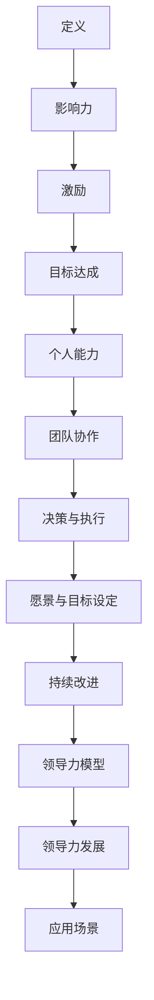

在这个流程图中，领导力从定义开始，通过影响力、激励、目标达成等环节，最终形成一个动态的领导力模型，这个模型不仅包括个人能力的培养，也涵盖了团队协作、决策与执行、愿景与目标设定以及持续改进。

##### 1.2 领导力的重要性

领导力的重要性不容忽视。首先，它直接影响到团队的效率和成果。一个高效的领导者能够明确目标、制定计划，并激励团队成员为实现这些目标而努力。此外，领导力在组织变革中发挥着关键作用。在面对外部挑战和内部变革时，领导者需要具备洞察力和灵活性，以引导组织顺利过渡。

从数学模型的角度来看，领导力的重要性可以用以下公式表示：

$$
\text{团队绩效} = f(\text{领导力}, \text{团队协作}, \text{环境适应})
$$

其中，领导力是影响团队绩效的关键因素，团队协作和环境适应也在其中起到重要作用。

##### 1.3 领导力的核心要素

领导力包括多个核心要素，以下是其中几个关键要素的简要说明：

1. **影响力**：领导者需要具备影响他人思想和行为的能力。这种能力可以通过说服力、榜样作用和建立信任来实现。

2. **激励**：领导者需要能够激励团队成员，激发他们的潜力，并帮助他们克服困难和挑战。

3. **沟通**：良好的沟通能力是领导者必备的技能。它包括倾听、表达和反馈，能够帮助领导者与团队成员建立有效的沟通渠道。

4. **决策**：领导者需要在不确定性中做出明智的决策。这需要领导者具备分析问题的能力、判断力以及承担责任的勇气。

5. **适应能力**：在快速变化的环境中，领导者需要具备适应能力，能够灵活调整策略以应对新挑战。

#### 第2章：领导风格与人际关系

##### 2.1 领导风格的类型

领导风格是指领导者通过特定方式管理和影响团队成员的行为和态度。常见的领导风格包括：

1. **权威型领导**：领导者具有高度的决策权和控制权，通常直接指示团队成员完成任务。

2. **民主型领导**：领导者鼓励团队成员参与决策过程，重视团队成员的意见和建议。

3. **参与型领导**：领导者与团队成员建立良好的合作关系，共同完成任务。

4. **教练型领导**：领导者注重团队成员的成长和发展，提供指导和反馈，帮助他们实现个人目标。

以下是每种领导风格的一个简要说明及其 Mermaid 流程图：

**权威型领导**：

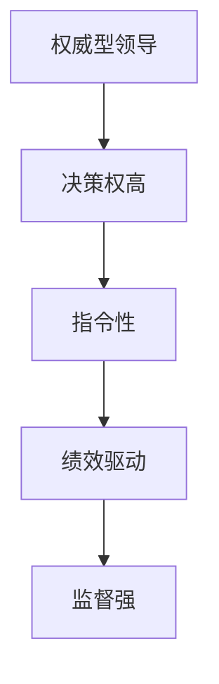

**民主型领导**：

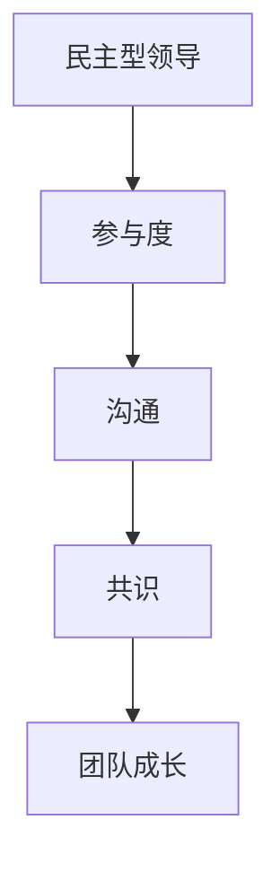

**参与型领导**：

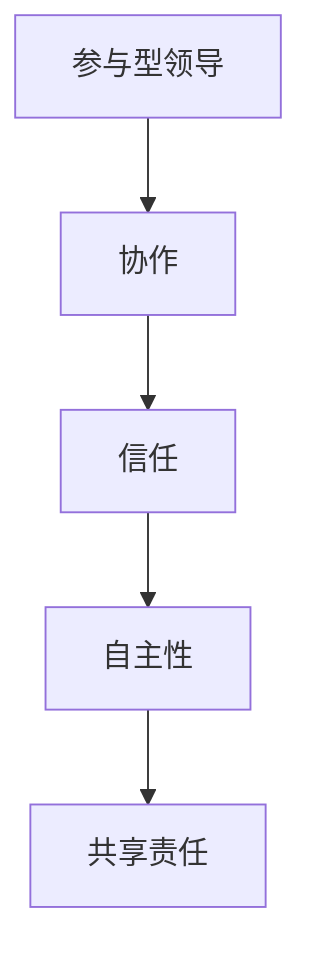

**教练型领导**：

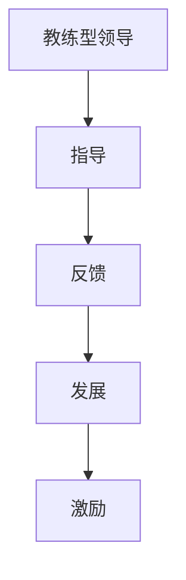

##### 2.2 人际关系的重要性

人际关系在领导力中起着至关重要的作用。良好的人际关系能够促进团队协作，增强团队凝聚力，提高工作效率。以下是人际关系对领导力的影响：

1. **沟通**：良好的人际关系有助于建立有效的沟通渠道，减少误解和冲突。

2. **信任**：信任是团队协作的基础。领导者通过建立信任，能够更好地激励和引导团队成员。

3. **团队合作**：良好的人际关系能够促进团队合作，共同实现团队目标。

4. **个人发展**：领导者与团队成员建立良好的人际关系，有助于了解团队成员的需求和潜力，从而提供个性化的指导和支持。

##### 2.3 建立和维护良好的人际关系

建立和维护良好的人际关系需要领导者的持续努力。以下是一些建议：

1. **倾听**：领导者应该认真倾听团队成员的意见和建议，尊重他们的想法。

2. **沟通**：领导者应该保持开放的沟通态度，定期与团队成员交流，分享团队目标和进展。

3. **支持**：领导者应该为团队成员提供必要的支持，包括资源、培训和指导。

4. **反馈**：领导者应该及时给予团队成员反馈，肯定他们的成绩，指出改进的方向。

5. **信任**：领导者应该通过行动建立信任，包括兑现承诺、透明决策和公平对待。

通过上述措施，领导者能够建立和维护良好的人际关系，从而提升领导力，实现团队的成功。

#### 第3章：情商与领导力

##### 3.1 情商的定义与重要性

情商（Emotional Intelligence，简称EQ）是指个体识别、理解、管理自己情绪以及识别、理解并影响他人情绪的能力。情商不仅影响个体的心理健康，还对其职业成功和社会交往产生深远影响。

情商的重要性可以从以下几个方面体现：

1. **人际关系**：高情商的人更容易建立良好的人际关系，因为他们能够理解和回应他人的情感需求。

2. **职业发展**：情商对职业成功至关重要。高情商的人能够更好地处理压力、解决问题和应对挫折。

3. **领导力**：情商是领导力的重要组成部分。领导者需要具备高情商，以便更好地管理情绪、激励团队成员和解决冲突。

4. **团队合作**：高情商的团队成员能够更好地协作，因为他们能够理解和支持他人的情感需求。

以下是情商的 Mermaid 流程图，展示了情商的核心构成：

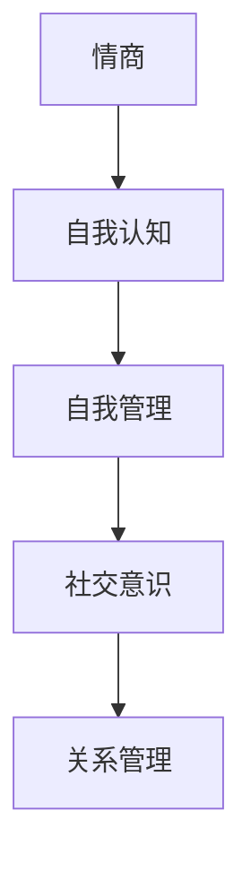

##### 3.2 情商的四大要素

情商通常被划分为四个主要要素：自我认知、自我管理、社交意识和关系管理。以下是每个要素的详细说明：

1. **自我认知**：自我认知是指个体对自己情绪的认识和了解。它包括识别情绪、理解情绪对自己的影响以及情绪的起因。

2. **自我管理**：自我管理是指个体如何调节和控制自己的情绪。这包括情绪调节、情绪表达和情绪释放。

3. **社交意识**：社交意识是指个体对他人类别情绪的认识和理解。它包括同理心、观察他人情绪和识别他人情绪。

4. **关系管理**：关系管理是指个体如何处理和维护人际关系。它包括建立信任、处理冲突和建立有效的沟通渠道。

以下是情商四大要素的 Mermaid 流程图：


##### 3.3 提高情商的途径

提高情商需要持续的学习和实践。以下是一些有效的方法：

1. **自我反思**：通过自我反思，个体可以更好地了解自己的情绪和行为，从而做出更明智的决策。

2. **情绪调节训练**：情绪调节训练包括深呼吸、冥想和正念练习，有助于个体更好地管理自己的情绪。

3. **同理心练习**：通过角色扮演、观察他人和倾听他人的故事，个体可以培养同理心，更好地理解他人的情感需求。

4. **社交技能训练**：社交技能训练包括沟通技巧、冲突解决和建立信任，有助于个体在人际交往中更加自信和有效。

5. **阅读和研讨会**：阅读相关的书籍、参加研讨会和工作坊，可以提供更多的知识和实践技巧，帮助个体提高情商。

#### 第4章：领导力与团队管理

##### 4.1 团队管理的关键要素

团队管理是领导力的核心组成部分，涉及到多个关键要素。以下是团队管理的一些关键要素及其重要性：

1. **目标设定**：明确的目标是团队工作的基石。领导者需要设定清晰的目标，并确保团队成员理解并认同这些目标。

2. **角色分配**：每个团队成员都应明确自己的角色和职责，以便更好地协作和完成任务。

3. **沟通**：有效的沟通是团队管理的核心。领导者需要建立开放的沟通渠道，确保信息透明和及时传达。

4. **激励**：领导者需要通过激励措施来激发团队成员的积极性和创造力，以实现团队目标。

5. **冲突解决**：团队冲突是不可避免的，但有效的冲突解决能够确保团队保持高效运作。

以下是团队管理关键要素的 Mermaid 流程图：

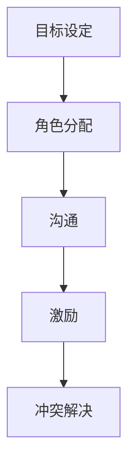

##### 4.2 建立高效团队

建立高效团队是领导者的重要任务。以下是一些关键步骤和方法：

1. **明确目标和愿景**：领导者需要与团队成员共同确定团队的目标和愿景，以确保团队成员的共同努力。

2. **培养团队文化**：团队文化是团队的核心价值观和行为准则。领导者需要通过实践和宣传来培养和维护团队文化。

3. **加强团队协作**：领导者需要采取措施促进团队成员之间的协作，包括团队建设活动、跨部门合作和知识共享。

4. **提供培训和指导**：领导者需要为团队成员提供必要的培训和指导，以提高其技能和知识，从而提高团队的效率。

5. **激励和认可**：领导者需要通过激励和认可来激励团队成员，以保持其积极性和创造力。

以下是建立高效团队的方法的 Mermaid 流程图：

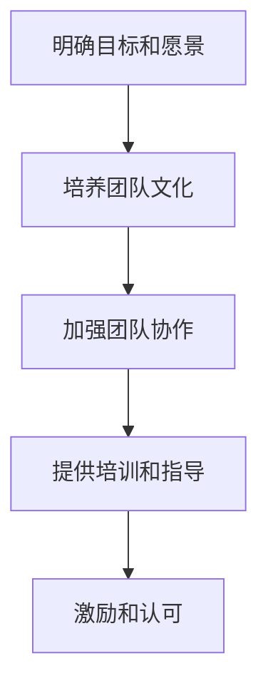

##### 4.3 团队沟通与冲突解决

团队沟通和冲突解决是团队管理的重要组成部分。以下是一些关键技巧和方法：

1. **沟通技巧**：领导者需要具备良好的沟通技巧，包括倾听、表达和反馈。这有助于建立开放的沟通渠道，减少误解和冲突。

2. **冲突管理**：冲突是团队工作中的常见问题。有效的冲突管理包括识别冲突、分析原因、寻求解决方案和确保问题得到解决。

3. **沟通渠道**：领导者需要建立多种沟通渠道，包括会议、邮件、即时通讯和面对面的交流，以确保信息透明和及时传达。

4. **积极聆听**：积极聆听是有效沟通的关键。领导者需要倾听团队成员的意见和需求，并给予反馈。

5. **同理心**：同理心是冲突解决的基石。领导者需要理解他人的观点和感受，以便找到共同的解决方案。

以下是团队沟通和冲突解决技巧的 Mermaid 流程图：

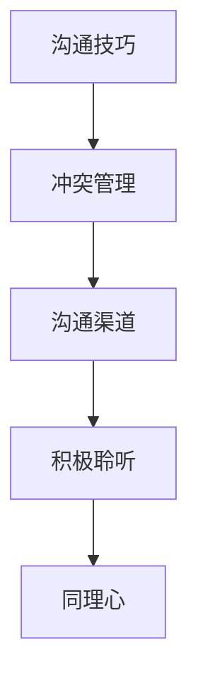

#### 第5章：领导力发展路径

##### 5.1 自我认知与自我提升

自我认知是领导力发展的重要基础。通过自我认知，领导者可以更好地了解自己的优势和劣势，从而制定个人发展计划。以下是一些关键步骤：

1. **自我反思**：定期进行自我反思，了解自己的行为、情绪和动机。

2. **获取反馈**：向同事、朋友和下属寻求反馈，了解他们在你身上的观察和评价。

3. **评估技能和知识**：识别自己的技能和知识差距，并制定计划来提升这些能力。

4. **设定个人目标**：根据自我认知和反馈，设定清晰的个人发展目标。

5. **持续学习**：通过阅读、培训和实践来不断提升自己的技能和知识。

以下是自我认知与自我提升的 Mermaid 流程图：

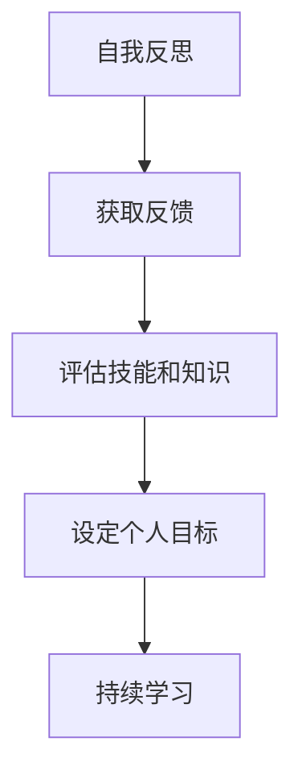

##### 5.2 学习与成长

学习与成长是领导力发展的关键因素。以下是一些关键步骤：

1. **制定学习计划**：根据个人目标和兴趣，制定详细的学习计划。

2. **参加培训课程**：参加相关的领导力培训课程，以获取新的知识和技能。

3. **阅读书籍和文章**：阅读领导力、管理和自我提升相关的书籍和文章。

4. **实践应用**：将所学知识和技能应用到实际工作中，通过实践来提升能力。

5. **反思和调整**：定期反思学习成果，并根据实际情况调整学习计划。

以下是学习与成长的 Mermaid 流程图：

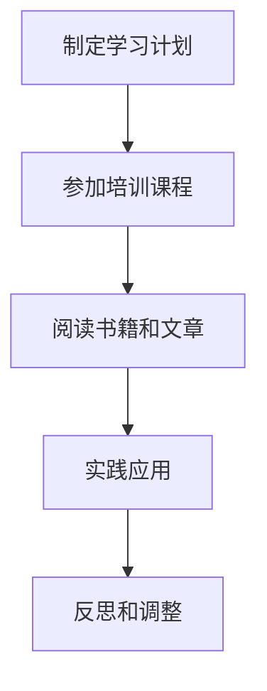

##### 5.3 领导力的持续发展

领导力的持续发展是领导者长期成功的关键。以下是一些关键步骤：

1. **建立网络**：与其他领导者建立联系，分享经验和资源。

2. **持续学习**：领导力是不断发展的领域，领导者需要持续学习新知识和技能。

3. **寻求反馈**：定期寻求反馈，了解自己在领导力方面的进步和改进方向。

4. **参与领导力发展项目**：参加领导力发展项目，如研讨会、工作坊和领导力培训。

5. **培养下一代领导者**：作为经验丰富的领导者，帮助培养下一代领导者，传承领导力。

以下是领导力持续发展的 Mermaid 流程图：

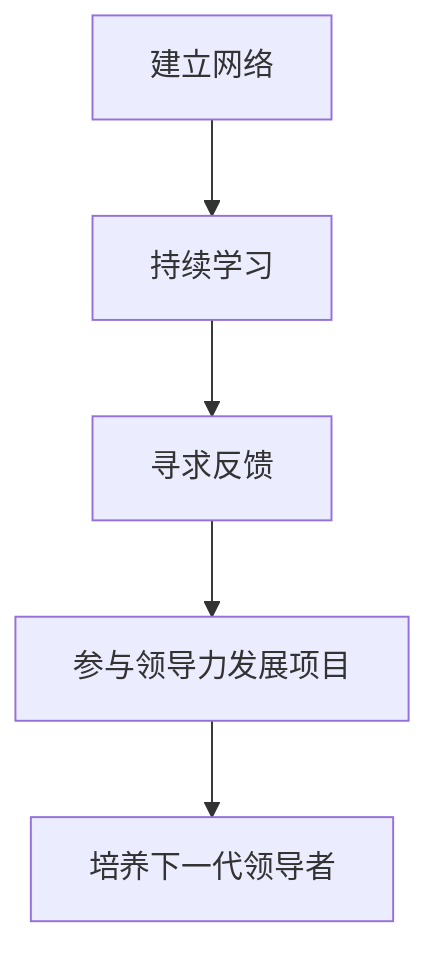

### 第二部分：情商提升技巧

#### 第6章：自我情绪管理

##### 6.1 情绪识别

情绪识别是情商的基础，指的是能够准确地识别和理解自己和他人的情绪状态。以下是一些情绪识别的关键步骤：

1. **自我观察**：通过自我观察，识别自己情绪的变化，如焦虑、快乐、愤怒或悲伤。

2. **情绪日记**：记录自己的情绪变化，有助于更好地理解情绪的触发因素和反应模式。

3. **情绪标签**：给情绪贴上标签，如愤怒、焦虑、平静或兴奋，以便更好地识别和理解。

4. **倾听他人**：通过倾听他人，了解他们的情绪状态，并尝试从他们的角度看待问题。

以下是情绪识别的 Mermaid 流程图：

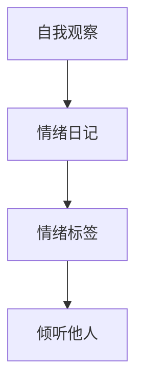

##### 6.2 情绪调节

情绪调节是指通过一系列策略和技巧来管理自己的情绪，以保持积极和健康的心态。以下是一些情绪调节的方法：

1. **深呼吸**：深呼吸有助于放松身体，减轻紧张和焦虑。

2. **冥想**：冥想可以帮助人们专注于当下，减少杂念和负面情绪。

3. **正念练习**：正念练习是通过有意识地关注当前的经验来提高自我意识和情绪调节能力。

4. **认知重构**：认知重构是一种心理技巧，通过改变消极的思维模式来调节情绪。

以下是情绪调节的 Mermaid 流程图：

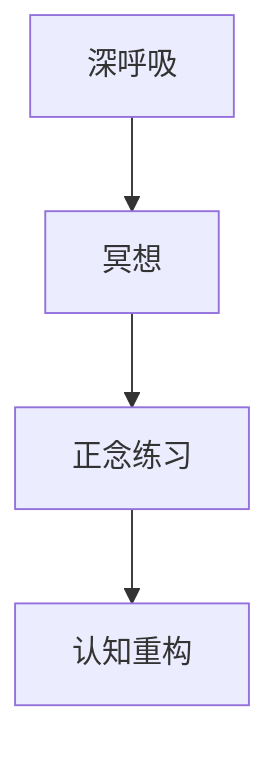

##### 6.3 增强情绪稳定性

增强情绪稳定性是指通过一系列策略和习惯来提高自己在面对压力和挑战时的情绪稳定性。以下是一些增强情绪稳定性的方法：

1. **建立健康的生活习惯**：保持健康的饮食、充足的睡眠和适度的运动，有助于提高情绪稳定性。

2. **培养乐观态度**：通过积极思考和乐观态度来应对生活中的挑战。

3. **建立支持网络**：与家人、朋友和同事建立良好的关系，以获得情感支持和帮助。

4. **学会放松**：通过阅读、听音乐、散步或进行其他放松活动来减轻压力。

以下是增强情绪稳定性的 Mermaid 流程图：

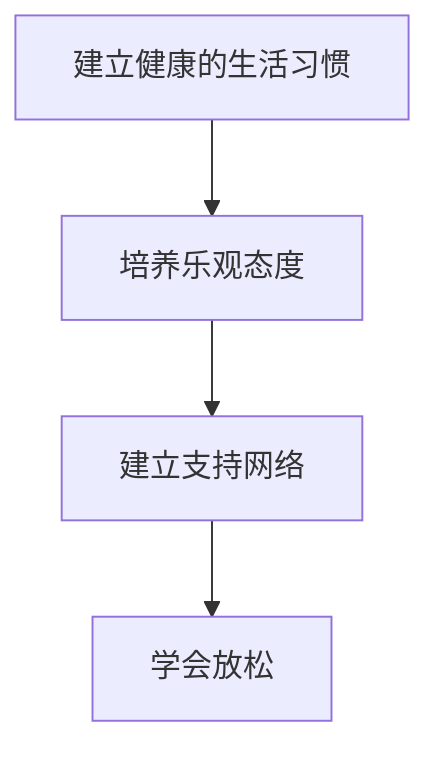

#### 第7章：同理心与人际互动

##### 7.1 同理心的定义与重要性

同理心是指能够理解和感受他人情绪和感受的能力。它是建立深厚人际关系的基石，对于个人成长和职业成功都至关重要。以下是同理心的定义和重要性：

1. **定义**：同理心（Empathy）是指能够从他人的角度理解他们的感受和经历，并表现出相应的情感反应。

2. **重要性**：同理心的重要性体现在以下几个方面：

   - **人际关系**：同理心有助于建立信任和亲密关系，促进沟通和理解。

   - **领导力**：领导者具备同理心能够更好地激励和引导团队成员，提高团队凝聚力。

   - **职业成功**：同理心有助于在职场中更好地协作和解决问题，提高工作效率和业绩。

以下是同理心的 Mermaid 流程图：

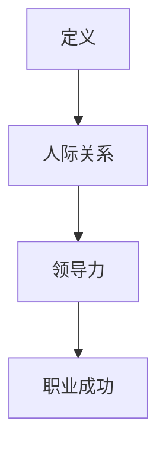

##### 7.2 同理心的实践技巧

要提升同理心，可以通过以下实践技巧：

1. **倾听**：倾听是建立同理心的重要步骤。通过全神贯注地倾听他人，你能够更好地理解他们的感受和需求。

2. **非言语沟通**：注意观察他人的非言语行为，如肢体语言、面部表情和语调，这些可以帮助你更准确地理解他们的情绪。

3. **分享感受**：在适当的时候，分享你的感受和看法，以建立共鸣和信任。

4. **保持开放态度**：对待他人的观点和感受保持开放态度，避免过早做出判断或批评。

以下是同理心的实践技巧的 Mermaid 流程图：

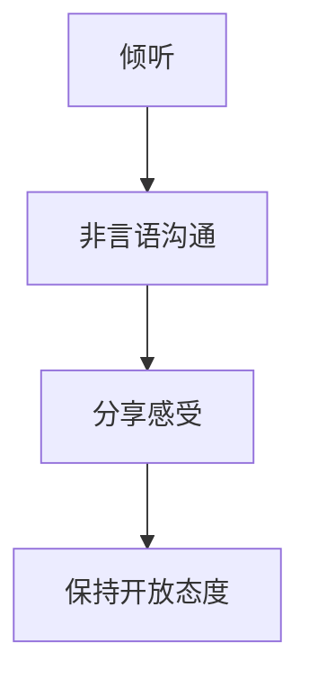

##### 7.3 人际互动中的同理心应用

在人际互动中，同理心可以帮助领导者更好地理解和管理团队成员的情绪，以下是一些应用同理心的场景：

1. **团队成员面临困难时**：通过同理心，领导者能够更好地支持团队成员，帮助他们克服困难。

2. **团队会议中**：同理心有助于领导者更好地理解团队成员的观点和需求，从而促进有效的决策和沟通。

3. **冲突解决**：同理心可以帮助领导者理解冲突双方的感受，找到平衡和解决方案。

4. **激励团队成员**：同理心使领导者能够更好地激励团队成员，因为他们能够理解团队成员的需求和动力。

以下是同理心在人际互动中的应用的 Mermaid 流程图：

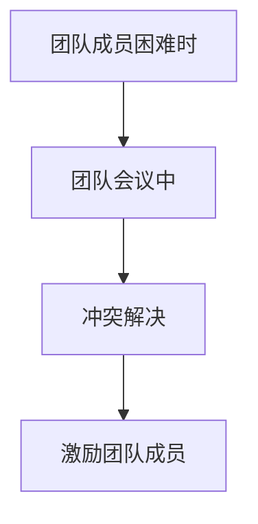

#### 第8章：有效沟通技巧

##### 8.1 沟通的基本原则

有效沟通是领导力的重要组成部分，以下是一些沟通的基本原则：

1. **明确目标**：在沟通前明确沟通的目标，确保信息传递的准确性和有效性。

2. **倾听**：积极倾听对方的意见和需求，以建立互信和有效沟通的基础。

3. **清晰表达**：用简洁明了的语言表达自己的观点，避免使用模糊或混淆的措辞。

4. **非言语沟通**：注意使用肢体语言、面部表情和语调，以增强沟通效果。

5. **反馈**：及时给予反馈，以确认信息的理解和接受情况。

以下是沟通的基本原则的 Mermaid 流程图：

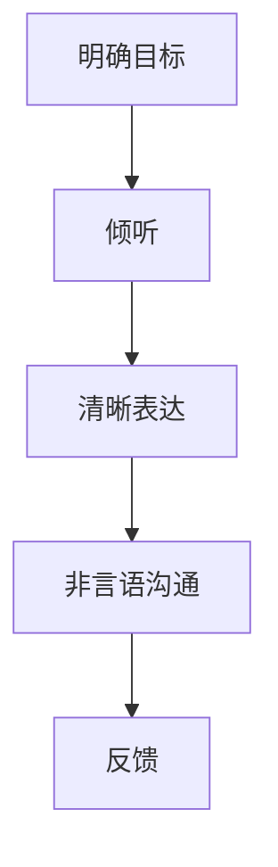

##### 8.2 提高沟通效果

以下是一些提高沟通效果的方法：

1. **使用简洁明了的语言**：避免使用复杂或晦涩的术语，确保信息易于理解。

2. **积极倾听**：通过积极倾听，了解对方的需求和观点，从而更好地回应。

3. **开放性问题**：提出开放性问题，鼓励对方分享更多信息，以促进双向沟通。

4. **注意非言语沟通**：注意自己的肢体语言、面部表情和语调，以增强沟通效果。

5. **反馈机制**：建立反馈机制，确保信息的理解和接受情况。

以下是提高沟通效果的 Mermaid 流程图：

```mermaid
graph TD
A[使用简洁明了的语言] --> B[积极倾听]
B --> C[开放性问题]
C --> D[注意非言语沟通]
D --> E[反馈机制]
```

##### 8.3 沟通中的常见问题及解决策略

在沟通过程中，常见的问题包括：

1. **误解和混淆**：解决策略包括确认信息、重复关键点和确保对方理解。

2. **沟通障碍**：解决策略包括简化信息、使用图表和演示来辅助沟通。

3. **情绪干扰**：解决策略包括情绪调节、保持冷静和专注。

以下是沟通中的常见问题及解决策略的 Mermaid 流程图：

```mermaid
graph TD
A[误解和混淆] --> B[沟通障碍]
B --> C[情绪干扰]
```

### 第三部分：人际关系管理

#### 第10章：建立信任

##### 10.1 信任的重要性

信任是人际关系中不可或缺的元素，对于个人和组织的发展至关重要。以下是信任的重要性和建立信任的要素：

1. **重要性**：信任能够促进有效的沟通、增强团队凝聚力、提高工作效率，并降低冲突的风险。

2. **建立信任的要素**：

   - **诚信**：诚实和透明是建立信任的基础。
   - **可靠性**：按时完成任务和履行承诺有助于建立信任。
   - **同理心**：理解和关心他人的需求，能够增强信任。
   - **一致性**：行为和决策的一致性有助于建立长期信任。
   - **隐私保护**：尊重他人的隐私，保守机密信息。

以下是信任的重要性和建立信任要素的 Mermaid 流程图：

```mermaid
graph TD
A[重要性] --> B[诚信]
B --> C[可靠性]
C --> D[同理心]
D --> E[一致性]
E --> F[隐私保护]
```

##### 10.2 建立信任的要素

为了建立信任，可以采取以下措施：

1. **明确沟通**：确保信息传递清晰，减少误解和混淆。

2. **履行承诺**：始终保持承诺，即使遇到困难也要尽力履行。

3. **保持一致性**：在行为和决策上保持一致，避免突然改变立场。

4. **倾听和理解**：倾听他人的意见和需求，并展现出真正的关心。

5. **尊重隐私**：保护他人的隐私，避免泄露敏感信息。

以下是建立信任的要素的 Mermaid 流程图：

```mermaid
graph TD
A[明确沟通] --> B[履行承诺]
B --> C[保持一致性]
C --> D[倾听和理解]
D --> E[尊重隐私]
```

##### 10.3 保持信任的方法

为了保持信任，可以采取以下策略：

1. **持续沟通**：定期与团队成员沟通，确保信息透明和及时传达。

2. **积极反馈**：给予团队成员积极反馈，认可他们的努力和成就。

3. **诚信行为**：始终言行一致，保持诚信。

4. **解决问题**：遇到问题时，积极寻求解决方案，避免推卸责任。

5. **持续学习**：不断学习新知识和技能，以提高自身的专业素养。

以下是保持信任的方法的 Mermaid 流程图：

```mermaid
graph TD
A[持续沟通] --> B[积极反馈]
B --> C[诚信行为]
C --> D[解决问题]
D --> E[持续学习]
```

#### 第11章：有效团队合作

##### 11.1 团队合作的关键要素

有效团队合作是实现组织目标的关键。以下是团队合作的关键要素：

1. **明确的目标**：团队需要明确共同的目标和愿景，以保持一致的努力方向。

2. **分工合作**：根据团队成员的专长和能力，合理分配任务，确保每个成员都能发挥其优势。

3. **有效沟通**：建立开放的沟通渠道，确保团队成员之间的信息传递畅通无阻。

4. **相互信任**：信任是团队合作的基础，团队成员需要相互信任，共同克服困难。

5. **积极互动**：鼓励团队成员之间的积极互动，分享经验和知识，以提高团队整体能力。

以下是团队合作的关键要素的 Mermaid 流程图：

```mermaid
graph TD
A[明确的目标] --> B[分工合作]
B --> C[有效沟通]
C --> D[相互信任]
D --> E[积极互动]
```

##### 11.2 促进团队合作的方法

以下是一些促进团队合作的方法：

1. **团队建设活动**：通过团队建设活动，增强团队成员之间的信任和合作。

2. **目标设定**：共同设定团队目标，明确责任和期望。

3. **角色分配**：确保每个团队成员都了解自己的角色和职责。

4. **定期反馈**：定期评估团队进展，提供积极反馈和建议。

5. **鼓励分享**：鼓励团队成员分享经验和想法，促进知识共享。

以下是促进团队合作的方法的 Mermaid 流程图：

```mermaid
graph TD
A[团队建设活动] --> B[目标设定]
B --> C[角色分配]
C --> D[定期反馈]
D --> E[鼓励分享]
```

##### 11.3 团队合作中的挑战及应对

团队合作中可能会遇到以下挑战：

1. **沟通障碍**：解决策略包括建立有效的沟通渠道、鼓励开放沟通和定期会议。

2. **角色冲突**：解决策略包括明确角色和职责、鼓励沟通和理解。

3. **目标不一致**：解决策略包括重新设定目标、明确责任和期望。

4. **团队冲突**：解决策略包括中立调解、倾听各方意见和寻找共同点。

以下是团队合作中的挑战及应对策略的 Mermaid 流程图：

```mermaid
graph TD
A[沟通障碍] --> B[角色冲突]
B --> C[目标不一致]
C --> D[团队冲突]
```

#### 第12章：冲突与问题解决

##### 12.1 冲突的定义与类型

冲突是指由于不同观点、利益或需求而产生的对立或争议。冲突可以分为以下几种类型：

1. **人际冲突**：涉及个人之间的关系，如同事之间的争执。

2. **过程冲突**：涉及工作流程或方法，如团队内部对于最佳工作方式的分歧。

3. **结构冲突**：涉及组织结构和角色分配，如角色重叠或职责不明确。

以下是冲突类型的 Mermaid 流程图：

```mermaid
graph TD
A[人际冲突] --> B[过程冲突]
B --> C[结构冲突]
```

##### 12.2 冲突管理策略

有效的冲突管理策略有助于缓解紧张情绪，促进问题的解决。以下是一些常见的冲突管理策略：

1. **倾听和理解**：倾听各方意见，理解不同观点和需求。

2. **中立调解**：作为中立的第三方，帮助双方找到共同点。

3. **协商和妥协**：在双方利益的基础上，寻求妥协和共识。

4. **积极沟通**：保持开放和积极的沟通态度，以解决问题。

以下是冲突管理策略的 Mermaid 流程图：

```mermaid
graph TD
A[倾听和理解] --> B[中立调解]
B --> C[协商和妥协]
C --> D[积极沟通]
```

##### 12.3 冲突中的心理调适

在处理冲突时，心理调适对于个人的情绪管理和决策至关重要。以下是一些心理调适的方法：

1. **情绪调节**：通过深呼吸、冥想或正念练习来缓解紧张情绪。

2. **同理心**：尝试从对方的角度理解问题，以减少情绪对立。

3. **保持冷静**：在冲突中保持冷静，避免冲动行为。

4. **寻求支持**：向朋友、家人或专业人士寻求情感支持。

以下是冲突中的心理调适方法的 Mermaid 流程图：

```mermaid
graph TD
A[情绪调节] --> B[同理心]
B --> C[保持冷静]
C --> D[寻求支持]
```

##### 12.4 问题解决策略

问题解决是冲突管理的核心。以下是一些有效的问题解决策略：

1. **明确问题**：准确界定问题，避免混淆或误解。

2. **收集信息**：收集与问题相关的信息，了解各种观点和需求。

3. **分析原因**：分析问题的根本原因，找出可能的解决方案。

4. **评估方案**：评估各种方案的优缺点，选择最佳解决方案。

5. **实施和监控**：实施解决方案，并监控其效果，以确保问题得到解决。

以下是问题解决策略的 Mermaid 流程图：

```mermaid
graph TD
A[明确问题] --> B[收集信息]
B --> C[分析原因]
C --> D[评估方案]
D --> E[实施和监控]
```

##### 12.5 复杂问题解决案例分析

以下是一个复杂的冲突解决案例分析：

**案例背景**：某公司的项目团队在项目开发过程中遇到了严重的时间压力，导致团队成员之间的冲突加剧。团队成员A和B在如何平衡项目进度和质量上产生了分歧。

**冲突类型**：过程冲突和人际冲突。

**解决过程**：

1. **明确问题**：项目经理组织了一次会议，明确了团队成员在时间和质量上的分歧。

2. **收集信息**：项目经理收集了团队成员A和B的观点和需求，了解了他们在项目进度和质量上的不同看法。

3. **分析原因**：项目经理分析了冲突的根本原因，发现团队成员A担心项目进度会影响质量，而团队成员B则认为可以采取加班来确保进度。

4. **评估方案**：项目经理提出了两个方案：一是调整项目计划，延长开发周期，二是通过加班确保项目进度。评估后，选择了第二个方案。

5. **实施和监控**：项目经理制定了详细的加班计划，并监控了团队成员的执行情况。经过一段时间的努力，项目最终按期完成，质量也得到了保证。

通过这个案例，我们可以看到，复杂问题的解决需要多方面的分析和策略，而有效的沟通和协调是关键。

### 第四部分：领导力与情商应用实践

#### 第13章：领导力与情商在日常管理中的应用

##### 13.1 领导力在日常管理中的实践

在日常管理中，领导力发挥着至关重要的作用。以下是一些领导力在日常管理中的实践方法：

1. **目标设定**：领导者需要明确团队的目标和愿景，确保团队成员理解并致力于实现这些目标。

2. **角色分配**：根据团队成员的专长和能力，合理分配任务，确保每个成员都能发挥其优势。

3. **沟通**：建立有效的沟通渠道，确保信息的透明和及时传达，减少误解和冲突。

4. **激励**：通过认可和奖励，激励团队成员的积极性和创造力。

5. **冲突解决**：及时解决团队内部的冲突，维护团队的和谐与稳定。

以下是领导力在日常管理中实践的 Mermaid 流程图：

```mermaid
graph TD
A[目标设定] --> B[角色分配]
B --> C[沟通]
C --> D[激励]
D --> E[冲突解决]
```

##### 13.2 情商在管理中的实践

情商在管理中的应用同样重要。以下是一些情商在管理中的实践方法：

1. **情绪识别**：领导者需要能够识别和理解自己和他人的情绪，以便更好地管理情绪和沟通。

2. **同理心**：领导者需要具备同理心，能够从团队成员的角度理解他们的感受和需求。

3. **情绪调节**：领导者需要学会调节自己的情绪，以保持冷静和专注，避免情绪波动对决策产生影响。

4. **冲突管理**：领导者需要运用情商技能，以同理心和理解的方式处理冲突，找到平衡和解决方案。

5. **团队建设**：通过情商实践，领导者可以建立更紧密的团队关系，提高团队的凝聚力和协作效率。

以下是情商在管理中实践的 Mermaid 流程图：

```mermaid
graph TD
A[情绪识别] --> B[同理心]
B --> C[情绪调节]
C --> D[冲突管理]
D --> E[团队建设]
```

##### 13.3 综合应用的案例分析

以下是一个领导力与情商综合应用的案例分析：

**案例背景**：某公司的一个项目团队在项目开发过程中遇到了严重的进度延误和团队内部的紧张气氛。

**解决方案**：

1. **领导力实践**：

   - **目标设定**：项目经理与团队成员共同讨论并明确了项目的重要目标和截止日期。

   - **角色分配**：根据团队成员的专长和能力，重新调整了任务分配，确保每个成员都能发挥其优势。

   - **沟通**：项目经理建立了定期的团队会议，确保团队成员能够及时沟通项目进展和遇到的困难。

   - **激励**：项目经理对表现出色的团队成员给予了表扬和奖励，激励了团队士气。

   - **冲突解决**：项目经理及时解决了团队内部因任务分配不公而产生的冲突，维护了团队的和谐。

2. **情商实践**：

   - **情绪识别**：项目经理通过倾听和观察，识别了团队成员因进度延误而产生的焦虑和不满情绪。

   - **同理心**：项目经理以同理心对待团队成员的情绪，理解他们的压力和担忧。

   - **情绪调节**：项目经理通过冥想和深呼吸练习，调节自己的情绪，保持冷静和专注。

   - **冲突管理**：项目经理以同理心和公正的方式处理团队冲突，寻找平衡和解决方案。

通过这个案例，我们可以看到领导力与情商在实践中的应用，对于解决复杂问题和提高团队效率具有重要意义。

### 第14章：领导力与情商在特殊情境下的应用

##### 14.1 应对危机情境

在特殊情境下，如危机管理、突发事件处理等，领导力与情商的应用尤为重要。以下是一些应对危机情境的策略：

1. **快速反应**：领导者需要具备快速反应能力，迅速评估危机状况，并采取相应措施。

2. **保持冷静**：在危机中保持冷静和理智，避免情绪化的决策。

3. **沟通**：及时沟通，确保团队成员了解危机状况，共同应对挑战。

4. **激励**：通过激励和鼓舞，增强团队成员的信心和合作精神。

5. **资源调配**：合理调配资源，确保有足够的资源和人力来应对危机。

以下是应对危机情境的 Mermaid 流程图：

```mermaid
graph TD
A[快速反应] --> B[保持冷静]
B --> C[沟通]
C --> D[激励]
D --> E[资源调配]
```

##### 14.2 管理变革过程中的情商应用

在组织变革过程中，情商的应用有助于减少变革带来的不安和抗拒，以下是一些策略：

1. **同理心**：领导者需要理解员工在变革过程中的感受，关心他们的需求和担忧。

2. **透明沟通**：保持信息透明，及时传达变革的原因、目标和影响。

3. **员工参与**：鼓励员工参与变革过程，提高他们的参与感和认同感。

4. **培训与支持**：提供必要的培训和资源支持，帮助员工适应变革。

5. **激励与认可**：通过激励和认可，鼓励员工积极面对变革，减少抵触情绪。

以下是管理变革过程中的情商应用的 Mermaid 流程图：

```mermaid
graph TD
A[同理心] --> B[透明沟通]
B --> C[员工参与]
C --> D[培训与支持]
D --> E[激励与认可]
```

##### 14.3 领导力在组织发展中的应用

领导力在组织发展中起着关键作用，以下是一些领导力在组织发展中的应用策略：

1. **愿景与目标设定**：领导者需要明确组织的愿景和目标，并确保团队成员认同并致力于实现这些目标。

2. **战略规划**：制定长期的战略规划，确保组织的发展方向与市场趋势和内部能力相匹配。

3. **团队建设**：通过团队建设活动，提高团队的凝聚力和协作效率。

4. **领导力传承**：培养下一代领导者，确保组织的长期发展。

5. **创新与变革**：鼓励创新思维和变革，以适应不断变化的市场环境。

以下是领导力在组织发展中的应用的 Mermaid 流程图：

```mermaid
graph TD
A[愿景与目标设定] --> B[战略规划]
B --> C[团队建设]
C --> D[领导力传承]
D --> E[创新与变革]
```

### 第15章：领导力与情商的自我评估与提升

##### 15.1 自我评估工具

自我评估是提升领导力和情商的重要步骤。以下是一些常用的自我评估工具：

1. **360度反馈**：通过同事、下属和上级的评价，全面了解自己的领导力表现。

2. **情商评估问卷**：通过标准化的问卷，评估自己在情商各个方面的表现。

3. **行为观察**：通过观察自己在不同情境下的行为和反应，了解自己的领导力和情商。

以下是自我评估工具的 Mermaid 流程图：

```mermaid
graph TD
A[360度反馈] --> B[情商评估问卷]
B --> C[行为观察]
```

##### 15.2 提升领导力与情商的策略

为了提升领导力和情商，可以采取以下策略：

1. **持续学习**：通过阅读、培训和实践，不断学习和提升自己的知识和技能。

2. **反馈与改进**：定期获取反馈，识别自己的不足，并采取措施进行改进。

3. **角色扮演**：通过角色扮演和模拟练习，提升领导力和情商的实践能力。

4. **自我反思**：通过自我反思，深入理解自己的行为和决策，找到改进的方向。

以下是提升领导力与情商策略的 Mermaid 流程图：

```mermaid
graph TD
A[持续学习] --> B[反馈与改进]
B --> C[角色扮演]
C --> D[自我反思]
```

##### 15.3 持续发展的路径

领导力与情商的提升是一个持续发展的过程。以下是一些持续发展的路径：

1. **建立个人发展计划**：根据自我评估和反馈，制定个人发展计划，明确目标和步骤。

2. **参与领导力发展项目**：参加领导力发展项目，如研讨会、工作坊和领导力培训。

3. **建立支持网络**：与其他领导者建立联系，分享经验和资源，共同成长。

4. **持续反思和调整**：定期反思自己的领导力和情商表现，根据实际情况进行调整。

以下是持续发展路径的 Mermaid 流程图：

```mermaid
graph TD
A[建立个人发展计划] --> B[参与领导力发展项目]
B --> C[建立支持网络]
C --> D[持续反思和调整]
```

### 附录A：领导力与情商相关工具与方法

#### 附录A.1 360度反馈

360度反馈是一种全面的评估方法，通过同事、下属和上级的反馈，全面了解个人的领导力和情商表现。以下是360度反馈的实施步骤：

1. **确定评估对象**：确定需要接受评估的个体。

2. **设计问卷**：设计包含领导力、情商等方面的评估问卷。

3. **收集反馈**：通过匿名问卷或面对面访谈的方式，收集来自不同角度的反馈。

4. **分析反馈**：对收集到的反馈进行分析，识别优点和改进点。

5. **反馈与改进**：将分析结果反馈给评估对象，讨论改进措施。

以下是360度反馈流程的 Mermaid 流程图：

```mermaid
graph TD
A[确定评估对象] --> B[设计问卷]
B --> C[收集反馈]
C --> D[分析反馈]
D --> E[反馈与改进]
```

#### 附录A.2 领导力发展中心

领导力发展中心是一种集中培训和学习的地方，提供领导力发展的各种资源和机会。以下是领导力发展中心的常见功能：

1. **领导力培训课程**：提供各种领导力培训课程，包括演讲技巧、团队管理、决策制定等。

2. **研讨会和工作坊**：组织领导力研讨会和工作坊，促进领导者之间的交流和分享。

3. **案例研究**：通过案例分析，帮助领导者理解实际情境中的领导力应用。

4. **模拟训练**：提供模拟训练环境，让领导者实践和应用所学知识。

以下是领导力发展中心的 Mermaid 流程图：

```mermaid
graph TD
A[领导力培训课程] --> B[研讨会和工作坊]
B --> C[案例研究]
C --> D[模拟训练]
```

#### 附录A.3 情商提升训练工具

情商提升训练工具帮助个体识别、理解和管理自己的情绪，以下是一些常见的情商提升训练工具：

1. **情绪日记**：记录自己的情绪变化，分析情绪的触发因素和反应模式。

2. **情绪调节练习**：通过深呼吸、冥想和正念练习来调节情绪。

3. **同理心练习**：通过角色扮演和情景模拟来培养同理心。

4. **沟通技巧训练**：通过角色扮演和模拟对话来提升沟通技巧。

以下是情商提升训练工具的 Mermaid 流程图：

```mermaid
graph TD
A[情绪日记] --> B[情绪调节练习]
B --> C[同理心练习]
C --> D[沟通技巧训练]
```

### 附录B：推荐阅读与资源

#### 附录B.1 领导力经典书籍

1. **《领导力》（Leadership）** — John Maxwell  
   本书提供了全面的领导力理论，包括领导力的定义、类型和核心要素。

2. **《变革之舞》（The Dance of Change）** — Warren Bennis & Burt Nanus  
   本书探讨了组织变革的过程，以及领导者如何在变革中发挥关键作用。

3. **《第五项修炼》（The Fifth Discipline）** — Peter Senge  
   本书介绍了系统思考的方法，帮助领导者理解复杂系统的动态，并提高其领导力。

#### 附录B.2 情商提升实践指南

1. **《情商：为什么情商比智商更重要》（Emotional Intelligence）** — Daniel Goleman  
   本书详细介绍了情商的概念、要素和应用，是情商研究的经典之作。

2. **《同理心：如何提高情商》（Empathy：Why It Matters and How to Get It）** — Roman Krznaric  
   本书探讨了同理心的重要性，以及如何通过实践提高同理心。

3. **《掌控自我：如何管理情绪》（Self-Mastery：How to Control Your Emotions）** — Mark Manson  
   本书提供了实用的情绪管理技巧，帮助读者掌控自己的情绪。

#### 附录B.3 领导力与情商在线资源

1. **领导力发展中心**（Leadership Development Center） - 提供领导力培训课程、研讨会和工作坊。

2. **情商协会**（Emotional Intelligence Association） - 提供关于情商的研究、资源和培训。

3. **TED演讲**（TED Talks） - 包含许多关于领导力和情商的精彩演讲，提供启发和灵感。

### 作者信息

**作者：** AI天才研究院 / AI Genius Institute & 禅与计算机程序设计艺术 / Zen And The Art of Computer Programming

这篇文章以逻辑清晰、结构紧凑、简单易懂的专业的技术语言，详细探讨了领导力与情商在人际关系管理中的重要性。通过深入分析领导力的定义、情商的构成以及人际关系管理的关键环节，文章提供了实用的方法和技巧，帮助读者提升领导力和情商，建立和维护良好的人际关系，从而实现个人与组织的共同成长。文章结合了核心概念、算法原理、数学模型、项目实战等多方面的内容，确保了内容的完整性、逻辑性和实用性。希望这篇文章能够为读者在职场中的发展提供有价值的参考和指导。作者AI天才研究院致力于推动人工智能领域的创新与发展，禅与计算机程序设计艺术则专注于探索计算机科学与人性的融合，期待与读者共同探索技术的无限可能。

