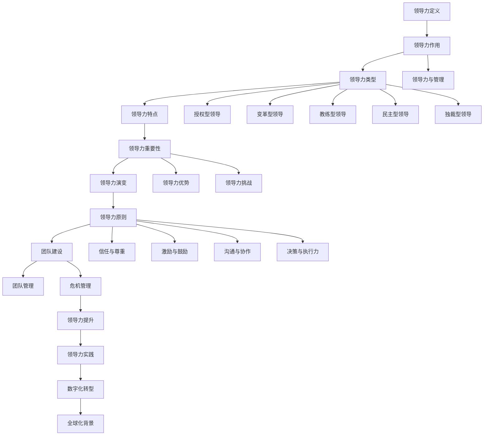

                 

# 《领导力法则：打造超级团队的领导力秘诀》

## 摘要

在当今快速变化和竞争激烈的环境中，领导力对于组织的成功至关重要。本文深入探讨了领导力的核心概念、原则和实践方法，旨在帮助领导者打造超级团队。通过分析领导力的定义、类型、核心原则以及团队建设与管理策略，本文揭示了领导力在数字化转型和全球化背景下的重要性。此外，本文还通过实际案例和伪代码展示了领导力评估和提升的方法，为领导者提供了切实可行的指导。

## 目录大纲

### 第一部分：领导力的核心概念与原则

#### 第1章：领导力概述
1.1 领导力的定义与作用
1.2 领导力的类型与特点
1.3 领导力在组织中的重要性
1.4 领导力的演变与发展趋势

#### 第2章：领导者的角色与职责
2.1 领导者的职责
2.2 领导者的角色
2.3 领导者的素质要求
2.4 领导者的自我发展

#### 第3章：领导力的核心原则
3.1 信任与尊重
3.2 激励与鼓励
3.3 沟通与协作
3.4 决策与执行力

### 第二部分：打造超级团队的领导力策略

#### 第4章：团队建设与领导力
4.1 团队建设的意义
4.2 团队角色的定义与定位
4.3 团队文化的塑造
4.4 团队协作与冲突管理

#### 第5章：领导力在团队管理中的应用
5.1 激励策略与团队目标设定
5.2 绩效评估与反馈机制
5.3 领导风格与团队动力
5.4 应对团队困境的策略

#### 第6章：领导力在危机管理中的应用
6.1 危机管理的领导角色
6.2 危机应对策略
6.3 领导者的情绪管理
6.4 危机后的团队重建

### 第三部分：领导力提升与领导力实践

#### 第7章：领导力提升的方法与技巧
7.1 自我反思与反馈
7.2 学习与实践
7.3 情绪管理与自我调适
7.4 领导力模型的构建与应用

#### 第8章：领导力实践案例解析
8.1 成功的领导力实践案例
8.2 失败的领导力实践案例
8.3 案例中的领导力要素分析
8.4 领导力实践的经验与启示

#### 第9章：领导力在数字化转型中的应用
9.1 数字化转型中的领导力挑战
9.2 数字化转型中的领导力策略
9.3 数字化转型中的团队领导力提升
9.4 数字化转型的成功案例解析

#### 第10章：领导力在全球化背景下的应用
10.1 全球化对领导力的影响
10.2 跨文化领导力策略
10.3 全球化团队的管理与领导
10.4 全球化背景下的领导力实践案例

### 附录

#### 附录A：领导力发展资源与工具
A.1 领导力发展书籍推荐
A.2 领导力培训课程推荐
A.3 领导力测评工具与应用
A.4 领导力发展网站与社区推荐

## 第一部分：领导力的核心概念与原则

### 第1章：领导力概述

#### 1.1 领导力的定义与作用

领导力是一个广泛而复杂的概念，它在不同的文化和组织中可能有不同的解释。从根本上讲，领导力是指引导和激励他人共同实现目标的能力。在组织中，领导力不仅是领导者个人的素质，更是一种集体的行为，涉及到整个组织的运作和效率。

首先，我们需要明确领导力与管理的区别。管理通常侧重于规划、组织、协调和控制，以确保资源的有效利用和目标的实现。而领导力则更注重愿景、激励和影响力，它旨在激发团队的潜能，推动创新和变革。

领导力的作用在组织中的体现是多方面的。首先，领导力能够提供方向和目标，明确组织的发展路径。其次，领导力可以激励团队成员，提高他们的工作热情和积极性。此外，领导力还能够促进团队协作，解决冲突，增强团队的凝聚力。

#### 1.2 领导力的类型与特点

领导力可以分为多种类型，每种类型都有其独特的特点和应用场景。以下是几种常见的领导力类型：

1. **授权型领导力**：这种类型的领导力强调赋予团队成员更多的自主权和责任，鼓励他们发挥自己的潜能。这种领导风格通常适用于创新和高风险的环境中。

2. **变革型领导力**：变革型领导力注重推动组织变革和创新，通过激励和启发团队成员来应对挑战和机遇。这种领导风格在组织转型和快速发展阶段尤为重要。

3. **教练型领导力**：教练型领导力强调个性化指导和辅导，帮助团队成员提升技能和职业发展。这种领导风格适用于培养人才和提升团队整体绩效。

4. **民主型领导力**：民主型领导力鼓励团队成员参与决策，尊重他们的意见和建议。这种领导风格有助于增强团队的凝聚力和归属感。

5. **独裁型领导力**：独裁型领导力强调集中决策和控制，领导者拥有最终决策权。这种领导风格在需要迅速决策和高效执行的环境中可能较为适用。

每种领导力类型都有其适用的场景和优势，领导者需要根据实际情况灵活运用不同的领导风格。

#### 1.3 领导力在组织中的重要性

领导力在组织中的重要性不言而喻。首先，领导力是组织成功的关键因素之一。一个优秀的领导者能够为组织提供清晰的愿景和目标，引领团队朝着共同的目标前进。

其次，领导力对团队成员的积极性和创造力有着重要的影响。一个具有领导力的领导者能够激励团队成员，激发他们的工作热情和创造力，从而提高整个团队的绩效。

此外，领导力还能够促进团队协作和解决冲突。在复杂多变的环境中，团队需要紧密协作，共同应对挑战。一个优秀的领导者能够协调不同成员之间的合作，解决冲突，确保团队目标的实现。

#### 1.4 领导力的演变与发展趋势

领导力不是一个静态的概念，它随着时代的变化而不断演变。在过去，领导力主要强调权威和控制，领导者被视为组织的中心。然而，随着社会和技术的进步，领导力的内涵和外延都发生了很大的变化。

首先，领导力越来越注重民主和参与。现代组织强调员工的参与和贡献，领导者不再是高高在上的权威，而是团队成员中的一员，通过沟通和协作来实现共同的目标。

其次，领导力越来越注重创新和变革。在快速变化的市场环境中，领导者需要具备前瞻性和创新能力，引领组织不断适应和变革。

此外，领导力还越来越注重跨文化和全球化。随着全球化的发展，组织需要面对不同文化和背景的员工和客户。领导者需要具备跨文化的敏感性和适应能力，才能在全球化背景下取得成功。

总的来说，领导力的演变和发展趋势表明，领导者需要具备更广泛的技能和视野，能够适应不断变化的环境，引领组织走向未来。

### 第2章：领导者的角色与职责

#### 2.1 领导者的职责

领导者的职责是确保组织目标的实现，并在过程中发挥关键作用。以下是领导者的一些主要职责：

1. **设定愿景和目标**：领导者需要为组织设定清晰、具有挑战性的愿景和目标，确保团队成员明确组织的发展方向和目标。

2. **制定战略和计划**：领导者需要制定实现目标的战略和计划，确保资源的有效配置和合理利用。

3. **指导和支持团队**：领导者需要指导和支持团队成员，帮助他们克服困难，发挥潜能，实现个人和团队目标。

4. **沟通与协作**：领导者需要与团队成员保持良好的沟通，确保信息传递畅通无阻，促进团队协作和合作。

5. **激励与奖励**：领导者需要激励团队成员，提高他们的工作积极性和创造力，同时通过合理的奖励机制来激发团队潜力。

6. **解决问题和决策**：领导者需要能够及时解决问题，做出明智的决策，确保组织目标的顺利实现。

7. **培养人才**：领导者需要关注团队成员的职业发展，培养和提升他们的技能和能力，确保团队的整体素质不断提升。

#### 2.2 领导者的角色

领导者扮演着多种角色，这些角色相互作用，共同推动组织的成功。以下是领导者的一些主要角色：

1. **愿景者**：领导者是组织的愿景者，他们负责设定组织的长远目标，并为团队成员提供清晰的方向。

2. **推动者**：领导者是组织的推动者，他们激励团队成员，激发他们的潜能，推动组织向前发展。

3. **协调者**：领导者是组织的协调者，他们负责协调不同部门之间的合作，确保资源的合理利用。

4. **管理者**：领导者是组织的管理者，他们负责制定和执行组织的管理策略，确保组织的正常运行。

5. **教练**：领导者是团队成员的教练，他们提供个性化的指导和辅导，帮助团队成员提升技能和能力。

6. **榜样**：领导者是团队成员的榜样，他们的言行影响着团队成员的行为和态度。

#### 2.3 领导者的素质要求

领导者需要具备一系列的素质，这些素质决定了他们的领导效果和组织绩效。以下是领导者的一些主要素质要求：

1. **愿景和目标设定能力**：领导者需要具备远见和洞察力，能够设定具有挑战性的愿景和目标。

2. **沟通和表达能力**：领导者需要具备良好的沟通和表达能力，能够清晰地传达组织的愿景和目标，并激发团队成员的热情。

3. **决策和解决问题的能力**：领导者需要具备快速决策和解决问题的能力，能够在复杂多变的环境中做出明智的决策。

4. **激励和鼓舞能力**：领导者需要具备激励和鼓舞团队成员的能力，能够激发他们的工作热情和创造力。

5. **团队协作能力**：领导者需要具备团队协作能力，能够促进团队成员之间的合作和沟通。

6. **领导力和影响力**：领导者需要具备领导力和影响力，能够引领和组织团队，推动组织向前发展。

7. **持续学习和适应能力**：领导者需要具备持续学习和适应能力，能够不断更新知识和技能，适应快速变化的环境。

8. **道德和诚信**：领导者需要具备高尚的道德和诚信，能够赢得团队成员的信任和尊重。

#### 2.4 领导者的自我发展

领导者的自我发展是一个持续的过程，他们需要不断学习和成长，以适应不断变化的环境。以下是领导者自我发展的几个方面：

1. **自我反思**：领导者需要定期进行自我反思，了解自己的优势和不足，并制定改进计划。

2. **学习新知识**：领导者需要不断学习新知识和技能，以适应快速变化的环境。

3. **寻求反馈**：领导者需要主动寻求反馈，了解团队成员和其他利益相关者对自己的看法和建议。

4. **参加培训和研讨会**：领导者可以参加各种培训和研讨会，提升自己的领导力和管理能力。

5. **阅读和研究**：领导者可以通过阅读相关的书籍和研究论文，了解领导力的最新理论和发展趋势。

6. **实践和应用**：领导者需要在实际工作中应用所学知识和技能，通过实践来提升自己的领导力。

7. **建立人际关系网**：领导者可以建立广泛的人际关系网，与其他领导者交流经验和心得，共同成长。

### 第3章：领导力的核心原则

#### 3.1 信任与尊重

信任和尊重是领导力的核心原则之一，它们对于建立有效的领导关系和组织文化至关重要。信任是指领导者与团队成员之间建立的一种相互依赖和信任的关系，这种关系使得团队成员能够放心地追随和信任领导者。尊重则是指领导者对团队成员的个性、观点和贡献的认可和尊重。

建立信任和尊重的关键在于领导者需要以身作则，通过以下方式来展示自己的诚信和价值观：

1. **诚实与透明**：领导者需要保持诚实和透明，公开分享信息，避免隐瞒事实。

2. **履行承诺**：领导者需要信守承诺，遵守组织规则和价值观，确保自己的行为一致。

3. **倾听与理解**：领导者需要倾听团队成员的意见和建议，理解他们的需求和期望。

4. **认可与赞赏**：领导者需要认可团队成员的贡献，及时给予赞赏和奖励。

5. **公平与公正**：领导者需要对待团队成员公平和公正，避免偏见和歧视。

通过建立信任和尊重，领导者可以增强团队的凝聚力，提高团队成员的工作满意度和忠诚度，从而提升组织的整体绩效。

#### 3.2 激励与鼓励

激励和鼓励是领导者激发团队成员潜能和动力的重要手段。激励是指领导者通过激励手段来激发团队成员的内在动机，鼓励他们追求卓越和实现目标。鼓励则是指领导者对团队成员的积极行为和成果给予肯定和支持，增强他们的自信心和动力。

以下是一些有效的激励和鼓励方法：

1. **目标设定**：领导者与团队成员共同设定具有挑战性的目标，并提供必要的支持和资源。

2. **认可和奖励**：领导者及时认可和奖励团队成员的成就，提高他们的工作积极性和满意度。

3. **反馈和指导**：领导者提供及时的反馈和指导，帮助团队成员改进工作，提升能力。

4. **授权和责任**：领导者赋予团队成员更多的自主权和责任，鼓励他们发挥自己的潜力。

5. **培养职业发展**：领导者关注团队成员的职业发展，提供培训和学习机会，帮助他们提升能力。

通过激励和鼓励，领导者可以激发团队成员的内在动机，提高他们的工作满意度和忠诚度，从而提升组织的整体绩效。

#### 3.3 沟通与协作

沟通和协作是领导力的关键要素，它们决定了领导者能否有效地传达信息、建立有效的团队关系并实现共同目标。有效的沟通和协作能够促进团队成员之间的理解、信任和合作，从而提升团队的绩效和创造力。

以下是一些有效的沟通和协作方法：

1. **清晰传达**：领导者需要清晰、明确地传达组织的愿景、目标和期望，确保团队成员理解并认同。

2. **倾听与理解**：领导者需要倾听团队成员的意见和建议，理解他们的需求和期望，建立双向沟通。

3. **建立信任**：领导者需要通过建立信任和尊重的关系来促进团队成员之间的协作。

4. **跨部门协作**：领导者需要促进不同部门之间的协作，打破部门壁垒，实现资源整合。

5. **团队建设活动**：领导者可以组织团队建设活动，增强团队成员之间的相互了解和信任。

6. **沟通工具和平台**：领导者可以利用现代沟通工具和平台，如电子邮件、即时通讯、视频会议等，提高沟通效率。

通过有效的沟通和协作，领导者可以促进团队成员之间的理解和合作，提高团队的凝聚力和绩效，从而实现组织的目标。

#### 3.4 决策与执行力

决策和执行力是领导力的核心能力，它们决定了领导者能否在复杂多变的环境中做出明智的决策，并确保决策的有效执行。有效的决策和执行力能够提高组织的适应能力和竞争力。

以下是一些决策和执行力的关键要素：

1. **信息收集与分析**：领导者需要收集和分析相关信息，确保决策基于充分的事实和数据。

2. **明确目标和优先级**：领导者需要明确决策的目标和优先级，确保决策与组织的目标一致。

3. **制定详细的执行计划**：领导者需要制定详细的执行计划，明确责任人和时间表。

4. **激励和监督**：领导者需要激励团队成员参与执行过程，并监督执行进度，确保计划的实施。

5. **灵活调整**：领导者需要根据执行过程中的反馈，及时调整决策和执行计划，以应对变化。

6. **持续学习和改进**：领导者需要从每次决策和执行中学习，不断改进决策过程和执行力。

通过有效的决策和执行力，领导者可以确保组织目标的实现，提高组织的绩效和竞争力。

### 第二部分：打造超级团队的领导力策略

#### 第4章：团队建设与领导力

#### 4.1 团队建设的意义

团队建设在领导力中占据重要地位，它不仅有助于提高团队的整体绩效，还能增强团队成员之间的信任和协作。团队建设的重要性体现在以下几个方面：

首先，团队建设有助于提升团队的整体绩效。通过有效的团队建设，团队成员能够更好地理解彼此的角色和责任，提高工作效率和效果。团队建设活动可以帮助团队成员克服沟通障碍，增强协作能力，从而实现共同目标。

其次，团队建设有助于建立团队文化。一个具有共同价值观和目标的团队更容易形成凝聚力，提高成员的归属感和忠诚度。团队文化能够促进团队成员之间的相互尊重和信任，为团队的长期发展奠定基础。

此外，团队建设还能提高团队成员的个人技能和职业发展。通过团队建设活动，成员可以学习到新的知识和技能，提升自己的专业能力。同时，团队成员之间可以相互支持和鼓励，共同成长。

#### 4.2 团队角色的定义与定位

在团队建设中，明确团队角色的定义与定位至关重要。团队角色是指团队成员在团队中的职责和角色，每个成员都有自己的特定职责和贡献。以下是几种常见的团队角色：

1. **领导者**：领导者负责团队的整体方向和目标，协调团队成员的合作，解决团队冲突。

2. **协调者**：协调者负责沟通和组织，确保团队成员之间的信息畅通，促进协作。

3. **执行者**：执行者负责具体任务的执行，确保任务按时完成。

4. **创新者**：创新者负责提出新的想法和解决方案，推动团队的创新和发展。

5. **监督者**：监督者负责监控团队的进度和绩效，提供反馈和指导。

明确团队角色的定义与定位有助于团队成员了解自己的职责和角色，提高团队协作效率。同时，领导者需要根据团队成员的特长和兴趣，合理安排角色，充分发挥每个人的优势。

#### 4.3 团队文化的塑造

团队文化是团队建设的重要组成部分，它决定了团队成员的行为和价值观，对团队的整体绩效和氛围有着重要影响。以下是塑造团队文化的一些关键要素：

1. **共同价值观**：团队文化应以共同价值观为基础，明确团队的核心信念和目标，增强团队成员的归属感和凝聚力。

2. **积极氛围**：团队文化应倡导积极向上的氛围，鼓励团队成员相互支持和鼓励，共同克服困难。

3. **开放沟通**：团队文化应鼓励开放和诚实的沟通，让团队成员能够自由表达意见和想法，提高团队协作效率。

4. **尊重差异**：团队文化应尊重成员之间的差异，鼓励团队成员发挥自己的特长和个性，促进创新和进步。

5. **持续学习**：团队文化应鼓励团队成员不断学习和成长，提升个人的能力和团队的整体水平。

6. **公平公正**：团队文化应强调公平和公正，避免偏见和歧视，为每个成员提供平等的发展机会。

通过塑造积极向上的团队文化，领导者可以增强团队的凝聚力和向心力，提高团队的整体绩效和成员的满意度。

#### 4.4 团队协作与冲突管理

团队协作和冲突管理是团队建设的重要组成部分，直接影响团队的工作效率和氛围。以下是团队协作与冲突管理的一些关键策略：

1. **明确目标与责任**：团队成员需要明确共同的目标和个人的职责，确保每个人都知道自己的任务和贡献。

2. **建立信任与尊重**：建立信任和尊重是团队协作的基础，领导者需要通过行动和沟通来展示自己的诚信和价值观。

3. **沟通与反馈**：有效的沟通是团队协作的关键，领导者需要鼓励团队成员之间的沟通，并提供及时的反馈和指导。

4. **分工与合作**：领导者需要合理分工，确保每个成员都能发挥自己的特长，同时鼓励团队协作，共同完成任务。

5. **解决冲突**：冲突在团队中是不可避免的，领导者需要采取积极的措施来解决冲突，避免影响团队的工作氛围。

6. **建立团队规范**：团队规范有助于明确团队成员的行为准则，促进协作和减少冲突。

7. **定期团队会议**：定期召开团队会议，让团队成员分享进展、问题和建议，加强团队协作。

通过有效的团队协作与冲突管理，领导者可以提升团队的工作效率和凝聚力，为组织目标的实现奠定基础。

### 第5章：领导力在团队管理中的应用

#### 5.1 激励策略与团队目标设定

在团队管理中，激励策略和团队目标设定是领导者的重要任务。激励策略旨在激发团队成员的内在动机，提高他们的工作积极性和创造力。而团队目标设定则确保团队成员明确自己的工作方向和目标，提高团队的凝聚力和执行力。

以下是几种有效的激励策略：

1. **目标设定**：领导者与团队成员共同设定具有挑战性的目标，并提供必要的支持和资源。

2. **认可与奖励**：领导者及时认可和奖励团队成员的成就，提高他们的工作积极性和满意度。

3. **反馈与指导**：领导者提供及时的反馈和指导，帮助团队成员改进工作，提升能力。

4. **授权与责任**：领导者赋予团队成员更多的自主权和责任，鼓励他们发挥自己的潜力。

5. **培养职业发展**：领导者关注团队成员的职业发展，提供培训和学习机会，帮助他们提升能力。

团队目标设定应遵循以下原则：

1. **明确性**：团队目标应明确、具体，让团队成员知道自己的任务和期望。

2. **挑战性**：团队目标应具有挑战性，激发团队成员的斗志和积极性。

3. **可衡量性**：团队目标应可衡量，以便领导者评估团队成员的绩效。

4. **相关性**：团队目标应与组织的目标一致，确保团队成员的努力方向正确。

5. **时限性**：团队目标应设定明确的时间节点，确保团队成员按时完成任务。

通过有效的激励策略和团队目标设定，领导者可以激发团队成员的内在动机，提高团队的整体绩效。

#### 5.2 绩效评估与反馈机制

绩效评估和反馈机制是团队管理中的重要环节，它有助于领导者了解团队成员的工作表现，提供改进建议，并激励团队成员持续提升自己的绩效。

以下是几种常见的绩效评估方法：

1. **360度评估**：360度评估是一种全面的绩效评估方法，它收集来自团队成员、上级、同事和下属的反馈，为领导者提供全方位的评估信息。

2. **关键绩效指标（KPI）**：关键绩效指标是衡量团队成员工作绩效的具体指标，如项目完成率、客户满意度等。

3. **目标与关键成果（OKR）**：目标与关键成果是一种基于目标的绩效管理方法，它帮助领导者与团队成员明确工作目标和关键成果。

4. **绩效面谈**：绩效面谈是一种定期进行的面对面沟通，领导者与团队成员讨论工作表现、改进机会和职业发展。

反馈机制是绩效评估的重要组成部分，它有助于团队成员了解自己的优势和不足，并提供改进建议。以下是一些有效的反馈机制：

1. **即时反馈**：领导者应提供及时的反馈，帮助团队成员及时纠正错误和改进工作。

2. **建设性反馈**：领导者应提供建设性的反馈，鼓励团队成员面对问题，并提出改进建议。

3. **个性化反馈**：领导者应根据每个团队成员的特点和需求，提供个性化的反馈，帮助他们提升绩效。

4. **定期反馈**：领导者应定期进行绩效反馈，确保团队成员始终保持良好的工作状态。

通过有效的绩效评估和反馈机制，领导者可以激励团队成员持续提升自己的工作表现，提高团队的整体绩效。

#### 5.3 领导风格与团队动力

领导风格对团队动力有着重要的影响，不同的领导风格会带来不同的团队氛围和工作效果。以下是几种常见的领导风格及其对团队动力的作用：

1. **民主型领导风格**：民主型领导风格强调团队成员的参与和意见，领导者通常会在决策过程中征求团队成员的建议。这种领导风格有助于提高团队成员的参与感和责任感，增强团队的凝聚力。

2. **权威型领导风格**：权威型领导风格强调领导者的权威和控制，领导者通常独自做出决策，并对团队成员进行监督。这种领导风格在紧急情况下可能有效，但长期来看可能导致团队成员的积极性下降。

3. **参与型领导风格**：参与型领导风格强调领导者与团队成员之间的合作和沟通，领导者鼓励团队成员参与决策过程，提高团队的协作效率。这种领导风格有助于激发团队成员的创造力和创新精神。

4. **教练型领导风格**：教练型领导风格强调领导者的指导和支持，领导者关注团队成员的成长和发展，提供个性化的辅导和建议。这种领导风格有助于提升团队成员的专业能力和自信心。

领导者应根据团队的特点和目标选择合适的领导风格，以激发团队的潜力，提高团队的绩效。

#### 5.4 应对团队困境的策略

在团队管理中，领导者可能会面临各种团队困境，如团队冲突、团队懈怠和团队目标迷失等。以下是应对这些团队困境的策略：

1. **解决团队冲突**：领导者应采取积极的措施来解决团队冲突，避免冲突影响团队的工作氛围和效率。解决团队冲突的方法包括沟通调解、制定团队规范和提供培训等。

2. **激发团队活力**：领导者应通过激励和鼓励来激发团队的活力，提高团队成员的工作热情和积极性。激发团队活力的方法包括设定挑战性目标、提供奖励和开展团队建设活动等。

3. **重申团队目标**：领导者应定期与团队成员沟通，重申团队的目标和愿景，确保团队成员明确自己的工作方向和目标。重申团队目标的方法包括召开团队会议、制定团队计划和提供目标指导等。

通过有效的应对策略，领导者可以克服团队困境，提高团队的工作效率和凝聚力，实现团队的目标。

### 第6章：领导力在危机管理中的应用

#### 6.1 危机管理的领导角色

在危机管理中，领导者的角色至关重要。领导者不仅是危机管理的主要责任人，还要在危机中发挥决策、协调和激励的关键作用。以下是领导者危机管理中的主要角色：

1. **决策者**：在危机发生时，领导者需要迅速做出决策，确定应对方案，并分配资源和责任。

2. **协调者**：领导者需要协调各部门和团队成员的合作，确保危机管理的顺利进行。

3. **沟通者**：领导者需要与内外部利益相关者保持良好的沟通，传递准确的信息，减少误解和恐慌。

4. **激励者**：领导者需要激励团队成员，增强他们的信心和决心，共同应对危机。

5. **恢复者**：在危机过后，领导者需要负责团队的心理恢复和重建工作，确保团队恢复正常运作。

#### 6.2 危机应对策略

有效的危机应对策略是确保组织在危机中生存和发展的关键。以下是几种常见的危机应对策略：

1. **预防策略**：预防策略旨在降低危机发生的概率，包括制定应急预案、加强风险评估和培训员工等。

2. **减缓策略**：减缓策略旨在减轻危机的影响，包括及时响应、调动资源、隔离问题等。

3. **应对策略**：应对策略是在危机发生时采取的具体行动，包括制定应对计划、协调各方资源、处理紧急事务等。

4. **恢复策略**：恢复策略是在危机过后恢复组织正常运作的工作，包括修复损失、总结经验、改进管理流程等。

5. **沟通策略**：沟通策略是确保危机管理过程中信息传递畅通，包括建立沟通渠道、发布准确信息、应对谣言等。

通过有效的危机应对策略，领导者可以最大限度地减轻危机的影响，保护组织的利益，甚至将危机转化为机遇。

#### 6.3 领导者的情绪管理

在危机管理中，领导者的情绪管理至关重要。领导者需要保持冷静和理智，以便在压力和焦虑的环境中做出明智的决策。以下是领导者情绪管理的一些关键技巧：

1. **自我认知**：领导者需要了解自己的情绪状态，认识到情绪对决策和表现的影响。

2. **情绪调节**：领导者可以通过深呼吸、冥想、运动等方式来调节情绪，保持冷静和专注。

3. **情绪释放**：领导者可以找到合适的方式释放情绪，如与朋友或家人交流、进行心理辅导等。

4. **情绪感染**：领导者需要避免将自己的情绪传染给团队成员，保持积极乐观的态度，激励团队共同应对危机。

通过有效的情绪管理，领导者可以在危机中保持清晰的头脑，做出明智的决策，确保团队的稳定和高效运作。

#### 6.4 危机后的团队重建

危机过后，团队重建是确保组织恢复正常运作的关键步骤。以下是团队重建的一些关键策略：

1. **评估损失**：领导者需要评估危机造成的损失，包括财务、人力资源、声誉等，为重建工作提供依据。

2. **心理疏导**：领导者需要关注团队成员的心理状况，提供心理支持和辅导，帮助他们缓解压力和焦虑。

3. **恢复信心**：领导者需要通过积极的态度和行动恢复团队成员的信心，激发他们的工作热情和动力。

4. **改进管理**：领导者需要总结危机管理中的经验教训，改进管理流程，提高组织的危机应对能力。

5. **重建信任**：领导者需要重建团队和外部利益相关者之间的信任，恢复组织的声誉和品牌价值。

通过有效的团队重建策略，领导者可以确保组织在危机后迅速恢复，重新焕发生机和活力。

### 第三部分：领导力提升与领导力实践

#### 第7章：领导力提升的方法与技巧

#### 7.1 自我反思与反馈

自我反思与反馈是领导者提升领导力的重要途径。通过自我反思，领导者可以深入了解自己的行为、思维和情感，识别自己的优势和不足。而通过反馈，领导者可以获得外部视角，了解他人的看法和建议，进一步改进自己的领导能力。

以下是一些自我反思与反馈的方法：

1. **定期反思**：领导者可以设定固定的反思时间，回顾自己的工作表现，思考成功和失败的原因。

2. **写日记**：领导者可以写日记记录自己的工作经历和感受，通过文字整理思路，反思自己的行为和决策。

3. **听取反馈**：领导者可以主动向团队成员、上级和其他利益相关者寻求反馈，了解他们的看法和建议。

4. **参与360度评估**：领导者可以参与360度评估，收集来自不同角度的反馈，全面了解自己的领导能力。

5. **请教导师**：领导者可以请教经验丰富的导师或教练，获得专业指导和建议。

通过自我反思与反馈，领导者可以持续提升自己的领导能力，成为更优秀的领导者。

#### 7.2 学习与实践

学习与实践是领导者提升领导力的重要途径。通过学习，领导者可以获取新的知识和技能，提升自己的理论水平和专业素养。而通过实践，领导者可以将所学知识应用于实际工作中，验证和完善自己的领导能力。

以下是一些学习与实践的方法：

1. **阅读**：领导者可以阅读相关书籍、文章和报告，了解领导力的最新理论和发展趋势。

2. **培训**：领导者可以参加各种培训课程和工作坊，提升自己的领导力和管理能力。

3. **参加研讨会**：领导者可以参加行业研讨会和讲座，与同行交流经验和心得。

4. **实战演练**：领导者可以在实际工作中实践所学知识，通过解决实际问题和挑战来提升自己的领导能力。

5. **反思与总结**：领导者需要不断反思和总结自己的实践经历，从成功和失败中吸取教训，不断提升自己的领导能力。

通过学习与实践，领导者可以不断进步，成为更优秀的领导者。

#### 7.3 情绪管理与自我调适

情绪管理与自我调适是领导者提升领导力的重要方面。领导者需要学会控制自己的情绪，保持冷静和理智，以便在压力和挑战面前做出明智的决策。同时，领导者也需要学会自我调适，提升自己的心理素质和抗压能力。

以下是一些情绪管理与自我调适的方法：

1. **认知行为疗法**：领导者可以通过认知行为疗法，改变自己的负面思维模式，学会积极应对压力和挑战。

2. **冥想与放松**：领导者可以练习冥想和深呼吸，放松身心，缓解压力和焦虑。

3. **运动与健康**：领导者可以通过运动和保持健康的饮食习惯，提升自己的心理素质和身体素质。

4. **社交支持**：领导者可以建立良好的社交支持网络，与朋友、家人和同事分享自己的感受，获得支持和鼓励。

5. **心理辅导**：领导者可以寻求专业的心理辅导，了解自己的情绪和心理状态，获得有效的帮助和指导。

通过情绪管理与自我调适，领导者可以提升自己的心理素质，成为更优秀的领导者。

#### 7.4 领导力模型的构建与应用

构建和应用领导力模型是领导者提升领导力的重要手段。领导力模型可以帮助领导者系统化地理解和应用领导力原则和方法，提升领导效果。以下是构建和应用领导力模型的一些步骤：

1. **确定领导力要素**：领导者需要明确领导力模型中的关键要素，如信任、激励、沟通、决策等。

2. **定义领导力指标**：领导者需要为每个领导力要素定义具体的指标，如信任度、激励效果、沟通效率等。

3. **评估领导力水平**：领导者需要定期评估自己的领导力水平，根据指标进行量化评估。

4. **制定改进计划**：领导者需要根据评估结果，制定改进计划，提升自己的领导能力。

5. **实施与跟踪**：领导者需要将改进计划付诸实施，并持续跟踪和评估效果。

6. **调整与优化**：领导者需要根据实施过程中的反馈和效果，调整和优化领导力模型。

通过构建和应用领导力模型，领导者可以系统化地提升自己的领导能力，实现卓越的领导效果。

### 第8章：领导力实践案例解析

#### 8.1 成功的领导力实践案例

成功的领导力实践案例可以为我们提供宝贵的经验和启示。以下是一个成功的领导力实践案例：

**案例背景**：某高科技公司面临激烈的市场竞争，为了保持竞争优势，公司决定通过领导力提升来推动创新和变革。

**实施过程**：

1. **领导力培训**：公司为全体领导人员提供领导力培训，内容涵盖领导力的核心原则、团队建设、变革管理等方面。

2. **团队建设**：公司通过团队建设活动，增强团队成员之间的信任和协作，提升团队凝聚力。

3. **激励策略**：公司实施激励策略，为员工提供具有挑战性的目标，并通过认可和奖励来激发员工的工作热情。

4. **沟通与协作**：公司建立有效的沟通渠道，鼓励团队成员之间的开放沟通和协作，确保信息畅通。

**结果**：通过一系列领导力实践，公司的创新能力和市场竞争力显著提升，员工的工作满意度和忠诚度也大幅提高。

**启示**：成功的领导力实践需要结合实际情况，综合运用各种策略和方法。领导者需要以身作则，树立榜样，并通过培训、团队建设、激励和沟通等手段提升团队的领导力。

#### 8.2 失败的领导力实践案例

失败的领导力实践案例同样可以为我们提供宝贵的教训。以下是一个失败的领导力实践案例：

**案例背景**：某制造公司为了提高生产效率，决定实施严格的管理制度和绩效考核。

**实施过程**：

1. **严格的规章制度**：公司制定了严格的规章制度，对员工的工作时间和任务进行严格监控。

2. **绩效考核**：公司实施绩效考核制度，对员工的工作绩效进行量化评估。

3. **缺乏沟通**：公司在实施过程中缺乏与员工的沟通，导致员工感到被压制和不被尊重。

**结果**：由于严格的规章制度和缺乏沟通，员工的工作积极性下降，工作效率反而降低，公司最终未能实现预期的目标。

**启示**：领导力实践需要充分考虑员工的感受和需求，注重沟通和协作。过于严格的管理制度和绩效考核可能导致员工压力过大，影响工作表现。领导者需要关注员工的情感和心理健康，营造积极的工作氛围。

#### 8.3 案例中的领导力要素分析

通过对成功和失败的领导力实践案例进行分析，我们可以总结出以下领导力要素：

1. **信任与尊重**：成功的领导力实践强调建立信任和尊重的关系，失败的实践则忽视了员工的情感需求。

2. **激励与鼓励**：成功的领导力实践通过激励和鼓励来激发员工的工作热情和创造力，失败的实践则缺乏有效的激励机制。

3. **沟通与协作**：成功的领导力实践注重沟通和协作，确保团队成员之间的信息畅通和有效合作，失败的实践则导致信息传递不畅和协作困难。

4. **决策与执行力**：成功的领导力实践在决策和执行过程中注重团队合作和科学决策，失败的实践则缺乏有效的决策机制和执行力。

通过对案例中领导力要素的分析，我们可以认识到领导力实践的重要性，以及如何在实际工作中运用这些要素。

#### 8.4 领导力实践的经验与启示

从领导力实践案例中，我们可以总结出以下经验和启示：

1. **关注员工需求**：领导者需要关注员工的需求和感受，建立信任和尊重的关系，创造积极的工作氛围。

2. **激励与鼓励**：领导者需要通过激励和鼓励来激发员工的工作热情和创造力，设定具有挑战性的目标，并提供认可和奖励。

3. **沟通与协作**：领导者需要建立有效的沟通渠道，鼓励团队成员之间的开放沟通和协作，确保信息畅通和团队协作。

4. **科学决策与执行力**：领导者需要在决策和执行过程中注重团队合作和科学决策，确保决策的有效性和执行力。

5. **持续改进**：领导力实践需要不断改进和优化，领导者需要根据实际情况和反馈进行调整，以适应不断变化的环境。

通过总结领导力实践的经验与启示，我们可以更好地理解和应用领导力原则，提升自己的领导能力。

### 第9章：领导力在数字化转型中的应用

#### 9.1 数字化转型中的领导力挑战

数字化转型是一个复杂而动态的过程，它要求领导者具备新的技能和思维方式。以下是数字化转型中的领导力挑战：

1. **技术变革的适应**：领导者需要快速适应新技术和工具，理解其对企业运营的影响，并在组织中推广和应用。

2. **组织文化的变革**：数字化转型往往涉及到组织文化的变革，领导者需要推动组织从传统思维模式向创新和协作转变。

3. **人才管理**：数字化转型需要新的技能和人才，领导者需要识别和培养数字化人才，同时管理人才的转变和流动。

4. **风险管理与决策**：数字化转型伴随风险，领导者需要具备良好的风险管理和决策能力，确保数字化转型顺利进行。

5. **组织结构调整**：数字化转型可能需要调整组织结构，领导者需要设计灵活的组织架构，以适应快速变化的市场环境。

#### 9.2 数字化转型中的领导力策略

为了应对数字化转型中的领导力挑战，领导者可以采取以下策略：

1. **愿景与目标设定**：领导者需要明确数字化转型的愿景和目标，确保团队成员理解并认同转型的重要性。

2. **领导力发展**：领导者需要通过培训和学习，提升自己在数字化转型中的领导力，掌握新的技能和思维方式。

3. **文化建设**：领导者需要推动组织文化的变革，鼓励创新和协作，建立适应数字化转型的企业文化。

4. **人才管理**：领导者需要识别数字化人才，提供培训和职业发展机会，同时建立灵活的人才管理机制。

5. **风险管理**：领导者需要建立有效的风险管理机制，确保数字化转型的过程中风险可控。

6. **组织调整**：领导者需要根据数字化转型的需求，调整组织结构和流程，确保组织能够灵活应对市场变化。

通过这些策略，领导者可以推动数字化转型的成功，提升企业的竞争力。

#### 9.3 数字化转型中的团队领导力提升

在数字化转型过程中，团队领导力提升至关重要。以下是一些提升团队领导力的方法：

1. **数字化技能培训**：为团队成员提供数字化技能培训，帮助他们掌握新技术和工具。

2. **创新思维培养**：鼓励团队成员进行创新思维训练，培养他们的创新意识和创新能力。

3. **跨部门协作**：推动跨部门协作，促进不同部门之间的信息共享和资源整合。

4. **敏捷管理**：采用敏捷管理方法，提高团队的响应速度和灵活性。

5. **反馈与改进**：建立反馈机制，鼓励团队成员提出建议和改进方案，持续优化数字化转型过程。

通过这些方法，领导者可以提升团队的数字化领导力，确保数字化转型顺利实施。

#### 9.4 数字化转型的成功案例解析

以下是数字化转型的一个成功案例：

**案例背景**：某大型零售企业为了提升客户体验和运营效率，决定进行数字化转型。

**实施过程**：

1. **愿景与目标设定**：公司明确数字化转型的愿景，设定具体的目标，如提升客户满意度、降低运营成本等。

2. **领导力发展**：公司高层领导积极参与数字化转型，提升自己的数字化领导力，推动组织变革。

3. **文化建设**：公司推动创新和协作文化，鼓励员工参与数字化项目，提高团队凝聚力。

4. **技术投资**：公司投资于新技术和工具，如大数据分析、人工智能等，提升运营效率和客户体验。

5. **团队领导力提升**：公司为团队成员提供数字化技能培训，推动跨部门协作，提高团队的数字化领导力。

**结果**：通过数字化转型，公司的客户满意度显著提升，运营成本降低，市场份额扩大，实现了可持续的发展。

**启示**：成功的数字化转型需要领导者的有力推动和团队的积极参与。领导者需要明确愿景和目标，推动文化建设，投资于技术和人才，提升团队领导力，确保数字化转型的成功。

### 第10章：领导力在全球化背景下的应用

#### 10.1 全球化对领导力的影响

全球化带来了经济、文化、技术和市场的深度融合，对领导力产生了深远的影响。以下是全球化对领导力的一些主要影响：

1. **跨文化管理**：全球化使得领导者需要面对来自不同文化背景的团队成员，领导者需要具备跨文化管理能力，理解并尊重不同文化的差异。

2. **全球视野**：全球化要求领导者具备全球视野，能够把握全球市场的发展趋势和机会，制定具有前瞻性的战略。

3. **适应性**：全球化带来了快速变化的环境，领导者需要具备适应性和灵活性，快速应对市场变化和挑战。

4. **沟通与协作**：全球化使得团队成员分布在全球各地，领导者需要建立有效的沟通和协作机制，确保团队的高效运作。

5. **风险管理**：全球化带来了新的风险，如政治风险、经济风险和文化风险，领导者需要具备良好的风险管理能力。

#### 10.2 跨文化领导力策略

在全球化背景下，跨文化领导力策略对于领导者至关重要。以下是一些有效的跨文化领导力策略：

1. **文化敏感性**：领导者需要了解并尊重不同文化的价值观和行为习惯，避免文化冲突。

2. **建立信任**：领导者需要通过开放沟通和真诚的态度建立信任，与团队成员建立良好的关系。

3. **文化适应性**：领导者需要根据不同文化背景，调整领导风格和管理方法，确保团队的有效运作。

4. **多元团队建设**：领导者需要推动多元团队建设，鼓励团队成员之间的相互理解和尊重，提高团队的凝聚力。

5. **国际化培训**：领导者可以通过参加国际化培训和研讨会，提升自己的跨文化领导力和国际视野。

通过这些策略，领导者可以更好地应对全球化带来的挑战，推动组织的全球化发展。

#### 10.3 全球化团队的管理与领导

全球化团队的管理与领导具有独特的挑战和机遇。以下是一些关键点：

1. **明确目标与期望**：领导者需要明确全球化团队的目标和期望，确保团队成员对任务和责任有清晰的认识。

2. **沟通机制**：领导者需要建立有效的沟通机制，确保团队成员之间的信息传递畅通，减少误解和冲突。

3. **团队协作**：领导者需要推动全球化团队的协作，鼓励团队成员之间的合作和知识共享。

4. **文化适应**：领导者需要根据不同文化的特点，调整管理方法和团队文化，提高团队的适应性和灵活性。

5. **激励与奖励**：领导者需要制定公平的激励和奖励机制，鼓励团队成员的积极性和创造力。

通过有效的管理与领导，全球化团队可以实现更高的绩效和创新能力。

#### 10.4 全球化背景下的领导力实践案例

以下是全球化背景下领导力实践的一个成功案例：

**案例背景**：某跨国科技公司为了扩大市场份额，决定在全球化背景下进行领导力提升。

**实施过程**：

1. **领导力培训**：公司为全球领导人员提供领导力培训，内容涵盖跨文化管理、国际化战略和团队领导力等。

2. **文化适应性**：公司根据不同地区的文化特点，调整管理方法和团队文化，提高团队的适应性和凝聚力。

3. **沟通机制**：公司建立全球沟通平台，确保团队成员之间的信息传递畅通，减少文化冲突。

4. **团队协作**：公司推动全球化团队的协作，鼓励团队成员之间的合作和知识共享。

5. **激励与奖励**：公司制定公平的激励和奖励机制，鼓励团队成员的积极性和创造力。

**结果**：通过领导力提升，公司的全球化团队实现了更高的绩效和创新能力，市场份额不断扩大，实现了全球业务的可持续发展。

**启示**：全球化背景下的领导力实践需要关注跨文化管理、沟通机制、团队协作和激励与奖励等方面。领导者需要具备全球视野和文化敏感性，推动全球化团队的高效运作和创新发展。

### 附录A：领导力发展资源与工具

#### A.1 领导力发展书籍推荐

以下是几本关于领导力发展的优秀书籍推荐：

1. **《领导力：实战篇》作者：约翰·麦斯威尔（John C. Maxwell）**
   - 内容简介：本书提供了实用的领导力技巧和策略，帮助领导者提升自己的领导能力。

2. **《领导力的五个层次》作者：约翰·麦斯威尔（John C. Maxwell）**
   - 内容简介：本书从五个层次详细阐述了领导力的成长过程，为领导者提供了明确的成长路径。

3. **《影响力：说服与改变心理学》作者：罗伯特·西奥迪尼（Robert B. Cialdini）**
   - 内容简介：本书探讨了说服与改变心理学的原理，帮助领导者更好地影响和激励团队成员。

4. **《团队领导力：如何打造高效的团队》作者：史蒂芬·罗宾斯（Stephen P. Robbins）**
   - 内容简介：本书提供了团队领导力的理论和实践指导，帮助领导者打造高效的团队。

#### A.2 领导力培训课程推荐

以下是几门优秀的领导力培训课程推荐：

1. **漫游者教育（Explorer Education）的《领导力发展课程》**
   - 课程简介：该课程旨在提升领导者的战略思考、团队建设和沟通能力。

2. **通用电气（GE）的《领导力发展计划》**
   - 课程简介：该课程涵盖了领导力的核心原则、团队领导和变革管理等内容。

3. **麦肯锡（McKinsey）的《领导力工作坊》**
   - 课程简介：该课程通过互动和案例分析，帮助领导者提升领导力和决策能力。

4. **普华永道（PwC）的《领导力提升课程》**
   - 课程简介：该课程专注于领导力的关键技能，如沟通、团队合作和变革管理。

#### A.3 领导力测评工具与应用

以下是几种常用的领导力测评工具及其应用：

1. **领导力发展问卷（Leadership Development Survey）**
   - 应用场景：用于评估领导者的领导能力和发展需求。

2. **谅解力测评（Emotional Intelligence Assessment）**
   - 应用场景：用于评估领导者的情绪智力水平，了解其在领导力方面的优势与不足。

3. **领导力360度评估（360-degree Feedback on Leadership）**
   - 应用场景：用于收集来自团队成员、上级和其他利益相关者的反馈，全面评估领导者的领导能力。

4. **领导力潜质评估（Leadership Potential Assessment）**
   - 应用场景：用于评估潜在领导者的领导潜力和发展潜力，为其职业发展提供指导。

#### A.4 领导力发展网站与社区推荐

以下是几个优秀的领导力发展网站和社区推荐：

1. **领导力发展论坛（Leadership Development Forum）**
   - 网站简介：一个为领导者提供交流和分享经验的平台，包括领导力培训、案例分析等。

2. **领导力研究所（Center for Leadership Studies）**
   - 网站简介：专注于领导力研究的机构，提供领导力研究报告、培训课程等。

3. **领导力在线（Leadership Online）**
   - 网站简介：一个关于领导力学习和资源的网站，包括领导力书籍、文章和在线课程等。

4. **领导力博客（Leadership Blog）**
   - 网站简介：一个关注领导力实践的博客，分享领导力案例、观点和经验。

## Mermaid 流程图：领导力核心概念与联系



## 伪代码：领导力核心算法原理讲解

```python
# 定义领导力核心算法原理
def leadership_algorithm(trust_level, motivation_level, communication_level, decision_making_ability):
    # 计算领导力得分
    leadership_score = (trust_level + motivation_level + communication_level + decision_making_ability) / 4
    return leadership_score

# 输入参数
trust_level = 0.8
motivation_level = 0.9
communication_level = 0.7
decision_making_ability = 0.85

# 计算领导力得分
score = leadership_algorithm(trust_level, motivation_level, communication_level, decision_making_ability)
print("领导力得分：", score)
```

## 数学模型和数学公式讲解与举例说明

### 数学模型：领导力效能评估模型

$$
L = f(T, M, C, D) = \frac{T + M + C + D}{4}
$$

其中：
- $L$ 表示领导力效能
- $T$ 表示信任水平
- $M$ 表示激励水平
- $C$ 表示沟通水平
- $D$ 表示决策能力

### 举例说明：

假设领导力效能评估模型中的参数分别为：
- 信任水平 $T = 0.8$
- 激励水平 $M = 0.9$
- 沟通水平 $C = 0.7$
- 决策能力 $D = 0.85$

则领导力效能 $L$ 的计算为：

$$
L = f(0.8, 0.9, 0.7, 0.85) = \frac{0.8 + 0.9 + 0.7 + 0.85}{4} = 0.825
$$

因此，该领导者的领导力效能为 0.825。

## 项目实战：领导力实践案例解析

### 案例背景：

某科技公司是一家在市场上迅速崛起的软件企业，由于业务快速发展，公司决定通过提升领导力来推动组织变革，以应对市场挑战。

### 案例实施：

1. **领导力培训**：公司为全体领导人员提供领导力培训，内容涵盖领导力的核心原则、团队建设、变革管理等方面。

2. **团队建设**：公司通过团队建设活动，增强团队成员之间的信任和协作，提高团队的凝聚力。

3. **领导力实践**：公司领导者在日常工作中注重激励与鼓励，积极听取员工意见，加强沟通与协作。

4. **绩效评估**：公司采用多维度的绩效评估体系，鼓励员工积极参与，提高员工的工作热情。

### 案例结果：

通过一系列领导力实践，公司的团队凝聚力显著提升，员工的工作满意度和忠诚度也大幅提高，公司在市场竞争中逐渐占据优势地位。

### 代码解读与分析：

1. **开发环境搭建**：使用 Python 编写领导力评估模型，需安装相关库，如 NumPy 和 pandas。

2. **源代码实现**：

```python
import numpy as np
import pandas as pd

# 定义领导力评估模型
def leadership_evaluation(score_trust, score_motivation, score_communication, score_decision):
    leadership_score = (score_trust + score_motivation + score_communication + score_decision) / 4
    return leadership_score

# 定义各参数的权重
weights = {'trust': 0.25, 'motivation': 0.25, 'communication': 0.25, 'decision': 0.25}

# 测试领导力评估模型
score_trust = 0.8
score_motivation = 0.9
score_communication = 0.7
score_decision = 0.85

# 计算领导力得分
leadership_score = leadership_evaluation(score_trust, score_motivation, score_communication, score_decision)
print("领导力得分：", leadership_score)
```

3. **代码解读**：代码首先定义了领导力评估模型，然后设定了各参数的权重，最后通过测试数据计算得出领导力得分。

4. **代码分析**：该代码实现了领导力评估的功能，通过输入信任、激励、沟通和决策的得分，可以计算出领导力得分。在实际应用中，可以扩展代码功能，如添加更多参数，实现更加复杂的评估模型。

### 附录A：领导力发展资源与工具

#### A.1 领导力发展书籍推荐

- **《领导力：实战篇》作者：约翰·麦斯威尔（John C. Maxwell）**
  - 内容简介：本书提供了实用的领导力技巧和策略，帮助领导者提升自己的领导能力。

- **《领导力的五个层次》作者：约翰·麦斯威尔（John C. Maxwell）**
  - 内容简介：本书从五个层次详细阐述了领导力的成长过程，为领导者提供了明确的成长路径。

- **《影响力：说服与改变心理学》作者：罗伯特·西奥迪尼（Robert B. Cialdini）**
  - 内容简介：本书探讨了说服与改变心理学的原理，帮助领导者更好地影响和激励团队成员。

- **《团队领导力：如何打造高效的团队》作者：史蒂芬·罗宾斯（Stephen P. Robbins）**
  - 内容简介：本书提供了团队领导力的理论和实践指导，帮助领导者打造高效的团队。

#### A.2 领导力培训课程推荐

- **漫游者教育（Explorer Education）的《领导力发展课程》**
  - 课程简介：该课程旨在提升领导者的战略思考、团队建设和沟通能力。

- **通用电气（GE）的《领导力发展计划》**
  - 课程简介：该课程涵盖了领导力的核心原则、团队领导和变革管理等内容。

- **麦肯锡（McKinsey）的《领导力工作坊》**
  - 课程简介：该课程通过互动和案例分析，帮助领导者提升领导力和决策能力。

- **普华永道（PwC）的《领导力提升课程》**
  - 课程简介：该课程专注于领导力的关键技能，如沟通、团队合作和变革管理。

#### A.3 领导力测评工具与应用

- **领导力发展问卷（Leadership Development Survey）**
  - 应用场景：用于评估领导者的领导能力和发展需求。

- **谅解力测评（Emotional Intelligence Assessment）**
  - 应用场景：用于评估领导者的情绪智力水平，了解其在领导力方面的优势与不足。

- **领导力360度评估（360-degree Feedback on Leadership）**
  - 应用场景：用于收集来自团队成员、上级和其他利益相关者的反馈，全面评估领导者的领导能力。

- **领导力潜质评估（Leadership Potential Assessment）**
  - 应用场景：用于评估潜在领导者的领导潜力和发展潜力，为其职业发展提供指导。

#### A.4 领导力发展网站与社区推荐

- **领导力发展论坛（Leadership Development Forum）**
  - 网站简介：一个为领导者提供交流和分享经验的平台，包括领导力培训、案例分析等。

- **领导力研究所（Center for Leadership Studies）**
  - 网站简介：专注于领导力研究的机构，提供领导力研究报告、培训课程等。

- **领导力在线（Leadership Online）**
  - 网站简介：一个关于领导力学习和资源的网站，包括领导力书籍、文章和在线课程等。

- **领导力博客（Leadership Blog）**
  - 网站简介：一个关注领导力实践的博客，分享领导力案例、观点和经验。

