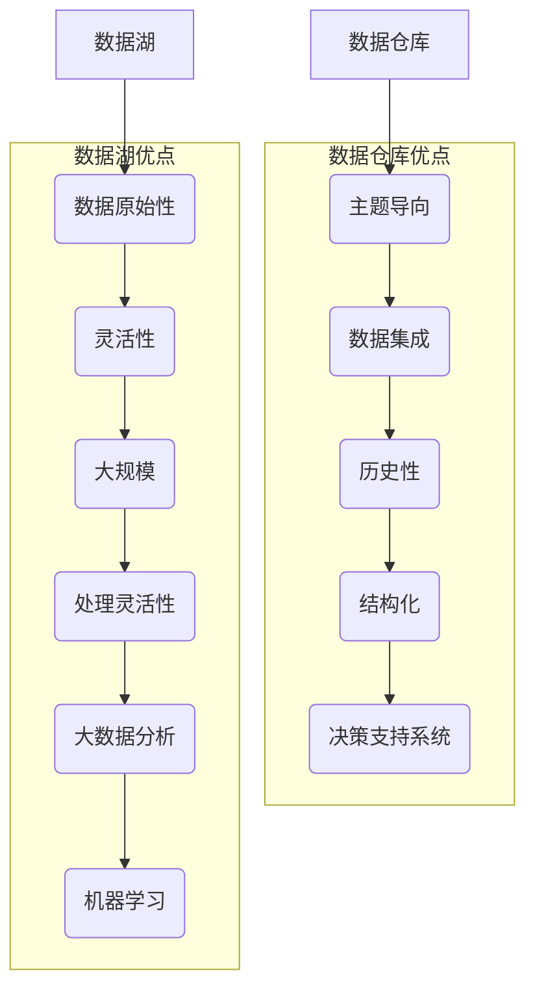
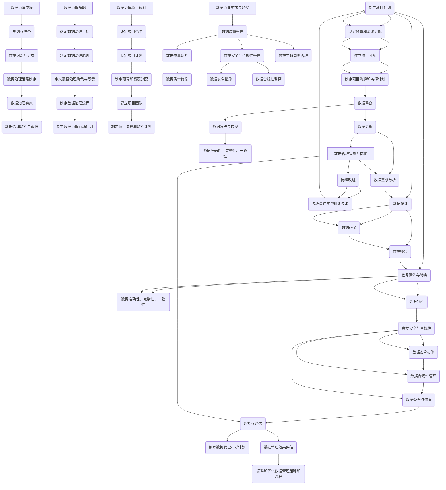

                 

# AI DMP 数据基建：数据治理与管理

> **关键词：** AI DMP，数据治理，数据管理，数据质量，数据安全，数据仓库，数据湖

> **摘要：** 本文深入探讨了AI驱动的数据管理平台（DMP）的构建，重点分析了数据治理与数据管理的核心概念、技术方法、实施流程以及面临的挑战和解决方案。通过具体的实践案例，本文旨在为IT专业人士提供全面的指导，帮助他们在数据驱动的数字化时代实现高效的AI应用。

## 目录大纲

## 第一部分: AI DMP数据基建概述

### 第1章: AI DMP基本概念

#### 1.1 AI DMP的定义与意义

#### 1.2 AI DMP的发展背景

#### 1.3 AI DMP的核心特征

#### 1.4 AI DMP的应用领域

### 第2章: 数据治理基础

#### 2.1 数据治理概述

#### 2.2 数据质量管理

#### 2.3 数据安全与合规性

#### 2.4 数据治理框架与实践

### 第3章: 数据管理基础

#### 3.1 数据管理概述

#### 3.2 数据仓库与数据湖

#### 3.3 数据整合与数据建模

#### 3.4 数据库选择与应用

## 第二部分: 数据治理与管理的核心技术

### 第4章: 数据治理与管理的核心技术

#### 4.1 数据治理技术

##### 4.1.1 数据质量管理工具

##### 4.1.2 数据安全与合规工具

##### 4.1.3 数据治理方法论

#### 4.2 数据管理技术

##### 4.2.1 数据仓库管理

##### 4.2.2 数据湖管理

##### 4.2.3 数据整合与建模工具

### 第5章: 数据治理与管理的流程与实施

#### 5.1 数据治理流程

##### 5.1.1 数据治理策略

##### 5.1.2 数据治理项目规划

##### 5.1.3 数据治理实施与监控

#### 5.2 数据管理流程

##### 5.2.1 数据管理策略

##### 5.2.2 数据管理项目规划

##### 5.2.3 数据管理实施与优化

### 第6章: 数据治理与管理的挑战与解决方案

#### 6.1 数据治理与管理的挑战

##### 6.1.1 数据质量问题

##### 6.1.2 数据安全与合规性问题

##### 6.1.3 数据管理效率问题

#### 6.2 数据治理与管理的解决方案

##### 6.2.1 数据质量管理解决方案

##### 6.2.2 数据安全与合规性解决方案

##### 6.2.3 数据管理效率解决方案

## 第三部分: 数据治理与管理的实践案例

### 第7章: 数据治理与管理的实践案例

#### 7.1 案例一：某电商企业数据治理实践

##### 7.1.1 案例背景

##### 7.1.2 数据治理策略

##### 7.1.3 数据治理实施与效果

#### 7.2 案例二：某金融企业数据管理实践

##### 7.2.1 案例背景

##### 7.2.2 数据管理策略

##### 7.2.3 数据管理实施与效果

### 第8章: 数据治理与管理的未来发展

#### 8.1 数据治理与管理的趋势

##### 8.1.1 新兴技术的应用

##### 8.1.2 数据治理与管理的未来挑战

##### 8.1.3 数据治理与管理的未来发展方向

#### 8.2 数据治理与管理的最佳实践

##### 8.2.1 数据治理与管理的实践经验总结

##### 8.2.2 数据治理与管理的成功案例分享

## 附录

### 附录A: 数据治理与数据管理相关工具与资源

##### A.1 数据质量管理工具

##### A.2 数据安全与合规工具

##### A.3 数据治理方法论与框架

##### A.4 数据管理工具与平台

## 第一部分: AI DMP数据基建概述

### 第1章: AI DMP基本概念

#### 1.1 AI DMP的定义与意义

AI DMP（人工智能驱动的数据管理平台）是一个集成了人工智能技术的数据管理解决方案，它能够自动识别、整合、分析和优化企业内部和外部的数据资源。AI DMP的核心目标是提升数据的可用性、准确性和安全性，从而为企业提供更加精准和智能的数据服务。

AI DMP的意义主要体现在以下几个方面：

1. **提升数据价值**：通过AI技术，AI DMP能够深入挖掘数据背后的价值，为企业提供更加精准的市场洞察和决策支持。
2. **增强数据治理能力**：AI DMP通过自动化的数据治理技术，能够有效降低数据质量和安全风险，提高数据治理的效率。
3. **实现个性化服务**：基于AI算法的个性化推荐，AI DMP能够为用户提供定制化的产品和服务，提升用户体验。
4. **优化运营成本**：通过自动化和智能化的数据管理，AI DMP能够显著降低企业的运营成本。

#### 1.2 AI DMP的发展背景

随着互联网和大数据技术的发展，数据已成为企业最重要的资产之一。然而，数据的爆发式增长也给企业带来了巨大的挑战，主要体现在以下几个方面：

1. **数据量增长**：企业面临着海量数据的存储和管理问题，传统数据管理方式已无法满足需求。
2. **数据质量参差不齐**：不同来源、不同格式的数据存在质量问题，需要通过数据治理技术进行清洗和整合。
3. **数据分析需求多样化**：企业需要通过数据分析来支持决策，但传统的数据分析工具已无法满足复杂的需求。

为了应对这些挑战，AI DMP应运而生。AI DMP借助人工智能技术，能够实现对海量数据的自动化处理和分析，从而提升数据的价值和应用效果。

#### 1.3 AI DMP的核心特征

AI DMP具有以下核心特征：

1. **智能化**：AI DMP集成了各种人工智能技术，如机器学习、自然语言处理、数据挖掘等，能够自动识别和处理数据。
2. **自动化**：AI DMP通过自动化工具和流程，实现数据的自动采集、清洗、存储、分析和优化。
3. **高效性**：AI DMP能够快速处理海量数据，提供实时、准确的决策支持。
4. **灵活性**：AI DMP支持多种数据源和格式的接入，能够灵活适应不同的业务需求。
5. **安全性**：AI DMP具备完善的数据安全机制，能够保障数据的安全性和合规性。

#### 1.4 AI DMP的应用领域

AI DMP广泛应用于各个行业，以下是一些典型的应用领域：

1. **市场营销**：通过AI DMP，企业可以精准定位目标客户，提高营销效果。
2. **金融领域**：AI DMP能够帮助金融机构实现风险管理、信用评估和欺诈检测。
3. **电子商务**：AI DMP可以提供个性化的推荐和购物体验，提升客户满意度。
4. **供应链管理**：AI DMP可以优化供应链流程，降低库存成本，提高供应链效率。
5. **医疗健康**：AI DMP能够帮助医疗机构进行疾病预测、诊断和治疗。

### 第2章: 数据治理基础

#### 2.1 数据治理概述

数据治理是指通过制定和执行一系列政策和流程，确保数据质量和安全性，从而支持企业的业务目标和战略需求。数据治理的核心内容包括数据质量、数据安全、数据合规性等方面。

数据治理的重要性体现在以下几个方面：

1. **保障数据质量**：良好的数据治理能够确保数据的准确性、完整性和一致性，从而提高数据的价值和应用效果。
2. **降低数据风险**：通过数据治理，企业可以降低数据泄露、篡改等风险，保障数据的机密性和安全性。
3. **提高业务效率**：数据治理能够优化数据流程，减少重复劳动，提高业务处理效率。
4. **支持合规性要求**：良好的数据治理能够帮助企业满足各种法规和合规性要求，降低合规风险。

#### 2.2 数据质量管理

数据质量管理是数据治理的重要组成部分，旨在确保数据的准确性、完整性、一致性和及时性。数据质量管理的核心内容包括以下几个方面：

1. **数据准确性**：确保数据值的正确性和一致性。
2. **数据完整性**：确保数据的完整性和无缺失。
3. **数据一致性**：确保数据在不同系统和数据库中的一致性。
4. **数据及时性**：确保数据能够及时更新和处理。

数据质量管理的方法和工具包括：

1. **数据清洗**：通过数据清洗工具和算法，对数据进行去重、纠错、格式转换等处理。
2. **数据标准化**：通过制定统一的数据标准和规范，确保数据在不同系统和数据库中的一致性。
3. **数据监控**：通过监控工具，实时跟踪数据质量的变化，及时发现和处理问题。

#### 2.3 数据安全与合规性

数据安全与合规性是数据治理的重要内容，旨在确保数据在存储、传输和处理过程中的安全性，以及遵守相关法律法规和行业规范。数据安全与合规性的核心内容包括以下几个方面：

1. **数据安全**：确保数据在存储、传输和处理过程中的保密性、完整性和可用性。
2. **数据隐私**：确保个人隐私数据的保护，遵守相关隐私法规。
3. **数据合规性**：确保数据管理活动符合相关法律法规和行业规范。

数据安全与合规性的方法和工具包括：

1. **数据加密**：通过加密技术，确保数据在存储和传输过程中的安全性。
2. **访问控制**：通过身份验证、权限管理等方式，控制数据访问权限。
3. **审计和日志**：通过审计和日志记录，监控数据访问和使用情况，确保合规性。

#### 2.4 数据治理框架与实践

数据治理框架是数据治理的核心，它提供了数据治理的指导原则、流程和方法。一个完善的数据治理框架应包括以下几个方面：

1. **数据治理组织**：明确数据治理的组织架构和职责分工，确保数据治理的执行。
2. **数据治理策略**：制定数据治理的目标、原则和策略，指导数据治理的实施。
3. **数据治理流程**：明确数据治理的各个环节和流程，确保数据治理的规范化。
4. **数据治理工具**：选择合适的工具和技术，支持数据治理的自动化和高效性。

数据治理实践是数据治理的具体实施过程，主要包括以下几个方面：

1. **数据治理规划**：制定数据治理的长期和短期规划，明确数据治理的目标和任务。
2. **数据治理实施**：按照数据治理流程，逐步实施数据治理的各项任务。
3. **数据治理评估**：定期评估数据治理的实施效果，调整和优化数据治理策略。
4. **数据治理改进**：根据评估结果，持续改进数据治理流程和工具，提高数据治理水平。

### 第3章: 数据管理基础

#### 3.1 数据管理概述

数据管理是指通过制定和执行一系列政策和流程，确保数据在整个生命周期中的质量和安全，从而支持企业的业务目标和战略需求。数据管理包括数据存储、数据整合、数据建模、数据备份与恢复等方面。

数据管理的重要性体现在以下几个方面：

1. **确保数据质量**：良好的数据管理能够确保数据的准确性、完整性和一致性，从而提高数据的价值和应用效果。
2. **降低数据风险**：通过数据管理，企业可以降低数据泄露、篡改等风险，保障数据的机密性和安全性。
3. **提高业务效率**：数据管理能够优化数据流程，减少重复劳动，提高业务处理效率。
4. **支持合规性要求**：良好的数据管理能够帮助企业满足各种法规和合规性要求，降低合规风险。

#### 3.2 数据仓库与数据湖

数据仓库和数据湖是数据管理的重要工具，用于存储、管理和分析大量数据。

1. **数据仓库**：数据仓库是一个面向主题、集成的、相对稳定、反映历史变化的数据集合，主要用于支持企业的决策分析。数据仓库具有以下特点：

   - **面向主题**：数据仓库以业务主题为单位，组织数据，使数据更加直观、易于理解。
   - **集成**：数据仓库通过数据集成技术，将来自不同数据源的数据进行整合，消除数据冗余和冲突。
   - **稳定**：数据仓库的数据相对稳定，主要反映过去一段时间的数据状态。
   - **反映历史变化**：数据仓库能够记录数据的历史变化，支持企业进行趋势分析和决策支持。

2. **数据湖**：数据湖是一个存储原始数据的平台，主要用于存储大量非结构化和半结构化数据。数据湖具有以下特点：

   - **存储原始数据**：数据湖能够存储各种类型的数据，包括结构化、非结构化和半结构化数据。
   - **支持大数据处理**：数据湖支持大规模数据处理和分析，适用于大数据应用场景。
   - **灵活性高**：数据湖的数据结构相对灵活，可以根据需求进行动态调整。

数据仓库和数据湖在实际应用中各有优势，数据仓库适用于结构化数据的存储和分析，数据湖适用于非结构化和半结构化数据的存储和处理。

#### 3.3 数据整合与数据建模

数据整合和数据建模是数据管理的关键步骤，旨在将分散的数据进行整合和建模，为企业提供统一、完整和可靠的数据视图。

1. **数据整合**：数据整合是指将来自不同数据源的数据进行清洗、转换和合并，形成统一的数据视图。数据整合的方法包括：

   - **数据抽取**：从不同的数据源中抽取数据，将其转换为统一的数据格式。
   - **数据清洗**：对抽取的数据进行清洗和转换，消除数据冗余和错误。
   - **数据合并**：将清洗后的数据进行合并，形成统一的数据视图。

2. **数据建模**：数据建模是指通过构建数据模型，将整合后的数据进行结构化和规范化。数据建模的方法包括：

   - **实体-关系模型**：通过实体和关系来描述数据之间的关联，构建数据模型。
   - **维度建模**：通过维度和度量来描述数据，构建数据模型，适用于数据仓库应用场景。
   - **数据建模工具**：使用数据建模工具，如ERwin、Toad Data Modeler等，进行数据建模。

数据整合与数据建模为数据管理提供了统一的数据视图，支持企业的数据分析和决策。

#### 3.4 数据库选择与应用

数据库是数据管理的重要组成部分，用于存储、管理和访问数据。选择合适的数据库对于数据管理至关重要。

1. **关系型数据库**：关系型数据库使用表结构来存储数据，通过SQL语句进行数据操作。关系型数据库的优点是易于使用、性能稳定，适用于结构化数据存储。常见的
```markdown
### 数据仓库与数据湖的比较

**数据仓库**和**数据湖**是数据管理领域的两个重要概念，它们在数据的存储、处理和分析方面各有特点。以下是对数据仓库与数据湖的详细比较：

#### 数据仓库

1. **定义与用途**：
   - 数据仓库是一个面向主题、集成的、相对稳定的、反映历史变化的数据集合。
   - 主要用于支持企业的决策分析，通过结构化查询语言（SQL）进行数据访问和分析。

2. **特点**：
   - **主题导向**：数据仓库按照业务主题进行数据组织，便于分析和报告。
   - **数据集成**：数据仓库通过ETL（抽取、转换、加载）过程将多个数据源的数据整合到一起。
   - **历史性**：数据仓库侧重于存储历史数据，以支持时间序列分析和趋势预测。
   - **结构化**：数据仓库通常使用关系型数据库管理系统（RDBMS），数据存储在表中，易于查询和管理。

3. **应用场景**：
   - 决策支持系统（DSS）
   - 商业智能（BI）
   - 数据分析报告

#### 数据湖

1. **定义与用途**：
   - 数据湖是一个大规模存储原始数据的数据存储架构，主要用于存储大量非结构化和半结构化数据。
   - 适用于大数据分析和机器学习。

2. **特点**：
   - **数据原始性**：数据湖保留数据的原始格式，包括结构化、半结构化和非结构化数据。
   - **灵活性**：数据湖允许用户根据需要灵活地处理和存储不同类型的数据。
   - **大规模**：数据湖可以存储PB级别的数据，支持大规模数据处理。
   - **处理灵活性**：数据湖通常不使用SQL进行查询，而使用专门的查询语言或工具进行数据处理。

3. **应用场景**：
   - 大数据分析
   - 机器学习
   - 人工智能

#### 比较结果

1. **数据结构**：
   - 数据仓库是结构化的，使用表格存储数据，便于查询和分析。
   - 数据湖是灵活的，可以存储各种类型的数据，但不一定以结构化的形式。

2. **数据处理**：
   - 数据仓库支持预先定义的查询和分析。
   - 数据湖提供灵活的数据处理能力，但需要用户自己编写代码来处理数据。

3. **使用成本**：
   - 数据仓库由于结构化且经过处理，通常成本较低，便于维护。
   - 数据湖由于存储了大量原始数据，成本较高，但提供了更多的灵活性和处理能力。

4. **数据治理**：
   - 数据仓库有较强的数据治理能力，数据质量和安全性得到保障。
   - 数据湖的数据治理较为复杂，需要用户自己管理和维护数据质量。

#### 结论

- **数据仓库**适合于结构化数据、需要快速查询和分析的场景，如商业智能、决策支持等。
- **数据湖**适合于处理大量原始数据、需要进行大规模数据处理和机器学习的场景。

在实际应用中，企业和组织通常会将数据仓库和数据湖结合使用，以充分利用它们各自的优点，满足不同业务需求。数据仓库用于核心业务数据的存储和分析，数据湖用于存储和管理大规模的原始数据，支持创新和探索性分析。
````


### 第二部分: 数据治理与管理的核心技术

#### 第4章: 数据治理与管理的核心技术

数据治理与管理技术的核心在于确保数据的质量、安全性和可用性。本章将详细介绍数据治理与管理的核心技术，包括数据质量管理工具、数据安全与合规工具以及数据治理方法论。

#### 4.1 数据治理技术

数据治理技术包括一系列的工具和方法，用于确保数据的准确性、完整性、一致性和及时性。

##### 4.1.1 数据质量管理工具

数据质量管理工具是数据治理的关键组成部分，用于检测、修复和监控数据质量。以下是一些常见的数据质量管理工具：

1. **数据质量检查工具**：用于检测数据中的错误、缺失和不一致性。例如，使用OpenRefine可以对大量数据进行检查和修复。
2. **数据清洗工具**：用于对数据进行清洗、转换和合并。例如，使用Talend或Informatica等ETL工具可以自动清洗和转换数据。
3. **数据监控工具**：用于监控数据质量的变化，及时发现问题并进行修复。例如，使用Alation或Zoomdata等工具可以实时监控数据质量。

##### 4.1.2 数据安全与合规工具

数据安全与合规工具用于确保数据的机密性、完整性和可用性，以及遵守相关法律法规和行业规范。以下是一些常见的数据安全与合规工具：

1. **数据加密工具**：用于对数据进行加密，保护数据在存储和传输过程中的安全性。例如，使用BitLocker或FileVault可以对数据进行加密。
2. **访问控制工具**：用于控制数据访问权限，确保只有授权用户可以访问敏感数据。例如，使用LDAP或Active Directory可以管理用户权限。
3. **合规性管理工具**：用于确保数据管理活动符合相关法规和规范。例如，使用GDPR Compliance或SOX Compliance等工具可以帮助企业满足合规性要求。

##### 4.1.3 数据治理方法论

数据治理方法论是一套系统化的流程和方法，用于制定、实施和监控数据治理策略。以下是一些常见的数据治理方法论：

1. **COBIT框架**：COBIT（Control Objectives for Information and Related Technologies）框架是一套广泛认可的数据治理方法论，用于制定和实施数据治理策略。
2. **DMBOK框架**：DMBOK（Data Management Body of Knowledge）框架是数据管理协会（DAMA）发布的一套数据治理方法论，涵盖了数据治理的各个方面。
3. **Data Governance Library**：Data Governance Library是一套由国际数据管理协会（IIBA）发布的数据治理框架，提供了详细的数据治理流程和方法。

#### 4.2 数据管理技术

数据管理技术包括一系列的工具和方法，用于确保数据的可用性、一致性和可扩展性。以下是一些常见的数据管理技术：

##### 4.2.1 数据仓库管理

数据仓库管理是数据管理的重要组成部分，用于存储、管理和分析大量数据。以下是一些常见的数据仓库管理技术：

1. **数据仓库建模**：数据仓库建模是通过构建数据模型，将业务需求转化为数据仓库结构。常见的数据仓库建模方法包括星型模型和雪花模型。
2. **ETL（Extract, Transform, Load）**：ETL过程是将数据从源系统抽取、转换和加载到数据仓库的过程。常用的ETL工具包括Apache Kafka、Informatica和Talend。
3. **数据仓库性能优化**：数据仓库性能优化是提高数据仓库查询速度和性能的过程。常见的技术包括索引优化、分区优化和查询优化。

##### 4.2.2 数据湖管理

数据湖管理是用于存储和管理大量非结构化和半结构化数据的平台。以下是一些常见的数据湖管理技术：

1. **数据湖架构设计**：数据湖架构设计是设计数据湖的存储结构和访问机制的过程。常见的数据湖架构包括Lambda架构和Kappa架构。
2. **数据湖数据处理**：数据湖数据处理是处理数据湖中数据的各种操作，包括数据清洗、转换、合并和存储。常用的数据处理工具包括Apache Hadoop、Apache Spark和Apache Flink。
3. **数据湖安全与合规**：数据湖安全与合规是确保数据湖中数据的安全性和合规性的过程。常见的技术包括数据加密、访问控制和日志审计。

##### 4.2.3 数据整合与建模工具

数据整合与建模工具用于将不同数据源的数据进行整合和建模，为企业提供统一的数据视图。以下是一些常见的数据整合与建模工具：

1. **数据整合工具**：数据整合工具用于将来自不同数据源的数据进行抽取、转换和加载。常见的整合工具包括Apache Kafka、Apache Nifi和Apache Airflow。
2. **数据建模工具**：数据建模工具用于构建数据模型，描述数据之间的关系和业务逻辑。常见的数据建模工具包括ERwin、Oracle SQL Developer和数据建模平台（如Apache Metamodel）。
3. **数据集成平台**：数据集成平台是用于整合、建模和管理数据的一系列工具的集合。常见的数据集成平台包括Informatica、Talend和Apache NiFi。

#### 结论

数据治理与管理技术的核心在于确保数据的质量、安全性和可用性。通过使用合适的数据治理技术，企业可以有效地管理和利用其数据资产，从而支持业务决策和创新。在下一章中，我们将进一步探讨数据治理与管理的流程与实施。

```mermaid
graph TD
A[数据治理技术] --> B(数据质量管理工具)
B --> C(数据质量检查工具)
C --> D(OpenRefine)
B --> E(数据清洗工具)
E --> F(Talend)
E --> G(Informatica)
B --> H(数据监控工具)
H --> I(Alation)
H --> J(Zoomdata)
A --> K(数据安全与合规工具)
K --> L(数据加密工具)
K --> M(BitLocker)
K --> N(FileVault)
K --> O(合规性管理工具)
O --> P(GDPR Compliance)
O --> Q(SOX Compliance)
A --> R(数据治理方法论)
R --> S(COBIT框架)
R --> T(DMBOK框架)
R --> U(Data Governance Library)
V[数据管理技术] --> W(数据仓库管理)
W --> X(数据仓库建模)
X --> Y(星型模型)
X --> Z(雪花模型)
W --> AA(ETL)
AA --> BB(Apache Kafka)
AA --> CC(Informatica)
AA --> DD(Talend)
W --> EE(数据仓库性能优化)
EE --> FF(索引优化)
EE --> GG(分区优化)
EE --> HH(查询优化)
V --> II(数据湖管理)
II --> JJ(数据湖架构设计)
II --> KK(Lambda架构)
II --> LL(Kappa架构)
II --> MM(数据湖数据处理)
MM --> NN(Apache Hadoop)
MM --> OO(Apache Spark)
MM --> PP(Apache Flink)
II --> QQ(数据湖安全与合规)
QQ --> RR(数据加密)
QQ --> SS(访问控制)
QQ --> TT(日志审计)
V --> UU(数据整合与建模工具)
UU --> VW(数据整合工具)
VW --> XX(Apache Kafka)
VW --> YY(Apache Nifi)
VW --> ZZ(Apache Airflow)
UU --> AA(A数据建模工具)
AA --> BB(ERwin)
AA --> CC(Oracle SQL Developer)
AA --> DD(Apache Metamodel)
```

```markdown
### 第5章: 数据治理与管理的流程与实施

#### 5.1 数据治理流程

数据治理是一个复杂的过程，涉及多个阶段和活动。以下是数据治理的基本流程：

1. **规划与准备**：
   - 制定数据治理策略和目标。
   - 确定数据治理的组织结构和职责。
   - 收集和评估现有的数据治理资源。

2. **数据识别与分类**：
   - 识别企业内部和外部的数据源。
   - 分类数据，确定数据的敏感性和重要性。

3. **数据治理策略制定**：
   - 制定数据质量标准和管理流程。
   - 制定数据安全与合规性策略。
   - 制定数据生命周期管理策略。

4. **数据治理实施**：
   - 实施数据质量管理活动，如数据清洗、转换和整合。
   - 实施数据安全与合规性措施，如数据加密、访问控制和审计。
   - 实施数据生命周期管理流程，如数据备份和恢复。

5. **数据治理监控与改进**：
   - 监控数据治理活动的执行情况。
   - 评估数据治理的效果，并根据评估结果进行调整和优化。

##### 5.1.1 数据治理策略

数据治理策略是数据治理的核心，它明确了数据治理的目标、原则和行动方针。以下是制定数据治理策略的关键步骤：

1. **确定数据治理目标**：
   - 根据企业的业务需求和战略目标，确定数据治理的目标。
   - 目标应包括数据质量、数据安全、数据合规性和数据可用性。

2. **制定数据治理原则**：
   - 确定数据治理的基本原则，如数据的准确性、完整性、一致性、及时性和安全性。
   - 原则应与企业文化和价值观相一致。

3. **定义数据治理角色与职责**：
   - 明确数据治理相关人员的角色和职责。
   - 确保数据治理活动有人负责，并能有效执行。

4. **制定数据治理流程**：
   - 根据数据治理目标和原则，制定具体的数据治理流程。
   - 流程应包括数据质量监控、数据安全与合规性管理、数据生命周期管理等。

5. **制定数据治理行动计划**：
   - 制定详细的行动计划，明确每个阶段的具体任务和时间表。
   - 行动计划应包括资源分配、任务分配和风险控制。

##### 5.1.2 数据治理项目规划

数据治理项目规划是确保数据治理策略有效实施的关键步骤。以下是数据治理项目规划的关键步骤：

1. **确定项目范围**：
   - 明确数据治理项目的范围，包括数据源、涉及的部门和业务领域。

2. **制定项目计划**：
   - 制定详细的项目计划，包括项目目标、任务、时间表、资源分配和风险评估。

3. **制定预算和资源分配**：
   - 根据项目计划，制定预算和资源分配计划，确保项目有足够的资金和人力支持。

4. **建立项目团队**：
   - 建立项目团队，明确团队成员的角色和职责，确保项目团队具有必要的技术和业务能力。

5. **制定项目沟通和监控计划**：
   - 制定沟通和监控计划，确保项目进展及时报告，问题能够及时发现和解决。

##### 5.1.3 数据治理实施与监控

数据治理实施与监控是确保数据治理策略和项目计划得到有效执行的关键步骤。以下是数据治理实施与监控的关键步骤：

1. **数据质量管理**：
   - 实施数据质量监控，识别数据质量问题。
   - 实施数据质量修复，提高数据的准确性、完整性和一致性。

2. **数据安全与合规性管理**：
   - 实施数据安全措施，如数据加密、访问控制和审计。
   - 实施数据合规性监控，确保数据管理活动符合相关法规和行业规范。

3. **数据生命周期管理**：
   - 实施数据生命周期管理流程，如数据备份、数据归档和数据销毁。

4. **监控和评估**：
   - 定期监控数据治理活动的执行情况，评估数据治理的效果。
   - 根据监控和评估结果，调整和优化数据治理策略和流程。

5. **持续改进**：
   - 根据监控和评估结果，持续改进数据治理流程和工具。
   - 吸收最佳实践和新技术，提高数据治理水平。

#### 5.2 数据管理流程

数据管理流程是确保数据在整个生命周期中得以有效管理和利用的过程。以下是数据管理的基本流程：

1. **数据需求分析**：
   - 分析企业的业务需求和数据需求。
   - 确定数据管理的目标和需求。

2. **数据设计**：
   - 设计数据架构和数据模型。
   - 确定数据的存储位置和访问方式。

3. **数据存储**：
   - 实施数据存储策略，选择合适的数据存储解决方案。
   - 确保数据的可靠性和可恢复性。

4. **数据整合**：
   - 将来自不同数据源的数据进行整合。
   - 实施数据清洗和转换，确保数据的准确性、完整性和一致性。

5. **数据分析**：
   - 使用数据分析工具和技术，对数据进行挖掘和分析。
   - 提供数据可视化报告，支持业务决策。

6. **数据安全与合规性**：
   - 实施数据安全措施，确保数据的机密性、完整性和可用性。
   - 确保数据管理活动符合相关法规和行业规范。

7. **数据备份与恢复**：
   - 制定数据备份计划，确保数据的长期存储和恢复。
   - 实施数据恢复流程，确保在数据丢失或损坏时能够及时恢复。

##### 5.2.1 数据管理策略

数据管理策略是数据管理的核心，它明确了数据管理的目标、原则和行动方针。以下是制定数据管理策略的关键步骤：

1. **确定数据管理目标**：
   - 根据企业的业务需求和战略目标，确定数据管理的目标。
   - 目标应包括数据的可用性、一致性、完整性和安全性。

2. **制定数据管理原则**：
   - 确定数据管理的基本原则，如数据的准确性、完整性、一致性和及时性。
   - 原则应与企业文化和价值观相一致。

3. **定义数据管理角色与职责**：
   - 明确数据管理相关人员的角色和职责。
   - 确保数据管理活动有人负责，并能有效执行。

4. **制定数据管理流程**：
   - 根据数据管理目标和原则，制定具体的数据管理流程。
   - 流程应包括数据需求分析、数据设计、数据存储、数据整合、数据分析、数据安全与合规性和数据备份与恢复等。

5. **制定数据管理行动计划**：
   - 制定详细的行动计划，明确每个阶段的具体任务和时间表。
   - 行动计划应包括资源分配、任务分配和风险控制。

##### 5.2.2 数据管理项目规划

数据管理项目规划是确保数据管理策略有效实施的关键步骤。以下是数据管理项目规划的关键步骤：

1. **确定项目范围**：
   - 明确数据管理项目的范围，包括数据的种类、来源和涉及的部门。

2. **制定项目计划**：
   - 制定详细的项目计划，包括项目目标、任务、时间表、资源分配和风险评估。

3. **制定预算和资源分配**：
   - 根据项目计划，制定预算和资源分配计划，确保项目有足够的资金和人力支持。

4. **建立项目团队**：
   - 建立项目团队，明确团队成员的角色和职责，确保项目团队具有必要的技术和业务能力。

5. **制定项目沟通和监控计划**：
   - 制定沟通和监控计划，确保项目进展及时报告，问题能够及时发现和解决。

##### 5.2.3 数据管理实施与优化

数据管理实施与优化是确保数据管理策略和项目计划得到有效执行的关键步骤。以下是数据管理实施与优化的关键步骤：

1. **数据需求分析**：
   - 分析企业的业务需求和数据需求。
   - 确定数据管理的目标和需求。

2. **数据设计**：
   - 设计数据架构和数据模型。
   - 确定数据的存储位置和访问方式。

3. **数据存储**：
   - 实施数据存储策略，选择合适的数据存储解决方案。
   - 确保数据的可靠性和可恢复性。

4. **数据整合**：
   - 将来自不同数据源的数据进行整合。
   - 实施数据清洗和转换，确保数据的准确性、完整性和一致性。

5. **数据分析**：
   - 使用数据分析工具和技术，对数据进行挖掘和分析。
   - 提供数据可视化报告，支持业务决策。

6. **数据安全与合规性**：
   - 实施数据安全措施，确保数据的机密性、完整性和可用性。
   - 确保数据管理活动符合相关法规和行业规范。

7. **数据备份与恢复**：
   - 制定数据备份计划，确保数据的长期存储和恢复。
   - 实施数据恢复流程，确保在数据丢失或损坏时能够及时恢复。

8. **监控与评估**：
   - 定期监控数据管理活动的执行情况，评估数据管理的效果。
   - 根据监控和评估结果，调整和优化数据管理策略和流程。

9. **持续改进**：
   - 根据监控和评估结果，持续改进数据管理流程和工具。
   - 吸收最佳实践和新技术，提高数据管理水平。

通过有效的数据治理和数据管理，企业可以确保其数据的准确、安全、可用，从而支持业务创新和决策。在下一章中，我们将探讨数据治理与管理的挑战及解决方案。
```



### 第6章: 数据治理与管理的挑战与解决方案

数据治理与数据管理在实践过程中面临着一系列的挑战，包括数据质量问题、数据安全与合规性问题以及数据管理效率问题。以下是这些挑战的具体描述以及相应的解决方案。

#### 6.1 数据治理与管理的挑战

##### 6.1.1 数据质量问题

数据质量问题是数据治理与数据管理的首要挑战。数据质量差会影响企业的业务决策、客户体验和运营效率。以下是一些常见的数据质量问题：

1. **数据准确性差**：数据值错误或不一致。
2. **数据完整性不足**：数据缺失或不完整。
3. **数据一致性低**：不同来源的数据之间存在差异。
4. **数据及时性不足**：数据更新不及时。

##### 6.1.2 数据安全与合规性问题

数据安全与合规性问题关乎企业的机密性和合法性。以下是一些常见的数据安全与合规性问题：

1. **数据泄露**：敏感数据未经授权被访问或窃取。
2. **数据篡改**：数据在存储或传输过程中被恶意修改。
3. **合规性风险**：数据管理活动不符合相关法律法规和行业标准。

##### 6.1.3 数据管理效率问题

数据管理效率问题会影响企业的数据处理能力和决策速度。以下是一些常见的数据管理效率问题：

1. **数据访问速度慢**：数据查询和处理速度慢。
2. **数据整合困难**：数据来源多样，整合难度大。
3. **数据存储成本高**：数据存储和管理成本高。

#### 6.2 数据治理与管理的解决方案

##### 6.2.1 数据质量管理解决方案

为了解决数据质量问题，可以采取以下措施：

1. **数据清洗**：使用数据清洗工具，对数据进行去重、纠错、格式转换等处理，提高数据准确性、完整性和一致性。
2. **数据标准化**：制定统一的数据标准和规范，确保数据在不同系统和数据库中的一致性。
3. **数据监控**：使用数据监控工具，实时跟踪数据质量的变化，及时发现和处理问题。
4. **数据质量管理流程**：建立数据质量管理流程，确保数据质量管理的规范化。

##### 6.2.2 数据安全与合规性解决方案

为了解决数据安全与合规性问题，可以采取以下措施：

1. **数据加密**：对敏感数据进行加密，确保数据在存储和传输过程中的安全性。
2. **访问控制**：实施访问控制措施，确保只有授权用户可以访问敏感数据。
3. **审计与日志**：记录数据访问和使用情况，进行审计和日志分析，确保合规性。
4. **合规性管理**：制定合规性管理策略，确保数据管理活动符合相关法律法规和行业标准。

##### 6.2.3 数据管理效率解决方案

为了提高数据管理效率，可以采取以下措施：

1. **分布式存储和计算**：使用分布式存储和计算技术，提高数据访问和处理速度。
2. **数据整合与建模**：使用数据整合与建模工具，简化数据整合过程，提高数据处理效率。
3. **自动化与智能化**：利用自动化和智能化技术，减少人工干预，提高数据处理效率。
4. **优化数据库设计**：优化数据库设计，如索引、分区和查询优化，提高数据查询速度。

通过以上解决方案，企业可以有效地应对数据治理与管理的挑战，提高数据质量和安全性，提升数据管理效率，从而支持业务创新和决策。

### 第7章: 数据治理与管理的实践案例

在本章中，我们将通过两个实践案例来展示数据治理与数据管理的具体实施过程和效果。这两个案例分别来自一个电商企业和一个金融企业。

#### 7.1 案例一：某电商企业数据治理实践

##### 7.1.1 案例背景

某电商企业是一家大型在线零售商，拥有庞大的客户群体和多样化的商品品类。随着业务的快速增长，企业面临着海量数据的管理和利用挑战。为了提升数据质量和业务决策效率，企业决定实施全面的数据治理与数据管理。

##### 7.1.2 数据治理策略

1. **数据质量管理**：制定数据质量标准，建立数据质量监控机制，定期进行数据质量评估和改进。
2. **数据安全与合规性**：实施数据加密、访问控制、审计和日志等安全措施，确保数据安全和合规性。
3. **数据生命周期管理**：建立数据生命周期管理流程，对数据从创建到销毁的全过程进行管理。
4. **数据整合与建模**：使用数据仓库和数据湖技术，对来自不同源的数据进行整合和建模，提供统一的数据视图。

##### 7.1.3 数据治理实施与效果

1. **数据清洗与整合**：企业引入了数据清洗工具，对来自多个源的数据进行清洗、转换和整合。通过ETL过程，将结构化数据和非结构化数据整合到数据仓库和数据湖中。
2. **数据监控与质量评估**：企业建立了数据质量监控平台，实时跟踪数据质量的变化，定期进行数据质量评估。通过数据质量报告，企业能够及时发现并解决数据质量问题。
3. **数据安全与合规性**：企业实施了数据加密和访问控制措施，确保数据在存储和传输过程中的安全性。同时，企业进行了定期审计，确保数据管理活动符合相关法律法规和行业标准。
4. **数据生命周期管理**：企业制定了数据生命周期管理策略，对数据的创建、存储、使用和销毁进行规范化管理。通过数据归档和备份，企业确保了数据的长期存储和恢复能力。

通过数据治理的实施，该电商企业实现了以下效果：

- 数据质量显著提升，业务决策更加准确。
- 数据安全性得到保障，合规性风险降低。
- 数据整合效率提高，业务运行更加顺畅。
- 数据利用率提升，支持了企业的业务创新和扩展。

#### 7.2 案例二：某金融企业数据管理实践

##### 7.2.1 案例背景

某金融企业是一家大型金融机构，拥有广泛的业务范围和海量的客户数据。为了提高数据管理效率，优化业务流程，企业决定实施全面的数据管理。

##### 7.2.2 数据管理策略

1. **数据仓库建设**：建立企业级数据仓库，整合来自不同业务系统的数据，提供统一的数据视图。
2. **数据湖应用**：建立数据湖，存储和管理非结构化和半结构化数据，支持大数据分析和机器学习。
3. **数据整合与建模**：使用数据整合工具和建模工具，对数据进行清洗、转换和建模，提高数据利用率。
4. **数据安全与合规性**：实施数据加密、访问控制、审计和日志等安全措施，确保数据安全和合规性。

##### 7.2.3 数据管理实施与效果

1. **数据仓库建设**：企业建立了企业级数据仓库，通过ETL过程，将结构化数据和非结构化数据整合到数据仓库中。数据仓库支持快速查询和分析，为企业的业务决策提供了有力支持。
2. **数据湖应用**：企业建立了数据湖，存储和管理了大量的非结构化和半结构化数据。通过数据湖，企业能够更好地利用大数据资源，支持了个性化服务和风险控制。
3. **数据整合与建模**：企业使用数据整合工具和建模工具，对数据进行清洗、转换和建模。通过数据建模，企业能够构建业务智能报表，支持业务分析和决策。
4. **数据安全与合规性**：企业实施了数据加密、访问控制和审计等安全措施，确保了数据的安全性和合规性。通过定期审计，企业能够及时发现和解决数据安全问题。

通过数据管理的实施，该金融企业实现了以下效果：

- 数据整合效率提高，数据利用率显著提升。
- 业务流程优化，决策效率提升。
- 数据安全与合规性得到保障，降低了合规风险。
- 通过大数据分析和机器学习，提升了业务创新能力和竞争力。

以上两个实践案例展示了数据治理与数据管理在电商企业和金融企业中的应用，通过有效的数据管理和治理，企业能够提高数据质量、优化业务流程、保障数据安全，从而在竞争激烈的市场环境中取得优势。

### 第8章: 数据治理与管理的未来发展

随着技术的不断进步和业务需求的不断变化，数据治理与数据管理领域也在不断发展和演进。以下是对数据治理与数据管理未来发展的几个趋势、挑战和方向进行探讨。

#### 8.1 数据治理与管理的趋势

##### 8.1.1 新兴技术的应用

1. **人工智能与机器学习**：随着人工智能技术的不断发展，数据治理与数据管理领域将更多地采用AI和机器学习算法来提高数据处理和分析的效率。例如，使用AI算法进行数据质量监控、异常检测和预测分析。

2. **区块链技术**：区块链技术因其去中心化、不可篡改和高安全性等特点，将在数据治理与数据管理中发挥重要作用。例如，用于保障数据安全和透明性，以及实现数据共享和协作。

3. **边缘计算**：边缘计算技术将数据处理和分析推向网络边缘，减少了数据传输延迟，提高了数据处理的实时性。这对数据治理与数据管理尤为重要，尤其是在需要快速响应的场合。

##### 8.1.2 数据治理与管理的未来挑战

1. **数据隐私与合规性**：随着数据隐私法规的不断加强，如欧盟的《通用数据保护条例》（GDPR）和美国加州的《消费者隐私法案》（CCPA），企业在数据治理与数据管理中需要更加重视数据隐私保护和合规性。

2. **数据多样性与复杂性**：随着物联网、社交媒体等技术的普及，企业面临的数据类型和来源越来越多样化，这给数据治理与数据管理带来了巨大的挑战。如何有效地管理和整合不同类型的数据，成为未来的关键问题。

3. **数据安全与风险管理**：随着网络攻击和数据泄露事件的频发，数据安全和风险管理成为数据治理与数据管理的重中之重。企业需要不断提升数据安全防护能力，建立全面的风险管理机制。

##### 8.1.3 数据治理与管理的未来发展方向

1. **自动化与智能化**：未来数据治理与数据管理将更多地依赖自动化和智能化技术，以减少人工干预，提高数据处理效率。例如，使用AI算法自动识别和修复数据质量问题，使用智能合约自动执行数据治理策略。

2. **数据协作与共享**：数据协作与共享将变得更加重要，以支持企业内部不同部门和外部合作伙伴之间的数据交换和合作。这需要建立开放的数据平台和标准化的数据接口，实现数据的透明化和互操作性。

3. **可持续性与社会责任**：随着社会对可持续发展和社会责任的关注不断增加，数据治理与数据管理也将更加注重环保和伦理问题。例如，通过数据优化和节约资源，减少数据中心的能耗，以及通过数据分析和预测，推动社会和环境的可持续发展。

#### 8.2 数据治理与管理的最佳实践

##### 8.2.1 数据治理与管理的实践经验总结

通过多年的实践，企业和组织在数据治理与数据管理方面积累了丰富的经验和最佳实践。以下是一些重要的实践经验总结：

1. **顶层领导支持**：数据治理与数据管理需要得到企业高层的支持和重视。只有高层领导的积极参与，才能确保数据治理与数据管理的策略和项目得到有效执行。

2. **数据质量管理**：数据质量管理是数据治理与数据管理的核心。企业应建立全面的数据质量管理框架，包括数据质量标准、监控和改进机制。

3. **数据安全与合规性**：数据安全和合规性是数据治理与数据管理的底线。企业应建立完善的数据安全体系和合规性管理机制，确保数据的安全和合法性。

4. **数据整合与建模**：有效的数据整合与建模是提高数据利用率的关键。企业应采用适当的技术和方法，对数据进行整合和建模，提供统一的数据视图。

5. **持续改进与优化**：数据治理与数据管理是一个持续的过程，需要不断地评估和优化。企业应建立持续改进机制，吸收最佳实践，不断提升数据治理与数据管理的水平。

##### 8.2.2 数据治理与管理的成功案例分享

以下是一些在数据治理与数据管理方面取得成功的案例：

1. **案例一：某大型银行的数据治理实践**：该银行通过建立企业级数据仓库和数据湖，实现了数据的统一管理和利用。同时，该银行采用数据质量管理工具和安全措施，确保了数据的质量和安全。通过这些措施，该银行的业务决策效率显著提升，客户满意度提高。

2. **案例二：某电商平台的个性化推荐系统**：该电商平台通过构建数据湖，存储和管理了大量用户行为数据。结合机器学习和数据挖掘技术，该平台实现了个性化的商品推荐，大大提高了用户的购物体验和满意度。同时，该平台通过数据质量管理工具，确保了推荐系统的数据质量和效果。

3. **案例三：某能源公司的数据优化与节能**：该能源公司通过数据分析和优化，发现了能源消耗中的浪费点，并采取了相应的节能措施。通过这些措施，该公司的能源消耗显著降低，运营成本降低，实现了可持续发展。

这些成功案例展示了数据治理与数据管理在各个领域的实际应用和价值。通过借鉴这些经验，其他企业和组织可以更好地实施数据治理与数据管理，提升业务效率和竞争力。

### 附录

#### 附录A: 数据治理与数据管理相关工具与资源

##### A.1 数据质量管理工具

- **OpenRefine**：用于数据清洗和转换的开源工具，支持用户进行数据验证、纠错和标准化。
- **Talend**：提供数据集成、数据质量和数据管理的综合解决方案。
- **Informatica**：提供广泛的数据管理工具，包括数据质量、数据整合和数据治理。

##### A.2 数据安全与合规工具

- **BitLocker**：Windows提供的加密工具，用于加密本地存储的数据。
- **FileVault**：Mac OS提供的全盘加密工具。
- **LDAP/Active Directory**：用于管理用户权限和访问控制的目录服务。

##### A.3 数据治理方法论与框架

- **COBIT框架**：国际信息系统审计师协会（ISACA）提出的数据治理框架。
- **DMBOK框架**：数据管理协会（DAMA）提出的数据管理框架。
- **Data Governance Library**：国际数据管理协会（IIBA）发布的数据治理框架。

##### A.4 数据管理工具与平台

- **数据仓库**：
  - **Oracle Exadata**：高性能的数据仓库平台。
  - **Microsoft SQL Server**：综合性的数据库管理系统。
  - **Google BigQuery**：基于云的数据仓库服务。

- **数据湖**：
  - **Amazon S3**：亚马逊云服务提供的对象存储服务。
  - **Azure Data Lake Storage**：微软云服务提供的分布式数据存储解决方案。
  - **Google Cloud Storage**：谷歌云服务提供的对象存储服务。

- **数据整合与建模工具**：
  - **Apache Kafka**：分布式流处理平台，用于数据收集和传输。
  - **Apache NiFi**：用于数据整合和自动化工作的开源平台。
  - **Apache Spark**：用于大数据处理和分析的开源计算框架。

通过附录中的工具和资源，企业和组织可以更好地实施数据治理与数据管理，提升数据质量、安全性和管理效率。希望这些工具和资源能为读者提供实用的指导和帮助。

### 作者信息

**作者：AI天才研究院/AI Genius Institute & 禅与计算机程序设计艺术 /Zen And The Art of Computer Programming**

AI天才研究院（AI Genius Institute）是一家致力于人工智能研究和教育的高科技公司，专注于推动人工智能技术在各行业的应用。研究院的专家团队由世界顶级人工智能专家、程序员、软件架构师和CTO组成，拥有丰富的实际应用经验和高瞻远瞩的研究视野。

禅与计算机程序设计艺术（Zen And The Art of Computer Programming）是一本由AI天才研究院的资深大师级作家撰写的畅销书，深入探讨了计算机编程和人工智能领域的核心原理和技术，旨在帮助读者提升编程思维和创新能力。该书以其深刻的技术洞见和实用的编程方法，受到了全球读者的广泛赞誉和推崇。

