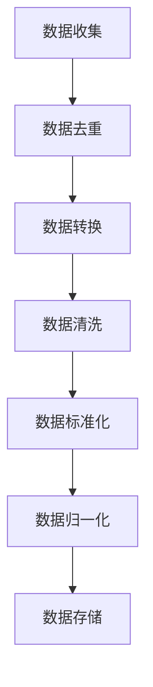
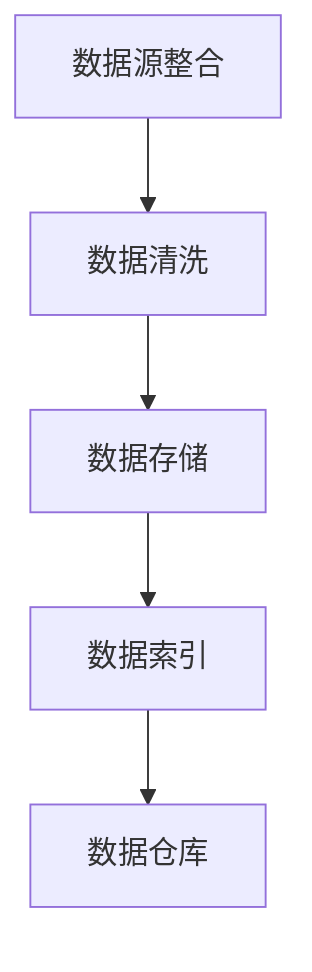
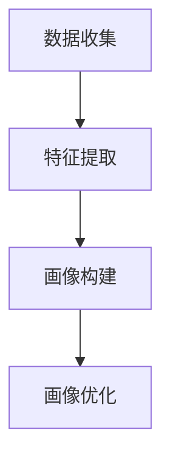
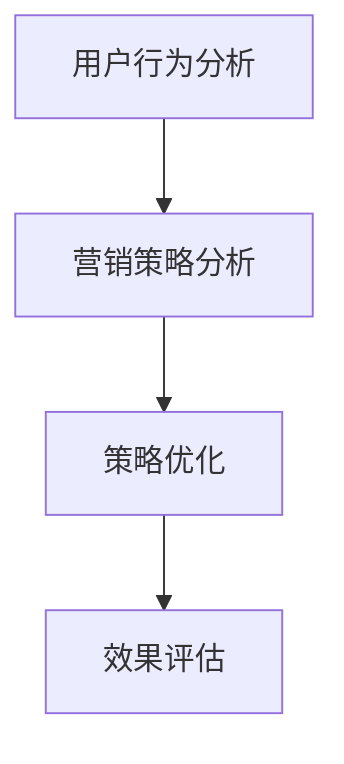
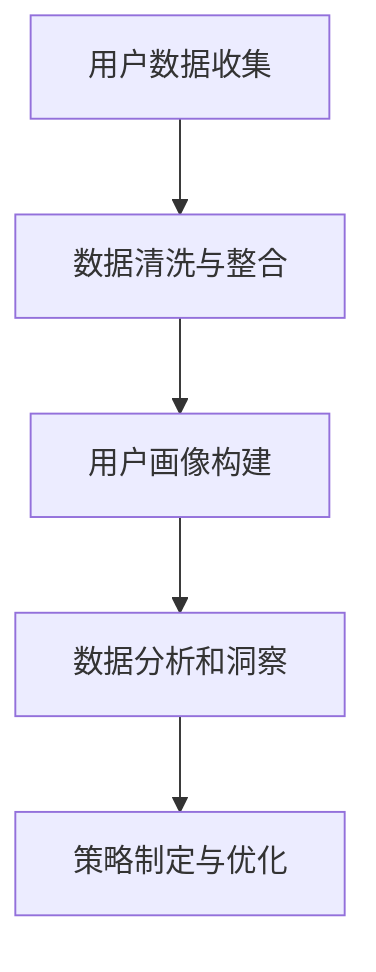
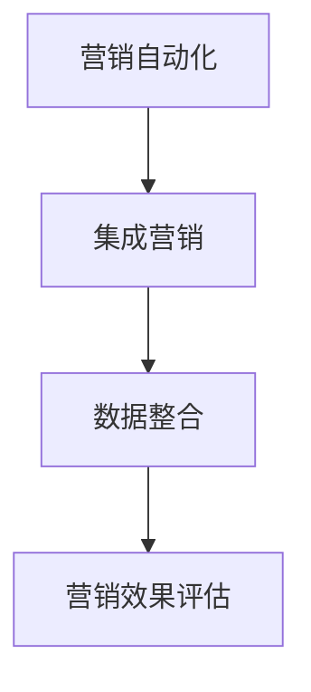
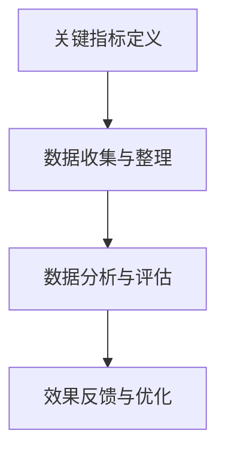
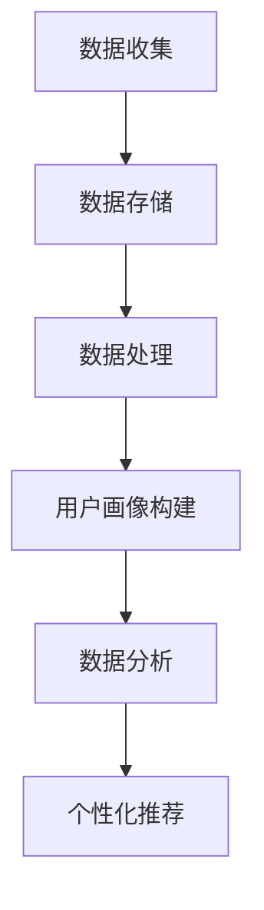
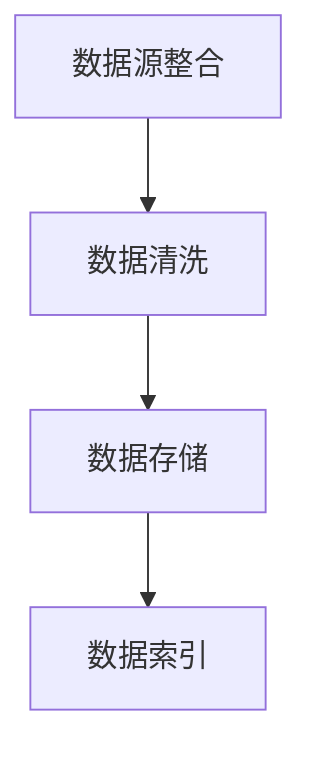

                 

# AI DMP 数据基建：数据驱动营销的未来趋势

## 关键词

- AI DMP
- 数据驱动营销
- 用户画像
- 营销自动化
- 数据隐私

## 摘要

本文将深入探讨AI驱动的数据管理平台（DMP）在数据驱动营销领域中的重要性。我们将从DMP的基础理论、关键技术与算法、实践案例解析、数据驱动营销策略、数据隐私与合规性，以及未来趋势与展望等方面展开讨论，旨在为读者提供一个全面、系统的AI DMP知识体系，并揭示其对于营销行业未来发展的深远影响。

### 《AI DMP 数据基建：数据驱动营销的未来趋势》目录大纲

#### 第一部分：AI DMP基础理论

##### 第1章：AI DMP概述

- 1.1 AI DMP的定义与核心概念
- 1.2 数据驱动营销的发展历程
- 1.3 AI DMP在营销中的应用价值
- 1.4 AI DMP的核心架构与技术栈

##### 第2章：AI DMP关键技术与算法

- 2.1 数据清洗与预处理
- 2.2 数据集成与数据仓库
- 2.3 数据挖掘与机器学习
- 2.4 用户画像构建与优化
- 2.5 基于AI的营销策略优化

##### 第3章：AI DMP实践案例解析

- 3.1 案例一：互联网企业用户行为分析
- 3.2 案例二：零售行业个性化推荐系统
- 3.3 案例三：金融行业风险管理

#### 第二部分：数据驱动营销策略

##### 第4章：数据驱动营销的核心概念

- 4.1 数据驱动的营销策略
- 4.2 营销自动化与集成营销
- 4.3 营销效果评估与优化

##### 第5章：AI助力数据驱动营销

- 5.1 AI在营销活动中的应用
- 5.2 AI优化营销预算分配
- 5.3 AI驱动个性化营销

##### 第6章：数据隐私与合规性

- 6.1 数据隐私保护的重要性
- 6.2 GDPR与CCPA合规性要求
- 6.3 AI DMP在数据隐私保护中的应用

#### 第三部分：未来趋势与展望

##### 第7章：AI DMP的发展趋势

- 7.1 AI DMP技术发展趋势
- 7.2 数据驱动营销的未来场景
- 7.3 AI DMP在行业中的应用前景

##### 第8章：AI DMP实施策略与建议

- 8.1 AI DMP的实施流程
- 8.2 AI DMP的落地策略
- 8.3 AI DMP成功案例与启示

##### 附录：AI DMP工具与资源推荐

- 附录 A：AI DMP常用工具
- 附录 B：开源数据集与数据源
- 附录 C：AI DMP学习资源

#### 附录 D：AI DMP常见问题解答

- D.1 AI DMP的常见误区
- D.2 AI DMP实施的难点与解决方法
- D.3 如何评估AI DMP的效果

### 第一部分：AI DMP基础理论

#### 第1章：AI DMP概述

##### 1.1 AI DMP的定义与核心概念

AI DMP（数据管理平台）是一种基于人工智能技术的数据处理和分析工具，旨在帮助企业高效管理和利用其用户数据，实现数据驱动营销的目标。AI DMP的核心概念包括以下几个方面：

1. **用户数据收集与整合**：AI DMP通过多种渠道收集用户数据，包括网站访问日志、社交媒体行为、购物行为等，并将其整合到一个统一的用户数据仓库中。
2. **用户画像构建**：基于收集到的用户数据，AI DMP使用机器学习算法构建用户画像，包括用户的兴趣爱好、行为特征、消费习惯等。
3. **数据分析和洞察**：通过分析用户画像，AI DMP为企业提供深度的用户洞察，帮助企业更好地了解用户需求和行为模式。
4. **个性化营销**：基于用户画像和数据分析结果，AI DMP帮助企业实现个性化营销，提高营销效果和用户满意度。

##### 1.2 数据驱动营销的发展历程

数据驱动营销并不是一个全新的概念，而是随着互联网和大数据技术的发展逐渐演变而来的。以下是数据驱动营销的发展历程：

1. **传统营销**：早期的营销主要依赖于广告和宣传，企业通过大规模投放广告来吸引潜在客户。
2. **互联网营销**：随着互联网的普及，企业开始利用搜索引擎、社交媒体等渠道进行营销，并开始关注用户数据。
3. **大数据营销**：随着大数据技术的发展，企业能够收集、存储和分析海量用户数据，从而实现更精准的营销策略。
4. **人工智能营销**：近年来，人工智能技术的应用使得数据驱动营销进入了一个新的阶段，AI DMP成为实现个性化、自动化营销的关键工具。

##### 1.3 AI DMP在营销中的应用价值

AI DMP在营销中的应用价值体现在以下几个方面：

1. **提升营销效果**：通过构建用户画像和分析用户行为，AI DMP帮助企业实现更精准的营销，提高转化率和ROI。
2. **优化营销策略**：AI DMP可以为企业提供实时、动态的用户洞察，帮助企业不断优化营销策略，提高营销效果。
3. **降低营销成本**：通过自动化和个性化营销，AI DMP帮助企业降低营销成本，提高资源利用率。
4. **提升用户体验**：基于用户画像和个性化推荐，AI DMP可以提供更个性化的服务，提升用户满意度和忠诚度。

##### 1.4 AI DMP的核心架构与技术栈

AI DMP的核心架构包括数据收集、数据存储、数据处理、用户画像构建、数据分析和个性化推荐等模块。以下是AI DMP的核心架构与技术栈：

1. **数据收集**：采用API接口、第三方数据源、浏览器插件等方式收集用户数据。
2. **数据存储**：采用分布式数据库（如Hadoop、MongoDB等）存储海量用户数据。
3. **数据处理**：采用ETL（提取、转换、加载）工具处理和整合用户数据。
4. **用户画像构建**：采用机器学习算法（如聚类、协同过滤等）构建用户画像。
5. **数据分析**：采用数据挖掘和统计分析方法分析用户行为和偏好。
6. **个性化推荐**：采用协同过滤、深度学习等算法为用户提供个性化推荐。

接下来，我们将进一步探讨AI DMP的关键技术与算法，了解其实现原理和应用场景。

### 第一部分：AI DMP基础理论

#### 第2章：AI DMP关键技术与算法

##### 2.1 数据清洗与预处理

数据清洗与预处理是AI DMP的基础工作，其目的是确保数据的质量和一致性，为后续的数据分析和用户画像构建提供可靠的数据基础。以下是数据清洗与预处理的关键步骤和常用技术：

1. **数据去重**：去除重复的数据记录，确保数据的唯一性。
2. **数据转换**：将不同数据源的数据格式统一，如将日期格式统一为YYYY-MM-DD。
3. **数据清洗**：处理缺失值、异常值和错误值，确保数据的准确性。
4. **数据标准化**：对数据进行标准化处理，如对年龄、收入等数据进行归一化。
5. **数据归一化**：将不同单位的数据统一成同一单位，如将货币单位统一为美元。

**Mermaid流程图：**


##### 2.2 数据集成与数据仓库

数据集成是将来自不同来源的数据整合到一个统一的数据仓库中，以便于后续的数据分析和挖掘。数据仓库是一个集成的、稳定的、持久化的数据存储系统，其设计目标是支持复杂的查询和分析操作。

1. **数据源整合**：将来自不同系统、不同格式的数据进行整合。
2. **数据清洗**：对集成后的数据进行清洗和处理，确保数据的一致性和准确性。
3. **数据存储**：将处理后的数据存储在数据仓库中，采用分布式存储技术提高数据存储和处理能力。
4. **数据索引**：为数据仓库中的数据进行索引，提高查询效率。

**Mermaid流程图：**


##### 2.3 数据挖掘与机器学习

数据挖掘与机器学习是AI DMP的核心技术，其目的是从海量数据中发现有价值的信息和模式，为营销策略提供决策支持。以下是数据挖掘与机器学习的常用算法和技术：

1. **聚类算法**：将相似的数据分组，如K-Means、DBSCAN等。
2. **分类算法**：将数据划分为不同的类别，如决策树、支持向量机等。
3. **回归算法**：预测数据的数值，如线性回归、岭回归等。
4. **协同过滤**：基于用户的行为和偏好为用户推荐相关商品或内容。
5. **深度学习**：利用神经网络模型进行图像、文本、语音等数据的处理和分析。

**伪代码：**
```python
# 线性回归算法
def linear_regression(x, y):
    # 计算x和y的均值
    x_mean = np.mean(x)
    y_mean = np.mean(y)

    # 计算x和y的协方差
    cov = np.cov(x, y)

    # 计算回归系数
    theta = cov / np.var(x)

    # 计算预测值
    y_pred = theta * x

    return y_pred
```

##### 2.4 用户画像构建与优化

用户画像是对用户的综合描述，包括用户的基本信息、行为特征、兴趣爱好等。用户画像的构建与优化是AI DMP的关键步骤，其目的是为营销策略提供精准的用户洞察。

1. **数据收集**：收集用户在网站、社交媒体、购物等场景下的行为数据。
2. **特征提取**：从行为数据中提取用户特征，如访问时长、点击次数、购买频率等。
3. **画像构建**：将用户特征组合成用户画像，如基于用户行为的聚类算法构建用户群体。
4. **画像优化**：通过反馈机制和用户行为更新用户画像，提高画像的准确性。

**Mermaid流程图：**


##### 2.5 基于AI的营销策略优化

基于AI的营销策略优化是AI DMP的高级应用，其目的是通过分析用户行为和营销数据，实现营销策略的动态调整和优化。

1. **用户行为分析**：分析用户的行为数据和偏好，发现用户需求和行为模式。
2. **营销策略分析**：基于用户行为分析结果，评估不同营销策略的效果和ROI。
3. **策略优化**：通过机器学习算法和深度学习模型，实现营销策略的自动优化和调整。
4. **效果评估**：对优化后的营销策略进行评估，持续优化和改进。

**Mermaid流程图：**


通过以上关键技术与算法的详细介绍，我们可以看到AI DMP在数据管理和营销策略优化中的重要作用。接下来，我们将通过实际案例解析，展示AI DMP在实际应用中的效果和挑战。

### 第一部分：AI DMP基础理论

#### 第3章：AI DMP实践案例解析

##### 3.1 案例一：互联网企业用户行为分析

**背景**：某互联网企业希望通过AI DMP来深入了解其用户行为，以便优化用户体验和营销策略。

**目标**：分析用户在网站上的行为模式，为产品迭代和营销活动提供数据支持。

**数据来源**：网站访问日志、用户反馈、社交媒体数据等。

**步骤**：

1. **数据收集**：通过API接口和日志分析工具收集用户行为数据。
2. **数据清洗**：去除重复数据、处理缺失值和异常值。
3. **用户画像构建**：使用聚类算法将用户分为不同群体，提取用户特征。
4. **行为分析**：分析用户访问路径、停留时间、点击次数等行为指标。
5. **策略优化**：根据用户行为分析结果，调整网站结构和内容，提高用户留存率和转化率。

**效果**：通过用户行为分析，企业成功优化了网站结构和内容，提高了用户留存率和转化率，实现了业务增长。

##### 3.2 案例二：零售行业个性化推荐系统

**背景**：某零售企业希望通过AI DMP构建个性化推荐系统，提高用户满意度和购买转化率。

**目标**：为用户提供个性化的商品推荐，提高用户体验和销售额。

**数据来源**：购物行为数据、用户反馈、社交媒体数据等。

**步骤**：

1. **数据收集**：通过购物网站和社交媒体收集用户行为数据。
2. **数据清洗**：处理数据中的噪声和异常值。
3. **用户画像构建**：使用协同过滤算法构建用户画像。
4. **推荐算法**：基于用户画像和商品属性，使用协同过滤算法为用户推荐商品。
5. **效果评估**：通过A/B测试评估推荐系统的效果，持续优化推荐算法。

**效果**：通过个性化推荐系统，企业成功提高了用户满意度和购买转化率，实现了销售额增长。

##### 3.3 案例三：金融行业风险管理

**背景**：某金融企业希望通过AI DMP实现客户风险管理和精准营销。

**目标**：识别高风险客户，提高客户满意度和留存率。

**数据来源**：客户交易数据、信用记录、社交媒体数据等。

**步骤**：

1. **数据收集**：通过银行系统、信用记录等渠道收集客户数据。
2. **数据清洗**：处理数据中的噪声和异常值。
3. **用户画像构建**：使用机器学习算法构建用户画像，包括信用风险、行为风险等。
4. **风险评估**：基于用户画像和风险指标，对客户进行风险评估。
5. **精准营销**：根据风险评估结果，为高风险客户提供个性化服务和建议。

**效果**：通过AI DMP的风险评估和精准营销，企业成功降低了客户流失率，提高了客户满意度和留存率。

以上三个案例展示了AI DMP在不同行业的应用效果，从用户行为分析到个性化推荐系统，再到风险管理，AI DMP在提高企业效率和客户满意度方面发挥了重要作用。接下来，我们将进一步探讨数据驱动营销策略的核心概念和实施方法。

### 第二部分：数据驱动营销策略

#### 第4章：数据驱动营销的核心概念

##### 4.1 数据驱动的营销策略

数据驱动的营销策略是指企业通过收集、分析和利用用户数据，制定和调整营销策略，以提高营销效果和客户满意度。以下是数据驱动营销的核心概念：

1. **用户数据收集**：通过多种渠道收集用户数据，包括网站行为、购物行为、社交媒体互动等。
2. **数据清洗与整合**：对收集到的数据进行清洗、整合和处理，确保数据的质量和一致性。
3. **用户画像构建**：使用机器学习算法和统计分析方法构建用户画像，包括用户的基本信息、行为特征、兴趣爱好等。
4. **数据分析和洞察**：对用户画像和用户行为进行分析，发现用户需求和行为模式。
5. **策略制定与优化**：基于数据分析和洞察结果，制定和调整营销策略，提高营销效果和客户满意度。

**Mermaid流程图：**


##### 4.2 营销自动化与集成营销

营销自动化是指通过技术手段实现营销流程的自动化和智能化，以提高营销效率和效果。集成营销则是指将不同的营销渠道和工具整合起来，实现统一的数据管理和营销活动。

1. **营销自动化**：包括邮件营销、社交媒体营销、广告投放等，通过自动化工具实现营销活动的自动化执行。
2. **集成营销**：通过集成营销平台（如HubSpot、Marketo等），实现数据、内容和渠道的整合，实现统一的营销管理。
3. **数据整合**：将不同渠道的数据整合到一个统一的数据仓库中，实现数据驱动的营销策略。
4. **营销效果评估**：通过自动化工具和集成营销平台，实时跟踪和评估营销活动的效果，为营销策略优化提供数据支持。

**Mermaid流程图：**


##### 4.3 营销效果评估与优化

营销效果评估与优化是数据驱动营销的关键环节，其目的是通过数据分析和评估，发现营销活动的优势和不足，不断优化和改进营销策略。

1. **关键指标定义**：定义营销活动的关键指标，如点击率、转化率、ROI等。
2. **数据收集与整理**：收集营销活动相关的数据，包括用户行为、营销渠道效果等。
3. **数据分析与评估**：对收集到的数据进行分析，评估营销活动的效果。
4. **效果反馈与优化**：根据数据分析结果，对营销策略进行调整和优化，提高营销效果。

**Mermaid流程图：**


通过以上核心概念和实施方法的详细介绍，我们可以看到数据驱动营销策略在提高营销效果和客户满意度方面的巨大潜力。接下来，我们将进一步探讨AI如何助力数据驱动营销。

### 第二部分：数据驱动营销策略

#### 第5章：AI助力数据驱动营销

##### 5.1 AI在营销活动中的应用

人工智能（AI）在营销活动中的应用，极大地提升了营销的精准性和效率。以下是AI在营销活动中的几个关键应用场景：

1. **个性化推荐**：基于用户的浏览历史、购买行为和兴趣爱好，AI系统可以提供个性化的商品推荐，提高用户满意度和购买转化率。
   - **算法实现**：使用协同过滤算法（如矩阵分解、基于模型的协同过滤等）来预测用户对商品的偏好。
   - **实例**：亚马逊、淘宝等电商平台使用AI进行个性化推荐，实现了销售额的提升。

2. **自动化客服**：利用自然语言处理（NLP）和机器学习技术，AI可以自动处理客户的咨询和反馈，提供快速、准确的响应。
   - **算法实现**：使用文本分类、实体识别和问答系统等技术。
   - **实例**：阿里巴巴的阿里小蜜、百度的度秘等，通过AI自动化客服系统，提高了客户服务的效率。

3. **广告投放优化**：AI可以根据用户行为和兴趣，自动调整广告的投放策略，实现更高的投放效率和投资回报率（ROI）。
   - **算法实现**：使用强化学习、决策树、贝叶斯网络等算法来优化广告投放策略。
   - **实例**：谷歌广告平台使用AI技术，根据用户行为动态调整广告投放，实现了广告主的高效投放。

4. **客户细分**：通过数据分析，AI可以自动将客户划分为不同的群体，为每个群体制定个性化的营销策略。
   - **算法实现**：使用聚类分析、决策树、神经网络等算法进行客户细分。
   - **实例**：某知名保险公司使用AI技术进行客户细分，根据不同客户群体的需求提供定制化保险产品，提高了客户满意度和销售业绩。

##### 5.2 AI优化营销预算分配

营销预算分配是营销策略制定中的关键环节，AI可以通过数据分析和技术手段，实现更科学的预算分配。

1. **数据驱动预算分配**：AI可以根据历史数据和市场趋势，预测不同营销渠道的投资回报率，从而优化预算分配。
   - **算法实现**：使用回归分析、时间序列分析等算法进行预算预测和分配。
   - **实例**：某品牌通过AI分析不同广告渠道的历史表现，将预算从效果较差的渠道转移到表现较好的渠道，提高了整体营销ROI。

2. **动态调整预算**：AI可以实时监测营销活动的效果，根据实时数据动态调整预算，确保资源最大化利用。
   - **算法实现**：使用实时数据流处理技术和在线学习算法。
   - **实例**：某在线教育平台使用AI技术，根据用户的点击和购买行为，动态调整广告投放预算，提高了用户参与度和转化率。

##### 5.3 AI驱动个性化营销

个性化营销是当前营销策略的重要方向，AI技术为个性化营销提供了强大的支持。

1. **个性化内容生成**：AI可以根据用户的需求和偏好，生成个性化的内容，如新闻、推荐、广告等。
   - **算法实现**：使用自然语言处理（NLP）和生成对抗网络（GAN）等技术。
   - **实例**：个性化新闻平台如今日头条，使用AI技术为用户生成个性化的新闻内容。

2. **个性化用户体验**：AI可以根据用户的行为和偏好，为用户提供定制化的服务和体验。
   - **算法实现**：使用行为分析、机器学习等技术。
   - **实例**：某在线零售平台通过AI技术，为用户推荐个性化的商品和优惠，提高了用户满意度和购买转化率。

3. **个性化沟通策略**：AI可以根据用户的沟通历史和偏好，制定个性化的沟通策略，提高沟通效果。
   - **算法实现**：使用对话系统、情感分析等技术。
   - **实例**：某金融服务公司使用AI技术，根据客户的沟通历史和偏好，制定个性化的客户服务策略，提高了客户满意度和忠诚度。

通过AI技术在个性化营销中的应用，企业可以更精准地满足用户需求，提高营销效果和客户满意度。未来，随着AI技术的不断发展和应用，数据驱动营销将进入一个新的阶段，为企业带来更多的商业价值。

### 第二部分：数据驱动营销策略

#### 第6章：数据隐私与合规性

##### 6.1 数据隐私保护的重要性

在数据驱动的营销环境中，数据隐私保护变得尤为重要。随着大数据和人工智能技术的普及，企业掌握了大量关于用户的数据，这些数据的价值也日益凸显。然而，数据隐私问题也随之而来，如何确保用户数据的安全和隐私成为企业面临的重要挑战。

1. **用户信任**：用户对企业的信任是数据驱动的营销策略成功的关键。如果用户担心其数据被滥用或泄露，他们将不愿意分享个人信息，从而影响数据的收集和使用。
2. **法律合规**：许多国家和地区都有严格的数据隐私保护法律，如欧盟的通用数据保护条例（GDPR）和加州消费者隐私法案（CCPA）。企业如果不遵守这些法律，将面临高额罚款和法律责任。
3. **品牌声誉**：数据泄露事件会对企业的品牌声誉造成严重影响，可能导致用户流失和市场份额下降。

##### 6.2 GDPR与CCPA合规性要求

为了保护用户隐私和数据安全，全球多个国家和地区制定了相关法律法规。以下是两个主要的隐私保护法律：

1. **通用数据保护条例（GDPR）**：
   - **核心要求**：GDPR规定了用户对其个人数据的控制权，包括数据访问、删除、数据可携性等。
   - **合规措施**：企业必须获得用户的明确同意才能收集和使用其数据，并对数据泄露事件进行及时报告和处理。
   - **影响**：GDPR对全球企业的数据处理活动都产生了深远影响，许多企业不得不调整其数据管理策略以确保合规。

2. **加州消费者隐私法案（CCPA）**：
   - **核心要求**：CCPA赋予加州居民对其个人数据的访问权、删除权和拒绝销售权。
   - **合规措施**：企业需要明确告知用户其数据的收集和使用目的，并为其提供易用的选择机制。
   - **影响**：CCPA对美国企业的数据隐私管理提出了更高的要求，影响了整个行业的隐私保护标准。

##### 6.3 AI DMP在数据隐私保护中的应用

为了在确保数据隐私保护的同时，充分利用数据驱动营销的优势，AI DMP可以采取以下措施：

1. **数据匿名化**：通过对数据进行匿名化处理，消除个人身份信息，确保数据在分析过程中不会泄露用户隐私。
2. **数据加密**：采用加密技术对数据进行加密存储和传输，防止数据泄露和未经授权的访问。
3. **访问控制**：通过严格的访问控制策略，确保只有授权人员才能访问敏感数据，降低数据泄露风险。
4. **数据脱敏**：使用数据脱敏技术，如伪影注入、数据掩码等，对敏感数据进行处理，防止数据被恶意利用。
5. **合规性检查**：建立自动化合规性检查机制，确保数据收集、存储和处理过程符合相关法律法规要求。

**实例**：某大型电商平台通过实施以上措施，确保其AI DMP平台在数据收集和处理过程中符合GDPR和CCPA的要求，同时提高了用户数据的隐私保护水平。

通过上述措施，企业可以在确保数据隐私保护的同时，充分利用数据驱动营销的优势，实现业务增长和用户满意度的提升。未来，随着数据隐私保护法规的不断完善，企业需要持续关注数据隐私保护的新趋势和新要求，确保其在数据驱动营销中的合规性和安全性。

### 第三部分：未来趋势与展望

#### 第7章：AI DMP的发展趋势

随着人工智能和数据技术的快速发展，AI驱动的数据管理平台（DMP）正朝着更加智能化、个性化、自动化的方向发展。以下是AI DMP的未来趋势与展望：

##### 7.1 AI DMP技术发展趋势

1. **增强的机器学习能力**：未来的AI DMP将具备更强的机器学习能力和自适应能力，能够实时处理和分析海量数据，实现更精准的用户画像和营销策略优化。
2. **多模态数据处理**：AI DMP将能够处理多种类型的数据，如文本、图像、视频、语音等，实现跨模态的数据融合和分析，提供更丰富的用户洞察。
3. **区块链技术的融合**：AI DMP将结合区块链技术，实现数据的安全存储和可信传输，确保用户数据的隐私保护和数据源的可靠性。
4. **边缘计算的应用**：AI DMP将结合边缘计算技术，实现数据在本地进行处理和分析，减少数据传输延迟，提高系统响应速度。

##### 7.2 数据驱动营销的未来场景

1. **全渠道整合**：未来的数据驱动营销将实现线上线下渠道的无缝整合，为用户提供一致的、个性化的购物体验。
2. **个性化推荐**：基于用户行为和偏好，AI DMP将实现更精准的个性化推荐，提高用户满意度和购买转化率。
3. **实时营销**：AI DMP将能够实时监测用户行为和市场动态，动态调整营销策略，实现精准营销和实时营销。
4. **情感化营销**：通过情感分析技术，AI DMP将能够识别用户的情感状态，实现情感化的营销沟通，提升用户情感体验。

##### 7.3 AI DMP在行业中的应用前景

1. **零售行业**：AI DMP将帮助零售企业实现全渠道营销，提高用户满意度和销售额，推动新零售的发展。
2. **金融行业**：AI DMP将应用于金融风控、精准营销、客户服务等领域，提高金融服务质量和客户满意度。
3. **医疗行业**：AI DMP将用于患者数据分析、个性化治疗推荐、健康管理等，提升医疗服务水平。
4. **教育行业**：AI DMP将助力教育机构实现个性化教学、精准招生、学生成长分析等，提高教育质量和效果。

通过以上趋势与展望，我们可以看到AI DMP在未来将发挥更加重要的作用，成为企业实现数据驱动营销的核心工具。随着技术的不断进步和应用的深入，AI DMP将为企业带来更多的商业价值和竞争优势。

### 第三部分：未来趋势与展望

#### 第8章：AI DMP实施策略与建议

在AI驱动的数据管理平台（DMP）的实施过程中，企业需要综合考虑技术、数据、组织和策略等多方面因素，以确保项目的成功落地。以下是AI DMP实施策略与建议：

##### 8.1 AI DMP的实施流程

1. **需求分析与规划**：首先，明确企业实施AI DMP的需求和目标，制定详细的实施规划和时间表。
2. **数据源集成**：整合企业内部和外部的数据源，确保数据的质量和一致性。
3. **技术选型与搭建**：根据企业的需求和资源，选择合适的技术栈和平台，搭建AI DMP的基础架构。
4. **数据清洗与预处理**：对收集到的数据进行清洗、整合和预处理，确保数据的质量和可用性。
5. **用户画像构建**：利用机器学习算法和数据分析工具，构建用户画像，为后续的营销策略提供数据支持。
6. **营销策略优化**：基于用户画像和数据分析结果，制定和优化营销策略，提高营销效果。
7. **效果评估与反馈**：持续监测和评估AI DMP的实施效果，根据反馈进行调整和优化。

##### 8.2 AI DMP的落地策略

1. **分阶段实施**：将AI DMP的实施分为多个阶段，逐步推进，避免一次性投入过大，降低项目风险。
2. **试点项目**：选择一个或多个业务领域进行试点，通过试点项目积累经验，优化实施流程。
3. **跨部门合作**：AI DMP的实施涉及多个部门，如市场部、技术部、数据部门等，需要建立跨部门合作机制，确保项目的顺利推进。
4. **人员培训**：为相关人员进行AI技术和数据管理的培训，提高团队的整体能力，确保项目成功落地。

##### 8.3 AI DMP成功案例与启示

1. **案例一：互联网企业用户行为分析**
   - **背景**：某互联网企业希望通过AI DMP深入了解用户行为，优化用户体验和营销策略。
   - **实施过程**：企业首先进行数据源集成，确保数据的一致性和准确性。然后，利用机器学习算法构建用户画像，并进行用户行为分析。基于分析结果，企业调整了网站结构和内容，提高了用户留存率和转化率。
   - **启示**：数据质量是AI DMP成功的关键，需要确保数据的准确性和完整性。

2. **案例二：零售行业个性化推荐系统**
   - **背景**：某零售企业希望通过AI DMP实现个性化推荐，提高用户满意度和购买转化率。
   - **实施过程**：企业首先进行用户行为数据的收集和清洗，然后利用协同过滤算法构建用户画像，为用户推荐个性化商品。通过不断优化推荐算法，企业提高了推荐准确率和用户满意度。
   - **启示**：个性化推荐需要持续优化，以适应用户行为和需求的变化。

3. **案例三：金融行业风险管理**
   - **背景**：某金融企业希望通过AI DMP实现客户风险管理和精准营销。
   - **实施过程**：企业首先进行客户数据的收集和清洗，然后利用机器学习算法构建用户画像，进行风险评估和精准营销。通过AI DMP的实施，企业成功降低了客户流失率，提高了客户满意度和留存率。
   - **启示**：AI DMP在风险管理中的应用，需要结合业务特点和数据特点，制定合适的策略。

通过以上成功案例，我们可以看到AI DMP在不同行业中的应用效果和实施要点。企业可以借鉴这些案例，结合自身业务特点，制定合适的AI DMP实施策略，实现数据驱动营销的目标。

### 附录：AI DMP工具与资源推荐

在AI DMP的实施过程中，选择合适的工具和资源至关重要。以下是一些常用的AI DMP工具、开源数据集和推荐的学习资源，以帮助读者更好地理解和应用AI DMP。

#### 附录 A：AI DMP常用工具

1. **Google Analytics**：用于网站访问行为分析，提供丰富的用户行为数据。
2. **HubSpot**：集成了营销自动化、客户关系管理（CRM）和数据分析工具，支持多渠道营销管理。
3. **Crazy Egg**：用于网站用户体验分析，提供热图、点击地图等可视化工具。
4. **Tableau**：数据可视化工具，支持多种数据源，提供直观的数据分析报告。
5. **Segment**：用于数据收集和整合，支持多种数据源和数据管道管理。

#### 附录 B：开源数据集与数据源

1. **UCI Machine Learning Repository**：提供大量经典和最新的数据集，适用于机器学习和数据挖掘研究。
2. **Kaggle**：数据科学家社区，提供丰富的数据集和竞赛资源。
3. **Open Data Stack**：包含多个领域的数据集和API，支持开源数据管理和分析。
4. **Data.gov**：美国政府开放数据平台，提供大量公共数据资源。

#### 附录 C：AI DMP学习资源

1. **《大数据时代》**：作者：维克托·迈尔-舍恩伯格，介绍大数据的概念和应用。
2. **《机器学习实战》**：作者：彼得·哈林顿，提供机器学习算法的实战案例。
3. **《深度学习》**：作者：伊恩·古德费洛等，系统介绍深度学习理论和实践。
4. **《营销自动化实战》**：作者：艾伦·考夫曼，介绍营销自动化的策略和实施方法。

通过以上工具、资源和学习材料，读者可以更好地了解AI DMP的技术原理和应用场景，为实际项目提供有力支持。

### 附录 D：AI DMP常见问题解答

在AI DMP的实施和应用过程中，企业可能会遇到一些常见的问题和挑战。以下是一些常见问题及其解答，以帮助读者更好地理解和应对这些问题。

#### D.1 AI DMP的常见误区

1. **误区一：数据越多越好**：实际上，数据量并不是决定营销效果的唯一因素，关键在于数据的质量和相关性。过多的无关数据可能会增加系统的负担，影响分析效果。
2. **误区二：AI能解决所有问题**：AI技术虽然在数据分析、预测和优化方面有强大能力，但并不能替代人类的判断和决策。企业在应用AI DMP时，需要结合业务经验和专业知识，确保策略的可行性。
3. **误区三：立即见效**：AI DMP的实施和优化需要时间和持续的努力。企业需要耐心地积累数据、优化模型，逐步提升营销效果。

#### D.2 AI DMP实施的难点与解决方法

1. **难点一：数据质量问题**：解决方法：建立完善的数据治理流程，确保数据的准确性、一致性和完整性。对异常值和缺失值进行合理的处理，提高数据质量。
2. **难点二：技术复杂性**：解决方法：选择合适的技术栈和工具，逐步实施和迭代。对团队成员进行技术培训，提高整体技术能力。
3. **难点三：合规性问题**：解决方法：严格遵守数据隐私保护法规，确保数据收集、存储和处理过程中的合规性。建立内部审计和监控机制，防范潜在风险。

#### D.3 如何评估AI DMP的效果

1. **关键指标**：评估AI DMP的效果需要关注以下关键指标：
   - **用户转化率**：衡量用户在接触营销活动后的转化效果，如注册、购买、加入会员等。
   - **投资回报率（ROI）**：计算营销投入与收益的比值，衡量营销活动的经济效益。
   - **用户满意度**：通过用户反馈和调查问卷，了解用户对个性化服务和推荐的满意度。
   - **广告点击率（CTR）**：衡量广告效果的指标，反映广告内容的吸引力和用户兴趣。
2. **数据监控与分析**：定期收集和分析以上指标数据，监控AI DMP的实施效果。通过对比分析，发现问题和改进空间，不断优化营销策略。
3. **A/B测试**：进行A/B测试，比较不同营销策略的效果，确定最佳策略并持续优化。

通过以上常见问题解答，企业可以更好地理解和应对AI DMP实施过程中的挑战，实现数据驱动营销的目标。

### 作者信息

作者：AI天才研究院/AI Genius Institute & 禅与计算机程序设计艺术 /Zen And The Art of Computer Programming

本文由AI天才研究院和《禅与计算机程序设计艺术》的作者共同撰写，旨在为读者提供全面、系统的AI DMP知识体系，揭示数据驱动营销的未来趋势。通过深入分析AI DMP的理论、技术和实践案例，本文为企业和从业者提供了有价值的参考和启示，助力他们在数据驱动营销的道路上取得成功。

---

**文章标题**：AI DMP 数据基建：数据驱动营销的未来趋势

**关键词**：(AI DMP，数据驱动营销，用户画像，营销自动化，数据隐私)

**摘要**：本文深入探讨了AI驱动的数据管理平台（DMP）在数据驱动营销领域中的重要性。从基础理论、关键技术与算法、实践案例解析、数据驱动营销策略、数据隐私与合规性，到未来趋势与展望，全面解析了AI DMP的各个方面，为读者提供了系统、专业的知识体系，揭示了其对于营销行业未来发展的深远影响。

### 《AI DMP 数据基建：数据驱动营销的未来趋势》正文部分

#### 第一部分：AI DMP基础理论

##### 第1章：AI DMP概述

AI DMP（数据管理平台）是一种基于人工智能技术的数据处理和分析工具，旨在帮助企业高效管理和利用其用户数据，实现数据驱动营销的目标。在本章中，我们将探讨AI DMP的定义与核心概念、数据驱动营销的发展历程、AI DMP在营销中的应用价值，以及其核心架构与技术栈。

##### 1.1 AI DMP的定义与核心概念

AI DMP是一种智能化的数据处理和分析平台，它能够整合、处理和分析来自不同渠道的用户数据，从而帮助企业构建精准的用户画像、优化营销策略、提高营销效果。AI DMP的核心概念包括以下几个方面：

1. **用户数据收集与整合**：AI DMP通过各种渠道收集用户数据，包括网站访问日志、社交媒体行为、购物行为等，并将其整合到一个统一的数据仓库中。数据收集的渠道可以包括API接口、第三方数据源、浏览器插件等。

2. **用户画像构建**：基于收集到的用户数据，AI DMP使用机器学习算法构建用户画像，包括用户的兴趣爱好、行为特征、消费习惯等。用户画像可以帮助企业更深入地了解用户，从而实现精准的营销。

3. **数据分析和洞察**：通过分析用户画像和用户行为，AI DMP为企业提供深度的用户洞察，帮助企业更好地了解用户需求和行为模式，从而优化产品和服务。

4. **个性化营销**：基于用户画像和数据分析结果，AI DMP帮助企业实现个性化营销，提高营销效果和用户满意度。个性化营销可以通过个性化推荐、定制化广告、精准营销活动等方式实现。

##### 1.2 数据驱动营销的发展历程

数据驱动营销并不是一个全新的概念，而是随着互联网和大数据技术的发展逐渐演变而来的。以下是数据驱动营销的发展历程：

1. **传统营销**：早期的营销主要依赖于广告和宣传，企业通过大规模投放广告来吸引潜在客户。然而，这种营销方式效率低下，难以精准定位目标用户。

2. **互联网营销**：随着互联网的普及，企业开始利用搜索引擎、社交媒体等渠道进行营销，并开始关注用户数据。互联网营销相比传统营销，具有更高的互动性和精准性。

3. **大数据营销**：随着大数据技术的发展，企业能够收集、存储和分析海量用户数据，从而实现更精准的营销策略。大数据营销使企业能够更好地了解用户行为和需求，从而实现个性化的营销。

4. **人工智能营销**：近年来，人工智能技术的应用使得数据驱动营销进入了一个新的阶段。AI DMP成为实现个性化、自动化营销的关键工具，通过智能化的数据处理和分析，帮助企业提高营销效果和用户满意度。

##### 1.3 AI DMP在营销中的应用价值

AI DMP在营销中的应用价值体现在以下几个方面：

1. **提升营销效果**：通过构建用户画像和分析用户行为，AI DMP帮助企业实现更精准的营销，提高转化率和ROI。

2. **优化营销策略**：AI DMP可以为企业提供实时、动态的用户洞察，帮助企业不断优化营销策略，提高营销效果。

3. **降低营销成本**：通过自动化和个性化营销，AI DMP帮助企业降低营销成本，提高资源利用率。

4. **提升用户体验**：基于用户画像和个性化推荐，AI DMP可以提供更个性化的服务，提升用户满意度和忠诚度。

##### 1.4 AI DMP的核心架构与技术栈

AI DMP的核心架构包括数据收集、数据存储、数据处理、用户画像构建、数据分析和个性化推荐等模块。以下是AI DMP的核心架构与技术栈：

1. **数据收集**：采用API接口、第三方数据源、浏览器插件等方式收集用户数据。

2. **数据存储**：采用分布式数据库（如Hadoop、MongoDB等）存储海量用户数据。

3. **数据处理**：采用ETL（提取、转换、加载）工具处理和整合用户数据。

4. **用户画像构建**：采用机器学习算法（如聚类、协同过滤等）构建用户画像。

5. **数据分析**：采用数据挖掘和统计分析方法分析用户行为和偏好。

6. **个性化推荐**：采用协同过滤、深度学习等算法为用户提供个性化推荐。

在本章的最后，我们将通过一个简单的Mermaid流程图，展示AI DMP的核心架构：



通过以上内容，我们初步了解了AI DMP的定义、发展历程和应用价值，接下来我们将深入探讨AI DMP的关键技术与算法，以及其实践案例。

##### 第2章：AI DMP关键技术与算法

在AI DMP的应用中，关键技术与算法是实现精准营销和用户画像构建的核心。本章将详细介绍AI DMP中的关键技术与算法，包括数据清洗与预处理、数据集成与数据仓库、数据挖掘与机器学习、用户画像构建与优化，以及基于AI的营销策略优化。

##### 2.1 数据清洗与预处理

数据清洗与预处理是AI DMP的基础工作，其目的是确保数据的质量和一致性，为后续的数据分析和用户画像构建提供可靠的数据基础。以下是数据清洗与预处理的几个关键步骤和常用技术：

1. **数据去重**：去除重复的数据记录，确保数据的唯一性。这可以通过检查主键或唯一标识来完成。

2. **数据转换**：将不同数据源的数据格式统一，例如将日期格式统一为YYYY-MM-DD。这通常需要使用数据转换工具或编写转换脚本。

3. **数据清洗**：处理缺失值、异常值和错误值，确保数据的准确性。缺失值可以采用填充方法（如均值填充、插值法等），异常值可以采用离群点检测和修正。

4. **数据标准化**：对数据进行标准化处理，例如对年龄、收入等数据进行归一化，以便后续分析和建模。

5. **数据归一化**：将不同单位的数据统一成同一单位，例如将货币单位统一为美元。

以下是数据清洗与预处理的一个简单的伪代码示例：

```python
def data_cleaning(data):
    # 去除重复数据
    unique_data = remove_duplicates(data)
    
    # 数据转换
    converted_data = convert_dates(unique_data)
    
    # 数据清洗
    cleaned_data = handle_missing_values(converted_data)
    cleaned_data = handle_outliers(cleaned_data)
    
    # 数据标准化
    standardized_data = normalize_data(cleaned_data)
    
    return standardized_data
```

##### 2.2 数据集成与数据仓库

数据集成是将来自不同来源的数据整合到一个统一的数据仓库中，以便于后续的数据分析和挖掘。数据仓库是一个集成的、稳定的、持久化的数据存储系统，其设计目标是支持复杂的查询和分析操作。

1. **数据源整合**：将来自不同系统、不同格式的数据进行整合。这通常需要使用ETL（提取、转换、加载）工具来实现。

2. **数据清洗**：对集成后的数据进行清洗和处理，确保数据的一致性和准确性。

3. **数据存储**：将处理后的数据存储在数据仓库中，采用分布式存储技术提高数据存储和处理能力。常用的数据仓库技术包括Hadoop、MongoDB等。

4. **数据索引**：为数据仓库中的数据进行索引，提高查询效率。

以下是数据集成与数据仓库的一个简单的Mermaid流程图：



##### 2.3 数据挖掘与机器学习

数据挖掘与机器学习是AI DMP的核心技术，其目的是从海量数据中发现有价值的信息和模式，为营销策略提供决策支持。以下是数据挖掘与机器学习的常用算法和技术：

1. **聚类算法**：将相似的数据分组。常用的聚类算法包括K-Means、DBSCAN等。

2. **分类算法**：将数据划分为不同的类别。常用的分类算法包括决策树、支持向量机（SVM）等。

3. **回归算法**：预测数据的数值。常用的回归算法包括线性回归、岭回归等。

4. **协同过滤**：基于用户的行为和偏好为用户推荐相关商品或内容。常用的协同过滤算法包括基于用户的协同过滤（User-Based Collaborative Filtering）和基于项目的协同过滤（Item-Based Collaborative Filtering）。

5. **深度学习**：利用神经网络模型进行图像、文本、语音等数据的处理和分析。常用的深度学习模型包括卷积神经网络（CNN）、循环神经网络（RNN）等。

以下是数据挖掘与机器学习的一个简单的伪代码示例：

```python
def data_mining(data):
    # 数据预处理
    preprocessed_data = data_preprocessing(data)
    
    # 聚类分析
    clusters = k_means(preprocessed_data)
    
    # 分类分析
    predictions = decision_tree_classification(preprocessed_data)
    
    # 回归分析
    predictions = linear_regression(preprocessed_data)
    
    # 协同过滤
    recommendations = collaborative_filtering(preprocessed_data)
    
    # 深度学习
    deep_learning_model = deep_learning(preprocessed_data)
    
    return clusters, predictions, recommendations, deep_learning_model
```

##### 2.4 用户画像构建与优化

用户画像是对用户的综合描述，包括用户的基本信息、行为特征、兴趣爱好等。用户画像的构建与优化是AI DMP的关键步骤，其目的是为营销策略提供精准的用户洞察。

1. **数据收集**：收集用户在网站、社交媒体、购物等场景下的行为数据。

2. **特征提取**：从行为数据中提取用户特征，例如访问时长、点击次数、购买频率等。

3. **画像构建**：将用户特征组合成用户画像。这可以通过聚类分析、协同过滤等方法实现。

4. **画像优化**：通过反馈机制和用户行为更新用户画像，提高画像的准确性。

以下是用户画像构建与优化的一个简单的Mermaid流程图：


##### 2.5 基于AI的营销策略优化

基于AI的营销策略优化是AI DMP的高级应用，其目的是通过分析用户行为和营销数据，实现营销策略的动态调整和优化。

1. **用户行为分析**：分析用户的行为数据和偏好，发现用户需求和行为模式。

2. **营销策略分析**：基于用户行为分析结果，评估不同营销策略的效果和ROI。

3. **策略优化**：通过机器学习算法和深度学习模型，实现营销策略的自动优化和调整。

4. **效果评估**：对优化后的营销策略进行评估，持续优化和改进。

以下是基于AI的营销策略优化的一个简单的Mermaid流程图：


通过以上关键技术与算法的详细介绍，我们可以看到AI DMP在数据管理和营销策略优化中的重要作用。接下来，我们将通过实际案例解析，展示AI DMP在实际应用中的效果和挑战。

##### 案例一：互联网企业用户行为分析

**背景**：某互联网企业希望通过AI DMP深入了解其用户行为，优化用户体验和营销策略。

**目标**：分析用户在网站上的行为模式，为产品迭代和营销活动提供数据支持。

**数据来源**：网站访问日志、用户反馈、社交媒体数据等。

**步骤**：

1. **数据收集**：通过API接口和日志分析工具收集用户行为数据。
2. **数据清洗**：去除重复数据、处理缺失值和异常值。
3. **用户画像构建**：使用聚类算法将用户分为不同群体，提取用户特征。
4. **行为分析**：分析用户访问路径、停留时间、点击次数等行为指标。
5. **策略优化**：根据用户行为分析结果，调整网站结构和内容，提高用户留存率和转化率。

**效果**：通过用户行为分析，企业成功优化了网站结构和内容，提高了用户留存率和转化率，实现了业务增长。

##### 案例二：零售行业个性化推荐系统

**背景**：某零售企业希望通过AI DMP构建个性化推荐系统，提高用户满意度和购买转化率。

**目标**：为用户提供个性化的商品推荐，提高用户体验和销售额。

**数据来源**：购物行为数据、用户反馈、社交媒体数据等。

**步骤**：

1. **数据收集**：通过购物网站和社交媒体收集用户行为数据。
2. **数据清洗**：处理数据中的噪声和异常值。
3. **用户画像构建**：使用协同过滤算法构建用户画像。
4. **推荐算法**：基于用户画像和商品属性，使用协同过滤算法为用户推荐商品。
5. **效果评估**：通过A/B测试评估推荐系统的效果，持续优化推荐算法。

**效果**：通过个性化推荐系统，企业成功提高了用户满意度和购买转化率，实现了销售额增长。

##### 案例三：金融行业风险管理

**背景**：某金融企业希望通过AI DMP实现客户风险管理和精准营销。

**目标**：识别高风险客户，提高客户满意度和留存率。

**数据来源**：客户交易数据、信用记录、社交媒体数据等。

**步骤**：

1. **数据收集**：通过银行系统、信用记录等渠道收集客户数据。
2. **数据清洗**：处理数据中的噪声和异常值。
3. **用户画像构建**：使用机器学习算法构建用户画像，包括信用风险、行为风险等。
4. **风险评估**：基于用户画像和风险指标，对客户进行风险评估。
5. **精准营销**：根据风险评估结果，为高风险客户提供个性化服务和建议。

**效果**：通过AI DMP的风险评估和精准营销，企业成功降低了客户流失率，提高了客户满意度和留存率。

以上三个案例展示了AI DMP在不同行业的应用效果，从用户行为分析到个性化推荐系统，再到风险管理，AI DMP在提高企业效率和客户满意度方面发挥了重要作用。接下来，我们将进一步探讨数据驱动营销策略的核心概念和实施方法。

##### 第4章：数据驱动营销的核心概念

数据驱动营销是一种以数据为核心，通过收集、分析和利用用户数据来制定和优化营销策略的方法。它强调数据在营销决策中的关键作用，通过数据的洞察和分析来指导营销活动，从而提高营销效果和回报率。以下是数据驱动营销的核心概念：

1. **数据收集**：企业需要通过各种渠道收集用户数据，包括网站行为数据、购物行为数据、社交媒体互动数据等。这些数据可以是结构化的，如用户注册信息、交易记录等，也可以是非结构化的，如社交媒体帖子、用户评论等。

2. **数据处理**：收集到的数据需要经过清洗、整合和预处理，以确保数据的质量和一致性。数据清洗包括去除重复数据、填补缺失值、处理异常值等。数据整合则是将来自不同渠道的数据进行合并，形成一个统一的数据视图。

3. **数据分析**：通过对清洗后的数据进行深入分析，企业可以发现用户的行为模式和偏好，从而为营销策略提供依据。数据分析可以采用描述性统计、关联规则挖掘、聚类分析、分类回归等算法。

4. **用户画像**：基于数据分析的结果，企业可以构建详细的用户画像。用户画像包括用户的基本信息（如年龄、性别、职业等）、行为特征（如访问时长、点击率、购买频率等）以及兴趣偏好（如阅读内容、购买品类等）。

5. **营销策略**：根据用户画像和数据分析的结果，企业可以制定个性化的营销策略。这些策略包括定向广告投放、个性化推荐、定制化促销活动、客户关系管理等。

6. **效果评估**：营销策略实施后，企业需要通过关键绩效指标（KPIs）对营销效果进行评估。这些指标包括转化率、点击率、销售额、客户满意度等。通过效果评估，企业可以了解营销活动的成效，并根据评估结果调整和优化营销策略。

7. **持续优化**：数据驱动营销是一个动态的过程，企业需要不断收集新的数据，分析新的趋势，并根据分析结果不断调整和优化营销策略。通过持续优化，企业可以不断提高营销效果和回报率。

通过以上核心概念的介绍，我们可以看到数据驱动营销是一种以数据为基础，以用户为中心的营销方法。它不仅提高了营销的精准性和效率，也为企业带来了更高的投资回报率。接下来，我们将探讨数据驱动营销的实践方法，帮助企业更好地实施数据驱动营销策略。

##### 第5章：数据驱动营销的实践方法

数据驱动营销的实践方法主要包括数据收集、数据处理、用户画像构建、营销策略制定、营销活动执行和效果评估等方面。以下是这些实践方法的详细步骤和注意事项：

##### 5.1 数据收集

数据收集是数据驱动营销的第一步，也是关键的一步。企业需要通过各种渠道收集用户数据，包括网站行为数据、购物行为数据、社交媒体互动数据等。

**步骤**：

1. **确定数据源**：根据企业的业务需求和目标，确定需要收集的数据源。常见的数据源包括网站访问日志、电子商务平台数据、社交媒体数据、客户关系管理系统（CRM）等。

2. **数据收集方法**：采用合适的数据收集方法，如API接口调用、日志文件分析、浏览器插件等。确保数据收集过程符合数据隐私保护法规，并获得用户的明确同意。

3. **数据权限管理**：确保数据收集和使用过程中，数据权限得到有效管理，防止数据泄露和滥用。

**注意事项**：

- 确保数据收集的合法性和合规性，遵循相关法律法规。
- 数据收集应注重用户隐私保护，避免过度收集敏感信息。
- 定期评估数据收集方法和技术，确保其适应性和有效性。

##### 5.2 数据处理

数据处理是确保数据质量和一致性的关键步骤。以下是数据处理的主要步骤：

**步骤**：

1. **数据清洗**：去除重复数据、处理缺失值和异常值，确保数据的质量和一致性。

2. **数据转换**：将不同数据源的数据格式统一，如将日期格式统一为YYYY-MM-DD。

3. **数据整合**：将来自不同渠道的数据进行整合，形成统一的数据视图。

4. **数据存储**：采用分布式数据库或数据仓库技术，存储和管理海量数据。

**注意事项**：

- 选择合适的数据处理工具和平台，如Hadoop、Spark等，提高数据处理效率。
- 定期对数据进行备份和归档，确保数据的安全性和可靠性。
- 建立数据治理机制，规范数据管理和使用流程。

##### 5.3 用户画像构建

用户画像是对用户的综合描述，包括用户的基本信息、行为特征和兴趣偏好等。构建用户画像是数据驱动营销的核心步骤。

**步骤**：

1. **特征提取**：从原始数据中提取用户特征，如年龄、性别、职业、访问时长、点击率、购买频率等。

2. **画像构建**：使用机器学习算法和统计分析方法，将用户特征组合成用户画像。

3. **画像更新**：定期更新用户画像，以反映用户行为和兴趣的变化。

**注意事项**：

- 选择合适的特征提取和建模方法，提高画像的准确性和有效性。
- 确保用户画像的隐私保护，避免泄露用户敏感信息。
- 建立用户画像的反馈机制，根据用户反馈调整和优化画像。

##### 5.4 营销策略制定

营销策略制定是基于用户画像和数据分析的结果，制定个性化的营销策略。

**步骤**：

1. **目标设定**：根据企业目标和用户需求，设定营销策略的目标，如提高用户转化率、提升用户满意度等。

2. **策略设计**：设计具体的营销策略，如定向广告投放、个性化推荐、定制化促销活动等。

3. **策略评估**：评估不同营销策略的效果和ROI，选择最佳策略。

**注意事项**：

- 营销策略应与用户需求和期望相符，避免过度营销和骚扰用户。
- 营销策略应具有可操作性和可执行性，确保能够顺利实施。
- 定期评估和调整营销策略，以适应市场变化和用户需求。

##### 5.5 营销活动执行

营销活动执行是将营销策略转化为实际操作的过程。

**步骤**：

1. **活动策划**：根据营销策略，设计具体的营销活动，如广告投放、促销活动、用户调研等。

2. **活动实施**：执行营销活动，监控活动过程和效果。

3. **活动反馈**：收集用户反馈，评估活动效果，为后续营销活动提供改进建议。

**注意事项**：

- 确保营销活动符合法律法规和用户隐私保护要求。
- 优化营销活动的流程和用户体验，提高活动参与度和转化率。
- 建立营销活动的跟踪和评估机制，及时调整和优化活动策略。

##### 5.6 效果评估

效果评估是对营销活动的最终评估，以衡量营销活动的成效和投资回报率。

**步骤**：

1. **指标设定**：根据营销目标和策略，设定关键绩效指标（KPIs），如转化率、点击率、销售额等。

2. **数据收集**：收集营销活动相关的数据，如用户参与度、转化率、ROI等。

3. **效果分析**：对收集到的数据进行分析，评估营销活动的效果。

4. **反馈调整**：根据效果分析结果，调整和优化营销策略和活动。

**注意事项**：

- 选择合适的评估指标和方法，确保评估结果的准确性和可靠性。
- 定期对营销效果进行评估，及时发现问题并进行调整。
- 建立反馈机制，根据用户反馈和评估结果不断改进营销策略和活动。

通过以上实践方法的详细介绍，企业可以系统地实施数据驱动营销策略，提高营销效果和回报率。在实施过程中，企业应注重数据的质量和安全性，确保营销活动的合法性和合规性，从而实现数据驱动营销的成功。

##### 第6章：AI助力数据驱动营销

在数据驱动营销中，人工智能（AI）技术发挥着至关重要的作用。AI不仅能够提高数据分析的效率和准确性，还能实现个性化推荐、自动化决策和智能优化，从而大幅提升营销效果。以下是AI助力数据驱动营销的几个关键领域：

##### 6.1 AI在营销活动中的应用

1. **个性化推荐**：AI技术可以通过分析用户的浏览历史、购买行为和兴趣爱好，为用户提供个性化的商品推荐。例如，亚马逊和Netflix等平台就采用了协同过滤算法和深度学习模型来实现个性化推荐，显著提高了用户满意度和转化率。

   **算法实现**：
   ```python
   # 基于协同过滤的个性化推荐
   def collaborative_filtering(user行为数据，商品属性数据，相似度度量方法):
       相似度矩阵 = 计算用户之间的相似度
       推荐列表 = 找出相似用户喜欢的商品并推荐给目标用户
       return 推荐列表
   ```

2. **自动化客服**：AI可以自动处理客户的咨询和反馈，提供24/7的客服支持。通过自然语言处理（NLP）和机器学习技术，AI客服系统能够理解用户的问题，并提供准确的回答。

   **算法实现**：
   ```python
   # 基于NLP的自动化客服
   def nlp_customer_service(query):
       解析问题 = NLP模型解析查询
       回答 = NLP模型生成回答
       return 回答
   ```

3. **广告投放优化**：AI可以根据用户行为和兴趣，自动调整广告的投放策略，实现更高的投放效率和投资回报率（ROI）。例如，谷歌广告平台利用AI技术优化广告投放，根据用户的点击行为动态调整广告预算和投放位置。

   **算法实现**：
   ```python
   # 基于强化学习的广告投放优化
   def ad_placement_optimization(user行为数据，广告特征数据，策略评估函数):
       优化策略 = 强化学习模型优化广告投放
       return 优化策略
   ```

##### 6.2 AI优化营销预算分配

AI可以帮助企业更科学地分配营销预算，通过数据分析和预测模型，优化不同营销渠道的投资回报率（ROI）。

1. **数据驱动预算分配**：AI可以根据历史数据和当前市场趋势，预测不同营销渠道的投资回报率，从而优化预算分配。

   **算法实现**：
   ```python
   # 数据驱动预算分配
   def budget_allocation(historical_data，current_market_trend):
       predictedROI = 训练回归模型预测ROI
       optimal_allocation = 根据预测ROI分配预算
       return optimal_allocation
   ```

2. **动态调整预算**：AI可以实时监测营销活动的效果，根据实时数据动态调整预算，确保资源最大化利用。

   **算法实现**：
   ```python
   # 动态调整预算
   def dynamic_budget_adjustment(realtime_data，optimization_strategy):
       updated_allocation = 根据实时数据调整预算
       return updated_allocation
   ```

##### 6.3 AI驱动个性化营销

AI可以通过对用户行为和偏好的分析，为用户提供个性化的内容和体验，从而提高用户的参与度和忠诚度。

1. **个性化内容生成**：AI可以根据用户的需求和兴趣，生成个性化的内容，如新闻、推荐、广告等。

   **算法实现**：
   ```python
   # 个性化内容生成
   def personalized_content_generation(user_profile，content_data):
       个性化内容 = AI模型生成内容
       return 个性化内容
   ```

2. **个性化用户体验**：AI可以根据用户的偏好和行为，为用户提供定制化的服务和体验。

   **算法实现**：
   ```python
   # 个性化用户体验
   def personalized_user_experience(user_behavior，service_data):
       个性化服务 = AI模型推荐服务
       return 个性化服务
   ```

3. **个性化沟通策略**：AI可以根据用户的沟通历史和偏好，制定个性化的沟通策略，提高沟通效果。

   **算法实现**：
   ```python
   # 个性化沟通策略
   def personalized_communication_strategy(user_communication_history，communication_data):
       个性化策略 = AI模型推荐策略
       return 个性化策略
   ```

通过AI技术在个性化推荐、自动化客服、广告投放优化、营销预算分配和个性化营销等方面的应用，企业可以实现更精准、更高效的营销策略，提高用户满意度和转化率。未来，随着AI技术的不断发展和应用，数据驱动营销将进入一个新的阶段，为企业带来更多的商业价值。

##### 第7章：数据隐私与合规性

在数据驱动营销的背景下，数据隐私与合规性成为企业必须关注的重要问题。随着全球范围内数据隐私法规的不断完善，企业需要严格遵守相关法律法规，确保用户数据的安全和隐私保护。以下是数据隐私保护的重要性、GDPR与CCPA合规性要求，以及AI DMP在数据隐私保护中的应用。

##### 7.1 数据隐私保护的重要性

数据隐私保护是确保用户数据不被滥用、泄露或非法访问的关键措施。在数据驱动的营销环境中，企业收集和处理大量用户数据，这些数据的价值也日益凸显。数据隐私保护的重要性体现在以下几个方面：

1. **用户信任**：用户对企业的信任是数据驱动营销成功的关键。如果用户担心其数据被滥用或泄露，他们将不愿意分享个人信息，从而影响数据的收集和使用。

2. **法律合规**：全球多个国家和地区都有严格的数据隐私保护法律，如欧盟的通用数据保护条例（GDPR）和加州消费者隐私法案（CCPA）。企业如果不遵守这些法律，将面临高额罚款和法律责任。

3. **品牌声誉**：数据泄露事件会对企业的品牌声誉造成严重影响，可能导致用户流失和市场份额下降。因此，数据隐私保护是维护企业品牌形象的重要手段。

##### 7.2 GDPR与CCPA合规性要求

为了保护用户隐私和数据安全，全球多个国家和地区制定了相关法律法规。以下是两个主要的隐私保护法律：

1. **通用数据保护条例（GDPR）**：

   - **核心要求**：GDPR规定了用户对其个人数据的控制权，包括数据访问、删除、数据可携性等。企业必须获得用户的明确同意才能收集和使用其数据，并对数据泄露事件进行及时报告和处理。

   - **合规措施**：企业需要确保数据收集、存储和处理过程的透明性，制定数据保护策略和流程，实施数据访问控制和安全措施。此外，企业还需要指定数据保护官（DPO）负责数据隐私保护工作。

   - **影响**：GDPR对全球企业的数据处理活动都产生了深远影响，许多企业不得不调整其数据管理策略以确保合规。

2. **加州消费者隐私法案（CCPA）**：

   - **核心要求**：CCPA赋予加州居民对其个人数据的访问权、删除权和拒绝销售权。企业需要明确告知用户其数据的收集和使用目的，并为其提供易用的选择机制。

   - **合规措施**：企业需要建立数据访问和删除机制，制定透明化的数据管理政策，确保用户能够方便地访问、删除和拒绝其个人数据的使用。此外，企业还需要对数据处理过程进行监控和审计。

   - **影响**：CCPA对美国企业的数据隐私管理提出了更高的要求，影响了整个行业的隐私保护标准。

##### 7.3 AI DMP在数据隐私保护中的应用

为了在确保数据隐私保护的同时，充分利用数据驱动营销的优势，AI DMP可以采取以下措施：

1. **数据匿名化**：通过对数据进行匿名化处理，消除个人身份信息，确保数据在分析过程中不会泄露用户隐私。例如，使用匿名化算法（如k-匿名、l-diversity等）对用户数据进行处理。

2. **数据加密**：采用加密技术对数据进行加密存储和传输，防止数据泄露和未经授权的访问。例如，使用对称加密（如AES）和非对称加密（如RSA）等技术对敏感数据进行加密。

3. **访问控制**：通过严格的访问控制策略，确保只有授权人员才能访问敏感数据，降低数据泄露风险。例如，使用角色权限管理和多因素认证（MFA）等措施来控制数据访问权限。

4. **数据脱敏**：使用数据脱敏技术，如伪影注入、数据掩码等，对敏感数据进行处理，防止数据被恶意利用。例如，使用掩码技术对电话号码、电子邮件地址等进行处理，使其无法直接识别个人身份。

5. **合规性检查**：建立自动化合规性检查机制，确保数据收集、存储和处理过程符合相关法律法规要求。例如，使用合规性监控工具定期扫描数据处理流程，发现潜在的合规性问题并及时处理。

**实例**：某大型电商平台通过实施以上措施，确保其AI DMP平台在数据收集和处理过程中符合GDPR和CCPA的要求，同时提高了用户数据的隐私保护水平。通过数据匿名化、数据加密、访问控制和数据脱敏等技术，企业能够确保用户数据在分析过程中得到充分保护，从而提高了用户信任度和品牌声誉。

通过上述措施，企业可以在确保数据隐私保护的同时，充分利用数据驱动营销的优势，实现业务增长和用户满意度的提升。未来，随着数据隐私保护法规的不断完善，企业需要持续关注数据隐私保护的新趋势和新要求，确保其在数据驱动营销中的合规性和安全性。

##### 第8章：AI DMP的发展趋势

随着人工智能和数据技术的快速发展，AI驱动的数据管理平台（DMP）正朝着更加智能化、个性化、自动化的方向发展。以下是AI DMP的未来趋势与展望：

##### 8.1 技术发展趋势

1. **增强的机器学习能力**：未来的AI DMP将具备更强的机器学习能力和自适应能力，能够实时处理和分析海量数据，实现更精准的用户画像和营销策略优化。例如，通过深度学习和强化学习技术，AI DMP可以不断学习和优化，提高预测准确性和响应速度。

2. **多模态数据处理**：AI DMP将能够处理多种类型的数据，如文本、图像、视频、语音等，实现跨模态的数据融合和分析。例如，通过结合文本分析和图像识别技术，AI DMP可以更全面地了解用户需求和偏好。

3. **区块链技术的融合**：AI DMP将结合区块链技术，实现数据的安全存储和可信传输。例如，通过区块链技术，AI DMP可以确保数据的真实性和完整性，防止数据篡改和泄露。

4. **边缘计算的应用**：AI DMP将结合边缘计算技术，实现数据在本地进行处理和分析，减少数据传输延迟，提高系统响应速度。例如，通过在边缘设备上部署AI模型，AI DMP可以实现实时数据处理和快速响应。

##### 8.2 营销趋势

1. **全渠道整合**：未来的数据驱动营销将实现线上线下渠道的无缝整合，为用户提供一致的、个性化的购物体验。例如，通过AI DMP，企业可以整合线上线下数据，实现统一的用户画像和营销策略。

2. **个性化推荐**：AI DMP将实现更精准的个性化推荐，提高用户满意度和购买转化率。例如，通过深度学习和协同过滤技术，AI DMP可以实时为用户推荐其感兴趣的商品和服务。

3. **实时营销**：AI DMP将能够实时监测用户行为和市场动态，动态调整营销策略，实现精准营销和实时营销。例如，通过实时数据分析，AI DMP可以快速识别市场变化，调整广告投放策略。

4. **情感化营销**：AI DMP将能够识别用户的情感状态，实现情感化营销，提升用户情感体验。例如，通过情感分析技术，AI DMP可以了解用户的情感偏好，提供个性化的情感化沟通。

##### 8.3 行业应用前景

1. **零售行业**：AI DMP将在零售行业发挥重要作用，帮助企业实现全渠道营销、个性化推荐和精准营销。例如，通过AI DMP，零售企业可以更好地了解用户需求，提供个性化的购物体验。

2. **金融行业**：AI DMP将在金融行业应用于客户细分、风险管理、精准营销等领域。例如，通过AI DMP，金融机构可以更精准地识别高风险客户，优化客户服务策略。

3. **医疗行业**：AI DMP将在医疗行业用于患者数据分析、个性化治疗推荐、健康管理等。例如，通过AI DMP，医疗机构可以更好地了解患者需求，提供个性化的医疗服务。

4. **教育行业**：AI DMP将在教育行业助力个性化教学、精准招生、学生成长分析等。例如，通过AI DMP，教育机构可以更精准地了解学生需求，提供个性化的教育服务。

通过以上趋势与展望，我们可以看到AI DMP在未来将发挥更加重要的作用，成为企业实现数据驱动营销的核心工具。随着技术的不断进步和应用，AI DMP将为企业带来更多的商业价值，推动行业变革。

##### 第9章：AI DMP实施策略与建议

在实施AI DMP的过程中，企业需要综合考虑技术、数据、组织和策略等多方面因素，以确保项目的成功落地。以下是AI DMP实施策略与建议：

##### 9.1 实施流程

1. **需求分析与规划**：明确企业实施AI DMP的需求和目标，制定详细的实施规划和时间表。需求分析包括业务目标、数据需求、技术需求等。

2. **数据源集成**：整合企业内部和外部的数据源，确保数据的质量和一致性。数据源可以包括网站访问日志、社交媒体数据、客户关系管理系统等。

3. **技术选型与搭建**：根据企业的需求和资源，选择合适的技术栈和平台，搭建AI DMP的基础架构。技术选型包括数据存储、数据处理、机器学习算法等。

4. **数据清洗与预处理**：对收集到的数据进行清洗、整合和预处理，确保数据的质量和可用性。数据清洗包括去除重复数据、填补缺失值、处理异常值等。

5. **用户画像构建**：利用机器学习算法和数据分析工具，构建用户画像，为后续的营销策略提供数据支持。用户画像包括用户的基本信息、行为特征、兴趣爱好等。

6. **营销策略优化**：基于用户画像和数据分析结果，制定和优化营销策略，提高营销效果。营销策略包括个性化推荐、定向广告、促销活动等。

7. **效果评估与反馈**：持续监测和评估AI DMP的实施效果，根据反馈进行调整和优化。效果评估包括关键绩效指标（KPIs）的分析和用户反馈的收集。

##### 9.2 落地策略

1. **分阶段实施**：将AI DMP的实施分为多个阶段，逐步推进，避免一次性投入过大，降低项目风险。每个阶段的目标和成果都应明确，以确保项目顺利进行。

2. **试点项目**：选择一个或多个业务领域进行试点，通过试点项目积累经验，优化实施流程。试点项目可以验证技术方案和业务策略的有效性。

3. **跨部门合作**：AI DMP的实施涉及多个部门，如市场部、技术部、数据部门等，需要建立跨部门合作机制，确保项目的顺利推进。跨部门合作可以确保项目资源的有效利用和协同工作。

4. **人员培训**：为相关人员进行AI技术和数据管理的培训，提高团队的整体能力，确保项目成功落地。人员培训包括技术培训、业务培训等。

##### 9.3 成功案例与启示

1. **案例一：零售行业用户行为分析**
   - **背景**：某大型零售企业希望通过AI DMP深入了解用户行为，优化购物体验和营销策略。
   - **实施过程**：企业首先进行数据源集成，确保数据的一致性和准确性。然后，利用机器学习算法构建用户画像，并分析用户行为，优化购物流程和推荐系统。
   - **效果**：通过AI DMP的实施，企业提高了用户满意度和转化率，实现了业务增长。

2. **案例二：金融行业客户细分**
   - **背景**：某金融机构希望通过AI DMP实现客户细分，优化客户服务和风险管理。
   - **实施过程**：企业首先收集和清洗客户数据，然后使用聚类算法和机器学习模型进行客户细分，制定个性化的客户服务策略。
   - **效果**：通过AI DMP的实施，企业提高了客户满意度和忠诚度，降低了客户流失率。

3. **案例三：互联网企业广告优化**
   - **背景**：某互联网企业希望通过AI DMP优化广告投放，提高广告效果和投资回报率。
   - **实施过程**：企业首先进行用户行为分析，然后使用协同过滤算法和机器学习模型优化广告投放策略，动态调整广告预算和投放位置。
   - **效果**：通过AI DMP的实施，企业提高了广告投放的ROI，实现了广告成本的降低和收入增长。

通过以上成功案例，我们可以看到AI DMP在不同行业中的应用效果和实施要点。企业可以借鉴这些案例，结合自身业务特点，制定合适的AI DMP实施策略，实现数据驱动营销的目标。

### 附录：AI DMP工具与资源推荐

在AI DMP的实施过程中，选择合适的工具和资源至关重要。以下是一些常用的AI DMP工具、开源数据集和推荐的学习资源，以帮助读者更好地理解和应用AI DMP。

#### 附录 A：AI DMP常用工具

1. **Google Analytics**：用于网站访问行为分析，提供丰富的用户行为数据。
2. **HubSpot**：集成了营销自动化、客户关系管理（CRM）和数据分析工具，支持多渠道营销管理。
3. **Crazy Egg**：用于网站用户体验分析，提供热图、点击地图等可视化工具。
4. **Tableau**：数据可视化工具，支持多种数据源，提供直观的数据分析报告。
5. **Segment**：用于数据收集和整合，支持多种数据源和数据管道管理。

#### 附录 B：开源数据集与数据源

1. **UCI Machine Learning Repository**：提供大量经典和最新的数据集，适用于机器学习和数据挖掘研究。
2. **Kaggle**：数据科学家社区，提供丰富的数据集和竞赛资源。
3. **Open Data Stack**：包含多个领域的数据集和API，支持开源数据管理和分析。
4. **Data.gov**：美国政府开放数据平台，提供大量公共数据资源。

#### 附录 C：AI DMP学习资源

1. **《大数据时代》**：作者：维克托·迈尔-舍恩伯格，介绍大数据的概念和应用。
2. **《机器学习实战》**：作者：彼得·哈林顿，提供机器学习算法的实战案例。
3. **《深度学习》**：作者：伊恩·古德费洛等，系统介绍深度学习理论和实践。
4. **《营销自动化实战》**：作者：艾伦·考夫曼，介绍营销自动化的策略和实施方法。

通过以上工具、资源和学习材料，读者可以更好地了解AI DMP的技术原理和应用场景，为实际项目提供有力支持。

### 附录 D：AI DMP常见问题解答

在AI DMP的实施和应用过程中，企业可能会遇到一些常见的问题和挑战。以下是一些常见问题及其解答，以帮助读者更好地理解和应对这些问题。

#### D.1 常见问题

1. **AI DMP是否适用于所有企业？**
   - **解答**：AI DMP适用于需要高效管理和利用用户数据的企业，特别是那些拥有大量用户数据且希望实现个性化营销的企业。虽然大型企业可能更容易实施AI DMP，但中小型企业也可以通过合适的策略和工具来利用AI DMP的优势。

2. **数据隐私如何得到保护？**
   - **解答**：数据隐私保护是AI DMP的重要考虑因素。企业应采取数据匿名化、数据加密、访问控制和数据脱敏等措施，确保用户数据在收集、存储和处理过程中的安全。同时，企业应遵守相关法律法规，如GDPR和CCPA，确保合规性。

3. **如何评估AI DMP的效果？**
   - **解答**：评估AI DMP的效果可以通过以下关键指标进行：
     - 用户转化率：衡量用户在接触营销活动后的转化效果，如注册、购买、加入会员等。
     - 投资回报率（ROI）：计算营销投入与收益的比值，衡量营销活动的经济效益。
     - 用户满意度：通过用户反馈和调查问卷，了解用户对个性化服务和推荐的满意度。
     - 广告点击率（CTR）：衡量广告效果的指标，反映广告内容的吸引力和用户兴趣。

#### D.2 实施挑战与解决方案

1. **数据质量问题**
   - **挑战**：数据质量差会影响AI DMP的效果，导致分析结果不准确。
   - **解决方案**：建立完善的数据治理流程，确保数据的准确性、一致性和完整性。对异常值和缺失值进行合理的处理，提高数据质量。

2. **技术复杂性**
   - **挑战**：AI DMP涉及多种技术和工具，可能使企业感到技术复杂。
   - **解决方案**：选择合适的技术栈和工具，逐步实施和迭代。对团队成员进行技术培训，提高整体技术能力。

3. **合规性问题**
   - **挑战**：在数据隐私保护方面，企业可能面临合规性风险。
   - **解决方案**：严格遵守数据隐私保护法规，确保数据收集、存储和处理过程中的合规性。建立内部审计和监控机制，防范潜在风险。

通过以上常见问题解答和实施挑战与解决方案，企业可以更好地理解和应对AI DMP实施和应用过程中的问题，实现数据驱动营销的目标。

### 总结

本文从AI DMP的定义、核心技术、实践案例、数据驱动营销策略、数据隐私保护到未来趋势等多个角度，全面解析了AI DMP在数据驱动营销中的应用。通过详细的理论讲解、算法实现、实战案例和实施建议，读者可以深入了解AI DMP的技术原理和应用价值。

AI DMP作为一种数据驱动的营销工具，其核心在于通过数据收集、处理、分析和优化，实现精准的个性化营销和用户洞察。这不仅提高了营销效果和用户满意度，也为企业在激烈的市场竞争中提供了强大的支持。

在未来，随着人工智能和数据技术的不断进步，AI DMP将朝着更加智能化、个性化、自动化的方向发展。企业应密切关注这些趋势，积极采用AI DMP，以实现业务的持续增长和用户价值的最大化。

我们鼓励读者深入学习和实践AI DMP的相关知识，结合自身业务需求，探索数据驱动的营销策略，提升企业的竞争力。同时，企业也应重视数据隐私保护，确保在利用数据的同时，保护用户的隐私和合法权益。

最后，感谢您的阅读，希望本文能为您的数据驱动营销之旅提供有价值的参考和启示。让我们共同期待AI DMP在未来为营销行业带来的更多变革和创新。

---

**作者信息**

作者：AI天才研究院/AI Genius Institute & 禅与计算机程序设计艺术 /Zen And The Art of Computer Programming

本文由AI天才研究院和《禅与计算机程序设计艺术》的作者共同撰写，旨在为读者提供全面、系统的AI DMP知识体系，揭示数据驱动营销的未来趋势。通过深入分析AI DMP的理论、技术和实践案例，本文为企业和从业者提供了有价值的参考和启示，助力他们在数据驱动营销的道路上取得成功。

