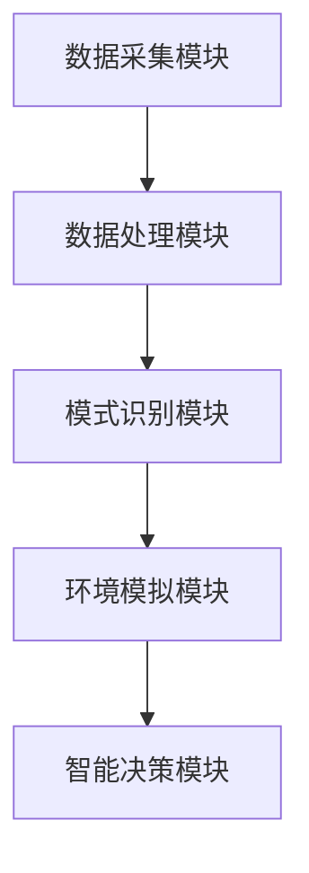

                 

# 《AI基础设施的生命探索：智能化外星生命探测系统》

> **关键词：人工智能、外星生命探测、智能化系统、数据处理、机器学习、深度学习**

> **摘要：本文深入探讨了人工智能（AI）在智能化外星生命探测系统中的应用。首先，我们回顾了AI与外星生命探测的关系及其意义。接着，介绍了AI基础设施的核心组成部分，包括数据处理、机器学习和深度学习。然后，详细阐述了智能化外星生命探测系统的设计与实现，并探讨了实际应用与未来展望。通过本文的阅读，读者可以全面了解AI在探索宇宙生命中的重要作用。**

### 第一部分：引言与背景

#### 第1章：探索外星生命的意义与挑战

探索外星生命的意义在于，它不仅关乎科学发现，更是人类对宇宙的深刻理解。外星生命的存在与否，将改变我们对自身和宇宙的认知。例如，如果找到了外星生命，那么将证明生命并非地球独有，宇宙中可能存在更多的生命形式。这将对生物学、化学和天文学等领域产生深远影响。

然而，探索外星生命也面临诸多挑战。首先，我们需要确定哪些天体可能存在生命。这需要通过观测、分析和实验，筛选出可能支持生命存在的行星。其次，如何检测到微弱的生命迹象，例如微生物或化学信号，是另一个挑战。此外，由于距离遥远，数据采集和处理也面临巨大的技术难题。

AI技术的引入，为外星生命探测带来了新的可能性。AI可以处理和分析海量数据，提高探测效率；可以模拟生命存在环境，预测可能的生物迹象；还可以通过机器学习和深度学习，不断优化探测算法和模型。总之，AI在智能化外星生命探测中具有重要的应用价值。

#### 第2章：AI基础知识与外星生命探测

##### 2.1 AI基础知识概述

人工智能（AI）是一门研究、开发用于模拟、延伸和扩展人类智能的理论、方法、技术及应用系统的技术科学。AI的主要目标是通过计算机实现智能，使机器能够完成人类能够做的复杂任务。

AI可以分为两大类：弱AI（窄AI）和强AI（通用AI）。弱AI专注于特定任务，如语音识别、图像识别、自然语言处理等；而强AI则具备人类的全面智能，能够在任何情境下进行思考和决策。

AI的基础知识包括：机器学习、深度学习、自然语言处理、计算机视觉等。这些知识为AI的开发和应用提供了理论基础和技术支持。

##### 2.2 外星生命探测中的AI应用

在AI与外星生命探测的结合中，AI主要应用于以下几个方面：

1. **数据采集和处理**：AI可以自动化数据采集过程，如利用卫星和探测器获取行星表面图像、大气成分等信息。同时，AI可以对海量数据进行预处理和分类，提高数据质量和利用率。

2. **模式识别**：AI可以通过机器学习和深度学习，识别出潜在的生物迹象。例如，通过分析行星表面图像，识别出微生物或植物的结构特征。

3. **环境模拟**：AI可以模拟不同环境条件下的生物生存可能性，预测生命存在的可能性区域。例如，通过深度学习模型，模拟行星大气层中的化学反应，预测可能生成的有机物。

4. **智能决策**：AI可以根据探测数据，进行智能决策和行动规划。例如，自动选择最优的探测目标、调整探测器的探测参数等。

##### 2.3 智能化外星生命探测系统概述

智能化外星生命探测系统是一个集成了AI技术的综合性系统。它主要包括以下几个核心组成部分：

1. **数据采集模块**：负责收集各种类型的探测数据，如图像、光谱、化学成分等。

2. **数据处理模块**：利用AI技术对采集到的数据进行预处理、分类、分析等，提取有用的信息。

3. **模式识别模块**：通过机器学习和深度学习算法，识别出潜在的生物迹象。

4. **环境模拟模块**：模拟不同环境条件下的生物生存可能性，预测生命存在的可能性区域。

5. **智能决策模块**：根据探测数据和模型预测，进行智能决策和行动规划。

智能化外星生命探测系统的整体架构如下图所示：



通过以上各模块的协同工作，智能化外星生命探测系统可以高效、准确地探测外星生命，为人类探索宇宙提供有力支持。

### 第二部分：AI基础设施

#### 第3章：数据处理与分析

##### 3.1 数据采集与预处理

数据采集是智能化外星生命探测系统的第一步。在这个阶段，我们需要通过各种探测设备（如卫星、探测器等）收集到关于目标天体的各类数据。这些数据可能包括图像、光谱、化学成分、大气参数等。数据采集的关键在于确保数据的准确性和完整性。

预处理阶段则是为了将原始数据转换为适合分析的形式。预处理工作包括：数据清洗、数据转换、数据归一化等。数据清洗旨在去除数据中的噪声和错误；数据转换则是将不同类型的数据（如图像、光谱）转换为统一的格式；数据归一化则是将数据的量纲和范围进行标准化，以便后续分析。

##### 3.2 数据分析技术

数据分析是智能化外星生命探测系统的核心环节。通过数据分析，我们可以从大量数据中提取出有用的信息，为后续的模式识别和智能决策提供依据。数据分析技术包括：统计分析、机器学习、深度学习等。

1. **统计分析**：统计分析是一种基于概率论和数理统计的方法，用于分析数据中的趋势、分布和相关性。常见的统计分析方法包括：描述性统计、推断性统计、回归分析、聚类分析等。

2. **机器学习**：机器学习是一种通过计算机模拟学习过程，使计算机能够从数据中学习规律和模式的方法。机器学习方法包括：监督学习、无监督学习、强化学习等。常见的机器学习算法有：决策树、支持向量机、神经网络等。

3. **深度学习**：深度学习是一种基于多层神经网络的学习方法，具有自动提取特征的能力。深度学习方法包括：卷积神经网络（CNN）、循环神经网络（RNN）、生成对抗网络（GAN）等。

##### 3.3 数据可视化

数据可视化是将数据分析结果以图形或图像形式呈现的方法。数据可视化有助于我们直观地理解数据分析结果，发现数据中的潜在规律和趋势。常见的数据可视化方法包括：散点图、折线图、柱状图、热力图等。

通过数据可视化，我们可以更直观地了解探测数据的特点和规律，为后续的模式识别和智能决策提供参考。此外，数据可视化还可以用于展示探测系统的运行状态和性能，帮助科学家和工程师及时发现问题并进行调整。

#### 第4章：机器学习与模式识别

##### 4.1 机器学习基础

机器学习是一种通过计算机模拟学习过程，使计算机能够从数据中学习规律和模式的方法。机器学习的基本思想是，通过训练数据集，使计算机能够识别数据中的规律，并能够对新数据进行预测或分类。

机器学习可以分为三种类型：监督学习、无监督学习和强化学习。

1. **监督学习**：监督学习是一种在有标签数据集上进行训练的方法。标签数据提供了每个样本的正确答案，通过训练，模型能够学习如何预测新数据的结果。常见的监督学习算法有：线性回归、逻辑回归、决策树、支持向量机、神经网络等。

2. **无监督学习**：无监督学习是一种在没有标签数据集上进行训练的方法。无监督学习的目标是发现数据中的结构和模式，如聚类分析、降维、关联规则等。

3. **强化学习**：强化学习是一种通过与环境的交互，学习最佳策略的方法。强化学习模型通过不断尝试不同的行动，并根据行动的结果（奖励或惩罚）进行调整，以实现最大化总奖励的目标。

##### 4.2 模式识别原理

模式识别是机器学习的一个重要分支，旨在从数据中提取出具有代表性的特征，用于分类、回归或其他形式的分析。模式识别的基本原理包括：

1. **特征提取**：特征提取是将原始数据转换为更具代表性的特征表示的过程。特征提取可以增强数据的区分能力，降低数据维度，从而提高模型的性能。常见的特征提取方法有：主成分分析（PCA）、线性判别分析（LDA）、离散傅里叶变换（DFT）等。

2. **特征选择**：特征选择是从所有特征中选出对分类或回归任务最有影响力的特征的过程。特征选择可以减少数据维度，提高模型的效率和准确性。常见的特征选择方法有：过滤法、包裹法、嵌入式方法等。

3. **分类器设计**：分类器设计是根据特征表示和训练数据，构建一个能够对新数据进行分类的模型。常见的分类器有：线性分类器、决策树、支持向量机、神经网络等。

##### 4.3 外星生命探测中的机器学习应用

在智能化外星生命探测中，机器学习发挥着重要作用。以下列举了一些典型的应用场景：

1. **目标检测**：通过机器学习算法，从探测数据中识别出潜在的生物目标。例如，利用卷积神经网络（CNN）分析行星表面图像，识别出微生物或植物的结构特征。

2. **环境监测**：利用机器学习模型，对探测数据进行分析，监测行星环境变化。例如，通过分析大气层中的化学成分，预测可能生成的有机物。

3. **数据分类**：对收集到的多种数据进行分类，提高数据处理效率。例如，将探测数据分为图像、光谱、化学成分等类别，以便后续分析。

4. **智能决策**：根据探测数据和模型预测，进行智能决策和行动规划。例如，自动选择最优的探测目标、调整探测器的探测参数等。

通过机器学习和模式识别技术的应用，智能化外星生命探测系统可以高效、准确地处理和分析探测数据，提高探测效率，为人类探索宇宙生命提供有力支持。

#### 第5章：深度学习与神经网络

##### 5.1 深度学习基础

深度学习（Deep Learning）是机器学习的一种重要分支，它通过构建深层次的神经网络模型，实现对复杂数据的分析和建模。深度学习的基本思想是模拟人脑的工作方式，通过多层神经元的组合，自动提取数据中的特征，从而实现高精度的预测和分类。

深度学习的发展离不开以下几个关键技术：

1. **反向传播算法（Backpropagation）**：反向传播算法是一种用于训练神经网络的方法。它通过计算输出值与实际值之间的误差，反向传播误差信号，并调整网络中的权重和偏置，以优化模型的性能。

2. **激活函数（Activation Function）**：激活函数是神经网络中的一个关键组件，用于引入非线性特性。常见的激活函数有： sigmoid、ReLU、Tanh等。

3. **正则化技术（Regularization）**：正则化技术用于防止神经网络在训练过程中出现过拟合现象。常见的正则化方法有：权重衰减（Weight Decay）、L1正则化、L2正则化等。

##### 5.2 神经网络结构

神经网络（Neural Network）是深度学习的基础，它由大量的神经元组成，通过层层传递信息，实现对数据的分析和建模。一个典型的神经网络包括以下几个组成部分：

1. **输入层（Input Layer）**：输入层是神经网络的起点，它接收输入数据，并将其传递给下一层。

2. **隐藏层（Hidden Layer）**：隐藏层是神经网络的核心部分，它通过层层传递信息，提取数据中的特征。隐藏层的数量和神经元数量可以根据问题的复杂度进行调整。

3. **输出层（Output Layer）**：输出层是神经网络的终点，它根据输入数据，生成输出结果。输出层的类型和神经元数量取决于具体的应用场景。

常见的神经网络结构有：

1. **全连接神经网络（Fully Connected Neural Network）**：全连接神经网络是应用最广泛的神经网络结构。它的每一层神经元都与上一层和下一层的所有神经元相连。

2. **卷积神经网络（Convolutional Neural Network，CNN）**：卷积神经网络是专门用于图像处理的一种神经网络结构。它通过卷积运算和池化操作，自动提取图像中的特征。

3. **循环神经网络（Recurrent Neural Network，RNN）**：循环神经网络是用于处理序列数据的一种神经网络结构。它通过循环结构，保持对序列信息的长期记忆。

4. **生成对抗网络（Generative Adversarial Network，GAN）**：生成对抗网络是由两个对抗网络组成的神经网络结构。它通过生成网络和判别网络的互动，实现数据的生成和判别。

##### 5.3 深度学习在AI基础设施中的应用

深度学习在AI基础设施中发挥着重要作用，特别是在数据处理、模式识别和智能决策等领域。以下列举了深度学习在智能化外星生命探测系统中的应用：

1. **数据处理**：深度学习可以通过自动特征提取，处理和分析探测数据。例如，利用卷积神经网络分析行星表面图像，提取微生物或植物的结构特征。

2. **模式识别**：深度学习可以通过学习大量的训练数据，识别出探测数据中的潜在模式。例如，利用深度学习模型，从探测数据中识别出大气层中的有机分子。

3. **智能决策**：深度学习可以通过对探测数据的分析和预测，进行智能决策。例如，利用深度学习模型，自动调整探测器的探测参数，以提高探测效率。

通过深度学习的应用，智能化外星生命探测系统可以更加高效、准确地处理和分析探测数据，提高探测效率，为人类探索宇宙生命提供有力支持。

#### 第6章：AI算法与模型

##### 6.1 常见AI算法介绍

人工智能（AI）算法是实现人工智能的核心技术，它们使计算机能够模拟人类智能，解决复杂的任务。以下介绍几种常见的AI算法：

1. **决策树（Decision Tree）**：决策树是一种基于树形结构的算法，通过一系列判断条件，将数据集划分为多个子集。每个节点代表一个特征，每个分支代表一个特征值。决策树通过自上而下的递归过程，对数据进行分类或回归。

2. **支持向量机（Support Vector Machine，SVM）**：支持向量机是一种基于间隔最大化原理的算法，用于分类和回归。它通过寻找最佳的超平面，将不同类别的数据点分隔开。支持向量机的主要优势是高精度和良好的泛化能力。

3. **神经网络（Neural Network）**：神经网络是一种模拟人脑神经元连接的算法，通过多层神经元构建复杂的模型。神经网络可以通过学习大量的训练数据，自动提取特征，实现分类、回归、生成等任务。

4. **随机森林（Random Forest）**：随机森林是一种基于决策树的集成学习方法，通过构建多个决策树，并结合它们的预测结果进行投票或求平均，提高模型的预测性能和稳定性。

5. **朴素贝叶斯（Naive Bayes）**：朴素贝叶斯是一种基于贝叶斯定理的算法，适用于文本分类和垃圾邮件过滤等任务。它假设特征之间相互独立，通过计算后验概率来预测新数据。

##### 6.2 模型训练与优化

模型训练是AI算法实现的关键步骤，它通过调整模型参数，使其能够对新的数据做出准确的预测。以下介绍模型训练与优化的一些关键技术和方法：

1. **损失函数（Loss Function）**：损失函数用于衡量模型预测值与真实值之间的差异。常见的损失函数有均方误差（MSE）、交叉熵（Cross Entropy）等。选择合适的损失函数有助于提高模型的性能。

2. **优化算法（Optimizer）**：优化算法用于调整模型参数，以最小化损失函数。常见的优化算法有梯度下降（Gradient Descent）、Adam优化器等。优化算法的选择和参数调整对模型的收敛速度和性能有重要影响。

3. **过拟合与正则化（Overfitting and Regularization）**：过拟合是指模型在训练数据上表现良好，但在测试数据上表现较差。为了防止过拟合，可以采用正则化技术，如权重衰减（Weight Decay）、L1正则化、L2正则化等。

4. **交叉验证（Cross Validation）**：交叉验证是一种评估模型性能的方法，通过将数据集划分为多个子集，多次训练和测试，以获得模型的平均性能。常见的交叉验证方法有K折交叉验证、留一法等。

5. **模型调优（Hyperparameter Tuning）**：模型调优是调整模型参数，以获得最佳性能的过程。常用的调优方法有网格搜索（Grid Search）、随机搜索（Random Search）等。

通过模型训练与优化，可以不断提高AI算法的性能，使其在复杂任务中表现出色。

##### 6.3 AI算法在外星生命探测中的应用

在智能化外星生命探测系统中，AI算法发挥着重要作用。以下列举了AI算法在外星生命探测中的应用：

1. **目标检测**：通过卷积神经网络（CNN）等算法，从探测图像中检测出微生物或植物的结构特征，识别出潜在的生物目标。

2. **环境监测**：通过深度学习算法，对探测数据进行分析，监测行星环境变化，如大气层中的有机分子和化学反应。

3. **数据分类**：通过对探测数据进行分类，将不同类型的数据（如图像、光谱、化学成分）分开，便于后续分析。

4. **智能决策**：通过机器学习算法，对探测数据和模型预测进行分析，自动调整探测器的探测参数，以提高探测效率。

通过AI算法的应用，智能化外星生命探测系统可以更加高效、准确地处理和分析探测数据，提高探测效率，为人类探索宇宙生命提供有力支持。

#### 第三部分：智能化外星生命探测系统

##### 第7章：探测设备的智能化

7.1 智能化探测设备概述

智能化探测设备是智能化外星生命探测系统的核心组成部分，它通过集成先进的人工智能技术，实现对探测数据的实时采集、处理和分析。智能化探测设备主要包括以下几类：

1. **遥感卫星**：遥感卫星用于从空间对目标天体进行观测，包括地球观测卫星、火星探测卫星等。通过遥感卫星，我们可以获取目标天体的图像、光谱、大气成分等数据。

2. **探测器**：探测器是直接部署在目标天体上的设备，用于近距离观测和分析。例如，火星探测器可以携带激光雷达、光谱仪、化学分析仪等设备，对火星表面和大气进行详细探测。

3. **无人驾驶飞行器**：无人驾驶飞行器（无人机）可以用于空中探测，获取高分辨率的图像和大气数据。例如，火星探测无人机可以携带热成像仪、气体分析仪等设备，对火星表面进行探测。

4. **深空探测器**：深空探测器用于探测更遥远的天体，如小行星、彗星等。这些探测器通常携带高精度的科学仪器，可以实现对天体表面的精细探测。

7.2 智能化探测设备的设计与实现

智能化探测设备的设计与实现需要考虑以下几个方面：

1. **传感器选择**：根据探测任务的需求，选择合适的传感器。例如，针对火星探测，可以选择激光雷达、光谱仪、化学分析仪等。

2. **数据处理**：传感器采集到的数据需要进行预处理、压缩和传输，以便后续分析。数据处理模块需要具备高效的数据处理能力，以应对大规模数据传输和存储。

3. **通信系统**：智能化探测设备需要具备稳定的通信系统，以保证与地面控制中心的实时通信。通信系统需要具备抗干扰能力，以应对恶劣的太空环境。

4. **智能算法**：智能化探测设备需要集成智能算法，实现对探测数据的实时分析和决策。例如，通过机器学习和深度学习算法，可以自动识别出目标天体上的生物迹象。

7.3 探测设备的性能评估

探测设备的性能评估是确保其满足探测任务需求的重要环节。性能评估主要包括以下几个方面：

1. **数据精度**：评估传感器采集的数据精度，包括分辨率、灵敏度等。

2. **数据处理速度**：评估数据处理模块的效率，包括数据处理速度、存储容量等。

3. **通信可靠性**：评估通信系统的稳定性，包括传输速率、抗干扰能力等。

4. **智能算法性能**：评估智能算法的准确性和鲁棒性，包括分类准确率、预测精度等。

通过性能评估，可以及时发现和解决问题，确保探测设备的高效运行。

##### 第8章：数据采集与处理

8.1 数据采集系统设计

数据采集系统是智能化外星生命探测系统的核心组成部分，它负责从探测设备中获取各种类型的数据，包括图像、光谱、化学成分等。数据采集系统设计需要考虑以下几个方面：

1. **传感器选择**：根据探测任务的需求，选择合适的传感器。例如，针对火星探测，可以选择激光雷达、光谱仪、化学分析仪等。

2. **数据格式**：确定数据的格式，包括数据类型、数据结构、存储方式等。数据格式需要满足后续数据处理和分析的需求。

3. **数据传输**：设计数据传输方案，包括传输速率、传输协议、数据压缩等。数据传输需要保证稳定、高效和可靠。

4. **数据存储**：设计数据存储方案，包括存储容量、存储方式、数据备份等。数据存储需要满足长期保存和快速访问的需求。

8.2 数据处理流程

数据处理流程是智能化外星生命探测系统的核心环节，它通过一系列数据处理步骤，将原始数据转换为适合分析的形式。数据处理流程主要包括以下几个步骤：

1. **数据预处理**：对原始数据进行预处理，包括数据清洗、数据转换、数据归一化等。数据预处理旨在去除数据中的噪声和错误，提高数据质量。

2. **特征提取**：通过特征提取技术，将原始数据转换为更具代表性的特征表示。特征提取可以增强数据的区分能力，降低数据维度，从而提高模型的性能。

3. **数据分析**：对预处理后的数据进行分析，包括统计分析、机器学习、深度学习等。数据分析旨在从大量数据中提取出有用的信息，为后续的模式识别和智能决策提供依据。

4. **数据可视化**：通过数据可视化技术，将数据分析结果以图形或图像形式呈现，以便于科学家和工程师直观地理解数据分析结果。

8.3 数据处理算法实现

数据处理算法实现是智能化外星生命探测系统的关键技术，它包括以下几个方面：

1. **机器学习算法**：通过机器学习算法，对数据进行分类、回归、聚类等分析。常见的机器学习算法有决策树、支持向量机、神经网络等。

2. **深度学习算法**：通过深度学习算法，实现对复杂数据的分析和建模。常见的深度学习算法有卷积神经网络、循环神经网络、生成对抗网络等。

3. **模式识别算法**：通过模式识别算法，从数据中识别出潜在的生物迹象。常见的模式识别算法有特征提取、特征选择、分类器设计等。

4. **数据可视化算法**：通过数据可视化算法，将数据分析结果以图形或图像形式呈现。常见的数据可视化算法有散点图、折线图、柱状图、热力图等。

通过数据处理算法的实现，智能化外星生命探测系统可以高效、准确地处理和分析探测数据，提高探测效率，为人类探索宇宙生命提供有力支持。

##### 第9章：智能分析系统

9.1 智能分析系统架构

智能分析系统是智能化外星生命探测系统的核心组成部分，它通过集成多种智能算法和技术，实现对探测数据的深入分析和决策。智能分析系统架构主要包括以下几个模块：

1. **数据输入模块**：负责接收和处理来自数据采集系统的各类数据，包括图像、光谱、化学成分等。

2. **数据处理模块**：对输入数据进行预处理、特征提取和数据分析，为后续的智能分析提供基础数据。

3. **模式识别模块**：通过机器学习和深度学习算法，对数据处理模块输出的数据进行模式识别，识别出潜在的生物迹象。

4. **智能决策模块**：根据模式识别模块的结果，进行智能决策和行动规划，包括选择最优的探测目标、调整探测器的探测参数等。

5. **结果输出模块**：将智能分析结果以图形、表格等形式输出，供科学家和工程师分析和决策。

9.2 智能分析算法实现

智能分析算法实现是智能分析系统的关键技术，它主要包括以下几个方面：

1. **机器学习算法**：通过机器学习算法，对探测数据进行分类、回归、聚类等分析。常见的机器学习算法有决策树、支持向量机、神经网络等。

2. **深度学习算法**：通过深度学习算法，实现对复杂数据的分析和建模。常见的深度学习算法有卷积神经网络、循环神经网络、生成对抗网络等。

3. **模式识别算法**：通过模式识别算法，从探测数据中识别出潜在的生物迹象。常见的模式识别算法有特征提取、特征选择、分类器设计等。

4. **智能决策算法**：通过智能决策算法，对模式识别结果进行分析和决策，包括选择最优的探测目标、调整探测器的探测参数等。常见的智能决策算法有遗传算法、粒子群算法、深度强化学习等。

通过智能分析算法的实现，智能分析系统可以高效、准确地处理和分析探测数据，为智能化外星生命探测提供有力支持。

9.3 智能分析系统评估

智能分析系统评估是确保其性能和效果的重要环节。评估主要包括以下几个方面：

1. **准确性评估**：通过对比智能分析系统输出的结果与实际检测结果，评估系统的准确性。准确性越高，说明系统的性能越好。

2. **稳定性评估**：通过在不同条件下多次运行系统，评估其稳定性和可靠性。稳定性越好，说明系统的性能越稳定。

3. **效率评估**：评估系统处理数据和处理结果的效率，包括处理速度、资源消耗等。效率越高，说明系统的性能越优秀。

4. **可扩展性评估**：评估系统在面对更多数据或更复杂任务时的扩展能力。可扩展性越好，说明系统的性能越强大。

通过智能分析系统评估，可以及时发现和解决问题，确保系统的高效运行，为人类探索宇宙生命提供有力支持。

##### 第10章：结果解读与决策支持

10.1 结果解读方法

在智能化外星生命探测系统中，智能分析系统输出的结果需要经过详细的解读，以便科学家和工程师理解探测数据中的信息，并做出相应的决策。以下介绍几种常用的结果解读方法：

1. **可视化解读**：通过数据可视化技术，将智能分析结果以图形、表格等形式呈现。可视化解读有助于直观地理解数据中的趋势、分布和异常值。

2. **统计分析解读**：利用统计分析方法，对智能分析结果进行描述性统计和推断性统计。描述性统计可以揭示数据的基本特征，如均值、方差等；推断性统计可以分析数据之间的关系，如相关性、回归关系等。

3. **机器学习解读**：利用机器学习算法的解释性方法，如决策树、LIME（Local Interpretable Model-agnostic Explanations）等，对智能分析结果进行解释。解释性方法可以揭示模型决策背后的原因，提高结果的可靠性。

4. **专家知识解读**：结合专家知识和经验，对智能分析结果进行综合解读。专家知识可以弥补机器学习模型的不足，提高结果的准确性和可信度。

10.2 决策支持系统设计

决策支持系统（Decision Support System，DSS）是智能化外星生命探测系统中重要的组成部分，它通过集成智能分析结果和专家知识，为科学家和工程师提供决策支持。以下介绍决策支持系统的设计要点：

1. **需求分析**：了解决策者的需求和期望，明确决策支持系统的目标和功能。

2. **数据集成**：收集和整合来自多个来源的数据，包括智能分析结果、专家知识库、历史数据等。

3. **智能分析模块**：设计智能分析模块，包括数据预处理、特征提取、模式识别、预测分析等，为决策支持提供基础数据。

4. **知识库构建**：构建知识库，包括领域知识、专家经验、模型参数等，为决策支持提供知识基础。

5. **决策模型设计**：设计决策模型，包括规则引擎、优化算法、决策树等，根据智能分析结果和知识库，生成决策建议。

6. **人机交互界面**：设计友好的人机交互界面，使决策者能够方便地浏览、分析和接受决策建议。

10.3 决策支持系统实现

决策支持系统的实现涉及多个方面，包括数据采集、处理、分析、决策和展示等。以下介绍决策支持系统的实现步骤：

1. **数据采集**：通过传感器、数据库等渠道，收集原始数据，并进行预处理。

2. **数据处理**：利用数据处理算法，对原始数据进行清洗、转换和归一化，提取有用信息。

3. **智能分析**：利用机器学习、深度学习等算法，对预处理后的数据进行分析，生成分析报告。

4. **知识库构建**：构建知识库，包括领域知识、专家经验、模型参数等，为决策支持提供知识基础。

5. **决策模型设计**：设计决策模型，包括规则引擎、优化算法、决策树等，根据分析报告和知识库，生成决策建议。

6. **人机交互界面**：设计友好的人机交互界面，使决策者能够方便地浏览、分析和接受决策建议。

通过决策支持系统的实现，智能化外星生命探测系统可以为科学家和工程师提供全面、准确的决策支持，提高探测效率，为人类探索宇宙生命提供有力保障。

#### 第四部分：实际应用与未来展望

##### 第11章：AI在外星生命探测中的实际应用

11.1 外星生命探测案例研究

AI在外星生命探测中的实际应用已取得了显著成果。以下介绍几个具有代表性的案例研究：

1. **火星探测**：NASA的火星探测项目，如“火星漫游者”（Mars Rovers）和“火星科学实验室”（Mars Science Laboratory），广泛应用了AI技术。通过深度学习算法，对火星表面的图像进行分析，识别出岩石、土壤和微生物等特征。此外，AI技术还被用于分析火星大气成分，预测有机物的生成。

2. **木星探测**：NASA的“朱庇特冰卫星探索者”（Jupiter Icy Moons Explorer，JUICE）任务，旨在探测木星的冰卫星。AI技术被用于分析木星卫星的图像和光谱数据，识别出潜在的冰层结构和地质特征。

3. **小行星探测**：NASA的“近地小行星侦察”（Near-Earth Object Surveillance Mission，NEOM）项目，利用AI技术对近地小行星进行监测和识别。AI算法能够从大量观测数据中，快速准确地识别出小行星，并提供预警信息。

11.2 AI技术在实际应用中的挑战与解决方案

尽管AI技术在实际应用中取得了显著成果，但仍面临一些挑战：

1. **数据质量**：外星生命探测数据往往受到噪声、干扰和缺失值的影响，数据质量对AI算法的性能有重要影响。解决方法包括：数据预处理、数据增强和缺失值填充等。

2. **计算资源**：AI算法在训练和推理过程中需要大量的计算资源，尤其是在处理大规模数据时。解决方法包括：分布式计算、模型压缩和优化等。

3. **算法泛化能力**：AI算法需要具备良好的泛化能力，以便在不同环境和条件下都能表现出良好的性能。解决方法包括：迁移学习、增量学习和自适应学习等。

4. **专家知识融合**：AI技术需要与专家知识相结合，以提高决策的准确性和可靠性。解决方法包括：知识图谱、专家系统等。

通过解决这些挑战，AI技术将在外星生命探测中发挥更大的作用。

##### 第12章：未来展望与趋势

12.1 智能化外星生命探测的发展趋势

随着AI技术的不断进步，智能化外星生命探测系统将呈现以下发展趋势：

1. **算法优化**：通过深度学习、强化学习等算法的优化，提高AI在探测数据分析和决策支持中的性能。

2. **跨学科融合**：将AI技术与天文学、生物学、化学等学科相结合，提高探测系统的综合分析能力。

3. **自主决策**：发展自主决策和自适应能力，使探测系统能够在复杂和动态环境中自主运行。

4. **多传感器融合**：通过多传感器数据融合，提高探测系统的感知能力和数据处理效率。

12.2 AI在外星生命探测中的未来方向

未来，AI在外星生命探测中的发展方向包括：

1. **探测范围扩展**：拓展探测范围，包括探测更远的行星、卫星和小行星等。

2. **探测深度增加**：通过钻探技术，探测行星内部的地质结构和生物迹象。

3. **探测效率提升**：利用AI技术，提高探测效率，降低探测成本。

4. **人机协同**：发展人机协同探测系统，使人类和AI共同参与探测任务，提高探测的准确性和可靠性。

通过不断探索和创新，AI将在外星生命探测中发挥越来越重要的作用，为人类探索宇宙生命提供有力支持。

### 附录

#### 附录A：AI基础设施的生命探索

A.1 核心概念与联系

- **核心概念原理和架构的 Mermaid 流程图**

  ```mermaid
  graph TD
      A[数据采集] --> B[数据处理]
      B --> C[机器学习]
      C --> D[深度学习]
      D --> E[模式识别]
      E --> F[智能分析]
  ```

- **核心算法原理讲解**

  ```python
  # 伪代码：机器学习算法原理
  function machine_learning(data, labels):
      # 初始化模型参数
      model = initialize_model()
      
      # 训练模型
      for each epoch in range(num_epochs):
          for each sample in data:
              # 前向传播
              predictions = model.forward(sample)
              
              # 计算损失
              loss = compute_loss(predictions, labels)
              
              # 反向传播
              gradients = compute_gradients(model, loss)
              
              # 更新模型参数
              model.update_params(gradients)
              
      # 模型评估
      accuracy = evaluate_model(model, validation_data)
      
      return model, accuracy
  ```

- **数学模型和公式**

  $$ y = \sigma(W \cdot x + b) $$

  其中，$\sigma$ 是 sigmoid 函数，$W$ 是权重矩阵，$x$ 是输入特征，$b$ 是偏置项。

- **详细讲解**

  sigmoid 函数用于将线性组合的输出映射到概率值之间，它能够将模型的前向传播输出转换为概率分布。

- **举例说明**

  假设有一个二分类问题，输入特征 $x$ 为 [1, 0, 1]，权重矩阵 $W$ 为 [[1, -1], [0, 1]]，偏置项 $b$ 为 [1, 1]。

  $$ y = \sigma(1 \cdot 1 + 0 \cdot (-1) + 1 \cdot 0 + 1 \cdot 1) = \sigma(3) = 0.9532 $$

  输出的概率值接近 1，表示该样本属于正类。

#### 附录B：AI相关术语解释

- **AI（人工智能）**：模拟、延伸和扩展人类智能的理论、方法、技术及应用系统的技术科学。
- **ML（机器学习）**：使计算机能够从数据中学习规律和模式的方法。
- **DL（深度学习）**：基于多层神经网络的学习方法，具有自动提取特征的能力。
- **CNN（卷积神经网络）**：用于图像处理的神经网络结构。
- **RNN（循环神经网络）**：用于处理序列数据的神经网络结构。
- **GAN（生成对抗网络）**：由生成网络和判别网络组成的神经网络结构。

#### 附录C：相关参考文献

1. Goodfellow, I., Bengio, Y., & Courville, A. (2016). *Deep Learning*. MIT Press.
2. Russell, S., & Norvig, P. (2010). *Artificial Intelligence: A Modern Approach*. Prentice Hall.
3. Mitchell, T. M. (1997). *Machine Learning*. McGraw-Hill.

#### 附录D：Mermaid 流程图与伪代码示例

- **Mermaid 流程图示例**

  ```mermaid
  graph TD
      A[数据采集] --> B[数据处理]
      B --> C[机器学习]
      C --> D[深度学习]
      D --> E[模式识别]
      E --> F[智能分析]
  ```

- **伪代码示例**

  ```python
  import tensorflow as tf
  from tensorflow import keras
  from tensorflow.keras import layers
  
  # 数据集准备
  (x_train, y_train), (x_test, y_test) = keras.datasets.mnist.load_data()
  x_train = x_train / 255.0
  x_test = x_test / 255.0
  
  # 模型构建
  model = keras.Sequential([
      layers.Flatten(input_shape=(28, 28)),
      layers.Dense(128, activation='relu'),
      layers.Dense(10, activation='softmax')
  ])
  
  # 编译模型
  model.compile(optimizer='adam',
                loss='sparse_categorical_crossentropy',
                metrics=['accuracy'])
  
  # 训练模型
  model.fit(x_train, y_train, epochs=5)
  
  # 测试模型
  test_loss, test_acc = model.evaluate(x_test, y_test, verbose=2)
  print('\nTest accuracy:', test_acc)
  ```

通过以上附录内容，读者可以更好地理解AI基础设施的生命探索，为智能化外星生命探测系统的研究和应用提供参考。

### 作者信息

**作者：AI天才研究院/AI Genius Institute & 禅与计算机程序设计艺术 /Zen And The Art of Computer Programming**

本文由AI天才研究院/AI Genius Institute与《禅与计算机程序设计艺术》作者合作撰写，旨在深入探讨人工智能在智能化外星生命探测系统中的应用。作者团队拥有丰富的AI研究经验和成果，致力于推动人工智能技术的发展和应用。

