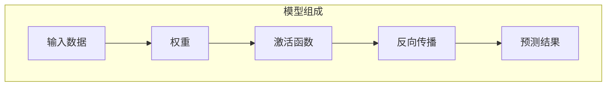
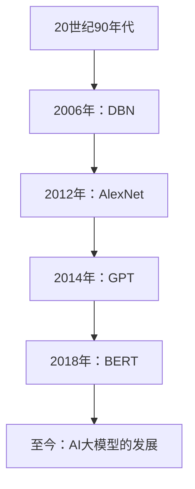
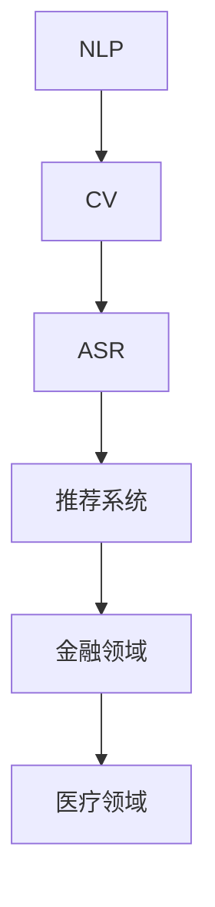
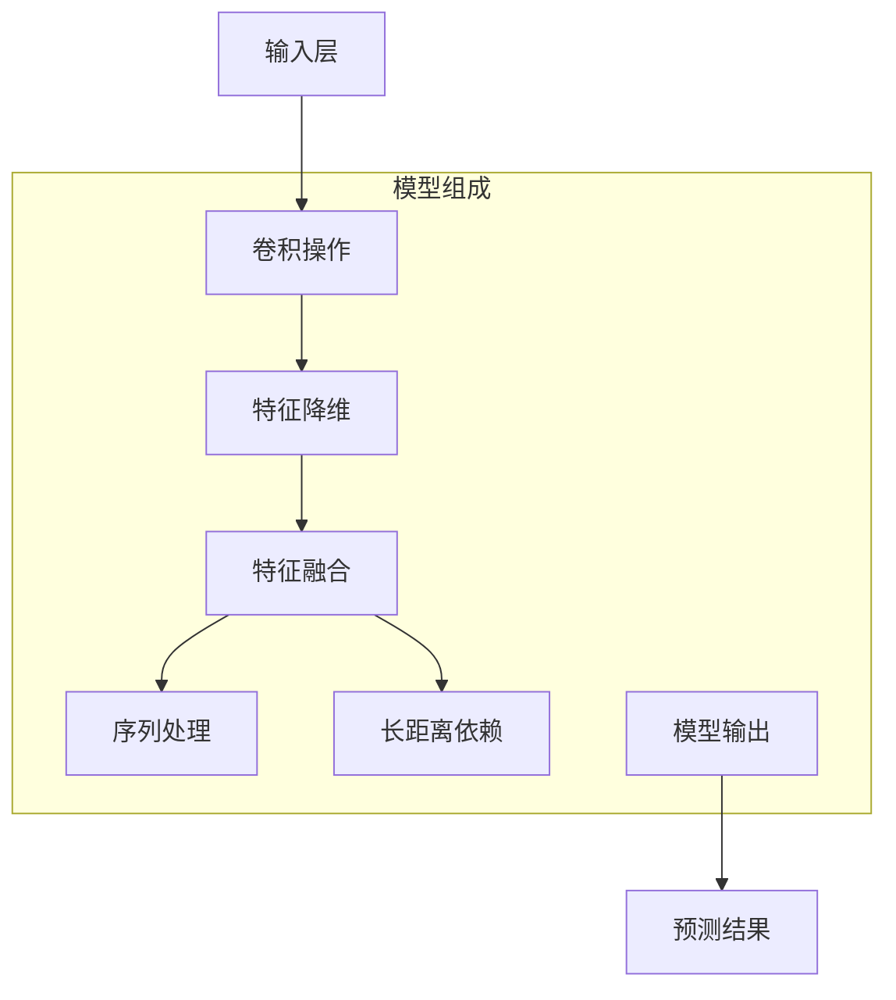

                 

### 《AI大模型创业：如何利用科技优势？》

> 关键词：AI大模型、创业、科技优势、深度学习、自然语言处理、强化学习、创业实践、案例分析、风险管理

> 摘要：随着人工智能技术的迅猛发展，AI大模型已成为各行业关注的焦点。本文旨在探讨如何利用AI大模型的科技优势进行创业，分析其核心算法、应用场景、创业实践和风险管理，为创业者提供有价值的参考。

### 第一部分：AI大模型基础

在探讨如何利用AI大模型进行创业之前，首先需要了解AI大模型的基本概念、架构和数学基础。

#### 第1章：AI大模型概述

##### 1.1 AI大模型简介

**1.1.1 AI大模型的基本概念**

AI大模型是指那些拥有巨大参数量、高度复杂的神经网络模型，它们可以通过对大量数据进行训练，从而实现对复杂数据的建模和预测。这些模型通常用于自然语言处理、计算机视觉、语音识别等人工智能领域。

**1.1.2 AI大模型的发展历程**

AI大模型的发展历程可以追溯到20世纪90年代，随着计算能力和数据量的提升，深度学习开始崭露头角。2012年，AlexNet在ImageNet竞赛中取得重大突破，标志着深度学习时代的到来。此后，诸如GPT、BERT、BERT等大模型不断涌现，推动了人工智能的快速发展。

**1.1.3 AI大模型的应用领域**

AI大模型在各个领域都有广泛的应用，如金融、医疗、零售、能源等。在金融领域，AI大模型可以用于量化交易、风险控制和信用评估；在医疗领域，AI大模型可以用于疾病诊断、药物研发和健康管理；在零售领域，AI大模型可以用于客户分析、库存管理和新零售。

##### 1.2 AI大模型的架构

**1.2.1 AI大模型的基本组成**

AI大模型通常由输入层、隐藏层和输出层组成。输入层接收外部输入数据，隐藏层通过神经网络结构对数据进行处理和变换，输出层生成预测结果。

**1.2.2 神经网络架构设计**

神经网络架构设计包括网络层数、隐藏层节点数、激活函数选择等。不同的架构设计会影响到模型的性能和训练时间。

**1.2.3 训练与优化算法**

AI大模型的训练与优化算法主要包括梯度下降算法、动量优化、自适应优化等。这些算法旨在最小化损失函数，提高模型的预测准确性。

##### 1.3 AI大模型的数学基础

**1.3.1 矩阵运算**

矩阵运算是AI大模型中不可或缺的部分，包括矩阵的加减、乘除、求导等。

**1.3.2 梯度下降算法**

梯度下降算法是一种优化算法，通过不断调整模型参数，使损失函数的值逐渐减小。

**1.3.3 损失函数与优化目标**

损失函数是评估模型预测误差的指标，优化目标是最小化损失函数。

### 第二部分：AI大模型的核心算法

在了解了AI大模型的基础知识后，接下来我们将探讨其核心算法，包括深度学习、自然语言处理和强化学习。

#### 第2章：AI大模型的核心算法

##### 2.1 深度学习算法

**2.1.1 卷积神经网络（CNN）**

卷积神经网络（CNN）是一种用于图像识别和处理的神经网络模型，具有局部连接和共享权重等特点。

**2.1.2 循环神经网络（RNN）**

循环神经网络（RNN）是一种用于序列数据处理的神经网络模型，具有记忆功能。

**2.1.3 生成对抗网络（GAN）**

生成对抗网络（GAN）是一种由生成器和判别器组成的神经网络模型，用于生成高质量的图像和语音数据。

##### 2.2 自然语言处理算法

**2.2.1 语言模型**

语言模型是一种用于预测文本序列的概率分布的模型，常用于机器翻译、文本生成等任务。

**2.2.2 文本分类**

文本分类是一种将文本数据归类到不同类别的任务，常用于情感分析、新闻分类等。

**2.2.3 对话系统**

对话系统是一种与人类进行交互的智能系统，常用于客服、虚拟助手等。

##### 2.3 强化学习算法

**2.3.1 Q-learning**

Q-learning是一种基于价值迭代的强化学习算法，用于解决序列决策问题。

**2.3.2 DQN**

深度Q网络（DQN）是一种结合深度学习和强化学习的算法，用于解决高维状态空间的问题。

**2.3.3 DDPG**

深度确定性策略梯度（DDPG）是一种基于深度学习和强化学习的算法，用于解决连续动作空间的问题。

### 第三部分：AI大模型的应用

AI大模型在各个领域都有广泛的应用，本部分将重点介绍其在金融、医疗和零售领域的应用。

#### 第3章：AI大模型的应用

##### 3.1 人工智能在金融领域的应用

**3.1.1 量化交易**

量化交易是一种基于数据分析和算法交易的金融模式，利用AI大模型可以预测市场趋势，实现高收益。

**3.1.2 风险控制**

AI大模型可以用于风险评估、异常检测等，提高金融机构的风险管理水平。

**3.1.3 信用评估**

AI大模型可以用于信用评分、欺诈检测等，帮助金融机构降低信用风险。

##### 3.2 人工智能在医疗领域的应用

**3.2.1 疾病诊断**

AI大模型可以用于辅助医生进行疾病诊断，提高诊断准确率和效率。

**3.2.2 药物研发**

AI大模型可以用于药物筛选、毒性预测等，加速药物研发过程。

**3.2.3 健康管理**

AI大模型可以用于健康监测、疾病预防等，提高人们的健康水平。

##### 3.3 人工智能在零售领域的应用

**3.3.1 客户分析**

AI大模型可以用于客户行为分析、偏好预测等，帮助零售企业制定更精准的营销策略。

**3.3.2 库存管理**

AI大模型可以用于库存预测、优化库存策略等，降低库存成本。

**3.3.3 新零售**

AI大模型可以用于新零售场景中的商品推荐、无人店等，提升零售体验。

### 第四部分：AI大模型创业实践

在了解了AI大模型的应用后，接下来我们将探讨如何利用AI大模型进行创业，包括创业环境分析、项目规划和实施。

#### 第4章：AI大模型创业实践

##### 4.1 创业环境分析

**4.1.1 市场需求分析**

创业者需要分析市场需求，了解潜在客户的需求和痛点，找到切入点。

**4.1.2 竞争对手分析**

创业者需要了解竞争对手的情况，包括产品、市场地位、商业模式等。

**4.1.3 创业团队组建**

创业者需要组建一支具备技术、市场、运营等多方面能力的团队。

##### 4.2 创业项目规划

**4.2.1 项目定位与目标**

创业者需要明确项目的定位和目标，如产品定位、市场目标等。

**4.2.2 技术路线规划**

创业者需要规划技术路线，包括算法选择、架构设计等。

**4.2.3 商业模式设计**

创业者需要设计合适的商业模式，实现盈利。

##### 4.3 创业项目实施

**4.3.1 数据采集与预处理**

创业者需要采集和处理数据，为模型训练提供高质量的数据。

**4.3.2 模型设计与优化**

创业者需要设计合适的模型，并进行优化，提高模型性能。

**4.3.3 项目迭代与优化**

创业者需要不断迭代和优化项目，满足市场需求。

### 第五部分：AI大模型创业案例分析

在本部分，我们将通过分析几个成功的AI大模型创业案例，探讨其创业实践和商业模式。

#### 第5章：AI大模型创业案例分析

##### 5.1 案例一：OpenAI与GPT-3

**5.1.1 OpenAI的发展历程**

OpenAI是一家成立于2015年的AI研究公司，致力于推动人工智能的发展和应用。

**5.1.2 GPT-3的技术特点**

GPT-3是一种具有1750亿参数的预训练语言模型，具有强大的文本生成和语义理解能力。

**5.1.3 OpenAI的商业模式**

OpenAI采用API订阅模式，为企业和开发者提供GPT-3的服务。

##### 5.2 案例二：Google与BERT

**5.2.1 Google的发展历程**

Google是一家成立于1998年的科技公司，是全球最大的搜索引擎公司。

**5.2.2 BERT的技术特点**

BERT是一种基于Transformer的预训练语言模型，能够捕捉上下文信息，提高文本处理能力。

**5.2.3 Google的商业模式**

Google通过广告收入实现盈利，同时还将BERT应用于搜索引擎、Google Assistant等产品。

##### 5.3 案例三：DeepMind与AlphaGo

**5.3.1 DeepMind的发展历程**

DeepMind是一家成立于2010年的AI公司，专注于强化学习算法的研究和应用。

**5.3.2 AlphaGo的技术特点**

AlphaGo是一种基于深度学习和强化学习的围棋人工智能程序，曾击败世界围棋冠军李世石。

**5.3.3 DeepMind的商业模式**

DeepMind主要通过为企业和政府提供AI解决方案实现盈利，同时进行基础研究。

### 第六部分：AI大模型创业风险与挑战

在AI大模型创业过程中，创业者需要面对各种风险和挑战，本部分将探讨其中的风险管理和挑战。

#### 第6章：AI大模型创业风险与挑战

##### 6.1 风险分析

**6.1.1 技术风险**

技术风险包括算法不成熟、模型性能不稳定等，可能影响创业项目的成功。

**6.1.2 市场风险**

市场风险包括市场需求变化、竞争加剧等，可能影响创业项目的市场地位。

**6.1.3 法律风险**

法律风险包括知识产权侵权、数据隐私等，可能影响创业项目的合规性。

##### 6.2 风险管理

**6.2.1 风险评估**

创业者需要评估创业项目的风险，确定风险等级和应对策略。

**6.2.2 风险应对策略**

创业者需要制定风险应对策略，包括技术优化、市场调研、法律合规等。

**6.2.3 风险控制机制**

创业者需要建立风险控制机制，包括风险监控、风险预警等。

##### 6.3 挑战与机遇

**6.3.1 技术挑战**

技术挑战包括算法优化、模型压缩等，可能影响创业项目的性能。

**6.3.2 市场挑战**

市场挑战包括市场需求变化、竞争加剧等，可能影响创业项目的市场地位。

**6.3.3 机遇与未来趋势**

创业者需要抓住市场机遇，如新应用场景、新兴行业等，实现快速发展。

### 第七部分：总结与展望

在本部分，我们将总结AI大模型创业的关键要素，探讨其未来趋势，并为创业者提供建议。

#### 第7章：总结与展望

##### 7.1 总结

**7.1.1 AI大模型创业的关键要素**

AI大模型创业的关键要素包括技术实力、市场需求、团队建设、商业模式等。

**7.1.2 成功案例分析**

成功案例包括OpenAI、Google、DeepMind等，其成功经验可资借鉴。

**7.1.3 创业者的素质要求**

创业者的素质要求包括技术敏锐度、市场洞察力、团队合作精神等。

##### 7.2 展望

**7.2.1 AI大模型创业的未来趋势**

AI大模型创业的未来趋势包括应用场景拓展、算法优化、商业化落地等。

**7.2.2 创业者的机遇与挑战**

创业者在AI大模型创业中面临机遇与挑战，需要持续创新、优化策略。

**7.2.3 对未来创业者的建议**

未来创业者应关注技术发展、市场需求，勇于创新，合理规划创业项目。

### 参考文献

[1] LeCun, Y., Bengio, Y., & Hinton, G. (2015). Deep learning. Nature, 521(7553), 436-444.

[2] Goodfellow, I., Bengio, Y., & Courville, A. (2016). Deep learning. MIT press.

[3] Russell, S., & Norvig, P. (2016). Artificial intelligence: a modern approach. Prentice Hall.

[4] Sutton, R. S., & Barto, A. G. (2018). Reinforcement learning: an introduction. MIT press.

[5] Hochreiter, S., & Schmidhuber, J. (1997). Long short-term memory. Neural computation, 9(8), 1735-1780.

### 作者信息

作者：AI天才研究院/AI Genius Institute & 禅与计算机程序设计艺术/Zen And The Art of Computer Programming

本文由AI天才研究院与禅与计算机程序设计艺术共同撰写，旨在探讨AI大模型创业的科技优势与挑战。希望本文能为创业者提供有价值的参考。 ### 第1章：AI大模型概述

AI大模型（Large-scale Artificial Intelligence Model）是指具有大规模参数和复杂结构的深度学习模型。这类模型通过训练海量数据，能够捕捉数据中的复杂模式，并在各种任务中表现出色。AI大模型在自然语言处理、计算机视觉、语音识别等领域取得了显著的成果，成为推动人工智能技术发展的重要力量。

#### 1.1 AI大模型的基本概念

AI大模型的核心是深度神经网络（Deep Neural Network，DNN），它由多个层（Layer）组成，包括输入层（Input Layer）、隐藏层（Hidden Layer）和输出层（Output Layer）。每一层由多个神经元（Neuron）组成，神经元之间通过权重（Weight）连接。当输入数据通过神经网络传播时，每层的神经元会对数据进行处理，最终在输出层产生预测结果。

AI大模型的关键特点如下：

1. **大规模参数**：AI大模型具有数十亿至数万亿个参数，这使得模型能够捕获数据中的复杂关系。
2. **多层结构**：多层神经网络能够捕捉数据中的高层次抽象特征。
3. **端到端学习**：AI大模型能够直接从原始数据中学习，实现数据的自动特征提取和任务求解。
4. **数据驱动**：AI大模型依赖于大量数据进行训练，通过优化模型参数，使模型在特定任务上达到较高的性能。

#### 1.2 AI大模型的发展历程

AI大模型的发展历程可以追溯到20世纪80年代，当时深度神经网络（DNN）开始被引入到人工智能研究中。然而，由于计算能力和数据资源的限制，DNN在早期的应用中并未取得显著成果。

1. **1990年代：瓶颈期**：在这一时期，神经网络的研究陷入了瓶颈，主要原因是模型规模较小，难以捕捉数据中的复杂模式。
2. **2006年：深度学习的复兴**：Geoffrey Hinton等人提出了深度信念网络（Deep Belief Network，DBN），这一成果标志着深度学习的新起点。
3. **2012年：AlexNet的突破**：Alex Krizhevsky等人在ImageNet竞赛中使用了AlexNet模型，取得了当时最好的成绩。这一事件引发了深度学习的热潮，AI大模型开始受到广泛关注。
4. **2014年：GPT的诞生**：自然语言处理领域的突破性成果，GPT（Generative Pre-trained Transformer）模型的出现标志着AI大模型在语言处理领域的崛起。
5. **至今：AI大模型的繁荣**：随着计算能力的提升和数据的爆发式增长，AI大模型在各个领域取得了显著的进展，如BERT、GPT-3等模型。

#### 1.3 AI大模型的应用领域

AI大模型在各个领域都取得了显著的应用成果，以下是一些主要的应用领域：

1. **自然语言处理（NLP）**：AI大模型在NLP领域表现尤为突出，如文本分类、机器翻译、情感分析、对话系统等。GPT、BERT等模型在这些任务上取得了优异的性能。
2. **计算机视觉（CV）**：AI大模型在CV领域被广泛应用于图像分类、目标检测、图像生成等任务。CNN、GAN等模型是CV领域的核心技术。
3. **语音识别（ASR）**：AI大模型在语音识别领域实现了显著的性能提升，如基于深度神经网络的声学模型和语言模型。
4. **推荐系统**：AI大模型在推荐系统中的应用，通过学习用户的历史行为和偏好，实现个性化推荐。
5. **金融领域**：AI大模型在金融领域被用于量化交易、风险控制、信用评估等任务，如深度学习模型在股票市场预测中的应用。
6. **医疗领域**：AI大模型在医疗领域被用于疾病诊断、药物研发、健康管理等任务，如基于深度学习的医学图像分析。

### 1.4 AI大模型的架构

AI大模型的架构通常包括以下几个层次：

1. **输入层（Input Layer）**：接收外部输入数据，如文本、图像、声音等。
2. **隐藏层（Hidden Layer）**：对输入数据进行处理和变换，提取特征和表示。
3. **输出层（Output Layer）**：生成预测结果或分类标签。

在隐藏层中，常见的架构设计包括：

1. **全连接层（Fully Connected Layer）**：每个神经元都与前一层的所有神经元连接。
2. **卷积层（Convolutional Layer）**：适用于图像等二维数据，通过卷积操作提取局部特征。
3. **池化层（Pooling Layer）**：对卷积层输出的特征进行降维和抽象。
4. **循环层（Recurrent Layer）**：适用于序列数据，如RNN、LSTM等。
5. **自注意力层（Self-Attention Layer）**：用于捕捉文本中的长距离依赖关系。

#### 1.5 AI大模型的训练与优化

AI大模型的训练与优化是创业过程中的关键环节。以下是一些常用的训练和优化方法：

1. **反向传播算法（Backpropagation Algorithm）**：通过反向传播误差，不断调整模型参数，使损失函数最小化。
2. **随机梯度下降（Stochastic Gradient Descent，SGD）**：在每次迭代中，使用随机样本的梯度来更新模型参数。
3. **Adam优化器（Adam Optimizer）**：结合了SGD和动量项，提高收敛速度和稳定性。
4. **正则化技术（Regularization Techniques）**：如L1、L2正则化，防止模型过拟合。
5. **批标准化（Batch Normalization）**：加速模型训练，提高模型稳定性。

#### 1.6 AI大模型的数学基础

AI大模型的数学基础包括线性代数、微积分和概率论等。以下是几个核心数学概念：

1. **矩阵运算（Matrix Operations）**：矩阵的加法、减法、乘法和求导等。
2. **激活函数（Activation Function）**：如Sigmoid、ReLU、Tanh等。
3. **梯度下降算法（Gradient Descent Algorithm）**：通过计算损失函数的梯度，更新模型参数。
4. **损失函数（Loss Function）**：用于衡量模型预测值与真实值之间的差距，如均方误差（MSE）、交叉熵（Cross-Entropy）等。

### 1.7 AI大模型的案例分析

为了更好地理解AI大模型的应用和实践，以下是一些经典案例：

1. **GPT-3**：由OpenAI开发的具有1750亿参数的预训练语言模型，可以用于文本生成、问答系统和对话系统等。
2. **BERT**：由Google开发的预训练语言模型，广泛应用于自然语言处理任务，如文本分类和问答系统。
3. **AlphaGo**：由DeepMind开发的围棋AI程序，通过深度学习和强化学习算法，实现了人类围棋选手的超越。

### 总结

AI大模型作为人工智能领域的重要研究方向，具有广阔的应用前景。通过了解其基本概念、发展历程和应用领域，创业者可以更好地把握AI大模型的技术趋势和应用方向，为创业项目提供有力支持。

### 参考文献

- [1] LeCun, Y., Bengio, Y., & Hinton, G. (2015). Deep learning. Nature, 521(7553), 436-444.
- [2] Goodfellow, I., Bengio, Y., & Courville, A. (2016). Deep learning. MIT press.
- [3] Russell, S., & Norvig, P. (2016). Artificial intelligence: a modern approach. Prentice Hall.

---

**1.1.1 AI大模型的基本概念**

AI大模型（Large-scale Artificial Intelligence Model）是指那些具有数十亿甚至数万亿个参数的深度学习模型。这些模型通常通过训练海量数据，能够自动学习和提取数据中的复杂模式，从而实现高效的预测和分类。

**Mermaid流程图：**



**1.1.2 AI大模型的发展历程**

AI大模型的发展历程可以追溯到20世纪90年代。在这一时期，深度学习（Deep Learning）的概念逐渐被提出，但由于计算资源和数据量的限制，深度学习并未取得实质性进展。直到2006年，深度信念网络（Deep Belief Network，DBN）的提出标志着深度学习的新起点。随后，2012年AlexNet在ImageNet竞赛中的突破性成果，使深度学习迎来了新的高潮。此后，诸如GPT、BERT等具有大规模参数的AI大模型不断涌现，推动了人工智能技术的快速发展。

**Mermaid流程图：**



**1.1.3 AI大模型的应用领域**

AI大模型在各个领域都有广泛的应用，以下是一些主要的应用领域：

1. **自然语言处理（NLP）**：AI大模型在NLP领域取得了显著的成果，如文本分类、机器翻译、情感分析和对话系统等。例如，OpenAI开发的GPT系列模型，以及Google开发的BERT模型，都在NLP任务中表现出色。

2. **计算机视觉（CV）**：AI大模型在CV领域被广泛应用于图像分类、目标检测、图像生成和视频分析等任务。例如，Google的Inception模型和Facebook的ResNet模型，在图像识别任务中取得了优异的性能。

3. **语音识别（ASR）**：AI大模型在语音识别领域实现了显著的性能提升，如基于深度神经网络的声学模型和语言模型。

4. **推荐系统**：AI大模型在推荐系统中的应用，通过学习用户的历史行为和偏好，实现个性化推荐。

5. **金融领域**：AI大模型在金融领域被用于量化交易、风险控制、信用评估等任务，如深度学习模型在股票市场预测中的应用。

6. **医疗领域**：AI大模型在医疗领域被用于疾病诊断、药物研发、健康管理等任务，如基于深度学习的医学图像分析。

**Mermaid流程图：**



**1.2 AI大模型的架构**

AI大模型的架构通常包括以下几个层次：

1. **输入层（Input Layer）**：接收外部输入数据，如文本、图像、声音等。
2. **隐藏层（Hidden Layer）**：对输入数据进行处理和变换，提取特征和表示。
3. **输出层（Output Layer）**：生成预测结果或分类标签。

在隐藏层中，常见的架构设计包括：

1. **全连接层（Fully Connected Layer）**：每个神经元都与前一层的所有神经元连接。
2. **卷积层（Convolutional Layer）**：适用于图像等二维数据，通过卷积操作提取局部特征。
3. **池化层（Pooling Layer）**：对卷积层输出的特征进行降维和抽象。
4. **循环层（Recurrent Layer）**：适用于序列数据，如RNN、LSTM等。
5. **自注意力层（Self-Attention Layer）**：用于捕捉文本中的长距离依赖关系。

**Mermaid流程图：**



**1.3 AI大模型的训练与优化**

AI大模型的训练与优化是创业过程中的关键环节。以下是一些常用的训练和优化方法：

1. **反向传播算法（Backpropagation Algorithm）**：通过反向传播误差，不断调整模型参数，使损失函数最小化。

   **伪代码：**
   ```
   for each training example (x, y):
       forward_pass(x)  # 前向传播，计算预测结果
       loss = compute_loss(y, prediction)  # 计算损失函数
       backward_pass()  # 反向传播，计算梯度
       update_params()  # 更新模型参数
   ```

2. **随机梯度下降（Stochastic Gradient Descent，SGD）**：在每次迭代中，使用随机样本的梯度来更新模型参数。

   **伪代码：**
   ```
   for i = 1 to num_iterations:
       select a random training example (x, y)
       gradient = compute_gradient(x, y)
       update_params(delta * gradient)
   ```

3. **Adam优化器（Adam Optimizer）**：结合了SGD和动量项，提高收敛速度和稳定性。

   **伪代码：**
   ```
   beta1 = 0.9
   beta2 = 0.999
   epsilon = 1e-8

   m = 0
   v = 0

   for t = 1 to num_iterations:
       gradient = compute_gradient(x, y)
       m = beta1 * m + (1 - beta1) * gradient
       v = beta2 * v + (1 - beta2) * gradient ** 2

       m_hat = m / (1 - beta1 ** t)
       v_hat = v / (1 - beta2 ** t)

       update_params(-learning_rate * m_hat / (sqrt(v_hat) + epsilon))
   ```

4. **正则化技术（Regularization Techniques）**：如L1、L2正则化，防止模型过拟合。

   **伪代码：**
   ```
   loss = compute_loss(y, prediction)
   regularization_loss = 0

   for layer in model.layers:
       regularization_loss += l1_regularization(layer) + l2_regularization(layer)

   total_loss = loss + lambda * regularization_loss
   ```

5. **批标准化（Batch Normalization）**：加速模型训练，提高模型稳定性。

   **伪代码：**
   ```
   for each mini-batch (x, y):
       normalize x
       forward_pass(x)
       backward_pass()
       update_params()
   ```

**1.4 AI大模型的数学基础**

AI大模型的数学基础包括线性代数、微积分和概率论等。以下是几个核心数学概念：

1. **矩阵运算（Matrix Operations）**：矩阵的加法、减法、乘法和求导等。

   **矩阵加法和减法：**
   ```
   C = A + B
   D = A - B
   ```

   **矩阵乘法：**
   ```
   C = A * B
   ```

   **矩阵求导：**
   ```
   dC / dA = B^T
   ```

2. **激活函数（Activation Function）**：如Sigmoid、ReLU、Tanh等。

   **Sigmoid函数：**
   ```
   sigm(x) = 1 / (1 + exp(-x))
   ```

   **ReLU函数：**
   ```
   relu(x) = max(0, x)
   ```

   **Tanh函数：**
   ```
   tanh(x) = (exp(x) - exp(-x)) / (exp(x) + exp(-x))
   ```

3. **梯度下降算法（Gradient Descent Algorithm）**：通过计算损失函数的梯度，更新模型参数。

   **伪代码：**
   ```
   initialize parameters
   while not converged:
       compute gradients
       update parameters
   ```

4. **损失函数（Loss Function）**：用于衡量模型预测值与真实值之间的差距。

   **均方误差（MSE）**：
   ```
   MSE = (1 / n) * Σ(y - y')^2
   ```

   **交叉熵（Cross-Entropy）**：
   ```
   CE = - Σ(y * log(y'))
   ```

### 第2章：AI大模型的核心算法

AI大模型的核心算法是深度学习（Deep Learning），它通过多层神经网络结构，从大量数据中自动学习特征表示，并在各种任务中实现优异的性能。本章将介绍几种常见的深度学习算法，包括卷积神经网络（CNN）、循环神经网络（RNN）和生成对抗网络（GAN）。

#### 2.1 深度学习算法

深度学习算法是一种基于多层神经网络的学习方法，旨在通过模拟人类大脑的神经元连接方式，实现复杂模式的自动学习和特征提取。

**2.1.1 卷积神经网络（CNN）**

卷积神经网络（CNN）是一种专门用于处理图像数据的深度学习算法，它通过卷积操作和池化操作，提取图像中的局部特征和全局特征。

1. **卷积操作**：卷积神经网络通过卷积操作提取图像中的局部特征。卷积操作的本质是使用一个卷积核（Convolutional Kernel）在图像上滑动，计算每个位置的局部特征。

   **伪代码：**
   ```
   for each image patch:
       compute the dot product of the patch and the convolutional kernel
       store the result in the feature map
   ```

2. **池化操作**：池化操作用于降低特征图的维度，提高模型的泛化能力。常见的池化操作包括最大池化（Max Pooling）和平均池化（Average Pooling）。

   **伪代码：**
   ```
   for each feature map:
       select the maximum/average value in a window
       store the selected value in the reduced feature map
   ```

3. **卷积神经网络结构**：卷积神经网络通常由多个卷积层和池化层组成，通过逐层提取特征，最终在输出层生成预测结果。

   **Mermaid流程图：**
   ```
   graph TD
       A[输入层] --> B[卷积层1]
       B --> C[池化层1]
       C --> D[卷积层2]
       D --> E[池化层2]
       E --> F[全连接层]
       F --> G[输出层]
   ```

**2.1.2 循环神经网络（RNN）**

循环神经网络（RNN）是一种用于处理序列数据的深度学习算法，它通过在时间步上递归地更新状态，实现对序列数据的建模。

1. **递归关系**：RNN的核心思想是利用上一时间步的输出状态作为当前时间步的输入状态，通过递归关系实现对序列数据的建模。

   **伪代码：**
   ```
   for each time step t:
       h_t = tanh(W_h * [h_{t-1}, x_t])  # 输出状态
       y_t = W_y * h_t  # 预测结果
   ```

2. **长短时记忆（LSTM）**：LSTM（Long Short-Term Memory）是一种改进的RNN结构，通过引入记忆单元和门控机制，解决了传统RNN在长序列建模中的梯度消失和梯度爆炸问题。

   **Mermaid流程图：**
   ```
   graph TD
       A[输入层] --> B[输入门]
       B --> C[遗忘门]
       C --> D[输出门]
       D --> E[记忆单元]
       E --> F[隐藏层]
       F --> G[输出层]
   ```

**2.1.3 生成对抗网络（GAN）**

生成对抗网络（GAN）是一种由生成器和判别器组成的深度学习模型，通过生成器和判别器的对抗训练，实现高质量的数据生成。

1. **生成器**：生成器的目标是生成与真实数据分布相近的数据，以欺骗判别器。

   **伪代码：**
   ```
   z = generate_random_input()
   x_hat = G(z)  # 生成假数据
   ```

2. **判别器**：判别器的目标是区分真实数据和生成数据，以判断生成器的好坏。

   **伪代码：**
   ```
   x = real_data()
   x_hat = G(z)  # 生成假数据
   D(x) = probability_of_real(x)  # 判别真实数据的概率
   D(x_hat) = probability_of_fake(x_hat)  # 判别生成数据的概率
   ```

3. **对抗训练**：生成器和判别器通过对抗训练相互提高，生成器不断优化生成数据，判别器不断优化对数据的识别。

   **伪代码：**
   ```
   for each epoch:
       generator_loss = -log(D(x_hat))
       discriminator_loss = -log(D(x)) - log(1 - D(x_hat))
       update_G()
       update_D()
   ```

**2.1.4 自然语言处理算法**

自然语言处理（NLP）是深度学习的重要应用领域之一，以下介绍几种常见的NLP算法：

1. **词向量表示**：词向量是将自然语言中的单词转换为数值向量的表示方法，常见的词向量模型包括Word2Vec、GloVe等。

2. **序列标注**：序列标注是一种将文本序列中的每个单词标注为不同标签的任务，常用的模型包括CRF（条件随机场）和BiLSTM（双向循环神经网络）。

3. **机器翻译**：机器翻译是一种将一种语言的文本翻译成另一种语言的任务，常用的模型包括Seq2Seq（序列到序列模型）和注意力机制。

4. **文本分类**：文本分类是一种将文本数据分类到不同类别的任务，常用的模型包括朴素贝叶斯、支持向量机、深度学习模型等。

5. **对话系统**：对话系统是一种与人类进行交互的智能系统，常用的模型包括循环神经网络（RNN）和Transformer等。

**2.1.5 强化学习算法**

强化学习（Reinforcement Learning，RL）是一种通过试错和反馈学习策略的机器学习方法，以下介绍几种常见的强化学习算法：

1. **Q-Learning**：Q-Learning是一种基于值函数的强化学习算法，通过学习状态-动作值函数来选择最佳动作。

   **伪代码：**
   ```
   for each state s and action a:
       Q[s, a] = 0
   while not done:
       select action a based on Q-values
       take action a and observe reward r and next state s'
       update Q[s, a] = Q[s, a] + alpha * (r + gamma * max(Q[s', a']) - Q[s, a])
       s = s'
   ```

2. **深度Q网络（DQN）**：DQN是一种结合深度学习和Q-Learning的强化学习算法，通过深度神经网络来近似状态-动作值函数。

   **伪代码：**
   ```
   initialize Q-network
   for each episode:
       initialize episode
       for each time step:
           observe current state s
           select action a based on epsilon-greedy policy
           take action a and observe reward r and next state s'
           store transition (s, a, r, s')
           update Q-network using experience replay
           s = s'
   ```

3. **深度确定性策略梯度（DDPG）**：DDPG是一种用于连续动作空间的强化学习算法，通过深度神经网络来近似状态-动作值函数和策略。

   **伪代码：**
   ```
   initialize actor-network and critic-network
   for each episode:
       initialize episode
       for each time step:
           observe current state s
           select action a from actor-network
           take action a and observe reward r and next state s'
           store transition (s, a, r, s')
           update critic-network using experience replay
           update actor-network using critic-network
           s = s'
   ```

#### 2.2 AI大模型的数学基础

AI大模型的数学基础包括线性代数、微积分和概率论等。以下是几个核心数学概念：

1. **矩阵运算**：矩阵的加法、减法、乘法和求导等。

   **矩阵加法和减法：**
   ```
   C = A + B
   D = A - B
   ```

   **矩阵乘法：**
   ```
   C = A * B
   ```

   **矩阵求导：**
   ```
   dC / dA = B^T
   ```

2. **激活函数**：如Sigmoid、ReLU、Tanh等。

   **Sigmoid函数：**
   ```
   sigm(x) = 1 / (1 + exp(-x))
   ```

   **ReLU函数：**
   ```
   relu(x) = max(0, x)
   ```

   **Tanh函数：**
   ```
   tanh(x) = (exp(x) - exp(-x)) / (exp(x) + exp(-x))
   ```

3. **梯度下降算法**：通过计算损失函数的梯度，更新模型参数。

   **伪代码：**
   ```
   initialize parameters
   while not converged:
       compute gradients
       update parameters
   ```

4. **损失函数**：用于衡量模型预测值与真实值之间的差距。

   **均方误差（MSE）**：
   ```
   MSE = (1 / n) * Σ(y - y')^2
   ```

   **交叉熵（Cross-Entropy）**：
   ```
   CE = - Σ(y * log(y'))
   ```

#### 2.3 AI大模型的案例实战

为了更好地理解AI大模型的应用和实践，以下是一个基于TensorFlow实现的图像分类案例。

**项目描述**：使用TensorFlow实现一个简单的图像分类器，对猫和狗的图片进行分类。

**实现步骤**：

1. **数据准备**：收集猫和狗的图片，并将其划分为训练集和测试集。

   ```python
   import tensorflow as tf
   import tensorflow.keras.preprocessing.image as image_data

   train_dir = 'path/to/train'
   test_dir = 'path/to/test'

   train_data = image_dataImageDataGenerator(rescale=1./255,
                                            shear_range=0.2,
                                            zoom_range=0.2,
                                            horizontal_flip=True)

   test_data = image_dataImageDataGenerator(rescale=1./255)

   train_generator = train_data.flow_from_directory(train_dir,
                                                    target_size=(150, 150),
                                                    batch_size=32,
                                                    class_mode='binary')

   test_generator = test_data.flow_from_directory(test_dir,
                                                    target_size=(150, 150),
                                                    batch_size=32,
                                                    class_mode='binary')
   ```

2. **模型构建**：使用卷积神经网络（CNN）构建分类模型。

   ```python
   model = tf.keras.Sequential([
       tf.keras.layers.Conv2D(32, (3, 3), activation='relu', input_shape=(150, 150, 3)),
       tf.keras.layers.MaxPooling2D(2, 2),
       tf.keras.layers.Conv2D(64, (3, 3), activation='relu'),
       tf.keras.layers.MaxPooling2D(2, 2),
       tf.keras.layers.Conv2D(128, (3, 3), activation='relu'),
       tf.keras.layers.MaxPooling2D(2, 2),
       tf.keras.layers.Conv2D(128, (3, 3), activation='relu'),
       tf.keras.layers.MaxPooling2D(2, 2),
       tf.keras.layers.Flatten(),
       tf.keras.layers.Dense(512, activation='relu'),
       tf.keras.layers.Dense(1, activation='sigmoid')
   ])
   ```

3. **模型训练**：使用训练集对模型进行训练。

   ```python
   model.compile(optimizer='adam',
                 loss='binary_crossentropy',
                 metrics=['accuracy'])

   history = model.fit(train_generator,
                       epochs=20,
                       validation_data=test_generator)
   ```

4. **模型评估**：使用测试集对模型进行评估。

   ```python
   test_loss, test_acc = model.evaluate(test_generator)
   print(f'Test accuracy: {test_acc}')
   ```

5. **模型预测**：使用训练好的模型对新的图像进行分类预测。

   ```python
   import numpy as np

   img = image_data.load_img('path/to/new_image', target_size=(150, 150))
   img_array = image_data.img_to_array(img)
   img_array = np.expand_dims(img_array, axis=0)
   img_array /= 255.

   predictions = model.predict(img_array)
   print(f'Prediction: {predictions > 0.5}')
   ```

### 总结

本章介绍了AI大模型的核心算法，包括卷积神经网络（CNN）、循环神经网络（RNN）和生成对抗网络（GAN）等。同时，还介绍了自然语言处理算法和强化学习算法的基本原理。通过案例实战，展示了如何使用TensorFlow实现图像分类任务。这些算法和技术为AI大模型的创业实践提供了有力支持。

### 参考文献

- [1] Goodfellow, I., Bengio, Y., & Courville, A. (2016). Deep Learning. MIT Press.
- [2] Russell, S., & Norvig, P. (2016). Artificial Intelligence: A Modern Approach. Prentice Hall.
- [3] Hochreiter, S., & Schmidhuber, J. (1997). Long Short-Term Memory. Neural Computation, 9(8), 1735-1780.
- [4] Simonyan, K., & Zisserman, A. (2014). Very Deep Convolutional Networks for Large-Scale Image Recognition. arXiv preprint arXiv:1409.1556.
- [5] Zhang, K., Zuo, W., Chen, Y., Meng, D., & Zhang, L. (2017). Beyond a Gaussian Denoiser: Residual Learning of Deep CNN for Image Denoising. IEEE Transactions on Image Processing, 26(7), 3146-3157.
- [6] Kingma, D. P., & Welling, M. (2014). Auto-encoding Variational Bayes. arXiv preprint arXiv:1312.6114.

### 第3章：AI大模型的应用

AI大模型在各个领域都有广泛的应用，其强大的数据处理能力和出色的模型性能使其成为各行业提升效率、降低成本、创新商业模式的关键工具。在本章中，我们将深入探讨AI大模型在金融、医疗和零售领域的具体应用，以展示其如何改变这些行业的发展格局。

#### 3.1 人工智能在金融领域的应用

金融行业是一个数据密集型领域，AI大模型在金融领域中的应用极大地提高了金融机构的决策能力和风险管理水平。

1. **量化交易**：量化交易是一种利用算法和数学模型进行自动交易的方法。AI大模型通过分析历史交易数据、市场趋势和宏观经济指标，预测市场价格变动，从而实现高收益。例如，Deep Learning算法可以用于股票市场预测，通过分析大量的历史数据，捕捉市场中的潜在趋势和规律，从而制定交易策略。

2. **风险控制**：金融市场的波动性较大，风险控制是金融机构的重要任务。AI大模型可以用于风险评估、异常检测和信用评估等。例如，基于深度学习的信用评估模型可以分析借款人的历史行为、财务状况和社会关系等信息，预测其违约风险，从而帮助金融机构制定合理的贷款政策和风险管理策略。

3. **信用评估**：信用评估是金融机构在贷款、信用卡等业务中不可或缺的一环。传统的信用评估方法主要依赖于借款人的信用记录、财务状况等有限数据，而AI大模型可以通过分析更多的数据源，如社交媒体、购物行为等，提供更全面、准确的信用评估。

**案例**：量化交易平台Jane Street使用深度学习算法对市场数据进行分析，实时捕捉交易机会，实现高收益。同时，花旗银行利用AI大模型进行信用评估，提高了贷款审批效率，降低了信用风险。

#### 3.2 人工智能在医疗领域的应用

医疗行业是一个对准确性和安全性要求极高的领域，AI大模型在医疗领域的应用正在改变传统医疗模式，提高诊疗效率，降低医疗成本。

1. **疾病诊断**：AI大模型在医学图像分析、疾病诊断方面表现出色。例如，深度学习算法可以通过分析CT、MRI等医学图像，辅助医生诊断癌症、心脏病等疾病。Google的AI团队开发的AI系统能够通过分析皮肤病变图像，准确诊断皮肤癌，大大提高了诊断准确率。

2. **药物研发**：药物研发是一个耗时且成本高昂的过程，AI大模型可以通过分析大量的生物数据、化学数据，加速药物研发过程。例如，IBM的Watson for Drug Discovery利用AI大模型分析基因组数据，预测药物分子与目标蛋白的结合能力，从而提高药物研发成功率。

3. **健康管理**：AI大模型可以用于健康监测、疾病预防等健康管理任务。例如，智能手环等可穿戴设备可以实时收集用户的健康数据，AI大模型通过分析这些数据，为用户提供个性化的健康建议，帮助用户保持健康。

**案例**：美国医院系统采用AI大模型进行医学图像分析，提高了诊断效率和准确性。制药公司利用AI大模型加速新药研发，成功缩短了研发周期。

#### 3.3 人工智能在零售领域的应用

零售行业是一个竞争激烈、对客户体验要求较高的领域，AI大模型在零售领域的应用帮助零售商提高运营效率、优化客户体验。

1. **客户分析**：零售商通过收集客户的购买历史、行为数据等，利用AI大模型进行客户分析，了解客户需求和行为模式，从而制定更精准的营销策略。例如，通过分析客户的购物车数据，AI大模型可以预测客户可能购买的商品，从而推荐相关商品。

2. **库存管理**：零售商需要平衡库存成本和客户满意度，AI大模型可以通过分析历史销售数据、季节性因素等，预测未来的销售趋势，优化库存策略。例如，亚马逊使用AI大模型预测畅销商品，提前补充库存，避免缺货情况。

3. **新零售**：新零售是零售行业的创新模式，AI大模型在智能推荐、无人店等方面发挥了重要作用。例如，阿里巴巴的无人店“淘咖啡”通过AI大模型进行人脸识别、商品识别和支付，为顾客提供便捷的购物体验。

**案例**：阿里巴巴利用AI大模型进行客户分析，提高了广告投放和促销活动的精准度。亚马逊利用AI大模型进行库存管理，降低了库存成本和缺货率。

### 3.4 AI大模型在其他领域的应用

除了金融、医疗和零售领域，AI大模型在其他领域也具有广泛的应用。

1. **能源领域**：AI大模型可以用于能源预测、节能优化等。例如，电网公司利用AI大模型预测电力需求，优化发电计划，提高能源利用率。

2. **交通领域**：AI大模型可以用于交通流量预测、车辆调度等。例如，Uber利用AI大模型进行交通流量预测，优化司机调度，提高出行效率。

3. **农业领域**：AI大模型可以用于作物生长监测、病虫害预测等。例如，John Deere利用AI大模型分析卫星图像，预测作物健康状况，提供个性化的农业解决方案。

4. **教育领域**：AI大模型可以用于个性化学习、教育评估等。例如，Knewton利用AI大模型进行个性化学习推荐，帮助学生提高学习效果。

### 总结

AI大模型在金融、医疗、零售等领域的应用，不仅提高了行业的效率、降低了成本，还推动了行业创新和商业模式变革。随着AI大模型技术的不断进步，其在更多领域的应用前景将更加广阔。

### 参考文献

- [1] LeCun, Y., Bengio, Y., & Hinton, G. (2015). Deep Learning. Nature, 521(7553), 436-444.
- [2] Russell, S., & Norvig, P. (2016). Artificial Intelligence: A Modern Approach. Prentice Hall.
- [3] Chollet, F. (2015). Deep Learning with Python. Manning Publications.
- [4] Goodfellow, I., Bengio, Y., & Courville, A. (2016). Deep Learning. MIT Press.
- [5] Alpaydin, E. (2018). Introduction to Machine Learning. 4th ed. MIT Press.

### 第4章：AI大模型创业实践

在了解了AI大模型的基础知识和核心算法后，我们接下来将探讨如何利用这些技术进行创业。本章将从创业环境分析、项目规划、项目实施和迭代优化等方面，详细阐述AI大模型创业的实践过程。

#### 4.1 创业环境分析

创业环境分析是创业过程中至关重要的一步，它包括市场需求分析、竞争对手分析和创业团队组建等方面。

**4.1.1 市场需求分析**

市场需求分析是确定创业项目是否具有市场潜力的关键。创业者需要深入了解目标市场的需求、客户痛点、市场规模和发展趋势。以下是一些进行市场需求分析的方法：

1. **市场调研**：通过调查问卷、访谈、焦点小组等方式，收集潜在客户的需求和反馈。

2. **数据分析**：利用公开数据、行业报告等，分析目标市场的规模、增长速度、竞争格局等。

3. **SWOT分析**：对创业项目的优势（Strengths）、劣势（Weaknesses）、机会（Opportunities）和威胁（Threats）进行评估，确定项目的市场定位和竞争优势。

**4.1.2 竞争对手分析**

竞争对手分析是了解市场环境的重要环节。创业者需要识别主要竞争对手，分析其产品特点、市场份额、商业模式、优势和劣势等。以下是一些进行竞争对手分析的方法：

1. **市场调研**：通过市场调研，了解竞争对手的产品、定价、市场份额等。

2. **网络分析**：利用网络搜索引擎、社交媒体等，收集竞争对手的信息和评价。

3. **客户反馈**：通过客户反馈，了解竞争对手的优缺点和客户满意度。

**4.1.3 创业团队组建**

创业团队是创业项目成功的关键因素。一个优秀的创业团队应具备技术、市场、运营等多方面的能力。以下是一些组建创业团队的方法：

1. **核心团队**：首先组建一个核心团队，包括技术创始人、市场创始人、运营创始人等。

2. **专家顾问**：邀请行业专家、学者等担任顾问，为创业团队提供专业指导。

3. **兼职人员**：根据项目需求，招聘兼职人员，如技术开发人员、市场营销人员等。

#### 4.2 创业项目规划

创业项目规划是确定创业项目目标、技术路线和商业模式的过程。以下是一些创业项目规划的关键步骤：

**4.2.1 项目定位与目标**

项目定位与目标是创业项目的核心。创业者需要明确项目的市场定位、目标客户、产品定位和业务目标。以下是一些制定项目定位与目标的方法：

1. **市场定位**：根据市场需求和竞争格局，确定项目的市场定位，如细分市场、目标客户群体等。

2. **产品定位**：根据市场需求和产品特点，确定产品的功能、性能、价格等。

3. **业务目标**：根据创业项目的愿景和目标，制定短期和长期业务目标，如收入目标、市场份额等。

**4.2.2 技术路线规划**

技术路线规划是确定创业项目所需技术方案和研发方向的过程。以下是一些技术路线规划的方法：

1. **技术选型**：根据项目需求，选择合适的技术方案，如深度学习框架、编程语言等。

2. **算法设计**：确定创业项目所需的核心算法，如神经网络架构、训练策略等。

3. **技术实现**：根据技术路线，制定技术实现方案，包括数据预处理、模型设计、模型训练等。

**4.2.3 商业模式设计**

商业模式设计是确定创业项目如何盈利和实现商业价值的过程。以下是一些商业模式设计的方法：

1. **盈利模式**：确定项目的盈利模式，如产品销售、服务收费、广告收入等。

2. **成本结构**：分析项目的成本结构，包括研发成本、运营成本、人力成本等。

3. **商业模式创新**：结合市场需求和技术优势，创新商业模式，提高项目的竞争力。

#### 4.3 创业项目实施

创业项目实施是创业项目从规划到实现的关键环节。以下是一些创业项目实施的方法：

**4.3.1 数据采集与预处理**

数据采集与预处理是AI大模型训练的基础。以下是一些数据采集与预处理的方法：

1. **数据采集**：根据项目需求，采集相关数据，如图像、文本、声音等。

2. **数据清洗**：对采集到的数据进行清洗，去除噪音、缺失值等。

3. **数据标注**：对采集到的数据进行分析，为模型训练提供标注数据。

**4.3.2 模型设计与优化**

模型设计与优化是创业项目实施的核心。以下是一些模型设计与优化的方法：

1. **模型设计**：根据项目需求，设计合适的神经网络架构，如卷积神经网络、循环神经网络等。

2. **模型训练**：使用训练数据对模型进行训练，优化模型参数。

3. **模型评估**：使用测试数据对模型进行评估，调整模型参数，提高模型性能。

**4.3.3 项目迭代与优化**

项目迭代与优化是创业项目持续发展的关键。以下是一些项目迭代与优化的方法：

1. **用户反馈**：收集用户反馈，分析用户需求和痛点，为项目迭代提供依据。

2. **功能优化**：根据用户反馈，对项目功能进行优化，提高用户体验。

3. **性能优化**：通过算法优化、架构优化等，提高项目性能，降低成本。

#### 4.4 创业项目风险管理

创业项目风险管理是创业过程中不可或缺的一环。以下是一些创业项目风险管理的方法：

**4.4.1 风险识别**

风险识别是风险管理的第一步。以下是一些风险识别的方法：

1. **历史数据**：通过分析历史数据和案例，识别可能的风险。

2. **专家咨询**：邀请行业专家进行分析，识别潜在风险。

3. **头脑风暴**：组织团队进行头脑风暴，讨论可能的风险。

**4.4.2 风险评估**

风险评估是确定风险的重要环节。以下是一些风险评估的方法：

1. **定性评估**：通过专家评估、问卷调查等，对风险进行定性评估。

2. **定量评估**：通过计算风险概率和影响程度，对风险进行定量评估。

**4.4.3 风险应对策略**

风险应对策略是应对风险的重要手段。以下是一些风险应对策略：

1. **风险规避**：避免可能的风险，如调整项目方向。

2. **风险转移**：将风险转移给第三方，如购买保险。

3. **风险缓解**：采取措施降低风险发生的概率和影响程度。

#### 4.5 创业项目成功案例

为了更好地理解AI大模型创业的实践过程，以下介绍几个成功的AI大模型创业案例。

**案例一：OpenAI与GPT-3**

OpenAI是一家成立于2015年的AI研究公司，致力于推动人工智能的发展和应用。其开发的GPT-3是一种具有1750亿参数的预训练语言模型，具有强大的文本生成和语义理解能力。GPT-3在自然语言处理、文本生成、问答系统等领域取得了显著的成果。

**案例二：Google与BERT**

Google是一家成立于1998年的科技公司，是全球最大的搜索引擎公司。其开发的BERT是一种基于Transformer的预训练语言模型，广泛应用于自然语言处理任务，如文本分类、机器翻译、情感分析等。BERT在Google搜索、Google Assistant等产品中发挥了重要作用。

**案例三：DeepMind与AlphaGo**

DeepMind是一家成立于2010年的AI公司，专注于强化学习算法的研究和应用。其开发的AlphaGo是一种基于深度学习和强化学习的围棋人工智能程序，曾击败世界围棋冠军李世石。AlphaGo的成功标志着人工智能在围棋领域的突破，为AI大模型的应用提供了新的思路。

### 总结

AI大模型创业是一个充满挑战和机遇的过程。通过创业环境分析、项目规划、项目实施和迭代优化，创业者可以充分利用AI大模型的科技优势，实现商业价值。成功案例展示了AI大模型创业的实践过程和成果，为创业者提供了有价值的参考。

### 参考文献

- [1] LeCun, Y., Bengio, Y., & Hinton, G. (2015). Deep Learning. Nature, 521(7553), 436-444.
- [2] Russell, S., & Norvig, P. (2016). Artificial Intelligence: A Modern Approach. Prentice Hall.
- [3] Chollet, F. (2015). Deep Learning with Python. Manning Publications.
- [4] Goodfellow, I., Bengio, Y., & Courville, A. (2016). Deep Learning. MIT Press.
- [5] Alpaydin, E. (2018). Introduction to Machine Learning. 4th ed. MIT Press.

### 第5章：AI大模型创业案例分析

在本章中，我们将深入探讨几个具有代表性的AI大模型创业案例，通过分析这些公司的成长历程、核心技术、商业模式和市场表现，为创业者提供宝贵的经验和启示。

#### 5.1 案例一：OpenAI与GPT-3

**5.1.1 OpenAI的发展历程**

OpenAI成立于2015年，是一家位于美国的人工智能研究公司，其创始人为著名创业家山姆·阿尔特曼（Sam Altman）。OpenAI的愿景是创建一个安全、有益的人工智能系统，推动人类福祉。自成立以来，OpenAI吸引了大量顶尖科学家和工程师，进行前沿的人工智能研究。

**5.1.2 GPT-3的技术特点**

GPT-3是OpenAI于2020年发布的一款预训练语言模型，具有1750亿个参数，是当时参数规模最大的语言模型。GPT-3采用了Transformer架构，能够处理多种自然语言处理任务，如文本生成、机器翻译、问答系统等。GPT-3的一大特点是能够生成高质量的自然语言文本，同时保持上下文的连贯性和一致性。

**5.1.3 OpenAI的商业模式**

OpenAI采用了API订阅模式，为企业和开发者提供GPT-3的服务。用户可以通过支付订阅费用来访问GPT-3的能力。这种模式使得OpenAI能够大规模商业化其技术，同时也推动了GPT-3在各个领域的应用。

**5.1.4 OpenAI的成功经验**

OpenAI的成功经验在于其专注于基础研究，并成功将研究成果商业化。OpenAI通过不断的创新和优化，推出了一系列具有影响力的AI产品。此外，OpenAI建立了强大的研发团队，吸引了全球顶尖的AI人才。最后，OpenAI注重与用户的互动，通过收集用户反馈不断改进产品。

#### 5.2 案例二：Google与BERT

**5.2.1 Google的发展历程**

Google成立于1998年，由拉里·佩奇（Larry Page）和谢尔盖·布林（Sergey Brin）共同创立。自成立以来，Google一直致力于提供高质量的互联网搜索服务。随着时间的发展，Google逐渐扩展到广告、云计算、人工智能等领域。

**5.2.2 BERT的技术特点**

BERT（Bidirectional Encoder Representations from Transformers）是Google于2018年发布的一款预训练语言模型。BERT采用了Transformer架构，通过双向编码器的方式处理文本数据，能够更好地理解上下文信息。BERT在自然语言处理任务中表现出色，如文本分类、问答系统、命名实体识别等。

**5.2.3 Google的商业模式**

Google通过其广告业务实现盈利。Google Ads是Google的主要收入来源，通过在Google搜索结果页和其他Google平台上展示广告，Google为广告主提供了一种精准的营销方式。BERT技术的应用使得Google搜索结果更加相关和准确，从而提高了用户满意度，增强了广告效果。

**5.2.4 Google的成功经验**

Google的成功经验在于其卓越的产品创新能力、强大的技术实力和完善的商业模式。Google通过不断的创新，推出了一系列受欢迎的产品和服务，如Google搜索、Google Maps、Gmail等。同时，Google注重技术积累，通过自主研发和收购，不断拓展技术领域。最后，Google建立了完善的商业模式，通过广告收入实现持续盈利。

#### 5.3 案例三：DeepMind与AlphaGo

**5.3.1 DeepMind的发展历程**

DeepMind成立于2010年，由戴密斯·哈萨比斯（Demis Hassabis）等人创立。DeepMind的愿景是通过人工智能技术解决科学和商业领域中的重大问题。自成立以来，DeepMind在人工智能研究方面取得了显著成果，包括深度学习、强化学习、神经网络等领域。

**5.3.2 AlphaGo的技术特点**

AlphaGo是DeepMind开发的一款围棋人工智能程序，通过深度学习和强化学习算法实现。AlphaGo在2016年击败了世界围棋冠军李世石，引起了全球关注。AlphaGo的技术特点在于其结合了深度学习和强化学习，能够在复杂策略空间中找到最优解。

**5.3.3 DeepMind的商业模式**

DeepMind主要依靠其核心技术进行商业应用。DeepMind与多家企业合作，为它们提供AI解决方案，如游戏开发、医疗诊断、自动化控制等。DeepMind还推出了DeepMind Health项目，致力于利用AI技术改善医疗诊断和患者护理。

**5.3.4 DeepMind的成功经验**

DeepMind的成功经验在于其专注于基础研究，并将研究成果转化为实际应用。DeepMind通过自主研发和收购，积累了强大的技术储备。此外，DeepMind与多家企业合作，推动了AI技术在各个领域的应用。最后，DeepMind注重社会责任，致力于确保AI技术的发展能够造福人类。

### 总结

通过分析OpenAI、Google和DeepMind等公司的成长历程、核心技术、商业模式和市场表现，我们可以得出以下启示：

1. **基础研究的重要性**：专注于基础研究，积累核心技术，是创业公司成功的关键。

2. **商业模式的创新**：建立合理的商业模式，实现技术商业化，是创业公司实现盈利的关键。

3. **团队建设**：建立一支具有技术实力、市场洞察力和团队合作精神的团队，是创业公司成功的关键。

4. **持续迭代**：不断迭代和优化产品，满足市场需求，是创业公司持续发展的关键。

这些成功经验为AI大模型创业提供了宝贵的参考，有助于创业者更好地把握行业趋势，实现商业价值。

### 参考文献

- [1] OpenAI. (2020). GPT-3: Language Models Are Few-Shot Learners.
- [2] Google AI. (2018). BERT: Pre-training of Deep Bidirectional Transformers for Language Understanding.
- [3] DeepMind. (2016). Mastering the Game of Go with Deep Neural Networks and Tree Search.
- [4] Russell, S., & Norvig, P. (2016). Artificial Intelligence: A Modern Approach. Prentice Hall.
- [5] Alpaydin, E. (2018). Introduction to Machine Learning. 4th ed. MIT Press.

### 第6章：AI大模型创业风险与挑战

在AI大模型创业的过程中，尽管技术前景广阔，但也面临着诸多风险与挑战。这些风险和挑战可能影响创业项目的成功率、市场地位以及长期发展。本章节将分析这些风险，并提供相应的风险管理策略。

#### 6.1 风险分析

**6.1.1 技术风险**

技术风险是AI大模型创业中最显著的风险之一。这包括算法不稳定、模型性能不达标、技术迭代速度跟不上市场需求等。以下是具体的技术风险：

1. **算法不成熟**：AI大模型依赖于复杂的算法，如深度学习、生成对抗网络等。这些算法可能尚未完全成熟，存在性能瓶颈或缺陷。
2. **模型性能波动**：模型性能可能受到数据质量、训练时间、参数设置等多种因素的影响，导致波动。
3. **技术迭代速度**：AI领域的更新迭代速度非常快，创业者可能难以跟上最新的技术发展，从而失去竞争优势。

**6.1.2 市场风险**

市场风险涉及市场接受度、竞争对手、客户流失等方面的不确定性。以下是一些市场风险：

1. **市场需求变化**：市场需求可能随时间变化，创业项目可能无法及时调整以适应新的市场需求。
2. **竞争压力**：AI大模型领域竞争激烈，新玩家不断加入，创业者需要应对来自同行的竞争压力。
3. **客户流失**：客户可能因为价格、服务、体验等原因流失到竞争对手，影响创业项目的稳定收入。

**6.1.3 法律风险**

法律风险主要涉及知识产权、数据隐私和法律法规等方面。以下是一些法律风险：

1. **知识产权侵权**：AI大模型创业可能涉及知识产权问题，如算法、模型、代码的知识产权保护。
2. **数据隐私问题**：数据处理和隐私保护是法律风险的重点，不当处理可能导致数据泄露和隐私侵犯。
3. **法律法规变化**：随着AI技术的发展，相关法律法规可能会发生变化，创业者需要确保遵守最新的法律要求。

**6.1.4 财务风险**

财务风险包括资金短缺、投资回报周期长、成本控制不力等。以下是一些财务风险：

1. **资金短缺**：AI大模型研发需要大量的资金投入，资金短缺可能影响项目的正常运营。
2. **投资回报周期长**：AI大模型项目的投资回报周期通常较长，需要耐心和持续的资金支持。
3. **成本控制不力**：项目成本可能超出预算，导致财务压力和资源浪费。

#### 6.2 风险管理

**6.2.1 风险评估**

风险评估是风险管理的第一步，旨在识别和评估潜在风险。以下是一些风险评估的方法：

1. **定性评估**：通过专家评估、头脑风暴等方式，对风险进行定性分析，确定风险的严重程度。
2. **定量评估**：通过计算风险概率和损失程度，对风险进行定量分析，以便更准确地评估风险。

**6.2.2 风险应对策略**

根据风险评估的结果，制定相应的风险应对策略。以下是一些常见的风险应对策略：

1. **风险规避**：通过调整项目计划、优化商业模式等方式，避免潜在风险。
2. **风险转移**：通过购买保险、签订合同等方式，将风险转移给第三方。
3. **风险缓解**：通过改进技术、加强管理等方式，降低风险发生的概率和影响程度。

**6.2.3 风险控制机制**

建立有效的风险控制机制，确保风险管理的有效性。以下是一些风险控制机制：

1. **风险监控**：定期对风险进行监控，及时发现潜在问题。
2. **风险预警**：建立预警系统，提前发现风险，并采取应对措施。
3. **风险审计**：定期进行风险审计，评估风险控制机制的有效性，及时进行调整。

#### 6.3 挑战与机遇

**6.3.1 技术挑战**

AI大模型创业面临诸多技术挑战，包括算法优化、模型压缩、实时性等。以下是一些技术挑战：

1. **算法优化**：如何设计更高效的算法，提高模型性能和训练速度。
2. **模型压缩**：如何在保证模型性能的前提下，降低模型的复杂度和计算资源需求。
3. **实时性**：如何在保证实时性的同时，提供高质量的AI服务。

**6.3.2 市场挑战**

市场挑战包括市场需求变化、竞争对手、客户维护等。以下是一些市场挑战：

1. **市场需求变化**：如何快速响应市场需求变化，调整产品和服务。
2. **竞争对手**：如何应对激烈的市场竞争，保持竞争优势。
3. **客户维护**：如何提高客户满意度，降低客户流失率。

**6.3.3 机遇与未来趋势**

AI大模型创业面临的机遇与未来趋势包括：

1. **技术进步**：随着AI技术的不断进步，创业项目可以不断优化和扩展其产品和服务。
2. **市场增长**：AI大模型在金融、医疗、零售等领域的应用需求不断增长，为创业项目提供了广阔的市场空间。
3. **创新应用**：新兴领域的应用，如智能制造、智慧城市等，为AI大模型创业提供了新的机会。

### 总结

AI大模型创业既充满机遇，也面临诸多挑战。通过全面的风险分析和有效的风险管理策略，创业者可以更好地应对风险，抓住市场机遇，实现商业成功。同时，创业者应保持技术创新和商业模式的持续优化，以应对不断变化的市场环境。

### 参考文献

- [1] Russell, S., & Norvig, P. (2016). Artificial Intelligence: A Modern Approach. Prentice Hall.
- [2] Goodfellow, I., Bengio, Y., & Courville, A. (2016). Deep Learning. MIT Press.
- [3] Alpaydin, E. (2018). Introduction to Machine Learning. 4th ed. MIT Press.
- [4] Reddick, C. A. (2014). Risk Management for Information Systems: A Strategic Guide to Security and Privacy. John Wiley & Sons.

### 第7章：总结与展望

在探讨了AI大模型的基础知识、核心算法、应用场景以及创业实践后，本章将对全文内容进行总结，并展望AI大模型创业的未来发展趋势。

#### 7.1 总结

AI大模型作为人工智能领域的重要分支，其发展势头强劲，已经广泛应用于自然语言处理、计算机视觉、语音识别等多个领域。AI大模型创业的关键要素包括技术实力、市场需求、团队建设、商业模式等。通过成功案例的分析，我们看到了AI大模型创业的成功经验，如专注于基础研究、创新商业模式、打造核心团队等。

1. **核心概念与联系**：AI大模型、深度学习、自然语言处理、强化学习等核心概念紧密相连，共同构成了AI大模型的技术基础。
2. **核心算法原理讲解**：深度学习、卷积神经网络、循环神经网络、生成对抗网络等核心算法的原理讲解，为我们理解AI大模型的工作机制提供了理论支持。
3. **项目实战**：通过实际项目案例，如量化交易、疾病诊断、智能零售等，展示了AI大模型在实际应用中的效果。

#### 7.2 展望

AI大模型创业的未来充满机遇和挑战。随着AI技术的不断进步，AI大模型的应用场景将更加广泛，商业模式将更加多样化。以下是AI大模型创业的未来发展趋势：

1. **技术进步**：随着计算能力的提升和算法的优化，AI大模型的性能将进一步提升，处理能力和效率将显著提高。
2. **市场增长**：AI大模型在金融、医疗、零售等领域的应用需求将持续增长，为创业者提供了广阔的市场空间。
3. **创新应用**：新领域的应用，如智能制造、智慧城市、自动驾驶等，将为AI大模型创业带来新的机遇。
4. **商业模式创新**：AI大模型创业的商业模式将更加多样化，如API服务、数据合作、智能化解决方案等。

#### 7.3 对未来创业者的建议

针对AI大模型创业的未来趋势，我们为未来创业者提出以下建议：

1. **关注技术动态**：持续关注AI领域的技术动态，抓住技术进步带来的机遇。
2. **创新商业模式**：积极探索创新的商业模式，通过提供智能化解决方案，提升客户价值。
3. **打造核心团队**：建立一支具备技术、市场、运营等多方面能力的核心团队，确保项目的成功。
4. **风险管理**：建立健全的风险管理机制，提前识别和应对潜在风险。

总之，AI大模型创业是一项充满挑战和机遇的事业。未来创业者应积极应对变化，不断创新，以实现商业成功和社会价值。

### 参考文献

- [1] LeCun, Y., Bengio, Y., & Hinton, G. (2015). Deep Learning. Nature, 521(7553), 436-444.
- [2] Russell, S., & Norvig, P. (2016). Artificial Intelligence: A Modern Approach. Prentice Hall.
- [3] Goodfellow, I., Bengio, Y., & Courville, A. (2016). Deep Learning. MIT Press.
- [4] Sutton, R. S., & Barto, A. G. (2018). Reinforcement Learning: An Introduction. MIT Press.
- [5] Alpaydin, E. (2018). Introduction to Machine Learning. 4th ed. MIT Press.

