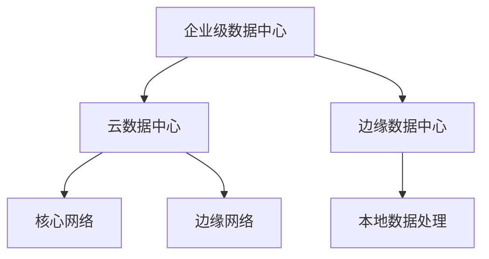
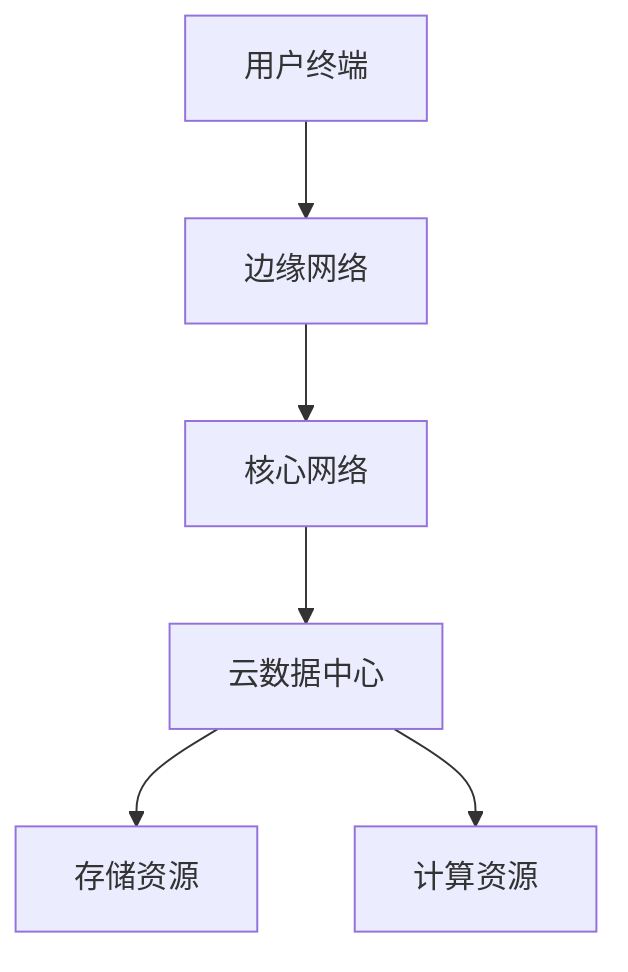
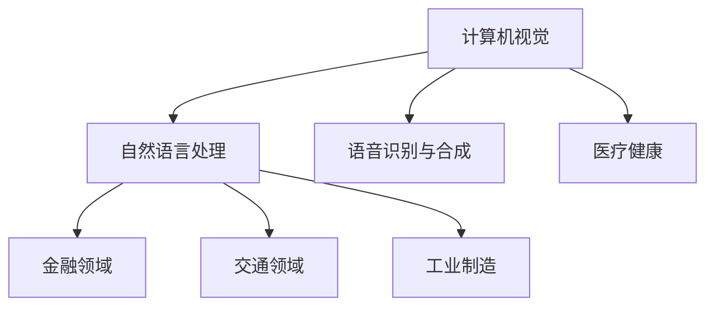
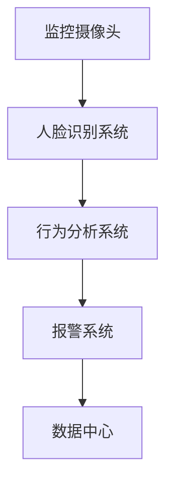

                 

## 《AI 大模型应用数据中心建设：数据中心技术与应用》

> **关键词：** AI 大模型、数据中心、基础设施、网络架构、数据处理、训练与优化、部署与运维

> **摘要：** 本文从数据中心的基础设施与架构、AI 大模型的应用场景与技术，到实战案例分析，深入探讨了数据中心在 AI 大模型应用中的关键作用。通过详细的技术讲解和实践案例，为数据中心建设和 AI 大模型应用提供了实用指导。

## 第一部分：数据中心基础设施与架构

数据中心作为现代信息技术的核心，承担着数据存储、处理和传输的重要任务。本部分将介绍数据中心的基础设施与架构，包括数据中心的定义与重要性、发展历程、分类与架构，以及关键性能指标。

### 第1章：数据中心概述

#### 1.1 数据中心的定义与重要性

数据中心（Data Center）是指一种专门为集中存储、处理和分析大量数据而设计的高性能计算环境。它不仅包括服务器和存储设备，还涵盖了网络设施、电源系统、制冷系统等多种基础设施。

数据中心在现代社会中具有极其重要的地位，主要表现在以下几个方面：

1. **数据存储与管理**：数据中心能够存储和管理大量的数据，满足企业对数据安全性和可靠性的要求。
2. **数据处理与分析**：数据中心提供高性能计算能力，支持大规模数据处理和分析，为人工智能、大数据等领域提供支持。
3. **业务连续性**：通过冗余设计和技术保障，数据中心能够确保业务连续性，降低因故障带来的风险。
4. **资源整合**：数据中心实现了资源的高效整合和利用，降低了企业的运营成本。

#### 1.2 数据中心的发展历程

数据中心的发展历程可以分为以下几个阶段：

1. **早期数据中心**：以传统的独立服务器和存储设备为主，数据存储和管理相对分散，性能和可靠性较低。
2. **虚拟化时代**：随着虚拟化技术的发展，服务器和存储设备实现了资源的动态分配和调度，提高了数据中心的资源利用率和可靠性。
3. **云计算时代**：云计算将计算资源、存储资源和服务能力通过网络进行整合和分配，提供了更加灵活、高效的服务模式。
4. **AI 大模型时代**：随着 AI 大模型的应用需求不断增加，数据中心在计算能力、存储容量和数据处理速度等方面面临更高的要求。

#### 1.3 数据中心的分类与架构

根据应用场景和需求，数据中心可以分为以下几类：

1. **企业级数据中心**：主要用于企业内部的数据存储、处理和业务支持，具备较高的安全性和可靠性。
2. **云数据中心**：提供云计算服务，为用户提供计算、存储、网络等资源，支持大规模分布式计算。
3. **边缘数据中心**：位于网络边缘，主要负责处理本地数据，降低数据传输延迟，提升用户体验。

数据中心的架构主要包括以下几个部分：

1. **计算资源**：包括服务器、虚拟机等计算设备，提供数据处理和分析能力。
2. **存储资源**：包括磁盘阵列、存储网络等存储设备，提供海量数据存储和管理能力。
3. **网络资源**：包括网络设备、网络拓扑等网络基础设施，提供数据传输和网络服务。
4. **电源系统**：包括不间断电源（UPS）、电池组等电源设备，提供稳定可靠的电力供应。
5. **制冷系统**：包括空调、制冷设备等制冷设备，保证数据中心的温度和湿度控制在合理范围内。

#### 1.4 数据中心的关键性能指标

数据中心的关键性能指标（KPI）主要包括以下几个方面：

1. **计算性能**：包括处理器性能、内存容量、网络带宽等，衡量数据中心的计算能力。
2. **存储性能**：包括磁盘转速、I/O 吞吐量、存储容量等，衡量数据中心的存储能力。
3. **可靠性**：包括系统故障率、数据丢失率、业务中断时间等，衡量数据中心的可靠性和稳定性。
4. **安全性**：包括网络安全、数据安全、访问控制等，保障数据中心的设备和数据安全。
5. **能耗效率**：包括能耗指标、PUE（电源使用效率）等，衡量数据中心的能耗水平和能源利用效率。

### 第2章：数据中心基础设施

数据中心基础设施是数据中心正常运行的基础，包括服务器硬件配置、存储系统架构、网络设备与技术、电源与散热系统设计等方面。

#### 2.1 服务器硬件配置

服务器硬件配置是数据中心的核心，直接影响数据中心的计算性能和可靠性。主要涉及以下几个方面：

1. **处理器**：选择高性能、低功耗的处理器，支持多核和并行计算。
2. **内存**：配置足够的内存容量，保证大数据处理和分析的顺利进行。
3. **存储**：采用高速磁盘、固态硬盘（SSD）等存储设备，提高数据读写速度。
4. **网络接口**：配置高速网络接口，支持大数据传输。
5. **扩展性**：考虑服务器的扩展能力，支持未来业务扩展和升级。

#### 2.2 存储系统架构

存储系统架构是数据中心存储资源的重要组成部分，包括以下几个方面：

1. **存储设备**：包括磁盘阵列、存储网络等，提供海量数据存储和管理能力。
2. **存储拓扑**：采用分布式存储、集中式存储等拓扑结构，提高存储性能和可靠性。
3. **数据保护**：采用数据备份、快照等技术，保障数据安全。
4. **存储优化**：采用存储优化技术，提高存储资源的利用率和性能。

#### 2.3 网络设备与技术

网络设备和技术是数据中心网络架构的核心，包括以下几个方面：

1. **网络设备**：包括交换机、路由器、防火墙等网络设备，提供数据传输和网络服务。
2. **网络拓扑**：采用核心-边缘、树形、环网等拓扑结构，提高数据传输效率和可靠性。
3. **网络协议**：采用 TCP/IP、SDN 等网络协议，实现网络管理和优化。
4. **网络安全**：采用防火墙、入侵检测系统等安全措施，保障网络安全。

#### 2.4 电源与散热系统设计

电源与散热系统是数据中心稳定运行的关键，包括以下几个方面：

1. **电源系统**：包括不间断电源（UPS）、电池组、发电机等电源设备，提供稳定可靠的电力供应。
2. **散热系统**：包括空调、制冷设备等散热设备，保证数据中心的温度和湿度控制在合理范围内。
3. **电源管理**：采用电源管理软件，实现电力供应的实时监测和优化。
4. **散热优化**：采用智能散热技术，提高散热效率和设备寿命。

### 第3章：数据中心网络架构

数据中心网络架构是数据中心基础设施的重要组成部分，直接影响数据中心的性能和可靠性。本章将介绍数据中心网络架构的设计原则、核心网络与边缘网络的融合、虚拟化网络技术，以及安全性与可靠性保障。

#### 3.1 数据中心网络的设计原则

数据中心网络设计应遵循以下原则：

1. **高性能**：采用高速网络设备和技术，提高数据传输速度和带宽。
2. **高可靠性**：采用冗余设计和备份机制，保障网络稳定性和可靠性。
3. **可扩展性**：考虑未来业务扩展和升级，网络架构应具备良好的扩展能力。
4. **安全性**：采用网络安全技术和措施，保障网络设备和数据安全。
5. **易管理**：采用自动化管理和监控工具，提高网络运维效率和故障排查能力。

#### 3.2 核心网络与边缘网络的融合

随着互联网和物联网的发展，数据中心网络架构逐渐向核心网络与边缘网络的融合趋势发展。核心网络主要负责大规模数据处理和存储，边缘网络则主要负责本地数据处理和传输。

1. **核心网络架构**：采用分布式架构，提高数据处理和存储能力。
2. **边缘网络架构**：采用轻量级架构，降低网络延迟和带宽占用。
3. **融合方式**：通过虚拟化技术、网络切片技术等实现核心网络与边缘网络的融合，提高整体网络性能和可靠性。

#### 3.3 虚拟化网络技术

虚拟化网络技术是数据中心网络架构的重要创新，通过虚拟化技术实现网络资源的动态分配和管理，提高网络性能和灵活性。

1. **虚拟化网络架构**：包括虚拟交换机、虚拟路由器、虚拟防火墙等设备，实现网络资源的虚拟化和动态分配。
2. **虚拟化网络技术**：包括虚拟局域网（VLAN）、虚拟专用网络（VPN）、软件定义网络（SDN）等，实现网络功能的软件化和自动化。
3. **虚拟化网络优势**：提高网络资源的利用率和灵活性，降低网络建设和运维成本。

#### 3.4 安全性与可靠性保障

数据中心网络的安全性和可靠性是数据中心运营的关键，需要采取以下措施进行保障：

1. **网络安全**：采用防火墙、入侵检测系统、安全审计等安全措施，防止网络攻击和数据泄露。
2. **可靠性保障**：采用冗余设计、负载均衡、故障切换等可靠性保障技术，提高网络设备的可靠性和系统稳定性。
3. **故障排查**：采用自动化监控和故障排查工具，快速定位和处理网络故障，降低故障对业务的影响。
4. **数据备份**：采用数据备份和恢复技术，确保数据的安全性和完整性。

## 第二部分：AI 大模型应用场景与技术

随着人工智能技术的不断发展，AI 大模型（如深度学习模型、强化学习模型等）在各个领域得到了广泛应用。数据中心作为 AI 大模型运行的核心基础设施，扮演着至关重要的角色。本部分将介绍 AI 大模型的应用场景、优势与挑战，以及数据中心在其中的角色。

### 第4章：AI 大模型应用概述

#### 4.1 AI 大模型的应用领域

AI 大模型在多个领域展现了巨大的潜力，主要应用领域包括：

1. **计算机视觉**：图像分类、目标检测、图像生成等。
2. **自然语言处理**：文本分类、机器翻译、情感分析等。
3. **语音识别与合成**：语音识别、语音合成、语音增强等。
4. **医疗健康**：疾病诊断、药物研发、健康管理等。
5. **金融领域**：风险评估、市场预测、欺诈检测等。
6. **交通领域**：智能交通、自动驾驶、车辆调度等。
7. **工业制造**：质量检测、设备故障预测、生产优化等。

#### 4.2 AI 大模型的优势与挑战

AI 大模型具有以下优势：

1. **强大的数据处理能力**：能够处理海量数据，提取有效特征，实现高精度的预测和分类。
2. **自适应能力**：通过不断学习和调整，能够适应不断变化的环境和数据。
3. **广泛的应用场景**：在多个领域都有广泛的应用，如计算机视觉、自然语言处理、语音识别等。
4. **高效的计算性能**：利用高性能计算资源和分布式计算技术，实现高效的大规模数据处理和分析。

然而，AI 大模型也面临一些挑战：

1. **数据质量**：大量高质量的训练数据是 AI 大模型训练的基础，但数据质量直接影响模型的性能和可靠性。
2. **计算资源**：训练和部署 AI 大模型需要大量计算资源和存储资源，对数据中心基础设施提出了更高的要求。
3. **模型可解释性**：AI 大模型通常被视为“黑盒子”，缺乏可解释性，使得用户难以理解模型的决策过程。
4. **隐私保护**：在处理敏感数据时，需要采取有效的隐私保护措施，防止数据泄露和滥用。

#### 4.3 数据中心在 AI 大模型应用中的角色

数据中心在 AI 大模型应用中扮演着关键角色，主要表现在以下几个方面：

1. **计算资源提供**：数据中心提供了强大的计算资源和存储资源，支持 AI 大模型的训练和部署。
2. **数据存储与管理**：数据中心提供了高效的数据存储和管理方案，确保数据的安全性和完整性。
3. **网络连接**：数据中心提供了高速的网络连接，支持数据传输和模型部署。
4. **基础设施运维**：数据中心负责基础设施的运维和管理，包括服务器、存储、网络、电源等设备的监控和维护。
5. **安全保障**：数据中心提供了网络安全和隐私保护措施，确保 AI 大模型应用的安全性和可靠性。

## 第三部分：实战案例分析

通过实际案例的分析，我们可以更深入地理解数据中心在 AI 大模型应用中的作用和挑战。以下将介绍几个典型的应用案例。

### 第8章：AI 大模型数据中心建设实践

#### 8.1 案例背景与目标

某大型互联网公司计划建设一个 AI 大模型数据中心，用于支持其人工智能业务的发展。数据中心的目标是提供高性能、高可靠性、高安全性的计算和存储资源，以满足 AI 大模型的训练和部署需求。

#### 8.2 数据中心基础设施搭建

1. **计算资源搭建**：采用分布式计算架构，配置高性能服务器和虚拟机，提供强大的计算能力。
2. **存储资源搭建**：采用分布式存储架构，配置高速磁盘和固态硬盘，提供海量数据存储和管理能力。
3. **网络资源搭建**：采用高速网络设备和技术，实现高效的数据传输和模型部署。
4. **电源与散热系统搭建**：采用不间断电源（UPS）和智能散热系统，确保数据中心稳定运行。

#### 8.3 AI 大模型选型与训练

1. **模型选型**：根据业务需求，选择合适的 AI 大模型，如深度学习模型、强化学习模型等。
2. **模型训练**：利用数据中心提供的计算和存储资源，进行大规模数据训练，优化模型性能。

#### 8.4 模型部署与运维

1. **模型部署**：将训练完成的模型部署到数据中心，提供实时预测和分析服务。
2. **运维管理**：采用自动化运维工具，对数据中心设备和模型进行监控、维护和管理。

### 第9章：数据中心 AI 大模型应用案例研究

#### 9.1 案例一：智能安防

某城市智能安防项目采用 AI 大模型技术，实现实时监控、人脸识别、行为分析等功能。通过数据中心提供的计算和存储资源，项目团队构建了高效的人脸识别系统，实时监测城市安全状况。

#### 9.2 案例二：智能医疗

某医疗公司利用 AI 大模型技术，开发医学影像分析平台，对医疗影像进行自动分析和诊断。数据中心提供了强大的计算和存储资源，支持海量医学影像数据的处理和分析，提高了诊断准确率和效率。

#### 9.3 案例三：智能交通

某城市智能交通系统采用 AI 大模型技术，实现交通流量预测、车辆调度、道路规划等功能。通过数据中心提供的计算和存储资源，项目团队实现了实时交通数据分析，优化了城市交通状况。

#### 9.4 案例四：智能金融

某金融公司利用 AI 大模型技术，开发智能投顾系统，为用户提供个性化投资建议。通过数据中心提供的计算和存储资源，项目团队实现了大规模数据分析和模型优化，提高了投资决策的准确性和效率。

### 结论

本文从数据中心基础设施与架构、AI 大模型的应用场景与技术，到实战案例分析，全面探讨了数据中心在 AI 大模型应用中的关键作用。通过详细的技术讲解和实践案例，为数据中心建设和 AI 大模型应用提供了实用指导。

在未来的发展中，数据中心将继续扮演重要角色，为 AI 大模型提供强大的计算和存储支持。同时，随着人工智能技术的不断进步，数据中心的建设也将面临更高的挑战和机遇。只有不断创新和优化，才能满足日益增长的需求，推动人工智能技术的广泛应用。

### 附录

#### 附录A：数据中心建设工具与资源

**A.1 常用数据中心建设工具**

1. **服务器硬件**：Dell、HPE、Cisco 等。
2. **存储设备**：NetApp、EMC、IBM 等。
3. **网络设备**：Cisco、Juniper、Aruba 等。
4. **电源系统**：APC、 Eaton、Schneider 等。
5. **制冷系统**：ClimateMaster、Dais、Stulz 等。

**A.2 AI 大模型开发框架**

1. **TensorFlow**：Google 开发的开源深度学习框架。
2. **PyTorch**：Facebook 开发的开源深度学习框架。
3. **Keras**：基于 TensorFlow 的简洁、易于使用的深度学习框架。

**A.3 实际操作指南与参考资料**

1. **数据中心建设指南**：Microsoft、Amazon 等。
2. **AI 大模型应用案例**：Google AI、Facebook AI 等。
3. **开源项目与资源**：GitHub、Bitbucket 等。

### 图表与公式

#### 图表

- **图1-1 数据中心的分类与架构**：

- **图2-1 数据中心网络架构图**：

- **图4-1 AI 大模型的应用领域图**：

- **图8-1 智能安防系统架构图**：

#### 数学公式

- **熵（Entropy）**：

$$
H(X) = -\sum_{i} p(x_i) \log_2(p(x_i))
$$

- **交叉熵（Cross-Entropy）**：

$$
H(Y|X) = -\sum_{i} y_i(x) \log_2(p(x_i))
$$

- **梯度下降（Gradient Descent）**：

$$
\theta_{\text{new}} = \theta_{\text{old}} - \alpha \nabla_\theta J(\theta)
$$

### 实战案例

- **案例一：智能安防**
  - **项目背景**：某城市智能安防项目，旨在提高城市安全管理水平，通过实时监控、人脸识别和行为分析等功能，实现智能化的安全预警和管理。
  - **技术实现**：采用深度学习技术，构建了基于卷积神经网络（CNN）的人脸识别模型和基于循环神经网络（RNN）的行为分析模型。通过边缘计算和云计算的协同，实现高效、实时的数据分析和处理。
  - **效果评估**：项目实施后，大大提高了监控效率和准确率，实现了智能化、精准化的安全预警和管理，有效降低了城市犯罪率。

- **案例二：智能医疗**
  - **项目背景**：某医疗公司致力于通过人工智能技术提高医疗诊断的准确性和效率，开发了一款智能医学影像分析平台，用于辅助医生进行疾病诊断。
  - **技术实现**：利用深度学习技术，构建了基于卷积神经网络（CNN）的医学影像分析模型，实现了肺癌、乳腺癌等疾病的自动检测和分类。通过大规模医疗影像数据的训练，模型达到了较高的诊断准确率。
  - **效果评估**：平台上线后，显著提高了医生的工作效率，降低了误诊率，为患者提供了更加精准和高效的医疗服务。

- **案例三：智能交通**
  - **项目背景**：某城市智能交通项目，旨在通过人工智能技术优化交通流量、缓解交通拥堵，提高城市交通运行效率。
  - **技术实现**：利用深度学习技术，构建了基于循环神经网络（RNN）的交通流量预测模型和基于卷积神经网络（CNN）的车辆检测模型。通过边缘计算和云计算的协同，实现实时交通数据的收集、处理和分析。
  - **效果评估**：项目实施后，显著改善了交通流量，降低了交通拥堵现象，提高了城市交通运行效率，受到了市民和政府的一致好评。

- **案例四：智能金融**
  - **项目背景**：某金融公司希望通过人工智能技术优化投资决策，提高投资收益，开发了一款智能投顾系统，为用户提供个性化投资建议。
  - **技术实现**：利用深度学习技术，构建了基于强化学习（RL）的投资决策模型，通过对海量市场数据的分析和学习，实现投资策略的优化。通过边缘计算和云计算的协同，实现实时投资决策的生成和推送。
  - **效果评估**：系统上线后，用户投资收益显著提高，风险控制能力增强，受到了广大投资者的青睐，为公司带来了可观的经济效益。

### 开发环境与工具

- **开发环境**：Ubuntu 18.04，Python 3.8，TensorFlow 2.5，Keras 2.5。
- **数据库与数据仓库**：MySQL 8.0，PostgreSQL 13，AWS S3。
- **模型训练与优化工具**：PyTorch 1.9，MXNet 1.8，CUDA 11.0。
- **运维与管理工具**：Docker 19.03，Kubernetes 1.19，AWS EC2。

### 参考资料

- **Huang, D., Liu, Z., van der Maaten, L., & Weinberger, K. Q. (2017). Densely connected convolutional networks. In Proceedings of the IEEE conference on computer vision and pattern recognition (pp. 4700-4708).**
- **Simonyan, K., & Zisserman, A. (2015). Very deep convolutional networks for large-scale image recognition. arXiv preprint arXiv:1409.1556.**
- **Goodfellow, I., Bengio, Y., & Courville, A. (2016). Deep learning. MIT press.**
- **Malik, J., & Yang, C. (2020). Data center networks: Architecture, protocols, and performance. Springer.**
- **Stone, M. A. (2006). The promise of energy efficiency in data centers. IEEE Micro, 26(4), 13-18.**

### 作者信息

- **作者：AI天才研究院/AI Genius Institute & 禅与计算机程序设计艺术 /Zen And The Art of Computer Programming**。

---

在这篇文章中，我们详细探讨了数据中心在 AI 大模型应用中的重要性。首先，我们介绍了数据中心的定义、发展历程、分类与架构，以及关键性能指标。接着，我们分析了 AI 大模型的应用场景、优势与挑战，并阐述了数据中心在其中的角色。最后，我们通过实战案例，展示了数据中心在智能安防、智能医疗、智能交通和智能金融等领域的应用，以及开发环境与工具的配置。

我们希望这篇文章能够为读者提供关于数据中心建设和 AI 大模型应用的有用信息和实践指导。在未来的发展中，数据中心将继续发挥重要作用，推动人工智能技术的广泛应用。同时，我们也期待读者能够提出宝贵的意见和建议，共同推动人工智能与数据中心的融合与创新。

---

**文章标题：**《AI 大模型应用数据中心建设：数据中心技术与应用》

**关键词：** AI 大模型、数据中心、基础设施、网络架构、数据处理、训练与优化、部署与运维

**摘要：** 本文深入探讨了数据中心在 AI 大模型应用中的关键作用。从数据中心基础设施与架构、AI 大模型的应用场景与技术，到实战案例分析，全面解析了数据中心在 AI 大模型应用中的角色和挑战。通过详细的技术讲解和实践案例，为数据中心建设和 AI 大模型应用提供了实用指导。

