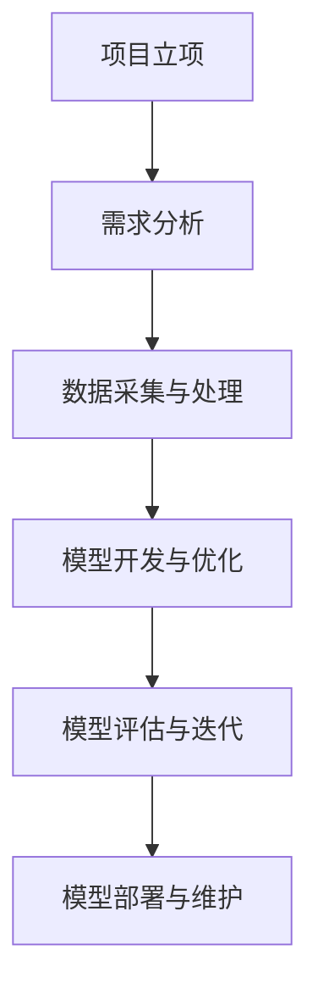
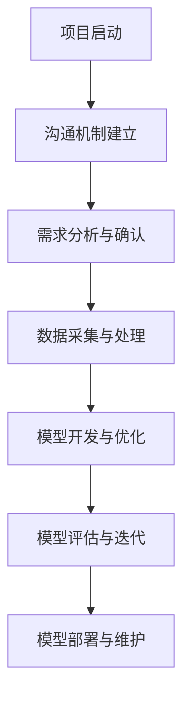
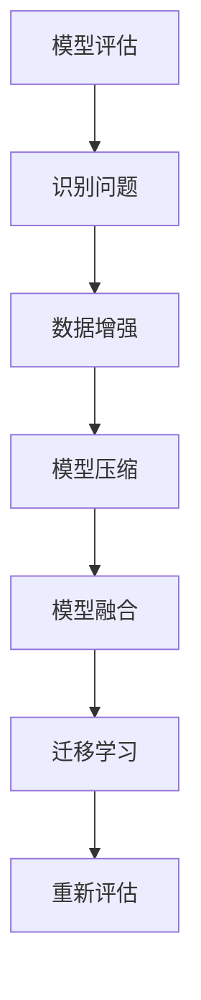

                 

# 《AI 大模型应用数据中心的沟通与协作》

> **关键词**：AI 大模型、数据中心、沟通、协作、项目实战、最佳实践

> **摘要**：本文深入探讨了 AI 大模型应用数据中心的沟通与协作问题。首先，从 AI 大模型的应用现状、数据中心的关键作用以及面临的沟通与协作挑战等方面进行概述。接着，详细分析了数据中心内沟通与协作的关键要素，包括数据标准与数据管理、沟通机制、协作平台与工具、冲突管理等。随后，通过项目实战，展示了 AI 大模型应用数据中心项目从立项到维护的完整流程。最后，通过成功案例分析、挑战与应对策略以及未来发展趋势展望，为数据中心管理者提供了实际操作建议和战略思考。

## 第一部分：引言与基础

### 1.1 AI 大模型应用数据中心概述

#### 1.1.1 AI 大模型的应用现状与趋势

人工智能（AI）技术近年来取得了飞速发展，尤其是 AI 大模型（Large-scale AI Models）的应用已经渗透到各行各业。从自然语言处理（NLP）、计算机视觉（CV）到推荐系统、金融风控等，AI 大模型的应用范围越来越广，影响力也越来越大。

当前的 AI 大模型应用现状呈现出以下几个趋势：

1. **计算资源需求激增**：AI 大模型训练和推理需要大量的计算资源和存储资源，数据中心作为承载这些资源的重要基础设施，其重要性日益凸显。

2. **模型规模不断增长**：随着深度学习技术的发展，AI 大模型变得越来越复杂和庞大。例如，GPT-3 的参数规模达到 1750 亿，而 BERT 的参数规模也超过 3 亿。

3. **跨领域应用**：AI 大模型在各个领域的应用逐渐深入，从传统的工业、金融、医疗等领域，到新兴的电商、娱乐、教育等领域，AI 大模型正发挥着越来越重要的作用。

#### 1.1.2 数据中心在 AI 大模型应用中的关键作用

数据中心在 AI 大模型应用中扮演着至关重要的角色，具体表现在以下几个方面：

1. **计算资源提供**：数据中心为 AI 大模型提供了强大的计算资源，包括高性能的 CPU、GPU 和 TPU 等，使得模型训练和推理能够高效进行。

2. **数据存储与管理**：数据中心为 AI 大模型提供了海量数据的存储空间和高效的数据管理机制，确保模型训练所需的数据能够及时、准确地获取。

3. **网络连接**：数据中心通过高速网络连接，实现了数据在内部以及与外部系统的快速传输，为 AI 大模型的训练和推理提供了良好的数据流通环境。

4. **安全保障**：数据中心提供了完善的安全保障机制，包括物理安全、网络安全、数据安全等，确保 AI 大模型应用的安全稳定运行。

#### 1.1.3 数据中心面临的沟通与协作挑战

虽然数据中心在 AI 大模型应用中发挥着重要作用，但其沟通与协作面临着一系列挑战：

1. **团队多元化**：AI 大模型应用涉及多个部门，包括算法团队、运维团队、数据团队等，各部门之间需要高效沟通和协作。

2. **技术复杂性**：AI 大模型技术复杂，涉及多种算法、模型架构和工具，需要团队成员具备丰富的技术背景和知识储备。

3. **数据隐私与合规**：AI 大模型应用涉及大量敏感数据，需要遵守相关数据隐私法规和合规要求，确保数据安全和隐私保护。

4. **资源分配与调度**：数据中心资源有限，如何合理分配和调度资源，以满足不同团队的计算需求和存储需求，是一个亟待解决的问题。

### 1.2 AI 大模型基础知识

#### 1.2.1 AI 大模型的定义与分类

AI 大模型是指参数规模较大、深度较深、计算复杂度较高的深度学习模型。根据不同的分类标准，AI 大模型可以有不同的分类方式：

1. **按参数规模分类**：根据模型参数的规模，AI 大模型可以分为小模型、中模型和大模型。小模型通常参数规模在数百万以下，中模型参数规模在数千万到数亿之间，大模型参数规模在数亿到数万亿之间。

2. **按模型架构分类**：根据模型架构的不同，AI 大模型可以分为传统深度学习模型、Transformer 模型、BERT 模型等。

3. **按应用领域分类**：根据应用领域的不同，AI 大模型可以分为自然语言处理模型、计算机视觉模型、推荐系统模型等。

#### 1.2.2 AI 大模型的核心算法原理

AI 大模型的核心算法通常是基于深度学习技术，其中最常用的算法包括：

1. **卷积神经网络（CNN）**：CNN 是一种适用于图像处理和计算机视觉的深度学习模型，其核心思想是通过卷积操作提取图像特征。

2. **循环神经网络（RNN）**：RNN 是一种适用于序列数据处理的深度学习模型，其核心思想是通过循环结构对序列数据进行建模。

3. **Transformer 模型**：Transformer 模型是一种基于自注意力机制的深度学习模型，其核心思想是通过多头注意力机制和编码器-解码器结构对序列数据进行建模。

#### 1.2.3 数据中心所需的 AI 大模型技术栈

数据中心在部署和运行 AI 大模型时，需要掌握一系列技术栈，包括：

1. **深度学习框架**：如 TensorFlow、PyTorch、MXNet 等，用于模型训练、推理和部署。

2. **分布式计算技术**：如 DataParallel、Horovod、DistributedDataParallel 等，用于加速模型训练和推理。

3. **硬件支持**：如 GPU、TPU 等，用于提供强大的计算能力。

4. **数据管理技术**：如 HDFS、Spark、Flink 等，用于数据存储、处理和分析。

### 1.3 沟通与协作的概念

#### 1.3.1 有效沟通的重要性

有效沟通是团队协作和项目成功的关键。在 AI 大模型应用数据中心，有效沟通的重要性体现在以下几个方面：

1. **提高工作效率**：通过有效沟通，团队成员可以清晰了解各自的任务和责任，减少误解和重复工作，提高工作效率。

2. **促进知识共享**：通过有效沟通，团队成员可以分享各自的经验和知识，促进团队整体知识水平的提升。

3. **解决冲突**：在团队协作过程中，难免会出现冲突。通过有效沟通，团队成员可以理解彼此的立场和需求，找到解决问题的方法。

4. **增强团队凝聚力**：通过有效沟通，团队成员可以建立良好的合作关系，增强团队的凝聚力和归属感。

#### 1.3.2 数据中心内部沟通的核心要素

数据中心内部沟通的核心要素包括：

1. **信息透明度**：确保团队成员能够及时获取项目进展、资源分配等信息，提高信息透明度。

2. **沟通渠道**：选择合适的沟通渠道，如会议、邮件、即时通讯工具等，确保沟通高效。

3. **沟通频率**：根据项目进展和团队成员的需求，合理设置沟通频率，避免沟通过于频繁或过于稀疏。

4. **沟通效果**：通过反馈和评估，确保沟通效果，及时调整沟通策略。

#### 1.3.3 协作的关键原则与方法

协作的关键原则包括：

1. **分工明确**：根据团队成员的能力和兴趣，合理分工，确保每个成员都能发挥自己的优势。

2. **互相尊重**：尊重团队成员的意见和需求，建立良好的团队合作氛围。

3. **共同目标**：明确项目目标，确保团队成员朝着共同目标努力。

协作的方法包括：

1. **任务分配**：通过任务分配工具，明确每个成员的任务和责任。

2. **协同工作**：通过协同工作平台，实现团队成员之间的实时沟通和协作。

3. **定期会议**：通过定期会议，了解项目进展和团队协作情况，及时解决问题。

## 第二部分：数据中心内沟通与协作的关键要素

### 2.1 数据标准与数据管理

#### 2.1.1 数据标准的制定与实施

数据标准是确保数据中心数据质量和一致性的重要手段。制定数据标准需要考虑以下几个方面：

1. **数据质量**：数据质量是数据标准的核心要求。需要确保数据准确、完整、及时、可靠。

2. **数据分类**：根据数据的重要性和用途，对数据进行分类，如基础数据、业务数据、敏感数据等。

3. **数据格式**：规定统一的数据格式，如文本格式、表格格式等，确保数据易于读取和处理。

4. **数据命名**：规定统一的数据命名规则，如使用缩写、描述性名称等，确保数据易于识别和管理。

数据标准的制定需要与业务部门、数据团队等多方沟通，确保其能够满足业务需求和数据管理要求。在实施过程中，需要通过培训、文档、监督等方式，确保数据标准得到有效执行。

#### 2.1.2 数据质量管理的方法与工具

数据质量管理是确保数据质量的重要环节。以下是一些常用的数据质量管理方法和工具：

1. **数据清洗**：通过数据清洗工具，去除重复、错误、缺失的数据，提高数据质量。

2. **数据监控**：通过数据监控工具，实时监测数据质量，如数据准确性、完整性等。

3. **数据验证**：通过数据验证工具，对数据进行验证，确保其符合业务需求和数据标准。

4. **数据归档**：对历史数据进行归档，确保数据安全、可靠。

常用的数据质量管理工具包括：ETL 工具、数据清洗工具、数据监控工具、数据归档工具等。

#### 2.1.3 数据生命周期管理

数据生命周期管理是确保数据在整个生命周期内得到有效管理的重要手段。数据生命周期通常包括以下几个阶段：

1. **数据采集**：从不同的数据源采集数据，如数据库、文件、API 等。

2. **数据存储**：将采集到的数据存储到数据库、文件系统等存储介质中。

3. **数据处理**：对数据进行处理，如清洗、转换、合并等，以满足业务需求。

4. **数据使用**：将处理后的数据提供给业务部门、数据分析师等使用。

5. **数据归档**：对不再使用的旧数据进行归档，确保数据安全、可靠。

6. **数据销毁**：根据数据生命周期策略，对不再需要的数据进行销毁，以减少数据存储成本和风险。

数据生命周期管理的目标是确保数据在整个生命周期内得到有效管理，确保数据质量、数据安全、数据合规等。

### 2.2 沟通机制

#### 2.2.1 沟通渠道的选择与优化

在数据中心内，选择合适的沟通渠道对于提高沟通效率至关重要。以下是一些常用的沟通渠道：

1. **会议**：通过定期会议，如周会、月会等，了解项目进展、协调工作、解决冲突等。

2. **邮件**：通过邮件进行正式的沟通，如项目计划、需求文档、报告等。

3. **即时通讯工具**：如 Slack、Microsoft Teams、微信等，用于实时沟通、协作、共享信息等。

4. **工作日志**：通过工作日志记录每天的进展、遇到的问题、解决方案等，便于团队回顾和总结。

在选择沟通渠道时，需要考虑以下因素：

1. **沟通内容**：根据沟通内容的性质和重要性，选择合适的沟通渠道。

2. **沟通频率**：根据项目进展和团队需求，合理设置沟通频率。

3. **团队成员的偏好**：考虑团队成员的沟通习惯和偏好，选择他们更愿意使用的沟通渠道。

#### 2.2.2 沟通频率与时效性的管理

沟通频率与时效性管理是确保沟通高效的重要环节。以下是一些策略：

1. **制定沟通计划**：根据项目进展和团队需求，制定详细的沟通计划，包括会议时间、邮件发送时间等。

2. **设定沟通时限**：对于需要及时解决的问题，设定明确的沟通时限，确保问题能够及时解决。

3. **避免信息过载**：合理控制沟通频率和内容，避免信息过载，提高沟通效率。

4. **及时反馈**：对于收到的沟通信息，及时给予反馈，确保信息传递的畅通。

#### 2.2.3 沟通效果的评估与改进

沟通效果的评估与改进是提高团队协作效率的重要手段。以下是一些评估与改进策略：

1. **沟通反馈**：定期收集团队成员的沟通反馈，了解沟通中存在的问题和改进需求。

2. **沟通效果评估**：通过项目进展、团队协作效果、成员满意度等指标，评估沟通效果。

3. **改进措施**：根据评估结果，制定相应的改进措施，如调整沟通渠道、优化沟通流程等。

4. **持续优化**：沟通效果的评估与改进是一个持续的过程，需要不断优化沟通机制，以适应团队和项目的变化。

### 2.3 协作平台与工具

#### 2.3.1 协作平台的选择与建设

协作平台是数据中心内团队成员协作的重要工具。选择合适的协作平台需要考虑以下因素：

1. **功能需求**：根据团队协作的需求，选择具备项目管理、任务分配、文档共享、即时通讯等功能齐全的协作平台。

2. **易用性**：协作平台需要易于使用，方便团队成员快速上手。

3. **可扩展性**：协作平台需要具备良好的可扩展性，能够随着团队和项目的发展进行功能扩展。

4. **安全性**：协作平台需要具备严格的安全措施，保护数据的安全性和隐私。

常见的协作平台包括：JIRA、Trello、Asana、Microsoft Teams 等。

协作平台的建设需要与团队成员进行充分沟通，了解他们的需求和建议，确保平台能够满足团队的实际需求。

#### 2.3.2 协作工具的整合与应用

在数据中心内，有多种协作工具可以用来提高团队协作效率，如即时通讯工具、项目管理工具、文档共享工具等。为了实现高效的协作，需要对这些工具进行整合和应用。

1. **工具整合**：将不同的协作工具整合到一个平台中，如通过集成 API，实现即时通讯工具与项目管理工具的数据共享。

2. **流程自动化**：通过自动化工具，实现协作流程的自动化，如通过脚本自动化任务分配、进度跟踪等。

3. **信息共享**：确保团队成员能够实时获取到项目的最新进展、任务分配等信息。

4. **团队协作**：通过协作工具，实现团队成员之间的实时沟通和协作，提高团队协作效率。

#### 2.3.3 跨部门协作流程的优化

在数据中心内，跨部门协作是常见且必要的工作形式。为了提高跨部门协作的效率，需要对协作流程进行优化。

1. **明确职责**：明确各部门在协作流程中的职责和任务，避免职责不清导致的工作延误。

2. **流程标准化**：制定统一的跨部门协作流程，确保协作流程的一致性和可重复性。

3. **沟通渠道**：建立畅通的沟通渠道，如定期召开跨部门会议、使用即时通讯工具等，确保信息传递的及时性和准确性。

4. **反馈机制**：建立反馈机制，及时收集和解决协作中存在的问题，确保协作流程的持续优化。

### 2.4 冲突管理

#### 2.4.1 冲突的类型与原因

在数据中心内，冲突是不可避免的。冲突可以分为以下几种类型：

1. **任务冲突**：由于任务分配不公或任务目标不一致导致的冲突。

2. **资源冲突**：由于资源有限，不同团队或个人之间争夺资源导致的冲突。

3. **观点冲突**：由于团队成员对问题看法不一致导致的冲突。

冲突的原因可能包括：

1. **信息不对称**：团队成员之间信息不对称，导致对任务、目标和资源等的理解不一致。

2. **个人利益**：团队成员之间存在个人利益冲突，如对资源、业绩等的争夺。

3. **文化差异**：不同团队之间存在文化差异，导致协作不畅。

#### 2.4.2 冲突管理的方法与策略

冲突管理是确保团队协作顺利进行的重要环节。以下是一些常用的冲突管理方法和策略：

1. **预防策略**：通过沟通、协调、培训等方式，预防冲突的发生。如定期召开团队会议，了解团队成员的需求和问题，及时解决问题。

2. **沟通策略**：通过有效沟通，确保团队成员对任务、目标和资源等的理解一致。如召开冲突分析会议，让团队成员充分表达自己的观点和需求。

3. **调解策略**：在冲突发生时，通过第三方调解，帮助团队成员达成共识。如聘请专业调解人员，或由上级领导进行调解。

4. **妥协策略**：在无法达成一致意见时，通过妥协，使各方都能接受。如调整任务分配，或提供额外的资源。

5. **解决策略**：在冲突得到解决后，进行总结和反思，防止类似冲突的再次发生。

#### 2.4.3 数据中心内的冲突解决案例

以下是一个数据中心内的冲突解决案例：

**案例背景**：某数据中心在进行项目部署时，算法团队和数据团队在任务分配上发生了冲突。算法团队认为数据团队提供的测试数据质量不高，影响了项目进度；而数据团队认为算法团队对数据的质量要求过于苛刻。

**解决过程**：

1. **预防策略**：在项目启动阶段，项目经理就组织了算法团队和数据团队的沟通会议，明确了各自的职责和任务。

2. **沟通策略**：项目经理组织了冲突分析会议，让算法团队和数据团队充分表达了自己的观点和需求。

3. **调解策略**：项目经理请来了第三方专家，对数据质量进行了评估，并提出了改进建议。

4. **妥协策略**：项目经理调整了任务分配，让数据团队在数据质量改进的同时，协助算法团队进行部分测试工作。

5. **解决策略**：在经过一段时间的努力后，数据质量得到了显著提升，项目进度也恢复正常。项目经理对整个冲突解决过程进行了总结和反思，制定了相关的预防措施，避免了类似冲突的再次发生。

## 第三部分：AI 大模型应用数据中心项目实战

### 3.1 项目立项与需求分析

#### 3.1.1 项目立项的流程与要点

项目立项是 AI 大模型应用数据中心项目启动的第一步。以下是一个典型的项目立项流程和要点：

1. **项目立项申请**：项目发起人根据业务需求，编写项目立项申请，包括项目背景、目标、预期效益等。

2. **需求分析**：项目立项申请通过后，进入需求分析阶段。需求分析包括功能需求、性能需求、资源需求等。

3. **可行性研究**：对项目可行性进行评估，包括技术可行性、经济可行性、时间可行性等。

4. **立项评审**：组织立项评审会议，评审项目立项申请和可行性研究报告。

5. **立项决策**：根据评审意见，做出立项决策，确定项目是否启动。

#### 3.1.2 需求分析的步骤与方法

需求分析是项目立项的重要环节。以下是一个需求分析的步骤和方法：

1. **需求调研**：通过访谈、问卷调查、用户观察等方式，收集用户需求。

2. **需求分类**：将收集到的需求进行分类，如功能需求、性能需求、安全需求等。

3. **需求优先级排序**：根据需求的紧迫性和重要性，对需求进行优先级排序。

4. **需求文档编写**：编写需求文档，明确需求的具体描述、实现方式、验收标准等。

5. **需求评审**：组织需求评审会议，评审需求文档的完整性和可行性。

#### 3.1.3 需求文档的编写与评审

需求文档是项目实施的重要依据。以下是一个需求文档的编写与评审步骤：

1. **编写需求文档**：根据需求分析的成果，编写详细的需求文档。

2. **需求评审**：组织需求评审会议，评审需求文档的完整性和可行性。

3. **修改与完善**：根据评审意见，修改和完善需求文档。

4. **发布与跟踪**：发布需求文档，并跟踪需求变更情况，确保需求的一致性和完整性。

### 3.2 数据采集与处理

#### 3.2.1 数据源的选择与接入

数据源是 AI 大模型训练的重要输入。以下是一个数据源选择与接入的步骤：

1. **数据源选择**：根据项目需求和数据特点，选择合适的数据源。如公开数据集、企业内部数据等。

2. **数据接入**：通过 API、数据库连接等方式，将数据源接入到数据采集系统。

3. **数据预处理**：对接入的数据进行预处理，如去重、去噪、格式转换等。

#### 3.2.2 数据预处理的方法与技巧

数据预处理是确保数据质量的重要环节。以下是一些常用的数据预处理方法与技巧：

1. **数据清洗**：通过数据清洗工具，去除重复、错误、缺失的数据。

2. **数据标准化**：对数据进行标准化处理，如数值型数据归一化、类别型数据编码等。

3. **特征工程**：根据业务需求，提取有用的特征，如文本特征、图像特征等。

4. **数据增强**：通过数据增强技术，增加数据多样性，提高模型泛化能力。

#### 3.2.3 数据存储与管理的策略

数据存储与管理是确保数据安全、可靠和高效利用的重要手段。以下是一些常用的数据存储与管理的策略：

1. **数据分层存储**：根据数据的重要性和访问频率，选择合适的数据存储方式，如 SSD、HDD、云存储等。

2. **数据备份与恢复**：制定数据备份策略，确保数据在发生故障时能够快速恢复。

3. **数据权限管理**：根据数据的重要性和敏感性，设置数据访问权限，确保数据安全。

4. **数据监控与审计**：通过数据监控工具，实时监测数据存储状态，确保数据安全、可靠。

### 3.3 模型开发与优化

#### 3.3.1 模型开发流程

模型开发是 AI 大模型应用数据中心项目的关键环节。以下是一个典型的模型开发流程：

1. **需求分析**：明确项目需求和目标，确定模型类型和架构。

2. **数据准备**：准备训练数据，进行数据预处理。

3. **模型设计**：根据需求分析，设计模型架构和参数。

4. **模型训练**：使用训练数据进行模型训练，优化模型参数。

5. **模型评估**：使用验证数据对模型进行评估，调整模型参数。

6. **模型部署**：将训练好的模型部署到生产环境，进行推理和应用。

#### 3.3.2 模型优化策略

模型优化是提高模型性能和效率的重要手段。以下是一些常见的模型优化策略：

1. **数据增强**：通过数据增强技术，增加数据多样性，提高模型泛化能力。

2. **模型压缩**：通过模型压缩技术，减少模型参数规模，降低计算复杂度。

3. **模型融合**：将多个模型进行融合，提高模型性能和鲁棒性。

4. **迁移学习**：利用预训练模型，对特定任务进行迁移学习，提高模型性能。

5. **自动化调参**：通过自动化调参工具，快速找到最优模型参数。

#### 3.3.3 模型评估与迭代

模型评估是确保模型性能和可靠性的重要环节。以下是一个模型评估与迭代的步骤：

1. **评估指标**：根据项目需求，选择合适的评估指标，如准确率、召回率、F1 分数等。

2. **模型评估**：使用验证集对模型进行评估，记录评估结果。

3. **结果分析**：分析评估结果，找出模型存在的问题。

4. **模型迭代**：根据结果分析，调整模型参数、数据预处理策略等，进行模型迭代。

5. **重新评估**：使用新的评估结果，验证模型优化效果。

### 3.4 模型部署与维护

#### 3.4.1 模型部署流程

模型部署是将训练好的模型应用到生产环境的过程。以下是一个典型的模型部署流程：

1. **模型打包**：将训练好的模型打包，生成可部署的模型文件。

2. **部署环境准备**：准备部署环境，包括硬件资源、软件环境等。

3. **模型部署**：将模型文件部署到生产环境，配置模型服务。

4. **测试验证**：对部署的模型进行测试验证，确保模型正常运行。

5. **上线发布**：在测试验证通过后，将模型上线发布，提供推理服务。

#### 3.4.2 模型运维的方法与工具

模型运维是确保模型稳定运行的重要环节。以下是一些常见的模型运维方法和工具：

1. **监控与告警**：通过监控工具，实时监控模型运行状态，设置告警机制，确保及时发现和解决问题。

2. **性能优化**：定期对模型进行性能优化，如调整模型参数、优化推理代码等。

3. **版本管理**：使用版本管理工具，记录模型版本信息，方便模型迭代和更新。

4. **自动化运维**：通过自动化运维工具，实现模型部署、监控、性能优化等自动化操作。

#### 3.4.3 模型更新与版本管理

模型更新与版本管理是确保模型持续改进的重要手段。以下是一些常见的模型更新与版本管理策略：

1. **版本迭代**：定期对模型进行迭代更新，优化模型性能和效果。

2. **版本控制**：使用版本控制工具，记录模型版本信息，方便模型更新和版本管理。

3. **测试验证**：对更新的模型进行严格测试验证，确保更新后的模型性能和稳定性。

4. **上线发布**：在测试验证通过后，将更新的模型上线发布，提供新的推理服务。

## 第四部分：数据中心沟通与协作最佳实践

### 4.1 成功案例分析

#### 4.1.1 某知名企业 AI 大模型应用数据中心的沟通与协作实践

某知名企业在 AI 大模型应用数据中心方面积累了丰富的经验，以下是其成功实践的案例分析：

1. **明确目标**：在项目启动阶段，明确项目目标，确保团队成员对项目的方向和目标有清晰的认识。

2. **建立协作机制**：建立高效的协作机制，包括定期的团队会议、项目进度报告、即时通讯工具等，确保团队成员之间的沟通畅通。

3. **数据质量管理**：重视数据质量管理，制定数据标准，对数据质量进行监控和评估，确保数据质量满足模型训练需求。

4. **技术栈整合**：整合多种深度学习框架和工具，实现技术栈的统一和高效利用。

5. **持续优化**：通过定期评估和反馈，持续优化沟通与协作流程，提高团队协作效率。

#### 4.1.2 案例中的关键要素与经验总结

案例中的关键要素包括：

1. **明确目标**：确保团队成员对项目方向和目标有清晰的认识。

2. **建立协作机制**：建立高效、透明的协作机制，确保团队成员之间的沟通畅通。

3. **数据质量管理**：重视数据质量管理，确保数据质量满足模型训练需求。

4. **技术栈整合**：整合多种深度学习框架和工具，实现技术栈的统一和高效利用。

经验总结：

1. **明确目标**：确保项目方向的明确，避免团队成员在执行过程中迷失方向。

2. **建立协作机制**：建立高效的协作机制，提高团队协作效率。

3. **数据质量管理**：重视数据质量管理，确保模型训练效果。

4. **技术栈整合**：整合多种深度学习框架和工具，提高技术栈的利用效率。

### 4.2 挑战与应对策略

#### 4.2.1 数据中心沟通与协作的常见问题

数据中心沟通与协作中常见的问题包括：

1. **沟通不畅**：团队成员之间的沟通不畅，导致信息传递不及时、不准确。

2. **职责不清**：团队成员之间的职责不清，导致工作重复、责任不明。

3. **数据质量问题**：数据质量不高，影响模型训练效果。

4. **资源争夺**：团队成员之间争夺资源，导致资源分配不均。

#### 4.2.2 面对挑战的应对策略

针对以上常见问题，可以采取以下应对策略：

1. **沟通机制优化**：建立有效的沟通机制，如定期会议、即时通讯工具等，确保团队成员之间的沟通畅通。

2. **职责明确**：制定详细的职责分工，确保团队成员对各自职责有清晰的认识。

3. **数据质量提升**：加强数据质量管理，制定数据标准，对数据质量进行监控和评估。

4. **资源分配优化**：合理分配资源，避免资源争夺，确保资源利用最大化。

#### 4.2.3 持续改进与优化

数据中心沟通与协作是一个持续改进的过程。以下是一些持续改进的策略：

1. **定期评估**：定期对沟通与协作效果进行评估，识别存在的问题。

2. **反馈机制**：建立反馈机制，鼓励团队成员提出改进建议。

3. **培训与学习**：定期组织培训和学习活动，提高团队成员的沟通与协作能力。

4. **工具升级**：根据团队需求，升级和优化协作工具，提高协作效率。

### 4.3 未来发展趋势与展望

#### 4.3.1 AI 大模型应用数据中心的发展趋势

随着 AI 技术的快速发展，AI 大模型应用数据中心的发展趋势包括：

1. **计算资源需求增长**：AI 大模型对计算资源的需求将持续增长，数据中心需要不断提升计算能力，以满足模型训练和推理需求。

2. **数据管理挑战**：随着数据量的不断增加，数据中心需要面对更加复杂的数据管理挑战，如数据质量、数据安全等。

3. **分布式与云计算**：分布式计算和云计算将成为数据中心的发展方向，通过分布式架构和云计算技术，提高数据中心的计算效率和灵活性。

4. **自动化与智能化**：自动化和智能化技术将逐渐应用于数据中心管理，如自动化运维、智能监控等，提高数据中心的管理效率和安全性。

#### 4.3.2 沟通与协作技术的未来发展方向

沟通与协作技术在未来将朝着以下方向发展：

1. **实时协作**：实时协作技术将更加成熟，实现团队成员之间的实时沟通和协作。

2. **人工智能辅助**：人工智能技术将应用于沟通与协作领域，如智能会议助手、智能任务分配等，提高沟通与协作效率。

3. **虚拟现实与增强现实**：虚拟现实（VR）和增强现实（AR）技术将应用于沟通与协作，实现沉浸式协作体验。

4. **跨平台集成**：跨平台集成技术将实现不同协作工具之间的无缝连接，提高协作的便捷性和一致性。

#### 4.3.3 对数据中心管理者和管理团队的期望

对数据中心管理者和管理团队，有以下期望：

1. **战略视野**：具备战略视野，能够把握行业发展趋势，制定合适的发展规划。

2. **团队领导力**：具备团队领导力，能够激励团队成员，提高团队协作效率。

3. **持续学习**：具备持续学习的能力，不断更新知识和技能，适应技术变化。

4. **沟通能力**：具备良好的沟通能力，能够与团队成员、业务部门、外部合作伙伴等有效沟通。

5. **风险管理**：具备风险管理能力，能够识别和应对各种风险，确保数据中心的安全稳定运行。

### 附录

#### 附录 A: 术语表

**AI 大模型相关术语**

- **AI 大模型**：参数规模较大、计算复杂度较高的深度学习模型。
- **深度学习**：一种基于多层神经网络的学习方法，用于模拟人脑的学习和决策过程。
- **神经网络**：一种由多个神经元组成的计算模型，用于处理和分析数据。
- **自注意力机制**：一种用于处理序列数据的注意力机制，能够自动学习不同输入序列元素之间的权重关系。
- **Transformer 模型**：一种基于自注意力机制的深度学习模型，广泛应用于自然语言处理领域。

**数据中心相关术语**

- **数据中心**：一种专门用于存储、处理、传输数据的设施，提供计算、存储、网络等基础设施。
- **云计算**：一种通过网络提供计算资源、存储资源和软件服务的计算模式。
- **分布式计算**：一种将计算任务分布在多个计算节点上执行的计算模式，提高计算效率和灵活性。
- **数据管理**：对数据进行存储、处理、分析、共享等操作的集合，确保数据的高效利用和安全。
- **数据质量**：数据在准确性、完整性、及时性、一致性等方面的表现。

#### 附录 B: 参考文献

- **数据中心相关书籍**：
  - 《数据中心设计手册》（作者：约翰·彼得森）。
  - 《云计算数据中心架构与实践》（作者：李艳春）。
  - 《数据中心运维实战：技术、策略与最佳实践》（作者：王勇）。

- **AI 大模型相关书籍**：
  - 《深度学习》（作者：Ian Goodfellow、Yoshua Bengio、Aaron Courville）。
  - 《自注意力机制与 Transformer 模型》（作者：吴恩达）。
  - 《自然语言处理实践》（作者：侯凯）。

- **沟通与协作相关书籍**：
  - 《沟通的艺术》（作者：安德斯·艾利克森）。
  - 《高效能人士的七个习惯》（作者：史蒂芬·柯维）。
  - 《团队协作的力量》（作者：托马斯·H·彼得斯）。

#### 附录 C: Mermaid 流程图

**C.1 AI 大模型开发流程图**



**C.2 数据中心沟通与协作流程图**



**C.3 模型优化策略流程图**



#### 附录 D: 伪代码示例

**D.1 深度学习模型训练伪代码**

```python
# 加载训练数据
train_data = load_data("train_data.csv")

# 定义模型架构
model = create_model()

# 编译模型
model.compile(optimizer="adam", loss="categorical_crossentropy", metrics=["accuracy"])

# 训练模型
model.fit(train_data, epochs=10, batch_size=32)

# 评估模型
evaluation = model.evaluate(test_data)
print(f"Test loss: {evaluation[0]}, Test accuracy: {evaluation[1]}")
```

**D.2 模型优化策略伪代码**

```python
# 数据增强
train_data = augment_data(train_data)

# 模型压缩
model = compress_model(model)

# 模型融合
model = merge_models(model)

# 迁移学习
model = transfer_learning(model)

# 重新评估
evaluation = model.evaluate(test_data)
print(f"Optimized model test loss: {evaluation[0]}, Test accuracy: {evaluation[1]}")
```

**D.3 数据预处理伪代码**

```python
# 数据清洗
train_data = clean_data(train_data)

# 数据标准化
train_data = normalize_data(train_data)

# 特征提取
train_data = extract_features(train_data)

# 数据集划分
train_data, validation_data = train_test_split(train_data, test_size=0.2)
```

#### 附录 E: 数学模型与公式

**E.1 深度学习损失函数公式**

$$
J(\theta) = -\frac{1}{m} \sum_{i=1}^{m} [y^{(i)} \log(a^{(i)}_j) + (1 - y^{(i)}) \log(1 - a^{(i)}_j)]
$$

其中，$m$ 表示样本数量，$y^{(i)}$ 表示第 $i$ 个样本的真实标签，$a^{(i)}_j$ 表示第 $i$ 个样本在输出层第 $j$ 个节点的预测概率。

**E.2 模型优化算法公式**

$$
\theta = \theta - \alpha \frac{\partial J(\theta)}{\partial \theta}
$$

其中，$\theta$ 表示模型参数，$\alpha$ 表示学习率，$\frac{\partial J(\theta)}{\partial \theta}$ 表示损失函数关于模型参数的梯度。

**E.3 数据预处理公式**

$$
x' = \frac{x - \mu}{\sigma}
$$

其中，$x$ 表示原始数据，$\mu$ 表示数据的均值，$\sigma$ 表示数据的标准差。

#### 附录 F: 项目实战案例

**F.1 案例一：AI 大模型应用数据中心项目实施**

某企业计划利用 AI 大模型进行产品推荐，以下为其项目实施过程：

1. **需求分析**：明确产品推荐的需求，如推荐准确性、响应速度等。

2. **数据采集**：从不同数据源采集用户行为数据、商品信息等。

3. **数据预处理**：对采集到的数据进行清洗、转换、标准化等处理。

4. **模型开发**：使用 TensorFlow 和 Keras 框架开发推荐模型，如基于协同过滤的方法。

5. **模型训练与优化**：使用预处理后的数据进行模型训练，并采用数据增强、模型压缩等技术进行优化。

6. **模型评估**：使用验证集对模型进行评估，调整模型参数，提高推荐准确性。

7. **模型部署**：将训练好的模型部署到生产环境，提供实时推荐服务。

8. **运维与维护**：定期对模型进行监控和更新，确保推荐服务的稳定性和准确性。

**F.2 案例二：数据中心沟通与协作实践**

某企业数据中心在项目实施过程中，采取以下沟通与协作实践：

1. **建立协作机制**：制定沟通计划，定期召开团队会议，确保信息传递的及时性和准确性。

2. **明确职责**：制定详细的职责分工，确保团队成员对各自职责有清晰的认识。

3. **数据质量管理**：建立数据质量监控机制，对数据质量进行评估和改进。

4. **自动化运维**：采用自动化工具进行任务分配、进度跟踪、性能优化等，提高运维效率。

5. **持续反馈与改进**：定期收集团队成员的反馈，持续改进沟通与协作流程。

**F.3 案例三：模型部署与维护实战**

某企业将 AI 大模型部署到生产环境，以下为其模型部署与维护过程：

1. **部署环境准备**：准备部署环境，包括硬件资源、软件环境等。

2. **模型打包**：将训练好的模型打包，生成可部署的模型文件。

3. **模型部署**：将模型文件部署到生产环境，配置模型服务。

4. **测试验证**：对部署的模型进行测试验证，确保模型正常运行。

5. **上线发布**：在测试验证通过后，将模型上线发布，提供推理服务。

6. **监控与告警**：使用监控工具实时监控模型运行状态，设置告警机制，确保及时发现和解决问题。

7. **性能优化**：定期对模型进行性能优化，如调整模型参数、优化推理代码等。

8. **版本管理**：使用版本管理工具记录模型版本信息，方便模型更新和版本管理。

## 总结

### 5.1 本书内容概述

本书系统地介绍了 AI 大模型应用数据中心的沟通与协作问题。首先，从 AI 大模型的应用现状、数据中心的关键作用以及面临的沟通与协作挑战等方面进行概述。接着，详细分析了数据中心内沟通与协作的关键要素，包括数据标准与数据管理、沟通机制、协作平台与工具、冲突管理等。随后，通过项目实战，展示了 AI 大模型应用数据中心项目从立项到维护的完整流程。最后，通过成功案例分析、挑战与应对策略以及未来发展趋势展望，为数据中心管理者提供了实际操作建议和战略思考。

### 5.2 对数据中心管理者和管理团队的期望

对数据中心管理者和管理团队，有以下期望：

1. **战略视野**：具备战略视野，能够把握行业发展趋势，制定合适的发展规划。

2. **团队领导力**：具备团队领导力，能够激励团队成员，提高团队协作效率。

3. **持续学习**：具备持续学习的能力，不断更新知识和技能，适应技术变化。

4. **沟通能力**：具备良好的沟通能力，能够与团队成员、业务部门、外部合作伙伴等有效沟通。

5. **风险管理**：具备风险管理能力，能够识别和应对各种风险，确保数据中心的安全稳定运行。

### 5.3 展望与总结

AI 大模型应用数据中心的发展趋势迅猛，数据中心管理者和管理团队需要不断提高自身能力，以应对不断变化的挑战。本书通过深入分析和实际案例，为数据中心管理者提供了沟通与协作的最佳实践。在未来的工作中，数据中心管理者应持续关注技术发展，优化沟通与协作机制，提高数据中心的整体运营效率。同时，也要注重团队成员的培训和成长，打造一支高效、协同、创新的数据中心团队。通过不断努力，数据中心将在 AI 大模型应用中发挥更大的作用，推动企业的发展和创新。|>

