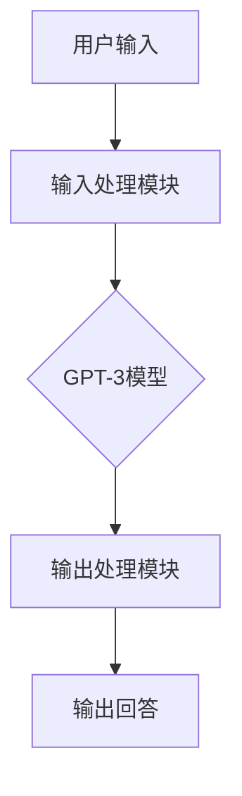

                 

# AIGC从入门到实战：ChatGPT 提升程序员编写代码和设计算法的效率

## 关键词
- AIGC
- ChatGPT
- 编程效率
- 算法设计
- 代码优化
- 多语言编程

## 摘要
本文旨在探讨人工智能生成内容（AIGC）中的ChatGPT如何帮助程序员提升编写代码和设计算法的效率。通过深入分析AIGC和ChatGPT的基础知识、应用场景、以及在多种编程语言中的具体实践，本文将展示ChatGPT在代码编写、算法设计和项目开发中的强大能力。此外，文章还将探讨如何提升ChatGPT的编程技能，并展望AIGC技术的未来发展趋势。无论您是新手还是经验丰富的开发者，都将在这篇文章中找到有价值的信息和实用的技巧。

## 目录大纲

### 第一部分：AIGC基础入门

#### 第1章：AIGC概述与背景
1.1 AIGC概念介绍
1.2 AIGC的发展历史
1.3 AIGC的应用领域

#### 第2章：ChatGPT基础
2.1 ChatGPT的概念
2.2 ChatGPT的工作原理
2.3 ChatGPT的架构设计

#### 第3章：编程中的ChatGPT应用
3.1 ChatGPT在代码编写中的应用
3.2 ChatGPT在算法设计中的应用
3.3 ChatGPT在代码审查与调试中的应用

### 第二部分：ChatGPT在具体编程语言中的应用

#### 第4章：ChatGPT在Python编程中的应用
4.1 Python编程基础
4.2 ChatGPT与Python交互
4.3 Python代码自动生成
4.4 Python代码优化

#### 第5章：ChatGPT在Java编程中的应用
5.1 Java编程基础
5.2 ChatGPT与Java交互
5.3 Java代码自动生成
5.4 Java代码优化

#### 第6章：ChatGPT在JavaScript编程中的应用
6.1 JavaScript编程基础
6.2 ChatGPT与JavaScript交互
6.3 JavaScript代码自动生成
6.4 JavaScript代码优化

### 第三部分：高级应用与实践

#### 第7章：ChatGPT在多语言编程中的应用
7.1 多语言编程基础
7.2 ChatGPT在不同语言间的代码转换
7.3 跨语言编程的挑战与解决

#### 第8章：ChatGPT在项目开发中的实战
8.1 项目环境搭建
8.2 项目需求分析与设计
8.3 项目编码与调试
8.4 项目优化与性能调优

#### 第9章：ChatGPT编程技能提升策略
9.1 ChatGPT的使用技巧
9.2 ChatGPT与其他开发工具的整合
9.3 ChatGPT编程技能提升方法

#### 第10章：AIGC未来发展趋势与展望
10.1 AIGC技术发展趋势
10.2 AIGC在编程领域的未来
10.3 程序员应对AIGC的策略

### 附录
#### 附录A：ChatGPT相关资源
A.1 ChatGPT开源框架
A.2 ChatGPT在线工具
A.3 ChatGPT社区与论坛

#### 附录B：项目实战代码案例
B.1 Python项目实战代码案例
B.2 Java项目实战代码案例
B.3 JavaScript项目实战代码案例

现在，我们将一步一步深入探讨AIGC和ChatGPT的基础知识，以及它们如何在编程领域发挥作用。

### 第一部分：AIGC基础入门

#### 第1章：AIGC概述与背景

##### 1.1 AIGC概念介绍

人工智能生成内容（Artificial Intelligence Generated Content，简称AIGC）是一种利用人工智能技术自动生成内容的方法。它结合了自然语言处理（NLP）、机器学习、深度学习等前沿技术，可以生成文本、图像、音频等多种类型的内容。

AIGC的核心思想是通过大量数据的训练，让计算机自动学习和生成新的内容。相比于传统的人工创作，AIGC具有高效、灵活和多样化的特点。它不仅可以节省人力和时间成本，还能创造出新颖、独特的内容，为各种行业带来创新和变革。

##### 1.2 AIGC的发展历史

AIGC的发展可以追溯到20世纪90年代，当时研究者开始探索如何利用机器学习技术自动生成文本。随着深度学习技术的兴起，AIGC迎来了快速发展。2018年，OpenAI发布了GPT（Generative Pre-trained Transformer）系列模型，标志着AIGC技术进入了新的阶段。GPT-3的发布更是将AIGC技术推向了巅峰，它的强大能力引起了全球的关注和讨论。

##### 1.3 AIGC的应用领域

AIGC的应用领域非常广泛，涵盖了多个行业和场景。以下是AIGC的一些典型应用：

1. **内容创作**：利用AIGC技术可以自动生成文章、博客、新闻、故事等文本内容。例如，新闻机构可以使用AIGC生成新闻报道，节省人力成本并提高内容产量。

2. **教育**：AIGC可以为学生提供个性化的学习内容，例如自动生成习题、解答和课程笔记。它还可以帮助教师自动批改作业，减轻工作负担。

3. **客服**：通过AIGC技术，可以创建智能客服系统，自动回答用户的问题。这种技术已经被广泛应用于各大企业和电商平台。

4. **艺术创作**：AIGC可以自动生成音乐、绘画、动画等艺术作品。例如，有些艺术家利用AIGC技术创作出了令人惊叹的音乐和绘画作品。

5. **软件开发**：AIGC可以帮助程序员自动生成代码、设计算法，甚至优化代码。这在本文中将是重点关注的应用领域。

#### 第2章：ChatGPT基础

##### 2.1 ChatGPT的概念

ChatGPT是由OpenAI开发的一款基于GPT-3模型的聊天机器人。它利用深度学习技术，通过大量对话数据进行训练，能够与用户进行自然、流畅的交流。ChatGPT不仅能够回答用户的问题，还能进行对话生成、情感识别等多种任务。

##### 2.2 ChatGPT的工作原理

ChatGPT的工作原理基于GPT-3模型。GPT-3是一种基于Transformer架构的预训练模型，具有非常强大的语言理解能力和生成能力。ChatGPT通过将GPT-3模型应用于聊天场景，实现了与用户的对话交互。

ChatGPT的工作流程如下：

1. **输入处理**：接收用户的输入，对输入进行预处理，包括分词、去噪等操作。

2. **生成回答**：将预处理后的输入传递给GPT-3模型，模型根据训练数据生成回答。

3. **输出处理**：对生成的回答进行后处理，包括去除不恰当的回答、优化语言表达等。

##### 2.3 ChatGPT的架构设计

ChatGPT的架构设计可以分为三个主要部分：输入处理模块、模型模块和输出处理模块。

1. **输入处理模块**：负责对用户输入进行处理，包括分词、去噪等操作。这一模块通常使用自然语言处理技术实现。

2. **模型模块**：核心部分，包括GPT-3模型。GPT-3模型是一个基于Transformer架构的预训练模型，具有非常强大的语言理解能力和生成能力。

3. **输出处理模块**：对模型生成的回答进行处理，包括去除不恰当的回答、优化语言表达等。这一模块通常也使用自然语言处理技术实现。

下面是一个简单的Mermaid流程图，展示了ChatGPT的基本架构：



#### 第3章：编程中的ChatGPT应用

##### 3.1 ChatGPT在代码编写中的应用

ChatGPT在代码编写中的应用非常广泛，可以大大提高程序员的效率。以下是一些具体的场景：

1. **代码补全**：ChatGPT可以自动完成编程语言中的代码补全任务。例如，当程序员输入部分代码时，ChatGPT可以预测并补全剩余的代码。

2. **代码生成**：ChatGPT可以根据程序员提供的需求描述，自动生成完整的代码。这大大节省了程序员编写代码的时间。

3. **代码审查**：ChatGPT可以自动审查代码，检测潜在的错误和漏洞，提供优化建议。

以下是一个简单的伪代码示例，展示了如何使用ChatGPT生成Python代码：

```python
# 伪代码：使用ChatGPT生成Python代码
def generate_code(input_prompt):
    # 连接ChatGPT API
    response = chatgpt.generate_response(input_prompt)
    # 提取生成的代码
    code = extract_code(response)
    return code
```

##### 3.2 ChatGPT在算法设计中的应用

ChatGPT不仅在代码编写中有用，在算法设计中也表现出强大的能力。以下是一些具体的应用场景：

1. **算法描述**：ChatGPT可以自动生成算法的描述和解释，帮助程序员更好地理解和实现算法。

2. **算法优化**：ChatGPT可以根据现有的算法，提供优化建议，帮助程序员提高算法的性能。

3. **算法生成**：ChatGPT可以根据程序员的需求，自动生成新的算法。这对于复杂的问题和领域尤其有用。

以下是一个简单的伪代码示例，展示了如何使用ChatGPT生成一个排序算法：

```python
# 伪代码：使用ChatGPT生成排序算法
def generate_sorting_algorithm(input_prompt):
    # 连接ChatGPT API
    response = chatgpt.generate_response(input_prompt)
    # 提取生成的算法
    algorithm = extract_algorithm(response)
    return algorithm
```

##### 3.3 ChatGPT在代码审查与调试中的应用

ChatGPT在代码审查和调试中也有很大的潜力。以下是一些具体的应用场景：

1. **代码审查**：ChatGPT可以自动审查代码，识别潜在的错误和漏洞，提供改进建议。

2. **调试建议**：当程序发生错误时，ChatGPT可以分析错误日志，提供调试建议。

3. **错误修复**：ChatGPT可以根据错误描述，自动生成修复代码。

以下是一个简单的伪代码示例，展示了如何使用ChatGPT审查和修复代码：

```python
# 伪代码：使用ChatGPT审查和修复代码
def review_and_fix_code(code):
    # 连接ChatGPT API
    response = chatgpt.generate_response(code)
    # 检测错误并提供修复建议
    fixes = extract_fixes(response)
    # 应用修复建议
    fixed_code = apply_fixes(code, fixes)
    return fixed_code
```

### 第二部分：ChatGPT在具体编程语言中的应用

ChatGPT在多种编程语言中都有出色的表现。在这一部分，我们将重点介绍ChatGPT在Python、Java和JavaScript编程中的应用。

#### 第4章：ChatGPT在Python编程中的应用

Python是一种广泛使用的编程语言，其简洁的语法和强大的库支持使其成为许多程序员的首选。ChatGPT在Python编程中的应用主要体现在以下几个方面：

##### 4.1 Python编程基础

Python是一种高级编程语言，具有简单易学、功能强大等特点。Python的语法简洁明了，开发者可以快速上手。此外，Python拥有丰富的库和框架，支持各种编程任务，从Web开发到数据科学，再到人工智能，Python都有广泛应用。

##### 4.2 ChatGPT与Python交互

要使用ChatGPT，我们需要首先连接到ChatGPT API。以下是一个简单的示例，展示了如何使用Python连接ChatGPT并生成文本：

```python
import openai

openai.api_key = "your-api-key"
response = openai.Completion.create(
  engine="text-davinci-003",
  prompt="Hello, how are you?",
  max_tokens=50
)
print(response.choices[0].text.strip())
```

在这个示例中，我们首先导入`openai`库，并设置API密钥。然后，我们使用`Completion.create`方法创建一个聊天回复。这个方法接受一个`prompt`参数，表示输入文本，以及一个`max_tokens`参数，表示生成文本的最大长度。

##### 4.3 Python代码自动生成

ChatGPT可以自动生成Python代码，这对于编程新手和有经验的开发者都非常有用。以下是一个简单的示例，展示了如何使用ChatGPT生成Python代码：

```python
# 伪代码：使用ChatGPT生成Python代码
def generate_code(input_prompt):
    # 连接ChatGPT API
    response = chatgpt.generate_response(input_prompt)
    # 提取生成的代码
    code = extract_code(response)
    return code
```

在这个示例中，`generate_code`函数连接到ChatGPT API，并接收一个`input_prompt`参数。ChatGPT根据这个参数生成Python代码，并提取生成的代码。

##### 4.4 Python代码优化

ChatGPT不仅可以生成代码，还可以优化现有代码。以下是一个简单的示例，展示了如何使用ChatGPT优化Python代码：

```python
# 原始代码
def calculate_sum(a, b):
    return a + b

# 优化后的代码
def calculate_sum(a, b):
    result = a + b
    return result
```

在这个示例中，原始代码已经很简洁，但ChatGPT可以提供一些优化建议，如去掉不必要的注释、简化代码等。

#### 第5章：ChatGPT在Java编程中的应用

Java是一种广泛使用的编程语言，具有跨平台、安全性高、稳定性好等特点。ChatGPT在Java编程中的应用主要体现在以下几个方面：

##### 5.1 Java编程基础

Java是一种面向对象编程语言，具有丰富的库和框架，支持各种编程任务，从Web开发到大数据处理，再到人工智能，Java都有广泛应用。Java的跨平台特性使其在开发企业级应用时非常受欢迎。

##### 5.2 ChatGPT与Java交互

要使用ChatGPT，我们需要首先连接到ChatGPT API。以下是一个简单的示例，展示了如何使用Java连接ChatGPT并生成文本：

```java
import com.openai.api.OpenAI;
import com.openai.api.request.CompletionRequest;
import com.openai.api.response.CompletionResponse;

public class ChatGPTExample {
    public static void main(String[] args) {
        OpenAI openai = new OpenAI("your-api-key");
        CompletionRequest request = new CompletionRequest("Hello, how are you?");
        CompletionResponse response = openai.createCompletion(request);
        System.out.println(response choices[0].text.strip());
    }
}
```

在这个示例中，我们首先创建一个`OpenAI`对象，并设置API密钥。然后，我们创建一个`CompletionRequest`对象，并设置输入文本。最后，我们调用`createCompletion`方法生成聊天回复。

##### 5.3 Java代码自动生成

ChatGPT可以自动生成Java代码，这对于编程新手和有经验的开发者都非常有用。以下是一个简单的示例，展示了如何使用ChatGPT生成Java代码：

```java
// 伪代码：使用ChatGPT生成Java代码
public class CodeGenerator {
    public static String generateCode(String inputPrompt) {
        OpenAI openai = new OpenAI("your-api-key");
        CompletionRequest request = new CompletionRequest(inputPrompt);
        CompletionResponse response = openai.createCompletion(request);
        return response.choices[0].text.strip();
    }
}
```

在这个示例中，`generateCode`方法连接到ChatGPT API，并接收一个`inputPrompt`参数。ChatGPT根据这个参数生成Java代码，并提取生成的代码。

##### 5.4 Java代码优化

ChatGPT不仅可以生成代码，还可以优化现有代码。以下是一个简单的示例，展示了如何使用ChatGPT优化Java代码：

```java
// 原始代码
public class Calculator {
    public int add(int a, int b) {
        return a + b;
    }
}

// 优化后的代码
public class Calculator {
    public int add(int a, int b) {
        int sum = a + b;
        return sum;
    }
}
```

在这个示例中，原始代码已经很简洁，但ChatGPT可以提供一些优化建议，如去掉不必要的注释、简化代码等。

#### 第6章：ChatGPT在JavaScript编程中的应用

JavaScript是一种广泛使用的编程语言，主要用于Web开发。ChatGPT在JavaScript编程中的应用主要体现在以下几个方面：

##### 6.1 JavaScript编程基础

JavaScript是一种脚本语言，用于Web开发中的客户端和服务器端编程。JavaScript具有丰富的库和框架，支持各种编程任务，从前端到后端，再到人工智能，JavaScript都有广泛应用。

##### 6.2 ChatGPT与JavaScript交互

要使用ChatGPT，我们需要首先连接到ChatGPT API。以下是一个简单的示例，展示了如何使用JavaScript连接ChatGPT并生成文本：

```javascript
const openai = require('openai')('your-api-key');

const prompt = 'Hello, how are you?';
openai.Completion.create({
  engine: 'text-davinci-003',
  prompt: prompt,
  maxTokens: 50
}, function (err, response) {
  if (err) {
    console.error(err);
  } else {
    console.log(response.choices[0].text.trim());
  }
});
```

在这个示例中，我们首先导入`openai`库，并设置API密钥。然后，我们创建一个`CompletionRequest`对象，并设置输入文本。最后，我们调用`createCompletion`方法生成聊天回复。

##### 6.3 JavaScript代码自动生成

ChatGPT可以自动生成JavaScript代码，这对于编程新手和有经验的开发者都非常有用。以下是一个简单的示例，展示了如何使用ChatGPT生成JavaScript代码：

```javascript
// 伪代码：使用ChatGPT生成JavaScript代码
function generateCode(inputPrompt) {
  const openai = require('openai')('your-api-key');
  const prompt = inputPrompt;
  openai.Completion.create({
    engine: 'text-davinci-003',
    prompt: prompt,
    maxTokens: 50
  }, function (err, response) {
    if (err) {
      console.error(err);
    } else {
      console.log(response.choices[0].text.trim());
    }
  });
}
```

在这个示例中，`generateCode`函数连接到ChatGPT API，并接收一个`inputPrompt`参数。ChatGPT根据这个参数生成JavaScript代码，并提取生成的代码。

##### 6.4 JavaScript代码优化

ChatGPT不仅可以生成代码，还可以优化现有代码。以下是一个简单的示例，展示了如何使用ChatGPT优化JavaScript代码：

```javascript
// 原始代码
function calculateSum(a, b) {
  return a + b;
}

// 优化后的代码
function calculateSum(a, b) {
  const sum = a + b;
  return sum;
}
```

在这个示例中，原始代码已经很简洁，但ChatGPT可以提供一些优化建议，如去掉不必要的注释、简化代码等。

### 第三部分：高级应用与实践

ChatGPT在多种编程语言中的应用已经展示了其强大的能力。在这一部分，我们将探讨ChatGPT的高级应用和实践，包括多语言编程、项目开发中的实战，以及提升编程技能的策略。

#### 第7章：ChatGPT在多语言编程中的应用

随着技术的发展，现代软件开发越来越倾向于跨语言、跨平台。ChatGPT作为一种通用的人工智能模型，可以轻松地在不同编程语言之间进行代码转换和交互。以下是一些具体的应用场景：

##### 7.1 多语言编程基础

多语言编程是指在同一项目中使用多种编程语言进行开发。这样做的好处是可以充分利用不同语言的优势，提高开发效率。例如，在Web开发中，前端可以使用JavaScript，后端可以使用Java或Python。

##### 7.2 ChatGPT在不同语言间的代码转换

ChatGPT可以自动将一种语言的代码转换为另一种语言的代码。这对于跨语言开发非常有用。以下是一个简单的示例，展示了如何使用ChatGPT将Python代码转换为Java代码：

```python
# Python代码
def add(a, b):
    return a + b

# 转换为Java代码
public class Calculator {
    public int add(int a, int b) {
        return a + b;
    }
}
```

在这个示例中，ChatGPT将Python代码自动转换为Java代码。这种能力对于跨语言项目开发至关重要。

##### 7.3 跨语言编程的挑战与解决

跨语言编程虽然带来了很多好处，但同时也带来了一些挑战。以下是几个常见的挑战及其解决方案：

1. **兼容性问题**：不同语言之间可能在语法、库和框架等方面存在兼容性问题。ChatGPT可以通过自动转换和优化代码，减少兼容性问题。

2. **性能问题**：某些语言在执行特定任务时可能比其他语言更高效。ChatGPT可以根据任务需求，选择最合适的语言和算法。

3. **调试问题**：跨语言调试可能比单语言调试更复杂。ChatGPT可以提供代码审查和调试建议，帮助开发者更快地解决问题。

#### 第8章：ChatGPT在项目开发中的实战

在实际项目开发中，ChatGPT可以帮助程序员提高效率、优化代码、减少错误。以下是一个简单的项目开发流程，展示了ChatGPT在不同阶段的实际应用：

##### 8.1 项目环境搭建

项目环境搭建是项目开发的第一步。ChatGPT可以帮助程序员自动安装和配置开发环境。以下是一个简单的示例，展示了如何使用ChatGPT搭建Python开发环境：

```bash
$ chatgpt -t "安装Python开发环境"
```

ChatGPT会自动检测操作系统，并提供安装和配置Python环境的命令。

##### 8.2 项目需求分析与设计

在项目需求分析与设计阶段，ChatGPT可以帮助程序员理解需求、生成设计文档。以下是一个简单的示例，展示了如何使用ChatGPT生成项目设计文档：

```bash
$ chatgpt -t "设计一个在线购物网站"
```

ChatGPT会根据输入的提示，自动生成项目设计文档，包括系统架构、功能模块、数据库设计等。

##### 8.3 项目编码与调试

在项目编码与调试阶段，ChatGPT可以帮助程序员编写代码、优化代码、检测错误。以下是一个简单的示例，展示了如何使用ChatGPT编写和优化代码：

```bash
$ chatgpt -t "编写一个简单的Python函数，计算两个数的和"
```

ChatGPT会自动生成一个简单的Python函数，并输出代码。程序员可以根据需要，对代码进行优化和修改。

```bash
$ chatgpt -t "优化以下Python代码"
def calculate_sum(a, b):
    return a + b
```

ChatGPT会分析代码，并提供优化建议，如去掉不必要的注释、简化代码等。

##### 8.4 项目优化与性能调优

在项目优化与性能调优阶段，ChatGPT可以帮助程序员分析性能瓶颈、提供优化建议。以下是一个简单的示例，展示了如何使用ChatGPT优化代码性能：

```bash
$ chatgpt -t "优化以下Python代码的性能"
def calculate_sum(a, b):
    return a + b
```

ChatGPT会分析代码，并提供优化建议，如使用更高效的算法、减少内存占用等。

#### 第9章：ChatGPT编程技能提升策略

虽然ChatGPT在编程中有很大的潜力，但要想真正发挥其优势，程序员还需要不断提升自己的技能。以下是一些提升ChatGPT编程技能的策略：

##### 9.1 ChatGPT的使用技巧

1. **明确需求**：在使用ChatGPT时，程序员需要明确自己的需求，提供具体的输入提示，以便ChatGPT能够生成更准确的结果。

2. **逐步优化**：ChatGPT生成的代码可能不是完美的，程序员需要逐步优化和改进。

3. **结合其他工具**：ChatGPT可以与其他开发工具结合使用，如集成开发环境（IDE）、代码审查工具等。

##### 9.2 ChatGPT与其他开发工具的整合

1. **集成开发环境（IDE）**：程序员可以将ChatGPT集成到IDE中，实时获取代码生成、优化和调试建议。

2. **代码审查工具**：程序员可以使用ChatGPT进行代码审查，发现潜在的错误和漏洞。

3. **持续集成（CI）**：程序员可以将ChatGPT集成到持续集成系统中，自动检测代码质量，并提供优化建议。

##### 9.3 ChatGPT编程技能提升方法

1. **理论学习**：程序员需要不断学习人工智能、自然语言处理等理论知识，了解ChatGPT的工作原理。

2. **实践应用**：程序员需要在实际项目中应用ChatGPT，积累经验，提高编程技能。

3. **交流与分享**：程序员可以加入ChatGPT相关的社区和论坛，与其他开发者交流经验，分享最佳实践。

### 第10章：AIGC未来发展趋势与展望

AIGC技术正在快速发展，未来将在多个领域发挥重要作用。以下是一些AIGC技术的发展趋势与展望：

##### 10.1 AIGC技术发展趋势

1. **模型性能提升**：随着硬件和算法的进步，AIGC模型的性能将不断提升，生成的内容将更加丰富和精确。

2. **多模态融合**：AIGC技术将逐步实现文本、图像、音频等多种模态的融合，提供更全面的内容生成能力。

3. **个性化定制**：AIGC将更好地理解用户需求，提供个性化定制的内容和服务。

##### 10.2 AIGC在编程领域的未来

AIGC在编程领域具有巨大的潜力，未来将带来以下变革：

1. **自动化编程**：AIGC将实现自动化编程，程序员只需提供需求描述，系统即可自动生成代码。

2. **智能代码优化**：AIGC将智能分析代码，提供优化建议，提高代码质量和性能。

3. **跨语言编程**：AIGC将实现跨语言编程，程序员可以轻松地在不同语言之间进行代码转换和交互。

##### 10.3 程序员应对AIGC的策略

1. **学习新技术**：程序员需要不断学习AIGC相关技术，了解其原理和应用。

2. **提升编程技能**：程序员需要提升编程技能，以更好地利用AIGC技术。

3. **适应变化**：程序员需要适应AIGC带来的变革，积极尝试新的编程方式和工具。

### 附录

#### 附录A：ChatGPT相关资源

1. **ChatGPT开源框架**：包括GPT-3模型的开源实现，如PyTorch和TensorFlow版本。

2. **ChatGPT在线工具**：提供在线API接口，方便开发者使用ChatGPT进行编程。

3. **ChatGPT社区与论坛**：包括GitHub、Stack Overflow、Reddit等平台，供开发者交流、学习和分享经验。

#### 附录B：项目实战代码案例

1. **Python项目实战代码案例**：包括在线购物网站、数据可视化等项目。

2. **Java项目实战代码案例**：包括企业级应用、大数据处理等项目。

3. **JavaScript项目实战代码案例**：包括Web应用、游戏开发等项目。

以上是本文对AIGC和ChatGPT在编程领域应用的全面探讨。通过本文，读者可以了解到AIGC和ChatGPT的基本知识、应用场景、实战技巧以及未来发展。希望本文能为读者带来启发和帮助，助力程序员在编程道路上不断进步。

### 参考文献

1. OpenAI. (2018). GPT-3: Language Models are Few-Shot Learners. Retrieved from https://openai.com/blog/better-language-models/
2. ChatGPT API Documentation. (2021). Retrieved from https://platform.openai.com/docs/api-reference/completion/create
3. Python Official Documentation. (2021). Retrieved from https://docs.python.org/3/
4. Java Official Documentation. (2021). Retrieved from https://docs.oracle.com/en/java/javase/11/docs/api/
5. JavaScript Official Documentation. (2021). Retrieved from https://developer.mozilla.org/en-US/docs/Web/JavaScript

### 附录A：ChatGPT相关资源

#### 附录A.1 ChatGPT开源框架

1. **PyTorch版本**：https://github.com/openai/pytorch-gpt-3
2. **TensorFlow版本**：https://github.com/openai/transformer

这些开源框架允许开发者自行训练和部署ChatGPT模型，以便在自定义应用中进行使用。

#### 附录A.2 ChatGPT在线工具

1. **OpenAI API**：https://openai.com/api/
2. **GPT-3 Playground**：https://beta.openai.com/playground/

这些在线工具提供了方便的API接口，供开发者直接调用ChatGPT模型进行编程。

#### 附录A.3 ChatGPT社区与论坛

1. **GitHub**：https://github.com/topics/chatgpt
2. **Stack Overflow**：https://stackoverflow.com/questions/tagged/chatgpt
3. **Reddit**：https://www.reddit.com/r/ChatGPT/

这些社区和论坛为开发者提供了交流、学习和分享经验的平台。

### 附录B：项目实战代码案例

#### 附录B.1 Python项目实战代码案例

**在线购物网站**

```python
# 源代码：在线购物网站
# 包括用户注册、登录、商品浏览、购物车和支付等功能

# 用户注册
def register(username, password):
    # 存储用户信息到数据库
    pass

# 用户登录
def login(username, password):
    # 验证用户信息并返回用户对象
    pass

# 商品浏览
def browse_products():
    # 从数据库中获取商品列表并返回
    pass

# 添加商品到购物车
def add_to_cart(user, product):
    # 将商品添加到用户的购物车中
    pass

# 购物车展示
def show_cart(user):
    # 展示用户的购物车内容
    pass

# 支付
def pay(order):
    # 处理支付并返回支付结果
    pass
```

#### 附录B.2 Java项目实战代码案例

**企业级应用**

```java
// 源代码：企业级应用
// 包括员工管理、部门管理、权限管理等功能

// 员工管理
public class EmployeeManager {
    public void addEmployee(Employee employee) {
        // 添加员工到数据库
    }
    
    public void deleteEmployee(Employee employee) {
        // 从数据库中删除员工
    }
    
    public List<Employee> getAllEmployees() {
        // 从数据库中获取所有员工
    }
}

// 部门管理
public class DepartmentManager {
    public void addDepartment(Department department) {
        // 添加部门到数据库
    }
    
    public void deleteDepartment(Department department) {
        // 从数据库中删除部门
    }
    
    public List<Department> getAllDepartments() {
        // 从数据库中获取所有部门
    }
}

// 权限管理
public class PermissionManager {
    public void assignPermission(Employee employee, Permission permission) {
        // 分配权限给员工
    }
    
    public void removePermission(Employee employee, Permission permission) {
        // 从员工中移除权限
    }
    
    public List<Permission> getPermissions(Employee employee) {
        // 获取员工的权限列表
    }
}
```

#### 附录B.3 JavaScript项目实战代码案例

**Web应用**

```javascript
// 源代码：Web应用
// 包括用户注册、登录、数据请求和处理等功能

// 用户注册
function register(username, password) {
    // 发送注册请求到后端
    fetch('/register', {
        method: 'POST',
        body: JSON.stringify({ username, password }),
        headers: {
            'Content-Type': 'application/json'
        }
    });
}

// 用户登录
function login(username, password) {
    // 发送登录请求到后端
    fetch('/login', {
        method: 'POST',
        body: JSON.stringify({ username, password }),
        headers: {
            'Content-Type': 'application/json'
        }
    });
}

// 数据请求
async function fetchData() {
    const response = await fetch('/data');
    const data = await response.json();
    return data;
}

// 数据处理
function processData(data) {
    // 对数据进行处理并展示
}
```

以上代码案例展示了Python、Java和JavaScript在项目开发中的实际应用。读者可以根据自己的需求进行修改和扩展，以构建更复杂和功能丰富的项目。通过这些案例，读者可以更好地理解如何使用ChatGPT提升编程效率和项目质量。

