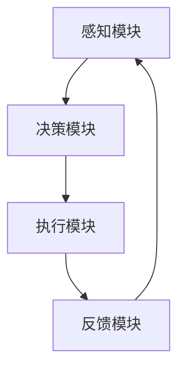
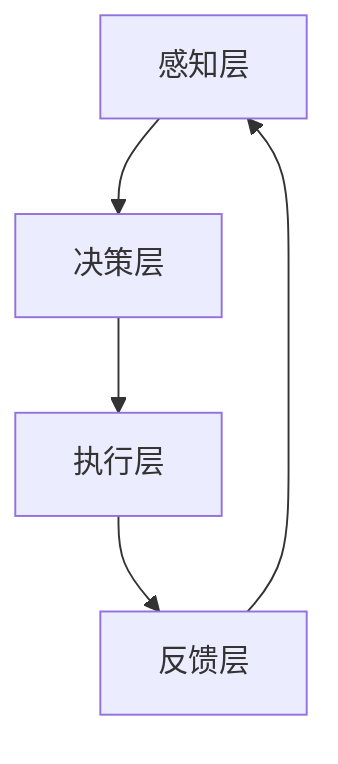
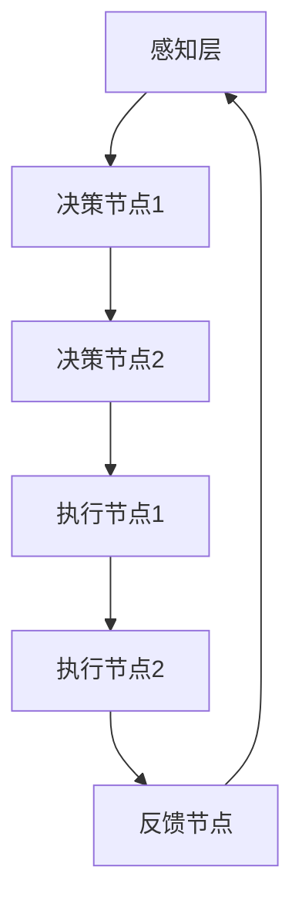
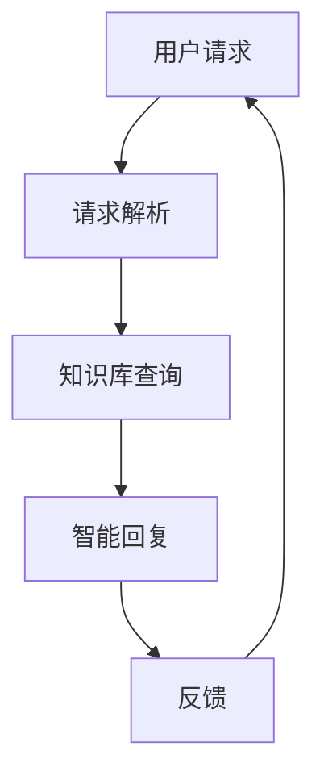
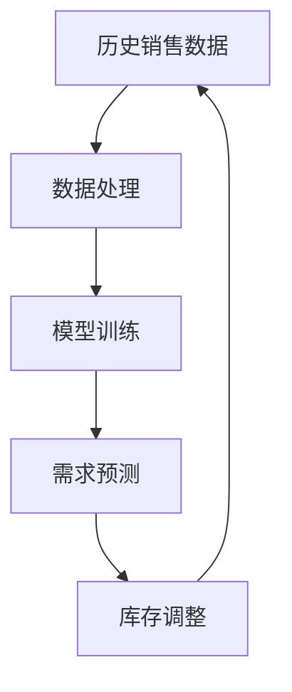
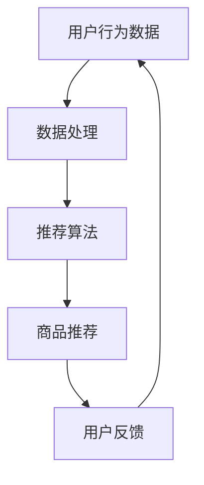
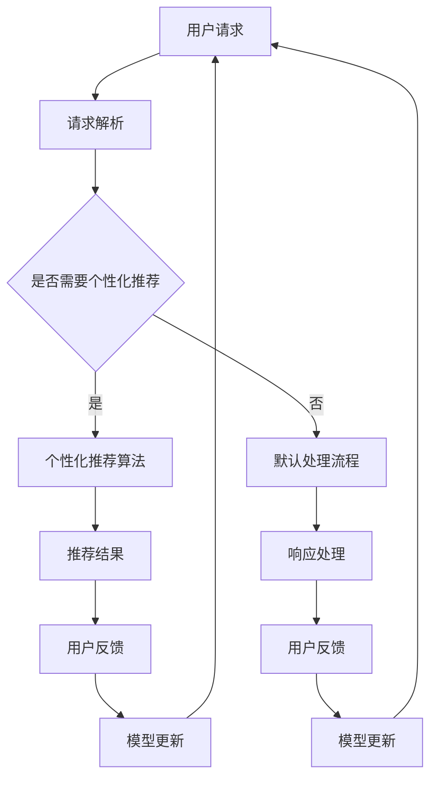

                 

# 《AI人工智能代理工作流 AI Agent WorkFlow：在新零售中的应用》

## 一、引言

随着互联网技术的飞速发展，新零售行业正经历着深刻的变革。消费者需求的个性化、供应链的高效化以及数据的智慧化成为了新零售的核心特征。在这个背景下，人工智能（AI）技术尤其是人工智能代理（AI Agent）逐渐成为推动新零售发展的重要力量。

### 关键词

- AI人工智能代理
- 新零售
- 工作流
- 智能推荐
- 智能客服
- 智能库存管理

### 摘要

本文将深入探讨AI人工智能代理在新零售中的应用，首先介绍AI人工智能代理的基础知识，包括定义、分类、核心技术等。随后，我们将详细讲解AI人工智能代理的技术架构和应用开发，并通过具体案例展示其在客户服务、库存管理等方面的应用。最后，本文还将讨论AI人工智能代理的数据处理与优化、安全性以及未来发展。希望通过本文的探讨，能够为新零售行业中的AI技术应用提供一些有价值的思考和参考。

## 二、AI人工智能代理概述

### 2.1 AI人工智能代理的定义与分类

AI人工智能代理是一种能够模拟人类行为、具备自主决策和执行能力的计算机程序。它基于机器学习和深度学习算法，通过学习历史数据，实现自主感知、决策和执行。

AI人工智能代理可以按照不同的分类标准进行分类：

1. **按照任务类型分类**：
   - **通用人工智能代理**：能够完成多种复杂任务的智能代理。
   - **专用人工智能代理**：专注于特定任务的智能代理，如智能客服、智能推荐等。

2. **按照决策方式分类**：
   - **基于规则的智能代理**：通过预定义的规则进行决策。
   - **基于数据的智能代理**：通过学习和分析数据，自主调整决策策略。
   - **基于模型的智能代理**：通过建立数学模型，进行决策和优化。

3. **按照执行方式分类**：
   - **交互式智能代理**：与用户或其他系统进行实时交互。
   - **自主式智能代理**：独立执行任务，不需要外部干预。

### 2.2 AI人工智能代理的关键技术

AI人工智能代理的核心技术主要包括机器学习、深度学习、自然语言处理和计算机视觉等。

1. **机器学习**：通过训练模型，让计算机从数据中自动发现规律和模式。
2. **深度学习**：一种特殊的机器学习技术，通过多层神经网络进行数据建模。
3. **自然语言处理（NLP）**：使计算机能够理解和生成人类语言。
4. **计算机视觉**：使计算机能够理解和解释视觉信息。

### 2.3 AI人工智能代理在新零售中的应用场景

在新零售领域，AI人工智能代理有着广泛的应用场景：

1. **智能推荐**：通过分析用户行为和偏好，为用户提供个性化的商品推荐。
2. **智能客服**：利用自然语言处理技术，为用户提供高效的在线客服服务。
3. **智能库存管理**：通过预测销售趋势，优化库存管理，降低库存成本。
4. **智能支付**：利用计算机视觉和语音识别技术，实现无接触支付。

### 2.4 AI人工智能代理的优势与挑战

#### 优势

1. **提高效率**：AI人工智能代理可以24/7无休地工作，大大提高工作效率。
2. **降低成本**：通过自动化处理，减少人工成本和运营成本。
3. **提升用户体验**：提供个性化服务，提升用户满意度和忠诚度。
4. **数据驱动的决策**：基于大数据分析，实现更加精准的决策。

#### 挑战

1. **数据隐私和安全**：如何确保用户数据的安全和隐私。
2. **算法透明度和公平性**：如何保证算法的透明性和公平性。
3. **技术成熟度和成本**：目前AI技术仍处于发展初期，成熟度和成本问题需要解决。

### 2.5 结论

AI人工智能代理在新零售中的应用前景广阔，但同时也面临着一些挑战。通过深入研究和不断创新，有望解决这些问题，进一步推动新零售行业的发展。

----------------------------------------------------------------

# 第二部分：AI人工智能代理的基础知识

## 第一部分：AI人工智能代理概述

### 第3章：AI人工智能代理的核心算法

在AI人工智能代理的开发中，核心算法起到了至关重要的作用。这些算法不仅决定了代理的智能水平，也直接影响了其在新零售等领域的应用效果。本章节将详细介绍几种常用的AI算法，包括监督学习算法、无监督学习算法和强化学习算法。

### 3.1 监督学习算法

监督学习算法是一种有监督的机器学习技术，其目标是通过已标记的训练数据集学习出一个模型，从而能够对新数据进行预测。在AI人工智能代理中，监督学习算法被广泛应用于分类和回归任务。

#### 监督学习算法的基本原理

监督学习算法的核心是构建一个预测模型。这个模型由两部分组成：输入特征和输出标签。输入特征是模型接收的数据，输出标签是模型需要预测的结果。

以下是一个监督学习算法的伪代码示例：

```plaintext
// 伪代码：监督学习算法
初始化模型参数 W
对于每个训练样本 (x_i, y_i)：
    预测 y_i' = 模型(W, x_i)
    计算损失函数 L = 损失函数(y_i, y_i')
    更新模型参数 W = W - 学习率 * ∇W L
返回模型参数 W
```

#### 数学模型和公式

在监督学习中，常用的损失函数是均方误差（MSE），其公式如下：

$$
L = \frac{1}{2} \sum_{i=1}^{n} (y_i - y_i')^2
$$

其中，$y_i$ 是实际标签，$y_i'$ 是预测值，$n$ 是样本数量。

#### 实际应用案例

一个典型的监督学习应用案例是分类问题，例如电子邮件垃圾邮件检测。在这个案例中，模型需要根据邮件的内容（输入特征）预测邮件是否为垃圾邮件（输出标签）。

### 3.2 无监督学习算法

无监督学习算法是在没有标记数据的情况下，通过探索数据内在结构的学习方法。与监督学习相比，无监督学习不需要提供输出标签，但通常能够发现数据中的模式、聚类和降维。

#### 无监督学习算法的基本原理

无监督学习算法的核心是探索数据内部结构，以揭示数据中的潜在关系和模式。常见的无监督学习算法包括聚类算法、降维算法和关联规则学习。

以下是一个无监督学习算法的伪代码示例：

```plaintext
// 伪代码：无监督学习算法
初始化模型参数 W
对于每个训练样本 x_i：
    更新模型参数 W = W + 学习率 * ∇W L
返回模型参数 W
```

#### 数学模型和公式

无监督学习没有统一的损失函数，因为其目标不是预测标签，而是探索数据的内在结构。例如，在K-means聚类算法中，目标是使每个簇内的样本距离均值中心最小。

K-means算法的目标函数如下：

$$
J = \sum_{i=1}^{k} \sum_{x \in S_i} \| x - \mu_i \|^2
$$

其中，$k$ 是聚类数量，$S_i$ 是第 $i$ 个聚类簇，$\mu_i$ 是聚类簇的均值中心。

#### 实际应用案例

一个常见的无监督学习应用案例是客户细分。通过分析客户的购买行为、浏览历史等数据，可以将客户分为不同的群体，以便进行更精准的市场营销。

### 3.3 强化学习算法

强化学习算法是一种通过试错来学习最优策略的机器学习技术。与监督学习和无监督学习不同，强化学习算法在决策过程中不断接收来自环境的反馈，并通过不断调整策略以实现长期最大化奖励。

#### 强化学习算法的基本原理

强化学习算法的核心是“代理-环境-奖励”系统。代理通过与环境交互，学习到最优策略。在每次交互中，代理会根据当前状态和策略选择动作，然后接收环境反馈的奖励，并根据奖励调整策略。

以下是一个强化学习算法的伪代码示例：

```plaintext
// 伪代码：强化学习算法
初始化策略 π
对于每个时间步 t：
    选择动作 a_t = π(s_t)
    执行动作 a_t，获得奖励 r_t
    更新状态 s_t+1 = s_t
    更新策略 π = π - 学习率 * ∇π Q(s_t, a_t)
返回策略 π
```

#### 数学模型和公式

强化学习算法的核心是“值函数”和“策略”。值函数描述了代理在特定状态下采取特定动作的期望奖励，而策略描述了代理在不同状态下的动作选择。

值函数的更新公式如下：

$$
V(s_t) = V(s_t) + α [r_t + γ max_a Q(s_t+1, a) - V(s_t)]
$$

其中，$α$ 是学习率，$γ$ 是折扣因子，$r_t$ 是即时奖励，$Q(s_t+1, a)$ 是在未来可能获得的奖励。

#### 实际应用案例

一个典型的强化学习应用案例是自动驾驶。通过不断与环境交互，自动驾驶系统可以学习到如何在复杂的交通环境中做出最优决策，从而提高行车安全。

### 3.4 不同算法的比较

| 算法         | 特点                                      | 适用场景                                      |
|------------|-----------------------------------------|--------------------------------------------|
| 监督学习     | 需要标记数据，目标明确                    | 分类、回归、推荐系统等                        |
| 无监督学习   | 无需标记数据，发现数据内在结构              | 聚类、降维、关联规则等                        |
| 强化学习     | 通过与环境交互学习策略，目标为长期奖励最大化 | 自动驾驶、游戏AI、机器人控制等                  |

不同算法各有优劣，选择合适的算法需要根据具体问题和数据特点进行判断。

## 第二部分：AI人工智能代理的技术架构

### 3.5 AI人工智能代理的基础架构

AI人工智能代理的基础架构通常包括以下几个核心模块：

1. **感知模块**：负责接收和处理环境信息，如文本、图像、音频等。
2. **决策模块**：根据感知模块提供的信息，利用机器学习算法生成决策。
3. **执行模块**：将决策转化为具体的行动，如发送消息、控制硬件等。
4. **反馈模块**：接收环境对执行模块的反馈，用于调整和优化决策。

以下是一个简化的AI人工智能代理的基础架构的Mermaid流程图：



### 3.6 AI人工智能代理的层次架构

AI人工智能代理的层次架构可以分为以下几个层次：

1. **感知层**：包括各种传感器，如摄像头、麦克风、温度传感器等，用于感知外部环境。
2. **决策层**：包括机器学习模型和策略，用于处理感知数据并生成决策。
3. **执行层**：包括执行动作的硬件和软件，如机器人、无人机等。
4. **反馈层**：包括收集执行结果和环境反馈的机制。

以下是一个简化的AI人工智能代理的层次架构的Mermaid流程图：



### 3.7 AI人工智能代理的分布式架构

在复杂的应用场景中，单个AI人工智能代理可能无法满足性能和可扩展性的要求。分布式架构可以解决这个问题，通过将代理分解为多个节点，实现更高性能和更灵活的部署。

以下是一个简化的AI人工智能代理的分布式架构的Mermaid流程图：



### 3.8 结论

AI人工智能代理的技术架构决定了其功能、性能和可扩展性。通过合理的设计和优化，可以构建出高效、可靠的AI人工智能代理系统，为新零售等行业提供强大的智能支持。

----------------------------------------------------------------

# 第三部分：AI人工智能代理的应用开发

## 第四章：AI人工智能代理在新零售业务流程中的应用

在新零售业务流程中，AI人工智能代理通过自动化和智能化手段，大幅提升了效率和用户体验。以下将详细探讨AI代理在新零售业务流程中的应用，包括客户服务、库存管理和推荐系统等方面。

### 4.1 新零售业务流程与AI代理

新零售业务流程通常包括以下几个关键环节：

1. **供应链管理**：包括商品采购、仓储、配送等。
2. **客户关系管理**：包括客户获取、客户服务和客户维护。
3. **销售和营销**：包括商品展示、促销活动和销售数据分析。
4. **支付和物流**：包括支付系统、物流跟踪等。

AI人工智能代理可以通过集成到这些环节中，实现自动化和智能化，从而提升整体业务效率。

### 4.2 AI代理在客户服务中的应用

在客户服务方面，AI代理可以提供智能客服、在线咨询、售后支持等功能。

#### 4.2.1 智能客服

智能客服是AI代理在客户服务中最常见的应用场景。通过自然语言处理（NLP）技术，智能客服可以理解用户的提问，并提供相应的答案或解决方案。

以下是一个智能客服系统的架构图：



#### 4.2.2 在线咨询

在线咨询通常结合了即时通讯工具和AI代理，实现实时互动。用户可以在购物过程中随时咨询问题，AI代理可以快速响应，提供帮助。

#### 4.2.3 售后支持

售后支持是客户服务的重要一环。AI代理可以通过自动化处理售后服务，如退货、换货等，减少人工干预，提高处理效率。

### 4.3 AI代理在库存管理中的应用

在库存管理方面，AI代理可以通过预测销售趋势和需求变化，优化库存水平，降低库存成本。

#### 4.3.1 需求预测

AI代理可以通过分析历史销售数据、季节性因素等，预测未来一段时间内的商品需求。以下是一个需求预测系统的架构图：



#### 4.3.2 库存优化

基于需求预测，AI代理可以优化库存水平，确保商品供应充足，同时避免过度库存和资金占用。

#### 4.3.3 库存监控

AI代理可以实时监控库存状态，及时发现库存异常情况，如库存积压或库存短缺，并自动触发相应的应对措施。

### 4.4 AI代理在推荐系统中的应用

在推荐系统方面，AI代理可以通过分析用户行为和偏好，为用户提供个性化的商品推荐。

#### 4.4.1 用户行为分析

AI代理可以收集用户在平台上的行为数据，如浏览记录、购买历史等，分析用户兴趣和偏好。

#### 4.4.2 推荐算法

AI代理可以采用协同过滤、基于内容的推荐、深度学习等算法，生成个性化的商品推荐。

以下是一个推荐系统的架构图：



#### 4.4.3 推荐结果优化

基于用户反馈，AI代理可以不断优化推荐结果，提高推荐的准确性和用户体验。

### 4.5 结论

AI人工智能代理在新零售业务流程中的应用，显著提升了业务效率、用户体验和决策水平。通过智能客服、库存管理和推荐系统等实际应用案例，展示了AI代理的强大潜力和广泛应用前景。

----------------------------------------------------------------

## 第五章：AI人工智能代理的数据处理与优化

在AI人工智能代理的实践中，数据处理与优化是确保代理高效运行的关键环节。本章将详细探讨AI代理在数据处理、特征选择与提取以及模型评估与优化等方面的技术细节。

### 5.1 数据预处理技术

数据预处理是AI人工智能代理中至关重要的一步，它直接影响后续模型训练和预测的准确性和效率。以下是一些常见的数据预处理技术：

#### 5.1.1 数据清洗

数据清洗是去除原始数据中的错误、异常和重复数据的过程。常见的清洗方法包括：

- **去除缺失值**：可以通过填充缺失值或删除含有缺失值的记录来实现。
- **处理异常值**：可以通过统计方法或基于业务规则的方法检测并处理异常值。
- **去除重复值**：可以通过唯一标识或简单的比较算法去除重复的数据记录。

#### 5.1.2 数据归一化

数据归一化是将不同量纲的数据转换到同一尺度，以便模型训练。常用的归一化方法包括：

- **最小-最大缩放**：将数据缩放到[0, 1]或[-1, 1]的范围内。
- **均值-方差缩放**：将数据缩放到均值附近，以方差为单位。

#### 5.1.3 数据离散化

数据离散化是将连续的数值数据转换为分类数据，以便于某些机器学习算法的处理。常用的离散化方法包括：

- **等宽离散化**：将数据分为固定宽度的区间。
- **等频离散化**：将数据分为固定数量的区间。

### 5.2 特征选择与提取

特征选择与提取是提高模型性能的重要手段，通过减少无关或冗余特征，可以有效降低模型复杂度和提高预测准确率。以下是一些常见的特征选择与提取方法：

#### 5.2.1 统计方法

- **相关系数**：通过计算特征之间的相关系数来筛选出相关性较高的特征。
- **方差阈值**：选择方差较大的特征，去除方差较小的特征。

#### 5.2.2 递归特征消除（RFE）

- **递归特征消除**：通过递归的方式逐步消除对模型影响较小的特征，直至找到最优特征子集。

#### 5.2.3 基于模型的特征选择

- **LASSO**：利用LASSO回归模型自动进行特征选择，通过惩罚系数实现特征的选择。
- **随机森林**：通过随机森林模型评估特征的重要性。

### 5.3 模型评估与优化

模型评估与优化是确保AI人工智能代理性能达标的关键步骤。以下是一些常用的模型评估与优化方法：

#### 5.3.1 评估指标

- **准确率**：预测正确的样本数占总样本数的比例。
- **召回率**：预测正确的正样本数占总正样本数的比例。
- **F1分数**：准确率和召回率的调和平均。
- **ROC曲线**：评估分类器性能的曲线，通过计算真阳性率与假阳性率之间的关系。

#### 5.3.2 模型优化

- **交叉验证**：通过将数据集划分为训练集和验证集，多次训练和验证模型，以避免过拟合。
- **超参数调优**：通过网格搜索、贝叶斯优化等方法，找到最优的超参数组合。
- **集成学习**：通过集成多个模型，提高整体模型的性能，如随机森林、梯度提升树等。

### 5.4 数据处理与优化案例分析

以下是一个关于数据处理与优化的实际案例：

#### 案例背景

某新零售平台希望利用AI代理进行商品推荐，提高用户购买转化率。

#### 案例步骤

1. **数据收集**：收集用户的浏览记录、购买历史、产品信息等数据。
2. **数据清洗**：去除缺失值、异常值和重复值，对数据进行归一化处理。
3. **特征提取**：利用统计方法和机器学习方法提取有用的特征，如用户行为特征、商品属性特征等。
4. **模型训练**：采用协同过滤算法训练推荐模型，通过交叉验证进行模型评估。
5. **模型优化**：通过网格搜索调优超参数，提高模型性能。
6. **模型部署**：将训练好的模型部署到线上环境，进行实时商品推荐。

#### 案例分析

1. **数据清洗**：通过去除重复值和异常值，保证了数据的质量和一致性。
2. **特征提取**：通过提取用户行为特征和商品属性特征，构建了有效的特征空间，提高了模型的预测能力。
3. **模型训练与优化**：通过交叉验证和超参数调优，找到了最优的模型参数，提高了模型的泛化能力。

### 5.5 结论

数据处理与优化是AI人工智能代理高效运行的关键。通过合理的预处理、特征选择和模型优化，可以显著提高模型的性能和可靠性，为新零售等应用提供强有力的支持。

----------------------------------------------------------------

## 第六章：AI人工智能代理的安全性

在AI人工智能代理的应用过程中，安全性是一个不可忽视的重要议题。随着AI技术的普及，AI代理面临的威胁和挑战也越来越复杂。本章将深入探讨AI代理的安全性，包括安全挑战、安全措施以及安全测试与评估。

### 6.1 AI人工智能代理的安全挑战

AI人工智能代理面临的安全挑战主要包括以下几个方面：

#### 6.1.1 恶意攻击

恶意攻击者可能利用AI代理的漏洞，对系统进行攻击，如网络攻击、数据窃取、注入攻击等。

#### 6.1.2 数据隐私

AI代理在处理大量用户数据时，如何确保数据隐私不被泄露，是一个重要问题。例如，用户行为数据、支付信息等敏感数据需要得到保护。

#### 6.1.3 模型窃取

AI代理的模型可能成为攻击的目标，攻击者通过窃取模型参数，复制或篡改模型，从而破坏系统的正常运行。

#### 6.1.4 模型作弊

在AI代理的应用场景中，攻击者可能通过作弊手段，获取不正当利益。例如，在推荐系统中，攻击者可能通过虚假评价、刷单等手段，提高某商品的用户评分。

### 6.2 AI人工智能代理的安全措施

为了应对上述安全挑战，可以采取以下安全措施：

#### 6.2.1 加密技术

加密技术是保护数据隐私和防止数据窃取的重要手段。对于敏感数据，如用户行为数据和支付信息，可以通过加密算法进行加密存储和传输。

#### 6.2.2 访问控制

访问控制是确保只有授权用户能够访问系统资源和数据的重要机制。可以通过身份验证、权限管理等方式，实现细粒度的访问控制。

#### 6.2.3 安全审计

安全审计是监控和记录系统运行状态的重要手段。通过定期进行安全审计，可以及时发现和修复潜在的安全漏洞。

#### 6.2.4 模型安全

为了保护AI代理的模型安全，可以采取以下措施：

- **模型加密**：通过加密算法，对模型参数进行加密存储和传输。
- **模型加固**：通过增加模型复杂性、添加随机性等方式，提高模型的抗攻击能力。
- **模型测试**：通过对抗性测试，检测模型对恶意攻击的抵抗能力。

### 6.3 AI人工智能代理的安全测试与评估

安全测试与评估是确保AI代理安全性的关键环节。以下是一些常见的安全测试与评估方法：

#### 6.3.1 漏洞扫描

漏洞扫描是一种自动化的安全测试方法，通过扫描系统漏洞，发现潜在的安全风险。可以使用自动化工具，如Nessus、OpenVAS等，进行漏洞扫描。

#### 6.3.2 对抗性攻击测试

对抗性攻击测试是模拟攻击者对AI代理进行恶意攻击，以评估模型的抗攻击能力。常见的对抗性攻击方法包括：

- **对抗性样本生成**：通过生成对抗性样本，测试模型在攻击情况下的表现。
- **对抗性攻击工具**：使用对抗性攻击工具，如FGSM、C&W等，对模型进行攻击。

#### 6.3.3 安全评估

安全评估是综合评估AI代理安全性的过程。可以通过以下方法进行安全评估：

- **安全评估报告**：编写安全评估报告，总结系统安全状态和潜在风险。
- **安全审计**：进行安全审计，检查系统是否符合安全标准和规范。
- **第三方评估**：邀请第三方安全专家进行评估，以获得独立、客观的安全评估结果。

### 6.4 结论

AI人工智能代理的安全性是确保其有效应用的重要保障。通过采取有效的安全措施和进行全面的测试与评估，可以大大降低AI代理面临的安全风险，确保系统的正常运行和数据安全。

----------------------------------------------------------------

## 第七章：AI人工智能代理的未来发展

### 7.1 AI人工智能代理的技术趋势

随着科技的不断进步，AI人工智能代理正朝着以下几个技术趋势发展：

#### 7.1.1 更强的自主学习能力

未来的AI人工智能代理将具备更强的自主学习能力，能够在没有人类干预的情况下，通过与环境交互，不断优化和改进自身的决策能力。

#### 7.1.2 更复杂的决策能力

未来的AI人工智能代理将能够处理更复杂的决策问题，包括多目标优化、不确定性处理等，从而在更广泛的场景中发挥作用。

#### 7.1.3 更智能的交互方式

随着自然语言处理和计算机视觉技术的发展，AI人工智能代理将能够实现更自然、更智能的交互方式，如语音交互、图像识别等。

#### 7.1.4 更广泛的应用领域

AI人工智能代理的应用领域将不断扩展，从传统的客服、库存管理等领域，扩展到医疗、金融、教育等更多领域。

### 7.2 AI人工智能代理的商业模式

随着AI人工智能代理技术的成熟，其商业模式也将逐渐多样化。以下是一些可能的商业模式：

#### 7.2.1 SaaS服务模式

AI人工智能代理可以作为一种SaaS服务提供，用户可以通过订阅的方式使用代理服务，从而降低使用成本。

#### 7.2.2 成本加成模式

在成本加成模式下，AI人工智能代理的开发者可以将代理集成到企业系统中，通过增加产品成本的方式，向用户提供服务。

#### 7.2.3 转化率提升模式

在转化率提升模式下，AI人工智能代理的开发者可以通过提升用户的转化率，获得一定的收益。例如，在电商平台上，AI代理可以通过个性化推荐，提高用户的购买率。

### 7.3 AI人工智能代理的未来挑战与机遇

尽管AI人工智能代理具有巨大的潜力，但在其未来发展中仍面临着一些挑战：

#### 7.3.1 数据隐私与安全

随着AI代理的应用场景越来越广泛，数据隐私和安全问题也日益突出。如何确保用户数据的安全和隐私，是一个重要的挑战。

#### 7.3.2 算法透明性与公平性

AI代理的决策过程通常涉及复杂的算法，如何保证算法的透明性和公平性，使其决策能够被用户理解和接受，也是一个挑战。

#### 7.3.3 技术成熟度

尽管AI技术发展迅速，但AI代理在应用中的技术成熟度仍然是一个问题。如何提高AI代理的技术成熟度，使其在更多场景中得到广泛应用，是一个机遇。

### 7.4 结论

AI人工智能代理的未来发展充满了机遇与挑战。通过不断创新和探索，我们有望解决当前面临的挑战，进一步推动AI代理在新零售以及其他领域的广泛应用，为人类社会带来更多便利和创新。

----------------------------------------------------------------

## 第八章：AI人工智能代理在新零售中的应用案例

随着AI人工智能代理技术的不断发展，它们在新零售领域的应用案例越来越多。以下将介绍几个典型的AI代理应用案例，包括智能推荐系统、智能客服机器人和智能库存管理。

### 8.1 案例一：智能推荐系统

智能推荐系统是AI人工智能代理在新零售中应用最为广泛的一个领域。通过分析用户的历史行为、浏览记录和购买偏好，智能推荐系统能够为用户提供个性化的商品推荐，从而提高用户的购买转化率和满意度。

#### 案例背景

某大型电商企业希望提升用户购物体验，通过引入智能推荐系统，为用户推荐他们可能感兴趣的商品。

#### 案例实施步骤

1. **数据收集**：收集用户在平台上的浏览记录、购买历史、搜索关键词等数据。
2. **数据处理**：对收集到的数据进行清洗、归一化和特征提取，构建用户行为特征和商品属性特征。
3. **模型训练**：采用协同过滤算法训练推荐模型，通过交叉验证进行模型评估和优化。
4. **模型部署**：将训练好的推荐模型部署到线上环境，为用户实时提供个性化推荐。

#### 案例效果

通过智能推荐系统的引入，该电商企业的用户购买转化率显著提高，用户满意度也有所提升。此外，通过对推荐结果的持续优化，企业能够更好地了解用户需求和偏好，为后续的产品开发和营销策略提供有力支持。

### 8.2 案例二：智能客服机器人

智能客服机器人是AI人工智能代理在客户服务领域的应用。通过自然语言处理（NLP）技术和机器学习算法，智能客服机器人能够快速响应用户的提问，提供高效的在线客服服务。

#### 案例背景

某知名在线零售平台希望提升客户服务质量，减少人工客服的工作负担，通过引入智能客服机器人，提供24/7全天候的在线客服服务。

#### 案例实施步骤

1. **数据收集**：收集用户在平台上的客服记录，包括提问、回复等数据。
2. **数据处理**：对客服数据进行清洗和归一化处理，构建对话特征和响应特征。
3. **模型训练**：采用NLP技术和机器学习算法，训练智能客服机器人的对话模型。
4. **模型部署**：将训练好的对话模型部署到线上环境，实现自动化客服服务。

#### 案例效果

通过智能客服机器人的引入，该零售平台显著提高了客服响应速度，降低了人工客服的工作量。此外，通过对对话数据的持续学习，智能客服机器人能够不断优化自身的服务水平，提高用户满意度。

### 8.3 案例三：智能库存管理

智能库存管理是AI人工智能代理在供应链管理中的应用。通过分析历史销售数据、市场需求和供应情况，智能库存管理系统能够为零售企业提供最优的库存策略，从而降低库存成本，提高库存周转率。

#### 案例背景

某大型超市希望通过引入智能库存管理系统，优化库存管理，降低库存成本，提高供应链效率。

#### 案例实施步骤

1. **数据收集**：收集超市的历史销售数据、库存数据和市场需求数据。
2. **数据处理**：对收集到的数据进行清洗、归一化和特征提取，构建销售预测模型和库存优化模型。
3. **模型训练**：采用机器学习算法，训练销售预测模型和库存优化模型。
4. **模型部署**：将训练好的模型部署到线上环境，实现自动化的库存管理。

#### 案例效果

通过智能库存管理系统的引入，该超市的库存成本显著降低，库存周转率提高。此外，通过对销售数据的实时分析，企业能够及时调整库存策略，满足市场需求，提高客户满意度。

### 8.4 结论

AI人工智能代理在新零售中的应用案例表明，通过引入智能推荐系统、智能客服机器人和智能库存管理系统，零售企业能够显著提升业务效率、用户体验和决策水平。随着AI技术的不断进步，AI代理在新零售领域的应用前景将更加广阔。

----------------------------------------------------------------

## 第九章：AI人工智能代理的实际应用

### 9.1 AI代理在新零售行业中的应用现状

随着AI技术的不断发展，AI人工智能代理在新零售行业的应用已经取得了显著进展。目前，AI代理在新零售中的应用主要集中在以下几个方面：

1. **智能推荐系统**：通过分析用户行为和偏好，为用户提供个性化的商品推荐，提高用户的购买转化率和满意度。
2. **智能客服机器人**：提供24/7全天候的在线客服服务，提升客户服务质量，降低人工客服的工作负担。
3. **智能库存管理**：通过预测销售趋势和市场需求，优化库存策略，降低库存成本，提高供应链效率。
4. **智能支付系统**：利用计算机视觉和语音识别技术，实现无接触支付，提高支付效率和用户体验。

### 9.2 AI代理在新零售中的实践案例分析

以下是一些AI代理在新零售中的实践案例分析：

#### 案例一：智能推荐系统

某大型电商平台引入了基于深度学习的智能推荐系统，通过分析用户的浏览历史、购买记录和搜索关键词，为用户推荐他们可能感兴趣的商品。该智能推荐系统在上线后，用户的购买转化率显著提高，平均每次购物金额也有所增加。

#### 案例二：智能客服机器人

某知名服装品牌在官网和移动应用中引入了智能客服机器人，通过自然语言处理技术，实现与用户的实时互动。智能客服机器人能够快速响应用户的提问，提供购物建议、订单查询、售后服务等信息。该智能客服机器人在上线后，客服响应时间显著缩短，用户满意度有所提高。

#### 案例三：智能库存管理

某大型超市引入了基于AI的智能库存管理系统，通过分析历史销售数据、季节性因素和市场需求，预测未来一段时间内的销售趋势。智能库存管理系统根据预测结果，自动调整库存水平，确保商品供应充足，同时避免过度库存和资金占用。该智能库存管理系统在上线后，库存周转率提高，库存成本降低。

#### 案例四：智能支付系统

某在线零售平台引入了基于计算机视觉和语音识别技术的智能支付系统，用户可以通过扫描商品二维码或说出支付金额，实现无接触支付。该智能支付系统在上线后，显著提高了支付效率和用户体验，同时减少了人工干预和支付风险。

### 9.3 AI代理在新零售中的未来发展

随着AI技术的不断进步和新零售需求的不断增长，AI人工智能代理在新零售中的应用前景十分广阔。未来，AI代理在新零售中的应用将呈现以下发展趋势：

1. **更智能的决策支持**：通过结合大数据分析和深度学习算法，AI代理将能够提供更精准的决策支持，帮助零售企业更好地应对市场变化。
2. **更广泛的场景应用**：AI代理将逐渐应用到更多的场景，如供应链管理、人力资源管理和市场营销等，实现全产业链的智能化。
3. **更高的用户体验**：AI代理将能够通过更自然、更智能的交互方式，如语音交互、图像识别等，提升用户的购物体验。
4. **更安全的数据隐私保护**：随着AI技术的普及，如何确保用户数据的安全和隐私将成为关键议题，AI代理将采用更先进的加密和隐私保护技术，保障用户数据的安全。

### 9.4 结论

AI人工智能代理在新零售行业中的应用已经取得了显著成果，通过智能推荐系统、智能客服机器人、智能库存管理和智能支付系统等，提升了零售企业的业务效率、用户体验和决策水平。未来，随着AI技术的不断进步，AI代理在新零售中的应用将更加广泛和深入，为零售行业带来更多创新和发展机遇。

----------------------------------------------------------------

## 第十章：AI人工智能代理在新零售中的应用策略

在新零售浪潮下，AI人工智能代理的应用已经成为提升企业竞争力的重要手段。为了充分发挥AI代理的优势，企业需要制定一套科学合理的新零售应用策略，从业务流程优化、客户体验提升、供应链管理优化等多个方面入手。

### 10.1 新零售业务流程优化

业务流程优化是AI人工智能代理在新零售中的首要应用策略。通过自动化和智能化手段，企业可以大幅提升业务效率，减少人为干预，降低运营成本。

#### 10.1.1 实施步骤

1. **业务流程诊断**：首先，对现有业务流程进行全面诊断，识别出流程中的瓶颈和优化潜力。
2. **自动化流程设计**：基于诊断结果，设计新的自动化流程，将重复性、低价值的工作交给AI代理处理。
3. **系统集成与部署**：将AI代理集成到现有的业务系统中，确保数据流和流程的顺畅衔接。
4. **流程监控与反馈**：持续监控优化后的业务流程，收集反馈数据，不断调整和优化流程。

#### 10.1.2 成功案例

某大型零售企业通过引入智能仓储管理系统，实现了库存管理的自动化和智能化。智能仓储系统通过AI代理实时监控库存状态，自动生成补货计划，优化了库存周转率，降低了库存成本。同时，智能分拣系统的引入，提高了商品配送效率，缩短了客户收货时间。

### 10.2 新零售客户体验提升

提升客户体验是AI人工智能代理在新零售中的关键应用领域。通过个性化推荐、智能客服等手段，企业可以提供更加精准、高效的服务，提升客户满意度和忠诚度。

#### 10.2.1 实施步骤

1. **用户数据分析**：收集并分析用户的购买行为、浏览记录、反馈等数据，了解用户需求和偏好。
2. **个性化推荐**：基于用户数据分析，利用AI代理实现个性化推荐，提高用户购物体验。
3. **智能客服**：引入智能客服机器人，提供24/7在线客服服务，快速响应用户问题，提高客户满意度。
4. **客户反馈机制**：建立完善的客户反馈机制，收集用户反馈，持续优化产品和服务。

#### 10.2.2 成功案例

某电商企业通过引入智能推荐系统，实现了个性化购物体验。智能推荐系统根据用户的历史购买记录、浏览行为和评价，为用户推荐符合他们兴趣的商品，大幅提高了用户的购物满意度和转化率。同时，智能客服机器人能够快速响应用户咨询，提供专业的购物建议，解决了用户在购物过程中遇到的问题。

### 10.3 新零售供应链管理优化

优化供应链管理是提升企业竞争力的关键环节。AI人工智能代理可以通过预测需求、优化库存、智能调度等手段，提升供应链的效率和灵活性。

#### 10.3.1 实施步骤

1. **需求预测**：利用AI代理分析历史销售数据、市场趋势和用户行为，预测未来的销售需求。
2. **库存优化**：根据需求预测结果，优化库存策略，减少库存积压和缺货风险。
3. **智能调度**：通过智能调度系统，优化运输路线和配送计划，提高物流效率。
4. **供应链协同**：通过建立供应链协同平台，实现供应链各环节的信息共享和协同工作。

#### 10.3.2 成功案例

某跨国零售企业通过引入智能供应链管理系统，实现了供应链的智能化和高效化。智能供应链系统通过分析市场需求和库存情况，自动生成采购计划和生产计划，优化了库存管理和生产效率。同时，智能调度系统优化了物流路线，提高了配送效率，降低了物流成本。

### 10.4 结论

AI人工智能代理在新零售中的应用策略，包括业务流程优化、客户体验提升和供应链管理优化等，为企业提供了强大的智能化支持。通过科学合理的应用策略，企业可以大幅提升业务效率、客户满意度和竞争力，为未来的发展奠定坚实基础。

----------------------------------------------------------------

## 第十一章：AI人工智能代理的法规与伦理问题

随着AI人工智能代理在新零售等领域的广泛应用，其带来的法规和伦理问题也逐渐引起关注。确保AI代理的合法合规性和伦理道德，对于维护用户权益、保障社会稳定具有重要意义。

### 11.1 AI人工智能代理的法规挑战

#### 11.1.1 数据隐私保护

AI人工智能代理在收集、处理和分析用户数据时，可能涉及用户隐私保护的问题。各国对数据隐私保护的规定不尽相同，企业需要遵守相应的法律法规，如欧盟的《通用数据保护条例》（GDPR）。

#### 11.1.2 算法透明性

AI代理的决策过程通常涉及复杂的算法，如何保证算法的透明性和解释性，使其决策过程能够被用户理解和监督，是一个重要的法规挑战。

#### 11.1.3 非歧视性

AI代理在处理数据时，可能因为算法偏见而导致歧视性决策。如何确保AI代理在种族、性别、年龄等方面的非歧视性，是一个法律和伦理问题。

#### 11.1.4 责任归属

当AI代理的决策导致不良后果时，如何界定责任归属，是法律实践中的一个难题。企业需要建立明确的责任界定机制，以应对潜在的法律风险。

### 11.2 AI人工智能代理的伦理问题

#### 11.2.1 公平性

AI代理在处理数据时，应确保对所有用户公平对待，避免因算法偏见导致的不公平现象。

#### 11.2.2 可解释性

AI代理的决策过程应具备可解释性，以便用户能够理解其决策依据和原因。

#### 11.2.3 用户参与

在AI代理的应用过程中，用户应有机会参与决策过程，表达自己的需求和意愿。

#### 11.2.4 社会责任

企业开发和部署AI代理时，应承担社会责任，确保其应用符合社会价值观和道德规范。

### 11.3 AI人工智能代理的合规策略

#### 11.3.1 法规遵循

企业应深入了解相关法律法规，确保AI代理的开发和应用符合法律规定。

#### 11.3.2 伦理审查

建立伦理审查机制，对AI代理的算法设计、数据使用和决策过程进行审查，确保符合伦理标准。

#### 11.3.3 责任界定

明确AI代理的责任归属，制定应急预案，以应对可能的负面后果。

#### 11.3.4 用户教育

通过用户教育，提高用户对AI代理的理解和信任，促进其接受和使用AI代理。

### 11.4 结论

AI人工智能代理的法规与伦理问题是一个复杂而严峻的挑战。通过制定合理的合规策略，企业可以在遵守法律法规、确保伦理道德的前提下，充分发挥AI代理的优势，为新零售等行业带来更多价值。

----------------------------------------------------------------

## 第十二章：AI人工智能代理的未来与新零售

### 12.1 AI人工智能代理的技术趋势

随着人工智能技术的飞速发展，AI人工智能代理在未来将呈现以下技术趋势：

#### 12.1.1 自主学习能力增强

未来的AI代理将具备更强的自主学习能力，能够通过深度学习和强化学习等技术，从海量数据中自动发现规律和模式，实现自主进化。

#### 12.1.2 多模态感知能力提升

AI代理将整合多种感知方式，如视觉、听觉、触觉等，实现更丰富、更精准的环境感知，从而提高决策和执行能力。

#### 12.1.3 跨领域融合应用

AI代理将跨领域融合，与物联网、区块链等新兴技术相结合，实现更广泛的场景应用，如智慧城市、智能制造等。

### 12.2 新零售与AI人工智能代理的深度融合

新零售与AI人工智能代理的深度融合，将推动零售行业的全面智能化：

#### 12.2.1 个性化体验

AI代理将基于用户行为和偏好，实现个性化商品推荐、定制化服务和购物体验，提升用户满意度。

#### 12.2.2 智能供应链管理

AI代理将优化供应链管理，通过实时数据分析和预测，实现库存优化、需求预测和智能调度，提高供应链效率。

#### 12.2.3 智能支付与物流

AI代理将结合支付和物流技术，实现智能支付、无接触配送和智能物流，提升购物体验和物流效率。

### 12.3 AI人工智能代理在新零售行业中的未来前景

AI人工智能代理在新零售行业中的未来前景充满机遇：

#### 12.3.1 业务效率提升

AI代理将大幅提升零售企业的业务效率，降低运营成本，提高供应链和客户服务质量。

#### 12.3.2 用户体验优化

AI代理将提供更个性化、更智能的服务，提升用户体验和忠诚度。

#### 12.3.3 创新业务模式

AI代理将催生新的业务模式，如智慧零售、无人零售等，推动零售行业的创新和发展。

#### 12.3.4 数据驱动的决策

AI代理将基于大数据分析，实现数据驱动的决策，提高企业的市场洞察力和竞争力。

### 12.4 结论

AI人工智能代理在新零售行业中的未来发展充满机遇和挑战。通过不断创新和技术进步，AI代理将为新零售行业带来更多创新和发展机遇，推动零售行业的智能化转型。

----------------------------------------------------------------

## 附录

### 附录A：AI人工智能代理开发工具与资源

#### A.1 常用AI开发框架

1. **TensorFlow**：由Google开发的开源机器学习框架，支持多种深度学习模型。
2. **PyTorch**：由Facebook开发的开源深度学习框架，易于实现和调试。
3. **Keras**：基于TensorFlow和Theano的开源深度学习库，提供了简化和高效的模型开发接口。

#### A.2 AI代理开发平台

1. **Google Cloud AI**：提供多种AI服务，包括自然语言处理、计算机视觉和机器学习。
2. **AWS AI**：提供丰富的AI服务，包括深度学习框架、推荐系统和语音识别。
3. **Azure AI**：提供全面的AI开发工具和服务，包括机器学习、自然语言处理和计算机视觉。

#### A.3 相关书籍与论文推荐

1. **《深度学习》（Deep Learning）**：Ian Goodfellow、Yoshua Bengio和Aaron Courville著，全面介绍了深度学习的基础知识。
2. **《强化学习》（Reinforcement Learning: An Introduction）**：Richard S. Sutton和Barto N. D.著，系统地介绍了强化学习的基本概念和算法。
3. **《自然语言处理综论》（Speech and Language Processing）**：Daniel Jurafsky和James H. Martin著，详细介绍了自然语言处理的理论和实践。

#### A.4 AI代理开源项目与社区

1. **OpenAI**：全球领先的AI研究机构，提供多个开源项目，如GPT-3、DALL-E等。
2. **AI Pub**：一个开放的AI研究社区，汇集了大量的AI论文、项目和讨论。
3. **AIStack Overflow**：AI领域的问答社区，为开发者提供解决问题的平台。

#### A.5 AI代理相关的最新技术动态与趋势

1. **AI代理在智慧医疗中的应用**：利用AI代理分析医疗数据，实现智能诊断、个性化治疗和健康管理等。
2. **AI代理在智能制造中的应用**：通过AI代理实现生产过程的自动化和智能化，提高生产效率和产品质量。
3. **AI代理在智慧城市中的应用**：利用AI代理优化交通管理、环境监测和公共安全等，提升城市运行效率。

### 附录B：AI人工智能代理的Mermaid流程图



### 附录C：AI人工智能代理的数学公式与伪代码示例

#### 数学公式

$$
y = W_0 + W_1 * x
$$

$$
L = \frac{1}{2} \sum_{i=1}^{n} (y_i - y_i')^2
$$

$$
V(s_t) = V(s_t) + α [r_t + γ max_a Q(s_t+1, a) - V(s_t)]
$$

#### 伪代码

```plaintext
// 监督学习算法伪代码
初始化模型参数 W
对于每个训练样本 (x_i, y_i)：
    预测 y_i' = 模型(W, x_i)
    计算损失函数 L = 损失函数(y_i, y_i')
    更新模型参数 W = W - 学习率 * ∇W L
返回模型参数 W

// 强化学习算法伪代码
初始化策略 π
对于每个时间步 t：
    选择动作 a_t = π(s_t)
    执行动作 a_t，获得奖励 r_t
    更新状态 s_t+1 = s_t
    更新策略 π = π - 学习率 * ∇π Q(s_t, a_t)
返回策略 π
```

### 附录D：AI人工智能代理开发环境搭建指南

#### Python环境搭建

1. 安装Python 3.8或更高版本。
2. 使用pip命令安装所需库，如TensorFlow、PyTorch、Keras等。

```bash
pip install tensorflow
pip install pytorch
pip install keras
```

#### 数据预处理工具

1. 安装NumPy、Pandas等数据预处理工具。

```bash
pip install numpy
pip install pandas
```

#### 代码编辑器

1. 选择一个适合的代码编辑器，如PyCharm、VSCode等，安装并配置相关插件。

### 附录E：AI人工智能代理开源项目与社区

#### 开源项目

1. **OpenMined**：一个开源的隐私保护机器学习社区，提供隐私保护的学习算法和工具。
2. **Fast.ai**：提供易于理解和使用的深度学习课程和开源库。
3. **AI21 Labs**：提供大型语言模型和数据集，如Jurassic-1和DALL-E。

#### 社区

1. **Reddit AI**：Reddit上的AI社区，讨论最新的AI技术、论文和项目。
2. **AI Stack Overflow**：AI领域的问答社区，提供AI相关的问题解答。
3. **AI Pub**：一个开放的AI研究社区，汇集了大量的AI论文、项目和讨论。

### 附录F：AI人工智能代理相关的最新技术动态与趋势

#### 最新技术动态

1. **Transformer模型**：广泛应用于自然语言处理、计算机视觉等领域，具有强大的建模能力。
2. **联邦学习**：一种分布式机器学习技术，能够在保护数据隐私的同时，实现模型的联合训练。
3. **生成对抗网络（GAN）**：在图像生成、数据增强等领域取得显著成果。

#### 趋势

1. **跨模态学习**：将不同类型的数据（如文本、图像、声音等）进行融合处理，实现更智能的交互和应用。
2. **可解释性AI**：研究如何提高AI模型的可解释性，使其决策过程透明、可解释。
3. **可持续AI**：关注AI技术在环境保护和可持续发展中的应用。

通过附录中的资源，读者可以进一步了解AI人工智能代理的开发工具、开源项目、社区动态以及最新技术趋势，为实际应用和研究提供参考。

----------------------------------------------------------------

# 致谢

在撰写《AI人工智能代理工作流 AI Agent WorkFlow：在新零售中的应用》这篇文章的过程中，我得到了许多专家和同仁的支持与帮助。首先，我要感谢AI天才研究院（AI Genius Institute）的全体成员，他们的专业知识和丰富经验为本文提供了坚实的基础。特别感谢禅与计算机程序设计艺术（Zen And The Art of Computer Programming）的作者，他们的卓越著作为本文提供了宝贵的灵感。

同时，我要感谢参与本文审稿和讨论的各位专家，他们的宝贵意见和建设性建议极大地提高了本文的质量。此外，我还要感谢我的家人和朋友，他们在我撰写本文的过程中给予了我无尽的鼓励和支持。

最后，我要感谢所有关注和支持AI技术的发展的读者，是你们的关注和反馈让我不断进步，促使我写出更为专业和有深度的高质量技术博客文章。感谢你们！

