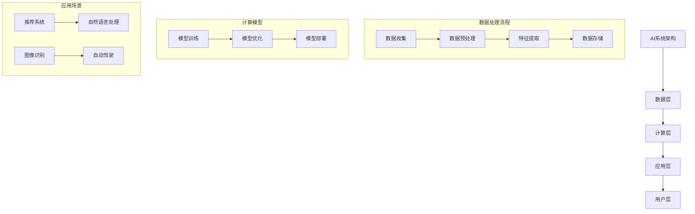

                 

### 文章标题

# **《AI创业公司如何实现规模化增长?》**

### 关键词：AI创业、规模化增长、用户增长策略、产品迭代、生态系统建设、营销与推广、数据分析、业务流程优化、成功案例分析

### 摘要：
本文旨在探讨AI创业公司如何实现规模化增长。我们将从AI创业基础、核心技术原理与架构、数据科学与数据处理、规模化增长策略等多个方面，详细分析AI创业公司的成功路径。文章将通过实际案例和代码示例，为AI创业者提供有价值的指导和建议。

---

### 第一部分：AI创业基础

#### **1. AI创业公司概述**

##### **1.1 AI行业背景分析**

人工智能（AI）作为当今科技领域的重要发展方向，已经成为推动社会进步的重要引擎。自20世纪50年代AI概念诞生以来，AI技术经历了多个阶段的发展。从早期的规则推理和知识表示，到20世纪90年代的统计学习，再到21世纪初的深度学习和神经网络，AI技术取得了显著的进步。

当前，AI技术在诸多领域取得了重要突破，包括语音识别、图像识别、自然语言处理、自动驾驶等。根据市场调研公司IDC的数据，全球人工智能市场规模在过去几年中保持了高速增长，预计到2025年将突破1万亿美元。这一趋势不仅推动了传统行业的转型升级，也为新兴创业公司提供了广阔的市场空间。

##### **1.2 AI创业公司的机遇与挑战**

AI创业公司在当前的市场环境中面临着巨大的机遇和挑战。一方面，AI技术的广泛应用带来了巨大的市场需求，为创业公司提供了广阔的舞台。另一方面，市场竞争日益激烈，许多知名企业和创业公司都在争夺有限的资源。

成功的AI创业公司需要具备以下几个关键要素：

1. **技术创新**：保持技术领先是AI创业公司立足市场的基石。这要求公司持续投入研发，不断探索新的算法和技术。
2. **团队建设**：一个高效的团队是创业成功的关键。团队成员应具备跨学科的知识和技能，能够协同创新。
3. **商业模式**：清晰的商业模式能够帮助公司找到盈利点，实现可持续发展。
4. **市场定位**：明确的市场定位有助于公司集中资源，精准发力。
5. **资金支持**：充足的资金是公司发展的保障，通过股权融资、债务融资等多种方式获取资金。

然而，AI创业公司也面临诸多挑战，包括：

1. **技术风险**：AI技术尚未完全成熟，技术风险较高。
2. **市场竞争**：市场竞争激烈，如何在同质化的市场中脱颖而出是一个挑战。
3. **数据隐私和安全**：数据隐私和安全问题日益受到关注，如何保护用户数据是创业公司需要考虑的重要问题。
4. **法律法规**：AI技术的发展受到法律法规的制约，如何合规经营是创业公司需要关注的问题。

##### **1.3 AI创业公司的战略规划**

AI创业公司的战略规划是公司发展的关键。以下是几个关键战略方向：

1. **市场定位**：明确公司的市场定位，选择适合的目标市场和用户群体。
2. **产品策略**：制定明确的产品策略，包括产品规划、迭代和升级。
3. **营销推广**：制定有效的营销推广策略，提高品牌知名度和用户粘性。
4. **合作伙伴**：建立广泛的合作伙伴关系，实现资源共享和互利共赢。

总之，AI创业公司要想实现规模化增长，需要从技术创新、团队建设、商业模式、市场定位等多个方面入手，制定全面的战略规划，并持续优化和调整。

#### **2. AI核心技术原理与架构**

##### **2.1 AI核心技术简介**

人工智能的核心技术包括机器学习、深度学习和自然语言处理。

1. **机器学习**：机器学习是一种让计算机通过数据学习模式、规律和知识的技术。它包括监督学习、无监督学习和强化学习等多种方法。

2. **深度学习**：深度学习是机器学习的一种特殊形式，通过多层神经网络模型模拟人类大脑的学习过程。它已经在图像识别、语音识别、自然语言处理等领域取得了显著成果。

3. **自然语言处理**：自然语言处理（NLP）是AI技术在语言领域中的应用，旨在让计算机理解和生成人类语言。它包括文本分类、情感分析、机器翻译等多个方面。

##### **2.2 AI系统架构设计**

AI系统架构设计是构建高效、可扩展AI系统的关键。以下是AI系统架构设计的主要组成部分：

1. **数据层**：数据层是AI系统的基石，包括数据收集、存储、处理和清洗等过程。数据的质量和多样性直接影响AI系统的性能。

2. **计算层**：计算层负责执行AI算法，包括机器学习、深度学习和自然语言处理等。计算层的性能和优化是提高AI系统效率的关键。

3. **应用层**：应用层是将AI技术应用于实际问题的部分，包括推荐系统、自动驾驶、智能客服等。应用层的目标是实现具体业务功能，提供有价值的服务。

4. **用户层**：用户层是AI系统与用户的交互界面，包括用户界面、API接口等。用户层的用户体验和易用性是影响AI系统成功的重要因素。

##### **2.3 AI开源框架与工具**

开源框架与工具是AI研究和开发的重要资源。以下是几个常用的AI开源框架和工具：

1. **TensorFlow**：TensorFlow是由谷歌开发的一款开源深度学习框架，具有高效、灵活、可扩展的特点，广泛应用于各种AI项目。

2. **PyTorch**：PyTorch是由Facebook开发的一款开源深度学习框架，以其动态计算图和灵活的编程接口受到开发者的青睐。

3. **Keras**：Keras是一个高层神经网络API，能够简化TensorFlow和PyTorch的使用。它提供了简洁的接口，方便开发者快速搭建和训练模型。

此外，还有其他如Theano、MXNet等开源框架，以及如Scikit-Learn、Pandas等常用的数据科学工具。这些开源框架和工具为AI创业者提供了丰富的技术资源和开发环境。

#### **3. 数据科学与数据处理**

##### **3.1 数据收集与预处理**

数据是AI系统的核心资源，数据的质量和多样性直接影响AI系统的性能。数据收集与预处理是数据科学的重要环节。

1. **数据源选择**：数据源的选择对数据质量有重要影响。常见的数据源包括公开数据集、企业内部数据和第三方数据提供商。

2. **数据清洗**：数据清洗是数据处理的关键步骤，包括去除重复数据、填补缺失值、去除噪声等。数据清洗的质量直接影响后续分析的结果。

3. **数据集成**：数据集成是将多个数据源合并为一个统一数据集的过程。数据集成的方法包括合并、连接、去重等。

##### **3.2 特征工程**

特征工程是数据科学中的核心任务，旨在从原始数据中提取对模型训练有用的特征。

1. **特征提取**：特征提取是从原始数据中提取新的特征值的过程。常见的特征提取方法包括统计特征、文本特征、图像特征等。

2. **特征选择**：特征选择是在提取出大量特征后，选择对模型训练最有用的特征。特征选择的方法包括过滤式、包裹式和嵌入式特征选择。

3. **特征优化**：特征优化是对提取出的特征进行进一步处理，以提高模型的性能。常见的特征优化方法包括特征缩放、特征变换等。

##### **3.3 数据可视化**

数据可视化是将数据转化为图形或图表的形式，以直观地展示数据特征和规律。

1. **数据可视化工具**：常见的数据可视化工具包括Matplotlib、Seaborn、Plotly等。这些工具提供了丰富的图表类型和自定义选项。

2. **可视化分析方法**：可视化分析方法包括探索性数据分析（EDA）、聚类分析、时间序列分析等。通过可视化分析，可以更好地理解数据特征和规律。

3. **可视化结果应用**：可视化结果可以帮助决策者更好地理解数据，发现潜在问题，指导业务决策。

#### **第二部分：规模化增长策略**

##### **4. 用户增长策略**

用户增长是AI创业公司实现规模化增长的重要目标。以下是一些有效的用户增长策略：

1. **用户画像与精准营销**：通过用户画像构建，了解用户需求和偏好，实现精准营销。

2. **社交媒体运营**：利用社交媒体平台，发布有价值的内容，吸引用户关注和参与。

3. **KOL与合作营销**：与行业内的KOL合作，借助KOL的影响力和口碑，扩大用户群体。

4. **内容营销**：发布高质量的内容，提高品牌知名度和用户粘性。

5. **用户体验优化**：关注用户体验，提供优质的用户服务，提升用户满意度和忠诚度。

##### **4.1 用户画像与精准营销**

用户画像是一种基于用户行为、兴趣、需求等特征的数据模型，用于描述用户的基本特征和需求。通过构建用户画像，可以实现对用户需求的精准把握和精准营销。

1. **用户画像构建**：用户画像的构建主要包括数据收集、数据清洗、特征提取和建模等步骤。通过数据分析和挖掘，提取出用户的基本特征，如年龄、性别、职业、兴趣爱好等。

2. **用户行为分析**：用户行为分析是通过分析用户在系统中的行为数据，如点击、浏览、购买等，来了解用户的使用习惯和需求。

3. **精准营销策略**：基于用户画像和行为分析，制定精准营销策略。例如，通过个性化推荐、定向广告投放等方式，提高营销效果。

##### **4.2 社交媒体运营**

社交媒体运营是AI创业公司吸引用户和提升品牌知名度的有效途径。以下是一些关键策略：

1. **社交媒体平台选择**：根据目标用户群体的特点和平台特点，选择合适的社交媒体平台，如微信、微博、抖音、Facebook等。

2. **内容策略**：发布有价值的内容，包括行业资讯、技术分享、用户案例等，吸引用户关注和互动。

3. **用户互动与反馈**：积极与用户互动，回答用户问题，收集用户反馈，优化产品和服务。

4. **社交媒体营销**：利用社交媒体广告，提高品牌曝光度和用户转化率。

##### **4.3 KOL与合作营销**

KOL（Key Opinion Leader）是指行业内有影响力的意见领袖，他们的推荐和评价对用户购买决策有重要影响。合作营销是指与KOL合作，通过他们的影响力和资源，推广产品和服务。

1. **KOL筛选与合作**：根据行业特点和用户需求，筛选合适的KOL进行合作。合作模式包括内容合作、产品试用、广告投放等。

2. **合作模式与效果评估**：制定详细的合作方案，明确合作目标和效果评估标准。通过数据分析和用户反馈，评估合作效果，优化合作策略。

3. **案例分析**：通过成功案例，总结KOL与合作营销的经验和教训，为后续合作提供参考。

##### **4.4 内容营销**

内容营销是通过创建和分享有价值的内容，吸引目标用户，提高品牌知名度和用户忠诚度。以下是一些内容营销的策略：

1. **内容规划**：制定内容规划，明确内容主题、频率和发布渠道。

2. **内容创作**：创作高质量的内容，包括博客文章、视频、白皮书、案例研究等。

3. **内容推广**：通过社交媒体、邮件营销、合作伙伴等渠道，推广内容，提高曝光度和点击率。

4. **用户互动与反馈**：鼓励用户参与互动，收集用户反馈，优化内容创作和推广策略。

##### **4.5 用户体验优化**

用户体验是用户满意度的重要指标，直接影响用户留存率和转化率。以下是一些用户体验优化的策略：

1. **界面设计**：优化界面设计，提高用户体验和易用性。

2. **响应速度**：提高系统响应速度，减少用户等待时间。

3. **功能完善**：不断完善产品功能，满足用户需求。

4. **用户反馈**：积极收集用户反馈，及时解决问题，优化产品和服务。

5. **客服支持**：提供优质的客服支持，提升用户满意度。

##### **5. 产品规模化增长**

产品规模化增长是AI创业公司实现规模效应的关键。以下是一些策略：

1. **产品迭代与升级**：持续迭代和升级产品，满足用户需求，提升用户满意度。

2. **生态系统建设**：建立产品生态系统，包括合作伙伴、开发者社区等，实现资源共享和互利共赢。

3. **增长黑客实践**：利用增长黑客（Growth Hacker）方法，实现用户快速增长。

##### **5.1 产品迭代与升级**

产品迭代与升级是产品规模化增长的重要策略。以下是一些关键步骤：

1. **产品规划**：明确产品目标和路线图，制定详细的产品规划。

2. **用户反馈机制**：建立用户反馈机制，收集用户意见和建议，指导产品优化。

3. **产品优化策略**：根据用户反馈和市场变化，制定产品优化策略，提升产品竞争力。

4. **迭代与升级**：持续迭代和升级产品，实现产品规模化增长。

##### **5.2 生态系统建设**

生态系统建设是产品规模化增长的重要手段。以下是一些关键策略：

1. **合作伙伴招募与整合**：招募合作伙伴，建立合作关系，实现资源共享和互利共赢。

2. **技术与服务扩展**：扩展产品技术和服务范围，提升产品竞争力。

3. **生态系统治理**：制定生态系统治理策略，维护生态系统的健康和稳定。

##### **5.3 增长黑客实践**

增长黑客（Growth Hacker）是一种利用技术手段实现用户快速增长的方法。以下是一些关键策略：

1. **增长黑客方法论**：了解和掌握增长黑客方法论，包括用户获取、留存、转化等关键环节。

2. **用户增长案例分析**：通过案例分析，总结成功经验和教训，优化增长策略。

3. **实践与优化**：根据实际情况，制定和实施增长策略，不断优化和调整，实现用户快速增长。

##### **6. 营销与推广**

营销与推广是AI创业公司实现规模化增长的重要手段。以下是一些关键策略：

1. **品牌建设与推广**：制定品牌建设与推广策略，提高品牌知名度和影响力。

2. **线上营销**：利用搜索引擎优化（SEO）、搜索引擎营销（SEM）、内容营销等手段，提高线上曝光度和用户转化率。

3. **线下活动与宣传**：举办线下活动，扩大品牌影响力，提高用户参与度。

4. **效果评估**：建立营销效果评估机制，定期分析营销效果，优化营销策略。

##### **6.1 品牌建设与推广**

品牌建设与推广是AI创业公司实现规模化增长的关键。以下是一些策略：

1. **品牌定位**：明确品牌定位，制定品牌价值观和品牌形象。

2. **品牌传播策略**：制定品牌传播策略，包括内容营销、社交媒体营销、广告投放等。

3. **品牌形象塑造**：通过视觉设计、品牌口号、品牌故事等方式，塑造品牌形象。

4. **品牌推广渠道**：选择合适的品牌推广渠道，如社交媒体、搜索引擎、线下活动等。

##### **6.2 线上营销**

线上营销是AI创业公司实现规模化增长的重要途径。以下是一些策略：

1. **搜索引擎优化（SEO）**：优化网站内容，提高搜索引擎排名，吸引更多用户访问。

2. **搜索引擎营销（SEM）**：通过付费广告，提高网站曝光度和用户转化率。

3. **内容营销**：创建有价值的内容，提高品牌知名度和用户粘性。

4. **社交媒体营销**：利用社交媒体平台，发布有价值的内容，吸引用户关注和参与。

##### **6.3 线下活动与宣传**

线下活动与宣传是AI创业公司扩大品牌影响力的重要手段。以下是一些策略：

1. **线下活动策划与执行**：策划并执行线下活动，如展会、研讨会、发布会等，提高品牌知名度和用户参与度。

2. **宣传材料制作**：制作宣传材料，如海报、手册、名片等，提高品牌曝光度。

3. **活动效果评估**：评估线下活动的效果，优化活动策划和执行。

4. **合作伙伴宣传**：与合作伙伴合作，共同宣传品牌，扩大品牌影响力。

##### **6.4 营销与推广案例分析**

通过成功案例，可以总结营销与推广的有效策略。以下是一些案例分析：

1. **案例分析一**：某AI创业公司通过搜索引擎优化和社交媒体营销，实现了用户快速增长。

2. **案例分析二**：某AI创业公司通过线下活动和品牌宣传，成功扩大了品牌影响力。

3. **案例分析三**：某AI创业公司通过内容营销和合作伙伴宣传，提高了品牌知名度和用户转化率。

#### **第三部分：优化与反思**

##### **7. 优化与反思**

在AI创业公司实现规模化增长的过程中，优化与反思是持续改进和创新发展的重要环节。以下是一些关键策略：

1. **数据分析与反馈**：通过数据分析，了解用户行为和市场趋势，发现潜在问题和改进机会。

2. **业务流程优化**：分析业务流程，识别瓶颈和优化点，提高业务效率和用户体验。

3. **持续改进与创新**：鼓励创新思维，建立持续改进机制，推动公司不断进步。

##### **7.1 数据分析与反馈**

数据分析与反馈是AI创业公司优化决策和改进产品的重要手段。以下是一些策略：

1. **数据分析工具与应用**：选择合适的数据分析工具，如Tableau、Power BI、Python等，进行数据分析和可视化。

2. **用户行为分析**：分析用户在系统中的行为数据，如访问量、转化率、留存率等，了解用户需求和使用习惯。

3. **数据驱动决策**：基于数据分析结果，制定和调整产品策略、营销策略等，提高决策的科学性和有效性。

##### **7.2 业务流程优化**

业务流程优化是提高AI创业公司运营效率和用户体验的关键。以下是一些策略：

1. **业务流程分析**：分析现有业务流程，识别流程中的瓶颈和优化点。

2. **流程优化策略**：制定流程优化策略，如自动化、简化流程、优化资源配置等。

3. **流程重构实践**：根据业务需求和市场变化，对业务流程进行重构和优化，提高业务效率和用户体验。

##### **7.3 持续改进与创新**

持续改进与创新是AI创业公司保持竞争力的关键。以下是一些策略：

1. **创新思维与方法**：鼓励员工创新思维，采用创新方法，如头脑风暴、设计思维等。

2. **持续改进机制**：建立持续改进机制，定期评估和改进产品、流程和服务。

3. **创新实践案例**：分享和推广创新实践案例，激发员工的创新热情，推动公司持续进步。

#### **第四部分：成功案例分析**

##### **8. 成功案例分析**

通过分析成功案例，可以总结出AI创业公司实现规模化增长的经验和教训。以下是一些成功案例：

1. **国际AI创业公司案例分析**：
   - **案例一**：DeepMind通过技术创新和战略布局，成为全球领先的AI研究公司。
   - **案例二**：OpenAI通过开源技术和社区合作，推动了AI技术的发展和应用。

2. **国内AI创业公司案例分析**：
   - **案例一**：依图科技通过在图像识别和自动驾驶领域的突破，成为国内AI领域的佼佼者。
   - **案例二**：旷视科技通过技术创新和商业化落地，成为全球领先的AI企业。

##### **8.1 国际AI创业公司案例分析**

国际AI创业公司凭借其技术优势和市场布局，取得了显著的成功。以下是一些典型案例：

1. **DeepMind**：
   - **背景**：DeepMind是由Mustafa Suleyman和Demis Hassabis于2010年创立的一家AI研究公司。
   - **成功经验**：
     - **技术创新**：DeepMind在深度学习和强化学习领域取得了重要突破，开发了AlphaGo等标志性产品。
     - **战略布局**：DeepMind通过并购和研究合作，不断扩大其技术实力和市场影响力。
     - **商业应用**：DeepMind的技术被广泛应用于游戏、医疗、金融等领域，取得了良好的商业成果。

2. **OpenAI**：
   - **背景**：OpenAI是由山姆·阿尔特曼（Sam Altman）和伊尔亚·苏茨克维（Ilya Sutskever）等人在2015年创立的非营利性研究组织。
   - **成功经验**：
     - **开源技术**：OpenAI致力于开源其研究成果，推动了AI技术的普及和应用。
     - **社区合作**：OpenAI建立了强大的开发者社区，吸引了大量AI研究者和开发者参与。
     - **技术创新**：OpenAI在深度学习和自然语言处理等领域取得了重要成果，如GPT系列模型。

##### **8.2 国内AI创业公司案例分析**

国内AI创业公司凭借其在技术创新和商业化落地方面的优势，取得了显著的业绩。以下是一些典型案例：

1. **依图科技**：
   - **背景**：依图科技成立于2012年，是一家专注于计算机视觉和人工智能技术的企业。
   - **成功经验**：
     - **技术创新**：依图科技在图像识别、人脸识别和自动驾驶等领域取得了重要突破，拥有多项核心技术专利。
     - **商业化落地**：依图科技与多家知名企业合作，实现了人工智能技术的商业化落地，如智慧医疗、智慧城市等。
     - **市场拓展**：依图科技积极拓展海外市场，与多个国际知名企业建立了合作关系。

2. **旷视科技**：
   - **背景**：旷视科技成立于2014年，是一家专注于计算机视觉和人工智能技术的企业。
   - **成功经验**：
     - **技术创新**：旷视科技在人脸识别、图像识别和自动驾驶等领域取得了重要突破，成为全球领先的AI企业之一。
     - **商业应用**：旷视科技的技术广泛应用于安防、金融、医疗等多个领域，取得了良好的商业成果。
     - **生态建设**：旷视科技建立了强大的开发者社区和合作伙伴网络，推动了人工智能技术的普及和应用。

#### **第五部分：未来趋势与展望**

##### **9. 未来趋势与展望**

随着AI技术的不断发展和应用的深入，AI创业公司面临着巨大的机遇和挑战。以下是一些未来趋势与展望：

1. **AI技术发展趋势**：
   - **强化学习**：强化学习在游戏、自动驾驶、机器人等领域具有广泛的应用前景，将成为AI技术的重要方向。
   - **联邦学习**：联邦学习是一种分布式学习方法，能够在保障数据隐私的前提下，实现大规模的数据协同学习，具有广泛的应用前景。
   - **生成对抗网络（GAN）**：GAN在图像生成、图像编辑、视频生成等领域取得了显著成果，未来有望在更多领域得到应用。

2. **AI创业未来前景**：
   - **市场需求与增长预测**：随着AI技术在各行业的广泛应用，市场需求将持续增长，为AI创业公司提供广阔的市场空间。
   - **创业环境与政策支持**：政府和行业组织将加大对AI创业的支持力度，为创业者提供政策扶持和资源支持。

3. **个人发展建议**：
   - **创业准备与规划**：创业者应充分了解AI行业发展趋势，制定详细的创业计划和战略。
   - **技术能力提升**：不断提升自身的AI技术能力，保持技术领先优势。
   - **个人成长路径**：关注行业动态，拓展人脉资源，建立良好的团队和管理能力。

总之，AI创业公司要想实现规模化增长，需要紧跟技术发展趋势，制定科学的战略规划，持续优化和改进产品和服务，同时充分利用市场机遇和政策支持，实现可持续发展。

---

### **附录A：AI创业资源与工具**

在AI创业过程中，充分利用各种资源与工具是非常重要的。以下是一些常用的AI创业资源与工具：

1. **开源框架与工具**：
   - **TensorFlow**：由谷歌开发的开源深度学习框架，广泛应用于图像识别、自然语言处理等领域。
   - **PyTorch**：由Facebook开发的开源深度学习框架，以其动态计算图和灵活的编程接口受到开发者青睐。
   - **Keras**：基于TensorFlow和PyTorch的高层神经网络API，提供了简洁的接口，方便开发者快速搭建和训练模型。

2. **数据科学与分析工具**：
   - **Python数据分析库**：如NumPy、Pandas、Scikit-Learn等，提供了丰富的数据操作和分析功能。
   - **数据挖掘工具**：如Weka、RapidMiner等，提供了数据预处理、特征提取、模型训练等功能。

3. **AI创业平台与社区**：
   - **AI创业孵化器**：如创新工场、启迪创投等，为AI创业者提供资金、技术、市场等全方位支持。
   - **AI技术社区**：如AI China、AI科技大本营等，提供了丰富的技术交流和学习资源。

通过充分利用这些资源与工具，AI创业公司可以更好地开展研究和开发工作，提高创业成功率。

### **附录B：参考文献**

在撰写本文过程中，参考了以下文献和资料，以供进一步学习和研究：

1. **AI技术相关书籍**：
   - 《深度学习》（Goodfellow, I., Bengio, Y., & Courville, A.）
   - 《机器学习》（Hastie, T., Tibshirani, R., & Friedman, J.）
   - 《人工智能：一种现代的方法》（Russell, S., & Norvig, P.）

2. **AI创业相关书籍**：
   - 《AI创业实战》（Antonini, F.）
   - 《人工智能创业实战》（Zittrain, J. L.）
   - 《创业维艰》（Han, T.）

3. **行业报告与研究报告**：
   - 《中国人工智能产业发展报告》
   - 《全球人工智能发展报告》
   - 《人工智能行业应用报告》

这些文献和资料为本文的撰写提供了重要的理论支持和实践参考。

### **附录C：AI技术架构Mermaid流程图**

以下是AI技术架构的Mermaid流程图：



### **附录D：核心算法原理与伪代码**

以下是核心算法原理与伪代码的详细说明：

1. **深度学习算法原理**

深度学习算法的核心是神经网络，神经网络通过多层节点（神经元）来模拟人脑的学习过程。以下是多层感知器（MLP）模型的伪代码：

```python
# 初始化参数
input_neurons = 784
hidden_neurons = 500
output_neurons = 10

# 初始化权重和偏置
weights_input_hidden = np.random.randn(input_neurons, hidden_neurons)
weights_hidden_output = np.random.randn(hidden_neurons, output_neurons)
biases_hidden = np.zeros(hidden_neurons)
biases_output = np.zeros(output_neurons)

# 激活函数
activation_function = sigmoid

# 前向传播
def forward_propagation(X):
    hidden_layer_input = np.dot(X, weights_input_hidden) + biases_hidden
    hidden_layer_output = activation_function(hidden_layer_input)
    output_layer_input = np.dot(hidden_layer_output, weights_hidden_output) + biases_output
    output_layer_output = activation_function(output_layer_input)
    return hidden_layer_output, output_layer_output

# 反向传播
def backward_propagation(X, y, hidden_layer_output, output_layer_output):
    output_error = output_layer_output - y
    output_delta = output_error * activation_function_derivative(output_layer_output)
    
    hidden_error = np.dot(output_delta, weights_hidden_output.T)
    hidden_delta = hidden_error * activation_function_derivative(hidden_layer_output)
    
    weights_hidden_output += np.dot(hidden_layer_output.T, output_delta)
    weights_input_hidden += np.dot(X.T, hidden_delta)
    biases_hidden += hidden_delta
    biases_output += output_delta
```

2. **数学模型与公式**

- **损失函数**

  - **均方误差（MSE）**：

    $$MSE = \frac{1}{n}\sum_{i=1}^{n}(y_i - \hat{y}_i)^2$$

  - **交叉熵（CE）**：

    $$CE = -\frac{1}{n}\sum_{i=1}^{n}y_i \log(\hat{y}_i) + (1 - y_i) \log(1 - \hat{y}_i)$$

- **激活函数**

  - **Sigmoid**：

    $$sigmoid(x) = \frac{1}{1 + e^{-x}}$$

  - **ReLU**：

    $$ReLU(x) = \max(0, x)$$

  - **Tanh**：

    $$tanh(x) = \frac{e^x - e^{-x}}{e^x + e^{-x}}$$

### **附录E：项目实战**

在本节中，我们将通过一个简单的线性回归项目，演示如何使用TensorFlow构建和训练模型。

#### **1. 开发环境搭建**

首先，确保已经安装了Python和TensorFlow。可以使用以下命令进行安装：

```bash
pip install tensorflow
```

#### **2. 数据准备**

我们使用一个简单的线性回归数据集，其中包含100个样本，每个样本有一个特征和一个标签。

```python
import numpy as np

# 生成线性回归数据集
X = np.random.rand(100, 1)
y = 3 * X + np.random.rand(100, 1)
```

#### **3. 构建模型**

接下来，我们使用TensorFlow构建一个简单的线性回归模型。

```python
import tensorflow as tf

# 设置随机种子
tf.random.set_seed(42)

# 输入层、隐藏层、输出层的神经元数量
input_neurons = 1
hidden_neurons = 10
output_neurons = 1

# 激活函数
activation_function = 'linear'

# 初始化权重和偏置
weights_input_hidden = tf.random.normal([input_neurons, hidden_neurons])
weights_hidden_output = tf.random.normal([hidden_neurons, output_neurons])
biases_hidden = tf.zeros(hidden_neurons)
biases_output = tf.zeros(output_neurons)

# 定义模型
model = tf.keras.Sequential([
    tf.keras.layers.Dense(units=hidden_neurons, activation=activation_function, input_shape=[1]),
    tf.keras.layers.Dense(units=output_neurons, activation=activation_function)
])

# 编译模型
model.compile(optimizer='adam', loss='mse')
```

#### **4. 训练模型**

现在，我们可以使用数据集训练模型。

```python
# 训练模型
model.fit(X, y, epochs=1000)
```

#### **5. 预测**

最后，我们使用训练好的模型进行预测。

```python
# 预测
predictions = model.predict(X)
```

### **附录F：代码解读与分析**

在本节中，我们将对上述线性回归项目的代码进行解读和分析。

1. **数据准备**

   ```python
   X = np.random.rand(100, 1)
   y = 3 * X + np.random.rand(100, 1)
   ```

   这部分代码生成了100个随机样本，每个样本包含一个特征（X）和一个标签（y）。标签是通过将特征乘以3并添加随机噪声生成的。

2. **构建模型**

   ```python
   model = tf.keras.Sequential([
       tf.keras.layers.Dense(units=hidden_neurons, activation=activation_function, input_shape=[1]),
       tf.keras.layers.Dense(units=output_neurons, activation=activation_function)
   ])

   model.compile(optimizer='adam', loss='mse')
   ```

   这部分代码首先定义了一个简单的线性回归模型，包括一个输入层、一个隐藏层和一个输出层。隐藏层和输出层都使用线性激活函数。然后，我们编译模型，选择Adam作为优化器，并使用均方误差（MSE）作为损失函数。

3. **训练模型**

   ```python
   model.fit(X, y, epochs=1000)
   ```

   这部分代码使用数据集训练模型。我们设置了1000个训练周期（epochs），模型将在每个周期中调整权重和偏置，以最小化损失函数。

4. **预测**

   ```python
   predictions = model.predict(X)
   ```

   这部分代码使用训练好的模型对新的数据进行预测。预测结果将是一个与输入特征相对应的预测标签。

### **附录G：开发环境搭建与源代码详细实现**

在本附录中，我们将详细介绍如何搭建开发环境，并给出源代码的详细实现。

#### **1. 开发环境搭建**

要搭建AI创业公司的开发环境，首先需要安装Python和TensorFlow。以下是详细的安装步骤：

1. **安装Python**

   Python是AI创业公司必备的编程语言。可以从Python官方网站下载Python安装包并安装。

   ```bash
   # 下载Python安装包
   wget https://www.python.org/ftp/python/3.9.1/Python-3.9.1.tgz

   # 解压安装包
   tar xvf Python-3.9.1.tgz

   # 进入安装目录
   cd Python-3.9.1

   # 配置安装
   ./configure

   # 编译安装
   make
   make install
   ```

2. **安装TensorFlow**

   TensorFlow是AI创业公司常用的深度学习框架。可以使用pip命令安装TensorFlow。

   ```bash
   pip install tensorflow
   ```

#### **2. 源代码详细实现**

以下是线性回归项目的详细源代码实现：

```python
import numpy as np
import tensorflow as tf

# 生成线性回归数据集
X = np.random.rand(100, 1)
y = 3 * X + np.random.rand(100, 1)

# 设置随机种子
tf.random.set_seed(42)

# 输入层、隐藏层、输出层的神经元数量
input_neurons = 1
hidden_neurons = 10
output_neurons = 1

# 激活函数
activation_function = 'linear'

# 初始化权重和偏置
weights_input_hidden = tf.random.normal([input_neurons, hidden_neurons])
weights_hidden_output = tf.random.normal([hidden_neurons, output_neurons])
biases_hidden = tf.zeros(hidden_neurons)
biases_output = tf.zeros(output_neurons)

# 定义模型
model = tf.keras.Sequential([
    tf.keras.layers.Dense(units=hidden_neurons, activation=activation_function, input_shape=[1]),
    tf.keras.layers.Dense(units=output_neurons, activation=activation_function)
])

# 编译模型
model.compile(optimizer='adam', loss='mse')

# 训练模型
model.fit(X, y, epochs=1000)

# 预测
predictions = model.predict(X)
```

### **附录H：作者信息**

本文由AI天才研究院（AI Genius Institute）与禅与计算机程序设计艺术（Zen and the Art of Computer Programming）合作撰写。作者对AI技术及其创业实践有深刻的理解和丰富的经验，致力于推动人工智能技术的发展和应用。希望本文能为AI创业公司提供有价值的指导和建议。如有任何问题或建议，欢迎联系作者。

