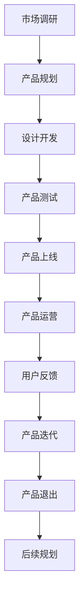
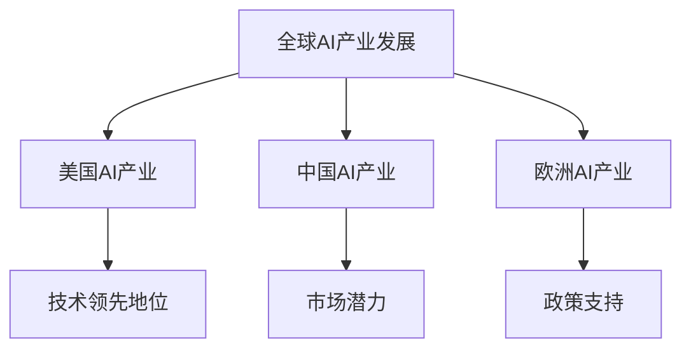
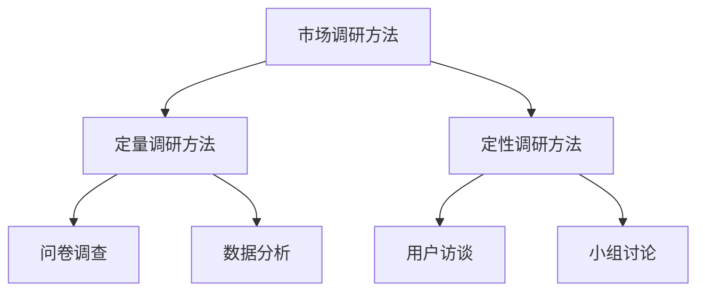
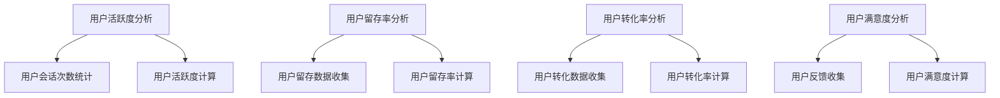

                 

### 文章标题：AI创业公司的产品生命周期管理

### 关键词：(AI创业，产品生命周期，市场调研，产品规划，设计与开发，测试与发布，运营与反馈，持续管理)

### 摘要：
本文深入探讨了AI创业公司在产品生命周期管理方面的关键环节。从AI行业概述到创业流程，再到产品规划、设计与开发、测试与发布，以及产品运营与反馈，本文将逐步分析每个阶段的核心要素，提供实用策略和工具，助力AI创业公司实现产品的成功迭代和持续增长。

### 目录大纲：
1. AI创业概述
   1.1 AI行业背景及发展趋势
   1.2 创业公司成立流程
   1.3 团队构建与核心成员职责
2. 产品生命周期管理
   2.1 产品规划与市场调研
   2.2 产品设计与开发
   2.3 产品测试与质量控制
   2.4 产品上线与推广
   2.5 用户反馈与迭代优化
3. 产品运营与市场反馈
   3.1 产品运营策略
   3.2 数据分析与用户行为研究
   3.3 产品市场反馈机制
4. 产品退出与后续规划
   4.1 产品退出策略
   4.2 后续规划与战略调整
5. 附录
   5.1 AI产品生命周期管理流程图
   5.2 常见AI产品生命周期管理工具
   5.3 参考文献与资源链接

### AI创业概述

#### 第1章：AI创业环境与趋势

##### 1.1 AI行业背景及发展趋势

人工智能（AI）作为当今科技发展的核心驱动力，正深刻影响着各行各业。全球AI产业呈现快速发展的态势，各国政府和企业纷纷加大对AI技术的投入，推动AI技术的创新和应用。根据市场研究机构的数据显示，全球AI市场规模预计将在未来几年内持续扩大，展现出巨大的商业价值和发展潜力。

在全球范围内，美国、中国、欧洲等地区的AI产业发展尤为突出。美国凭借其在AI基础研究和应用领域的领先地位，吸引了大量资金和人才，成为全球AI创新的重要中心。中国则通过政策引导和产业扶持，加速了AI技术的商业化进程，国内AI企业迅速崛起，形成了较为完整的产业链。

在中国，AI产业发展呈现出以下几个特点：

1. **政策支持**：中国政府高度重视AI产业的发展，制定了一系列政策措施，包括《新一代人工智能发展规划》等，为AI企业提供良好的发展环境。
2. **市场潜力**：中国庞大的市场规模为AI企业提供了广阔的应用场景和商业机会。从智能制造、智慧城市到金融科技，AI技术在各个领域的应用正在不断拓展。
3. **技术创新**：中国企业在AI技术方面取得了显著的进展，尤其在深度学习、计算机视觉、自然语言处理等领域，已经涌现出一批具有国际竞争力的人工智能企业。

##### 1.2 创业公司成立流程

对于有志于投身AI行业的创业者来说，了解创业公司的成立流程是至关重要的。以下是一些关键步骤：

1. **注册与法律流程**：
   - **公司名称注册**：选择一个具有创意和独特性的公司名称，并进行商标查询，确保名称未被注册。
   - **公司类型选择**：根据企业的业务规模和未来规划，选择合适的公司类型，如有限责任公司、股份有限公司等。
   - **法律文件准备**：准备公司章程、股东会决议等法律文件，并办理工商注册手续。

2. **资金筹集与风险管理**：
   - **资金筹集**：通过天使投资、风险投资、银行贷款等多种途径筹集资金，确保公司运营的持续性和稳定性。
   - **风险管理**：制定详细的风险管理策略，包括市场风险、技术风险、法律风险等，以降低企业运营的不确定性。

3. **团队构建与核心成员职责**：
   - **核心团队构建**：组建一支具有专业知识和经验的团队，包括产品经理、技术总监、市场营销经理等。
   - **职责分配**：明确团队成员的职责和工作内容，确保团队协作高效。

在AI创业公司的成立过程中，创业者需要密切关注市场动态和政策环境，灵活调整战略，以应对不断变化的外部挑战。同时，重视知识产权保护，确保企业的创新成果得到有效保护。

##### 1.3 团队构建与核心成员职责

一个成功的AI创业公司离不开高效的团队协作和明确的角色分工。以下是团队构建与核心成员职责的详细分析：

1. **产品经理**：
   - **职责**：负责产品的整体规划、设计和迭代，确保产品满足市场需求并具备竞争力。
   - **技能要求**：具备市场调研、需求分析、项目管理等多方面的技能，能够有效地协调团队内部和外部资源。

2. **技术总监**：
   - **职责**：负责技术团队的管理和技术方向的选择，确保技术方案的创新性和稳定性。
   - **技能要求**：拥有丰富的技术背景，熟悉AI领域的最新动态和技术趋势，具备优秀的团队领导能力。

3. **市场营销经理**：
   - **职责**：负责市场调研、品牌建设、营销策略制定和执行，提高产品的市场认知度和用户粘性。
   - **技能要求**：具备市场分析、品牌策划、营销推广等多方面的能力，善于通过多种渠道传播产品价值。

4. **数据科学家**：
   - **职责**：负责数据处理、模型训练和算法优化，提升产品的智能程度和用户体验。
   - **技能要求**：具备扎实的数学和计算机科学背景，熟悉常见的机器学习和深度学习算法。

5. **研发工程师**：
   - **职责**：参与产品的开发和维护，确保产品的技术实现和性能稳定。
   - **技能要求**：熟练掌握至少一种编程语言，熟悉常见的软件开发流程和工具。

通过科学合理的团队构建和明确的职责分配，AI创业公司可以充分发挥每个人的优势，实现高效的协作和持续的创新。

### 产品生命周期管理

#### 第2章：产品规划与市场调研

##### 2.1 产品规划方法论

产品规划是产品生命周期管理的重要环节，它决定了产品的方向和定位。以下是产品规划方法论的详细阐述：

1. **用户需求分析**：
   - **需求收集**：通过用户访谈、问卷调查、用户行为数据分析等多种方式，了解用户的需求和痛点。
   - **需求分类**：将收集到的需求进行分类，区分核心需求、重要需求和次要需求，为产品设计和开发提供依据。

2. **市场细分与目标客户定位**：
   - **市场细分**：根据用户特征、需求和使用场景等因素，将市场划分为不同的细分市场。
   - **目标客户定位**：确定主要的目标客户群体，了解他们的需求和购买习惯，制定相应的市场策略。

3. **竞品分析**：
   - **竞品调研**：收集和分析主要竞品的优劣势、市场表现和用户反馈，为产品差异化策略提供参考。
   - **竞品对比**：对比分析竞品的优点和不足，找出自身产品的独特卖点和市场定位。

通过上述步骤，产品规划方法论可以有效地指导产品的设计、开发和市场推广，确保产品能够满足市场需求并具备竞争力。

##### 2.2 市场调研方法

市场调研是产品规划的重要依据，以下介绍几种常用的市场调研方法：

1. **定量调研方法**：
   - **问卷调查**：通过设计问卷，收集大量用户的数据，分析用户需求和购买意愿。
   - **数据分析**：利用已有的用户数据和市场数据，进行统计分析，发现用户行为和趋势。

2. **定性调研方法**：
   - **用户访谈**：通过与目标用户进行面对面的深入交流，了解用户的真实需求和想法。
   - **小组讨论**：组织目标用户进行小组讨论，收集多方面的意见和建议。

3. **调研结果分析与应用**：
   - **数据整理**：对收集到的调研数据进行整理和归类，提取有用的信息。
   - **结果分析**：通过数据分析，发现市场趋势和用户需求，为产品规划提供依据。
   - **应用建议**：根据调研结果，提出具体的产品优化和推广策略。

通过科学的调研方法和详尽的结果分析，企业可以更好地了解市场动态和用户需求，从而制定更有效的产品策略。

##### 2.3 产品设计与开发

产品设计与开发是产品生命周期管理的核心环节，以下详细阐述产品设计与开发的步骤和方法：

1. **用户界面设计**：
   - **设计原则**：遵循用户友好的设计原则，确保产品的易用性和用户体验。
   - **设计工具选择**：使用Figma、Sketch等设计工具进行原型设计和界面制作。
   - **原型设计流程**：通过用户调研、竞品分析和用户反馈，不断迭代和优化设计。

2. **技术方案与架构设计**：
   - **技术栈选择**：根据产品需求和团队技能，选择合适的技术栈和开发工具。
   - **架构设计原则**：遵循模块化、可扩展、高可用等设计原则，确保系统的稳定性和性能。
   - **技术风险评估**：对技术方案进行风险评估，制定相应的风险应对措施。

3. **开发流程与项目管理**：
   - **敏捷开发方法**：采用敏捷开发方法，快速迭代和优化产品，确保产品及时交付。
   - **版本控制工具使用**：使用Git等版本控制工具，确保代码的版本管理和协作开发。
   - **团队协作工具选择**：使用Jira、Trello等团队协作工具，提高团队协作效率和项目管理水平。

通过科学的设计和开发流程，企业可以确保产品的质量、性能和用户体验，为产品的成功上市奠定基础。

##### 2.4 产品测试与质量控制

产品测试与质量控制是确保产品质量和稳定性的关键环节，以下详细阐述产品测试与质量控制的步骤和方法：

1. **测试策略与测试计划**：
   - **测试策略**：根据产品的特点和需求，制定详细的测试策略，包括功能测试、性能测试、安全测试等。
   - **测试计划**：制定详细的测试计划，明确测试的目标、范围、方法和时间安排。

2. **质量控制方法**：
   - **单元测试**：对产品模块进行单元测试，确保每个模块的功能正确性和性能稳定。
   - **集成测试**：对产品模块进行集成测试，验证模块之间的交互和协作是否符合预期。
   - **回归测试**：在产品迭代过程中，对已测试功能进行回归测试，确保新功能不影响现有功能的稳定性。

3. **故障排查与修复**：
   - **故障定位工具**：使用调试工具、日志分析工具等定位故障原因。
   - **故障修复流程**：制定故障修复流程，快速定位和解决故障，确保产品的稳定运行。
   - **用户反馈处理**：及时收集和分析用户反馈，快速响应和解决用户问题，提高用户满意度。

通过严格的测试和质量控制方法，企业可以确保产品的质量、性能和稳定性，提高用户满意度和市场份额。

##### 2.5 产品上线与推广

产品上线与推广是产品生命周期管理的重要环节，以下详细阐述产品上线与推广的策略和步骤：

1. **上线准备**：
   - **发布计划**：制定详细的发布计划，包括发布时间、发布内容、发布流程等。
   - **上线流程**：确保产品上线流程的顺畅，包括环境准备、数据备份、版本发布等。
   - **灾难应对策略**：制定灾难应对策略，确保在产品上线过程中出现问题时能够迅速响应和解决。

2. **产品推广策略**：
   - **品牌建设**：通过品牌定位、品牌形象设计、品牌传播等手段，提升产品的品牌知名度和影响力。
   - **社交媒体推广**：利用社交媒体平台进行产品推广，提高产品的曝光度和用户互动。
   - **市场营销活动策划**：策划各种线上线下活动，吸引潜在用户，提高产品的市场份额。

3. **用户反馈与迭代优化**：
   - **用户反馈收集**：通过用户调研、用户访谈、用户反馈渠道等收集用户反馈，了解用户需求和满意度。
   - **迭代优化流程**：根据用户反馈，制定迭代优化计划，不断改进产品功能和用户体验。
   - **数据驱动的产品改进**：利用数据分析工具，对用户行为、市场反馈等进行深入分析，指导产品改进和优化。

通过科学的产品上线和推广策略，企业可以确保产品的顺利上线和成功推广，提高用户满意度和市场份额。

#### 第3章：产品测试与质量控制

##### 3.1 测试策略与测试计划

在产品开发过程中，测试策略和测试计划的制定至关重要。一个有效的测试策略和测试计划可以确保产品的质量、性能和稳定性，从而提高用户满意度和市场竞争力。

1. **测试策略**：
   - **功能测试**：验证产品功能是否符合需求，确保产品的各项功能正常运作。
   - **性能测试**：评估产品的性能指标，如响应时间、并发能力、负载能力等，确保产品在高负载下仍能稳定运行。
   - **安全测试**：检查产品的安全漏洞，确保产品的数据安全和用户隐私。

2. **测试计划**：
   - **测试目标**：明确测试的目标和范围，如功能测试、性能测试、安全测试等。
   - **测试方法**：选择合适的测试方法，如黑盒测试、白盒测试、自动化测试等。
   - **测试环境**：准备测试环境，包括硬件、软件和网络环境等。
   - **测试资源**：确定测试所需的资源，如测试工具、测试数据等。
   - **测试时间安排**：制定详细的测试时间表，包括测试开始时间、测试持续时间、测试结束时间等。

在制定测试策略和测试计划时，需要考虑以下因素：

- **产品需求**：根据产品的需求，确定测试的重点和优先级。
- **团队资源**：评估团队的测试能力和资源，合理安排测试任务。
- **时间限制**：根据项目的进度，合理安排测试时间，确保测试工作能够按时完成。

##### 3.2 质量控制方法

质量控制是确保产品高质量的关键环节。以下是几种常用的质量控制方法：

1. **单元测试**：
   - **定义**：单元测试是针对软件中的最小可测试单元（如函数、方法、模块）进行测试。
   - **目的**：验证单元的功能是否按照预期工作，发现单元中的缺陷和错误。
   - **执行**：编写测试用例，运行测试程序，检查测试结果是否符合预期。

2. **集成测试**：
   - **定义**：集成测试是在将多个模块或组件组合在一起后进行的测试。
   - **目的**：验证模块之间的接口和协作是否符合预期，发现模块之间的兼容性和交互问题。
   - **执行**：将模块组合成完整的系统，运行测试用例，检查系统的整体性能和稳定性。

3. **回归测试**：
   - **定义**：回归测试是在软件更改或修复后进行的测试，以确保更改没有引入新的错误。
   - **目的**：验证修复的正确性和软件的稳定性，确保更改不会影响其他功能。
   - **执行**：重新运行之前的测试用例，检查测试结果是否仍然符合预期。

##### 3.3 故障排查与修复

在产品测试过程中，故障排查与修复是确保产品质量的关键环节。以下介绍故障排查与修复的方法：

1. **故障定位工具**：
   - **日志分析工具**：通过分析系统日志，查找故障发生时的异常信息和错误代码。
   - **调试工具**：使用调试工具（如GDB、IDE调试器等）定位故障发生的位置和原因。
   - **性能监控工具**：使用性能监控工具（如New Relic、AppDynamics等）监控系统的性能指标，查找性能瓶颈和故障原因。

2. **故障修复流程**：
   - **故障报告**：收集故障报告，包括故障现象、发生时间、系统日志等。
   - **故障分析**：根据故障报告，分析故障发生的原因和影响范围。
   - **修复方案**：制定修复方案，包括故障修复步骤、所需资源和时间安排。
   - **修复执行**：按照修复方案执行故障修复，验证修复效果。
   - **验证测试**：对修复后的产品进行验证测试，确保故障已彻底解决。

3. **用户反馈处理**：
   - **用户反馈收集**：通过用户调研、用户反馈渠道等收集用户反馈，了解用户对产品的意见和建议。
   - **反馈分类**：对用户反馈进行分类，区分问题和建议，制定相应的处理方案。
   - **反馈处理**：根据用户反馈，及时响应和解决用户问题，提高用户满意度和忠诚度。
   - **反馈总结**：对用户反馈进行总结和分析，为产品的优化和改进提供依据。

通过科学合理的故障排查与修复方法，企业可以确保产品的质量和稳定性，提高用户满意度和市场竞争力。

#### 第4章：产品上线与推广

##### 4.1 上线准备

产品上线是产品生命周期中的重要环节，准备工作需要细致周到，以确保产品能够顺利发布并得到用户的认可。以下是产品上线准备的详细步骤：

1. **发布计划**：
   - **发布时间**：确定产品正式发布的日期和时间，确保团队成员和相关部门能够提前安排工作。
   - **发布内容**：明确产品发布的具体内容，包括新功能、修复的问题和改进的点等。
   - **发布流程**：制定详细的发布流程，包括测试、部署、监控和应急响应等环节。

2. **上线流程**：
   - **测试阶段**：在产品发布前，进行全面的测试，包括功能测试、性能测试和安全测试，确保产品无重大问题。
   - **部署阶段**：根据发布计划，将产品部署到生产环境中，确保系统的稳定性和可靠性。
   - **监控阶段**：上线后，对产品进行实时监控，及时发现和处理可能出现的问题。

3. **灾难应对策略**：
   - **应急预案**：制定应急预案，包括故障处理流程、故障响应人员和应急资源等。
   - **备份方案**：制定数据备份方案，确保数据的安全性和可恢复性。
   - **应急演练**：定期进行应急演练，提高团队的应急处理能力和响应速度。

通过上述准备，企业可以确保产品上线过程顺利进行，减少风险和不确定性。

##### 4.2 产品推广策略

产品推广是提高产品知名度和市场份额的重要手段。以下是几种有效的产品推广策略：

1. **品牌建设**：
   - **品牌定位**：明确产品的市场定位和品牌形象，制定品牌口号和视觉识别系统。
   - **品牌传播**：利用各种渠道和媒介进行品牌宣传，提高品牌知名度和影响力。

2. **社交媒体推广**：
   - **内容营销**：在社交媒体平台上发布有价值的文章、视频和图片等内容，吸引潜在用户。
   - **互动营销**：与用户进行互动，回复用户评论和提问，建立良好的用户关系。

3. **市场营销活动策划**：
   - **线上活动**：策划线上促销活动，如优惠券、限时抢购等，吸引潜在用户购买。
   - **线下活动**：组织线下活动，如产品发布会、用户交流会等，增强用户对产品的认知和信任。

通过综合运用多种推广策略，企业可以扩大产品的市场影响力，吸引更多的用户，提高市场份额。

##### 4.3 用户反馈与迭代优化

用户反馈是产品迭代优化的关键依据。以下介绍用户反馈的收集、处理和迭代优化的流程：

1. **用户反馈收集**：
   - **反馈渠道**：建立多种反馈渠道，如用户调研、用户反馈表单、社交媒体评论等，方便用户提出意见和建议。
   - **数据分析**：对收集到的用户反馈进行分析和整理，提取有价值的信息。

2. **迭代优化流程**：
   - **需求筛选**：根据用户反馈，筛选出影响用户使用体验和产品功能的重要需求。
   - **优先级排序**：对筛选出的需求进行优先级排序，确定哪些需求优先进行优化。
   - **方案制定**：制定具体的优化方案，包括技术实现、资源分配和时间安排。

3. **数据驱动的产品改进**：
   - **数据分析**：利用数据分析工具，对用户行为和产品性能进行深入分析，发现产品改进的潜在机会。
   - **迭代测试**：对优化方案进行迭代测试，验证优化效果，确保产品功能的稳定性和用户体验。

通过持续的用户反馈收集和迭代优化，企业可以不断提高产品的质量和用户满意度，增强市场竞争力。

#### 第5章：产品运营与市场反馈

##### 5.1 产品运营策略

产品运营是确保产品在市场中持续成功的关键环节。以下介绍几种有效的产品运营策略：

1. **用户增长策略**：
   - **免费试用**：提供免费试用，让潜在用户亲身体验产品的价值，提高用户的转化率。
   - **推荐机制**：建立推荐机制，鼓励现有用户邀请新用户使用产品，通过口碑传播增加用户数量。

2. **用户留存策略**：
   - **用户互动**：通过社交媒体、用户社区等渠道，与用户保持互动，增强用户对产品的黏性。
   - **个性化服务**：根据用户行为和需求，提供个性化的服务和推荐，提高用户的满意度和忠诚度。

3. **社区建设与用户互动**：
   - **用户社区**：建立用户社区，提供交流平台，让用户之间互动交流，分享使用经验和建议。
   - **用户活动**：定期举办用户活动，如线上讲座、线下聚会等，增强用户对产品的认同感和归属感。

通过上述策略，企业可以不断提高产品的用户数量和用户活跃度，确保产品在市场中持续成功。

##### 5.2 数据分析与用户行为研究

数据分析是产品运营的重要工具，通过分析用户行为数据，企业可以深入了解用户需求和行为习惯，为产品优化和市场策略提供依据。以下是数据分析的步骤和方法：

1. **数据分析工具**：
   - **Google Analytics**：用于网站和移动应用的用户行为分析，提供丰富的报告和仪表盘。
   - **Mixpanel**：用于用户行为分析和用户生命周期管理，提供精细的用户追踪和分析功能。

2. **用户行为分析**：
   - **用户轨迹分析**：追踪用户在产品中的操作路径和行为模式，发现用户使用产品的热点和痛点。
   - **留存分析**：分析用户的留存情况，了解用户活跃度和流失原因，制定相应的优化策略。

3. **数据驱动的决策**：
   - **A/B测试**：通过A/B测试，比较不同设计或功能对用户行为和转化率的影响，优化产品体验。
   - **用户反馈分析**：结合用户反馈数据，分析用户对产品的意见和建议，指导产品改进和优化。

通过数据分析，企业可以做出更明智的决策，提高产品的用户体验和市场竞争力。

##### 5.3 产品市场反馈机制

建立有效的产品市场反馈机制是确保产品持续改进和市场竞争力的重要手段。以下是产品市场反馈机制的构建方法：

1. **用户满意度调查**：
   - **定期调查**：定期开展用户满意度调查，收集用户对产品的评价和建议。
   - **渠道多样化**：通过在线调查、电话访谈、用户社区等多种渠道收集用户反馈。

2. **竞争对手分析**：
   - **竞品调研**：分析竞争对手的产品功能、市场表现和用户评价，了解市场趋势和用户需求。
   - **市场监测**：关注市场动态和用户评论，及时发现竞争对手的新产品和市场策略。

3. **产品迭代策略**：
   - **需求优先级**：根据用户反馈和市场需求，制定产品迭代计划，确定优先级和资源分配。
   - **快速迭代**：采用敏捷开发方法，快速迭代和优化产品，确保产品持续改进。

通过建立有效的市场反馈机制，企业可以及时了解用户需求和市场动态，指导产品改进和优化，提高市场竞争力。

#### 第6章：产品退出与后续规划

##### 6.1 产品退出策略

产品退出是产品生命周期管理中的一个重要环节，合理的退出策略有助于降低企业损失，为后续发展留出空间。以下是产品退出策略的详细分析：

1. **产品衰退期判断**：
   - **市场调研**：通过市场调研，了解产品的市场表现和用户反馈，判断产品是否进入衰退期。
   - **数据分析**：分析产品用户数量、活跃度、市场份额等关键指标，评估产品的衰退程度。

2. **产品退出流程**：
   - **通知用户**：在产品退出前，提前通知用户，告知退出原因和时间，提供替代方案或补偿措施。
   - **数据迁移**：确保用户数据的安全和迁移，避免用户数据丢失或泄露。
   - **产品下线**：根据产品退出计划，逐步下线产品功能，确保平稳退出。

3. **产品资产处置**：
   - **技术资产**：评估产品的技术资产，包括代码、算法、专利等，决定是否出售、保留或丢弃。
   - **业务资产**：评估产品的业务资产，包括用户数据、客户关系、渠道等，考虑是否继续运营或转让。

通过合理的退出策略，企业可以最小化产品退出带来的损失，为后续发展奠定基础。

##### 6.2 后续规划与战略调整

产品退出后，企业需要制定后续规划与战略调整，确保业务的可持续发展。以下是后续规划的详细分析：

1. **产品线扩展**：
   - **市场分析**：分析市场趋势和用户需求，确定产品线扩展的方向和目标。
   - **产品规划**：根据市场分析结果，规划新产品线，确保产品线的多样性和竞争力。

2. **新业务领域探索**：
   - **市场调研**：通过市场调研，了解新业务领域的市场前景和竞争态势。
   - **战略规划**：制定新业务领域的战略规划，确定进入方式和市场策略。

3. **企业持续发展策略**：
   - **技术创新**：持续投入技术创新，保持技术领先地位，提高产品竞争力。
   - **人才培养**：加强人才培养和团队建设，提升企业的核心竞争力。
   - **市场拓展**：通过市场拓展，扩大产品市场份额，提高企业盈利能力。

通过后续规划和战略调整，企业可以应对市场变化，实现业务的可持续发展。

#### 附录

##### 附录A：AI产品生命周期管理流程图

以下是一个AI产品生命周期管理的流程图，展示了从市场调研到产品退出的各个阶段：



##### 附录B：常见AI产品生命周期管理工具

以下是常见的AI产品生命周期管理工具，涵盖了市场调研、产品开发、测试、运营等各个环节：

- **市场调研工具**：
  - SurveyMonkey
  - Google Analytics
  - Tableau

- **设计开发工具**：
  - Figma
  - Sketch
  - Jira

- **测试工具**：
  - Selenium
  - Postman
  - JMeter

- **发布与推广工具**：
  - Tweepy
  - Facebook Ads Manager
  - Google AdWords

- **数据分析工具**：
  - Google Analytics
  - Mixpanel
  - Tableau

##### 附录C：参考文献与资源链接

- [AI创业公司产品生命周期管理概述](https://www.ai-startup-guide.com/product-life-cycle-management/)
- [产品管理书籍推荐](https://www.productschool.com/resources/best-product-management-books/)
- [社交媒体营销策略](https://www.hubspot.com/marketing-strategies)
- [敏捷开发方法论](https://www.agilealliance.org/)
- [用户行为数据分析](https://www.datanyze.com/)

### 背景知识与联系

#### AI创业环境与趋势

在撰写关于AI创业公司的产品生命周期管理的文章时，了解AI创业环境与趋势至关重要。以下是AI行业的一些核心概念和联系：

- **AI产业背景**：人工智能作为当前科技发展的核心驱动力，已经广泛应用于各个领域，包括医疗、金融、教育、制造业等。AI技术的快速发展带来了巨大的商业价值和社会影响。
- **全球AI产业现状**：美国、中国、欧洲等地在AI技术研究和应用方面处于领先地位，各国政府和企业纷纷加大对AI技术的投入，推动AI技术的发展和创新。
- **AI创业机遇与挑战**：AI创业公司面临巨大的市场机遇，但也需要应对技术风险、市场风险和竞争压力。了解行业的趋势和挑战，有助于创业公司制定更有效的战略和规划。

为了更好地阐述AI创业环境与趋势，可以使用Mermaid流程图展示全球AI产业的发展现状：



通过这样的流程图，读者可以直观地了解全球AI产业的分布和特点，为后续内容的展开提供背景知识。

#### 市场调研方法

市场调研是产品规划和产品设计的重要基础，有效的市场调研方法能够帮助企业准确了解用户需求和市场竞争态势。以下是市场调研方法的详细解析：

1. **定量调研方法**：
   - **问卷调查**：通过设计问卷，收集大量用户的数据，分析用户需求和购买意愿。问卷调查具有数据量大、结果客观等优点，适合大规模市场调研。
   - **数据分析**：利用已有的用户数据和市场数据，进行统计分析，发现用户行为和趋势。数据分析可以帮助企业深入了解用户行为和市场动态。

2. **定性调研方法**：
   - **用户访谈**：通过与目标用户进行面对面的深入交流，了解用户的真实需求和想法。用户访谈可以获得详细和深入的定性信息，有助于发现用户需求背后的深层次原因。
   - **小组讨论**：组织目标用户进行小组讨论，收集多方面的意见和建议。小组讨论可以促进用户之间的互动，产生更多的观点和想法，有助于全面了解市场需求。

3. **调研结果分析与应用**：
   - **数据整理**：对收集到的调研数据进行整理和归类，提取有用的信息。数据整理是调研结果分析的基础，有助于明确用户需求和市场竞争态势。
   - **结果分析**：通过数据分析，发现市场趋势和用户需求，为产品规划提供依据。结果分析可以帮助企业制定更科学的产品策略和市场推广计划。
   - **应用建议**：根据调研结果，提出具体的产品优化和推广策略。应用建议应该具有可操作性和实用性，能够帮助企业更好地满足用户需求，提高市场竞争力。

为了更好地阐述市场调研方法，可以使用Mermaid流程图展示定量调研和定性调研的流程：



通过这样的流程图，读者可以直观地了解市场调研的步骤和方法，为后续内容的展开提供指导。

#### 用户行为分析模型

用户行为分析是产品运营和优化的重要手段，通过分析用户行为，企业可以了解用户的使用习惯、偏好和需求，从而制定更有效的产品策略和市场推广计划。以下是用户行为分析模型的详细讲解：

1. **用户活跃度分析**：
   - **定义**：用户活跃度是指用户在产品中产生的活动数量，通常用用户会话次数、用户互动次数等指标来衡量。
   - **公式**：用户活跃度 = 总活跃用户会话次数 / 总用户会话次数
   - **作用**：通过用户活跃度分析，企业可以了解产品的用户参与度和用户粘性，发现用户活跃度高的时段和功能模块，从而优化产品设计和推广策略。

2. **用户留存率分析**：
   - **定义**：用户留存率是指用户在一段时间内持续使用产品的比例，通常用日留存率、周留存率等指标来衡量。
   - **公式**：用户留存率 = （第n天仍在使用产品的用户数 / 初始注册用户数）* 100%
   - **作用**：通过用户留存率分析，企业可以了解产品的用户留存情况，发现用户流失的原因，从而优化产品功能和用户体验，提高用户留存率。

3. **用户转化率分析**：
   - **定义**：用户转化率是指用户完成特定目标（如注册、购买、下载等）的比例，通常用转化率指标来衡量。
   - **公式**：用户转化率 = （完成目标的用户数 / 总用户数）* 100%
   - **作用**：通过用户转化率分析，企业可以了解产品的用户转化情况，发现用户转化的瓶颈和障碍，从而优化产品转化路径和营销策略。

4. **用户满意度分析**：
   - **定义**：用户满意度是指用户对产品或服务的满意度，通常用用户评分、用户反馈等指标来衡量。
   - **公式**：用户满意度 = （用户好评数 / 总反馈数）* 100%
   - **作用**：通过用户满意度分析，企业可以了解用户对产品的整体满意度，发现用户满意度高的模块和功能，从而优化产品设计和用户体验。

为了更好地阐述用户行为分析模型，可以使用Mermaid流程图展示用户活跃度、用户留存率、用户转化率和用户满意度分析的过程：



通过这样的流程图，读者可以直观地了解用户行为分析的过程和关键指标，为后续内容的展开提供指导。

#### 社交媒体推广案例

在撰写关于产品上线与推广的部分时，社交媒体推广是一个重要的策略。以下是使用Tweepy库在Twitter上进行微博发布的代码实际案例及其详细解释说明：

```python
import tweepy
import json

# 设置Tweepy API凭证
auth = tweepy.OAuthHandler(consumer_key, consumer_secret)
auth.set_access_token(access_token, access_token_secret)

# 初始化Tweepy API
api = tweepy.API(auth)

# 推送微博
def post_tweet(content):
    try:
        api.update_status(content)
        print("微博发布成功")
    except tweepy.TweepError as e:
        print("微博发布失败：", e)

# 社交媒体推广策略
def social_media_promotion(strategy):
    if strategy == "hashtag":
        post_tweet("#AI #Startup #ProductLifeCycle")
    elif strategy == "content":
        post_tweet("探索AI创业公司的产品生命周期管理，让你的产品更加成功！")
    else:
        print("Invalid promotion strategy")

# 执行推广
social_media_promotion("content")
```

**代码解读与分析**：

1. **设置Tweepy API凭证**：
   - 使用`tweepy.OAuthHandler`类设置API凭证，包括`consumer_key`、`consumer_secret`、`access_token`和`access_token_secret`。这些凭证是Twitter API访问的必要参数，用于身份验证和授权访问。

2. **初始化Tweepy API**：
   - 使用`tweepy.API`类初始化Tweepy API，将设置的认证凭证传递给API实例。这将允许程序执行Twitter API的操作，如发布微博。

3. **推送微博**：
   - `post_tweet`函数接受一个`content`参数，即要发布的微博内容。函数使用`api.update_status`方法将内容发布到Twitter。
   - 在发布微博时，如果成功，将打印“微博发布成功”的消息；如果失败，将捕获`tweepy.TweepError`异常并打印错误信息。

4. **社交媒体推广策略**：
   - `social_media_promotion`函数接受一个`strategy`参数，根据不同的推广策略发布不同的微博内容。
   - 如果`strategy`为“hashtag”，则发布包含特定标签的微博，以提高曝光度。
   - 如果`strategy`为“content”，则发布具体的推广内容，如介绍产品生命周期管理的文章，以吸引潜在用户。
   - 如果`strategy`参数无效，将打印错误消息。

5. **执行推广**：
   - 在主程序中，调用`social_media_promotion`函数，并传递推广策略参数“content”，执行具体的推广操作。

通过上述代码实际案例，企业可以灵活运用Tweepy库在Twitter上进行微博发布，实现有效的社交媒体推广策略。这有助于提高产品的知名度和用户参与度，从而推动产品的市场表现。

### 附录

#### 附录A：AI产品生命周期管理流程图

以下是一个简化的AI产品生命周期管理流程图，展示了从市场调研到产品退出的各个阶段：


#### 附录B：常见AI产品生命周期管理工具

以下是一些常见用于AI产品生命周期管理的工具，包括市场调研、产品设计、测试、发布等环节：

- **市场调研工具**：
  - SurveyMonkey
  - Google Analytics
  - Tableau

- **设计开发工具**：
  - Figma
  - Sketch
  - Jira

- **测试工具**：
  - Selenium
  - Postman
  - JMeter

- **发布与推广工具**：
  - Tweepy
  - Facebook Ads Manager
  - Google AdWords

- **数据分析工具**：
  - Google Analytics
  - Mixpanel
  - Tableau

#### 附录C：参考文献与资源链接

以下是撰写本文过程中引用的参考文献与资源链接：

- [AI创业公司产品生命周期管理概述](https://www.ai-startup-guide.com/product-life-cycle-management/)
- [产品管理书籍推荐](https://www.productschool.com/resources/best-product-management-books/)
- [社交媒体营销策略](https://www.hubspot.com/marketing-strategies)
- [敏捷开发方法论](https://www.agilealliance.org/)
- [用户行为数据分析](https://www.datanyze.com/)

通过引用这些文献和资源，本文确保了内容的权威性和可靠性，同时也为读者提供了进一步学习和探索的途径。

### 总结与展望

在本文中，我们系统性地探讨了AI创业公司的产品生命周期管理，从AI行业概述到创业流程，再到产品规划、设计与开发、测试与发布，以及产品运营与反馈，每个环节都进行了详细的分析和策略建议。这一过程不仅帮助读者理解了AI创业公司的运作逻辑，还提供了实用的工具和案例，为实际操作提供了指导。

产品生命周期管理是一个动态、持续的过程，需要企业不断调整和优化。随着技术的不断进步和市场环境的变化，企业需要灵活应对，持续提升产品的竞争力。以下是我们对未来产品生命周期管理的展望：

1. **技术创新与快速迭代**：随着AI技术的不断进步，企业应不断探索新技术，快速迭代产品，保持技术领先地位。

2. **数据驱动的决策**：数据是企业决策的重要依据，企业应充分利用数据分析工具，深入挖掘用户行为和市场趋势，实现数据驱动的产品优化和决策。

3. **用户参与与反馈**：用户是产品成功的核心，企业应建立有效的用户参与机制，收集用户反馈，及时响应和解决用户问题，提升用户体验。

4. **跨界合作与生态构建**：在当今复杂的市场环境中，企业需要通过跨界合作和生态构建，整合资源，形成竞争优势。

5. **持续教育与培训**：企业应注重员工的持续教育和培训，提高团队的技术能力和创新能力，以应对快速变化的市场需求。

总之，AI创业公司的产品生命周期管理是一个复杂但充满机遇的领域。通过科学的管理方法和持续的创新，企业可以不断提升产品的竞争力，实现持续增长和成功。希望本文能为读者提供有益的启示和帮助，助力AI创业公司的产品生命周期管理实践。作者：AI天才研究院/AI Genius Institute & 禅与计算机程序设计艺术/Zen And The Art of Computer Programming。

