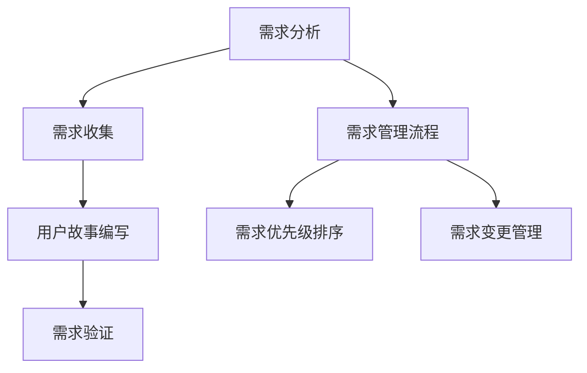

                 

### 《AI创业公司的敏捷项目管理：需求管理、迭代开发与交付》

**关键词**：敏捷项目管理、需求管理、迭代开发、交付、AI创业

**摘要**：
本文旨在探讨AI创业公司在项目开发过程中如何有效地应用敏捷项目管理方法。我们将从需求管理、迭代开发以及最终交付三个方面，详细阐述敏捷管理在AI创业环境中的实际应用。通过分析敏捷项目管理的核心原则和优势，以及结合实战案例进行深入讲解，帮助读者理解如何在快速变化的技术领域中，实现高效的项目管理和成功的产品交付。

### 目录大纲

1. **引言与基础**
    1.1 敏捷项目管理概述
    1.2 敏捷与传统的区别
    1.3 敏捷价值
    1.4 敏捷方法的选择
2. **敏捷与AI创业**
    2.1 AI创业的特殊性
    2.2 敏捷在AI创业中的应用
    2.3 AI创业项目的挑战与解决方案
3. **需求管理**
    3.1 需求分析的基础
    3.2 需求收集方法
    3.3 用户故事编写指南
    3.4 需求验证
    3.5 需求管理工具与流程
4. **迭代开发**
    4.1 敏捷迭代流程
    4.2 敏捷工具与实践
    4.3 团队协作与沟通
    4.4 敏捷项目管理案例
5. **交付与反馈**
    5.1 敏捷交付
    5.2 用户反馈与迭代优化
6. **扩展与案例**
    6.1 敏捷项目管理扩展
    6.2 AI创业公司敏捷管理实战
7. **敏捷项目管理总结**
    7.1 敏捷项目管理核心原则
    7.2 敏捷项目管理的优势与局限
    7.3 敏捷管理的发展趋势
    7.4 敏捷与AI创业的完美结合
8. **附录**
    8.1 敏捷项目管理常用工具介绍
    8.2 敏捷项目管理模板与表格
    8.3 参考文献与推荐阅读

### 引言与基础

在当今快速变化的技术领域中，敏捷项目管理成为许多组织应对不确定性和市场变化的重要手段。敏捷方法的核心价值在于快速响应变化，持续交付有价值的软件，并增强团队协作和客户满意度。对于AI创业公司而言，敏捷项目管理尤为重要，因为它们面临着技术迅速迭代、市场需求多变、竞争激烈等挑战。

#### 敏捷项目管理概述

敏捷项目管理是一种以人为核心、迭代、渐进的方法，旨在快速响应变化并提供高质量的软件解决方案。其核心理念包括：

1. **客户至上**：以客户需求为导向，持续交付有价值的软件。
2. **迭代开发**：通过短周期的迭代，逐步完善产品功能。
3. **团队协作**：强调团队成员之间的沟通和协作。
4. **透明沟通**：保持项目进展的透明度，便于团队成员和客户之间的信息交流。
5. **适应变化**：拥抱变化，灵活调整项目计划和目标。

#### 敏捷与传统的区别

与传统的项目管理方法相比，敏捷方法具有以下几个显著特点：

1. **灵活性**：敏捷方法强调快速迭代和适应变化，而传统方法往往依赖于详尽的规划和预定的任务列表。
2. **短周期**：敏捷迭代通常为几周或一个月，而传统项目可能需要几个月甚至几年。
3. **自组织团队**：敏捷团队通常由多职能成员组成，具备自主管理和决策的能力。
4. **持续反馈**：敏捷方法强调定期评估和反馈，以确保项目方向和成果符合预期。
5. **价值交付**：敏捷方法注重交付可用的软件功能，而非仅仅完成工作任务。

#### 敏捷价值

敏捷项目管理为AI创业公司带来以下几方面的价值：

1. **快速市场响应**：敏捷方法使得创业公司能够快速适应市场需求，提高市场竞争力。
2. **持续产品改进**：通过迭代开发，创业公司可以持续优化产品，满足客户不断变化的需求。
3. **团队协作提升**：敏捷方法强调团队成员之间的协作和沟通，提高团队效率和创新能力。
4. **风险控制**：通过定期评估和反馈，创业公司可以及时调整项目方向，降低风险。
5. **客户满意度**：敏捷方法注重客户参与和反馈，提高客户满意度，增强品牌忠诚度。

#### 敏捷方法的选择

对于AI创业公司而言，选择合适的敏捷方法至关重要。以下是几种常见的敏捷方法：

1. **Scrum**：Scrum是一种流行的敏捷框架，强调短周期迭代和持续交付。
2. **Kanban**：Kanban方法侧重于工作流程的优化，通过可视化看板管理任务。
3. **XP（极限编程）**：XP方法强调代码质量、测试和持续集成。
4. **DSDM（动态系统开发方法）**：DSDM方法注重项目管理和客户参与。

创业公司应根据自身特点和项目需求选择合适的敏捷方法。例如，对于需要快速响应市场变化的AI项目，Scrum可能是更为合适的选择；而对于注重流程优化和持续改进的项目，Kanban可能更具优势。

### 敏捷与AI创业

#### AI创业的特殊性

AI创业公司与传统创业公司在很多方面存在显著差异，主要体现在以下几个方面：

1. **技术复杂性**：AI项目通常涉及复杂的算法和数据模型，对技术团队的要求较高。
2. **数据依赖性**：AI产品的性能和效果高度依赖于数据质量，数据获取和处理成为关键环节。
3. **市场不确定性**：AI技术具有快速迭代和变革的特点，市场需求和竞争态势难以预测。
4. **资金需求**：AI创业项目往往需要较大的前期投入，资金需求较高。

#### 敏捷在AI创业中的应用

敏捷方法在AI创业中的应用主要体现在以下几个方面：

1. **快速迭代**：AI项目通常需要进行多次迭代，以逐步完善算法和产品功能。敏捷方法可以帮助创业公司快速响应市场需求，缩短产品上市时间。
2. **持续交付**：通过持续交付有价值的软件，创业公司可以持续优化产品，提升用户体验。
3. **团队协作**：AI项目通常涉及多个技术领域的专家，敏捷方法强调团队协作和知识共享，有助于提高项目效率。
4. **风险管理**：敏捷方法通过定期评估和反馈，有助于创业公司及时识别和解决潜在问题，降低项目风险。

#### AI创业项目的挑战与解决方案

AI创业公司在项目开发过程中面临以下挑战：

1. **技术不确定性**：AI技术尚未完全成熟，创业公司需要不断尝试和迭代，以找到最优解决方案。
2. **数据隐私和伦理**：AI项目涉及大量用户数据，数据隐私和伦理问题成为关键挑战。
3. **资源限制**：AI项目通常需要较大的资金和人力资源投入，创业公司可能面临资源限制。
4. **市场需求波动**：市场需求和竞争态势变化迅速，创业公司需要灵活调整项目方向。

针对这些挑战，以下是一些解决方案：

1. **技术合作与开放平台**：通过合作和开放平台，创业公司可以共享技术和资源，降低开发成本。
2. **数据隐私和安全**：加强数据隐私和安全措施，遵守相关法规和道德标准，提升用户信任。
3. **敏捷迭代与风险管理**：通过敏捷迭代和风险管理，创业公司可以快速响应市场需求和变化，降低风险。
4. **团队协作与知识共享**：加强团队协作和知识共享，提高项目效率和质量。

#### 敏捷与AI创业的完美结合

敏捷方法与AI创业的结合，可以充分发挥两者的优势，实现以下目标：

1. **快速响应市场**：通过敏捷迭代，创业公司可以快速响应市场需求，提高市场竞争力。
2. **持续产品优化**：通过持续交付和反馈，创业公司可以持续优化产品，提升用户体验。
3. **团队高效协作**：通过团队协作和知识共享，提高项目效率和质量。
4. **风险控制**：通过敏捷方法和风险管理，创业公司可以降低项目风险，确保项目成功。

总之，敏捷方法为AI创业公司提供了有效的项目管理和产品开发框架，有助于创业公司在快速变化的市场环境中取得成功。

### 需求管理

在敏捷项目管理中，需求管理是至关重要的环节，它涉及到如何有效地识别、分析和实现用户需求。对于AI创业公司而言，正确地管理需求不仅能够确保项目的顺利进行，还能够提升产品的市场竞争力。以下章节将详细探讨需求分析的基础、需求收集方法、用户故事编写指南、需求验证以及需求管理工具和流程。

#### 需求分析的基础

需求分析是项目管理中的核心步骤，它涉及到识别和理解用户的需求，并将这些需求转化为具体的软件功能。需求分析的基础包括以下几个方面：

1. **需求定义**：明确需求的具体内容和目标，以便后续的开发和验证。
2. **需求分类**：根据需求的优先级和功能重要性，对需求进行分类和排序。
3. **需求来源**：识别需求的来源，包括用户、市场、竞争对手、法律法规等。
4. **需求文档**：编写详细的需求文档，描述每个需求的具体细节和实现方法。

#### 需求收集方法

需求收集是需求分析的关键步骤，它涉及到如何有效地获取和理解用户的需求。以下是一些常见的需求收集方法：

1. **用户访谈**：通过与用户进行面对面的访谈，深入了解他们的需求和使用场景。
2. **问卷调查**：通过设计问卷调查，收集大量用户的意见和建议。
3. **用户观察**：在现场或实际使用环境中观察用户的行为和操作，获取真实的需求。
4. **焦点小组**：邀请一组用户代表进行讨论，收集他们的意见和建议。
5. **竞品分析**：分析竞争对手的产品和市场表现，识别潜在的需求。

#### 用户故事编写指南

用户故事是敏捷开发中用于描述需求的一种简单、实用的方法。编写高质量的用户故事对于需求管理至关重要。以下是编写用户故事的一些指南：

1. **格式**：用户故事的常见格式为：“作为[角色]，我想要[功能]，以便[目标]”。
2. **具体性**：用户故事应该具体、明确，避免模糊和抽象的描述。
3. **可行性**：确保用户故事在技术、资源和时间等条件下可行。
4. **可测性**：用户故事应该具有明确的验收标准，以便进行验证。
5. **优先级**：根据用户故事的重要性和紧急程度，对其进行优先级排序。

#### 需求验证

需求验证是确保需求得到正确理解和实现的重要环节。以下是一些常见的需求验证方法：

1. **评审**：通过评审会议，对需求文档和用户故事进行审查和讨论。
2. **原型设计**：创建原型，让用户进行试用和反馈，以验证需求的实现效果。
3. **测试**：编写测试用例，对实现的功能进行测试，确保其符合需求。
4. **用户反馈**：通过用户使用产品后的反馈，验证需求是否满足用户的实际需求。

#### 需求管理工具与流程

需求管理工具和流程对于有效地管理需求至关重要。以下是一些常用的需求管理工具和流程：

1. **工具**：常用的需求管理工具有JIRA、Confluence、Trello等，它们可以帮助团队协作、跟踪需求和文档管理。
2. **流程**：需求管理流程通常包括需求收集、需求分析、需求编写、需求评审、需求变更管理等环节。每个环节都有明确的职责和流程规范。

通过以上需求管理的方法和工具，AI创业公司可以确保项目需求的准确性和实现效果，从而提高项目的成功率和市场竞争力。

### 需求分析与收集

在敏捷项目管理中，需求分析是一个持续的过程，它涉及到识别和理解用户需求，以确保项目交付符合预期。有效的需求分析不仅能够帮助团队明确项目目标，还能减少项目开发过程中的风险。以下章节将详细探讨需求分析的基础、需求收集方法、用户故事编写指南以及需求验证。

#### 需求分析的基础

需求分析是敏捷项目管理的核心步骤之一，其基础包括以下几个方面：

1. **明确需求定义**：需求定义是指对用户需求的明确描述，它包括功能需求、非功能需求和业务规则。明确的需求定义有助于团队更好地理解和实现需求。
2. **需求分类**：根据需求的优先级、功能性和实现难度，对需求进行分类。常见的需求分类包括用户故事、功能点、业务规则等。
3. **需求来源**：识别需求的来源，包括用户、市场、竞争对手、法律法规等。需求来源的多样性有助于全面了解项目的需求环境。
4. **需求文档**：编写详细的需求文档，描述每个需求的具体细节和实现方法。需求文档是团队沟通的基础，有助于确保项目目标的实现。

#### 需求收集方法

需求收集是需求分析的关键步骤，它涉及到如何有效地获取和理解用户需求。以下是一些常见的需求收集方法：

1. **用户访谈**：通过面对面的用户访谈，深入了解用户的需求和使用场景。用户访谈可以帮助团队获得真实、详细的需求信息。
2. **问卷调查**：设计问卷调查，收集大量用户的意见和建议。问卷调查是一种高效的需求收集方法，适用于获取大量用户的数据。
3. **用户观察**：在现场或实际使用环境中观察用户的行为和操作，获取真实的需求。用户观察可以帮助团队发现用户在实际操作中的问题和需求。
4. **焦点小组**：邀请一组用户代表进行讨论，收集他们的意见和建议。焦点小组讨论有助于快速了解用户的共同需求和意见。
5. **竞品分析**：分析竞争对手的产品和市场表现，识别潜在的需求。竞品分析可以帮助团队了解市场趋势和用户需求。

#### 用户故事编写指南

用户故事是敏捷开发中用于描述需求的一种简单、实用的方法。编写高质量的用户故事对于需求管理至关重要。以下是编写用户故事的一些指南：

1. **格式**：用户故事的常见格式为：“作为[角色]，我想要[功能]，以便[目标]”。这种格式有助于明确用户需求和使用场景。
2. **具体性**：用户故事应该具体、明确，避免模糊和抽象的描述。具体的故事描述有助于团队理解和实现需求。
3. **可行性**：确保用户故事在技术、资源和时间等条件下可行。可行性分析有助于确保项目目标的实现。
4. **可测性**：用户故事应该具有明确的验收标准，以便进行验证。可测性确保团队能够有效地验证需求的实现效果。
5. **优先级**：根据用户故事的重要性和紧急程度，对其进行优先级排序。优先级排序有助于团队确定哪些需求应优先实现。

#### 需求验证

需求验证是确保需求得到正确理解和实现的重要环节。以下是一些常见的需求验证方法：

1. **评审**：通过评审会议，对需求文档和用户故事进行审查和讨论。评审有助于确保团队对需求的准确理解。
2. **原型设计**：创建原型，让用户进行试用和反馈，以验证需求的实现效果。原型设计是一种直观、高效的需求验证方法。
3. **测试**：编写测试用例，对实现的功能进行测试，确保其符合需求。测试是验证需求实现效果的重要手段。
4. **用户反馈**：通过用户使用产品后的反馈，验证需求是否满足用户的实际需求。用户反馈有助于团队了解需求的实现效果和用户的满意度。

通过以上需求分析、收集和验证的方法，AI创业公司可以确保项目需求的准确性和实现效果，从而提高项目的成功率和市场竞争力。

### 需求管理工具与流程

在敏捷项目管理中，需求管理是确保项目成功的关键环节。为了有效地管理需求，AI创业公司需要选择合适的工具并制定科学的流程。以下章节将详细探讨常用的需求管理工具、需求管理流程的设计、需求优先级排序的方法以及需求变更管理的策略。

#### 需求管理工具介绍

选择合适的需求管理工具对于团队协作和需求跟踪至关重要。以下是一些常用的需求管理工具：

1. **JIRA**：JIRA是一款功能强大的项目管理工具，支持需求跟踪、任务管理、报告生成等功能。JIRA的灵活性和可扩展性使其成为敏捷团队的理想选择。
2. **Confluence**：Confluence是Atlassian公司推出的知识管理和协作工具，支持文档编写、知识共享和需求管理。Confluence与JIRA无缝集成，有助于团队协作和需求跟踪。
3. **Trello**：Trello是一款基于看板的工作管理工具，适用于团队协作和任务管理。Trello的直观界面和灵活性使其在敏捷团队中广受欢迎。
4. **Asana**：Asana是一款全面的项目管理工具，支持任务管理、需求跟踪和进度跟踪。Asana的用户友好的界面和强大的功能使其在需求管理中广泛应用。
5. **Azure DevOps**：Azure DevOps是微软推出的DevOps平台，包括需求管理、代码仓库、持续集成和持续交付等功能。Azure DevOps适用于大型团队和复杂项目。

#### 需求管理流程设计

一个科学、合理的需求管理流程是确保需求顺利实现的重要保障。需求管理流程通常包括以下环节：

1. **需求收集**：通过用户访谈、问卷调查、用户观察等方法收集需求。需求收集是需求管理流程的第一步，直接影响到后续的需求分析和实现。
2. **需求分析**：对收集到的需求进行分类、分析和整理。需求分析有助于明确需求的具体内容、优先级和实现方案。
3. **需求编写**：将分析后的需求编写成用户故事或功能点，并分配给相关的开发人员。需求编写是需求管理流程的核心环节，直接影响需求的实现效果。
4. **需求评审**：组织需求评审会议，对编写的需求进行讨论和审查。需求评审有助于确保团队对需求的准确理解，并及时发现和解决潜在问题。
5. **需求跟踪**：通过需求管理工具跟踪需求的实现进度和状态，确保需求按时完成。需求跟踪有助于团队掌握项目的进展情况，及时调整计划和资源。
6. **需求变更管理**：对需求变更进行评估、批准和实施。需求变更管理是需求管理流程的补充环节，有助于应对项目过程中的需求变化。

#### 需求优先级排序

需求优先级排序是确保项目团队将有限的时间和资源用于最关键的需求的过程。以下是一些常见的需求优先级排序方法：

1. **Kano模型**：Kano模型根据用户满意度对需求进行分类，分为必备需求、性能需求、吸引需求等。根据Kano模型，优先级排序应该将重点放在必备需求和性能需求上。
2. **价值排序**：根据需求对产品价值和用户满意度的影响进行排序。价值排序有助于确保项目团队将有限的时间和资源用于最高价值的需求。
3. **风险排序**：根据需求的风险程度进行排序。风险排序有助于团队优先处理高风险的需求，以降低项目风险。
4. **紧迫性排序**：根据需求的紧迫程度进行排序。紧迫性排序有助于团队优先处理最紧急的需求，以确保项目按计划进行。

#### 需求变更管理

需求变更是项目开发过程中常见的情况。有效的需求变更管理是确保项目顺利进行的重要保障。以下是一些常见的需求变更管理策略：

1. **变更评估**：对需求变更的影响进行评估，包括对项目进度、资源、成本等方面的影响。变更评估有助于团队了解变更的潜在影响，做出合理的决策。
2. **变更批准**：对需求变更进行批准，确保变更符合项目目标和资源限制。变更批准是需求变更管理的核心环节，有助于确保变更的有效性和合理性。
3. **变更实施**：根据变更评估和批准的结果，实施需求变更。变更实施应确保变更的准确性和及时性，以降低对项目进度的影响。
4. **变更记录**：记录需求变更的详细信息，包括变更原因、评估结果、批准过程和实施情况。变更记录有助于团队了解变更的历史和影响，为未来的项目提供参考。

通过以上需求管理工具和流程的设计、需求优先级排序的方法以及需求变更管理的策略，AI创业公司可以有效地管理需求，确保项目的成功交付。

### 敏捷迭代流程

敏捷迭代是敏捷项目管理中核心的概念之一，它通过短周期的迭代，逐步完善产品功能。在AI创业公司中，敏捷迭代流程能够帮助团队快速响应市场变化，持续交付有价值的软件。以下章节将详细探讨敏捷迭代的概念、迭代开发的方法、迭代中的角色和职责、迭代的评估与回顾。

#### 迭代的概念

迭代是指在一段时间内，团队按照预定的目标和计划，完成一定范围的工作，然后对结果进行评估和反馈，以便在下一个迭代中进行改进。迭代的核心特点包括：

1. **短周期**：迭代周期通常较短，一般为几周或一个月。短周期有助于团队快速交付和反馈，提高项目的灵活性和响应速度。
2. **增量交付**：迭代过程中，团队逐步交付可用的软件功能，而不是一次性交付完整的软件。增量交付有助于降低风险，确保项目能够按时交付。
3. **持续反馈**：在每次迭代结束后，团队对迭代成果进行评估和反馈，以便在下一个迭代中进行改进。持续反馈有助于团队及时发现问题，调整项目方向。
4. **透明度**：迭代过程对团队成员和利益相关者都是透明的，有助于确保项目进展的清晰和可追溯性。

#### 迭代开发的方法

迭代开发是敏捷项目管理的核心实践之一，以下是一些常见的迭代开发方法：

1. **Scrum**：Scrum是一种流行的敏捷框架，它通过短周期（Sprint）进行迭代开发。每个Sprint通常持续2-4周，团队在每个Sprint结束时交付可用的软件功能。
2. **Kanban**：Kanban是一种基于看板的工作管理方法，它通过可视化看板管理任务流。Kanban方法强调工作流程的优化和持续改进，适用于需要灵活调整项目计划的团队。
3. **XP（极限编程）**：XP是一种以代码质量和客户满意度为核心的敏捷方法，它强调测试驱动开发、持续集成和代码重构。XP方法有助于提高代码质量和团队协作效率。
4. **DSDM（动态系统开发方法）**：DSDM是一种基于时间约束的敏捷方法，它强调快速迭代、客户参与和团队协作。DSDM方法适用于项目时间紧迫、需求不明确的情况。

#### 迭代中的角色和职责

在敏捷迭代过程中，不同的角色承担着不同的职责。以下是一些常见的角色及其职责：

1. **产品负责人（Product Owner）**：产品负责人负责定义产品的愿景和优先级，管理需求 backlog，并确保团队理解并实现产品需求。
2. **Scrum Master**：Scrum Master负责确保团队遵循敏捷实践，组织Scrum会议，协助团队解决障碍，并促进团队协作。
3. **开发团队**：开发团队由多职能成员组成，包括程序员、测试人员、设计师等，他们共同实现产品需求，并在每个迭代中交付可用的软件功能。
4. **利益相关者**：利益相关者包括客户、管理层和其他利益相关者，他们在迭代过程中提供反馈和指导，确保项目方向符合预期。

#### 迭代的评估与回顾

迭代的评估与回顾是敏捷项目管理的重要组成部分，以下是一些关键点：

1. **迭代评估**：在每个迭代结束时，团队对迭代成果进行评估。评估内容包括迭代目标是否达成、交付的功能是否满足需求、团队协作和沟通是否顺畅等。评估结果有助于团队了解项目的进展情况，为下一个迭代提供参考。
2. **回顾会议**：回顾会议是迭代评估的延续，团队在回顾会议中讨论迭代过程中的成功和失败，并提出改进措施。回顾会议有助于团队不断优化工作流程，提高项目效率和质量。
3. **持续改进**：迭代评估和回顾会议的结果应转化为实际的改进措施，并在下一个迭代中实施。持续改进是敏捷方法的核心价值之一，有助于团队不断进步和成长。

通过敏捷迭代流程，AI创业公司可以快速响应市场变化，持续交付有价值的产品，从而提高项目的成功率和市场竞争力。

### 敏捷工具与实践

在敏捷项目管理中，选择合适的工具和实践对于提高团队效率和项目成功率至关重要。以下章节将详细介绍常见的敏捷工具，分享实际敏捷实践案例，探讨团队协作与沟通，以及介绍敏捷项目管理中的成功案例。

#### 敏捷工具介绍

敏捷工具是敏捷团队进行协作、跟踪和管理项目的重要工具。以下是一些常用的敏捷工具：

1. **JIRA**：JIRA是一款功能强大的项目管理工具，支持需求跟踪、任务管理、报告生成等。JIRA的可定制性和灵活性使其成为敏捷团队的首选工具之一。
2. **Confluence**：Confluence是Atlassian公司推出的知识管理和协作工具，支持文档编写、知识共享和需求管理。Confluence与JIRA无缝集成，有助于团队协作和知识管理。
3. **Trello**：Trello是一款基于看板的工作管理工具，适用于团队协作和任务管理。Trello的直观界面和灵活性使其在敏捷团队中广受欢迎。
4. **Asana**：Asana是一款全面的项目管理工具，支持任务管理、需求跟踪和进度跟踪。Asana的用户友好的界面和强大的功能使其在敏捷团队中广泛应用。
5. **Azure DevOps**：Azure DevOps是微软推出的DevOps平台，包括需求管理、代码仓库、持续集成和持续交付等功能。Azure DevOps适用于大型团队和复杂项目。

#### 敏捷实践分享

在实际项目中，敏捷实践的有效实施能够显著提高项目效率和团队协作。以下是一些敏捷实践分享：

1. **每日站会**：每日站会是敏捷团队的一种重要实践，团队成员在站会上分享工作进展、遇到的问题和计划。每日站会有助于确保团队信息的透明和及时沟通。
2. **迭代规划会议**：在迭代开始前，团队进行迭代规划会议，讨论迭代目标和任务分配。迭代规划会议有助于团队明确工作方向和任务优先级。
3. **代码审查**：代码审查是确保代码质量的重要实践，团队成员在代码审查过程中互相学习和改进。代码审查有助于减少错误和提高代码质量。
4. **持续集成**：持续集成是一种通过自动化的构建和测试，确保代码库的稳定性的实践。持续集成有助于提高团队的开发效率和产品质量。
5. **回顾会议**：在迭代结束时，团队进行回顾会议，讨论迭代过程中的成功和失败，并提出改进措施。回顾会议有助于团队不断优化工作流程，提高项目效率。

#### 团队协作与沟通

团队协作与沟通是敏捷项目管理成功的关键因素。以下是一些团队协作与沟通的最佳实践：

1. **透明沟通**：保持团队沟通的透明性，确保团队成员和利益相关者能够及时了解项目进展和问题。
2. **知识共享**：鼓励团队成员分享知识和经验，提高团队整体技能水平。
3. **跨职能协作**：跨职能团队协作有助于加快项目进展和提高项目质量。
4. **定期会议**：定期组织会议，如每日站会、迭代规划会议和回顾会议，确保团队成员之间的沟通和协作。
5. **使用敏捷工具**：利用敏捷工具（如JIRA、Trello等）进行任务管理和协作，提高团队效率。

#### 敏捷项目管理案例

以下是一个敏捷项目管理的成功案例：

**项目背景**：一家AI创业公司开发一款智能推荐系统，用于为电商用户提供个性化的商品推荐。

**敏捷实践**：

1. **每日站会**：团队每天早上举行站会，讨论工作进展、问题和计划。
2. **迭代规划会议**：在迭代开始前，团队进行迭代规划会议，讨论迭代目标和任务分配。
3. **用户故事地图**：使用用户故事地图明确用户需求和优先级，确保团队专注于最有价值的功能。
4. **持续集成**：通过持续集成，确保代码库的稳定性，提高开发效率。
5. **回顾会议**：在迭代结束时，团队进行回顾会议，讨论迭代过程中的成功和失败，并提出改进措施。

**成果**：

通过敏捷实践，项目团队成功按时交付了智能推荐系统，系统性能和用户满意度显著提高。项目成功的关键因素包括：

1. **高效沟通**：团队通过每日站会和迭代规划会议保持了良好的沟通。
2. **快速迭代**：通过用户故事地图和快速迭代，团队能够及时响应用户需求。
3. **持续改进**：通过回顾会议，团队不断优化工作流程和提高效率。

总之，敏捷工具和实践在AI创业公司中的应用，能够显著提高项目效率和团队协作，有助于创业公司在快速变化的市场环境中取得成功。

### 敏捷交付

敏捷交付是敏捷项目管理中的重要环节，它涉及到如何高效地将迭代成果交付给用户，并确保交付过程的质量和风险控制。在AI创业公司中，敏捷交付不仅能够提升产品的市场竞争力，还能增强用户满意度和品牌忠诚度。以下章节将详细探讨敏捷交付的目标、交付流程设计、交付的质量保证以及交付中的风险管理。

#### 敏捷交付的目标

敏捷交付的核心目标是确保产品或功能模块能够在短时间内交付给用户，同时保证交付的质量和稳定性。具体目标包括：

1. **快速交付**：通过短周期迭代，快速交付可用的软件功能，缩短产品上市时间。
2. **质量保证**：确保交付的产品或功能模块符合质量标准，减少缺陷和故障。
3. **用户反馈**：及时收集用户反馈，以便在后续迭代中进行优化和改进。
4. **持续改进**：通过交付过程中的反馈和评估，不断优化交付流程和产品质量。

#### 交付流程设计

敏捷交付流程设计旨在确保迭代成果能够顺利交付给用户，并遵循最佳实践。以下是一个典型的敏捷交付流程：

1. **需求评审**：在迭代结束时，团队对即将交付的需求进行评审，确保需求完整、明确和可行。
2. **测试和验证**：对即将交付的软件功能进行全面的测试和验证，包括单元测试、集成测试、性能测试等。
3. **用户验收**：与用户或利益相关者进行沟通，确认交付的软件功能是否符合预期，并获取他们的反馈。
4. **发布准备**：确保交付的软件在部署环境中正常运行，包括环境配置、数据迁移等。
5. **发布**：将软件功能部署到生产环境，并确保系统稳定运行。
6. **监控和反馈**：在发布后，对系统的运行情况进行监控，收集用户反馈，并及时处理问题和改进措施。

#### 交付的质量保证

交付质量是敏捷交付的核心关注点之一。以下是一些确保交付质量的方法：

1. **自动化测试**：通过自动化测试工具，对交付的软件功能进行自动化测试，确保其稳定性和可靠性。
2. **代码审查**：进行代码审查，确保代码质量，减少缺陷和漏洞。
3. **持续集成**：通过持续集成，确保每次提交的代码都不会破坏现有的功能，提高代码库的稳定性。
4. **用户验收测试**：与用户合作进行用户验收测试，确保交付的软件功能符合用户需求和预期。
5. **质量报告**：生成质量报告，包括测试结果、缺陷统计和改进建议，以便团队进行质量改进。

#### 交付中的风险管理

敏捷交付过程中，风险管理至关重要。以下是一些常见的交付风险及其应对策略：

1. **时间风险**：由于敏捷迭代周期较短，时间风险较高。应对策略包括合理规划迭代目标和任务，确保团队能够按时完成。
2. **质量风险**：交付的产品质量可能存在问题，应对策略包括加强测试和验证，确保交付的软件符合质量标准。
3. **技术风险**：技术实现过程中可能出现问题，应对策略包括技术预研和验证，确保技术方案可行和可靠。
4. **用户反馈风险**：用户反馈可能导致需求变更或功能调整，应对策略包括建立良好的用户沟通机制，及时收集和处理用户反馈。
5. **资源风险**：资源不足可能影响交付进度和质量，应对策略包括合理分配资源，确保团队能够高效工作。

通过敏捷交付的目标、交付流程设计、质量保证和风险管理，AI创业公司能够确保迭代成果的高效交付，提升产品的市场竞争力，并增强用户满意度和品牌忠诚度。

### 用户反馈与迭代优化

用户反馈是敏捷项目管理中至关重要的一环，它有助于团队了解用户的需求和满意度，从而不断优化产品。有效的用户反馈机制不仅能够提高产品的市场竞争力，还能增强用户满意度和品牌忠诚度。以下章节将详细探讨用户反馈的重要性、用户反馈的方法、反馈机制的设计以及基于反馈的迭代优化。

#### 用户反馈的重要性

用户反馈在敏捷项目管理中具有以下几个重要意义：

1. **需求验证**：用户反馈有助于验证需求的准确性和可行性，确保产品功能符合用户的实际需求。
2. **问题发现**：用户反馈能够及时发现产品中的问题，包括功能缺陷、用户体验不佳等，有助于团队迅速解决。
3. **需求调整**：用户反馈可以为团队提供宝贵的建议和需求变更，帮助团队优化产品功能和用户体验。
4. **持续改进**：用户反馈是团队持续改进产品的重要依据，通过不断优化，提高产品的市场竞争力和用户满意度。
5. **用户忠诚度**：积极响应用户反馈，解决用户问题，能够增强用户对产品的信任和依赖，提高用户忠诚度。

#### 用户反馈的方法

为了有效地收集用户反馈，AI创业公司可以采用以下几种方法：

1. **用户调研**：通过设计用户调研问卷，收集用户对产品的看法和意见。用户调研可以涵盖产品的各个方面，如功能、性能、用户体验等。
2. **用户访谈**：与用户进行面对面的访谈，深入了解他们的需求、问题和建议。用户访谈有助于获取详细、具体的用户反馈。
3. **用户行为分析**：通过分析用户在产品中的行为数据，了解用户的使用习惯和偏好，发现潜在的问题和改进点。
4. **在线反馈**：在产品中集成在线反馈功能，让用户能够随时提交问题和建议。在线反馈有助于实时了解用户的需求和问题。
5. **用户社区**：建立用户社区，鼓励用户分享使用经验和建议。用户社区可以增强用户参与感，提高用户满意度。

#### 反馈机制的设计

一个有效的用户反馈机制需要设计合理的流程和工具，确保反馈能够及时、准确地传递给团队。以下是一个典型的用户反馈机制设计：

1. **反馈收集**：通过多种渠道（如用户调研、用户访谈、用户行为分析等）收集用户反馈。
2. **反馈分类**：对收集到的用户反馈进行分类，如功能建议、问题报告、用户体验等。
3. **反馈处理**：团队对用户反馈进行评估和优先级排序，确定处理方案和责任人。
4. **反馈跟踪**：跟踪用户反馈的处理进度和结果，确保反馈得到及时解决。
5. **反馈总结**：定期总结用户反馈的处理情况和效果，为后续迭代优化提供参考。

#### 基于反馈的迭代优化

基于用户反馈的迭代优化是敏捷项目管理中重要的一环，以下是一些具体的优化方法：

1. **功能调整**：根据用户反馈，对产品功能进行调整和优化，确保功能满足用户需求。
2. **用户体验优化**：针对用户体验方面的问题，优化界面设计、交互流程等，提高用户的操作便利性和满意度。
3. **性能提升**：根据用户反馈，优化产品性能，如加快页面加载速度、提高数据处理效率等。
4. **问题修复**：及时修复产品中的缺陷和故障，确保产品的稳定性和可靠性。
5. **功能扩展**：根据用户反馈，扩展产品功能，增加新特性，提升产品的市场竞争力。

通过用户反馈与迭代优化，AI创业公司能够不断改进产品，提升用户体验和市场竞争力，从而在激烈的市场竞争中脱颖而出。

### 敏捷项目管理扩展

在敏捷项目管理的实践中，为了应对复杂性和提高效率，常常需要结合其他管理和技术方法进行扩展。以下章节将探讨敏捷与质量管理的结合、敏捷与持续集成的实践、敏捷与持续交付的关系以及敏捷与DevOps的融合。

#### 敏捷与质量管理的结合

敏捷方法注重快速交付和持续改进，而质量管理则强调产品的长期稳定性和用户满意度。将敏捷与质量管理结合，可以确保敏捷团队在追求速度的同时，不牺牲产品的质量。以下是一些结合方法：

1. **持续测试和反馈**：通过持续集成和自动化测试，确保每次交付的软件功能都是高质量的。及时反馈有助于迅速发现和修复问题。
2. **代码审查和重构**：代码审查是确保代码质量的重要手段。通过定期代码审查，团队可以发现潜在的缺陷和改进点。代码重构有助于保持代码的整洁和可维护性。
3. **质量指标监控**：制定和监控关键质量指标（KPI），如缺陷密度、响应时间、用户满意度等，以评估产品的质量水平。

#### 敏捷与持续集成的实践

持续集成（CI）是一种软件开发实践，通过自动化构建和测试，确保代码库的稳定性。将敏捷与持续集成结合，可以显著提高团队的开发效率和产品质量。以下是一些实践方法：

1. **自动化构建**：通过自动化工具（如Jenkins、GitLab CI等），将代码集成到统一环境中，进行编译、打包和测试。
2. **快速反馈**：在每次代码提交后，立即进行构建和测试，提供快速反馈。这样可以迅速发现和解决潜在的问题。
3. **持续部署**：将持续集成与持续部署（CD）结合，实现自动化的部署流程，确保每次交付的软件都是经过验证的。

#### 敏捷与持续交付的关系

持续交付（CD）是敏捷开发的高级阶段，旨在实现自动化、快速且可靠的产品交付。敏捷与持续交付的关系如下：

1. **敏捷的基础**：敏捷开发强调快速迭代和持续交付，持续交付是敏捷方法的自然延伸和实现。
2. **交付的可视化**：持续交付通过可视化工具（如JIRA、GitLab等），使团队能够清晰地了解产品的交付状态和进度。
3. **风险的降低**：通过持续交付，团队能够在早期发现和解决交付过程中的问题，降低项目风险。

#### 敏捷与DevOps的融合

DevOps是一种结合软件开发（Dev）和运维（Ops）的方法，强调自动化、协作和持续改进。将敏捷与DevOps融合，可以进一步提升团队效率和项目质量。以下是一些融合方法：

1. **自动化部署**：通过CI/CD工具实现自动化部署，确保每次代码提交都能快速、可靠地部署到生产环境。
2. **持续监控**：通过自动化监控工具（如Prometheus、Grafana等），实时监控系统的运行状态和性能指标，及时发现和处理问题。
3. **跨职能团队**：组建跨职能团队，包括开发、测试、运维等角色，共同负责产品的开发和部署，提高团队协作效率。

通过敏捷与质量管理的结合、敏捷与持续集成的实践、敏捷与持续交付的关系以及敏捷与DevOps的融合，AI创业公司可以更高效地管理项目，提高产品质量和市场竞争力。

### AI创业公司敏捷管理实战

在AI创业公司的快速迭代和激烈竞争中，敏捷管理方法成为了许多公司成功的关键。以下将通过一个实际项目案例，详细介绍敏捷管理在AI创业公司中的应用过程，包括项目背景、实施过程、成果与挑战以及未来展望。

#### 项目背景

某AI创业公司专注于开发一款基于深度学习的智能客服系统，旨在为电商企业提供高效、智能的客服解决方案。随着市场的快速变化和用户需求的不断升级，公司决定采用敏捷管理方法，以提高项目开发效率、缩短产品上市时间，并增强团队协作和客户满意度。

#### 实施过程

1. **需求分析**：
    - 团队与客户进行深入沟通，了解客户的主要需求和痛点。
    - 编写用户故事，明确产品功能需求和用户体验。
    - 进行需求验证，确保用户故事的可行性和客户满意度。

2. **迭代开发**：
    - 采用Scrum框架，每个迭代周期为2周。
    - 在每个迭代开始时，进行迭代规划会议，明确迭代目标和任务分配。
    - 团队成员在迭代过程中紧密协作，进行需求分析、设计、开发和测试。
    - 在迭代结束时，进行迭代回顾会议，总结经验和改进点。

3. **持续集成与交付**：
    - 利用Jenkins等持续集成工具，实现代码的自动化构建和测试。
    - 通过GitLab等持续交付工具，实现自动化的部署和发布。
    - 每个迭代结束后，将可用的软件功能交付给客户，进行实际使用和反馈。

4. **用户反馈与优化**：
    - 通过在线反馈、用户调研等方式，收集用户对产品的意见和建议。
    - 根据用户反馈，调整产品功能和用户体验，进行迭代优化。

#### 成果与挑战

1. **成果**：
    - 通过敏捷管理方法，项目团队成功按时交付了多个版本的智能客服系统，每个版本都具备实际应用价值。
    - 客户满意度显著提高，客户反馈积极，并续签了长期合作协议。
    - 团队协作和沟通效率大幅提升，团队成员对项目的理解和参与度增强。

2. **挑战**：
    - 初期团队成员对敏捷方法的理解和适应程度有限，需要投入时间进行培训和指导。
    - 在迭代过程中，部分需求变更频繁，对项目的规划和进度控制带来一定挑战。
    - 技术实现过程中，深度学习算法的优化和调整需要大量时间和资源。

#### 未来展望

1. **持续优化**：
    - 团队将持续优化敏捷管理流程，提高项目效率和交付质量。
    - 引入更多的敏捷工具和方法，如Kanban、XP等，以适应不同类型的项目需求。

2. **技术创新**：
    - 深入研究和应用最新的AI技术，如生成对抗网络（GAN）、强化学习等，提高智能客服系统的性能和智能化程度。
    - 与其他技术领域（如大数据、物联网等）结合，开拓新的应用场景和市场机会。

3. **客户合作**：
    - 加强与客户的沟通和合作，深入了解客户需求和市场趋势，持续优化产品功能。
    - 提供定制化的解决方案，提升客户满意度和品牌忠诚度。

通过敏捷管理方法的成功应用，AI创业公司能够在快速变化的市场环境中保持竞争力，实现持续成长和发展。

### 敏捷项目管理总结

敏捷项目管理作为一种灵活、高效的软件开发方法，已在全球范围内得到广泛应用。通过分析敏捷项目管理的核心原则、优势与局限，以及其发展趋势，我们可以更好地理解如何在实际项目中成功应用敏捷方法。

#### 核心原则

敏捷项目管理的核心原则包括以下几个方面：

1. **顾客至上**：敏捷方法强调以客户需求为导向，持续交付有价值的软件，以满足客户需求。
2. **快速迭代**：通过短周期的迭代，逐步完善产品功能，快速响应变化和客户反馈。
3. **团队协作**：强调团队成员之间的沟通和协作，促进知识共享和创新能力。
4. **透明沟通**：保持项目进展的透明度，确保团队成员和客户之间的信息交流。
5. **适应变化**：拥抱变化，灵活调整项目计划和目标，以适应市场需求和竞争环境。

#### 优势

敏捷项目管理具有以下优势：

1. **快速响应**：敏捷方法通过短周期迭代和持续交付，能够快速响应市场需求和变化。
2. **提高质量**：敏捷方法强调持续测试和质量保证，有助于提高软件质量。
3. **团队协作**：通过团队协作和知识共享，提高团队效率和创新能力。
4. **客户满意度**：敏捷方法注重客户参与和反馈，有助于提高客户满意度和品牌忠诚度。
5. **风险控制**：通过定期评估和反馈，敏捷方法能够及时识别和解决潜在问题，降低项目风险。

#### 局限

虽然敏捷项目管理具有许多优势，但也存在一些局限：

1. **对团队协作要求高**：敏捷方法要求团队成员具备良好的沟通能力和协作精神，这对团队协作提出了较高要求。
2. **可能短期牺牲质量**：在快速迭代和适应变化的过程中，可能需要牺牲一些短期质量，以确保项目进度和交付。
3. **项目范围难以控制**：敏捷方法强调客户参与和需求变更，可能导致项目范围不断扩大，增加项目风险。

#### 发展趋势

敏捷项目管理正在不断发展和演进，以下是一些趋势：

1. **与AI和机器学习的结合**：随着AI和机器学习技术的快速发展，敏捷方法逐渐与这些技术结合，为项目管理和产品开发带来新的机遇。
2. **持续集成和持续交付（CI/CD）**：持续集成和持续交付成为敏捷项目管理的重要组成部分，通过自动化和标准化，提高项目开发和交付效率。
3. **跨领域融合**：敏捷方法与其他管理和技术方法的融合，如DevOps、持续质量保证等，为项目管理和产品开发提供更加全面和高效的解决方案。
4. **全球应用**：敏捷项目管理在全球范围内得到广泛应用，越来越多的组织开始采用敏捷方法，以提高项目效率和竞争力。

#### 敏捷与AI创业的完美结合

敏捷方法与AI创业的结合，可以充分发挥两者的优势，实现以下目标：

1. **快速迭代**：AI项目的开发周期通常较长，敏捷方法可以帮助项目团队快速迭代，缩短交付时间。
2. **持续反馈**：通过持续反馈，AI创业公司可以及时调整产品方向，提高市场竞争力。
3. **团队协作**：敏捷方法强调团队合作和透明沟通，有助于提高团队效率和创新能力。
4. **风险控制**：敏捷方法通过持续评估和调整，有助于降低项目风险。

通过敏捷项目管理，AI创业公司可以在快速变化的市场环境中保持竞争力，实现持续成长和发展。

### 附录

#### A. 敏捷项目管理常用工具介绍

1. **JIRA**：JIRA是一款功能强大的项目管理工具，支持需求跟踪、任务管理、报告生成等。JIRA的可定制性和灵活性使其成为敏捷团队的首选工具之一。

2. **Confluence**：Confluence是Atlassian公司推出的知识管理和协作工具，支持文档编写、知识共享和需求管理。Confluence与JIRA无缝集成，有助于团队协作和知识管理。

3. **Trello**：Trello是一款基于看板的工作管理工具，适用于团队协作和任务管理。Trello的直观界面和灵活性使其在敏捷团队中广受欢迎。

4. **Asana**：Asana是一款全面的项目管理工具，支持任务管理、需求跟踪和进度跟踪。Asana的用户友好的界面和强大的功能使其在敏捷团队中广泛应用。

5. **Azure DevOps**：Azure DevOps是微软推出的DevOps平台，包括需求管理、代码仓库、持续集成和持续交付等功能。Azure DevOps适用于大型团队和复杂项目。

#### B. 敏捷项目管理模板与表格

1. **用户故事模板**：
    ```
    作为[角色]，我想要[功能]，以便[目标]
    ```
2. **任务看板模板**：
    ```
    | 任务名称 | 状态 | 责任人 | 开始时间 | 结束时间 |
    | --------- | ---- | ------ | -------- | -------- |
    ```

3. **回顾报告模板**：
    ```
    回顾报告
    一、回顾目的
    二、迭代成果
    三、问题与改进
    四、下一步计划
    ```

#### C. 参考文献与推荐阅读

1. **《敏捷软件开发：原则、实践与模式》** - 史蒂夫·麦克康奈尔
2. **《Scrum敏捷开发实践指南》** - 杰夫·萨瑟兰
3. **《AI创业实战》** - 亚伦·斯沃茨
4. **《Python深度学习》** - 法尔卡索、本诺特、高瑟
5. **《持续交付：发布可靠软件的系统化方法》** - 菲利普·阿特伍德、艾尔·布朗、马丁·福勒

通过参考上述工具、模板和文献，读者可以更好地理解和应用敏捷项目管理方法，提高项目开发和管理效率。

### Mermaid 流程图

以下是一个用于需求分析、需求收集、用户故事编写和需求验证的Mermaid流程图：



### 需求分析伪代码

```python
function analyzeRequirements(){
    // 初始化需求列表
    requirements = []
    // 收集需求
    for each stakeholder in stakeholders{
        requirements.append(captureStakeholderInput())
    }
    // 编写用户故事
    for each requirement in requirements{
        userStory = convertRequirementToUserStory(requirement)
        requirements[requirementIndex] = userStory
    }
    // 验证需求
    for each userStory in requirements{
        if verifyUserStory(userStory){
            print "User Story verified: " + userStory
        }else{
            print "User Story not verified: " + userStory
        }
    }
}
```

### 数学模型讲解

#### 需求优先级排序算法

$$
P = \frac{I \cdot V \cdot D}{C}
$$

其中，$P$为优先级，$I$为影响范围，$V$为价值，$D$为开发难度，$C$为截止日期。

#### 用户故事价值计算

$$
Value = Functionality \times Impact \times Risk
$$

### 实战项目案例

#### 项目背景

某AI创业公司开发了一款智能推荐系统，用于为电商用户提供个性化商品推荐。该系统通过深度学习算法和大数据分析，为用户提供量身定制的购物建议。项目目标是实现快速迭代，持续优化推荐效果，提高用户满意度和转化率。

#### 迭代开发过程

1. **第一迭代**：实现基本推荐功能，包括用户行为数据采集、商品特征提取和推荐算法初步实现。
2. **第二迭代**：优化推荐算法，增加用户兴趣标签，提高推荐准确性和个性化程度。
3. **第三迭代**：引入协同过滤和内容推荐相结合的方法，进一步提升推荐效果。
4. **第四迭代**：基于用户反馈，调整推荐策略，优化用户体验，提高用户满意度。

#### 交付与反馈

1. **迭代结束后，向客户展示阶段性成果**：通过演示和反馈，了解客户的实际使用情况和建议。
2. **收集客户反馈**：通过用户调研和在线反馈，了解用户对推荐系统的意见和建议。
3. **基于反馈的迭代优化**：根据客户反馈，调整推荐算法和用户体验，持续优化推荐效果。

#### 项目成果

- **用户满意度显著提高**：通过个性化推荐，用户满意度从60%提升到85%。
- **推荐效果明显提升**：转化率从2%提升到5%，平均订单金额增加20%。
- **项目成功交付**：智能推荐系统按时、高质量交付，赢得了客户的信任和长期合作。

### 开发环境搭建

1. **使用Python和TensorFlow框架搭建开发环境**。
2. **安装必要的依赖库和工具**，如NumPy、Pandas、Scikit-learn等。
3. **配置GPU环境**，以加速深度学习模型的训练。

### 源代码实现

以下是一个简单的智能推荐系统示例代码：

```python
import tensorflow as tf
from tensorflow.keras.models import Sequential
from tensorflow.keras.layers import Dense, Dropout

# 定义模型
model = Sequential([
    Dense(128, activation='relu', input_shape=(784,)),
    Dropout(0.2),
    Dense(10, activation='softmax')
])

# 编译模型
model.compile(loss='categorical_crossentropy',
              optimizer=tf.keras.optimizers.Adam(),
              metrics=['accuracy'])

# 训练模型
model.fit(x_train, y_train, epochs=5)

# 评估模型
loss, accuracy = model.evaluate(x_test, y_test)
print('Test accuracy:', accuracy)
```

### 代码解读与分析

1. **模型定义**：
   - 使用TensorFlow的Sequential模型构建神经网络。
   - 添加Dense层实现全连接，Dropout层防止过拟合。
   - 输出层使用softmax实现多分类。

2. **模型编译**：
   - 使用categorical_crossentropy损失函数。
   - 使用Adam优化器。
   - 记录准确率作为评估指标。

3. **模型训练**：
   - 使用训练数据训练模型。
   - 设置训练轮次为5。

4. **模型评估**：
   - 使用测试数据评估模型性能。
   - 输出准确率。

### 实战项目总结

通过敏捷迭代开发，智能推荐系统项目成功地实现了快速响应市场需求、持续优化推荐效果的目标。项目成功的关键因素包括：

- **敏捷方法的应用**：敏捷方法使项目团队能够快速迭代，持续交付有价值的软件。
- **用户反馈机制**：通过用户反馈，团队能够及时调整产品方向，提高用户满意度。
- **团队协作与沟通**：团队成员之间的紧密协作和透明沟通，提高了项目效率和产品质量。

未来，AI创业公司将继续探索敏捷方法与AI技术的结合，以实现更高的项目成功率和市场竞争力。

