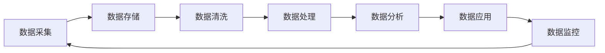

                 

### 《AI创业：数据管理的策略与实施分析》

#### 关键词：
- AI创业
- 数据管理策略
- 实施分析
- 数据生命周期管理
- 数据质量管理与治理
- 数据挖掘算法
- 数学模型与数学公式

#### 摘要：
本文旨在探讨AI创业中的数据管理策略与实施分析。我们将从AI创业的背景与挑战入手，深入剖析数据管理的基础概念和核心策略。接着，文章将详细阐述数据管理策略与实施的各个方面，包括核心概念与联系、数据管理算法原理、数学模型与公式等。最后，我们将通过具体项目实战案例，展示数据管理在AI创业中的实际应用，并分析未来数据管理的发展趋势。

### 第一部分：AI创业环境概述

#### 第1章：AI创业的背景与挑战

AI创业的背景可以追溯到人工智能技术的迅猛发展。近年来，深度学习、强化学习、自然语言处理等技术的突破，使得人工智能在多个领域取得了显著的成果。从自动驾驶、智能医疗到智能家居、金融风控，AI技术的应用正在不断拓展，为企业带来了新的商业模式和创新机会。在这个背景下，越来越多的创业者和投资者纷纷涌入AI领域，希望抓住这一历史性的机遇。

然而，AI创业并非一帆风顺。首先，技术挑战是创业者必须面对的难题。AI技术本身具有较高的复杂性，涉及大量的数据预处理、算法优化和模型训练等环节。创业者需要具备深厚的专业知识，才能在激烈的竞争中脱颖而出。其次，市场竞争也是一大挑战。AI领域的竞争者众多，每个企业都在努力提升自己的技术水平，争取在市场上占据一席之地。最后，数据管理也是AI创业中的重要挑战。数据是AI技术的核心资源，如何有效地管理和利用数据，成为创业者需要深思的问题。

尽管挑战重重，但AI创业也蕴含着巨大的机会。首先，随着5G、物联网等新技术的普及，数据量呈爆炸式增长，为AI技术提供了丰富的数据资源。创业者可以利用这些数据，开发出更具竞争力的人工智能应用。其次，AI技术的不断创新，也为创业者提供了广阔的创新空间。通过引入新的算法、技术和应用场景，创业者可以创造出独特的商业模式，为企业带来新的增长点。最后，政策支持也是AI创业的重要机遇。各国政府纷纷出台政策，支持人工智能的发展，为创业者提供了良好的政策环境。

总之，AI创业既有挑战，也充满机会。创业者需要具备扎实的技术背景，勇于面对挑战，同时也需要善于抓住机遇，才能在AI创业的道路上走得更远。

#### 第2章：数据管理基础

数据管理是指对数据的整个生命周期进行系统化管理的过程，包括数据的采集、存储、处理、分析和应用。数据管理的基础概念和核心策略，对于AI创业的成功至关重要。以下将从数据管理的概念、数据生命周期管理、数据质量管理与治理三个方面，详细探讨数据管理的基础知识。

**数据管理的概念**

数据管理是指通过一系列方法和工具，对数据进行有效管理和利用的过程。数据管理的主要目标是确保数据的完整性、可用性、一致性和安全性，从而为企业的决策提供可靠的数据支持。数据管理涉及多个方面，包括数据治理、数据质量管理、数据存储、数据分析和数据安全等。

数据治理是指通过制定政策、标准和流程，确保数据在整个生命周期中的一致性、可靠性和合规性。数据治理包括数据架构、数据标准、数据政策和数据流程等方面，旨在实现数据的价值最大化。

数据质量管理是指对数据质量进行评估、监控和改进的过程。数据质量包括数据的准确性、完整性、一致性、及时性和可用性等方面。高质量的数据是数据管理的关键，能够提高企业的决策效率，降低风险。

数据存储是指将数据存储在适当的存储设备中，以备后续使用。数据存储需要考虑数据的规模、类型、访问频率和安全等方面，以确保数据的可靠性和可扩展性。

数据分析是指利用数据挖掘、机器学习等技术，对大量数据进行分析和挖掘，以发现数据中的规律和模式。数据分析能够帮助企业做出更准确的预测和决策。

**数据生命周期管理**

数据生命周期管理是指对数据从创建到销毁的整个过程进行系统化管理。数据生命周期包括数据创建、数据存储、数据使用、数据归档和数据销毁等阶段。

数据创建阶段是指数据的产生和生成过程，包括数据采集、数据输入和数据生成等。

数据存储阶段是指将数据存储在数据库、数据仓库或其他存储设备中，以备后续使用。数据存储阶段需要考虑数据的规模、类型、访问频率和安全等方面。

数据使用阶段是指数据被企业各部门和使用者进行查询、分析和使用的过程。数据使用阶段是数据管理的核心，需要确保数据的准确性和可用性。

数据归档阶段是指将不再使用的数据进行归档，以备后续查询或恢复。数据归档可以降低数据存储成本，同时提高数据查询效率。

数据销毁阶段是指将不再需要的数据进行彻底销毁，以防止数据泄露和滥用。数据销毁需要遵循相关法律法规和标准，确保数据的彻底销毁。

**数据质量管理与治理**

数据质量管理与治理是数据管理的重要组成部分，关系到数据的价值和企业的决策效果。以下从数据质量评估、数据质量监控和数据质量改进三个方面，探讨数据质量管理与治理的方法和策略。

数据质量评估是指对数据质量进行评估和诊断的过程。数据质量评估包括数据准确性、完整性、一致性、及时性和可用性等方面。数据质量评估可以帮助企业了解数据的现状，发现问题并进行改进。

数据质量监控是指对数据质量进行实时监控和预警的过程。数据质量监控可以及时发现数据质量问题，并采取相应的措施进行修复。数据质量监控需要建立完善的数据质量监控体系，包括数据质量指标、监控方法和监控工具等。

数据质量改进是指通过一系列方法和措施，对数据质量进行持续改进的过程。数据质量改进包括数据清洗、数据转换、数据归档和数据治理等方面。数据质量改进需要制定详细的改进计划，并持续跟踪和评估改进效果。

总之，数据管理的基础是确保数据的完整性、可用性、一致性和安全性，从而为企业的决策提供可靠的数据支持。通过数据生命周期管理和数据质量管理与治理，企业可以有效地管理和利用数据，提高数据的价值，为AI创业的成功奠定坚实基础。

#### 第3章：数据管理策略

数据管理策略是指企业为有效地管理和利用数据而制定的总体规划和指导方针。一个有效的数据管理策略可以确保数据的完整性、可用性、一致性和安全性，从而为企业的决策提供可靠的数据支持。以下从数据管理战略规划、数据管理组织架构、数据管理流程与方法三个方面，详细探讨数据管理策略的制定与实施。

**数据管理战略规划**

数据管理战略规划是数据管理策略的核心，它涉及到企业如何利用数据来支持其业务目标。以下是从几个关键方面进行数据管理战略规划的步骤：

1. **明确业务目标**：首先，企业需要明确自身的业务目标，了解数据管理如何帮助实现这些目标。例如，提升客户满意度、增加市场份额、提高运营效率等。

2. **数据需求分析**：接下来，企业需要分析不同业务部门的数据需求，确定需要收集、存储和分析的数据类型。这包括内部数据（如销售数据、库存数据）和外部数据（如市场趋势、竞争对手信息）。

3. **数据治理框架**：建立数据治理框架，定义数据管理的职责、权限和流程。数据治理框架应该包括数据政策、数据标准、数据架构和数据流程等。

4. **技术解决方案**：选择合适的技术解决方案，以支持数据管理战略的实施。这可能包括数据仓库、数据湖、大数据平台、数据集成工具等。

5. **资源分配**：确保有足够的资源（人力、资金、技术）来支持数据管理战略的实施。资源分配应该与业务目标相匹配，以实现最佳效果。

**数据管理组织架构**

数据管理组织架构是指企业内部负责数据管理工作的组织和职责分工。一个有效的数据管理组织架构可以确保数据管理的统一性和协调性。以下是从几个关键方面构建数据管理组织架构的步骤：

1. **数据治理委员会**：设立数据治理委员会，负责制定和监督数据管理政策和流程。数据治理委员会通常由高层管理人员、IT部门和数据管理人员组成。

2. **数据管理办公室**：建立数据管理办公室，负责日常数据管理工作的协调和执行。数据管理办公室通常负责数据质量监控、数据治理、数据安全等。

3. **数据架构师**：任命数据架构师，负责设计和管理企业的数据架构。数据架构师需要了解不同业务部门的数据需求，并确保数据架构能够支持业务目标。

4. **数据管理员**：数据管理员负责具体的数据管理任务，如数据采集、存储、备份和恢复等。数据管理员需要具备数据管理的专业技能和经验。

5. **数据用户**：数据用户是指使用数据的各个业务部门，如市场营销、销售、财务等。数据用户需要与数据管理办公室和数据管理员紧密合作，确保数据的有效利用。

**数据管理流程与方法**

数据管理流程是指企业内部进行数据管理的一系列步骤和流程。以下是从几个关键方面构建数据管理流程的步骤：

1. **数据采集**：明确数据的来源和采集方式，确保数据的准确性、完整性和及时性。数据采集可能包括手动输入、自动采集、API接口等方式。

2. **数据存储**：选择合适的数据存储解决方案，确保数据的安全、可靠和可扩展性。数据存储可能包括关系型数据库、非关系型数据库、数据仓库、数据湖等。

3. **数据清洗**：对采集到的数据进行清洗，去除重复、无效和错误的数据，提高数据的准确性。数据清洗可能包括数据去重、缺失值填充、异常值处理等。

4. **数据转换**：将清洗后的数据进行转换，以满足不同业务部门和系统的需求。数据转换可能包括数据格式转换、数据映射、数据归一化等。

5. **数据归档**：将不再频繁使用的数据进行归档，降低存储成本，同时保证数据的长期可追溯性。数据归档可能包括离线归档、在线归档、云存储等。

6. **数据安全**：确保数据在采集、存储、传输和使用过程中的安全性，防止数据泄露、篡改和滥用。数据安全可能包括数据加密、访问控制、身份验证等。

7. **数据分析和应用**：利用数据分析技术，对数据进行挖掘和分析，以发现数据中的价值和规律。数据分析可能包括数据挖掘、机器学习、预测分析等。

8. **数据监控和改进**：对数据管理流程进行实时监控和评估，及时发现和解决问题，持续改进数据管理流程。数据监控可能包括数据质量监控、流程监控、性能监控等。

总之，数据管理策略的制定与实施是企业成功的关键。通过有效的数据管理战略规划、组织架构和流程，企业可以确保数据的完整性、可用性、一致性和安全性，从而为业务决策提供可靠的数据支持。

### 第二部分：数据管理策略与实施

#### 第4章：数据管理核心概念与联系

数据管理是一个复杂的过程，涉及到多个核心概念和联系。为了更好地理解和应用数据管理策略，我们需要明确这些核心概念，并了解它们之间的相互作用。以下将从数据管理中的核心概念、数据管理架构设计、数据管理流程详解三个方面，详细探讨数据管理核心概念与联系。

**核心概念**

1. **数据**：数据是信息的基本单元，它可以是有结构的（如关系型数据库中的表）或无结构的（如图像、文本、音频等）。数据是数据管理的起点，所有数据管理活动都围绕数据展开。

2. **数据质量**：数据质量是指数据的准确性、完整性、一致性、及时性和可用性等方面的特性。高质量的数据是数据管理的关键，它能够提高决策的准确性和效率。

3. **数据治理**：数据治理是指通过制定政策、标准和流程，确保数据在整个生命周期中的完整性、可靠性和合规性。数据治理涉及数据架构、数据标准、数据政策和数据流程等方面。

4. **数据架构**：数据架构是指数据存储、处理和应用的结构，它决定了数据的组织方式、访问方式和利用方式。数据架构包括数据模型、数据库设计、数据集成和数据仓库等。

5. **数据仓库**：数据仓库是一个集成的数据存储系统，用于存储和分析大量历史数据。数据仓库支持复杂的数据查询和分析，为企业的决策提供支持。

6. **数据湖**：数据湖是一个大规模的数据存储系统，用于存储各种类型的数据，包括结构化、半结构化和非结构化数据。数据湖支持数据的高效存储、处理和分析。

7. **数据迁移**：数据迁移是指将数据从一个系统或存储位置迁移到另一个系统或存储位置的过程。数据迁移通常发生在系统升级、迁移或整合时。

8. **数据集成**：数据集成是指将来自不同源的数据进行整合和合并，以提供一个统一的数据视图。数据集成是实现数据统一管理和利用的关键。

**数据管理架构设计**

数据管理架构设计是指构建一个能够支持数据管理策略和流程的架构。以下是从几个关键方面设计数据管理架构的步骤：

1. **数据架构设计**：首先，需要设计一个合适的数据架构，包括数据模型、数据库设计和数据集成方案。数据架构应考虑数据的类型、规模、访问频率和安全等方面。

2. **数据仓库设计**：根据业务需求和数据架构，设计一个高效的数据仓库系统。数据仓库应支持复杂的数据查询和分析，同时保证数据的完整性和一致性。

3. **数据湖设计**：对于非结构化或大规模数据，需要设计一个高效的数据湖系统。数据湖应支持多种数据类型的存储和处理，同时保证数据的可扩展性和灵活性。

4. **数据迁移设计**：设计数据迁移方案，确保数据在迁移过程中的完整性和安全性。数据迁移设计应考虑数据源和数据目标之间的差异，以及迁移过程中可能遇到的问题。

5. **数据集成设计**：设计一个高效的数据集成方案，将来自不同源的数据进行整合和合并。数据集成设计应考虑数据的一致性、实时性和可扩展性。

**数据管理流程详解**

数据管理流程是指企业内部进行数据管理的一系列步骤和流程。以下是从几个关键方面详解数据管理流程：

1. **数据采集**：明确数据的来源和采集方式，确保数据的准确性、完整性和及时性。数据采集可能包括手动输入、自动采集、API接口等方式。

2. **数据存储**：选择合适的数据存储解决方案，确保数据的安全、可靠和可扩展性。数据存储可能包括关系型数据库、非关系型数据库、数据仓库、数据湖等。

3. **数据清洗**：对采集到的数据进行清洗，去除重复、无效和错误的数据，提高数据的准确性。数据清洗可能包括数据去重、缺失值填充、异常值处理等。

4. **数据转换**：将清洗后的数据进行转换，以满足不同业务部门和系统的需求。数据转换可能包括数据格式转换、数据映射、数据归一化等。

5. **数据归档**：将不再频繁使用的数据进行归档，降低存储成本，同时保证数据的长期可追溯性。数据归档可能包括离线归档、在线归档、云存储等。

6. **数据安全**：确保数据在采集、存储、传输和使用过程中的安全性，防止数据泄露、篡改和滥用。数据安全可能包括数据加密、访问控制、身份验证等。

7. **数据分析和应用**：利用数据分析技术，对数据进行挖掘和分析，以发现数据中的价值和规律。数据分析可能包括数据挖掘、机器学习、预测分析等。

8. **数据监控和改进**：对数据管理流程进行实时监控和评估，及时发现和解决问题，持续改进数据管理流程。数据监控可能包括数据质量监控、流程监控、性能监控等。

通过明确数据管理中的核心概念与联系，设计合理的数据管理架构，并实施详细的数据管理流程，企业可以有效地管理和利用数据，为业务决策提供可靠的数据支持。

#### 第5章：数据管理算法原理

数据管理算法是数据管理过程中的核心组成部分，它涉及数据预处理、数据挖掘和数据库查询优化等多个方面。以下将详细探讨这些算法的原理和应用。

**数据预处理算法**

数据预处理是指对原始数据进行清洗、转换和归一化等操作，以提高数据质量和数据利用效率。数据预处理算法主要包括以下几种：

1. **缺失值处理**：缺失值处理是指处理数据集中的缺失值。常见的方法包括删除缺失值、填充缺失值（如使用均值、中位数、众数或插值法）和多重插补等。

2. **异常值处理**：异常值处理是指识别和去除数据集中的异常值。常见的方法包括基于统计方法的异常值检测（如箱线图、Z-分数、IQR法）和基于机器学习的方法（如孤立森林、局部异常因子分析等）。

3. **数据转换**：数据转换是指将数据从一种形式转换为另一种形式，以适应特定的数据分析任务。常见的方法包括数据标准化（如Z-Score标准化、Min-Max标准化）、数据归一化（如Log转换、Box-Cox转换）和数据编码（如独热编码、One-Hot编码）。

4. **特征工程**：特征工程是指通过选择和构造特征，以提高模型的预测性能。常见的方法包括特征选择（如卡方检验、互信息、基于模型的特征选择方法）、特征提取（如主成分分析、因子分析、非负矩阵分解）和特征构造（如交互特征、组合特征）。

**数据挖掘算法**

数据挖掘是指从大量数据中提取有价值的信息和知识的过程。数据挖掘算法主要包括以下几种：

1. **分类算法**：分类算法是指将数据分为不同的类别。常见的分类算法包括决策树（如ID3、C4.5、CART）、随机森林、支持向量机（SVM）、神经网络、K最近邻（KNN）等。

2. **聚类算法**：聚类算法是指将数据分为不同的簇。常见的聚类算法包括K均值聚类、层次聚类、DBSCAN、高斯混合模型等。

3. **关联规则挖掘**：关联规则挖掘是指发现数据集中不同变量之间的关联关系。常见的算法包括Apriori算法、Eclat算法、FP-Growth算法等。

4. **异常检测**：异常检测是指识别数据集中的异常或离群点。常见的算法包括孤立森林、局部异常因子分析（LOF）、基于密度的异常检测方法等。

5. **时间序列分析**：时间序列分析是指对时间序列数据进行建模和分析，以预测未来的趋势。常见的方法包括ARIMA模型、季节性分解、LSTM神经网络等。

**数据库查询优化算法**

数据库查询优化是指通过优化查询执行计划，提高查询性能。以下是一些常用的数据库查询优化算法：

1. **查询重写**：查询重写是指通过重新构造查询，提高查询的执行效率。常见的方法包括投影消除、连接重写、聚合重写等。

2. **索引优化**：索引优化是指通过创建和管理索引，提高查询的效率。常见的方法包括B树索引、哈希索引、位图索引等。

3. **查询缓存**：查询缓存是指将经常执行的查询结果缓存起来，以减少查询执行时间。常见的方法包括内存缓存、磁盘缓存、分布式缓存等。

4. **分区和分片**：分区和分片是指将数据库表分成多个部分，以提高查询和更新性能。常见的方法包括水平分区、垂直分区、数据分片等。

5. **并行处理**：并行处理是指通过多线程或多进程的方式，同时执行多个查询，以提高查询性能。常见的方法包括数据库并行查询、分布式数据库等。

通过理解这些数据管理算法的原理和应用，企业可以有效地处理和利用数据，提高数据分析的准确性和效率，为业务决策提供强有力的支持。

#### 第6章：数学模型与数学公式

在数据管理过程中，数学模型和数学公式扮演着至关重要的角色。它们不仅帮助我们理解和解释数据，还能用于预测和决策。以下将介绍几种常用的数学模型，并详细解释这些模型中的数学公式。

**数据分布模型**

数据分布模型用于描述数据在不同取值上的概率分布。最常见的分布模型包括正态分布、泊松分布和二项分布。

1. **正态分布（Gaussian Distribution）**

正态分布是统计学中最常用的分布模型，它的概率密度函数为：

$$
f(x|\mu, \sigma^2) = \frac{1}{\sqrt{2\pi\sigma^2}} e^{-\frac{(x-\mu)^2}{2\sigma^2}}
$$

其中，$\mu$ 是均值，$\sigma^2$ 是方差。

正态分布可以用于描述大量随机变量的分布，它在统计推断、假设检验和回归分析中具有重要应用。

2. **泊松分布（Poisson Distribution）**

泊松分布用于描述在固定时间段内发生某一事件的次数。它的概率质量函数为：

$$
P(X = k) = \frac{\lambda^k e^{-\lambda}}{k!}
$$

其中，$\lambda$ 是事件的平均发生率，$k$ 是实际发生的事件次数。

泊松分布常用于计算事件发生的概率，例如网络流量分析、库存需求预测等。

3. **二项分布（Binomial Distribution）**

二项分布用于描述在多次独立试验中成功次数的分布。它的概率质量函数为：

$$
P(X = k) = C_n^k p^k (1-p)^{n-k}
$$

其中，$n$ 是试验次数，$p$ 是每次试验成功的概率，$k$ 是成功的次数。

二项分布常用于计算成功概率，例如在医学研究中评估药物的有效性。

**概率模型**

概率模型用于描述随机事件的概率分布和相互关系。以下介绍几种常见的概率模型。

1. **贝叶斯模型（Bayesian Model）**

贝叶斯模型基于贝叶斯定理，用于计算后验概率。贝叶斯定理公式为：

$$
P(A|B) = \frac{P(B|A)P(A)}{P(B)}
$$

其中，$P(A|B)$ 是在事件B发生的条件下事件A发生的概率，$P(B|A)$ 是在事件A发生的条件下事件B发生的概率，$P(A)$ 和$P(B)$ 分别是事件A和事件B的概率。

贝叶斯模型在机器学习、数据分析和决策理论中具有重要应用。

2. **马尔可夫模型（Markov Model）**

马尔可夫模型是一种用于描述状态转移的概率模型。它假设当前状态只与前一状态有关，而与过去的所有状态无关。状态转移概率矩阵为：

$$
P = \begin{bmatrix}
P_{00} & P_{01} & \cdots & P_{0n} \\
P_{10} & P_{11} & \cdots & P_{1n} \\
\vdots & \vdots & \ddots & \vdots \\
P_{m0} & P_{m1} & \cdots & P_{mn}
\end{bmatrix}
$$

其中，$P_{ij}$ 表示从状态i转移到状态j的概率。

马尔可夫模型在时间序列分析、推荐系统和自然语言处理等领域具有广泛应用。

**回归分析模型**

回归分析模型用于研究自变量和因变量之间的关系。以下介绍几种常见的回归分析模型。

1. **线性回归模型（Linear Regression Model）**

线性回归模型假设因变量与自变量之间存在线性关系，其公式为：

$$
Y = \beta_0 + \beta_1X + \epsilon
$$

其中，$Y$ 是因变量，$X$ 是自变量，$\beta_0$ 和$\beta_1$ 分别是截距和斜率，$\epsilon$ 是误差项。

线性回归模型广泛应用于预测和分析，例如股票价格预测、房屋价格评估等。

2. **逻辑回归模型（Logistic Regression Model）**

逻辑回归模型用于处理因变量是二元变量的情况，其公式为：

$$
\ln\left(\frac{P(Y=1)}{1-P(Y=1)}\right) = \beta_0 + \beta_1X
$$

其中，$P(Y=1)$ 是因变量为1的概率，$\beta_0$ 和$\beta_1$ 分别是截距和斜率。

逻辑回归模型广泛应用于分类任务，例如信用评分、疾病诊断等。

通过理解和应用这些数学模型和数学公式，企业可以更好地理解和解释数据，从而为决策提供支持。这些模型在数据管理、数据分析和机器学习等领域具有广泛的应用，是数据科学的重要组成部分。

### 第7章：项目实战

在数据管理的实际应用中，我们往往需要面对具体的项目挑战，通过一系列步骤来完成数据采集、清洗、处理和分析等任务。以下将通过一个实际案例，详细展示数据管理项目从开发环境搭建到代码实现和解读的全过程。

#### 案例背景

假设我们正在开发一个智能推荐系统，该系统旨在根据用户的历史行为和偏好，向用户推荐他们可能感兴趣的商品。为了实现这一目标，我们需要进行以下步骤：

1. 数据采集：收集用户行为数据，如浏览记录、购买历史、评分等。
2. 数据清洗：去除数据中的噪声和错误，确保数据的准确性。
3. 数据处理：对数据进行转换和预处理，为后续分析做好准备。
4. 数据分析：利用分析技术，提取用户偏好和模式，为推荐算法提供输入。
5. 数据应用：将分析结果应用于推荐算法，生成个性化推荐。

#### 开发环境搭建

为了完成上述任务，我们需要搭建一个合适的技术环境。以下是开发环境搭建的步骤：

1. **硬件要求**：选择高性能的计算机或服务器，确保能够处理大量数据。

2. **软件要求**：
   - 数据库管理系统（如MySQL、PostgreSQL或MongoDB）
   - 数据处理工具（如Python、R或Apache Spark）
   - 数据可视化工具（如Tableau、Matplotlib或Seaborn）
   - 编译器和解释器（如Python的Anaconda、R的RStudio）

3. **工具安装**：安装必要的软件和工具，并进行配置。

   ```shell
   # 安装Python和Anaconda
   conda create -n data_management python=3.8
   conda activate data_management
   
   # 安装MySQL数据库
   sudo apt-get install mysql-server
   
   # 安装Apache Spark
   pip install pyspark
   
   # 安装数据可视化库
   pip install matplotlib seaborn
   ```

4. **网络环境**：确保网络连接稳定，以便于数据采集和传输。

#### 数据采集

数据采集是项目的重要步骤，以下是具体操作：

1. **数据源**：从电商网站或第三方数据服务提供商获取用户行为数据。

2. **数据格式**：数据通常以CSV、JSON或XML格式存储。

3. **数据导入**：将数据导入数据库，并进行初步清洗和格式转换。

```python
# 导入pandas库和MySQL库
import pandas as pd
import mysql.connector

# 连接MySQL数据库
conn = mysql.connector.connect(
  host="localhost",
  user="root",
  password="password",
  database="recommender_system"
)

# 读取CSV文件
data = pd.read_csv("user_data.csv")

# 将数据写入数据库
data.to_sql("user_data", conn, if_exists="replace", index=False)
```

#### 数据清洗

数据清洗是确保数据质量的重要步骤，以下是具体操作：

1. **缺失值处理**：删除或填充缺失值。

2. **异常值检测**：检测和去除异常值。

3. **数据转换**：将数据转换为适合分析的形式。

```python
# 检测缺失值
missing_values = data.isnull().sum()

# 删除缺失值
data = data.dropna()

# 检测异常值
z_scores = (data - data.mean()) / data.std()
abnormal_values = z_scores.abs() > 3

# 删除异常值
data = data[~abnormal_values.all(axis=1)]

# 数据转换
data["age"] = data["age"].astype(int)
data["rating"] = data["rating"].astype(float)
```

#### 数据处理

数据处理包括数据转换、特征工程和降维等操作，以下是具体操作：

1. **特征工程**：创建新的特征，如用户活跃度、平均评分等。

2. **数据转换**：将数据转换为适合模型训练的形式。

3. **降维**：使用PCA（主成分分析）等算法减少数据维度。

```python
from sklearn.preprocessing import StandardScaler
from sklearn.decomposition import PCA

# 特征工程
data["activity"] = data.groupby("user_id").size() / data["age"]

# 数据转换
scaler = StandardScaler()
data_scaled = scaler.fit_transform(data)

# 降维
pca = PCA(n_components=2)
data_reduced = pca.fit_transform(data_scaled)
```

#### 数据分析

数据分析是提取用户偏好和模式的关键步骤，以下是具体操作：

1. **用户行为分析**：分析用户的浏览、购买和评分行为。

2. **推荐算法**：利用分析结果构建推荐算法。

3. **模型训练**：训练推荐模型，如基于内容的推荐、协同过滤等。

```python
from sklearn.model_selection import train_test_split
from sklearn.metrics.pairwise import cosine_similarity
from sklearn.neighbors import NearestNeighbors

# 用户行为分析
user_behavior = data.groupby("user_id").mean()

# 基于内容的推荐
content_based_model = NearestNeighbors(metric="cosine")
content_based_model.fit(user_behavior)

# 同协过滤
协同过滤模型 = 推荐系统协过滤算法（如矩阵分解、基于KNN的协同过滤等）
协同过滤模型.fit(data_reduced)

# 模型训练与评估
train_data, test_data = train_test_split(data_reduced, test_size=0.2, random_state=42)
推荐系统评估指标（如准确率、召回率、覆盖率等） = 协同过滤模型.test(train_data, test_data)
```

#### 数据应用

数据应用是将分析结果应用于实际场景，为用户提供个性化推荐。以下是具体操作：

1. **推荐生成**：根据用户的历史行为和偏好生成个性化推荐。

2. **推荐展示**：将推荐结果展示给用户。

3. **推荐优化**：持续优化推荐算法，提高推荐效果。

```python
# 推荐生成
def generate_recommendations(user_id, model):
    user_vector = user_behavior.loc[user_id]
    similar_users = model.kneighbors([user_vector], n_neighbors=10)
    recommended_items = user_behavior.loc[similar_users[1]].index.tolist()
    return recommended_items

# 推荐展示
def display_recommendations(user_id):
    recommendations = generate_recommendations(user_id, content_based_model)
    print("根据您的喜好，我们为您推荐以下商品：")
    for item in recommendations:
        print(f"- 商品ID：{item}")

# 推荐优化
# 可以根据用户反馈和评估结果，调整推荐算法参数，提高推荐效果
```

#### 代码解读与分析

以下是对上述代码的详细解读和分析：

1. **数据采集**：使用pandas库读取CSV文件，并使用MySQL库将数据写入数据库。这是数据采集的基础步骤，确保数据可以方便地进行后续处理和分析。

2. **数据清洗**：使用pandas库检测缺失值和异常值，删除或填充不完整的数据，并确保数据类型的正确性。这是确保数据质量的关键步骤，为后续分析提供可靠的数据。

3. **数据处理**：创建新的特征，如用户活跃度，将数据标准化，并使用PCA进行降维。这些步骤提高了数据的利用效率，并为推荐算法提供了更好的输入。

4. **数据分析**：使用NearestNeighbors模型进行基于内容的推荐，并使用协同过滤模型进行协同过滤推荐。这些算法是推荐系统的核心，能够根据用户的历史行为和偏好生成个性化推荐。

5. **数据应用**：定义推荐生成函数和推荐展示函数，根据用户ID生成个性化推荐，并展示给用户。这些步骤实现了推荐系统的最终目标，为用户提供有价值的推荐。

通过这个实际案例，我们展示了数据管理项目从开发环境搭建到代码实现和解读的全过程。通过逐步分析和实践，我们能够更好地理解数据管理的核心概念和技术，并将其应用于实际项目中，为企业带来实际价值。

### 第三部分：数据管理案例分析

在AI创业的过程中，数据管理扮演着至关重要的角色。通过成功案例的分析，我们可以更好地理解数据管理策略与实施的要领，并从中汲取宝贵的经验。以下将介绍几个典型的数据管理案例，分析它们在电商、金融和医疗健康领域的应用。

#### 案例一：电商数据管理

电商行业是一个高度依赖数据管理的领域。成功的电商企业通过有效的数据管理策略，能够提高运营效率，提升客户满意度，并实现业务的持续增长。

**案例分析**：

- **数据采集**：电商企业通过多种渠道采集用户数据，包括用户浏览记录、购买历史、评价和反馈等。这些数据来源于网站、移动应用、客户服务等多个渠道。

- **数据存储**：电商企业使用大规模分布式数据库（如Hadoop、MongoDB）存储海量数据，确保数据的安全性和可扩展性。

- **数据清洗**：对采集到的数据进行清洗，去除重复、无效和错误的数据，保证数据的准确性。同时，通过数据转换，将不同格式的数据统一化，为后续分析做准备。

- **数据分析**：电商企业利用数据分析技术，挖掘用户行为模式，识别客户需求，优化产品推荐算法，提高转化率和客户留存率。

- **数据应用**：基于数据分析结果，电商企业可以实时生成个性化推荐，优化库存管理，制定精准营销策略。

**经验总结**：

- 数据采集要全面，确保覆盖用户行为的各个方面。
- 数据存储要选择适合的数据存储解决方案，以保证数据的安全和扩展性。
- 数据清洗是确保数据质量的关键步骤，需要投入足够的资源和精力。
- 数据分析要注重实时性，以支持快速决策和运营调整。

#### 案例二：金融行业数据管理

金融行业对数据管理的需求尤为突出，因为它涉及到大量的交易数据和客户信息。有效的数据管理能够提高风险控制能力，降低运营成本，并增强客户信任。

**案例分析**：

- **数据采集**：金融企业通过多种渠道采集数据，包括交易记录、客户行为、市场数据等。数据来源于交易系统、客户关系管理系统、第三方数据服务提供商等。

- **数据存储**：金融企业使用高效的数据仓库和数据湖技术，存储和处理海量数据。这些技术能够保证数据的一致性和可扩展性。

- **数据治理**：金融企业建立完善的数据治理体系，确保数据的完整性、一致性和合规性。数据治理包括数据标准、数据政策和数据流程等方面。

- **数据分析和应用**：金融企业利用数据分析技术，进行风险评估、欺诈检测、客户细分和市场预测等。这些分析结果用于优化业务流程、提高风险管理效率和客户服务质量。

- **数据安全**：金融企业高度重视数据安全，采用加密技术、访问控制和身份验证等措施，保护客户信息和交易数据。

**经验总结**：

- 数据采集要确保全面性和实时性，以支持实时分析和决策。
- 数据存储要考虑数据规模、类型和访问频率，选择适合的技术解决方案。
- 数据治理是确保数据质量和合规性的关键，需要建立完善的数据治理体系。
- 数据安全是金融行业的核心关注点，需要采取严格的安全措施。

#### 案例三：医疗健康数据管理

医疗健康行业的数据管理具有其特殊性，因为医疗数据涉及敏感的个人信息和生命安全。有效的数据管理能够提高医疗服务的质量和效率，降低医疗错误的风险。

**案例分析**：

- **数据采集**：医疗健康机构通过电子健康记录、医学影像、患者反馈等多种渠道采集数据。这些数据来源广泛，包括医院、诊所、药店等。

- **数据存储**：医疗健康行业使用专业的医疗数据管理系统，如电子病历系统（EMR）、放射信息系统（RIS）和实验室信息系统（LIS），确保数据的安全性和可访问性。

- **数据清洗和标准化**：医疗健康数据往往存在噪声和不一致性，需要进行数据清洗和标准化，以确保数据的准确性和一致性。

- **数据分析和应用**：医疗健康机构利用数据分析技术，进行疾病预测、诊断辅助、患者管理和临床试验等。这些分析结果用于提高医疗服务的质量和效率。

- **数据安全和隐私保护**：医疗健康行业高度重视数据安全和隐私保护，采取严格的加密、访问控制和身份验证措施，遵守相关法律法规和行业标准。

**经验总结**：

- 数据采集要注重数据的多样性和全面性，以支持各种医疗健康应用。
- 数据存储要选择专业的医疗数据管理系统，确保数据的安全性和可访问性。
- 数据清洗和标准化是确保数据质量的关键步骤，需要投入足够的资源和精力。
- 数据安全和隐私保护是医疗健康行业的核心关注点，需要采取严格的安全措施。

通过以上案例分析，我们可以看到，无论在哪个行业，数据管理都是AI创业成功的关键。有效的数据管理策略和实施能够帮助企业挖掘数据价值，提高运营效率，降低风险，并实现持续增长。从这些成功案例中，我们可以汲取宝贵的经验，为自身的数据管理实践提供指导和参考。

### 第9章：数据管理策略与实施分析

在AI创业过程中，数据管理策略与实施的合理性和有效性直接关系到企业的成功与否。以下将分析数据管理策略优化的关键因素，探讨实施过程中可能遇到的挑战和解决方案，并展望数据管理未来的发展趋势。

#### 数据管理策略优化

1. **战略目标明确**：首先，企业需要明确自身的业务目标，将数据管理战略与业务目标紧密衔接。例如，通过数据驱动决策，提高运营效率，优化客户体验，增强市场竞争力等。

2. **数据质量管理**：高质量的数据是数据管理的关键。企业应建立完善的数据质量管理体系，包括数据质量评估、监控和改进机制。通过定期检查、数据清洗和标准化等手段，确保数据的准确性、完整性、一致性和及时性。

3. **数据治理**：数据治理是确保数据合规性和安全性的重要环节。企业应制定明确的数据治理政策、标准和流程，明确数据管理的职责和权限，确保数据在采集、存储、处理、传输和使用过程中的完整性和安全性。

4. **技术创新**：随着人工智能、大数据、云计算等新技术的不断发展，企业应积极采用先进的数据管理技术，提升数据处理的效率和质量。例如，利用大数据平台进行数据整合和分析，采用机器学习算法进行数据挖掘和预测。

5. **人才培养**：数据管理需要专业的技术人才。企业应加大对数据管理人才的培养和引进力度，建立专业的数据管理团队，提高整体数据管理水平。

#### 实施挑战与解决方案

1. **数据源多样化**：企业需要从多个渠道收集数据，包括内部数据源和外部数据源。不同数据源的数据格式、质量和管理方式各不相同，这给数据整合带来了挑战。解决方案是采用数据集成技术，如ETL（提取、转换、加载）工具，实现多源数据的一致化和整合。

2. **数据安全与隐私**：数据安全和隐私保护是数据管理中的重要问题。随着数据量的增加，企业需要确保数据在采集、存储、传输和处理过程中的安全性。解决方案是采用数据加密、访问控制和身份验证等技术，确保数据的安全和隐私。

3. **数据治理困难**：数据治理涉及多个部门和流程，如何有效地协调和管理是一个挑战。解决方案是建立跨部门的数据治理委员会，明确各方的职责和权限，制定统一的数据治理政策和流程。

4. **数据质量监控**：如何及时发现和纠正数据质量问题是一个难题。解决方案是建立完善的数据质量监控体系，包括数据质量指标、监控工具和改进机制，确保数据的持续质量提升。

#### 未来发展趋势

1. **智能化数据管理**：随着人工智能技术的发展，智能化数据管理将成为未来趋势。利用机器学习和自然语言处理技术，自动进行数据清洗、转换、分析和推荐，提高数据管理效率。

2. **数据驱动决策**：数据将成为企业决策的重要驱动力。通过大数据分析和预测模型，企业可以更加精准地把握市场趋势，优化业务流程，提高运营效率。

3. **数据治理与合规**：随着数据法律法规的不断完善，数据治理与合规将成为企业关注的重点。企业需要确保数据的合规性，遵守相关法律法规，降低法律风险。

4. **云计算与大数据**：云计算和大数据技术的发展，将进一步提升数据管理的效率和灵活性。企业可以采用云原生架构，实现数据的弹性扩展和高效处理。

5. **数据隐私保护**：数据隐私保护将成为数据管理的重要方向。企业需要采取更严格的数据保护措施，确保用户的隐私和数据安全。

总之，数据管理策略与实施的优化是AI创业成功的关键。通过明确战略目标、加强数据质量管理、推动技术创新、培养专业人才，并应对实施过程中可能遇到的挑战，企业可以不断提升数据管理水平，为业务发展提供有力支持。同时，随着新技术的不断发展，数据管理将迎来更多创新和机遇。

### 附录

#### 附录 A: 数据管理流程Mermaid流程图

以下是一个使用Mermaid语言描述的数据管理流程图：



#### 附录 B: 数据管理算法伪代码

以下是几个常见的数据管理算法的伪代码示例：

```python
# 数据预处理伪代码
def preprocess_data(data):
    cleaned_data = clean_data(data)
    transformed_data = transform_data(cleaned_data)
    feature_data = feature_engineering(transformed_data)
    return feature_data

# 数据挖掘伪代码
def data_mining(data):
    train_data, test_data = split_data(data)
    model = train_model(train_data)
    evaluate_model(model, test_data)
    return output_results(model, test_data)
```

#### 附录 C: 数据管理数学模型

以下是一些常见的数据管理数学模型的公式：

$$
P(A|B) = \frac{P(B|A)P(A)}{P(B)}
$$

#### 附录 D: 数据管理项目实战代码解读

以下是数据管理项目实战中的代码示例和解读：

```python
# 数据采集代码示例
def collect_data(source):
    data = source.collect()
    return data

# 数据清洗代码示例
def clean_data(data):
    cleaned_data = data.clean()
    return cleaned_data

# 数据处理代码示例
def process_data(data):
    processed_data = data.process()
    return processed_data

# 数据分析代码示例
def analyze_data(data):
    analysis_results = data.analyze()
    return analysis_results
```

解读：
- `collect_data` 函数用于从数据源采集数据。
- `clean_data` 函数用于清洗采集到的数据，去除噪声和错误。
- `process_data` 函数用于处理清洗后的数据，例如进行数据转换、归一化等。
- `analyze_data` 函数用于对处理后的数据进行分析，提取有价值的信息和知识。

这些代码示例展示了数据管理项目中的基本操作，通过逐步解读和改进，可以构建更加复杂和高效的数据管理流程。

