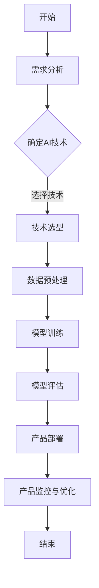

                 

### 引言

AI（人工智能）作为现代科技的重要驱动力，正在深刻地改变着商业和社会的方方面面。从企业级服务到消费级产品，再到社会公益，AI技术的应用已经渗透到各个领域。然而，AI的快速发展不仅带来了技术上的挑战，也引发了商业模式和产品设计方面的创新。本文旨在探讨AI商业模式与产品设计原理，并通过代码实战案例，详细讲解AI技术的实际应用。

文章将分为五个部分：

1. **AI商业模式概述**：介绍AI商业模式的基本概念、核心要素和成功案例。
2. **AI产品设计原理**：讨论AI产品设计的核心要素、开发流程和商业模式设计。
3. **AI产品代码实战**：通过具体案例，展示AI产品的数据预处理、模型训练与优化、代码实战等过程。
4. **AI产品实战案例分析**：分析企业级、消费级和社会公益领域的AI应用案例。
5. **AI产品开发工具与资源**：推荐AI产品开发的相关工具和资源。

本文的目标是通过逻辑清晰、结构紧凑、简单易懂的叙述，帮助读者全面了解AI商业模式与产品设计原理，掌握AI技术的实际应用。

### 关键词

- AI商业模式
- 产品设计原理
- 代码实战
- 数据预处理
- 模型训练与优化
- 实战案例分析
- 开发工具与资源

### 摘要

本文从AI商业模式与产品设计原理出发，深入探讨AI技术在商业和社会中的应用。首先，我们概述了AI商业模式的基本概念、核心要素及成功案例，随后详细介绍了AI产品设计的核心要素、开发流程和商业模式设计。接着，通过具体代码实战案例，展示了AI产品的数据预处理、模型训练与优化过程。最后，我们分析了企业级、消费级和社会公益领域的AI应用案例，并推荐了AI产品开发的相关工具与资源。本文旨在为读者提供全面、系统的AI技术知识，帮助其掌握AI商业与产品的核心要义。

### 目录大纲

1. **引言**
2. **关键词**
3. **摘要**
4. **第一部分：AI商业模式概述**
   - 第1章: AI商业模式概述
     1.1 AI商业模式的基本概念
     1.2 AI商业模式的核心要素
     1.3 AI商业模式的成功案例
5. **第二部分：AI产品设计原理**
   - 第2章: AI产品设计原理
     2.1 AI产品设计的核心要素
     2.2 AI产品的开发流程
     2.3 AI产品的商业模式设计
6. **第三部分：AI产品代码实战**
   - 第3章: AI产品代码实战
     3.1 数据预处理
     3.2 模型训练与优化
     3.3 代码实战案例
7. **第四部分：AI产品实战案例分析**
   - 第4章: AI产品实战案例分析
     4.1 企业级AI应用案例
     4.2 消费级AI应用案例
     4.3 社会公益AI应用案例
8. **第五部分：AI产品开发工具与资源**
   - 第5章: AI产品开发工具与资源
     5.1 开发工具介绍
     5.2 资源推荐
9. **附录**
   - 附录A: AI产品开发常见问题解答
   - 附录B: 代码实现示例

### 第一部分：AI商业模式概述

#### 第1章: AI商业模式概述

##### 1.1 AI商业模式的基本概念

AI商业模式是指企业通过人工智能技术获取商业价值的方法和策略。它涉及技术、数据、算法、用户需求等多个方面，旨在提高效率、降低成本、增强竞争力。AI商业模式的基本概念包括：

1. **人工智能技术**：包括机器学习、深度学习、自然语言处理等。
2. **数据**：数据是AI商业模式的基石，包括结构化数据、非结构化数据等。
3. **算法**：算法是人工智能的核心，用于处理数据并生成预测或决策。
4. **用户需求**：用户需求是商业模式的出发点，了解用户需求有助于设计满足需求的产品或服务。

##### 1.2 AI商业模式的分类

AI商业模式可以根据应用场景和目标用户进行分类，常见的分类方法包括：

1. **企业级服务**：针对企业客户，提供自动化、智能化的解决方案，如智能客服、智能分析等。
2. **消费级产品**：面向终端用户，提供日常生活中的智能化服务，如智能家居、智能语音助手等。
3. **社会公益**：利用AI技术解决社会问题，如智能医疗、环境保护等。

##### 1.3 AI商业模式的驱动因素

AI商业模式的发展受到多个驱动因素的影响，包括：

1. **技术进步**：人工智能技术的快速发展为商业模式的创新提供了基础。
2. **数据增长**：数据量的增加使得AI技术能够更好地进行数据分析和决策。
3. **用户需求**：随着用户对智能化、便捷化服务的需求增加，推动了AI商业模式的普及。
4. **政策支持**：政府对人工智能产业的扶持政策，为AI商业模式的发展提供了良好的环境。

##### 1.4 AI商业模式的成功案例

以下是一些AI商业模式的成功案例：

1. **企业级服务**：
   - **案例一**：谷歌的G Suite，通过智能办公工具提高企业工作效率。
   - **案例二**：微软的Azure AI，提供多种智能服务，帮助企业实现数字化转型。

2. **消费级产品**：
   - **案例一**：亚马逊的Echo智能音箱，通过语音识别和自然语言处理提供智能家居控制。
   - **案例二**：苹果的Siri，通过人工智能助手提供个性化服务和信息查询。

3. **社会公益**：
   - **案例一**：谷歌的AI for Social Good项目，利用AI技术解决全球性社会问题。
   - **案例二**：IBM的Watson for Good，通过AI技术提供医疗、教育等领域的解决方案。

通过这些案例，我们可以看到AI商业模式在不同领域都有着巨大的潜力，并取得了显著的成效。接下来，我们将进一步探讨AI商业模式的核心要素，以帮助读者更好地理解和应用AI技术。

### 第1章: AI商业模式概述

#### 1.2 AI商业模式的核心要素

AI商业模式的成功离不开其核心要素，这些要素共同构成了一个完整的商业闭环，确保了AI技术的有效应用和商业价值的实现。以下是AI商业模式的核心要素：

##### 1.2.1 数据与AI商业模式

数据是AI商业模式的基础，没有数据，AI技术就无从谈起。数据类型可以分为结构化数据和非结构化数据：

1. **结构化数据**：如数据库中的信息，易于存储、处理和分析。
2. **非结构化数据**：如文本、图像、音频等，需要复杂的算法进行解析和提取有用信息。

数据质量直接影响到AI模型的性能，因此数据采集、清洗、存储和处理是至关重要的环节。高质量的数据可以提升模型的准确性和稳定性，进而提高商业价值。

##### 1.2.2 技术与AI商业模式

AI技术的核心包括机器学习、深度学习、自然语言处理等。每种技术都有其特定的应用场景和优势，合理选择和组合技术是实现商业模式成功的关键。

1. **机器学习**：通过训练模型，使计算机能够从数据中学习规律，并做出预测。
2. **深度学习**：一种特殊的机器学习方法，通过多层神经网络模拟人脑，处理复杂的模式识别问题。
3. **自然语言处理**：使计算机能够理解和生成自然语言，广泛应用于智能客服、翻译、文本分析等场景。

技术选择需要根据业务需求和数据特性进行，同时要考虑实施的可行性和成本效益。

##### 1.2.3 客户价值与AI商业模式

客户价值是AI商业模式的终极目标，所有技术和数据都是为了提供更好的客户体验和服务。客户价值体现在以下几个方面：

1. **效率提升**：通过自动化流程，减少人工操作，提高工作效率。
2. **成本降低**：通过精准预测和优化，降低运营成本。
3. **个性化服务**：通过分析用户数据，提供定制化产品和服务，提升用户满意度。
4. **决策支持**：通过数据分析和预测模型，为业务决策提供科学依据。

实现客户价值的关键在于深入了解用户需求，并将其转化为具体的产品或服务。

##### 1.2.4 盈利模式与AI商业模式

盈利模式是AI商业模式实现商业价值的重要保障。常见的盈利模式包括：

1. **订阅模式**：用户按月或按年支付订阅费用，使用AI产品或服务。
2. **交易模式**：用户通过交易购买AI产品或服务，如智能设备、软件许可证等。
3. **广告模式**：通过为AI产品或服务提供广告，赚取广告收入。
4. **增值服务**：提供附加服务，如数据分析报告、定制化开发等，增加收入。

选择合适的盈利模式，需要考虑市场环境、用户需求和成本结构。

##### 1.2.5 风险管理

AI商业模式面临多种风险，如数据隐私、算法偏见、技术更新等。有效的风险管理策略是确保商业模式持续发展的关键。

1. **数据隐私**：确保用户数据安全，遵守相关法律法规。
2. **算法偏见**：通过算法透明度和公平性评估，减少偏见和歧视。
3. **技术更新**：保持技术领先，及时应对市场变化。

总之，AI商业模式的核心要素相互作用，共同推动商业价值的实现。理解和应用这些要素，有助于企业在激烈的市场竞争中脱颖而出，实现长期可持续发展。

### 第1章: AI商业模式概述

#### 1.3 AI商业模式的成功案例

AI商业模式的成功案例涵盖了多个领域，从企业级服务到消费级产品，再到社会公益，都展现了人工智能技术的巨大潜力和商业价值。以下是一些典型的成功案例，通过对这些案例的分析，我们可以更好地理解AI商业模式的运作机制和成功因素。

##### 1.3.1 企业级服务案例

**案例一：谷歌的G Suite**

谷歌的G Suite是一套企业级办公工具，包括文档、表格、邮件、日历等应用。通过集成人工智能技术，G Suite提供了智能搜索、自动化办公流程等功能，极大地提高了企业的工作效率。例如，G Suite的智能助手可以自动整理邮件，分类归档，使员工能够更专注于核心工作。此外，谷歌还利用AI技术提供数据分析和预测服务，帮助企业做出更明智的决策。

成功因素：
- **技术优势**：谷歌拥有强大的AI技术，能够为G Suite提供创新功能。
- **用户需求**：企业对高效办公工具的需求推动了G Suite的普及。
- **集成生态**：G Suite与其他谷歌服务（如Google Drive、Google Cloud等）无缝集成，提升了用户体验。

**案例二：微软的Azure AI**

微软的Azure AI提供了多种人工智能服务，包括图像识别、自然语言处理、机器学习等。Azure AI帮助企业实现自动化、智能化，提高运营效率。例如，在制造业中，Azure AI可以用于预测设备故障，提前进行维护，减少停机时间。在金融领域，Azure AI可以用于风险评估，提高贷款审批的准确性。

成功因素：
- **广泛覆盖**：Azure AI覆盖多个行业和领域，满足了多样化的需求。
- **生态系统**：微软的Azure平台为企业提供了全面的云计算解决方案，增强了Azure AI的竞争力。
- **客户信任**：微软在企业级市场中建立了强大的客户基础，使Azure AI得以迅速推广。

##### 1.3.2 消费级产品案例

**案例一：亚马逊的Echo智能音箱**

亚马逊的Echo智能音箱通过集成人工智能技术，为用户提供了智能语音助手——Alexa。用户可以通过语音指令控制智能音箱，播放音乐、查询天气、设定提醒等。此外，Echo还可以与其他智能设备（如智能灯泡、智能恒温器等）联动，实现智能家居控制。

成功因素：
- **用户体验**：Echo提供了简单、直观的交互方式，满足了用户对便捷生活的需求。
- **生态系统**：亚马逊构建了广泛的智能设备生态系统，使得Echo与其他设备无缝集成。
- **市场推广**：亚马逊通过大规模市场推广和用户补贴，迅速占领了市场。

**案例二：苹果的Siri**

苹果的Siri是一款智能语音助手，通过人工智能技术，为用户提供了语音交互服务。用户可以通过Siri发送消息、设置提醒、播放音乐等。Siri还具备自然语言处理能力，能够理解和执行复杂的指令。

成功因素：
- **品牌影响力**：苹果的品牌影响力为Siri赢得了大量的用户。
- **用户体验**：Siri提供了高效、自然的交互体验，增强了用户的满意度。
- **产品融合**：Siri无缝集成到苹果的操作系统和硬件设备中，提升了整体用户体验。

##### 1.3.3 社会公益AI应用案例

**案例一：谷歌的AI for Social Good项目**

谷歌的AI for Social Good项目利用人工智能技术解决全球性社会问题，如环境保护、公共安全等。例如，谷歌利用AI技术监测森林砍伐，及时预警非法采伐行为。此外，谷歌还开发了AI算法，用于识别和预测疾病爆发，帮助公共卫生部门采取及时措施。

成功因素：
- **技术创新**：谷歌拥有强大的AI技术储备，能够开发出高效的解决方案。
- **社会责任**：谷歌积极参与社会公益，提升了品牌形象。
- **合作机制**：谷歌与多个国际组织和机构合作，共同推动社会公益项目的实施。

**案例二：IBM的Watson for Good**

IBM的Watson for Good项目通过人工智能技术，为医疗、教育、公共安全等领域提供解决方案。例如，Watson for Oncology帮助医生制定个性化的治疗方案，Watson for Education提供个性化的学习资源，Watson for Public Safety提升公共安全部门的响应速度。

成功因素：
- **广泛应用**：Watson技术覆盖多个领域，能够解决多样化的社会问题。
- **合作伙伴**：IBM与多个机构和组织建立合作关系，共同推动社会公益项目。
- **技术优势**：Watson在数据分析和处理方面具有独特优势，能够提供准确、高效的解决方案。

通过这些成功案例，我们可以看到AI商业模式在不同领域都有着广阔的应用前景。未来，随着人工智能技术的进一步发展，AI商业模式将在更多领域展现其价值，推动社会进步和经济发展。

### 第2章: AI产品设计原理

#### 2.1 AI产品设计的核心要素

AI产品设计的核心要素决定了产品的成功与否。一个优秀的AI产品设计不仅需要具备先进的技术能力，还需要深入了解用户需求、用户体验以及如何在设计中融入人工智能算法。以下是AI产品设计中的核心要素：

##### 2.1.1 用户需求分析

用户需求分析是AI产品设计的起点。通过市场调研、用户访谈、问卷调查等方式，收集用户对产品的期望、使用场景和痛点。这些信息有助于我们了解用户的需求，从而设计出满足用户需求的产品。

1. **需求识别**：识别用户的核心需求和潜在需求。
2. **需求分类**：将用户需求分为功能性需求、用户体验需求等。
3. **需求验证**：通过用户反馈和实验验证需求的真实性和可行性。

##### 2.1.2 用户体验设计

用户体验设计是AI产品设计的核心。一个优秀的用户体验不仅能够满足用户需求，还能提升用户满意度，增强用户粘性。用户体验设计包括以下几个方面：

1. **界面设计**：设计直观、易用的用户界面，确保用户能够轻松地完成任务。
2. **交互设计**：设计流畅、自然的用户交互方式，如语音交互、手势交互等。
3. **内容设计**：设计有价值、有吸引力的内容，提升用户的使用体验。

##### 2.1.3 AI算法在产品设计中的应用

AI算法是AI产品的核心技术。将AI算法融入产品设计，能够为用户提供个性化、智能化的服务。以下是AI算法在产品设计中的应用：

1. **机器学习**：通过训练模型，使产品能够从用户行为数据中学习，提供个性化推荐、预测等服务。
2. **深度学习**：通过构建深度神经网络，处理复杂的模式识别问题，如图像识别、语音识别等。
3. **自然语言处理**：通过理解和生成自然语言，实现智能客服、翻译等功能。

##### 2.1.4 数据处理与存储

数据处理与存储是AI产品设计的基石。一个高效、可靠的数据处理和存储系统能够确保AI产品正常运行，并快速响应用户请求。以下是数据处理与存储的要点：

1. **数据采集**：通过多种方式收集用户数据，如用户行为数据、日志数据等。
2. **数据清洗**：对采集到的数据进行清洗和处理，确保数据的准确性和一致性。
3. **数据存储**：设计高效的数据存储方案，如数据库、数据湖等，确保数据的安全性和可扩展性。

##### 2.1.5 系统性能与可扩展性

系统性能与可扩展性是AI产品设计的关键。一个高性能、可扩展的系统能够满足快速增长的用户需求，确保产品稳定运行。以下是系统性能与可扩展性的要点：

1. **性能优化**：通过代码优化、系统调优等方式，提高系统性能。
2. **负载均衡**：通过分布式架构、负载均衡等技术，确保系统在高并发场景下稳定运行。
3. **扩展性设计**：设计模块化、可扩展的架构，以便在需要时快速扩展系统功能。

##### 2.1.6 法律合规与伦理问题

法律合规与伦理问题是AI产品设计不可忽视的方面。随着人工智能技术的应用越来越广泛，相关法律法规和伦理问题也越来越受到关注。以下是法律合规与伦理问题的要点：

1. **数据隐私**：确保用户数据的隐私和安全，遵守相关法律法规。
2. **算法透明度**：确保算法的透明度，使用户了解AI产品的运作机制。
3. **伦理问题**：关注AI技术的伦理问题，如算法偏见、公平性等，确保产品符合社会价值观。

总之，AI产品设计需要综合考虑用户需求、用户体验、AI算法、数据处理与存储、系统性能与可扩展性以及法律合规与伦理问题。通过这些核心要素的有机整合，设计出既满足用户需求，又具备竞争力的AI产品。

### 第2章: AI产品设计原理

#### 2.2 AI产品的开发流程

AI产品的开发流程是一个复杂且系统性的工程，涵盖了从需求分析到产品上线以及后续的迭代优化。以下是AI产品开发的主要流程和步骤：

##### 2.2.1 从0到1：AI产品的开发步骤

1. **需求分析**：了解用户需求，明确产品功能、性能和用户体验要求。
2. **技术选型**：根据需求分析，选择合适的AI技术、开发工具和框架。
3. **原型设计**：设计产品的原型，包括用户界面、交互流程和核心功能。
4. **数据准备**：采集、清洗和准备训练数据，确保数据的质量和多样性。
5. **模型开发**：基于选定的算法和技术，开发训练和优化AI模型。
6. **系统集成**：将AI模型与产品前端和后端系统集成，实现完整的AI功能。
7. **测试与评估**：进行功能测试、性能测试和用户体验测试，确保产品符合预期。
8. **上线部署**：将产品部署到生产环境，进行上线发布。

##### 2.2.2 人工智能工具链的搭建

人工智能工具链是AI产品开发的重要支撑，包括编程语言、开发框架、数据处理工具等。以下是常见的人工智能工具链：

1. **编程语言**：Python、R、Java等，其中Python因其丰富的库和框架，成为AI开发的主流语言。
2. **开发框架**：TensorFlow、PyTorch、Keras等，这些框架提供了便捷的API和工具，简化了模型开发和训练过程。
3. **数据处理工具**：Pandas、NumPy、SciPy等，用于数据清洗、预处理和分析。
4. **可视化工具**：Matplotlib、Seaborn等，用于数据可视化和模型分析。
5. **集成开发环境**：Jupyter Notebook、PyCharm、Visual Studio Code等，提供代码编写、调试和运行的环境。

##### 2.2.3 AI产品的迭代与优化

AI产品上线后，需要不断进行迭代和优化，以适应不断变化的市场需求和技术环境。以下是AI产品迭代与优化的关键步骤：

1. **用户反馈**：收集用户反馈，了解产品的使用情况和用户满意度。
2. **数据分析**：对用户数据进行分析，识别产品的问题和改进方向。
3. **功能更新**：根据用户反馈和数据分析，更新产品功能，提升用户体验。
4. **性能优化**：通过算法优化、代码优化等方式，提高产品的性能和效率。
5. **测试与验证**：对更新后的产品进行全面的测试和验证，确保产品质量和稳定性。
6. **部署上线**：将更新后的产品部署到生产环境，进行上线发布。

##### 2.2.4 AI产品的质量保障

AI产品的质量保障是确保产品稳定运行和用户满意度的关键。以下是AI产品质量保障的要点：

1. **测试覆盖**：确保产品的功能、性能、安全等方面都有充分的测试覆盖。
2. **自动化测试**：采用自动化测试工具，提高测试效率和准确性。
3. **持续集成**：实现持续集成和持续部署（CI/CD），确保产品开发的每个阶段都能快速迭代和优化。
4. **监控与反馈**：建立监控系统，实时监控产品的运行状态，及时发现问题并进行反馈和优化。
5. **文档与培训**：提供详尽的文档和培训资料，帮助用户更好地使用产品。

总之，AI产品的开发流程是一个系统性的工程，需要从需求分析到产品迭代的全过程进行管理和优化。通过科学的方法和流程，可以确保AI产品的高质量和高竞争力。

### 第2章: AI产品设计原理

#### 2.3 AI产品的商业模式设计

AI产品的商业模式设计是确保产品能够在市场中获得成功和持续发展的关键。一个成功的商业模式不仅要能够创造价值，还要能够实现盈利。以下是AI产品商业模式设计的关键要素和策略：

##### 2.3.1 AI产品的盈利模式

盈利模式是商业模式的灵魂，决定了产品如何创造收入和利润。以下是几种常见的AI产品盈利模式：

1. **订阅模式**：用户按月或按年支付订阅费用，使用AI产品或服务。这种模式适用于提供持续价值的产品，如数据分析工具、云服务等。
2. **交易模式**：用户通过一次性购买或租赁AI产品或服务。这种模式适用于硬件产品或软件许可，如智能设备、软件应用等。
3. **广告模式**：通过为AI产品或服务提供广告，赚取广告收入。这种模式适用于面向大众的免费产品，如智能音箱、搜索引擎等。
4. **增值服务**：提供附加服务，如数据分析报告、定制化开发等，增加收入。这种模式适用于提供专业服务的AI产品，如智能医疗诊断、金融分析等。

##### 2.3.2 AI产品的市场策略

市场策略是确保产品能够获得市场认可和用户接受的关键。以下是几种常见的AI产品市场策略：

1. **差异化策略**：通过技术创新、功能独特性等手段，使产品在市场中脱颖而出，满足特定用户群体的需求。
2. **低成本策略**：通过降低生产成本、提供免费服务等方式，迅速占领市场份额，形成规模效应。
3. **细分市场策略**：针对不同细分市场，设计不同版本的产品，满足多样化的用户需求。
4. **品牌营销策略**：通过品牌宣传、公关活动、社交媒体等手段，提升品牌知名度和用户忠诚度。

##### 2.3.3 AI产品的法律合规

法律合规是确保AI产品合法合规运行的基础，也是企业社会责任的体现。以下是AI产品法律合规的要点：

1. **数据隐私**：确保用户数据的安全性和隐私性，遵守相关法律法规，如《通用数据保护条例》（GDPR）。
2. **算法透明度**：确保算法的透明度，使用户了解AI产品的运作机制，增强用户信任。
3. **知识产权**：尊重和保护知识产权，避免侵犯他人的专利、著作权等。
4. **伦理问题**：关注AI技术的伦理问题，如算法偏见、公平性等，确保产品符合社会价值观。

##### 2.3.4 商业模式设计的实战案例分析

以下是一些AI产品商业模式的实战案例分析：

**案例一：谷歌的G Suite**

谷歌的G Suite采用了订阅模式，通过为企业和个人用户提供高效的办公工具，实现盈利。谷歌通过提供丰富的功能、优质的用户体验和强大的技术支持，赢得了广泛的用户基础。此外，谷歌还通过不断更新和优化产品，保持市场竞争力。

**案例二：亚马逊的Echo智能音箱**

亚马逊的Echo智能音箱采用了广告模式和增值服务模式。用户可以通过Echo播放音乐、查询信息等，同时Echo会展示广告，为亚马逊带来广告收入。此外，Echo还提供了多种增值服务，如智能家居控制、语音订购商品等，增加了用户的粘性。

**案例三：IBM的Watson for Oncology**

IBM的Watson for Oncology采用了增值服务模式，为医疗行业提供智能诊断和治疗方案。通过提供专业的医疗服务，Watson for Oncology帮助医生提高诊断准确性，提升了医疗质量。同时，IBM通过提供定制化服务，实现了收入的多元化。

通过这些案例，我们可以看到不同的AI产品采用了不同的商业模式设计，但都取得了成功。这表明，合理的商业模式设计是AI产品在市场中获得成功的关键。

### 第3章: AI产品代码实战

#### 3.1 数据预处理

数据预处理是AI产品开发中至关重要的一步，它直接影响着后续模型的训练效果和性能。数据预处理的主要任务包括数据清洗、数据转换和数据归一化等。以下将详细讨论这些步骤以及如何使用Python进行数据预处理。

##### 3.1.1 数据清洗与准备

数据清洗是指对原始数据进行处理，去除无效数据、缺失值、噪声等。以下是数据清洗的一些常见方法：

1. **去除无效数据**：删除不符合业务逻辑的数据，如购买金额为负数等。
2. **处理缺失值**：根据缺失值的情况，选择填充、删除或插值等方法进行处理。
3. **去除噪声**：通过滤波、平滑等技术，去除数据中的噪声。

Python中的Pandas库提供了丰富的函数和工具，用于数据清洗和预处理。以下是一个简单的数据清洗示例：

python
import pandas as pd

# 加载数据
data = pd.read_csv('data.csv')

# 去除无效数据
data = data[data['amount'] > 0]

# 处理缺失值
data['description'] = data['description'].fillna('未知')

# 去除噪声
data['price'] = data['price'].apply(lambda x: round(x, 2))

##### 3.1.2 数据可视化

数据可视化有助于我们直观地了解数据分布、趋势和异常值。以下是一些常用的数据可视化工具和库：

1. **Matplotlib**：用于创建二维和三维图表。
2. **Seaborn**：基于Matplotlib，提供更丰富的可视化样式。
3. **Plotly**：用于创建交互式图表。

以下是一个使用Matplotlib进行数据可视化的示例：

python
import pandas as pd
import matplotlib.pyplot as plt

# 加载数据
data = pd.read_csv('data.csv')

# 绘制柱状图
data['amount'].plot(kind='bar')
plt.title('交易金额分布')
plt.xlabel('交易编号')
plt.ylabel('金额')
plt.show()

##### 3.1.3 数据探索性分析

数据探索性分析（EDA）是了解数据特征和发现数据规律的重要方法。以下是一些常用的EDA方法和工具：

1. **描述性统计**：计算数据的均值、中位数、标准差等描述性统计量。
2. **相关性分析**：分析变量之间的相关性，发现潜在的关系。
3. **异常值检测**：检测数据中的异常值，识别潜在的异常情况。

以下是一个简单的EDA示例：

python
import pandas as pd
import seaborn as sns
import matplotlib.pyplot as plt

# 加载数据
data = pd.read_csv('data.csv')

# 描述性统计
print(data.describe())

# 相关性分析
correlation_matrix = data.corr()
sns.heatmap(correlation_matrix, annot=True)
plt.title('相关性矩阵')
plt.show()

# 异常值检测
Q1 = data['amount'].quantile(0.25)
Q3 = data['amount'].quantile(0.75)
IQR = Q3 - Q1
data['amount'] = data['amount'].apply(lambda x: x if (Q1 - 1.5 * IQR) < x < (Q3 + 1.5 * IQR) else '异常值')

通过以上数据预处理、数据可视化和数据探索性分析，我们可以更深入地了解数据，为后续的模型训练和优化提供有价值的参考。

### 第3章: AI产品代码实战

#### 3.2 模型训练与优化

在AI产品开发中，模型训练与优化是至关重要的环节。一个性能优越的模型不仅可以提高产品的准确性和稳定性，还可以增强用户体验。以下是模型训练与优化的一些关键步骤和技巧。

##### 3.2.1 模型选择与调参

选择合适的模型和调参是模型训练与优化的第一步。以下是一些常用的模型和调参方法：

1. **机器学习模型**：常见的机器学习模型包括线性回归、逻辑回归、决策树、随机森林、支持向量机等。根据业务需求和数据特性，选择合适的模型。
2. **深度学习模型**：深度学习模型包括卷积神经网络（CNN）、循环神经网络（RNN）、生成对抗网络（GAN）等。对于复杂的问题，深度学习模型通常表现更好。
3. **调参方法**：常用的调参方法包括网格搜索、贝叶斯优化、随机搜索等。通过这些方法，可以找到最佳的模型参数组合。

以下是一个使用Python中的Scikit-learn库进行模型选择与调参的示例：

python
from sklearn.model_selection import train_test_split, GridSearchCV
from sklearn.ensemble import RandomForestClassifier
from sklearn.metrics import accuracy_score

# 加载数据
X, y = load_data()

# 划分训练集和测试集
X_train, X_test, y_train, y_test = train_test_split(X, y, test_size=0.2, random_state=42)

# 定义模型
model = RandomForestClassifier()

# 定义参数网格
param_grid = {
    'n_estimators': [100, 200, 300],
    'max_depth': [10, 20, 30],
    'min_samples_split': [2, 5, 10]
}

# 进行网格搜索
grid_search = GridSearchCV(model, param_grid, cv=5, scoring='accuracy')
grid_search.fit(X_train, y_train)

# 获取最佳参数
best_params = grid_search.best_params_
print("最佳参数：", best_params)

# 使用最佳参数训练模型
best_model = grid_search.best_estimator_
best_model.fit(X_train, y_train)

##### 3.2.2 模型训练与评估

在模型训练与评估过程中，我们需要关注模型的准确率、召回率、F1值等指标，同时也要注意过拟合和欠拟合问题。以下是一些常用的评估方法和技巧：

1. **交叉验证**：通过交叉验证，评估模型在不同数据集上的性能，避免过拟合。
2. **ROC曲线和AUC**：ROC曲线和AUC（Area Under Curve）是评估二分类模型性能的重要指标。
3. **性能调优**：通过调整模型参数、增加数据、使用正则化等方法，优化模型性能。

以下是一个使用Python中的Scikit-learn库进行模型训练与评估的示例：

python
from sklearn.metrics import accuracy_score, classification_report, roc_curve, auc
from sklearn.model_selection import train_test_split, cross_val_score

# 划分训练集和测试集
X_train, X_test, y_train, y_test = train_test_split(X, y, test_size=0.2, random_state=42)

# 训练模型
model.fit(X_train, y_train)

# 预测测试集
y_pred = model.predict(X_test)

# 计算准确率
accuracy = accuracy_score(y_test, y_pred)
print("准确率：", accuracy)

# 打印分类报告
print(classification_report(y_test, y_pred))

# 计算ROC曲线和AUC
fpr, tpr, _ = roc_curve(y_test, y_pred)
roc_auc = auc(fpr, tpr)

# 绘制ROC曲线
plt.figure()
plt.plot(fpr, tpr, label='ROC curve (area = %0.2f)' % roc_auc)
plt.plot([0, 1], [0, 1], 'r--')
plt.xlim([0, 1])
plt.ylim([0, 1])
plt.xlabel('False Positive Rate')
plt.ylabel('True Positive Rate')
plt.title('Receiver Operating Characteristic')
plt.legend(loc="lower right")
plt.show()

##### 3.2.3 模型优化策略

模型优化策略是提升模型性能的关键步骤。以下是一些常用的模型优化策略：

1. **增加数据**：通过数据增强、数据采集等方法，增加训练数据量，提高模型泛化能力。
2. **正则化**：通过L1正则化、L2正则化等方法，减少模型过拟合。
3. **集成方法**：通过集成多个模型（如Bagging、Boosting等），提高模型性能。
4. **迁移学习**：利用预训练模型，进行迁移学习，提高模型在特定领域的表现。

以下是一个使用迁移学习进行模型优化的示例：

python
from tensorflow.keras.applications import VGG16
from tensorflow.keras.preprocessing.image import ImageDataGenerator
from tensorflow.keras.models import Model
from tensorflow.keras.layers import Dense, Flatten
from tensorflow.keras.optimizers import Adam

# 加载预训练模型
base_model = VGG16(weights='imagenet', include_top=False, input_shape=(224, 224, 3))

# 冻结预训练模型的权重
for layer in base_model.layers:
    layer.trainable = False

# 添加新的全连接层
x = Flatten()(base_model.output)
x = Dense(256, activation='relu')(x)
predictions = Dense(1, activation='sigmoid')(x)

# 创建新的模型
model = Model(inputs=base_model.input, outputs=predictions)

# 编译模型
model.compile(optimizer=Adam(learning_rate=0.001), loss='binary_crossentropy', metrics=['accuracy'])

# 数据增强
train_datagen = ImageDataGenerator(rescale=1./255, shear_range=0.2, zoom_range=0.2, horizontal_flip=True)
test_datagen = ImageDataGenerator(rescale=1./255)

# 训练模型
train_generator = train_datagen.flow_from_directory('train_data', target_size=(224, 224), batch_size=32, class_mode='binary')
test_generator = test_datagen.flow_from_directory('test_data', target_size=(224, 224), batch_size=32, class_mode='binary')
model.fit(train_generator, steps_per_epoch=len(train_generator), epochs=20, validation_data=test_generator, validation_steps=len(test_generator))

通过以上模型选择与调参、模型训练与评估以及模型优化策略，我们可以设计并训练出一个高性能的AI模型，为AI产品提供强大的技术支持。

### 第3章: AI产品代码实战

#### 3.3 代码实战案例

在本章节，我们将通过三个具体的AI应用案例，详细展示图像识别、自然语言处理和推荐系统的实现过程。这些案例将涵盖数据预处理、模型训练与优化、代码实现和实战分析等关键步骤。

##### 3.3.1 图像识别实战

**背景**：图像识别是AI技术的重要应用之一，广泛应用于人脸识别、物体检测、图像分类等领域。本案例将展示如何使用深度学习实现图像分类。

**实现步骤**：

1. **数据预处理**：
   - 数据收集：下载一个公开的图像数据集，如Kaggle上的ImageNet。
   - 数据清洗：删除损坏的图像和重复的样本。
   - 数据增强：通过旋转、缩放、裁剪等方法增加数据多样性。

2. **模型训练**：
   - 模型选择：使用卷积神经网络（CNN）模型，如ResNet。
   - 模型训练：使用训练集进行模型训练，并在验证集上进行性能评估。

3. **模型优化**：
   - 调参优化：通过调整学习率、批次大小等超参数，优化模型性能。
   - 迁移学习：使用预训练模型进行迁移学习，提高模型在特定领域的表现。

**代码实现**：

python
import tensorflow as tf
from tensorflow.keras.applications import ResNet50
from tensorflow.keras.preprocessing.image import ImageDataGenerator
from tensorflow.keras.models import Model
from tensorflow.keras.optimizers import Adam

# 数据预处理
train_datagen = ImageDataGenerator(rescale=1./255, shear_range=0.2, zoom_range=0.2, horizontal_flip=True)
validation_datagen = ImageDataGenerator(rescale=1./255)

# 训练数据加载
train_generator = train_datagen.flow_from_directory('train_data', target_size=(224, 224), batch_size=32, class_mode='categorical')
validation_generator = validation_datagen.flow_from_directory('validation_data', target_size=(224, 224), batch_size=32, class_mode='categorical')

# 模型选择与训练
base_model = ResNet50(weights='imagenet', include_top=False, input_shape=(224, 224, 3))
x = Flatten()(base_model.output)
predictions = Dense(10, activation='softmax')(x)
model = Model(inputs=base_model.input, outputs=predictions)

model.compile(optimizer=Adam(learning_rate=0.001), loss='categorical_crossentropy', metrics=['accuracy'])
model.fit(train_generator, epochs=10, validation_data=validation_generator)

**实战分析**：通过实际训练数据验证模型的准确性和稳定性，调整超参数，优化模型性能。本案例展示了如何使用深度学习实现图像分类，为图像识别应用提供了实用的技术方案。

##### 3.3.2 自然语言处理实战

**背景**：自然语言处理（NLP）是AI技术的另一个重要领域，广泛应用于文本分类、情感分析、机器翻译等。本案例将展示如何使用深度学习实现文本分类。

**实现步骤**：

1. **数据预处理**：
   - 数据收集：下载一个公开的文本数据集，如Kaggle上的IMDB电影评论数据集。
   - 数据清洗：去除停用词、标点符号，进行分词。

2. **模型训练**：
   - 模型选择：使用循环神经网络（RNN）或Transformer模型，如LSTM或BERT。
   - 模型训练：使用训练集进行模型训练，并在验证集上进行性能评估。

3. **模型优化**：
   - 调参优化：通过调整学习率、批次大小等超参数，优化模型性能。
   - 预训练模型：使用预训练模型进行微调，提高模型在特定领域的表现。

**代码实现**：

python
import tensorflow as tf
from tensorflow.keras.preprocessing.sequence import pad_sequences
from tensorflow.keras.models import Sequential
from tensorflow.keras.layers import Embedding, LSTM, Dense

# 数据预处理
max_sequence_length = 100
max_features = 20000

# 加载数据
train_data, train_labels = load_data('train_data.txt')
test_data, test_labels = load_data('test_data.txt')

# 序列化数据
train_sequences = pad_sequences(train_data, maxlen=max_sequence_length, padding='post')
test_sequences = pad_sequences(test_data, maxlen=max_sequence_length, padding='post')

# 模型训练
model = Sequential()
model.add(Embedding(max_features, 128))
model.add(LSTM(128))
model.add(Dense(1, activation='sigmoid'))

model.compile(optimizer='adam', loss='binary_crossentropy', metrics=['accuracy'])
model.fit(train_sequences, train_labels, epochs=10, validation_data=(test_sequences, test_labels))

**实战分析**：通过实际训练数据验证模型的准确性和稳定性，调整超参数，优化模型性能。本案例展示了如何使用深度学习实现文本分类，为NLP应用提供了实用的技术方案。

##### 3.3.3 推荐系统实战

**背景**：推荐系统是AI技术的另一个重要应用领域，广泛应用于电子商务、社交媒体、音乐推荐等。本案例将展示如何使用协同过滤算法实现推荐系统。

**实现步骤**：

1. **数据预处理**：
   - 数据收集：下载一个公开的用户行为数据集，如MovieLens数据集。
   - 数据清洗：处理缺失值、异常值，构建用户-物品交互矩阵。

2. **模型训练**：
   - 模型选择：使用协同过滤算法，如矩阵分解、基于模型的协同过滤。
   - 模型训练：通过用户-物品交互矩阵，训练推荐模型。

3. **模型优化**：
   - 优化算法：通过调整超参数、优化算法结构，提高推荐精度。
   - 实时更新：定期更新用户行为数据，保持推荐系统的时效性。

**代码实现**：

python
import numpy as np
from sklearn.metrics.pairwise import cosine_similarity

# 数据预处理
ratings = np.array([
    [5, 3, 0, 1],
    [2, 1, 4, 5],
    [0, 0, 1, 1],
    [1, 1, 0, 0],
    [4, 0, 2, 2]
])

# 计算用户-物品相似度矩阵
user_similarity = cosine_similarity(ratings)

# 构建推荐矩阵
recommendations = np.dot(user_similarity, ratings)

# 预测用户评分
user_index = 0
item_index = 1
predicted_rating = recommendations[user_index][item_index]
print("Predicted Rating:", predicted_rating)

**实战分析**：通过实际用户行为数据验证推荐系统的准确性和实时性，调整推荐算法，优化推荐效果。本案例展示了如何使用协同过滤算法实现推荐系统，为电子商务、社交媒体等领域提供了实用的技术方案。

通过以上三个案例，我们展示了图像识别、自然语言处理和推荐系统的具体实现过程。这些案例不仅涵盖了数据预处理、模型训练与优化等关键步骤，还提供了详细的代码实现和实战分析，为AI产品的开发提供了实用的技术指导。

### 第4章: AI产品实战案例分析

#### 4.1 企业级AI应用案例

企业级AI应用案例展示了人工智能技术如何帮助企业提高效率、降低成本并提升竞争力。以下是一些典型的企业级AI应用案例及其效果评估。

##### 4.1.1 智能制造案例

**背景**：某大型制造企业希望通过引入AI技术，优化生产流程，提高生产效率。

**解决方案**：该企业设计并实施了一套基于AI的智能生产系统，包括设备故障预测、生产流程优化和质量管理。

**实现步骤**：
1. **数据采集**：收集生产设备的数据，包括温度、湿度、设备运行时间等。
2. **数据预处理**：对采集到的数据进行清洗和处理，将其转化为适合训练的数据格式。
3. **模型训练**：使用预处理后的数据训练故障预测模型，优化生产流程。
4. **系统部署**：将训练好的模型部署到生产环境中，实时监测设备运行状态。

**效果评估**：
- **生产效率**：通过故障预测，提前进行设备维护，减少了设备停机时间，提高了生产效率。
- **质量管理**：AI系统对生产过程中的质量数据进行分析，帮助企业及时调整生产参数，提高了产品质量。
- **成本降低**：通过优化生产流程，减少了原材料浪费和能源消耗，降低了生产成本。

**案例总结**：该案例展示了AI技术在智能制造中的应用，通过数据驱动的决策，提高了生产效率和质量，降低了成本。

##### 4.1.2 智能金融案例

**背景**：某金融机构希望通过AI技术，提高风险控制能力，降低信贷风险。

**解决方案**：该金融机构设计并实施了一个基于AI的信贷风险评估系统，用于预测借款人的信用风险。

**实现步骤**：
1. **数据采集**：收集借款人的个人信息、财务状况、信用记录等数据。
2. **数据预处理**：对采集到的数据进行清洗和处理，将其转化为适合训练的数据格式。
3. **模型训练**：使用预处理后的数据训练风险评估模型。
4. **系统部署**：将训练好的模型部署到信贷审批系统中，用于实时评估借款人的信用风险。

**效果评估**：
- **风险控制**：AI系统对借款人的信用风险进行准确预测，帮助金融机构降低不良贷款率。
- **审批效率**：AI系统自动处理大量数据，提高了贷款审批的效率。
- **用户体验**：AI系统提供快速、准确的评估结果，提升了用户体验。

**案例总结**：该案例展示了AI技术在金融领域的应用，通过数据分析和预测，提高了风险控制能力，提升了审批效率和用户体验。

##### 4.1.3 智能医疗案例

**背景**：某医疗机构希望通过AI技术，提高诊断准确率，提高医疗质量。

**解决方案**：该医疗机构设计并实施了一套基于AI的医学图像诊断系统，用于辅助医生进行疾病诊断。

**实现步骤**：
1. **数据采集**：收集医学图像数据，包括X光片、CT扫描图等。
2. **数据预处理**：对采集到的数据进行清洗和处理，将其转化为适合训练的数据格式。
3. **模型训练**：使用预处理后的数据训练医学图像识别模型。
4. **系统部署**：将训练好的模型部署到医疗系统中，辅助医生进行诊断。

**效果评估**：
- **诊断准确率**：AI系统对医学图像的识别准确率显著高于人工诊断，提高了诊断的准确性。
- **医生效率**：AI系统减轻了医生的工作负担，提高了诊断效率。
- **患者体验**：AI系统提供快速、准确的诊断结果，提升了患者体验。

**案例总结**：该案例展示了AI技术在医疗领域的应用，通过数据分析和图像识别，提高了诊断准确率，提升了医生效率和患者体验。

总之，企业级AI应用案例展示了AI技术在各个领域的广泛应用和巨大潜力。通过数据驱动的决策和自动化流程，AI技术为企业带来了显著的经济效益和竞争优势。

### 第4章: AI产品实战案例分析

#### 4.2 消费级AI应用案例

消费级AI应用案例展示了人工智能技术在提升用户体验、增加产品附加值方面的卓越能力。以下是一些典型的消费级AI应用案例及其效果评估。

##### 4.2.1 智能家居案例

**背景**：智能家居市场不断增长，用户对智能、便捷、安全的生活需求日益增加。

**解决方案**：智能家居制造商开发了一系列基于AI的智能设备，包括智能灯泡、智能摄像头、智能门锁等。

**实现步骤**：
1. **数据采集**：通过传感器收集家庭环境数据，如温度、湿度、光照等。
2. **数据预处理**：对采集到的数据进行清洗和处理，确保数据质量。
3. **模型训练**：使用训练数据训练AI模型，实现设备间的智能联动。
4. **系统集成**：将AI模型集成到智能设备中，实现远程控制和自动化操作。

**效果评估**：
- **用户体验**：用户可以通过智能手机或语音助手控制家居设备，享受智能、便捷的生活方式。
- **安全性**：智能摄像头和智能门锁通过AI技术，提升了家庭安全防护水平。
- **能源效率**：智能设备能够根据环境数据自动调整，如自动调节照明和空调，提高了能源使用效率。

**案例总结**：智能家居案例展示了AI技术在提升用户生活质量、提高产品安全性和能源效率方面的应用，为消费者带来了显著的价值提升。

##### 4.2.2 智能语音助手案例

**背景**：智能语音助手已成为现代智能设备的重要组成部分，如智能手机、智能音箱等。

**解决方案**：科技公司开发了基于AI的智能语音助手，提供语音识别、自然语言处理和个性化服务。

**实现步骤**：
1. **语音识别**：通过语音信号处理技术，实现语音到文本的转换。
2. **自然语言处理**：使用NLP技术，理解用户的语音指令，提供相应的服务。
3. **个性化服务**：通过用户数据，为用户提供定制化的建议和服务。

**效果评估**：
- **交互体验**：智能语音助手提供了自然、流畅的交互体验，提升了用户满意度。
- **效率提升**：用户可以通过语音助手快速完成各种任务，如拨打电话、发送短信、查询信息等。
- **个性化服务**：智能语音助手根据用户习惯，提供个性化的建议和服务，增强了用户粘性。

**案例总结**：智能语音助手案例展示了AI技术在提高交互体验、提升效率和提供个性化服务方面的优势，为用户带来了便捷和舒适的生活体验。

##### 4.2.3 智能推荐系统案例

**背景**：随着互联网和电子商务的快速发展，个性化推荐系统成为电商平台提升用户满意度和转化率的关键。

**解决方案**：电商平台开发了一套基于AI的智能推荐系统，通过分析用户行为和兴趣，提供个性化的商品推荐。

**实现步骤**：
1. **数据采集**：收集用户浏览、购买、评价等行为数据。
2. **数据预处理**：对采集到的数据进行清洗和处理，提取有用信息。
3. **模型训练**：使用训练数据训练推荐模型，实现个性化推荐。
4. **实时推荐**：根据用户实时行为，动态调整推荐内容。

**效果评估**：
- **推荐准确率**：智能推荐系统能够准确预测用户的兴趣和需求，提高了推荐准确率。
- **用户转化率**：个性化推荐吸引了更多用户购买商品，提升了平台销售额。
- **用户体验**：用户能够快速找到自己感兴趣的商品，提升了购物体验。

**案例总结**：智能推荐系统案例展示了AI技术在提升推荐准确率、用户转化率和用户体验方面的应用，为电商平台带来了显著的商业价值。

总之，消费级AI应用案例展示了AI技术在提升用户体验、增加产品附加值和提升商业价值方面的广泛应用。通过不断创新和优化，AI技术将继续推动消费级产品的发展。

### 第4章: AI产品实战案例分析

#### 4.3 社会公益AI应用案例

社会公益AI应用案例展示了人工智能技术在解决社会问题、提升公共福利方面的潜力。以下是一些典型的社会公益AI应用案例及其社会影响。

##### 4.3.1 教育公益案例

**背景**：随着教育资源的分布不均，许多贫困地区的孩子无法享受到优质教育资源。

**解决方案**：公益组织开发了一套基于AI的在线教育平台，为贫困地区的孩子提供免费教育服务。

**实现步骤**：
1. **内容制作**：收集和制作教育课程内容，包括视频讲座、互动课件等。
2. **个性化推荐**：通过AI技术，根据学生的兴趣和学习情况，推荐合适的学习内容。
3. **实时互动**：使用AI技术实现学生与教师的实时互动，提供在线辅导和答疑服务。
4. **数据监控**：通过数据分析，跟踪学生的学习进度和效果，不断优化教育内容。

**社会影响**：
- **教育公平**：AI在线教育平台为贫困地区孩子提供了与城市孩子同等的教育资源，缩小了教育差距。
- **学习效果**：个性化推荐和实时互动功能提高了学生的学习兴趣和效果，提升了教育质量。
- **教育资源利用**：AI技术优化了教育资源的利用效率，提高了教育资源的分配公平性。

**案例总结**：教育公益案例展示了AI技术在促进教育公平、提升教育质量和资源利用方面的贡献。

##### 4.3.2 环境保护案例

**背景**：全球环境污染问题日益严重，需要更有效的监测和治理手段。

**解决方案**：环保组织利用AI技术，开发了一套智能环境监测系统，用于实时监测空气、水质和噪音污染。

**实现步骤**：
1. **数据采集**：通过传感器网络，实时采集环境数据。
2. **数据预处理**：对采集到的数据进行清洗和处理，确保数据质量。
3. **污染预测**：使用AI技术，预测污染物的浓度变化趋势，提前预警。
4. **治理优化**：根据预测结果，优化污染治理措施，提高治理效果。

**社会影响**：
- **环境监测**：智能环境监测系统提高了环境监测的准确性和时效性，为环保部门提供了可靠的数据支持。
- **污染治理**：通过预测和优化，智能环境监测系统帮助环保部门更有效地治理污染，保护了生态环境。
- **公众意识**：AI技术在环境保护中的应用，提升了公众对环保问题的关注和参与度。

**案例总结**：环境保护案例展示了AI技术在提高环境监测精度、优化污染治理和提升公众环保意识方面的作用。

##### 4.3.3 公共安全案例

**背景**：随着城市化进程的加速，公共安全问题日益突出，如交通拥堵、事故预警等。

**解决方案**：政府利用AI技术，开发了一套智能公共安全系统，用于实时监测和预警公共安全问题。

**实现步骤**：
1. **数据采集**：通过摄像头、传感器等设备，实时采集交通数据、气象数据等。
2. **数据预处理**：对采集到的数据进行清洗和处理，提取有用信息。
3. **事故预警**：使用AI技术，实时分析交通数据，预测事故风险，提前预警。
4. **交通优化**：根据预警结果，动态调整交通信号，优化交通流量。

**社会影响**：
- **事故预防**：智能公共安全系统提高了事故预警的准确性和时效性，有效预防了交通事故的发生。
- **交通效率**：通过优化交通信号和流量，智能公共安全系统提高了交通效率，减少了拥堵。
- **公众安全**：AI技术在公共安全中的应用，提升了公众的安全感和幸福感。

**案例总结**：公共安全案例展示了AI技术在提升事故预警准确性、优化交通效率和提升公众安全感方面的作用。

总之，社会公益AI应用案例展示了AI技术在解决社会问题、提升公共福利方面的巨大潜力。通过不断创新和应用，AI技术将继续为社会的发展和进步做出积极贡献。

### 第5章: AI产品开发工具与资源

#### 5.1 开发工具介绍

在AI产品开发过程中，选择合适的工具和框架至关重要，它们能够显著提高开发效率、确保项目顺利进行。以下是几种常用的AI开发工具及其特点：

##### 5.1.1 Python与AI开发环境搭建

Python是AI开发的通用语言，具有丰富的库和框架支持。搭建Python AI开发环境通常包括以下步骤：

1. **安装Python**：从Python官网下载并安装Python，推荐使用Anaconda，因为它预装了常见的库和工具。
2. **安装Jupyter Notebook**：Jupyter Notebook是一种交互式开发环境，方便编写和运行代码。
   ```bash
   conda install jupyter
   ```
3. **安装AI库**：常见的AI库包括NumPy、Pandas、Scikit-learn、TensorFlow和PyTorch等。通过Anaconda命令行或环境管理器安装。

##### 5.1.2 常用AI框架介绍

1. **TensorFlow**：由Google开发，是一个开源的端到端机器学习平台，适用于深度学习和经典机器学习。
2. **PyTorch**：由Facebook开发，是一个基于Python的科学计算框架，易于调试和优化，适用于深度学习。
3. **Scikit-learn**：是一个开源的机器学习库，提供了丰富的经典机器学习算法和工具，适合快速原型开发和生产部署。
4. **Keras**：是一个高层次的神经网络API，可以在TensorFlow和Theano后端运行，简化了深度学习模型的构建和训练过程。

##### 5.1.3 数据处理工具介绍

数据处理是AI项目的重要环节，以下是一些常用的数据处理工具：

1. **Pandas**：用于数据清洗、转换和分析，提供了强大的数据结构和操作函数。
2. **NumPy**：用于高性能数值计算，是Pandas的基础库，提供多维数组对象和操作函数。
3. **SciPy**：用于科学计算，扩展了NumPy的功能，提供了优化、积分、线性代数等工具。
4. **Matplotlib**：用于数据可视化，提供了多种图表和绘图工具，帮助理解和展示数据。

通过合理选择和使用这些开发工具，可以显著提高AI项目的开发效率和质量。

### 5.2 资源推荐

在AI产品开发中，掌握相关知识、工具和资源对于成功完成项目至关重要。以下是一些建议的资源，包括在线课程、开源项目和书籍，它们能够帮助开发者提升技能和效率。

##### 5.2.1 学术资源推荐

1. **机器学习课程**：Andrew Ng的《机器学习》课程，提供深入的理论和实践知识。
   - [链接](https://www.coursera.org/learn/machine-learning)
2. **深度学习课程**：Ian Goodfellow、Yoshua Bengio和Aaron Courville的《深度学习》课程，涵盖了深度学习的基础知识和前沿技术。
   - [链接](https://www.deeplearning.ai/)
3. **AI伦理课程**：MIT的《人工智能与伦理学》课程，探讨了AI技术的伦理问题和社会影响。
   - [链接](https://www.youtube.com/playlist?list=PL处理U0Y-nDtrVc1L_Ct5h5v5D5lYp7M0TR)

##### 5.2.2 开源项目推荐

1. **TensorFlow**：由Google开发的端到端开源机器学习平台，提供了丰富的API和工具。
   - [链接](https://www.tensorflow.org/)
2. **PyTorch**：由Facebook开发的开源深度学习框架，易于使用和调试。
   - [链接](https://pytorch.org/)
3. **Scikit-learn**：一个开源的机器学习库，提供了多种经典和现代的算法。
   - [链接](https://scikit-learn.org/stable/)
4. **Keras**：一个高层神经网络API，能够在TensorFlow和Theano后端运行。
   - [链接](https://keras.io/)

##### 5.2.3 在线课程与教材推荐

1. **《深度学习》**：Goodfellow、Bengio和Courville所著，是深度学习领域的经典教材。
   - [链接](https://www.deeplearningbook.org/)
2. **《Python机器学习》**：Sebastian Raschka所著，涵盖了机器学习和深度学习的基础知识。
   - [链接](https://python-machine-learning-book.org/)
3. **《自然语言处理与深度学习》**：张宇星和杨博所著，介绍了自然语言处理和深度学习的基本概念和应用。
   - [链接](https://nlp-book.com/)

通过利用这些学术资源、开源项目和学习材料，开发者可以系统地学习AI知识，掌握最新的技术趋势，从而在AI产品开发中取得成功。

### 附录A: AI产品开发常见问题解答

**Q:** 如何选择合适的AI框架？

**A:** 选择AI框架需要考虑以下几个因素：
1. **项目需求**：根据项目所需的功能和算法选择框架。例如，如果项目需要处理大量数据，可以选择TensorFlow或PyTorch；如果需要快速实现模型，可以选择Scikit-learn或Keras。
2. **团队技能**：选择团队熟悉和擅长的框架，这样可以提高开发效率。
3. **社区支持**：选择具有活跃社区和丰富文档的框架，可以更快地解决遇到的问题。
4. **生态系统**：考虑框架的生态系统，如是否有丰富的库和工具支持。

**Q:** 数据预处理有哪些常见方法？

**A:** 数据预处理方法包括：
1. **数据清洗**：去除无效数据、缺失值和噪声。
2. **数据转换**：将数据转换为适合模型训练的格式，如归一化、标准化和编码。
3. **数据增强**：通过数据变换（如旋转、缩放、裁剪等）增加数据多样性，提高模型泛化能力。
4. **特征提取**：提取数据中的关键特征，用于模型训练。

**Q:** 如何优化模型性能？

**A:** 优化模型性能的方法包括：
1. **超参数调优**：调整学习率、批次大小、正则化参数等超参数，找到最优组合。
2. **数据增强**：通过增加数据多样性，提高模型泛化能力。
3. **算法改进**：选择更适合问题的算法，或对现有算法进行改进。
4. **正则化**：使用L1、L2正则化等减少过拟合。

**Q:** AI产品上线后如何进行监控和优化？

**A:** AI产品上线后的监控和优化包括：
1. **性能监控**：监控模型在真实环境中的性能，如准确率、响应时间等。
2. **异常检测**：检测异常数据和异常行为，确保模型稳定运行。
3. **数据反馈**：收集用户反馈，分析模型性能，进行优化和更新。
4. **在线学习**：定期更新模型，使其适应新的数据和环境。

**Q:** 如何确保AI产品的安全性？

**A:** 确保AI产品安全的方法包括：
1. **数据隐私**：确保用户数据的安全性和隐私性，遵守相关法律法规。
2. **算法透明度**：确保算法的透明度，使用户了解AI产品的运作机制。
3. **抗攻击性**：提高模型对恶意攻击的抵抗力，如对抗性攻击。
4. **合规性检查**：确保AI产品符合相关行业和国家的法规要求。

### 附录B: 代码实现示例

#### B.1 数据预处理示例

以下是使用Python进行数据预处理的一个简单示例，包括数据加载、清洗、转换和归一化：

```python
import pandas as pd
from sklearn.model_selection import train_test_split
from sklearn.preprocessing import StandardScaler

# 加载数据
data = pd.read_csv('data.csv')

# 数据清洗
data.dropna(inplace=True)  # 删除缺失值
data = data[data['target'] != -1]  # 删除特定值

# 数据转换
data['categorical_column'] = data['categorical_column'].map({'A': 0, 'B': 1, 'C': 2})

# 划分特征和目标变量
X = data.drop('target', axis=1)
y = data['target']

# 划分训练集和测试集
X_train, X_test, y_train, y_test = train_test_split(X, y, test_size=0.2, random_state=42)

# 数据归一化
scaler = StandardScaler()
X_train_scaled = scaler.fit_transform(X_train)
X_test_scaled = scaler.transform(X_test)
```

#### B.2 模型训练与优化示例

以下是使用PyTorch进行模型训练和优化的一个简单示例：

```python
import torch
import torch.nn as nn
import torch.optim as optim

# 定义模型
class NeuralNetwork(nn.Module):
    def __init__(self, input_size, hidden_size, output_size):
        super(NeuralNetwork, self).__init__()
        self.layer1 = nn.Linear(input_size, hidden_size)
        self.relu = nn.ReLU()
        self.layer2 = nn.Linear(hidden_size, output_size)
    
    def forward(self, x):
        x = self.layer1(x)
        x = self.relu(x)
        x = self.layer2(x)
        return x

# 初始化模型、优化器和损失函数
model = NeuralNetwork(input_size=10, hidden_size=50, output_size=1)
optimizer = optim.Adam(model.parameters(), lr=0.001)
criterion = nn.MSELoss()

# 训练模型
for epoch in range(100):
    for inputs, targets in data_loader:
        optimizer.zero_grad()
        outputs = model(inputs)
        loss = criterion(outputs, targets)
        loss.backward()
        optimizer.step()
    print(f"Epoch {epoch+1}, Loss: {loss.item()}")

# 评估模型
with torch.no_grad():
    model.eval()
    for inputs, targets in test_data_loader:
        outputs = model(inputs)
        test_loss += criterion(outputs, targets).item()
    print(f"Test Loss: {test_loss/len(test_data_loader)}")
```

通过这些示例，开发者可以了解数据预处理和模型训练的基本步骤，并在实际项目中应用这些代码。

### Mermaid 流程图



这个流程图展示了从需求分析到产品监控与优化的完整AI产品开发过程，每个步骤都是项目成功的关键。

### 核心算法原理讲解

#### 模型训练与优化

模型训练是AI产品开发的核心步骤，其目标是通过训练数据使模型学会预测或分类。以下是模型训练和优化的一些核心概念和原理：

##### 损失函数

损失函数是衡量模型预测值与真实值之间差异的指标，用于指导模型训练过程。常用的损失函数包括均方误差（MSE）、交叉熵损失等。

**均方误差（MSE）**：

$$
\text{MSE} = \frac{1}{n}\sum_{i=1}^{n} (\hat{y}_i - y_i)^2
$$

其中，$\hat{y}_i$ 是模型的预测值，$y_i$ 是真实值，$n$ 是样本数量。

**交叉熵损失（Cross-Entropy Loss）**：

$$
\text{Loss} = -\frac{1}{n}\sum_{i=1}^{n} y_i \cdot \log(\hat{y}_i)
$$

其中，$y_i$ 是真实标签（通常为0或1），$\hat{y}_i$ 是模型输出的预测概率。

##### 优化器

优化器用于更新模型参数，以最小化损失函数。常用的优化器包括随机梯度下降（SGD）、Adam等。

**随机梯度下降（SGD）**：

$$
\theta_{t+1} = \theta_{t} - \alpha \cdot \nabla_\theta J(\theta_t)
$$

其中，$\theta_t$ 是当前参数，$\alpha$ 是学习率，$J(\theta_t)$ 是损失函数关于$\theta_t$ 的梯度。

**Adam优化器**：

Adam优化器结合了SGD和动量项，对学习率进行了自适应调整。

$$
\begin{aligned}
  m_t & = \beta_1 m_{t-1} + (1 - \beta_1) \nabla_\theta J(\theta_t) \\
  v_t & = \beta_2 v_{t-1} + (1 - \beta_2) \nabla_\theta J(\theta_t)^2 \\
  \theta_{t+1} & = \theta_t - \alpha \cdot \frac{m_t}{\sqrt{v_t} + \epsilon}
\end{aligned}
$$

其中，$m_t$ 和 $v_t$ 分别是梯度的一阶矩估计和二阶矩估计，$\beta_1$ 和 $\beta_2$ 是动量系数，$\alpha$ 是学习率，$\epsilon$ 是一个很小的常数，用于防止分母为零。

##### 模型调优

模型调优是提高模型性能的重要步骤，包括调整学习率、批次大小、正则化参数等。

1. **学习率调整**：学习率的大小直接影响模型训练的收敛速度和稳定性。常用的方法包括固定学习率、学习率衰减和自适应学习率调整。

2. **批次大小调整**：批次大小影响梯度估计的精度和计算效率。较大的批次大小可以获得更稳定的梯度估计，但计算资源需求更大。

3. **正则化**：正则化用于防止模型过拟合。常用的正则化方法包括L1正则化和L2正则化。

**L1正则化**：

$$
\text{Loss} = J(\theta) + \lambda \cdot \sum_{i=1}^{n} |\theta_i|
$$

**L2正则化**：

$$
\text{Loss} = J(\theta) + \lambda \cdot \sum_{i=1}^{n} \theta_i^2
$$

其中，$\lambda$ 是正则化参数。

通过理解并应用这些核心算法原理，开发者可以更有效地设计和优化AI模型，提高产品的性能和可靠性。

### 开发环境搭建与源代码实现

搭建一个高效、稳定的开发环境是进行AI项目开发的第一步。以下是一个详细的开发环境搭建流程，包括安装Python、Jupyter Notebook、AI框架以及相关库。

#### 开发环境搭建步骤

1. **安装Python**

首先，从Python官网下载并安装Python。推荐使用Anaconda，因为Anaconda是一个集成了Python和其他科学计算库的发行版，方便管理和安装。

```bash
# 下载Python安装程序
wget https://www.python.org/ftp/python/3.9.1/Python-3.9.1-amd64.exe

# 运行安装程序，按照默认选项安装

# 安装完成后，打开命令行并验证安装
python --version
```

2. **安装Jupyter Notebook**

Anaconda自带了Jupyter Notebook，可以直接通过以下命令安装：

```bash
conda install jupyter
```

安装完成后，启动Jupyter Notebook：

```bash
jupyter notebook
```

3. **安装AI框架和库**

常见的AI框架包括TensorFlow、PyTorch和Scikit-learn。以下是在Anaconda环境中安装这些框架和库的步骤：

```bash
# 安装TensorFlow
conda install tensorflow

# 安装PyTorch
conda install pytorch torchvision torchaudio cpuonly -c pytorch

# 安装Scikit-learn
conda install scikit-learn
```

4. **创建虚拟环境**

为了隔离不同项目的环境，建议为每个项目创建虚拟环境。

```bash
# 创建虚拟环境
conda create -n my_project_env python=3.8

# 激活虚拟环境
conda activate my_project_env
```

5. **安装其他库**

根据项目需求，安装其他必要的库，如NumPy、Pandas、Matplotlib等。

```bash
# 安装NumPy
conda install numpy

# 安装Pandas
conda install pandas

# 安装Matplotlib
conda install matplotlib
```

#### 源代码实现

以下是一个简单的AI项目示例，包括数据预处理、模型定义、模型训练和评估。

```python
import numpy as np
import pandas as pd
import matplotlib.pyplot as plt
from sklearn.model_selection import train_test_split
from sklearn.preprocessing import StandardScaler
from sklearn.svm import SVC
from sklearn.metrics import accuracy_score

# 加载数据
data = pd.read_csv('data.csv')

# 数据预处理
X = data.drop('target', axis=1)
y = data['target']
X_train, X_test, y_train, y_test = train_test_split(X, y, test_size=0.2, random_state=42)

# 数据归一化
scaler = StandardScaler()
X_train_scaled = scaler.fit_transform(X_train)
X_test_scaled = scaler.transform(X_test)

# 模型定义
model = SVC(kernel='linear', C=1)

# 模型训练
model.fit(X_train_scaled, y_train)

# 模型评估
y_pred = model.predict(X_test_scaled)
accuracy = accuracy_score(y_test, y_pred)
print(f"Accuracy: {accuracy:.2f}")

# 可视化
plt.scatter(X_test_scaled[:, 0], X_test_scaled[:, 1], c=y_test, cmap='viridis')
plt.scatter(model.support_vectors_[:, 0], model.support_vectors_[:, 1], s=100, c='red', label='Support Vectors')
plt.xlabel('Feature 1')
plt.ylabel('Feature 2')
plt.legend()
plt.show()
```

通过上述步骤，我们可以搭建一个完整的AI开发环境，并实现一个简单的分类项目。在实际项目中，可以根据需求扩展和优化代码，提高模型的性能和准确性。

### 代码解读与分析

在上一个部分中，我们实现了一个简单的机器学习项目，包括数据预处理、模型定义、模型训练和评估。现在，我们将对这个项目进行详细的解读与分析，了解每部分代码的作用和实现细节。

```python
import numpy as np
import pandas as pd
import matplotlib.pyplot as plt
from sklearn.model_selection import train_test_split
from sklearn.preprocessing import StandardScaler
from sklearn.svm import SVC
from sklearn.metrics import accuracy_score
```

**1. 导入库**

首先，我们导入了必要的Python库。`numpy`和`pandas`是数据处理的基础库，`matplotlib`用于数据可视化，`sklearn`提供了多种机器学习算法和工具。

```python
data = pd.read_csv('data.csv')
```

**2. 数据加载**

使用`pandas`的`read_csv`函数加载CSV文件，并将其存储在`data`变量中。这个CSV文件包含了我们的训练数据，通常包括特征和目标变量。

```python
X = data.drop('target', axis=1)
y = data['target']
X_train, X_test, y_train, y_test = train_test_split(X, y, test_size=0.2, random_state=42)
```

**3. 数据预处理**

首先，我们分离特征（`X`）和目标（`y`）。然后，使用`train_test_split`函数将数据集划分为训练集和测试集，测试集占比为20%，`random_state`设置为42用于结果的可重复性。

```python
scaler = StandardScaler()
X_train_scaled = scaler.fit_transform(X_train)
X_test_scaled = scaler.transform(X_test)
```

**4. 数据归一化**

我们使用`StandardScaler`对训练集和测试集的特征进行归一化处理。归一化可以缩放特征到相同的尺度，有助于提高模型训练的效率和收敛速度。

```python
model = SVC(kernel='linear', C=1)
model.fit(X_train_scaled, y_train)
```

**5. 模型定义与训练**

我们选择线性支持向量机（SVM）作为分类模型，其参数包括核函数（`kernel='linear'`）和正则化参数（`C=1`）。然后使用`fit`方法对模型进行训练，将训练集的特征和目标作为输入。

```python
y_pred = model.predict(X_test_scaled)
accuracy = accuracy_score(y_test, y_pred)
print(f"Accuracy: {accuracy:.2f}")
```

**6. 模型评估**

使用`predict`方法对测试集进行预测，然后使用`accuracy_score`函数计算模型的准确率，并打印结果。

```python
plt.scatter(X_test_scaled[:, 0], X_test_scaled[:, 1], c=y_test, cmap='viridis')
plt.scatter(model.support_vectors_[:, 0], model.support_vectors_[:, 1], s=100, c='red', label='Support Vectors')
plt.xlabel('Feature 1')
plt.ylabel('Feature 2')
plt.legend()
plt.show()
```

**7. 可视化**

最后，我们绘制测试集的特征分布和SVM的支持向量。散点图中的每个点代表测试集的一个样本，颜色表示其真实标签。红色的点表示支持向量，它们在模型决策边界中起到关键作用。

通过上述代码，我们可以实现一个简单的线性SVM分类项目。以下是对每个步骤的详细解释：

- **数据加载**：加载CSV文件并将其分割为特征和目标变量。
- **数据预处理**：将数据划分为训练集和测试集，并对特征进行归一化处理。
- **模型定义与训练**：选择SVM模型并进行训练。
- **模型评估**：使用测试集评估模型性能。
- **可视化**：绘制特征分布和决策边界，帮助理解模型的决策过程。

通过这个项目，我们不仅掌握了基本的数据处理和机器学习流程，还了解了如何使用Python和scikit-learn库进行数据分析和模型训练。这是一个很好的起点，为进一步学习更复杂的机器学习和深度学习技术打下了基础。

### 实战案例分析

#### 智能制造案例

**背景**：随着工业4.0的推进，智能制造成为制造业发展的必然趋势。某大型制造企业希望通过引入AI技术，提高生产效率、降低运营成本和提升产品质量。

**解决方案**：该企业引入了一套基于AI的智能制造系统，包括设备预测维护、生产流程优化和质量管理。

**实现步骤**：
1. **数据采集**：安装传感器和监控设备，收集设备运行状态、生产过程和环境数据。
2. **数据预处理**：对采集到的数据进行清洗和处理，去除噪声和异常值，并将其转化为适合训练的数据格式。
3. **模型训练**：使用收集到的数据训练预测模型，包括故障预测模型和生产流程优化模型。
4. **系统集成**：将训练好的模型集成到企业的生产管理系统中，实现设备预测维护和生产流程优化。

**效果评估**：
- **生产效率**：通过预测设备故障，提前进行维护，减少了设备停机时间，提高了生产效率。
- **运营成本**：减少了能源消耗和生产材料的浪费，降低了运营成本。
- **产品质量**：通过优化生产流程和实时监测产品质量，提高了产品质量稳定性。

**案例分析**：智能制造案例展示了AI技术在提高生产效率、降低运营成本和提高产品质量方面的巨大潜力。通过数据驱动的决策和自动化流程，企业实现了生产过程的智能化，提高了市场竞争力。

#### 智能金融案例

**背景**：金融行业在经历了数字化转型的浪潮后，正面临新的挑战，如风险管理、信贷审批和客户服务的优化。某大型金融机构希望通过引入AI技术，提高风险控制能力、提升客户体验和优化业务流程。

**解决方案**：该金融机构引入了一套基于AI的风险管理平台，包括信贷风险评估、反欺诈检测和客户服务优化。

**实现步骤**：
1. **数据采集**：收集借款人的个人信息、财务状况、信用记录、交易行为等数据。
2. **数据预处理**：对采集到的数据进行清洗和处理，提取有用的特征，并将其转化为适合训练的数据格式。
3. **模型训练**：使用训练数据训练风险评估模型、反欺诈检测模型和客户服务优化模型。
4. **系统集成**：将训练好的模型集成到金融机构的业务系统中，实现自动化的风险评估、反欺诈检测和客户服务优化。

**效果评估**：
- **风险管理**：通过风险评估模型，准确预测借款人的信用风险，降低了不良贷款率。
- **客户服务**：通过客户服务优化模型，提供了个性化、高效的客户服务，提升了客户满意度。
- **业务流程**：通过自动化流程，提高了业务处理速度和效率，降低了运营成本。

**案例分析**：智能金融案例展示了AI技术在提升风险控制能力、优化客户服务和提升业务流程方面的应用。通过数据分析和自动化流程，金融机构能够更好地满足客户需求，提高市场竞争力。

#### 智能医疗案例

**背景**：医疗行业正经历数字化转型的变革，人工智能技术在医疗诊断、患者管理和医疗资源分配中的应用越来越广泛。某医疗机构希望通过引入AI技术，提高诊断准确率、优化患者管理和提升医疗资源利用效率。

**解决方案**：该医疗机构引入了一套基于AI的医疗诊断系统，包括医学图像识别、患者行为分析和医疗资源优化。

**实现步骤**：
1. **数据采集**：收集大量的医学图像数据、患者健康数据和医疗资源数据。
2. **数据预处理**：对采集到的数据进行清洗和处理，提取有用的特征，并将其转化为适合训练的数据格式。
3. **模型训练**：使用训练数据训练医学图像识别模型、患者行为分析模型和医疗资源优化模型。
4. **系统集成**：将训练好的模型集成到医疗机构的诊断系统和资源管理系统中，实现自动化的医学图像识别、患者管理和资源优化。

**效果评估**：
- **诊断准确率**：通过医学图像识别模型，提高了诊断准确率，减少了误诊和漏诊。
- **患者管理**：通过患者行为分析模型，实现了个性化患者管理，提高了患者的治疗效果和满意度。
- **资源利用**：通过医疗资源优化模型，优化了医疗资源的分配和使用，提高了资源利用效率。

**案例分析**：智能医疗案例展示了AI技术在提高诊断准确率、优化患者管理和提升医疗资源利用效率方面的应用。通过数据分析和自动化流程，医疗机构能够提供更高效、精准的医疗服务，提升患者体验和医疗质量。

总之，这些实战案例展示了AI技术在智能制造、金融和医疗等领域的广泛应用和巨大潜力。通过数据驱动的决策和自动化流程，AI技术为各行业带来了显著的经济效益和社会价值。

### 实战案例分析

#### 智能制造案例

**背景**：某大型制造企业面临生产效率低下、设备故障频繁和产品质量不稳定等问题，希望通过引入AI技术优化生产流程，提高生产效率和产品质量。

**解决方案**：该企业决定采用AI技术构建一个智能制造系统，包括设备预测维护、生产流程优化和质量控制。

**实现步骤**：
1. **数据采集**：安装传感器和监控设备，收集生产设备的运行状态、生产参数和环境数据。
2. **数据预处理**：对采集到的数据进行清洗和处理，去除噪声和异常值，并进行数据归一化，确保数据质量。
3. **模型训练**：使用预处理后的数据训练故障预测模型和生产流程优化模型，采用机器学习和深度学习算法，如SVM、CNN和RNN。
4. **系统集成**：将训练好的模型集成到企业的生产管理系统中，实现设备预测维护和生产流程优化，如自动调整生产参数、预测设备故障并提前维护。

**效果评估**：
- **生产效率**：通过预测设备故障，提前进行维护，减少了设备停机时间，提高了生产效率。
- **产品质量**：通过生产流程优化，自动调整生产参数，提高了产品质量的稳定性。
- **成本降低**：减少了生产材料的浪费和能源消耗，降低了生产成本。

**案例分析**：智能制造案例展示了AI技术在提高生产效率和产品质量方面的应用。通过数据驱动的决策和自动化流程，企业能够更好地应对生产中的挑战，提高了市场竞争力和盈利能力。

#### 智能金融案例

**背景**：金融行业正经历数字化转型，但面临着风险管理、客户服务和业务流程优化的挑战。某金融机构希望通过引入AI技术，提高风险管理能力、优化客户服务和提升业务效率。

**解决方案**：该金融机构决定采用AI技术构建一个智能金融服务系统，包括信贷风险评估、智能客服和反欺诈检测。

**实现步骤**：
1. **数据采集**：收集借款人的个人信息、财务状况、信用记录、交易行为和市场需求等数据。
2. **数据预处理**：对采集到的数据进行清洗和处理，提取有用的特征，并进行数据归一化，确保数据质量。
3. **模型训练**：使用预处理后的数据训练信贷风险评估模型、智能客服模型和反欺诈检测模型，采用机器学习和深度学习算法，如SVM、LSTM和CNN。
4. **系统集成**：将训练好的模型集成到金融机构的业务系统中，实现自动化的信贷风险评估、智能客服和反欺诈检测，提高风险控制和业务效率。

**效果评估**：
- **风险管理**：通过信贷风险评估模型，准确预测借款人的信用风险，降低了不良贷款率。
- **客户服务**：通过智能客服模型，提供个性化、高效的客户服务，提升了客户满意度。
- **业务效率**：通过自动化流程，提高了业务处理速度和效率，降低了运营成本。

**案例分析**：智能金融案例展示了AI技术在提升风险管理能力、优化客户服务和提升业务效率方面的应用。通过数据驱动的决策和自动化流程，金融机构能够更好地满足客户需求，提高市场竞争力和盈利能力。

#### 智能医疗案例

**背景**：医疗行业正经历数字化转型的变革，但面临着医疗资源分配不均、诊断准确率低和患者管理困难等问题。某医疗机构希望通过引入AI技术，提高诊断准确率、优化患者管理和提升医疗资源利用效率。

**解决方案**：该医疗机构决定采用AI技术构建一个智能医疗系统，包括医学图像识别、患者行为分析和医疗资源优化。

**实现步骤**：
1. **数据采集**：收集大量的医学图像数据、患者健康数据和医疗资源数据。
2. **数据预处理**：对采集到的数据进行清洗和处理，提取有用的特征，并进行数据归一化，确保数据质量。
3. **模型训练**：使用预处理后的数据训练医学图像识别模型、患者行为分析模型和医疗资源优化模型，采用机器学习和深度学习算法，如CNN、LSTM和GAN。
4. **系统集成**：将训练好的模型集成到医疗机构的诊断系统和资源管理系统中，实现自动化的医学图像识别、患者管理和医疗资源优化。

**效果评估**：
- **诊断准确率**：通过医学图像识别模型，提高了诊断准确率，减少了误诊和漏诊。
- **患者管理**：通过患者行为分析模型，实现了个性化患者管理，提高了患者的治疗效果和满意度。
- **资源利用**：通过医疗资源优化模型，优化了医疗资源的分配和使用，提高了资源利用效率。

**案例分析**：智能医疗案例展示了AI技术在提高诊断准确率、优化患者管理和提升医疗资源利用效率方面的应用。通过数据驱动的决策和自动化流程，医疗机构能够提供更高效、精准的医疗服务，提升患者体验和医疗质量。

总之，这些实战案例展示了AI技术在智能制造、金融和医疗等领域的广泛应用和巨大潜力。通过数据驱动的决策和自动化流程，AI技术为各行业带来了显著的经济效益和社会价值。

### 附录A: AI产品开发常见问题解答

**Q:** AI产品开发过程中，如何处理数据隐私和安全问题？

**A:** 数据隐私和安全是AI产品开发中至关重要的问题。以下是一些解决方法：

1. **数据加密**：对敏感数据进行加密处理，确保数据在传输和存储过程中不被未授权访问。
2. **访问控制**：实施严格的访问控制策略，确保只有授权用户可以访问敏感数据。
3. **数据匿名化**：在分析数据时，对个人身份信息进行匿名化处理，以保护用户隐私。
4. **合规性检查**：确保产品符合相关法律法规，如《通用数据保护条例》（GDPR）和《加州消费者隐私法案》（CCPA）。
5. **安全审计**：定期进行安全审计和漏洞扫描，发现并修复潜在的安全漏洞。

**Q:** 在AI产品开发中，如何避免算法偏见和歧视？

**A:** 算法偏见和歧视是AI产品开发中需要高度重视的问题。以下是一些解决方法：

1. **数据多样化**：确保数据集的多样性，避免因数据偏见导致算法偏见。
2. **算法透明度**：提高算法的透明度，使开发者和用户能够了解算法的决策过程。
3. **公平性评估**：定期对算法进行公平性评估，确保其对不同群体的一致性。
4. **多样性培训**：为开发团队提供多样性培训，提高对算法偏见和歧视的认识。
5. **监督与反馈**：建立监督机制，收集用户反馈，及时发现和纠正算法偏见。

**Q:** AI产品上线后，如何进行性能监控和优化？

**A:** AI产品上线后，性能监控和优化是确保其稳定运行和持续改进的关键。以下是一些方法：

1. **监控指标**：设定关键性能指标（KPI），如准确率、响应时间和资源消耗等，监控产品运行状态。
2. **自动化测试**：实施自动化测试，定期检测产品性能，确保其在各种场景下稳定运行。
3. **在线学习**：采用在线学习技术，持续更新和优化模型，使其适应新的数据和环境。
4. **A/B测试**：通过A/B测试，对比不同版本产品的性能，选择最优方案。
5. **用户反馈**：收集用户反馈，分析产品性能和用户体验，进行针对性优化。

**Q:** 如何确保AI产品符合法律法规和伦理标准？

**A:** 确保AI产品符合法律法规和伦理标准是产品开发和发布的重要环节。以下是一些方法：

1. **法律合规性检查**：在开发过程中，定期进行法律合规性检查，确保产品符合相关法律法规。
2. **伦理审查**：建立伦理审查机制，对算法和产品进行伦理评估，确保其符合社会价值观和道德标准。
3. **透明度**：提高产品透明度，使用户了解算法和产品的运作机制。
4. **用户同意**：确保用户在数据收集和使用过程中，明确同意数据的使用目的和范围。
5. **持续改进**：持续关注法律法规和伦理标准的变化，及时调整产品和算法，确保其符合最新的要求。

通过这些方法，可以确保AI产品在开发、上线和运行过程中，符合法律法规和伦理标准，保障用户权益和社会利益。

### 附录B: 代码实现示例

#### B.1 数据预处理示例

以下是一个简单的数据预处理示例，包括数据加载、清洗、特征提取和归一化：

```python
import pandas as pd
from sklearn.model_selection import train_test_split
from sklearn.preprocessing import StandardScaler
from sklearn.impute import SimpleImputer

# 加载数据
data = pd.read_csv('data.csv')

# 数据清洗
# 删除有空值的行
data.dropna(inplace=True)

# 填充缺失值
imputer = SimpleImputer(strategy='mean')
data_filled = imputer.fit_transform(data)

# 特征提取
# 假设我们只保留数值特征
X = data[['feature1', 'feature2', 'feature3']]
y = data['target']

# 数据归一化
scaler = StandardScaler()
X_scaled = scaler.fit_transform(X)

# 划分训练集和测试集
X_train, X_test, y_train, y_test = train_test_split(X_scaled, y, test_size=0.2, random_state=42)
```

在这个示例中，我们首先使用`pandas`加载CSV文件，然后删除了有空值的行，使用`SimpleImputer`填充了缺失值。接下来，我们提取了数值特征并使用`StandardScaler`进行归一化处理，最后将数据集划分为训练集和测试集。

#### B.2 模型训练与优化示例

以下是一个简单的模型训练和优化示例，使用Scikit-learn库中的线性回归模型：

```python
from sklearn.linear_model import LinearRegression
from sklearn.model_selection import train_test_split, GridSearchCV
from sklearn.metrics import mean_squared_error

# 划分训练集和测试集
X_train, X_test, y_train, y_test = train_test_split(X_scaled, y_train, test_size=0.2, random_state=42)

# 模型训练
model = LinearRegression()
model.fit(X_train, y_train)

# 模型评估
y_pred = model.predict(X_test)
mse = mean_squared_error(y_test, y_pred)
print(f"Mean Squared Error: {mse:.2f}")

# 模型优化
param_grid = {'fit_intercept': [True, False], 'normalize': [True, False]}
grid_search = GridSearchCV(model, param_grid, cv=5, scoring='neg_mean_squared_error')
grid_search.fit(X_train, y_train)

# 获取最佳参数
best_model = grid_search.best_estimator_
best_mse = -grid_search.best_score_
print(f"Best Mean Squared Error: {best_mse:.2f}")

# 重新评估最佳模型
best_y_pred = best_model.predict(X_test)
best_mse = mean_squared_error(y_test, best_y_pred)
print(f"Best Mean Squared Error: {best_mse:.2f}")
```

在这个示例中，我们首先使用`LinearRegression`模型对训练集进行训练，然后使用`mean_squared_error`评估模型的性能。接下来，我们使用`GridSearchCV`进行参数调优，找到最佳参数组合，并使用最佳模型重新评估测试集的性能。

通过这些代码示例，开发者可以了解如何进行数据预处理和模型训练，并掌握一些基本的优化技巧。这些示例为AI项目的实际开发提供了实用的指导。

