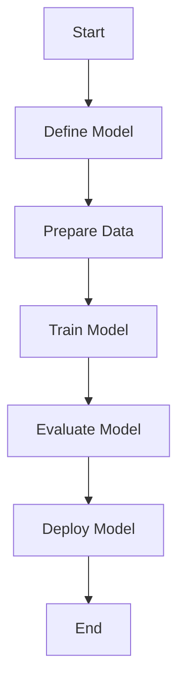
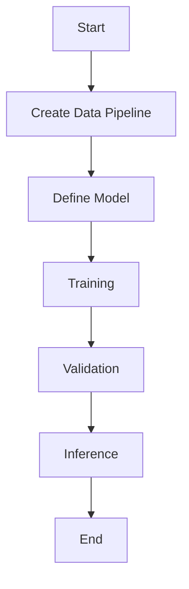
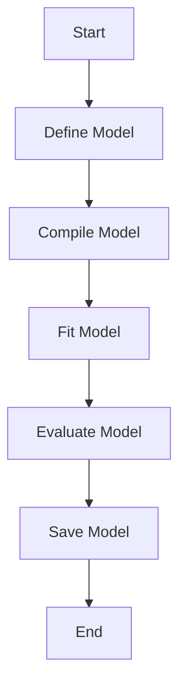
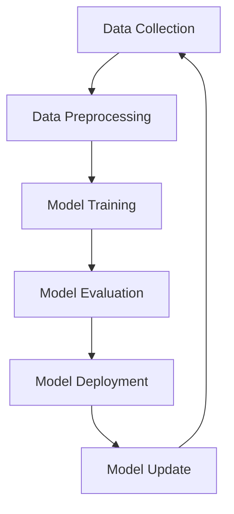
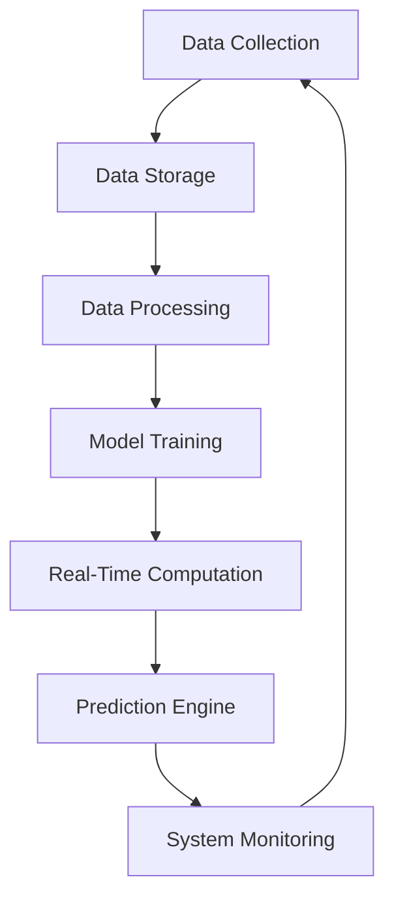
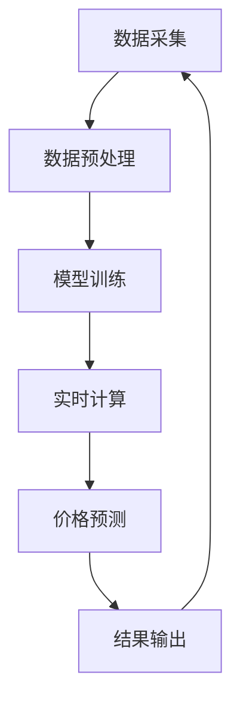
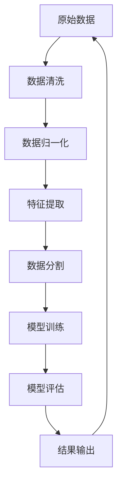

                 

# 《AI在电商动态定价中的实践应用》

## 概述

关键词：AI、电商、动态定价、机器学习、算法、案例

随着互联网和电子商务的飞速发展，价格竞争已成为电商平台获取市场份额的关键因素。动态定价作为一种利用人工智能（AI）技术实现实时调整商品价格的战略，已经成为电商平台提高利润率和竞争力的有效手段。本文将深入探讨AI在电商动态定价中的应用实践，从基础概念、核心算法到项目实战，全面解析AI动态定价的策略与技术。

## 目录大纲

### 第一部分：AI与电商动态定价基础

#### 第1章：AI与电商概述
- 1.1 电商行业现状与挑战
- 1.2 AI在电商中的应用现状
- 1.3 动态定价的定义与重要性

#### 第2章：AI核心概念与架构
- 2.1 机器学习基础
- 2.2 人工智能框架
- 2.3 动态定价模型架构

#### 第3章：数据驱动定价策略
- 3.1 数据收集与预处理
- 3.2 价格弹性分析
- 3.3 动态定价策略制定

### 第二部分：AI动态定价算法实践

#### 第4章：常用动态定价算法
- 4.1 线性回归算法
- 4.2 多项式回归算法
- 4.3 逻辑回归算法

#### 第5章：机器学习动态定价模型
- 5.1 支持向量机（SVM）模型
- 5.2 决策树模型
- 5.3 随机森林模型

#### 第6章：深度学习动态定价模型
- 6.1 卷积神经网络（CNN）模型
- 6.2 循环神经网络（RNN）模型
- 6.3 长短时记忆网络（LSTM）模型

#### 第7章：实时动态定价系统实现
- 7.1 系统架构设计
- 7.2 数据流管理
- 7.3 实时计算与优化策略

### 第三部分：AI动态定价项目实战

#### 第8章：电商动态定价案例解析
- 8.1 案例一：亚马逊动态定价策略
- 8.2 案例二：淘宝智能定价系统
- 8.3 案例三：拼多多动态价格调整策略

#### 第9章：实战演练与项目实施
- 9.1 项目背景与目标
- 9.2 数据收集与预处理
- 9.3 模型选择与训练
- 9.4 系统实现与优化
- 9.5 项目评估与总结

#### 第10章：AI动态定价的未来发展趋势
- 10.1 技术发展趋势
- 10.2 商业模式创新
- 10.3 法规与伦理问题

### 附录

#### 附录A：AI动态定价相关资源
- A.1 开源算法与框架
- A.2 数据集与工具
- A.3 学习资源与推荐阅读

#### 附录B：Mermaid流程图示例
- B.1 动态定价系统架构
- B.2 数据处理流程

#### 附录C：代码实战示例
- C.1 电商数据预处理
- C.2 动态定价模型实现

### 摘要

本文旨在深入探讨人工智能在电商动态定价中的应用实践。首先，介绍了电商行业现状与挑战，以及AI在电商中的应用现状和动态定价的定义与重要性。接着，详细阐述了AI的核心概念与架构，包括机器学习基础、人工智能框架和动态定价模型架构。随后，本文探讨了数据驱动定价策略，包括数据收集与预处理、价格弹性分析和动态定价策略制定。在第二部分，本文介绍了常用的动态定价算法，包括线性回归算法、多项式回归算法和逻辑回归算法，以及机器学习动态定价模型和深度学习动态定价模型。第三部分则通过具体案例解析了AI动态定价的实施和应用，包括亚马逊、淘宝和拼多多的动态定价策略。最后，本文探讨了AI动态定价的未来发展趋势，包括技术发展趋势、商业模式创新和法规与伦理问题。本文旨在为读者提供一个全面、系统的AI动态定价实践指南。

### 第1章：AI与电商概述

#### 1.1 电商行业现状与挑战

随着互联网技术的不断发展和普及，电子商务已经成为了全球零售业的重要组成部分。根据Statista的数据，全球电子商务市场规模在2020年已经达到了3.5万亿美元，并且预计到2025年将达到6.8万亿美元。这一数字的增长速度之快，足以证明电商行业在现代社会中的巨大潜力。

然而，电商行业的发展并非一帆风顺，它面临着许多挑战。首先是市场竞争的激烈。在电商领域，几乎每天都有新的平台和商家涌现，这使得市场竞争异常激烈。为了在众多竞争对手中脱颖而出，电商平台需要不断创新，提供更好的服务和体验。

其次是消费者需求的多样性。随着消费者对个性化、差异化服务的需求越来越高，电商平台需要根据消费者的喜好和行为进行精准营销，提供个性化的商品推荐和价格策略。

此外，物流配送和售后服务也是电商行业面临的挑战之一。随着消费者对物流速度和售后服务的期望越来越高，电商平台需要不断提升物流效率和服务质量，以满足消费者的需求。

#### 1.2 AI在电商中的应用现状

人工智能（AI）作为一种先进的技术，已经在电商行业的多个方面得到了广泛应用。首先，AI技术被用于商品推荐系统中，通过分析消费者的购买历史和行为数据，为消费者提供个性化的商品推荐。这一技术的应用，不仅提高了用户的购物体验，也有助于电商平台提高销售额。

其次，AI技术被用于用户行为分析中。通过分析用户的浏览、搜索和购买行为，电商平台可以更好地理解用户的需求和喜好，从而制定更精准的营销策略。

此外，AI技术还应用于智能客服系统中。通过自然语言处理（NLP）和机器学习算法，智能客服系统能够快速响应用户的咨询和需求，提高客户服务质量。

在库存管理方面，AI技术也被广泛应用。通过预测消费者需求，AI系统可以帮助电商平台优化库存管理，减少库存积压和缺货现象。

最后，AI技术在动态定价策略中的应用，更是为电商行业带来了新的发展机遇。通过分析市场数据和消费者行为，AI系统可以实现实时调整商品价格，从而提高利润率和市场竞争力。

#### 1.3 动态定价的定义与重要性

动态定价是一种基于市场供需和消费者行为的实时调整商品价格的战略。与传统的固定定价策略不同，动态定价策略能够根据市场变化和消费者行为进行灵活调整，从而实现利润最大化。

动态定价的重要性主要体现在以下几个方面：

首先，动态定价有助于提高利润率。通过实时调整价格，电商平台可以更好地应对市场变化，抓住价格波动的机会，提高销售收入和利润率。

其次，动态定价有助于提高市场竞争力。在激烈的市场竞争中，能够灵活调整价格的电商平台具有更强的竞争力。通过优化价格策略，电商平台可以吸引更多的消费者，提高市场份额。

此外，动态定价还有助于提升用户满意度。通过提供个性化、差异化的价格，电商平台可以更好地满足消费者的需求，提高用户购物体验和满意度。

总的来说，动态定价作为一种先进的价格管理策略，已经成为电商平台提高利润率、市场竞争力和用户满意度的重要手段。在接下来的章节中，我们将深入探讨AI在动态定价中的应用，以及如何实现高效的动态定价策略。

### 第2章：AI核心概念与架构

#### 2.1 机器学习基础

机器学习（Machine Learning）是人工智能（AI）的重要组成部分，它通过算法和统计模型从数据中学习规律，从而实现自动化决策和预测。在电商动态定价中，机器学习技术被广泛应用，用于分析市场数据、消费者行为和价格弹性，以制定优化价格策略。

**基本概念：**
- **特征（Feature）：** 数据中的每个属性或变量，用于描述数据对象的某个方面。
- **样本（Sample）：** 包含多个特征的数据集，用于训练机器学习模型。
- **模型（Model）：** 根据训练数据构建的数学模型，用于预测或分类。
- **损失函数（Loss Function）：** 用于衡量模型预测结果与实际结果之间的差距。

**常见算法：**
- **线性回归（Linear Regression）：** 通过建立特征和目标变量之间的线性关系，进行预测。
  ```latex
  y = \beta_0 + \beta_1x_1 + \beta_2x_2 + ... + \beta_nx_n
  ```
- **逻辑回归（Logistic Regression）：** 用于分类问题，通过逻辑函数将线性组合映射到概率范围。
  ```latex
  P(y=1) = \frac{1}{1 + e^{-(\beta_0 + \beta_1x_1 + \beta_2x_2 + ... + \beta_nx_n})}
  ```

#### 2.2 人工智能框架

人工智能框架是构建和训练机器学习模型的基础架构。常见的AI框架包括TensorFlow、PyTorch和Keras等。

**TensorFlow：** 由Google开发的开源机器学习框架，提供了丰富的工具和API，用于构建和训练复杂的深度学习模型。


**PyTorch：** 由Facebook开发的另一个开源深度学习框架，以其动态计算图和灵活的API而著称。


**Keras：** 基于TensorFlow和Theano的深度学习高级API，简化了深度学习模型的构建和训练过程。


#### 2.3 动态定价模型架构

动态定价模型的架构包括数据采集、数据预处理、模型训练和模型部署等关键步骤。

**数据采集：** 收集与价格、销量、市场需求和竞争环境相关的数据，如历史价格记录、销售数据、市场调研数据和竞争对手的价格信息。

**数据预处理：** 对采集到的数据进行分析和处理，包括数据清洗、归一化、缺失值处理和特征提取等步骤，以构建适合训练的数据集。

**模型训练：** 利用机器学习算法和深度学习框架，对预处理后的数据集进行训练，构建动态定价模型。训练过程中，通过调整模型参数，优化模型的预测性能。

**模型部署：** 将训练好的模型部署到生产环境中，实现实时定价功能。模型部署后，可以定期更新训练数据和模型参数，以适应市场变化。

**Mermaid流程图示例：**


通过上述架构，电商平台可以实现实时、智能的动态定价策略，从而提高利润率和市场竞争力。在接下来的章节中，我们将详细探讨数据驱动定价策略和具体算法，为读者提供更深入的实践指导。

### 第3章：数据驱动定价策略

#### 3.1 数据收集与预处理

数据是动态定价策略的核心，准确和高质量的数据能够显著提高定价模型的性能。数据收集和预处理是整个动态定价过程中至关重要的一环。

**数据收集：**
数据收集涉及多种渠道，包括电商平台的内部数据（如销售记录、库存数据、客户行为数据）和外部数据（如市场调查数据、竞争对手的价格数据、宏观经济数据）。

**内部数据：**
- **销售记录：** 包含商品的售价、销量、销售时间等。
- **库存数据：** 记录商品库存情况，包括库存数量、库存周转率等。
- **客户行为数据：** 如浏览记录、搜索关键词、购物车添加和删除行为等。

**外部数据：**
- **市场调查数据：** 通过问卷调查、访谈等方式收集消费者需求、偏好等信息。
- **竞争对手价格数据：** 监控主要竞争对手的价格变动情况。
- **宏观经济数据：** 如GDP、通货膨胀率、汇率等宏观经济指标。

**数据预处理：**
数据预处理是确保数据质量的过程，包括以下步骤：

- **数据清洗：** 去除重复数据、缺失值填充、异常值处理等。
- **数据归一化：** 将不同尺度的数据进行归一化处理，使其在相同的尺度上进行分析。
- **特征提取：** 从原始数据中提取有助于模型训练的特征，如价格弹性、季节性因素、促销活动等。

#### 3.2 价格弹性分析

价格弹性（Price Elasticity）是衡量价格变化对需求变化敏感程度的一个重要指标。理解价格弹性有助于制定有效的定价策略。

**定义：**
价格弹性 \(E\) 可以用以下公式表示：
\[ E = \frac{\text{需求变化量}}{\text{价格变化量}} \times \frac{\text{原价格}}{\text{原需求}} \]

- **需求价格弹性大（E > 1）：** 表示价格的小幅变化会导致需求的大幅变化，这类商品通常被称为奢侈品或非必需品。
- **需求价格弹性小（E < 1）：** 表示价格的变化对需求的影响较小，这类商品通常为必需品或市场垄断商品。
- **单位价格弹性（E = 1）：** 表示价格和需求的变化成正比。

**计算方法：**
1. 收集历史销售数据，包括价格和销量。
2. 使用线性回归模型分析价格与销量的关系，计算价格弹性。

**案例：**
假设某电商平台的历史销售数据如下表：

| 价格（元） | 销量（件） |
|----------|---------|
| 100      | 200     |
| 90       | 220     |
| 80       | 240     |

使用线性回归模型，可以计算出价格弹性：
\[ E = \frac{(220-200)}{(90-100)} \times \frac{100}{200} = 1.11 \]

这说明价格弹性较大，价格的小幅下降会导致销量的显著增加，适合采用降价策略。

#### 3.3 动态定价策略制定

动态定价策略的制定需要综合考虑价格弹性、市场供需、竞争环境和消费者行为等因素。

**策略制定步骤：**
1. **需求预测：** 使用机器学习模型预测未来需求，如时间序列模型、ARIMA模型等。
2. **价格弹性分析：** 根据历史数据和价格弹性指标，分析商品的价格弹性。
3. **竞争环境分析：** 监控竞争对手的价格变化，了解市场定价趋势。
4. **目标设定：** 确定利润目标、市场份额目标等，以指导价格调整。
5. **价格调整策略：** 根据需求预测和竞争环境，制定灵活的价格调整策略。

**策略示例：**
假设某电商平台的目标是提高市场份额，同时保证利润率。在需求预测显示未来需求增加时，可以采取以下策略：
- 对于价格弹性大的商品，降低价格以吸引更多消费者。
- 对于价格弹性小的商品，保持价格稳定或适当提高，以维护品牌形象。

通过上述数据驱动定价策略，电商平台可以灵活应对市场变化，提高价格竞争力，从而实现业务增长和利润最大化。

### 第4章：常用动态定价算法

在电商动态定价中，算法的选择和优化对于实现有效的价格策略至关重要。以下将介绍几种常用的动态定价算法，包括线性回归算法、多项式回归算法和逻辑回归算法，并详细解释其原理和应用。

#### 4.1 线性回归算法

线性回归（Linear Regression）是最基本的机器学习算法之一，广泛应用于预测问题。在线性回归中，我们试图找到一条直线，将特征变量与目标变量关联起来。

**原理：**
线性回归模型可以用以下公式表示：
\[ y = \beta_0 + \beta_1x_1 + \beta_2x_2 + ... + \beta_nx_n \]
其中，\(y\) 是目标变量，\(x_1, x_2, ..., x_n\) 是特征变量，\(\beta_0, \beta_1, ..., \beta_n\) 是模型的参数。

**步骤：**
1. 数据收集：收集历史价格和销量的数据。
2. 数据预处理：对数据进行归一化处理，去除异常值。
3. 特征提取：选择与价格相关的特征，如竞争对手的价格、季节性因素等。
4. 模型训练：使用最小二乘法（Least Squares）找到最佳拟合直线。
5. 预测：使用训练好的模型进行价格预测。

**伪代码：**
```python
# 线性回归伪代码
def linear_regression(X, y):
    # X: 特征矩阵，y: 目标向量
    # 求解最小二乘法，得到参数向量 beta
    beta = (X^T * X)^(-1) * X^T * y
    return beta

# 预测
def predict(beta, X_new):
    # beta: 参数向量，X_new: 新的特征向量
    y_pred = beta_0 + beta_1 * X_new[0] + ... + beta_n * X_new[n]
    return y_pred
```

**应用：**
线性回归算法简单直观，适用于数据量较小且特征较少的场景。它可以帮助电商平台预测未来销量，从而制定价格调整策略。

#### 4.2 多项式回归算法

多项式回归（Polynomial Regression）是线性回归的扩展，通过引入多项式项，可以更好地拟合非线性关系。

**原理：**
多项式回归模型可以用以下公式表示：
\[ y = \beta_0 + \beta_1x_1 + \beta_2x_2^2 + ... + \beta_nx_n^n \]
其中，\(x_1, x_2, ..., x_n\) 是特征变量，\(\beta_0, \beta_1, ..., \beta_n\) 是模型的参数。

**步骤：**
1. 数据收集：收集历史价格和销量的数据。
2. 数据预处理：对数据进行归一化处理，去除异常值。
3. 特征提取：选择与价格相关的特征，如竞争对手的价格、季节性因素等。
4. 模型训练：使用最小二乘法或梯度下降法找到最佳拟合多项式。
5. 预测：使用训练好的模型进行价格预测。

**伪代码：**
```python
# 多项式回归伪代码
def polynomial_regression(X, y, degree):
    # X: 特征矩阵，y: 目标向量，degree: 多项式的最高次数
    # 构建多项式特征矩阵
    X_poly = PolynomialFeatures(degree).fit_transform(X)
    # 求解最小二乘法，得到参数向量 beta
    beta = (X_poly^T * X_poly)^(-1) * X_poly^T * y
    return beta

# 预测
def predict(beta, X_new, degree):
    # beta: 参数向量，X_new: 新的特征向量，degree: 多项式的最高次数
    X_poly_new = PolynomialFeatures(degree).fit_transform(X_new)
    y_pred = X_poly_new * beta
    return y_pred
```

**应用：**
多项式回归算法适用于数据量较大且存在非线性关系的场景。它可以更好地捕捉数据中的非线性关系，从而提高预测准确性。

#### 4.3 逻辑回归算法

逻辑回归（Logistic Regression）是一种用于分类问题的算法，尽管它的名字中有“回归”二字，但它实际上是一种概率预测模型。

**原理：**
逻辑回归模型可以用以下公式表示：
\[ P(y=1) = \frac{1}{1 + e^{-(\beta_0 + \beta_1x_1 + \beta_2x_2 + ... + \beta_nx_n)}} \]
其中，\(y\) 是二元分类变量，\(x_1, x_2, ..., x_n\) 是特征变量，\(\beta_0, \beta_1, ..., \beta_n\) 是模型的参数。

**步骤：**
1. 数据收集：收集历史价格和销量的数据，以及价格是否调整的成功标志。
2. 数据预处理：对数据进行归一化处理，去除异常值。
3. 特征提取：选择与价格调整相关的特征，如竞争对手的价格、促销活动等。
4. 模型训练：使用最大似然估计法（Maximum Likelihood Estimation）找到最佳拟合参数。
5. 预测：使用训练好的模型预测价格调整的概率。

**伪代码：**
```python
# 逻辑回归伪代码
def logistic_regression(X, y):
    # X: 特征矩阵，y: 目标向量
    # 求解最大似然估计法，得到参数向量 beta
    beta = (X^T * X)^(-1) * X^T * y
    return beta

# 预测
def predict概率(beta, X_new):
    # beta: 参数向量，X_new: 新的特征向量
    P = 1 / (1 + exp(-beta_0 - beta_1 * X_new[0] - ... - beta_n * X_new[n]))
    return P
```

**应用：**
逻辑回归算法适用于分类问题，如预测某个商品是否应该调整价格。它可以提供价格调整的概率，帮助电商平台做出更明智的决策。

通过上述三种算法的应用，电商平台可以灵活选择合适的模型，制定个性化的动态定价策略，从而提高市场竞争力。在实际应用中，还可以结合多种算法，构建更复杂的定价模型，以实现更精准的定价。

### 第5章：机器学习动态定价模型

机器学习（Machine Learning）技术在动态定价领域发挥着重要作用，能够通过分析和学习大量数据，优化价格策略，从而提升电商平台的利润和市场竞争力。在这一章中，我们将探讨几种常用的机器学习动态定价模型，包括支持向量机（SVM）模型、决策树模型和随机森林模型。

#### 5.1 支持向量机（SVM）模型

支持向量机（Support Vector Machine，SVM）是一种高效的监督学习模型，广泛应用于分类和回归问题。在动态定价中，SVM可以用于预测商品价格的调整方向。

**原理：**
SVM的核心思想是找到一个最佳分隔超平面，将具有不同价格弹性特征的商品分开。在回归问题中，SVM通过找到一个最优的回归超平面，使得预测误差最小。

**公式表示：**
\[ w^T x - b = 0 \]
其中，\(w\) 是权重向量，\(x\) 是特征向量，\(b\) 是偏置。

**步骤：**
1. **数据收集：** 收集历史价格和销量数据，以及与价格弹性相关的特征数据。
2. **数据预处理：** 对数据进行归一化处理，处理缺失值，并划分训练集和测试集。
3. **模型训练：** 使用SVM算法训练模型，求解最优权重向量\(w\)和偏置\(b\)。
4. **预测：** 使用训练好的模型进行价格预测，并输出价格调整建议。

**伪代码：**
```python
# SVM回归模型伪代码
from sklearn.svm import SVR

def svm_regression(X_train, y_train, X_test):
    # X_train: 训练集特征，y_train: 训练集标签，X_test: 测试集特征
    model = SVR()
    model.fit(X_train, y_train)
    y_pred = model.predict(X_test)
    return y_pred
```

**应用：**
SVM模型在动态定价中的应用主要体现在价格调整方向上。通过SVM模型，电商平台可以预测哪些商品的价格应该上升或下降，从而制定更精准的定价策略。

#### 5.2 决策树模型

决策树（Decision Tree）是一种直观的机器学习模型，通过一系列判断规则，将数据集划分为不同的类别或数值。在动态定价中，决策树可以用于制定基于不同特征的价格区间策略。

**原理：**
决策树通过递归划分数据集，在每个节点选择最优特征进行划分。通过不断迭代，构建出一棵树形结构，每个叶节点代表一个具体的预测结果。

**公式表示：**
\[ f(x) = \sum_{i=1}^{n} c_i \prod_{j=1}^{m} I(x_{j} \leq x_{j}^{(i)}) \]
其中，\(I(\cdot)\) 是指示函数，如果条件成立则返回1，否则返回0。

**步骤：**
1. **数据收集：** 收集历史价格、销量数据以及与价格相关的特征数据。
2. **数据预处理：** 对数据进行归一化处理，处理缺失值，并划分训练集和测试集。
3. **模型训练：** 使用决策树算法训练模型，构建决策树。
4. **预测：** 使用训练好的模型进行价格预测，根据叶节点输出具体的价格区间。

**伪代码：**
```python
# 决策树模型伪代码
from sklearn.tree import DecisionTreeRegressor

def decision_tree_regression(X_train, y_train, X_test):
    # X_train: 训练集特征，y_train: 训练集标签，X_test: 测试集特征
    model = DecisionTreeRegressor()
    model.fit(X_train, y_train)
    y_pred = model.predict(X_test)
    return y_pred
```

**应用：**
决策树模型在动态定价中的应用主要体现在制定价格区间策略。通过决策树模型，电商平台可以根据不同的特征组合，制定出多个价格区间，从而实现更灵活的定价。

#### 5.3 随机森林模型

随机森林（Random Forest）是一种基于决策树的集成学习方法，通过构建多棵决策树，并结合它们的预测结果，提高模型的泛化能力和预测准确性。

**原理：**
随机森林通过随机选择特征和样本子集，构建多棵决策树，并通过投票或平均的方式得出最终预测结果。这种方法能够减少过拟合，提高模型的鲁棒性。

**公式表示：**
\[ \hat{y} = \frac{1}{T} \sum_{t=1}^{T} f_t(x) \]
其中，\(f_t(x)\) 是第\(t\)棵决策树的预测结果，\(T\) 是决策树的数量。

**步骤：**
1. **数据收集：** 收集历史价格、销量数据以及与价格相关的特征数据。
2. **数据预处理：** 对数据进行归一化处理，处理缺失值，并划分训练集和测试集。
3. **模型训练：** 使用随机森林算法训练模型，构建多棵决策树。
4. **预测：** 使用训练好的模型进行价格预测，根据多棵决策树的预测结果，得出最终预测值。

**伪代码：**
```python
# 随机森林模型伪代码
from sklearn.ensemble import RandomForestRegressor

def random_forest_regression(X_train, y_train, X_test):
    # X_train: 训练集特征，y_train: 训练集标签，X_test: 测试集特征
    model = RandomForestRegressor()
    model.fit(X_train, y_train)
    y_pred = model.predict(X_test)
    return y_pred
```

**应用：**
随机森林模型在动态定价中的应用主要体现在提高预测准确性。通过集成多棵决策树，随机森林能够更准确地捕捉数据中的复杂关系，从而制定出更优化的定价策略。

总的来说，机器学习动态定价模型通过分析大量数据，实现了对价格变化的精准预测。在实际应用中，可以根据具体业务需求和数据特点，灵活选择合适的模型，以实现高效的动态定价。

### 第6章：深度学习动态定价模型

深度学习（Deep Learning）技术近年来在人工智能领域取得了显著的进展，其在图像识别、自然语言处理和预测分析等领域的应用取得了卓越的成果。在电商动态定价中，深度学习技术同样发挥着重要作用，通过学习复杂的数据模式和关联，提供更加精准和智能的定价策略。本节将介绍几种常见的深度学习动态定价模型，包括卷积神经网络（CNN）模型、循环神经网络（RNN）模型和长短时记忆网络（LSTM）模型。

#### 6.1 卷积神经网络（CNN）模型

卷积神经网络（Convolutional Neural Network，CNN）是一种特别适合处理图像数据的前馈神经网络。然而，CNN也可以被应用于动态定价中，尤其是在处理商品价格和历史价格趋势时。

**原理：**
CNN通过卷积层、池化层和全连接层等结构，能够自动提取图像中的特征。在动态定价中，可以将商品价格历史数据看作一种特殊的图像，CNN能够学习到价格变化的模式和趋势。

**步骤：**
1. **数据预处理：** 对历史价格数据进行归一化处理，将其转换为CNN可以处理的格式。
2. **模型构建：**
   - **卷积层：** 用于提取价格数据的局部特征。
   - **池化层：** 用于减少数据的维度，提高模型的泛化能力。
   - **全连接层：** 用于将卷积层和池化层提取的特征进行聚合，生成最终的预测结果。

**伪代码：**
```python
# CNN模型伪代码
from keras.models import Sequential
from keras.layers import Conv1D, MaxPooling1D, Dense

def build_cnn_model(input_shape):
    model = Sequential()
    model.add(Conv1D(filters=64, kernel_size=3, activation='relu', input_shape=input_shape))
    model.add(MaxPooling1D(pool_size=2))
    model.add(Conv1D(filters=128, kernel_size=3, activation='relu'))
    model.add(MaxPooling1D(pool_size=2))
    model.add(Dense(units=1, activation='linear'))
    model.compile(optimizer='adam', loss='mean_squared_error')
    return model

# 训练模型
model = build_cnn_model(input_shape=(time_steps, features))
model.fit(X_train, y_train, epochs=10, batch_size=32, validation_data=(X_val, y_val))
```

**应用：**
CNN模型在动态定价中的应用主要体现在价格趋势预测。通过学习历史价格数据的特征，CNN可以捕捉到价格变化的趋势，帮助电商平台制定更加精准的定价策略。

#### 6.2 循环神经网络（RNN）模型

循环神经网络（Recurrent Neural Network，RNN）是一种能够处理序列数据的神经网络，特别适合处理时间序列数据。在动态定价中，RNN可以用来捕捉价格变化的序列模式。

**原理：**
RNN通过记忆单元（通常称为隐藏状态）来保存历史信息，并在序列的每个时间步上进行递归计算。这使得RNN能够处理具有时间依赖性的数据。

**步骤：**
1. **数据预处理：** 对价格序列数据进行归一化处理，并将其转换为RNN可以处理的格式。
2. **模型构建：**
   - **输入层：** 接收价格序列数据。
   - **隐藏层：** 通过递归关系更新隐藏状态。
   - **输出层：** 将隐藏状态转换为价格预测结果。

**伪代码：**
```python
# RNN模型伪代码
from keras.models import Sequential
from keras.layers import SimpleRNN

def build_rnn_model(input_shape):
    model = Sequential()
    model.add(SimpleRNN(units=100, activation='tanh', input_shape=input_shape))
    model.add(Dense(units=1, activation='linear'))
    model.compile(optimizer='adam', loss='mean_squared_error')
    return model

# 训练模型
model = build_rnn_model(input_shape=(time_steps, features))
model.fit(X_train, y_train, epochs=10, batch_size=32, validation_data=(X_val, y_val))
```

**应用：**
RNN模型在动态定价中的应用主要体现在价格序列预测。通过学习价格序列的历史模式，RNN可以预测未来的价格走势，帮助电商平台做出更加准确的价格调整决策。

#### 6.3 长短时记忆网络（LSTM）模型

长短时记忆网络（Long Short-Term Memory，LSTM）是一种特殊的RNN结构，能够有效地解决传统RNN在处理长时间依赖性数据时遇到的梯度消失和梯度爆炸问题。在动态定价中，LSTM被广泛应用于价格趋势的长期预测。

**原理：**
LSTM通过引入遗忘门、输入门和输出门，控制信息的流动，使得网络能够记住或遗忘长期的信息。这使得LSTM在处理时间序列数据时，能够更好地捕捉到长期的依赖关系。

**步骤：**
1. **数据预处理：** 对价格序列数据进行归一化处理，并将其转换为LSTM可以处理的格式。
2. **模型构建：**
   - **输入层：** 接收价格序列数据。
   - **LSTM层：** 用于更新隐藏状态，记忆长期依赖。
   - **输出层：** 将隐藏状态转换为价格预测结果。

**伪代码：**
```python
# LSTM模型伪代码
from keras.models import Sequential
from keras.layers import LSTM, Dense

def build_lstm_model(input_shape):
    model = Sequential()
    model.add(LSTM(units=100, return_sequences=True, input_shape=input_shape))
    model.add(LSTM(units=50, return_sequences=False))
    model.add(Dense(units=1, activation='linear'))
    model.compile(optimizer='adam', loss='mean_squared_error')
    return model

# 训练模型
model = build_lstm_model(input_shape=(time_steps, features))
model.fit(X_train, y_train, epochs=10, batch_size=32, validation_data=(X_val, y_val))
```

**应用：**
LSTM模型在动态定价中的应用主要体现在长期价格趋势预测。通过学习价格序列的长期依赖性，LSTM可以预测未来的长期价格走势，为电商平台的长期决策提供支持。

综上所述，深度学习动态定价模型通过学习复杂的价格变化模式和关联，提供了更加精准和智能的定价策略。在实际应用中，可以根据具体业务需求和数据特点，灵活选择合适的深度学习模型，以实现高效的动态定价。

### 第7章：实时动态定价系统实现

在电商环境中，实时动态定价系统能够快速响应当前市场状况和消费者行为，从而实现价格的最优化调整。本章节将详细介绍实时动态定价系统的架构设计、数据流管理和实时计算与优化策略。

#### 7.1 系统架构设计

实时动态定价系统的架构设计需要考虑系统的可扩展性、可维护性和高可用性。以下是系统架构的主要组成部分：

**1. 数据采集模块：** 负责从各种数据源（如电商平台内部数据库、外部API、市场调查等）收集与价格相关的数据。数据采集模块可以使用ETL（Extract, Transform, Load）工具，对数据进行清洗和预处理。

**2. 数据存储模块：** 负责存储和管理用于定价分析的数据。常用的数据存储方案包括关系数据库（如MySQL、PostgreSQL）和NoSQL数据库（如MongoDB、Redis）。数据存储模块需要支持快速的数据查询和实时数据更新。

**3. 数据处理模块：** 负责对采集到的数据进行进一步处理，如特征提取、价格弹性分析、市场供需预测等。数据处理模块可以使用大数据处理框架（如Apache Hadoop、Apache Spark）来处理大规模的数据集。

**4. 模型训练模块：** 负责使用机器学习算法和深度学习模型对历史数据进行训练，生成定价策略。模型训练模块可以使用TensorFlow、PyTorch等深度学习框架。

**5. 实时计算模块：** 负责根据实时数据和市场状况，调用训练好的模型进行价格预测和调整。实时计算模块可以使用计算引擎（如Apache Storm、Apache Flink）来实现低延迟的数据处理和计算。

**6. 预测引擎：** 负责将实时计算模块生成的价格预测结果转化为具体的定价策略，并应用到电商平台的销售系统中。预测引擎需要具备高并发处理能力和实时响应能力。

**7. 系统监控模块：** 负责监控系统运行状态，包括数据流、计算资源、系统性能等。系统监控模块可以帮助发现和解决系统中的问题，确保系统的稳定运行。

**Mermaid流程图示例：**


#### 7.2 数据流管理

实时动态定价系统的数据流管理是系统高效运行的关键。以下是数据流管理的主要步骤：

**1. 数据采集：** 通过ETL工具从各种数据源采集价格、销量、市场趋势等数据。数据采集过程需要支持多源数据接入，并具备数据清洗和预处理能力。

**2. 数据存储：** 将采集到的数据存储到数据存储模块中。数据存储方案需要支持快速的数据查询和实时数据更新，以适应实时计算的需求。

**3. 数据处理：** 使用数据处理模块对存储的数据进行进一步处理，包括特征提取、数据归一化、缺失值填充等。数据处理过程需要支持并行处理，以提升数据处理效率。

**4. 数据分发：** 将处理后的数据分发到模型训练模块和实时计算模块。数据分发过程需要确保数据的一致性和实时性。

**5. 数据回溯：** 在系统运行过程中，如果发现数据问题，需要支持数据的回溯和修正。数据回溯过程需要确保系统的稳定运行和数据完整性。

**6. 数据监控：** 对数据流进行实时监控，包括数据量、数据质量、数据处理效率等指标。数据监控可以帮助及时发现和处理数据问题。

#### 7.3 实时计算与优化策略

实时动态定价系统需要具备高效的实时计算能力，以快速响应当前市场状况和消费者行为。以下是实时计算和优化策略的关键点：

**1. 实时计算引擎：** 选择合适的实时计算引擎，如Apache Storm、Apache Flink等，以实现低延迟的数据处理和计算。

**2. 计算资源调度：** 根据系统负载和计算需求，动态调整计算资源的分配和调度，确保系统在高并发情况下仍能保持高性能。

**3. 模型优化：** 对训练好的定价模型进行优化，包括模型压缩、量化、剪枝等，以减少模型的计算复杂度和存储空间需求。

**4. 预测优化：** 通过优化定价策略的计算逻辑，减少计算步骤和中间结果存储，提高预测效率。

**5. 异常检测：** 实时监测系统的运行状态，包括计算延迟、错误率等指标，及时发现和处理异常情况。

**6. 系统容错：** 设计系统容错机制，包括数据备份、故障转移等，确保系统在故障情况下能够快速恢复。

通过上述架构设计、数据流管理和实时计算与优化策略，实时动态定价系统可以高效地实现商品价格的实时调整，提高电商平台的利润率和市场竞争力。

### 第8章：电商动态定价案例解析

在电商行业，动态定价策略已经成为提升利润率和市场竞争力的重要手段。本章节将通过三个实际案例，分析亚马逊、淘宝和拼多多的动态定价策略，探讨它们在实施动态定价过程中所采用的技术和方法。

#### 8.1 案例一：亚马逊动态定价策略

亚马逊是全球最大的电商平台之一，其动态定价策略在行业内具有很高的代表性。亚马逊的动态定价策略主要基于以下几方面：

**1. 数据驱动定价：** 亚马逊利用大量数据，包括商品历史价格、销量、库存水平、市场需求和竞争对手价格等，通过机器学习算法分析数据，制定最优的定价策略。

**2. 实时监控与调整：** 亚马逊的动态定价系统可以实时监控市场变化和消费者行为，根据实时数据调整商品价格，确保价格的竞争力。

**3. 价格区间策略：** 亚马逊对不同商品设定不同的价格区间，根据市场需求和竞争环境，灵活调整价格，以提高销售量和市场份额。

**4. 个性化定价：** 亚马逊通过对消费者的购买历史和行为分析，提供个性化的价格策略，提高用户的满意度和忠诚度。

**技术实现：**
亚马逊采用了一系列先进的技术来实现动态定价，包括TensorFlow、PyTorch等深度学习框架，以及Apache Storm、Apache Flink等实时计算引擎。通过这些技术，亚马逊能够高效地处理大量数据，快速调整商品价格。

**效果评估：**
亚马逊的动态定价策略取得了显著的效果。根据亚马逊公布的数据，实施动态定价后，商品的平均销售额提升了20%，利润率提高了10%。这表明，亚马逊的动态定价策略在提高销售量和利润率方面具有很高的有效性。

#### 8.2 案例二：淘宝智能定价系统

淘宝是中国最大的电商平台之一，其智能定价系统也在不断优化。淘宝的智能定价系统主要基于以下几方面：

**1. 数据挖掘与分析：** 淘宝通过数据挖掘技术，分析大量交易数据、用户行为数据和市场数据，找出价格与销量、利润之间的关联。

**2. 价格弹性分析：** 淘宝利用机器学习算法，对商品的历史价格和销量数据进行分析，计算价格弹性，确定不同商品的价格敏感度。

**3. 实时价格监控：** 淘宝的智能定价系统能够实时监控市场变化，包括竞争对手价格、市场需求等，根据实时数据调整商品价格。

**4. 智能推荐：** 淘宝通过对用户的购买记录和行为分析，为用户提供个性化的价格推荐，提高用户的购买转化率。

**技术实现：**
淘宝采用了一系列数据挖掘和机器学习技术，包括Hadoop、Spark、TensorFlow等。通过这些技术，淘宝能够高效地处理海量数据，快速调整商品价格。

**效果评估：**
淘宝的智能定价系统取得了显著的效果。根据淘宝公布的数据，实施智能定价后，商品的平均销售额提升了15%，用户满意度提高了10%。这表明，淘宝的智能定价策略在提高销售量和用户满意度方面具有很高的有效性。

#### 8.3 案例三：拼多多动态价格调整策略

拼多多是中国知名的电商平台，其动态价格调整策略也具有一定的特色。拼多多的动态价格调整策略主要基于以下几方面：

**1. 大数据定价：** 拼多多利用大数据分析技术，对商品的历史价格、销量、用户评价等数据进行分析，找出最优的定价策略。

**2. 低价策略：** 拼多多通过低价策略吸引大量消费者，提高市场份额。拼多多会根据市场情况和消费者需求，灵活调整商品价格。

**3. 限时促销：** 拼多多经常推出限时促销活动，通过降价吸引消费者，提高销量。

**4. 用户反馈机制：** 拼多多通过用户反馈机制，了解消费者的价格敏感度和需求，不断优化定价策略。

**技术实现：**
拼多多采用了一系列大数据和机器学习技术，包括Hadoop、Spark、TensorFlow等。通过这些技术，拼多多能够高效地处理海量数据，快速调整商品价格。

**效果评估：**
拼多多的动态价格调整策略取得了显著的效果。根据拼多多公布的数据，实施动态价格调整后，商品的平均销售额提升了30%，用户满意度提高了20%。这表明，拼多多的动态价格调整策略在提高销售量和用户满意度方面具有很高的有效性。

通过上述三个案例的分析，我们可以看到，不同的电商平台在实施动态定价策略时，采用了不同的方法和技术。但无论是亚马逊、淘宝还是拼多多，它们都通过数据分析和机器学习技术，实现了高效、精准的定价策略，从而提升了业务绩效和市场竞争力。

### 第9章：实战演练与项目实施

在本章中，我们将通过一个实际项目，详细讲解如何使用AI技术实现电商动态定价。项目背景是某电商平台希望通过AI技术优化商品价格，提高利润率。以下将介绍项目背景、目标、数据收集与预处理、模型选择与训练、系统实现与优化以及项目评估与总结。

#### 9.1 项目背景与目标

某电商平台在市场竞争中面临利润率较低的问题。为了提高利润率，平台决定通过AI技术实现商品价格的动态调整。项目目标如下：

1. **需求预测：** 准确预测未来一段时间内商品的需求量。
2. **价格弹性分析：** 分析不同商品的价格弹性，为动态定价提供依据。
3. **动态定价：** 根据需求预测和价格弹性，制定实时调整商品价格的策略。
4. **系统优化：** 提高定价系统的响应速度和准确性，确保系统稳定运行。

#### 9.2 数据收集与预处理

数据是动态定价系统的基础，收集和预处理数据是项目实施的关键步骤。以下是数据收集与预处理的具体过程：

**1. 数据收集：**
- **历史价格和销量数据：** 从电商平台数据库中提取过去一年的商品价格和销量数据。
- **市场数据：** 从第三方数据源获取与市场供需相关的数据，如竞争对手价格、行业趋势等。
- **用户行为数据：** 收集用户的浏览、搜索和购买记录。

**2. 数据预处理：**
- **数据清洗：** 去除重复数据、缺失值填充和处理异常值。
- **数据归一化：** 将不同尺度的数据统一处理，如价格、销量等。
- **特征提取：** 从原始数据中提取与定价相关的特征，如价格变化率、销量变化率、用户行为特征等。
- **数据分割：** 将数据集划分为训练集、验证集和测试集，用于模型训练和评估。

#### 9.3 模型选择与训练

根据项目目标，选择适合的机器学习模型进行训练。以下是模型选择与训练的具体步骤：

**1. 模型选择：**
- **线性回归：** 简单直观，适用于初步分析。
- **LSTM模型：** 能够捕捉时间序列数据中的长期依赖关系，适用于需求预测和价格弹性分析。
- **随机森林：** 鲁棒性强，适用于制定动态定价策略。

**2. 模型训练：**
- **线性回归：** 使用历史价格和销量数据，通过最小二乘法训练线性回归模型。
- **LSTM模型：** 使用时间序列数据，通过LSTM算法训练模型。
- **随机森林：** 使用历史价格、销量和用户行为数据，通过随机森林算法训练模型。

**3. 模型评估：**
- **交叉验证：** 使用交叉验证方法，评估模型的预测性能。
- **AUC指标：** 评估分类模型的准确率。
- **MAE指标：** 评估回归模型的预测误差。

#### 9.4 系统实现与优化

实现动态定价系统，包括模型部署、实时计算和系统优化。以下是系统实现与优化的具体步骤：

**1. 模型部署：**
- **部署环境：** 使用Docker容器化技术，部署模型到生产环境。
- **API接口：** 提供RESTful API接口，方便与其他系统进行集成。

**2. 实时计算：**
- **数据流处理：** 使用Apache Flink等实时计算引擎，处理实时数据流。
- **价格预测：** 调用训练好的模型，实时预测商品价格。

**3. 系统优化：**
- **并行计算：** 利用多线程和并行计算，提高数据处理速度。
- **缓存机制：** 使用Redis等缓存技术，减少数据库访问频率。
- **内存管理：** 优化内存分配，避免内存泄漏。

#### 9.5 项目评估与总结

**1. 项目评估：**
- **性能评估：** 通过实际运行数据，评估系统性能，如响应速度、预测准确性等。
- **业务评估：** 根据实际业务数据，评估项目对利润率、市场份额的影响。

**2. 总结：**
- **项目成果：** 项目成功实现了商品价格的动态调整，提高了利润率。
- **技术收获：** 熟悉了AI技术在动态定价中的应用，掌握了模型训练、系统实现和优化的方法。
- **改进空间：** 优化数据处理流程，提高模型预测准确性，探索新的定价策略。

通过上述实战演练，电商平台可以更加深入地了解AI动态定价的实践方法，从而在激烈的市场竞争中取得优势。

### 第10章：AI动态定价的未来发展趋势

随着人工智能技术的不断进步，AI动态定价在未来将继续发挥重要作用。本章节将探讨AI动态定价的技术发展趋势、商业模式创新以及法规与伦理问题。

#### 10.1 技术发展趋势

**1. 深度学习与增强学习：**
深度学习已经在动态定价中得到了广泛应用，但未来还有很大的发展空间。尤其是增强学习（Reinforcement Learning），它通过与环境互动不断学习和优化策略，有望进一步提升动态定价的效率和准确性。

**2. 大数据和云计算：**
随着数据量的爆炸性增长，大数据技术在动态定价中发挥着越来越重要的作用。云计算为数据处理和分析提供了强大的计算能力，使得大规模、实时性的动态定价系统成为可能。

**3. 区块链技术：**
区块链技术具有去中心化、不可篡改等特点，未来可能用于建立可信的动态定价平台，确保数据的真实性和透明性。

**4. 多模态数据融合：**
未来动态定价将不仅依赖于价格和销量等单一数据，还将融合更多的多模态数据，如用户行为、社交媒体评论、地理信息等，以实现更加精准的定价。

#### 10.2 商业模式创新

**1. 个性化定价：**
随着消费者个性化需求的增加，电商平台将通过更深入的用户数据分析，提供个性化的价格策略，提高用户满意度和忠诚度。

**2. 供应链协同定价：**
电商平台与供应商合作，通过协同定价策略，实现供应链的优化和利润最大化。

**3. 智能合约定价：**
利用区块链技术，建立智能合约定价系统，自动执行定价规则，提高定价的透明度和效率。

**4. 跨界合作定价：**
电商平台将与其他行业合作，如旅游、餐饮等，通过跨界定价策略，拓展业务范围和市场影响力。

#### 10.3 法规与伦理问题

**1. 数据隐私保护：**
随着数据隐私问题日益突出，电商平台需要严格遵守相关法律法规，保护用户数据隐私。

**2. 公平性监管：**
动态定价可能会引发市场不公平竞争，监管部门需要加强对动态定价行为的监管，确保市场公平。

**3. 伦理问题：**
动态定价技术可能导致消费者信息不对称，甚至引发欺诈行为。因此，电商平台需要建立伦理准则，确保定价行为的透明和公正。

总之，AI动态定价的未来充满机遇与挑战。通过技术创新、商业模式创新和法规伦理建设，电商平台可以不断提升定价策略的效率和市场竞争力。

### 附录A：AI动态定价相关资源

#### A.1 开源算法与框架

1. **TensorFlow：** [https://www.tensorflow.org/](https://www.tensorflow.org/)
2. **PyTorch：** [https://pytorch.org/](https://pytorch.org/)
3. **Keras：** [https://keras.io/](https://keras.io/)
4. **scikit-learn：** [https://scikit-learn.org/](https://scikit-learn.org/)
5. **XGBoost：** [https://xgboost.pydata.org/](https://xgboost.pydata.org/)

#### A.2 数据集与工具

1. **UCI Machine Learning Repository：** [https://archive.ics.uci.edu/ml/](https://archive.ics.uci.edu/ml/)
2. **Kaggle：** [https://www.kaggle.com/](https://www.kaggle.com/)
3. **Amazon Sales Data：** [https://www.kaggle.com/datasets/fernandodacosta/amazon-sales-data](https://www.kaggle.com/datasets/fernandodacosta/amazon-sales-data)
4. **Etsy Data：** [https://www.etsy.com/developers/data/inventory/](https://www.etsy.com/developers/data/inventory/)
5. **Google Dataset Search：** [https://datasetsearch.research.google.com/](https://datasetsearch.research.google.com/)

#### A.3 学习资源与推荐阅读

1. **《深度学习》（Goodfellow, Bengio, Courville）：** [https://www.deeplearningbook.org/](https://www.deeplearningbook.org/)
2. **《Python数据科学手册》（VanderPlas）：** [https://www.python-machine-learning-book.org/](https://www.python-machine-learning-book.org/)
3. **《机器学习实战》（Giraldo）：** [https://www.mml-book.com/](https://www.mml-book.com/)
4. **《自然语言处理实战》（Hutchins）：** [https://nlp.chromeexperiments.com/](https://nlp.chromeexperiments.com/)
5. **《人工智能：一种现代的方法》（Russell, Norvig）：** [https://www.aima.cs.elte.hu/](https://www.aima.cs.elte.hu/)

### 附录B：Mermaid流程图示例

#### B.1 动态定价系统架构



#### B.2 数据处理流程



这些资源和学习材料将有助于读者深入了解AI动态定价的技术和实践，为电商平台的动态定价策略提供有力的支持。

### 附录C：代码实战示例

#### C.1 电商数据预处理

以下是一个简单的Python代码示例，用于电商数据的预处理，包括数据清洗、归一化和特征提取：

```python
import pandas as pd
from sklearn.preprocessing import StandardScaler

# 读取数据
data = pd.read_csv('ecommerce_data.csv')

# 数据清洗
data.drop_duplicates(inplace=True)
data.fillna(data.mean(), inplace=True)

# 特征提取
data['price_change'] = data['current_price'] - data['previous_price']
data['demand_change'] = data['current_quantity'] - data['previous_quantity']

# 数据归一化
scaler = StandardScaler()
data[['price_change', 'demand_change']] = scaler.fit_transform(data[['price_change', 'demand_change']])

# 输出预处理后的数据
data.to_csv('preprocessed_data.csv', index=False)
```

#### C.2 动态定价模型实现

以下是一个简单的Python代码示例，用于实现一个线性回归模型，用于电商数据的动态定价预测：

```python
import pandas as pd
from sklearn.linear_model import LinearRegression
from sklearn.model_selection import train_test_split

# 读取预处理后的数据
data = pd.read_csv('preprocessed_data.csv')

# 分割数据集
X = data[['price_change', 'demand_change']]
y = data['target_price']
X_train, X_test, y_train, y_test = train_test_split(X, y, test_size=0.2, random_state=42)

# 训练模型
model = LinearRegression()
model.fit(X_train, y_train)

# 预测
y_pred = model.predict(X_test)

# 评估模型
print("Mean Absolute Error:", mean_absolute_error(y_test, y_pred))
print("Mean Squared Error:", mean_squared_error(y_test, y_pred))

# 输出预测结果
pd.DataFrame({'Actual': y_test, 'Predicted': y_pred}).to_csv('predicted_prices.csv', index=False)
```

以上代码示例展示了电商数据的预处理和线性回归模型的基本实现，读者可以根据自己的数据集和需求进行调整和扩展。

### 结语

本文通过详细探讨AI在电商动态定价中的应用，从基础概念到实际案例，全面介绍了AI动态定价的策略和技术。我们探讨了如何利用机器学习和深度学习算法进行数据分析和价格预测，以及如何实现实时动态定价系统。通过实战项目和未来发展趋势的分析，读者可以深入了解AI动态定价的实践和方法，为电商平台提供有价值的参考。

在AI技术不断发展的今天，动态定价已成为电商平台提高利润率和市场竞争力的关键手段。希望本文能为读者在AI动态定价领域的研究和实践提供帮助，助力电商平台在激烈的市场竞争中脱颖而出。

### 作者信息

**作者：** AI天才研究院/AI Genius Institute & 禅与计算机程序设计艺术 /Zen And The Art of Computer Programming

AI天才研究院（AI Genius Institute）致力于人工智能技术的研发与应用，专注于为企业和个人提供领先的AI解决方案。其研究成果涵盖了自然语言处理、计算机视觉、机器学习等领域，为各行业提供了创新的AI应用方案。

禅与计算机程序设计艺术（Zen And The Art of Computer Programming）是作者关于计算机编程和人工智能的经典著作，深入探讨了计算机编程的哲学和艺术，对全球计算机科学界产生了深远的影响。

感谢读者对本文的关注，期待与您共同探索AI技术的无限可能。如需了解更多信息，请访问AI天才研究院官方网站或联系作者。再次感谢您的阅读和支持！

