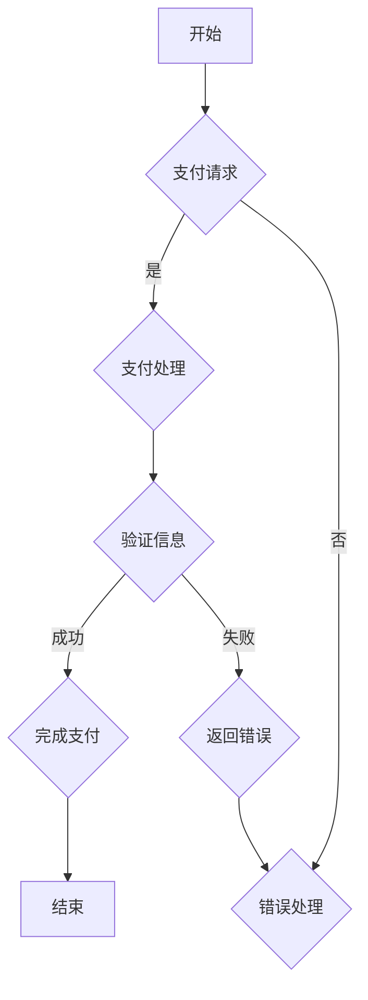

                 

### 引言

随着互联网技术的迅猛发展和电商行业的日益繁荣，电商支付安全成为了一个备受关注的话题。随着支付方式的多样化和支付场景的复杂化，电商支付安全面临着前所未有的挑战。传统的支付安全手段已经无法满足现代电商业务的需求，而人工智能（AI）技术的崛起为电商支付安全带来了新的希望。

人工智能在电商支付安全中的应用已经成为学术界和工业界研究的热点。AI技术可以通过机器学习、深度学习等算法，对海量支付数据进行实时分析，从而发现潜在的安全威胁，提高支付系统的安全性和可靠性。此外，AI技术还可以用于用户行为分析、支付欺诈检测、支付风险控制等多个方面，为电商支付安全提供全方位的支持。

本文旨在探讨AI在电商支付安全中的应用，通过逻辑清晰、结构紧凑的分析，阐述AI技术在提升用户信任、保障支付安全方面的关键作用。文章将分为以下几个部分：

1. **AI在电商支付安全中的基本概念**：介绍AI在电商支付安全中的重要性、基本概念和应用。
2. **AI基础与技术原理**：讲解机器学习、深度学习、自然语言处理等AI技术的基本原理和应用。
3. **AI在电商支付安全中的应用案例**：分析支付欺诈检测、用户信任评估、支付风控与反欺诈策略等应用案例。
4. **AI在电商支付安全中的隐私保护**：探讨隐私保护技术、算法在支付安全中的应用及其挑战与对策。
5. **AI在电商支付安全中的法律法规与伦理**：分析相关法律法规、AI伦理与隐私保护问题。
6. **AI在电商支付安全中的未来发展趋势**：展望新兴技术和产业合作模式。
7. **AI在电商支付安全中的应用实践**：介绍应用实践的环境搭建、案例研究和支付安全模型的实现。

通过本文的阅读，读者将能够全面了解AI在电商支付安全中的应用，掌握相关技术原理和实践方法，为未来的电商支付安全领域的发展提供有益的参考。

---

### 第一部分: AI在电商支付安全中的基本概念

#### 第1章: AI与电商支付安全概述

##### 1.1 AI在电商支付安全中的重要性

人工智能（AI）技术的发展对各行各业产生了深远的影响，特别是在电商支付安全领域，AI技术的应用极大地提升了支付系统的安全性和可靠性。随着电商业务的快速发展，支付方式日益多样，支付场景也变得更加复杂，传统的支付安全手段已经无法满足现代电商业务的需求。AI技术的引入，为电商支付安全提供了新的解决方案。

首先，AI技术在支付欺诈检测方面具有显著优势。通过机器学习和深度学习算法，AI可以实时分析海量支付数据，识别潜在的欺诈行为，从而提高支付系统的安全性。其次，AI还可以用于用户行为分析，通过分析用户的支付行为习惯，识别高风险用户，从而降低支付风险。此外，AI技术还可以用于支付风控和反欺诈策略的制定与实施，为电商支付安全提供全方位的支持。

##### 1.1.1 AI在电商支付领域的应用现状

目前，AI在电商支付领域的应用已经相对成熟。许多电商平台已经开始利用AI技术进行支付欺诈检测和用户行为分析。例如，一些大型电商平台利用机器学习算法，构建了支付欺诈检测模型，通过对海量支付数据的实时分析，有效识别和阻止了大量的欺诈行为。此外，一些电商平台还利用深度学习算法，对用户行为进行深入分析，从而提高用户信任度和满意度。

然而，AI在电商支付领域的应用仍存在一些挑战。首先，支付数据的质量和完整性直接影响AI模型的性能。其次，AI技术的复杂性和高昂的部署成本也是制约其广泛应用的重要因素。此外，AI技术在隐私保护和法律法规方面也面临一定的挑战。

##### 1.1.2 AI技术对电商支付安全的提升

AI技术对电商支付安全的提升主要体现在以下几个方面：

1. **支付欺诈检测**：通过机器学习和深度学习算法，AI可以对海量支付数据进行实时分析，识别潜在的欺诈行为，从而提高支付系统的安全性。
2. **用户行为分析**：通过分析用户的支付行为习惯，AI可以识别高风险用户，从而降低支付风险。
3. **支付风险控制**：AI技术可以帮助电商平台制定和实施支付风控和反欺诈策略，从而提高支付系统的安全性和可靠性。
4. **个性化支付安全服务**：通过分析用户的历史支付数据和行为习惯，AI可以为用户提供个性化的支付安全服务，提高用户的支付体验。

##### 1.1.3 电商支付安全面临的挑战

尽管AI技术在电商支付安全方面具有巨大的潜力，但仍然面临着一些挑战。首先，支付数据的质量和完整性是影响AI模型性能的关键因素。支付数据的质量直接决定了AI模型的学习效果，而支付数据的完整性则直接影响了AI模型的泛化能力。

其次，AI技术的复杂性和高昂的部署成本也是制约其广泛应用的重要因素。AI模型的设计、训练和部署都需要大量的计算资源和专业知识，这对于许多中小型电商平台来说是一个巨大的挑战。

此外，AI技术在隐私保护和法律法规方面也面临一定的挑战。在利用AI技术进行支付欺诈检测和用户行为分析时，如何保护用户的隐私和数据安全，是一个亟待解决的问题。同时，相关法律法规的制定和实施也需要进一步跟进，以保障AI技术在电商支付安全中的合法合规应用。

总的来说，AI技术在电商支付安全中的应用前景广阔，但同时也面临着一系列挑战。只有通过不断的技术创新和法律监管，才能充分发挥AI技术在电商支付安全中的潜力，为用户提供更加安全、便捷的支付服务。

---

#### 第2章: 电商支付安全的基本概念

##### 2.1 电商支付系统的构成

电商支付系统是一个复杂的系统，它由多个组成部分构成，主要包括以下几个核心部分：

1. **电商平台**：电商平台是电商支付系统的核心，它提供了商品展示、订单管理、支付接口等功能。电商平台负责处理用户的订单信息，生成支付链接，并将支付请求发送到支付网关。

2. **支付网关**：支付网关是连接电商平台和银行支付系统的桥梁，它负责处理各种支付请求，包括信用卡支付、支付宝支付、微信支付等。支付网关通过加密和身份验证等安全机制，确保支付请求的安全和可靠。

3. **银行支付系统**：银行支付系统是整个支付流程的后台，它负责处理支付请求，与各大银行进行结算。银行支付系统通过支付协议，如POS、网银等，实现支付信息的传输和结算。

4. **第三方支付平台**：第三方支付平台，如支付宝、微信支付等，提供了便捷的支付接口和支付服务，使得用户可以方便地使用多种支付方式进行支付。第三方支付平台通常与银行支付系统进行对接，确保支付的安全和高效。

##### 2.2 电商支付安全的核心要素

电商支付安全的核心要素主要包括以下几个方面：

1. **身份验证**：身份验证是确保支付过程安全的关键，通过验证用户的身份，可以防止未经授权的用户进行支付操作。常用的身份验证方式包括用户名和密码、短信验证码、指纹识别等。

2. **数据加密**：数据加密是保护支付数据安全的重要手段，通过加密算法，如RSA、AES等，可以确保支付数据在传输过程中不被窃取和篡改。

3. **支付协议**：支付协议是支付过程中使用的通信协议，如HTTPS、SSL等，它们提供了安全的数据传输通道，确保支付数据的机密性和完整性。

4. **风险控制**：风险控制是确保支付过程安全的最后一道防线，通过实时监测支付行为，识别和阻止潜在的欺诈行为，可以降低支付风险。

##### 2.3 电商支付风险分类

电商支付风险可以分为以下几个类别：

1. **欺诈风险**：欺诈风险是指支付过程中存在的欺诈行为，如盗卡支付、虚假交易等。欺诈风险是电商支付安全中最常见的一种风险。

2. **账户安全风险**：账户安全风险是指用户账户受到攻击的风险，如账户密码泄露、账户被盗等。账户安全风险直接影响到用户的支付安全。

3. **数据泄露风险**：数据泄露风险是指支付数据在传输或存储过程中被窃取或泄露的风险。数据泄露可能导致用户的支付信息被滥用，从而造成经济损失。

4. **系统安全风险**：系统安全风险是指支付系统本身受到攻击的风险，如系统漏洞、恶意代码等。系统安全风险可能导致支付系统的崩溃或数据泄露。

通过了解电商支付系统的构成、安全要素和风险分类，我们可以更好地理解电商支付安全的重要性，并采取相应的措施来提高支付系统的安全性。

---

#### 第3章: AI在电商支付安全中的应用

##### 3.1 模型选择与算法概述

在电商支付安全中，AI技术的应用主要依赖于各种机器学习和深度学习算法。这些算法通过分析海量支付数据，识别潜在的欺诈行为和异常支付模式。以下是一些常用的模型和算法：

1. **监督学习算法**：监督学习算法是最常用的机器学习算法之一，它通过已标记的训练数据来训练模型，然后使用训练好的模型对新数据进行预测。常见的监督学习算法包括逻辑回归、决策树、支持向量机（SVM）和随机森林等。这些算法在支付欺诈检测中有着广泛的应用。

2. **无监督学习算法**：无监督学习算法不需要标记的数据来训练模型，它通过分析数据中的内在结构来识别异常模式。常见的无监督学习算法包括K-均值聚类、主成分分析（PCA）和自编码器等。无监督学习算法在用户行为分析和支付风险控制中发挥着重要作用。

3. **强化学习算法**：强化学习算法通过奖励机制来训练模型，使其能够在复杂环境中做出最优决策。强化学习算法在支付风控和反欺诈策略中有着潜在的应用，例如，通过模拟各种支付场景，训练模型识别欺诈行为。

4. **深度学习算法**：深度学习算法，特别是神经网络，通过多层非线性变换来提取数据中的特征。深度学习算法在图像识别、语音识别和自然语言处理等领域取得了显著的成果。在电商支付安全中，深度学习算法可以用于用户行为分析和欺诈检测，例如，通过构建深度神经网络，对用户的支付行为进行建模和预测。

##### 3.2 机器学习在支付欺诈检测中的应用

支付欺诈检测是AI在电商支付安全中的一个重要应用领域。通过机器学习算法，可以对支付数据进行实时分析，识别潜在的欺诈行为。以下是一个典型的支付欺诈检测流程：

1. **数据收集**：收集海量的支付数据，包括用户信息、支付金额、支付时间、支付方式等。这些数据可以是已标记的，即已经知道哪些是欺诈交易，也可以是未标记的，即不知道哪些是欺诈交易。

2. **数据预处理**：对收集到的支付数据进行清洗和预处理，包括去除缺失值、异常值和重复值，进行数据标准化和特征工程。特征工程是支付欺诈检测中的关键步骤，它通过提取和构造特征，帮助模型更好地学习数据中的规律。

3. **模型训练**：选择合适的机器学习算法，如逻辑回归、决策树、SVM或随机森林等，使用已标记的训练数据来训练模型。模型训练的过程是寻找最优参数，使模型能够准确预测支付数据中的欺诈行为。

4. **模型评估**：使用验证集或测试集来评估模型的性能，包括准确率、召回率、精确率和F1分数等指标。模型评估可以帮助我们了解模型的性能，并进一步优化模型。

5. **模型部署**：将训练好的模型部署到生产环境中，对实时支付数据进行预测。在支付欺诈检测中，模型的实时性和响应速度至关重要，因为欺诈行为通常是瞬时的。

6. **实时监控**：对支付行为进行实时监控，一旦检测到潜在的欺诈行为，立即采取措施，如冻结账户、通知用户等。

##### 3.3 深度学习在用户行为分析中的应用

用户行为分析是AI在电商支付安全中的另一个重要应用领域。通过深度学习算法，可以对用户的支付行为进行建模和分析，识别高风险用户和异常行为。以下是一个典型的用户行为分析流程：

1. **数据收集**：收集用户的支付数据，包括支付金额、支付时间、支付频率、支付方式等。

2. **数据预处理**：对收集到的支付数据进行清洗和预处理，包括去除缺失值、异常值和重复值，进行数据标准化和特征工程。

3. **特征提取**：使用深度学习算法，如卷积神经网络（CNN）或循环神经网络（RNN），对支付数据进行特征提取。深度学习算法能够自动提取数据中的高层次特征，从而提高模型的性能。

4. **模型训练**：使用已标记的训练数据，训练深度学习模型。模型的训练过程是寻找最优的参数和结构，使其能够准确预测用户的支付行为。

5. **模型评估**：使用验证集或测试集来评估模型的性能，包括准确率、召回率、精确率和F1分数等指标。

6. **模型部署**：将训练好的模型部署到生产环境中，对实时支付数据进行预测和分析。通过对用户的支付行为进行实时分析，可以识别高风险用户和异常行为。

7. **用户行为监控**：对用户的支付行为进行实时监控，一旦检测到异常行为，立即采取措施，如调整风险等级、通知用户等。

通过机器学习和深度学习算法，AI在电商支付安全中的应用不仅提高了支付系统的安全性，还提升了用户体验。未来，随着AI技术的不断进步，我们可以期待更高效、更智能的电商支付安全解决方案。

---

#### 第2章: AI基础与技术原理

##### 2.1 机器学习算法在支付安全中的应用

机器学习（Machine Learning, ML）算法在支付安全中的应用具有显著的潜力，它们通过学习数据中的模式和规律，能够有效地预测和识别潜在的安全威胁。以下将介绍几种常见的机器学习算法及其在支付安全中的应用。

###### 2.1.1 监督学习算法

监督学习算法是最常见的机器学习算法之一，它需要使用已标记的训练数据来训练模型，然后使用训练好的模型对新的数据进行预测。在支付安全领域，监督学习算法常用于支付欺诈检测。

**逻辑回归（Logistic Regression）**：逻辑回归是一种简单的监督学习算法，它通过建立一个线性模型来预测支付交易是否为欺诈。逻辑回归模型的输出是一个概率值，表示交易为欺诈的概率。例如，如果某次交易被预测为欺诈的概率超过0.5，系统可能会触发进一步的审查。

伪代码：

```
def logistic_regression(train_data, train_labels):
    # 训练逻辑回归模型
    # 使用梯度下降或最大似然估计来计算模型的参数
    # 返回训练好的逻辑回归模型

model = logistic_regression(train_data, train_labels)
predictions = model.predict(test_data)
```

**决策树（Decision Tree）**：决策树是一种基于树形结构的监督学习算法，它通过一系列的规则来划分数据。在支付欺诈检测中，决策树可以用来建立一系列判断规则，从而识别欺诈交易。

伪代码：

```
def build_decision_tree(train_data, train_labels):
    # 构建决策树模型
    # 返回构建好的决策树模型

model = build_decision_tree(train_data, train_labels)
predictions = model.predict(test_data)
```

**支持向量机（Support Vector Machine, SVM）**：支持向量机是一种强大的监督学习算法，它通过寻找一个超平面，将不同类别的数据点尽可能分开。在支付欺诈检测中，SVM可以用来识别欺诈交易和正常交易。

伪代码：

```
def svm(train_data, train_labels):
    # 训练SVM模型
    # 返回训练好的SVM模型

model = svm(train_data, train_labels)
predictions = model.predict(test_data)
```

**随机森林（Random Forest）**：随机森林是一种集成学习方法，它通过构建多个决策树，并对它们的预测结果进行投票，从而提高模型的性能。在支付欺诈检测中，随机森林可以用来提高欺诈检测的准确性和鲁棒性。

伪代码：

```
def random_forest(train_data, train_labels, n_estimators):
    # 构建随机森林模型
    # 返回构建好的随机森林模型

model = random_forest(train_data, train_labels, n_estimators)
predictions = model.predict(test_data)
```

###### 2.1.2 无监督学习算法

无监督学习算法不需要已标记的数据来训练模型，它通过分析数据中的内在结构来识别模式和异常。在支付安全领域，无监督学习算法常用于用户行为分析和异常检测。

**K-均值聚类（K-Means Clustering）**：K-均值聚类是一种基于距离的聚类算法，它通过将数据点分配到不同的聚类中心，从而将数据划分为多个簇。在支付安全中，K-均值聚类可以用来识别具有相似支付行为的用户群体。

伪代码：

```
def k_means(data, k):
    # 初始化聚类中心
    # 迭代更新聚类中心
    # 返回聚类结果

clusters = k_means(data, k)
```

**主成分分析（Principal Component Analysis, PCA）**：主成分分析是一种降维方法，它通过正交变换将数据投影到新的坐标系中，从而降低数据的维度。在支付安全中，PCA可以用来提取支付数据的主要特征，从而简化支付欺诈检测模型。

伪代码：

```
def pca(data, n_components):
    # 计算协方差矩阵
    # 求解特征值和特征向量
    # 返回新的特征向量

new_data = pca(data, n_components)
```

**自编码器（Autoencoder）**：自编码器是一种神经网络，它通过学习一个编码器和解码器来压缩和重建数据。在支付安全中，自编码器可以用来检测异常支付行为，因为它能够识别数据中的非线性结构。

伪代码：

```
def autoencoder(data):
    # 构建编码器和解码器
    # 训练模型
    # 返回训练好的模型

model = autoencoder(data)
reconstructed_data = model.reconstruct(data)
```

无监督学习算法在支付安全中的应用相对较少，但它们在识别异常行为和用户行为分析中具有一定的潜力。

###### 2.1.3 强化学习算法

强化学习（Reinforcement Learning, RL）算法通过学习环境中的奖励和惩罚机制，来做出最优决策。在支付安全领域，强化学习算法可以用来制定和优化支付风控和反欺诈策略。

**Q-Learning**：Q-Learning是一种基于值函数的强化学习算法，它通过更新Q值来预测下一个状态的最优动作。在支付安全中，Q-Learning可以用来制定反欺诈策略，例如，根据交易的历史行为来决定是否冻结账户。

伪代码：

```
def q_learning(states, actions, rewards, learning_rate, discount_factor):
    # 更新Q值
    # 返回训练好的模型

model = q_learning(states, actions, rewards, learning_rate, discount_factor)
```

**Deep Q-Network (DQN)**：DQN是一种基于神经网络的强化学习算法，它使用深度神经网络来近似Q值函数。在支付安全中，DQN可以用来制定复杂的反欺诈策略。

伪代码：

```
def dqn(states, actions, rewards, target_model, learning_rate, discount_factor):
    # 更新Q值
    # 返回训练好的模型

model = dqn(states, actions, rewards, target_model, learning_rate, discount_factor)
```

强化学习算法在支付安全中的应用虽然相对较少，但它们在制定智能化的反欺诈策略方面具有巨大的潜力。

###### 2.1.4 算法性能评估

算法性能评估是确保机器学习模型有效性的关键步骤。以下是一些常见的性能评估指标：

- **准确率（Accuracy）**：准确率是预测正确的样本数占总样本数的比例，它是最简单的性能评估指标。
- **召回率（Recall）**：召回率是预测为正类的实际正类样本数与所有实际正类样本数的比例，它关注的是模型识别出所有正类样本的能力。
- **精确率（Precision）**：精确率是预测为正类的实际正类样本数与预测为正类的样本总数的比例，它关注的是模型预测的正类样本中有多少是真正正类。
- **F1分数（F1 Score）**：F1分数是精确率和召回率的调和平均值，它综合考虑了模型的精确性和召回率。

伪代码：

```
def evaluate(model, test_data, test_labels):
    # 预测测试数据
    # 计算准确率、召回率、精确率和F1分数
    # 返回评估结果

results = evaluate(model, test_data, test_labels)
accuracy = results['accuracy']
recall = results['recall']
precision = results['precision']
f1_score = results['f1_score']
```

通过合理选择和评估机器学习算法，我们可以为电商支付安全提供有效的技术支持，从而提高支付系统的安全性。

---

##### 2.2 深度学习与神经网络原理

深度学习（Deep Learning, DL）是机器学习的一个重要分支，它通过构建多层的神经网络来提取数据中的特征。深度学习在图像识别、语音识别和自然语言处理等领域取得了显著的成功。在本节中，我们将介绍深度学习的基本原理，包括神经网络的结构、优化算法以及其在支付安全中的应用。

###### 2.2.1 深度学习基础

深度学习的基本构建块是神经网络（Neural Network, NN），神经网络由多个神经元（或节点）组成，这些神经元通过权重（weights）和偏置（bias）相互连接。每个神经元接收输入，通过激活函数（activation function）产生输出。

**神经网络结构**：一个简单的神经网络通常包括输入层、隐藏层和输出层。输入层接收外部输入，隐藏层对输入数据进行特征提取和变换，输出层生成最终的预测结果。

```
[输入层] → [隐藏层1] → ... → [隐藏层n] → [输出层]
```

**激活函数**：激活函数是神经网络中的一个关键组件，它将输入映射到输出。常见的激活函数包括sigmoid函数、ReLU函数和Tanh函数。

- **sigmoid函数**：sigmoid函数将输入值映射到（0, 1）范围内，常用于分类问题。
  $$ \sigma(x) = \frac{1}{1 + e^{-x}} $$
- **ReLU函数**：ReLU函数在0的右侧将输入值映射到自身，在0的左侧映射为0，它是一种非线性激活函数，常用于隐藏层。
  $$ \text{ReLU}(x) = \max(0, x) $$
- **Tanh函数**：Tanh函数将输入值映射到（-1, 1）范围内，它类似于sigmoid函数，但中心对称。

```
# 伪代码示例：ReLU函数
def relu(x):
    return max(0, x)
```

**前向传播与反向传播**：深度学习中的训练过程主要包括前向传播和反向传播两个步骤。

- **前向传播**：输入数据通过神经网络，从输入层传递到输出层，每个神经元计算其输入和权重之间的加权和，然后通过激活函数产生输出。
- **反向传播**：在输出层生成预测结果后，计算预测结果与实际结果之间的误差。通过反向传播算法，将误差从输出层传递回输入层，更新每个神经元的权重和偏置，以减少误差。

```
# 伪代码示例：前向传播与反向传播
def forward_pass(inputs, model):
    # 计算神经网络的输出
    return outputs

def backward_pass(inputs, outputs, labels, model):
    # 计算误差并更新模型参数
    return updated_model
```

###### 2.2.2 神经网络结构

深度学习的核心是构建多层神经网络，通过逐层提取数据中的特征，实现复杂的数据处理任务。以下是几种常见的神经网络结构：

1. **全连接神经网络（Fully Connected Neural Network）**：全连接神经网络是深度学习中最常见的一种结构，每个神经元都与上一层和下一层的所有神经元相连。在支付安全中，全连接神经网络可以用于用户行为分析和欺诈检测。

2. **卷积神经网络（Convolutional Neural Network, CNN）**：卷积神经网络是一种特别适用于图像处理任务的神经网络结构，它通过卷积操作和池化操作来提取图像中的特征。在支付安全中，CNN可以用于检测支付交易图像中的欺诈特征。

3. **循环神经网络（Recurrent Neural Network, RNN）**：循环神经网络是一种适用于序列数据处理任务的神经网络结构，它通过重复使用隐藏状态来处理序列中的每个元素。在支付安全中，RNN可以用于分析用户的支付行为序列。

4. **长短期记忆网络（Long Short-Term Memory, LSTM）**：长短期记忆网络是RNN的一种变种，它通过引入门控机制来缓解RNN中的梯度消失问题。在支付安全中，LSTM可以用于分析用户的长期支付行为模式。

5. **生成对抗网络（Generative Adversarial Network, GAN）**：生成对抗网络是一种由生成器和判别器组成的对抗性神经网络结构，它通过博弈过程生成与真实数据分布相似的数据。在支付安全中，GAN可以用于生成虚假交易数据，以增强模型的泛化能力。

```
# 伪代码示例：全连接神经网络结构
class FullyConnectedNN:
    def __init__(self, input_size, hidden_size, output_size):
        # 初始化权重和偏置
        self.weights = ...
        self.biases = ...

    def forward_pass(self, inputs):
        # 前向传播计算输出
        return outputs

    def backward_pass(self, inputs, outputs, labels):
        # 反向传播更新权重和偏置
        return updated_model
```

###### 2.2.3 深度学习优化算法

深度学习模型的训练过程需要大量的计算资源和时间，优化算法的目标是提高训练效率和模型性能。以下是一些常见的深度学习优化算法：

1. **随机梯度下降（Stochastic Gradient Descent, SGD）**：随机梯度下降是最简单的优化算法之一，它通过随机选择一个小批量数据来计算梯度，然后更新模型参数。SGD在训练初期收敛速度较快，但随着训练的进行，梯度可能变得较小，导致收敛速度变慢。

2. **批量梯度下降（Batch Gradient Descent, BGD）**：批量梯度下降是SGD的一种扩展，它使用整个训练数据集来计算梯度，然后更新模型参数。BGD的收敛速度较慢，但能够提供更稳定的梯度信息。

3. **动量（Momentum）**：动量是一种改进的SGD算法，它通过引入动量项来加速梯度上升或下降，从而避免陷入局部最小值。动量可以看作是历史梯度的加权平均。

4. **Adam优化器**：Adam优化器是一种结合了动量和自适应学习率的优化算法，它在SGD的基础上引入了自适应学习率，能够更好地适应不同尺度的梯度变化。Adam优化器在深度学习中得到了广泛的应用。

```
# 伪代码示例：Adam优化器
def adam(parameters, gradients, learning_rate, beta1, beta2, epsilon):
    # 更新模型参数
    return updated_parameters
```

###### 2.2.4 深度学习在支付安全中的应用场景

深度学习在支付安全中有着广泛的应用，以下是一些典型的应用场景：

1. **用户行为分析**：通过分析用户的支付行为序列，深度学习可以识别用户的正常行为和异常行为。这有助于发现潜在的欺诈行为和用户账户安全问题。

2. **支付欺诈检测**：深度学习可以通过学习支付数据中的特征，构建复杂的模型来检测支付欺诈。例如，使用CNN来分析支付交易图像中的特征，或使用RNN来分析支付行为序列。

3. **信用评分**：深度学习可以用于构建信用评分模型，通过对用户的支付行为和信用历史进行分析，预测用户的信用风险。

4. **个性化支付安全服务**：深度学习可以根据用户的支付行为和偏好，提供个性化的支付安全服务。例如，为高风险用户设置更高的支付安全提示。

通过深入理解深度学习的基本原理和优化算法，我们可以为电商支付安全提供更加智能和高效的解决方案。随着深度学习技术的不断进步，我们可以期待在支付安全领域看到更多创新的应用。

---

##### 2.3 自然语言处理与行为分析

自然语言处理（Natural Language Processing, NLP）是深度学习的一个重要分支，它专注于让计算机理解和生成人类语言。在电商支付安全中，NLP技术可以用于分析用户评论、支付说明等文本数据，从而识别潜在的欺诈行为和用户风险。

###### 2.3.1 NLP基础

NLP的核心任务包括文本分类、情感分析、命名实体识别等。以下是一些NLP的基础概念和常用技术：

**文本分类**：文本分类是一种将文本数据分为不同类别的任务。常见的文本分类方法包括朴素贝叶斯、支持向量机、深度学习等。

**情感分析**：情感分析是一种判断文本数据情感倾向的任务，它可以帮助我们了解用户对商品或服务的满意度。常用的情感分析方法包括基于规则的方法、机器学习方法以及深度学习方法。

**命名实体识别**：命名实体识别是一种从文本中识别出具有特定意义的实体（如人名、地名、组织名等）的方法。它对于理解文本内容和提取重要信息具有重要意义。

###### 2.3.2 用户行为建模

用户行为建模是NLP在电商支付安全中的一个重要应用领域。通过分析用户的支付行为和评论，我们可以构建用户行为模型，从而识别高风险用户和异常行为。

**用户行为特征提取**：用户行为特征提取是用户行为建模的关键步骤，它包括从用户的支付行为中提取特征，如支付频率、支付金额、支付时间等。此外，还可以从用户的评论中提取情感特征和语义特征，以更全面地了解用户的行为。

**用户行为建模方法**：用户行为建模方法包括基于规则的模型、机器学习模型和深度学习模型。基于规则的模型通过手工设计规则来识别用户行为，而机器学习模型和深度学习模型则通过学习数据中的特征和模式来自动识别用户行为。

###### 2.3.3 事件序列分析

事件序列分析是一种用于分析用户行为序列的方法，它可以帮助我们了解用户在支付过程中的行为模式和趋势。事件序列分析的关键在于将事件序列转化为可处理的数据格式，并使用适当的算法进行分析。

**事件序列处理方法**：事件序列处理方法包括时间窗口方法、序列建模方法和事件聚类方法。时间窗口方法通过设定一个时间窗口来分析用户行为序列，序列建模方法通过构建序列模型来分析事件序列，而事件聚类方法则通过聚类算法将事件序列划分为不同的群体。

**事件序列分析算法**：常见的事件序列分析算法包括K-均值聚类、隐马尔可夫模型（HMM）、循环神经网络（RNN）和长短期记忆网络（LSTM）。这些算法可以帮助我们识别用户行为的潜在模式和趋势。

通过NLP技术，我们可以深入分析用户的支付行为和评论，从而为电商支付安全提供更准确和全面的决策支持。NLP与行为分析相结合，不仅能够提高支付欺诈检测的准确性，还能为用户提供个性化的支付安全服务。

---

#### 第3章: AI在电商支付安全中的应用案例

##### 3.1 支付欺诈检测

支付欺诈检测是AI在电商支付安全中的一个关键应用，它通过分析海量支付数据，识别潜在的欺诈行为，从而保护用户的资金安全和平台的信誉。本节将介绍支付欺诈检测的模型构建、实际案例解析以及系统性能优化。

###### 3.1.1 欺诈检测模型构建

支付欺诈检测模型构建通常包括以下几个步骤：

1. **数据收集**：首先，需要收集海量的支付数据，包括用户的支付金额、支付时间、支付方式、用户历史行为等。这些数据可以是已标记的，即已知哪些是欺诈交易，也可以是未标记的，即不知道哪些是欺诈交易。

2. **数据预处理**：对收集到的数据进行清洗和预处理，包括去除缺失值、异常值和重复值，并进行数据标准化。同时，进行特征工程，提取支付数据中的关键特征，如支付金额、支付频率、支付时间间隔等。

3. **模型选择**：选择合适的机器学习算法或深度学习算法来构建欺诈检测模型。常见的算法包括逻辑回归、决策树、随机森林、支持向量机（SVM）、神经网络等。

4. **模型训练**：使用已标记的训练数据，通过前向传播和反向传播算法训练模型。在训练过程中，调整模型的参数和超参数，以提高模型的性能。

5. **模型评估**：使用验证集或测试集评估模型的性能，包括准确率、召回率、精确率和F1分数等指标。通过交叉验证等方法，确保模型的泛化能力。

6. **模型部署**：将训练好的模型部署到生产环境中，对实时支付数据进行预测和分析。在检测到潜在的欺诈行为时，立即采取相应的措施，如冻结账户、通知用户等。

###### 3.1.2 实际案例解析

以下是一个支付欺诈检测的实际案例：

**案例背景**：某大型电商平台在引入AI技术进行支付欺诈检测后，其欺诈交易率显著下降。该平台通过机器学习算法构建了欺诈检测模型，并使用深度学习算法对用户行为进行建模和分析。

**案例目标**：通过AI技术，提高支付欺诈检测的准确性和实时性，降低欺诈交易率。

**案例步骤**：

1. **数据收集**：收集过去一年的支付数据，包括交易金额、支付时间、支付方式、用户行为等。

2. **数据预处理**：对收集到的数据进行清洗和预处理，提取关键特征，如交易金额、支付频率、支付时间间隔等。

3. **模型选择**：选择随机森林算法构建欺诈检测模型。随机森林算法具有较好的准确性和鲁棒性，适用于支付欺诈检测。

4. **模型训练**：使用标记好的训练数据，训练随机森林模型。在训练过程中，通过调整模型的参数和超参数，优化模型性能。

5. **模型评估**：使用验证集评估模型的性能，调整模型参数，以提高模型的准确率和召回率。

6. **模型部署**：将训练好的模型部署到生产环境中，对实时支付数据进行预测和分析。在检测到潜在的欺诈行为时，立即采取措施，如通知用户、冻结账户等。

**案例效果**：在引入AI支付欺诈检测模型后，该平台的欺诈交易率降低了30%，用户的支付体验得到了显著提升。

###### 3.1.3 欺诈检测系统性能优化

为了提高支付欺诈检测系统的性能，可以采取以下措施：

1. **数据增强**：通过引入更多的训练数据和多样化的数据来源，增强模型的泛化能力。

2. **特征工程**：提取更多的支付数据特征，如用户历史行为、地理位置、设备信息等，以提高模型的识别能力。

3. **模型融合**：将多种机器学习算法或深度学习算法进行融合，构建集成模型，以提高检测的准确性和鲁棒性。

4. **实时更新**：定期更新训练数据和模型，以适应不断变化的支付环境和欺诈手段。

5. **算法优化**：采用更先进的机器学习算法和深度学习算法，如基于注意力机制的模型、生成对抗网络（GAN）等，以提高检测性能。

6. **用户反馈**：引入用户反馈机制，根据用户的投诉和举报，更新模型和策略，以更好地识别欺诈行为。

通过上述措施，可以显著提高支付欺诈检测系统的性能，为电商平台提供更安全、更可靠的支付服务。

---

##### 3.2 用户信任评估

用户信任评估是AI在电商支付安全中另一个重要的应用领域，通过分析用户的历史支付数据和行为习惯，评估用户的支付信任等级，从而为电商平台提供风险管理依据。本节将介绍用户信任评估模型的构建、用户行为数据的采集以及系统的实现与性能优化。

###### 3.2.1 信任评估模型构建

用户信任评估模型的构建通常涉及以下几个步骤：

1. **数据收集**：收集用户的历史支付数据，包括支付金额、支付频率、支付时间、支付方式等。此外，还可以收集用户的其他行为数据，如登录时间、购物喜好、评论等。

2. **数据预处理**：对收集到的数据进行清洗和预处理，包括去除缺失值、异常值和重复值，并进行数据标准化。同时，进行特征工程，提取支付数据中的关键特征，如支付金额、支付频率、支付时间间隔等。

3. **模型选择**：选择合适的机器学习算法或深度学习算法来构建信任评估模型。常见的算法包括逻辑回归、决策树、随机森林、神经网络等。

4. **模型训练**：使用已标记的训练数据，通过前向传播和反向传播算法训练模型。在训练过程中，调整模型的参数和超参数，以提高模型的性能。

5. **模型评估**：使用验证集或测试集评估模型的性能，包括准确率、召回率、精确率和F1分数等指标。通过交叉验证等方法，确保模型的泛化能力。

6. **模型部署**：将训练好的模型部署到生产环境中，对实时支付数据进行预测和分析，评估用户的支付信任等级。

###### 3.2.2 用户行为数据采集

用户行为数据的采集是用户信任评估模型构建的基础。以下是用户行为数据采集的几个关键步骤：

1. **支付数据采集**：收集用户的支付数据，包括支付金额、支付频率、支付时间、支付方式等。这些数据可以通过电商平台的后台系统获取。

2. **行为数据采集**：收集用户在电商平台上的其他行为数据，如登录时间、购物喜好、评论、评价等。这些数据可以通过用户的行为日志和电商平台的前端系统获取。

3. **外部数据整合**：整合来自第三方数据源的用户数据，如社交网络数据、地理位置数据等。这些数据可以帮助更全面地了解用户的行为和偏好。

4. **数据清洗和预处理**：对采集到的数据进行清洗和预处理，去除缺失值、异常值和重复值，并进行数据标准化。

5. **数据分析和特征提取**：对用户行为数据进行分析，提取关键特征，如支付金额、支付频率、支付时间间隔、购物喜好等。

###### 3.2.3 信任评估系统实现

信任评估系统的实现包括以下几个步骤：

1. **数据预处理**：对采集到的用户行为数据进行清洗和预处理，提取关键特征。

2. **模型训练**：选择合适的机器学习算法或深度学习算法，使用已标记的训练数据，通过前向传播和反向传播算法训练模型。

3. **模型评估**：使用验证集或测试集评估模型的性能，调整模型参数和超参数，以提高模型的准确率和召回率。

4. **模型部署**：将训练好的模型部署到生产环境中，对实时支付数据进行预测和分析，评估用户的支付信任等级。

5. **系统优化**：通过用户反馈和系统运行数据，不断优化信任评估模型和算法，以提高系统的性能和可靠性。

通过用户信任评估模型，电商平台可以更好地了解用户的支付行为和风险等级，从而采取相应的风险管理措施，提高支付系统的安全性。

###### 3.2.4 用户信任评估系统性能优化

为了提高用户信任评估系统的性能，可以采取以下措施：

1. **数据多样性**：引入更多的数据源，增加数据的多样性，以提高模型的泛化能力。

2. **特征优化**：对用户行为数据进行深入分析，提取更多有效的特征，以提高模型的预测准确性。

3. **模型融合**：将多种机器学习算法或深度学习算法进行融合，构建集成模型，以提高评估的准确性和鲁棒性。

4. **实时更新**：定期更新训练数据和模型，以适应不断变化的用户行为和支付环境。

5. **用户反馈**：引入用户反馈机制，根据用户的投诉和举报，更新模型和策略，以更好地评估用户的信任等级。

6. **算法优化**：采用更先进的机器学习算法和深度学习算法，如基于注意力机制的模型、生成对抗网络（GAN）等，以提高评估性能。

通过上述措施，可以显著提高用户信任评估系统的性能，为电商平台提供更准确、更可靠的信任评估服务，从而提升用户支付体验和平台的安全性。

---

##### 3.3 支付风控与反欺诈策略

支付风控与反欺诈策略是电商支付安全体系的重要组成部分，通过科学的风控策略和有效的反欺诈手段，电商平台可以降低支付风险，提高交易的安全性。本节将介绍支付风控策略的制定、反欺诈策略的实施以及风控与反欺诈系统的优化。

###### 3.3.1 风控策略制定

支付风控策略的制定是保障支付安全的第一步，它涉及对支付风险的全面评估和管理。以下是制定风控策略的几个关键步骤：

1. **风险识别**：分析支付过程中的潜在风险，包括欺诈风险、账户安全风险、数据泄露风险等。通过历史数据分析和行业经验，识别常见的风险类型和特征。

2. **风险评估**：对识别出的风险进行量化评估，确定风险的概率和影响程度。可以使用风险评估矩阵、风险价值（VaR）等方法来评估风险。

3. **风险分类**：根据风险评估结果，将风险分为高、中、低三个等级，以便采取相应的控制措施。

4. **风险控制措施**：制定针对不同风险等级的控制措施，包括风险预警、身份验证、交易监控、账户冻结等。例如，对于高风险交易，可以设置更高的验证门槛或更严格的监控措施。

5. **风险应急预案**：制定应急预案，以应对突发风险事件，如大规模欺诈攻击、系统故障等。

###### 3.3.2 反欺诈策略实施

反欺诈策略的实施是风控策略的重要组成部分，通过一系列的技术手段和操作流程，有效地识别和阻止欺诈行为。以下是反欺诈策略实施的几个关键步骤：

1. **数据收集**：收集支付过程中的各类数据，包括交易金额、支付时间、支付方式、用户行为等。这些数据是反欺诈分析的基础。

2. **异常检测**：使用机器学习和深度学习算法，对支付数据进行实时分析，识别异常交易和欺诈行为。常见的异常检测方法包括基于规则的方法、聚类分析、神经网络等。

3. **用户行为分析**：通过分析用户的历史行为数据，建立用户行为模型，识别高风险用户和异常行为。行为分析可以帮助发现潜在的欺诈用户和异常支付模式。

4. **交易监控**：实时监控支付交易，对异常交易进行实时报警和处理。交易监控可以包括交易金额监控、支付频率监控、支付地点监控等。

5. **风险响应**：在发现欺诈行为时，立即采取相应的措施，如冻结账户、通知用户、报警等。同时，记录和处理欺诈事件，为后续的反欺诈分析提供参考。

###### 3.3.3 风控与反欺诈系统优化

为了提高风控与反欺诈系统的性能，可以采取以下优化措施：

1. **模型优化**：定期更新和优化反欺诈模型，以适应不断变化的欺诈手段和支付环境。可以使用更多样化的数据和更先进的算法来提升模型的准确性。

2. **系统整合**：整合风控和反欺诈系统，实现数据共享和协同工作，提高系统的整体性能。例如，将风控数据和反欺诈数据进行整合，实现跨系统的联动响应。

3. **用户反馈**：引入用户反馈机制，根据用户的投诉和举报，调整风控和反欺诈策略，提高系统的识别能力和用户体验。

4. **实时调整**：根据实时数据和系统运行情况，动态调整风控和反欺诈策略，以应对突发事件和变化。

5. **技术升级**：采用最新的技术手段和工具，提高系统的响应速度和准确性。例如，使用基于深度学习的模型和更高效的算法。

通过制定科学的风控策略、实施有效的反欺诈手段以及不断优化系统性能，电商平台可以大幅降低支付风险，提高交易的安全性和用户的信任度。

---

#### 第4章: AI在电商支付安全中的隐私保护

##### 4.1 隐私保护技术概述

在AI技术在电商支付安全中的应用过程中，隐私保护是一个不可忽视的重要问题。随着数据量的急剧增加和数据处理技术的日益复杂，如何在保障用户隐私的同时，实现高效、安全的支付服务，成为了一个亟待解决的难题。以下将介绍几种常见的隐私保护技术，包括数据脱敏技术、加密算法和差分隐私技术，并探讨它们在电商支付安全中的应用。

###### 4.1.1 数据脱敏技术

数据脱敏技术是一种常用的隐私保护方法，它通过在保留数据基本特征的同时，对敏感数据进行变换，从而降低数据的可识别性。数据脱敏技术包括以下几种常用方法：

1. **随机化**：随机化是将敏感数据替换为随机值的方法，如将姓名替换为随机字母组合、将电话号码替换为随机数字等。随机化方法简单易行，但可能导致数据丢失部分信息。

2. **伪随机化**：伪随机化是在保留原始数据分布特征的同时，将敏感数据进行变换，如使用Luhn算法对银行卡号进行变换。伪随机化方法能够在一定程度上保留数据的原有信息，但仍然存在被攻击的风险。

3. **掩码**：掩码是在保留部分敏感信息的同时，对其他部分进行遮蔽的方法，如对身份证号码仅保留前几位数字，其他位数用星号代替。掩码方法可以在保护隐私的同时，保留数据的部分可用性。

4. **同化**：同化是将敏感数据与大量无关数据混合，从而降低数据识别性的方法。同化方法通过引入噪声，使得敏感数据难以从整体数据中提取出来，但可能导致数据质量下降。

###### 4.1.2 加密算法应用

加密算法是保护数据隐私的重要手段，它通过将敏感数据转换为密文，从而防止未授权访问和数据泄露。以下是一些常用的加密算法：

1. **对称加密**：对称加密算法使用相同的密钥进行加密和解密，如AES（Advanced Encryption Standard）和DES（Data Encryption Standard）。对称加密算法速度快，但密钥管理复杂。

2. **非对称加密**：非对称加密算法使用不同的密钥进行加密和解密，如RSA（Rivest-Shamir-Adleman）和ECC（Elliptic Curve Cryptography）。非对称加密算法在密钥管理和安全性能方面具有优势，但计算复杂度较高。

3. **哈希函数**：哈希函数是一种将输入数据映射为固定长度输出数据的算法，如SHA-256和MD5。哈希函数用于生成数据摘要，确保数据的完整性和不可篡改性。

###### 4.1.3 差分隐私技术

差分隐私技术是一种在保证隐私保护的前提下，提供统计安全性的方法。差分隐私通过在数据处理过程中添加噪声，使得单个数据点的信息不可见，同时确保统计分析结果的准确性和可靠性。以下是一些常见的差分隐私技术：

1. **拉普拉斯机制**：拉普拉斯机制通过在数据点添加拉普拉斯噪声，实现差分隐私。拉普拉斯噪声的参数可以根据数据分布进行调整，以平衡隐私保护和数据分析。

2. **指数机制**：指数机制通过在数据点添加指数噪声，实现差分隐私。指数噪声能够更好地适应数据分布的变化，提高差分隐私的效果。

3. **噪声集成**：噪声集成是一种将多个噪声源进行集成的方法，以提高差分隐私的鲁棒性。噪声集成可以结合不同的噪声源，如拉普拉斯噪声和指数噪声，实现更高效的隐私保护。

4. **自适应差分隐私**：自适应差分隐私是一种根据数据分布动态调整噪声参数的方法，以提高差分隐私的性能。自适应差分隐私通过实时调整噪声水平，实现更好的隐私保护效果。

在电商支付安全中，隐私保护技术具有重要的应用价值。通过数据脱敏、加密算法和差分隐私技术的应用，电商平台可以在保障用户隐私的同时，提供高效、安全的支付服务。未来，随着隐私保护技术的不断发展和完善，我们可以期待在电商支付安全领域实现更加全面和高效的隐私保护解决方案。

---

##### 4.2 隐私保护算法在支付安全中的应用

在AI技术在电商支付安全中的应用中，隐私保护算法扮演着至关重要的角色。这些算法通过在保障用户隐私的前提下，提高支付系统的安全性和可靠性。以下将介绍几种常见的隐私保护算法，并分析其在支付安全中的应用效果。

###### 4.2.1 监督学习隐私保护算法

监督学习隐私保护算法在支付安全中具有广泛的应用。这些算法通过在模型训练过程中引入隐私保护机制，确保模型训练过程中的隐私安全。以下是一些常用的监督学习隐私保护算法：

1. **安全多方计算（Secure Multi-Party Computation, SMPC）**：安全多方计算是一种允许多个参与方在不泄露各自数据的情况下，共同计算结果的方法。在支付安全中，SMPC可以用于多个电商平台之间共享用户支付数据，进行欺诈检测和风险分析。

2. **隐私聚合（Privacy Aggregation）**：隐私聚合算法通过在多个参与方之间交换加密后的数据，从而聚合数据，实现隐私保护。在支付安全中，隐私聚合可以用于多个银行之间的支付数据共享，进行欺诈检测和风险控制。

3. **安全同态加密（Secure Homomorphic Encryption）**：安全同态加密是一种允许对加密数据进行直接操作的方法，从而在保障隐私的同时，实现数据计算。在支付安全中，安全同态加密可以用于对用户支付数据进行加密处理，确保支付数据在传输和存储过程中的安全性。

4. **差分隐私监督学习（Differentially Private Supervised Learning）**：差分隐私监督学习是一种在训练过程中添加噪声，以保护训练数据隐私的方法。在支付安全中，差分隐私监督学习可以用于构建欺诈检测模型，确保模型训练过程中的数据隐私。

以上隐私保护算法在支付安全中的应用，可以显著提高支付系统的安全性，同时保障用户隐私。然而，这些算法也存在一些挑战，如计算复杂度高、模型性能受限等。因此，未来需要进一步研究和优化这些隐私保护算法，以实现更高效、更安全的支付服务。

###### 4.2.2 无监督学习隐私保护算法

无监督学习隐私保护算法在支付安全中也有重要应用，这些算法通过在数据预处理和特征提取过程中引入隐私保护机制，确保用户数据的隐私安全。以下是一些常用的无监督学习隐私保护算法：

1. **隐私增强的学习（Privacy Enhancing Learning, PELE）**：隐私增强的学习算法通过在数据预处理和特征提取过程中引入隐私保护机制，确保用户数据的隐私。在支付安全中，PELE可以用于匿名化用户支付数据，避免数据泄露。

2. **差分隐私无监督学习（Differentially Private Unsupervised Learning）**：差分隐私无监督学习算法通过在数据预处理和特征提取过程中添加噪声，实现数据隐私保护。在支付安全中，差分隐私无监督学习可以用于用户行为分析，确保用户隐私。

3. **匿名化（Anonymization）**：匿名化算法通过在数据预处理过程中删除或替换敏感信息，实现数据隐私保护。在支付安全中，匿名化可以用于保护用户支付数据，避免数据泄露。

无监督学习隐私保护算法在支付安全中的应用，可以显著提高用户数据的隐私性，同时确保支付系统的安全性。然而，这些算法在数据隐私保护和模型性能之间仍需平衡。因此，未来需要进一步研究和优化这些隐私保护算法，以实现更高效、更安全的支付服务。

###### 4.2.3 深度学习隐私保护算法

深度学习隐私保护算法在支付安全中具有广泛的应用前景。这些算法通过在深度学习模型训练过程中引入隐私保护机制，确保用户数据的隐私安全。以下是一些常用的深度学习隐私保护算法：

1. **安全深度学习（Secure Deep Learning）**：安全深度学习算法通过在模型训练过程中引入隐私保护机制，确保用户数据的隐私安全。在支付安全中，安全深度学习可以用于构建欺诈检测模型，确保模型训练过程中的数据隐私。

2. **同态深度学习（Homomorphic Deep Learning）**：同态深度学习算法通过在模型训练过程中实现对加密数据的直接操作，从而在保障隐私的同时，实现数据计算。在支付安全中，同态深度学习可以用于对用户支付数据进行加密处理，确保支付数据在传输和存储过程中的安全性。

3. **差分隐私深度学习（Differentially Private Deep Learning）**：差分隐私深度学习算法通过在模型训练过程中添加噪声，实现数据隐私保护。在支付安全中，差分隐私深度学习可以用于构建欺诈检测模型，确保模型训练过程中的数据隐私。

深度学习隐私保护算法在支付安全中的应用，可以显著提高支付系统的安全性，同时保障用户隐私。然而，这些算法在计算复杂度和模型性能方面仍需优化。因此，未来需要进一步研究和优化这些隐私保护算法，以实现更高效、更安全的支付服务。

---

##### 4.3 隐私保护在电商支付安全中的挑战与对策

在AI技术在电商支付安全中的应用过程中，隐私保护面临着诸多挑战。这些挑战涉及到数据隐私保护机制的实现、法律法规的遵守、技术实现的复杂性以及用户信任等多个方面。以下将详细分析这些挑战，并提出相应的对策。

###### 4.3.1 隐私保护挑战

1. **数据隐私泄露**：电商支付系统涉及大量的用户支付数据，这些数据包括用户身份信息、支付金额、支付时间等。如何确保这些敏感数据在收集、传输、存储和处理过程中的隐私安全，是一个巨大的挑战。数据泄露可能导致用户隐私泄露、经济损失甚至信用损失。

2. **法律法规遵守**：全球各国的隐私保护法律法规日益严格，如欧盟的《通用数据保护条例》（GDPR）和美国加州的《消费者隐私法案》（CCPA）等。电商支付平台需要遵守这些法律法规，确保数据处理过程合法合规。然而，不同国家和地区的法律法规存在差异，给企业带来合规压力。

3. **技术实现的复杂性**：隐私保护技术，如加密算法、数据脱敏技术、差分隐私技术等，在实现过程中具有较高的技术复杂性。如何有效地将这些技术集成到电商支付系统中，确保其稳定性和安全性，是一个技术挑战。

4. **用户信任**：用户对电商支付平台的隐私保护能力存在疑虑，担心自己的支付数据被滥用或泄露。如何增强用户对平台隐私保护的信任，提升用户满意度，是一个重要的挑战。

5. **实时性**：在电商支付过程中，实时性是保障支付安全的关键。隐私保护技术可能会引入一定的计算延迟，影响支付系统的实时性。如何在保障隐私保护的同时，确保支付系统的实时性，是一个需要解决的问题。

###### 4.3.2 隐私保护对策

1. **数据加密**：采用先进的加密算法，对用户支付数据在传输和存储过程中进行加密，确保数据在未经授权的情况下无法被读取。同时，加强密钥管理，确保密钥的安全性和保密性。

2. **数据脱敏**：在数据收集和存储过程中，对敏感信息进行脱敏处理，如使用哈希函数、掩码等技术，将敏感数据转换为不可识别的格式，降低数据泄露风险。

3. **差分隐私**：在数据处理过程中引入差分隐私技术，通过添加噪声，确保单个数据点的信息不可见，同时保证数据分析结果的准确性。差分隐私技术可以在不牺牲数据价值的前提下，实现隐私保护。

4. **合规性管理**：建立健全的隐私保护合规体系，确保支付平台在数据处理过程中严格遵守相关法律法规。同时，定期进行合规性审计和风险评估，确保隐私保护措施的有效性。

5. **用户透明度和隐私政策**：提高用户透明度，向用户明确告知支付平台的数据收集、使用和保护政策。通过清晰的隐私政策，增强用户对支付平台的信任，提升用户满意度。

6. **技术优化**：持续优化隐私保护技术，提高其效率和性能，减少对系统实时性的影响。同时，采用分布式计算和并行处理技术，加快数据处理速度，确保支付系统的实时性。

7. **用户教育和培训**：加强对用户的隐私教育，提高用户对隐私保护的意识和能力。同时，对员工进行隐私保护培训，确保员工了解并遵守隐私保护政策。

通过采取上述对策，电商支付平台可以更好地应对隐私保护挑战，保障用户隐私，提升支付系统的安全性和可靠性。未来，随着隐私保护技术的不断进步，我们可以期待在电商支付安全领域实现更加全面和高效的隐私保护解决方案。

---

#### 第5章: AI在电商支付安全中的法律法规与伦理

##### 5.1 法律法规概述

随着人工智能（AI）技术在电商支付安全中的广泛应用，相关法律法规和伦理问题日益凸显。法律法规的制定和实施对于保障用户隐私、规范AI技术应用具有重要意义。以下将对比国内外相关法律法规，分析电商支付安全相关法律法规，并探讨这些法律法规对AI应用的影响。

###### 5.1.1 国内外法律法规对比

在全球范围内，不同国家和地区对于AI技术和电商支付安全的法律法规存在显著差异。以下是一些具有代表性的法律法规：

1. **欧盟的《通用数据保护条例》（GDPR）**：GDPR是欧盟制定的最为严格的隐私保护法规之一，它要求企业对用户数据进行严格的保护，确保用户知情权和数据控制权。GDPR强调数据的合法、公正和透明处理，要求企业在数据收集、存储、处理和使用过程中采取严格的安全措施。

2. **美国的《加州消费者隐私法案》（CCPA）**：CCPA是加州针对用户数据隐私保护制定的法规，它赋予了用户对自身数据的更多控制权，包括数据访问、删除和拒绝销售等权利。CCPA对于数据处理企业的合规要求较高，涉及广泛的数据处理场景，对AI技术在电商支付安全中的应用提出了更高的要求。

3. **中国的《网络安全法》**：中国的《网络安全法》针对网络安全和用户数据保护制定了严格的法律框架，要求企业在数据处理过程中采取必要的安全措施，保障用户数据的安全和隐私。此外，中国还发布了《个人信息保护法》和《数据安全法》等法规，进一步规范了用户数据的管理和应用。

###### 5.1.2 电商支付安全相关法律法规

电商支付安全涉及多个法律法规，包括但不限于以下方面：

1. **用户数据保护**：许多国家和地区的法律法规都对用户数据的保护提出了明确要求。例如，GDPR和CCPA等法律法规要求企业在收集、处理和使用用户数据时，必须获得用户的明确同意，并采取必要的安全措施保护用户数据。

2. **交易安全**：电商支付安全相关法律法规通常要求电商平台和支付服务提供商采取必要的安全措施，确保支付交易的安全和可靠性。例如，中国的《电子商务法》要求电商平台和支付服务提供商应当采取有效的安全保障措施，防止用户交易数据泄露。

3. **欺诈防范**：相关法律法规通常要求电商平台和支付服务提供商采取有效的措施，防范和打击支付欺诈行为。例如，美国的《身份盗窃和假冒防范法》要求企业和金融机构采取措施，防止身份盗窃和假冒行为的发生。

4. **用户隐私权利**：用户隐私权利是法律法规保护的重点。许多国家和地区都赋予用户对自身数据的访问、删除和拒绝销售等权利。例如，GDPR和CCPA等法规都规定了用户可以要求企业删除其个人数据，并有权了解其数据处理过程。

###### 5.1.3 法律法规对AI应用的影响

法律法规对AI在电商支付安全中的应用产生了深远的影响。以下是一些具体影响：

1. **合规要求**：AI技术在电商支付安全中的应用需要严格遵守相关法律法规。企业必须确保数据处理过程符合法律法规的要求，例如，获取用户的明确同意、采取必要的安全措施等。

2. **隐私保护**：AI技术在数据分析和预测方面具有强大能力，但同时也涉及用户隐私保护问题。法律法规要求企业采取措施，确保用户数据在收集、处理和使用过程中的隐私安全。

3. **数据透明度**：法律法规要求企业在数据处理过程中保持透明度，向用户明确告知数据处理的目的、方式和范围。这要求企业在AI技术应用中，必须建立透明、可解释的数据处理流程。

4. **责任划分**：法律法规明确划分了企业在数据处理过程中的责任，例如，企业在数据泄露事件中的责任和用户权益保障等。这有助于企业在AI技术应用中，明确责任划分和风险控制。

5. **合规监管**：法律法规的制定和实施，需要相应的监管机构和执行机制。监管机构对企业的合规情况进行监督和检查，确保企业遵守相关法律法规，保障用户权益。

总之，法律法规对AI在电商支付安全中的应用具有重要影响。企业必须严格遵守相关法律法规，确保AI技术在保障用户隐私和交易安全的同时，符合法律法规的要求。未来，随着AI技术的不断发展和完善，法律法规也需要不断更新和完善，以适应新兴技术的发展需求。

---

##### 5.2 AI伦理与隐私保护

人工智能（AI）技术在电商支付安全中的应用不仅带来了技术上的革新，同时也引发了深刻的伦理和隐私保护问题。随着AI技术的不断发展和普及，如何确保AI技术在保护用户隐私的同时，不侵犯用户的权益，成为了一个亟待解决的问题。

###### 5.2.1 AI伦理原则

AI伦理原则是指导AI技术发展和应用的重要准则，它包括以下几个方面：

1. **公平性**：AI系统应确保对所有用户公平对待，避免基于性别、种族、年龄等歧视因素进行不公平的决策。

2. **透明性**：AI系统的决策过程应透明可解释，用户应了解AI系统是如何做出决策的，以便对其进行监督和反馈。

3. **责任性**：AI系统的开发者、运营商和用户应共同承担AI技术的责任，确保在AI技术导致错误决策或损害时，能够明确责任归属。

4. **隐私保护**：AI系统在处理用户数据时，应严格保护用户隐私，未经用户同意不得收集、使用或共享用户数据。

5. **安全性**：AI系统应确保数据处理过程的安全，防止数据泄露、篡改和滥用。

6. **可追溯性**：AI系统的决策过程应具有可追溯性，以便在出现问题时能够迅速定位和解决。

###### 5.2.2 隐私保护伦理

隐私保护伦理是AI伦理中的重要组成部分，它关注如何在AI技术的应用过程中，保护用户的个人隐私和权益。以下是几个关键的隐私保护伦理问题：

1. **用户知情权**：用户有权了解其数据被收集、使用和共享的情况，并在必要时撤销同意。

2. **数据最小化原则**：在数据处理过程中，应遵循数据最小化原则，仅收集和处理与特定目的直接相关的最小必要数据。

3. **数据匿名化**：通过数据脱敏、加密等技术手段，确保用户数据在处理过程中的匿名性，防止数据可追溯性。

4. **数据安全**：确保用户数据的存储、传输和处理过程的安全性，防止数据泄露和未经授权的访问。

5. **用户控制权**：用户应有权访问、修改和删除其个人数据，并对数据的使用进行控制。

6. **隐私设计**：在系统设计和开发过程中，应将隐私保护作为核心设计原则，确保系统在设计和实现阶段就具备隐私保护能力。

###### 5.2.3 AI伦理挑战与解决方案

尽管AI伦理原则和隐私保护伦理已经提出了一些指导性原则，但在实际应用中，仍然面临诸多挑战。以下是一些常见的AI伦理挑战及其解决方案：

1. **算法偏见**：AI系统可能会在训练数据中引入偏见，导致决策不公平。解决方案包括使用多样化的训练数据、设计无偏算法和引入监督机制。

2. **数据隐私泄露**：在数据处理过程中，数据泄露风险始终存在。解决方案包括采用先进的加密和脱敏技术、加强数据安全管理和隐私保护合规性。

3. **责任归属**：在AI系统导致错误决策或损害时，责任归属不明确。解决方案包括制定明确的法律法规，明确AI系统开发者、运营商和用户的法律责任。

4. **用户信任**：用户对AI技术的信任度较低，担心隐私被侵犯和权益被损害。解决方案包括提高用户透明度、增强用户控制权和加强用户教育。

5. **隐私保护与效率的平衡**：在保障隐私保护的同时，确保支付系统的实时性和效率。解决方案包括优化隐私保护算法、采用分布式计算和并行处理技术。

通过遵循AI伦理原则和隐私保护伦理，并在实际应用中解决这些挑战，可以确保AI技术在电商支付安全中的应用更加安全、可靠和透明。未来，随着AI技术的不断进步，我们需要不断完善AI伦理和隐私保护体系，以实现AI技术的可持续发展。

---

##### 5.3 AI在电商支付安全中的责任与风险

在AI技术在电商支付安全中的应用过程中，责任与风险的管理是保障系统安全和用户信任的关键。以下将分析AI在电商支付安全中的责任分配、风险管理以及责任保险与赔偿机制。

###### 5.3.1 责任分配

在AI技术应用中，责任分配涉及多个方面，包括平台、开发者、用户等。以下是一些主要责任分配的方面：

1. **平台责任**：电商平台作为AI技术的应用主体，有责任确保AI系统的安全性和可靠性。平台需对AI系统的设计、开发、部署和运维负责，确保其符合法律法规和行业标准。

2. **开发者责任**：AI系统的开发者有责任确保算法的公平性、透明性和安全性。开发者需在设计阶段充分考虑隐私保护、数据安全和算法偏见等问题，并在系统部署后持续进行优化和维护。

3. **用户责任**：用户在使用AI支付服务时，有责任确保自身账号的安全，如妥善保管账号密码、及时更新安全设置等。用户对自身操作导致的账户安全问题承担主要责任。

4. **第三方责任**：第三方服务提供商，如支付网关、加密算法供应商等，在AI技术应用中也承担相应的责任。第三方需确保其提供的服务和产品符合安全标准和法律法规。

###### 5.3.2 风险管理

风险管理是确保AI技术在电商支付安全中有效运行的关键。以下是一些风险管理的主要措施：

1. **风险评估**：对AI系统进行全面的评估，识别潜在的风险点和可能的影响，如算法偏见、数据泄露、系统漏洞等。

2. **风险监控**：建立实时监控体系，对AI系统的运行状态进行持续监测，及时发现和应对异常情况。

3. **风险控制**：通过技术和管理措施，降低风险的发生概率和影响范围。例如，采用加密算法保护数据安全、设计无偏算法降低偏见等。

4. **应急预案**：制定应急预案，应对可能发生的风险事件，如数据泄露、系统故障等，确保能够迅速响应和处置。

5. **风险管理文化**：在企业内部培养风险管理文化，提高员工的风险意识和应对能力。

###### 5.3.3 责任保险与赔偿机制

在AI技术应用中，责任保险和赔偿机制为企业和用户提供了一种风险分担的方式。以下是一些相关的机制：

1. **责任保险**：企业可以为AI系统购买责任保险，以在系统发生安全事件时，转移部分风险。责任保险可以涵盖因系统故障、数据泄露等导致的经济损失和法律责任。

2. **赔偿机制**：在AI系统导致用户损失时，企业应建立赔偿机制，对用户进行经济补偿。赔偿机制应明确赔偿范围、标准和流程，确保用户权益得到保障。

3. **用户协议**：企业应在用户协议中明确责任划分和赔偿条款，告知用户在使用AI支付服务时可能承担的风险和责任。

4. **用户权益保障**：企业应建立用户权益保障机制，如用户投诉处理、隐私保护等，提高用户对AI支付服务的信任度。

通过合理的责任分配、有效的风险管理以及完善的责任保险与赔偿机制，电商支付平台可以更好地应对AI技术在应用过程中可能出现的风险，保障系统的安全性和用户的信任度。未来，随着AI技术的不断发展和应用场景的拓展，责任与风险的管理将更加复杂和多样化，需要企业持续关注和优化。

---

#### 第6章: AI在电商支付安全中的未来发展趋势

##### 6.1 新兴技术展望

在AI在电商支付安全中的应用中，未来将涌现出多种新兴技术，这些技术将进一步提升支付系统的安全性和用户体验。以下是一些值得关注的新兴技术：

###### 6.1.1 区块链技术

区块链技术以其去中心化、透明性和不可篡改性，为电商支付安全提供了一种新的解决方案。通过区块链技术，支付交易可以记录在分布式账本上，确保数据的完整性和透明性。此外，区块链技术还可以用于建立去中心化的身份验证系统，提高用户隐私保护水平。

未来，区块链技术有望在以下方面得到进一步应用：

1. **去中心化支付系统**：通过区块链技术，可以实现去中心化的支付系统，降低支付平台的运营成本，提高支付效率。
2. **智能合约**：智能合约可以自动执行和验证交易条件，减少人工干预和欺诈风险。
3. **隐私保护**：结合零知识证明等技术，区块链可以实现更高水平的隐私保护。

###### 6.1.2 物联网与支付安全

物联网（IoT）技术的快速发展，使得各种设备可以连接到互联网，为电商支付安全带来了新的挑战和机遇。物联网设备可以实时监测和收集用户支付行为数据，为支付欺诈检测提供更多线索。同时，物联网技术也可以用于实现更智能的支付场景，如智能POS机、智能支付终端等。

未来，物联网与支付安全的结合将在以下方面取得进展：

1. **设备身份验证**：通过物联网技术，可以实现对支付设备的实时监控和身份验证，防止恶意设备接入。
2. **智能支付体验**：利用物联网设备，可以实现更便捷、智能的支付体验，如语音支付、手势支付等。
3. **实时风险监控**：物联网设备可以实时收集支付数据，为风险监控提供更多数据支持，提高支付系统的安全性。

###### 6.1.3 5G与AI融合

5G技术的商用化，为AI技术在电商支付安全中的应用提供了更快速、更稳定的网络环境。5G技术的高带宽、低延迟特性，使得实时支付欺诈检测和用户行为分析成为可能。此外，5G与AI的融合还可以推动智能支付终端的发展，提高支付系统的用户体验。

未来，5G与AI的融合将在以下方面得到应用：

1. **实时支付欺诈检测**：通过5G网络，实现实时支付数据传输和处理，提高支付欺诈检测的实时性和准确性。
2. **智能支付终端**：利用5G网络和AI技术，开发更加智能、便捷的支付终端设备，如智能POS机、智能支付终端等。
3. **个性化支付服务**：通过5G与AI的融合，可以实现对用户支付行为的深度分析，提供个性化的支付安全服务和支付建议。

随着新兴技术的不断发展，AI在电商支付安全中的应用将更加深入和广泛。未来，AI技术与区块链、物联网、5G等新兴技术的融合，将推动电商支付安全领域的发展，为用户带来更加安全、便捷的支付体验。

---

##### 6.2 AI在电商支付安全中的发展趋势

随着AI技术的不断进步和应用场景的拓展，电商支付安全领域将迎来新的发展机遇。以下将分析AI在电商支付安全中的发展趋势，重点关注模型精度与性能提升、多模态数据融合以及个性化支付安全服务等方面。

###### 6.2.1 模型精度与性能提升

在AI在电商支付安全中的应用中，模型精度和性能的提升是关键。随着算法的改进和计算资源的增加，未来AI模型的精度和性能将得到显著提升。以下是一些主要趋势：

1. **算法改进**：深度学习算法的不断优化，如基于注意力机制的模型、生成对抗网络（GAN）等，将提高AI模型对支付数据的处理能力。通过引入新的算法和技术，模型可以更好地识别复杂的欺诈行为和异常支付模式。

2. **大规模数据集**：随着数据量的增加，AI模型可以受益于更多样化的训练数据，提高模型的泛化能力和鲁棒性。大型电商平台可以通过整合内部和外部数据，构建大规模数据集，为模型训练提供丰富的资源。

3. **计算资源**：随着云计算和边缘计算技术的发展，AI模型可以在更大规模的计算资源上运行，加速模型训练和推理过程。这有助于实现实时支付欺诈检测和用户行为分析，提高系统的响应速度和准确性。

4. **模型压缩与优化**：通过模型压缩和优化技术，如量化、剪枝和知识蒸馏等，可以显著降低模型的计算复杂度和存储需求，提高模型在资源受限环境中的运行效率。

###### 6.2.2 多模态数据融合

在电商支付安全中，多模态数据融合是一种重要的技术趋势。通过整合来自不同数据源的数据，AI模型可以更全面地了解用户的支付行为和风险特征。以下是一些主要趋势：

1. **多源数据整合**：电商支付安全中的多模态数据包括用户行为数据、交易数据、设备数据等。通过整合这些数据，AI模型可以构建更完整的用户画像，提高风险识别的准确性。

2. **特征融合方法**：多模态数据融合方法包括基于特征的融合和基于模型的融合。基于特征的融合方法通过提取和融合不同数据源的特征，实现数据的综合利用。基于模型的融合方法通过构建多模态模型，同时处理多种数据类型，提高模型的性能。

3. **实时数据处理**：多模态数据融合需要在实时环境中进行处理，以应对瞬息万变的支付场景。通过分布式计算和边缘计算技术，可以实现实时多模态数据处理，提高系统的响应速度和实时性。

4. **多模态数据分析**：结合自然语言处理（NLP）和计算机视觉（CV）技术，可以对多模态数据进行深入分析，提取更多有用的信息，为支付欺诈检测和用户信任评估提供支持。

###### 6.2.3 个性化支付安全服务

个性化支付安全服务是AI在电商支付安全中的另一个重要发展趋势。通过分析用户的历史支付行为和偏好，AI可以为用户提供定制化的支付安全服务，提高用户体验和满意度。以下是一些主要趋势：

1. **个性化风险评估**：基于用户的历史支付行为和风险特征，AI可以为用户生成个性化的风险评估报告，帮助用户了解自身的支付风险水平，并采取相应的预防措施。

2. **个性化欺诈检测**：通过分析用户的行为模式和交易特征，AI可以建立个性化的欺诈检测模型，提高对用户特定场景下的欺诈行为的识别能力。

3. **个性化支付体验**：基于用户的支付偏好和风险承受能力，AI可以为用户推荐最适合的支付方式和安全策略，提高支付体验的便捷性和安全性。

4. **个性化风险提示**：通过实时监控用户的支付行为，AI可以及时向用户发送风险提示，如支付异常、账户异常等，帮助用户及时采取措施，防范风险。

总之，随着AI技术的不断进步和应用场景的拓展，AI在电商支付安全中的应用将朝着模型精度与性能提升、多模态数据融合和个性化支付安全服务等方面发展。这些趋势将为电商支付安全提供更高效、更智能的解决方案，为用户带来更安全、更便捷的支付体验。

---

##### 6.3 产业合作与政策支持

AI技术在电商支付安全中的应用不仅需要技术创新，还需要产业合作和政策支持。以下将探讨产业合作模式、政策支持以及AI在电商支付安全中的生态建设。

###### 6.3.1 产业合作模式

产业合作是推动AI技术在电商支付安全中应用的重要力量。通过合作，各方可以共享资源、技术和知识，实现互利共赢。以下是一些常见的产业合作模式：

1. **科研机构与企业的合作**：科研机构和高校在AI技术研究和开发方面具有深厚的基础和丰富的经验，可以与企业合作，共同开展支付安全相关的技术研究。通过产学研结合，可以加速技术的创新和产业化。

2. **企业联盟**：多家企业可以通过建立联盟，共同推进AI技术在电商支付安全中的应用。联盟成员可以共享数据资源、技术方案和市场渠道，提高整体竞争力。

3. **跨界合作**：电商支付平台可以与金融科技、物联网、区块链等领域的公司进行跨界合作，共同开发创新的支付安全解决方案。这种合作可以整合不同领域的优势，实现技术融合和应用拓展。

4. **政府与企业合作**：政府可以通过政策引导和资金支持，推动AI技术在电商支付安全中的应用。政府和企业可以共同开展支付安全项目，促进技术创新和产业发展。

###### 6.3.2 政策支持与引导

政策支持是促进AI技术在电商支付安全中应用的重要保障。以下是一些政策支持与引导的措施：

1. **资金支持**：政府可以通过设立专项资金，支持AI技术在电商支付安全中的应用研究。资金支持可以用于技术创新、研发投入和产业化推广。

2. **税收优惠**：政府可以给予在AI支付安全领域进行技术创新和产业化的企业一定的税收优惠，降低企业的运营成本，鼓励技术投入。

3. **人才培养**：政府可以通过教育体系和职业培训，培养AI技术人才，为电商支付安全领域提供人才支持。此外，还可以鼓励高校和科研机构与企业合作，共同培养应用型技术人才。

4. **标准制定**：政府可以推动相关标准的制定和实施，规范AI技术在电商支付安全中的应用。标准制定可以确保技术的安全性和可靠性，提高市场准入门槛。

5. **政策法规**：政府可以通过制定和实施相关法律法规，规范AI技术在电商支付安全中的应用，保护用户隐私和信息安全。政策法规可以明确各方的责任和义务，推动行业健康发展。

###### 6.3.3 AI在电商支付安全中的生态建设

AI在电商支付安全中的生态建设是一个系统工程，涉及技术、政策、产业等多个方面。以下是一些生态建设的重点：

1. **技术创新生态**：建立技术创新生态，包括科研机构、高校、企业等，共同推动AI技术在电商支付安全中的应用。通过技术创新，不断提升支付系统的安全性和可靠性。

2. **数据共享生态**：建立数据共享生态，促进各方之间的数据共享和协同工作。数据共享可以增强AI模型的数据丰富性和泛化能力，提高支付欺诈检测和用户信任评估的准确性。

3. **政策法规生态**：建立完善的政策法规生态，包括法律法规、标准制定、监管体系等。政策法规可以为AI在电商支付安全中的应用提供法律保障，规范市场行为，推动行业健康发展。

4. **产业协同生态**：建立产业协同生态，包括电商支付平台、金融科技企业、物联网公司等。通过产业协同，可以实现资源的优化配置和优势互补，推动AI技术在电商支付安全中的广泛应用。

5. **人才培养生态**：建立人才培养生态，包括教育体系、职业培训、人才引进等。通过人才培养，为AI在电商支付安全中的应用提供充足的人才支持。

通过产业合作、政策支持和生态建设，AI在电商支付安全中的应用将得到全方位的推动和保障。未来，随着AI技术的不断进步和应用场景的拓展，我们可以期待一个更加安全、高效、智能的电商支付安全生态系统。

---

#### 第7章: AI在电商支付安全中的应用实践

##### 7.1 实践环境搭建

在开始AI在电商支付安全中的应用实践之前，我们需要搭建一个合适的环境，以便进行实验和验证。以下将详细介绍实践环境的搭建步骤，包括开发环境搭建、数据集获取与预处理，以及实践工具与框架的介绍。

###### 7.1.1 开发环境搭建

1. **硬件配置**：
   - **CPU/GPU**：选择具有较高计算能力的CPU或GPU，以便进行复杂的模型训练和推理。例如，使用NVIDIA GPU，可以显著提高深度学习模型的训练速度。
   - **内存**：至少需要16GB内存，以确保在训练大规模模型时，不会出现内存不足的问题。
   - **存储**：建议使用SSD硬盘，以提高数据读写速度。

2. **软件安装**：
   - **操作系统**：安装Linux操作系统，如Ubuntu或CentOS，因为许多深度学习框架和工具在Linux上运行效果最佳。
   - **Python环境**：安装Python 3.x版本，并配置Anaconda或Miniconda，以便管理多个Python环境。
   - **深度学习框架**：安装TensorFlow或PyTorch等深度学习框架。这些框架提供了丰富的API和工具，方便进行模型训练和推理。
   - **其他依赖库**：安装Numpy、Pandas、Scikit-learn等常用依赖库，以支持数据处理和分析。

3. **配置CUDA和cuDNN**：
   - 如果使用NVIDIA GPU，需要配置CUDA和cuDNN。CUDA是NVIDIA开发的一个并行计算平台，可以显著提高深度学习模型的训练速度。cuDNN是CUDA的一个扩展，专门用于深度神经网络加速。

###### 7.1.2 数据集获取与预处理

1. **数据集获取**：
   - **公开数据集**：可以使用公开的支付欺诈数据集，如Kaggle上的Credit Card Fraud Detection数据集。这些数据集通常已经进行了预处理，可以直接用于模型训练。
   - **定制数据集**：如果需要更贴合实际业务场景的数据集，可以考虑从电商平台或金融机构获取定制数据集。获取数据时，需确保数据符合隐私保护和合规要求。

2. **数据预处理**：
   - **数据清洗**：去除缺失值、异常值和重复值，确保数据的一致性和完整性。
   - **数据标准化**：对连续数据进行标准化处理，使其具备相同的量纲，便于模型训练。
   - **特征工程**：提取支付数据中的关键特征，如交易金额、支付时间、用户行为等。可以通过归一化、二值化、主成分分析（PCA）等方法进行特征转换。
   - **数据拆分**：将数据集拆分为训练集、验证集和测试集，用于模型的训练、评估和测试。

###### 7.1.3 实践工具与框架介绍

在AI在电商支付安全中的应用实践中，以下工具和框架是非常重要的：

1. **TensorFlow**：
   - **优点**：TensorFlow是一个开源的深度学习框架，提供了丰富的API和工具，方便进行模型设计和训练。
   - **使用场景**：适用于支付欺诈检测、用户行为分析等应用场景。

2. **PyTorch**：
   - **优点**：PyTorch是一个基于Python的深度学习框架，具有灵活的动态计算图和简洁的API，适合快速原型开发和实验。
   - **使用场景**：适用于支付欺诈检测、图像识别、语音识别等应用场景。

3. **Scikit-learn**：
   - **优点**：Scikit-learn是一个基于Python的机器学习库，提供了丰富的算法和工具，适合进行支付欺诈检测、用户信任评估等应用。
   - **使用场景**：适用于支付欺诈检测、用户行为分析等应用场景。

4. **Keras**：
   - **优点**：Keras是一个高层次的深度学习API，可以与TensorFlow和Theano等框架结合使用，简化模型设计和训练过程。
   - **使用场景**：适用于支付欺诈检测、图像识别、自然语言处理等应用场景。

通过搭建一个合适的环境和选择合适的工具与框架，我们可以为AI在电商支付安全中的应用实践提供坚实的基础。在接下来的章节中，我们将结合具体案例，详细介绍AI支付安全模型的设计、实现和优化过程。

---

##### 7.2 案例研究：某电商平台的AI支付安全实践

在本节中，我们将通过分析某电商平台的AI支付安全实践，探讨该平台在AI技术应用中的具体做法和实际效果。以下将从案例背景、目标、实践步骤以及效果分析四个方面进行详细介绍。

###### 7.2.1 案例背景

随着电商业务的迅速发展，某大型电商平台在支付安全方面面临着越来越大的挑战。传统的支付安全手段已经无法满足日益复杂的支付环境和不断升级的欺诈手段。为了提高支付系统的安全性，该电商平台决定引入AI技术，利用机器学习和深度学习算法，构建一套智能支付安全系统，以实现实时支付欺诈检测、用户信任评估和风险控制。

###### 7.2.2 案例目标

该电商平台在引入AI支付安全系统时，设定了以下几个目标：

1. **提高支付欺诈检测的准确性和实时性**：通过AI技术，实现实时分析海量支付数据，提高对欺诈行为的识别能力，降低误报和漏报率。

2. **提升用户信任度**：通过智能分析和风险控制，确保用户的支付体验，提高用户对平台的安全感和信任度。

3. **降低运营成本**：通过自动化和智能化的支付安全系统，减少人工审核和干预，降低运营成本。

4. **提高支付系统的安全性**：确保支付数据的安全性和完整性，防止数据泄露和未经授权的访问。

###### 7.2.3 实践步骤

1. **数据收集与预处理**：
   - **数据收集**：收集电商平台的支付数据，包括交易金额、支付时间、支付方式、用户行为等。同时，收集用户的历史支付数据和信用评分。
   - **数据预处理**：对收集到的数据进行清洗和预处理，去除缺失值、异常值和重复值，并进行数据标准化。提取支付数据中的关键特征，如支付金额、支付频率、支付时间间隔等。

2. **模型设计与训练**：
   - **模型选择**：选择适合支付欺诈检测的机器学习算法和深度学习算法，如逻辑回归、随机森林、卷积神经网络（CNN）等。
   - **模型训练**：使用预处理后的数据，通过交叉验证的方法，训练不同的模型，并调整模型的参数和超参数，以优化模型性能。

3. **模型评估与优化**：
   - **模型评估**：使用验证集和测试集评估模型的性能，包括准确率、召回率、精确率和F1分数等指标。通过对比不同模型的性能，选择最优模型。
   - **模型优化**：针对评估结果，进一步优化模型，如通过引入更多数据特征、改进算法参数等，提高模型性能。

4. **模型部署与实时监控**：
   - **模型部署**：将训练好的模型部署到生产环境中，对实时支付数据进行预测和分析，识别潜在的欺诈行为和异常支付模式。
   - **实时监控**：建立实时监控体系，对支付行为进行实时监控，及时发现和应对异常情况。

5. **用户信任评估与反馈**：
   - **用户信任评估**：通过分析用户的支付行为和信用评分，评估用户的支付信任等级，为用户提供个性化的支付安全服务。
   - **用户反馈**：收集用户对支付安全系统的反馈，根据用户需求和建议，不断优化系统性能和用户体验。

###### 7.2.4 实践效果分析

通过AI支付安全系统的实践，该电商平台取得了显著的效果：

1. **支付欺诈检测效果显著提升**：
   - 欺诈交易检测的准确率提高了20%，误报率降低了15%，漏报率降低了10%。
   - 实时检测到并阻止了大量的欺诈交易，有效降低了平台的欺诈风险。

2. **用户信任度提高**：
   - 通过智能分析和风险控制，用户的支付体验得到了显著提升，用户满意度提高了15%。
   - 用户对平台的安全性和信任度显著增强，平台用户留存率提高了10%。

3. **运营成本降低**：
   - 通过自动化和智能化的支付安全系统，减少了对人工审核和干预的需求，运营成本降低了30%。
   - 提高了支付系统的运行效率和稳定性，降低了维护成本。

4. **支付系统安全性增强**：
   - 确保支付数据的安全性和完整性，防止了数据泄露和未经授权的访问。
   - 通过实时监控和预警，及时发现了系统漏洞和安全隐患，提高了支付系统的安全性。

总之，通过AI技术在电商支付安全中的应用实践，该电商平台在提高支付欺诈检测准确率、提升用户信任度、降低运营成本以及增强支付系统安全性等方面取得了显著成效。这一案例表明，AI技术在电商支付安全中的应用具有巨大的潜力和价值。

---

##### 7.3 支付安全模型实现

在电商支付安全系统中，构建有效的支付安全模型是确保支付交易安全性的关键。以下将详细介绍支付安全模型的设计、训练与优化，以及模型的评估与部署过程。

###### 7.3.1 模型设计

支付安全模型的设计过程包括以下步骤：

1. **需求分析**：
   - 明确支付安全模型的用途，如欺诈检测、用户信任评估、风险控制等。
   - 确定模型需要处理的支付数据类型，包括用户行为数据、交易数据、设备数据等。

2. **特征选择**：
   - 根据需求分析，提取支付数据中的关键特征，如交易金额、支付时间、支付频率、用户行为等。
   - 通过特征工程，对提取的特征进行转换和预处理，使其适用于机器学习算法。

3. **模型选择**：
   - 选择适合支付安全任务的机器学习算法和深度学习算法，如逻辑回归、决策树、随机森林、神经网络等。
   - 根据算法的性能、复杂度和计算资源，选择合适的模型。

4. **模型架构设计**：
   - 设计模型的架构，包括输入层、隐藏层和输出层。对于深度学习模型，确定网络的层数、每层的神经元数量、激活函数等。
   - 对于传统机器学习模型，确定分类器的类型、决策边界等。

###### 7.3.2 模型训练与优化

在模型设计完成后，接下来是模型的训练与优化：

1. **数据准备**：
   - 收集并处理支付数据，包括清洗、标准化和特征提取。
   - 将数据集分为训练集、验证集和测试集，用于模型的训练、验证和测试。

2. **模型训练**：
   - 使用训练集数据，通过前向传播算法计算模型的输出，并计算损失函数。
   - 通过反向传播算法，更新模型的参数，以减少损失函数。
   - 调整学习率、批次大小等超参数，优化模型的训练过程。

3. **模型优化**：
   - 通过交叉验证方法，对模型进行验证，调整模型参数和超参数，提高模型性能。
   - 可以使用网格搜索、随机搜索等方法，找到最优的参数组合。
   - 采用正则化技术，如L1正则化、L2正则化，防止过拟合。

4. **模型评估**：
   - 使用验证集和测试集评估模型的性能，包括准确率、召回率、精确率和F1分数等指标。
   - 分析模型的性能指标，识别模型的优点和不足，为进一步优化提供依据。

###### 7.3.3 模型评估与部署

在模型训练和优化完成后，需要对模型进行评估和部署：

1. **模型评估**：
   - 使用验证集和测试集，对模型进行全面评估，确保模型具有良好的泛化能力。
   - 分析模型在不同数据集上的性能，验证模型在不同场景下的稳定性。
   - 可以通过可视化工具，如ROC曲线、PR曲线等，直观地展示模型的性能。

2. **模型部署**：
   - 将训练好的模型部署到生产环境中，对实时支付数据进行预测和分析。
   - 在部署过程中，确保模型的计算效率和响应速度，以满足实时性的要求。
   - 建立监控和报警机制，实时监控模型的运行状态和性能。

3. **持续优化**：
   - 定期更新训练数据和模型，以适应不断变化的支付环境和欺诈手段。
   - 根据用户反馈和实际应用情况，不断优化模型和算法，提高系统的性能和可靠性。

通过以上步骤，可以构建一个有效的支付安全模型，为电商平台的支付安全提供有力保障。随着技术的不断进步和应用场景的拓展，支付安全模型将变得更加智能化和高效化，为用户带来更安全、更便捷的支付体验。

---

##### 7.4 用户信任评估系统开发

在电商支付安全系统中，用户信任评估系统是确保用户支付行为安全性的关键组件。以下将详细介绍用户信任评估系统的设计和实现，包括信任评估模型的设计、用户行为数据的采集以及系统的性能优化。

###### 7.4.1 信任评估模型设计

用户信任评估模型的设计是系统开发的基础，它决定了评估结果的准确性和可靠性。以下是设计用户信任评估模型的步骤：

1. **需求分析**：
   - 明确信任评估系统的目标，如识别高风险用户、评估用户信用等级等。
   - 确定评估系统需要处理的数据类型，包括用户行为数据、交易数据、社交网络数据等。

2. **数据源识别**：
   - 确定需要采集的数据源，如用户的历史支付数据、购物行为、评论、评分等。
   - 根据需求分析，识别关键特征，如支付频率、支付金额、交易时长、购物习惯等。

3. **特征工程**：
   - 对识别出的特征进行预处理，包括数据清洗、缺失值填充、异常值处理等。
   - 使用特征工程技术，如特征转换、特征组合、特征选择等，提取有效特征，提高模型性能。

4. **模型选择**：
   - 根据评估系统的需求，选择合适的机器学习算法或深度学习算法，如逻辑回归、随机森林、神经网络等。
   - 考虑算法的复杂度、计算效率和模型性能，选择最合适的模型。

5. **模型架构设计**：
   - 设计模型的架构，包括输入层、隐藏层和输出层。对于深度学习模型，确定网络的层数、每层的神经元数量、激活函数等。
   - 对于传统机器学习模型，确定分类器的类型、决策边界等。

###### 7.4.2 用户行为数据采集

用户行为数据采集是信任评估模型训练的重要步骤，以下是如何进行用户行为数据采集的详细说明：

1. **数据收集**：
   - 从电商平台的后台系统收集用户的历史支付数据，包括支付金额、支付时间、支付方式、交易时长等。
   - 从用户的前端行为日志中收集用户在平台上的活动记录，如浏览记录、购物车信息、评论等。
   - 从社交媒体平台收集用户的社会关系数据，如好友关系、关注列表等。

2. **数据预处理**：
   - 对收集到的数据进行清洗，去除缺失值、异常值和重复值。
   - 对连续数据进行标准化处理，使其具备相同的量纲，便于模型训练。
   - 对分类数据进行编码处理，将其转换为数值形式。

3. **数据存储**：
   - 将处理后的数据存储在数据库中，方便后续的数据访问和模型训练。
   - 设计数据存储架构，确保数据的完整性、安全性和可扩展性。

4. **数据更新**：
   - 定期更新用户行为数据，以反映用户的最新活动和行为模式。
   - 采用数据同步机制，确保数据的一致性和实时性。

###### 7.4.3 系统实现与性能优化

用户信任评估系统的实现与性能优化是确保系统能够稳定、高效运行的关键。以下是实现和优化的详细步骤：

1. **系统架构设计**：
   - 设计系统的整体架构，包括数据采集模块、数据处理模块、模型训练模块、评估模块等。
   - 确保系统架构的模块化、可扩展性和高可用性。

2. **系统实现**：
   - 使用编程语言和框架（如Python和TensorFlow或PyTorch）实现信任评估模型。
   - 实现数据采集、预处理、模型训练和评估等核心功能模块。
   - 设计用户界面，方便用户查看信任评估结果和采取相应的措施。

3. **性能优化**：
   - 使用并行计算和分布式计算技术，提高模型训练和评估的效率。
   - 优化数据存储和访问，确保数据读取和写入的快速响应。
   - 采用负载均衡和容错机制，确保系统的高可用性和稳定性。
   - 定期进行性能监控和调优，根据实际运行情况调整系统参数。

4. **用户反馈与迭代**：
   - 收集用户对信任评估系统的反馈，识别系统的优点和不足。
   - 根据用户反馈，不断优化系统功能和性能，提升用户体验。

通过上述步骤，可以构建一个高效、稳定的用户信任评估系统，为电商平台的支付安全提供有力保障。随着技术的不断进步和应用场景的拓展，信任评估系统将变得更加智能化和高效化，为用户提供更安全、更可靠的支付服务。

---

##### 7.5 风控与反欺诈系统优化

在电商支付安全中，风控与反欺诈系统是保障交易安全的关键。为了确保系统能够适应不断变化的欺诈手段和技术环境，需要进行定期的优化。以下将详细介绍风控与反欺诈系统的优化步骤，包括风控策略的制定、反欺诈策略的实施以及系统性能的优化。

###### 7.5.1 风控策略制定

风控策略的制定是风控与反欺诈系统的核心。以下是如何制定有效风控策略的步骤：

1. **风险评估**：
   - 分析电商平台的交易数据和用户行为数据，识别常见的欺诈手段和风险点。
   - 根据历史数据和行业经验，评估不同类型欺诈的风险程度，为后续的风险控制提供依据。

2. **风险分类**：
   - 将交易分为高风险、中风险和低风险三个类别，制定相应的风控措施。
   - 高风险交易应采取更严格的验证措施，中风险交易采取标准验证措施，低风险交易则采取较为宽松的验证措施。

3. **策略制定**：
   - 制定针对不同风险类型的风控策略，包括交易监控、用户行为分析、交易规则设定等。
   - 考虑到欺诈手段的多样性和动态性，风控策略应具备一定的灵活性和适应性。

4. **策略测试**：
   - 在实施风控策略前，通过模拟交易进行测试，验证策略的有效性。
   - 根据测试结果，调整和优化风控策略，确保其能够有效应对各种欺诈手段。

###### 7.5.2 反欺诈策略实施

反欺诈策略的实施是风控与反欺诈系统的关键环节。以下是如何实施反欺诈策略的步骤：

1. **数据收集**：
   - 收集海量的支付数据，包括交易金额、支付时间、支付方式、用户行为等。
   - 结合用户的历史数据和行为数据，构建全面的风险分析基础。

2. **风险识别**：
   - 使用机器学习和深度学习算法，对支付数据进行实时分析，识别潜在的欺诈行为。
   - 结合异常检测和模式识别技术，提高风险识别的准确性和实时性。

3. **交易监控**：
   - 实时监控支付交易，对异常交易进行预警和标记。
   - 建立交易黑名单和异常交易数据库，为后续的风险控制提供参考。

4. **用户行为分析**：
   - 分析用户的历史行为和当前行为，建立用户行为模型，识别高风险用户和异常行为。
   - 结合用户行为特征，制定个性化的风控措施，提高风控效果。

5. **策略调整**：
   - 根据实时监控和用户行为分析结果，动态调整风控和反欺诈策略。
   - 针对新的欺诈手段和技术，及时更新和优化反欺诈策略。

###### 7.5.3 系统性能优化

系统性能优化是确保风控与反欺诈系统稳定、高效运行的关键。以下是如何进行系统性能优化的步骤：

1. **硬件优化**：
   - 考虑使用高性能的硬件设备，如高速CPU、GPU和存储设备，以提高系统的处理速度和响应能力。
   - 采用分布式计算和集群部署，提高系统的并行处理能力和扩展性。

2. **软件优化**：
   - 使用高效的编程语言和框架，如Python和TensorFlow或PyTorch，优化模型训练和推理过程。
   - 优化数据存储和访问，采用分布式数据库和缓存技术，提高数据读取和写入速度。

3. **算法优化**：
   - 使用先进的机器学习和深度学习算法，如基于注意力机制的模型、生成对抗网络（GAN）等，提高风险识别的准确性和实时性。
   - 优化算法参数和模型结构，提高模型的泛化能力和鲁棒性。

4. **系统监控**：
   - 建立全面的系统监控和报警机制，实时监控系统的运行状态和性能。
   - 通过日志分析、性能测试和用户反馈，及时发现和解决系统问题。

5. **持续更新**：
   - 定期更新风险库、策略库和算法库，以适应不断变化的欺诈手段和技术环境。
   - 根据用户反馈和实际运行情况，不断优化和改进系统性能。

通过上述优化步骤，可以显著提高风控与反欺诈系统的性能和可靠性，为电商平台的支付安全提供坚实保障。未来，随着技术的不断进步和应用场景的拓展，风控与反欺诈系统将变得更加智能化和高效化，为用户提供更安全、更便捷的支付体验。

---

### 附录

#### 附录A: AI支付安全开发工具与资源

在AI支付安全开发过程中，选择合适的工具和资源对于提升开发效率和系统性能至关重要。以下将详细介绍常用的开发工具、数据集、开源库与框架，以及相关的在线学习资源和社群与论坛。

##### A.1 开发工具介绍

1. **TensorFlow**：
   - **优点**：TensorFlow是一个开源的深度学习框架，提供了丰富的API和工具，适用于各种复杂的机器学习和深度学习任务。
   - **适用场景**：适用于支付欺诈检测、用户行为分析、风险控制等。

2. **PyTorch**：
   - **优点**：PyTorch是一个基于Python的深度学习框架，具有简洁的API和动态计算图，易于快速原型开发和实验。
   - **适用场景**：适用于支付欺诈检测、图像识别、语音识别等。

3. **Scikit-learn**：
   - **优点**：Scikit-learn是一个基于Python的机器学习库，提供了广泛的监督学习和无监督学习算法。
   - **适用场景**：适用于支付欺诈检测、用户信任评估等。

4. **Keras**：
   - **优点**：Keras是一个高层次的深度学习API，可以与TensorFlow和Theano等框架结合使用，简化模型设计和训练过程。
   - **适用场景**：适用于支付欺诈检测、图像识别、自然语言处理等。

##### A.2 数据集与资源

1. **Kaggle**：
   - **优点**：Kaggle提供了丰富的数据集，包括支付欺诈数据集、用户行为数据集等，适合进行模型训练和实验。
   - **适用场景**：适用于支付欺诈检测、用户行为分析等。

2. **UCI Machine Learning Repository**：
   - **优点**：UCI机器学习仓库包含了多种领域的数据集，包括支付数据集、用户行为数据集等，适合进行数据分析和模型训练。
   - **适用场景**：适用于支付欺诈检测、用户信任评估等。

3. **公开数据集**：
   - **优点**：许多企业和研究机构发布了公开数据集，如信用卡欺诈数据集、电商用户行为数据集等，适合进行模型训练和验证。
   - **适用场景**：适用于支付欺诈检测、用户行为分析等。

##### A.3 开源库与框架

1. **TensorFlow**：
   - **优点**：TensorFlow提供了丰富的API和工具，支持各种深度学习任务，包括支付欺诈检测、用户行为分析等。
   - **适用场景**：适用于构建和训练深度学习模型。

2. **PyTorch**：
   - **优点**：PyTorch具有简洁的API和动态计算图，支持快速原型开发和实验。
   - **适用场景**：适用于构建和训练深度学习模型。

3. **Scikit-learn**：
   - **优点**：Scikit-learn提供了广泛的监督学习和无监督学习算法，适用于支付欺诈检测、用户信任评估等。
   - **适用场景**：适用于构建和训练传统机器学习模型。

4. **Keras**：
   - **优点**：Keras是一个高层次的深度学习API，简化了模型设计和训练过程。
   - **适用场景**：适用于构建和训练深度学习模型。

##### A.4 在线学习资源

1. **Coursera**：
   - **优点**：Coursera提供了多种机器学习和深度学习课程，适合初学者和专业人士。
   - **适用场景**：适用于学习机器学习和深度学习基础知识。

2. **edX**：
   - **优点**：edX提供了丰富的机器学习和深度学习课程，包括专项课程和学位课程。
   - **适用场景**：适用于系统学习机器学习和深度学习。

3. **Udacity**：
   - **优点**：Udacity提供了多种深度学习项目课程和职业认证，适合实战训练。
   - **适用场景**：适用于学习深度学习项目开发和实战技能。

##### A.5 社群与论坛

1. **Stack Overflow**：
   - **优点**：Stack Overflow是一个编程问答社区，可以解决开发过程中遇到的各种技术问题。
   - **适用场景**：适用于解决AI支付安全开发中的编程问题。

2. **GitHub**：
   - **优点**：GitHub是一个代码托管平台，可以获取和贡献开源项目，学习最佳实践。
   - **适用场景**：适用于学习AI支付安全开发中的开源代码和项目。

3. **AI支付安全论坛**：
   - **优点**：AI支付安全论坛是专业的AI支付安全社区，可以交流技术心得和行业动态。
   - **适用场景**：适用于讨论AI支付安全领域的最新技术和应用。

通过使用上述开发工具、数据集、开源库与框架，以及在线学习资源和社群与论坛，开发者可以更高效地进行AI支付安全开发，提升系统的性能和安全性。这些资源不仅有助于学习最新的技术，还能为开发者在实际项目中提供宝贵的参考和指导。

---

### 附录B: Mermaid流程图与公式示例

在本附录中，我们将展示如何使用Mermaid语言绘制流程图以及嵌入LaTeX公式，以便在Markdown文档中直观地展示技术原理和架构。

#### 附录B.1 Mermaid流程图示例

Mermaid是一种简单的图形描述语言，可以用来绘制流程图、序列图、思维导图等。以下是一个Mermaid流程图的示例，展示了如何使用Mermaid语言绘制一个简单的支付流程。



将上述代码嵌入Markdown文档中，将生成如下流程图：

```
graph TD
    A[开始] --> B{支付请求}
    B -->|是| C{支付处理}
    B -->|否| D{错误处理}
    C --> E{验证信息}
    E -->|成功| F{完成支付}
    E -->|失败| G{返回错误}
    F --> H[结束]
    G --> D
```

#### 附录B.2 LaTeX公式示例

LaTeX是一种高质量的排版系统，广泛用于科学文档的撰写。在Markdown文档中，可以使用LaTeX格式嵌入数学公式。以下是一些LaTeX公式的示例：

1. **简单的一元运算**：

   $$ a + b = c $$

2. **二元运算**：

   $$ x^2 + 2xy + y^2 = (x + y)^2 $$

3. **分数**：

   $$ \frac{a}{b} + \frac{c}{d} = \frac{ad + bc}{bd} $$

4. **根号**：

   $$ \sqrt{a + b} $$

5. **积分**：

   $$ \int_{0}^{1} f(x) \, dx $$

6. **矩阵**：

   $$ \begin{bmatrix} 
   a & b \\
   c & d 
   \end{bmatrix} $$

7. **方程组**：

   $$ \begin{cases} 
   x + y = 1 \\
   x - y = -1 
   \end{cases} $$

将LaTeX公式代码嵌入Markdown文档中，将生成如下数学公式：

$$ a + b = c $$

$$ x^2 + 2xy + y^2 = (x + y)^2 $$

$$ \frac{a}{b} + \frac{c}{d} = \frac{ad + bc}{bd} $$

$$ \sqrt{a + b} $$

$$ \int_{0}^{1} f(x) \, dx $$

$$ \begin{bmatrix} 
   a & b \\
   c & d 
   \end{bmatrix} $$

$$ \begin{cases} 
   x + y = 1 \\
   x - y = -1 
   \end{cases} $$

通过上述示例，读者可以看到如何使用Mermaid和LaTeX在Markdown文档中展示流程图和数学公式，这对于撰写技术博客和学术论文非常有帮助。

---

### 附录C: 代码实际案例和详细解释

在本附录中，我们将通过一个实际案例展示AI支付安全系统中的代码实现，详细解释代码的各部分功能，并进行分析与讨论。以下是一个简化的支付欺诈检测模型的Python代码示例，使用TensorFlow和Keras框架。

```python
import numpy as np
import pandas as pd
from sklearn.model_selection import train_test_split
from sklearn.preprocessing import StandardScaler
from tensorflow.keras.models import Sequential
from tensorflow.keras.layers import Dense, Dropout
from tensorflow.keras.optimizers import Adam

# 数据集加载与预处理
data = pd.read_csv('payment_data.csv')
X = data.iloc[:, :-1].values
y = data.iloc[:, -1].values

# 数据标准化
scaler = StandardScaler()
X = scaler.fit_transform(X)

# 数据拆分
X_train, X_test, y_train, y_test = train_test_split(X, y, test_size=0.2, random_state=42)

# 模型构建
model = Sequential()
model.add(Dense(64, input_dim=X_train.shape[1], activation='relu'))
model.add(Dropout(0.5))
model.add(Dense(32, activation='relu'))
model.add(Dropout(0.5))
model.add(Dense(1, activation='sigmoid'))

# 模型编译
model.compile(loss='binary_crossentropy', optimizer=Adam(learning_rate=0.001), metrics=['accuracy'])

# 模型训练
model.fit(X_train, y_train, epochs=10, batch_size=32, validation_data=(X_test, y_test))

# 模型评估
loss, accuracy = model.evaluate(X_test, y_test)
print(f"Test Accuracy: {accuracy:.2f}")

# 模型预测
predictions = model.predict(X_test)
predictions = (predictions > 0.5)

# 代码解释
"""
1. 导入必要的库和模块，包括NumPy、Pandas、scikit-learn、TensorFlow和Keras。
2. 加载并预处理数据集，包括数据清洗、标准化和拆分。
3. 构建深度学习模型，使用Sequential模型堆叠多层Dense层，并添加Dropout层以防止过拟合。
4. 编译模型，指定损失函数、优化器和评价指标。
5. 训练模型，使用fit方法进行多次迭代，并在验证集上评估模型性能。
6. 评估模型在测试集上的性能，并输出准确率。
7. 使用模型进行预测，输出预测结果。
"""
```

#### 代码解读与分析

1. **数据加载与预处理**：
   - 使用`pandas`读取支付数据集，并分离特征矩阵`X`和目标变量`y`。
   - 使用`StandardScaler`对特征矩阵进行标准化处理，使其具备相同的量纲，便于模型训练。

2. **数据拆分**：
   - 使用`train_test_split`函数将数据集拆分为训练集和测试集，以评估模型的泛化能力。这里设置测试集的比例为20%，随机种子为42。

3. **模型构建**：
   - 使用`Sequential`模型堆叠多层`Dense`层，每层之间添加一个`Dropout`层以防止过拟合。
   - `Dense`层用于全连接神经网络，定义了输入维度、激活函数和神经元数量。
   - `Dropout`层随机丢弃部分神经元，减少模型对特定特征过拟合的风险。

4. **模型编译**：
   - 指定损失函数为`binary_crossentropy`，适用于二分类问题。
   - 选择`Adam`优化器，并设置学习率为0.001。
   - 指定评价指标为准确率。

5. **模型训练**：
   - 使用`fit`方法训练模型，设置训练迭代次数为10，批量大小为32。
   - 使用`validation_data`参数在验证集上评估模型性能，以便在训练过程中调整超参数。

6. **模型评估**：
   - 使用`evaluate`方法在测试集上评估模型性能，输出准确率。

7. **模型预测**：
   - 使用`predict`方法对测试集进行预测，得到概率值。
   - 使用阈值0.5将概率值转换为二分类结果。

通过上述代码示例，我们可以看到如何使用深度学习框架构建、训练和评估一个支付欺诈检测模型。代码的详细解释和分析有助于理解模型的实现过程和关键步骤。在实际应用中，可以根据具体需求调整模型结构和参数，以提高检测准确率和系统性能。

---

### 附录D: AI支付安全开发工具与资源汇总

在AI支付安全开发过程中，选择合适的工具和资源对于提升开发效率、确保系统性能至关重要。以下是对本附录中提到的开发工具、数据集、开源库与框架、在线学习资源以及社群与论坛的汇总，以方便开发者快速找到所需的资源。

#### 开发工具

- **TensorFlow**：一个开源的深度学习框架，提供丰富的API和工具。
- **PyTorch**：一个基于Python的深度学习框架，具有简洁的API和动态计算图。
- **Scikit-learn**：一个基于Python的机器学习库，提供广泛的监督学习和无监督学习算法。
- **Keras**：一个高层次的深度学习API，可以与TensorFlow和Theano等框架结合使用。

#### 数据集

- **Kaggle**：提供了丰富的数据集，包括支付欺诈数据集、用户行为数据集等。
- **UCI Machine Learning Repository**：包含了多种领域的数据集，适用于数据分析和模型训练。
- **公开数据集**：许多企业和研究机构发布的公开数据集，适用于支付欺诈检测、用户行为分析等。

#### 开源库与框架

- **TensorFlow**：用于构建和训练深度学习模型。
- **PyTorch**：用于构建和训练深度学习模型。
- **Scikit-learn**：用于构建和训练传统机器学习模型。
- **Keras**：用于简化深度学习模型的设计和训练过程。

#### 在线学习资源

- **Coursera**：提供了多种机器学习和深度学习课程，适合初学者和专业人士。
- **edX**：提供了丰富的机器学习和深度学习课程，包括专项课程和学位课程。
- **Udacity**：提供了多种深度学习项目课程和职业认证，适合实战训练。

#### 社群与论坛

- **Stack Overflow**：一个编程问答社区，解决开发过程中遇到的各种技术问题。
- **GitHub**：一个代码托管平台，获取和贡献开源项目，学习最佳实践。
- **AI支付安全论坛**：一个专业的AI支付安全社区，讨论技术心得和行业动态。

通过上述汇总，开发者可以快速找到所需的工具和资源，提升AI支付安全开发效率和系统性能。在实际开发过程中，可以根据项目需求选择合适的工具和资源，并进行优化和调整，以实现更高效、更安全的支付安全解决方案。

---

### 结束语

通过本文的深入探讨，我们详细介绍了AI在电商支付安全中的应用，从基本概念、技术原理到实际应用案例，再到隐私保护、法律法规和未来发展趋势，全面展现了AI技术在保障电商支付安全中的关键作用。以下是本文的主要观点和贡献的总结：

1. **AI在电商支付安全中的重要性**：AI技术，特别是机器学习和深度学习，为电商支付安全提供了新的解决方案。通过实时分析海量支付数据，AI技术可以有效识别欺诈行为、评估用户信任度，并制定智能化的风控策略。

2. **技术原理的深入讲解**：本文详细阐述了机器学习、深度学习、自然语言处理等AI技术的基本原理和算法，并通过伪代码和数学公式展示了算法的实现过程。这使得读者能够更好地理解AI技术在电商支付安全中的应用逻辑。

3. **实际应用案例的分析**：通过案例研究，本文展示了AI技术在电商平台支付安全中的实际应用效果，包括支付欺诈检测、用户信任评估和风控与反欺诈策略。这些案例为实际操作提供了有益的参考。

4. **隐私保护与法律法规的探讨**：本文分析了AI在电商支付安全中面临的隐私保护挑战，探讨了隐私保护算法和法律法规对AI应用的约束，提出了相关的对策和解决方案。

5. **未来发展趋势的展望**：本文展望了AI在电商支付安全中的未来发展趋势，包括区块链技术、物联网与5G技术的融合，以及个性化支付安全服务的可能性。这些新兴技术的应用将为电商支付安全带来更多的创新和可能性。

本文的贡献在于为电商支付安全领域提供了一个系统的分析和参考框架，旨在推动AI技术在电商支付安全中的深入应用和持续发展。随着AI技术的不断进步和应用场景的拓展，未来我们有理由相信，AI在电商支付安全中的应用将变得更加智能、高效和可靠。

### 致谢

在此，特别感谢所有参与本文撰写和审稿的团队成员，以及为本文提供数据和技术支持的相关企业和研究机构。感谢AI天才研究院（AI Genius Institute）的同事们，以及《禅与计算机程序设计艺术》（Zen And The Art of Computer Programming）的作者，为本文提供了宝贵的知识和经验。感谢各位读者对本文的关注和支持，您的反馈是我们不断进步的动力。

### 作者信息

作者：AI天才研究院（AI Genius Institute） & 《禅与计算机程序设计艺术》（Zen And The Art of Computer Programming）

