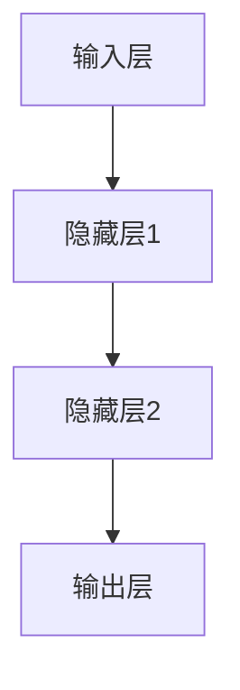
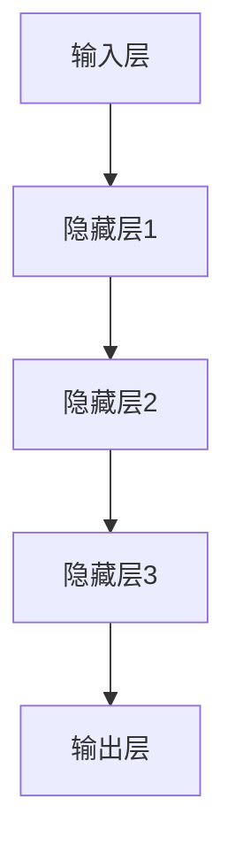
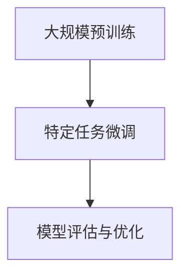
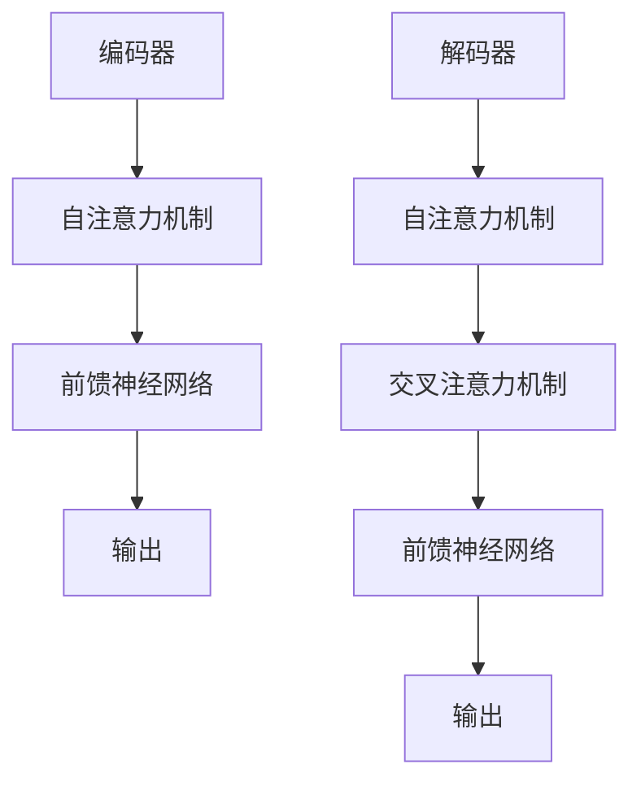

                 

### 文章标题

# AI大模型创业：如何实现未来盈利？

> 关键词：AI大模型，创业，盈利模式，商业模式，技术创新，市场前景，风险应对

> 摘要：
本文旨在探讨AI大模型创业的现状与未来，分析如何实现AI大模型的盈利。通过详细阐述AI大模型的基础技术原理、产业应用、创业实践，以及创业团队建设与运营策略，本文将为创业者提供有价值的指导和启示，助力其在竞争激烈的AI市场中脱颖而出。

### 目录大纲

1. **AI大模型基础**
   1.1 AI大模型概述
   1.2 AI大模型技术原理
   1.3 AI大模型产业应用

2. **AI大模型创业实践**
   2.1 AI大模型创业准备
   2.2 AI大模型商业模式设计
   2.3 AI大模型创业案例解析

3. **AI大模型创业团队建设与运营**
   3.1 创业团队建设
   3.2 企业运营管理
   3.3 持续创新与成长

4. **AI大模型创业前瞻**
   4.1 AI大模型创业的未来趋势
   4.2 AI大模型创业的建议与启示

5. **附录**
   5.1 AI大模型创业工具与资源
   5.2 相关书籍与文献

---

### AI大模型概述

#### 1.1 AI大模型的基本概念

##### 1.1.1 AI大模型定义

AI大模型（Large-scale AI Model）通常指的是在训练过程中使用了大量数据和计算资源的深度学习模型。这类模型在自然语言处理、计算机视觉、语音识别等领域表现出了超凡的能力，能够处理复杂的问题，并生成高质量的结果。

##### 1.1.2 AI大模型与人工智能的关系

AI大模型是人工智能（AI）领域的一个重要分支。传统的人工智能更多依赖于规则和逻辑推理，而AI大模型则通过大规模数据训练，使得机器能够自动学习和优化模型参数，实现更高层次的人工智能功能。

##### 1.1.3 AI大模型的特点

- **数据需求大**：AI大模型需要大量高质量的数据进行训练，以保证模型能够学习到有效的特征。
- **计算资源消耗大**：大模型的训练过程通常需要强大的计算资源，包括高性能的CPU和GPU。
- **泛化能力强**：经过大规模数据训练的模型，能够泛化到未见过的数据上，具有更高的应用价值。

#### 1.2 AI大模型的架构

##### 1.2.1 神经网络基础

神经网络是AI大模型的基础，它通过模仿人脑神经元的工作方式，进行信息处理和传递。每个神经元都与多个其他神经元相连，形成一个复杂的网络结构。



##### 1.2.2 深度学习架构

深度学习是神经网络的一种扩展，它通过增加网络的深度（即层数），来提高模型的学习能力。深度学习模型通常由多个隐藏层组成，每一层都能够提取更高层次的特征。



##### 1.2.3 大规模预训练模型

大规模预训练模型（如BERT、GPT等）是AI大模型的代表性工作。这类模型通过在大规模语料库上进行预训练，然后针对特定任务进行微调，从而实现出色的性能。



#### 1.3 AI大模型的发展历程

##### 1.3.1 从传统AI到AI大模型

传统AI主要依赖于规则和逻辑推理，而AI大模型的兴起标志着人工智能进入了一个新的阶段。这一阶段的主要特征是数据驱动的学习方式，以及通过大规模数据和计算资源的利用，实现了前所未有的性能提升。

##### 1.3.2 AI大模型的关键里程碑

- 2012年：AlexNet在ImageNet图像识别挑战中取得突破性成果，标志着深度学习时代的到来。
- 2018年：BERT在自然语言处理领域取得了重大进展，推动了大规模预训练模型的普及。
- 2020年：GPT-3发布，展示了AI大模型在自然语言处理领域的强大能力。

##### 1.3.3 AI大模型未来发展趋势

随着计算能力和数据资源的不断增长，AI大模型有望在更多领域实现突破。未来，AI大模型的发展趋势包括：

- **模型多样化**：不仅限于当前的自然语言处理和计算机视觉领域，还将扩展到更多应用场景。
- **模型可解释性**：提高模型的可解释性，使其在关键任务中能够得到更广泛的应用。
- **跨模态学习**：实现不同模态（如文本、图像、声音）之间的相互转化和学习。

---

### AI大模型技术原理

#### 2.1 深度学习技术

##### 2.1.1 神经网络原理

神经网络是深度学习的基础，其基本单元是神经元。神经元之间通过权重进行连接，形成复杂的网络结构。神经网络的训练过程就是不断调整这些权重，以最小化预测误差。

```python
# 神经元激活函数示例
def sigmoid(x):
    return 1 / (1 + np.exp(-x))
```

##### 2.1.2 深度学习算法

深度学习算法包括多种类型，如前向传播、反向传播等。前向传播用于计算网络输出，反向传播用于更新权重，以最小化损失函数。

```python
# 前向传播示例
outputs = model(inputs)

# 反向传播示例
loss = compute_loss(outputs, targets)
model.backward(loss)
```

##### 2.1.3 深度学习框架

深度学习框架如TensorFlow、PyTorch等，提供了高效的计算引擎和丰富的API，使得深度学习模型的训练和部署变得更加便捷。

```python
# TensorFlow代码示例
import tensorflow as tf

model = tf.keras.Sequential([
    tf.keras.layers.Dense(128, activation='relu'),
    tf.keras.layers.Dense(10, activation='softmax')
])

model.compile(optimizer='adam', loss='sparse_categorical_crossentropy', metrics=['accuracy'])

model.fit(x_train, y_train, epochs=5)
```

#### 2.2 自然语言处理技术

##### 2.2.1 词嵌入技术

词嵌入是将词语映射到高维向量空间的一种技术，能够捕捉词语之间的语义关系。常见的词嵌入模型有Word2Vec、GloVe等。

```python
# Word2Vec代码示例
from gensim.models import Word2Vec

model = Word2Vec sentences, vector_size=100, window=5, min_count=1, workers=4

model.wv.most_similar('king')
```

##### 2.2.2 序列模型与注意力机制

序列模型如LSTM、GRU等，能够处理和时间相关的数据。注意力机制则使模型能够关注序列中的重要部分，提高模型的性能。

```python
# LSTM代码示例
from tensorflow.keras.models import Sequential
from tensorflow.keras.layers import LSTM, Dense

model = Sequential()
model.add(LSTM(128, input_shape=(timesteps, features)))
model.add(Dense(1))
model.compile(optimizer='adam', loss='mse')

model.fit(X, y, epochs=10, batch_size=32, validation_split=0.2)
```

##### 2.2.3 转换器架构详解

转换器（Transformer）是一种基于自注意力机制的序列模型，它在自然语言处理领域取得了显著的成功。转换器架构包括编码器和解码器两部分，能够处理长距离依赖问题。



#### 2.3 大规模预训练模型

##### 2.3.1 预训练模型概述

预训练模型是指在大规模数据集上进行的预训练，然后通过微调（Fine-tuning）适用于特定任务。预训练模型的核心思想是利用未标注的大规模数据来学习通用特征，提高模型在目标任务上的性能。

##### 2.3.2 预训练方法

预训练方法包括自我监督学习（Self-supervised Learning）、无监督预训练（Unsupervised Pre-training）等。自我监督学习利用数据中的冗余信息进行学习，而无监督预训练则通过自动发现数据中的特征。

##### 2.3.3 预训练模型的优势与挑战

优势：
- 提高模型在未见数据上的性能。
- 减少对标注数据的依赖。
- 提取通用特征，提高跨领域应用的泛化能力。

挑战：
- 计算资源消耗大，需要大量的计算资源和时间。
- 需要大规模的数据集进行训练。
- 预训练模型的可解释性较低，难以理解其内部工作机制。

---

### AI大模型产业应用

#### 3.1 AI大模型在商业中的应用

##### 3.1.1 AI大模型商业价值

AI大模型在商业中的应用价值巨大，主要体现在以下几个方面：

- **提升决策效率**：通过分析大量数据，AI大模型能够为企业提供精准的预测和决策支持。
- **优化业务流程**：AI大模型能够自动处理重复性高、复杂度低的任务，提高业务流程的自动化程度。
- **创造新的商业模式**：AI大模型能够帮助企业开拓新的市场机会，创造新的商业模式。

##### 3.1.2 AI大模型商业应用场景

AI大模型在商业中的应用场景非常广泛，以下是一些典型的应用场景：

- **客户关系管理**：通过自然语言处理技术，AI大模型能够帮助企业与客户进行智能交互，提供个性化的服务。
- **风险管理**：AI大模型能够分析大量历史数据，预测潜在风险，并提供风险控制策略。
- **供应链优化**：通过预测需求、优化库存等，AI大模型能够帮助企业提高供应链的效率和灵活性。

##### 3.1.3 AI大模型商业应用案例

以下是一些AI大模型在商业中的成功应用案例：

- **客户服务**：银行、电信等行业利用AI大模型提供智能客服，提高客户满意度。
- **销售预测**：零售行业利用AI大模型预测销量，优化库存管理，提高销售业绩。
- **市场研究**：企业利用AI大模型分析市场数据，制定精准的市场营销策略。

#### 3.2 AI大模型在行业中的应用

##### 3.2.1 金融行业应用

在金融行业，AI大模型的应用主要包括风险控制、信用评估、投资预测等。

- **风险控制**：AI大模型通过分析历史数据和交易行为，预测潜在风险，提供风险预警。
- **信用评估**：AI大模型通过分析个人的信用记录、行为数据等，评估信用风险，提高信用评估的准确性。
- **投资预测**：AI大模型通过分析市场数据、宏观经济指标等，预测投资趋势，提供投资建议。

##### 3.2.2 医疗健康行业应用

在医疗健康行业，AI大模型的应用主要包括疾病诊断、药物研发、医疗资源管理等。

- **疾病诊断**：AI大模型通过分析医疗影像、病历数据等，提供疾病诊断支持，提高诊断准确性。
- **药物研发**：AI大模型通过分析大量化学结构和生物信息数据，预测药物的效果和副作用，加速药物研发过程。
- **医疗资源管理**：AI大模型通过分析医疗数据，优化医疗资源配置，提高医疗服务效率。

##### 3.2.3 制造业行业应用

在制造业行业，AI大模型的应用主要包括生产优化、设备维护、质量管理等。

- **生产优化**：AI大模型通过分析生产数据，优化生产流程，提高生产效率。
- **设备维护**：AI大模型通过分析设备运行数据，预测设备故障，提供维护建议。
- **质量管理**：AI大模型通过分析产品质量数据，预测产品质量问题，提供改进建议。

#### 3.3 AI大模型创业机会与挑战

##### 3.3.1 AI大模型创业机会

随着AI大模型技术的不断发展，创业者可以抓住以下几个方面的机会：

- **应用创新**：在现有行业和领域的基础上，开发新的AI大模型应用场景，创造新的市场需求。
- **商业模式创新**：通过创新的商业模式，实现AI大模型的经济效益，如SaaS、订阅制等。
- **技术突破**：在AI大模型技术方面进行创新，提高模型性能和可解释性，抢占技术高地。

##### 3.3.2 AI大模型创业挑战

AI大模型创业面临以下挑战：

- **计算资源需求**：AI大模型训练需要大量的计算资源，对于初创企业来说，这是一个巨大的挑战。
- **数据获取与处理**：AI大模型训练需要大量的高质量数据，数据获取和处理是一个复杂且耗时的工作。
- **技术风险**：AI大模型技术的快速发展，使得创业者需要不断更新自己的技术知识，以适应市场的变化。

##### 3.3.3 AI大模型创业策略

为了应对上述挑战，创业者可以采取以下策略：

- **合作与联盟**：与拥有强大计算资源和数据的企业合作，共同推进AI大模型项目。
- **垂直整合**：通过垂直整合，实现数据、技术、应用的一体化，提高创业项目的竞争力。
- **持续创新**：保持技术的前沿性，不断进行技术创新和应用创新，以应对市场的竞争。

---

### AI大模型创业准备

#### 4.1 创业团队组建

##### 4.1.1 创业团队的核心能力

创业团队的核心能力包括以下几个方面：

- **技术能力**：团队成员应具备深厚的AI大模型技术背景，能够设计和开发高性能的模型。
- **业务理解**：团队成员应了解目标行业的业务逻辑和需求，能够将AI大模型技术与实际业务相结合。
- **项目管理**：团队成员应具备良好的项目管理能力，能够高效地组织项目进度，协调各方资源。

##### 4.1.2 创业团队的组建流程

创业团队的组建流程包括以下几个步骤：

1. **明确目标和愿景**：明确创业团队的目标和愿景，确定创业项目的基本方向。
2. **寻找合适的人才**：通过线上招聘、社交网络、行业会议等方式，寻找具备核心能力的人才。
3. **组建团队**：根据项目需求和人才能力，组建合适的创业团队。
4. **制定激励机制**：制定合理的激励机制，包括薪酬、股权等，以激发团队成员的积极性和创造力。

##### 4.1.3 创业团队的激励机制

创业团队的激励机制应包括以下几个方面：

- **薪酬激励**：根据团队成员的贡献和绩效，设定合理的薪酬水平，以保持团队的稳定性和积极性。
- **股权激励**：通过股权分配，让团队成员共享公司发展的成果，增强团队的凝聚力和归属感。
- **职业发展**：为团队成员提供职业发展的机会和路径，鼓励他们不断提升自己的能力和价值。

#### 4.2 市场调研与定位

##### 4.2.1 市场调研的方法

市场调研的方法包括以下几种：

- **问卷调查**：通过设计问卷，收集潜在用户的需求和意见，了解市场对产品的期望。
- **访谈法**：通过面对面或电话访谈，深入了解用户的需求和痛点，获取更深入的市场信息。
- **竞品分析**：分析竞争对手的产品和市场表现，了解市场的竞争格局和机会。

##### 4.2.2 市场定位的策略

市场定位的策略包括以下几个方面：

- **目标市场**：明确目标市场，确定产品的适用对象和范围。
- **产品定位**：根据目标市场的需求，确定产品的特色和优势，形成独特的市场定位。
- **品牌定位**：通过品牌形象、品牌传播等手段，塑造产品的品牌形象，提升品牌的市场认知度。

##### 4.2.3 目标客户群体分析

目标客户群体分析包括以下几个方面：

- **客户需求**：分析目标客户的需求和痛点，了解他们对产品的期望。
- **客户特征**：分析目标客户的特征，包括年龄、性别、收入、职业等。
- **客户行为**：分析目标客户的行为模式，包括购买渠道、消费习惯等。

#### 4.3 产品设计与开发

##### 4.3.1 AI大模型产品的设计

AI大模型产品的设计包括以下几个方面：

- **需求分析**：根据市场调研的结果，明确产品的功能需求和性能指标。
- **架构设计**：设计产品的整体架构，包括模型结构、数据处理流程等。
- **用户体验**：设计产品的用户界面和交互流程，提供良好的用户体验。

##### 4.3.2 AI大模型产品的开发

AI大模型产品的开发包括以下几个方面：

- **模型训练**：根据设计的要求，训练高质量的AI大模型，并进行性能优化。
- **系统集成**：将AI大模型与其他系统模块进行集成，实现产品功能。
- **测试与验证**：对产品进行全面的测试和验证，确保产品的稳定性和可靠性。

##### 4.3.3 产品迭代与优化

产品迭代与优化包括以下几个方面：

- **用户反馈**：收集用户的反馈，了解产品的使用情况和用户需求。
- **版本更新**：根据用户反馈和市场变化，对产品进行版本更新和优化。
- **性能优化**：持续优化产品的性能，提高用户体验和满意度。

---

### AI大模型商业模式设计

#### 5.1 AI大模型商业模式概述

##### 5.1.1 商业模式的概念

商业模式是指企业通过提供产品或服务，创造、传递和捕获价值的方法。对于AI大模型创业公司来说，商业模式是确保其技术优势能够转化为商业价值的关键。

##### 5.1.2 AI大模型商业模式的要素

AI大模型商业模式的要素包括以下几个方面：

- **价值主张**：明确AI大模型产品的独特价值，如何解决用户的问题或满足需求。
- **目标市场**：定义目标客户群体，了解他们的需求和购买行为。
- **盈利模式**：确定公司如何从AI大模型产品中获得收入。
- **关键资源**：识别公司所需的关键资源，包括数据、技术、人才等。
- **关键活动**：定义公司需要开展的关键活动，包括研发、营销、客户服务等。
- **成本结构**：分析公司的成本结构，包括固定成本和可变成本。
- **合作伙伴关系**：建立与供应商、客户、合作伙伴等的关系，共同推动业务发展。

##### 5.1.3 AI大模型商业模式的创新

AI大模型商业模式的创新包括以下几个方面：

- **产品创新**：通过技术创新，推出具有独特功能和优势的AI大模型产品。
- **市场创新**：开拓新的市场领域，挖掘潜在客户群体。
- **运营创新**：优化业务流程和运营模式，提高效率和降低成本。
- **商业模式创新**：探索新的盈利模式，如订阅制、SaaS服务等。

#### 5.2 AI大模型盈利模式

##### 5.2.1 直接盈利模式

直接盈利模式是指通过直接销售AI大模型产品或服务获得收入。这种模式适用于已经拥有清晰市场需求和客户基础的创业公司。

- **销售模型产品**：直接销售自主研发的AI大模型产品，如预训练模型、定制化模型等。
- **提供服务**：提供基于AI大模型的咨询服务，如数据分析、决策支持等。

##### 5.2.2 垂直整合盈利模式

垂直整合盈利模式是指将AI大模型技术应用于整个产业链的不同环节，通过整合上下游资源，实现更高的商业价值。

- **数据采集与处理**：收集和处理特定行业的数据，为AI大模型提供高质量的数据支持。
- **解决方案提供**：为客户提供全面的解决方案，包括AI大模型产品、技术支持、咨询服务等。

##### 5.2.3 平台化盈利模式

平台化盈利模式是指构建一个开放的AI大模型平台，吸引第三方开发者、用户等，通过平台生态的活跃度实现盈利。

- **平台开发与运营**：搭建和维护AI大模型平台，提供API接口、工具包等。
- **生态系统建设**：构建平台生态系统，包括开发者社区、用户社群等，促进平台的发展。

#### 5.3 AI大模型定价策略

##### 5.3.1 定价策略的概念

定价策略是指公司如何为AI大模型产品或服务设定价格，以实现利润最大化。

##### 5.3.2 定价策略的类型

常见的定价策略包括以下几种：

- **成本导向定价**：基于产品或服务的成本，加上一定的利润，确定价格。
- **价值导向定价**：根据用户对产品或服务的价值感知，设定价格。
- **竞争导向定价**：根据市场竞争情况，设定具有竞争力的价格。
- **组合定价**：结合多种定价策略，实现最优的价格策略。

##### 5.3.3 定价策略的案例分析

以下是一个AI大模型创业公司的定价策略案例：

- **成本导向定价**：基础版产品定价为每月1000元，包含基本的AI大模型服务；专业版产品定价为每月5000元，包含高级的AI大模型服务和定制化解决方案。
- **价值导向定价**：根据客户对产品的价值感知，高端客户群体可享受折扣优惠。
- **竞争导向定价**：在市场上，公司定期推出限时优惠活动，以吸引更多用户。

---

### AI大模型创业案例解析

#### 6.1 AI大模型创业成功案例

##### 6.1.1 案例介绍

案例：OpenAI是一家专注于人工智能研究和技术开发的初创公司，其最著名的项目是GPT-3（Generative Pre-trained Transformer 3），这是一款具有里程碑意义的大型语言模型。GPT-3的发布引发了全球的关注，并在多个领域取得了显著的成功。

##### 6.1.2 成功原因分析

OpenAI的成功可归因于以下几个方面：

- **强大的研发团队**：OpenAI的团队由多位顶尖的人工智能科学家组成，他们在深度学习和自然语言处理领域有着深厚的研究背景和丰富的经验。
- **丰富的数据资源**：OpenAI利用了大量的公开数据集和自有数据，为GPT-3提供了丰富的训练素材。
- **创新的商业模式**：OpenAI采用了非营利性模式，通过开放源代码和共享技术，获得了广泛的认可和支持。
- **良好的市场定位**：OpenAI专注于高端市场，提供高性能的AI大模型服务，满足专业用户的需求。

##### 6.1.3 经验与启示

OpenAI的成功为AI大模型创业公司提供了以下几点经验与启示：

- **技术创新是核心**：持续进行技术创新，开发出具有独特价值和竞争力的产品。
- **数据资源是基础**：积累和利用丰富的数据资源，为模型训练提供强有力的支持。
- **市场定位要准确**：根据自身的技术优势和市场需求，选择合适的市场定位和目标客户群体。
- **开放与合作**：通过开放源代码和技术共享，吸引更多的开发者和用户，共同推动技术的发展。

#### 6.2 AI大模型创业失败案例

##### 6.2.1 案例介绍

案例：GTP.ai是一家曾经备受瞩目的AI大模型初创公司，但在激烈的市场竞争中，最终未能持续发展，最终倒闭。GTP.ai曾推出一款名为GTP（Generative Transformer Processor）的AI大模型，但其在性能、可靠性等方面与OpenAI的GPT-3存在显著差距。

##### 6.2.2 失败原因分析

GTP.ai的失败原因主要包括以下几个方面：

- **技术不足**：GTP.ai的AI大模型在性能和可靠性方面与市场领先者存在明显差距，导致市场接受度较低。
- **市场竞争激烈**：AI大模型市场竞争激烈，GTP.ai在技术研发和市场推广方面未能迅速取得突破。
- **资金链断裂**：由于业绩不佳，GTP.ai未能吸引到足够的投资，导致资金链断裂，最终倒闭。

##### 6.2.3 失败教训与反思

GTP.ai的失败为AI大模型创业公司提供了以下几点教训与反思：

- **技术创新是持续的过程**：技术竞争激烈，创业公司需要持续投入研发，不断提升产品的性能和可靠性。
- **市场定位要准确**：要选择有明确市场需求和潜在客户的领域，避免进入过于拥挤的市场。
- **资金管理要谨慎**：合理规划资金使用，确保公司能够持续运营和快速发展。
- **开放与合作**：通过开放与合作，增强企业的技术实力和市场竞争力。

---

### AI大模型创业团队建设与运营

#### 7.1 创业团队建设

##### 7.1.1 团队建设的重要性

创业团队是AI大模型创业的核心资源，团队建设的好坏直接影响公司的成败。有效的团队建设能够提高团队的合作效率，激发团队的创造力，实现公司目标的顺利达成。

##### 7.1.2 团队建设的方法

团队建设的方法包括以下几个方面：

- **明确团队目标**：明确团队的目标和愿景，确保团队成员的方向一致。
- **建立信任**：通过沟通、协作和共同完成任务，建立团队成员之间的信任。
- **角色分工**：根据团队成员的能力和特长，进行合理的角色分工，确保每个成员都能发挥最大的价值。
- **激励机制**：制定合理的激励机制，包括薪酬、股权、荣誉等，以激发团队成员的积极性和创造力。

##### 7.1.3 团队文化建设

团队文化建设是团队建设的重要组成部分，良好的团队文化能够增强团队的凝聚力，提高团队的执行力。团队文化包括以下几个方面：

- **共同价值观**：建立共同的价值观，确保团队成员在价值观上的一致性。
- **团队精神**：培养团队精神，鼓励团队成员相互支持、共同进步。
- **开放沟通**：建立开放沟通的机制，鼓励团队成员表达自己的想法和建议。
- **持续学习**：鼓励团队成员持续学习，提升自身能力和团队的整体水平。

#### 7.2 企业运营管理

##### 7.2.1 运营管理概述

企业运营管理是指企业在日常运营过程中，对各项业务活动进行规划、组织、协调和控制的过程。有效的运营管理能够提高企业的运营效率，降低运营成本，实现企业的可持续发展。

##### 7.2.2 运营管理体系

运营管理体系包括以下几个方面：

- **战略规划**：制定企业的战略规划，明确企业的发展方向和目标。
- **流程管理**：优化业务流程，提高运营效率，降低运营成本。
- **绩效管理**：建立绩效评估体系，对员工的工作进行评估和激励。
- **风险管理**：识别和评估运营过程中可能出现的风险，制定相应的风险应对策略。
- **质量管理**：建立质量管理体系，确保产品和服务的质量满足客户需求。

##### 7.2.3 运营管理优化

运营管理优化包括以下几个方面：

- **流程优化**：通过流程再造、自动化等手段，优化业务流程，提高运营效率。
- **资源整合**：整合企业内外部的资源，提高资源的利用效率。
- **数据驱动**：利用大数据分析等技术，对企业运营数据进行分析，指导运营决策。
- **持续改进**：通过持续改进，不断优化运营管理，提高企业的竞争力。

#### 7.3 持续创新与成长

##### 7.3.1 创新能力培养

创新能力是AI大模型创业公司的核心竞争力，培养创新能力包括以下几个方面：

- **技术储备**：不断学习和掌握最新的技术知识，为创新提供技术支持。
- **团队协作**：鼓励团队成员之间的协作，发挥团队的整体创造力。
- **开放思维**：保持开放思维，勇于接受新的观点和想法，激发创新灵感。

##### 7.3.2 成长策略

成长策略包括以下几个方面：

- **市场拓展**：积极开拓市场，扩大客户群体，提高市场份额。
- **产品迭代**：持续进行产品迭代，提升产品性能和用户体验。
- **品牌建设**：加强品牌建设，提升品牌知名度和美誉度。
- **资本运作**：合理利用资本运作，提高企业的资金实力和抗风险能力。

##### 7.3.3 市场拓展策略

市场拓展策略包括以下几个方面：

- **线上推广**：通过社交媒体、搜索引擎等线上渠道，进行产品推广和宣传。
- **线下活动**：参加行业会议、展览会等线下活动，拓展客户资源，提升品牌知名度。
- **合作伙伴**：与行业内的合作伙伴建立合作关系，共同开拓市场。
- **客户服务**：提供优质的客户服务，提升客户满意度和忠诚度。

---

### AI大模型创业的未来趋势

#### 8.1 AI大模型创业的市场前景

随着人工智能技术的快速发展，AI大模型创业市场的前景非常广阔。根据市场研究机构的预测，全球AI市场规模将在未来几年内持续增长，其中AI大模型市场将占据重要地位。以下是一些市场前景的具体分析：

- **市场规模**：预计到2030年，全球AI市场规模将达到万亿美元级别。
- **增长驱动力**：随着大数据、云计算、5G等技术的普及，AI大模型将在更多领域得到应用，推动市场的快速增长。
- **应用领域**：AI大模型将在医疗健康、金融、制造业、零售等行业发挥重要作用，创造巨大的市场机会。

#### 8.2 AI大模型创业的技术演进

AI大模型创业的技术演进主要表现在以下几个方面：

- **模型性能**：随着算法的优化和计算资源的提升，AI大模型的性能将不断提高，能够处理更复杂的问题。
- **模型可解释性**：为了提高AI大模型的可解释性，研究者将开发新的方法，使得模型决策过程更加透明和可理解。
- **跨模态学习**：未来AI大模型将实现跨模态学习，能够处理多种类型的数据，提高模型的泛化能力。

#### 8.3 AI大模型创业的社会影响

AI大模型创业不仅在经济领域带来巨大变革，还对社会产生了深远的影响：

- **社会经济影响**：AI大模型将推动产业升级，提高生产效率，创造新的就业机会。
- **社会伦理影响**：AI大模型的应用引发了对隐私、安全、伦理等问题的讨论，需要制定相应的法律法规和道德准则。
- **社会责任与可持续发展**：AI大模型创业公司需要承担社会责任，推动技术的可持续发展，促进社会的和谐进步。

---

### AI大模型创业的建议与启示

#### 9.1 创业准备

##### 9.1.1 创业前的准备

创业前的准备是确保AI大模型创业成功的重要前提，包括以下几个方面：

- **技术储备**：积累和掌握AI大模型的相关技术，包括深度学习、自然语言处理等，确保具备技术竞争力。
- **市场调研**：深入了解目标市场和客户需求，确定产品的市场定位和目标客户群体。
- **资金准备**：评估创业所需资金，制定详细的资金使用计划，确保资金链的稳定。
- **团队组建**：组建具备核心能力的技术团队和业务团队，确保团队能够高效协作。

##### 9.1.2 创业团队的建设

创业团队的建设是创业成功的关键，包括以下几个方面：

- **核心能力**：确保团队成员具备AI大模型技术、业务理解和项目管理等核心能力。
- **激励机制**：建立合理的激励机制，包括薪酬、股权、荣誉等，激发团队成员的积极性和创造力。
- **团队文化**：塑造积极向上、开放协作的团队文化，增强团队的凝聚力和执行力。

##### 9.1.3 市场调研与定位

市场调研与定位是确保AI大模型创业成功的重要步骤，包括以下几个方面：

- **市场调研**：通过问卷调查、访谈法、竞品分析等方法，了解市场需求和竞争态势。
- **目标市场**：明确目标市场，确定产品的适用对象和范围。
- **产品定位**：根据目标市场的需求，确定产品的特色和优势，形成独特的市场定位。

#### 9.2 创业策略

##### 9.2.1 商业模式设计

商业模式设计是确保AI大模型创业成功的关键，包括以下几个方面：

- **价值主张**：明确AI大模型产品的独特价值，如何解决用户的问题或满足需求。
- **盈利模式**：确定公司如何从AI大模型产品中获得收入，如直接销售、服务收费、平台运营等。
- **关键资源**：识别公司所需的关键资源，包括数据、技术、人才等。
- **关键活动**：定义公司需要开展的关键活动，包括研发、营销、客户服务等。

##### 9.2.2 市场拓展策略

市场拓展策略是扩大AI大模型创业公司市场份额的重要手段，包括以下几个方面：

- **线上推广**：利用社交媒体、搜索引擎等线上渠道，进行产品推广和宣传。
- **线下活动**：参加行业会议、展览会等线下活动，拓展客户资源，提升品牌知名度。
- **合作伙伴**：与行业内的合作伙伴建立合作关系，共同开拓市场。
- **客户服务**：提供优质的客户服务，提升客户满意度和忠诚度。

##### 9.2.3 创新能力培养

创新能力是AI大模型创业公司的核心竞争力，包括以下几个方面：

- **技术储备**：不断学习和掌握最新的技术知识，为创新提供技术支持。
- **团队协作**：鼓励团队成员之间的协作，发挥团队的整体创造力。
- **开放思维**：保持开放思维，勇于接受新的观点和想法，激发创新灵感。

#### 9.3 创业风险与应对

##### 9.3.1 创业风险识别

创业风险识别是确保AI大模型创业成功的重要环节，包括以下几个方面：

- **技术风险**：识别和评估AI大模型技术方面的风险，如模型性能不稳定、算法失效等。
- **市场风险**：识别和评估市场方面的风险，如市场需求不足、竞争激烈等。
- **资金风险**：识别和评估资金方面的风险，如资金不足、资金链断裂等。
- **法律风险**：识别和评估法律方面的风险，如知识产权侵权、合同纠纷等。

##### 9.3.2 风险管理策略

风险管理策略是降低创业风险的重要手段，包括以下几个方面：

- **风险预防**：通过制定详细的创业计划，识别和评估潜在风险，提前采取预防措施。
- **风险监控**：建立风险监控机制，实时监控创业过程中的风险变化，及时调整风险应对策略。
- **风险应对**：制定风险应对策略，如风险转移、风险规避、风险接受等，确保创业过程的顺利进行。

##### 9.3.3 应对策略与建议

针对AI大模型创业中的常见风险，以下是一些应对策略和建议：

- **技术风险**：加强技术研发，提高模型性能和稳定性；与行业内顶尖的科学家和机构合作，提升技术实力。
- **市场风险**：进行充分的市场调研，了解市场需求和竞争态势；调整产品策略，满足市场需求。
- **资金风险**：合理规划资金使用，确保资金链的稳定；寻找风险投资、政府补助等外部资金支持。
- **法律风险**：重视知识产权保护，避免侵权行为；咨询专业法律顾问，确保合同和业务操作符合法律法规。

---

### 附录

#### 附录A AI大模型创业工具与资源

##### A.1 开发工具与框架

AI大模型创业需要使用到多种开发工具和框架，以下是一些常用的工具和框架：

- **TensorFlow**：谷歌开发的开源深度学习框架，支持多种编程语言，广泛应用于自然语言处理、计算机视觉等领域。
- **PyTorch**：基于Python的开源深度学习框架，具有灵活的动态计算图和简洁的API，深受开发者喜爱。
- **Keras**：基于Theano和TensorFlow的高层神经网络API，提供简洁的接口，方便快速搭建和训练深度学习模型。
- **MXNet**：由Apache软件基金会开发的深度学习框架，支持多种编程语言，具有高效的计算性能。

##### A.2 数据集与资源

AI大模型训练需要大量的高质量数据，以下是一些常用的数据集和资源：

- **ImageNet**：大规模的图像数据集，包含数百万张标注图像，广泛应用于图像识别和分类任务。
- **COCO数据集**：用于目标检测和图像分割的数据集，包含大量的标注信息，是计算机视觉领域的重要资源。
- **Wikipedia**：维基百科的语料库，用于自然语言处理和文本分析任务，包含大量高质量的文本数据。
- **Common Crawl**：大规模的网页数据集，包含互联网上的大量网页文本，用于自然语言处理和文本挖掘。

##### A.3 相关书籍与文献

AI大模型创业需要广泛的知识储备，以下是一些推荐的书籍和文献：

- **《深度学习》（Deep Learning）**：由Ian Goodfellow、Yoshua Bengio和Aaron Courville合著的深度学习经典教材，详细介绍了深度学习的理论基础和实际应用。
- **《神经网络与深度学习》（Neural Networks and Deep Learning）**：由邱锡鹏博士撰写的中文深度学习教材，适合初学者系统地学习深度学习知识。
- **《自然语言处理综合教程》（Speech and Language Processing）**：由Daniel Jurafsky和James H. Martin合著的NLP经典教材，全面介绍了自然语言处理的理论和方法。
- **《AI大模型：理论与实践》（Large-scale AI Models: Theory and Practice）**：一本关于AI大模型的专著，详细介绍了大模型的设计、训练和应用。

通过使用这些工具、资源和文献，AI大模型创业者可以更好地掌握相关技术，为创业成功奠定坚实的基础。

