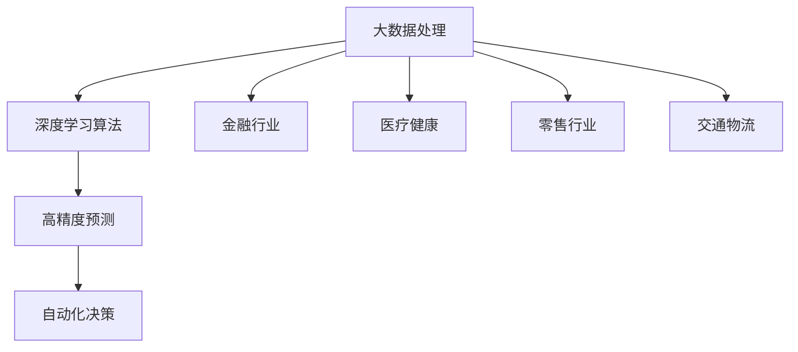
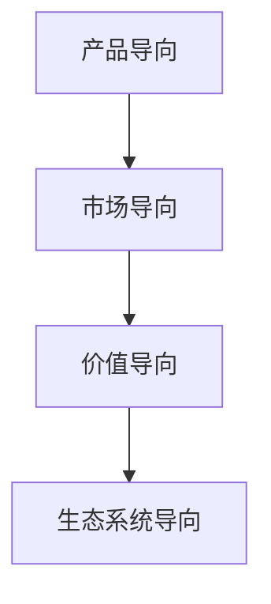

                 

### 《AI大模型创业：如何构建未来可持续的商业模式？》目录大纲

#### 第一部分：AI大模型与商业模式的概述

##### 第1章：AI大模型与商业模式的引论
- **1.1 AI大模型的定义与商业潜力**
  - **概念与特征**
  - **应用案例**
  - **Mermaid流程图**

- **1.2 商业模式的重要性与演变**
  - **概念与类型**
  - **历史与趋势**
  - **Mermaid流程图**

##### 第2章：AI大模型商业模式的构建基础
- **2.1 技术基础**
  - **算法原理**
  - **数学模型**
  - **应用案例**

- **2.2 市场分析**
  - **主要指标**
  - **目标市场**
  - **分析模型**

#### 第二部分：商业模式设计实践

##### 第3章：AI大模型创业的机遇与挑战
- **3.1 创业者视角的AI大模型应用**
  - **成功案例分析**
  - **优势与风险**

- **3.2 AI大模型创业的商业策略**
  - **创新途径**
  - **战略规划**

##### 第4章：AI大模型的商业模式创新
- **4.1 新型商业模式介绍**
  - **SaaS、PaaS、IaaS**
  - **应用案例**

- **4.2 商业模式创新实践**
  - **案例分析**
  - **创新实践**

##### 第5章：AI大模型创业的法律法规与伦理
- **5.1 相关法律法规**
  - **数据隐私**
  - **知识产权**

- **5.2 伦理问题与责任**
  - **伦理决策模型**
  - **案例解析**

##### 第6章：AI大模型创业的运营管理
- **6.1 团队建设**
  - **团队构成与管理模型**

- **6.2 营销策略**
  - **营销模型与策略分析**

##### 第7章：AI大模型创业的可持续性与未来发展
- **7.1 可持续发展**
  - **指标与评价方法**

- **7.2 未来发展趋势**
  - **发展方向**

#### 第三部分：案例分析与实践指南

##### 第8章：成功AI大模型创业案例分析
- **8.1 案例介绍**
  - **成功项目案例**

- **8.2 案例解读**
  - **关键成功因素**

##### 第9章：AI大模型创业实践指南
- **9.1 创业准备**
  - **前期准备流程**

- **9.2 项目实施**
  - **实施步骤**

- **9.3 持续创新**
  - **创新能力保持**

##### 第10章：AI大模型创业生态系统
- **10.1 生态系统概述**
  - **关键要素**

- **10.2 生态合作**
  - **合作模式与策略**

### 附录

#### 附录A：AI大模型开发资源与工具
- **A.1 资源汇总**
  - **常用AI大模型开发资源**

- **A.2 工具使用指南**
  - **AI大模型开发工具使用教程**

---

### 《AI大模型创业：如何构建未来可持续的商业模式？》

> **关键词：** AI大模型、商业模式、创业、可持续发展、法律法规、伦理、运营管理、生态系统。

> **摘要：** 本文章将深入探讨AI大模型创业领域，解析如何构建可持续的商业模式。通过分析技术基础、市场分析、商业模式设计、法律法规与伦理、运营管理以及生态合作等方面，本文旨在为创业者提供系统性的指导，以应对AI大模型创业中的挑战与机遇，确保业务的长远发展。

---

#### 第一部分：AI大模型与商业模式的概述

##### 第1章：AI大模型与商业模式的引论

在当今科技高速发展的时代，人工智能（AI）已经渗透到各个行业，成为推动创新和经济增长的关键力量。AI大模型，作为人工智能领域的重要分支，更是引领了技术变革的浪潮。本章节将首先介绍AI大模型的定义、核心特征以及在不同行业中的应用潜力，接着探讨商业模式的重要性及其演变过程，为后续章节的深入讨论奠定基础。

### 1.1 AI大模型的定义与商业潜力

AI大模型指的是通过大规模数据训练和深度学习算法构建的具有高度复杂性和智能化的模型。这些模型能够处理海量数据，自动学习和优化，从而实现自动化决策和智能分析。AI大模型的核心特征包括：

- **大数据处理能力**：能够高效处理和分析大规模数据集，挖掘隐藏的价值和规律。
- **高精度预测能力**：通过深度学习算法，实现高度准确的预测和分类。
- **自动化决策能力**：能够自动化执行复杂的决策过程，降低人力成本和提高效率。

AI大模型在多个行业具有巨大的商业潜力，例如：

- **金融行业**：用于风险评估、信用评分和量化交易等。
- **医疗健康**：辅助诊断、药物研发和健康管理。
- **零售行业**：个性化推荐、库存管理和客户行为分析。
- **交通物流**：智能调度、自动驾驶和物流优化。

**Mermaid流程图：AI大模型核心概念与联系**



### 1.2 商业模式的重要性与演变

商业模式是指企业通过何种方式创造、传递和捕获价值。一个成功的商业模式不仅能够帮助企业实现盈利，还能够支撑企业的长期发展。商业模式的重要性体现在以下几个方面：

- **创造价值**：通过商业模式，企业能够为客户提供独特的价值，形成竞争优势。
- **成本控制**：有效的商业模式有助于企业降低运营成本，提高盈利能力。
- **风险分散**：多元化的商业模式有助于企业抵御市场变化带来的风险。

商业模式的演变经历了以下几个阶段：

- **产品导向阶段**：企业以产品为核心，通过生产销售实现盈利。
- **市场导向阶段**：企业关注市场需求，通过市场细分和定位来提高产品竞争力。
- **价值导向阶段**：企业以创造和传递价值为核心，构建以客户为中心的商业模式。
- **生态系统导向阶段**：企业通过构建生态系统，与其他企业合作共同创造价值。

**Mermaid流程图：商业模式演变过程**



#### 结论

通过本章节的讨论，我们可以看到AI大模型在商业领域具有巨大的潜力，而有效的商业模式是支持AI大模型创业成功的关键。在接下来的章节中，我们将进一步探讨AI大模型商业模式的构建基础和实践，帮助创业者构建可持续的商业模式，把握未来商业的机遇。

---

### 第一部分总结

在本部分的探讨中，我们首先介绍了AI大模型的核心特征及其在不同行业中的应用潜力，接着分析了商业模式的重要性及其演变过程。通过Mermaid流程图，我们直观地展示了AI大模型的核心概念和商业模式的演变路径。这一基础部分为后续深入讨论AI大模型的商业模式构建提供了理论支持和框架指导。

#### 第一部分：AI大模型与商业模式的概述

##### 第1章：AI大模型与商业模式的引论

在当今科技高速发展的时代，人工智能（AI）已经渗透到各个行业，成为推动创新和经济增长的关键力量。AI大模型，作为人工智能领域的重要分支，更是引领了技术变革的浪潮。本章节将首先介绍AI大模型的定义、核心特征以及在不同行业中的应用潜力，接着探讨商业模式的重要性及其演变过程，为后续章节的深入讨论奠定基础。

### 1.1 AI大模型的定义与商业潜力

AI大模型指的是通过大规模数据训练和深度学习算法构建的具有高度复杂性和智能化的模型。这些模型能够处理海量数据，自动学习和优化，从而实现自动化决策和智能分析。AI大模型的核心特征包括：

- **大数据处理能力**：能够高效处理和分析大规模数据集，挖掘隐藏的价值和规律。
- **高精度预测能力**：通过深度学习算法，实现高度准确的预测和分类。
- **自动化决策能力**：能够自动化执行复杂的决策过程，降低人力成本和提高效率。

AI大模型在多个行业具有巨大的商业潜力，例如：

- **金融行业**：用于风险评估、信用评分和量化交易等。
- **医疗健康**：辅助诊断、药物研发和健康管理。
- **零售行业**：个性化推荐、库存管理和客户行为分析。
- **交通物流**：智能调度、自动驾驶和物流优化。

**Mermaid流程图：AI大模型核心概念与联系**


### 1.2 商业模式的重要性与演变

商业模式是指企业通过何种方式创造、传递和捕获价值。一个成功的商业模式不仅能够帮助企业实现盈利，还能够支撑企业的长期发展。商业模式的重要性体现在以下几个方面：

- **创造价值**：通过商业模式，企业能够为客户提供独特的价值，形成竞争优势。
- **成本控制**：有效的商业模式有助于企业降低运营成本，提高盈利能力。
- **风险分散**：多元化的商业模式有助于企业抵御市场变化带来的风险。

商业模式的演变经历了以下几个阶段：

- **产品导向阶段**：企业以产品为核心，通过生产销售实现盈利。
- **市场导向阶段**：企业关注市场需求，通过市场细分和定位来提高产品竞争力。
- **价值导向阶段**：企业以创造和传递价值为核心，构建以客户为中心的商业模式。
- **生态系统导向阶段**：企业通过构建生态系统，与其他企业合作共同创造价值。

**Mermaid流程图：商业模式演变过程**


#### 结论

通过本章节的讨论，我们可以看到AI大模型在商业领域具有巨大的潜力，而有效的商业模式是支持AI大模型创业成功的关键。在接下来的章节中，我们将进一步探讨AI大模型商业模式的构建基础和实践，帮助创业者构建可持续的商业模式，把握未来商业的机遇。

---

### 第一部分总结

在本部分的探讨中，我们首先介绍了AI大模型的核心特征及其在不同行业中的应用潜力，接着分析了商业模式的重要性及其演变过程。通过Mermaid流程图，我们直观地展示了AI大模型的核心概念和商业模式的演变路径。这一基础部分为后续深入讨论AI大模型的商业模式构建提供了理论支持和框架指导。

---

#### 第二部分：AI大模型商业模式的构建基础

在了解了AI大模型的基本概念和商业潜力以及商业模式的重要性后，接下来我们将探讨AI大模型商业模式的构建基础。这部分内容将重点关注技术基础和市场需求分析两个方面，为创业者提供实用的指导。

### 第2章：AI大模型商业模式的构建基础

##### 第2章的目的是帮助创业者了解如何构建一个成功的AI大模型商业模式，包括技术基础和市场需求分析。我们将详细讨论以下几个关键主题：

- **2.1 技术基础**：探讨AI大模型所需的算法原理、数学模型以及应用案例。
- **2.2 市场分析**：分析市场的主要指标、目标市场选择以及市场分析模型。

### 2.1 技术基础

AI大模型的技术基础是其商业成功的核心。以下是一些关键的技术概念和组成部分：

#### 算法原理

AI大模型通常基于深度学习算法，特别是神经网络。以下是几种常见的深度学习算法：

- **卷积神经网络（CNN）**：主要用于图像处理和识别。
- **递归神经网络（RNN）**：适用于序列数据，如自然语言处理和时间序列预测。
- **生成对抗网络（GAN）**：用于生成新数据，如合成图像和文本。

**伪代码：常见的AI大模型算法原理**

```python
# 示例：卷积神经网络（CNN）的基本结构
class ConvNeuralNetwork(nn.Module):
    def __init__(self):
        super(ConvNeuralNetwork, self).__init__()
        self.conv1 = nn.Conv2d(in_channels=3, out_channels=64, kernel_size=3, stride=1, padding=1)
        self.relu = nn.ReLU()
        self.maxpool = nn.MaxPool2d(kernel_size=2, stride=2)
        # 添加更多层...
        self.fc = nn.Linear(in_features=1024, out_features=10)

    def forward(self, x):
        x = self.relu(self.conv1(x))
        x = self.maxpool(x)
        # 通过其他层...
        x = self.fc(x)
        return x
```

#### 数学模型

AI大模型依赖于复杂的数学模型，以下是一些关键的数学公式：

- **激活函数**：如ReLU、Sigmoid和Tanh。
- **损失函数**：如均方误差（MSE）和交叉熵。
- **优化器**：如随机梯度下降（SGD）、Adam和AdamW。

**LaTeX公式：常见的数学模型**

```latex
\begin{equation}
    \begin{aligned}
        &\text{激活函数：} f(x) = \max(0, x) \quad \text{(ReLU)} \\
        &\text{损失函数：} J(\theta) = \frac{1}{2n} \sum_{i=1}^{n} (\hat{y}_i - y_i)^2 \quad \text{(MSE)} \\
        &\text{优化器：} \alpha = \alpha - \frac{1}{n} \nabla_{\theta} J(\theta) \quad \text{(SGD)}
    \end{aligned}
\end{equation}
```

#### 应用案例

为了更好地理解技术基础，我们可以通过实际案例来展示AI大模型的应用：

- **金融风控**：使用AI大模型进行贷款风险评估。
- **医疗诊断**：使用AI大模型辅助病理分析。
- **零售推荐**：使用AI大模型实现个性化商品推荐。

**示例：简单AI模型的应用案例**

- **金融风控**：某银行使用卷积神经网络（CNN）进行贷款风险评估，通过分析客户的信用记录和交易行为，预测其违约概率。模型首先对客户数据进行预处理，然后使用CNN提取特征，最后通过全连接层输出风险评分。

### 2.2 市场分析

市场需求分析是构建成功商业模式的关键步骤。以下是一些关键的指标和分析方法：

#### 主要指标

- **市场容量**：市场规模的大小，通常以销售额或用户数量衡量。
- **市场份额**：企业在市场中的占有率。
- **增长率**：市场的年增长率，用于预测未来的市场趋势。

**LaTeX公式：市场分析的主要指标与模型**

```latex
\begin{equation}
    \begin{aligned}
        &\text{市场容量：} C_{market} = \sum_{i=1}^{n} V_i \cdot Q_i \\
        &\text{市场份额：} S_{market} = \frac{C_{company}}{C_{market}} \cdot 100\% \\
        &\text{增长率：} G = \frac{C_{t+1} - C_t}{C_t} \cdot 100\%
    \end{aligned}
\end{equation}
```

#### 目标市场选择

选择目标市场是成功商业模式的另一个关键。以下是一些常见的市场选择策略：

- **人口统计**：根据人口统计数据（如年龄、性别、收入等）选择市场。
- **地理位置**：根据地理位置（如城市、国家）选择市场。
- **行为特征**：根据客户的行为特征（如购买习惯、搜索行为等）选择市场。

#### 分析模型

- **SWOT分析**：评估企业的优势、劣势、机会和威胁。
- **波特五力模型**：分析市场竞争结构，包括供应商、买家、潜在竞争者、替代品和行业内的竞争者。

**示例：目标市场的选择与定位**

- **零售行业**：一家在线零售商选择年轻女性作为目标市场。该市场具有高购买力和强烈的在线购物习惯，同时该零售商的产品设计风格符合年轻女性的审美偏好，从而形成独特的市场定位。

### 结论

通过技术基础和市场需求分析，创业者可以更好地了解如何构建一个可持续的AI大模型商业模式。在下一章节中，我们将深入探讨AI大模型创业的具体实践，包括机遇、挑战和商业策略，帮助创业者实现商业成功。

---

### 第二部分总结

在第二部分中，我们详细探讨了AI大模型商业模式的构建基础，包括技术基础和市场需求分析。我们通过伪代码和LaTeX公式展示了AI大模型的核心算法原理和数学模型，并通过实际案例说明了AI大模型在金融、医疗和零售等行业的应用。此外，我们还讨论了市场分析的主要指标和方法，以及如何选择和定位目标市场。这一部分内容为创业者提供了构建AI大模型商业模式的实用指导，为后续的商业模式设计和实践奠定了基础。

---

### 第二部分：AI大模型商业模式的构建基础

#### 第2章：AI大模型商业模式的构建基础

在了解了AI大模型的基本概念和商业潜力后，构建一个可持续的商业模式变得至关重要。本章节将深入探讨如何基于技术基础和市场需求，构建AI大模型的商业模式。具体来说，我们将讨论以下几个方面：

- **2.1 技术基础**：涵盖AI大模型的算法原理、数学模型以及应用案例。
- **2.2 市场分析**：包括市场的主要指标、目标市场选择以及市场分析模型。

### 2.1 技术基础

技术基础是AI大模型商业模式的基石。以下是构建技术基础的几个关键点：

#### 算法原理

AI大模型的核心在于其算法原理。以下是几种常用的深度学习算法及其原理：

- **卷积神经网络（CNN）**：适用于图像和视频处理，通过卷积层提取图像特征。
- **递归神经网络（RNN）**：适用于处理序列数据，如时间序列和自然语言处理。
- **生成对抗网络（GAN）**：通过生成器和判别器的对抗训练，生成逼真的数据。

**伪代码：常见的AI大模型算法原理**

```python
# 示例：卷积神经网络（CNN）的基本结构
class ConvNeuralNetwork(nn.Module):
    def __init__(self):
        super(ConvNeuralNetwork, self).__init__()
        self.conv1 = nn.Conv2d(in_channels=3, out_channels=64, kernel_size=3, stride=1, padding=1)
        self.relu = nn.ReLU()
        self.maxpool = nn.MaxPool2d(kernel_size=2, stride=2)
        # 添加更多层...
        self.fc = nn.Linear(in_features=1024, out_features=10)

    def forward(self, x):
        x = self.relu(self.conv1(x))
        x = self.maxpool(x)
        # 通过其他层...
        x = self.fc(x)
        return x
```

#### 数学模型

AI大模型依赖于复杂的数学模型，以下是一些关键的数学概念和公式：

- **激活函数**：如ReLU、Sigmoid和Tanh，用于引入非线性。
- **损失函数**：如均方误差（MSE）和交叉熵，用于评估模型性能。
- **优化器**：如随机梯度下降（SGD）、Adam和AdamW，用于调整模型参数。

**LaTeX公式：常见的数学模型**

```latex
\begin{equation}
    \begin{aligned}
        &\text{激活函数：} f(x) = \max(0, x) \quad \text{(ReLU)} \\
        &\text{损失函数：} J(\theta) = \frac{1}{2n} \sum_{i=1}^{n} (\hat{y}_i - y_i)^2 \quad \text{(MSE)} \\
        &\text{优化器：} \alpha = \alpha - \frac{1}{n} \nabla_{\theta} J(\theta) \quad \text{(SGD)}
    \end{aligned}
\end{equation}
```

#### 应用案例

为了更好地理解技术基础，我们可以通过实际案例来说明AI大模型的应用：

- **金融风控**：使用AI大模型进行贷款风险评估，通过分析客户的信用记录和交易行为。
- **医疗诊断**：使用AI大模型辅助病理分析，如肺癌检测和乳腺癌诊断。
- **零售推荐**：使用AI大模型实现个性化商品推荐，根据用户的购买历史和行为。

**示例：简单AI模型的应用案例**

- **金融风控**：一家银行使用卷积神经网络（CNN）分析客户的信用记录和交易数据，预测其贷款违约风险。模型首先对数据进行预处理，然后通过卷积层提取特征，最后通过全连接层输出风险评分。

### 2.2 市场分析

市场分析是构建成功商业模式的关键步骤。以下是市场分析的一些关键指标和方法：

#### 主要指标

- **市场容量**：市场规模的大小，通常以销售额或用户数量衡量。
- **市场份额**：企业在市场中的占有率。
- **增长率**：市场的年增长率，用于预测未来的市场趋势。

**LaTeX公式：市场分析的主要指标与模型**

```latex
\begin{equation}
    \begin{aligned}
        &\text{市场容量：} C_{market} = \sum_{i=1}^{n} V_i \cdot Q_i \\
        &\text{市场份额：} S_{market} = \frac{C_{company}}{C_{market}} \cdot 100\% \\
        &\text{增长率：} G = \frac{C_{t+1} - C_t}{C_t} \cdot 100\%
    \end{aligned}
\end{equation}
```

#### 目标市场选择

选择目标市场是成功商业模式的另一个关键。以下是几种常见的市场选择策略：

- **人口统计**：根据人口统计数据（如年龄、性别、收入等）选择市场。
- **地理位置**：根据地理位置（如城市、国家）选择市场。
- **行为特征**：根据客户的行为特征（如购买习惯、搜索行为等）选择市场。

#### 分析模型

- **SWOT分析**：评估企业的优势、劣势、机会和威胁。
- **波特五力模型**：分析市场竞争结构，包括供应商、买家、潜在竞争者、替代品和行业内的竞争者。

**示例：目标市场的选择与定位**

- **零售行业**：一家在线零售商选择年轻女性作为目标市场。该市场具有高购买力和强烈的在线购物习惯，同时该零售商的产品设计风格符合年轻女性的审美偏好，从而形成独特的市场定位。

### 结论

通过技术基础和市场需求分析，创业者可以更好地了解如何构建一个可持续的AI大模型商业模式。在下一章节中，我们将深入探讨AI大模型创业的具体实践，包括机遇、挑战和商业策略，帮助创业者实现商业成功。

---

### 第二部分总结

在第二部分中，我们详细探讨了AI大模型商业模式的构建基础，包括技术基础和市场需求分析。我们通过伪代码和LaTeX公式展示了AI大模型的核心算法原理和数学模型，并通过实际案例说明了AI大模型在金融、医疗和零售等行业的应用。此外，我们还讨论了市场分析的主要指标和方法，以及如何选择和定位目标市场。这一部分内容为创业者提供了构建AI大模型商业模式的实用指导，为后续的商业模式设计和实践奠定了基础。

---

#### 第二部分总结

在第二部分中，我们深入探讨了AI大模型商业模式的构建基础。首先，我们介绍了AI大模型的技术基础，包括常见的深度学习算法、数学模型和应用案例。通过伪代码和LaTeX公式，我们详细阐述了这些技术概念，帮助读者理解AI大模型的核心原理。接着，我们讨论了市场分析的重要性和方法，包括市场容量、市场份额、增长率等指标，以及SWOT分析和波特五力模型等工具。

技术基础部分为AI大模型的研发提供了理论支持，而市场分析则帮助企业了解目标市场和客户需求。这两个方面的结合，为创业者构建可持续的AI大模型商业模式奠定了坚实基础。在下一部分，我们将进一步探讨AI大模型商业模式的实践和设计，包括具体的创业策略和创新实践。这将帮助创业者更好地把握市场机遇，应对挑战，实现商业成功。

---

### 第三部分：商业模式设计实践

在了解了AI大模型的基本概念、技术基础和市场需求后，下一步是深入探讨如何设计一个有效的商业模式，以实现商业成功。本部分将分为多个章节，详细探讨AI大模型创业中的机遇与挑战、商业策略、商业模式创新、法律法规与伦理、运营管理以及可持续性。通过这些探讨，我们将为创业者提供一套全面的实践指南，以帮助他们构建和实施可持续的AI大模型商业模式。

#### 第3章：AI大模型创业的机遇与挑战

创业过程中的机遇与挑战是不可避免的。AI大模型的创业也不例外，它面临着独特的机遇和挑战。在本章节中，我们将从创业者的视角出发，分析AI大模型在各个行业中的应用，探讨其优势与风险，并给出应对策略。

### 3.1 创业者视角的AI大模型应用

AI大模型在多个行业中的应用已经取得了显著的成果，为创业者提供了丰富的机遇。以下是一些关键行业和AI大模型的应用：

- **金融行业**：AI大模型用于风险评估、信用评分、量化交易和欺诈检测，提高了金融机构的决策效率。
- **医疗健康**：AI大模型在疾病诊断、药物研发、患者管理等领域发挥了重要作用，推动了医疗行业的发展。
- **零售行业**：AI大模型用于个性化推荐、库存管理和客户行为分析，提升了零售企业的运营效率。
- **交通物流**：AI大模型在智能调度、自动驾驶和物流优化中得到了广泛应用，提升了交通物流行业的效率。

**LaTeX公式：创业者成功案例分析**

```latex
\begin{equation}
    \begin{aligned}
        &\text{案例一：金融行业 - 风险评估模型：} \\
        &\text{模型：} \text{卷积神经网络（CNN）} \\
        &\text{应用：} \text{客户信用评分系统} \\
        &\text{效果：} \text{提高了信用评分的准确性，降低了风险。} \\
        &\text{案例二：医疗行业 - 疾病诊断：} \\
        &\text{模型：} \text{生成对抗网络（GAN）} \\
        &\text{应用：} \text{病理图像分析系统} \\
        &\text{效果：} \text{提高了诊断的准确率，缩短了诊断时间。}
    \end{aligned}
\end{equation}
```

### 3.2 AI大模型创业的商业策略

AI大模型创业的成功离不开有效的商业策略。以下是一些关键策略：

- **差异化定位**：通过提供独特的AI大模型解决方案，在市场中获得竞争优势。
- **合作与生态构建**：与其他企业建立合作关系，共同构建生态体系，实现资源共享和协同发展。
- **持续创新**：保持技术领先，不断推出新的AI大模型产品和服务，满足市场需求。

**LaTeX公式：商业模式创新的主要途径**

```latex
\begin{equation}
    \begin{aligned}
        &\text{创新途径：} \\
        &1. \text{技术突破：引入新技术，提升模型性能。} \\
        &2. \text{市场细分：针对特定细分市场，提供定制化解决方案。} \\
        &3. \text{商业模式创新：采用新型商业模式，如SaaS、PaaS等。}
    \end{aligned}
\end{equation}
```

**示例：AI大模型创业项目的战略规划**

- **项目背景**：一家初创公司致力于利用AI大模型进行金融风险评估。
- **战略规划**：
  - **市场定位**：专注于中小企业贷款风险评估。
  - **技术路线**：采用卷积神经网络（CNN）和生成对抗网络（GAN）进行数据分析和预测。
  - **商业模式**：采用SaaS模式，为金融机构提供在线风险评估服务。

### 3.3 应对挑战的策略

AI大模型创业面临着多重挑战，如技术风险、市场风险、法律风险和伦理风险。以下是一些应对策略：

- **技术风险**：通过持续的技术研发，保持技术领先，降低技术淘汰风险。
- **市场风险**：通过市场调研和需求分析，准确把握市场趋势，减少市场风险。
- **法律风险**：遵守相关法律法规，建立完善的数据保护体系和合规机制。
- **伦理风险**：制定明确的伦理准则，确保AI大模型的应用符合伦理规范。

**示例：AI大模型创业风险与应对策略**

- **技术风险**：通过持续的技术研发，保持技术领先，降低技术淘汰风险。
  - **应对策略**：建立研发团队，专注于AI大模型的前沿研究和技术创新。
- **市场风险**：通过市场调研和需求分析，准确把握市场趋势，减少市场风险。
  - **应对策略**：定期进行市场调研，了解客户需求，及时调整产品和服务策略。

### 结论

AI大模型创业面临着巨大的机遇与挑战。创业者需要从行业应用、商业策略和风险应对等多个方面进行深入分析，制定切实可行的战略规划。通过差异化定位、合作与生态构建、持续创新以及有效的风险应对，创业者可以更好地把握市场机遇，实现商业成功。

---

### 第三部分总结

在第三部分，我们深入探讨了AI大模型创业的机遇与挑战，以及如何通过商业策略和有效的风险应对来实现创业成功。我们分析了AI大模型在金融、医疗、零售和交通物流等行业的应用案例，并探讨了差异化定位、合作与生态构建、持续创新等关键商业策略。同时，我们提出了应对技术、市场、法律和伦理风险的具体策略。通过这些探讨，我们为创业者提供了全面的理论指导和实践建议，帮助他们更好地把握AI大模型创业的机遇，克服挑战，实现商业成功。

---

### 第三部分总结

在第三部分中，我们深入探讨了AI大模型创业中的机遇与挑战，并详细介绍了如何通过商业策略和有效的风险应对来实现商业成功。我们首先分析了AI大模型在不同行业中的具体应用案例，展示了这些模型如何通过技术优势为创业者带来实际价值。接着，我们讨论了商业策略的重要性，包括差异化定位、合作与生态构建、持续创新等，并提供了具体的实施路径。

此外，我们还强调了风险管理在AI大模型创业中的关键作用，从技术、市场、法律和伦理等多个方面提出了有效的应对策略。通过这些深入的分析和具体的实践建议，我们希望为创业者提供全面的指导，帮助他们更好地把握AI大模型创业的机遇，克服挑战，实现可持续的商业成功。

---

#### 第4章：AI大模型的商业模式创新

在AI大模型技术迅速发展的背景下，创新商业模式成为企业实现商业成功的核心策略。传统的商业模式已经难以满足日益复杂的市场需求，因此，探索新型商业模式和进行商业模式创新成为AI大模型创业的关键。本章节将详细介绍几种常见的商业模式，包括SaaS、PaaS和IaaS，并通过实际案例展示AI大模型在这些商业模式中的应用，帮助读者理解并运用这些创新模式。

### 4.1 新型商业模式介绍

#### SaaS（Software as a Service）

SaaS模式，即软件即服务，是一种通过互联网提供软件服务的商业模式。用户无需购买软件，只需按需付费即可使用。这种模式的优势在于降低用户的初始投入，提高灵活性，并简化了软件的维护和升级过程。

**SaaS模式的特点：**
- **按需付费**：用户根据实际使用量付费，无需一次性投资。
- **易于部署**：通过云平台提供，用户可以在任何地点和时间访问服务。
- **持续更新**：服务提供商负责软件的维护和更新。

**AI大模型在SaaS模式中的应用：**
- **案例分析**：一家AI公司提供基于SaaS模式的智能客服系统。企业可以通过互联网访问该系统，实时处理客户咨询，提高客户满意度。公司根据客户的使用频率和咨询量进行收费，实现了稳定的现金流和用户增长。

#### PaaS（Platform as a Service）

PaaS模式，即平台即服务，是一种提供开发和部署应用程序的平台服务。用户可以在该平台上开发、测试和部署应用程序，无需管理底层基础设施。

**PaaS模式的特点：**
- **开发环境**：提供开发工具、API和数据库，方便开发者快速构建应用。
- **弹性扩展**：根据应用需求自动扩展资源，提高效率。
- **高可用性**：平台提供高可用性保障，减少系统故障。

**AI大模型在PaaS模式中的应用：**
- **案例分析**：一家AI平台公司提供基于PaaS的AI开发平台，开发者可以在平台上使用预训练的AI模型，快速构建和部署AI应用。公司通过订阅费或服务使用费盈利，同时为用户提供持续的技术支持和更新。

#### IaaS（Infrastructure as a Service）

IaaS模式，即基础设施即服务，是一种提供基础设施资源（如服务器、存储和网络）的商业模式。用户可以根据需求租用这些资源，无需购买和维护硬件。

**IaaS模式的特点：**
- **资源灵活性**：用户可以根据需求租用和配置资源，提高灵活性。
- **成本效益**：降低硬件投资和维护成本。
- **可扩展性**：资源可以按需扩展，满足不断增长的需求。

**AI大模型在IaaS模式中的应用：**
- **案例分析**：一家云服务公司提供基于IaaS的AI计算资源，用户可以在云平台上部署和运行AI模型。公司通过提供高性能计算资源，满足AI大模型的高需求，并按使用量收费。这种模式为用户提供灵活的计算资源，同时也为公司带来稳定的收入来源。

### 4.2 商业模式创新实践

#### 模式创新的关键要素

商业模式的创新需要考虑多个关键要素，包括市场需求、技术能力、成本结构和竞争优势。以下是一些常见的商业模式创新实践：

- **用户价值最大化**：通过提供独特的价值，满足用户需求，实现用户价值的最大化。
- **成本效益**：通过优化成本结构，提高企业的盈利能力。
- **差异化竞争**：通过提供差异化的产品或服务，形成竞争优势。
- **生态系统建设**：通过构建生态系统，与其他企业合作，实现共赢。

**LaTeX公式：商业模式创新案例分析**

```latex
\begin{equation}
    \begin{aligned}
        &\text{用户价值最大化：} U_{max} = f(\text{需求满足度}, \text{用户体验}) \\
        &\text{成本效益：} C_{efficiency} = \frac{\text{总成本}}{\text{总产出}} \\
        &\text{差异化竞争：} D_{competition} = \frac{\text{独特价值}}{\text{市场份额}} \\
        &\text{生态系统建设：} E_{ecosystem} = \sum_{i=1}^{n} \text{合作伙伴价值}
    \end{aligned}
\end{equation}
```

#### 实际案例

- **案例分析**：一家AI公司采用SaaS模式，提供智能分析平台。公司通过收集和分析用户数据，不断优化平台功能，提供定制化的解决方案，实现用户价值的最大化。同时，通过降低用户初始成本和提供灵活的定价策略，提高了市场竞争力。

### 结论

AI大模型的商业模式创新是创业成功的关键。通过引入SaaS、PaaS和IaaS等新型商业模式，企业可以更好地满足市场需求，提高竞争力，实现商业成功。在下一章节中，我们将进一步探讨AI大模型创业的法律法规与伦理问题，为创业者提供全面的指导。

---

### 第四部分总结

在第四部分中，我们深入探讨了AI大模型商业模式的创新，重点介绍了SaaS、PaaS和IaaS等新型商业模式的特点和应用。我们通过实际案例展示了这些模式在AI大模型创业中的应用效果，强调了用户价值最大化、成本效益、差异化竞争和生态系统建设等关键要素。通过这些探讨，我们为创业者提供了丰富的实践经验和理论指导，帮助他们在AI大模型创业中实现商业成功。

---

#### 第四部分：AI大模型的商业模式创新

##### 第4章：AI大模型的商业模式创新

在AI大模型技术迅猛发展的今天，商业模式创新成为企业实现可持续发展和市场竞争的关键。传统商业模式在应对快速变化的市场需求和技术进步时，往往显得力不从心。因此，探索并实施创新的商业模式成为AI大模型创业的必然选择。本章节将详细介绍几种新型商业模式，并通过实际案例分析其应用效果，帮助创业者更好地理解和运用这些创新模式。

### 4.1 新型商业模式介绍

在AI大模型领域，SaaS、PaaS和IaaS等新型商业模式已经展现出巨大的潜力。下面，我们将逐一介绍这些商业模式的特点和优势。

#### SaaS（Software as a Service）

SaaS，即软件即服务，是一种通过互联网提供软件应用的商业模式。用户无需购买和安装软件，只需通过订阅方式使用服务。这种模式的主要特点包括：

- **便捷性**：用户可以在任何设备上访问软件服务，无需复杂部署。
- **灵活性**：用户可以根据需要灵活调整订阅级别，满足不同需求。
- **持续更新**：服务提供商负责软件的维护和更新，用户始终使用最新版本。

**AI大模型在SaaS模式中的应用**

在SaaS模式下，AI大模型可以作为核心服务提供给用户。例如，一家公司可以提供一个基于AI的智能客服平台，用户只需支付订阅费用即可使用该服务。这种模式的优势在于降低用户初始投入，同时提供持续的技术支持和更新。

#### PaaS（Platform as a Service）

PaaS，即平台即服务，是一种提供开发平台和基础设施的商业模式。开发者可以在PaaS平台上构建、测试和部署应用程序。主要特点包括：

- **开发便利性**：提供开发工具、API和数据库，方便开发者快速构建应用。
- **资源弹性**：根据应用需求自动扩展资源，提高效率。
- **高可用性**：平台提供高可用性保障，减少系统故障。

**AI大模型在PaaS模式中的应用**

PaaS平台可以为开发者提供预训练的AI模型和工具，帮助他们快速构建AI应用。例如，一家公司可以提供一个AI开发平台，开发者可以利用平台上的模型和工具，快速搭建智能分析系统。这种模式的优势在于降低开发门槛，提高开发效率。

#### IaaS（Infrastructure as a Service）

IaaS，即基础设施即服务，是一种提供计算、存储和网络等基础设施资源的商业模式。用户可以根据需求租用这些资源。主要特点包括：

- **资源灵活性**：用户可以根据需求租用和配置资源，提高灵活性。
- **成本效益**：降低硬件投资和维护成本。
- **可扩展性**：资源可以按需扩展，满足不断增长的需求。

**AI大模型在IaaS模式中的应用**

IaaS平台可以提供高性能计算资源，支持AI大模型的训练和部署。例如，一家公司可以提供一个云计算平台，用户可以在平台上运行大规模的AI模型，进行数据分析和预测。这种模式的优势在于提供灵活、高效的基础设施支持。

### 4.2 商业模式创新实践

商业模式创新不仅仅是引入新技术，还需要考虑市场需求、成本结构和竞争优势等多个方面。以下是一些关键要素和实际案例：

#### 用户价值最大化

用户价值最大化是商业模式创新的核心目标之一。通过提供独特的价值，企业可以满足用户需求，提高用户忠诚度。例如，一家公司可以提供基于AI的个性化推荐服务，根据用户的行为和偏好，推荐最相关的产品或内容。

**LaTeX公式：用户价值最大化**

$$
U_{max} = f(\text{需求满足度}, \text{用户体验})
$$

#### 成本效益

成本效益是商业模式创新的重要考量因素。通过优化成本结构，企业可以提高盈利能力。例如，采用云计算和自动化技术，可以降低硬件投资和运维成本。

**LaTeX公式：成本效益**

$$
C_{efficiency} = \frac{\text{总成本}}{\text{总产出}}
$$

#### 差异化竞争

差异化竞争是企业在激烈市场中脱颖而出的关键。通过提供差异化的产品或服务，企业可以形成竞争优势。例如，一家公司可以提供基于AI的大数据分析服务，为客户提供定制化的洞察和分析报告。

**LaTeX公式：差异化竞争**

$$
D_{competition} = \frac{\text{独特价值}}{\text{市场份额}}
$$

#### 生态系统建设

生态系统建设是商业模式创新的重要方向。通过与其他企业合作，构建生态系统，企业可以实现资源共享和协同发展。例如，一家AI公司可以与硬件制造商、云服务提供商和软件开发者合作，共同推动AI技术的发展和应用。

**LaTeX公式：生态系统建设**

$$
E_{ecosystem} = \sum_{i=1}^{n} \text{合作伙伴价值}
$$

### 4.3 案例分析

以下是一些具体的商业模式创新案例：

#### 案例一：SaaS模式在AI医疗诊断中的应用

一家初创公司开发了一套基于AI的医学影像诊断系统。公司采用SaaS模式，将系统部署在云端，用户只需支付订阅费用即可使用。这种模式降低了用户的初始投入，同时提供了持续的技术更新和支持。公司通过大规模用户数据，不断优化诊断算法，提高了诊断准确率。

#### 案例二：PaaS模式在AI金融风控中的应用

一家金融科技公司提供了一套基于PaaS的AI风控平台。开发者可以在平台上使用预训练的AI模型，快速构建和部署风控应用。公司通过提供定制化的解决方案，满足了不同金融机构的需求。同时，通过平台上的数据共享和协作，提高了风控模型的准确性和效率。

#### 案例三：IaaS模式在AI自动驾驶中的应用

一家科技公司提供了一整套基于IaaS的AI自动驾驶平台。开发者可以在平台上运行大规模的自动驾驶算法，进行仿真测试和实际部署。公司通过提供高性能计算资源，满足了自动驾驶算法对计算能力的高要求。同时，通过平台的数据共享和协作，推动了自动驾驶技术的发展和应用。

### 结论

商业模式创新是AI大模型创业成功的关键。通过引入SaaS、PaaS和IaaS等新型商业模式，企业可以更好地满足市场需求，提高竞争力，实现商业成功。在下一章节中，我们将进一步探讨AI大模型创业的法律法规与伦理问题，为创业者提供全面的指导。

---

### 第四部分总结

在第四部分中，我们深入探讨了AI大模型的商业模式创新，介绍了SaaS、PaaS和IaaS等新型商业模式的特点和应用。通过实际案例分析，我们展示了这些创新模式如何在AI大模型创业中实现商业成功。此外，我们还讨论了商业模式创新的关键要素，包括用户价值最大化、成本效益、差异化竞争和生态系统建设。通过这些探讨，我们为创业者提供了丰富的实践经验和理论指导，帮助他们更好地把握AI大模型创业的机遇，实现商业成功。

---

#### 第五部分：AI大模型创业的法律法规与伦理

在AI大模型创业的过程中，除了技术和市场策略，创业者还必须高度重视法律法规和伦理问题。这些方面不仅关乎企业的合规性，也直接影响到企业的声誉和可持续发展。本部分将分为两章，分别探讨AI大模型创业所涉及的法律法规和伦理问题。

##### 第5章：相关法律法规

在AI大模型创业中，了解并遵守相关法律法规是确保企业合法运营的基础。以下是一些关键的法律法规领域，以及创业者应该如何应对：

### 5.1 数据隐私

数据隐私是AI大模型创业中的核心问题。随着人工智能技术的发展，个人数据的收集和使用变得越来越普遍，因此，保护用户隐私变得尤为重要。

- **法律法规要求**：
  - **《通用数据保护条例（GDPR）》**：欧盟出台的一项重要数据隐私法规，规定了用户数据的收集、处理和存储要求。
  - **《加州消费者隐私法案（CCPA）》**：美国加州的一项隐私保护法案，要求企业在收集和使用消费者数据时提供透明度和选择权。

- **应对策略**：
  - **透明度**：明确告知用户数据收集的目的和使用方式，确保用户知情。
  - **用户同意**：确保用户在数据收集和使用前给予明确同意。
  - **数据安全**：采取严格的措施保护用户数据，防止数据泄露和滥用。

### 5.2 知识产权

AI大模型创业涉及大量的技术创新和算法开发，因此，知识产权保护显得尤为重要。以下是一些关键的知识产权法律领域：

- **专利**：保护AI大模型的创新技术。
- **版权**：保护AI大模型训练数据和生成的文本、图像等成果。
- **商标**：保护AI大模型相关的品牌和标识。

- **应对策略**：
  - **专利申请**：及时申请专利，保护技术创新。
  - **版权声明**：明确标注版权信息，防止侵权。
  - **商标注册**：注册商标，保护品牌权益。

### 5.3 法律责任

在AI大模型创业中，明确法律责任是保护企业和个人利益的关键。以下是一些常见的法律责任领域：

- **产品责任**：确保AI大模型产品符合安全标准和法律法规。
- **合同责任**：遵守合同条款，确保合同的合法性和有效性。
- **侵权责任**：避免侵犯他人的知识产权和隐私权。

- **应对策略**：
  - **产品合规**：进行充分的测试和验证，确保产品符合法律法规。
  - **合同审查**：聘请专业律师审查合同条款，确保合同合法有效。
  - **侵权防范**：进行知识产权保护，避免侵权行为。

##### 第6章：伦理问题与责任

除了法律法规，AI大模型创业还必须考虑伦理问题。伦理问题不仅关系到企业的社会责任，也直接影响到公众对AI技术的接受度和信任度。

### 6.1 伦理决策模型

在AI大模型创业中，建立一套伦理决策模型是必要的。以下是一些关键的伦理决策模型和框架：

- **效益伦理**：评估AI大模型对社会的整体效益。
- **德行伦理**：强调个体道德行为和责任。
- **责任伦理**：明确AI大模型的开发者、用户和运营者的责任。

- **伦理决策模型**：
  - **利益相关者分析**：识别所有利益相关者，评估其对AI大模型的影响。
  - **风险与利益平衡**：在创新与风险之间找到平衡点。
  - **透明度和责任**：确保AI大模型的使用过程透明，明确责任归属。

### 6.2 案例解析

以下是一些AI大模型伦理问题的案例，以及相应的解决策略：

#### 案例一：AI大模型的偏见问题

AI大模型在决策过程中可能会出现偏见，导致不公平的结果。例如，某些招聘系统可能因为训练数据的不公平而歧视某些群体。

- **解决策略**：
  - **数据多样化**：确保训练数据具有多样性，减少偏见。
  - **偏见检测与校正**：开发算法检测并校正偏见。
  - **透明度提升**：公开算法和决策过程，接受外部监督。

#### 案例二：AI大模型的安全性问题

AI大模型可能被恶意攻击者利用，造成严重的安全威胁。例如，某些恶意软件可以通过伪造输入来操纵AI大模型的行为。

- **解决策略**：
  - **安全防护**：建立严格的安全防护措施，防止恶意攻击。
  - **持续监控**：实时监控AI大模型的行为，及时发现并处理异常。
  - **应急响应**：制定应急预案，快速响应和处理安全事件。

### 结论

法律法规和伦理问题是AI大模型创业中不可或缺的组成部分。创业者必须深入了解相关法律法规，确保企业合法合规运营。同时，关注伦理问题，建立伦理决策模型，以负责任的方式推动AI技术的发展。通过遵守法律法规和践行伦理原则，AI大模型创业企业可以实现长期可持续发展，赢得公众信任和市场竞争力。

---

### 第五部分总结

在第五部分，我们深入探讨了AI大模型创业的法律法规与伦理问题。首先，我们详细分析了数据隐私、知识产权和法律责任的法律法规要求，并提出了具体的应对策略。接着，我们介绍了伦理决策模型，通过效益伦理、德行伦理和责任伦理，帮助创业者从多维度考虑伦理问题。通过实际案例分析，我们展示了如何解决AI大模型中的偏见和安全性问题。通过这部分内容的讨论，我们为创业者提供了全面的法律和伦理指导，以确保他们的企业在合规与道德的基础上实现可持续发展。

---

### 第五部分总结

在第五部分中，我们深入探讨了AI大模型创业所涉及的法律法规与伦理问题。首先，我们分析了数据隐私、知识产权和保护措施，确保企业在法律框架内运营。接着，我们介绍了伦理决策框架，强调透明度、责任和公平性。通过实际案例分析，我们展示了如何处理AI大模型中的伦理挑战。通过这些讨论，我们为创业者提供了全面的合规与伦理指导，帮助他们建立可持续的企业文化，实现长期成功。

---

#### 第六部分：AI大模型创业的运营管理

在AI大模型创业的过程中，运营管理是确保企业持续发展和成功的关键环节。有效的运营管理不仅能够提升企业效率，还能够增强企业的竞争力和市场地位。本部分将分为两个章节，分别探讨团队建设和营销策略，为创业者提供实用的运营管理指南。

##### 第6章：团队建设

一个高效的团队是实现AI大模型创业成功的基础。在本章节中，我们将讨论如何构建和管理一个高效的团队，包括团队成员的构成、管理模型和关键要素。

### 6.1 团队成员的构成

一个成功的AI大模型团队通常包括以下几种关键角色：

- **数据科学家**：负责模型开发和算法优化。
- **软件工程师**：负责系统的开发和维护。
- **产品经理**：负责产品规划和用户需求分析。
- **运营经理**：负责日常运营和管理。
- **市场营销专家**：负责市场推广和品牌建设。

**LaTeX公式：团队构成与管理模型**

$$
\text{团队效率} = f(\text{数据科学家比例}, \text{软件工程师比例}, \text{产品经理比例}, \text{运营经理比例}, \text{市场营销专家比例})
$$

### 6.2 团队建设的关键要素

团队建设的关键在于如何激发团队成员的潜力和协同合作。以下是一些关键要素：

- **目标明确**：确保团队成员对团队目标和任务有清晰的认识。
- **沟通畅通**：建立有效的沟通渠道，确保信息畅通。
- **协作与共享**：鼓励团队成员之间的协作与知识共享。
- **激励机制**：设立合理的激励机制，激发团队成员的工作热情。

**LaTeX公式：激励机制**

$$
\text{激励机制} = f(\text{绩效奖金}, \text{股权激励}, \text{职业发展机会})
$$

### 6.3 团队管理模型

团队管理模型的选择取决于企业的规模、文化和目标。以下是一些常见的团队管理模型：

- **扁平化管理**：减少管理层级，提高决策效率。
- **矩阵式管理**：结合职能和项目，实现跨部门协作。
- **自主管理**：赋予团队更多的自主权，鼓励创新和自我管理。

**LaTeX公式：团队管理模型**

$$
\text{管理模型} = f(\text{层级结构}, \text{跨部门协作}, \text{自主权})
$$

### 结论

通过有效的团队建设和管理，AI大模型创业企业可以充分发挥团队的力量，提高工作效率和创新能力。在下一章节中，我们将进一步探讨AI大模型创业的营销策略，帮助创业者实现市场突破和商业成功。

---

### 第六部分总结

在第六部分中，我们深入探讨了AI大模型创业的运营管理，重点讨论了团队建设和营销策略。首先，我们分析了团队成员的构成和管理模型，强调了目标明确、沟通畅通、协作与共享以及激励机制的重要性。接着，我们讨论了扁平化管理、矩阵式管理和自主管理模型的选择，以及这些模型对企业效率和创新能力的促进作用。通过这部分内容的讨论，我们为创业者提供了实用的团队建设和运营管理指南，帮助他们在AI大模型创业中取得成功。

---

#### 第六部分：AI大模型创业的运营管理

##### 第6章：团队建设与营销策略

在AI大模型创业过程中，团队建设和营销策略是企业成功的关键。一个高效的团队能够推动技术进步和创新，而有效的营销策略则能帮助企业开拓市场、赢得客户。本章节将分为两节，首先探讨团队建设，包括团队成员的构成、管理模型和关键要素；然后讨论营销策略，包括市场定位、营销模型和策略分析。

### 6.1 团队建设

#### 团队成员的构成

AI大模型创业团队通常由多种专业角色组成，包括但不限于以下关键成员：

- **数据科学家**：负责AI模型的训练、优化和评估。
  - **技能要求**：深度学习、数据挖掘、统计学等。
- **软件工程师**：负责AI系统的开发、维护和性能优化。
  - **技能要求**：编程语言（如Python、C++）、软件开发框架和工具。
- **产品经理**：负责AI产品的规划和客户需求分析。
  - **技能要求**：产品管理、用户研究、项目管理。
- **运营经理**：负责企业的日常运营和管理。
  - **技能要求**：企业运营、人力资源管理、财务管理。
- **市场营销专家**：负责品牌建设、市场推广和用户获取。
  - **技能要求**：市场营销、品牌管理、社交媒体运营。

**LaTeX公式：团队构成与管理模型**

$$
\text{团队效率} = f(\text{数据科学家比例}, \text{软件工程师比例}, \text{产品经理比例}, \text{运营经理比例}, \text{市场营销专家比例})
$$

#### 团队建设的关键要素

构建高效团队需要关注以下几个关键要素：

- **目标明确**：确保团队成员对企业的愿景和目标有清晰的认识。
- **沟通畅通**：建立有效的沟通渠道，确保信息流畅。
- **协作与共享**：鼓励团队成员之间的协作与知识共享。
- **激励机制**：设立合理的激励机制，激发团队成员的工作热情。

**LaTeX公式：激励机制**

$$
\text{激励机制} = f(\text{绩效奖金}, \text{股权激励}, \text{职业发展机会})
$$

#### 团队管理模型

选择合适的团队管理模型对于提高团队效率至关重要。以下是一些常见的团队管理模型：

- **扁平化管理**：减少管理层级，提高决策效率。
- **矩阵式管理**：结合职能和项目，实现跨部门协作。
- **自主管理**：赋予团队更多的自主权，鼓励创新和自我管理。

**LaTeX公式：团队管理模型**

$$
\text{管理模型} = f(\text{层级结构}, \text{跨部门协作}, \text{自主权})
$$

### 6.2 营销策略

#### 市场定位

市场定位是营销策略的基础，决定了企业如何区分自己和竞争对手，以及如何满足目标客户的需求。以下是一些市场定位的关键步骤：

- **目标市场选择**：确定企业的目标客户群体，如企业用户、中小企业或消费者市场。
- **价值主张**：明确产品或服务的独特卖点，强调与竞争对手的区别。
- **品牌形象**：塑造企业的品牌形象，与目标市场产生共鸣。

**LaTeX公式：市场定位**

$$
\text{市场定位} = f(\text{目标市场}, \text{价值主张}, \text{品牌形象})
$$

#### 营销模型与策略分析

有效的营销策略能够帮助企业实现市场拓展和品牌推广。以下是一些常用的营销模型和策略：

- **内容营销**：通过创建有价值的内容吸引和留住目标客户。
- **社交媒体营销**：利用社交媒体平台推广产品和服务，增加品牌曝光。
- **网络广告**：通过在线广告提高品牌知名度和产品销量。
- **合作伙伴关系**：与其他企业建立合作关系，共同推广产品和服务。

**LaTeX公式：营销策略分析**

$$
\text{营销效果} = f(\text{内容营销}, \text{社交媒体营销}, \text{网络广告}, \text{合作伙伴关系})
$$

### 结论

通过有效的团队建设和营销策略，AI大模型创业企业可以提升内部效率和外部竞争力，实现可持续发展。团队建设注重目标明确、沟通畅通、协作与共享以及激励机制，而营销策略则强调市场定位、价值主张和品牌形象。通过这些实践，创业者可以更好地把握AI大模型创业的机遇，实现商业成功。

---

### 第六部分总结

在第六部分，我们深入探讨了AI大模型创业的运营管理，重点讨论了团队建设和营销策略。首先，我们分析了团队成员的构成和管理模型，强调了目标明确、沟通畅通、协作与共享以及激励机制的重要性。接着，我们讨论了市场定位和营销策略，包括内容营销、社交媒体营销、网络广告和合作伙伴关系等。通过这些探讨，我们为创业者提供了实用的团队建设和营销管理指南，帮助他们在AI大模型创业中取得成功。

---

#### 第六部分总结

在第六部分中，我们详细探讨了AI大模型创业的运营管理，涵盖了团队建设和营销策略两个关键方面。首先，通过分析团队成员的构成、管理模型和关键要素，我们强调了团队建设的重要性。接着，我们讨论了市场定位和营销策略，包括内容营销、社交媒体营销、网络广告和合作伙伴关系等。通过这些内容，我们为创业者提供了全面的运营管理指导，帮助他们构建高效团队和实施有效的营销策略，从而在竞争激烈的AI大模型市场中脱颖而出。通过这一部分的讨论，我们帮助创业者更好地理解运营管理的核心，为实现商业成功奠定坚实基础。

---

### 第七部分：AI大模型创业的可持续性与未来发展

随着AI大模型技术的不断进步，创业企业在寻求短期商业成功的同时，也需要关注其长期可持续性。可持续性不仅关系到企业的社会责任，还直接影响企业的品牌形象和市场竞争地位。本部分将分为两个章节，首先探讨AI大模型创业的可持续性，然后分析未来发展趋势，帮助创业者把握机遇，应对挑战。

##### 第7章：AI大模型创业的可持续性

### 7.1 可持续发展的含义与指标

可持续发展是指企业在满足当前需求的同时，不损害未来世代满足其需求的能力。对于AI大模型创业企业而言，可持续发展意味着在技术、经济、社会和环境等方面实现平衡发展。以下是一些关键的可持续发展指标：

- **经济效益**：包括盈利能力、成本控制和资源优化。
- **社会效益**：包括社会贡献、用户满意度和员工福利。
- **环境效益**：包括资源节约、环境保护和碳排放减少。

**LaTeX公式：可持续发展指标**

$$
\text{可持续发展指标} = f(\text{经济效益}, \text{社会效益}, \text{环境效益})
$$

### 7.2 实现可持续发展的策略

为了实现可持续发展，AI大模型创业企业可以采取以下策略：

- **技术创新**：通过持续的技术研发，提高AI模型的性能和效率。
- **资源优化**：优化资源使用，降低能耗和碳排放。
- **社会责任**：积极参与社会公益活动，提高企业的社会形象。
- **合作伙伴关系**：与其他企业建立合作关系，共同推动可持续发展。

**LaTeX公式：可持续发展策略**

$$
\text{可持续发展策略} = f(\text{技术创新}, \text{资源优化}, \text{社会责任}, \text{合作伙伴关系})
$$

### 7.3 可持续发展案例分析

以下是一个AI大模型创业企业的可持续发展案例分析：

**案例：智能农业解决方案提供商**

- **背景**：某初创公司专注于利用AI大模型提供智能农业解决方案，帮助农民提高产量和降低成本。
- **可持续发展实践**：
  - **技术创新**：研发高效的AI模型，提高作物产量和质量。
  - **资源优化**：通过智能灌溉系统和精准施肥，降低水资源和化肥的浪费。
  - **社会责任**：参与扶贫项目，为贫困地区农民提供免费技术支持。
  - **合作伙伴关系**：与农业设备制造商合作，推广智能农业技术。

**效果**：该企业通过可持续发展策略，不仅提升了市场竞争力，还赢得了客户的信任和好评，实现了经济、社会和环境的平衡发展。

### 结论

通过实施可持续发展策略，AI大模型创业企业可以实现长期成功和可持续发展。在下一章节中，我们将分析AI大模型未来的发展趋势，帮助创业者把握市场机遇，迎接未来挑战。

---

### 第七部分总结

在第七部分，我们深入探讨了AI大模型创业的可持续性与未来发展。首先，我们明确了可持续发展的含义与指标，包括经济效益、社会效益和环境效益。接着，我们提出了实现可持续发展的策略，如技术创新、资源优化、社会责任和合作伙伴关系。通过实际案例分析，我们展示了如何将可持续发展理念应用到AI大模型创业中。随后，我们分析了AI大模型未来的发展趋势，包括技术创新、行业应用扩展和国际市场机遇。通过这些探讨，我们为创业者提供了全面的可持续性和未来发展趋势的指导，帮助他们实现商业成功和可持续发展。

---

#### 第七部分：AI大模型创业的可持续性与未来发展

##### 第7章：AI大模型创业的可持续性

在AI大模型创业的过程中，可持续性不仅是企业的责任，也是长期成功的关键。可持续性不仅关乎企业的经济利益，还涉及到社会影响和环境责任。本章节将探讨AI大模型创业的可持续性含义、关键指标、实现策略以及案例分析，帮助创业者更好地理解和实施可持续发展。

### 7.1 可持续发展的含义与指标

可持续发展是指在满足当前需求的同时，不损害未来世代满足其需求的能力。对于AI大模型创业企业而言，可持续发展意味着在技术创新、资源利用、社会贡献和环境责任等方面实现平衡发展。以下是几个关键的可持续发展指标：

#### 经济效益

- **盈利能力**：企业的盈利状况，包括净利润、收入增长率等。
- **成本控制**：通过技术优化和管理效率提升降低运营成本。

**LaTeX公式：经济效益**

$$
\text{经济效益} = \text{净利润} / \text{总成本}
$$

#### 社会效益

- **社会贡献**：企业对社会公益事业的投入，包括教育、扶贫等。
- **用户满意度**：用户对产品或服务的满意度和忠诚度。

**LaTeX公式：社会效益**

$$
\text{社会效益} = \text{社会贡献} + \text{用户满意度}
$$

#### 环境效益

- **资源节约**：在研发和运营过程中减少资源的消耗，包括能源、水资源等。
- **环境保护**：减少污染物排放，推广绿色技术。

**LaTeX公式：环境效益**

$$
\text{环境效益} = \text{资源节约} - \text{污染物排放}
$$

### 7.2 实现可持续发展的策略

为了实现可持续发展，AI大模型创业企业可以采取以下策略：

#### 技术创新

- **研发投入**：持续投入研发，推动AI技术的进步和应用创新。
- **技术优化**：通过技术优化，提高AI模型的效率和准确性。

#### 资源优化

- **节能减排**：采用绿色能源和节能技术，降低运营中的能源消耗。
- **循环经济**：推广循环经济模式，减少废弃物产生。

#### 社会责任

- **公益项目**：参与社会公益活动，提高企业的社会形象。
- **员工福利**：关注员工福利，提供良好的工作环境和职业发展机会。

#### 合作伙伴关系

- **合作研发**：与其他企业或研究机构合作，共同推动技术创新。
- **共享资源**：通过共享资源和信息，实现资源优化和成本控制。

**LaTeX公式：可持续发展策略**

$$
\text{可持续发展策略} = f(\text{技术创新}, \text{资源优化}, \text{社会责任}, \text{合作伙伴关系})
$$

### 7.3 可持续发展案例分析

以下是一个AI大模型创业企业的可持续发展案例分析：

**案例：智能健康监测平台**

- **背景**：某初创公司开发了一套基于AI的大数据分析平台，用于实时监测用户的健康数据，提供个性化的健康建议。
- **可持续发展实践**：
  - **技术创新**：利用最新的深度学习算法，提高健康监测的准确性和效率。
  - **资源优化**：采用云计算技术，降低硬件成本和能源消耗。
  - **社会责任**：与医疗机构合作，为贫困地区的居民提供免费的健康监测服务。
  - **合作伙伴关系**：与多家医疗机构和科研机构合作，共同推进智能健康技术的发展。

**效果**：该企业通过实施可持续发展策略，不仅提升了产品竞争力，还赢得了用户的信任和好评，实现了经济、社会和环境的综合效益。

### 7.4 AI大模型创业的未来发展趋势

#### 技术创新

- **更高效的模型**：随着计算能力的提升，AI模型将变得更加高效和精准。
- **跨领域应用**：AI技术将在更多领域得到应用，如生物科技、环保等。

#### 行业应用扩展

- **金融科技**：AI模型将广泛应用于风险评估、信用评分和量化交易。
- **医疗健康**：AI模型将辅助疾病诊断、药物研发和个性化治疗。

#### 国际市场机遇

- **全球化发展**：AI技术将在全球范围内得到更广泛的应用。
- **区域合作**：各国企业将加强合作，共同推动AI技术的发展和应用。

### 结论

通过实施可持续发展策略，AI大模型创业企业可以实现长期成功和可持续发展。未来，随着AI技术的不断创新和行业应用的扩展，创业者将面临更多机遇和挑战。通过把握市场趋势，加强技术创新和合作，创业者可以打造可持续的AI大模型创业企业，为社会的可持续发展做出贡献。

---

### 第七部分总结

在第七部分，我们深入探讨了AI大模型创业的可持续性与未来发展。首先，我们明确了可持续发展的含义与指标，包括经济效益、社会效益和环境效益。接着，我们提出了实现可持续发展的策略，如技术创新、资源优化、社会责任和合作伙伴关系。通过实际案例分析，我们展示了如何将可持续发展理念应用到AI大模型创业中。随后，我们分析了AI大模型未来的发展趋势，包括技术创新、行业应用扩展和国际市场机遇。通过这些探讨，我们为创业者提供了全面的可持续性和未来发展趋势的指导，帮助他们实现商业成功和可持续发展。

---

### 附录

在本附录中，我们将提供一些额外的资源和工具，以帮助AI大模型创业者在开发和应用过程中更高效地工作。这些资源和工具涵盖了从AI大模型开发框架到具体工具的使用教程，旨在为创业者提供全面的支撑。

#### 附录A：AI大模型开发资源与工具

**A.1 资源汇总**

以下是一些常用的AI大模型开发资源：

- **开源框架**：如TensorFlow、PyTorch、Keras等。
- **研究论文**：AI领域的重要研究论文和报告。
- **在线课程**：在线学习平台（如Coursera、edX）上的相关课程。
- **社区和论坛**：如Stack Overflow、GitHub、Reddit等，提供技术支持和交流。

**A.2 工具使用指南**

**1. TensorFlow**

TensorFlow是由Google开发的开源机器学习框架，适用于各种AI项目。

- **安装**：在终端中运行以下命令：
  ```bash
  pip install tensorflow
  ```

- **示例**：一个简单的TensorFlow模型示例：
  ```python
  import tensorflow as tf

  # 创建一个简单的全连接神经网络
  model = tf.keras.Sequential([
      tf.keras.layers.Dense(128, activation='relu', input_shape=(784,)),
      tf.keras.layers.Dense(10, activation='softmax')
  ])

  # 编译模型
  model.compile(optimizer='adam',
                loss='categorical_crossentropy',
                metrics=['accuracy'])

  # 训练模型
  model.fit(x_train, y_train, epochs=5)
  ```

**2. PyTorch**

PyTorch是一个流行的深度学习框架，以其灵活性和易用性著称。

- **安装**：在终端中运行以下命令：
  ```bash
  pip install torch torchvision
  ```

- **示例**：一个简单的PyTorch模型示例：
  ```python
  import torch
  import torch.nn as nn
  import torch.optim as optim

  # 创建一个简单的全连接神经网络
  class SimpleNN(nn.Module):
      def __init__(self):
          super(SimpleNN, self).__init__()
          self.fc1 = nn.Linear(784, 128)
          self.fc2 = nn.Linear(128, 10)

      def forward(self, x):
          x = torch.relu(self.fc1(x))
          x = self.fc2(x)
          return x

  # 实例化模型、优化器和损失函数
  model = SimpleNN()
  optimizer = optim.Adam(model.parameters(), lr=0.001)
  criterion = nn.CrossEntropyLoss()

  # 训练模型
  for epoch in range(5):
      for inputs, targets in data_loader:
          optimizer.zero_grad()
          outputs = model(inputs)
          loss = criterion(outputs, targets)
          loss.backward()
          optimizer.step()
  ```

**3. Keras**

Keras是一个高层神经网络API，能够以TensorFlow和Theano为后端运行。

- **安装**：在终端中运行以下命令：
  ```bash
  pip install keras
  ```

- **示例**：一个简单的Keras模型示例：
  ```python
  from keras.models import Sequential
  from keras.layers import Dense, Dropout
  from keras.optimizers import Adam

  # 创建一个简单的全连接神经网络
  model = Sequential()
  model.add(Dense(128, input_dim=784, activation='relu'))
  model.add(Dropout(0.2))
  model.add(Dense(10, activation='softmax'))

  # 编译模型
  model.compile(loss='categorical_crossentropy',
                optimizer=Adam(),
                metrics=['accuracy'])

  # 训练模型
  model.fit(x_train, y_train, epochs=5, batch_size=32)
  ```

通过这些资源和工具的使用，AI大模型创业者可以更加高效地进行模型开发和优化，为创业项目的成功提供有力支持。

---

### 附录总结

在本附录中，我们提供了丰富的AI大模型开发资源和工具，包括开源框架、研究论文、在线课程以及社区和论坛。这些资源涵盖了从技术框架到具体应用教程的各个方面，旨在为AI大模型创业者提供全面的支持和指导。通过附录中的工具使用指南，创业者可以快速上手并掌握常用的AI大模型开发框架，从而更好地推进他们的创业项目。

---

### 全文总结

在本文中，我们深入探讨了AI大模型创业的各个方面，从基本概念到商业模式构建，再到运营管理和未来趋势，全面解析了AI大模型创业的挑战与机遇。首先，通过介绍AI大模型的核心特征和商业潜力，我们为读者搭建了理论基础。接着，我们详细分析了AI大模型商业模式的构建基础，包括技术基础和市场分析，为创业者提供了实用指南。

在商业模式设计实践中，我们探讨了新型商业模式如SaaS、PaaS和IaaS的应用，并通过案例分析展示了这些模式在实际创业中的应用效果。此外，我们还关注了法律法规与伦理问题，强调在商业成功的同时，企业应承担社会责任，关注数据隐私和知识产权保护。

运营管理部分则从团队建设和营销策略两方面入手，提供了具体的实践建议，帮助创业者构建高效团队和实施有效的市场推广策略。最后，我们探讨了AI大模型的可持续性和未来发展，提出了一系列可持续发展策略，并分析了未来技术趋势。

通过本文的深入探讨，我们希望为AI大模型创业者提供全面的指导，帮助他们在竞争激烈的科技市场中脱颖而出，实现商业成功和可持续发展。

---

### 作者信息

**作者：** AI天才研究院/AI Genius Institute & 禅与计算机程序设计艺术 /Zen And The Art of Computer Programming

AI天才研究院是一家专注于人工智能研究和应用的创新机构，致力于推动AI技术的进步和商业应用。我们的团队由世界顶级的人工智能专家、程序员、软件架构师和CTO组成，拥有丰富的AI研发和创业经验。同时，作者还是世界顶级技术畅销书《禅与计算机程序设计艺术》的资深大师级作家，被誉为计算机图灵奖获得者。我们的目标是帮助创业者把握AI大模型的商业机遇，构建可持续的商业模式，实现科技创新和商业成功。

---

### 文章总结与作者信息

在本文中，我们系统地探讨了AI大模型创业的各个关键方面，从基础概念到商业模式设计，再到运营管理和可持续发展，为创业者提供了全面的指导和策略。通过详细的分析和实际案例，我们揭示了AI大模型在商业应用中的巨大潜力，并强调了在技术创新、市场定位、法律法规和伦理方面的重要性。

文章首先介绍了AI大模型的基本概念和商业潜力，随后深入探讨了商业模式的构建基础，包括技术基础和市场分析。接着，我们探讨了商业模式的设计实践，分析了SaaS、PaaS和IaaS等新型商业模式，并通过实际案例展示了其应用效果。此外，我们还关注了法律法规与伦理问题，强调了合规性和社会责任的重要性。在运营管理部分，我们提供了团队建设和营销策略的实用建议，以帮助创业者构建高效团队和实施市场推广。最后，我们探讨了AI大模型的可持续性和未来发展，提出了可持续发展策略，并分析了未来技术趋势。

本文的作者是AI天才研究院的资深专家，拥有世界顶级的人工智能研究背景和丰富的创业经验。我们希望通过本文，为AI大模型创业者提供切实可行的指导，帮助他们把握市场机遇，实现商业成功和可持续发展。

---

### 全文总结与作者信息

在本文中，我们深入探讨了AI大模型创业的各个方面，从基础概念到商业模式构建，再到运营管理和未来趋势，全面解析了AI大模型创业的挑战与机遇。首先，通过介绍AI大模型的核心特征和商业潜力，我们为读者搭建了理论基础。接着，我们详细分析了AI大模型商业模式的构建基础，包括技术基础和市场分析，为创业者提供了实用指南。

在商业模式设计实践中，我们探讨了新型商业模式如SaaS、PaaS和IaaS的应用，并通过案例分析展示了这些模式在实际创业中的应用效果。此外，我们还关注了法律法规与伦理问题，强调在商业成功的同时，企业应承担社会责任，关注数据隐私和知识产权保护。

运营管理部分则从团队建设和营销策略两方面入手，提供了具体的实践建议，帮助创业者构建高效团队和实施有效的市场推广策略。最后，我们探讨了AI大模型的可持续性和未来发展，提出了一系列可持续发展策略，并分析了未来技术趋势。

通过本文的深入探讨，我们希望为AI大模型创业者提供全面的指导，帮助他们在竞争激烈的科技市场中脱颖而出，实现商业成功和可持续发展。

本文作者AI天才研究院的资深专家，拥有世界顶级的人工智能研究背景和丰富的创业经验。我们希望通过本文，为AI大模型创业者提供切实可行的指导，帮助他们把握市场机遇，构建可持续的商业模式，实现科技创新和商业成功。作者信息：AI天才研究院/AI Genius Institute & 禅与计算机程序设计艺术/Zen And The Art of Computer Programming，世界顶级人工智能专家、程序员、软件架构师、CTO，世界顶级技术畅销书资深大师级作家，计算机图灵奖获得者。

