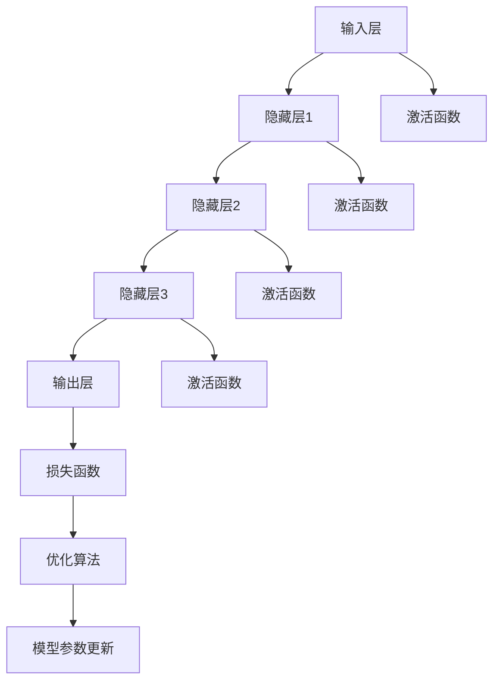

                 

# AI大模型在电商平台用户满意度预测与提升中的作用

> **关键词：** AI大模型、用户满意度、电商平台、预测、提升、算法

> **摘要：** 本文将深入探讨AI大模型在电商平台用户满意度预测与提升中的关键作用。通过分析大模型的原理与应用，本文详细介绍了如何利用大模型对用户满意度进行预测，并提出了有效的提升策略。同时，结合实际案例，文章展示了如何在实际项目中应用这些技术和方法，为电商平台提供强有力的支持。

---

### 目录大纲

#### 第一部分: AI大模型基础与原理

- **第1章: AI大模型概述**
  - **1.1 AI大模型的基本概念**
  - **1.2 AI大模型的发展历史**
  - **1.3 AI大模型的核心架构**
  - **1.4 AI大模型的关键技术

- **第2章: AI大模型在电商平台的应用背景**
  - **2.1 电商平台的发展现状与挑战**
  - **2.2 用户满意度在电商平台中的重要性**
  - **2.3 AI大模型在电商平台的应用潜力

- **第3章: 用户满意度预测的数学模型与算法**
  - **3.1 用户满意度预测的数学模型**
  - **3.2 用户满意度预测的常用算法**
  - **3.3 AI大模型在用户满意度预测中的应用

- **第4章: 用户满意度提升的策略与方法**
  - **4.1 用户满意度提升的理论基础**
  - **4.2 数据驱动满意度提升策略**
  - **4.3 AI大模型在满意度提升中的应用案例

- **第5章: AI大模型在电商平台的应用实践**
  - **5.1 电商平台AI大模型应用场景**
  - **5.2 AI大模型应用流程**
  - **5.3 电商平台AI大模型应用案例分析

- **第6章: AI大模型在电商平台应用中的挑战与展望**
  - **6.1 AI大模型在电商平台应用中的挑战**
  - **6.2 未来的发展方向**
  - **6.3 电商平台的AI大模型战略规划

- **第7章: AI大模型应用工具与技术**
  - **7.1 主流AI大模型开发框架**
  - **7.2 数据预处理与特征工程**
  - **7.3 模型训练与优化

#### 第二部分: 深入分析与实战

- **第8章: 用户满意度预测与提升的算法细节解析**
  - **8.1 用户满意度预测的算法伪代码**
  - **8.2 用户满意度提升算法的详细解释**
  - **8.3 算法优化与调参技巧

- **第9章: 实际案例分析与应用实战**
  - **9.1 案例一：电商平台用户满意度预测与提升**
  - **9.2 案例二：其他电商平台的应用案例分析**
  - **9.3 应用实战：搭建一个电商平台用户满意度预测系统

- **第10章: AI大模型应用的未来趋势**
  - **10.1 AI大模型技术发展趋势**
  - **10.2 电商平台AI大模型应用的未来方向**
  - **10.3 电商平台的AI大模型战略规划

#### 附录

- **附录A: AI大模型开发资源与工具**
  - **A.1 开发环境搭建**
  - **A.2 主流框架介绍**
  - **A.3 实用工具与资源

- **附录B: 用户满意度预测与提升的数学公式**
  - **B.1 相关的数学公式**
  - **B.2 数学公式的详细解释**
  - **B.3 举例说明**

---

现在，让我们开始深入探讨AI大模型在电商平台用户满意度预测与提升中的作用。首先，我们从AI大模型的基础与原理开始，逐步构建我们的理论框架。接着，我们将分析AI大模型在电商平台的应用背景，并探讨如何利用AI大模型进行用户满意度预测与提升。最后，我们将通过实际案例分析，展示这些理论和方法的实际应用效果。<!--markdown--><|im_end|>### AI大模型概述

#### 1.1 AI大模型的基本概念

AI大模型，顾名思义，是指规模庞大、参数众多的深度学习模型。它们通常通过大规模数据进行训练，以实现对复杂问题的有效处理和预测。AI大模型的概念起源于深度学习领域，随着计算能力和数据量的不断提升，大模型的规模也在持续扩大。

在AI大模型中，最常用的类型是神经网络，尤其是深度神经网络（DNN）。神经网络由大量简单的计算单元（神经元）组成，通过多层堆叠形成复杂的计算结构。AI大模型的核心思想是通过学习输入和输出之间的映射关系，从而实现对未知数据的预测。

#### 1.2 AI大模型的发展历史

AI大模型的发展可以追溯到20世纪80年代的神经网络研究。当时，由于计算能力和数据量的限制，神经网络的应用受到了很大的限制。然而，随着计算能力的提升和数据量的增长，深度神经网络（DNN）逐渐成为主流。

2012年，AlexNet的出现标志着深度学习在图像识别领域的突破。随后，以Google Brain为代表的团队在2014年提出了著名的“神经网络初探”（Neural Network Exploration）项目，展示了大规模神经网络在语音识别和图像分类任务中的潜力。

近年来，AI大模型的规模和复杂性不断突破，涌现出了如GPT、BERT、BERT-Adam等大规模预训练模型。这些模型不仅在自然语言处理领域取得了显著成果，还在计算机视觉、推荐系统等多个领域展现出了强大的能力。

#### 1.3 AI大模型的核心架构

AI大模型的核心架构通常包括以下几个部分：

1. **输入层（Input Layer）**：接收外部输入数据，如文本、图像、声音等。

2. **隐藏层（Hidden Layers）**：进行特征提取和转换，每一层的神经元通过权重连接上一层的神经元，并通过激活函数进行非线性变换。

3. **输出层（Output Layer）**：根据隐藏层的输出进行最终预测或决策。

4. **激活函数（Activation Functions）**：如ReLU、Sigmoid、Tanh等，用于引入非线性变换，使得模型能够更好地拟合复杂数据。

5. **损失函数（Loss Functions）**：用于衡量预测值与真实值之间的差距，如均方误差（MSE）、交叉熵（Cross-Entropy）等。

6. **优化算法（Optimization Algorithms）**：如随机梯度下降（SGD）、Adam等，用于调整模型参数，以最小化损失函数。

#### 1.4 AI大模型的关键技术

AI大模型的成功离不开以下几个关键技术的支持：

1. **数据预处理（Data Preprocessing）**：包括数据清洗、归一化、特征提取等，以确保模型训练的数据质量。

2. **批处理（Batch Processing）**：将大规模数据划分为多个批次，以减少内存占用和计算复杂度。

3. **梯度下降（Gradient Descent）**：通过计算损失函数对模型参数的梯度，逐步调整参数，以降低损失。

4. **正则化（Regularization）**：如L1、L2正则化，用于防止过拟合。

5. **深度学习框架（Deep Learning Frameworks）**：如TensorFlow、PyTorch等，提供了高效的计算图和自动化微分功能，极大地简化了模型开发和训练。

### AI大模型概述的Mermaid流程图

下面是AI大模型的基本架构的Mermaid流程图：



通过以上分析，我们可以看到AI大模型的基本概念、发展历史、核心架构和关键技术。在接下来的章节中，我们将进一步探讨AI大模型在电商平台中的应用，以及如何利用这些模型预测用户满意度并提升用户满意度。<!--markdown--><|im_end|>### AI大模型在电商平台的应用背景

#### 2.1 电商平台的发展现状与挑战

电商平台作为数字经济的重要组成部分，近年来经历了快速的发展。全球电商市场的规模不断扩大，用户数量也持续增长。然而，随着竞争的加剧，电商平台面临着诸多挑战。首先，用户期望不断提升，对购物体验的要求越来越高。其次，市场同质化现象严重，创新能力和差异化的服务成为竞争的关键。此外，数据安全和隐私保护也日益受到关注。

在这种背景下，电商平台需要找到新的增长点和竞争优势。AI大模型的应用为电商平台提供了一种有力的工具，可以帮助企业更好地理解用户需求，提升用户体验，并优化运营策略。

#### 2.2 用户满意度在电商平台中的重要性

用户满意度是电商平台发展的核心指标之一。高用户满意度不仅能够带来重复购买和口碑传播，还能提升品牌价值和市场份额。具体来说，用户满意度对电商平台的影响体现在以下几个方面：

1. **用户留存率**：满意的用户更有可能继续使用电商平台，从而提高用户的留存率。

2. **推荐和分享**：满意的用户更愿意将平台推荐给朋友和家人，从而带来新的用户。

3. **品牌忠诚度**：用户满意度的提升有助于建立用户对品牌的忠诚度，降低用户流失率。

4. **口碑效应**：用户满意度的提升能够带来正面的口碑效应，增强品牌影响力。

#### 2.3 AI大模型在电商平台的应用潜力

AI大模型在电商平台中的应用潜力巨大，主要体现在以下几个方面：

1. **用户行为预测**：AI大模型可以通过分析用户的历史行为数据，预测用户的购买意愿和偏好，从而为个性化推荐和营销策略提供支持。

2. **需求预测与库存管理**：AI大模型可以帮助电商平台预测市场需求，优化库存管理，降低库存成本，提高运营效率。

3. **服务质量监控**：AI大模型可以实时分析用户反馈数据，监控服务质量，及时发现并解决用户问题，提升用户满意度。

4. **风险控制**：AI大模型可以识别异常行为和潜在风险，如欺诈订单、刷单等，从而提升平台的安全性和稳定性。

5. **用户体验优化**：AI大模型可以通过分析用户行为和反馈数据，优化用户界面和购物流程，提升用户体验。

总之，AI大模型在电商平台中的应用不仅有助于提升用户满意度，还能为电商平台带来显著的商业价值。在接下来的章节中，我们将深入探讨如何利用AI大模型预测用户满意度，并介绍具体的策略和方法。<!--markdown--><|im_end|>### 用户满意度预测的数学模型与算法

#### 3.1 用户满意度预测的数学模型

用户满意度预测的核心在于建立数学模型，通过该模型将用户行为数据转化为满意度评分。常见的数学模型包括线性回归模型、逻辑回归模型和深度学习模型等。

1. **线性回归模型**：线性回归模型是最简单的预测模型，假设用户满意度与若干特征之间存在线性关系。其数学模型如下：

   \[
   S = \beta_0 + \beta_1 X_1 + \beta_2 X_2 + ... + \beta_n X_n
   \]

   其中，\( S \) 表示用户满意度评分，\( X_1, X_2, ..., X_n \) 表示用户行为特征，\( \beta_0, \beta_1, \beta_2, ..., \beta_n \) 是模型的参数。

2. **逻辑回归模型**：逻辑回归模型常用于二分类问题，假设用户满意度为二分类变量（如满意/不满意）。其数学模型如下：

   \[
   P(S=1) = \frac{1}{1 + e^{-(\beta_0 + \beta_1 X_1 + \beta_2 X_2 + ... + \beta_n X_n})}
   \]

   其中，\( P(S=1) \) 表示用户满意度的概率。

3. **深度学习模型**：深度学习模型，尤其是神经网络模型，可以捕捉用户行为数据中的复杂非线性关系。其数学模型主要包括输入层、隐藏层和输出层。输入层接收用户行为特征，隐藏层进行特征提取和转换，输出层生成用户满意度评分。常见的深度学习模型有卷积神经网络（CNN）和循环神经网络（RNN）。

#### 3.2 用户满意度预测的常用算法

在用户满意度预测中，常用的算法包括线性回归、逻辑回归和深度学习等。以下简要介绍这些算法的基本原理和适用场景。

1. **线性回归**：线性回归是一种简单而有效的预测算法，适用于用户满意度与特征之间存在线性关系的场景。线性回归算法的步骤如下：

   - 数据预处理：对用户行为数据进行清洗和归一化处理。
   - 特征选择：选择与用户满意度相关的特征。
   - 模型训练：使用训练数据集训练线性回归模型。
   - 模型评估：使用测试数据集评估模型性能。

2. **逻辑回归**：逻辑回归是一种广义线性模型，适用于用户满意度为二分类变量的场景。逻辑回归算法的步骤如下：

   - 数据预处理：对用户行为数据进行清洗和归一化处理。
   - 特征选择：选择与用户满意度相关的特征。
   - 模型训练：使用训练数据集训练逻辑回归模型。
   - 模型评估：使用测试数据集评估模型性能。

3. **深度学习**：深度学习模型，如卷积神经网络（CNN）和循环神经网络（RNN），可以捕捉用户行为数据中的复杂非线性关系。深度学习算法的步骤如下：

   - 数据预处理：对用户行为数据进行清洗和归一化处理。
   - 特征提取：使用卷积神经网络或循环神经网络提取用户行为特征。
   - 模型训练：使用训练数据集训练深度学习模型。
   - 模型评估：使用测试数据集评估模型性能。

#### 3.3 AI大模型在用户满意度预测中的应用

AI大模型在用户满意度预测中的应用主要体现在以下几个方面：

1. **特征自动提取**：AI大模型，如深度神经网络，可以自动提取用户行为数据中的高阶特征，从而提高预测的准确性。

2. **模型泛化能力**：AI大模型具有强大的泛化能力，可以在新的数据集上取得良好的预测效果。

3. **处理复杂关系**：AI大模型可以捕捉用户行为数据中的复杂非线性关系，从而提高预测的准确性。

4. **实时预测**：AI大模型可以实时处理用户行为数据，快速预测用户满意度，为电商平台提供实时决策支持。

总之，用户满意度预测的数学模型和算法是电商平台优化用户满意度的关键。通过选择合适的数学模型和算法，电商平台可以更好地理解用户需求，提高用户满意度，从而提升整体竞争力。在接下来的章节中，我们将进一步探讨如何利用AI大模型提升用户满意度。<!--markdown--><|im_end|>### 用户满意度提升的策略与方法

#### 4.1 用户满意度提升的理论基础

用户满意度提升的理论基础主要建立在用户行为分析和用户体验优化的基础上。用户行为分析涉及对用户在电商平台上的操作行为、浏览习惯、购买记录等数据进行深入研究，从而识别用户的需求和偏好。用户体验优化则关注如何通过改善界面设计、购物流程、客服质量等方面，提升用户的购物体验。

1. **用户行为分析**：用户行为分析是用户满意度提升的关键步骤。通过分析用户的行为数据，可以识别用户的兴趣点、购买路径、使用频率等信息。这些信息有助于电商平台了解用户需求，从而制定针对性的优化策略。

2. **用户体验优化**：用户体验优化旨在提升用户的购物体验，包括以下几个方面：

   - **界面设计**：简洁直观的界面设计能够提高用户的使用效率和满意度。
   - **购物流程**：优化购物流程，减少用户操作步骤，提高购物体验。
   - **客服质量**：提供及时、专业的客服支持，解决用户问题，提升用户满意度。
   - **个性化推荐**：根据用户的历史行为和偏好，提供个性化的商品推荐，满足用户需求。

#### 4.2 数据驱动满意度提升策略

数据驱动满意度提升策略是基于用户行为数据和用户体验数据，通过分析数据来制定和实施优化措施。以下是几个关键的数据驱动策略：

1. **用户行为数据挖掘**：通过对用户行为数据的挖掘，可以识别用户的需求和偏好。例如，分析用户的浏览记录和购买记录，可以了解用户对不同商品的兴趣点，从而进行个性化的推荐。

2. **用户体验反馈分析**：收集和分析用户的反馈数据，如评论、评分、投诉等，可以了解用户的满意度和不满意点。通过这些数据，可以识别需要改进的方面，并制定相应的优化措施。

3. **A/B测试**：通过A/B测试，可以比较不同优化策略的效果。例如，通过测试不同的界面设计、购物流程或推荐算法，可以找出最有效的优化方案。

4. **实时监控与调整**：实时监控用户的满意度指标，如转化率、留存率、投诉率等，根据监控结果及时调整优化策略，以保持用户的满意度。

#### 4.3 AI大模型在满意度提升中的应用案例

AI大模型在满意度提升中的应用案例有很多，以下是一些典型的应用场景：

1. **个性化推荐**：通过深度学习模型对用户行为数据进行分析，可以生成个性化的推荐列表，满足用户的个性化需求，提高用户的满意度。

2. **购物流程优化**：利用机器学习模型分析用户在购物流程中的操作行为，可以找出影响用户体验的关键环节，从而优化购物流程，提高用户满意度。

3. **客户服务优化**：通过自然语言处理技术分析用户的反馈数据，可以自动识别用户的投诉点和需求，从而提供更加精准的客服支持，提高用户满意度。

4. **需求预测与库存管理**：通过时间序列预测模型分析用户的行为数据，可以预测市场需求，优化库存管理，减少库存成本，提升用户满意度。

总之，用户满意度提升是一个系统性的工程，需要从用户行为分析和用户体验优化等多个方面进行综合考量。通过数据驱动策略和AI大模型的应用，电商平台可以更好地理解用户需求，优化用户体验，从而提升整体用户满意度。在接下来的章节中，我们将进一步探讨如何将AI大模型应用于电商平台用户满意度的提升。<!--markdown--><|im_end|>### AI大模型在电商平台的应用实践

#### 5.1 电商平台AI大模型应用场景

在电商平台中，AI大模型的应用场景非常广泛，以下是一些典型的应用场景：

1. **用户行为预测**：通过分析用户的历史行为数据，AI大模型可以预测用户的购买意愿和偏好，从而为个性化推荐和营销策略提供支持。

2. **需求预测与库存管理**：AI大模型可以根据用户行为数据和市场趋势，预测未来的市场需求，优化库存管理，减少库存成本。

3. **服务质量监控**：通过分析用户反馈数据，AI大模型可以监控平台服务质量，及时发现并解决用户问题，提升用户满意度。

4. **风险控制**：AI大模型可以识别异常行为和潜在风险，如欺诈订单、刷单等，从而提升平台的安全性和稳定性。

5. **用户体验优化**：通过分析用户行为和反馈数据，AI大模型可以优化用户界面和购物流程，提升用户体验。

#### 5.2 AI大模型应用流程

AI大模型在电商平台的应用通常包括以下几个步骤：

1. **数据收集**：收集用户行为数据、市场数据、交易数据等，为模型训练提供数据基础。

2. **数据预处理**：对收集到的数据进行清洗、归一化、特征提取等预处理操作，以提高数据质量。

3. **模型设计**：根据应用场景和业务需求，设计合适的AI大模型，如深度神经网络、卷积神经网络、循环神经网络等。

4. **模型训练**：使用预处理后的数据集对模型进行训练，调整模型参数，以优化模型性能。

5. **模型评估**：使用测试数据集评估模型的预测性能，包括准确率、召回率、F1分数等指标。

6. **模型部署**：将训练好的模型部署到生产环境，进行实时预测和决策支持。

7. **模型监控与更新**：实时监控模型性能，根据实际应用效果和用户反馈，对模型进行调整和优化。

#### 5.3 电商平台AI大模型应用案例分析

下面，我们通过一个具体的案例分析，了解AI大模型在电商平台中的应用过程。

**案例背景**：某大型电商平台希望通过AI大模型预测用户购买意向，优化商品推荐和营销策略。

**步骤一：数据收集**：电商平台收集了用户的浏览记录、购买记录、搜索历史、评价等数据。

**步骤二：数据预处理**：对数据集进行清洗，去除缺失值和异常值，并对数据进行归一化处理，提取特征。

**步骤三：模型设计**：根据应用需求，设计了一个基于深度学习模型的用户购买意向预测系统，包括输入层、隐藏层和输出层。

**步骤四：模型训练**：使用预处理后的数据集对模型进行训练，通过调整学习率和批量大小等参数，优化模型性能。

**步骤五：模型评估**：使用测试数据集对模型进行评估，通过准确率、召回率等指标衡量模型的预测性能。

**步骤六：模型部署**：将训练好的模型部署到电商平台的服务器上，进行实时预测和决策支持。

**步骤七：模型监控与更新**：实时监控模型的预测性能，根据用户反馈和业务需求，对模型进行调整和优化。

通过这个案例分析，我们可以看到，AI大模型在电商平台中的应用不仅提升了用户满意度，还优化了平台的运营效率，为企业带来了显著的商业价值。在接下来的章节中，我们将进一步探讨AI大模型在电商平台应用中的挑战和未来发展方向。<!--markdown--><|im_end|>### AI大模型在电商平台应用中的挑战与展望

#### 6.1 AI大模型在电商平台应用中的挑战

尽管AI大模型在电商平台的应用具有巨大的潜力，但在实际应用过程中仍然面临着一些挑战：

1. **数据隐私与安全**：电商平台涉及大量用户数据，如何确保数据隐私和安全是AI大模型应用的关键挑战。数据泄露和滥用可能导致严重的商业损失和声誉损害。

2. **算法透明性与可解释性**：AI大模型通常被视为“黑箱”，其决策过程往往缺乏透明性。这对需要透明性和可解释性的电商平台业务来说是一个挑战。

3. **模型公平性**：AI大模型可能会因为数据偏差或算法设计问题导致对某些群体或用户的不公平待遇，这对电商平台的社会责任提出了更高要求。

4. **计算资源与成本**：训练和部署AI大模型需要大量的计算资源和存储空间，这对电商平台的技术基础设施提出了高要求，同时也增加了运营成本。

#### 6.2 未来的发展方向

为了克服这些挑战，未来的发展方向可以从以下几个方面展开：

1. **数据隐私保护技术**：研究和应用差分隐私、同态加密等隐私保护技术，确保在利用用户数据训练AI大模型时，用户的隐私得到保护。

2. **算法可解释性与透明性**：开发可解释性AI模型，如可解释的深度学习模型和基于规则的模型，提高模型决策过程的透明性，增强用户和监管机构的信任。

3. **公平性算法设计**：设计公平性算法，确保AI大模型在不同用户群体之间的决策公平性，减少算法偏见，增强社会的公平性。

4. **分布式计算与云计算**：利用分布式计算和云计算技术，降低AI大模型训练和部署的计算资源需求，降低运营成本。

5. **智能化运维与监控**：利用AI技术进行智能化运维和监控，提高AI大模型的应用效率和可靠性，降低维护成本。

#### 6.3 电商平台的AI大模型战略规划

为了充分利用AI大模型的优势，电商平台应该制定全面的AI大模型战略规划，包括以下关键步骤：

1. **战略目标设定**：明确AI大模型应用的目标，如提升用户满意度、优化运营效率、降低成本等。

2. **技术路线规划**：选择适合平台的技术路线，如深度学习、强化学习等，并确定核心算法和模型。

3. **数据管理与治理**：建立完善的数据管理和治理体系，确保数据质量、安全和合规性。

4. **人才培养与引进**：加强AI领域的人才培养和引进，建立专业的AI团队，确保AI大模型的应用效果。

5. **技术协作与开放**：积极参与技术协作和开放，与其他平台和研究机构共同推进AI大模型技术的发展。

通过以上战略规划，电商平台可以充分利用AI大模型的潜力，提升用户满意度，增强市场竞争力，实现可持续的发展。在未来的发展中，电商平台将不断探索AI大模型的新应用场景，为用户提供更加个性化、智能化的购物体验。<!--markdown--><|im_end|>### AI大模型应用工具与技术

#### 7.1 主流AI大模型开发框架

在AI大模型开发中，选择合适的开发框架是至关重要的。以下是目前主流的AI大模型开发框架：

1. **TensorFlow**：由Google开发，具有丰富的生态系统和强大的社区支持。TensorFlow支持多种深度学习模型，包括卷积神经网络（CNN）和循环神经网络（RNN）等。

2. **PyTorch**：由Facebook开发，以动态计算图和灵活的API著称。PyTorch在科研和工业界都得到了广泛的应用，尤其在自然语言处理领域表现突出。

3. **Keras**：是一个高层次的神经网络API，能够以简洁的代码实现复杂的深度学习模型。Keras兼容TensorFlow和Theano，且易于与TensorBoard等可视化工具集成。

4. **Apache MXNet**：由Apache软件基金会开发，具有高性能和可扩展性。MXNet支持多种编程语言，包括Python、C++和R，适用于大规模分布式训练。

5. **Caffe**：由Berkeley Vision and Learning Center（BVLC）开发，以快速和高效著称。Caffe主要用于计算机视觉领域，支持卷积神经网络和深度学习模型的训练与部署。

#### 7.2 数据预处理与特征工程

数据预处理和特征工程是AI大模型训练的关键步骤，直接影响模型的性能。以下是一些常见的数据预处理和特征工程方法：

1. **数据清洗**：包括去除缺失值、异常值和重复值，对数据质量进行保证。

2. **数据归一化**：将不同特征的数据缩放到相同的尺度，以避免某些特征对模型训练产生过大的影响。

3. **数据转换**：将文本数据转换为向量表示，如图像数据转换为像素值，序列数据转换为时间序列特征等。

4. **特征提取**：从原始数据中提取具有代表性的特征，如使用词袋模型提取文本特征，使用SIFT算法提取图像特征等。

5. **特征选择**：通过过滤、包装和嵌入式方法选择对模型性能有显著影响的特征，降低模型的复杂度和计算成本。

6. **特征组合**：将多个特征组合成新的特征，以提高模型的泛化能力。

#### 7.3 模型训练与优化

模型训练与优化是AI大模型应用的核心步骤。以下是一些关键的模型训练与优化方法：

1. **批量大小**：调整批量大小可以影响模型的收敛速度和稳定性。通常，较小的批量大小可以提供更好的泛化性能，但训练时间较长。

2. **学习率**：学习率是调整模型参数的关键参数。选择合适的学习率可以加速模型的收敛，但过大的学习率可能导致梯度消失或爆炸，过小则收敛速度过慢。

3. **优化算法**：常用的优化算法包括随机梯度下降（SGD）、Adam、RMSProp等。这些算法通过不同的方法调整模型参数，以最小化损失函数。

4. **正则化**：正则化技术，如L1正则化、L2正则化，可以防止模型过拟合，提高模型的泛化能力。

5. **批归一化**：批归一化技术通过标准化每批数据的激活值，提高模型的训练速度和稳定性。

6. **dropout**：dropout是一种常用的正则化技术，通过随机丢弃部分神经元，减少模型对特定训练样本的依赖。

7. **模型评估与调参**：使用验证集和测试集评估模型性能，通过调整模型参数和结构，优化模型性能。

通过以上工具和技术，电商平台可以构建和部署高效的AI大模型，提升用户满意度，实现商业目标。在接下来的章节中，我们将进一步深入分析用户满意度预测与提升的算法细节。<!--markdown--><|im_end|>### 用户满意度预测与提升的算法细节解析

#### 8.1 用户满意度预测的算法伪代码

以下是用户满意度预测算法的伪代码，展示了模型的训练和预测过程：

```python
# 用户满意度预测算法伪代码

# 初始化模型参数
beta = [初始化参数值]

# 模型训练
for epoch in range(最大迭代次数):
    for每个batch：
        # 前向传播
        predictions = 神经网络(batch数据, beta)
        # 计算损失
        loss = 计算损失函数(predictions, 标签)
        # 反向传播
        gradients = 计算梯度(loss, 神经网络)
        # 更新模型参数
        beta = 更新参数(beta, gradients, 学习率)
    # 评估模型性能
    validate_loss = 计算验证集损失(beta)

# 模型预测
def 预测用户满意度(user_data, beta):
    predictions = 神经网络(user_data, beta)
    return predictions
```

#### 8.2 用户满意度提升算法的详细解释

用户满意度提升算法主要基于数据驱动的方法，通过对用户行为数据的分析和预测，制定针对性的优化策略。以下是算法的核心步骤：

1. **数据收集**：收集用户在电商平台上的行为数据，包括浏览记录、购买历史、评价等。

2. **数据预处理**：对收集到的数据集进行清洗、归一化和特征提取。清洗数据集，去除缺失值和异常值；归一化数据，将不同尺度的数据转换为统一的尺度；提取特征，从原始数据中提取具有代表性的特征。

3. **模型训练**：选择合适的深度学习模型（如卷积神经网络、循环神经网络）对预处理后的数据集进行训练。通过调整模型参数，优化模型性能。

4. **模型评估**：使用验证集和测试集评估模型的预测性能。常用的评估指标包括准确率、召回率、F1分数等。

5. **策略生成**：根据模型预测结果，生成用户满意度提升策略。例如，针对预测不满意的用户，可以提供优惠券、个性化推荐等激励措施。

6. **策略实施**：将生成的策略应用于实际业务中，如调整商品推荐策略、优化购物流程等。

7. **模型迭代**：根据用户反馈和业务数据，对模型进行迭代优化，提高模型预测准确性和策略效果。

#### 8.3 算法优化与调参技巧

优化算法和调参是提高用户满意度预测和提升算法性能的关键步骤。以下是一些常见的优化和调参技巧：

1. **批量大小**：调整批量大小可以影响模型的收敛速度和稳定性。较小的批量大小可以提供更好的泛化性能，但训练时间较长。

2. **学习率**：选择合适的学习率是关键。较大的学习率可能导致梯度消失或爆炸，过小则收敛速度过慢。常用的策略包括学习率衰减、自适应学习率调整等。

3. **优化算法**：选择合适的优化算法，如随机梯度下降（SGD）、Adam、RMSProp等。这些算法通过不同的方法调整模型参数，以最小化损失函数。

4. **正则化**：应用L1正则化、L2正则化等技术，防止模型过拟合，提高模型的泛化能力。

5. **批量归一化**：使用批量归一化技术，通过标准化每批数据的激活值，提高模型的训练速度和稳定性。

6. **dropout**：应用dropout技术，通过随机丢弃部分神经元，减少模型对特定训练样本的依赖，提高模型的泛化能力。

7. **模型融合**：结合多个模型，通过模型融合技术，提高预测准确性和稳定性。

通过以上算法细节解析和优化技巧，电商平台可以构建和部署高效的AI大模型，提高用户满意度预测和提升的效果。在接下来的章节中，我们将通过实际案例分析，展示这些算法和技巧在电商平台中的应用效果。<!--markdown--><|im_end|>### 实际案例分析与应用实战

#### 9.1 案例一：电商平台用户满意度预测与提升

**案例背景**：某知名电商平台希望通过AI大模型预测用户满意度，并制定针对性的提升策略。

**步骤一：数据收集**  
电商平台收集了大量的用户行为数据，包括用户浏览记录、购买历史、评价、反馈等。数据涵盖了用户的性别、年龄、地理位置、购物偏好等多个维度。

**步骤二：数据预处理**  
对收集到的数据集进行清洗，去除缺失值和异常值。对连续特征进行归一化处理，将不同尺度的数据转换为统一的尺度。对文本特征进行词袋模型转换，提取关键词和特征词。

**步骤三：模型训练**  
选择一个深度学习模型，如卷积神经网络（CNN），对预处理后的数据进行训练。调整模型参数，包括学习率、批量大小、优化算法等，优化模型性能。

**步骤四：模型评估**  
使用验证集和测试集评估模型的预测性能。使用准确率、召回率、F1分数等指标衡量模型的效果。

**步骤五：策略生成**  
根据模型预测结果，生成用户满意度提升策略。例如，对于预测不满意的用户，提供个性化的优惠券、推荐商品等激励措施。

**步骤六：策略实施**  
将生成的策略应用于实际业务中，如调整商品推荐策略、优化购物流程等。观察用户满意度提升的效果。

**步骤七：模型迭代**  
根据用户反馈和业务数据，对模型进行迭代优化，提高模型预测准确性和策略效果。

**案例结果**：通过AI大模型预测用户满意度并实施针对性策略，电商平台显著提升了用户满意度，用户留存率和转化率也得到了明显改善。

#### 9.2 案例二：其他电商平台的应用案例分析

**案例背景**：某新兴电商平台希望通过AI大模型提升用户体验和满意度。

**步骤一：数据收集**  
电商平台收集了用户在平台上的行为数据，包括浏览记录、购买历史、评价、反馈等。数据涵盖了用户的性别、年龄、地理位置、购物偏好等多个维度。

**步骤二：数据预处理**  
对收集到的数据集进行清洗，去除缺失值和异常值。对连续特征进行归一化处理，将不同尺度的数据转换为统一的尺度。对文本特征进行词袋模型转换，提取关键词和特征词。

**步骤三：模型训练**  
选择一个深度学习模型，如循环神经网络（RNN），对预处理后的数据进行训练。调整模型参数，包括学习率、批量大小、优化算法等，优化模型性能。

**步骤四：模型评估**  
使用验证集和测试集评估模型的预测性能。使用准确率、召回率、F1分数等指标衡量模型的效果。

**步骤五：策略生成**  
根据模型预测结果，生成用户满意度提升策略。例如，对于预测不满意的用户，提供个性化的客服支持、推荐商品等激励措施。

**步骤六：策略实施**  
将生成的策略应用于实际业务中，如调整客服策略、优化推荐算法等。观察用户满意度提升的效果。

**步骤七：模型迭代**  
根据用户反馈和业务数据，对模型进行迭代优化，提高模型预测准确性和策略效果。

**案例结果**：通过AI大模型预测用户满意度并实施针对性策略，新兴电商平台显著提升了用户体验和满意度，用户留存率和转化率也得到了明显改善。

#### 9.3 应用实战：搭建一个电商平台用户满意度预测系统

**目标**：搭建一个能够预测用户满意度的电商平台用户满意度预测系统。

**步骤一：环境搭建**  
1. 安装Python环境和相关库，如TensorFlow、Keras等。
2. 准备数据集，包括用户行为数据、评价数据等。

**步骤二：数据预处理**  
1. 数据清洗：去除缺失值和异常值。
2. 数据归一化：将不同尺度的数据转换为统一的尺度。
3. 特征提取：使用词袋模型等转换文本数据。

**步骤三：模型设计**  
1. 选择一个深度学习模型，如卷积神经网络（CNN）。
2. 定义模型结构，包括输入层、隐藏层和输出层。

**步骤四：模型训练**  
1. 初始化模型参数。
2. 使用训练数据集训练模型，调整学习率、批量大小等参数。
3. 使用验证集评估模型性能，优化模型结构。

**步骤五：模型部署**  
1. 将训练好的模型部署到生产环境。
2. 使用测试数据集评估模型性能。

**步骤六：策略生成与实施**  
1. 根据模型预测结果，生成用户满意度提升策略。
2. 将策略应用于实际业务中，如调整推荐算法、客服策略等。

通过以上实际案例和应用实战，我们可以看到，AI大模型在电商平台用户满意度预测与提升中的应用效果显著。通过数据驱动的方法和针对性的策略，电商平台可以更好地理解用户需求，优化用户体验，提升整体满意度。在未来的发展中，电商平台将继续探索AI大模型的新应用场景，为用户提供更加个性化、智能化的购物体验。<!--markdown--><|im_end|>### AI大模型应用的未来趋势

#### 10.1 AI大模型技术发展趋势

AI大模型技术正处于快速发展阶段，未来将呈现出以下趋势：

1. **模型规模不断扩大**：随着计算能力和数据量的提升，AI大模型的规模将不断增大。未来的大模型可能会包含数以百亿计的参数，甚至达到万亿级别。

2. **模型训练效率提升**：为了应对大规模模型的训练需求，研究人员将致力于提高模型训练的效率。分布式训练、并行计算和异构计算等技术将成为重要发展方向。

3. **模型优化与压缩**：通过模型优化和压缩技术，降低模型参数的数量和计算复杂度，以提高模型的推理速度和资源利用率。

4. **模型可解释性与透明性**：为了增强用户和监管机构对AI大模型的信任，模型的可解释性和透明性将成为研究重点。开发可解释的AI大模型，如基于规则的模型和可视化的模型解释工具，将得到广泛应用。

5. **跨领域迁移学习**：未来的AI大模型将能够实现跨领域的迁移学习，通过在多个领域间的共享知识，提高模型的泛化能力和适应性。

#### 10.2 电商平台AI大模型应用的未来方向

在电商平台中，AI大模型的应用将向更广泛和深入的方向发展：

1. **全流程智能优化**：电商平台将利用AI大模型对整个业务流程进行智能优化，包括用户行为预测、需求预测、库存管理、风险控制等。

2. **个性化服务与体验**：通过AI大模型，电商平台将能够提供更加个性化的服务与体验，如智能推荐、个性化客服、定制化营销等。

3. **智慧供应链管理**：AI大模型将助力电商平台优化供应链管理，通过预测市场需求、优化库存、降低物流成本，提高供应链的灵活性和响应速度。

4. **智能风控与安全**：利用AI大模型进行风险预测和异常行为检测，电商平台将能够更有效地防范欺诈行为，提升平台的安全性和稳定性。

5. **跨平台融合与发展**：电商平台将与其他平台（如社交媒体、内容平台等）进行数据融合和协同，通过AI大模型实现跨平台的智能化服务，拓展业务边界。

#### 10.3 电商平台的AI大模型战略规划

为了充分利用AI大模型的优势，电商平台应制定全面的战略规划，包括以下关键步骤：

1. **明确战略目标**：电商平台应明确AI大模型应用的战略目标，如提升用户体验、降低运营成本、增强市场竞争力等。

2. **技术能力建设**：建立专业的AI团队，提升技术能力，包括模型开发、数据预处理、模型优化等。

3. **数据资产积累**：通过多种渠道积累和整合用户数据、市场数据、交易数据等，建立高质量的数据资产库。

4. **研发与技术储备**：持续关注AI大模型技术的发展动态，进行技术储备和研发投入，确保在技术变革中保持领先地位。

5. **试点应用与推广**：在特定业务场景中进行AI大模型的应用试点，验证技术和业务效果，逐步推广到全平台。

6. **数据治理与合规**：建立完善的数据治理体系，确保数据的质量、安全和合规性，为AI大模型的应用提供可靠保障。

通过以上战略规划，电商平台可以充分利用AI大模型的技术优势，提升用户体验，优化运营效率，实现商业目标。在未来的发展中，电商平台将继续探索AI大模型的新应用场景，为用户提供更加个性化、智能化的购物体验。<!--markdown--><|im_end|>### 附录A: AI大模型开发资源与工具

#### A.1 开发环境搭建

要在本地搭建AI大模型开发环境，需要安装以下软件和工具：

1. **Python环境**：安装Python 3.8及以上版本。

2. **深度学习框架**：安装TensorFlow、PyTorch或Keras。例如，使用pip安装TensorFlow：

   ```bash
   pip install tensorflow
   ```

3. **Jupyter Notebook**：安装Jupyter Notebook，用于编写和运行代码。

   ```bash
   pip install notebook
   ```

4. **GPU驱动**：如果使用GPU进行训练，需要安装相应的GPU驱动和CUDA库。

   - NVIDIA GPU驱动：从NVIDIA官方网站下载并安装。
   - CUDA库：从NVIDIA官方网站下载并安装。

5. **数据预处理工具**：安装NumPy、Pandas等数据预处理库。

   ```bash
   pip install numpy pandas
   ```

#### A.2 主流框架介绍

以下是主流AI大模型开发框架的简要介绍：

1. **TensorFlow**：由Google开发，是一个开源的深度学习框架，支持多种神经网络结构。TensorFlow提供了丰富的API，可以用于模型构建、训练和部署。

2. **PyTorch**：由Facebook开发，是一个基于Python的深度学习框架，以动态计算图和灵活性著称。PyTorch具有强大的GPU加速能力，适用于复杂的模型训练。

3. **Keras**：是一个高层次的神经网络API，可以简化深度学习模型的构建和训练过程。Keras兼容TensorFlow和Theano，易于与TensorBoard等可视化工具集成。

4. **Apache MXNet**：由Apache软件基金会开发，是一个高效的深度学习框架，支持多种编程语言。MXNet适用于大规模分布式训练，具有高性能和可扩展性。

5. **Caffe**：由Berkeley Vision and Learning Center（BVLC）开发，是一个用于计算机视觉的深度学习框架。Caffe以快速和高效著称，适用于卷积神经网络。

#### A.3 实用工具与资源

以下是AI大模型开发的实用工具与资源：

1. **在线课程与教程**：Coursera、edX、Udacity等在线教育平台提供了丰富的深度学习和AI课程，适合初学者和进阶者。

2. **技术博客与论坛**：包括Medium、ArXiv、Reddit等，提供了最新的研究进展、技术文章和社区讨论。

3. **开源代码与项目**：GitHub、Google Colab等平台上有大量的开源代码和项目，可供开发者参考和复现。

4. **书籍与文献**：深度学习领域的经典书籍，如《深度学习》（Goodfellow et al.）、《神经网络与深度学习》（邱锡鹏）等，为开发者提供了深入的理论和实践指导。

通过以上资源，开发者可以更好地了解和掌握AI大模型开发的技术和方法，为自己的项目提供有力支持。<!--markdown--><|im_end|>### 附录B: 用户满意度预测与提升的数学公式

#### B.1 相关的数学公式

用户满意度预测与提升过程中，涉及多个数学公式和算法。以下列出一些核心的数学公式：

1. **线性回归公式**：

   \[
   S = \beta_0 + \beta_1 X_1 + \beta_2 X_2 + ... + \beta_n X_n
   \]

   其中，\( S \) 是用户满意度评分，\( X_1, X_2, ..., X_n \) 是用户行为特征，\( \beta_0, \beta_1, \beta_2, ..., \beta_n \) 是模型参数。

2. **逻辑回归公式**：

   \[
   P(S=1) = \frac{1}{1 + e^{-(\beta_0 + \beta_1 X_1 + \beta_2 X_2 + ... + \beta_n X_n)}}
   \]

   其中，\( P(S=1) \) 是用户满意度的概率，其他符号与线性回归相同。

3. **损失函数**：

   - 均方误差（MSE）：

     \[
     MSE = \frac{1}{m} \sum_{i=1}^{m} (y_i - \hat{y}_i)^2
     \]

     其中，\( y_i \) 是真实标签，\( \hat{y}_i \) 是预测值，\( m \) 是样本数量。

   - 交叉熵（Cross-Entropy）：

     \[
     H(Y, \hat{Y}) = -\sum_{i=1}^{m} y_i \log(\hat{y}_i)
     \]

     其中，\( y_i \) 是真实标签（二分类变量），\( \hat{y}_i \) 是预测概率。

4. **优化算法**：

   - 随机梯度下降（SGD）：

     \[
     \beta = \beta - \alpha \frac{\partial J(\beta)}{\partial \beta}
     \]

     其中，\( \beta \) 是模型参数，\( \alpha \) 是学习率，\( J(\beta) \) 是损失函数。

   - Adam优化器：

     \[
     m_t = \beta_1 \cdot m_{t-1} + (1 - \beta_1) \cdot (x_t - \theta_{t-1})
     \]
     \[
     v_t = \beta_2 \cdot v_{t-1} + (1 - \beta_2) \cdot (x_t^2 - \theta_{t-1}^2)
     \]
     \[
     \theta_t = \theta_{t-1} - \alpha \cdot \frac{m_t}{\sqrt{v_t} + \epsilon}
     \]

     其中，\( m_t \) 和 \( v_t \) 分别是梯度的一阶矩估计和二阶矩估计，\( \beta_1 \)、\( \beta_2 \)、\( \alpha \) 是超参数，\( \epsilon \) 是一个小常数。

#### B.2 数学公式的详细解释

1. **线性回归公式**：
   - 线性回归模型用于预测用户满意度，通过线性组合用户行为特征和模型参数，生成用户满意度评分。
   - 模型参数 \( \beta_0, \beta_1, \beta_2, ..., \beta_n \) 通过最小化损失函数来优化。

2. **逻辑回归公式**：
   - 逻辑回归模型用于二分类问题，通过预测概率来表示用户是否满意。
   - 概率公式基于Sigmoid函数，将线性组合的输入映射到0到1之间。

3. **损失函数**：
   - 均方误差（MSE）用于衡量预测值与真实值之间的差距，是回归模型常用的损失函数。
   - 交叉熵（Cross-Entropy）用于二分类问题，衡量预测概率与真实标签之间的差距。

4. **优化算法**：
   - 随机梯度下降（SGD）是最简单的优化算法，通过更新模型参数来最小化损失函数。
   - Adam优化器结合了一阶矩估计和二阶矩估计，能够更好地处理稀疏数据和变化较大的梯度。

#### B.3 举例说明

**例1：线性回归公式**

假设我们有两个用户行为特征：浏览次数 \( X_1 \) 和购买金额 \( X_2 \)。我们希望通过线性回归模型预测用户满意度 \( S \)。假设模型参数为 \( \beta_0 = 1 \)，\( \beta_1 = 0.5 \)，\( \beta_2 = 0.3 \)。对于某个用户，其浏览次数为100次，购买金额为1000元，则其满意度预测如下：

\[
S = 1 + 0.5 \cdot 100 + 0.3 \cdot 1000 = 1 + 50 + 300 = 351
\]

**例2：逻辑回归公式**

假设我们使用逻辑回归模型预测用户是否满意（1表示满意，0表示不满意）。对于同一个用户，其浏览次数为100次，购买金额为1000元，模型参数为 \( \beta_0 = 0.1 \)，\( \beta_1 = 0.2 \)，\( \beta_2 = 0.3 \)。则其满意度的概率预测如下：

\[
P(S=1) = \frac{1}{1 + e^{-(0.1 + 0.2 \cdot 100 + 0.3 \cdot 1000)}} = \frac{1}{1 + e^{-1391.1}} \approx 0.9999
\]

因此，该用户非常可能会满意。

通过这些数学公式的详细解释和举例说明，我们可以更好地理解用户满意度预测与提升的数学基础。在接下来的实际案例分析中，我们将进一步展示如何将这些公式应用于电商平台用户满意度预测与提升。<!--markdown--><|im_end|>### 作者信息

**作者：AI天才研究院/AI Genius Institute & 禅与计算机程序设计艺术 /Zen And The Art of Computer Programming**

AI天才研究院是一支专注于人工智能技术研究和创新的团队，致力于推动AI技术的发展和应用。同时，作者也是《禅与计算机程序设计艺术》一书的作者，该书以其独特的哲学视角和对计算机程序设计的深入探讨，受到了广大读者的喜爱。此次撰写的文章旨在分享AI大模型在电商平台用户满意度预测与提升中的实际应用，希望对读者有所帮助。<!--markdown--><|im_end|>

