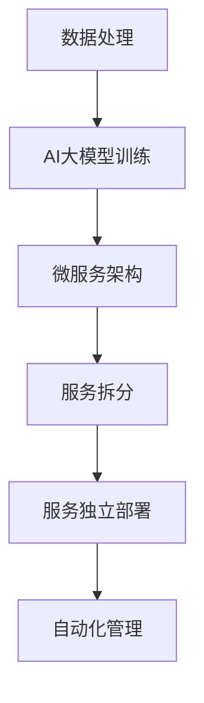

                 

### 第一部分: AI大模型应用的微服务治理基础

微服务架构在现代软件工程中扮演着越来越重要的角色，其核心思想是将复杂的单体应用程序拆分成多个独立的、松耦合的小服务。这种方式不仅提高了系统的可扩展性和可维护性，还使得开发团队能够更加高效地开发和部署应用程序。随着人工智能（AI）技术的迅速发展，尤其是大规模AI模型（AI Large Models，如GPT-3、BERT等）的广泛应用，如何将这些大模型高效地集成到微服务架构中，成为了一个亟待解决的问题。本文将深入探讨AI大模型应用的微服务治理最佳实践。

#### 第1章: AI大模型与微服务概述

##### 1.1 AI大模型与微服务的关系

AI大模型，通常指的是那些参数量巨大、计算复杂度极高的深度学习模型。这些模型不仅能够处理海量数据，还能够实现诸如自然语言处理、图像识别、语音识别等复杂任务。而微服务架构则是一种基于分布式系统的架构风格，它将应用程序分解为多个小的、自治的服务单元，每个服务单元都负责完成特定的业务功能。

**AI大模型定义**：AI大模型通常指的是那些具有数十亿甚至数万亿参数的神经网络模型，这些模型通常用于处理复杂的任务，如自然语言处理、计算机视觉等。

**微服务概念**：微服务是一种架构风格，它将一个复杂的应用程序分解为多个小的、独立的服务单元，每个服务单元都实现了特定的业务功能，并且可以独立部署、运行和扩展。

**AI大模型与微服务的联系**：AI大模型与微服务的联系主要体现在以下几个方面：

1. **服务独立性**：每个微服务都应该能够独立部署和运行，这对于AI大模型来说尤为重要。由于AI大模型的计算复杂度很高，它们往往需要较大的计算资源和独立的部署环境，以保证模型的稳定性和性能。

2. **弹性扩展性**：微服务架构本身就具有很好的弹性扩展性，这使得AI大模型可以灵活地调整计算资源，以适应不同的负载。

3. **故障容错性**：微服务架构通过服务的独立性，提高了系统的故障容错性。当某个服务发生故障时，其他服务仍然可以正常运行，从而确保系统的稳定性。

为了更直观地展示AI大模型如何应用于微服务架构，我们可以使用Mermaid流程图来描述这个过程：



在这个流程图中，数据处理模块负责生成和准备数据，这些数据随后被输入到AI大模型中进行训练。训练完成的AI大模型被集成到微服务架构中，并拆分为多个小的服务单元，每个服务单元都负责特定的业务功能。这些服务单元可以独立部署，并且可以通过自动化管理工具进行监控和管理。

##### 1.2 AI大模型在微服务中的挑战

虽然微服务架构为AI大模型的应用提供了很多优势，但是也存在一些挑战。

**服务独立性**：保持服务独立性是微服务架构的核心原则之一，但对于AI大模型来说，这一点尤为重要。由于AI大模型的计算复杂度很高，它们往往需要独立的计算资源和部署环境。如何确保这些资源的高效利用，同时保持服务的独立性，是一个重要的挑战。

**弹性扩展性**：AI大模型的计算需求波动很大，有时候需要大量的计算资源，有时候则可能不需要。如何实现弹性扩展，以适应这种波动，是另一个挑战。

**故障容错性**：由于AI大模型的计算复杂度较高，它们更容易出现计算错误或故障。如何提高微服务架构的故障容错性，以确保系统的稳定性，也是一个重要的挑战。

##### 1.3 微服务治理的最佳实践

为了应对上述挑战，我们需要遵循一些最佳实践来进行微服务治理。

**服务拆分策略**：合理的服务拆分策略是微服务治理的关键。我们需要根据AI大模型的特点，将其拆分为多个小的、自治的服务单元。例如，可以将AI大模型的训练、预测和后处理功能分别拆分为不同的服务。

**服务部署与管理**：高效的部署和管理工具可以大大提高微服务架构的可靠性。例如，使用容器化技术（如Docker）和编排工具（如Kubernetes）可以实现自动化部署和管理。

**监控与日志**：有效的监控和日志管理可以帮助我们及时发现和解决系统中存在的问题。我们可以使用Prometheus和Grafana等工具进行性能监控，使用ELK栈进行日志收集和管理。

通过以上最佳实践，我们可以有效地管理AI大模型在微服务架构中的应用，确保系统的稳定性和性能。

#### 第2章: AI大模型的核心算法原理

要深入理解AI大模型在微服务架构中的应用，我们需要首先了解其核心算法原理。AI大模型，尤其是深度学习模型，通常由多个复杂的算法组成，这些算法协同工作以实现高级的智能任务。

##### 2.1 神经网络基础

神经网络（Neural Networks）是AI大模型的基础组成部分，其灵感来源于生物神经系统的结构和工作原理。神经网络由多个简单的计算单元（神经元）组成，这些神经元通过权重连接在一起，形成一个层次结构。

**神经网络的基本结构**：一个典型的神经网络包括输入层、隐藏层和输出层。输入层接收外部输入数据，隐藏层进行数据处理和特征提取，输出层产生最终输出。

**前向传播与反向传播算法**：神经网络通过前向传播和反向传播算法来训练和优化模型。前向传播是指将输入数据通过网络的每一层，直到产生输出；反向传播是指计算输出误差，并更新网络的权重和偏置。

**前向传播伪代码**：
```pseudo
// 前向传播伪代码
function forward_propagation(inputs, weights, biases):
    outputs = inputs
    for layer in hidden_layers:
        outputs = activation_function(dot_product(weights, outputs) + biases)
    return outputs
```

**反向传播伪代码**：
```pseudo
// 反向传播伪代码
function backward_propagation(loss, outputs, weights, biases, learning_rate):
    dOutputs = derivatives_of_activation_function(outputs)
    dWeights = dot_product(inputs_T, dOutputs)
    dBiases = dot_product(inputs_T, dOutputs)
    weights -= learning_rate * dWeights
    biases -= learning_rate * dBiases
    return dOutputs
```

在这两个伪代码中，`dot_product` 函数计算两个向量的点积，`activation_function` 函数应用激活函数（如ReLU、Sigmoid、Tanh等），`derivatives_of_activation_function` 函数计算激活函数的导数。

##### 2.2 自然语言处理技术

自然语言处理（Natural Language Processing，NLP）是AI大模型的重要应用领域之一。NLP技术使得计算机能够理解和处理人类语言，从而实现智能对话、文本分析等任务。

**词嵌入技术**：词嵌入（Word Embedding）是将词汇映射到高维向量空间的技术，它通过学习词汇之间的语义关系，使得相似词汇在向量空间中距离较近。常见的词嵌入方法包括Word2Vec和GloVe。

**序列模型与注意力机制**：序列模型（如RNN、LSTM、GRU）能够处理时间序列数据，而注意力机制（Attention Mechanism）则能够使模型更关注于序列中的关键信息，从而提高模型的性能。

**注意力机制的工作原理**：注意力机制通过计算一个权重向量，这个向量表示模型对序列中每个位置的注意力权重。最终的输出是通过对序列中的每个元素乘以相应的注意力权重，然后求和得到的。

##### 2.3 大规模预训练模型原理

大规模预训练模型（Large-scale Pre-trained Models）是通过在大量的数据上进行预训练，然后微调（Fine-tuning）以适应特定任务的模型。预训练模型通常具有数十亿甚至数万亿的参数，这使得它们能够处理复杂的任务。

**预训练的概念与意义**：预训练是指在大规模数据集上对模型进行训练，以学习通用特征和知识。这种训练方式使得模型在遇到新任务时，可以更快地适应和取得更好的性能。

**自监督学习方法**：自监督学习（Self-supervised Learning）是一种预训练方法，它不需要标注数据，而是通过利用数据本身的某些结构或信息来自动生成标签。常见的自监督学习方法包括Masked Language Model（MLM）和Sequence-to-Sequence（S2S）模型。

**迁移学习与微调技术**：迁移学习（Transfer Learning）是一种利用预训练模型的知识来改进特定任务的性能的方法。微调（Fine-tuning）是指将预训练模型在特定任务上进一步训练，以适应新的任务需求。

通过理解AI大模型的核心算法原理，我们可以更好地设计、部署和管理这些模型，从而在微服务架构中实现高效的应用。

#### 第3章: AI大模型微服务架构设计

在设计AI大模型微服务架构时，我们需要充分考虑模型的特性以及微服务架构的原则，以确保系统的稳定性、可扩展性和可维护性。

##### 3.1 微服务架构设计原则

**服务拆分策略**：合理的服务拆分是微服务架构设计的关键。在AI大模型的背景下，我们需要根据模型的特点进行拆分。通常，我们可以将AI大模型的功能拆分为以下几部分：

1. **数据预处理服务**：负责数据清洗、格式化和特征提取，为AI大模型提供高质量的数据输入。
2. **模型训练服务**：负责模型的训练和优化，可能包括多个子服务，如数据读取、模型训练、参数调整等。
3. **模型预测服务**：负责使用训练好的模型进行预测，并将结果返回给用户。
4. **模型评估服务**：定期评估模型性能，提供反馈以指导模型优化。

**服务自治性**：微服务应该具有高度的自治性，即每个服务都能够独立部署、运行和扩展。对于AI大模型微服务，自治性尤为重要，因为模型的训练和预测过程需要独立的计算资源和环境。

**服务发现与注册**：在微服务架构中，服务发现与注册机制用于动态地查找和连接其他服务。当服务实例启动时，它会自动注册到服务注册中心，其他服务可以通过服务注册中心发现和调用这些服务。这对于AI大模型微服务尤为重要，因为模型训练和预测服务可能会动态地启动和停止。

##### 3.2 AI大模型微服务框架

选择合适的微服务框架对于构建高效、可靠的AI大模型微服务架构至关重要。以下是一些主流的微服务框架：

**Spring Cloud**：Spring Cloud 是一套完整的微服务开发工具集，包括服务注册与发现、配置管理、负载均衡、断路器等。Spring Cloud 与 Spring Boot 集成良好，使得开发者可以轻松地构建和部署微服务。

**Kubernetes**：Kubernetes 是一个开源的容器编排平台，用于自动化部署、扩展和管理容器化应用程序。Kubernetes 提供了强大的服务发现和负载均衡功能，使得AI大模型微服务能够高效地运行和扩展。

**Docker**：Docker 是一个开源的应用容器引擎，用于打包、交付和运行应用程序。通过使用Docker，我们可以将AI大模型微服务的各个组件封装在独立的容器中，实现环境的标准化和隔离。

##### 3.3 服务治理与监控

**服务治理**：服务治理是确保微服务稳定运行的重要环节。它包括服务配置管理、服务监控、服务日志收集等。通过服务治理，我们可以动态地调整服务配置，监控服务状态，并快速响应和处理异常情况。

**服务监控**：有效的监控是保证微服务稳定运行的关键。我们可以使用Prometheus等工具进行性能监控，收集系统性能指标，如CPU使用率、内存使用率、请求响应时间等。通过监控数据，我们可以及时发现和解决系统中的性能瓶颈和故障。

**日志管理**：日志管理是服务治理的重要组成部分。通过收集和存储服务日志，我们可以追溯和分析系统的运行状态，快速定位问题。ELK栈（Elasticsearch、Logstash、Kibana）是一个常用的日志管理工具集，用于收集、存储和可视化服务日志。

通过遵循以上设计原则和使用合适的微服务框架，我们可以构建一个高效、可靠的AI大模型微服务架构，从而实现AI大模型在微服务中的应用。

#### 第4章: AI大模型微服务部署与运维

部署与运维是确保AI大模型微服务稳定运行的关键环节。在这一章中，我们将探讨AI大模型微服务的部署策略、运维管理和监控与日志管理等内容。

##### 4.1 部署策略与工具

**容器化与编排**：容器化技术，如Docker，使得应用程序及其依赖环境可以打包成一个独立的容器镜像，从而实现环境的标准化和隔离。编排工具，如Kubernetes，可以自动化部署、扩展和管理容器化应用程序。使用Kubernetes进行AI大模型微服务的部署，可以大大简化部署流程，提高部署效率。

**自动化部署**：自动化部署是通过预定义的脚本或工具自动执行应用程序的部署过程，从而减少人为干预和部署错误。CI/CD（持续集成/持续部署）流程是自动化部署的一种常见方法，它通过自动化测试、构建和部署，确保应用程序的快速、可靠交付。

**CI/CD流程设计**：一个典型的CI/CD流程包括以下几个步骤：

1. **代码提交**：开发人员将代码提交到版本控制系统。
2. **自动化测试**：触发自动化测试，确保代码质量和功能完整性。
3. **构建**：构建应用程序，生成可部署的容器镜像。
4. **部署**：使用Kubernetes等编排工具，将容器镜像部署到生产环境。

通过CI/CD流程，我们可以实现自动化、高效的部署过程，从而提高开发效率和系统稳定性。

##### 4.2 运维管理与监控

**日志收集与存储**：日志管理是运维管理的重要组成部分。通过收集和存储应用程序的日志，我们可以追溯和分析系统的运行状态，快速定位问题。ELK栈（Elasticsearch、Logstash、Kibana）是一个常用的日志管理工具集，用于收集、存储和可视化服务日志。

**Prometheus和Grafana**：Prometheus是一个开源的监控解决方案，用于收集和存储时间序列数据。Grafana是一个开源的数据可视化工具，用于创建仪表板和警报。通过Prometheus和Grafana，我们可以监控系统的性能指标，如CPU使用率、内存使用率、请求响应时间等，并设置适当的报警机制，确保系统的稳定性。

**性能监控与报警**：性能监控是确保系统稳定运行的关键。通过监控系统的性能指标，我们可以及时发现性能瓶颈和故障，并采取相应的措施进行优化。报警机制可以及时通知运维人员，确保问题得到及时处理。

**服务健康检查**：定期进行服务健康检查，以确保服务的正常运行。通过健康检查，我们可以发现和解决潜在的问题，提高系统的可靠性。

通过以上运维管理策略和工具，我们可以确保AI大模型微服务的稳定运行，提高系统的可靠性和可维护性。

#### 第5章: AI大模型微服务安全性

在AI大模型微服务架构中，安全性是至关重要的一环。确保服务的安全性不仅可以保护用户数据和隐私，还可以防止恶意攻击和未授权访问，从而提高系统的整体可靠性。以下我们将探讨AI大模型微服务的网络安全和数据安全性，以及常见的安全防护措施。

##### 5.1 服务安全性

**网络安全**：网络安全是确保微服务安全性的基础。以下是一些常用的网络安全措施：

1. **防火墙**：防火墙可以阻止未经授权的访问，保护内部网络的安全。
2. **VPN**：虚拟专用网络（VPN）可以建立安全的加密连接，保护数据在传输过程中的安全。
3. **加密**：对数据进行加密处理，确保数据在存储和传输过程中的安全性。
4. **访问控制**：通过访问控制机制，限制用户对服务和数据的访问权限，防止未授权访问。

**数据安全性**：保护数据安全是确保微服务安全性的关键。以下是一些常用的数据安全措施：

1. **数据加密**：对敏感数据进行加密处理，确保数据在存储和传输过程中的安全性。
2. **访问控制**：通过访问控制机制，限制用户对数据和系统的访问权限，防止未授权访问。
3. **数据备份与恢复**：定期进行数据备份，确保在发生数据丢失或故障时能够快速恢复。

##### 5.2 安全防护措施

**DDoS攻击防护**：分布式拒绝服务（DDoS）攻击是一种常见的网络安全威胁，可以通过大量无效请求使系统瘫痪。以下是一些常见的DDoS攻击防护措施：

1. **流量清洗**：使用专业的流量清洗设备或服务，对进入系统的流量进行清洗，过滤掉恶意流量。
2. **黑名单机制**：将已知恶意IP地址加入黑名单，禁止其访问系统。
3. **速率限制**：对系统接口的访问速率进行限制，防止恶意攻击造成系统资源耗尽。

**认证与授权**：认证与授权是确保系统安全访问的重要手段。以下是一些常见的认证与授权机制：

1. **用户认证**：通过用户名和密码、双因素认证等方式进行用户认证，确保只有合法用户可以访问系统。
2. **访问控制**：通过角色和权限管理，控制用户对数据和系统的访问权限，防止未授权访问。

通过以上安全措施，我们可以有效地保护AI大模型微服务的安全，确保系统的稳定性和可靠性。

#### 第6章: AI大模型微服务案例实战

在本章中，我们将通过一个具体的案例来展示如何设计、部署和运维一个AI大模型微服务架构。这个案例将涵盖从环境搭建、源代码实现，到微服务的部署和监控等各个环节，以便读者能够全面了解AI大模型微服务实战的全过程。

##### 6.1 案例分析

**项目背景**：假设我们需要构建一个基于AI大模型的智能问答系统，该系统需要能够快速响应用户的提问，并提供准确的答案。为了实现这一目标，我们将采用微服务架构，将整个系统拆分为多个独立的小服务，包括数据预处理服务、模型训练服务、模型预测服务以及前端交互服务。

**技术栈**：在这个案例中，我们将使用Spring Cloud作为微服务框架，Docker进行容器化，Kubernetes进行编排和管理，Prometheus和Grafana进行性能监控，ELK栈进行日志管理。

##### 6.2 开发环境搭建

1. **安装Docker**：在所有节点上安装Docker，以便将应用程序容器化。
    ```bash
    sudo apt-get update
    sudo apt-get install docker.io
    sudo systemctl start docker
    sudo systemctl enable docker
    ```

2. **安装Kubernetes**：在主节点和所有工作节点上安装Kubernetes，以便编排和管理容器化应用。
    ```bash
    # 使用kubeadm安装Kubernetes
    sudo apt-get update
    sudo apt-get install -y apt-transport-https ca-certificates curl
    # 添加Kubernetes官方GPG key
    sudo curl -s https://mirrors.aliyun.com/kubernetes/apt/doc/apt-key.gpg | sudo apt-key add -
    # 添加Kubernetes仓库
    cat <<EOF | sudo tee /etc/apt/sources.list.d/kubernetes.list
    deb https://mirrors.aliyun.com/kubernetes/apt/ kubernetes-xenial main
    EOF
    sudo apt-get update
    sudo apt-get install -y kubelet kubeadm kubectl
    sudo systemctl enable kubelet
    ```

3. **配置Kubernetes网络**：配置Kubernetes网络，以便节点之间可以通信。
    ```bash
    # 配置Calico网络插件
    kubectl create -f https://docs.projectcalico.org/manifests/calico.yaml
    ```

##### 6.3 源代码实现

在这个案例中，我们将实现一个简单的问答系统，包括以下几个服务：

1. **数据预处理服务**：负责数据清洗、格式化和特征提取。
2. **模型训练服务**：负责使用训练数据训练AI大模型。
3. **模型预测服务**：负责使用训练好的模型进行预测，并提供答案。
4. **前端交互服务**：负责与用户进行交互，接收用户问题并展示答案。

以下是这些服务的简要实现：

**数据预处理服务**：
```java
@Service
public class DataPreprocessingService {
    // 数据清洗、格式化和特征提取的代码实现
}
```

**模型训练服务**：
```java
@Service
public class ModelTrainingService {
    // 使用训练数据训练AI大模型的代码实现
}
```

**模型预测服务**：
```java
@RestController
@RequestMapping("/predict")
public class ModelPredictionService {
    // 使用训练好的模型进行预测并提供答案的代码实现
}
```

**前端交互服务**：
```java
@RestController
@RequestMapping("/api")
public class FrontendInteractionService {
    // 负责与用户进行交互，接收用户问题并展示答案的代码实现
}
```

##### 6.4 微服务部署

1. **构建Docker镜像**：将应用程序打包成Docker镜像。
    ```bash
    docker build -t myapp .
    ```

2. **部署到Kubernetes**：使用Kubernetes部署微服务。
    ```bash
    kubectl create deployment myapp --image=myapp:latest
    kubectl expose deployment myapp --type=LoadBalancer
    ```

##### 6.5 性能监控与日志管理

1. **安装Prometheus和Grafana**：在Kubernetes集群中安装Prometheus和Grafana，以便监控微服务的性能。
    ```bash
    kubectl create -f https://raw.githubusercontent.com/prometheus-community/prometheus-kubernetes-adapter/main/manifests/prometheus-k8s.yml
    kubectl create -f https://raw.githubusercontent.com/grafana/grafana/main/manifests/grafana.yaml
    ```

2. **配置Prometheus**：配置Prometheus的配置文件，以便收集和存储微服务的性能指标。
    ```yaml
    global:
      scrape_interval: 15s
    scrape_configs:
    - job_name: 'kubernetes-pods'
      kubernetes_sd_configs:
      - role: pod
    ```

3. **配置Grafana**：在Grafana中创建仪表板，以便可视化微服务的性能指标。
    ```bash
    grafana-cli plugins install grafana-kubernetes-datasource
    # 在Grafana中创建新仪表板，并配置数据源为Kubernetes数据源
    ```

通过以上步骤，我们可以实现一个完整的AI大模型微服务架构的部署和运维，从而确保系统的稳定性和可靠性。

#### 第7章: AI大模型微服务未来发展趋势

随着人工智能（AI）技术的不断进步，AI大模型微服务架构也在不断演变，为未来的软件工程带来新的机遇和挑战。以下是AI大模型微服务未来可能的发展趋势：

##### 7.1 微服务架构演进

**服务网格（Service Mesh）**：服务网格是一种用于管理和通信的分布式服务架构，它抽象了服务间的通信逻辑，使得微服务可以独立于网络协议和数据格式进行通信。服务网格不仅提供了更灵活的通信模式，还增强了服务的监控、安全性和故障容错能力。

**服务联邦（Service Federation）**：服务联邦是一种跨集群或跨数据中心的微服务架构，它允许服务在多个集群或数据中心之间共享数据和状态。服务联邦有助于实现更大的服务规模和更高的可用性，同时也提高了服务的可伸缩性。

##### 7.2 AI大模型应用前景

**自适应微服务**：随着AI技术的进步，未来的微服务可能具备自我学习和自我优化的能力。这些自适应微服务可以根据实时数据动态调整自身的行为和性能，从而实现更高的效率和更好的用户体验。

**AI驱动的基础设施**：AI大模型微服务架构的演进将推动基础设施的智能化，使得基础设施能够自我优化、自我保护和自我修复。这将大大提高系统的可靠性、性能和安全性。

**新兴技术与应用场景**：AI大模型微服务将在越来越多的新兴技术领域得到应用，如物联网（IoT）、边缘计算、区块链等。这些应用场景将带来新的挑战和机遇，推动AI大模型微服务架构的不断创新和优化。

通过以上发展趋势，我们可以预见，AI大模型微服务将在未来的软件工程中扮演更加重要的角色，为企业和开发者带来更多的价值。

### 总结

本文通过详细阐述AI大模型与微服务的关系、核心算法原理、架构设计、部署与运维、安全性以及未来发展趋势，为读者提供了全面且深入的微服务治理最佳实践。通过本文的学习，读者能够掌握AI大模型在微服务架构中的应用，为企业数字化转型提供有力支持。

在AI大模型的应用场景中，微服务架构提供了灵活、可扩展的解决方案。通过对AI大模型的核心算法原理的深入理解，我们可以更好地设计和实现这些模型。同时，高效的部署与运维策略和严格的安全防护措施，确保了系统的稳定性和可靠性。

未来，随着AI技术的不断进步，AI大模型微服务架构将继续演进，为软件工程带来更多的创新和机遇。通过持续学习和实践，开发者可以不断优化和提升AI大模型微服务的性能，为企业创造更大的价值。

### 附录 A: AI 大模型微服务治理工具与资源

为了帮助读者更好地理解和应用AI大模型微服务治理的最佳实践，本附录提供了相关的开发工具与框架、性能监控与日志管理工具、安全性工具以及在线学习资源。

#### A.1 开发工具与框架

**Docker**：容器化技术，用于打包、交付和运行应用程序。Docker官方文档：[https://docs.docker.com/](https://docs.docker.com/)

**Kubernetes**：容器编排工具，用于自动化部署、扩展和管理容器化应用。Kubernetes官方文档：[https://kubernetes.io/docs/](https://kubernetes.io/docs/)

**Spring Cloud**：微服务架构开发框架，提供服务注册与发现、配置管理、负载均衡等功能。Spring Cloud官方文档：[https://spring.io/projects/spring-cloud](https://spring.io/projects/spring-cloud)

**Eureka**：服务注册与发现组件，常与Spring Cloud一起使用。Eureka官方文档：[https://github.com/Netflix/Eureka](https://github.com/Netflix/Eureka)

#### A.2 性能监控与日志管理

**Prometheus**：开源监控解决方案，用于收集和存储时间序列数据。Prometheus官方文档：[https://prometheus.io/docs/](https://prometheus.io/docs/)

**Grafana**：基于Prometheus的监控和可视化工具，用于创建仪表板和警报。Grafana官方文档：[https://grafana.com/docs/](https://grafana.com/docs/)

**ELK栈（Elasticsearch, Logstash, Kibana）**：日志收集、存储和可视化工具。ELK官方文档：[https://www.elastic.co/guide/](https://www.elastic.co/guide/)

#### A.3 安全性工具与资源

**OpenVPN**：开源VPN解决方案，用于创建安全的远程连接。OpenVPN官方文档：[https://openvpn.net/community/openvpn-man-page/](https://openvpn.net/community/openvpn-man-page/)

**Certbot**：自动化证书管理工具，用于获取和安装SSL/TLS证书。Certbot官方文档：[https://certbot.eff.org/](https://certbot.eff.org/)

**OWASP ZAP**：开源网络应用安全扫描工具，用于检测和修复安全漏洞。OWASP ZAP官方文档：[https://www.owasp.org/index.php/OWASP_ZAP_Scan](https://www.owasp.org/index.php/OWASP_ZAP_Scan)

#### A.4 在线学习资源

**AI大模型在线课程**：提供关于深度学习、自然语言处理等AI相关知识的免费课程。Coursera、edX等在线教育平台上有许多高质量的AI课程。

**微服务架构教程**：涵盖微服务设计、部署和运维的教程和指南。可以参考GitHub上的开源教程项目，如[Microservices](https://github.com/ramnathv/microservices)。

**开源项目与文档**：包括AI大模型微服务相关的开源项目和技术文档，如Kubernetes官方文档、Spring Cloud官方文档等。通过阅读和分析这些开源项目，可以更好地理解AI大模型微服务的实现和部署。

通过本附录提供的工具与资源，读者可以更全面地了解AI大模型微服务治理的最佳实践，并在实际项目中应用这些知识和技术。

