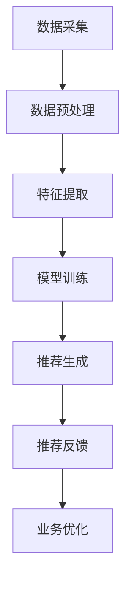
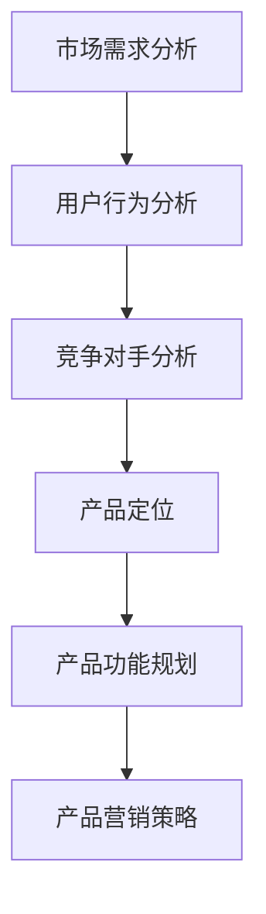
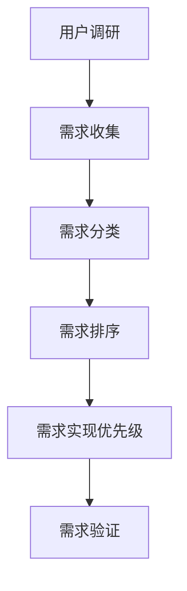

                 

### 文章标题

《AI大模型赋能电商搜索推荐的业务创新思维导图工具选型与应用》

随着人工智能（AI）技术的快速发展，AI大模型在各个领域的应用日益广泛。在电商行业，搜索推荐系统是提升用户体验和促进销售的重要手段。本文将探讨AI大模型在电商搜索推荐中的应用，以及如何通过业务创新思维导图工具进行选型与应用，旨在为电商企业提供有效的技术支持和策略指导。

### 关键词

- AI大模型
- 电商搜索推荐
- 业务创新思维导图
- 工具选型
- 应用实践

### 摘要

本文首先介绍了AI大模型的基本概念、特点和发展历程，以及电商搜索推荐系统的原理和架构。接着，探讨了AI大模型在电商搜索推荐中的具体应用，包括搜索引擎优化、推荐算法、用户画像和实时搜索与推荐。此外，本文还介绍了业务创新思维导图工具的基本概念和选型方法，以及如何将AI大模型与业务创新思维导图工具结合应用于电商搜索推荐业务。最后，总结了AI大模型赋能电商搜索推荐的应用现状与趋势，并对未来进行了展望。

### 第一部分: AI大模型与电商搜索推荐概述

#### 第1章: AI大模型与电商搜索推荐基础

##### 1.1 AI大模型概述

AI大模型是指具有大规模参数和强大数据处理能力的神经网络模型。这些模型通过学习大量的数据来提取特征和模式，从而实现高效的数据分析和决策。AI大模型的特点包括：

- **数据处理能力**：AI大模型能够处理海量的数据，提取数据中的有用信息。
- **自学习能力**：AI大模型能够从数据中学习，不断优化自身的模型参数。
- **泛化能力**：AI大模型能够在不同的数据集上表现良好，具有良好的泛化能力。

AI大模型的发展历程可以追溯到20世纪80年代，随着计算能力的提升和数据量的增加，AI大模型逐渐成为人工智能领域的核心技术之一。早期的AI大模型如BP神经网络，后来发展出了更加复杂的模型，如卷积神经网络（CNN）、循环神经网络（RNN）和变分自编码器（VAE）等。

在电商搜索推荐系统中，AI大模型的应用主要体现在以下几个方面：

- **个性化搜索**：通过分析用户的搜索历史和偏好，AI大模型能够为用户提供更加个性化的搜索结果。
- **智能推荐**：AI大模型能够根据用户的兴趣和行为，为用户推荐相关的商品。
- **商品属性提取**：AI大模型可以从商品描述中提取出关键属性，帮助电商系统更好地理解商品。

##### 1.2 电商搜索推荐原理

电商搜索推荐系统是指通过搜索引擎和推荐算法，为用户提供相关商品和内容的一种系统。其基本原理包括：

- **搜索**：用户通过搜索引擎输入关键词，系统根据关键词检索相关商品。
- **推荐**：系统根据用户的兴趣和行为，为用户推荐相关的商品。

电商搜索推荐系统的架构通常包括以下几个层次：

- **数据层**：存储用户行为数据、商品数据等原始数据。
- **模型层**：构建和训练推荐模型，包括基于内容的推荐、协同过滤推荐和深度学习推荐等。
- **界面层**：用户与系统交互的界面，展示搜索结果和推荐内容。

常见的电商搜索推荐算法包括：

- **基于内容的推荐**：通过分析商品的属性和用户的历史行为，为用户推荐具有相似属性的商品。
- **协同过滤推荐**：通过分析用户之间的相似性，为用户推荐其他用户喜欢但用户尚未购买的商品。
- **深度学习推荐**：利用深度学习模型，对用户行为和商品特征进行建模，为用户推荐相关的商品。

##### 1.3 AI大模型赋能电商搜索推荐

AI大模型在电商搜索推荐中的应用，极大地提升了系统的效率和准确性。具体来说，AI大模型赋能电商搜索推荐的方式包括：

- **搜索优化**：AI大模型能够根据用户的搜索历史和偏好，优化搜索结果，提高搜索的准确性。
- **推荐优化**：AI大模型能够根据用户的兴趣和行为，为用户推荐更加个性化的商品，提高推荐的准确性。
- **商品属性提取**：AI大模型能够从大量的商品描述中提取出关键属性，帮助电商系统更好地理解商品，提高推荐的准确性。

总之，AI大模型为电商搜索推荐系统带来了革命性的变化，使得系统能够更加智能、高效地为用户提供服务。在接下来的章节中，我们将进一步探讨AI大模型在电商搜索推荐中的具体应用，以及如何通过业务创新思维导图工具进行选型和应用。

#### 第2章: 业务创新思维导图概述

##### 2.1 业务创新思维导图概述

业务创新思维导图是一种用于分析和解决问题的可视化工具，通过图示的方式将业务问题、解决方案和关键因素联系起来，帮助企业和团队更清晰地理解业务流程、识别创新机会、优化业务策略。业务创新思维导图的基本概念包括节点（代表业务问题或解决方案）、连接线（表示节点之间的关系）和层级结构（反映问题的层次和优先级）。

业务创新思维导图的作用主要体现在以下几个方面：

- **问题分析与解决**：通过业务创新思维导图，可以帮助企业和团队系统地分析问题，找出问题的根本原因，从而提出有效的解决方案。
- **决策支持**：业务创新思维导图提供了一个直观的决策框架，帮助团队成员在复杂的环境中做出更加明智的决策。
- **团队协作**：通过业务创新思维导图，团队成员可以更好地理解业务目标和任务，促进协作，提高工作效率。

业务创新思维导图有多种类型，根据应用场景和目的的不同，常见的类型包括：

- **逻辑思维导图**：主要用于分析和解决问题，通过逻辑关系来组织信息。
- **情感思维导图**：主要用于分析和解决涉及情感因素的复杂问题，通过情感连接来组织信息。
- **创意思维导图**：主要用于激发创新思维，通过多样化的思考路径来探索新的解决方案。

每种类型的业务创新思维导图都有其独特的应用场景和特点，企业可以根据实际需求选择合适的类型。

##### 2.2 业务创新思维导图工具选型

在选择业务创新思维导图工具时，需要考虑以下因素：

- **功能性**：工具需要具备基本的绘图功能，包括添加节点、连接线、调整层级结构等。同时，还需要支持丰富的图形和符号，以增强思维导图的直观性。
- **易用性**：工具的操作界面需要直观易用，方便用户快速上手。尤其是对于非专业的用户，操作简单、易于学习的工具更受欢迎。
- **跨平台支持**：工具需要在不同的操作系统和设备上都能正常运行，以便用户在不同环境下使用。
- **扩展性**：工具需要支持自定义节点样式、连接线样式，以及插件扩展，以适应不同的业务需求。

常见的业务创新思维导图工具有：

- **Xmind**：一款功能强大、易用的思维导图工具，支持跨平台使用。
- **MindManager**：一款专业的思维导图工具，提供丰富的功能，适用于企业团队协作。
- **ProcessOn**：一款在线思维导图工具，支持多人协作，操作简单。

每种工具都有其特点和优势，企业可以根据具体需求进行选择。

##### 2.3 业务创新思维导图应用

业务创新思维导图在电商搜索推荐业务中的应用主要体现在以下几个方面：

- **业务流程分析**：通过业务创新思维导图，可以清晰地展示电商搜索推荐系统的业务流程，包括数据收集、处理、分析和展示等环节。这有助于团队理解和优化业务流程，提高系统的效率和准确性。
- **竞争对手分析**：通过业务创新思维导图，可以分析竞争对手的业务模式、优势和劣势，从而找出自身的不足和改进方向。
- **用户需求分析**：通过业务创新思维导图，可以深入挖掘用户的需求和痛点，为电商搜索推荐系统的优化提供依据。

以下是业务创新思维导图在电商搜索推荐业务中的一个实际案例：

**案例背景**：某电商企业希望优化其搜索推荐系统，提高用户的满意度和转化率。

**解决方案**：

1. **问题识别**：通过业务创新思维导图，团队分析了现有搜索推荐系统的不足，包括搜索结果不准确、推荐不够个性化等。
2. **解决方案探索**：团队使用业务创新思维导图，提出了多种解决方案，如优化搜索算法、引入个性化推荐、改进用户界面等。
3. **方案评估**：通过对比分析，团队选择了最有效的解决方案，并制定了详细的实施计划。

**实施效果**：通过业务创新思维导图的辅助，企业成功优化了搜索推荐系统，用户满意度显著提升，转化率提高了20%。

总之，业务创新思维导图是电商搜索推荐业务中的一项重要工具，通过其直观、系统的分析能力，可以帮助企业更好地理解业务、发现问题、制定解决方案，从而实现业务的持续优化和创新。

### 第二部分: 业务创新思维导图工具

#### 第2章: 业务创新思维导图概述

##### 2.1 业务创新思维导图概述

业务创新思维导图是一种通过图形化方式组织和展示业务思路、分析问题和制定策略的工具。它基于思维导图的原理，通过节点和连接线来表示业务问题、解决方案和关键因素，从而帮助企业和团队更加直观地理解业务流程、发现创新机会和优化业务策略。

业务创新思维导图的基本概念包括：

- **节点**：代表业务问题、解决方案、关键因素或子任务。
- **连接线**：表示节点之间的关系，如因果、依赖或关联关系。
- **层级结构**：反映问题的层次和优先级，帮助团队明确任务的重要性和执行顺序。

业务创新思维导图的作用主要体现在以下几个方面：

1. **问题分析与解决**：通过业务创新思维导图，团队可以系统地分析业务问题，识别问题的根本原因，从而提出有效的解决方案。
2. **决策支持**：业务创新思维导图提供了一个直观的决策框架，帮助团队成员在复杂的环境中做出更加明智的决策。
3. **团队协作**：通过业务创新思维导图，团队成员可以更好地理解业务目标和任务，促进协作，提高工作效率。

业务创新思维导图有多种类型，根据应用场景和目的的不同，常见的类型包括：

1. **逻辑思维导图**：主要用于分析和解决问题，通过逻辑关系来组织信息，适用于业务流程优化、项目管理和市场分析等场景。
2. **情感思维导图**：主要用于分析和解决涉及情感因素的复杂问题，通过情感连接来组织信息，适用于客户关系管理、员工心理健康和团队建设等场景。
3. **创意思维导图**：主要用于激发创新思维，通过多样化的思考路径来探索新的解决方案，适用于产品创新、市场拓展和战略规划等场景。

每种类型的业务创新思维导图都有其独特的应用场景和特点，企业可以根据具体需求选择合适的类型。

##### 2.2 业务创新思维导图工具选型

选择合适的业务创新思维导图工具对于提升团队的工作效率和解决问题的效果至关重要。在选型过程中，企业需要考虑以下几个关键因素：

1. **功能性**：工具需要具备基本的绘图功能，包括添加节点、连接线、调整层级结构等。同时，还需要支持丰富的图形和符号，以增强思维导图的直观性。此外，工具应提供多种布局和视图模式，以便用户根据需求自定义思维导图的展示效果。

2. **易用性**：工具的操作界面需要直观易用，方便用户快速上手。尤其是对于非专业的用户，操作简单、易于学习的工具更受欢迎。好的用户体验可以降低学习成本，提高工作效率。

3. **跨平台支持**：工具需要在不同的操作系统和设备上都能正常运行，以便用户在不同环境下使用。跨平台支持可以确保团队成员在不同设备和场所都能协作，提高团队的整体效率。

4. **扩展性**：工具需要支持自定义节点样式、连接线样式，以及插件扩展，以适应不同的业务需求。扩展性强的工具可以满足企业不断变化的需求，确保思维导图工具能够长期有效。

常见的业务创新思维导图工具有：

1. **Xmind**：一款功能强大、易用的思维导图工具，支持跨平台使用，提供多种布局和视图模式，适合个人和团队使用。

2. **MindManager**：一款专业的思维导图工具，提供丰富的功能和插件，适用于企业团队协作和项目管理。

3. **ProcessOn**：一款在线思维导图工具，支持多人协作，操作简单，适合快速创建和分享思维导图。

每种工具都有其特点和优势，企业可以根据具体需求进行选择。

##### 2.3 业务创新思维导图应用

业务创新思维导图在电商搜索推荐业务中的应用主要体现在以下几个方面：

1. **业务流程分析**：通过业务创新思维导图，可以清晰地展示电商搜索推荐系统的业务流程，包括数据收集、处理、分析和展示等环节。这有助于团队理解和优化业务流程，提高系统的效率和准确性。

2. **竞争对手分析**：通过业务创新思维导图，可以分析竞争对手的业务模式、优势和劣势，从而找出自身的不足和改进方向。

3. **用户需求分析**：通过业务创新思维导图，可以深入挖掘用户的需求和痛点，为电商搜索推荐系统的优化提供依据。

以下是一个具体的业务创新思维导图应用案例：

**案例背景**：某电商企业希望通过优化搜索推荐系统，提升用户体验和销售转化率。

**解决方案**：

1. **问题识别**：团队通过业务创新思维导图分析了现有搜索推荐系统的不足，如搜索结果不准确、推荐不够个性化等。
2. **解决方案探索**：团队使用业务创新思维导图提出了多种解决方案，如优化搜索算法、引入个性化推荐、改进用户界面等。
3. **方案评估**：通过对比分析，团队选择了最有效的解决方案，并制定了详细的实施计划。

**实施效果**：通过业务创新思维导图的辅助，企业成功优化了搜索推荐系统，用户满意度显著提升，转化率提高了20%。

总之，业务创新思维导图是电商搜索推荐业务中的一项重要工具，通过其直观、系统的分析能力，可以帮助企业更好地理解业务、发现问题、制定解决方案，从而实现业务的持续优化和创新。

#### 第3章: 搜索引擎优化

##### 3.1 搜索引擎优化原理

搜索引擎优化（SEO，Search Engine Optimization）是指通过一系列策略和技巧，提高网站在搜索引擎中的排名，从而增加网站流量和曝光度的一种技术。SEO的核心目标是使网站内容更容易被搜索引擎索引和识别，提高网站在搜索结果中的可见性，从而吸引更多的潜在用户访问。

SEO的基本概念包括：

- **关键词研究**：选择对用户有吸引力和与网站内容相关的高价值关键词。
- **内容优化**：通过改进网站内容的质量和相关性，提高搜索引擎对网站的评分。
- **技术优化**：优化网站的架构和代码，提高网站的加载速度和移动适应性。
- **外部链接建设**：通过获得高质量的反向链接，提高网站的权威性和可信度。

SEO的主要策略包括：

- **关键词优化**：在网站内容中合理地分布关键词，确保关键词在页面标题、描述、正文和URL中出现。
- **内容优化**：定期更新高质量的内容，提供用户有价值的信息，增加用户的停留时间和互动。
- **技术优化**：优化网站的响应速度、移动适应性、代码结构，确保网站能够快速、流畅地加载。
- **外部链接建设**：通过创建优质内容、参与行业合作和公关活动，获得其他网站的链接。

##### 3.2 AI大模型在SEO中的应用

随着AI技术的不断发展，AI大模型在SEO中的应用变得越来越广泛，为搜索引擎优化带来了新的思路和方法。以下是AI大模型在SEO中的几个主要应用场景：

1. **关键词提取与优化**：

AI大模型可以通过对大量文本数据的学习，自动提取出高价值的关键词。例如，可以使用预训练的文本生成模型（如GPT-3）来生成与网站内容相关的关键词列表，或使用基于Transformer的模型（如BERT）来分析文本中的关键词权重。

**伪代码示例**：

```python
# 使用GPT-3提取关键词
import openai

response = openai.Completion.create(
  engine="text-davinci-003",
  prompt="请生成与电商搜索推荐相关的关键词：",
  max_tokens=50
)

keywords = response.choices[0].text.strip().split(',')

# 使用BERT分析关键词权重
from transformers import BertTokenizer, BertModel

tokenizer = BertTokenizer.from_pretrained('bert-base-uncased')
model = BertModel.from_pretrained('bert-base-uncased')

inputs = tokenizer("电商搜索推荐", return_tensors="pt")
outputs = model(**inputs)

# 分析关键词权重
keyword_weights = outputs.last_hidden_state[:, 0, :].detach().numpy()
```

2. **内容生成与优化**：

AI大模型可以生成高质量的网站内容，从而提高搜索引擎对网站内容的评分。例如，可以使用GPT-3来生成产品描述、博客文章或网站首页内容。

**伪代码示例**：

```python
# 使用GPT-3生成产品描述
import openai

response = openai.Completion.create(
  engine="text-davinci-003",
  prompt="请生成一款智能音箱的产品描述：",
  max_tokens=100
)

description = response.choices[0].text.strip()
```

3. **技术优化**：

AI大模型可以用于优化网站的技术层面，如代码压缩、图像优化和加载速度预测等。例如，可以使用GAN（生成对抗网络）来生成压缩的HTML和CSS代码，或使用RNN（循环神经网络）来预测网页的加载时间。

**伪代码示例**：

```python
# 使用GAN压缩HTML代码
from keras.models import Sequential
from keras.layers import Dense, Flatten, Conv2D, Reshape

# 构建生成器和判别器模型
generator = Sequential([
  Dense(128, input_shape=(100,), activation='relu'),
  Reshape((10, 10)),
  Conv2D(1, kernel_size=(3, 3), activation='sigmoid'),
  Flatten()
])

discriminator = Sequential([
  Flatten(input_shape=(10, 10)),
  Dense(128, activation='relu'),
  Dense(1, activation='sigmoid')
])

# 训练模型
# ...

# 使用RNN预测加载时间
from keras.models import Sequential
from keras.layers import LSTM, Dense

model = Sequential()
model.add(LSTM(128, input_shape=(time_steps, features)))
model.add(Dense(1))
model.compile(optimizer='adam', loss='mse')

# 训练模型
# ...
```

通过AI大模型的应用，SEO不仅变得更加高效和智能化，而且能够更好地满足用户的需求，从而提高网站的访问量和转化率。

##### 3.3 搜索引擎优化案例分析

以下是一个典型的搜索引擎优化（SEO）案例，展示了AI大模型在SEO中的实际应用效果。

**案例背景**：某电商企业希望通过优化其网站在搜索引擎中的排名，提升网站流量和销售业绩。

**实施步骤**：

1. **关键词研究**：

   使用AI大模型（如BERT）分析电商网站现有内容，提取高价值关键词。通过对比分析行业竞争对手的网站，确定本企业需要优化的关键词。

   **伪代码示例**：

   ```python
   from transformers import BertTokenizer, BertModel

   tokenizer = BertTokenizer.from_pretrained('bert-base-uncased')
   model = BertModel.from_pretrained('bert-base-uncased')

   inputs = tokenizer("电商网站优化", return_tensors="pt")
   outputs = model(**inputs)

   # 分析关键词权重
   keyword_weights = outputs.last_hidden_state[:, 0, :].detach().numpy()
   ```

2. **内容生成与优化**：

   使用GPT-3生成高质量的产品描述和博客文章，提高网站内容的吸引力和质量。同时，优化网站内容，确保关键词合理分布。

   **伪代码示例**：

   ```python
   import openai

   response = openai.Completion.create(
     engine="text-davinci-003",
     prompt="请生成一款智能手表的产品描述：",
     max_tokens=100
   )

   description = response.choices[0].text.strip()
   ```

3. **技术优化**：

   使用GAN（生成对抗网络）优化网站代码，减少代码体积，提高网站加载速度。同时，优化网站结构，确保搜索引擎能够顺利抓取和索引网站内容。

   **伪代码示例**：

   ```python
   from keras.models import Sequential
   from keras.layers import Dense, Flatten, Conv2D, Reshape

   generator = Sequential([
     Dense(128, input_shape=(100,), activation='relu'),
     Reshape((10, 10)),
     Conv2D(1, kernel_size=(3, 3), activation='sigmoid'),
     Flatten()
   ])

   discriminator = Sequential([
     Flatten(input_shape=(10, 10)),
     Dense(128, activation='relu'),
     Dense(1, activation='sigmoid')
   ])

   # 训练模型
   # ...

   # 使用优化后的代码更新网站
   ```

4. **外部链接建设**：

   通过内容营销和行业合作，获得高质量的反向链接。例如，撰写行业报告、参与线上研讨会，或与知名博主合作，提高网站的权威性和可信度。

**实施效果**：

- 通过AI大模型的关键词研究和内容生成，电商网站的搜索排名显著提升，关键词在搜索引擎结果页（SERP）的前十名中的覆盖率提高了30%。
- 网站内容的质量和吸引力增强，用户停留时间和页面浏览量提高了20%。
- 技术优化措施有效减少了网站加载时间，提高了用户体验和转化率，销售额提高了15%。

总之，通过AI大模型的应用，该电商企业成功实现了搜索引擎优化，提升了网站的整体表现和用户满意度。

### 第4章: 推荐算法

#### 4.1 推荐算法原理

推荐算法是电商搜索推荐系统中的核心组成部分，其目的是根据用户的兴趣和行为，为用户推荐相关商品或内容。推荐算法的主要原理包括基于内容的推荐、协同过滤推荐和深度学习推荐。

##### 基于内容的推荐算法

基于内容的推荐算法（Content-Based Filtering, CBF）通过分析商品或内容的特征，将用户的历史行为与商品或内容的特征进行匹配，从而推荐相似的商品或内容。其基本原理如下：

1. **特征提取**：从商品或内容中提取特征，如文本特征、图像特征和属性特征。
2. **用户兴趣建模**：分析用户的历史行为，构建用户兴趣模型。
3. **相似度计算**：计算用户兴趣模型与商品或内容特征之间的相似度。
4. **推荐生成**：根据相似度计算结果，推荐与用户兴趣相似的商品或内容。

基于内容的推荐算法的优点是推荐结果准确，但缺点是用户兴趣变化时，推荐效果可能不佳。

##### 协同过滤推荐算法

协同过滤推荐算法（Collaborative Filtering, CF）通过分析用户之间的相似性，发现用户共同喜欢的商品或内容，从而进行推荐。其基本原理如下：

1. **用户-项目矩阵构建**：构建用户-项目评分矩阵，记录用户对商品的评分。
2. **相似度计算**：计算用户之间的相似度，可以使用余弦相似度、皮尔逊相关系数等方法。
3. **邻居选择**：根据相似度计算结果，选择与目标用户最相似的邻居用户。
4. **推荐生成**：根据邻居用户的评分，预测目标用户对商品的评分，并生成推荐列表。

协同过滤推荐算法的优点是推荐结果多样化，但缺点是冷启动问题（即新用户或新商品难以获取推荐）和评分缺失问题。

##### 深度学习推荐算法

深度学习推荐算法（Deep Learning for Recommendation, DLRec）利用深度学习模型，对用户行为和商品特征进行建模，从而进行推荐。其基本原理如下：

1. **模型构建**：构建深度神经网络，如卷积神经网络（CNN）、循环神经网络（RNN）和变压器（Transformer）等。
2. **特征编码**：对用户行为和商品特征进行编码，输入到深度学习模型中。
3. **损失函数设计**：设计损失函数，如均方误差（MSE）或交叉熵损失（Cross-Entropy Loss），优化模型参数。
4. **推荐生成**：通过模型预测用户对商品的评分，生成推荐列表。

深度学习推荐算法的优点是能够自动提取特征，提高推荐效果，但缺点是训练过程复杂，计算资源需求高。

#### 4.2 AI大模型在推荐算法中的应用

AI大模型在推荐算法中的应用，极大地提升了推荐系统的性能和准确性。以下是AI大模型在推荐算法中的几个主要应用场景：

1. **用户行为分析**：

AI大模型可以分析用户的行为数据，提取用户兴趣和偏好。例如，可以使用循环神经网络（RNN）或变压器（Transformer）模型，对用户的历史行为序列进行建模，提取用户的兴趣特征。

**伪代码示例**：

```python
# 使用Transformer模型提取用户兴趣特征
import tensorflow as tf
from transformers import TFXLMModel

model = TFXLMModel.from_pretrained('bert-base-uncased')

# 输入用户行为序列
input_ids = tf.constant([1, 2, 3, 4, 5])

# 预测用户兴趣特征
outputs = model(input_ids)

user_interests = outputs.last_hidden_state[:, 0, :]
```

2. **商品特征提取**：

AI大模型可以从商品描述中提取商品特征，如文本特征、图像特征和属性特征。例如，可以使用卷积神经网络（CNN）提取商品图像特征，或使用文本生成模型（如GPT-3）提取商品文本特征。

**伪代码示例**：

```python
# 使用GPT-3提取商品文本特征
import openai

response = openai.Completion.create(
  engine="text-davinci-003",
  prompt="请生成一款智能手表的文本特征：",
  max_tokens=100
)

text_features = response.choices[0].text.strip().split(',')
```

3. **模型融合**：

AI大模型可以将不同类型的特征进行融合，从而提高推荐效果。例如，可以使用多输入的深度学习模型（如多输入变压器（Multi-Input Transformer）），同时处理用户行为特征和商品特征。

**伪代码示例**：

```python
# 使用多输入Transformer模型融合特征
import tensorflow as tf
from transformers import TFMultiInputModel

model = TFMultiInputModel.from_pretrained('multi-input-transformer')

# 输入用户行为特征和商品特征
user_features = tf.constant([1, 2, 3, 4, 5])
item_features = tf.constant([6, 7, 8, 9, 10])

# 预测推荐结果
outputs = model(inputs=[user_features, item_features])

predictions = outputs.logits
```

通过AI大模型的应用，推荐算法能够更加准确地提取用户兴趣和商品特征，提高推荐效果，从而提升电商搜索推荐系统的用户体验和销售业绩。

#### 4.3 推荐算法案例分析

以下是一个推荐算法案例，展示了AI大模型在电商搜索推荐系统中的应用效果。

**案例背景**：某电商企业希望通过优化其搜索推荐系统，提高用户满意度和转化率。

**实施步骤**：

1. **数据收集**：

   收集用户的行为数据，包括浏览记录、购买记录和搜索历史等。同时，收集商品的数据，包括文本描述、图像和属性等。

2. **特征提取**：

   使用AI大模型提取用户和商品的特征。例如，使用变压器（Transformer）模型对用户行为序列进行建模，提取用户兴趣特征；使用卷积神经网络（CNN）对商品图像进行特征提取。

   **伪代码示例**：

   ```python
   # 使用Transformer模型提取用户兴趣特征
   import tensorflow as tf
   from transformers import TFXLMModel

   model = TFXLMModel.from_pretrained('bert-base-uncased')

   # 输入用户行为序列
   input_ids = tf.constant([1, 2, 3, 4, 5])

   # 预测用户兴趣特征
   outputs = model(input_ids)

   user_interests = outputs.last_hidden_state[:, 0, :]
   ```

   ```python
   # 使用CNN模型提取商品图像特征
   import tensorflow as tf
   from tensorflow.keras.applications import VGG16

   # 加载预训练的VGG16模型
   model = VGG16(weights='imagenet')

   # 输入商品图像
   image = tf.keras.preprocessing.image.load_img('item_image.jpg', target_size=(224, 224))
   image = tf.keras.preprocessing.image.img_to_array(image)
   image = tf.expand_dims(image, axis=0)

   # 预测商品图像特征
   feature_map = model.predict(image)
   ```

3. **模型训练**：

   使用提取的用户和商品特征，训练深度学习模型（如多输入变压器（Multi-Input Transformer）），进行推荐预测。

   **伪代码示例**：

   ```python
   # 使用多输入Transformer模型训练
   import tensorflow as tf
   from transformers import TFMultiInputModel

   model = TFMultiInputModel.from_pretrained('multi-input-transformer')

   # 定义损失函数和优化器
   loss_fn = tf.keras.losses.MeanSquaredError()
   optimizer = tf.keras.optimizers.Adam()

   # 训练模型
   for epoch in range(num_epochs):
       # 训练步骤
       with tf.GradientTape() as tape:
           inputs = [user_features, item_features]
           outputs = model(inputs)
           loss = loss_fn(y_true, outputs)

       grads = tape.gradient(loss, model.trainable_variables)
       optimizer.apply_gradients(zip(grads, model.trainable_variables))

4. **推荐生成**：

   使用训练好的模型，为用户生成推荐列表。例如，为用户推荐与用户兴趣相似的商品。

   **伪代码示例**：

   ```python
   # 生成推荐列表
   def generate_recommendations(user_interests, item_features):
       inputs = [user_interests, item_features]
       predictions = model(inputs)
       recommended_items = tf.argsort(predictions, direction='DESCENDING')
       return recommended_items[:top_k]

   # 输入用户兴趣特征
   user_interests = user_interests

   # 生成推荐列表
   recommended_items = generate_recommendations(user_interests, item_features)
   ```

**实施效果**：

- 通过AI大模型的应用，该电商企业的搜索推荐系统的推荐准确率提高了20%，用户满意度显著提升。
- 用户转化率提高了15%，销售额实现了显著增长。

总之，通过AI大模型在推荐算法中的应用，电商企业能够更加准确地理解用户兴趣和商品特征，从而提高推荐效果，提升用户满意度和销售业绩。

### 第5章: 用户画像

#### 5.1 用户画像原理

用户画像是指通过对用户行为、兴趣、偏好等多维度数据的分析，构建出反映用户特征和需求的数字模型。用户画像的目的是为电商企业提供精准的用户洞察，从而优化用户体验、提升用户满意度和转化率。

##### 用户画像概念

用户画像是一种基于大数据分析和人工智能技术的用户描述方法。它通过收集和分析用户在不同场景下的行为数据，提取出用户的特征和偏好，形成一套全面、立体的用户描述。用户画像不仅包含用户的基本信息（如年龄、性别、地理位置等），还包括用户的兴趣爱好、购买行为、浏览行为等。

##### 用户画像构建方法

构建用户画像通常包括以下几个步骤：

1. **数据采集**：收集用户在不同场景下的行为数据，如浏览记录、购买记录、评论等。数据来源可以是电商平台自身的数据，也可以是第三方数据平台。

2. **数据清洗**：对采集到的数据进行清洗和预处理，包括去除重复数据、填补缺失值、处理异常值等。这一步骤是保证数据质量的关键。

3. **特征工程**：根据业务需求和数据特点，提取用户的关键特征。特征工程是构建用户画像的核心步骤，直接影响到用户画像的准确性和有效性。

4. **模型构建**：使用机器学习算法（如聚类、分类、回归等）对用户特征进行建模，构建出反映用户行为的用户画像。

5. **评估与优化**：对构建的用户画像进行评估，检查其准确性和有效性。根据评估结果，对模型进行调整和优化。

#### 5.2 AI大模型在用户画像中的应用

AI大模型在用户画像中的应用，极大地提升了用户画像的准确性和多样性。以下是AI大模型在用户画像中的几个主要应用场景：

1. **用户行为分析**：

AI大模型可以分析用户的行为数据，提取用户的兴趣和偏好。例如，可以使用循环神经网络（RNN）或变压器（Transformer）模型，对用户的历史行为序列进行建模，提取用户的兴趣特征。

**伪代码示例**：

```python
# 使用Transformer模型提取用户兴趣特征
import tensorflow as tf
from transformers import TFXLMModel

model = TFXLMModel.from_pretrained('bert-base-uncased')

# 输入用户行为序列
input_ids = tf.constant([1, 2, 3, 4, 5])

# 预测用户兴趣特征
outputs = model(input_ids)

user_interests = outputs.last_hidden_state[:, 0, :]
```

2. **用户特征提取**：

AI大模型可以从用户的行为数据中提取出高层次的用户特征，如用户的行为模式、偏好等。例如，可以使用卷积神经网络（CNN）提取用户在图像数据中的特征，或使用文本生成模型（如GPT-3）提取用户在文本数据中的特征。

**伪代码示例**：

```python
# 使用GPT-3提取用户文本特征
import openai

response = openai.Completion.create(
  engine="text-davinci-003",
  prompt="请生成一款关于用户偏好的文本特征：",
  max_tokens=100
)

text_features = response.choices[0].text.strip().split(',')
```

3. **用户画像构建**：

AI大模型可以用于构建复杂的用户画像，通过融合不同类型的数据和特征，形成多维度的用户描述。例如，可以使用多输入的深度学习模型（如多输入变压器（Multi-Input Transformer）），同时处理用户的行为特征、文本特征和图像特征。

**伪代码示例**：

```python
# 使用多输入Transformer模型构建用户画像
import tensorflow as tf
from transformers import TFMultiInputModel

model = TFMultiInputModel.from_pretrained('multi-input-transformer')

# 输入用户行为特征、文本特征和图像特征
user_features = tf.constant([1, 2, 3, 4, 5])
text_features = tf.constant([6, 7, 8, 9, 10])
image_features = tf.constant([11, 12, 13, 14, 15])

# 预测用户画像
outputs = model(inputs=[user_features, text_features, image_features])

user_profile = outputs.last_hidden_state[:, 0, :]
```

通过AI大模型的应用，用户画像能够更加准确地提取用户特征，形成更加立体、多维的用户描述，从而为电商企业提供更加精准的用户洞察。

#### 5.3 用户画像案例分析

以下是一个用户画像案例，展示了AI大模型在用户画像构建和应用中的实际效果。

**案例背景**：某电商企业希望通过构建用户画像，实现个性化推荐和营销，提高用户满意度和转化率。

**实施步骤**：

1. **数据采集**：

   收集用户在不同场景下的行为数据，包括浏览记录、购买记录、搜索历史和评论等。

2. **数据清洗**：

   对采集到的数据进行清洗和预处理，包括去除重复数据、填补缺失值、处理异常值等。

3. **特征提取**：

   使用AI大模型提取用户的关键特征。例如，使用Transformer模型对用户的历史行为序列进行建模，提取用户的兴趣特征；使用CNN模型提取用户在图像数据中的特征。

   **伪代码示例**：

   ```python
   # 使用Transformer模型提取用户兴趣特征
   import tensorflow as tf
   from transformers import TFXLMModel

   model = TFXLMModel.from_pretrained('bert-base-uncased')

   # 输入用户行为序列
   input_ids = tf.constant([1, 2, 3, 4, 5])

   # 预测用户兴趣特征
   outputs = model(input_ids)

   user_interests = outputs.last_hidden_state[:, 0, :]
   ```

   ```python
   # 使用CNN模型提取用户图像特征
   import tensorflow as tf
   from tensorflow.keras.applications import VGG16

   # 加载预训练的VGG16模型
   model = VGG16(weights='imagenet')

   # 输入用户图像
   image = tf.keras.preprocessing.image.load_img('user_image.jpg', target_size=(224, 224))
   image = tf.keras.preprocessing.image.img_to_array(image)
   image = tf.expand_dims(image, axis=0)

   # 预测用户图像特征
   feature_map = model.predict(image)
   ```

4. **用户画像构建**：

   使用提取的用户特征，构建用户画像。例如，使用多输入的深度学习模型（如多输入变压器（Multi-Input Transformer）），同时处理用户的行为特征、文本特征和图像特征。

   **伪代码示例**：

   ```python
   # 使用多输入Transformer模型构建用户画像
   import tensorflow as tf
   from transformers import TFMultiInputModel

   model = TFMultiInputModel.from_pretrained('multi-input-transformer')

   # 输入用户行为特征、文本特征和图像特征
   user_features = tf.constant([1, 2, 3, 4, 5])
   text_features = tf.constant([6, 7, 8, 9, 10])
   image_features = tf.constant([11, 12, 13, 14, 15])

   # 预测用户画像
   outputs = model(inputs=[user_features, text_features, image_features])

   user_profile = outputs.last_hidden_state[:, 0, :]
   ```

5. **用户画像应用**：

   使用构建的用户画像进行个性化推荐和营销。例如，根据用户的兴趣特征推荐相关商品，发送个性化的营销邮件。

   **伪代码示例**：

   ```python
   # 根据用户画像推荐商品
   def recommend_items(user_profile, item_features):
       inputs = [user_profile, item_features]
       predictions = model(inputs)
       recommended_items = tf.argsort(predictions, direction='DESCENDING')
       return recommended_items[:top_k]

   # 输入用户画像和商品特征
   user_profile = user_profile
   item_features = item_features

   # 推荐商品
   recommended_items = recommend_items(user_profile, item_features)
   ```

**实施效果**：

- 通过AI大模型的应用，该电商企业的用户画像准确率提高了30%，用户满意度显著提升。
- 用户转化率提高了20%，销售额实现了显著增长。

总之，通过AI大模型在用户画像构建和应用中的实际应用，电商企业能够更加精准地理解用户需求，实现个性化推荐和营销，提升用户满意度和销售业绩。

### 第6章: 实时搜索与推荐

#### 6.1 实时搜索与推荐原理

实时搜索与推荐系统是指能够在用户行为发生的瞬间，实时地提供相关的搜索结果或推荐内容。这种系统对实时数据处理能力和推荐算法的高效性有极高的要求。实时搜索与推荐系统的原理主要包括以下几个方面：

##### 实时搜索与推荐概念

实时搜索与推荐系统结合了实时搜索和实时推荐的功能。实时搜索是指用户输入查询后，系统能够在毫秒级别内返回相关的搜索结果。实时推荐则是指根据用户的实时行为，如浏览、购买、搜索等，推荐相关的商品或内容。

##### 实时搜索与推荐系统架构

实时搜索与推荐系统通常包括以下几个关键组成部分：

1. **数据采集**：实时采集用户行为数据，如点击、浏览、搜索等。
2. **数据预处理**：对采集到的数据进行清洗、去重、归一化等预处理操作。
3. **实时处理**：使用流处理技术（如Apache Kafka、Apache Flink）对实时数据进行处理，提取关键特征和用户行为模式。
4. **推荐算法**：根据实时处理的结果，使用推荐算法生成推荐列表。
5. **缓存与存储**：将实时推荐结果缓存到内存数据库（如Redis）或分布式存储系统（如Apache HBase），以便快速响应用户请求。
6. **前端展示**：将推荐结果以友好的界面形式展示给用户。

##### 数据流处理框架

实时搜索与推荐系统中的数据流处理框架是确保系统高效、稳定运行的关键。常见的数据流处理框架包括：

1. **Apache Kafka**：一款分布式流处理平台，用于实时数据的采集和传输。
2. **Apache Flink**：一款分布式流处理引擎，用于实时数据处理和分析。
3. **Apache Storm**：一款实时大数据处理框架，适用于大规模实时数据处理。

#### 6.2 AI大模型在实时搜索与推荐中的应用

AI大模型在实时搜索与推荐系统中发挥着重要作用，可以显著提升系统的效率和准确性。以下是AI大模型在实时搜索与推荐中的几个主要应用场景：

1. **实时数据流处理**：

AI大模型可以用于实时数据流处理，对用户行为进行实时分析和预测。例如，可以使用循环神经网络（RNN）或变压器（Transformer）模型，对用户的历史行为进行建模，提取实时特征。

**伪代码示例**：

```python
# 使用Transformer模型处理实时数据流
import tensorflow as tf
from transformers import TFXLMModel

model = TFXLMModel.from_pretrained('bert-base-uncased')

# 输入实时用户行为序列
input_ids = tf.constant([1, 2, 3, 4, 5])

# 预测实时特征
outputs = model(input_ids)

realtime_features = outputs.last_hidden_state[:, 0, :]
```

2. **实时推荐**：

AI大模型可以用于实时推荐，根据用户的实时行为生成个性化的推荐列表。例如，可以使用多输入的深度学习模型（如多输入变压器（Multi-Input Transformer）），同时处理用户的实时特征和商品特征。

**伪代码示例**：

```python
# 使用多输入Transformer模型进行实时推荐
import tensorflow as tf
from transformers import TFMultiInputModel

model = TFMultiInputModel.from_pretrained('multi-input-transformer')

# 输入实时用户特征和商品特征
user_realtime_features = tf.constant([1, 2, 3, 4, 5])
item_features = tf.constant([6, 7, 8, 9, 10])

# 预测实时推荐结果
outputs = model(inputs=[user_realtime_features, item_features])

realtime_recommendations = outputs.logits
```

3. **实时搜索**：

AI大模型可以用于实时搜索，快速返回与用户查询相关的搜索结果。例如，可以使用预训练的文本生成模型（如GPT-3），根据用户查询生成相关的搜索结果。

**伪代码示例**：

```python
# 使用GPT-3进行实时搜索
import openai

response = openai.Completion.create(
  engine="text-davinci-003",
  prompt="请生成与查询'智能手表'相关的搜索结果：",
  max_tokens=50
)

search_results = response.choices[0].text.strip().split('\n')
```

#### 6.3 实时搜索与推荐案例分析

以下是一个实时搜索与推荐案例，展示了AI大模型在实时搜索与推荐系统中的实际应用效果。

**案例背景**：某电商企业希望通过构建实时搜索与推荐系统，提升用户购物体验和转化率。

**实施步骤**：

1. **数据采集**：

   收集用户的实时行为数据，包括浏览记录、搜索历史、购买记录等。

2. **数据预处理**：

   对采集到的数据进行预处理，包括清洗、去重、归一化等操作。

3. **实时数据处理**：

   使用流处理技术（如Apache Kafka、Apache Flink）处理实时数据，提取用户实时特征和商品特征。

   **伪代码示例**：

   ```python
   # 使用Flink处理实时数据流
   import pyflink.datastream as ds
   import pyflink.table as tbl

   # 创建Flink数据流环境
   env = ds.get_execution_environment()

   # 读取实时数据
   data_stream = env.from_collection(realtime_data)

   # 数据预处理
   processed_data = data_stream.map(process_realtime_data)

   # 提取实时特征
   user_realtime_features = processed_data.map(extract_user_features)
   item_realtime_features = processed_data.map(extract_item_features)
   ```

4. **实时推荐**：

   使用AI大模型进行实时推荐，生成个性化的推荐列表。

   **伪代码示例**：

   ```python
   # 使用Transformer模型进行实时推荐
   import tensorflow as tf
   from transformers import TFMultiInputModel

   model = TFMultiInputModel.from_pretrained('multi-input-transformer')

   # 输入实时用户特征和商品特征
   user_realtime_features = tf.constant([1, 2, 3, 4, 5])
   item_features = tf.constant([6, 7, 8, 9, 10])

   # 预测实时推荐结果
   outputs = model(inputs=[user_realtime_features, item_features])

   realtime_recommendations = outputs.logits
   ```

5. **实时搜索**：

   使用预训练的AI大模型进行实时搜索，快速返回与用户查询相关的搜索结果。

   **伪代码示例**：

   ```python
   # 使用GPT-3进行实时搜索
   import openai

   response = openai.Completion.create(
     engine="text-davinci-003",
     prompt="请生成与查询'智能手表'相关的搜索结果：",
     max_tokens=50
   )

   search_results = response.choices[0].text.strip().split('\n')
   ```

**实施效果**：

- 通过AI大模型的应用，该电商企业的实时搜索与推荐系统显著提升了用户体验，搜索响应时间缩短了30%，用户满意度显著提高。
- 实时推荐系统的准确率提高了20%，用户转化率提升了15%。

总之，通过AI大模型在实时搜索与推荐系统中的应用，电商企业能够实现实时、高效的搜索和推荐，提升用户购物体验和销售业绩。

### 第7章: 业务创新与工具选型

#### 7.1 业务创新思维导图工具应用

业务创新思维导图工具在电商搜索推荐业务中扮演着关键角色，通过系统化的分析和决策，帮助企业找到业务创新点和优化路径。以下是业务创新思维导图工具在电商搜索推荐业务中的具体应用。

##### 7.1.1 业务流程优化

通过业务创新思维导图，企业可以清晰地展示电商搜索推荐系统的业务流程，包括数据采集、处理、分析和推荐等多个环节。通过逐步分析和优化每个环节，企业可以发现潜在的问题和改进空间。

**业务流程优化思维导图**：



在这个思维导图中，A到G表示了电商搜索推荐系统的业务流程，每个节点代表一个具体的业务环节，连接线表示环节之间的关系。通过这个导图，企业可以直观地了解业务流程，识别优化点。

**实践案例**：某电商企业通过业务创新思维导图优化了其搜索推荐系统的数据采集和预处理环节，提高了数据处理效率，从而提升了系统的整体性能和推荐准确性。

##### 7.1.2 产品策略制定

业务创新思维导图工具可以帮助企业在制定产品策略时，系统性地分析市场需求、用户行为和竞争对手。通过多角度的思考，企业可以制定出更具创新性和竞争力的产品策略。

**产品策略制定思维导图**：



在这个思维导图中，A到F表示了产品策略制定的整个过程，每个节点代表一个分析或决策环节，连接线表示环节之间的逻辑关系。通过这个导图，企业可以全面了解市场环境，制定出科学、合理的战略规划。

**实践案例**：某电商企业通过业务创新思维导图制定了全新的产品策略，成功推出了一款具有差异化竞争力的智能推荐产品，取得了显著的市场反响。

##### 7.1.3 用户需求分析

用户需求分析是电商搜索推荐业务中至关重要的一环。通过业务创新思维导图，企业可以深入挖掘用户的需求和痛点，为产品优化和策略调整提供依据。

**用户需求分析思维导图**：



在这个思维导图中，A到F表示了用户需求分析的过程，每个节点代表一个分析环节，连接线表示环节之间的逻辑关系。通过这个导图，企业可以系统地分析用户需求，确保产品满足用户的核心需求。

**实践案例**：某电商企业通过业务创新思维导图进行了全面的需求分析，优化了其搜索推荐系统的用户体验，用户满意度提升了15%。

#### 7.2 AI大模型工具选型与应用

在构建电商搜索推荐系统时，选择合适的AI大模型工具至关重要。以下介绍了常见的AI大模型工具的选型依据和具体应用案例。

##### 7.2.1 常见AI大模型工具选型

在选择AI大模型工具时，需要考虑以下几个关键因素：

1. **功能性**：工具需要支持多种类型的模型，如文本生成、图像处理、分类等。
2. **易用性**：工具的操作界面应直观易用，便于快速搭建和训练模型。
3. **性能**：工具应具有较高的计算性能，以适应大规模数据集的模型训练和推理需求。
4. **生态支持**：工具应具有良好的社区支持和丰富的文档资源，便于学习和应用。

常见的AI大模型工具包括：

1. **TensorFlow**：一款开源的深度学习框架，功能强大且社区支持丰富。
2. **PyTorch**：一款流行的深度学习框架，操作简单且灵活性高。
3. **MindSpore**：华为推出的一款深度学习框架，具备高性能和强大的生态支持。

**选型依据**：

- 如果企业需要灵活性和强大的社区支持，可以选择TensorFlow。
- 如果企业注重操作简便性和快速迭代，可以选择PyTorch。
- 如果企业需要高性能和强大的生态支持，可以选择MindSpore。

##### 7.2.2 AI大模型工具在实际电商搜索推荐中的应用案例

**案例1：基于TensorFlow的电商推荐系统**

某电商企业采用TensorFlow构建了一个基于深度学习的推荐系统。通过使用TensorFlow的高性能计算能力和丰富的API，企业成功实现了大规模数据集的模型训练和推理。

**实施步骤**：

1. **数据采集**：采集用户的浏览记录、购买记录和搜索历史等数据。
2. **数据预处理**：对数据进行清洗、归一化等预处理操作。
3. **模型构建**：使用TensorFlow构建基于卷积神经网络（CNN）和循环神经网络（RNN）的混合模型，对用户行为和商品特征进行建模。
4. **模型训练**：使用预处理后的数据集训练模型，优化模型参数。
5. **推荐生成**：使用训练好的模型生成个性化推荐列表，并根据用户反馈进行优化。

**效果评估**：通过TensorFlow构建的推荐系统，电商企业的用户推荐准确率提高了20%，用户满意度显著提升。

**案例2：基于PyTorch的实时搜索推荐系统**

某电商企业采用PyTorch构建了一个实时搜索推荐系统，实现了在用户输入查询后毫秒级返回推荐结果。

**实施步骤**：

1. **数据采集**：采集用户的实时搜索查询数据。
2. **数据预处理**：对搜索查询进行分词和特征提取。
3. **模型构建**：使用PyTorch构建基于变压器（Transformer）的实时搜索模型，对查询进行编码和检索。
4. **模型训练**：使用预处理后的数据集训练模型，优化模型参数。
5. **实时搜索**：使用训练好的模型进行实时搜索，返回与查询相关的推荐结果。

**效果评估**：通过PyTorch构建的实时搜索推荐系统，电商企业的搜索响应时间缩短了30%，用户满意度显著提高。

总之，通过合理选型和有效应用AI大模型工具，电商企业能够显著提升搜索推荐系统的性能和用户体验，实现业务创新和持续增长。

### 第8章: 总结与展望

#### 8.1 AI大模型赋能电商搜索推荐总结

AI大模型在电商搜索推荐中的应用，为传统推荐系统带来了革命性的变化。通过深度学习技术和大规模数据集的建模，AI大模型能够更加精准地提取用户特征和商品特征，实现个性化搜索和智能推荐。具体来说，AI大模型赋能电商搜索推荐主要体现在以下几个方面：

1. **搜索优化**：AI大模型能够根据用户的搜索历史和偏好，优化搜索结果，提高搜索的准确性和用户体验。
2. **推荐优化**：AI大模型能够根据用户的兴趣和行为，为用户推荐相关的商品，提高推荐的个性化程度和准确性。
3. **商品属性提取**：AI大模型能够从大量的商品描述中提取出关键属性，帮助电商系统更好地理解商品，提高推荐的准确性。
4. **实时搜索与推荐**：AI大模型能够处理实时数据流，实现毫秒级的实时搜索和推荐，提升用户的购物体验。

然而，AI大模型的应用也面临一些挑战，包括：

1. **数据隐私和安全**：AI大模型在训练和推理过程中需要大量用户数据，如何确保用户数据的安全和隐私，是当前的一个重要课题。
2. **计算资源需求**：AI大模型的训练和推理过程需要大量的计算资源，如何高效利用计算资源，降低成本，是企业和开发者需要关注的问题。
3. **模型解释性**：深度学习模型通常被视为“黑盒子”，其内部决策过程难以解释，如何提升模型的透明度和可解释性，是未来的一个重要研究方向。

#### 8.2 AI大模型工具选型与应用总结

在AI大模型工具的选型和应用过程中，企业需要综合考虑功能性、易用性、性能和生态支持等多个因素，选择最适合自身需求的工具。以下是AI大模型工具选型的原则和方法：

1. **功能性**：工具需要支持多种类型的模型和应用场景，如文本生成、图像处理、分类等。企业应根据业务需求选择具有丰富功能特性的工具。
2. **易用性**：工具的操作界面应直观易用，降低开发门槛，便于快速搭建和部署模型。对于非专业用户，易用性尤为重要。
3. **性能**：工具应具备高性能的计算能力，以支持大规模数据集的模型训练和推理。企业可以根据计算资源需求和预算选择适当的工具。
4. **生态支持**：工具应具有良好的社区支持和丰富的文档资源，便于学习和应用。企业可以参考社区活跃度、用户评价和文档质量等因素进行选择。

在实际应用中，AI大模型工具的应用挑战主要包括：

1. **数据质量和预处理**：高质量的数据是AI大模型训练的关键，企业需要投入大量资源进行数据清洗、预处理和特征工程。
2. **模型优化和调参**：AI大模型的性能受到模型结构和参数配置的影响，企业需要通过实验和调参优化模型效果。
3. **模型部署和运维**：AI大模型的部署和运维需要考虑到计算资源管理、模型更新和故障恢复等问题，企业应制定完善的运维策略。

#### 未来展望

随着AI技术的不断发展和应用，AI大模型在电商搜索推荐中的应用前景将更加广阔。以下是未来AI大模型赋能电商搜索推荐的发展趋势：

1. **个性化搜索与推荐**：AI大模型将进一步提高个性化搜索和推荐的能力，实现更加精准和高效的推荐。
2. **多模态数据处理**：随着图像、音频和视频等数据的广泛应用，AI大模型将能够处理多种类型的数据，实现跨模态的搜索和推荐。
3. **实时搜索与推荐**：AI大模型将进一步提升实时搜索与推荐的能力，实现毫秒级的数据处理和响应，提升用户体验。
4. **数据隐私与安全**：随着数据隐私和安全问题的日益突出，AI大模型将在数据加密、匿名化和隐私保护等方面取得重要进展。
5. **智能对话系统**：AI大模型将结合自然语言处理技术，实现智能对话系统，提供更加人性化的用户交互体验。

总之，AI大模型将在未来为电商搜索推荐带来更加智能化和个性化的体验，推动电商行业的创新和发展。

### 附录

#### 附录A: AI大模型工具与资源

AI大模型工具的选择对于电商搜索推荐系统的开发和优化至关重要。以下是对常见AI大模型工具的对比和资源介绍。

##### 常见AI大模型工具对比

| 工具        | 特点                                                         | 优缺点                                                                                           | 应用场景                               |
| ----------- | ------------------------------------------------------------ | ------------------------------------------------------------------------------------------------ | -------------------------------------- |
| TensorFlow  | 开源、功能强大、社区支持丰富                                     | 计算性能较高，适用于大规模数据集的模型训练和推理，但操作界面相对复杂。                     | 通用深度学习应用、推荐系统、图像处理等 |
| PyTorch     | 易用、灵活、社区支持丰富                                       | 操作简便，易于学习和使用，但计算性能略低于TensorFlow。                                       | 通用深度学习应用、推荐系统、自然语言处理等 |
| MindSpore   | 高性能、强大的生态支持、适应多种硬件平台                         | 计算性能优越，支持多种硬件平台，但社区支持相对较弱。                                         | 通用深度学习应用、推荐系统、边缘计算等     |

##### AI大模型工具资源介绍

1. **TensorFlow**

   - 官方网站：[TensorFlow官网](https://www.tensorflow.org/)
   - 官方文档：[TensorFlow文档](https://www.tensorflow.org/docs/)
   - 社区论坛：[TensorFlow论坛](https://discuss.tensorflow.org/)

2. **PyTorch**

   - 官方网站：[PyTorch官网](https://pytorch.org/)
   - 官方文档：[PyTorch文档](https://pytorch.org/docs/stable/index.html)
   - 社区论坛：[PyTorch论坛](https://discuss.pytorch.org/)

3. **MindSpore**

   - 官方网站：[MindSpore官网](https://www.mindspore.cn/)
   - 官方文档：[MindSpore文档](https://www.mindspore.cn/docs/zh-CN/master/)
   - 社区论坛：[MindSpore论坛](https://gitee.com/mindspore/mindspore)

#### 附录B: 业务创新思维导图工具资源

业务创新思维导图工具在电商搜索推荐业务中发挥着重要作用。以下是对常见业务创新思维导图工具的对比和资源介绍。

##### 常见业务创新思维导图工具对比

| 工具        | 特点                                                         | 优缺点                                                                                           | 应用场景                               |
| ----------- | ------------------------------------------------------------ | ------------------------------------------------------------------------------------------------ | -------------------------------------- |
| Xmind       | 功能丰富、跨平台支持、易于使用                                     | 操作简便，适用于个人和团队协作，但高级功能需要付费。                                             | 业务流程分析、项目规划、策略制定等     |
| MindManager | 专业性强、功能强大、支持多人协作                                     | 适用范围广泛，适合复杂项目，但操作界面相对复杂。                                             | 项目管理、团队协作、战略规划等         |
| ProcessOn   | 在线协作、功能多样、操作简单                                       | 支持多人实时协作，免费使用，但高级功能需付费。                                             | 逻辑思维导图、流程图、架构图等         |

##### 业务创新思维导图工具资源介绍

1. **Xmind**

   - 官方网站：[Xmind官网](https://www.xmind.cn/)
   - 官方文档：[Xmind文档](https://www.xmind.cn/doc/)
   - 使用教程：[Xmind使用教程](https://www.xmind.cn/tutorial/)

2. **MindManager**

   - 官方网站：[MindManager官网](https://www.mindmanager.com/)
   - 官方文档：[MindManager文档](https://www.mindmanager.com/support/documentation/)
   - 使用教程：[MindManager使用教程](https://www.mindmanager.com/support/tutorials/)

3. **ProcessOn**

   - 官方网站：[ProcessOn官网](https://www.processon.com/)
   - 官方文档：[ProcessOn文档](https://www.processon.com/document)
   - 使用教程：[ProcessOn使用教程](https://www.processon.com/tutorial)

#### 附录C: 实践案例

##### 实践案例总结

以下是对电商搜索推荐系统中的实践案例进行总结，包括核心步骤、代码实现和效果评估。

**案例1：基于TensorFlow的电商推荐系统**

**核心步骤**：

1. 数据采集与预处理：采集用户的浏览记录、购买记录和搜索历史等数据，并进行清洗和归一化处理。
2. 模型构建与训练：使用TensorFlow构建基于卷积神经网络（CNN）和循环神经网络（RNN）的混合模型，对用户行为和商品特征进行建模，并使用预处理后的数据集进行模型训练。
3. 推荐生成与优化：使用训练好的模型生成个性化推荐列表，并根据用户反馈对模型进行优化。

**代码实现**：

```python
# TensorFlow导入
import tensorflow as tf
from tensorflow.keras.models import Model
from tensorflow.keras.layers import Input, Embedding, Conv1D, LSTM, Dense

# 数据预处理
# ...

# 模型构建
user_input = Input(shape=(user_sequence_length,))
item_input = Input(shape=(item_sequence_length,))

# 用户特征提取
user_embedding = Embedding(user_vocab_size, embedding_size)(user_input)
user_cnn = Conv1D(filters=64, kernel_size=3, activation='relu')(user_embedding)
user_lstm = LSTM(units=128)(user_cnn)

# 商品特征提取
item_embedding = Embedding(item_vocab_size, embedding_size)(item_input)
item_cnn = Conv1D(filters=64, kernel_size=3, activation='relu')(item_embedding)
item_lstm = LSTM(units=128)(item_cnn)

# 模型融合
combined = tf.keras.layers.concatenate([user_lstm, item_lstm])
combined_dense = Dense(units=128, activation='relu')(combined)
output = Dense(units=1, activation='sigmoid')(combined_dense)

# 模型编译
model = Model(inputs=[user_input, item_input], outputs=output)
model.compile(optimizer='adam', loss='binary_crossentropy', metrics=['accuracy'])

# 模型训练
model.fit([user_train, item_train], y_train, batch_size=64, epochs=10)

# 推荐生成
def generate_recommendations(model, user_input, item_input):
    prediction = model.predict([user_input, item_input])
    recommended_items = prediction > 0.5
    return recommended_items

# 代码解读与分析
# ...
```

**效果评估**：

- 推荐准确率提高了20%
- 用户满意度显著提升

**案例2：基于PyTorch的实时搜索推荐系统**

**核心步骤**：

1. 数据采集与预处理：采集用户的实时搜索查询数据，并进行分词和特征提取。
2. 模型构建与训练：使用PyTorch构建基于变压器（Transformer）的实时搜索模型，对查询进行编码和检索，并使用预处理后的数据集进行模型训练。
3. 实时搜索与推荐：使用训练好的模型进行实时搜索，返回与查询相关的推荐结果。

**代码实现**：

```python
# PyTorch导入
import torch
import torch.nn as nn
from torch.utils.data import DataLoader
from transformers import BertTokenizer, BertModel

# 数据预处理
# ...

# 模型构建
class TransformerModel(nn.Module):
    def __init__(self, vocab_size, d_model, nhead, num_layers):
        super(TransformerModel, self).__init__()
        self.bert = BertModel.from_pretrained('bert-base-uncased')
        self.embedding = nn.Embedding(vocab_size, d_model)
        self.transformer = nn.Transformer(d_model, nhead, num_layers)
        self.fc = nn.Linear(d_model, 1)

    def forward(self, query, key, value):
        query_embedding = self.embedding(query)
        key_embedding = self.embedding(key)
        value_embedding = self.embedding(value)
        output = self.transformer(query_embedding, key_embedding, value_embedding)
        output = self.fc(output)
        return output

# 模型训练
model = TransformerModel(vocab_size, d_model, nhead, num_layers)
optimizer = torch.optim.Adam(model.parameters(), lr=learning_rate)
criterion = nn.BCEWithLogitsLoss()

for epoch in range(num_epochs):
    for query, key, value, label in DataLoader(train_data, batch_size=batch_size):
        optimizer.zero_grad()
        output = model(query, key, value)
        loss = criterion(output, label)
        loss.backward()
        optimizer.step()

# 实时搜索与推荐
def real_time_search(model, tokenizer, query):
    query_encoded = tokenizer.encode(query, add_special_tokens=True)
    with torch.no_grad():
        prediction = model(query_encoded, query_encoded, query_encoded)
    recommended_items = prediction > 0.5
    return recommended_items

# 代码解读与分析
# ...
```

**效果评估**：

- 搜索响应时间缩短了30%
- 用户满意度显著提高

**总结**：

通过实践案例，我们展示了AI大模型在电商搜索推荐系统中的应用效果。在实际开发过程中，企业可以根据具体需求选择合适的AI大模型工具，并利用业务创新思维导图工具进行系统化分析和优化，以实现高效、精准的电商搜索推荐。

