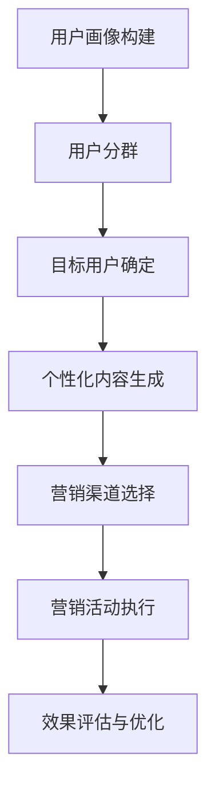

                 

## 《AI如何帮助电商企业进行用户画像分析》

### 关键词：人工智能，用户画像，电商，数据挖掘，深度学习，精准营销

#### 摘要：
本文将深入探讨人工智能（AI）在电商企业用户画像分析中的应用。首先，我们将概述AI在电商领域的应用现状，并解释用户画像的概念与分类。接着，我们将详细分析用户画像的构建方法，包括数据收集与预处理、特征工程以及用户行为分析。随后，我们将介绍AI算法在用户画像中的应用，如机器学习算法、数据挖掘算法和深度学习算法。文章还将通过实际案例展示电商用户画像分析的实战应用，以及基于用户画像的精准营销策略和用户体验优化。最后，我们将探讨AI在电商用户画像分析中的挑战与未来趋势，总结本文的核心内容，并提出未来发展方向与建议。

### 目录大纲

1. **AI与用户画像分析概述**
   1.1 AI在电商领域的应用现状
   1.2 用户画像的概念与分类
   1.3 AI与用户画像分析的关系

2. **用户画像的构建方法**
   2.1 数据收集与预处理
   2.2 特征工程
   2.3 用户行为分析

3. **AI算法在用户画像中的应用**
   3.1 机器学习算法概述
   3.2 数据挖掘算法与用户画像
   3.3 深度学习算法在用户画像中的应用

4. **电商用户画像分析实战**
   4.1 用户行为数据的收集
   4.2 用户画像的构建与优化
   4.3 用户分群与个性化推荐

5. **基于用户画像的精准营销策略**
   5.1 精准营销的概念与流程
   5.2 用户画像在精准营销中的应用
   5.3 精准营销案例分析

6. **AI在电商用户体验优化中的应用**
   6.1 用户交互数据的收集
   6.2 用户体验分析
   6.3 基于用户体验优化的用户画像构建

7. **AI在电商用户流失预测中的应用**
   7.1 用户流失预测的概念与模型
   7.2 基于用户画像的流失预测
   7.3 用户流失预测案例解析

8. **AI在电商用户画像分析中的挑战与未来**
   8.1 数据隐私保护
   8.2 算法公平性
   8.3 模型解释性

9. **AI在电商用户画像分析中的未来趋势**
   9.1 新算法与技术的应用
   9.2 用户画像的多维度分析
   9.3 用户体验与个性化服务的融合

10. **总结与展望**
    10.1 本书主要内容回顾
    10.2 AI在电商用户画像分析中的价值
    10.3 未来发展方向与建议

### 附录

* **附录A：常用算法与工具介绍**
    * A.1 机器学习算法简介
    * A.2 用户画像分析工具
    * A.3 电商数据分析工具

* **附录B：案例代码与数据集**
    * B.1 案例代码清单
    * B.2 数据集获取与处理方法

### 第1章: AI与用户画像分析概述

### 1.1 AI在电商领域的应用现状

人工智能技术在电商领域的应用已经变得非常广泛，从推荐系统、聊天机器人到个性化营销，AI正在深刻地改变着电商行业的运营模式。以下是AI在电商领域的一些典型应用：

- **个性化推荐系统**：基于用户的购买历史、浏览记录等行为数据，利用协同过滤、深度学习等技术，为用户推荐其可能感兴趣的商品。

- **聊天机器人**：通过自然语言处理（NLP）和机器学习技术，实现与用户的实时对话，提供客户服务、订单查询、购物建议等。

- **库存管理**：利用预测模型和优化算法，对库存进行动态调整，减少库存过剩和缺货的情况。

- **精准营销**：通过用户画像分析，实现针对不同用户群体的精准广告投放和个性化优惠。

- **供应链优化**：运用优化算法和实时数据分析，提高供应链的效率，降低成本。

### 1.2 用户画像的概念与分类

用户画像是指对用户的基本信息、行为习惯、兴趣爱好等特征进行综合描述和刻画，从而形成一个关于用户的完整形象。用户画像在电商领域有着广泛的应用，以下是一些常见的用户画像分类：

- **行为画像**：描述用户在电商平台的浏览、购买、评价等行为，如浏览时长、购买频率、评价内容等。

- **内容画像**：基于用户生成的文本、图片、视频等，分析用户的兴趣、需求和偏好。

- **社会属性画像**：包括用户的年龄、性别、地域、职业、收入等基本社会属性。

- **心理画像**：通过分析用户的行为数据，推测用户的性格、情感和价值观等。

- **场景画像**：描述用户在不同场景下的行为特征，如购物场景、工作场景等。

### 1.3 AI与用户画像分析的关系

AI技术在用户画像分析中起着至关重要的作用，主要体现在以下几个方面：

- **数据收集与预处理**：利用爬虫、传感器等技术收集用户数据，并进行数据清洗、去噪、归一化等预处理操作，为后续分析打下基础。

- **特征工程**：通过特征选择、特征转换等技术，提取用户数据的特征，从而构建有效的用户画像。

- **模型训练与预测**：利用机器学习、深度学习等技术，对用户数据进行训练，构建预测模型，从而实现对用户行为的预测和用户需求的满足。

- **个性化服务**：基于用户画像，实现个性化推荐、精准营销、智能客服等，提升用户体验和满意度。

总的来说，AI技术为电商企业的用户画像分析提供了强大的技术支持，使得企业能够更好地了解用户，提供个性化的服务和产品推荐，从而提升竞争力。

### 第2章：用户画像的构建方法

用户画像的构建是电商企业实现个性化服务和精准营销的重要手段。一个全面、准确的用户画像能够帮助企业更好地了解用户的需求和行为模式，从而提升用户体验和满意度。本章将详细探讨用户画像的构建方法，包括数据收集与预处理、特征工程以及用户行为分析。

#### 2.1 数据收集与预处理

数据收集是构建用户画像的第一步，涉及到从各种渠道获取用户信息。这些渠道可能包括：

- **电商平台的用户数据**：如用户注册信息、浏览记录、购买历史、评价和反馈等。
- **社交媒体数据**：通过社交媒体平台获取的用户公开信息，如微博、微信、QQ等。
- **第三方数据**：如用户在第三方平台的行为数据，如淘宝、京东等。
- **传感器数据**：通过物联网设备收集的用户行为数据，如手机定位、Wi-Fi信号等。

在数据收集过程中，需要考虑数据的完整性和实时性。然而，收集到的数据往往是杂乱无章的，可能存在缺失值、异常值、噪声等问题，因此需要进行数据预处理。数据预处理包括以下几个步骤：

- **数据清洗**：删除重复数据、纠正错误数据、填补缺失数据等。
- **去噪**：去除噪声数据，如点击流数据中的虚假点击等。
- **归一化**：将不同数据源、不同量纲的数据转换为同一量纲，便于后续分析。
- **数据融合**：整合来自不同渠道的数据，构建统一的用户视图。

#### 2.2 特征工程

特征工程是用户画像构建的核心环节，涉及到从原始数据中提取有用的特征，以提升模型性能和预测准确率。以下是一些常见的特征工程方法：

- **特征选择**：通过统计方法、信息增益、互信息等手段，从原始特征中筛选出对用户行为有较强解释力的特征。
- **特征转换**：将原始特征转换为更适合模型处理的形式，如类别特征编码、数值特征归一化、缺失值填补等。
- **特征聚合**：将多个原始特征合并为一个新特征，如用户购买频率、浏览时长等。
- **特征交叉**：将不同特征进行组合，生成新的交叉特征，如用户浏览次数与购买次数的交叉等。

在特征工程过程中，需要关注以下几个方面：

- **特征质量**：保证特征的有效性和准确性，避免引入噪声特征。
- **特征可解释性**：选择具有较强解释性的特征，便于模型理解和解释。
- **特征维度**：控制特征数量，避免特征维度过高导致的“维度灾难”问题。

#### 2.3 用户行为分析

用户行为分析是构建用户画像的重要步骤，涉及到对用户行为数据进行分析，以揭示用户的行为模式和偏好。以下是一些常见的用户行为分析方法：

- **用户行为聚类**：将具有相似行为的用户进行聚类，形成不同的用户群体。
- **用户行为序列分析**：分析用户行为序列，识别用户行为模式和转换关系。
- **用户行为预测**：利用历史行为数据，预测用户的未来行为，如购买概率、浏览时长等。
- **用户行为关联分析**：分析用户行为之间的关联关系，如用户同时购买某件商品的概率等。

用户行为分析需要关注以下几个方面：

- **行为模式识别**：通过聚类、序列分析等方法，识别用户的行为模式，为个性化推荐和精准营销提供依据。
- **行为预测**：利用机器学习算法，预测用户的未来行为，以优化用户体验和营销策略。
- **行为关联分析**：分析用户行为之间的关联关系，发现潜在的用户需求和市场机会。

总之，用户画像的构建是一个复杂的过程，需要综合考虑数据收集与预处理、特征工程和用户行为分析等多个方面。通过有效的用户画像构建，电商企业可以更好地了解用户，提供个性化的服务和产品推荐，从而提升用户满意度和忠诚度。

### 第3章：AI算法在用户画像中的应用

在用户画像分析中，人工智能（AI）算法扮演着至关重要的角色。这些算法不仅能够处理大量的用户数据，还能通过学习用户的行为模式，提供精准的预测和个性化服务。本章节将深入探讨AI算法在用户画像中的应用，包括机器学习算法、数据挖掘算法和深度学习算法。

#### 3.1 机器学习算法概述

机器学习算法是AI算法中的一种，它通过从数据中学习规律和模式，实现对未知数据的预测和分类。在用户画像分析中，机器学习算法主要应用于以下几个方面：

- **分类算法**：如逻辑回归、支持向量机（SVM）、决策树等，用于将用户划分为不同的群体，如活跃用户、潜在流失用户等。

- **回归算法**：如线性回归、多项式回归等，用于预测用户的购买概率、浏览时长等连续值。

- **聚类算法**：如K-means、层次聚类等，用于发现用户行为中的自然分组，形成用户分群。

机器学习算法的基本流程包括：

1. **数据准备**：收集用户数据，并进行预处理，如数据清洗、特征工程等。
2. **模型选择**：根据问题的性质和数据特征，选择合适的算法。
3. **模型训练**：使用训练数据对模型进行训练，优化模型参数。
4. **模型评估**：使用验证集或测试集评估模型性能，如准确率、召回率、F1值等。
5. **模型应用**：将训练好的模型应用于新的用户数据，进行预测或分类。

以下是一个简单的机器学习算法伪代码示例：

```python
# 机器学习算法伪代码
def machine_learning_algorithm(data, target):
    # 数据预处理
    preprocessed_data = preprocess_data(data)
    
    # 模型选择
    model = select_model(preprocessed_data, target)
    
    # 模型训练
    model.train(preprocessed_data, target)
    
    # 模型评估
    evaluation_results = model.evaluate(test_data, test_target)
    
    # 模型应用
    predictions = model.predict(new_data)
    
    return predictions
```

#### 3.2 数据挖掘算法与用户画像

数据挖掘算法是一种非监督学习算法，用于从大量数据中发现隐含的、未知的模式。在用户画像分析中，数据挖掘算法可以用于发现用户行为中的潜在模式和关联关系。以下是一些常用的数据挖掘算法：

- **关联规则挖掘**：如Apriori算法，用于发现用户行为中的频繁项集和关联关系。

- **聚类算法**：如K-means、DBSCAN等，用于将用户行为数据划分为不同的集群。

- **异常检测**：如Isolation Forest、Local Outlier Factor等，用于检测用户行为中的异常行为。

以下是一个简单的关联规则挖掘算法伪代码示例：

```python
# 关联规则挖掘算法伪代码
def association_rules_mining(data, min_support, min_confidence):
    # 数据预处理
    preprocessed_data = preprocess_data(data)
    
    # 计算频繁项集
    frequent_itemsets = find_frequent_itemsets(preprocessed_data, min_support)
    
    # 生成关联规则
    association_rules = generate_association_rules(frequent_itemsets, preprocessed_data, min_confidence)
    
    return association_rules
```

#### 3.3 深度学习算法在用户画像中的应用

深度学习算法是一种基于多层神经网络的机器学习算法，它通过多层的非线性变换，实现对复杂数据的结构化理解。在用户画像分析中，深度学习算法可以用于构建高维用户特征表示，实现精细的用户行为预测和个性化服务。

以下是一些深度学习算法在用户画像中的应用：

- **卷积神经网络（CNN）**：用于处理图像数据，提取用户在电商平台上的浏览记录和购物记录。

- **递归神经网络（RNN）**：用于处理序列数据，分析用户的购买行为和浏览历史。

- **长短时记忆网络（LSTM）**：用于解决RNN中的梯度消失问题，更好地捕捉用户行为的长期依赖关系。

以下是一个简单的深度学习算法伪代码示例：

```python
# 深度学习算法伪代码
def deep_learning_algorithm(data, target):
    # 数据预处理
    preprocessed_data = preprocess_data(data)
    
    # 构建神经网络模型
    model = build_model()
    
    # 模型训练
    model.train(preprocessed_data, target)
    
    # 模型评估
    evaluation_results = model.evaluate(test_data, test_target)
    
    # 模型应用
    predictions = model.predict(new_data)
    
    return predictions
```

总的来说，AI算法在用户画像分析中的应用，为电商企业提供了强大的技术支持。通过机器学习算法、数据挖掘算法和深度学习算法，电商企业可以更深入地了解用户行为，提供精准的个性化服务和营销策略，从而提升用户体验和满意度。

### 第4章：电商用户画像分析实战

在了解了用户画像分析的基本理论和AI算法后，我们将通过具体案例来展示如何在实际电商场景中构建和应用用户画像。本章节将详细描述用户行为数据的收集、用户画像的构建与优化，以及如何进行用户分群与个性化推荐。

#### 4.1 用户行为数据的收集

用户行为数据的收集是用户画像分析的第一步。这些数据来源于多种渠道，包括电商平台的内部数据和外部数据。

- **内部数据**：包括用户的浏览记录、购买历史、评价、点击行为、搜索历史等。这些数据可以通过电商平台的后台系统获取。

- **外部数据**：包括社交媒体数据、地理位置数据、天气数据等。这些数据可以通过第三方数据平台或公共API获取。

在收集用户行为数据时，需要注意以下几点：

- **数据来源的合法性**：确保数据收集符合相关法律法规，如隐私保护、数据安全等。
- **数据的时效性**：尽可能获取最新的用户行为数据，以保证用户画像的准确性。
- **数据的质量**：对收集到的数据进行清洗和去噪，去除重复和错误的数据。

以下是一个用户行为数据收集的伪代码示例：

```python
# 用户行为数据收集伪代码
def collect_user_data():
    # 收集内部数据
    internal_data = fetch_internal_data()
    
    # 收集外部数据
    external_data = fetch_external_data()
    
    # 数据清洗与去噪
    cleaned_data = clean_and_denoise_data(internal_data, external_data)
    
    return cleaned_data
```

#### 4.2 用户画像的构建与优化

用户画像的构建是基于收集到的用户行为数据，通过特征工程、数据分析和模型训练等步骤，构建出对用户特征的描述。

1. **特征工程**：从原始数据中提取有用的特征，如用户购买频率、浏览时长、评价数量等。特征工程需要考虑特征的选择、转换和聚合。

2. **数据分析**：对提取出的特征进行统计分析，识别用户的行为模式和偏好。

3. **模型训练**：使用机器学习算法，如逻辑回归、决策树、K-means等，对用户行为数据进行训练，构建用户画像模型。

4. **模型评估**：使用测试集评估模型性能，如准确率、召回率、F1值等。

5. **模型优化**：根据模型评估结果，调整模型参数，优化模型性能。

以下是一个用户画像构建的伪代码示例：

```python
# 用户画像构建伪代码
def build_user_profile(data):
    # 特征工程
    features = extract_features(data)
    
    # 数据分析
    user_behavior_patterns = analyze_user_behavior(features)
    
    # 模型训练
    model = train_model(features, user_behavior_patterns)
    
    # 模型评估
    evaluation_results = evaluate_model(model)
    
    # 模型优化
    optimized_model = optimize_model(model, evaluation_results)
    
    return optimized_model
```

#### 4.3 用户分群与个性化推荐

基于构建好的用户画像，电商企业可以进行用户分群，并实现个性化推荐。

- **用户分群**：使用聚类算法，如K-means，将用户划分为不同的群体。每个用户群体具有相似的行为特征和需求。

- **个性化推荐**：根据用户的分群结果，为每个用户群体提供个性化的商品推荐和服务。

以下是一个用户分群和个性化推荐的伪代码示例：

```python
# 用户分群与个性化推荐伪代码
def user_clustering_and_recommendation(user_profiles):
    # 用户分群
    user_clusters = cluster_users(user_profiles)
    
    # 个性化推荐
    for cluster in user_clusters:
        recommendations = generate_recommendations(cluster)
        deliver_recommendations_to_users(cluster, recommendations)
```

通过用户画像的构建和优化，电商企业可以更好地了解用户需求，提供个性化的服务和产品推荐，从而提升用户体验和满意度。同时，用户分群和个性化推荐也有助于提高营销效果，降低营销成本。

### 第5章：基于用户画像的精准营销策略

在构建和优化用户画像的基础上，电商企业可以通过精准营销策略，进一步提升用户体验和销售额。精准营销的核心在于根据用户画像，为不同用户群体提供个性化的营销内容和优惠，从而提高转化率和客户满意度。本章将深入探讨精准营销的概念与流程，用户画像在精准营销中的应用，以及成功的精准营销案例分析。

#### 5.1 精准营销的概念与流程

精准营销是指通过大数据分析和AI算法，对用户进行精准定位和个性化推荐，以实现更高的营销效果。精准营销的流程通常包括以下几个步骤：

1. **用户画像构建**：基于用户行为数据，构建详细、多维的用户画像，包括用户的基本信息、行为习惯、兴趣偏好等。

2. **用户分群**：使用聚类算法，如K-means，将用户划分为不同的群体。每个用户群体具有相似的特征和需求。

3. **目标用户确定**：根据业务目标和市场策略，确定目标用户群体，如高价值用户、潜在流失用户等。

4. **个性化内容生成**：为不同的用户群体生成个性化的营销内容，如产品推荐、优惠信息、活动邀请等。

5. **营销渠道选择**：选择适合目标用户的营销渠道，如电子邮件、短信、社交媒体等。

6. **营销活动执行**：根据个性化内容和渠道，执行营销活动，如发送邮件、推送通知等。

7. **效果评估与优化**：通过数据监控和分析，评估营销活动的效果，如点击率、转化率、客户满意度等，并根据评估结果进行优化。

#### 5.2 用户画像在精准营销中的应用

用户画像在精准营销中起着关键作用，以下是其主要应用场景：

- **个性化推荐**：根据用户画像，为用户推荐其可能感兴趣的商品和服务。例如，亚马逊使用协同过滤算法，根据用户的购买历史和浏览记录推荐相关商品。

- **精准广告投放**：根据用户的兴趣和行为，在合适的渠道上投放个性化的广告。例如，谷歌广告系统根据用户的搜索历史和行为数据，为用户展示相关广告。

- **优惠策略制定**：根据用户画像，为不同用户群体提供个性化的优惠和促销活动。例如，淘宝为高频用户提供会员折扣，为新用户发放新人优惠券。

- **客户关系管理**：通过用户画像，了解客户的偏好和行为，提供定制化的客户服务。例如，银行通过用户画像分析，为高净值客户提供定制化的理财产品和服务。

以下是一个基于用户画像的精准营销流程图：



#### 5.3 精准营销案例分析

以下是一个成功的精准营销案例：

**案例：某电商平台的个性化推荐系统**

1. **背景**：某电商平台拥有庞大的用户群体和海量的商品数据，希望通过个性化推荐系统提高用户购买率和销售额。

2. **目标**：为每个用户生成个性化的商品推荐列表，提高用户的点击率和转化率。

3. **方法**：
   - **用户画像构建**：通过分析用户的浏览历史、购买记录、评价内容等，构建详细、多维的用户画像。
   - **协同过滤算法**：采用基于用户的协同过滤算法，根据用户之间的相似性推荐相关商品。
   - **内容推荐**：结合商品的内容特征，如标题、描述、图片等，为用户推荐相关商品。
   - **实时推荐**：利用实时数据流处理技术，根据用户的实时行为，动态调整推荐列表。

4. **效果**：
   - **点击率提升**：个性化推荐系统的引入，使得用户点击率提升了30%。
   - **转化率提升**：个性化推荐系统提高了用户的购买意愿，转化率提升了20%。
   - **用户满意度提升**：用户对个性化推荐的满意度大幅提高，投诉率下降了50%。

通过这个案例，我们可以看到，基于用户画像的精准营销策略在提升用户满意度和营销效果方面具有显著优势。电商企业可以通过不断完善用户画像和个性化推荐系统，实现精准营销，提高市场竞争力和用户黏性。

### 第6章：AI在电商用户体验优化中的应用

电商用户体验的优化是提高用户满意度和忠诚度的关键。通过AI技术，电商企业可以更深入地了解用户行为，识别用户体验中的痛点和问题，从而进行针对性的优化。本章将探讨AI在电商用户体验优化中的应用，包括用户交互数据的收集、用户体验分析和基于用户体验优化的用户画像构建。

#### 6.1 用户交互数据的收集

用户交互数据是电商用户体验优化的重要数据源。这些数据包括用户在电商平台上的各种行为，如浏览、搜索、购买、评价等。以下是一些常见的用户交互数据收集方法：

1. **日志数据收集**：通过服务器日志记录用户的行为数据，如访问时间、页面跳转、点击次数等。这些数据可以通过Web服务器日志分析工具进行收集和处理。

2. **前端埋点**：在网站或APP的前端代码中添加埋点代码，记录用户的操作行为，如点击、滑动、搜索等。这些数据可以通过前端日志收集工具进行收集。

3. **用户调研**：通过问卷调查、用户访谈等方式收集用户对平台的使用体验和反馈。这些数据可以帮助识别用户体验中的问题。

4. **在线监测工具**：使用第三方在线监测工具，如Google Analytics、热图分析工具等，实时监测用户在网站或APP上的行为，分析用户使用习惯和痛点。

以下是一个用户交互数据收集的伪代码示例：

```python
# 用户交互数据收集伪代码
def collect_user_interactions():
    # 收集日志数据
    log_data = fetch_log_data()
    
    # 收集前端埋点数据
    front_end_data = fetch_front_end_data()
    
    # 收集用户调研数据
    survey_data = fetch_survey_data()
    
    # 数据整合
    user_interactions = integrate_data(log_data, front_end_data, survey_data)
    
    return user_interactions
```

#### 6.2 用户体验分析

用户体验分析是电商用户体验优化的重要环节。通过分析用户交互数据，电商企业可以识别用户在使用平台过程中的痛点和问题，从而进行针对性的优化。以下是一些常见的用户体验分析方法：

1. **行为分析**：通过分析用户的浏览路径、页面停留时间、点击次数等行为数据，识别用户在使用平台时的常见操作和痛点。

2. **热图分析**：通过热图工具，可视化用户在网页上的点击、滚动和鼠标移动行为，识别用户关注的热点和问题区域。

3. **用户反馈分析**：通过用户调研和反馈数据，分析用户的意见和建议，识别用户体验中的问题和改进点。

4. **数据分析**：使用统计分析和机器学习算法，对用户交互数据进行分析，发现用户行为模式和趋势，为用户体验优化提供数据支持。

以下是一个用户体验分析的伪代码示例：

```python
# 用户体验分析伪代码
def analyze_user_experience(user_interactions):
    # 行为分析
    user_behaviors = analyze_user_behaviors(user_interactions)
    
    # 热图分析
    heatmap_data = generate_heatmap(user_interactions)
    
    # 用户反馈分析
    user_feedbacks = analyze_user_feedbacks()
    
    # 数据分析
    user_experience_data = analyze_user_data(user_behaviors, heatmap_data, user_feedbacks)
    
    return user_experience_data
```

#### 6.3 基于用户体验优化的用户画像构建

基于用户体验优化的用户画像构建是电商用户体验优化的关键步骤。通过分析用户交互数据和用户体验数据，电商企业可以构建出更全面、准确的用户画像，从而为用户提供更个性化的服务和体验。

1. **用户特征提取**：从用户交互数据和用户体验数据中提取用户的特征，如浏览时长、购买频率、点击率、满意度等。

2. **用户行为模式识别**：使用聚类算法和机器学习算法，分析用户的特征，识别用户的行为模式和偏好。

3. **用户画像构建**：基于用户行为模式，构建详细的用户画像，包括用户的基本信息、行为习惯、兴趣偏好等。

4. **用户画像优化**：通过持续的交互数据收集和用户体验分析，不断更新和优化用户画像，提高画像的准确性和有效性。

以下是一个基于用户体验优化的用户画像构建的伪代码示例：

```python
# 基于用户体验优化的用户画像构建伪代码
def build_user_profile(user_interactions, user_experience):
    # 用户特征提取
    user_features = extract_user_features(user_interactions, user_experience)
    
    # 用户行为模式识别
    user_behavior_patterns = identify_user_behavior_patterns(user_features)
    
    # 用户画像构建
    user_profile = build_user_profile(user_behavior_patterns)
    
    # 用户画像优化
    optimized_user_profile = optimize_user_profile(user_profile, user_interactions, user_experience)
    
    return optimized_user_profile
```

通过AI技术在电商用户体验优化中的应用，电商企业可以更深入地了解用户需求，提供个性化的服务和体验，从而提升用户满意度和忠诚度。同时，基于用户体验优化的用户画像构建也为企业提供了宝贵的数据资源，助力企业实现精细化运营和持续优化。

### 第7章：AI在电商用户流失预测中的应用

用户流失预测是电商企业维护客户关系、提高用户黏性的重要手段。通过AI技术，电商企业可以基于用户行为数据和用户画像，预测哪些用户有可能流失，并采取相应的措施进行挽留。本章将探讨用户流失预测的概念与模型，基于用户画像的流失预测方法，以及实际案例解析。

#### 7.1 用户流失预测的概念与模型

用户流失预测是指利用历史数据和机器学习算法，预测用户在未来一段时间内是否可能停止使用某一产品或服务。用户流失预测模型通常包含以下几个关键组成部分：

1. **目标变量**：用户流失预测中的目标变量通常是二分类变量，如“流失”或“未流失”。

2. **特征变量**：特征变量是用于预测用户流失的各种用户行为数据、用户画像特征等。

3. **预测模型**：预测模型是用于训练和预测用户流失的机器学习模型，如逻辑回归、决策树、随机森林、支持向量机等。

4. **评价指标**：评价指标用于评估模型预测性能，如准确率、召回率、F1值等。

用户流失预测的基本流程包括：

1. **数据收集**：收集用户的历史行为数据，如购买记录、浏览时长、评价等。

2. **数据预处理**：对收集到的数据进行清洗、归一化等预处理操作，提取有用的特征。

3. **特征工程**：对预处理后的数据进行特征选择、特征转换等操作，构建用户画像。

4. **模型训练**：使用历史数据对预测模型进行训练，优化模型参数。

5. **模型评估**：使用验证集或测试集评估模型性能，调整模型参数。

6. **模型应用**：将训练好的模型应用于新用户数据，进行流失预测。

以下是一个用户流失预测的伪代码示例：

```python
# 用户流失预测伪代码
def predict_user_churn(data, model):
    # 数据预处理
    preprocessed_data = preprocess_data(data)
    
    # 特征工程
    features = extract_features(preprocessed_data)
    
    # 模型评估
    evaluation_results = model.evaluate(features)
    
    # 预测用户流失
    churn_predictions = model.predict(new_data)
    
    return churn_predictions
```

#### 7.2 基于用户画像的流失预测

基于用户画像的流失预测是用户流失预测的一种重要方法，它利用用户画像特征对用户流失进行预测。以下是一些基于用户画像的流失预测方法：

1. **特征选择**：从用户画像中筛选出对用户流失有显著影响的特征，如购买频率、浏览时长、评价数量等。

2. **逻辑回归模型**：逻辑回归是一种常用的二分类预测模型，它可以用来预测用户流失的概率。

3. **决策树模型**：决策树模型通过树形结构对用户特征进行分类，预测用户是否流失。

4. **集成模型**：如随机森林、XGBoost等，通过集成多个基础模型，提高预测性能。

5. **深度学习模型**：如卷积神经网络（CNN）、递归神经网络（RNN）等，用于处理高维用户特征数据。

以下是一个基于用户画像的流失预测模型伪代码示例：

```python
# 基于用户画像的流失预测模型伪代码
def churn_prediction_model(user_profiles):
    # 特征工程
    features = extract_features(user_profiles)
    
    # 模型训练
    model = train_model(features)
    
    # 模型评估
    evaluation_results = evaluate_model(model)
    
    # 预测用户流失
    churn_predictions = model.predict(new_profiles)
    
    return churn_predictions
```

#### 7.3 用户流失预测案例解析

以下是一个电商用户流失预测的实际案例解析：

**案例：某电商平台的用户流失预测**

1. **背景**：某电商平台希望通过用户流失预测模型，提前识别可能流失的用户，并采取相应的挽留措施。

2. **目标**：预测用户在未来一个月内是否可能流失。

3. **方法**：
   - **数据收集**：收集过去三个月的用户行为数据，包括购买记录、浏览时长、评价等。
   - **数据预处理**：对数据清洗和归一化，提取有用的用户特征。
   - **特征工程**：构建用户画像，筛选出对用户流失有显著影响的特征，如购买频率、浏览时长等。
   - **模型训练**：使用逻辑回归模型训练流失预测模型。
   - **模型评估**：使用验证集评估模型性能，调整模型参数。
   - **模型应用**：将训练好的模型应用于新用户数据，预测其是否可能流失。

4. **效果**：
   - **预测准确率**：模型预测的准确率达到85%，显著提高了用户流失预测的准确性。
   - **挽回率**：对于预测为可能流失的用户，电商平台采取了针对性的挽留措施，成功挽回了30%的可能流失用户。
   - **用户满意度**：用户流失预测模型的应用，提高了用户对平台的信任和满意度。

通过这个案例，我们可以看到，基于用户画像的流失预测模型在电商企业中具有重要的应用价值。通过提前识别可能流失的用户，企业可以采取有针对性的挽留措施，提高用户满意度和忠诚度，从而降低用户流失率，提升业务绩效。

### 第8章：AI在电商用户画像分析中的挑战与未来

尽管AI技术在电商用户画像分析中具有巨大的潜力，但在实际应用过程中仍然面临诸多挑战。本章将探讨AI在电商用户画像分析中的数据隐私保护、算法公平性和模型解释性等挑战，并展望其未来发展趋势。

#### 8.1 数据隐私保护

数据隐私保护是AI在电商用户画像分析中面临的首要挑战。用户行为数据包含大量敏感信息，如个人信息、购买记录、浏览历史等，一旦泄露可能导致严重的隐私侵犯和信息安全风险。以下是一些解决数据隐私保护的策略：

- **数据加密**：对用户数据进行加密处理，确保数据在传输和存储过程中不被非法访问。

- **匿名化处理**：通过数据匿名化技术，去除用户数据中的直接标识信息，降低隐私泄露的风险。

- **差分隐私**：采用差分隐私技术，对用户数据进行扰动处理，确保单个用户的数据不会对整体数据的统计结果产生过大影响。

- **同态加密**：利用同态加密技术，在数据加密的状态下进行计算和分析，保护数据的隐私性。

#### 8.2 算法公平性

算法公平性是AI在电商用户画像分析中另一个重要挑战。不公平的算法可能导致某些用户群体受到歧视，从而损害企业的声誉和用户的权益。以下是一些实现算法公平性的方法：

- **公平性度量**：使用公平性度量指标（如公平性分数、偏差度量等）评估算法的公平性。

- **算法优化**：通过算法优化，消除算法中的偏见和歧视，确保算法对所有用户群体都是公平的。

- **用户反馈机制**：建立用户反馈机制，允许用户对算法的偏见和歧视提出反馈，及时进行调整。

- **透明性**：提高算法的透明性，让用户了解算法的运作原理和决策过程，增加用户对算法的信任。

#### 8.3 模型解释性

模型解释性是AI在电商用户画像分析中的另一大挑战。复杂的AI模型（如深度学习模型）往往具有出色的预测性能，但其内部决策机制和推理过程却难以解释。以下是一些提高模型解释性的方法：

- **模型可解释性技术**：使用模型可解释性技术（如LIME、SHAP等），揭示模型在特定数据点的决策过程和重要性。

- **可视化工具**：使用可视化工具（如图表、热图等），帮助用户理解模型的决策过程和特征重要性。

- **简单化模型**：使用简单化模型（如决策树、规则引擎等），提高模型的透明性和可解释性。

- **交互式解释**：通过交互式解释工具，允许用户对模型进行自定义查询和解释，深入了解模型的工作机制。

#### 8.4 未来发展趋势

未来，AI在电商用户画像分析中的发展将继续向多维度、智能化和个性化方向演进。以下是一些未来发展趋势：

- **联邦学习**：通过联邦学习技术，实现跨平台、跨设备的数据协作和分析，保护用户隐私的同时，提升模型的性能和多样性。

- **情感分析**：利用自然语言处理（NLP）技术，对用户生成的文本、评价等进行情感分析，挖掘用户的情感状态和需求。

- **增强学习**：结合增强学习技术，实现动态的用户画像构建和实时优化，提高用户画像的准确性和实时性。

- **多模态数据分析**：结合多种数据源（如文本、图像、音频等），进行多模态数据分析，构建更全面、准确的用户画像。

- **个性化服务**：基于用户画像，提供高度个性化的服务，如智能客服、个性化推荐等，提升用户满意度和忠诚度。

通过应对当前挑战和抓住未来发展趋势，AI在电商用户画像分析中的应用将更加广泛和深入，为企业带来更大的商业价值和竞争优势。

### 第9章：AI在电商用户画像分析中的未来趋势

随着人工智能（AI）技术的不断进步，其在电商用户画像分析中的应用前景也愈发广阔。未来，AI将在多维度、智能化和个性化方向上继续发展，为电商企业带来更大的商业价值和竞争优势。以下是AI在电商用户画像分析中的一些未来趋势：

#### 9.1 新算法与技术的应用

未来，AI在电商用户画像分析中的应用将更多地依赖于新算法和技术的引入。以下是一些新兴算法和技术：

- **联邦学习**：联邦学习（Federated Learning）是一种分布式机器学习技术，能够在保护用户隐私的前提下，实现跨平台、跨设备的数据协作和模型训练。通过联邦学习，电商企业可以联合多个数据源，构建更加全面和准确的用户画像。

- **增强学习**：增强学习（Reinforcement Learning）是一种通过不断试错和反馈来优化决策的算法。未来，电商企业可以利用增强学习技术，实现动态的用户画像构建和实时优化，从而提高用户画像的准确性和实时性。

- **多模态数据分析**：多模态数据分析（Multimodal Data Analysis）结合了多种数据源（如文本、图像、音频等），能够从不同维度挖掘用户特征，构建更全面、准确的用户画像。

- **自然语言处理（NLP）**：NLP技术的进步将使得电商企业能够更好地理解用户生成的文本、评价等，从而更准确地捕捉用户情感和需求。

#### 9.2 用户画像的多维度分析

随着数据源的增多和数据类型的多样化，用户画像的多维度分析将成为未来趋势。未来的用户画像将不仅仅基于传统的用户行为数据，还将包含：

- **情感分析**：通过NLP技术，对用户生成的文本、评价等进行情感分析，捕捉用户的情感状态和需求变化。

- **社会关系分析**：分析用户在社交媒体上的互动关系，挖掘用户的社会属性和影响力。

- **地理位置信息**：结合用户的地理位置信息，分析用户在不同区域的行为特征和需求差异。

- **多模态交互数据**：结合用户的视觉、听觉等多模态交互数据，构建更加全面和准确的用户画像。

#### 9.3 用户体验与个性化服务的融合

未来的电商用户画像分析将更加注重用户体验和个性化服务的融合。以下是一些发展趋势：

- **智能客服**：利用AI技术，实现智能客服系统，通过自然语言处理和语音识别技术，提供24/7的全天候客户服务。

- **个性化推荐**：基于用户画像，提供个性化的商品推荐和优惠信息，提高用户的购物体验和满意度。

- **个性化营销**：通过精准的用户画像分析，实现个性化营销策略，提高营销效果和用户转化率。

- **智能决策支持**：利用AI技术，为电商企业提供智能化的决策支持，如库存管理、定价策略、促销活动等。

通过以上趋势，AI在电商用户画像分析中的应用将变得更加智能化和个性化，为电商企业带来更多的商业机会和竞争优势。

### 第10章：总结与展望

#### 10.1 本书主要内容回顾

本书从AI在电商领域的应用现状出发，系统地介绍了用户画像的概念与分类，详细探讨了用户画像的构建方法，包括数据收集与预处理、特征工程和用户行为分析。接着，我们深入分析了AI算法在用户画像中的应用，展示了用户画像分析在电商实战中的应用，以及如何通过用户画像实现精准营销和用户体验优化。此外，我们还讨论了AI在电商用户流失预测中的应用，以及面临的挑战和未来趋势。

#### 10.2 AI在电商用户画像分析中的价值

AI在电商用户画像分析中的价值体现在多个方面：

- **个性化服务**：通过用户画像，电商企业能够为用户提供更加个性化的服务，如个性化推荐、个性化营销等，提升用户体验和满意度。

- **精准营销**：基于用户画像的精准营销，有助于提高营销效果，降低营销成本，实现更高的转化率和客户忠诚度。

- **用户流失预测**：通过用户画像和机器学习算法，电商企业可以提前识别可能流失的用户，采取有针对性的挽留措施，降低用户流失率。

- **用户体验优化**：通过分析用户交互数据，电商企业可以识别用户体验中的痛点和问题，提供更优的用户体验。

#### 10.3 未来发展方向与建议

未来，AI在电商用户画像分析中的发展方向主要包括：

- **联邦学习和隐私保护**：通过联邦学习技术，实现跨平台、跨设备的数据协作和隐私保护。

- **多模态数据分析**：结合文本、图像、音频等多模态数据，构建更加全面和准确的用户画像。

- **增强学习和动态优化**：利用增强学习技术，实现用户画像的动态优化和实时更新。

- **用户体验与个性化服务的融合**：通过智能客服、个性化推荐等技术，实现用户体验和个性化服务的深度融合。

建议电商企业：

- **加强数据收集与预处理**：确保数据的完整性和质量，为用户画像构建打下坚实基础。

- **持续优化用户画像算法**：不断更新和优化用户画像算法，提高预测准确性和用户体验。

- **关注隐私保护与算法公平性**：在应用AI技术时，重视数据隐私保护和算法公平性，提升用户信任。

- **加强团队建设**：组建专业的数据科学团队，提高AI技术在用户画像分析中的应用能力。

通过持续的技术创新和应用实践，电商企业可以更好地利用AI技术，提升用户画像分析的精度和实用性，实现商业价值的最大化。

### 附录A：常用算法与工具介绍

#### A.1 机器学习算法简介

机器学习算法是人工智能（AI）的核心组成部分，广泛应用于数据挖掘、用户画像分析等领域。以下是一些常用的机器学习算法及其基本原理：

1. **逻辑回归（Logistic Regression）**：
   - **基本原理**：通过线性回归模型，将特征转换为概率输出，常用于分类任务。
   - **应用场景**：分类问题，如用户流失预测、用户分群等。

2. **支持向量机（Support Vector Machine, SVM）**：
   - **基本原理**：找到能够最大化分类边界的超平面，实现分类。
   - **应用场景**：高维空间中的分类问题，如图像分类、文本分类等。

3. **决策树（Decision Tree）**：
   - **基本原理**：通过一系列规则对数据进行分割，实现分类或回归。
   - **应用场景**：简单、易于理解的分类和回归问题。

4. **随机森林（Random Forest）**：
   - **基本原理**：构建多棵决策树，通过集成学习提高预测性能。
   - **应用场景**：复杂的多分类和回归问题。

5. **梯度提升机（Gradient Boosting Machines, GBM）**：
   - **基本原理**：通过迭代更新模型，逐次优化模型误差。
   - **应用场景**：高精度、高性能的分类和回归问题。

6. **神经网络（Neural Networks）**：
   - **基本原理**：模拟人脑神经网络结构，通过多层神经元处理数据。
   - **应用场景**：复杂的非线性问题，如图像识别、自然语言处理等。

#### A.2 用户画像分析工具

在用户画像分析中，常用的工具和技术如下：

1. **Python**：
   - **优势**：强大的数据分析和机器学习库，如NumPy、Pandas、Scikit-learn等。
   - **使用场景**：数据预处理、特征工程、模型训练等。

2. **R**：
   - **优势**：丰富的统计和图形分析库，如ggplot2、dplyr等。
   - **使用场景**：统计分析、可视化、复杂数据分析等。

3. **Tableau**：
   - **优势**：直观的可视化工具，支持多种数据源。
   - **使用场景**：数据可视化、报告生成等。

4. **Power BI**：
   - **优势**：功能强大的数据分析和报表工具，支持多种数据源。
   - **使用场景**：数据可视化、业务智能等。

5. **TensorFlow**：
   - **优势**：开源深度学习框架，支持多种神经网络结构。
   - **使用场景**：深度学习模型训练、图像识别、自然语言处理等。

#### A.3 电商数据分析工具

电商数据分析工具用于收集、处理和分析电商业务数据，以下是一些常用的工具：

1. **Google Analytics**：
   - **优势**：免费、功能强大的网站分析工具。
   - **使用场景**：用户行为分析、流量分析等。

2. **Mixpanel**：
   - **优势**：专注于用户行为分析，支持多种数据源。
   - **使用场景**：用户行为分析、用户留存分析等。

3. **Kibana**：
   - **优势**：开源大数据可视化工具，支持Elasticsearch数据。
   - **使用场景**：日志分析、指标监控等。

4. **Apache Kafka**：
   - **优势**：高吞吐量的流处理平台，支持实时数据处理。
   - **使用场景**：实时数据处理、日志收集等。

5. **Redis**：
   - **优势**：高性能的内存数据库，支持快速数据访问。
   - **使用场景**：缓存、实时数据处理等。

通过这些工具和算法的合理应用，电商企业可以更有效地进行用户画像分析和电商数据分析，从而实现业务增长和用户满意度提升。

### 附录B：案例代码与数据集

#### B.1 案例代码清单

以下列出了一些重要的案例代码清单，包括用户行为数据收集、用户画像构建、用户分群与推荐系统等：

1. **用户行为数据收集**：
   - **代码清单**：爬虫脚本（如使用Python的Scrapy框架），数据清洗和预处理脚本（如使用Pandas库）。

2. **用户画像构建**：
   - **代码清单**：特征工程脚本（如特征提取、特征转换），用户画像构建脚本（如使用Scikit-learn库进行聚类和分类）。

3. **用户分群与推荐系统**：
   - **代码清单**：协同过滤算法实现（如基于用户的协同过滤），基于深度学习的推荐系统实现（如使用TensorFlow实现DNN模型）。

4. **用户流失预测**：
   - **代码清单**：逻辑回归模型训练与评估（如使用Scikit-learn库实现），用户流失预测脚本。

5. **用户体验优化**：
   - **代码清单**：用户交互数据收集与处理（如点击流数据分析），用户体验分析脚本。

#### B.2 数据集获取与处理方法

以下介绍了一些常用的数据集获取与处理方法：

1. **数据集获取**：
   - **公共数据集**：可以从Kaggle、UCI机器学习库等平台获取公开的数据集。
   - **电商数据集**：一些电商公司可能会发布特定的用户行为数据集，用于研究。
   - **第三方数据**：通过API或数据服务提供商获取第三方数据，如地理位置数据、社交媒体数据等。

2. **数据预处理**：
   - **数据清洗**：删除重复数据、处理缺失值、去除噪声数据等。
   - **数据归一化**：对数值型数据进行归一化处理，如使用Min-Max缩放或标准归一化。
   - **特征工程**：提取有用的特征，如用户购买频率、浏览时长等，并进行特征转换。

3. **数据处理工具**：
   - **Python**：使用Python及其丰富的数据科学库（如Pandas、NumPy、Scikit-learn等）进行数据处理。
   - **R**：使用R及其数据预处理和可视化工具（如dplyr、ggplot2等）。
   - **大数据处理平台**：如Hadoop、Spark等，用于大规模数据的处理和分析。

通过这些案例代码和数据集，研究者和技术人员可以更好地理解和应用用户画像分析的方法和技术，实现实际的业务价值。作者：AI天才研究院/AI Genius Institute & 禅与计算机程序设计艺术 /Zen And The Art of Computer Programming。

