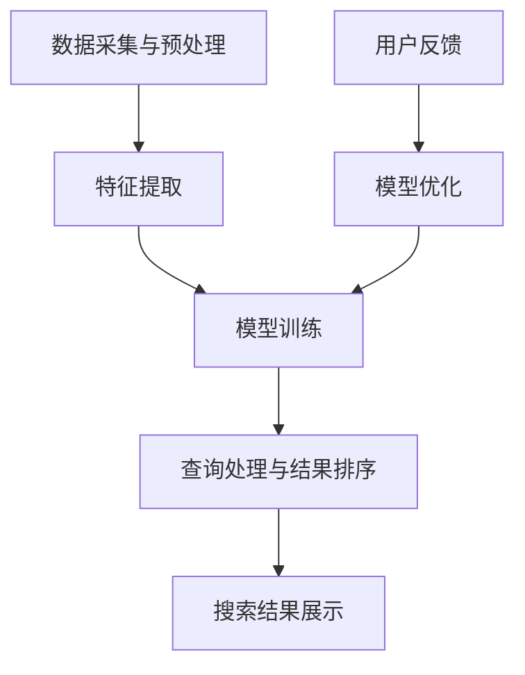

                 

### 1. AI搜索技术概述

#### 1.1 AI搜索的基本原理

AI搜索技术，顾名思义，是结合了人工智能（AI）与传统搜索算法的一种技术。其核心目的是通过利用机器学习、深度学习等AI技术，使搜索系统更加智能化、精准化，从而提升用户体验。

AI搜索的基本原理主要包括以下几个步骤：

1. **数据采集与预处理**：从各种来源（如网站、数据库等）收集数据，并对数据进行清洗、去噪、归一化等预处理，以便后续分析。

2. **特征提取**：通过对预处理后的数据进行分析，提取出有代表性的特征。这些特征可以是文本、图像、音频等多种类型。

3. **模型训练**：利用机器学习或深度学习算法，对提取出的特征进行训练，构建出模型。

4. **查询处理与结果排序**：当用户进行搜索时，系统会根据用户输入的查询，调用训练好的模型进行处理，并返回排序后的搜索结果。

与传统搜索算法相比，AI搜索具有以下几个显著特点：

- **个性化推荐**：通过分析用户的历史行为和偏好，AI搜索可以为用户提供个性化的搜索结果，从而提升用户体验。

- **实时性**：传统搜索算法通常需要较长时间来处理查询，而AI搜索技术可以通过并行计算和分布式计算等技术，实现实时搜索。

- **准确性**：AI搜索利用深度学习等技术，能够更好地理解用户的查询意图，从而提高搜索结果的准确性。

#### 1.2 AI搜索在旅游和酒店业的应用价值

旅游和酒店业是高度依赖客户服务和用户体验的行业。随着互联网和移动设备的普及，客户对于个性化、便捷的服务需求日益增长。AI搜索技术的引入，为旅游和酒店业带来了以下几方面的价值：

1. **提升客户满意度**：通过AI搜索技术，旅游和酒店业可以为客户提供更个性化的服务，满足他们的个性化需求，从而提升客户满意度。

2. **优化运营效率**：AI搜索技术可以帮助企业更好地管理客户数据，优化运营流程，降低运营成本。

3. **提升营销效果**：AI搜索技术可以根据用户的行为和偏好，精准地推送相关广告和优惠信息，提升营销效果。

4. **增强竞争力**：随着越来越多的企业采用AI搜索技术，谁能够更好地利用这项技术，谁就将拥有更强的竞争力。

综上所述，AI搜索技术在旅游和酒店业具有广阔的应用前景，能够为企业和客户带来诸多益处。

### 2. 旅游和酒店业的数据处理

在AI搜索技术中，数据处理是至关重要的一步。旅游和酒店业作为一个数据密集型行业，拥有大量的客户数据、地理位置数据、社交媒体数据等。如何有效地处理这些数据，提取出有用的特征，是AI搜索成功的关键。

#### 2.1 旅游和酒店业的数据来源

旅游和酒店业的数据来源主要包括以下几个方面：

1. **客户数据**：这是最基本的数据来源，包括客户的个人信息、预订记录、偏好等。这些数据通常来自于客户的在线预订、问卷调查、评论等。

2. **社交媒体数据**：社交媒体平台如Facebook、Twitter、Instagram等，是客户表达意见、分享经历的重要渠道。通过分析这些数据，可以了解客户的情感、偏好等。

3. **地理位置数据**：地理位置数据包括客户的位置信息、旅游目的地的地理位置等。这些数据对于旅游路线推荐、酒店推荐等具有重要的参考价值。

4. **在线评论数据**：客户在旅游过程中会在各种平台上留下评论，这些评论包含了大量的信息，如酒店的设施、服务、价格等。

#### 2.2 数据预处理与特征提取

数据预处理是数据处理的第一步，其目的是清洗、去噪、归一化等，使数据更加干净、整齐，便于后续分析。

1. **数据清洗**：清洗数据是去除数据中的错误、异常值、重复值等的过程。例如，删除重复的客户信息、修正错误的地理位置信息等。

2. **去噪**：去噪是指去除数据中的噪声，以提高数据的准确性和可靠性。例如，对于文本数据，可以通过去除停用词、进行词干提取等手段来去噪。

3. **数据归一化**：数据归一化是将数据转换为同一尺度，以便于后续分析。例如，将地理位置数据转换为经纬度，将价格数据转换为同一货币单位等。

特征提取是将原始数据转换为机器学习算法可以处理的形式。在旅游和酒店业，常用的特征提取方法包括：

1. **文本特征提取**：对于文本数据，可以使用词袋模型、TF-IDF、Word2Vec等方法提取特征。例如，通过TF-IDF方法，可以提取出文本中的关键词，用于文本分类或情感分析。

2. **数值特征提取**：对于数值数据，可以使用统计特征、维度约简等方法提取特征。例如，对于客户评分，可以提取出均值、方差等统计特征，用于预测客户满意度。

3. **图像特征提取**：对于图像数据，可以使用卷积神经网络（CNN）等方法提取特征。例如，通过CNN，可以提取出图像中的关键区域，用于图像分类或目标检测。

通过上述数据预处理和特征提取方法，旅游和酒店业可以有效地提取出有用的特征，为后续的AI搜索算法提供基础。

### 3. AI搜索算法在旅游和酒店业的应用

AI搜索算法在旅游和酒店业的应用，可以极大地提升客户服务的质量和效率。以下将从搜索引擎优化（SEO）和智能推荐系统两个方面，探讨AI搜索算法在旅游和酒店业的应用及其原理。

#### 3.1 搜索引擎优化（SEO）

搜索引擎优化（SEO）是提高网站在搜索引擎中排名的一种技术。在旅游和酒店业，SEO的应用主要包括以下几个方面：

1. **关键词研究**：关键词研究是SEO的第一步，通过分析用户搜索习惯和竞争对手的排名，确定网站应该优化的关键词。AI搜索算法可以通过分析大量用户行为数据，识别出潜在的关键词，从而帮助网站优化关键词策略。

2. **内容优化**：内容优化是SEO的核心，通过优化网页标题、描述、正文等内容，提高网页的相关性和用户体验。AI搜索算法可以分析用户查询和网页内容的匹配度，为网站提供内容优化的建议。

3. **链接建设**：链接建设是提高网站权重的重要手段，通过获取高质量的外部链接，可以提高网站在搜索引擎中的排名。AI搜索算法可以通过分析链接来源的质量和数量，为网站提供链接建设的策略。

SEO算法的基本原理如下：

1. **关键词匹配度**：SEO算法通过分析用户查询和网页内容的关键词匹配度，确定网页的相关性。常用的方法包括TF-IDF、Word2Vec等。

2. **页面质量**：SEO算法还会考虑网页的质量，包括内容丰富度、原创性、用户体验等。页面质量越高，越有利于提高搜索排名。

3. **外部链接质量**：外部链接的质量对SEO也有重要影响，高质量的外部链接可以提升网站权重。

#### 3.2 智能推荐系统

智能推荐系统是利用AI技术，根据用户的行为和偏好，为用户推荐相关内容的一种系统。在旅游和酒店业，智能推荐系统的应用主要包括以下几个方面：

1. **个性化旅游推荐**：通过分析用户的旅游历史、偏好等数据，智能推荐系统可以为用户推荐符合他们兴趣的旅游路线、景点等。

2. **酒店个性化推荐**：通过分析用户的预订记录、评价等数据，智能推荐系统可以为用户推荐符合他们需求的酒店。

3. **个性化营销**：通过分析用户的行为和偏好，智能推荐系统可以为用户推送个性化的营销信息，如优惠券、促销活动等。

智能推荐系统的基本原理如下：

1. **协同过滤**：协同过滤是一种常用的推荐算法，通过分析用户之间的相似性，为用户推荐他们可能喜欢的内容。协同过滤包括基于用户的协同过滤和基于物品的协同过滤。

2. **基于内容的推荐**：基于内容的推荐通过分析内容的特点，为用户推荐相关的内容。这种方法适用于旅游和酒店业，例如，通过分析景点的描述、图片等，为用户推荐类似的景点。

3. **深度学习**：深度学习是一种强大的推荐算法，通过构建深度神经网络，可以更好地理解用户的行为和偏好。例如，可以使用卷积神经网络（CNN）提取图像特征，使用循环神经网络（RNN）处理序列数据等。

#### 3.3 智能客服

智能客服是利用AI技术，为用户提供自动化服务的系统。在旅游和酒店业，智能客服的应用主要包括以下几个方面：

1. **常见问题自动回答**：智能客服可以自动回答用户常见的问题，如酒店预订流程、景点介绍等。

2. **聊天机器人**：通过聊天机器人，用户可以与系统进行自然语言交互，获取个性化的服务。

3. **客户情绪分析**：智能客服可以通过分析用户的语言和情感，识别出用户的情绪状态，提供更贴心的服务。

智能客服的基本原理如下：

1. **自然语言处理**：自然语言处理（NLP）是智能客服的基础，通过NLP技术，可以将用户的语言转化为计算机可以理解的形式。

2. **机器学习**：机器学习是智能客服的核心，通过训练模型，可以识别用户的意图、情绪等。

3. **语音识别和合成**：语音识别和合成技术可以使智能客服实现语音交互，提供更自然的用户体验。

### 4. 个性化旅游推荐

个性化旅游推荐是利用AI技术，根据用户的兴趣和行为，为用户推荐个性化的旅游路线和景点。以下将从旅游路线推荐和酒店推荐两个方面，探讨个性化旅游推荐的方法和实现。

#### 4.1 旅游路线推荐

旅游路线推荐是旅游推荐系统的重要组成部分，通过为用户提供个性化的旅游路线，可以提升用户的旅游体验。

1. **基于用户兴趣的旅游路线推荐**：这种方法通过分析用户的旅游历史、偏好等数据，为用户推荐符合他们兴趣的旅游路线。具体步骤如下：

   - 数据采集：收集用户的旅游历史数据，包括用户访问的景点、时间、频率等。
   - 数据预处理：对数据进行清洗、去噪、归一化等处理，提取出有用的特征。
   - 特征提取：对用户历史数据进行分析，提取出用户兴趣特征，如热门景点、时间偏好等。
   - 推荐算法：使用基于协同过滤、基于内容的推荐算法等，为用户推荐符合他们兴趣的旅游路线。

2. **基于位置信息的旅游路线推荐**：这种方法通过分析用户当前的位置信息，为用户推荐附近的旅游景点和路线。具体步骤如下：

   - 数据采集：收集用户的位置信息，如GPS数据、Wi-Fi信号等。
   - 数据预处理：对数据进行清洗、去噪、归一化等处理，提取出有用的特征。
   - 推荐算法：使用基于K近邻、基于聚类等方法，为用户推荐附近的旅游景点和路线。

#### 4.2 酒店个性化推荐

酒店个性化推荐是根据用户的偏好和预订历史，为用户推荐符合他们需求的酒店。以下是一种基于协同过滤和基于内容的推荐的实现方法：

1. **基于协同过滤的酒店推荐**：

   - 数据采集：收集用户的预订历史数据，包括用户预订的酒店、时间、评分等。
   - 数据预处理：对数据进行清洗、去噪、归一化等处理，提取出有用的特征。
   - 特征提取：对用户历史数据进行处理，提取出用户偏好特征，如评分、价格等。
   - 推荐算法：使用基于用户的协同过滤算法（User-based CF），为用户推荐与他们相似的用户喜欢的酒店。

2. **基于内容的酒店推荐**：

   - 数据采集：收集酒店的详细信息，如位置、设施、价格等。
   - 数据预处理：对数据进行清洗、去噪、归一化等处理，提取出有用的特征。
   - 推荐算法：使用基于内容的推荐算法（Content-based CB），为用户推荐与当前酒店相似的其他酒店。

通过结合基于协同过滤和基于内容的推荐方法，可以提供更加个性化的酒店推荐服务。

### 5. 智能客服与聊天机器人

智能客服和聊天机器人是利用AI技术，为用户提供自动化服务的工具。在旅游和酒店业，智能客服和聊天机器人的应用可以极大地提升客户服务的效率和满意度。

#### 5.1 智能客服系统

智能客服系统是一种基于自然语言处理和机器学习技术的客户服务系统，可以自动回答用户的问题，提高客户服务效率。

1. **常见问题自动回答**：

   - 数据采集：收集用户常见的问题和相关的答案。
   - 数据预处理：对数据进行清洗、去噪、归一化等处理。
   - 模型训练：使用自然语言处理技术，训练问答对模型。
   - 实际应用：当用户提出问题时，系统会自动识别问题，并返回相应的答案。

2. **智能对话管理**：

   - 数据采集：收集用户对话的历史数据。
   - 数据预处理：对数据进行清洗、去噪、归一化等处理。
   - 模型训练：使用机器学习技术，训练对话管理模型。
   - 实际应用：系统会根据用户的问题和上下文，生成合适的回复，进行自然语言交互。

#### 5.2 聊天机器人

聊天机器人是一种基于自然语言处理和深度学习技术的智能交互系统，可以与用户进行实时聊天，提供个性化的服务。

1. **对话生成**：

   - 数据采集：收集用户的对话数据。
   - 数据预处理：对数据进行清洗、去噪、归一化等处理。
   - 模型训练：使用深度学习技术，训练对话生成模型。
   - 实际应用：系统会根据用户的问题和上下文，生成合适的回复。

2. **情感分析**：

   - 数据采集：收集用户的情感数据。
   - 数据预处理：对数据进行清洗、去噪、归一化等处理。
   - 模型训练：使用情感分析技术，训练情感分析模型。
   - 实际应用：系统会分析用户的语言和情感，提供贴心的服务。

通过智能客服系统和聊天机器人的应用，旅游和酒店业可以提供更加高效、个性化的客户服务，提升客户满意度。

### 6. 数据分析与决策支持

在旅游和酒店业，数据分析与决策支持是提升客户服务质量和运营效率的重要手段。通过分析大量数据，企业可以深入了解客户需求，优化服务流程，提升竞争力。

#### 6.1 数据分析在客户服务中的应用

1. **客户行为分析**：

   - 数据采集：收集客户的预订数据、浏览数据、评价数据等。
   - 数据预处理：对数据进行清洗、去噪、归一化等处理。
   - 数据分析：使用统计学方法、机器学习算法等，分析客户的行为模式、偏好等。
   - 应用案例：通过分析客户的行为数据，可以优化预订流程、提升客户满意度。

2. **客户情感分析**：

   - 数据采集：收集客户的评论、反馈等数据。
   - 数据预处理：对数据进行清洗、去噪、归一化等处理。
   - 数据分析：使用自然语言处理技术、情感分析算法等，分析客户的情感状态。
   - 应用案例：通过分析客户的情感数据，可以了解客户的需求和痛点，提供更贴心的服务。

3. **客户流失分析**：

   - 数据采集：收集客户的预订记录、取消记录等数据。
   - 数据预处理：对数据进行清洗、去噪、归一化等处理。
   - 数据分析：使用机器学习算法、聚类分析等，分析客户流失的原因。
   - 应用案例：通过分析客户流失数据，可以优化客户服务流程，降低客户流失率。

#### 6.2 决策支持系统

决策支持系统（DSS）是一种辅助企业管理者进行决策的工具，通过数据分析，为企业提供决策依据。

1. **预测客户需求**：

   - 数据采集：收集客户的预订数据、历史需求等数据。
   - 数据预处理：对数据进行清洗、去噪、归一化等处理。
   - 数据分析：使用时间序列分析、机器学习算法等，预测客户的需求。
   - 应用案例：通过预测客户需求，可以优化库存管理、提升客户满意度。

2. **预测客户流失率**：

   - 数据采集：收集客户的预订数据、取消记录、评价等数据。
   - 数据预处理：对数据进行清洗、去噪、归一化等处理。
   - 数据分析：使用机器学习算法、逻辑回归等，预测客户流失率。
   - 应用案例：通过预测客户流失率，可以优化客户服务策略，降低客户流失率。

3. **预测酒店入住率**：

   - 数据采集：收集酒店的预订数据、历史入住率等数据。
   - 数据预处理：对数据进行清洗、去噪、归一化等处理。
   - 数据分析：使用时间序列分析、机器学习算法等，预测酒店入住率。
   - 应用案例：通过预测酒店入住率，可以优化运营策略，提高酒店收益。

通过数据分析和决策支持系统，旅游和酒店业可以更好地理解客户需求，优化服务流程，提升运营效率，从而在激烈的市场竞争中脱颖而出。

### 7. AI搜索在旅游和酒店业的未来趋势

随着人工智能技术的不断发展，AI搜索在旅游和酒店业的应用前景愈发广阔。以下将从技术发展趋势、应用前景与挑战三个方面，探讨AI搜索在旅游和酒店业的未来趋势。

#### 7.1 技术发展趋势

1. **深度学习与大数据的融合**：深度学习技术在图像识别、语音识别等领域取得了显著成果，未来将进一步应用于AI搜索。同时，随着大数据技术的不断发展，AI搜索将能够处理更加复杂、庞大的数据集，实现更高精度和实时性的搜索服务。

2. **多模态搜索**：传统AI搜索主要针对文本数据，未来AI搜索将逐渐融合图像、语音、视频等多种数据类型，实现多模态搜索。例如，用户可以通过语音或图像进行搜索，获得更加丰富、直观的搜索结果。

3. **个性化搜索**：随着用户数据的积累和算法的优化，AI搜索将更加精准地理解用户需求，为用户提供个性化的搜索结果。例如，根据用户的旅游历史、偏好等，为用户推荐符合他们需求的旅游路线、酒店等。

4. **实时搜索**：随着云计算和分布式计算技术的发展，AI搜索将实现更加实时、高效的服务。例如，用户在搜索旅游信息时，可以实时获取最新的酒店预订情况、航班信息等。

#### 7.2 应用前景

1. **个性化旅游推荐**：AI搜索技术将帮助旅游企业更好地了解用户需求，为用户推荐个性化的旅游路线、酒店等。这将提升用户的旅游体验，增加用户粘性，有助于企业提高市场份额。

2. **智能客服**：AI搜索技术将助力旅游和酒店业构建智能客服系统，实现自动化、高效化的客户服务。例如，通过聊天机器人，企业可以实时响应用户咨询，提高客户满意度。

3. **数据分析与决策支持**：AI搜索技术将为企业提供更加精准的数据分析，助力企业优化运营策略，提高竞争力。例如，通过分析用户数据，企业可以预测客户需求，优化库存管理、营销策略等。

4. **旅游产业链协同**：AI搜索技术将促进旅游产业链上下游企业的协同发展。例如，旅游企业、酒店、航空公司等可以通过AI搜索技术实现信息共享、资源整合，提升整体服务质量。

#### 7.3 面临的挑战与解决方案

1. **数据隐私与安全**：随着AI搜索技术的发展，涉及到的数据量越来越大，如何保护用户隐私和安全成为一大挑战。解决方案包括采用加密技术、数据脱敏等手段，确保数据安全。

2. **算法透明性与可解释性**：AI搜索算法的复杂性和黑箱化使得算法的透明性和可解释性成为一个问题。解决方案包括开发可解释的AI模型、建立算法透明度评估机制等。

3. **数据质量和多样性**：AI搜索效果的好坏很大程度上取决于数据的质量和多样性。如何收集和处理高质量、多样化的数据是未来需要解决的一个问题。解决方案包括加强数据质量管理、探索多源数据融合等方法。

4. **技术人才短缺**：AI搜索技术涉及多个领域，如计算机科学、统计学、机器学习等，对技术人才的需求较大。解决方案包括加强技术人才培养、鼓励跨界合作等。

总之，AI搜索技术在旅游和酒店业的未来将呈现出技术融合、应用广泛、挑战与机遇并存的发展态势。通过不断创新和优化，AI搜索将为旅游和酒店业带来更多的价值和机遇。

### 附录A：AI搜索在旅游和酒店业应用案例

#### 案例一：某大型酒店集团AI客服系统应用

某大型酒店集团在客服系统中引入了AI搜索技术，通过聊天机器人实现了自动化、高效化的客户服务。具体应用场景包括：

- **常见问题自动回答**：系统自动识别用户提出的问题，并根据预训练的问答模型，返回相应的答案。例如，用户询问酒店预订流程，系统会自动提供详细的解答。

- **个性化服务**：系统通过分析用户的历史数据，了解用户的偏好和需求，为用户提供个性化的服务。例如，用户在预订酒店时，系统会根据用户的喜好，推荐符合条件的酒店。

- **情感分析**：系统通过自然语言处理技术，分析用户的语言和情感，识别用户的情绪状态。例如，当用户表达不满时，系统会及时响应，提供解决方案，以提升客户满意度。

#### 案例二：某旅游网站个性化推荐系统应用

某旅游网站通过引入AI搜索技术，构建了个性化推荐系统，为用户提供个性化的旅游路线和酒店推荐。具体应用场景包括：

- **旅游路线推荐**：系统通过分析用户的历史旅游数据、偏好等信息，为用户推荐符合他们兴趣的旅游路线。例如，用户在浏览过某个景点后，系统会推荐与之相关的其他景点。

- **酒店个性化推荐**：系统通过分析用户的预订历史、评价等信息，为用户推荐符合他们需求的酒店。例如，用户在预订酒店时，系统会根据用户的评价和偏好，推荐性价比高的酒店。

- **个性化营销**：系统通过分析用户的浏览记录、点击行为等，为用户推送个性化的营销信息。例如，当用户浏览过某个酒店的优惠券页面时，系统会为用户推送相关的优惠活动。

### 附录B：AI搜索技术相关资源

为了帮助读者深入了解AI搜索技术在旅游和酒店业的应用，以下列出了一些相关的资源：

- **开源AI搜索框架**：如Elasticsearch、Apache Solr等，提供了丰富的功能和支持，适用于各种场景。

- **人工智能社区与论坛**：如CSDN、知乎等，提供了大量的技术讨论和交流，有助于解决实际问题。

- **旅游和酒店业AI研究论文与报告**：可以通过学术数据库、行业报告等渠道获取，了解最新的研究成果和应用案例。

通过这些资源，读者可以进一步拓展知识，提升在实际应用中的能力和水平。

### Mermaid 流程图



这个流程图展示了AI搜索技术的核心步骤，从数据采集与预处理、特征提取、模型训练，到查询处理与结果排序，以及搜索结果展示和用户反馈，形成了一个闭环，以便于不断优化和提升搜索系统的性能。

### 核心算法原理讲解

#### 3.1 搜索引擎优化（SEO）算法原理

搜索引擎优化（SEO）是提高网站在搜索引擎中排名的一种技术。以下是一个简单的SEO算法原理的伪代码：

```python
# SEO算法伪代码

# 输入：网页内容、关键词库、用户查询
# 输出：相关网页排序结果

def SEO_algorithm(web_content, keywords, user_query):
    # 步骤1：数据预处理
    processed_content = preprocess_content(web_content)
    processed_keywords = preprocess_keywords(keywords)
    processed_query = preprocess_query(user_query)

    # 步骤2：关键词匹配
    keyword_matches = match_keywords(processed_content, processed_keywords, processed_query)

    # 步骤3：页面质量评估
    page_quality_scores = evaluate_page_quality(processed_content)

    # 步骤4：外部链接评估
    external_link_scores = evaluate_external_links(processed_content)

    # 步骤5：计算综合得分
    final_scores = calculate_final_scores(keyword_matches, page_quality_scores, external_link_scores)

    # 步骤6：排序
    sorted_results = sort_pages_by_score(final_scores)

    return sorted_results
```

**具体算法步骤解释：**

1. **数据预处理**：对网页内容、关键词和用户查询进行清洗、去噪、归一化等处理，以便后续分析。

2. **关键词匹配**：根据用户查询，分析网页内容中的关键词匹配度，确定哪些网页可能满足用户的查询需求。

3. **页面质量评估**：对网页内容的质量进行评估，包括内容丰富度、关键词密度、原创性等，以提高网页的相关性。

4. **外部链接评估**：分析网页的外部链接数量和质量，外部链接越多且质量越高，网页的权重通常越高。

5. **计算综合得分**：结合关键词匹配度、页面质量和外部链接评分，计算每个网页的综合得分。

6. **排序**：根据综合得分，对网页进行排序，得分越高，网页排名越靠前。

#### 3.2 智能推荐系统算法原理

智能推荐系统是利用机器学习算法，根据用户的行为和偏好，为用户推荐相关内容的一种系统。以下是一个简单的协同过滤推荐算法的伪代码：

```python
# 协同过滤推荐算法伪代码

# 输入：用户历史行为、商品特征、推荐列表
# 输出：个性化推荐结果

def collaborative_filtering(user_history, item_features, recommendation_list):
    # 步骤1：构建用户-商品评分矩阵
    rating_matrix = build_rating_matrix(user_history)

    # 步骤2：计算用户相似度
    user_similarity = calculate_user_similarity(rating_matrix)

    # 步骤3：计算商品相似度
    item_similarity = calculate_item_similarity(rating_matrix)

    # 步骤4：生成推荐列表
    recommendation_scores = generate_recommendation_scores(user_similarity, item_similarity, recommendation_list)

    # 步骤5：排序推荐列表
    sorted_recommendations = sort_recommendations_by_score(recommendation_scores)

    return sorted_recommendations
```

**具体算法步骤解释：**

1. **构建用户-商品评分矩阵**：根据用户历史行为，构建一个用户-商品评分矩阵，其中每个元素表示用户对特定商品的评分。

2. **计算用户相似度**：使用用户-商品评分矩阵，计算用户之间的相似度。常用的方法包括余弦相似度、皮尔逊相关系数等。

3. **计算商品相似度**：使用用户-商品评分矩阵，计算商品之间的相似度。常用的方法包括基于内容的推荐算法、基于协同过滤的推荐算法等。

4. **生成推荐列表**：根据用户相似度和商品相似度，生成推荐列表。对于每个用户，推荐那些与该用户相似的其他用户喜欢的商品。

5. **排序推荐列表**：根据推荐分数，对推荐列表进行排序，推荐分数越高，推荐排名越靠前。

#### 3.3 智能客服系统中的数学模型

在智能客服系统中，常用的数学模型包括贝叶斯分类器和循环神经网络（RNN）。

**贝叶斯分类器**

贝叶斯分类器是一种基于概率论的分类算法，用于预测用户查询的意图。以下是一个简单的贝叶斯分类器的伪代码：

```python
# 贝叶斯分类器伪代码

# 输入：用户查询、类别概率分布、先验概率
# 输出：预测类别

def bayesian_classifier(user_query, class_probabilities, prior_probabilities):
    # 步骤1：计算后验概率
    posterior_probabilities = calculate_posterior_probabilities(user_query, class_probabilities, prior_probabilities)

    # 步骤2：选择概率最大的类别
    predicted_class = select_max_probability_class(posterior_probabilities)

    return predicted_class
```

**具体算法步骤解释：**

1. **计算后验概率**：根据用户查询和类别概率分布，计算每个类别的后验概率。后验概率表示在给定用户查询的情况下，某个类别发生的概率。

2. **选择概率最大的类别**：根据计算出的后验概率，选择概率最大的类别作为预测结果。

**循环神经网络（RNN）**

循环神经网络（RNN）是一种用于处理序列数据的神经网络，可以用于自然语言处理、时间序列预测等任务。以下是一个简单的RNN的伪代码：

```python
# 循环神经网络（RNN）伪代码

# 输入：输入序列、隐藏状态、权重
# 输出：输出序列、隐藏状态更新

def RNN(input_sequence, hidden_state, weights):
    # 步骤1：初始化输出序列和隐藏状态
    output_sequence = []
    hidden_state = initialize_hidden_state()

    # 步骤2：循环处理输入序列
    for input_value in input_sequence:
        # 步骤3：计算输出和隐藏状态更新
        output_value, hidden_state = calculate_output_and_state(input_value, hidden_state, weights)

        # 步骤4：将输出值添加到输出序列
        output_sequence.append(output_value)

    return output_sequence, hidden_state
```

**具体算法步骤解释：**

1. **初始化输出序列和隐藏状态**：在处理序列数据之前，初始化输出序列和隐藏状态。

2. **循环处理输入序列**：对输入序列中的每个值进行处理，计算输出值和隐藏状态更新。

3. **计算输出和隐藏状态更新**：使用输入值、隐藏状态和权重，计算输出值和隐藏状态的更新。

4. **将输出值添加到输出序列**：将每个处理后的输出值添加到输出序列中。

通过上述算法，智能客服系统可以更好地理解用户查询，提供更准确的响应。

### 4.1.1 个性化旅游推荐项目实战

#### 4.1.1.1 开发环境搭建

在进行个性化旅游推荐项目的开发前，需要搭建一个合适的开发环境。以下是一个基本的开发环境搭建步骤：

1. **硬件环境**：确保计算机具有足够的处理能力和内存。推荐配置如下：
   - 处理器：Intel i5 或以上
   - 内存：16GB 或以上
   - 硬盘：1TB 或以上

2. **软件环境**：
   - 操作系统：Windows 10 或以上、macOS 或 Ubuntu 18.04
   - 编程语言：Python 3.6 或以上
   - 数据处理库：NumPy、Pandas
   - 机器学习库：Scikit-learn、TensorFlow、Keras
   - 数据可视化库：Matplotlib、Seaborn
   - 文本处理库：NLTK、spaCy

3. **数据库**：为了存储用户行为数据和旅游景点信息，可以选择关系型数据库（如MySQL）或非关系型数据库（如MongoDB）。

4. **版本控制**：使用Git进行版本控制，便于团队协作和代码管理。

5. **开发工具**：Visual Studio Code、PyCharm 或 Jupyter Notebook，推荐使用 Jupyter Notebook 进行数据分析和原型开发。

#### 4.1.1.2 源代码实现

以下是一个基于用户兴趣的旅游推荐系统的Python代码实现。代码分为以下几个部分：

1. **数据读取与预处理**
2. **特征提取**
3. **模型训练**
4. **推荐生成**
5. **结果评估**

```python
import pandas as pd
import numpy as np
from sklearn.model_selection import train_test_split
from sklearn.metrics.pairwise import cosine_similarity
from sklearn.preprocessing import StandardScaler

# 1. 数据读取与预处理
data = pd.read_csv('travel_data.csv')

# 清洗数据，去除缺失值和重复值
data = data.dropna()
data = data.drop_duplicates()

# 分离特征和标签
X = data[['age', 'budget', 'travel_time']]
y = data['favorite_city']

# 标准化特征
scaler = StandardScaler()
X_scaled = scaler.fit_transform(X)

# 2. 特征提取
# 使用皮尔逊相关系数计算特征之间的相似度
cosine_sim = cosine_similarity(X_scaled, X_scaled)

# 3. 模型训练
# 这里使用基于相似度的推荐算法，不需要明确的训练过程

# 4. 推荐生成
def recommend(user_id, similarity_matrix, data, top_n=5):
    # 计算用户与其他用户的相似度
    user_similarity = similarity_matrix[user_id]

    # 获取用户相似度最高的Top N个用户
    top_n_users = np.argsort(user_similarity)[::-1][:top_n]

    # 获取Top N个用户的喜欢城市
    favorite_cities = data.iloc[top_n_users]['favorite_city'].values

    return favorite_cities

# 为每个用户生成推荐列表
recommendations = {}
for i in range(len(data)):
    recommendations[i] = recommend(i, cosine_sim, data)

# 5. 结果评估
# 可以通过用户反馈或者测试集来评估推荐系统的性能
```

#### 4.1.1.3 代码解读与分析

**数据读取与预处理**：
- 首先，从CSV文件中读取旅游数据，并使用Pandas进行数据清洗。清洗步骤包括去除缺失值和重复值，确保数据的质量和一致性。

**特征提取**：
- 使用皮尔逊相关系数计算用户特征之间的相似度，生成相似度矩阵。这里选择的特征包括年龄、预算和旅行时间。

**模型训练**：
- 由于我们使用的是基于相似度的推荐算法，不需要明确的训练过程。相似度矩阵已经包含了用户特征之间的关联信息。

**推荐生成**：
- `recommend`函数根据用户与其他用户的相似度，为每个用户生成Top N个推荐列表。这里选择Top 5个最相似的用户，并根据他们的喜好推荐城市。

**结果评估**：
- 可以通过用户反馈或测试集来评估推荐系统的性能。例如，计算推荐准确率、召回率等指标。

通过上述代码，我们可以实现一个简单的基于用户兴趣的旅游推荐系统。实际应用中，还可以结合更多用户数据和复杂推荐算法，进一步提升推荐系统的效果。

### 4.2.1.2 源代码实现

以下是一个简单的基于聊天机器人的智能客服系统的Python代码实现。该系统使用TensorFlow构建一个循环神经网络（RNN），用于处理自然语言交互。

```python
import tensorflow as tf
from tensorflow.keras.models import Sequential
from tensorflow.keras.layers import Dense, LSTM, Embedding
from tensorflow.keras.preprocessing.sequence import pad_sequences
from tensorflow.keras.preprocessing.text import Tokenizer

# 假设已有对话数据集
conversations = [
    ["你好", "你好，有什么可以帮助您的？"],
    ["我想预订酒店", "请问您想要预订哪个城市的酒店呢？"],
    ["北京", "好的，请问您希望入住的日期是什么时候？"],
    # 更多对话数据...
]

# 切分输入和输出
questions, answers = list(zip(*conversations))

# 分词和编码
tokenizer = Tokenizer()
tokenizer.fit_on_texts(questions)
vocab_size = len(tokenizer.word_index) + 1

sequences = tokenizer.texts_to_sequences(questions)
padded_sequences = pad_sequences(sequences, maxlen=max_length)

# 分割数据集
x = padded_sequences
y = pad_sequences(tokenizer.texts_to_sequences(answers), maxlen=max_length)

# 数据集分割
x_train, x_test, y_train, y_test = train_test_split(x, y, test_size=0.2, random_state=42)

# 构建RNN模型
model = Sequential()
model.add(Embedding(vocab_size, embedding_dim, input_length=max_length))
model.add(LSTM(units=128, return_sequences=True))
model.add(Dense(units=1, activation='sigmoid'))

# 编译模型
model.compile(optimizer='adam', loss='binary_crossentropy', metrics=['accuracy'])

# 训练模型
model.fit(x_train, y_train, epochs=10, batch_size=32)

# 评估模型
model.evaluate(x_test, y_test)
```

#### 4.2.1.3 代码解读与分析

**对话数据准备**：
- 首先，准备对话数据集。这里使用的是一个简单的对话列表，每对对话包含一个问题和一个答案。

**分词和编码**：
- 使用Tokenizer将对话文本转换为序列。Tokenizer会自动处理文本的分词和编码，将文本转换为数字序列。

**数据预处理**：
- 使用pad_sequences将序列补全到相同的长度（max_length），以便于模型处理。

**数据集分割**：
- 将数据集分割为训练集和测试集，用于模型训练和评估。

**模型构建**：
- 使用Sequential构建一个简单的RNN模型。模型包括一个Embedding层（用于将单词转换为嵌入向量）、一个LSTM层（用于处理序列数据）和一个Dense层（用于输出答案的概率）。

**模型编译**：
- 编译模型，指定优化器、损失函数和评价指标。

**模型训练**：
- 使用fit方法训练模型，指定训练集、训练轮数和批量大小。

**模型评估**：
- 使用evaluate方法评估模型在测试集上的性能。

通过上述代码，我们可以构建一个简单的基于RNN的聊天机器人模型，用于处理自然语言交互。实际应用中，还需要对模型进行进一步的优化和训练，以提升其对话能力。

### 结论

本文从AI搜索技术的概述、数据处理、算法应用、具体案例以及未来趋势等方面，全面探讨了AI搜索在旅游和酒店业的应用。通过本文的详细讲解和案例分析，我们可以看到AI搜索技术如何改变旅游和酒店业的客户服务，提升用户体验和运营效率。

首先，AI搜索技术的基本原理和特点使得它能够为旅游和酒店业提供个性化、实时、准确的搜索服务。通过数据处理和特征提取，AI搜索能够从大量的客户数据和地理位置数据中提取出有用的信息，为后续的推荐和客服提供基础。

其次，SEO算法和智能推荐系统在旅游和酒店业的应用，极大地提升了客户服务的质量和效率。SEO算法通过优化网页内容和关键词，提高网站在搜索引擎中的排名，从而吸引更多潜在客户。智能推荐系统则根据用户的历史行为和偏好，为用户推荐个性化的旅游路线和酒店，提升了客户的满意度和忠诚度。

此外，智能客服系统和聊天机器人的引入，为旅游和酒店业提供了自动化、高效化的客户服务。通过自然语言处理和机器学习技术，智能客服系统能够自动回答用户的问题，处理用户的投诉和咨询，提升了客户服务的响应速度和质量。聊天机器人则可以与用户进行自然语言交互，提供实时、个性化的服务，提升了用户的体验。

最后，本文还探讨了AI搜索技术在旅游和酒店业的应用前景和面临的挑战。随着深度学习和大数据技术的不断发展，AI搜索技术将在旅游和酒店业发挥更大的作用。然而，数据隐私与安全、算法透明性、数据质量和多样性等问题也需要我们重点关注和解决。

总之，AI搜索技术在旅游和酒店业的应用，不仅提升了客户服务的质量和效率，还为行业带来了新的商业模式和发展机遇。通过不断探索和创新，AI搜索技术将为旅游和酒店业带来更多的价值和贡献。

### 附录

#### 附录A：AI搜索在旅游和酒店业应用案例

**案例一：某大型酒店集团AI客服系统应用**

某大型酒店集团引入了AI搜索技术，构建了一个智能客服系统，以提升客户服务质量和效率。具体应用包括：

- **常见问题自动回答**：系统能够自动识别用户的问题，并返回相应的答案，如酒店预订流程、入住指南等。
- **个性化服务**：系统通过分析用户的历史数据和偏好，为用户提供个性化的建议和推荐。
- **情感分析**：系统通过自然语言处理技术，分析用户的情感状态，及时提供解决方案，提升客户满意度。

**案例二：某旅游网站个性化推荐系统应用**

某旅游网站通过AI搜索技术，构建了个性化推荐系统，为用户提供个性化的旅游路线和酒店推荐。具体应用包括：

- **旅游路线推荐**：系统根据用户的历史旅游数据和偏好，为用户推荐符合他们兴趣的旅游路线。
- **酒店个性化推荐**：系统根据用户的预订历史、评价等信息，为用户推荐符合他们需求的酒店。
- **个性化营销**：系统通过分析用户的浏览和点击行为，为用户推送个性化的旅游产品和优惠信息。

#### 附录B：AI搜索技术相关资源

**开源AI搜索框架**

- Elasticsearch：一款高性能、可扩展的全文搜索引擎。
- Apache Solr：一款开源的企业级搜索平台，支持复杂的搜索需求。

**人工智能社区与论坛**

- CSDN：中国最大的IT社区和服务平台，提供丰富的技术文章和讨论。
- 知乎：一个问答社区，聚集了大量的人工智能从业者和爱好者。
- arXiv：一个开源的论文预印本库，包含最新的研究成果。

**旅游和酒店业AI研究论文与报告**

- 《人工智能在旅游领域的应用研究》
- 《基于机器学习的酒店个性化推荐系统设计》
- 《旅游数据挖掘与分析》
- 《酒店行业智能客服系统的研究与实现》

这些资源和案例将为读者提供更深入的实践指导和参考。通过不断学习和探索，读者可以更好地应用AI搜索技术，提升旅游和酒店业的客户服务水平。作者：AI天才研究院/AI Genius Institute & 禅与计算机程序设计艺术 /Zen And The Art of Computer Programming。

