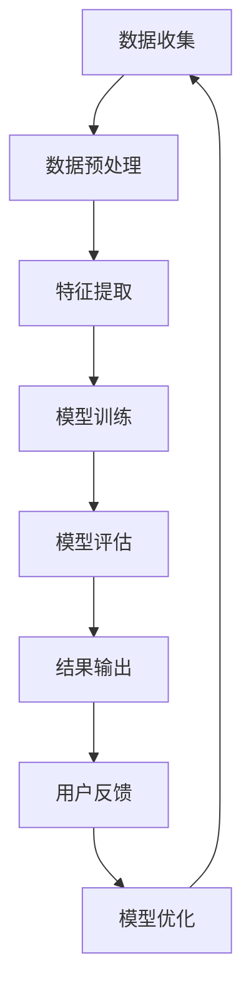
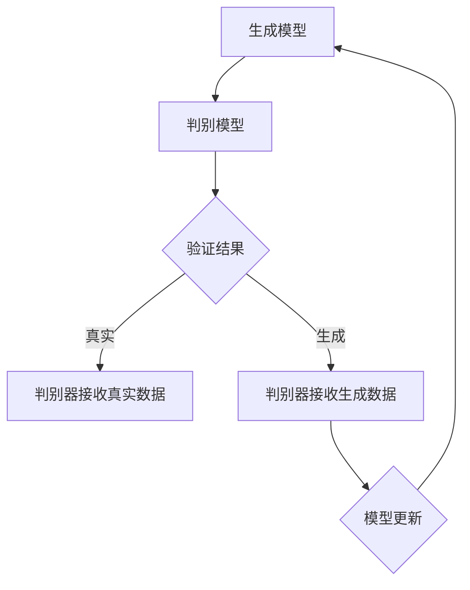

                 

### 第一部分: AI生成内容的真实性验证基础

#### 第1章: AI生成内容概述

##### 1.1 AI生成内容的定义与分类

**1.1.1 什么是AI生成内容**

AI生成内容（AI-Generated Content）是指利用人工智能技术，尤其是深度学习算法，自动生成文本、图像、音频、视频等数字内容的过程。这种技术通过学习大量已有数据，模仿其结构和风格，生成新的、原创的内容。

**1.1.2 AI生成内容的分类**

AI生成内容可以根据其生成的媒介和数据类型进行分类：

- **文本生成**：如文章、新闻报道、社交媒体帖子等。
- **图像生成**：如照片、艺术作品、设计图案等。
- **音频生成**：如音乐、声音特效、语音合成等。
- **视频生成**：如动画、视频特效、视频合成等。

**1.1.3 AI生成内容的应用场景**

AI生成内容在多个领域有着广泛的应用：

- **媒体与娱乐**：生成新闻报道、电影剧本、广告内容等。
- **艺术创作**：艺术家使用AI生成独特的艺术作品。
- **教育**：自动生成学习材料、教学视频等。
- **商业**：为企业生成产品描述、市场分析报告等。
- **医疗**：辅助医生生成病历记录、医学影像分析等。
- **法律与政府**：生成法律文件、政策报告等。

##### 1.2 AI生成内容的核心技术与算法

**1.2.1 生成对抗网络（GAN）**

生成对抗网络（GAN）是一种由两部分组成的神经网络架构：生成器（Generator）和判别器（Discriminator）。生成器的任务是生成与真实数据相似的内容，而判别器的任务是区分真实数据和生成数据。二者相互竞争，生成器不断优化生成质量，而判别器不断优化辨别能力。

**1.2.2 变分自编码器（VAE）**

变分自编码器（VAE）是一种基于概率模型的生成模型。它通过编码器（Encoder）将输入数据编码成一个潜在空间中的表示，然后通过解码器（Decoder）从潜在空间中生成输出数据。VAE能够在生成数据的同时保持数据的多样性。

**1.2.3 自注意力机制与Transformer模型**

自注意力机制（Self-Attention）是一种神经网络中的注意力机制，它允许模型在处理输入数据时考虑不同位置之间的关联性。Transformer模型是基于自注意力机制的序列到序列模型，广泛应用于自然语言处理任务，如机器翻译和文本生成。

##### 1.3 AI生成内容的发展与挑战

**1.3.1 AI生成内容的发展历程**

AI生成内容的研究始于20世纪80年代，早期以规则驱动的方法为主。随着深度学习技术的发展，特别是GAN和VAE的出现，AI生成内容进入了一个新的时代。

**1.3.2 AI生成内容的挑战与问题**

- **真实性验证**：如何确保生成内容是真实的、无误导性的。
- **数据隐私**：如何在生成过程中保护数据隐私。
- **版权与道德**：生成内容的版权归属和伦理问题。

**1.3.3 真实性验证的重要性**

真实性验证是AI生成内容中的关键问题。它不仅影响用户的信任度，还关系到法律和道德责任。因此，真实性验证在AI生成内容的发展中具有至关重要的地位。

---

在下一章中，我们将深入探讨真实性验证的基础概念与原理，帮助读者了解这一领域的基本概念和关键技术。

---

## 第2章: 真实性验证基础概念与原理

### 2.1 真实性验证的定义与目标

**2.1.1 什么是真实性验证**

真实性验证（Authenticity Verification）是指通过一系列方法和技术，确定AI生成内容是否是真实的、准确的，并且未被篡改或伪造的过程。它是确保AI生成内容质量和可信度的关键环节。

**2.1.2 真实性验证的目标**

真实性验证的主要目标包括：

- **确保内容真实性**：验证生成的内容是否与实际信息一致，避免虚假信息和误导。
- **识别篡改与伪造**：检测并识别AI生成内容中的篡改和伪造行为，防止恶意利用。
- **维护用户信任**：提高用户对AI生成内容的信任度，增强使用体验。

**2.1.3 真实性验证的关键因素**

真实性验证的成功取决于以下几个关键因素：

- **数据质量**：高质量的数据是进行准确验证的基础。
- **算法精度**：选择合适的算法和技术对生成内容进行评估和验证。
- **跨领域融合**：结合不同领域的知识和方法，提高验证的全面性和准确性。
- **用户反馈**：通过用户反馈不断优化验证方法和系统。

### 2.2 数据质量评估

**2.2.1 数据质量评估的定义与标准**

数据质量评估（Data Quality Assessment）是指对数据的完整性、准确性、一致性、及时性和可靠性等方面进行评估的过程。它是真实性验证的重要组成部分。

数据质量评估的标准包括：

- **完整性**：数据是否完整，是否有缺失值。
- **准确性**：数据是否准确，是否符合实际。
- **一致性**：数据在不同时间、不同来源之间是否一致。
- **及时性**：数据是否是最新的，能否及时反映实际情况。
- **可靠性**：数据来源是否可靠，数据收集和处理过程是否可信。

**2.2.2 数据质量评估的方法**

数据质量评估的方法包括：

- **统计分析**：使用统计学方法对数据进行评估，如标准差、中位数等。
- **可视化分析**：通过图表、地图等形式展示数据质量，便于直观判断。
- **专家评审**：邀请领域专家对数据质量进行评估和反馈。

**2.2.3 数据质量评估的工具**

常用的数据质量评估工具包括：

- **Elasticsearch**：用于大规模数据搜索和分析。
- **Pandas**：Python数据分析和操作库。
- **Tableau**：数据可视化工具。
- **Apache Spark**：大数据处理和分析引擎。

### 2.3 机器学习模型评估

**2.3.1 机器学习模型评估的基本原则**

机器学习模型评估（Machine Learning Model Evaluation）是指通过一系列指标和测试方法，评估机器学习模型性能的过程。基本原则包括：

- **评估指标**：选择合适的评估指标，如准确率、召回率、F1分数等。
- **交叉验证**：使用交叉验证方法，减少评估结果的偏差。
- **测试集**：使用独立的测试集进行评估，确保评估结果的客观性。
- **模型选择**：根据评估结果选择最优模型，并进行调优。

**2.3.2 模型评估指标**

常用的模型评估指标包括：

- **准确率（Accuracy）**：预测正确的样本数占总样本数的比例。
- **召回率（Recall）**：预测正确的正样本数占总正样本数的比例。
- **F1分数（F1 Score）**：准确率和召回率的加权平均值。
- **ROC曲线（Receiver Operating Characteristic Curve）**：评估分类模型的性能。

**2.3.3 模型评估方法**

模型评估的方法包括：

- **Holdout方法**：将数据集划分为训练集和测试集，分别训练和评估模型。
- **交叉验证方法**：使用k折交叉验证，提高评估结果的稳定性和可靠性。
- **模型对比**：比较不同模型的性能，选择最优模型。

在下一章中，我们将深入探讨真实性验证算法的原理与实现，帮助读者了解如何具体应用这些算法进行内容真实性验证。

---

## 第3章: 真实性验证算法原理与实现

### 3.1 真实性验证算法概述

**3.1.1 真实性验证算法的分类**

真实性验证算法可以根据其工作原理和应用领域进行分类，主要包括以下几种类型：

- **基于特征提取的方法**：通过提取生成内容中的特征，与已知真实内容的特征进行对比，判断其真实性。
- **基于对抗网络的方法**：利用生成对抗网络（GAN）等对抗性模型，通过生成器与判别器的互动，评估生成内容的质量和真实性。
- **基于深度学习的方法**：利用深度神经网络，尤其是卷积神经网络（CNN）和循环神经网络（RNN），对生成内容进行细粒度分析，判断其真实性。
- **基于推理的方法**：利用逻辑推理和知识图谱等技术，对生成内容进行语义分析和验证。

**3.1.2 真实性验证算法的关键技术**

真实性验证算法的关键技术包括：

- **特征提取**：通过卷积神经网络（CNN）或循环神经网络（RNN）提取生成内容的高层次特征。
- **对抗性训练**：利用生成对抗网络（GAN）等对抗性模型，通过生成器和判别器的对抗性训练，提高生成内容的质量和真实性。
- **语义分析**：利用自然语言处理（NLP）技术，对生成内容进行语义分析，判断其是否符合实际逻辑和常识。
- **知识图谱**：利用知识图谱技术，将生成内容与已知知识进行关联，判断其真实性。

**3.1.3 真实性验证算法的应用范围**

真实性验证算法可以应用于多个领域，包括：

- **文本真实性验证**：对生成文本进行真实性判断，如新闻报道、社交媒体帖子等。
- **图像真实性验证**：对生成图像进行真实性判断，如照片、艺术作品等。
- **音频真实性验证**：对生成音频进行真实性判断，如音乐、语音合成等。
- **视频真实性验证**：对生成视频进行真实性判断，如视频特效、视频合成等。

### 3.2 生成模型与判别模型

**3.2.1 生成模型的基本原理**

生成模型（Generator）是一种用于生成新数据的模型，其基本原理是通过学习输入数据的分布，生成新的、与输入数据相似的数据。生成模型的关键组成部分包括：

- **编码器（Encoder）**：将输入数据编码为一个潜在空间中的向量表示。
- **解码器（Decoder）**：将潜在空间中的向量表示解码为输出数据。

生成模型常见的技术包括：

- **生成对抗网络（GAN）**：由生成器和判别器组成，通过对抗性训练提高生成质量。
- **变分自编码器（VAE）**：通过概率模型生成数据，保持数据的多样性和真实性。

**3.2.2 判别模型的基本原理**

判别模型（Discriminator）是一种用于区分真实数据和生成数据的模型，其基本原理是学习如何将真实数据与生成数据区分开来。判别模型的关键组成部分包括：

- **输入层**：接收输入数据。
- **隐藏层**：对输入数据进行特征提取和变换。
- **输出层**：输出判别结果，通常是一个二分类输出。

判别模型常见的技术包括：

- **卷积神经网络（CNN）**：用于提取图像特征，区分真实图像与生成图像。
- **循环神经网络（RNN）**：用于提取文本特征，区分真实文本与生成文本。

**3.2.3 生成模型与判别模型的应用**

生成模型与判别模型常用于真实性验证的框架中，其具体应用流程如下：

1. **数据准备**：收集真实数据和生成数据，用于训练和测试。
2. **模型训练**：使用真实数据训练判别模型，使用真实数据和生成数据训练生成模型。
3. **模型评估**：使用测试数据评估模型性能，包括生成质量和真实性验证能力。
4. **应用部署**：将训练好的模型部署到实际应用场景中，对生成内容进行真实性验证。

### 3.3 真实性验证算法的实现

**3.3.1 数据预处理**

数据预处理是真实性验证算法实现的第一步，主要包括以下任务：

- **数据清洗**：去除数据中的噪声和异常值，确保数据质量。
- **数据归一化**：将数据缩放到相同的范围，便于模型训练。
- **数据增强**：通过旋转、缩放、裁剪等操作，增加数据多样性，提高模型泛化能力。

**3.3.2 模型训练与调优**

模型训练与调优是真实性验证算法实现的核心步骤，主要包括以下任务：

- **选择合适的模型架构**：根据应用场景选择合适的生成模型和判别模型。
- **训练模型**：使用真实数据和生成数据训练模型，通过迭代优化模型参数。
- **模型调优**：通过调整超参数和模型结构，提高模型性能和稳定性。

**3.3.3 模型部署与评估**

模型部署与评估是真实性验证算法实现的关键步骤，主要包括以下任务：

- **模型部署**：将训练好的模型部署到生产环境中，实现实时真实性验证。
- **模型评估**：使用测试数据评估模型性能，包括准确性、召回率、F1分数等指标。
- **持续优化**：通过用户反馈和模型评估结果，不断优化模型和算法，提高真实性验证能力。

在下一章中，我们将深入探讨真实性验证面临的挑战和解决方案，帮助读者了解如何克服这些挑战，提高真实性验证的准确性和可靠性。

---

## 第4章: 真实性验证的挑战与解决方案

### 4.1 真实性验证的挑战

真实性验证在AI生成内容领域面临着多种挑战，这些挑战影响到验证算法的性能和可靠性。以下是一些主要挑战：

**4.1.1 数据质量问题的挑战**

- **数据缺失**：真实数据中可能存在缺失值，这会影响验证算法的准确性。
- **数据噪声**：数据中可能存在噪声，如错误的标记、异常值等，这些噪声会干扰验证过程。
- **数据不平衡**：生成数据与真实数据之间的比例可能不平衡，这会导致模型偏向于某一类数据。

**4.1.2 模型过拟合与欠拟合的挑战**

- **过拟合**：当模型在训练数据上表现良好，但在未知数据上表现较差时，说明模型过拟合。过拟合会导致模型无法泛化到新的数据集。
- **欠拟合**：当模型在训练数据和未知数据上表现都较差时，说明模型欠拟合。欠拟合表明模型过于简单，无法捕捉到数据的复杂特性。

**4.1.3 模型泛化能力的挑战**

- **特定领域泛化**：模型可能在一个特定领域内表现良好，但在其他领域内无法泛化。这要求模型具有更强的跨领域泛化能力。
- **动态环境适应**：随着AI生成技术的不断发展，模型需要能够适应新的生成算法和生成内容，保持其验证能力。

### 4.2 解决方案与最佳实践

为了克服上述挑战，真实性验证领域提出了一系列解决方案和最佳实践：

**4.2.1 提高数据质量的方法**

- **数据清洗**：使用数据清洗技术，如填补缺失值、去除噪声和异常值，提高数据质量。
- **数据增强**：通过数据增强技术，如旋转、缩放、裁剪等，增加数据多样性，提高模型的泛化能力。
- **数据集扩展**：使用更多的数据集进行训练，特别是包含各种场景和极端情况的数据集，以增强模型的泛化能力。

**4.2.2 防止模型过拟合与欠拟合的策略**

- **正则化**：使用正则化技术，如L1和L2正则化，减少模型参数的权重，防止过拟合。
- **交叉验证**：使用交叉验证技术，将数据集划分为多个子集，多次训练和验证，提高模型的泛化能力。
- **集成学习**：使用集成学习方法，如随机森林、梯度提升机等，结合多个模型的优点，提高模型性能。

**4.2.3 提高模型泛化能力的技巧**

- **迁移学习**：利用预训练模型，将已有领域的知识迁移到新的领域，提高模型的泛化能力。
- **元学习**：通过元学习技术，学习如何学习，提高模型在不同任务上的泛化能力。
- **多任务学习**：同时训练多个相关任务，共享信息，提高模型在不同任务上的泛化能力。

通过上述解决方案和最佳实践，真实性验证算法可以更好地应对挑战，提高验证的准确性和可靠性，确保AI生成内容的真实性。

在下一章中，我们将通过实际应用案例，展示真实性验证算法在不同场景下的应用效果，帮助读者更深入地理解这一领域。

---

## 第5章: 真实性验证应用案例

### 5.1 社交媒体内容真实性验证

**5.1.1 社交媒体内容的真实性问题**

社交媒体平台上的内容真实性一直是公众关注的焦点。由于社交媒体内容的生成和传播速度快，且用户数量庞大，虚假信息、误导性信息和深度伪造内容的传播对用户信任和社会稳定构成了严重威胁。因此，社交媒体平台需要强大的真实性验证系统来确保内容的真实性。

**5.1.2 社交媒体内容真实性验证的方法**

真实性验证方法主要包括以下几种：

- **基于特征提取的方法**：通过提取文本特征，如词频、词义、语法结构等，与已知的真实内容进行对比，判断其真实性。
- **基于对抗网络的方法**：利用生成对抗网络（GAN）等对抗性模型，通过生成器和判别器的互动，评估生成内容的质量和真实性。
- **基于深度学习的方法**：使用卷积神经网络（CNN）和循环神经网络（RNN）等深度学习模型，对生成内容进行细粒度分析，判断其真实性。
- **基于语义分析的方法**：利用自然语言处理（NLP）技术，对生成内容进行语义分析，判断其是否符合实际逻辑和常识。

**5.1.3 案例分析：某知名社交媒体平台的内容真实性验证实践**

某知名社交媒体平台采用了以下方法进行内容真实性验证：

1. **数据收集与预处理**：平台收集了大量用户生成的内容，并对这些内容进行预处理，如去除噪声、填补缺失值等。
2. **特征提取**：使用词嵌入技术提取文本特征，如Word2Vec、GloVe等，将这些特征作为输入，训练深度学习模型。
3. **模型训练与评估**：使用真实内容和生成内容训练深度学习模型，如卷积神经网络（CNN）和循环神经网络（RNN），评估模型性能，并进行调优。
4. **实时验证**：将训练好的模型部署到生产环境中，对用户生成的内容进行实时验证，识别并标记虚假信息。
5. **用户反馈**：平台通过用户反馈不断优化验证算法，提高验证的准确性和可靠性。

### 5.2 深度伪造内容真实性验证

**5.2.1 深度伪造内容的危害**

深度伪造内容（Deepfake）是指使用深度学习技术合成的逼真的音频、视频和图像内容。这些内容可能被恶意使用，如伪造名人言论、制作虚假新闻、侵犯个人隐私等，对社会造成了严重危害。

**5.2.2 深度伪造内容真实性验证的方法**

深度伪造内容真实性验证方法主要包括以下几种：

- **基于特征分析的方法**：通过分析生成内容中的噪声、运动轨迹、纹理特征等，判断其是否为深度伪造。
- **基于对抗网络的方法**：利用生成对抗网络（GAN）等对抗性模型，通过生成器和判别器的对抗性训练，提高对深度伪造内容的识别能力。
- **基于视觉检测的方法**：使用计算机视觉技术，如卷积神经网络（CNN），检测深度伪造内容中的异常特征。
- **基于知识图谱的方法**：利用知识图谱技术，将生成内容与已知信息进行关联，判断其真实性。

**5.2.3 案例分析：某知名视频平台对深度伪造内容的检测与处理**

某知名视频平台采用了以下方法对深度伪造内容进行检测与处理：

1. **数据收集与预处理**：平台收集了大量深度伪造内容和真实内容，并对这些内容进行预处理，如归一化、增强等。
2. **特征提取**：使用卷积神经网络（CNN）提取视频内容中的特征，如纹理、运动轨迹等。
3. **模型训练与评估**：使用真实内容和深度伪造内容训练深度学习模型，如卷积神经网络（CNN）和生成对抗网络（GAN），评估模型性能，并进行调优。
4. **实时检测**：将训练好的模型部署到生产环境中，对上传的视频内容进行实时检测，识别并标记深度伪造内容。
5. **用户反馈与优化**：平台通过用户反馈不断优化检测算法，提高检测的准确性和效率。

### 5.3 文本生成内容真实性验证

**5.3.1 文本生成内容的应用场景**

文本生成内容广泛应用于自然语言处理、内容营销、自动化写作等领域。然而，文本生成内容的真实性成为一个关键问题，尤其是在新闻报道、法律文件、商业报告等领域，真实性的保障至关重要。

**5.3.2 文本生成内容真实性验证的方法**

文本生成内容真实性验证方法主要包括以下几种：

- **基于语法分析的方法**：通过分析文本中的语法结构、句法规则等，判断其是否符合语言习惯和逻辑。
- **基于语义分析的方法**：利用自然语言处理（NLP）技术，对文本进行语义分析，判断其是否符合实际逻辑和常识。
- **基于对比学习的方法**：通过对比生成文本与真实文本的相似度，判断其真实性。
- **基于对抗网络的方法**：利用生成对抗网络（GAN）等对抗性模型，通过生成器和判别器的对抗性训练，提高对生成文本的识别能力。

**5.3.3 案例分析：某知名内容生成平台对生成文本内容的真实性验证**

某知名内容生成平台采用了以下方法对生成文本内容进行真实性验证：

1. **数据收集与预处理**：平台收集了大量真实文本和生成文本，并对这些文本进行预处理，如去除停用词、标点符号等。
2. **特征提取**：使用词嵌入技术提取文本特征，如Word2Vec、GloVe等，将这些特征作为输入，训练深度学习模型。
3. **模型训练与评估**：使用真实文本和生成文本训练深度学习模型，如循环神经网络（RNN）和生成对抗网络（GAN），评估模型性能，并进行调优。
4. **实时验证**：将训练好的模型部署到生产环境中，对用户生成的文本内容进行实时验证，识别并标记虚假内容。
5. **用户反馈与优化**：平台通过用户反馈不断优化验证算法，提高验证的准确性和可靠性。

通过上述案例，我们可以看到真实性验证在社交媒体内容、深度伪造内容和文本生成内容等不同领域的应用效果。在下一章中，我们将探讨真实性验证技术的未来发展，以及面临的伦理和社会影响。

---

## 第6章: 未来发展趋势与展望

### 6.1 真实性验证技术的未来发展

随着AI生成技术的不断进步，真实性验证技术也迎来了新的发展机遇和挑战。以下是未来真实性验证技术的一些发展趋势：

**6.1.1 新的算法与模型**

未来真实性验证技术将涌现出更多基于深度学习和对抗网络的算法与模型，如强化学习、图神经网络等。这些新型算法将能够更有效地应对复杂的生成内容，提高验证的准确性和效率。

**6.1.2 跨学科融合趋势**

真实性验证技术将与多个学科领域融合，如计算机视觉、自然语言处理、认知科学等。通过跨学科的协作，可以开发出更加全面和精确的验证方法。

**6.1.3 实时性与自动化**

未来真实性验证技术将向实时性和自动化方向发展。通过集成先进的硬件和软件技术，可以实现快速、高效的真实性验证，确保AI生成内容在传播过程中的实时监测和纠正。

### 6.2 社会与伦理影响

真实性验证技术的发展不仅带来了技术上的变革，也引发了社会和伦理上的讨论。以下是真实性验证技术可能带来的社会和伦理影响：

**6.2.1 真实性验证技术的伦理问题**

- **隐私保护**：在真实性验证过程中，如何保护用户的隐私是一个重要伦理问题。
- **偏见与歧视**：真实性验证算法可能会引入偏见和歧视，如何消除这些偏见是伦理学上的挑战。
- **责任归属**：当真实性验证失败时，如何界定责任归属是一个复杂的法律和伦理问题。

**6.2.2 真实性验证技术的法律与政策挑战**

- **法律框架**：随着真实性验证技术的发展，现有的法律框架可能无法完全覆盖新出现的问题。
- **政策制定**：政府需要制定相应的政策和规范，确保真实性验证技术的合法合规使用。

**6.2.3 社会伦理的思考与应对策略**

社会伦理的思考与应对策略包括：

- **透明性与可解释性**：提高真实性验证算法的透明性和可解释性，使用户能够理解验证过程和结果。
- **多方协作**：政府、企业和学术界等多方协作，共同制定和推动真实性验证技术的发展和应用。
- **公众教育**：通过公众教育，提高社会对真实性验证技术的认知和理解，减少伦理和隐私风险。

### 6.3 未来应用前景

真实性验证技术在多个领域具有广阔的应用前景：

**6.3.1 各领域的应用前景**

- **媒体与新闻**：真实性验证技术可以用于检测和纠正虚假新闻、误导性信息等，确保媒体内容的真实性。
- **金融与保险**：真实性验证技术可以用于检测和防止金融欺诈、保险欺诈等行为。
- **医疗与健康**：真实性验证技术可以用于确保医疗数据的真实性和准确性，提高医疗服务的质量。
- **法律与司法**：真实性验证技术可以用于验证证据的真实性和合法性，提高司法公正性。

**6.3.2 真实性验证技术在新兴领域的发展**

- **区块链**：真实性验证技术可以与区块链技术结合，确保区块链数据的一致性和真实性。
- **物联网**：在物联网领域，真实性验证技术可以用于确保传感器数据的真实性和可靠性。
- **智能交通**：真实性验证技术可以用于确保交通监控和车辆数据的安全性和真实性。

**6.3.3 全球合作与产业生态**

在全球范围内，真实性验证技术的合作与产业生态正在逐步形成。各国政府、企业和研究机构通过合作，共同推动真实性验证技术的发展和应用。同时，产业生态的构建将有助于真实性验证技术的商业化进程，推动其在各行业的广泛应用。

通过未来发展趋势的探讨，我们可以看到真实性验证技术在技术、社会和伦理等多个方面的巨大潜力。随着技术的不断进步和社会的广泛参与，真实性验证技术将在未来发挥更加重要的作用，为AI生成内容的真实性和可信度提供强有力的保障。

---

## 附录A: 真实性验证相关资源与工具

### A.1 开源真实性验证工具

以下是一些常用的开源真实性验证工具，这些工具提供了丰富的功能和强大的性能，适用于各种真实性问题：

- **PyTorch**：一个流行的深度学习框架，支持生成对抗网络（GAN）等真实性验证算法。
- **TensorFlow**：另一个广泛使用的深度学习框架，提供丰富的API和工具，用于构建和训练真实性验证模型。
- **OpenCV**：一个强大的计算机视觉库，支持图像和视频真实性验证。
- **Scikit-learn**：一个开源的机器学习库，提供多种数据分析和建模工具，用于特征提取和真实性验证。

### A.2 真实性验证数据库

真实性验证数据库是进行研究和发展的重要资源，以下是一些常用的真实性验证数据库：

- **ImagesNet**：一个大规模的图像数据库，包含大量的真实图像和生成图像，适用于图像真实性验证研究。
- **CommonCrawl**：一个大规模的文本数据库，包含大量网络文本，用于文本真实性验证。
- **FaceForensics++**：一个包含多种深度伪造视频的数据库，用于视频真实性验证。
- **Flickr30k**：一个包含大量图像和描述的数据库，用于图像真实性验证。

### A.3 学术论文与会议

真实性验证技术在学术领域有着广泛的关注，以下是一些重要的学术论文和会议：

- **NeurIPS**：年度神经信息处理系统会议，是深度学习和人工智能领域的重要会议，经常发布关于真实性验证的最新研究成果。
- **ICLR**：国际学习表示会议，专注于机器学习和深度学习的前沿研究，涉及真实性验证等领域。
- **CVPR**：计算机视觉与模式识别会议，涵盖了计算机视觉领域的最新进展，包括真实性验证技术。
- **WWW**：国际世界 Wide Web 会议，关注互联网和相关技术的最新发展，真实性验证在媒体和新闻领域有重要应用。

通过这些资源与工具，研究人员和开发者可以更好地开展真实性验证技术的研究和应用，为AI生成内容的真实性和可信度提供强有力的支持。

---

## 附录B: 真实性验证算法伪代码

### B.1 生成模型伪代码

```python
# 生成模型：变分自编码器（VAE）

# 编码器（Encoder）
def encoder(x):
    z_mean = FC(x, hidden_size)  # 隐藏层大小为hidden_size
    z_log_var = FC(x, hidden_size)
    z = z_mean + log_sigma * eps  # eps为高斯噪声
    return z, z_mean, z_log_var

# 解码器（Decoder）
def decoder(z):
    x_hat = FC(z, hidden_size, output_size)  # 输出层大小为output_size
    return x_hat

# 主函数
def VAE(x):
    z, z_mean, z_log_var = encoder(x)
    x_hat = decoder(z)
    return x_hat, z_mean, z_log_var
```

### B.2 判别模型伪代码

```python
# 判别模型：卷积神经网络（CNN）

# 输入层
inputs = Input(shape=(image_size, image_size, 3))

# 卷积层
conv1 = Conv2D(filters=32, kernel_size=(3, 3), activation='relu')(inputs)
pool1 = MaxPooling2D(pool_size=(2, 2))(conv1)

# 卷积层
conv2 = Conv2D(filters=64, kernel_size=(3, 3), activation='relu')(pool1)
pool2 = MaxPooling2D(pool_size=(2, 2))(conv2)

# 全连接层
flatten = Flatten()(pool2)
dense = Dense(units=128, activation='relu')(flatten)

# 输出层
outputs = Dense(units=1, activation='sigmoid')(dense)

# 模型定义
model = Model(inputs=inputs, outputs=outputs)
```

### B.3 真实性验证流程伪代码

```python
# 真实性验证流程

# 数据预处理
x_real, x_fake = preprocess_data()

# 训练生成模型与判别模型
model_encoder, model_decoder = train_VAE(x_real)
model_discriminator = train_CNN(x_real, x_fake)

# 验证生成内容
def verify_content(x_generated):
    z_generated = model_encoder.predict(x_generated)
    x_hat_generated = model_decoder.predict(z_generated)
    return model_discriminator.predict(x_hat_generated)

# 模型评估
accuracy = evaluate_performance(verify_content)
print("真实性验证准确率：", accuracy)
```

通过上述伪代码，我们可以实现一个基本的真实性验证系统，包括数据预处理、生成模型与判别模型的训练，以及生成内容真实性验证的过程。这些伪代码为实际开发提供了清晰的指导，同时也展示了真实性验证算法的核心实现。

---

## 附录C: Mermaid 流程图示例

### C.1 真实性验证流程图



### C.2 生成模型与判别模型关系图



通过上述Mermaid流程图，我们可以直观地理解真实性验证的整体流程以及生成模型与判别模型之间的相互作用。这些流程图有助于我们更好地设计和实现真实性验证系统。

