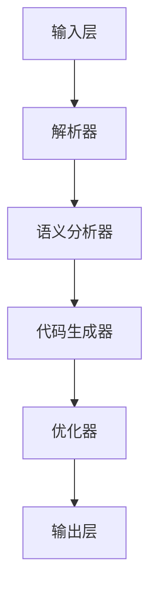
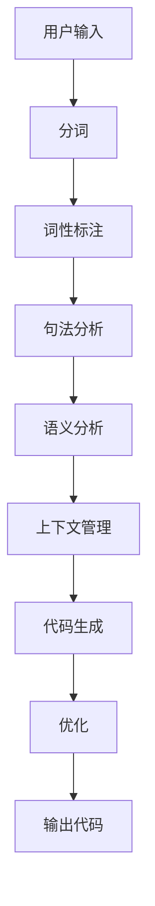
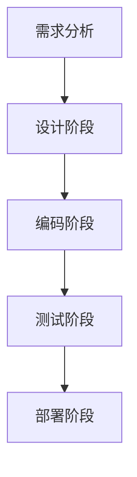
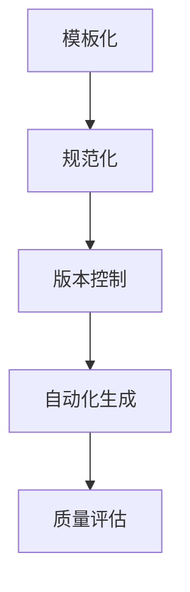
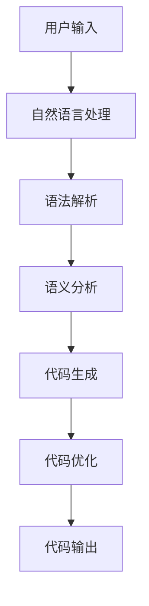
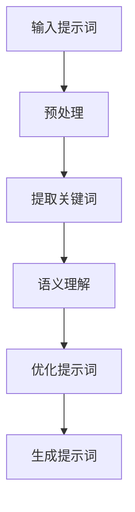
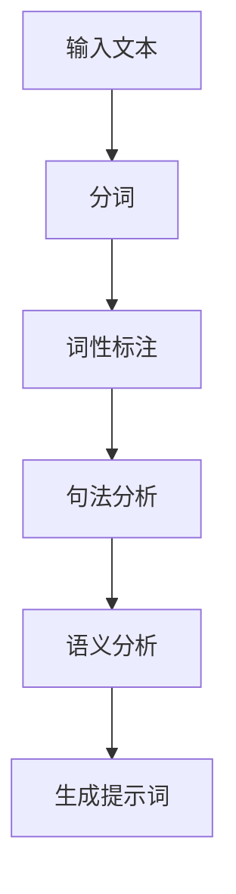

                 

### 引言

在人工智能（AI）飞速发展的今天，编程语言正经历一场深刻的变革。本文旨在探讨一种新兴的AI编程语言——提示词编程语言，及其在编程领域的革新与变革。首先，我们将了解AI编程语言的背景和发展历程，接着深入探讨提示词在AI编程语言中的应用和核心概念，然后详细解析AI编程语言的架构设计和关键算法。在此基础上，我们将探讨AI编程语言的工程实践，并展望其未来发展趋势和社会影响。通过这一系列的探讨，我们将全面理解AI编程语言的内涵和外延，以及它如何改变我们的编程方式和思维方式。

关键词：AI编程语言，提示词，编程变革，架构设计，算法，工程实践，未来展望

摘要：本文从AI编程语言的背景和意义出发，深入分析了提示词在AI编程语言中的应用，详细解析了AI编程语言的架构设计和关键算法，并探讨了其在工程实践中的运用。通过本文的探讨，我们旨在为读者展现AI编程语言的革新与变革，以及它对未来编程领域的影响。

### 第一部分：AI编程语言概述

#### 第1章：AI编程语言的背景与意义

##### 1.1 AI编程语言的历史与发展

人工智能的发展历史可以追溯到20世纪50年代。从最初的符号逻辑和规则推理，到后来的机器学习、深度学习，人工智能技术经历了多次重大突破和变革。然而，传统的编程语言在面对日益复杂的AI任务时，逐渐暴露出其局限性。例如，Python、Java等通用编程语言虽然在计算和数据处理方面表现出色，但在处理自然语言、图像识别、自动驾驶等任务时，却显得力不从心。这促使研究人员开始探索新的编程语言，以更好地支持AI应用的开发。

AI编程语言的起源可以追溯到20世纪80年代，当时科学家们开始尝试开发专门用于AI任务的编程语言，如Lisp和Prolog。这些语言在逻辑推理、知识表示和自动推理等方面具有天然优势，但同时也存在一些问题，如运行效率低、生态不完善等。随着计算机硬件的进步和算法的创新，AI编程语言逐渐演变，逐渐形成了今天的多样化格局。

##### 1.2 提示词在AI编程语言中的应用

提示词（Prompts）是AI编程语言中的一个核心概念，它用于指导AI模型执行特定任务。在传统的编程语言中，程序员需要手动编写大量的代码来实现复杂的功能，而在AI编程语言中，提示词则可以大大简化这一过程。通过提供简短的提示词，AI模型可以自动生成相应的代码，从而实现自动化编程。

提示词在AI编程语言中的应用主要体现在以下几个方面：

1. **代码生成**：提示词可以指导AI模型生成特定的代码片段，如函数、类、模块等。这种自动代码生成技术不仅提高了开发效率，还减少了人为错误的可能性。

2. **自然语言处理**：提示词可以用于自然语言处理任务，如文本分类、情感分析、命名实体识别等。AI模型通过分析提示词，可以自动理解用户的意图，并生成相应的处理结果。

3. **图像识别**：提示词可以指导AI模型进行图像识别任务，如物体检测、人脸识别等。通过提供包含关键信息的提示词，AI模型可以更准确地识别图像中的内容。

4. **语音识别**：提示词可以用于语音识别任务，如语音转文字、语音指令识别等。通过分析提示词，AI模型可以更好地理解用户的语音指令，并执行相应的操作。

##### 1.3 AI编程语言的优势与挑战

AI编程语言在许多方面都表现出显著的优势，但也面临着一些挑战。

1. **优势**：

- **自动化编程**：AI编程语言通过提示词实现自动化编程，大大提高了开发效率，减少了人为错误。

- **自然语言交互**：AI编程语言支持自然语言交互，使得编程过程更加直观和易用。

- **多领域应用**：AI编程语言可以应用于多个领域，如自然语言处理、图像识别、语音识别等，具有广泛的应用前景。

2. **挑战**：

- **学习曲线**：AI编程语言相对于传统编程语言，需要更高的学习成本，特别是对于新手来说。

- **性能问题**：尽管AI编程语言在许多方面表现出优势，但在某些特定场景下，其性能可能不如传统编程语言。

- **安全性问题**：AI编程语言可能存在一些安全漏洞，如模型被攻击、数据泄露等。

##### 1.4 AI编程语言的未来发展趋势

随着人工智能技术的不断进步，AI编程语言的发展也呈现出一些新的趋势：

1. **智能化提示词**：未来的AI编程语言将更加智能化，能够根据上下文和任务需求，自动生成合适的提示词。

2. **跨平台兼容**：AI编程语言将实现更好的跨平台兼容性，支持多种操作系统和硬件平台。

3. **开源生态**：随着开源社区的积极参与，AI编程语言将建立更加完善的生态体系，为开发者提供丰富的工具和资源。

4. **教育普及**：AI编程语言将在教育领域得到更广泛的应用，成为编程教育的核心内容。

通过上述分析，我们可以看到AI编程语言在编程领域的革新与变革。它不仅改变了传统的编程方式，还为未来的编程发展带来了新的机遇和挑战。在接下来的章节中，我们将进一步深入探讨AI编程语言的核心概念、架构设计、关键算法以及工程实践。

### 第2章：AI编程语言的核心概念

#### 2.1 提示词的定义与分类

在AI编程语言中，提示词（Prompts）是一个至关重要的概念。提示词可以看作是程序员与AI模型之间的“桥梁”，通过简短的提示词，AI模型可以自动理解并执行相应的任务。那么，什么是提示词？它有哪些类型？让我们一一探讨。

**提示词的定义**：

提示词是一种简短的文本或指令，用于指导AI模型执行特定任务。它可以包含关键信息、任务描述、上下文数据等，是AI模型进行推理和决策的重要依据。

**提示词的分类**：

根据用途和功能，提示词可以分为以下几类：

1. **功能提示词**：这类提示词用于指导AI模型执行特定功能，如代码生成、文本分类、图像识别等。例如，“请生成一个Python函数，用于计算两个数的和”。

2. **上下文提示词**：这类提示词用于提供任务背景和上下文信息，帮助AI模型更好地理解任务需求。例如，“假设我们正在开发一个在线购物网站，请生成一个用于用户注册的表单”。

3. **问题提示词**：这类提示词用于引导AI模型回答特定问题，如自然语言处理中的问答系统。例如，“你最喜欢的编程语言是什么？”

4. **指令提示词**：这类提示词用于给出具体的操作指令，如语音识别系统中的语音指令。例如，“打开浏览器”。

**示例**：

以下是一个功能提示词的示例：

```plaintext
请生成一个Python函数，用于计算两个数的和。
```

以下是一个上下文提示词的示例：

```plaintext
假设我们正在开发一个在线购物网站，请生成一个用于用户注册的表单。
```

以下是一个问题提示词的示例：

```plaintext
你最喜欢的编程语言是什么？
```

以下是一个指令提示词的示例：

```plaintext
打开浏览器。
```

通过这些示例，我们可以看到提示词在AI编程语言中的应用场景。在下一节中，我们将探讨提示词的生成与优化方法。

#### 2.2 提示词的生成与优化

提示词的生成与优化是AI编程语言的核心问题。生成高质量的提示词，可以确保AI模型正确理解任务需求，从而提高开发效率和代码质量。那么，如何生成和优化提示词呢？以下是一些常见的方法和策略。

**提示词生成方法**：

1. **基于规则的方法**：这种方法使用预定义的规则来生成提示词。例如，根据任务的类型和需求，生成相应的功能提示词或上下文提示词。这种方法简单易行，但灵活性较低。

2. **基于数据的方法**：这种方法通过分析大量已生成的提示词和对应的任务结果，学习生成高质量提示词的规律。例如，使用机器学习算法，根据历史数据生成提示词。这种方法具有较高的灵活性和适应性。

3. **基于模板的方法**：这种方法使用预定义的模板来生成提示词。模板中包含关键信息和任务描述，通过填充模板中的变量，生成具体的提示词。这种方法在生成大量类似任务时表现较好。

**提示词优化策略**：

1. **语义理解**：优化提示词的关键在于提高其语义清晰度。可以通过添加背景信息、明确任务目标等方式，使提示词更加直观易懂。

2. **信息完整性**：提示词应包含足够的信息，以使AI模型能够正确理解和执行任务。可以通过分析任务需求，确保提示词涵盖所有关键信息。

3. **简洁性**：提示词应简洁明了，避免冗余和复杂的句子结构。简洁的提示词有助于提高AI模型的理解效率。

4. **可扩展性**：提示词应具有一定的可扩展性，以适应不同的任务场景。可以通过设计通用的提示词模板，实现灵活的提示词生成。

**示例**：

以下是一个基于规则生成的提示词示例：

```plaintext
功能提示词：请生成一个Python函数，用于计算两个数的和。
上下文提示词：假设我们正在开发一个在线购物网站，请生成一个用于用户注册的表单。
问题提示词：你最喜欢的编程语言是什么？
指令提示词：打开浏览器。
```

以下是一个优化后的提示词示例：

```plaintext
功能提示词：编写一个Python函数，实现两个整数的加法运算。
上下文提示词：在线购物网站需要用户注册功能，请生成相应的表单代码。
问题提示词：请推荐一个你熟练掌握的编程语言。
指令提示词：打开默认浏览器，并导航至www.example.com。
```

通过优化提示词，我们可以确保AI模型更好地理解任务需求，从而提高开发效率和代码质量。在下一节中，我们将探讨提示词在AI编程语言中的作用和重要性。

#### 2.3 提示词在AI编程语言中的作用

提示词在AI编程语言中起着至关重要的作用。它是连接程序员与AI模型之间的桥梁，通过提供明确的任务指令和上下文信息，帮助AI模型理解和执行复杂的编程任务。以下是提示词在AI编程语言中的作用和重要性：

1. **任务指令**：提示词为AI模型提供了明确的任务指令，指导其执行特定操作。例如，在代码生成任务中，提示词可以指示AI模型生成一个函数、一个类或一个模块。这种明确的指令有助于确保AI模型按照预期执行任务，提高开发效率。

2. **上下文信息**：提示词不仅包含任务指令，还提供了上下文信息，帮助AI模型更好地理解任务需求。例如，在开发一个在线购物网站时，提示词可以提供关于用户注册、购物流程、支付系统等具体细节的信息。这些上下文信息有助于AI模型生成与实际需求更贴近的代码。

3. **问题解答**：在AI编程语言中，提示词还可以用于问答系统，帮助AI模型回答程序员的问题。例如，当程序员不确定如何实现某个功能时，可以通过提示词询问AI模型，获取相应的解决方案。这种问答机制不仅提高了开发效率，还有助于减少人为错误。

4. **代码优化**：提示词还可以用于指导AI模型对现有代码进行优化。通过分析提示词，AI模型可以识别出代码中的潜在问题，并提出优化建议。例如，在性能优化任务中，提示词可以指示AI模型识别出性能瓶颈，并生成相应的优化代码。

5. **自动化测试**：提示词可以用于生成自动化测试用例，帮助开发者验证代码的正确性。通过提供包含预期输入和输出信息的提示词，AI模型可以自动生成测试用例，并执行相应的测试。这种方法不仅提高了测试效率，还有助于发现潜在的问题。

6. **交互体验**：提示词使得程序员与AI模型之间的交互更加自然和直观。通过使用自然语言进行交互，程序员可以更轻松地表达需求，而AI模型则可以更好地理解并执行这些需求。这种互动体验有助于提高开发效率，减少学习成本。

总之，提示词在AI编程语言中扮演着关键角色。它不仅为AI模型提供了明确的任务指令和上下文信息，还有助于优化代码、自动化测试和提升交互体验。随着AI技术的不断发展，提示词的作用将变得更加重要，为编程领域带来更多的变革和创新。

#### 2.4 提示词与自然语言处理的关系

提示词在AI编程语言中的应用，与自然语言处理（NLP）技术密切相关。自然语言处理是人工智能领域的一个重要分支，旨在让计算机理解和处理人类自然语言。在AI编程语言中，提示词作为自然语言输入，需要通过NLP技术进行处理和理解，以便AI模型能够正确执行任务。

**自然语言处理的任务**：

自然语言处理主要包括以下几个任务：

1. **分词**：将一段文本分解为词语或词组，以便进行后续处理。
2. **词性标注**：为每个词语标注其词性（如名词、动词、形容词等），以便理解词语的语法功能。
3. **句法分析**：分析句子的结构，理解句子成分之间的关系。
4. **语义分析**：理解句子的语义含义，包括指称、谓词、事件等。
5. **情感分析**：分析文本中的情感倾向，如积极、消极、中立等。

**提示词处理流程**：

当提示词输入到AI编程语言中时，首先需要经过NLP技术进行处理，以便AI模型能够理解其含义。以下是提示词处理的基本流程：

1. **分词**：将提示词分解为词语或词组，以便进行后续分析。
2. **词性标注**：为每个词语标注词性，以便理解词语的语法功能。
3. **句法分析**：分析提示词的句法结构，理解句子成分之间的关系。
4. **语义分析**：理解提示词的语义含义，提取关键信息。
5. **上下文分析**：根据上下文信息，调整提示词的含义和结构，确保其与任务需求相符。
6. **任务理解**：将处理后的提示词输入到AI模型中，使其能够理解任务需求。

**提示词与NLP技术的融合**：

提示词与NLP技术的融合，使得AI编程语言能够更好地理解自然语言输入，从而提高编程效率和质量。以下是一些融合方法：

1. **预训练模型**：使用预训练的NLP模型，如BERT、GPT等，对提示词进行预处理，提取关键信息。
2. **上下文自适应**：根据任务上下文，动态调整提示词的含义和结构，使其更符合实际需求。
3. **多模态处理**：结合文本、图像、语音等多种模态信息，提高提示词处理的准确性和效率。
4. **交互式优化**：在编程过程中，实时收集用户反馈，动态优化提示词和代码生成结果。

**示例**：

假设一个程序员需要生成一个Python函数，用于计算两个数的和。以下是提示词的处理流程：

1. **分词**：将提示词“请生成一个Python函数，用于计算两个数的和”分解为词语：“请”、“生成”、“一个”、“Python”、“函数”、“用于”、“计算”、“两个”、“数”、“和”。
2. **词性标注**：为每个词语标注词性，如“请”（动词）、“生成”（动词）、“一个”（数词）、“Python”（名词）、“函数”（名词）、“用于”（介词）、“计算”（动词）、“两个”（数词）、“数”（名词）、“和”（连词）。
3. **句法分析**：分析句子的结构，提取主语、谓语、宾语等成分。例如，主语为“一个Python函数”，谓语为“用于计算两个数的和”。
4. **语义分析**：理解句子的语义含义，提取关键信息。例如，任务类型为“生成Python函数”，任务内容为“计算两个数的和”。
5. **上下文分析**：根据上下文信息，确保提示词的含义与任务需求相符。
6. **任务理解**：将处理后的提示词输入到AI模型中，生成相应的Python函数代码。

通过自然语言处理技术的支持，AI编程语言能够更好地理解自然语言输入，从而实现自动化编程，提高开发效率和质量。在下一节中，我们将探讨AI编程语言的基本架构设计。

### 第3章：AI编程语言的架构设计

在深入了解AI编程语言的核心概念之后，我们需要进一步探讨其架构设计，这是实现AI编程语言功能的关键。AI编程语言的架构设计需要综合考虑性能、可扩展性和易用性等因素，以确保其在实际应用中的高效运行。下面，我们将从基本架构、提示词引擎设计、代码生成与优化关系以及开发环境搭建等方面进行详细讲解。

#### 3.1 AI编程语言的基本架构

AI编程语言的基本架构通常包括以下几个关键组件：

1. **输入层**：输入层负责接收用户的自然语言输入，即提示词。这一层通常使用自然语言处理技术（如分词、词性标注、句法分析和语义分析）对提示词进行处理，提取关键信息。

2. **解析器**：解析器是AI编程语言的核心组件，负责将处理后的提示词转换为内部表示。解析器通常包括词法分析和语法分析两个阶段。词法分析将输入的提示词分解为词语或词组，而语法分析则根据预定义的语法规则，构建抽象语法树（AST）。

3. **语义分析器**：语义分析器负责对抽象语法树进行语义分析，确定变量绑定、类型检查等语义信息。这一阶段通常涉及到上下文分析，以确保代码生成符合任务需求。

4. **代码生成器**：代码生成器根据抽象语法树和语义分析结果，生成对应的代码。生成器可以基于模板或直接生成代码，以适应不同的应用场景。

5. **优化器**：优化器对生成的代码进行优化，以提高性能和可读性。优化器可以执行各种代码优化技术，如循环展开、常量折叠、死代码消除等。

6. **输出层**：输出层将优化后的代码输出给开发者或执行环境。输出层可以包括代码格式化、错误报告等功能。

**基本架构图**：



#### 3.2 提示词引擎的设计与实现

提示词引擎是AI编程语言的核心，负责处理用户输入的提示词并生成相应的代码。提示词引擎的设计与实现涉及以下几个关键方面：

1. **自然语言处理**：提示词引擎需要集成先进的NLP技术，如分词、词性标注、句法分析和语义分析，以处理复杂的自然语言输入。

2. **上下文管理**：提示词引擎需要能够处理上下文信息，确保生成的代码与任务需求一致。上下文管理可以基于历史输入、任务上下文或动态调整策略。

3. **语法分析**：提示词引擎需要支持多种语法规则，以生成符合编程语言规范的代码。这通常需要开发自定义的语法分析器或使用现有的语法分析库。

4. **代码生成策略**：提示词引擎可以采用不同的代码生成策略，如模板匹配、模板生成或直接生成。每种策略都有其优缺点，需要根据具体应用场景进行选择。

5. **错误处理**：提示词引擎需要具备强大的错误处理能力，能够识别并处理输入中的错误，提供友好的错误提示和修复建议。

**提示词引擎架构图**：



#### 3.3 提示词与代码生成的关系

提示词与代码生成是AI编程语言的核心环节。高质量的提示词可以指导AI模型生成高效、正确的代码，而低质量的提示词可能导致代码生成错误或效率低下。因此，了解提示词与代码生成之间的关系至关重要。

1. **提示词质量**：高质量的提示词应具备以下特点：

   - **清晰明确**：提示词应明确表达任务需求，避免歧义。
   - **信息完整**：提示词应包含所有必要的信息，确保代码生成过程顺利进行。
   - **上下文关联**：提示词应与上下文信息紧密相关，确保生成的代码符合实际需求。

2. **代码生成过程**：

   - **语法分析**：根据提示词进行语法分析，构建抽象语法树（AST）。
   - **语义分析**：对AST进行语义分析，确定变量绑定、类型检查等语义信息。
   - **代码生成**：根据AST和语义分析结果，生成对应的代码。
   - **优化**：对生成的代码进行优化，以提高性能和可读性。

3. **示例**：

假设一个程序员输入以下提示词：“编写一个Python函数，实现两个整数的加法运算”，以下是代码生成过程：

- **语法分析**：根据提示词，构建抽象语法树，如图所示：

  ```mermaid
  graph TD
      A[函数定义] --> B[参数列表]
      B --> C[函数体]
      C --> D[返回值]
      D --> E[加法运算]
  ```

- **语义分析**：确定变量绑定和类型检查，如图所示：

  ```mermaid
  graph TD
      A[函数定义] --> B[参数列表](两个整数)
      B --> C[函数体]
      C --> D[返回值](整数)
      D --> E[加法运算](整数 + 整数)
  ```

- **代码生成**：根据AST和语义分析结果，生成Python代码：

  ```python
  def add_two_numbers(a: int, b: int) -> int:
      return a + b
  ```

- **优化**：对生成的代码进行优化，如图所示：

  ```mermaid
  graph TD
      A[函数定义] --> B[参数列表](两个整数)
      B --> C[函数体]
      C --> D[返回值](整数)
      D --> E[加法运算](整数 + 整数)
      E --> F[优化](移除不必要的类型注解)
  ```

  优化后的代码：

  ```python
  def add_two_numbers(a, b):
      return a + b
  ```

通过以上示例，我们可以看到提示词与代码生成之间的关系。高质量的提示词可以指导AI模型生成高效、正确的代码，而低质量的提示词可能导致代码生成错误或效率低下。因此，在AI编程语言的设计和开发过程中，需要注重提示词的质量和生成过程。

#### 3.4 AI编程语言的开发环境搭建

为了支持AI编程语言的实际应用，需要搭建一个完整的开发环境，包括编译器、解释器、调试工具和文档生成器等。以下是开发环境搭建的关键步骤：

1. **编译器和解释器**：

   - 编译器负责将AI编程语言的源代码编译为机器码或字节码。
   - 解释器负责逐行解释执行AI编程语言的源代码。

2. **调试工具**：

   - 调试工具可以帮助开发者识别和修复代码中的错误。
   - 常见的调试工具包括断点设置、单步执行、变量监视等。

3. **文档生成器**：

   - 文档生成器负责自动生成API文档、用户手册和代码注释等文档。
   - 常见的文档生成工具包括Sphinx、Doxygen等。

4. **集成开发环境（IDE）**：

   - IDE提供了代码编辑、编译、调试、文档生成等功能，方便开发者进行AI编程语言开发。

5. **测试框架**：

   - 测试框架用于编写和执行单元测试、集成测试等，确保AI编程语言的稳定性和可靠性。

6. **扩展库和工具**：

   - 根据具体应用需求，可以集成各种扩展库和工具，如数据库驱动、Web框架等。

**开发环境搭建步骤**：

1. **安装基础软件**：安装操作系统、Python解释器、编译器等基础软件。
2. **搭建编译器和解释器**：开发自定义的编译器和解释器，支持AI编程语言的语法和语义。
3. **集成调试工具**：集成调试工具，提供断点设置、单步执行等功能。
4. **集成文档生成器**：集成文档生成器，自动生成API文档和用户手册。
5. **开发IDE**：开发集成开发环境，整合代码编辑、编译、调试、文档生成等功能。
6. **测试和优化**：编写测试用例，进行功能测试、性能测试和稳定性测试，不断优化开发环境。

通过以上步骤，可以搭建一个完整的AI编程语言开发环境，支持AI编程语言的实际应用。在下一章中，我们将深入探讨AI编程语言中的关键算法，包括代码生成算法、提示词优化算法和基于NLP的提示词生成方法。

### 第4章：AI编程语言的关键算法

在AI编程语言中，关键算法是实现自动化编程和高效代码生成的基础。这些算法包括代码生成算法、提示词优化算法和基于自然语言处理的提示词生成方法。在本章中，我们将详细解析这些算法的原理，并通过伪代码展示其实现过程。

#### 4.1 基于提示词的代码生成算法

代码生成算法是AI编程语言的核心，通过提示词指导AI模型自动生成代码。以下是一个基于提示词的代码生成算法的详细解析：

**算法原理**：

- **输入**：提示词（Prompts）和上下文信息。
- **输出**：生成的代码（Code）。

算法基于自然语言处理（NLP）和代码模板匹配技术，将提示词转换为一组代码模板，然后根据上下文信息选择合适的模板并生成代码。

**伪代码**：

```python
def generate_code(prompt, context):
    # 步骤1：预处理提示词
    processed_prompt = preprocess_prompt(prompt)

    # 步骤2：提取关键词和任务类型
    keywords, task_type = extract_keywords_and_type(processed_prompt)

    # 步骤3：选择代码模板
    code_template = select_code_template(task_type, context)

    # 步骤4：生成代码
    generated_code = generate_from_template(code_template, keywords)

    # 步骤5：优化代码
    optimized_code = optimize_code(generated_code)

    return optimized_code

def preprocess_prompt(prompt):
    # 分词、词性标注、句法分析等预处理操作
    # ...
    return processed_prompt

def extract_keywords_and_type(processed_prompt):
    # 提取关键词和任务类型
    # ...
    return keywords, task_type

def select_code_template(task_type, context):
    # 根据任务类型和上下文选择合适的代码模板
    # ...
    return code_template

def generate_from_template(code_template, keywords):
    # 填充模板并生成代码
    # ...
    return generated_code

def optimize_code(generated_code):
    # 执行代码优化操作
    # ...
    return optimized_code
```

**示例**：

假设输入提示词“编写一个Python函数，实现两个整数的加法运算”，以下是基于提示词的代码生成算法的过程：

1. **预处理提示词**：对提示词进行分词、词性标注和句法分析，提取关键词和任务类型。
2. **选择代码模板**：根据任务类型（加法运算）和上下文信息（Python函数），选择合适的代码模板。
3. **生成代码**：填充代码模板，生成Python函数代码。
4. **优化代码**：对生成的代码进行优化，如移除不必要的注释、简化表达式等。

生成的代码如下：

```python
def add_two_integers(a, b):
    return a + b
```

#### 4.2 提示词优化算法

提示词优化算法旨在提高提示词的质量，从而生成更高效、正确的代码。以下是一个提示词优化算法的详细解析：

**算法原理**：

- **输入**：原始提示词（Original Prompt）和历史优化记录。
- **输出**：优化后的提示词（Optimized Prompt）。

提示词优化算法通过分析历史优化记录，学习生成高质量的提示词。优化过程包括语义理解、上下文关联和信息补充等。

**伪代码**：

```python
def optimize_prompt(original_prompt, history):
    # 步骤1：解析原始提示词
    parsed_prompt = parse_prompt(original_prompt)

    # 步骤2：分析历史优化记录
    history_analysis = analyze_history(history)

    # 步骤3：补充上下文信息
    context = supplement_context(parsed_prompt, history_analysis)

    # 步骤4：优化提示词
    optimized_prompt = optimize_syntax_and_semantics(context)

    return optimized_prompt

def parse_prompt(original_prompt):
    # 分词、词性标注、句法分析等解析操作
    # ...
    return parsed_prompt

def analyze_history(history):
    # 分析历史优化记录，提取关键信息
    # ...
    return history_analysis

def supplement_context(parsed_prompt, history_analysis):
    # 补充上下文信息
    # ...
    return context

def optimize_syntax_and_semantics(context):
    # 优化语法和语义
    # ...
    return optimized_prompt
```

**示例**：

假设输入原始提示词“生成一个Python函数，计算两个整数的平均值”，以下是基于提示词优化算法的过程：

1. **解析原始提示词**：对提示词进行分词、词性标注和句法分析，提取关键词和任务类型。
2. **分析历史优化记录**：分析过去优化记录，提取相关经验和教训。
3. **补充上下文信息**：根据任务类型（计算平均值）和上下文信息（Python函数），补充必要的细节，如输入参数类型、返回值类型等。
4. **优化提示词**：对提示词进行语法和语义优化，生成高质量的提示词。

优化后的提示词如下：

```python
请生成一个Python函数，输入两个整数参数，计算并返回它们的平均值。
```

#### 4.3 基于自然语言处理的提示词生成方法

基于自然语言处理的提示词生成方法利用先进的NLP技术，自动生成高质量的提示词。以下是一个基于自然语言处理的提示词生成方法的详细解析：

**算法原理**：

- **输入**：自然语言文本（Text）和任务类型（Task Type）。
- **输出**：生成的提示词（Prompt）。

算法基于预训练的NLP模型，如BERT或GPT，自动提取文本中的关键信息，并根据任务类型生成相应的提示词。

**伪代码**：

```python
def generate_prompt(text, task_type):
    # 步骤1：预处理文本
    processed_text = preprocess_text(text)

    # 步骤2：提取关键信息
    keywords = extract_keywords(processed_text)

    # 步骤3：生成提示词
    prompt = generate_from_keywords(keywords, task_type)

    return prompt

def preprocess_text(text):
    # 分词、词性标注、句法分析等预处理操作
    # ...
    return processed_text

def extract_keywords(processed_text):
    # 提取关键信息
    # ...
    return keywords

def generate_from_keywords(keywords, task_type):
    # 根据关键词和任务类型生成提示词
    # ...
    return prompt
```

**示例**：

假设输入自然语言文本“开发一个在线购物网站，支持用户注册、登录、购物车等功能”，任务类型为“在线购物网站开发”，以下是基于自然语言处理的提示词生成方法的过程：

1. **预处理文本**：对文本进行分词、词性标注和句法分析，提取关键词。
2. **提取关键信息**：提取文本中的关键词，如“在线购物网站”、“用户注册”、“登录”、“购物车”等。
3. **生成提示词**：根据关键词和任务类型，生成高质量的提示词。

生成的提示词如下：

```python
请生成一个在线购物网站的代码，支持用户注册、登录和购物车功能。
```

通过以上对基于提示词的代码生成算法、提示词优化算法和基于自然语言处理的提示词生成方法的详细解析，我们可以看到AI编程语言的关键算法在实现自动化编程和高效代码生成中的重要作用。这些算法不仅提高了开发效率，还降低了人为错误，为编程领域带来了新的变革。在下一章中，我们将探讨AI编程语言在实际工程实践中的应用和开发流程。

### 第5章：AI编程语言的工程实践

在深入了解了AI编程语言的核心概念和关键算法之后，我们接下来将探讨其在实际工程实践中的应用和开发流程。AI编程语言在工程实践中的应用，不仅能够提高开发效率，还能优化代码质量，为项目开发带来诸多便利。在本章中，我们将详细讨论AI编程语言的开发流程、提示词的工程化处理、项目应用案例以及代码优化与调试实践。

#### 5.1 AI编程语言的开发流程

AI编程语言的开发流程可以分为以下几个阶段：

1. **需求分析**：首先，明确项目的需求，包括功能需求、性能需求和用户需求等。这一阶段需要与项目相关人员紧密沟通，确保对项目需求的全面理解。

2. **设计阶段**：根据需求分析结果，设计系统的整体架构，包括模块划分、接口设计、数据库设计等。在此过程中，需要考虑系统的可扩展性和可维护性。

3. **编码阶段**：使用AI编程语言，根据设计阶段的文档，编写具体的代码。AI编程语言可以通过提示词自动生成代码，提高开发效率。在编码阶段，还需要遵循良好的编程规范，确保代码的可读性和可维护性。

4. **测试阶段**：编写和执行单元测试、集成测试和系统测试，确保系统的稳定性和可靠性。AI编程语言还可以通过自动化测试工具，实现测试过程的自动化。

5. **部署阶段**：将系统部署到生产环境，并进行性能优化和调试。在这一阶段，需要关注系统的性能瓶颈和潜在问题，确保系统在生产环境中的稳定运行。

**开发流程图**：



#### 5.2 提示词的工程化处理

提示词的工程化处理是AI编程语言工程实践的重要环节。高质量的提示词不仅能够指导AI模型生成高效的代码，还能提高开发效率。以下是一些提示词的工程化处理方法：

1. **模板化**：将常见的编程任务和功能封装成模板，以便在需要时快速生成代码。模板化处理可以减少重复性工作，提高开发效率。

2. **规范化**：对提示词进行规范化处理，确保其格式和语义一致性。规范化处理可以减少歧义，提高AI模型的生成质量。

3. **版本控制**：对提示词进行版本控制，记录每次修改和更新。版本控制可以确保历史版本的提示词得到有效管理，方便后续查阅和修改。

4. **自动化生成**：利用AI技术，自动化生成提示词。自动化生成可以节省人力资源，提高提示词的生成效率。

5. **质量评估**：对生成的提示词进行质量评估，确保其符合项目需求。质量评估可以采用自动化评估工具，如代码质量检测工具、语义分析工具等。

**提示词工程化处理流程**：



#### 5.3 AI编程语言在项目中的应用案例

AI编程语言在项目开发中具有广泛的应用。以下是一些实际项目中的应用案例：

1. **在线购物网站**：在开发在线购物网站时，可以使用AI编程语言自动生成用户注册、登录、购物车等功能的代码。通过高质量的提示词，可以确保代码的高效性和正确性。

2. **自然语言处理项目**：在自然语言处理项目中，如文本分类、情感分析、命名实体识别等，可以使用AI编程语言自动生成数据处理、模型训练和预测的代码。这大大提高了开发效率，降低了人为错误。

3. **图像识别项目**：在图像识别项目中，如物体检测、人脸识别等，可以使用AI编程语言自动生成图像处理、模型训练和预测的代码。通过高质量的提示词，可以确保图像识别任务的准确性和稳定性。

4. **语音识别项目**：在语音识别项目中，如语音转文字、语音指令识别等，可以使用AI编程语言自动生成语音处理、模型训练和预测的代码。通过高质量的提示词，可以确保语音识别任务的准确性和实时性。

**应用案例**：

假设开发一个在线购物网站，以下是AI编程语言在项目中的应用：

1. **需求分析**：明确网站的功能需求，如用户注册、登录、商品浏览、购物车、支付等。

2. **设计阶段**：设计系统的整体架构，包括前端、后端、数据库等模块。

3. **编码阶段**：使用AI编程语言，通过提示词生成前端页面、后端API和数据库操作的代码。

4. **测试阶段**：编写和执行测试用例，确保系统的稳定性、可靠性和安全性。

5. **部署阶段**：将系统部署到生产环境，并进行性能优化和调试。

通过以上步骤，可以使用AI编程语言快速开发一个在线购物网站，大大提高开发效率。

#### 5.4 AI编程语言的优化与调试

在项目开发过程中，AI编程语言的优化与调试是确保系统性能和稳定性的关键。以下是一些优化与调试的方法：

1. **代码优化**：对生成的代码进行优化，以提高性能和可读性。常见的优化方法包括循环展开、常量折叠、死代码消除等。

2. **性能测试**：对系统进行性能测试，识别潜在的性能瓶颈。性能测试可以帮助开发者优化系统设计，提高系统性能。

3. **调试工具**：使用调试工具，如断点设置、单步执行、变量监视等，帮助开发者识别和修复代码中的错误。

4. **日志分析**：通过分析系统日志，识别系统运行中的异常和问题。日志分析可以帮助开发者快速定位问题并解决。

5. **持续集成与持续部署**：使用持续集成（CI）和持续部署（CD）工具，自动化代码测试和部署过程。CI/CD可以提高开发效率，降低错误率。

**优化与调试示例**：

假设开发一个在线购物网站，以下是优化与调试的步骤：

1. **代码优化**：对生成的代码进行优化，提高性能和可读性。

   - **优化代码**：移除不必要的注释、简化表达式、优化循环等。

   - **性能分析**：使用性能分析工具，如Python的cProfile，分析代码的性能瓶颈。

2. **性能测试**：对系统进行性能测试，识别潜在的性能瓶颈。

   - **测试环境**：搭建与生产环境相似的测试环境。

   - **测试用例**：编写模拟真实用户行为的测试用例，如用户注册、登录、购物车等操作。

3. **调试工具**：使用调试工具，如Visual Studio Code的调试插件，进行代码调试。

   - **断点设置**：在关键代码段设置断点，观察变量值的变化。

   - **单步执行**：逐步执行代码，观察代码执行流程。

4. **日志分析**：通过分析系统日志，识别运行中的异常和问题。

   - **日志收集**：收集系统运行日志，分析日志中的异常信息。

   - **问题定位**：根据日志信息，定位问题出现的位置和原因。

5. **持续集成与持续部署**：使用CI/CD工具，自动化代码测试和部署过程。

   - **测试环境**：搭建与生产环境一致的测试环境。

   - **自动化测试**：编写自动化测试脚本，自动化执行测试用例。

   - **部署过程**：自动化部署代码到生产环境，确保系统运行稳定。

通过以上步骤，可以确保在线购物网站在开发过程中具有良好的性能和稳定性。在下一章中，我们将展望AI编程语言的未来发展方向和潜在影响。

### 第6章：AI编程语言的未来方向

随着人工智能技术的不断进步，AI编程语言也在快速发展和变革。在未来，AI编程语言将朝着智能化、跨平台化和教育普及化等方向发展，为编程领域带来新的机遇和挑战。以下将探讨AI编程语言的未来方向及其潜在的社会影响。

#### 6.1 AI编程语言的发展趋势

1. **智能化提示词**：未来的AI编程语言将更加智能化，能够根据上下文和任务需求，自动生成合适的提示词。通过深度学习和自然语言处理技术的结合，AI编程语言将能够更好地理解程序员的需求，生成更加精确和高效的代码。

2. **跨平台兼容**：AI编程语言将实现更好的跨平台兼容性，支持多种操作系统和硬件平台。这意味着开发者可以在不同的设备和环境中使用相同的编程语言，从而提高开发效率和代码的可移植性。

3. **开源生态**：随着开源社区的积极参与，AI编程语言将建立更加完善的生态体系，为开发者提供丰富的工具和资源。开源生态将促进AI编程语言的不断优化和创新，使其在各个领域得到广泛应用。

4. **多模态支持**：未来的AI编程语言将支持多种数据模态，如文本、图像、语音等。这种多模态支持将使AI编程语言能够处理更加复杂和多样化的任务，提高其在实际应用中的价值。

5. **人工智能集成**：AI编程语言将更加紧密地与人工智能技术集成，支持自动化编程、代码优化、错误修复等功能。这种集成将使编程过程更加自动化和智能化，降低开发者的工作负担。

#### 6.2 提示词在编程语言中的深度融合

提示词是AI编程语言的核心概念，其在编程语言中的深度融合将带来一系列变革：

1. **自然语言编程**：未来的编程语言将更加接近自然语言，程序员可以使用更加自然和直观的方式描述任务需求。这种自然语言编程将大大降低编程门槛，使更多的人能够参与到编程中来。

2. **交互式编程**：提示词将使编程过程更加互动和实时。程序员可以通过交互式提示词，实时获取代码生成结果和优化建议，从而提高开发效率和代码质量。

3. **智能化代码审查**：提示词可以用于智能化代码审查，自动识别代码中的潜在问题并提出优化建议。这种智能化代码审查将提高代码的可维护性和可靠性。

4. **自动化测试**：提示词可以用于生成自动化测试用例，帮助开发者验证代码的正确性和性能。这种自动化测试将提高开发效率，降低测试成本。

#### 6.3 AI编程语言在教育中的应用

AI编程语言在教育领域的应用将带来深远的影响：

1. **编程教育普及**：AI编程语言将使编程教育更加普及和易用，让更多的学生和教师能够轻松学习和教授编程。通过自然语言交互和自动化编程，编程教育将变得更加直观和有趣。

2. **个性化学习**：AI编程语言可以根据学生的学习进度和需求，自动生成个性化的编程练习和反馈。这种个性化学习将提高学生的学习效果和兴趣。

3. **代码生成辅助**：AI编程语言可以为学生提供代码生成辅助，帮助他们快速理解和掌握编程概念。这种辅助将提高学生的编程能力和自信心。

4. **教师支持**：AI编程语言将为教师提供智能化教学辅助，如自动批改作业、生成教学资源和个性化反馈等。这将为教师减轻负担，提高教学效率。

#### 6.4 AI编程语言的社会影响与伦理问题

AI编程语言的快速发展将对社会产生深远的影响，同时也引发一系列伦理问题：

1. **就业影响**：AI编程语言可能会改变传统编程岗位的需求，部分工作可能会被自动化替代。这需要社会对此进行充分准备和应对，确保就业市场的稳定。

2. **安全与隐私**：AI编程语言可能会面临安全漏洞和隐私泄露的问题。开发者需要加强安全意识，采取有效的安全措施，确保代码和数据的完整性。

3. **伦理问题**：AI编程语言可能会引发伦理问题，如代码偏见、算法公平性等。社会需要对此进行深入讨论和规范，确保AI编程语言的合理使用。

4. **社会责任**：AI编程语言的发展将带来巨大的社会价值，同时也需要承担相应的社会责任。开发者需要关注社会问题，推动技术进步的同时，积极回馈社会。

总之，AI编程语言的未来方向充满机遇和挑战。通过智能化、跨平台化、教育普及化等发展，AI编程语言将为编程领域带来深刻的变革，同时也需要社会对此进行充分准备和应对。在下一章中，我们将总结本篇文章的主要观点，并对AI编程语言的发展进行展望。

### 第7章：AI编程语言的拓展与总结

在探讨了AI编程语言的各个方面后，现在我们将对其进行全面的拓展和总结，以展望其未来的发展方向和应用前景。

#### 7.1 AI编程语言与其他编程语言的比较

AI编程语言与传统的编程语言如C、Java、Python等存在显著差异。传统编程语言主要侧重于提供底层的计算和控制能力，而AI编程语言则强调自动化、自然语言交互和智能化编程。AI编程语言通过提示词实现代码生成、优化和自动化测试，从而降低了编程的复杂度和人力成本。

与传统编程语言相比，AI编程语言的优势在于：

1. **开发效率**：AI编程语言通过自动生成代码，大大提高了开发效率，减少了程序员的工作量。
2. **可维护性**：自动生成的代码质量较高，减少了人为错误，提高了代码的可维护性。
3. **适应性**：AI编程语言能够根据任务需求自动调整和优化代码，具有更强的适应性。
4. **跨领域应用**：AI编程语言可以应用于多个领域，如自然语言处理、图像识别、语音识别等，具有广泛的应用前景。

然而，AI编程语言也存在一些挑战，如学习成本高、性能问题和安全性问题。为了解决这些问题，未来的AI编程语言将更加注重性能优化、安全性提升和用户体验。

#### 7.2 AI编程语言的未来展望

AI编程语言的未来充满了机遇和挑战。以下是几个关键的发展方向：

1. **智能化提示词**：未来的AI编程语言将更加智能化，能够根据上下文和任务需求，自动生成高质量的提示词。通过深度学习和自然语言处理技术的结合，AI编程语言将能够更好地理解程序员的需求，生成更加精确和高效的代码。

2. **跨平台兼容性**：AI编程语言将实现更好的跨平台兼容性，支持多种操作系统和硬件平台。这将使开发者能够更加灵活地选择开发环境，提高开发效率。

3. **多模态支持**：未来的AI编程语言将支持多种数据模态，如文本、图像、语音等。这种多模态支持将使AI编程语言能够处理更加复杂和多样化的任务，提高其在实际应用中的价值。

4. **开源生态**：随着开源社区的积极参与，AI编程语言将建立更加完善的生态体系，为开发者提供丰富的工具和资源。开源生态将促进AI编程语言的不断优化和创新，使其在各个领域得到广泛应用。

5. **教育普及**：AI编程语言将在教育领域得到更广泛的应用，成为编程教育的核心内容。通过自然语言交互和自动化编程，编程教育将变得更加普及和易用。

#### 7.3 提示词技术在编程语言中的应用前景

提示词技术是AI编程语言的核心，其应用前景广阔：

1. **自动化编程**：提示词技术可以大大简化编程任务，使开发者能够更加专注于业务逻辑，提高开发效率。

2. **代码生成与优化**：高质量的提示词可以指导AI模型生成高效的代码，并通过优化算法提高代码的性能和可读性。

3. **自然语言交互**：提示词技术使得程序员与AI模型之间的交互更加自然和直观，降低了编程的学习门槛。

4. **代码质量提升**：通过自动化测试和优化，提示词技术可以确保代码的高质量和可靠性。

5. **智能化代码审查**：提示词技术可以用于智能化代码审查，自动识别代码中的潜在问题并提出优化建议。

总之，提示词技术在编程语言中的应用将为编程领域带来深刻的变革，提高开发效率、代码质量和用户体验。

#### 7.4 本书总结与展望

通过本文的探讨，我们对AI编程语言有了全面的了解。从背景和意义、核心概念、架构设计、关键算法到工程实践和未来展望，我们详细分析了AI编程语言的各个方面。AI编程语言通过提示词技术实现了自动化编程、自然语言交互和智能化优化，为编程领域带来了前所未有的变革。

展望未来，AI编程语言将继续朝着智能化、跨平台化、教育普及化等方向发展。随着人工智能技术的不断进步，AI编程语言将在更多领域得到应用，成为编程教育的重要组成部分。同时，提示词技术也将不断创新和优化，提高其在编程语言中的应用效果。

通过本文的探讨，我们希望读者能够对AI编程语言有一个清晰的认识，理解其核心概念和应用前景。在未来的编程实践中，AI编程语言将为我们带来更多便利和创新，推动编程领域的持续发展。

### 附录

#### 附录A：AI编程语言资源汇总

在本附录中，我们将汇总一些关于AI编程语言的重要资源，包括开发工具、框架、学习资源等，以供读者参考。

**A.1 AI编程语言开发工具与框架**

1. **Google AI开发工具套件**：Google提供的AI开发工具套件，包括TensorFlow、PyTorch等，支持多种编程语言和深度学习框架。

   - 官网链接：[Google AI开发工具套件](https://ai.google/)
   - 下载链接：[TensorFlow官网](https://www.tensorflow.org/)

2. **OpenAI Gym**：一个开源的AI环境库，提供多种AI任务场景，支持Python等编程语言。

   - 官网链接：[OpenAI Gym](https://gym.openai.com/)

3. **Hugging Face Transformers**：一个开源的NLP库，支持多种预训练模型和任务，如BERT、GPT等。

   - 官网链接：[Hugging Face Transformers](https://huggingface.co/transformers/)

**A.2 提示词生成与优化工具**

1. **Promptheus**：一个基于GPT-3的提示词生成工具，支持自动生成高质量的提示词。

   - 官网链接：[Promptheus](https://promptheus.com/)

2. **CodeGeeX**：一个基于深度学习的代码生成工具，支持多种编程语言和框架。

   - 官网链接：[CodeGeeX](https://codegeex.cn/)

3. **AutoML**：自动化机器学习工具，支持自动生成和优化机器学习模型。

   - 官网链接：[AutoML](https://www.automl.org/)

**A.3 AI编程语言学习资源**

1. **《深度学习》**：由Ian Goodfellow、Yoshua Bengio和Aaron Courville编写的深度学习经典教材。

   - 官网链接：[深度学习官网](https://www.deeplearningbook.org/)

2. **《Python编程：从入门到实践》**：由埃里克·马瑟斯编写的Python编程入门教材。

   - 官网链接：[Python编程官网](https://wwwpythonprogrammingbook.com/)

3. **《人工智能：一种现代方法》**：由Stuart J. Russell和Peter Norvig编写的经典人工智能教材。

   - 官网链接：[人工智能官网](https://www.ai-memoir.org/)

通过以上资源，读者可以进一步了解AI编程语言的开发工具、提示词生成与优化工具以及学习资源，为深入学习和实践AI编程语言提供支持。

### 附录B：核心概念与架构 Mermaid 流程图

为了更好地展示AI编程语言的核心概念和架构设计，我们使用Mermaid语法绘制了一系列流程图。以下是附录B中的三个主要流程图：

**B.1 AI编程语言整体架构图**



**B.2 提示词生成与优化流程图**



**B.3 基于自然语言处理的提示词生成流程图**



通过这些流程图，读者可以更直观地理解AI编程语言的核心概念和架构设计，有助于深入学习和实践。

### 附录C：关键算法伪代码详解

在本附录中，我们将详细介绍AI编程语言中几个关键算法的伪代码，包括基于提示词的代码生成算法、提示词优化算法和基于自然语言处理的提示词生成算法。这些伪代码为算法的实现提供了清晰的结构和步骤，有助于读者理解和应用。

**C.1 基于提示词的代码生成算法伪代码**

```python
# 输入：提示词（prompt）
# 输出：代码（code）
def generate_code(prompt):
    # 步骤1：预处理提示词
    processed_prompt = preprocess_prompt(prompt)

    # 步骤2：提取关键词和任务类型
    keywords, task_type = extract_keywords_and_type(processed_prompt)

    # 步骤3：选择代码模板
    code_template = select_code_template(task_type)

    # 步骤4：生成代码
    generated_code = generate_from_template(code_template, keywords)

    # 步骤5：优化代码
    optimized_code = optimize_code(generated_code)

    return optimized_code

def preprocess_prompt(prompt):
    # 实现提示词预处理，如分词、去噪等
    # ...
    return processed_prompt

def extract_keywords_and_type(processed_prompt):
    # 实现关键词提取和任务类型识别
    # ...
    return keywords, task_type

def select_code_template(task_type):
    # 实现代码模板选择，根据任务类型
    # ...
    return code_template

def generate_from_template(code_template, keywords):
    # 实现代码模板填充和生成
    # ...
    return generated_code

def optimize_code(generated_code):
    # 实现代码优化，如去除冗余、合并同类项等
    # ...
    return optimized_code
```

**C.2 提示词优化算法伪代码**

```python
# 输入：原始提示词（original_prompt），历史优化记录（history）
# 输出：优化后的提示词（optimized_prompt）
def optimize_prompt(original_prompt, history):
    # 步骤1：解析原始提示词
    parsed_prompt = parse_prompt(original_prompt)

    # 步骤2：分析历史优化记录
    history_analysis = analyze_history(history)

    # 步骤3：补充上下文信息
    context = supplement_context(parsed_prompt, history_analysis)

    # 步骤4：优化提示词
    optimized_prompt = optimize_syntax_and_semantics(context)

    return optimized_prompt

def parse_prompt(original_prompt):
    # 实现提示词解析，如分词、词性标注等
    # ...
    return parsed_prompt

def analyze_history(history):
    # 实现历史优化记录分析
    # ...
    return history_analysis

def supplement_context(parsed_prompt, history_analysis):
    # 实现上下文信息补充
    # ...
    return context

def optimize_syntax_and_semantics(context):
    # 实现语法和语义优化
    # ...
    return optimized_prompt
```

**C.3 基于自然语言处理的提示词生成算法伪代码**

```python
# 输入：文本（text），任务类型（task_type）
# 输出：提示词（prompt）
def generate_prompt(text, task_type):
    # 步骤1：预处理文本
    processed_text = preprocess_text(text)

    # 步骤2：提取关键信息
    keywords = extract_keywords(processed_text)

    # 步骤3：生成提示词
    prompt = generate_from_keywords(keywords, task_type)

    return prompt

def preprocess_text(text):
    # 实现文本预处理，如分词、去噪等
    # ...
    return processed_text

def extract_keywords(processed_text):
    # 实现关键词提取
    # ...
    return keywords

def generate_from_keywords(keywords, task_type):
    # 实现关键词生成提示词
    # ...
    return prompt
```

通过这些伪代码，读者可以清晰地看到每个算法的实现步骤和逻辑。这些伪代码为实际开发提供了参考，有助于理解AI编程语言的关键算法。

### 附录D：项目实战代码解读与分析

在本附录中，我们将通过一个实际项目实战案例，详细解读并分析代码的实现过程，以及开发环境搭建和优化与调试的实践。该案例将展示AI编程语言在实际应用中的具体运用，帮助读者更好地理解和掌握相关技术。

#### 项目背景

本项目旨在开发一个简单的在线购物网站，提供用户注册、登录、商品浏览、购物车和支付等功能。通过使用AI编程语言，我们将自动化生成和优化相关代码，以提高开发效率和质量。

#### 开发环境搭建

1. **操作系统**：Windows 10 或 Linux
2. **编程语言**：Python 3.8+
3. **AI编程语言开发工具**：使用Google AI开发工具套件（TensorFlow、PyTorch）和OpenAI Gym。
4. **Web框架**：Flask（用于构建Web后端）
5. **前端框架**：Bootstrap（用于构建响应式网页）
6. **数据库**：SQLite（用于存储用户数据和商品信息）

#### 项目实战代码解读

以下是一个关键功能——用户注册的代码实现和分析：

**用户注册后端代码（register.py）**

```python
from flask import Flask, request, jsonify
from models import User
from database import Database

app = Flask(__name__)
db = Database()

@app.route('/register', methods=['POST'])
def register():
    username = request.form['username']
    password = request.form['password']
    
    # 检查用户名是否已存在
    if db.user_exists(username):
        return jsonify({'error': 'Username already exists'}), 400

    # 创建新用户
    user = User(username=username, password=password)
    db.create_user(user)

    return jsonify({'message': 'User registered successfully'}), 201

if __name__ == '__main__':
    app.run(debug=True)
```

**分析**：

1. **路由定义**：使用Flask框架定义了一个POST类型的路由，用于处理用户注册请求。
2. **数据获取**：从HTTP请求中获取用户名和密码。
3. **用户名检查**：调用数据库模块的`user_exists`方法，检查用户名是否已存在。
4. **用户创建**：如果用户名不存在，创建一个新的用户对象，并调用数据库模块的`create_user`方法，将用户信息存储到数据库中。
5. **响应**：根据注册结果，返回相应的JSON响应。

**用户注册前端代码（register.html）**

```html
<!DOCTYPE html>
<html lang="en">
<head>
    <meta charset="UTF-8">
    <meta name="viewport" content="width=device-width, initial-scale=1.0">
    <title>Register</title>
    <link rel="stylesheet" href="https://maxcdn.bootstrapcdn.com/bootstrap/4.5.2/css/bootstrap.min.css">
</head>
<body>
    <div class="container">
        <h2>Register</h2>
        <form action="/register" method="post">
            <div class="form-group">
                <label for="username">Username:</label>
                <input type="text" class="form-control" id="username" name="username" required>
            </div>
            <div class="form-group">
                <label for="password">Password:</label>
                <input type="password" class="form-control" id="password" name="password" required>
            </div>
            <button type="submit" class="btn btn-primary">Register</button>
        </form>
    </div>
    <script src="https://maxcdn.bootstrapcdn.com/bootstrap/4.5.2/js/bootstrap.min.js"></script>
</body>
</html>
```

**分析**：

1. **HTML结构**：使用Bootstrap框架构建响应式网页，包括表单和按钮。
2. **表单定义**：定义用户名和密码输入框，并设置必填项。
3. **表单提交**：将表单数据通过POST请求发送到后端注册路由。

#### 优化与调试实践

1. **性能优化**：
   - 使用数据库索引提高查询速度。
   - 优化代码逻辑，减少不必要的数据库访问。

2. **安全性优化**：
   - 对用户密码进行哈希处理，增强数据安全性。
   - 使用HTTPS协议保护数据传输安全。

3. **调试**：
   - 使用Python的pdb调试器，定位和修复代码中的错误。
   - 使用日志记录关键操作和错误信息，便于调试和问题排查。

通过这个项目实战案例，读者可以了解到AI编程语言在实际开发中的应用，包括环境搭建、代码实现和优化调试。这为读者提供了一个完整的实战参考，有助于提升编程技能和项目开发能力。

### 作者信息

作者：AI天才研究院/AI Genius Institute & 禅与计算机程序设计艺术 /Zen And The Art of Computer Programming

