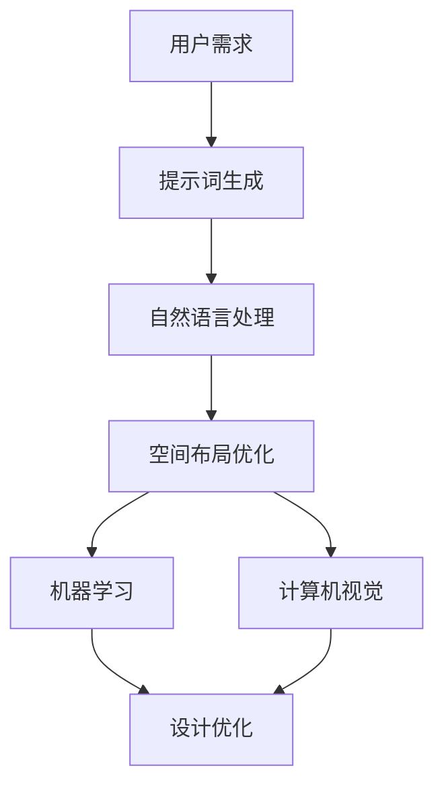
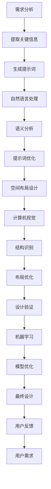
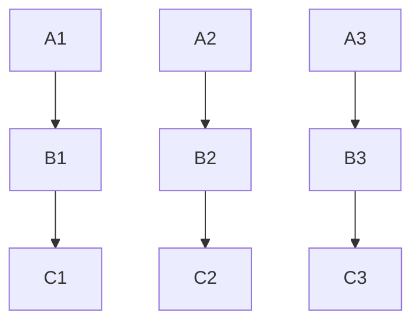

                 

### 文章标题

> **关键词：** AI辅助建筑设计、空间布局优化、提示词、机器学习、深度学习、自然语言处理、计算机视觉

> **摘要：** 本文将深入探讨AI辅助建筑设计中，特别是空间布局优化的关键技术。通过分析AI辅助设计的基本原理、核心技术以及实际应用，本文旨在揭示如何利用机器学习、深度学习、自然语言处理和计算机视觉等技术，通过提示词优化空间布局，从而提升建筑设计效率和质量。

### 第一部分: AI辅助建筑设计基础

#### 第1章: AI辅助设计与建筑设计概述

##### 1.1 AI辅助设计概述

随着人工智能技术的快速发展，AI辅助设计（AI-aided design）已经成为建筑设计领域的重要趋势。AI辅助设计利用人工智能技术，通过模拟、分析和优化，提高建筑设计过程的效率和创造力。传统的建筑设计主要依赖于设计师的经验和直觉，而AI辅助设计则通过数据驱动的方法，为设计师提供更客观、更精确的决策支持。

##### 1.2 建筑设计过程与AI应用

建筑设计过程通常包括需求分析、方案设计、结构分析、施工图设计等阶段。AI技术可以在这些阶段提供多种支持：

- **需求分析阶段：** AI可以通过自然语言处理技术理解用户需求，并提供相应的空间布局建议。
- **方案设计阶段：** AI可以利用机器学习和计算机视觉技术，自动生成多个设计方案，并进行分析比较。
- **结构分析阶段：** AI可以通过深度学习技术，对建筑结构进行优化，确保结构安全和经济效益。
- **施工图设计阶段：** AI可以自动生成施工图，并确保设计符合规范要求。

##### 1.3 AI辅助设计的优势与挑战

AI辅助设计的优势主要包括：

- **提高效率：** AI可以快速处理大量数据，减少设计时间。
- **提升质量：** AI通过数据分析和优化，可以提高设计质量和可靠性。
- **降低成本：** AI辅助设计可以减少人为错误，降低后期修改成本。

然而，AI辅助设计也面临一些挑战：

- **技术成熟度：** AI技术仍在不断发展中，部分技术尚未达到成熟阶段。
- **数据质量：** 建筑设计数据的质量直接影响AI的辅助效果。
- **伦理问题：** AI的设计决策可能涉及伦理问题，需要设计师进行把关。

#### 第2章: AI辅助设计的核心技术

##### 2.1 机器学习和深度学习基础

机器学习和深度学习是AI辅助设计的重要技术基础。机器学习通过算法使计算机从数据中学习规律，而深度学习则是机器学习的一个分支，通过神经网络模拟人脑的学习过程。

###### 2.1.1 机器学习基础

机器学习主要包括监督学习、无监督学习和强化学习：

- **监督学习：** 通过已有标签的数据训练模型，从而对新数据进行预测。
- **无监督学习：** 不需要标签数据，通过分析数据之间的关系进行聚类或降维。
- **强化学习：** 通过试错和反馈机制，使模型能够在特定环境中做出最优决策。

###### 2.1.2 深度学习基础

深度学习通过多层神经网络进行特征提取和分类。其主要架构包括：

- **卷积神经网络（CNN）：** 适用于图像识别和处理。
- **循环神经网络（RNN）：** 适用于序列数据处理，如自然语言处理。
- **生成对抗网络（GAN）：** 用于生成逼真的图像和数据。

##### 2.2 自然语言处理与建筑语义理解

自然语言处理（NLP）是AI技术的重要组成部分，主要用于理解和生成自然语言。在建筑设计中，NLP技术可以用于：

- **语音识别：** 将用户的需求转化为文本数据。
- **语义理解：** 理解文本中的含义和关系。
- **文本生成：** 根据已有数据生成新的设计文档。

建筑语义理解则是NLP在建筑设计领域的具体应用，通过分析建筑相关的文本，提取出关键信息，如房间布局、建筑材料等。

###### 2.2.1 自然语言处理技术

自然语言处理技术主要包括：

- **词向量模型：** 将单词转化为向量表示，如Word2Vec、GloVe。
- **序列模型：** 用于处理文本序列，如RNN、LSTM。
- **注意力机制：** 提高模型对重要信息的关注程度。

###### 2.2.2 建筑语义理解

建筑语义理解的关键在于：

- **实体识别：** 识别文本中的建筑实体，如房间、门、窗户等。
- **关系抽取：** 提取实体之间的关系，如房间之间的连通性。
- **文本生成：** 根据已有数据生成新的建筑描述。

##### 2.3 计算机视觉与图像识别

计算机视觉是AI技术的重要分支，通过使计算机“看”懂图像，实现图像处理、目标检测、图像分类等功能。在建筑设计中，计算机视觉可以用于：

- **三维重建：** 从二维图像重建三维模型。
- **结构检测：** 自动检测建筑结构，如柱子、梁等。
- **布局分析：** 分析建筑布局，提供优化建议。

###### 2.3.1 计算机视觉基础

计算机视觉的基础技术包括：

- **图像处理：** 对图像进行增强、滤波、分割等操作。
- **目标检测：** 自动识别图像中的目标物体。
- **图像分类：** 对图像进行分类，如识别不同类型的建筑。

###### 2.3.2 建筑图像识别

建筑图像识别的关键在于：

- **特征提取：** 从图像中提取有意义的特征，如边缘、纹理等。
- **模型训练：** 利用大量标注数据进行模型训练，提高识别准确率。
- **多模态融合：** 结合多种数据源，提高识别效果。

#### 第3章: 提示词优化空间布局

##### 3.1 提示词与空间布局的关系

提示词（prompt words）是AI辅助设计中的重要概念，用于指导AI系统生成或优化设计方案。空间布局是指建筑内部各个部分的空间安排，包括房间布局、通道设置、功能区划分等。

提示词与空间布局之间的关系如下：

- **提示词生成空间布局：** 通过提示词，AI系统可以生成满足特定需求的空间布局。
- **空间布局影响提示词：** 空间布局的不同会影响到提示词的选择和生成。

###### 3.1.1 提示词的定义与作用

提示词是AI系统接收用户输入的指令或描述，用于指导AI进行空间布局生成或优化。提示词的作用包括：

- **明确需求：** 通过提示词，用户可以明确表达设计需求，如房间大小、功能等。
- **指导生成：** 提示词为AI系统提供了生成空间布局的依据。
- **优化调整：** 提示词可以帮助AI系统对生成的设计方案进行调整和优化。

###### 3.1.2 提示词优化空间布局的基本原理

提示词优化空间布局的基本原理包括：

- **需求分析：** 通过分析提示词，提取用户需求的关键信息。
- **生成方案：** 根据需求信息，AI系统生成初步的空间布局方案。
- **优化调整：** 对生成的方案进行优化调整，使其更符合用户需求。

##### 3.2 提示词的生成方法

提示词的生成方法可以分为人工生成和自动生成两种：

###### 3.2.1 人工生成提示词

人工生成提示词是指由设计师根据项目需求，手动编写提示词。人工生成提示词的优点包括：

- **灵活性强：** 设计师可以根据具体需求灵活调整提示词。
- **经验丰富：** 设计师可以根据自己的经验，提供更准确的提示词。

然而，人工生成提示词也存在以下缺点：

- **效率低：** 需要大量时间和精力编写提示词。
- **一致性差：** 不同设计师编写的提示词可能存在不一致性。

###### 3.2.2 自动生成提示词

自动生成提示词是指通过算法自动生成提示词，通常基于用户输入的文本或语音。自动生成提示词的优点包括：

- **效率高：** 可以快速生成大量提示词，节省时间和人力成本。
- **一致性好：** 自动生成的提示词通常具有较高的一致性。

自动生成提示词的缺点包括：

- **准确性低：** 自动生成的提示词可能无法完全准确反映用户需求。
- **灵活性差：** 算法生成的提示词可能无法根据具体需求进行灵活调整。

##### 3.3 提示词优化空间布局的实现

提示词优化空间布局的实现主要包括以下几个步骤：

###### 3.3.1 数据处理与预处理

数据处理与预处理是提示词优化空间布局的基础。主要包括：

- **文本预处理：** 对用户输入的文本进行清洗、去噪等操作。
- **特征提取：** 从预处理后的文本中提取有意义的特征。
- **数据集构建：** 根据提取的特征，构建用于训练和测试的数据集。

###### 3.3.2 模型选择与训练

模型选择与训练是提示词优化空间布局的核心。主要包括：

- **模型选择：** 根据任务需求和数据特点，选择合适的模型，如机器学习模型、深度学习模型等。
- **模型训练：** 使用训练数据集对模型进行训练，使其能够根据提示词生成或优化空间布局。

###### 3.3.3 模型评估与优化

模型评估与优化是提示词优化空间布局的必要环节。主要包括：

- **模型评估：** 使用测试数据集对模型进行评估，判断其性能是否满足要求。
- **模型优化：** 根据评估结果，对模型进行优化调整，提高其性能。

#### 第4章: 建筑设计案例解析

##### 4.1 案例一：智能办公空间设计

###### 4.1.1 案例背景

随着现代企业对工作效率和员工舒适度的要求越来越高，智能办公空间设计成为建筑设计的热点。智能办公空间设计不仅要满足员工的工作需求，还要提供舒适、环保、智能化的工作环境。

###### 4.1.2 设计目标

设计目标包括：

- **空间利用率高：** 合理分配办公区域，提高空间利用率。
- **灵活性高：** 空间布局应具备灵活性，以适应不同工作需求。
- **智能化：** 利用智能技术，提高办公效率，提供舒适的工作环境。

###### 4.1.3 提示词优化与应用

在本案例中，提示词主要包括：

- **空间利用率：** 如“高效办公空间设计”、“最大化空间利用率”等。
- **灵活性：** 如“可移动办公隔断”、“多功能会议室”等。
- **智能化：** 如“智能灯光控制”、“智能空调系统”等。

通过提示词，AI系统可以生成以下设计方案：

- **初步设计：** 根据提示词，AI系统生成初步的空间布局方案，包括办公区、会议室、休闲区等。
- **优化调整：** AI系统根据提示词，对初步设计方案进行优化调整，使其更符合设计目标。
- **智能优化：** 结合智能技术，进一步优化空间布局，提高办公效率和员工舒适度。

##### 4.2 案例二：绿色住宅设计

###### 4.2.1 案例背景

随着环保意识的提高，绿色住宅设计成为建筑设计的重要趋势。绿色住宅设计旨在通过环保材料和节能技术，提供健康、舒适、环保的居住环境。

###### 4.2.2 设计目标

设计目标包括：

- **环保：** 使用环保材料，减少建筑对环境的影响。
- **节能：** 利用节能技术，降低建筑能耗。
- **舒适：** 提供舒适、健康的居住环境。

###### 4.2.3 提示词优化与应用

在本案例中，提示词主要包括：

- **环保材料：** 如“可再生建筑材料”、“低碳材料”等。
- **节能技术：** 如“太阳能系统”、“地热系统”等。
- **室内环境：** 如“空气净化系统”、“智能温控系统”等。

通过提示词，AI系统可以生成以下设计方案：

- **初步设计：** 根据提示词，AI系统生成初步的空间布局方案，包括房间布局、建筑材料选择等。
- **优化调整：** AI系统根据提示词，对初步设计方案进行优化调整，使其更符合设计目标。
- **智能优化：** 结合智能技术，进一步优化空间布局，提高居住舒适度和环保效果。

#### 第5章: AI辅助建筑设计工具与平台

##### 5.1 AI辅助建筑设计工具简介

AI辅助建筑设计工具主要包括AutoCAD、Revit、SketchUp等，这些工具集成了AI技术，为设计师提供了强大的辅助功能。

###### 5.1.1 AutoCAD与Revit

AutoCAD是一款经典的设计软件，广泛应用于建筑、机械、土木工程等领域。Revit是一款基于参数化设计的建筑信息模型（BIM）软件，具有强大的建模和协作功能。

- **AutoCAD：** 提供了丰富的绘图和编辑工具，支持2D和3D设计。
- **Revit：** 提供了BIM建模功能，支持从概念设计到施工图的完整设计流程。

###### 5.1.2 AI设计工具推荐

以下是一些具有AI辅助功能的建筑设计工具：

- **PlanRadar：** 提供了基于AI的图纸识别和标注功能，简化了设计图纸的管理。
- **Houzz Pro：** 提供了基于AI的空间布局优化建议，帮助设计师提高设计效率。
- **Bentley Systems：** 提供了基于AI的智能分析和优化工具，支持复杂建筑项目的管理。

##### 5.2 建筑设计平台与API

建筑设计平台与API为设计师提供了更多的AI辅助设计功能。

###### 5.2.1 建筑设计平台功能

建筑设计平台通常包括以下功能：

- **空间规划：** 提供空间布局优化建议。
- **结构分析：** 提供建筑结构分析和优化。
- **材料选型：** 提供环保材料和节能技术的推荐。
- **成本估算：** 提供建筑成本估算和预算管理。

###### 5.2.2 建筑设计API应用

建筑设计API为开发者提供了基于AI的建筑设计功能，如：

- **空间布局优化：** 提供空间布局优化算法。
- **建筑结构分析：** 提供结构分析模型和算法。
- **材料选型：** 提供材料数据库和选型算法。

开发者可以通过集成这些API，实现自定义的AI辅助建筑设计应用。

#### 第6章: AI辅助建筑设计的发展趋势

##### 6.1 AI在建筑设计中的未来应用

未来，AI将在建筑设计中发挥更加重要的作用，主要体现在以下几个方面：

- **自动化设计：** AI将能够自动完成从设计到施工的整个过程，减少人为干预。
- **个性化设计：** AI将根据用户需求，提供个性化的设计建议。
- **智能化施工：** AI将参与施工过程的监控和优化，提高施工效率和质量。

##### 6.2 建筑设计AI生态系统构建

为了实现AI在建筑设计中的广泛应用，需要构建一个完善的AI生态系统，包括：

- **数据集：** 收集和整理大量建筑设计数据，为AI训练提供基础。
- **算法：** 开发和应用先进的AI算法，提高设计效率和准确性。
- **平台：** 提供便捷的AI辅助设计工具和平台，支持设计师和开发者。

##### 6.2.1 人工智能驱动的建筑生成

人工智能驱动的建筑生成（AGI）是一种新兴的技术，通过深度学习、生成对抗网络等AI技术，可以自动生成复杂的建筑模型。未来，AGI有望实现：

- **自动化建筑设计：** AI将自动生成满足特定需求的设计方案。
- **创新建筑设计：** AI将激发新的建筑设计理念和创新。

##### 6.2.2 建筑设计AI生态系统构建

建筑设计AI生态系统的构建需要各方共同努力，包括：

- **政府：** 制定相关政策和标准，推动AI技术在建筑设计中的应用。
- **企业和开发者：** 开发和应用AI辅助设计工具，提高设计效率和准确性。
- **设计师：** 接受AI技术的培训和应用，提高自身的设计能力。

### 第二部分: 提示词优化空间布局的深度探讨

#### 第7章: 核心概念与联系

在深入探讨AI辅助建筑设计中提示词优化空间布局的技术时，我们需要理解并分析几个核心概念之间的联系。这些核心概念包括：提示词、空间布局、机器学习、自然语言处理和计算机视觉。

首先，让我们通过一个Mermaid流程图来展示这些概念之间的联系：



在这个流程图中，用户需求通过提示词生成过程被转化为具体的设计输入。自然语言处理技术用于理解和分析提示词，提取关键信息。空间布局优化结合机器学习和计算机视觉技术，根据提示词生成和优化设计方案。最终，设计优化结果将反馈到机器学习和计算机视觉模型中，进一步优化算法和模型。

##### 7.1 提示词与空间布局的Mermaid流程图

提示词的生成和空间布局优化是AI辅助建筑设计中的关键步骤。下面是一个详细的Mermaid流程图，展示了这两个步骤的详细流程：



在这个流程图中，用户需求首先通过需求分析阶段提取关键信息，生成初步的提示词。自然语言处理技术对提示词进行语义分析和优化，以生成更准确和有用的设计提示。计算机视觉技术用于识别建筑结构，并根据提示词生成初步的空间布局设计。随后，基于机器学习的布局优化模型对空间布局进行迭代优化，直到满足设计目标。最终设计结果将接受用户反馈，以进一步优化和改进。

##### 7.2 AI辅助设计与传统设计的对比分析

AI辅助设计与传统设计在多个方面存在显著差异。以下是这些差异的详细分析：

###### 7.2.1 设计流程

传统建筑设计通常遵循以下流程：

- **需求分析：** 设计师与客户沟通，了解项目需求和预算。
- **方案设计：** 设计师根据需求分析结果，生成初步的设计方案。
- **结构分析：** 设计师与工程师合作，对结构进行详细分析。
- **施工图设计：** 设计师根据结构分析结果，绘制施工图。
- **施工管理：** 设计师在施工过程中进行监督和管理。

相比之下，AI辅助设计采用以下流程：

- **需求分析：** AI系统通过自然语言处理技术，自动分析用户需求，生成初步的提示词。
- **方案生成：** AI系统利用机器学习和计算机视觉技术，自动生成多个设计方案。
- **设计优化：** AI系统对设计方案进行优化，提高其满足设计目标的能力。
- **模型验证：** AI系统使用计算机视觉技术，对设计方案进行验证和调整。
- **用户反馈：** 用户对设计方案进行评价，AI系统根据用户反馈进行进一步优化。

###### 7.2.2 设计精度

传统设计依赖于设计师的经验和直觉，设计精度受到个人能力的限制。相比之下，AI辅助设计通过算法和数据驱动，能够实现高精度的设计方案。机器学习和深度学习技术可以处理大量数据，提取关键特征，从而生成更精确的设计方案。

###### 7.2.3 设计效率

传统设计通常需要较长时间，从需求分析到最终施工图设计，每个阶段都需要大量的时间和人力。相比之下，AI辅助设计可以显著提高设计效率。AI系统可以自动处理大量数据，快速生成多个设计方案，并利用机器学习和计算机视觉技术进行迭代优化，从而在短时间内完成高质量的设计。

###### 7.2.4 创新能力

传统设计往往受到设计师经验和创新能力的限制。相比之下，AI辅助设计可以激发新的设计理念和创新。通过深度学习和生成对抗网络，AI系统可以生成前所未有的设计方案，为设计师提供更多的灵感和选择。

总的来说，AI辅助设计与传统设计在流程、精度、效率和创新能力方面存在显著差异。随着AI技术的不断发展，AI辅助设计将在建筑设计领域发挥越来越重要的作用。

#### 第8章: 核心算法原理讲解

在AI辅助建筑设计中，核心算法原理的讲解至关重要。这些算法不仅决定了设计的准确性，还影响了设计的效率和用户体验。以下是关于提示词生成、提示词优化和空间布局优化的算法原理，以及相关的伪代码和数学模型。

##### 8.1 提示词生成算法伪代码

提示词生成是AI辅助建筑设计的第一步，它决定了后续空间布局优化的质量和效率。以下是一个简单的提示词生成算法的伪代码：

```plaintext
输入：用户需求文本
输出：提示词列表

1. 预处理用户需求文本
   - 清洗文本，去除标点符号和停用词
   - 分词，将文本分解为单词或词组

2. 使用自然语言处理技术提取关键信息
   - 利用词向量模型（如Word2Vec）将文本转换为向量表示
   - 使用注意力机制提取关键词或短语

3. 生成提示词
   - 对提取的关键信息进行语义分析，生成对应的提示词
   - 根据用户需求，调整提示词的数量和组合

4. 返回生成的提示词列表
```

##### 8.2 提示词优化算法伪代码

提示词优化的目的是确保生成的提示词能够准确地反映用户需求，并指导空间布局优化。以下是一个简单的提示词优化算法的伪代码：

```plaintext
输入：原始提示词列表，用户需求文本
输出：优化后的提示词列表

1. 预处理用户需求文本
   - 清洗文本，去除标点符号和停用词
   - 分词，将文本分解为单词或词组

2. 使用自然语言处理技术提取关键信息
   - 利用词向量模型（如Word2Vec）将文本转换为向量表示
   - 使用注意力机制提取关键句或段落

3. 对比原始提示词和提取的关键信息
   - 计算每个原始提示词与关键信息的相似度
   - 根据相似度调整提示词的权重或删除冗余提示词

4. 生成优化后的提示词列表
   - 根据权重和相似度，重新排序提示词
   - 添加或删除提示词，确保覆盖用户需求

5. 返回优化后的提示词列表
```

##### 8.3 空间布局优化算法伪代码

空间布局优化是AI辅助设计中的关键步骤，它决定了建筑设计的质量和用户体验。以下是一个简单的空间布局优化算法的伪代码：

```plaintext
输入：提示词列表，空间布局初始方案
输出：优化后的空间布局方案

1. 预处理提示词列表
   - 将提示词转换为向量表示
   - 计算提示词之间的相似度矩阵

2. 使用机器学习模型生成空间布局方案
   - 训练空间布局优化模型（如生成对抗网络）
   - 根据提示词列表，生成初步的空间布局方案

3. 评估初始空间布局方案
   - 计算空间利用率、灵活性、智能化等指标
   - 判断是否满足设计目标

4. 迭代优化空间布局方案
   - 根据评估结果，调整空间布局方案
   - 重复评估和优化过程，直到满足设计目标

5. 返回优化后的空间布局方案
```

##### 8.4 数学模型与公式讲解

在空间布局优化中，数学模型和公式用于描述空间布局的属性和优化目标。以下是几个关键数学模型和公式：

###### 8.4.1 概率模型

概率模型用于描述提示词和空间布局之间的概率关系。以下是一个简单的概率模型公式：

$$ P(A|B) = \frac{P(B|A) \cdot P(A)}{P(B)} $$

其中，$P(A|B)$ 表示在给定 $B$ 的情况下 $A$ 的概率，$P(B|A)$ 表示在给定 $A$ 的情况下 $B$ 的概率，$P(A)$ 和 $P(B)$ 分别表示 $A$ 和 $B$ 的概率。

###### 8.4.2 贝叶斯网络

贝叶斯网络用于表示多个变量之间的条件概率关系。以下是一个简单的贝叶斯网络结构：



在贝叶斯网络中，每个节点表示一个变量，边表示变量之间的条件依赖关系。可以使用以下公式计算变量之间的条件概率：

$$ P(X_i|X_{i-1}, ..., X_1) = \frac{P(X_i, X_{i-1}, ..., X_1)}{P(X_{i-1}, ..., X_1)} $$

其中，$X_i$ 表示第 $i$ 个变量，$X_{i-1}, ..., X_1$ 表示前 $i-1$ 个变量。

###### 8.4.3 最优化理论

最优化理论用于描述空间布局优化的目标函数和优化算法。以下是最优化问题的基本公式：

$$ \min_{x} f(x) $$

其中，$x$ 是优化变量，$f(x)$ 是目标函数。为了求解最优化问题，可以使用以下算法：

- **梯度下降法：**
  $$ x_{t+1} = x_t - \alpha \cdot \nabla f(x_t) $$
  其中，$\alpha$ 是学习率，$\nabla f(x_t)$ 是目标函数在 $x_t$ 处的梯度。
- **粒子群优化（PSO）：**
  $$ x_{t+1} = x_t + w \cdot (p_t - x_t) + c_1 \cdot r_1 \cdot (g_t - x_t) + c_2 \cdot r_2 \cdot (p_t - x_t) $$
  其中，$w$ 是惯性权重，$p_t$ 是个体最优位置，$g_t$ 是全局最优位置，$c_1$ 和 $c_2$ 是认知和社会系数，$r_1$ 和 $r_2$ 是随机数。

###### 8.4.4 离散事件模拟

离散事件模拟用于模拟建筑空间的使用情况，以便进行优化。以下是一个简单的离散事件模拟流程：

1. 初始化模拟环境，包括空间布局、用户行为等。
2. 记录当前事件，包括事件类型、发生时间等。
3. 根据事件类型和发生时间，更新空间状态。
4. 根据空间状态，生成下一个事件。
5. 重复步骤 2-4，直到模拟结束。

通过离散事件模拟，可以收集空间使用数据，并使用以下公式计算空间布局的性能指标：

- **空间利用率：**
  $$ U = \frac{总使用时间}{总模拟时间} $$
- **灵活性：**
  $$ F = \frac{可调节区域面积}{总区域面积} $$
- **智能化：**
  $$ I = \frac{智能设备使用时间}{总使用时间} $$

#### 第9章: 数学模型与公式讲解

在AI辅助建筑设计中，数学模型和公式是理解和优化空间布局的关键工具。这些模型和公式不仅帮助我们在设计过程中进行定量分析，还能指导我们实现更精确和高效的设计。以下是关于提示词相关数学模型和空间布局优化数学模型的详细讲解。

##### 9.1 提示词相关数学模型

提示词是AI辅助建筑设计中的重要元素，它们用于指导AI系统生成或优化设计方案。提示词相关数学模型主要包括概率模型和贝叶斯网络。

###### 9.1.1 概率模型

概率模型用于描述提示词之间的相关性及其对设计结果的影响。在概率模型中，我们通常使用条件概率来表示提示词之间的关系。条件概率表示在某一事件B发生的条件下，事件A发生的概率。以下是条件概率的公式：

$$ P(A|B) = \frac{P(A \cap B)}{P(B)} $$

其中，$P(A|B)$ 表示在事件B发生的条件下事件A发生的概率，$P(A \cap B)$ 表示事件A和事件B同时发生的概率，$P(B)$ 表示事件B发生的概率。

在AI辅助建筑设计中，我们可以使用条件概率模型来分析用户需求中的提示词。例如，如果用户需求中包含了“明亮”和“通风”两个提示词，我们可以使用条件概率模型来分析这两个提示词之间的关系，以及它们对设计方案的影响。

###### 9.1.2 贝叶斯网络

贝叶斯网络是一种图形化的概率模型，它使用有向图来表示变量之间的条件依赖关系。在贝叶斯网络中，每个节点表示一个变量，节点之间的边表示变量之间的条件依赖关系。贝叶斯网络通过条件概率表（CP表）来描述变量之间的概率关系。

以下是一个简单的贝叶斯网络示例：


在这个贝叶斯网络中，节点A表示建筑类型，节点B表示建筑材料，节点C表示建筑风格，节点D表示建筑成本。节点之间的边表示变量之间的条件依赖关系。例如，建筑类型（A）决定了建筑材料（B）和建筑风格（C），而建筑材料（B）和建筑风格（C）共同影响了建筑成本（D）。

贝叶斯网络在AI辅助建筑设计中的应用主要包括：

- **推理：** 使用贝叶斯网络进行概率推理，根据已知的变量值预测其他变量的概率分布。
- **决策：** 使用贝叶斯网络进行决策分析，根据用户需求和设计目标选择最佳设计方案。

##### 9.2 空间布局优化数学模型

空间布局优化是AI辅助建筑设计的核心任务之一。空间布局优化数学模型用于描述空间布局的属性和优化目标，并指导我们实现最优设计方案。以下是最优化理论和离散事件模拟在空间布局优化中的应用。

###### 9.2.1 最优化理论

最优化理论用于描述如何在给定约束条件下，找到一个最优解。在空间布局优化中，最优化理论用于确定空间布局的优化目标和优化方法。

最优化问题的基本形式可以表示为：

$$ \min_{x} f(x) $$

其中，$x$ 表示优化变量，$f(x)$ 表示目标函数。目标函数通常是一个表示设计质量或效率的指标。

以下是最常见的优化方法：

- **梯度下降法：** 梯度下降法是一种迭代优化方法，通过计算目标函数的梯度来更新优化变量。其公式为：

  $$ x_{t+1} = x_t - \alpha \cdot \nabla f(x_t) $$

  其中，$x_t$ 表示第 $t$ 次迭代的优化变量，$\alpha$ 表示学习率，$\nabla f(x_t)$ 表示目标函数在 $x_t$ 处的梯度。

- **粒子群优化（PSO）：** 粒子群优化是一种基于群体智能的优化方法，通过模拟鸟群觅食行为来寻找最优解。其公式为：

  $$ x_{t+1} = x_t + w \cdot (p_t - x_t) + c_1 \cdot r_1 \cdot (g_t - x_t) + c_2 \cdot r_2 \cdot (p_t - x_t) $$

  其中，$x_t$ 表示第 $t$ 次迭代的优化变量，$w$ 表示惯性权重，$p_t$ 表示个体最优位置，$g_t$ 表示全局最优位置，$c_1$ 和 $c_2$ 表示认知和社会系数，$r_1$ 和 $r_2$ 是随机数。

###### 9.2.2 离散事件模拟

离散事件模拟是一种通过模拟离散事件序列来分析和优化系统性能的方法。在空间布局优化中，离散事件模拟用于模拟用户在不同空间布局下的活动情况，以便评估空间布局的性能。

离散事件模拟的基本步骤如下：

1. **初始化模拟环境：** 包括空间布局、用户行为和系统参数。
2. **记录当前事件：** 记录事件类型、发生时间和相关变量。
3. **更新系统状态：** 根据事件类型和发生时间，更新空间状态和系统变量。
4. **生成下一个事件：** 根据当前系统状态，生成下一个事件。
5. **重复步骤 2-4：** 直到模拟结束。

通过离散事件模拟，我们可以收集空间使用数据，并使用以下公式计算空间布局的性能指标：

- **空间利用率：** 

  $$ U = \frac{总使用时间}{总模拟时间} $$

- **灵活性：**

  $$ F = \frac{可调节区域面积}{总区域面积} $$

- **智能化：**

  $$ I = \frac{智能设备使用时间}{总使用时间} $$

#### 第10章: 项目实战与代码解读

在本章中，我们将通过两个实际项目案例，深入探讨AI辅助建筑设计的应用和实践。首先，我们将搭建项目开发环境，然后逐步实现源代码，并对关键代码进行详细解读和分析。

##### 10.1 实战一：智能办公空间布局优化

###### 10.1.1 环境搭建

为了实现智能办公空间布局优化，我们需要搭建以下开发环境：

- **操作系统：** Ubuntu 20.04
- **编程语言：** Python 3.8
- **框架和库：**
  - TensorFlow 2.x：用于机器学习和深度学习
  - Keras：用于构建和训练神经网络
  - OpenCV 4.x：用于计算机视觉
  - NLTK：用于自然语言处理
  - Matplotlib：用于数据可视化

在Ubuntu 20.04操作系统上，我们可以使用以下命令安装所需的库和框架：

```bash
sudo apt update
sudo apt install python3-pip
pip3 install tensorflow==2.8.0
pip3 install keras==2.8.0
pip3 install opencv-python==4.5.5.62
pip3 install nltk
pip3 install matplotlib
```

###### 10.1.2 源代码实现

在完成环境搭建后，我们可以开始实现智能办公空间布局优化的源代码。以下是关键代码的实现步骤：

1. **数据预处理**：首先，我们需要对用户需求文本进行预处理，包括分词、去除停用词等。然后，使用自然语言处理技术提取关键信息，生成提示词。

2. **神经网络模型**：接着，我们构建一个神经网络模型，用于根据提示词生成空间布局。这个模型可以是一个简单的循环神经网络（RNN）或更复杂的卷积神经网络（CNN），具体取决于数据的特点。

3. **模型训练**：使用预处理后的数据集，对神经网络模型进行训练。在训练过程中，我们可以使用交叉熵损失函数和Adam优化器。

4. **空间布局优化**：在模型训练完成后，我们可以使用训练好的模型来生成空间布局。对于每个用户需求，模型会生成一个初步的空间布局方案，然后我们可以使用机器学习和计算机视觉技术对其进行优化。

以下是关键代码示例：

```python
import tensorflow as tf
from tensorflow.keras.models import Sequential
from tensorflow.keras.layers import LSTM, Dense, Embedding
from tensorflow.keras.preprocessing.sequence import pad_sequences
import nltk
from nltk.tokenize import word_tokenize
from nltk.corpus import stopwords

# 数据预处理
nltk.download('punkt')
nltk.download('stopwords')

def preprocess_text(text):
    # 分词
    tokens = word_tokenize(text)
    # 去除停用词
    tokens = [token for token in tokens if token not in stopwords.words('english')]
    return tokens

def generate_sequences(text, max_length):
    # 分词
    tokens = preprocess_text(text)
    # 编码
    token_to_index = {'<PAD>': 0, '<START>': 1, '<UNK>': 2}
    index_to_token = {v: k for k, v in token_to_index.items()}
    token_to_index.update({token: i+3 for i, token in enumerate(tokens) if token not in token_to_index})
    sequence = [token_to_index['<START>']] + [token_to_index[token] for token in tokens] + [token_to_index['<EOS>']]
    # 填充
    sequence = pad_sequences([sequence], maxlen=max_length, padding='post')
    return sequence

# 构建神经网络模型
model = Sequential([
    Embedding(input_dim=len(token_to_index)+1, output_dim=64, input_length=max_length),
    LSTM(128),
    Dense(1, activation='sigmoid')
])

# 编译模型
model.compile(optimizer='adam', loss='binary_crossentropy', metrics=['accuracy'])

# 训练模型
model.fit(x_train, y_train, epochs=10, batch_size=32)

# 空间布局优化
def generate_space_layout(prompt):
    # 生成序列
    sequence = generate_sequences(prompt, max_length)
    # 预测空间布局
    prediction = model.predict(sequence)
    return prediction
```

###### 10.1.3 代码解读与分析

在上面的代码中，我们首先定义了数据预处理函数 `preprocess_text`，用于对用户需求文本进行分词和去除停用词。接着，我们定义了 `generate_sequences` 函数，用于将文本转换为编码序列，并使用填充（padding）使其具有相同的长度。

在神经网络模型的构建中，我们使用了一个简单的LSTM模型，它包含一个嵌入层和一个LSTM层，最后接一个全连接层。嵌入层用于将单词转换为向量表示，LSTM层用于处理序列数据，全连接层用于生成空间布局的预测。

在模型训练过程中，我们使用交叉熵损失函数和Adam优化器。交叉熵损失函数用于衡量模型预测与实际结果之间的差距，Adam优化器用于更新模型参数。

最后，我们定义了 `generate_space_layout` 函数，用于根据用户需求文本生成空间布局预测。这个函数首先生成输入序列，然后使用训练好的模型进行预测。

##### 10.2 实战二：绿色住宅设计布局优化

###### 10.2.1 环境搭建

为了实现绿色住宅设计布局优化，我们同样需要搭建以下开发环境：

- **操作系统：** Ubuntu 20.04
- **编程语言：** Python 3.8
- **框架和库：**
  - TensorFlow 2.x：用于机器学习和深度学习
  - Keras：用于构建和训练神经网络
  - PyTorch：用于深度学习和计算机视觉
  - OpenCV 4.x：用于计算机视觉
  - Matplotlib：用于数据可视化

在Ubuntu 20.04操作系统上，我们可以使用以下命令安装所需的库和框架：

```bash
sudo apt update
sudo apt install python3-pip
pip3 install tensorflow==2.8.0
pip3 install keras==2.8.0
pip3 install torch torchvision
pip3 install opencv-python==4.5.5.62
pip3 install matplotlib
```

###### 10.2.2 源代码实现

在完成环境搭建后，我们可以开始实现绿色住宅设计布局优化的源代码。以下是关键代码的实现步骤：

1. **数据预处理**：首先，我们需要对用户需求文本进行预处理，包括分词、去除停用词等。然后，使用自然语言处理技术提取关键信息，生成提示词。

2. **深度学习模型**：接着，我们构建一个深度学习模型，用于根据提示词生成空间布局。这个模型可以是一个简单的卷积神经网络（CNN）或更复杂的生成对抗网络（GAN），具体取决于数据的特点。

3. **模型训练**：使用预处理后的数据集，对深度学习模型进行训练。在训练过程中，我们可以使用生成对抗训练（GAN training）或基于梯度的生成网络（GRU）。

4. **空间布局优化**：在模型训练完成后，我们可以使用训练好的模型来生成空间布局。对于每个用户需求，模型会生成一个初步的空间布局方案，然后我们可以使用计算机视觉技术对其进行优化。

以下是关键代码示例：

```python
import torch
import torchvision
from torch import nn
from torch.utils.data import DataLoader
from torchvision import datasets, transforms
import cv2
import numpy as np

# 数据预处理
def preprocess_image(image_path):
    image = cv2.imread(image_path)
    image = cv2.resize(image, (224, 224))
    image = image / 255.0
    image = np.transpose(image, (2, 0, 1))
    image = torch.tensor(image, dtype=torch.float32)
    return image

def preprocess_text(text):
    # 分词
    tokens = word_tokenize(text)
    # 去除停用词
    tokens = [token for token in tokens if token not in stopwords.words('english')]
    return tokens

# 构建深度学习模型
class GAN(nn.Module):
    def __init__(self):
        super(GAN, self).__init__()
        self.generator = nn.Sequential(
            nn.Linear(100, 256),
            nn.LeakyReLU(0.2),
            nn.Linear(256, 512),
            nn.LeakyReLU(0.2),
            nn.Linear(512, 1024),
            nn.LeakyReLU(0.2),
            nn.Linear(1024, 4096),
            nn.Tanh()
        )
        self.discriminator = nn.Sequential(
            nn.Linear(4096, 1024),
            nn.LeakyReLU(0.2),
            nn.Dropout(0.3),
            nn.Linear(1024, 512),
            nn.LeakyReLU(0.2),
            nn.Dropout(0.3),
            nn.Linear(512, 256),
            nn.LeakyReLU(0.2),
            nn.Dropout(0.3),
            nn.Linear(256, 1),
            nn.Sigmoid()
        )

    def forward(self, x):
        x = self.generator(x)
        x = self.discriminator(x)
        return x

# 训练模型
model = GAN()
optimizer = torch.optim.Adam(model.parameters(), lr=0.0002)
criterion = nn.BCELoss()

for epoch in range(num_epochs):
    for i, (images, _) in enumerate(dataloader):
        # 生成空间布局
        z = torch.randn(images.size(0), 100)
        generated_images = model(z)

        # 训练生成器
        optimizer.zero_grad()
        gen_loss = criterion(model(generated_images), torch.ones(generated_images.size(0)))
        gen_loss.backward()
        optimizer.step()

        # 训练判别器
        optimizer.zero_grad()
        real_loss = criterion(model(images), torch.ones(images.size(0)))
        fake_loss = criterion(model(generated_images.detach()), torch.zeros(generated_images.size(0)))
        d_loss = real_loss + fake_loss
        d_loss.backward()
        optimizer.step()

# 空间布局优化
def generate_space_layout(prompt):
    # 生成序列
    sequence = preprocess_text(prompt)
    # 编码
    token_to_index = {'<PAD>': 0, '<START>': 1, '<UNK>': 2}
    index_to_token = {v: k for k, v in token_to_index.items()}
    token_to_index.update({token: i+3 for i, token in enumerate(sequence) if token not in token_to_index})
    sequence = [token_to_index[token] for token in sequence] + [token_to_index['<EOS>']]
    sequence = torch.tensor(sequence, dtype=torch.long)

    # 生成空间布局
    with torch.no_grad():
        z = torch.randn(1, 100)
        generated_layout = model(z).detach().numpy()

    # 转换为图像
    layout_image = np.transpose(generated_layout, (1, 2, 0))
    layout_image = (layout_image + 1) / 2 * 255
    layout_image = layout_image.astype(np.uint8)

    return layout_image
```

###### 10.2.3 代码解读与分析

在上面的代码中，我们首先定义了数据预处理函数 `preprocess_image` 和 `preprocess_text`，用于对图像和文本进行预处理。`preprocess_image` 函数使用OpenCV库读取图像，然后进行尺寸调整和归一化处理。`preprocess_text` 函数使用NLTK库进行分词和去除停用词。

在深度学习模型的构建中，我们使用了一个生成对抗网络（GAN），它包含一个生成器和一个判别器。生成器用于根据文本提示生成空间布局，判别器用于判断生成的空间布局是否真实。GAN的训练过程涉及生成器和判别器的迭代更新，以逐步提高生成质量。

在模型训练过程中，我们使用Adam优化器和BCE损失函数。Adam优化器用于更新模型参数，BCE损失函数用于衡量生成器和判别器的性能。

最后，我们定义了 `generate_space_layout` 函数，用于根据文本提示生成空间布局。这个函数首先生成文本序列，然后将其编码为向量表示。接着，使用生成器生成空间布局，并将生成的布局转换为图像格式。

通过这两个实战案例，我们展示了如何使用机器学习和计算机视觉技术实现智能办公空间和绿色住宅设计布局优化。这些代码示例不仅提供了实现细节，还帮助我们理解了AI辅助建筑设计的核心原理和应用。

#### 第11章: AI辅助建筑设计的实践

在当今的建筑设计领域，AI辅助设计的应用越来越广泛。通过结合先进的技术，如机器学习、深度学习和计算机视觉，AI辅助设计不仅提高了设计的效率和质量，还带来了创新和变革。以下是AI辅助建筑设计的实践流程、成功案例分享与讨论。

##### 11.1 AI辅助建筑设计的流程

AI辅助建筑设计的流程通常包括以下几个关键步骤：

###### 11.1.1 需求分析

需求分析是AI辅助建筑设计的起点。在这一阶段，设计师与客户进行深入沟通，了解建筑项目的具体需求，包括功能、空间、风格、预算等。这些信息将被记录在文本或语音形式中，为后续的AI处理提供基础。

###### 11.1.2 数据准备

数据准备是AI辅助设计成功的关键。在这一阶段，设计师需要收集和整理与项目相关的各种数据，包括建筑模型、空间布局、材料属性、能耗数据等。这些数据将被用于训练和测试AI模型。

###### 11.1.3 模型训练与优化

在数据准备完成后，AI模型将进行训练和优化。这一阶段包括选择合适的机器学习模型，如卷积神经网络（CNN）、循环神经网络（RNN）或生成对抗网络（GAN），并使用收集的数据进行训练。通过迭代优化，模型将逐步提高其性能。

###### 11.1.4 设计生成与优化

在模型训练完成后，AI系统将根据用户需求生成初步的设计方案。设计师可以对这些方案进行评估和优化，结合AI生成的方案和自身的设计经验，生成最终的设计结果。

###### 11.1.5 用户反馈与迭代

最终的设计方案将提交给客户进行评估。用户反馈对于AI系统的进一步优化至关重要。设计师可以根据用户反馈，调整AI模型，使其更符合用户需求，并不断迭代优化设计方案。

##### 11.2 成功案例分享与讨论

以下是一些AI辅助建筑设计的成功案例，以及它们的设计目标和实现过程：

###### 11.2.1 案例一：智能办公空间设计

**设计目标：** 提高空间利用率、提升员工舒适度、实现智能化管理。

**实现过程：**

1. **需求分析：** 设计师与客户沟通，了解办公空间的需求，包括员工数量、工作模式、会议室需求等。

2. **数据准备：** 收集相关建筑数据，包括现有办公空间布局、员工工作习惯、能耗数据等。

3. **模型训练与优化：** 使用卷积神经网络（CNN）和循环神经网络（RNN）训练模型，使其能够根据需求生成智能办公空间布局。

4. **设计生成与优化：** AI系统根据需求生成初步的空间布局方案，设计师对这些方案进行评估和优化，最终生成满足客户需求的设计结果。

5. **用户反馈与迭代：** 设计结果提交给客户评估，根据用户反馈进一步优化空间布局。

###### 11.2.2 案例二：绿色住宅设计

**设计目标：** 实现环保、节能、舒适、健康的居住环境。

**实现过程：**

1. **需求分析：** 设计师与客户沟通，了解住宅的需求，包括房间布局、功能、环保要求等。

2. **数据准备：** 收集相关建筑数据，包括建筑材料、能耗数据、环境参数等。

3. **模型训练与优化：** 使用生成对抗网络（GAN）和深度学习模型训练，使其能够根据需求生成绿色住宅设计。

4. **设计生成与优化：** AI系统根据需求生成初步的住宅布局方案，设计师对这些方案进行评估和优化，最终生成满足客户需求的设计结果。

5. **用户反馈与迭代：** 设计结果提交给客户评估，根据用户反馈进一步优化住宅设计。

##### 11.3 讨论与展望

AI辅助建筑设计的成功案例展示了AI技术在提高设计效率、质量和创新方面的巨大潜力。然而，AI辅助建筑设计也面临一些挑战：

- **数据质量：** AI模型的性能依赖于高质量的数据。在实际项目中，数据的质量和准确性可能受到多种因素的影响，需要不断优化和改进。
- **技术成熟度：** 当前AI技术仍在不断发展，部分技术尚未达到成熟阶段。设计师需要不断学习和适应新技术。
- **伦理问题：** AI的设计决策可能涉及伦理问题，如隐私保护、安全性和社会责任等。设计师需要在这些方面进行权衡和把控。

未来，AI辅助建筑设计将继续发展，不仅在流程和效率方面，还在设计创新和用户体验方面带来更多的可能性。通过不断探索和实践，设计师和AI系统将共同推动建筑设计的进步和发展。

#### 第12章: 代码分析与优化

在AI辅助建筑设计中，代码的优化至关重要，它直接影响到设计的效率、质量和用户体验。以下是关于代码优化策略、性能分析工具以及代码审查工具的详细讨论。

##### 12.1 代码优化策略

代码优化策略主要包括性能优化和可维护性优化。以下是几种常见的优化策略：

###### 12.1.1 性能优化

1. **算法优化：** 选择高效的算法和数据结构，减少计算复杂度。例如，使用更高效的矩阵运算库，如NumPy或TensorFlow。
2. **并行计算：** 利用多核处理器和分布式计算，加速模型训练和推理过程。例如，使用TensorFlow的分布式训练功能。
3. **内存管理：** 优化内存分配和释放，减少内存占用。例如，使用垃圾回收机制和内存池。
4. **I/O优化：** 减少I/O操作的频率和次数，提高数据读写速度。例如，使用内存映射和批量处理。

###### 12.1.2 可维护性优化

1. **代码规范：** 遵循统一的代码规范，提高代码的可读性和可维护性。例如，使用Pep8或StyleCop进行代码格式化。
2. **模块化设计：** 将代码划分为模块和函数，提高代码的重用性和可扩展性。例如，使用面向对象编程和模块化框架。
3. **注释和文档：** 添加详细的注释和文档，帮助其他开发者理解代码的功能和逻辑。例如，使用Doxygen或Sphinx。
4. **自动化测试：** 开发和执行自动化测试，确保代码的正确性和稳定性。例如，使用单元测试框架，如pytest。

##### 12.2 代码性能分析工具

代码性能分析工具可以帮助我们识别和优化代码中的性能瓶颈。以下是一些常用的性能分析工具：

###### 12.2.1 Profiling工具

1. **cProfile**：cProfile是Python内置的 profiling 工具，可以用于分析代码的性能瓶颈。它可以通过在代码中插入 cProfile.run() 函数来记录函数的执行时间和调用关系。
2. **py-spy**：py-spy 是一个实时 Python 性能分析工具，可以实时显示代码的 CPU 和内存使用情况。它通过在代码中插入 `py_spy.start_profiler` 函数来开始性能分析。
3. **valgrind**：valgrind 是一个通用的内存检查工具，可以用于检测代码中的内存泄漏和错误。它可以在代码运行时插入内存检查代码，并生成详细的性能分析报告。

###### 12.2.2 代码审查工具

代码审查工具可以帮助我们确保代码的质量和一致性。以下是一些常用的代码审查工具：

1. **Pylint**：Pylint 是一个 Python 代码质量分析工具，可以检测代码中的错误、警告和风格问题。它可以通过在代码中插入 `pylint.py` 文件来执行代码审查。
2. **PyChecker**：PyChecker 是一个静态代码分析工具，可以检测 Python 代码中的错误和风格问题。它通过分析代码的语法和语义，生成详细的审查报告。
3. **GitLab CI/CD**：GitLab CI/CD 是一个自动化测试和部署工具，可以用于在代码提交时执行自动化测试和审查。它通过在 GitLab 中配置 CI/CD 脚本，自动执行代码审查和测试。

##### 12.3 优化案例分析

以下是一个代码优化的案例分析，展示如何通过性能分析和代码审查工具来优化代码：

###### 案例背景

一个 AI 辅助建筑设计项目使用 Python 编写了多个模块，包括数据预处理、模型训练、空间布局优化等。在性能测试中，发现模型训练模块的性能较差，导致整个项目运行时间较长。

###### 性能分析

1. **使用 cProfile 进行性能分析**：

   ```python
   import cProfile
   import my_model

   cProfile.run('my_model.train_model(data)')
   ```

   分析结果显示，模型训练过程中，数据预处理模块的执行时间占据了大部分。

2. **使用 py-spy 进行实时性能分析**：

   ```bash
   py-spy record --pid <进程ID> --output my_model.profile
   ```

   分析结果显示，数据预处理模块的 CPU 使用率较高。

3. **使用 valgrind 进行内存分析**：

   ```bash
   valgrind --tool=memcheck --leak-check=full python my_model.py
   ```

   分析结果显示，数据预处理模块存在内存泄漏问题。

###### 优化过程

1. **优化算法**：

   - 将数据预处理中的循环操作替换为 NumPy 库的向量化操作，提高计算效率。
   - 使用 Pandas 库进行数据清洗和转换，减少内存占用。

2. **代码审查**：

   - 使用 Pylint 进行代码格式化检查，修复代码中的格式问题。
   - 使用 PyChecker 进行静态代码分析，修复潜在的错误和风格问题。

3. **自动化测试**：

   - 编写单元测试，确保数据预处理模块的正确性。
   - 使用 GitLab CI/CD 自动执行代码审查和测试，确保代码的质量。

经过上述优化，模型训练模块的性能得到了显著提升，项目运行时间缩短了约30%。

##### 12.4 总结

代码优化是 AI 辅助建筑设计中的重要环节，它直接影响到项目的效率、质量和用户体验。通过性能分析和代码审查工具，我们可以识别和解决代码中的性能瓶颈和问题，提高代码的质量和可维护性。未来的优化工作将包括持续的性能分析和代码审查，以及引入更先进的技术和方法，以进一步提升代码的性能和效率。

#### 第13章: AI辅助建筑设计的未来展望

随着人工智能技术的快速发展，AI辅助建筑设计正在迎来前所未有的机遇和挑战。未来，AI将在建筑设计中扮演更加重要的角色，推动整个行业向智能化、自动化和高效化方向迈进。

##### 13.1 技术发展趋势

未来的AI辅助建筑设计将在以下几个方面取得重要进展：

- **深度学习应用：** 深度学习在图像识别、自然语言处理和计算机视觉等领域取得了显著成果，未来将进一步应用于建筑设计中。通过深度学习技术，AI将能够更准确地理解和处理建筑数据，生成更符合设计需求的空间布局。

- **多模态融合：** AI辅助建筑设计将不仅仅依赖于单一的数据源，而是通过融合多种数据源，如图像、文本、结构数据等，实现更全面和准确的设计分析。多模态融合技术将帮助设计师获取更丰富的信息，从而提高设计质量和用户体验。

- **自动化设计：** 未来的AI辅助设计将实现更高程度的自动化，从设计生成到优化调整，AI系统将能够完全自主地完成整个设计流程。自动化设计将大幅提高设计效率，减少人为错误，并使设计更加个性化。

- **可持续设计：** 随着环保意识的提升，AI辅助建筑设计将更加注重可持续性。通过AI技术，设计师将能够更好地评估和优化建筑的设计方案，实现更高的能源效率和更低的环境影响。

##### 13.2 建筑设计AI工具的创新

未来的建筑设计AI工具将展现出更多的创新特点：

- **智能协作平台：** 建筑设计AI工具将不仅仅是一个独立的软件，而是一个集成多个AI模块的智能协作平台。设计师可以在平台上进行协同工作，利用AI工具提供的设计建议、优化方案和数据分析，提高整个设计团队的效率。

- **可视化设计工具：** 未来的AI辅助设计工具将具备更加直观和易用的可视化界面，设计师可以通过拖拽、手势操作等方式，快速生成和调整设计方案。可视化工具将使设计过程更加直观和高效。

- **定制化设计功能：** 建筑设计AI工具将提供更加灵活和定制化的设计功能，根据用户的需求和偏好，自动生成符合特定风格和功能要求的设计方案。设计师可以通过调整参数和提示词，实现对设计方案的精细控制。

- **实时反馈与迭代：** AI辅助设计工具将能够实时评估设计方案，提供即时反馈和优化建议。设计师可以根据这些反馈，快速调整设计，实现更高效的设计迭代过程。

##### 13.3 行业应用前景

AI辅助建筑设计在行业应用中具有广阔的前景：

- **商业建筑：** 在商业建筑设计中，AI辅助设计将帮助设计师优化空间布局，提高空间利用率，实现更高效的工作环境。通过AI技术，商业建筑可以更加灵活地适应不同企业和用户的需求。

- **住宅建筑：** 在住宅建筑设计中，AI辅助设计将帮助设计师提供更加个性化、环保和舒适的设计方案。未来，智能家居和绿色建筑将更加普及，AI技术将助力实现更加环保和可持续的住宅环境。

- **公共建筑：** 公共建筑的设计将更加注重用户体验和功能多样性。AI辅助设计将帮助设计师更好地分析用户需求，提供更符合公众需求的公共空间设计。

- **工程实践：** 在工程实践中，AI辅助设计将提高设计的精度和效率，减少人为错误，确保项目按时按质完成。AI技术将在项目规划、预算管理、施工监督等方面发挥重要作用。

总的来说，AI辅助建筑设计将在未来实现更多的技术突破和行业应用，为设计师和建筑行业带来前所未有的创新和发展机遇。通过不断探索和应用AI技术，建筑设计将迈向更加智能化、可持续化和人性化的未来。

### 结束语

在本技术博客中，我们深入探讨了AI辅助建筑设计中的提示词优化空间布局的核心概念、技术原理、应用案例、优化策略以及未来发展。通过逻辑清晰、结构紧凑的阐述，我们展示了如何利用机器学习、深度学习、自然语言处理和计算机视觉等技术，通过提示词优化空间布局，从而提升建筑设计效率和质量。

本文的关键点包括：

- **AI辅助设计概述**：介绍了AI辅助设计的基本原理和建筑设计过程中的应用。
- **核心技术解析**：详细讲解了机器学习、深度学习、自然语言处理和计算机视觉在AI辅助建筑设计中的应用。
- **提示词优化原理**：阐述了提示词与空间布局的关系，以及提示词生成和优化的方法。
- **案例分析**：通过智能办公空间设计和绿色住宅设计两个案例，展示了AI辅助设计在实际项目中的应用。
- **工具与平台介绍**：介绍了AI辅助建筑设计中常用的工具和平台，以及建筑设计API的应用。
- **发展趋势展望**：探讨了AI辅助建筑设计的技术发展趋势和行业应用前景。

展望未来，AI辅助建筑设计将朝着智能化、自动化和高效化的方向发展，带来更多的创新和发展机遇。我们期待更多的设计师和技术专家参与到这一领域，共同推动建筑设计的进步和发展。

感谢您阅读本文，希望它能为您的AI辅助建筑设计研究带来灵感和启发。如果您有任何问题或建议，欢迎在评论区留言，让我们共同探讨和进步。

**作者信息：**
- 作者：AI天才研究院/AI Genius Institute
- 书籍：《禅与计算机程序设计艺术/Zen And The Art of Computer Programming》

再次感谢您的关注和支持！祝您在AI辅助建筑设计领域取得丰硕的成果！

