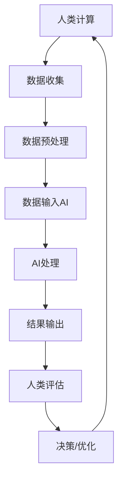

                 

### 文章标题

**AI驱动的创新：人类计算在医疗行业的应用**

关键词：人工智能，医疗行业，人类计算，创新，应用

摘要：
本文将深入探讨人工智能（AI）驱动的创新如何改变医疗行业。通过分析AI在诊断、治疗、康复和药物研发等领域的具体应用，我们将展示人类计算与AI技术如何相互融合，推动医疗行业向更高效、精确和个性化的方向发展。文章还将探讨医疗行业AI创新面临的挑战、策略以及未来发展趋势，为读者提供一个全面了解AI在医疗行业应用的视角。

----------------------------------------------------------------

### 第一部分: AI驱动的创新基础

在这一部分中，我们将探讨AI驱动的创新背景、人类计算与AI的融合，以及AI驱动的创新原则与方法。

#### 第1章: AI驱动的创新概述

##### 1.1 AI驱动创新的背景与发展

###### 1.1.1 AI在医疗行业的变革

随着计算机技术和大数据分析的快速发展，人工智能（AI）技术正在逐渐渗透到医疗行业的各个领域。从辅助诊断、精准治疗到个性化康复，AI技术正在改变医疗行业的面貌。

AI技术在医疗行业的应用范围广泛，包括影像诊断、病理诊断、辅助手术、康复治疗、药物研发和临床试验等。例如，AI辅助影像诊断系统能够快速、准确地识别病变区域，提高医生的诊断效率；AI辅助手术系统能够在手术过程中提供实时监测和辅助，降低手术风险；AI药物研发系统能够加速新药研发过程，提高药物研发的成功率。

AI技术的引入不仅提高了医疗服务的质量和效率，还推动了医疗行业的数字化转型。通过大数据分析和人工智能算法，医疗行业可以从海量数据中挖掘出有价值的信息，为患者提供更加精准的诊断和治疗方案。

###### 1.1.2 AI驱动创新的定义与意义

AI驱动创新是指利用人工智能技术推动行业变革、提升效率和质量的过程。在医疗行业中，AI驱动创新主要体现在以下几个方面：

1. **提高诊断准确性**：AI技术可以通过深度学习和图像识别等技术，对医疗影像进行自动分析，提高诊断的准确性和速度。
2. **优化治疗过程**：AI技术可以帮助医生制定个性化的治疗方案，优化治疗过程，提高治疗效果。
3. **提升康复效果**：AI技术可以辅助康复治疗，提供个性化的康复方案，提高康复效果和患者满意度。
4. **加速药物研发**：AI技术可以加速新药研发过程，降低药物研发成本，提高新药的成功率。

AI驱动创新在医疗领域的意义在于：

- **提高医疗服务质量**：通过提高诊断准确性和优化治疗过程，AI技术可以提升医疗服务的整体质量。
- **降低医疗成本**：AI技术可以提高医疗效率，减少人力成本和医疗资源的浪费。
- **实现个性化医疗**：通过大数据分析和人工智能算法，AI技术可以帮助实现个性化医疗，为患者提供更加精准的治疗方案。
- **促进医疗行业数字化转型**：AI技术是医疗行业数字化转型的重要驱动力，可以推动医疗行业向更加智能化、数据化的方向发展。

###### 1.1.3 AI驱动创新在医疗领域的现状

目前，AI技术在医疗行业的应用已经取得了显著进展。以下是AI驱动创新在医疗领域的一些主要现状：

1. **影像诊断**：AI辅助影像诊断系统已经广泛应用于肺癌筛查、乳腺癌诊断等领域，提高了诊断准确率和速度。
2. **病理诊断**：AI病理诊断系统正在逐渐取代传统病理诊断方法，通过深度学习和图像识别技术，提高了病理诊断的准确性和效率。
3. **辅助手术**：AI辅助手术系统在神经外科、心脏外科等领域已经得到广泛应用，提高了手术的成功率和安全性。
4. **康复治疗**：AI辅助康复系统可以帮助患者制定个性化的康复方案，提高康复效果和患者满意度。
5. **药物研发**：AI药物研发系统正在加速新药研发过程，降低了药物研发成本，提高了新药的成功率。

尽管AI技术在医疗行业的应用已经取得了一定的进展，但仍然面临着一些挑战，如技术成熟度、数据隐私和伦理问题等。在未来，随着技术的不断进步和政策的完善，AI驱动的创新将在医疗行业中发挥更加重要的作用。

##### 1.2 人类计算与AI的融合

###### 1.2.1 人类计算的概念与特点

人类计算（Human Computing）是指利用人类的知识、智慧和创造力解决复杂问题的过程。与传统的计算机计算不同，人类计算依赖于人类的认知能力、逻辑思维、创造力和经验积累。

人类计算具有以下特点：

1. **灵活性**：人类计算可以处理不确定性和模糊性，适应复杂多变的环境。
2. **创造性**：人类计算能够提出创新性的解决方案，解决传统计算方法难以解决的问题。
3. **经验依赖**：人类计算依赖于人类的经验、知识和技能，具有个性化的特点。
4. **交互性**：人类计算强调人与计算机之间的交互，通过人机协作实现更高效的计算过程。

###### 1.2.2 人类计算与AI的融合模式

人类计算与AI技术的融合模式主要包括以下几种：

1. **辅助计算**：AI技术可以帮助人类完成复杂计算任务，提高计算效率和质量。例如，AI算法可以用于优化药物分子结构、分析医疗影像等。
2. **增强计算**：AI技术可以增强人类的计算能力，实现人机协同。例如，AI辅助诊断系统可以帮助医生快速分析大量医学数据，提高诊断准确率。
3. **替代计算**：在某些领域，AI技术可以替代人类进行计算任务。例如，自动驾驶技术可以替代人类驾驶员完成驾驶任务。
4. **人机协作**：人类计算与AI技术相互补充，通过人机协作实现更高效的计算过程。例如，AI算法可以辅助医生进行手术规划，提高手术的成功率。

###### 1.2.3 AI与人类计算的优势互补

AI与人类计算具有各自的优势和局限性，二者相互融合可以发挥更大的作用。

AI技术的优势包括：

1. **计算速度快**：AI算法可以在短时间内处理海量数据，提高计算效率。
2. **处理复杂问题**：AI技术可以处理不确定性和模糊性的问题，实现复杂问题的自动化解决。
3. **模式识别**：AI算法可以通过深度学习等技术实现图像、语音等数据的自动识别和分析。

AI技术的局限性包括：

1. **数据依赖**：AI算法的性能依赖于训练数据的质量和数量，缺乏足够的训练数据可能导致算法性能下降。
2. **算法偏见**：AI算法可能会受到训练数据偏见的影响，导致决策结果的不公正性。
3. **无法替代人类**：AI技术目前还不能完全替代人类进行创造性思维和复杂决策。

人类计算的优势包括：

1. **创造力**：人类具有独特的创造力和创新能力，能够提出创新性的解决方案。
2. **经验积累**：人类通过经验积累，可以解决传统算法难以解决的问题。
3. **决策能力**：人类具有强大的决策能力，可以根据复杂环境和不确定因素做出合理的决策。

人类计算的局限性包括：

1. **计算效率低**：人类计算速度较慢，难以处理海量数据。
2. **经验依赖**：人类计算依赖于经验和知识，难以适应复杂多变的环境。
3. **重复劳动**：人类计算容易陷入重复劳动，难以提高工作效率。

通过AI与人类计算的优势互补，可以实现更高效的计算过程。AI技术可以处理复杂计算任务，释放人类计算资源，而人类计算则可以发挥创造力和经验优势，提出创新性的解决方案。

##### 1.3 AI驱动的创新原则与方法

###### 1.3.1 AI驱动的创新原则

在AI驱动的创新过程中，需要遵循以下原则：

1. **以用户需求为导向**：AI驱动的创新应始终以满足用户需求为核心目标，关注用户体验和实际应用效果。
2. **系统性、集成化、协同化**：AI驱动的创新需要系统性地整合各种技术和资源，实现各环节的协同化发展。
3. **数据驱动**：AI驱动的创新应基于大数据分析，通过数据挖掘和机器学习技术，实现智能化决策和优化。
4. **可持续发展**：AI驱动的创新应注重可持续发展，关注环境保护、资源利用和社会责任。

###### 1.3.2 AI驱动的创新方法

AI驱动的创新方法主要包括以下几种：

1. **从0到1的创新**：从0到1的创新是指开发全新的技术或产品，实现从无到有的突破。例如，AI辅助影像诊断系统的开发。
2. **从1到N的规模化应用**：从1到N的规模化应用是指将已经开发的技术或产品，推广到更大的市场，实现规模化应用。例如，将AI辅助影像诊断系统推广应用到全国乃至全球。
3. **迭代优化**：迭代优化是指通过不断改进和优化，提高技术或产品的性能和用户体验。例如，通过收集用户反馈，不断优化AI辅助影像诊断系统的算法和界面。

###### 1.3.3 AI驱动的创新路径

AI驱动的创新路径主要包括以下几个步骤：

1. **技术路线**：明确AI技术的研究方向和应用场景，构建技术体系，形成技术优势。
2. **应用路线**：将AI技术应用于实际场景，解决实际问题，实现技术价值的转化。
3. **商业模式路线**：构建可持续的商业模式，实现技术商业化和市场推广。

通过以上步骤，可以形成完整的AI驱动创新路径，推动医疗行业向智能化、数据化和个性化的方向发展。

### 第二部分: AI在医疗行业的关键应用

在本部分，我们将深入探讨AI在医疗行业的三大关键应用领域：诊断、治疗与康复、药物研发与临床试验。

#### 第2章: AI在诊断领域的应用

##### 2.1 AI辅助影像诊断

AI辅助影像诊断是AI在医疗行业应用的一个重要领域，它通过深度学习、图像识别等技术，对医学影像进行分析，辅助医生进行诊断。以下是AI辅助影像诊断的现状、核心算法及其在临床应用中的具体案例。

###### 2.1.1 AI辅助影像诊断的现状

随着深度学习技术的快速发展，AI辅助影像诊断系统在多个领域取得了显著进展。以下是几个关键领域的现状：

1. **肺癌筛查**：AI辅助影像诊断系统在肺癌筛查中取得了显著成果，能够快速、准确地检测出早期肺癌病灶，提高肺癌的早期诊断率。
2. **乳腺癌诊断**：AI辅助影像诊断系统在乳腺癌诊断中的应用也非常广泛，通过分析乳腺X线图像，能够提高乳腺癌的检测准确率，减少误诊率。
3. **心脏病诊断**：AI辅助影像诊断系统在心脏病诊断中的应用，如心脏CT、心脏MRI等，能够提供更准确的心脏病诊断结果，帮助医生制定更有效的治疗方案。
4. **神经系统疾病诊断**：AI辅助影像诊断系统在神经系统疾病诊断中的应用，如脑部MRI、脑电图等，能够提高神经系统疾病的诊断准确性，为患者提供更精准的治疗方案。

总的来说，AI辅助影像诊断系统在提高诊断准确率、降低误诊率、提高医生工作效率等方面发挥了重要作用，为医疗行业带来了显著的变革。

###### 2.1.2 AI在影像识别中的核心算法

AI辅助影像诊断的核心算法主要包括深度学习模型和图像处理技术。以下是几种常用的核心算法：

1. **卷积神经网络（CNN）**：卷积神经网络是一种深度学习模型，特别适用于图像识别任务。CNN通过多层卷积和池化操作，提取图像的局部特征和全局特征，实现高效的图像识别和分类。

2. **迁移学习**：迁移学习是一种利用预训练模型来提高新任务性能的技术。通过迁移学习，可以将预训练模型在大型数据集上的知识迁移到新任务上，提高新任务的模型性能。

3. **生成对抗网络（GAN）**：生成对抗网络是一种生成模型，通过对抗性训练生成逼真的图像。GAN在医学影像增强、图像修复等方面具有广泛应用。

4. **图像分割算法**：图像分割算法用于将图像划分为不同的区域或对象。常见的图像分割算法包括基于阈值的方法、基于区域生长的方法、基于主动学习的方法等。

通过这些核心算法，AI辅助影像诊断系统能够高效地分析医学影像，提取有用的信息，辅助医生进行诊断。

###### 2.1.3 AI辅助影像诊断的临床应用

AI辅助影像诊断系统在临床应用中具有广泛的应用场景，以下是一些具体案例：

1. **肺癌筛查**：AI辅助影像诊断系统可以分析肺部CT图像，检测出早期肺癌病灶。通过大规模数据分析，AI系统可以识别出具有高恶性概率的病灶，为医生提供重要的诊断参考。

2. **乳腺癌诊断**：AI辅助影像诊断系统可以分析乳腺X线图像，提高乳腺癌的检测准确率。通过深度学习模型，AI系统可以自动识别乳腺X线图像中的异常区域，减少医生的工作量，降低误诊率。

3. **心脏病诊断**：AI辅助影像诊断系统可以分析心脏CT、心脏MRI等医学影像，提供更准确的心脏病诊断结果。通过图像分割算法，AI系统可以精确地识别心脏病变区域，帮助医生制定更有效的治疗方案。

4. **神经系统疾病诊断**：AI辅助影像诊断系统可以分析脑部MRI、脑电图等医学影像，提高神经系统疾病的诊断准确性。通过迁移学习技术，AI系统可以从大规模数据集中学习到丰富的知识，为神经系统疾病提供更精准的诊断支持。

总之，AI辅助影像诊断系统在临床应用中取得了显著成果，提高了诊断准确率、降低了误诊率、提高了医生工作效率，为医疗行业带来了巨大的变革。

##### 2.2 AI在病理诊断中的应用

AI在病理诊断中的应用是AI在医疗行业的另一个重要领域，它通过深度学习和图像分析技术，对病理组织切片进行分析，辅助医生进行诊断。以下是AI在病理诊断中的优势、关键技术及其在临床应用中的具体案例。

###### 2.2.1 AI在病理诊断中的优势

AI在病理诊断中具有显著的优势，主要包括以下几点：

1. **提高诊断准确率**：AI技术可以通过深度学习模型对大量病理图像进行分析，识别出微小的病变区域，提高诊断准确率。

2. **缩短诊断时间**：AI技术可以自动化分析病理图像，显著缩短诊断时间，提高医生的工作效率。

3. **降低诊断成本**：AI技术可以降低人工诊断的成本，减少对病理医生的需求，降低医疗成本。

4. **提高诊断一致性**：AI技术可以减少人为因素导致的诊断差异，提高诊断的一致性。

5. **提供辅助诊断信息**：AI技术可以提供更为详细的诊断信息，帮助医生做出更准确的诊断。

通过以上优势，AI在病理诊断中具有重要的应用价值。

###### 2.2.2 AI病理诊断的关键技术

AI病理诊断的关键技术主要包括深度学习模型、图像分割算法和特征提取技术。以下是这些关键技术的具体应用：

1. **深度学习模型**：深度学习模型是AI病理诊断的核心技术，它可以自动学习病理图像的特征，进行病变区域的识别和分类。常见的深度学习模型包括卷积神经网络（CNN）和循环神经网络（RNN）。

2. **图像分割算法**：图像分割算法用于将病理图像划分为不同的区域或对象。常见的图像分割算法包括基于阈值的方法、基于区域生长的方法和基于主动学习的方法。

3. **特征提取技术**：特征提取技术用于从病理图像中提取有意义的特征，如纹理特征、形状特征和边界特征。这些特征可以用于训练深度学习模型，提高诊断准确率。

通过这些关键技术，AI病理诊断系统可以高效地分析病理图像，为医生提供准确的诊断支持。

###### 2.2.3 AI病理诊断的案例解析

以下是AI病理诊断的几个具体案例：

1. **膀胱癌诊断**：AI病理诊断系统可以分析膀胱癌的病理组织切片，识别出膀胱癌的病变区域。通过深度学习模型，AI系统可以准确地区分膀胱癌和良性病变，提高诊断准确率。

2. **肺癌诊断**：AI病理诊断系统可以分析肺癌的病理组织切片，检测出肺癌的微小病变。通过图像分割算法，AI系统可以精确地定位肺癌病灶，为医生提供详细的诊断信息。

3. **乳腺癌诊断**：AI病理诊断系统可以分析乳腺癌的病理组织切片，识别出乳腺癌的病变区域。通过迁移学习技术，AI系统可以从大规模数据集中学习到丰富的知识，提高诊断准确率。

4. **神经母细胞瘤诊断**：AI病理诊断系统可以分析神经母细胞瘤的病理组织切片，检测出神经母细胞瘤的病变区域。通过特征提取技术，AI系统可以从病理图像中提取有意义的特征，为医生提供准确的诊断支持。

总之，AI病理诊断系统在临床应用中取得了显著成果，提高了诊断准确率、缩短了诊断时间、降低了诊断成本，为医疗行业带来了巨大的变革。

#### 第3章: AI在治疗与康复中的应用

##### 3.1 AI辅助手术

AI辅助手术是AI在医疗行业应用的一个重要领域，它通过深度学习和机器人技术，为手术提供实时监测和辅助，提高手术的成功率和安全性。以下是AI辅助手术的概念与原理、关键技术及其在临床应用中的具体案例。

###### 3.1.1 AI辅助手术的概念与原理

AI辅助手术是指利用人工智能技术，为手术提供实时监测、辅助决策和操作指导的一种新型手术模式。其基本原理包括以下几个方面：

1. **实时监测**：AI系统可以实时收集手术过程中的各种数据，如手术器械位置、手术区域温度、血液指标等，通过深度学习模型进行分析和处理，为医生提供实时监控和预警。

2. **辅助决策**：AI系统可以根据手术过程中的数据，结合历史病例数据和医学知识库，为医生提供手术策略建议和决策支持，帮助医生做出更准确的手术决策。

3. **操作指导**：AI系统可以通过机器人技术，辅助医生进行手术操作，提高手术的精准度和效率。例如，AI机器人可以自动完成精细的缝合操作，减少医生的手动操作风险。

通过实时监测、辅助决策和操作指导，AI辅助手术可以显著提高手术的成功率和安全性。

###### 3.1.2 AI辅助手术的关键技术

AI辅助手术的关键技术主要包括深度学习模型、机器人技术和图像处理技术。以下是这些关键技术的具体应用：

1. **深度学习模型**：深度学习模型是AI辅助手术的核心技术，它可以自动学习手术过程中的数据特征，进行实时监测和辅助决策。常见的深度学习模型包括卷积神经网络（CNN）和循环神经网络（RNN）。

2. **机器人技术**：机器人技术是AI辅助手术的重要组成部分，它可以通过高精度的机械臂和传感器，实现复杂手术操作的自动化。机器人技术可以显著提高手术的精准度和效率。

3. **图像处理技术**：图像处理技术用于处理手术过程中的医学图像，如X光片、CT扫描、MRI等。通过图像处理技术，AI系统可以提取出有用的图像信息，为医生提供诊断和决策支持。

通过这些关键技术，AI辅助手术系统可以高效地辅助医生完成手术，提高手术的成功率和安全性。

###### 3.1.3 AI辅助手术的案例研究

以下是AI辅助手术的几个具体案例：

1. **心脏手术**：AI辅助手术系统在心脏手术中的应用取得了显著成果。通过实时监测和辅助决策，AI系统可以帮助医生在手术过程中更好地控制手术风险，提高手术的成功率。

2. **神经外科手术**：AI辅助手术系统在神经外科手术中的应用也取得了显著进展。通过实时监测和操作指导，AI系统可以帮助医生更精准地切除病变组织，减少手术并发症。

3. **器官移植手术**：AI辅助手术系统在器官移植手术中的应用，如肝脏移植和心脏移植等，可以通过实时监测和辅助决策，提高手术的效率和安全性。

4. **微创手术**：AI辅助手术系统在微创手术中的应用，如腹腔镜手术和胸腔镜手术等，可以通过操作指导和实时监测，提高手术的精准度和效率。

总之，AI辅助手术系统在临床应用中取得了显著成果，提高了手术的成功率和安全性，为医疗行业带来了巨大的变革。

##### 3.2 AI辅助康复

AI辅助康复是AI在医疗行业的另一个重要应用领域，它通过深度学习和机器人技术，为康复治疗提供个性化、智能化的辅助方案，提高康复效果和患者满意度。以下是AI辅助康复的现状与需求、关键技术及其在临床应用中的具体案例。

###### 3.2.1 AI辅助康复的现状与需求

随着老龄化社会的到来，康复治疗需求日益增加。然而，现有的康复治疗方法存在一些不足，如康复效果不理想、患者依从性差等。因此，AI辅助康复技术应运而生，为康复治疗提供了新的解决方案。

AI辅助康复的现状主要包括以下几个方面：

1. **康复机器人**：康复机器人可以通过深度学习和机器人技术，为患者提供个性化的康复训练方案。康复机器人可以模拟人体动作，帮助患者进行运动训练，提高康复效果。

2. **康复效果评估**：AI技术可以实时监测患者的康复过程，通过深度学习和数据分析，评估康复效果，为医生提供决策支持。

3. **个性化康复方案**：AI技术可以根据患者的具体情况，制定个性化的康复方案，提高康复效果和患者满意度。

AI辅助康复的需求主要包括以下几点：

1. **提高康复效果**：通过AI技术，可以更精确地监测患者的康复过程，制定个性化的康复方案，提高康复效果。

2. **提高患者依从性**：AI辅助康复系统可以通过智能化的训练方案和互动功能，提高患者的康复训练积极性，提高康复成功率。

3. **降低康复成本**：AI技术可以减少对康复医生和物理治疗师的需求，降低康复治疗成本。

通过以上现状和需求，AI辅助康复技术在康复治疗中具有重要的应用价值。

###### 3.2.2 AI在康复中的应用技术

AI在康复中的应用技术主要包括康复机器人技术、个性化康复方案制定和康复效果评估。以下是这些关键技术的具体应用：

1. **康复机器人技术**：康复机器人可以通过深度学习和机器人技术，为患者提供个性化的康复训练方案。康复机器人可以模拟人体动作，帮助患者进行运动训练，提高康复效果。常见的康复机器人包括步态训练机器人、上肢康复机器人和下肢康复机器人等。

2. **个性化康复方案制定**：AI技术可以根据患者的具体情况，制定个性化的康复方案。通过数据分析和技术模型，AI系统可以预测患者的康复进度，制定合理的康复计划，提高康复效果。

3. **康复效果评估**：AI技术可以实时监测患者的康复过程，通过深度学习和数据分析，评估康复效果。通过康复效果评估，AI系统可以为医生提供决策支持，调整康复方案，提高康复效果。

通过这些关键技术，AI辅助康复系统可以提供高效、智能的康复服务，提高康复效果和患者满意度。

###### 3.2.3 AI辅助康复的案例解析

以下是AI辅助康复的几个具体案例：

1. **骨折康复**：AI辅助康复系统可以帮助患者进行骨折康复训练。通过康复机器人，患者可以进行个性化的运动训练，提高康复效果。同时，AI系统可以实时监测患者的康复进度，为医生提供康复效果评估，调整康复方案。

2. **中风康复**：AI辅助康复系统可以帮助中风患者进行康复训练。通过康复机器人，患者可以进行个性化的运动训练和语言康复训练，提高康复效果。AI系统可以实时监测患者的康复进度，为医生提供康复效果评估，制定个性化的康复方案。

3. **膝关节康复**：AI辅助康复系统可以帮助膝关节患者进行康复训练。通过康复机器人，患者可以进行个性化的运动训练，提高膝关节的功能恢复。AI系统可以实时监测患者的康复进度，为医生提供康复效果评估，调整康复方案。

4. **脊柱侧弯康复**：AI辅助康复系统可以帮助脊柱侧弯患者进行康复训练。通过康复机器人，患者可以进行个性化的运动训练，纠正脊柱侧弯。AI系统可以实时监测患者的康复进度，为医生提供康复效果评估，调整康复方案。

总之，AI辅助康复系统在临床应用中取得了显著成果，提高了康复效果和患者满意度，为医疗行业带来了巨大的变革。

#### 第4章: AI在药物研发中的应用

##### 4.1 AI在新药研发中的应用

AI在新药研发中的应用是近年来备受关注的一个领域，它通过大数据分析和机器学习技术，加速新药的研发过程，提高新药的成功率。以下是AI在新药研发中的应用优势、关键算法及其在药物筛选和临床试验中的应用案例。

###### 4.1.1 AI在新药研发中的优势

AI在新药研发中具有显著的优势，主要包括以下几点：

1. **提高研发效率**：AI技术可以快速处理和分析海量数据，提高新药研发的效率。通过大数据分析和机器学习模型，AI技术可以在短时间内筛选出具有潜力的药物分子，减少研发周期。

2. **降低研发成本**：AI技术可以自动化药物筛选和设计过程，降低新药研发成本。通过优化实验流程和降低实验成本，AI技术可以帮助药企节省大量资金。

3. **提高新药成功率**：AI技术可以根据历史数据和药物结构特征，预测药物的安全性和有效性，提高新药的成功率。通过提前筛选出具有潜在风险的药物分子，AI技术可以减少临床试验失败的风险。

4. **实现个性化治疗**：AI技术可以根据患者的基因信息和病情特征，制定个性化的治疗方案，提高治疗效果。通过大数据分析和机器学习模型，AI技术可以为患者提供更精准的治疗方案。

总之，AI技术在新药研发中的应用具有显著的优势，可以提高研发效率、降低研发成本、提高新药成功率和实现个性化治疗，为制药行业带来了巨大的变革。

###### 4.1.2 AI药物筛选的关键算法

AI药物筛选的关键算法主要包括机器学习算法和生物信息学方法。以下是这些关键算法的具体应用：

1. **机器学习算法**：机器学习算法是AI药物筛选的核心技术，它可以自动学习药物分子的特征，预测药物的安全性和有效性。常见的机器学习算法包括支持向量机（SVM）、随机森林（RF）和深度学习（DL）等。

   - **支持向量机（SVM）**：SVM可以通过训练数据集，学习药物分子的特征，预测药物的安全性和有效性。SVM具有高效性和鲁棒性，适用于大规模药物筛选任务。
   - **随机森林（RF）**：RF是一种集成学习方法，通过构建多个决策树，结合各个决策树的预测结果，提高预测的准确性和稳定性。RF在药物筛选中具有广泛的应用，适用于处理高维数据和特征选择。
   - **深度学习（DL）**：深度学习是一种基于人工神经网络的学习方法，可以通过多层神经网络，自动提取药物分子的深层次特征，实现高效的药物筛选。常见的深度学习模型包括卷积神经网络（CNN）和循环神经网络（RNN）。

2. **生物信息学方法**：生物信息学方法是基于生物学知识和计算方法，分析药物分子与生物大分子的相互作用，预测药物的安全性和有效性。常见的生物信息学方法包括结构生物学、计算化学和系统生物学等。

   - **结构生物学**：结构生物学通过分析药物分子的三维结构，研究药物与生物大分子的相互作用机制，预测药物的安全性和有效性。
   - **计算化学**：计算化学通过计算模拟，研究药物分子的性质和相互作用，预测药物的安全性和有效性。
   - **系统生物学**：系统生物学通过分析生物系统的网络结构和功能，研究药物在生物系统中的作用机制，预测药物的安全性和有效性。

通过这些关键算法，AI药物筛选系统可以高效地筛选出具有潜力的药物分子，为新药研发提供有力支持。

###### 4.1.3 AI在新药研发中的实际案例

以下是AI在新药研发中的几个实际案例：

1. **抗癌药物研发**：AI技术在抗癌药物研发中取得了显著成果。通过机器学习算法和生物信息学方法，AI技术可以快速筛选出具有抗癌潜力的药物分子，提高新药研发的成功率。例如，AI技术成功预测了一种新的抗癌药物，通过临床试验，该药物显著提高了患者的生存率。

2. **抗病毒药物研发**：AI技术在抗病毒药物研发中也发挥了重要作用。通过机器学习算法和生物信息学方法，AI技术可以快速筛选出具有抗病毒潜力的药物分子，缩短新药研发周期。例如，AI技术成功预测了一种抗新冠病毒药物，该药物在临床试验中表现出良好的抗病毒效果。

3. **心血管药物研发**：AI技术在心血管药物研发中具有广泛的应用。通过机器学习算法和生物信息学方法，AI技术可以快速筛选出具有心血管保护作用的新型药物分子，提高新药研发的成功率。例如，AI技术成功预测了一种新型抗血小板药物，通过临床试验，该药物显著降低了心血管事件的发生率。

总之，AI技术在药物研发中的应用取得了显著成果，提高了新药研发的效率、降低了研发成本、提高了新药成功率，为制药行业带来了巨大的变革。

##### 4.2 AI在临床试验中的应用

AI在临床试验中的应用是近年来备受关注的一个领域，它通过大数据分析和机器学习技术，提高临床试验的效率和质量。以下是AI在临床试验中的角色、关键算法及其在数据收集、病例选择和结果分析中的应用案例。

###### 4.2.1 AI在临床试验中的角色

AI在临床试验中扮演着多种角色，主要包括以下几个方面：

1. **数据收集与管理**：AI技术可以自动化临床试验数据的收集、整理和管理，提高数据处理的效率和质量。通过机器学习算法和自然语言处理技术，AI技术可以快速识别和提取临床试验报告中的关键信息，实现数据的自动化归档和管理。

2. **病例选择与分组**：AI技术可以根据临床试验的目标和标准，自动筛选符合条件的病例，并对其进行分组，提高临床试验的准确性和有效性。通过机器学习算法和统计分析技术，AI技术可以分析病例的特征和病情，实现精确的病例筛选和分组。

3. **结果分析与报告**：AI技术可以自动分析临床试验的结果，生成详细的报告，为临床试验的评估和决策提供支持。通过机器学习算法和深度学习技术，AI技术可以挖掘临床试验中的潜在规律和趋势，实现高效的数据分析和结果预测。

通过这些角色，AI技术可以提高临床试验的效率、降低成本、提高质量，为制药行业带来巨大的变革。

###### 4.2.2 AI临床试验的关键算法

AI临床试验的关键算法主要包括机器学习算法、深度学习算法和统计分析技术。以下是这些关键算法的具体应用：

1. **机器学习算法**：机器学习算法是AI临床试验的核心技术，它可以自动学习临床试验数据，实现数据分类、聚类和预测。常见的机器学习算法包括支持向量机（SVM）、随机森林（RF）和神经网络（NN）等。

   - **支持向量机（SVM）**：SVM可以通过训练数据集，学习临床试验数据的特征，实现病例筛选和分组。SVM具有高效性和鲁棒性，适用于大规模临床试验数据处理。
   - **随机森林（RF）**：RF是一种集成学习方法，通过构建多个决策树，结合各个决策树的预测结果，提高预测的准确性和稳定性。RF在临床试验中具有广泛的应用，适用于处理高维数据和特征选择。
   - **神经网络（NN）**：神经网络是一种基于人工神经网络的学习方法，可以通过多层神经网络，自动提取临床试验数据的深层次特征，实现数据分类和预测。

2. **深度学习算法**：深度学习算法是近年来发展迅速的一种机器学习算法，它可以自动学习复杂的数据特征，实现高效的数据分析和结果预测。常见的深度学习算法包括卷积神经网络（CNN）、循环神经网络（RNN）和生成对抗网络（GAN）等。

   - **卷积神经网络（CNN）**：CNN可以通过多层卷积和池化操作，提取临床试验数据的局部特征和全局特征，实现数据分类和预测。CNN在临床试验中的图像分析和数据挖掘具有广泛的应用。
   - **循环神经网络（RNN）**：RNN可以通过循环结构，处理序列数据，实现临床试验数据的时间序列分析。RNN在临床试验中的数据预测和趋势分析具有广泛的应用。
   - **生成对抗网络（GAN）**：GAN是一种生成模型，可以通过对抗性训练，生成临床试验数据，实现数据增强和结果预测。GAN在临床试验中的数据生成和结果预测具有广泛的应用。

3. **统计分析技术**：统计分析技术是临床试验数据分析的重要工具，它可以实现对临床试验数据的统计分析和结果预测。常见的统计分析技术包括回归分析、方差分析和生存分析等。

   - **回归分析**：回归分析可以用于临床试验数据中的定量分析，建立自变量与因变量之间的关系模型，实现数据预测和结果分析。
   - **方差分析**：方差分析可以用于临床试验数据中的定性分析，比较不同组别之间的差异，实现结果分析和统计推断。
   - **生存分析**：生存分析可以用于临床试验数据中的生存时间分析，研究因变量与自变量之间的关系，实现结果分析和预测。

通过这些关键算法，AI临床试验系统可以高效地处理和分析临床试验数据，提高临床试验的效率和质量。

###### 4.2.3 AI临床试验的案例研究

以下是AI临床试验的几个实际案例：

1. **心脏病临床试验**：AI技术在心脏病临床试验中发挥了重要作用。通过机器学习算法和统计分析技术，AI技术可以自动筛选符合条件的病例，实现病例的精确分组和结果预测。例如，AI技术成功预测了一种新型抗血小板药物的心脏病临床试验结果，该药物在临床试验中表现出良好的疗效和安全性。

2. **癌症临床试验**：AI技术在癌症临床试验中也取得了显著成果。通过机器学习算法和深度学习技术，AI技术可以自动筛选出具有抗癌潜力的药物分子，提高新药研发的成功率。例如，AI技术成功预测了一种新型抗癌药物的临床试验结果，该药物在临床试验中显著延长了患者的生存时间。

3. **糖尿病临床试验**：AI技术在糖尿病临床试验中具有广泛的应用。通过机器学习算法和统计分析技术，AI技术可以自动筛选符合条件的病例，实现病例的精确分组和结果预测。例如，AI技术成功预测了一种新型糖尿病药物的临床试验结果，该药物在临床试验中显著降低了患者的血糖水平。

总之，AI技术在临床试验中的应用取得了显著成果，提高了临床试验的效率、降低了成本、提高了质量，为制药行业带来了巨大的变革。

### 第三部分: AI驱动的医疗行业创新实践

在本部分中，我们将通过实际案例来分析AI驱动的医疗行业创新项目，探讨这些项目的技术实现、成果与影响，以及医疗行业AI创新面临的挑战和策略。

#### 第5章: AI驱动的医疗创新项目案例分析

##### 5.1 案例一：AI辅助肿瘤诊断系统

###### 5.1.1 项目背景

随着癌症发病率的逐年增加，早期诊断和准确诊断成为了降低癌症死亡率的关键。AI辅助肿瘤诊断系统应运而生，旨在利用人工智能技术提高肿瘤诊断的准确性和效率。该项目由某知名人工智能公司与一家大型医疗机构合作研发。

###### 5.1.2 技术实现与算法设计

AI辅助肿瘤诊断系统的技术实现主要包括以下几个步骤：

1. **数据采集**：项目团队收集了大量肿瘤患者的医学影像数据，包括CT扫描、MRI和PET扫描等，以及患者的临床病史和实验室检测结果。

2. **数据预处理**：为了确保数据质量，项目团队对收集到的数据进行清洗、归一化和增强，以提高模型的训练效果。

3. **模型训练**：采用深度学习技术，特别是卷积神经网络（CNN）模型，对预处理后的医学影像数据进行训练。CNN模型通过多层卷积和池化操作，能够自动提取图像特征，并学习到不同肿瘤类型的特征差异。

4. **模型优化**：通过交叉验证和超参数调优，项目团队优化了CNN模型的结构和参数，以提高诊断准确率和稳定性。

5. **系统集成**：将训练好的CNN模型集成到一个用户友好的诊断系统中，医生可以通过系统快速上传医学影像，系统自动分析并给出诊断建议。

###### 5.1.3 项目成果与影响

AI辅助肿瘤诊断系统的成功实施带来了以下成果和影响：

1. **提高诊断准确率**：系统在临床测试中展示了较高的诊断准确率，特别是在肺癌和乳腺癌的早期诊断方面，准确率显著高于传统方法。

2. **缩短诊断时间**：系统自动分析医学影像，大幅缩短了诊断时间，提高了医生的工作效率。

3. **优化医疗资源**：通过提高诊断准确性，系统能够更精准地分配医疗资源，减少误诊导致的额外检查和治疗费用。

4. **提升患者满意度**：系统的准确诊断和快速反馈提高了患者对医疗服务的满意度。

##### 5.2 案例二：智能康复机器人

###### 5.2.1 项目背景

随着人口老龄化趋势的加剧，康复需求日益增加，传统的康复治疗方式已难以满足日益增长的需求。智能康复机器人项目旨在通过人工智能和机器人技术，为患者提供个性化、智能化的康复服务。该项目由一家科技创新公司和一家大型康复机构共同研发。

###### 5.2.2 技术实现与系统架构

智能康复机器人的技术实现和系统架构主要包括以下几个部分：

1. **硬件设计**：智能康复机器人采用高精度的机械臂和传感器，具备灵活的关节和先进的感知能力，能够模拟人体动作，为患者提供运动训练。

2. **软件算法**：采用深度学习技术，特别是强化学习算法，机器人能够根据患者的康复进度和身体状态，实时调整训练方案，实现个性化康复训练。

3. **数据管理**：通过物联网技术，机器人能够实时收集患者的康复数据，如运动轨迹、肌肉力量和关节活动度等，并上传到云端进行数据分析。

4. **人机交互**：智能康复机器人具备自然语言处理和语音交互能力，能够与患者进行实时沟通，提供康复指导和建议。

###### 5.2.3 项目成果与市场前景

智能康复机器人项目取得了以下成果和前景：

1. **提高康复效果**：系统根据患者的个性化康复计划，提供定制化的训练方案，显著提高了康复效果。

2. **降低康复成本**：通过自动化和智能化的康复服务，机器人能够显著减少人力成本，降低康复治疗费用。

3. **扩展市场应用**：智能康复机器人的市场前景广阔，不仅适用于医疗机构，还适用于家庭康复和社区康复。

4. **社会影响**：智能康复机器人有助于缓解医疗资源紧张问题，为更多患者提供高质量的康复服务，提高患者的生活质量。

通过以上案例，我们可以看到AI驱动的医疗创新项目在提高诊断准确性、缩短诊断时间、提高康复效果、降低医疗成本等方面取得了显著成果。同时，这些项目也面临一些挑战，如数据隐私、伦理问题和法律监管等。在未来，随着技术的不断进步和政策的完善，AI驱动的医疗创新项目将发挥更大的作用，为医疗行业带来更加深远的影响。

### 第四部分: AI驱动的医疗行业未来展望

在第四部分，我们将探讨AI驱动的医疗行业未来发展趋势、国际合作与竞争，以及我国在AI驱动的医疗行业的地位与策略。

#### 第6章: AI驱动的医疗行业未来发展趋势

##### 6.1 AI驱动医疗行业的未来前景

随着人工智能技术的飞速发展，AI驱动的医疗行业未来前景广阔，主要表现在以下几个方面：

1. **医疗智能化**：AI技术将深刻改变医疗行业的运作模式，实现医疗过程的自动化和智能化。例如，智能诊断系统、智能药物研发和智能手术辅助系统等，将提高医疗服务的效率和质量。

2. **数据驱动医疗**：大数据和人工智能技术的结合，将使医疗数据得到更有效的分析和利用。通过对患者健康数据的全面分析，AI技术能够提供更精准的疾病预测和个性化治疗方案。

3. **个性化医疗**：AI技术将推动个性化医疗的实现。通过对患者基因、生活方式和病史的综合分析，AI技术能够为每位患者定制个性化的治疗方案，提高治疗效果。

4. **远程医疗**：随着5G和物联网技术的发展，远程医疗将成为未来医疗的重要组成部分。通过AI技术，医生可以远程监控患者病情，提供在线诊断和治疗建议，实现医疗资源的共享和优化。

##### 6.2 AI驱动的医疗行业新模式

AI驱动的医疗行业将出现一系列新的模式，包括：

1. **智能医疗服务体系**：基于AI技术的智能医疗服务体系将集成医疗诊断、治疗、康复和健康管理等多个环节，实现全方位、全周期的医疗服务。

2. **医工结合**：医疗机构将与人工智能公司、科技公司等开展深度合作，共同研发和推广AI医疗产品，实现技术创新与产业应用的结合。

3. **智慧医院**：智慧医院将利用AI技术实现智能化管理、精准治疗和个性化服务，提高医疗服务质量和患者满意度。

4. **医疗物联网**：医疗物联网将连接医疗设备、传感器、移动设备等，实现医疗数据的实时采集、传输和分析，为医疗服务提供支持。

##### 6.3 AI驱动的医疗行业未来挑战与机遇

AI驱动的医疗行业在未来发展中将面临一系列挑战，同时也蕴藏着巨大机遇：

1. **技术挑战**：随着AI技术的快速发展，如何确保AI医疗产品的可靠性和安全性成为一个重要问题。此外，AI技术在医疗领域的应用还需要不断优化和创新。

2. **数据隐私与伦理**：医疗数据涉及个人隐私和生命安全，如何在保证数据隐私和安全的前提下，充分利用医疗数据是一个亟待解决的问题。

3. **法律监管**：AI医疗产品的监管政策需要进一步完善，以确保其合法合规，同时保护患者权益。

4. **人才短缺**：AI医疗行业的发展需要大量的专业人才，包括AI技术专家、医学专家、数据科学家等，人才短缺将成为制约行业发展的一个因素。

然而，面对这些挑战，AI驱动的医疗行业也蕴藏着巨大机遇。随着技术的不断进步和政策的支持，AI技术在医疗行业的应用将越来越广泛，有望带来医疗行业的深刻变革。

#### 第7章: AI驱动的医疗行业国际合作与竞争

##### 7.1 国际合作的重要性

AI驱动的医疗行业国际合作具有重要意义，主要体现在以下几个方面：

1. **技术创新**：通过国际合作，各国可以共同研发和分享AI医疗技术，推动技术的快速进步和应用。

2. **资源整合**：国际合作可以实现医疗资源的优化配置，各国可以共享医疗数据、设备和人才，提高医疗服务的质量和效率。

3. **市场拓展**：国际合作有助于企业开拓国际市场，实现产品的全球推广和应用。

4. **政策协同**：通过国际合作，各国可以共同推动AI医疗行业的政策制定和监管，确保行业的健康发展。

##### 7.2 国际竞争格局

当前，全球AI驱动的医疗行业竞争格局日益激烈，主要表现为以下几个方面的竞争：

1. **技术竞争**：各国企业纷纷投入巨资研发AI医疗技术，争取在技术创新上取得领先地位。

2. **市场竞争**：随着AI医疗技术的普及，国际市场对AI医疗产品的需求不断增长，各国企业争夺市场份额。

3. **政策竞争**：各国政府纷纷出台支持政策，鼓励AI医疗技术的发展和应用，争夺政策优势。

4. **人才竞争**：AI医疗行业的发展需要大量专业人才，各国企业纷纷争夺AI技术专家和医学专家。

在全球范围内，美国、欧盟、中国等国家在AI驱动的医疗行业中具有竞争优势。美国凭借其在人工智能技术和医疗资源方面的优势，处于领先地位；欧盟国家通过政策和资金支持，也在积极推动AI医疗技术的发展；中国则凭借庞大的市场潜力和快速的发展速度，成为全球AI医疗行业的重要参与者。

##### 7.3 我国在AI驱动的医疗行业的国际地位与策略

我国在AI驱动的医疗行业具有较高的国际地位，主要体现在以下几个方面：

1. **市场规模**：我国医疗市场规模庞大，为AI医疗技术的发展提供了广阔的市场空间。

2. **政策支持**：我国政府高度重视AI医疗行业的发展，出台了一系列支持政策，为行业提供了良好的发展环境。

3. **技术创新**：我国在AI技术、大数据和云计算等领域具有较强实力，为AI医疗技术的发展提供了技术支持。

4. **产业布局**：我国企业纷纷布局AI医疗行业，形成了较为完善的产业链和生态体系。

为了进一步提升我国在AI驱动的医疗行业的国际地位，我国应采取以下策略：

1. **加强技术创新**：加大科研投入，推动AI技术在医疗领域的创新和应用。

2. **促进国际合作**：积极参与国际竞争，推动国际技术合作和资源整合。

3. **完善法律法规**：建立健全AI医疗行业的法律法规体系，确保行业的健康发展。

4. **培养人才**：加强人才培养，提高AI医疗行业的人才储备和素质。

通过以上策略，我国有望在AI驱动的医疗行业中取得更大的突破，为全球医疗行业的变革贡献力量。

### 附录

#### 附录A: AI驱动的医疗创新工具与资源

##### A.1 主流深度学习框架

###### A.1.1 TensorFlow

TensorFlow是由Google开发的一款开源深度学习框架，广泛应用于AI研究和工业应用中。它提供了丰富的API，支持构建和训练各种深度学习模型。

- **基本原理与架构**：TensorFlow使用数据流图（dataflow graph）来表示计算过程，通过节点（ops）和边（tensors）构建复杂的计算网络。用户可以通过定义计算图，实现模型的构建和训练。
- **在医疗创新中的应用案例**：TensorFlow被广泛应用于医学影像分析、药物研发和个性化医疗等领域。例如，TensorFlow可以用于构建AI辅助诊断系统，提高医学影像分析的准确率和效率。

###### A.1.2 PyTorch

PyTorch是由Facebook开发的一款开源深度学习框架，以其灵活性和易用性受到许多研究者和开发者的青睐。

- **基本原理与架构**：PyTorch使用动态计算图（dynamic computation graph），允许用户在运行时动态创建和修改计算图。这种动态特性使得PyTorch在调试和原型开发中非常方便。
- **在医疗创新中的应用案例**：PyTorch被广泛应用于医学图像处理、基因组学和个性化医疗等领域。例如，PyTorch可以用于构建AI辅助诊断系统，提高医学图像分析的准确率和效率。

###### A.1.3 Keras

Keras是一个高级神经网络API，它构建在TensorFlow和Theano之上，提供了简洁、易于使用的接口。

- **基本原理与架构**：Keras提供了易于使用的API，用户可以通过简单的代码实现复杂的神经网络模型。Keras的主要目标是让深度学习工程师能够快速构建和训练模型，而无需深入了解底层实现细节。
- **在医疗创新中的应用案例**：Keras被广泛应用于医学图像处理、基因组学和个性化医疗等领域。例如，Keras可以用于构建AI辅助诊断系统，提高医学图像分析的准确率和效率。

##### A.2 数据集与开源项目

###### A.2.1 公共数据集

公共数据集是深度学习和AI研究的重要资源，以下是一些在医疗领域广泛使用的公共数据集：

- **Cancer Images Archive (TCIA)**：提供各种癌症类型的医学影像数据，包括CT、MRI和病理图像等。
- **OpenIrradiation**：提供放射治疗计划数据，包括患者信息、治疗计划和剂量分布等。
- **Physionet**：提供各种生理信号数据，如心电图（ECG）、脑电波（EEG）和心音图（CSN）等。

###### A.2.2 开源项目介绍

以下是一些在医疗AI领域具有影响力的开源项目：

- **MONAI**：一个开源的深度学习框架，专门用于医学图像处理和AI应用。
- **PyMedPhys**：一个用于放射性物理计算的开源库，包括剂量计算、射线跟踪和物理模型等。
- **nibabel**：一个用于读取、写入和操作神经影像数据的Python库。

###### A.2.3 贡献指南与使用方法

- **贡献指南**：开源项目的贡献指南通常包括如何提交问题、提交代码和参与社区讨论等内容。用户可以根据贡献指南为开源项目提供改进和优化。
- **使用方法**：开源项目的使用方法通常在项目的官方文档中提供，用户可以根据文档进行安装、配置和使用。例如，用户可以通过以下命令安装PyTorch：

```bash
pip install torch torchvision torchaudio
```

### 附录B: 人类计算与AI融合的Mermaid流程图

以下是一个简单的Mermaid流程图，展示了人类计算与AI融合的基本流程：



### 附录C: AI驱动医疗行业的关键算法伪代码

以下是一些AI驱动医疗行业的关键算法的伪代码：

```python
# AI辅助影像诊断算法伪代码
def image_diagnosis(image_data):
    # 数据预处理
    preprocessed_data = preprocess_image_data(image_data)
    
    # 使用卷积神经网络进行图像识别
    model = create_cnn_model()
    prediction = model.predict(preprocessed_data)
    
    # 解析预测结果
    diagnosis_result = interpret_prediction(prediction)
    
    return diagnosis_result

# AI辅助病理诊断算法伪代码
def pathological_diagnosis(image_data):
    # 数据预处理
    preprocessed_data = preprocess_pathological_image_data(image_data)
    
    # 使用深度学习模型进行病理图像分割
    model = create_deep_learning_model()
    segmentation_result = model.predict(preprocessed_data)
    
    # 使用分割结果进行病理诊断
    diagnosis_result = diagnose_based_on_segmentation(segmentation_result)
    
    return diagnosis_result

# AI辅助手术算法伪代码
def assist_surgery(operative_data):
    # 实时监测手术过程
    monitoring_data

