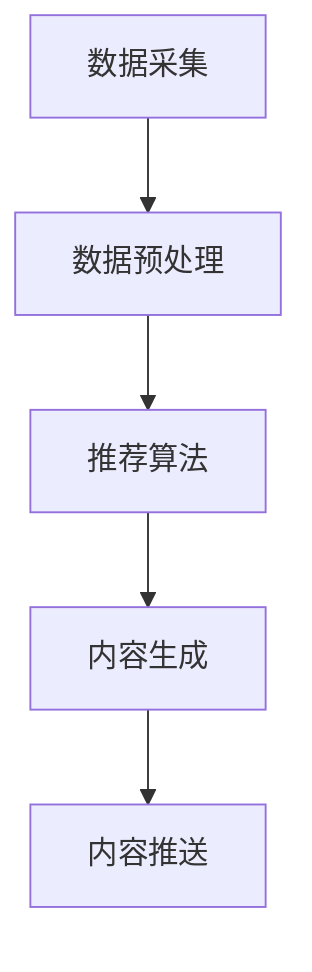

                 

# 《AI驱动的电商个性化推送内容生成》

## 关键词
AI、电商、个性化推送、内容生成、推荐系统、机器学习、自然语言处理、深度学习

## 摘要
随着电商行业的蓬勃发展，个性化推送成为了提升用户体验、提高转化率的重要手段。本文将深入探讨AI驱动的电商个性化推送内容生成技术，包括基础概念、算法原理、系统架构和未来发展趋势。通过详细分析和案例实战，本文旨在为电商从业者和技术人员提供全面的指导和参考。

----------------------------------------------------------------

## 第一部分：AI驱动的电商个性化推送基础

### 第1章：AI在电商个性化推送中的应用概述

#### 1.1 电商个性化推送的概念和重要性

**电商个性化推送的定义**  
电商个性化推送是指利用人工智能技术，根据用户的兴趣、行为和购买历史等数据，为用户推荐与其需求匹配的商品信息、促销活动和内容。这种推送方式旨在提高用户满意度，提升电商平台的销售额和用户留存率。

**电商个性化推送的重要性**  
- **提高用户体验**：通过个性化推送，用户能够更快地找到自己感兴趣的商品，提高购物体验。
- **增加销售转化率**：个性化推荐能够将潜在客户转化为实际购买，提高销售额。
- **提升用户粘性**：定期推送用户感兴趣的内容，增加用户对电商平台的依赖和忠诚度。

#### 1.2 AI技术对电商个性化推送的影响

**数据分析技术在电商中的应用**  
数据分析技术能够对海量用户行为数据进行挖掘和分析，提取出有价值的信息，为个性化推送提供依据。

**机器学习算法在个性化推荐中的应用**  
机器学习算法通过训练大量历史数据，学习用户行为模式，预测用户未来的兴趣和需求，从而实现精准推荐。

**自然语言处理技术在内容生成中的应用**  
自然语言处理技术能够理解和生成自然语言文本，为个性化推送生成个性化的商品描述、广告文案等内容。

#### 1.3 AI驱动的电商个性化推送案例分析

**国内外典型电商平台个性化推送案例**  
- **阿里巴巴**：通过阿里云ET大脑，实现个性化推荐和智能客服，提升用户购物体验。
- **亚马逊**：利用协同过滤和内容推荐算法，为用户提供个性化的商品推荐。

**AI驱动电商个性化推送的成功因素**  
- **数据积累**：积累大量用户行为数据和商品数据，为推荐算法提供训练素材。
- **算法优化**：持续优化推荐算法，提升推荐质量和效果。
- **用户体验**：关注用户反馈，不断优化推送内容和推送时机。

### 第2章：数据采集与处理

#### 2.1 数据来源和采集方法

**用户行为数据**  
用户行为数据包括浏览记录、点击记录、购买记录等，是构建个性化推荐系统的基础。

**商品属性数据**  
商品属性数据包括商品名称、价格、类别、品牌、评分等，用于描述商品的特征。

**网络文本数据**  
网络文本数据包括用户评价、商品描述、广告文案等，用于自然语言处理和内容生成。

#### 2.2 数据预处理与清洗

**数据预处理流程**  
- 数据清洗：去除重复数据、缺失值填充、异常值处理。
- 数据转换：将不同类型的数据转换为统一的格式。
- 数据集成：将不同来源的数据整合到一起。

**数据清洗方法**  
- 数据过滤：去除不符合要求的数据。
- 数据标准化：统一数据格式和单位。
- 数据归一化：将数据缩放到相同范围内。

**数据质量评估**  
通过评估数据完整性、一致性、准确性等指标，确保数据质量满足推荐算法的要求。

### 第3章：个性化推荐算法

#### 3.1 个性化推荐系统基本原理

**协同过滤算法**  
协同过滤算法通过分析用户之间的行为相似性，为用户推荐其他用户喜欢的商品。

**内容推荐算法**  
内容推荐算法通过分析商品的内容特征，为用户推荐与其兴趣相符的商品。

**混合推荐算法**  
混合推荐算法结合协同过滤和内容推荐算法的优势，提供更精准的推荐。

#### 3.2 基于用户行为的推荐算法

**基于内容分析的用户兴趣模型**  
通过分析用户浏览、点击、购买等行为，构建用户兴趣模型，用于推荐算法。

**基于协同过滤的推荐算法**  
基于协同过滤的推荐算法通过分析用户之间的相似性，为用户推荐其他用户喜欢的商品。

**基于矩阵分解的推荐算法**  
基于矩阵分解的推荐算法通过矩阵分解模型，将用户行为数据分解为用户特征和商品特征，用于推荐算法。

#### 3.3 基于深度学习的推荐算法

**深度学习推荐算法概述**  
深度学习推荐算法利用神经网络模型，从原始数据中自动学习用户行为模式和商品特征。

**基于卷积神经网络的推荐算法**  
基于卷积神经网络的推荐算法通过分析用户行为数据中的时空特征，提高推荐效果。

**基于循环神经网络的推荐算法**  
基于循环神经网络的推荐算法通过分析用户行为的序列特征，提高推荐精度。

### 第4章：内容生成与个性化推送

#### 4.1 内容生成的技术原理

**自然语言生成概述**  
自然语言生成技术通过生成式模型，自动生成自然语言文本。

**生成式对抗网络（GAN）在内容生成中的应用**  
生成式对抗网络（GAN）通过生成器和判别器的对抗训练，生成高质量的自然语言文本。

**序列到序列（Seq2Seq）模型在内容生成中的应用**  
序列到序列（Seq2Seq）模型通过将输入序列映射到输出序列，生成个性化的商品描述和广告文案。

#### 4.2 个性化内容生成算法

**基于用户兴趣的内容生成算法**  
通过分析用户兴趣模型，生成与用户兴趣相关的商品描述和广告文案。

**基于协同过滤的内容生成算法**  
通过分析用户行为数据，生成与用户相似用户喜欢的商品描述和广告文案。

**基于深度学习的内容生成算法**  
利用深度学习模型，从原始数据中自动学习生成规则，生成高质量的个性化内容。

#### 4.3 个性化内容推送策略

**个性化内容推送流程**  
个性化内容推送流程包括数据采集、数据预处理、推荐算法、内容生成和推送。

**个性化内容推送效果评估**  
通过评估推荐准确率、点击率、转化率等指标，评估个性化推送的效果。

**基于用户反馈的推送策略调整**  
通过收集用户反馈，调整推送内容和推送策略，提高用户满意度。

### 第5章：实战案例分析

#### 5.1 案例背景与目标

**案例背景**  
某电商平台希望通过AI技术实现个性化推送，提高用户转化率和满意度。

**案例目标**  
- 提升商品推荐准确率。
- 提高用户点击率和转化率。
- 提升用户购物体验。

#### 5.2 数据收集与处理

**数据来源**  
数据来源于用户行为数据、商品属性数据和网络文本数据。

**数据预处理**  
- 数据清洗：去除重复数据、缺失值填充、异常值处理。
- 数据转换：将不同类型的数据转换为统一的格式。
- 数据集成：将不同来源的数据整合到一起。

**数据质量评估**  
通过评估数据完整性、一致性、准确性等指标，确保数据质量满足推荐算法的要求。

#### 5.3 个性化推荐算法设计与实现

**算法选择与设计**  
采用基于深度学习的推荐算法，结合用户行为数据和商品属性数据。

**算法实现与调优**  
- 数据预处理：对数据进行处理，提取特征。
- 模型训练：使用训练数据训练深度学习模型。
- 模型调优：通过交叉验证和参数调整，提高模型效果。

**算法效果评估**  
通过评估推荐准确率、点击率、转化率等指标，评估算法效果。

#### 5.4 内容生成与个性化推送

**内容生成算法应用**  
采用生成式对抗网络（GAN）和序列到序列（Seq2Seq）模型，生成个性化的商品描述和广告文案。

**个性化推送策略设计**  
根据用户兴趣和购物行为，设计个性化的推送策略，提高用户满意度。

**推送效果分析**  
通过分析用户点击率、转化率等指标，评估推送效果，持续优化推送策略。

### 第6章：AI驱动的电商个性化推送系统架构

#### 6.1 系统架构设计

**系统总体架构**  
系统总体架构包括数据层、算法层和应用层。

**数据层设计**  
数据层负责数据采集、存储和处理。

**算法层设计**  
算法层负责推荐算法和内容生成算法的实现。

**应用层设计**  
应用层负责提供用户接口和业务逻辑。

#### 6.2 系统关键技术

**数据库与数据存储技术**  
使用分布式数据库和数据存储技术，保证数据的高效存储和访问。

**分布式计算与并行处理技术**  
采用分布式计算和并行处理技术，提高推荐算法和内容生成算法的运行效率。

**高可用性与容错技术**  
采用高可用性和容错技术，保证系统的稳定运行。

#### 6.3 系统部署与运维

**系统部署流程**  
系统部署流程包括环境搭建、代码部署、测试和上线等环节。

**系统运维与管理**  
系统运维与管理包括监控系统运行状态、处理异常问题和性能优化等任务。

**系统性能优化**  
通过优化数据库查询、缓存策略和网络传输等，提高系统性能。

### 第7章：AI驱动的电商个性化推送未来发展趋势

#### 7.1 新技术发展趋势

**跨媒体个性化推荐**  
跨媒体个性化推荐将整合多种媒体形式，提供更全面的个性化推荐服务。

**深度强化学习在个性化推荐中的应用**  
深度强化学习将提升个性化推荐算法的预测能力和决策能力。

**AI内容生成与审核**  
AI内容生成与审核将提高内容生成质量和减少人工审核工作量。

#### 7.2 商业模式创新

**AI驱动电商个性化推送的商业化路径**  
通过AI技术提升电商运营效率，实现商业模式创新。

**用户隐私保护与合规性**  
遵循用户隐私保护法规，实现合规性运营。

**数据安全与隐私保护**  
采用加密、脱敏等数据安全措施，保护用户数据安全。

### 附录

#### 附录A：常用工具与资源

**机器学习框架**  
- TensorFlow
- PyTorch
- Keras

**自然语言处理工具**  
- NLTK
- spaCy
- Stanford NLP

**数据分析工具**  
- Pandas
- NumPy
- Matplotlib

#### 附录B：Mermaid流程图与伪代码示例

**Mermaid流程图示例**



**伪代码示例**

```python
# 数据预处理
def preprocess_data(data):
    # 数据清洗
    cleaned_data = clean_data(data)
    # 数据转换
    transformed_data = transform_data(cleaned_data)
    return transformed_data

# 推荐算法
def recommend_algorithm(user, items):
    # 用户兴趣模型
    user_interest = build_user_interest_model(user)
    # 商品推荐
    recommendations = generate_recommendations(user_interest, items)
    return recommendations

# 内容生成
def generate_content(item, user):
    # 生成商品描述
    description = generate_description(item, user)
    # 生成广告文案
    ad_text = generate_ad_text(item, user)
    return description, ad_text
```

### 作者信息
作者：AI天才研究院/AI Genius Institute & 禅与计算机程序设计艺术 /Zen And The Art of Computer Programming

----------------------------------------------------------------

### 结束

---

### 附录A：常用工具与资源

#### A.1 机器学习框架

**TensorFlow**  
TensorFlow是一个开源的机器学习框架，由Google开发，广泛应用于深度学习和推荐系统。

**PyTorch**  
PyTorch是一个开源的机器学习库，由Facebook的人工智能研究团队开发，具有灵活的动态计算图和强大的GPU支持。

**Keras**  
Keras是一个高层神经网络API，能够以Python为接口，为TensorFlow和PyTorch等底层框架提供简化的操作。

#### A.2 自然语言处理工具

**NLTK**  
NLTK（自然语言工具包）是一个用于自然语言处理的免费开源工具包，提供了多种文本处理功能。

**spaCy**  
spaCy是一个强大的自然语言处理库，提供了快速和易于使用的工具，用于文本标注、实体识别等任务。

**Stanford NLP**  
Stanford NLP是一个开源的NLP工具包，由斯坦福大学开发，支持多种语言和丰富的NLP功能。

#### A.3 数据分析工具

**Pandas**  
Pandas是一个开源的数据分析库，提供了数据清洗、数据转换和数据操作等功能。

**NumPy**  
NumPy是一个开源的Python库，提供了高性能的数组操作和数学运算功能，是数据分析的基础工具。

**Matplotlib**  
Matplotlib是一个开源的图形库，用于创建高质量的二维图形和可视化。

### 附录B：Mermaid流程图与伪代码示例

#### B.1 Mermaid流程图示例


#### B.2 伪代码示例

```python
# 数据预处理
def preprocess_data(data):
    cleaned_data = clean_data(data)
    transformed_data = transform_data(cleaned_data)
    return transformed_data

# 推荐算法
def recommend_algorithm(user, items):
    user_interest = build_user_interest_model(user)
    recommendations = generate_recommendations(user_interest, items)
    return recommendations

# 内容生成
def generate_content(item, user):
    description = generate_description(item, user)
    ad_text = generate_ad_text(item, user)
    return description, ad_text
```

通过这些工具和资源，我们可以有效地进行电商个性化推送内容生成的研究和开发。

---

### 作者信息

**作者：** AI天才研究院/AI Genius Institute & 禅与计算机程序设计艺术 /Zen And The Art of Computer Programming

AI天才研究院专注于人工智能领域的深度研究和创新，致力于推动AI技术的应用和发展。禅与计算机程序设计艺术则以其独特的编程哲学和理念，为程序员提供深刻的思考和灵感。

通过本文，我们希望能够为电商从业者和技术人员提供实用的技术指南和理论支持，共同推动电商个性化推送技术的发展和进步。

