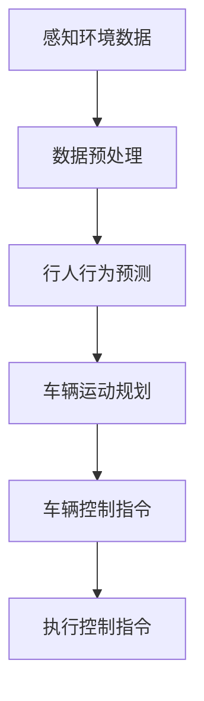

                 

## 《AI驱动的自动驾驶：技术与伦理的平衡》

> 关键词：自动驾驶、AI技术、伦理问题、技术挑战、未来展望

> 摘要：本文将探讨AI驱动的自动驾驶技术及其背后的伦理问题。我们将从技术基础、伦理挑战和未来展望三个方面展开讨论，旨在为读者提供一个全面而深入的视角，理解自动驾驶在现代社会中的重要性和面临的挑战。

## 《AI驱动的自动驾驶：技术与伦理的平衡》目录大纲

### 第一部分：AI驱动的自动驾驶技术基础

#### 第1章：AI驱动的自动驾驶概述

##### 1.1 自动驾驶技术的发展历程

##### 1.2 自动驾驶的技术层次

##### 1.3 自动驾驶的现状与趋势

#### 第2章：自动驾驶的关键技术

##### 2.1 感知环境技术

###### 2.1.1 激光雷达

###### 2.1.2 毫米波雷达

###### 2.1.3 摄像头与深度相机

#### 第3章：自动驾驶的决策与规划

##### 3.1 感知数据处理与特征提取

##### 3.2 行人行为预测

##### 3.3 车辆运动规划与控制

#### 第4章：自动驾驶的安全与测试

##### 4.1 自动驾驶的安全挑战

##### 4.2 自动驾驶的测试方法与标准

##### 4.3 自动驾驶的安全性验证与评估

### 第二部分：自动驾驶的伦理问题

#### 第5章：自动驾驶伦理问题概述

##### 5.1 自动驾驶伦理问题的来源

##### 5.2 自动驾驶伦理的核心问题

##### 5.3 自动驾驶伦理问题的分类

#### 第6章：自动驾驶的道德责任

##### 6.1 自动驾驶车辆的责任归属

##### 6.2 驾驶员与自动驾驶车辆的职责分配

##### 6.3 交通事故责任划分

#### 第7章：自动驾驶的社会影响

##### 7.1 自动驾驶对交通系统的影响

##### 7.2 自动驾驶对就业的影响

##### 7.3 自动驾驶对城市与基础设施的影响

### 第三部分：自动驾驶的实践与未来

#### 第8章：自动驾驶的产业生态

##### 8.1 自动驾驶产业链分析

##### 8.2 自动驾驶政策的推动

##### 8.3 自动驾驶的商业化模式

#### 第9章：自动驾驶的应用案例

##### 9.1 自动驾驶车辆的产品案例

##### 9.2 自动驾驶的交通应用案例

##### 9.3 自动驾驶的城市化应用案例

#### 第10章：自动驾驶的未来展望

##### 10.1 自动驾驶的技术发展趋势

##### 10.2 自动驾驶的伦理困境与解决思路

##### 10.3 自动驾驶的未来社会场景

### 附录

#### 附录A：自动驾驶相关资源与工具

##### A.1 开源自动驾驶平台

###### A.1.1 Apollo

###### A.1.2 Autoware

###### A.1.3 ROS

#### 附录B：自动驾驶数据集

##### B.1 公开数据集介绍

###### B.1.1 KITTI

###### B.1.2 CityScapes

###### B.1.3 NuScenes

#### 附录C：自动驾驶代码实战案例

##### C.1 自动驾驶感知代码示例

###### C.1.1 激光雷达数据预处理

###### C.1.2 毫米波雷达数据预处理

###### C.1.3 摄像头数据预处理

##### C.2 自动驾驶决策代码示例

###### C.2.1 行人行为预测代码

###### C.2.2 车辆运动规划代码

###### C.2.3 车辆控制代码

### 3.1 自动驾驶决策流程图

下面是自动驾驶决策流程的Mermaid图：



该流程图展示了自动驾驶系统的基本决策流程。首先，系统通过多种传感器（如激光雷达、摄像头等）感知周围环境，收集到数据后进行预处理。接下来，系统利用这些预处理后的数据预测行人的行为，然后进行车辆运动规划，最后生成控制指令，驱动车辆执行。

### 4.1 行人行为预测算法伪代码

行人行为预测是自动驾驶系统中关键的一步，下面是行人行为预测算法的伪代码：

```latex
% 行人行为预测算法伪代码
function 行人行为预测(观测数据):
    % 初始化预测模型
    模型 = 加载预训练模型()

    % 特征提取
    特征向量 = 提取特征(观测数据)

    % 预测行人行为
    行为 = 模型预测(特征向量)

    return 行为
```

在这个算法中，首先加载一个预训练的模型，然后对观测数据进行特征提取，最后使用模型进行行为预测。这个算法的核心在于模型的训练和特征提取的过程，这将直接影响到最终的预测准确性。

### 5.1 自动驾驶伦理困境解决思路

自动驾驶技术的快速发展引发了大量的伦理问题，下面是一些可能的解决思路：

1. **制定伦理准则**：明确自动驾驶的道德责任和行为规范，为自动驾驶系统提供行为指导。

2. **建立评估体系**：建立自动驾驶决策的伦理评估体系，对自动驾驶系统的决策过程和行为进行监督和审查。

3. **提高透明度**：提高自动驾驶系统的决策透明度，使公众能够了解和理解自动驾驶系统的决策过程。

4. **强化伦理教育**：增强从业人员的伦理意识和道德修养，确保他们在开发和操作自动驾驶系统时能够充分考虑伦理问题。

```latex
% 自动驾驶伦理困境解决思路
$$
\begin{aligned}
    &\text{1. 制定伦理准则：} \\
    &\text{明确自动驾驶的道德责任和行为规范。} \\
    &\text{2. 建立评估体系：} \\
    &\text{建立自动驾驶决策的伦理评估体系。} \\
    &\text{3. 提高透明度：} \\
    &\text{提高自动驾驶系统的决策透明度，便于监督和审查。} \\
    &\text{4. 强化伦理教育：} \\
    &\text{增强从业人员的伦理意识和道德修养。} \\
\end{aligned}
$$

以上解决方案提供了一个框架，帮助我们在面对自动驾驶伦理问题时能够有系统性地思考和行动。然而，每个解决方案的具体实施细节和挑战都需要深入研究和讨论。

## 附录A：自动驾驶相关资源与工具

### 附录A：自动驾驶相关资源与工具

自动驾驶技术的发展离不开丰富的开源平台、数据集和工具。以下是一些常用的资源，可以帮助研究人员和开发者深入了解和探索自动驾驶领域。

#### A.1 开源自动驾驶平台

**1. Apollo**

Apollo是一个由百度开发的开源自动驾驶平台，提供了完整的自动驾驶解决方案，包括感知、规划、控制等多个模块。它支持多种传感器，如激光雷达、摄像头、超声波传感器等，适用于不同规模的自动驾驶项目。

**2. Autoware**

Autoware是一个由日本丰田汽车公司发起的开源自动驾驶平台，它提供了丰富的模块，包括感知、定位、规划、控制等，并且支持多种车辆平台。

**3. ROS（Robot Operating System）**

ROS是一个用于机器人应用的中间件，提供了丰富的库和工具，用于自动驾驶系统的开发。它支持多种编程语言，如Python、C++等，并且有着庞大的社区支持。

#### A.2 自动驾驶数据集

**1. KITTI**

KITTI是一个自动驾驶数据集，包含了真实的驾驶场景数据，包括激光雷达、摄像头、GPS、IMU等传感器数据。它被广泛用于自动驾驶系统的性能评估和算法研究。

**2. CityScapes**

CityScapes是一个城市场景数据集，包含了不同场景下的车辆、行人、道路等信息，适用于自动驾驶系统的场景理解和目标检测。

**3. NuScenes**

NuScenes是一个由Waymo提供的自动驾驶数据集，包含了大量的城市驾驶场景，包含了多种传感器数据，如激光雷达、摄像头、雷达等。它被用于自动驾驶系统的复杂场景理解和决策。

#### A.3 自动驾驶工具

**1. Ubuntu AutoML**

Ubuntu AutoML是一个自动化机器学习工具，可以帮助开发者快速构建和优化自动驾驶模型。它支持多种数据预处理和模型训练工具，简化了自动驾驶系统的开发流程。

**2. PyTorch**

PyTorch是一个流行的深度学习框架，提供了丰富的库和工具，用于自动驾驶模型的开发和训练。它支持动态计算图，使得模型开发更加灵活。

**3. TensorFlow**

TensorFlow是一个由谷歌开发的深度学习框架，提供了丰富的库和工具，用于自动驾驶系统的模型开发和部署。它支持静态和动态计算图，并且有着广泛的社区支持。

这些资源为自动驾驶技术的发展提供了坚实的基础，有助于推动自动驾驶技术的创新和应用。

### 附录B：自动驾驶数据集

自动驾驶技术的发展离不开丰富的数据集，这些数据集为自动驾驶系统的训练、测试和评估提供了重要支持。以下是一些常用的自动驾驶数据集及其特点：

#### B.1 KITTI

KITTI（Karlsruhe Institute of Technology and the Mercedes-Benz Technology Center）是一个广泛使用的自动驾驶数据集，由德国卡尔斯鲁厄理工学院和奔驰技术中心共同创建。KITTI数据集包含多种传感器数据，包括激光雷达、摄像头、GPS和IMU（惯性测量单元）等，涵盖了不同的驾驶场景和交通环境。KITTI数据集被广泛应用于自动驾驶系统中的目标检测、轨迹预测和场景理解等研究。

#### B.2 CityScapes

CityScapes是一个大规模的城市场景数据集，由德国慕尼黑工业大学开发。该数据集包含了50个不同城市的街景图像，每个图像中包含了多种对象，如车辆、行人、道路标志和交通灯等。CityScapes数据集特别关注复杂的城市交通场景，适用于自动驾驶系统的目标检测、语义分割和场景理解等领域。

#### B.3 NuScenes

NuScenes是由Waymo（谷歌的自动驾驶公司）提供的一个自动驾驶数据集，旨在推动自动驾驶技术的发展。NuScenes数据集包含了超过100个小时的自动驾驶车辆行驶数据，涵盖了多种复杂的城市交通场景。该数据集包含多种传感器数据，如激光雷达、摄像头、雷达和GPS等，提供了丰富的数据资源，适用于自动驾驶系统的感知、规划和控制等研究。

#### B.4 NADA

NADA（National Autonomous Automobile Dataset）是由清华大学和百度共同创建的自动驾驶数据集。NADA数据集包含了真实的自动驾驶车辆行驶数据，涵盖了多种交通场景和道路环境。该数据集特别关注自动驾驶系统在复杂城市环境中的表现，适用于自动驾驶系统的测试、评估和优化。

#### B.5 CamVid

CamVid是一个由牛津大学提供的自动驾驶数据集，包含了超过1000个带有标注的街景图像。CamVid数据集包含了多种对象类别，如车辆、行人、自行车和交通标志等，适用于自动驾驶系统的目标检测和识别研究。

这些自动驾驶数据集为自动驾驶技术的研发提供了重要支持，有助于推动自动驾驶技术的进步和应用。

### 附录C：自动驾驶代码实战案例

在自动驾驶领域，代码实战案例是理解和应用相关技术的重要方式。以下是一个简单的自动驾驶感知代码实战案例，涵盖了激光雷达、毫米波雷达和摄像头数据的预处理过程。

#### C.1 激光雷达数据预处理

激光雷达是自动驾驶系统中重要的感知设备，用于获取三维环境信息。以下是一个激光雷达数据预处理的Python代码示例：

```python
import numpy as np
import open3d as o3d

# 读取激光雷达数据
def read_lidar_data(file_path):
    data = np.fromfile(file_path, dtype=np.float32)
    data = data.reshape((-1, 4))  # (x, y, z, intensity)
    return data

# 数据清洗
def clean_lidar_data(data):
    # 过滤距离小于10米的点云
    mask = data[:, 2] > 10
    clean_data = data[mask]
    return clean_data

# 主函数
def main():
    lidar_data = read_lidar_data('lidar_data.bin')
    clean_data = clean_lidar_data(lidar_data)
    
    # 可视化
    o3d.visualization.draw_geometries([o3d.geometry.PointCloud(clean_data[:, :3].T)])

if __name__ == '__main__':
    main()
```

在这个示例中，我们首先读取激光雷达数据，然后使用数据清洗函数过滤掉距离小于10米的点云。最后，使用Open3D库进行可视化展示。

#### C.2 毫米波雷达数据预处理

毫米波雷达是自动驾驶系统中另一种重要的感知设备，用于获取目标物体的速度和距离信息。以下是一个毫米波雷达数据预处理的Python代码示例：

```python
import numpy as np

# 读取毫米波雷达数据
def read_radar_data(file_path):
    data = np.fromfile(file_path, dtype=np.float32)
    data = data.reshape((-1, 2))  # (distance, velocity)
    return data

# 数据清洗
def clean_radar_data(data):
    # 过滤无效数据
    mask = (data[:, 0] > 0) & (data[:, 1] != -1)
    clean_data = data[mask]
    return clean_data

# 主函数
def main():
    radar_data = read_radar_data('radar_data.bin')
    clean_data = clean_radar_data(radar_data)
    
    # 打印清洗后的数据
    print(clean_data)

if __name__ == '__main__':
    main()
```

在这个示例中，我们首先读取毫米波雷达数据，然后使用数据清洗函数过滤掉无效数据。最后，打印清洗后的数据。

#### C.3 摄像头数据预处理

摄像头是自动驾驶系统中常用的感知设备，用于获取二维图像信息。以下是一个摄像头数据预处理的Python代码示例：

```python
import cv2
import numpy as np

# 读取摄像头数据
def read_camera_data(file_path):
    image = cv2.imread(file_path, cv2.IMREAD_COLOR)
    return image

# 数据清洗
def clean_camera_data(image):
    # 转换为灰度图像
    gray_image = cv2.cvtColor(image, cv2.COLOR_BGR2GRAY)
    # 图像去噪
    denoised_image = cv2.GaussianBlur(gray_image, (5, 5), 0)
    return denoised_image

# 主函数
def main():
    camera_data = read_camera_data('camera_data.jpg')
    clean_data = clean_camera_data(camera_data)
    
    # 可视化
    cv2.imshow('Clean Image', clean_data)
    cv2.waitKey(0)
    cv2.destroyAllWindows()

if __name__ == '__main__':
    main()
```

在这个示例中，我们首先读取摄像头数据，然后使用数据清洗函数将图像转换为灰度图像并去噪。最后，使用OpenCV库进行可视化展示。

通过这些简单的代码实战案例，我们可以更好地理解自动驾驶感知系统的数据处理过程。这些代码可以作为开发自动驾驶系统的基础，进一步扩展和优化以满足不同的需求。

## 总结与展望

自动驾驶技术作为人工智能的重要应用领域，正逐渐从理论走向实践，为我们的出行方式带来深刻的变革。本文从技术基础、伦理问题以及未来展望三个方面对自动驾驶进行了深入探讨。

首先，自动驾驶技术的发展历程、技术层次和关键技术在第一部分得到了详细解析。激光雷达、毫米波雷达、摄像头等感知设备以及决策与规划算法构成了自动驾驶技术的核心。这些技术不仅需要精确的传感器数据，还需要高效的算法来实现实时、安全的驾驶。

其次，在第二部分中，我们讨论了自动驾驶面临的伦理问题。自动驾驶的道德责任、驾驶员与车辆的职责分配、交通事故责任划分等都是亟待解决的问题。通过制定伦理准则、建立评估体系、提高透明度和强化伦理教育，我们可以为自动驾驶技术提供更坚实的伦理基础。

最后，在第三部分，我们展望了自动驾驶的产业生态、应用案例以及未来发展趋势。自动驾驶的商业化模式、政策推动、产业链分析以及其在交通、就业、城市基础设施等方面的潜在影响，都为我们展示了这一技术的前景。

展望未来，自动驾驶技术将继续向智能化、安全化和普及化发展。技术的进步将带来更高的自主驾驶能力，而伦理问题的解决将为自动驾驶的广泛应用提供保障。我们可以期待，自动驾驶技术将在未来改变我们的出行方式，提高交通效率，甚至重塑城市与社会结构。

在此，感谢读者对本文的关注，希望本文能为您在自动驾驶领域提供一些启示和思考。让我们一起期待自动驾驶技术的光明未来。作者：AI天才研究院/AI Genius Institute & 禅与计算机程序设计艺术/Zen And The Art of Computer Programming。

