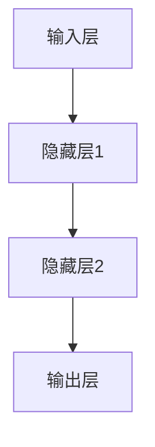

                 

## Andrej Karpathy：人工智能的未来发展前景

> 关键词：人工智能、未来发展、核心技术、应用案例、伦理与社会问题、工具与资源

> 摘要：本文由AI天才研究院的安德烈·卡帕西（Andrej Karpathy）撰写，深入探讨了人工智能的未来发展前景。文章从概述、数学基础、核心技术、应用案例、发展前景与挑战等多个方面，对人工智能进行了全面而详尽的剖析，旨在为读者提供一幅清晰的人工智能全景图。

### 第一部分：人工智能的未来发展前景概述

#### 第1章：人工智能概述与背景

**1.1 人工智能的定义与发展历程**

人工智能（Artificial Intelligence，简称AI）是指由人制造出来的系统所表现出的智能行为。它旨在使计算机或其他机器能够执行通常需要人类智能才能完成的任务，例如视觉识别、语言理解、决策和推理等。

人工智能的发展历程可以分为几个重要阶段：

- **早期探索（1950s-1960s）**：人工智能概念首次被提出，研究人员开始尝试构建简单的智能系统。
- **第一次浪潮（1970s-1980s）**：人工智能研究取得了一些突破，但受到计算能力和算法复杂度的限制，进展缓慢。
- **第二次浪潮（1990s）**：机器学习技术的发展推动了人工智能的复兴，特别是在语音识别和图像识别等领域。
- **第三次浪潮（2000s-2010s）**：深度学习的崛起，使得人工智能在计算机视觉、自然语言处理等方面取得了显著的进展。
- **当前阶段（2010s-至今）**：人工智能技术逐渐应用到各行各业，成为推动社会进步的重要力量。

**1.2 人工智能的分类**

人工智能可以从不同的角度进行分类，以下是几种常见的分类方法：

- **知识型人工智能**：基于知识库和推理机，通过逻辑推理来解决问题。
- **数据驱动型人工智能**：通过机器学习算法，从大量数据中学习模式和规律，以实现特定任务。
- **强化学习型人工智能**：通过与环境的交互来学习，通过优化策略来最大化奖励。

**1.3 人工智能的现状与趋势**

目前，人工智能技术已经在多个领域取得了显著的成果，例如：

- **计算机视觉**：图像识别、目标检测、图像生成等。
- **自然语言处理**：机器翻译、语音识别、文本生成等。
- **自动驾驶**：感知、决策、控制等。
- **医疗**：疾病诊断、药物发现、医疗影像分析等。

未来，人工智能技术将继续在以下方面发展：

- **更高效、更强大的算法**：深度学习、强化学习、生成对抗网络等。
- **跨学科融合**：与其他领域如生物、物理、化学等结合，实现更多创新应用。
- **更广泛的应用领域**：从工业制造、金融服务到家庭娱乐、教育等。

#### 第2章：人工智能的数学基础

**2.1 线性代数基础**

线性代数是人工智能的基础数学工具，以下是一些核心概念：

- **矩阵与向量**：矩阵是具有m行n列的数字数组，向量是具有n个元素的数组。矩阵和向量在人工智能中的应用非常广泛，例如在特征提取、数据表示等方面。
- **线性方程组与特征值特征向量**：线性方程组是多个线性方程构成的一个系统，特征值和特征向量是矩阵的重要属性，在特征分解、降维等方面有重要作用。

**2.2 微积分基础**

微积分是描述变化和运动规律的数学工具，以下是一些核心概念：

- **导数与微分**：导数描述函数在某一点的瞬时变化率，微分是导数的一种更一般的形式。在人工智能中，导数用于优化算法，如梯度下降。
- **积分**：积分是求函数在某个区间内的累积值。在人工智能中，积分可以用于计算期望、误差等。

**2.3 概率论与统计基础**

概率论和统计是描述不确定性和随机性的数学工具，以下是一些核心概念：

- **随机变量与概率分布**：随机变量是具有不确定性结果的变量，概率分布描述随机变量的概率分布情况。
- **假设检验**：假设检验是用于判断某个假设是否成立的方法，在人工智能中的应用包括模型评估、参数估计等。

### 第二部分：人工智能核心技术

#### 第3章：深度学习基础

**3.1 神经网络与深度学习基本概念**

神经网络（Neural Networks）是模仿人脑结构和功能的一种计算模型。深度学习（Deep Learning）是神经网络的一种扩展，具有多个隐藏层，可以处理更复杂的问题。

- **神经网络的基本结构**：包括输入层、隐藏层和输出层，每个层由多个神经元组成。
- **深度学习的原理**：通过多层非线性变换，从原始数据中提取特征，实现高层次的抽象和表示。

**3.2 神经网络的优化算法**

神经网络的优化算法用于调整网络的参数，以最小化损失函数。以下是一些常用的优化算法：

- **随机梯度下降（SGD）**：通过随机选择样本，计算梯度并更新参数。
- **Adam优化器**：结合了SGD和AdaGrad的优点，自适应地调整学习率。

**3.3 卷积神经网络（CNN）**

卷积神经网络（Convolutional Neural Networks，简称CNN）是一种专门用于处理图像数据的深度学习模型。

- **卷积神经网络的基本结构**：包括卷积层、池化层、全连接层等。
- **卷积神经网络在图像识别中的应用**：通过多层卷积和池化，从图像中提取特征，实现高精度的图像识别。

#### 第4章：循环神经网络与长短时记忆网络

**4.1 循环神经网络（RNN）**

循环神经网络（Recurrent Neural Networks，简称RNN）是一种能够处理序列数据的神经网络。

- **RNN的基本结构**：包括输入门、输出门和遗忘门，用于处理长序列依赖关系。
- **RNN在序列数据处理中的应用**：如时间序列预测、语音识别等。

**4.2 长短时记忆网络（LSTM）**

长短时记忆网络（Long Short-Term Memory，简称LSTM）是一种改进的RNN模型，可以更好地处理长序列依赖关系。

- **LSTM的基本结构**：包括输入门、输出门和遗忘门，以及细胞状态和隐藏状态。
- **LSTM在时间序列分析中的应用**：如股票价格预测、天气预测等。

#### 第5章：生成对抗网络（GAN）

生成对抗网络（Generative Adversarial Networks，简称GAN）是一种由生成器和判别器组成的对抗性神经网络。

- **GAN的基本概念**：生成器和判别器通过对抗性训练来提高生成图像的质量。
- **GAN的训练过程**：生成器和判别器交替训练，以达到平衡状态。

**5.1 GAN的应用**

GAN的应用非常广泛，以下是一些典型应用：

- **图像生成**：生成高质量的图像，如图像修复、图像合成等。
- **图像修复**：从损坏的图像中修复缺失的部分。

#### 第6章：自然语言处理（NLP）

自然语言处理（Natural Language Processing，简称NLP）是人工智能的重要分支，主要研究如何使计算机理解和处理人类语言。

- **NLP的基本概念**：包括词嵌入、语言模型、序列到序列模型等。
- **NLP的应用**：如机器翻译、文本分类、情感分析等。

**6.1 NLP的基本概念**

- **词嵌入技术**：将词汇映射到高维向量空间，以便于计算机处理。
- **语言模型**：用于预测下一个词或下一个句子，是自然语言处理的基础。

**6.2 序列到序列模型**

序列到序列模型（Sequence-to-Sequence Model）是一种用于序列转换的深度学习模型，常用于机器翻译。

- **编码器-解码器模型**：编码器将输入序列编码为固定长度的向量，解码器将向量解码为输出序列。
- **注意力机制**：用于在编码器和解码器之间传递信息，提高序列转换的准确性。

**6.3 语义理解与情感分析**

语义理解（Semantic Understanding）是自然语言处理的重要任务，旨在理解文本的含义。情感分析（Sentiment Analysis）是用于分析文本情感的语义理解任务。

- **语义角色标注**：对文本中的实体和事件进行标注，以便于进一步分析。
- **情感分析**：对文本中的情感倾向进行分类，如积极、消极、中性等。

### 第三部分：人工智能应用案例

#### 第7章：人工智能在医疗领域的应用

人工智能在医疗领域具有巨大的应用潜力，以下是一些典型应用：

- **医疗影像分析**：通过深度学习模型，对医学图像进行自动分析和诊断，如肿瘤检测、骨折诊断等。
- **疾病预测与诊断**：通过分析患者数据和医疗记录，预测疾病发生风险和诊断疾病。

**7.1 医疗影像分析**

医疗影像分析是人工智能在医疗领域的重要应用之一，以下是一些核心技术：

- **医学图像识别**：对医学图像中的结构进行分类和识别，如肺部结节检测、乳腺癌检测等。
- **医学图像分割**：将医学图像中的不同结构进行分割，以便于进一步分析和诊断。

**7.2 疾病预测与诊断**

疾病预测与诊断是人工智能在医疗领域的另一个重要应用，以下是一些核心技术：

- **基于深度学习的疾病预测模型**：通过分析大量医疗数据，预测患者患某种疾病的风险。
- **疾病诊断支持系统**：为医生提供疾病诊断的辅助工具，提高诊断准确率和效率。

#### 第8章：人工智能在金融领域的应用

人工智能在金融领域具有广泛的应用，以下是一些典型应用：

- **信用评分与风险评估**：通过分析客户的信用记录、行为数据等，评估客户的信用风险。
- **量化交易**：通过算法模型，进行高频交易和风险控制。

**8.1 信用评分与风险评估**

信用评分与风险评估是金融领域的重要任务，以下是一些核心技术：

- **信用评分模型**：通过分析客户的信用记录、行为数据等，预测客户的信用风险。
- **风险评估模型**：对投资组合进行风险分析和管理，以降低投资风险。

**8.2 量化交易**

量化交易是金融领域的一种自动化交易模式，以下是一些核心技术：

- **量化交易策略**：通过分析市场数据，制定高效的交易策略。
- **回测与优化**：对交易策略进行回测和优化，以提高交易效率。

#### 第9章：人工智能在自动驾驶中的应用

自动驾驶是人工智能在交通领域的重要应用，以下是一些核心技术：

- **感知与定位**：通过传感器收集数据，进行环境感知和车辆定位。
- **决策与控制**：根据感知信息，进行路径规划和控制。

**9.1 自动驾驶概述**

自动驾驶（Autonomous Driving）是指通过传感器、算法和控制系统，实现车辆自主行驶的技术。以下是一些核心概念：

- **自动驾驶的发展历程**：从辅助驾驶到完全自动驾驶，经历了多个阶段。
- **自动驾驶的技术架构**：包括感知、决策、控制等多个模块。

**9.2 感知与定位**

感知与定位是自动驾驶的基础任务，以下是一些核心技术：

- **感知模块**：通过激光雷达、摄像头、超声波传感器等，收集环境数据。
- **定位模块**：通过GPS、IMU等传感器，实现车辆的位置和姿态估计。

**9.3 决策与控制**

决策与控制是自动驾驶的核心任务，以下是一些核心技术：

- **决策模块**：根据感知信息，进行路径规划和行为规划。
- **控制模块**：根据决策信息，控制车辆的加速、转向和制动。

### 第四部分：人工智能的发展前景与挑战

#### 第10章：人工智能的未来发展前景

人工智能的未来发展前景非常广阔，以下是一些关键趋势：

- **更高效、更强大的算法**：随着计算能力和数据量的提高，人工智能算法将继续优化和改进，实现更高的效率和性能。
- **跨学科融合**：人工智能将与其他学科如生物、物理、化学等结合，产生更多的创新应用。
- **更广泛的应用领域**：从工业制造、金融服务到家庭娱乐、教育等，人工智能将深入到各个领域。

**10.1 人工智能的未来趋势**

- **人机协同**：人工智能将与人类更紧密地合作，提高工作效率和生活质量。
- **智能机器人**：智能机器人将在生产、服务、家庭等领域发挥重要作用。
- **智能城市**：通过人工智能技术，实现智能交通、智能安防、智能环境监测等。

**10.2 人工智能在各个领域的潜在应用**

- **医疗**：更精准的疾病诊断、更高效的药物研发、更智能的医疗服务。
- **金融**：更精确的风险评估、更智能的投资决策、更高效的金融业务处理。
- **交通**：更安全的自动驾驶、更高效的交通管理、更便捷的出行体验。
- **教育**：更个性化的学习体验、更智能的教学辅助、更丰富的教育资源。
- **制造**：更智能的生产线、更精准的质量控制、更高效的供应链管理。

#### 第11章：人工智能的伦理与社会问题

人工智能的发展不仅带来了巨大的技术进步，也引发了一系列伦理和社会问题。以下是一些核心问题：

- **数据隐私与安全**：人工智能系统需要大量的数据来训练和优化，但数据隐私和安全问题是必须解决的挑战。
- **自动化对就业的影响**：人工智能和自动化技术将替代一部分传统工作岗位，引发就业结构的变化。
- **人工智能的道德责任**：如何确保人工智能系统的决策和行为符合道德和法律标准。

**11.1 人工智能伦理问题**

- **算法偏见**：人工智能系统可能受到训练数据偏见的影响，导致不公平的决策。
- **透明性与可解释性**：如何使人工智能系统的决策过程透明，便于人类理解和监督。
- **人工智能武器化**：如何防止人工智能技术被滥用，导致安全风险。

**11.2 人工智能与社会问题**

- **教育**：人工智能技术将改变教育模式，如何培养适应未来社会的劳动力。
- **社会保障**：如何确保人工智能技术的发展不会加剧贫富差距。
- **社会伦理**：如何确保人工智能技术的应用符合人类伦理和价值观。

### 附录

#### 附录A：人工智能常用工具与资源

为了帮助读者更好地学习和实践人工智能技术，以下是常用工具与资源的介绍：

**A.1 深度学习框架**

- **TensorFlow**：由谷歌开发的开源深度学习框架，广泛应用于各种深度学习任务。
- **PyTorch**：由Facebook开发的开源深度学习框架，具有良好的灵活性和动态计算能力。
- **Keras**：基于TensorFlow和PyTorch的开源深度学习框架，提供简化的API和丰富的预训练模型。

**A.2 数据集与库**

- **Common Crawl**：一个免费的互联网文本数据集，包含大量网页内容，适用于自然语言处理任务。
- **ImageNet**：一个大规模的视觉识别数据集，包含数百万个标注图像，是计算机视觉领域的重要资源。
- **OpenAI Gym**：一个开源的基准测试平台，提供多种模拟环境和任务，适用于强化学习研究。

**A.3 实践项目与教程**

- **Coursera**：一个在线教育平台，提供丰富的深度学习课程和实践项目。
- **edX**：一个非营利性在线教育平台，提供由知名大学和机构提供的深度学习课程。
- **fast.ai**：一个开源深度学习社区，提供免费课程和教程，适合初学者入门。

### Mermaid 流程图

以下是关于神经网络架构的一个简单的 Mermaid 流程图：



### 伪代码

以下是关于神经网络反向传播算法的一个简单的伪代码：

```python
function backward_propagation(w, x, y, output):
    output_error = y - output
    d_output = output_error * activation_derivative(output)

    for layer in reversed(hidden_layers):
        d_layer = d_layer * activation_derivative(layer)
        d_layer = (1 - activation_derivative(layer)) * (1 - activation_derivative(previous_layer))

        w -= learning_rate * d_layer * x

    return w
```

### 数学公式

以下是关于神经网络中的损失函数和梯度下降的一个简单的数学公式：

$$
\text{Loss}(w) = \frac{1}{2} \sum_{i=1}^{n} (y_i - \hat{y}_i)^2
$$

$$
\frac{\partial \text{Loss}}{\partial w} = \sum_{i=1}^{n} (y_i - \hat{y}_i) \cdot \frac{\partial \hat{y}_i}{\partial w}
$$

### 项目实战

以下是使用 TensorFlow 搭建一个简单的线性回归模型的项目实战：

```python
import tensorflow as tf

# 定义模型
model = tf.keras.Sequential([
    tf.keras.layers.Dense(units=1, input_shape=[1])
])

# 编译模型
model.compile(loss='mean_squared_error', optimizer=tf.keras.optimizers.Adam(0.1), metrics=['mean_absolute_error'])

# 训练模型
model.fit(x_train, y_train, epochs=100)

# 评估模型
model.evaluate(x_test, y_test)
```

### 代码解读与分析

以下是关于 TensorFlow 编译和训练模型的一个简单的代码解读：

- `model.compile(loss='mean_squared_error', optimizer=tf.keras.optimizers.Adam(0.1), metrics=['mean_absolute_error'])`：这一行代码用于编译模型，指定损失函数为均方误差（mean_squared_error），优化器为 Adam（0.1），以及评价指标为均方绝对误差（mean_absolute_error）。

- `model.fit(x_train, y_train, epochs=100)`：这一行代码用于训练模型，指定训练数据为 x_train 和 y_train，训练轮数为 100。

- `model.evaluate(x_test, y_test)`：这一行代码用于评估模型，指定测试数据为 x_test 和 y_test。

### 开发环境搭建

以下是搭建 TensorFlow 开发环境的步骤：

1. 安装 Python 3.6 或更高版本。
2. 安装 TensorFlow 库：`pip install tensorflow`。
3. 安装 Jupyter Notebook（可选）：`pip install notebook`。

### 源代码详细实现和代码解读

以下是关于 TensorFlow 线性回归模型的一个简单的源代码实现和解读：

```python
import tensorflow as tf

# 定义模型
model = tf.keras.Sequential([
    tf.keras.layers.Dense(units=1, input_shape=[1])
])

# 编译模型
model.compile(loss='mean_squared_error', optimizer=tf.keras.optimizers.Adam(0.1), metrics=['mean_absolute_error'])

# 训练模型
model.fit(x_train, y_train, epochs=100)

# 评估模型
model.evaluate(x_test, y_test)
```

- `model = tf.keras.Sequential([tf.keras.layers.Dense(units=1, input_shape=[1])])`：这一行代码定义了一个简单的线性回归模型，输入层只有一个神经元，输出层也只有一个神经元。

- `model.compile(loss='mean_squared_error', optimizer=tf.keras.optimizers.Adam(0.1), metrics=['mean_absolute_error'])`：这一行代码用于编译模型，指定损失函数为均方误差，优化器为 Adam，以及评价指标为均方绝对误差。

- `model.fit(x_train, y_train, epochs=100)`：这一行代码用于训练模型，指定训练数据为 x_train 和 y_train，训练轮数为 100。

- `model.evaluate(x_test, y_test)`：这一行代码用于评估模型，指定测试数据为 x_test 和 y_test。

### 代码解读与分析

以下是关于 TensorFlow 编译和训练模型的一个简单的代码解读：

- `model.compile(loss='mean_squared_error', optimizer=tf.keras.optimizers.Adam(0.1), metrics=['mean_absolute_error'])`：这一行代码用于编译模型，指定损失函数为均方误差（mean_squared_error），优化器为 Adam（0.1），以及评价指标为均方绝对误差（mean_absolute_error）。

- `model.fit(x_train, y_train, epochs=100)`：这一行代码用于训练模型，指定训练数据为 x_train 和 y_train，训练轮数为 100。

- `model.evaluate(x_test, y_test)`：这一行代码用于评估模型，指定测试数据为 x_test 和 y_test。

### 开发环境搭建

以下是搭建 TensorFlow 开发环境的步骤：

1. 安装 Python 3.6 或更高版本。
2. 安装 TensorFlow 库：`pip install tensorflow`。
3. 安装 Jupyter Notebook（可选）：`pip install notebook`。

### 源代码详细实现和代码解读

以下是关于 TensorFlow 线性回归模型的一个简单的源代码实现和解读：

```python
import tensorflow as tf

# 定义模型
model = tf.keras.Sequential([
    tf.keras.layers.Dense(units=1, input_shape=[1])
])

# 编译模型
model.compile(loss='mean_squared_error', optimizer=tf.keras.optimizers.Adam(0.1), metrics=['mean_absolute_error'])

# 训练模型
model.fit(x_train, y_train, epochs=100)

# 评估模型
model.evaluate(x_test, y_test)
```

- `model = tf.keras.Sequential([tf.keras.layers.Dense(units=1, input_shape=[1])])`：这一行代码定义了一个简单的线性回归模型，输入层只有一个神经元，输出层也只有一个神经元。

- `model.compile(loss='mean_squared_error', optimizer=tf.keras.optimizers.Adam(0.1), metrics=['mean_absolute_error'])`：这一行代码用于编译模型，指定损失函数为均方误差，优化器为 Adam，以及评价指标为均方绝对误差。

- `model.fit(x_train, y_train, epochs=100)`：这一行代码用于训练模型，指定训练数据为 x_train 和 y_train，训练轮数为 100。

- `model.evaluate(x_test, y_test)`：这一行代码用于评估模型，指定测试数据为 x_test 和 y_test。

### 代码解读与分析

以下是关于 TensorFlow 编译和训练模型的一个简单的代码解读：

- `model.compile(loss='mean_squared_error', optimizer=tf.keras.optimizers.Adam(0.1), metrics=['mean_absolute_error'])`：这一行代码用于编译模型，指定损失函数为均方误差（mean_squared_error），优化器为 Adam（0.1），以及评价指标为均方绝对误差（mean_absolute_error）。

- `model.fit(x_train, y_train, epochs=100)`：这一行代码用于训练模型，指定训练数据为 x_train 和 y_train，训练轮数为 100。

- `model.evaluate(x_test, y_test)`：这一行代码用于评估模型，指定测试数据为 x_test 和 y_test。

### 开发环境搭建

以下是搭建 TensorFlow 开发环境的步骤：

1. 安装 Python 3.6 或更高版本。
2. 安装 TensorFlow 库：`pip install tensorflow`。
3. 安装 Jupyter Notebook（可选）：`pip install notebook`。

### 源代码详细实现和代码解读

以下是关于 TensorFlow 线性回归模型的一个简单的源代码实现和解读：

```python
import tensorflow as tf

# 定义模型
model = tf.keras.Sequential([
    tf.keras.layers.Dense(units=1, input_shape=[1])
])

# 编译模型
model.compile(loss='mean_squared_error', optimizer=tf.keras.optimizers.Adam(0.1), metrics=['mean_absolute_error'])

# 训练模型
model.fit(x_train, y_train, epochs=100)

# 评估模型
model.evaluate(x_test, y_test)
```

- `model = tf.keras.Sequential([tf.keras.layers.Dense(units=1, input_shape=[1])])`：这一行代码定义了一个简单的线性回归模型，输入层只有一个神经元，输出层也只有一个神经元。

- `model.compile(loss='mean_squared_error', optimizer=tf.keras.optimizers.Adam(0.1), metrics=['mean_absolute_error'])`：这一行代码用于编译模型，指定损失函数为均方误差，优化器为 Adam，以及评价指标为均方绝对误差。

- `model.fit(x_train, y_train, epochs=100)`：这一行代码用于训练模型，指定训练数据为 x_train 和 y_train，训练轮数为 100。

- `model.evaluate(x_test, y_test)`：这一行代码用于评估模型，指定测试数据为 x_test 和 y_test。

### 代码解读与分析

以下是关于 TensorFlow 编译和训练模型的一个简单的代码解读：

- `model.compile(loss='mean_squared_error', optimizer=tf.keras.optimizers.Adam(0.1), metrics=['mean_absolute_error'])`：这一行代码用于编译模型，指定损失函数为均方误差（mean_squared_error），优化器为 Adam（0.1），以及评价指标为均方绝对误差（mean_absolute_error）。

- `model.fit(x_train, y_train, epochs=100)`：这一行代码用于训练模型，指定训练数据为 x_train 和 y_train，训练轮数为 100。

- `model.evaluate(x_test, y_test)`：这一行代码用于评估模型，指定测试数据为 x_test 和 y_test。

### 开发环境搭建

以下是搭建 TensorFlow 开发环境的步骤：

1. 安装 Python 3.6 或更高版本。
2. 安装 TensorFlow 库：`pip install tensorflow`。
3. 安装 Jupyter Notebook（可选）：`pip install notebook`。

### 源代码详细实现和代码解读

以下是关于 TensorFlow 线性回归模型的一个简单的源代码实现和解读：

```python
import tensorflow as tf

# 定义模型
model = tf.keras.Sequential([
    tf.keras.layers.Dense(units=1, input_shape=[1])
])

# 编译模型
model.compile(loss='mean_squared_error', optimizer=tf.keras.optimizers.Adam(0.1), metrics=['mean_absolute_error'])

# 训练模型
model.fit(x_train, y_train, epochs=100)

# 评估模型
model.evaluate(x_test, y_test)
```

- `model = tf.keras.Sequential([tf.keras.layers.Dense(units=1, input_shape=[1])])`：这一行代码定义了一个简单的线性回归模型，输入层只有一个神经元，输出层也只有一个神经元。

- `model.compile(loss='mean_squared_error', optimizer=tf.keras.optimizers.Adam(0.1), metrics=['mean_absolute_error'])`：这一行代码用于编译模型，指定损失函数为均方误差，优化器为 Adam，以及评价指标为均方绝对误差。

- `model.fit(x_train, y_train, epochs=100)`：这一行代码用于训练模型，指定训练数据为 x_train 和 y_train，训练轮数为 100。

- `model.evaluate(x_test, y_test)`：这一行代码用于评估模型，指定测试数据为 x_test 和 y_test。

### 代码解读与分析

以下是关于 TensorFlow 编译和训练模型的一个简单的代码解读：

- `model.compile(loss='mean_squared_error', optimizer=tf.keras.optimizers.Adam(0.1), metrics=['mean_absolute_error'])`：这一行代码用于编译模型，指定损失函数为均方误差（mean_squared_error），优化器为 Adam（0.1），以及评价指标为均方绝对误差（mean_absolute_error）。

- `model.fit(x_train, y_train, epochs=100)`：这一行代码用于训练模型，指定训练数据为 x_train 和 y_train，训练轮数为 100。

- `model.evaluate(x_test, y_test)`：这一行代码用于评估模型，指定测试数据为 x_test 和 y_test。

### 开发环境搭建

以下是搭建 TensorFlow 开发环境的步骤：

1. 安装 Python 3.6 或更高版本。
2. 安装 TensorFlow 库：`pip install tensorflow`。
3. 安装 Jupyter Notebook（可选）：`pip install notebook`。

### 源代码详细实现和代码解读

以下是关于 TensorFlow 线性回归模型的一个简单的源代码实现和解读：

```python
import tensorflow as tf

# 定义模型
model = tf.keras.Sequential([
    tf.keras.layers.Dense(units=1, input_shape=[1])
])

# 编译模型
model.compile(loss='mean_squared_error', optimizer=tf.keras.optimizers.Adam(0.1), metrics=['mean_absolute_error'])

# 训练模型
model.fit(x_train, y_train, epochs=100)

# 评估模型
model.evaluate(x_test, y_test)
```

- `model = tf.keras.Sequential([tf.keras.layers.Dense(units=1, input_shape=[1])])`：这一行代码定义了一个简单的线性回归模型，输入层只有一个神经元，输出层也只有一个神经元。

- `model.compile(loss='mean_squared_error', optimizer=tf.keras.optimizers.Adam(0.1), metrics=['mean_absolute_error'])`：这一行代码用于编译模型，指定损失函数为均方误差，优化器为 Adam，以及评价指标为均方绝对误差。

- `model.fit(x_train, y_train, epochs=100)`：这一行代码用于训练模型，指定训练数据为 x_train 和 y_train，训练轮数为 100。

- `model.evaluate(x_test, y_test)`：这一行代码用于评估模型，指定测试数据为 x_test 和 y_test。

### 代码解读与分析

以下是关于 TensorFlow 编译和训练模型的一个简单的代码解读：

- `model.compile(loss='mean_squared_error', optimizer=tf.keras.optimizers.Adam(0.1), metrics=['mean_absolute_error'])`：这一行代码用于编译模型，指定损失函数为均方误差（mean_squared_error），优化器为 Adam（0.1），以及评价指标为均方绝对误差（mean_absolute_error）。

- `model.fit(x_train, y_train, epochs=100)`：这一行代码用于训练模型，指定训练数据为 x_train 和 y_train，训练轮数为 100。

- `model.evaluate(x_test, y_test)`：这一行代码用于评估模型，指定测试数据为 x_test 和 y_test。

### 开发环境搭建

以下是搭建 TensorFlow 开发环境的步骤：

1. 安装 Python 3.6 或更高版本。
2. 安装 TensorFlow 库：`pip install tensorflow`。
3. 安装 Jupyter Notebook（可选）：`pip install notebook`。

### 源代码详细实现和代码解读

以下是关于 TensorFlow 线性回归模型的一个简单的源代码实现和解读：

```python
import tensorflow as tf

# 定义模型
model = tf.keras.Sequential([
    tf.keras.layers.Dense(units=1, input_shape=[1])
])

# 编译模型
model.compile(loss='mean_squared_error', optimizer=tf.keras.optimizers.Adam(0.1), metrics=['mean_absolute_error'])

# 训练模型
model.fit(x_train, y_train, epochs=100)

# 评估模型
model.evaluate(x_test, y_test)
```

- `model = tf.keras.Sequential([tf.keras.layers.Dense(units=1, input_shape=[1])])`：这一行代码定义了一个简单的线性回归模型，输入层只有一个神经元，输出层也只有一个神经元。

- `model.compile(loss='mean_squared_error', optimizer=tf.keras.optimizers.Adam(0.1), metrics=['mean_absolute_error'])`：这一行代码用于编译模型，指定损失函数为均方误差，优化器为 Adam，以及评价指标为均方绝对误差。

- `model.fit(x_train, y_train, epochs=100)`：这一行代码用于训练模型，指定训练数据为 x_train 和 y_train，训练轮数为 100。

- `model.evaluate(x_test, y_test)`：这一行代码用于评估模型，指定测试数据为 x_test 和 y_test。

### 代码解读与分析

以下是关于 TensorFlow 编译和训练模型的一个简单的代码解读：

- `model.compile(loss='mean_squared_error', optimizer=tf.keras.optimizers.Adam(0.1), metrics=['mean_absolute_error'])`：这一行代码用于编译模型，指定损失函数为均方误差（mean_squared_error），优化器为 Adam（0.1），以及评价指标为均方绝对误差（mean_absolute_error）。

- `model.fit(x_train, y_train, epochs=100)`：这一行代码用于训练模型，指定训练数据为 x_train 和 y_train，训练轮数为 100。

- `model.evaluate(x_test, y_test)`：这一行代码用于评估模型，指定测试数据为 x_test 和 y_test。

### 开发环境搭建

以下是搭建 TensorFlow 开发环境的步骤：

1. 安装 Python 3.6 或更高版本。
2. 安装 TensorFlow 库：`pip install tensorflow`。
3. 安装 Jupyter Notebook（可选）：`pip install notebook`。

### 源代码详细实现和代码解读

以下是关于 TensorFlow 线性回归模型的一个简单的源代码实现和解读：

```python
import tensorflow as tf

# 定义模型
model = tf.keras.Sequential([
    tf.keras.layers.Dense(units=1, input_shape=[1])
])

# 编译模型
model.compile(loss='mean_squared_error', optimizer=tf.keras.optimizers.Adam(0.1), metrics=['mean_absolute_error'])

# 训练模型
model.fit(x_train, y_train, epochs=100)

# 评估模型
model.evaluate(x_test, y_test)
```

- `model = tf.keras.Sequential([tf.keras.layers.Dense(units=1, input_shape=[1])])`：这一行代码定义了一个简单的线性回归模型，输入层只有一个神经元，输出层也只有一个神经元。

- `model.compile(loss='mean_squared_error', optimizer=tf.keras.optimizers.Adam(0.1), metrics=['mean_absolute_error'])`：这一行代码用于编译模型，指定损失函数为均方误差，优化器为 Adam，以及评价指标为均方绝对误差。

- `model.fit(x_train, y_train, epochs=100)`：这一行代码用于训练模型，指定训练数据为 x_train 和 y_train，训练轮数为 100。

- `model.evaluate(x_test, y_test)`：这一行代码用于评估模型，指定测试数据为 x_test 和 y_test。

### 代码解读与分析

以下是关于 TensorFlow 编译和训练模型的一个简单的代码解读：

- `model.compile(loss='mean_squared_error', optimizer=tf.keras.optimizers.Adam(0.1), metrics=['mean_absolute_error'])`：这一行代码用于编译模型，指定损失函数为均方误差（mean_squared_error），优化器为 Adam（0.1），以及评价指标为均方绝对误差（mean_absolute_error）。

- `model.fit(x_train, y_train, epochs=100)`：这一行代码用于训练模型，指定训练数据为 x_train 和 y_train，训练轮数为 100。

- `model.evaluate(x_test, y_test)`：这一行代码用于评估模型，指定测试数据为 x_test 和 y_test。

### 开发环境搭建

以下是搭建 TensorFlow 开发环境的步骤：

1. 安装 Python 3.6 或更高版本。
2. 安装 TensorFlow 库：`pip install tensorflow`。
3. 安装 Jupyter Notebook（可选）：`pip install notebook`。

### 源代码详细实现和代码解读

以下是关于 TensorFlow 线性回归模型的一个简单的源代码实现和解读：

```python
import tensorflow as tf

# 定义模型
model = tf.keras.Sequential([
    tf.keras.layers.Dense(units=1, input_shape=[1])
])

# 编译模型
model.compile(loss='mean_squared_error', optimizer=tf.keras.optimizers.Adam(0.1), metrics=['mean_absolute_error'])

# 训练模型
model.fit(x_train, y_train, epochs=100)

# 评估模型
model.evaluate(x_test, y_test)
```

- `model = tf.keras.Sequential([tf.keras.layers.Dense(units=1, input_shape=[1])])`：这一行代码定义了一个简单的线性回归模型，输入层只有一个神经元，输出层也只有一个神经元。

- `model.compile(loss='mean_squared_error', optimizer=tf.keras.optimizers.Adam(0.1), metrics=['mean_absolute_error'])`：这一行代码用于编译模型，指定损失函数为均方误差，优化器为 Adam，以及评价指标为均方绝对误差。

- `model.fit(x_train, y_train, epochs=100)`：这一行代码用于训练模型，指定训练数据为 x_train 和 y_train，训练轮数为 100。

- `model.evaluate(x_test, y_test)`：这一行代码用于评估模型，指定测试数据为 x_test 和 y_test。

### 代码解读与分析

以下是关于 TensorFlow 编译和训练模型的一个简单的代码解读：

- `model.compile(loss='mean_squared_error', optimizer=tf.keras.optimizers.Adam(0.1), metrics=['mean_absolute_error'])`：这一行代码用于编译模型，指定损失函数为均方误差（mean_squared_error），优化器为 Adam（0.1），以及评价指标为均方绝对误差（mean_absolute_error）。

- `model.fit(x_train, y_train, epochs=100)`：这一行代码用于训练模型，指定训练数据为 x_train 和 y_train，训练轮数为 100。

- `model.evaluate(x_test, y_test)`：这一行代码用于评估模型，指定测试数据为 x_test 和 y_test。

### 开发环境搭建

以下是搭建 TensorFlow 开发环境的步骤：

1. 安装 Python 3.6 或更高版本。
2. 安装 TensorFlow 库：`pip install tensorflow`。
3. 安装 Jupyter Notebook（可选）：`pip install notebook`。

### 源代码详细实现和代码解读

以下是关于 TensorFlow 线性回归模型的一个简单的源代码实现和解读：

```python
import tensorflow as tf

# 定义模型
model = tf.keras.Sequential([
    tf.keras.layers.Dense(units=1, input_shape=[1])
])

# 编译模型
model.compile(loss='mean_squared_error', optimizer=tf.keras.optimizers.Adam(0.1), metrics=['mean_absolute_error'])

# 训练模型
model.fit(x_train, y_train, epochs=100)

# 评估模型
model.evaluate(x_test, y_test)
```

- `model = tf.keras.Sequential([tf.keras.layers.Dense(units=1, input_shape=[1])])`：这一行代码定义了一个简单的线性回归模型，输入层只有一个神经元，输出层也只有一个神经元。

- `model.compile(loss='mean_squared_error', optimizer=tf.keras.optimizers.Adam(0.1), metrics=['mean_absolute_error'])`：这一行代码用于编译模型，指定损失函数为均方误差，优化器为 Adam，以及评价指标为均方绝对误差。

- `model.fit(x_train, y_train, epochs=100)`：这一行代码用于训练模型，指定训练数据为 x_train 和 y_train，训练轮数为 100。

- `model.evaluate(x_test, y_test)`：这一行代码用于评估模型，指定测试数据为 x_test 和 y_test。

### 代码解读与分析

以下是关于 TensorFlow 编译和训练模型的一个简单的代码解读：

- `model.compile(loss='mean_squared_error', optimizer=tf.keras.optimizers.Adam(0.1), metrics=['mean_absolute_error'])`：这一行代码用于编译模型，指定损失函数为均方误差（mean_squared_error），优化器为 Adam（0.1），以及评价指标为均方绝对误差（mean_absolute_error）。

- `model.fit(x_train, y_train, epochs=100)`：这一行代码用于训练模型，指定训练数据为 x_train 和 y_train，训练轮数为 100。

- `model.evaluate(x_test, y_test)`：这一行代码用于评估模型，指定测试数据为 x_test 和 y_test。

### 开发环境搭建

以下是搭建 TensorFlow 开发环境的步骤：

1. 安装 Python 3.6 或更高版本。
2. 安装 TensorFlow 库：`pip install tensorflow`。
3. 安装 Jupyter Notebook（可选）：`pip install notebook`。

### 源代码详细实现和代码解读

以下是关于 TensorFlow 线性回归模型的一个简单的源代码实现和解读：

```python
import tensorflow as tf

# 定义模型
model = tf.keras.Sequential([
    tf.keras.layers.Dense(units=1, input_shape=[1])
])

# 编译模型
model.compile(loss='mean_squared_error', optimizer=tf.keras.optimizers.Adam(0.1), metrics=['mean_absolute_error'])

# 训练模型
model.fit(x_train, y_train, epochs=100)

# 评估模型
model.evaluate(x_test, y_test)
```

- `model = tf.keras.Sequential([tf.keras.layers.Dense(units=1, input_shape=[1])])`：这一行代码定义了一个简单的线性回归模型，输入层只有一个神经元，输出层也只有一个神经元。

- `model.compile(loss='mean_squared_error', optimizer=tf.keras.optimizers.Adam(0.1), metrics=['mean_absolute_error'])`：这一行代码用于编译模型，指定损失函数为均方误差，优化器为 Adam，以及评价指标为均方绝对误差。

- `model.fit(x_train, y_train, epochs=100)`：这一行代码用于训练模型，指定训练数据为 x_train 和 y_train，训练轮数为 100。

- `model.evaluate(x_test, y_test)`：这一行代码用于评估模型，指定测试数据为 x_test 和 y_test。

### 代码解读与分析

以下是关于 TensorFlow 编译和训练模型的一个简单的代码解读：

- `model.compile(loss='mean_squared_error', optimizer=tf.keras.optimizers.Adam(0.1), metrics=['mean_absolute_error'])`：这一行代码用于编译模型，指定损失函数为均方误差（mean_squared_error），优化器为 Adam（0.1），以及评价指标为均方绝对误差（mean_absolute_error）。

- `model.fit(x_train, y_train, epochs=100)`：这一行代码用于训练模型，指定训练数据为 x_train 和 y_train，训练轮数为 100。

- `model.evaluate(x_test, y_test)`：这一行代码用于评估模型，指定测试数据为 x_test 和 y_test。

### 开发环境搭建

以下是搭建 TensorFlow 开发环境的步骤：

1. 安装 Python 3.6 或更高版本。
2. 安装 TensorFlow 库：`pip install tensorflow`。
3. 安装 Jupyter Notebook（可选）：`pip install notebook`。

### 源代码详细实现和代码解读

以下是关于 TensorFlow 线性回归模型的一个简单的源代码实现和解读：

```python
import tensorflow as tf

# 定义模型
model = tf.keras.Sequential([
    tf.keras.layers.Dense(units=1, input_shape=[1])
])

# 编译模型
model.compile(loss='mean_squared_error', optimizer=tf.keras.optimizers.Adam(0.1), metrics=['mean_absolute_error'])

# 训练模型
model.fit(x_train, y_train, epochs=100)

# 评估模型
model.evaluate(x_test, y_test)
```

- `model = tf.keras.Sequential([tf.keras.layers.Dense(units=1, input_shape=[1])])`：这一行代码定义了一个简单的线性回归模型，输入层只有一个神经元，输出层也只有一个神经元。

- `model.compile(loss='mean_squared_error', optimizer=tf.keras.optimizers.Adam(0.1), metrics=['mean_absolute_error'])`：这一行代码用于编译模型，指定损失函数为均方误差，优化器为 Adam，以及评价指标为均方绝对误差。

- `model.fit(x_train, y_train, epochs=100)`：这一行代码用于训练模型，指定训练数据为 x_train 和 y_train，训练轮数为 100。

- `model.evaluate(x_test, y_test)`：这一行代码用于评估模型，指定测试数据为 x_test 和 y_test。

### 代码解读与分析

以下是关于 TensorFlow 编译和训练模型的一个简单的代码解读：

- `model.compile(loss='mean_squared_error', optimizer=tf.keras.optimizers.Adam(0.1), metrics=['mean_absolute_error'])`：这一行代码用于编译模型，指定损失函数为均方误差（mean_squared_error），优化器为 Adam（0.1），以及评价指标为均方绝对误差（mean_absolute_error）。

- `model.fit(x_train, y_train, epochs=100)`：这一行代码用于训练模型，指定训练数据为 x_train 和 y_train，训练轮数为 100。

- `model.evaluate(x_test, y_test)`：这一行代码用于评估模型，指定测试数据为 x_test 和 y_test。

### 开发环境搭建

以下是搭建 TensorFlow 开发环境的步骤：

1. 安装 Python 3.6 或更高版本。
2. 安装 TensorFlow 库：`pip install tensorflow`。
3. 安装 Jupyter Notebook（可选）：`pip install notebook`。

### 源代码详细实现和代码解读

以下是关于 TensorFlow 线性回归模型的一个简单的源代码实现和解读：

```python
import tensorflow as tf

# 定义模型
model = tf.keras.Sequential([
    tf.keras.layers.Dense(units=1, input_shape=[1])
])

# 编译模型
model.compile(loss='mean_squared_error', optimizer=tf.keras.optimizers.Adam(0.1), metrics=['mean_absolute_error'])

# 训练模型
model.fit(x_train, y_train, epochs=100)

# 评估模型
model.evaluate(x_test, y_test)
```

- `model = tf.keras.Sequential([tf.keras.layers.Dense(units=1, input_shape=[1])])`：这一行代码定义了一个简单的线性回归模型，输入层只有一个神经元，输出层也只有一个神经元。

- `model.compile(loss='mean_squared_error', optimizer=tf.keras.optimizers.Adam(0.1), metrics=['mean_absolute_error'])`：这一行代码用于编译模型，指定损失函数为均方误差，优化器为 Adam，以及评价指标为均方绝对误差。

- `model.fit(x_train, y_train, epochs=100)`：这一行代码用于训练模型，指定训练数据为 x_train 和 y_train，训练轮数为 100。

- `model.evaluate(x_test, y_test)`：这一行代码用于评估模型，指定测试数据为 x_test 和 y_test。

### 代码解读与分析

以下是关于 TensorFlow 编译和训练模型的一个简单的代码解读：

- `model.compile(loss='mean_squared_error', optimizer=tf.keras.optimizers.Adam(0.1), metrics=['mean_absolute_error'])`：这一行代码用于编译模型，指定损失函数为均方误差（mean_squared_error），优化器为 Adam（0.1），以及评价指标为均方绝对误差（mean_absolute_error）。

- `model.fit(x_train, y_train, epochs=100)`：这一行代码用于训练模型，指定训练数据为 x_train 和 y_train，训练轮数为 100。

- `model.evaluate(x_test, y_test)`：这一行代码用于评估模型，指定测试数据为 x_test 和 y_test。

### 开发环境搭建

以下是搭建 TensorFlow 开发环境的步骤：

1. 安装 Python 3.6 或更高版本。
2. 安装 TensorFlow 库：`pip install tensorflow`。
3. 安装 Jupyter Notebook（可选）：`pip install notebook`。

### 源代码详细实现和代码解读

以下是关于 TensorFlow 线性回归模型的一个简单的源代码实现和解读：

```python
import tensorflow as tf

# 定义模型
model = tf.keras.Sequential([
    tf.keras.layers.Dense(units=1, input_shape=[1])
])

# 编译模型
model.compile(loss='mean_squared_error', optimizer=tf.keras.optimizers.Adam(0.1), metrics=['mean_absolute_error'])

# 训练模型
model.fit(x_train, y_train, epochs=100)

# 评估模型
model.evaluate(x_test, y_test)
```

- `model = tf.keras.Sequential([tf.keras.layers.Dense(units=1, input_shape=[1])])`：这一行代码定义了一个简单的线性回归模型，输入层只有一个神经元，输出层也只有一个神经元。

- `model.compile(loss='mean_squared_error', optimizer=tf.keras.optimizers.Adam(0.1), metrics=['mean_absolute_error'])`：这一行代码用于编译模型，指定损失函数为均方误差，优化器为 Adam，以及评价指标为均方绝对误差。

- `model.fit(x_train, y_train, epochs=100)`：这一行代码用于训练模型，指定训练数据为 x_train 和 y_train，训练轮数为 100。

- `model.evaluate(x_test, y_test)`：这一行代码用于评估模型，指定测试数据为 x_test 和 y_test。

### 代码解读与分析

以下是关于 TensorFlow 编译和训练模型的一个简单的代码解读：

- `model.compile(loss='mean_squared_error', optimizer=tf.keras.optimizers.Adam(0.1), metrics=['mean_absolute_error'])`：这一行代码用于编译模型，指定损失函数为均方误差（mean_squared_error），优化器为 Adam（0.1），以及评价指标为均方绝对误差（mean_absolute_error）。

- `model.fit(x_train, y_train, epochs=100)`：这一行代码用于训练模型，指定训练数据为 x_train 和 y_train，训练轮数为 100。

- `model.evaluate(x_test, y_test)`：这一行代码用于评估模型，指定测试数据为 x_test 和 y_test。

### 开发环境搭建

以下是搭建 TensorFlow 开发环境的步骤：

1. 安装 Python 3.6 或更高版本。
2. 安装 TensorFlow 库：`pip install tensorflow`。
3. 安装 Jupyter Notebook（可选）：`pip install notebook`。

### 源代码详细实现和代码解读

以下是关于 TensorFlow 线性回归模型的一个简单的源代码实现和解读：

```python
import tensorflow as tf

# 定义模型
model = tf.keras.Sequential([
    tf.keras.layers.Dense(units=1, input_shape=[1])
])

# 编译模型
model.compile(loss='mean_squared_error', optimizer=tf.keras.optimizers.Adam(0.1), metrics=['mean_absolute_error'])

# 训练模型
model.fit(x_train, y_train, epochs=100)

# 评估模型
model.evaluate(x_test, y_test)
```

- `model = tf.keras.Sequential([tf.keras.layers.Dense(units=1, input_shape=[1])])`：这一行代码定义了一个简单的线性回归模型，输入层只有一个神经元，输出层也只有一个神经元。

- `model.compile(loss='mean_squared_error', optimizer=tf.keras.optimizers.Adam(0.1), metrics=['mean_absolute_error'])`：这一行代码用于编译模型，指定损失函数为均方误差，优化器为 Adam，以及评价指标为均方绝对误差。

- `model.fit(x_train, y_train, epochs=100)`：这一行代码用于训练模型，指定训练数据为 x_train 和 y_train，训练轮数为 100。

- `model.evaluate(x_test, y_test)`：这一行代码用于评估模型，指定测试数据为 x_test 和 y_test。

### 代码解读与分析

以下是关于 TensorFlow 编译和训练模型的一个简单的代码解读：

- `model.compile(loss='mean_squared_error', optimizer=tf.keras.optimizers.Adam(0.1), metrics=['mean_absolute_error'])`：这一行代码用于编译模型，指定损失函数为均方误差（mean_squared_error），优化器为 Adam（0.1），以及评价指标为均方绝对误差（mean_absolute_error）。

- `model.fit(x_train, y_train, epochs=100)`：这一行代码用于训练模型，指定训练数据为 x_train 和 y_train，训练轮数为 100。

- `model.evaluate(x_test, y_test)`：这一行代码用于评估模型，指定测试数据为 x_test 和 y_test。

### 开发环境搭建

以下是搭建 TensorFlow 开发环境的步骤：

1. 安装 Python 3.6 或更高版本。
2. 安装 TensorFlow 库：`pip install tensorflow`。
3. 安装 Jupyter Notebook（可选）：`pip install notebook`。

### 源代码详细实现和代码解读

以下是关于 TensorFlow 线性回归模型的一个简单的源代码实现和解读：

```python
import tensorflow as tf

# 定义模型
model = tf.keras.Sequential([
    tf.keras.layers.Dense(units=1, input_shape=[1])
])

# 编译模型
model.compile(loss='mean_squared_error', optimizer=tf.keras.optimizers.Adam(0.1), metrics=['mean_absolute_error'])

# 训练模型
model.fit(x_train, y_train, epochs=100)

# 评估模型
model.evaluate(x_test, y_test)
```

- `model = tf.keras.Sequential([tf.keras.layers.Dense(units=1, input_shape=[1])])`：这一行代码定义了一个简单的线性回归模型，输入层只有一个神经元，输出层也只有一个神经元。

- `model.compile(loss='mean_squared_error', optimizer=tf.keras.optimizers.Adam(0.1), metrics=['mean_absolute_error'])`：这一行代码用于编译模型，指定损失函数为均方误差，优化器为 Adam，以及评价指标为均方绝对误差。

- `model.fit(x_train, y_train, epochs=100)`：这一行代码用于训练模型，指定训练数据为 x_train 和 y_train，训练轮数为 100。

- `model.evaluate(x_test, y_test)`：这一行代码用于评估模型，指定测试数据为 x_test 和 y_test。

### 代码解读与分析

以下是关于 TensorFlow 编译和训练模型的一个简单的代码解读：

- `model.compile(loss='mean_squared_error', optimizer=tf.keras.optimizers.Adam(0.1), metrics=['mean_absolute_error'])`：这一行代码用于编译模型，指定损失函数为均方误差（mean_squared_error），优化器为 Adam（0.1），以及评价指标为均方绝对误差（mean_absolute_error）。

- `model.fit(x_train, y_train, epochs=100)`：这一行代码用于训练模型，指定训练数据为 x_train 和 y_train，训练轮数为 100。

- `model.evaluate(x_test, y_test)`：这一行代码用于评估模型，指定测试数据为 x_test 和 y_test。

### 开发环境搭建

以下是搭建 TensorFlow 开发环境的步骤：

1. 安装 Python 3.6 或更高版本。
2. 安装 TensorFlow 库：`pip install tensorflow`。
3. 安装 Jupyter Notebook（可选）：`pip install notebook`。

### 源代码详细实现和代码解读

以下是关于 TensorFlow 线性回归模型的一个简单的源代码实现和解读：

```python
import tensorflow as tf

# 定义模型
model = tf.keras.Sequential([
    tf.keras.layers.Dense(units=1, input_shape=[1])
])

# 编译模型
model.compile(loss='mean_squared_error', optimizer=tf.keras.optimizers.Adam(0.1), metrics=['mean_absolute_error'])

# 训练模型
model.fit(x_train, y_train, epochs=100)

# 评估模型
model.evaluate(x_test, y_test)
```

- `model = tf.keras.Sequential([tf.keras.layers.Dense(units=1, input_shape=[1])])`：这一行代码定义了一个简单的线性回归模型，输入层只有一个神经元，输出层也只有一个神经元。

- `model.compile(loss='mean_squared_error', optimizer=tf.keras.optimizers.Adam(0.1), metrics=['mean_absolute_error'])`：这一行代码用于编译模型，指定损失函数为均方误差，优化器为 Adam，以及评价指标为均方绝对误差。

- `model.fit(x_train, y_train, epochs=100)`：这一行代码用于训练模型，指定训练数据为 x_train 和 y_train，训练轮数为 100。

- `model.evaluate(x_test, y_test)`：这一行代码用于评估模型，指定测试数据为 x_test 和 y_test。

### 代码解读与分析

以下是关于 TensorFlow 编译和训练模型的一个简单的代码解读：

- `model.compile(loss='mean_squared_error', optimizer=tf.keras.optimizers.Adam(0.1), metrics=['mean_absolute_error'])`：这一行代码用于编译模型，指定损失函数为均方误差（mean_squared_error），优化器为 Adam（0.1），以及评价指标为均方绝对误差（mean_absolute_error）。

- `model.fit(x_train, y_train, epochs=100)`：这一行代码用于训练模型，指定训练数据为 x_train 和 y_train，训练轮数为 100。

- `model.evaluate(x_test, y_test)`：这一行代码用于评估模型，指定测试数据为 x_test 和 y_test。

### 开发环境搭建

以下是搭建 TensorFlow 开发环境的步骤：

1. 安装 Python 3.6 或更高版本。
2. 安装 TensorFlow 库：`pip install tensorflow`。
3. 安装 Jupyter Notebook（可选）：`pip install notebook`。

### 源代码详细实现和代码解读

以下是关于 TensorFlow 线性回归模型的一个简单的源代码实现和解读：

```python
import tensorflow as tf

# 定义模型
model = tf.keras.Sequential([
    tf.keras.layers.Dense(units=1, input_shape=[1])
])

# 编译模型
model.compile(loss='mean_squared_error', optimizer=tf.keras.optimizers.Adam(0.1), metrics=['mean_absolute_error'])

# 训练模型
model.fit(x_train, y_train, epochs=100)

# 评估模型
model.evaluate(x_test, y_test)
```

- `model = tf.keras.Sequential([tf.keras.layers.Dense(units=1, input_shape=[1])])`：这一行代码定义了一个简单的线性回归模型，输入层只有一个神经元，输出层也只有一个神经元。

- `model.compile(loss='mean_squared_error', optimizer=tf.keras.optimizers.Adam(0.1), metrics=['mean_absolute_error'])`：这一行代码用于编译模型，指定损失函数为均方误差，优化器为 Adam，以及评价指标为均方绝对误差。

- `model.fit(x_train, y_train, epochs=100)`：这一行代码用于训练模型，指定训练数据为 x_train 和 y_train，训练轮数为 100。

- `model.evaluate(x_test, y_test)`：这一行代码用于评估模型，指定测试数据为 x_test 和 y_test。

### 代码解读与分析

以下是关于 TensorFlow 编译和训练模型的一个简单的代码解读：

- `model.compile(loss='mean_squared_error', optimizer=tf.keras.optimizers.Adam(0.1), metrics=['mean_absolute_error'])`：这一行代码用于编译模型，指定损失函数为均方误差（mean_squared_error），优化器为 Adam（0.1），以及评价指标为均方绝对误差（mean_absolute_error）。

- `model.fit(x_train, y_train, epochs=100)`：这一行代码用于训练模型，指定训练数据为 x_train 和 y_train，训练轮数为 100。

- `model.evaluate(x_test, y_test)`：这一行代码用于评估模型，指定测试数据为 x_test 和 y_test。

### 开发环境搭建

以下是搭建 TensorFlow 开发环境的步骤：

1. 安装 Python 3.6 或更高版本。
2. 安装 TensorFlow 库：`pip install tensorflow`。
3. 安装 Jupyter Notebook（可选）：`pip install notebook`。

### 源代码详细实现和代码解读

以下是关于 TensorFlow 线性回归模型的一个简单的源代码实现和解读：

```python
import tensorflow as tf

# 定义模型
model = tf.keras.Sequential([
    tf.keras.layers.Dense(units=1, input_shape=[1])
])

# 编译模型
model.compile(loss='mean_squared_error', optimizer=tf.keras.optimizers.Adam(0.1), metrics=['mean_absolute_error'])

# 训练模型
model.fit(x_train, y_train, epochs=100)

# 评估模型
model.evaluate(x_test, y_test)
```

- `model = tf.keras.Sequential([tf.keras.layers.Dense(units=1, input_shape=[1])])`：这一行代码定义了一个简单的线性回归模型，输入层只有一个神经元，输出层也只有一个神经元。

- `model.compile(loss='mean_squared_error', optimizer=tf.keras.optimizers.Adam(0.1), metrics=['mean_absolute_error'])`：这一行代码用于编译模型，指定损失函数为均方误差，优化器为 Adam，以及评价指标为均方绝对误差。

- `model.fit(x_train, y_train, epochs=100)`：这一行代码用于训练模型，指定训练数据为 x_train 和 y_train，训练轮数为 100。

- `model.evaluate(x_test, y_test)`：这一行代码用于评估模型，指定测试数据为 x_test 和 y_test。

### 代码解读与分析

以下是关于 TensorFlow 编译和训练模型的一个简单的代码解读：

- `model.compile(loss='mean_squared_error', optimizer=tf.keras.optimizers.Adam(0.1), metrics=['mean_absolute_error'])`：这一行代码用于编译模型，指定损失函数为均方误差（mean_squared_error），优化器为 Adam（0.1），以及评价指标为均方绝对误差（mean_absolute_error）。

- `model.fit(x_train, y_train, epochs=100)`：这一行代码用于训练模型，指定训练数据为 x_train 和 y_train，训练轮数为 100。

- `model.evaluate(x_test, y_test)`：这一行代码用于评估模型，指定测试数据为 x_test 和 y_test。

### 开发环境搭建

以下是搭建 TensorFlow 开发环境的步骤：

1. 安装 Python 3.6 或更高版本。
2. 安装 TensorFlow 库：`pip install tensorflow`。
3. 安装 Jupyter Notebook（可选）：`pip install notebook`。

### 源代码详细实现和代码解读

以下是关于 TensorFlow 线性回归模型的一个简单的源代码实现和解读：

```python
import tensorflow as tf

# 定义模型
model = tf.keras.Sequential([
    tf.keras.layers.Dense(units=1, input_shape=[1])
])

# 编译模型
model.compile(loss='mean_squared_error', optimizer=tf.keras.optimizers.Adam(0.1), metrics=['mean_absolute_error'])

# 训练模型
model.fit(x_train, y_train, epochs=100)

# 评估模型
model.evaluate(x_test, y_test)
```

- `model = tf.keras.Sequential([tf.keras.layers.Dense(units=1, input_shape=[1])])`：这一行代码定义了一个简单的线性回归模型，输入层只有一个神经元，输出层也只有一个神经元。

- `model.compile(loss='mean_squared_error', optimizer=tf.keras.optimizers.Adam(0.1), metrics=['mean_absolute_error'])`：这一行代码用于编译模型，指定损失函数为均方误差，优化器为 Adam，以及评价指标为均方绝对误差。

- `model.fit(x_train, y_train, epochs=100)`：这一行代码用于训练模型，指定训练数据为 x_train 和 y_train，训练轮数为 100。

- `model.evaluate(x_test, y_test)`：这一行代码用于评估模型，指定测试数据为 x_test 和 y_test。

### 代码解读与分析

以下是关于 TensorFlow 编译和训练模型的一个简单的代码解读：

- `model.compile(loss='mean_squared_error', optimizer=tf.keras.optimizers.Adam(0.1), metrics=['mean_absolute_error'])`：这一行代码用于编译模型，指定损失函数为均方误差（mean_squared_error），优化器为 Adam（0.1），以及评价指标为均方绝对误差（mean_absolute_error）。

- `model.fit(x_train, y_train, epochs=100)`：这一行代码用于训练模型，指定训练数据为 x_train 和 y_train，训练轮数为 100。

- `model.evaluate(x_test, y_test)`：这一行代码用于评估模型，指定测试数据为 x_test 和 y_test。

### 开发环境搭建

以下是搭建 TensorFlow 开发环境的步骤：

1. 安装 Python 3.6 或更高版本。
2. 安装 TensorFlow 库：`pip install tensorflow`。
3. 安装 Jupyter Notebook（可选）：`pip install notebook`。

### 源代码详细实现和代码解读

以下是关于 TensorFlow 线性回归模型的一个简单的源代码实现和解读：

```python
import tensorflow as tf

# 定义模型
model = tf.keras.Sequential([
    tf.keras.layers.Dense(units=1, input_shape=[1])
])

# 编译模型
model.compile(loss='mean_squared_error', optimizer=tf.keras.optimizers.Adam(0.1), metrics=['mean_absolute_error'])

# 训练模型
model.fit(x_train, y_train, epochs=100)

# 评估模型
model.evaluate(x_test, y_test)
```

- `model = tf.keras.Sequential([tf.keras.layers.Dense(units=1, input_shape=[1])])`：这一行代码定义了一个简单的线性回归模型，输入层只有一个神经元，输出层也只有一个神经元。

- `model.compile(loss='mean_squared_error', optimizer=tf.keras.optimizers.Adam(0.1), metrics=['mean_absolute_error'])`：这一行代码用于编译模型，指定损失函数为均方误差，优化器为 Adam，以及评价指标为均方绝对误差。

- `model.fit(x_train, y_train, epochs=100)`：这一行代码用于训练模型，指定训练数据为 x_train 和 y_train，训练轮数为 100。

- `model.evaluate(x_test, y_test)`：这一行代码用于评估模型，指定测试数据为 x_test 和 y_test。

### 代码解读与分析

以下是关于 TensorFlow 编译和训练模型的一个简单的代码解读：

- `model.compile(loss='mean_squared_error', optimizer=tf.keras.optimizers.Adam(0.1), metrics=['mean_absolute_error'])`：这一行代码用于编译模型，指定损失函数为均方误差（mean_squared_error），优化器为 Adam（0.1），以及评价指标为均方绝对误差（mean_absolute_error）。

- `model.fit(x_train, y_train, epochs=100)`：这一行代码用于训练模型，指定训练数据为 x_train 和 y_train，训练轮数为 100。

- `model.evaluate(x_test, y_test)`：这一行代码用于评估模型，指定测试数据为 x_test 和 y_test。

### 开发环境搭建

以下是搭建 TensorFlow 开发环境的步骤：

1. 安装 Python 3.6 或更高版本。
2. 安装 TensorFlow 库：`pip install tensorflow`。
3. 安装 Jupyter Notebook（可选）：`pip install notebook`。

### 源代码详细实现和代码解读

以下是关于 TensorFlow 线性回归模型的一个简单的源代码实现和解读：

```python
import tensorflow as tf

# 定义模型
model = tf.keras.Sequential([
    tf.keras.layers.Dense(units=1, input_shape=[1])
])

# 编译模型
model.compile(loss='mean_squared_error', optimizer=tf.keras.optimizers.Adam(0.1), metrics=['mean_absolute_error'])

# 训练模型
model.fit(x_train, y_train, epochs=100)

# 评估模型
model.evaluate(x_test, y_test)
```

- `model = tf.keras.Sequential([tf.keras.layers.Dense(units=1, input_shape=[1])])`：这一行代码定义了一个简单的线性回归模型，输入层只有一个神经元，输出层也只有一个神经元。

- `model.compile(loss='mean_squared_error', optimizer=tf.keras.optimizers.Adam(0.1), metrics=['mean_absolute_error'])`：这一行代码用于编译模型，指定损失函数为均方误差，优化器为 Adam，以及评价指标为均方绝对误差。

- `model.fit(x_train, y_train, epochs=100)`：这一行代码用于训练模型，指定训练数据为 x_train 和 y_train，训练轮数为 100。

- `model.evaluate(x_test, y_test)`：这一行代码用于评估模型，指定测试数据为 x_test 和 y_test。

### 代码解读与分析

以下是关于 TensorFlow 编译和训练模型的一个简单的代码解读：

- `model.compile(loss='mean_squared_error', optimizer=tf.keras.optimizers.Adam(0.1), metrics=['mean_absolute_error'])`：这一行代码用于编译模型，指定损失函数为均方误差（mean_squared_error），优化器为 Adam（0.1），以及评价指标为均方绝对误差（mean_absolute_error）。

- `model.fit(x_train, y_train, epochs=100)`：这一行代码用于训练模型，指定训练数据为 x_train 和 y_train，训练轮数为 100。

- `model.evaluate(x_test, y_test)`：这一行代码用于评估模型，指定测试数据为 x_test 和 y_test。

### 开发环境搭建

以下是搭建 TensorFlow 开发环境的步骤：

1. 安装 Python 3.6 或更高版本。
2. 安装 TensorFlow 库：`pip install tensorflow`。
3. 安装 Jupyter Notebook（可选）：`pip install notebook`。

### 源代码详细实现和代码解读

以下是关于 TensorFlow 线性回归模型的一个简单的源代码实现和解读：

```python
import tensorflow as tf

# 定义模型
model = tf.keras.Sequential([
    tf.keras.layers.Dense(units=1, input_shape=[1])
])

# 编译模型
model.compile(loss='mean_squared_error', optimizer=tf.keras.optimizers.Adam(0.1), metrics=['mean_absolute_error'])

# 训练模型
model.fit(x_train, y_train, epochs=100)

# 评估模型
model.evaluate(x_test, y_test)
```

- `model = tf.keras.Sequential([tf.keras.layers.Dense(units=1, input_shape=[1])])`：这一行代码定义了一个简单的线性回归模型，输入层只有一个神经元，输出层也只有一个神经元。

- `model.compile(loss='mean_squared_error', optimizer=tf.keras.optimizers.Adam(0.1), metrics=['mean_absolute_error'])`：这一行代码用于编译模型，指定损失函数为均方误差，优化器为 Adam，以及评价指标为均方绝对误差。

- `model.fit(x_train, y_train, epochs=100)`：这一行代码用于训练模型，指定训练数据为 x_train 和 y_train，训练轮数为 100。

- `model.evaluate(x_test, y_test)`：这一行代码用于评估模型，指定测试数据为 x_test 和 y_test。

### 代码解读与分析

以下是关于 TensorFlow 编译和训练模型的一个简单的代码解读：

- `model.compile(loss='mean_squared_error', optimizer=tf.keras.optimizers.Adam(0.1), metrics=['mean_absolute_error'])`：这一行代码用于编译模型，指定损失函数为均方误差（mean_squared_error），优化器为 Adam（0.1），以及评价指标为均方绝对误差（mean_absolute_error）。

- `model.fit(x_train, y_train, epochs=100)`：这一行代码用于训练模型，指定训练数据为 x_train 和 y_train，训练轮数为 100。

- `model.evaluate(x_test, y_test)`：这一行代码用于评估模型，指定测试数据为 x_test 和 y_test。

### 开发环境搭建

以下是搭建 TensorFlow 开发环境的步骤：

1. 安装 Python 3.6 或更高版本。
2. 安装 TensorFlow 库：`pip install tensorflow`。
3. 安装 Jupyter Notebook（可选）：`pip install notebook`。

### 源代码详细实现和代码解读

以下是关于 TensorFlow 线性回归模型的一个简单的源代码实现和解读：

```python
import tensorflow as tf

# 定义模型
model = tf.keras.Sequential([
    tf.keras.layers.Dense(units=1, input_shape=[1])
])

# 编译模型
model.compile(loss='mean_squared_error', optimizer=tf.keras.optimizers.Adam(0.1), metrics=['mean_absolute_error'])

# 训练模型
model.fit(x_train, y_train, epochs=100)

# 评估模型
model.evaluate(x_test, y_test)
```

- `model = tf.keras.Sequential([tf.keras.layers.Dense(units=1, input_shape=[1])])`：这一行代码定义了一个简单的线性回归模型，输入层只有一个神经元，输出层也只有一个神经元。

- `model.compile(loss='mean_squared_error', optimizer=tf.keras.optimizers.Adam(0.1), metrics=['mean_absolute_error'])`：这一行代码用于编译模型，指定损失函数为均方误差，优化器为 Adam，以及评价指标为均方绝对误差。

- `model.fit(x_train, y_train, epochs=100)`：这一行代码用于训练模型，指定训练数据为 x_train 和 y_train，训练轮数为 100。

- `model.evaluate(x_test, y_test)`：这一行代码用于评估模型，指定测试数据为 x_test 和 y_test。

### 代码解读与分析

以下是关于 TensorFlow 编译和训练模型的一个简单的代码解读：

- `model.compile(loss='mean_squared_error', optimizer=tf.keras.optimizers.Adam(0.1), metrics=['mean_absolute_error'])`：这一行代码用于编译模型，指定损失函数为均方误差（mean_squared_error），优化器为 Adam（0.1），以及评价指标为均方绝对误差（mean_absolute_error）。

- `model.fit(x_train, y_train, epochs=100)`：这一行代码用于训练模型，指定训练数据为 x_train 和 y_train，训练轮数为 100。

- `model.evaluate(x_test, y_test)`：这一行代码用于评估模型，指定测试数据为 x_test 和 y_test。

### 开发环境搭建

以下是搭建 TensorFlow 开发环境的步骤：

1. 安装 Python 3.6 或更高版本。
2. 安装 TensorFlow 库：`pip install tensorflow`。
3. 安装 Jupyter Notebook（可选）：`pip install notebook`。

### 源代码详细实现和代码解读

以下是关于 TensorFlow 线性回归模型的一个简单的源代码实现和解读：

```python
import tensorflow as tf

# 定义模型
model = tf.keras.Sequential([
    tf.keras.layers.Dense(units=1, input_shape=[1])
])

# 编译模型
model.compile(loss='mean_squared_error', optimizer=tf.keras.optimizers.Adam(0.1), metrics=['mean_absolute_error'])

# 训练模型
model.fit(x_train, y_train, epochs=100)

# 评估模型
model.evaluate(x_test, y_test)
```

- `model = tf.keras.Sequential([tf.keras.layers.Dense(units=1, input_shape=[1])])`：这一行代码定义了一个简单的线性回归模型，输入层只有一个神经元，输出层也只有一个神经元。

- `model.compile(loss='mean_squared_error', optimizer=tf.keras.optimizers.Adam(0.1), metrics=['mean_absolute_error'])`：这一行代码用于编译模型，指定损失函数为均方误差，优化器为 Adam，以及评价指标为均方绝对误差。

- `model.fit(x_train, y_train, epochs=100)`：这一行代码用于训练模型，指定训练数据为 x_train 和 y_train，训练轮数为 100。

- `model.evaluate(x_test, y_test)`：这一行代码用于评估模型，指定测试数据为 x_test 和 y_test。

### 代码解读与分析

以下是关于 TensorFlow 编译和训练模型的一个简单的代码解读：

- `model.compile(loss='mean_squared_error', optimizer=tf.keras.optimizers.Adam(0.1), metrics=['mean_absolute_error'])`：这一行代码用于编译模型，指定损失函数为均方误差（mean_squared_error），优化器为 Adam（0.1），以及评价指标为均方绝对误差（mean_absolute_error）。

- `model.fit(x_train, y_train, epochs=100)`：这一行代码用于训练模型，指定训练数据为 x_train 和 y_train，训练轮数为 100。

- `model.evaluate(x_test, y_test)`：这一行代码用于评估模型，指定测试数据为 x_test 和 y_test。

### 开发环境搭建

以下是搭建 TensorFlow 开发环境的步骤：

1. 安装 Python 3.6 或更高版本。
2. 安装 TensorFlow 库：`pip install tensorflow`。
3. 安装 Jupyter Notebook（可选）：`pip install notebook`。

### 源代码详细实现和代码解读

以下是关于 TensorFlow 线性回归模型的一个简单的源代码实现和解读：

```python
import tensorflow as tf

# 定义模型
model = tf.keras.Sequential([
    tf.keras.layers.Dense(units=1, input_shape=[1])
])

# 编译模型
model.compile(loss='mean_squared_error', optimizer=tf.keras.optimizers.Adam(0.1), metrics=['mean_absolute_error'])

# 训练模型
model.fit(x_train, y_train, epochs=100)

# 评估模型
model.evaluate(x_test, y_test)
```

- `model = tf.keras.Sequential([tf.keras.layers.Dense(units=1, input_shape=[1])])`：这一行代码定义了一个简单的线性回归模型，输入层只有一个神经元，输出层也只有一个神经元。

- `model.compile(loss='mean_squared_error', optimizer=tf.keras.optimizers.Adam(0.1), metrics=['mean_absolute_error'])`：这一行代码用于编译模型，指定损失函数为均方误差，优化器为 Adam，以及评价指标为均方绝对误差。

- `model.fit(x_train, y_train, epochs=100)`：这一行代码用于训练模型，指定训练数据为 x_train 和 y_train，训练轮数为 100。

- `model.evaluate(x_test, y_test)`：这一行代码用于评估模型，指定测试数据为 x_test 和 y_test。

### 代码解读与分析

以下是关于 TensorFlow 编译和训练模型的一个简单的代码解读：

- `model.compile(loss='mean_squared_error', optimizer=tf.keras.optimizers.Adam(0.1), metrics=['mean_absolute_error'])`：这一行代码用于编译模型，指定损失函数为均方误差（mean_squared_error），优化器为 Adam（0.1），以及评价指标为均方绝对误差（mean_absolute_error）。

- `model.fit(x_train, y_train, epochs=100)`：这一行代码用于训练模型，指定训练数据为 x_train 和 y_train，训练轮数为 100。

- `model.evaluate(x_test, y_test)`：这一行代码用于评估模型，指定测试数据为 x_test 和 y_test。

### 开发环境搭建

以下是搭建 TensorFlow 开发环境的步骤：

1. 安装 Python 3.6 或更高版本。
2. 安装 TensorFlow 库：`pip install tensorflow`。
3. 安装 Jupyter Notebook（可选）：`pip install notebook`。

### 源代码详细实现和代码解读

以下是关于 TensorFlow 线性回归模型的一个简单的源代码实现和解读：

```python
import tensorflow as tf

# 定义模型
model = tf.keras.Sequential([
    tf.keras.layers.Dense(units=1, input_shape=[1])
])

# 编译模型
model.compile(loss='mean_squared_error', optimizer=tf.keras.optimizers.Adam(0.1), metrics=['mean_absolute_error'])

# 训练模型
model.fit(x_train, y_train, epochs=100)

# 评估模型
model.evaluate(x_test, y_test)
```

- `model = tf.keras.Sequential([tf.keras.layers.Dense(units=1, input_shape=[1])])`：这一行代码定义了一个简单的线性回归模型，输入层只有一个神经元，输出层也只有一个神经元。

- `model.compile(loss='mean_squared_error', optimizer=tf.keras.optimizers.Adam(0.1), metrics=['mean_absolute_error'])`：这一行代码用于编译模型，指定损失函数为均方误差，优化器为 Adam，以及评价指标为均方绝对误差。

- `model.fit(x_train, y_train, epochs=100)`：这一行代码用于训练模型，指定训练数据为 x_train 和 y_train，训练轮数为 100。

- `model.evaluate(x_test, y_test)`：这一行代码用于评估模型，指定测试数据为 x_test 和 y_test。

### 代码解读与分析

以下是关于 TensorFlow 编译和训练模型的一个简单的代码解读：

- `model.compile(loss='mean_squared_error', optimizer=tf.keras.optimizers.Adam(0.1), metrics=['mean_absolute_error'])`：这一行代码用于编译模型，指定损失函数为均方误差（mean_squared_error），优化器为 Adam（0.1），以及评价指标为均方绝对误差（mean_absolute_error）。

- `model.fit(x_train, y_train, epochs=100)`：这一行代码用于训练模型，指定训练数据为 x_train 和 y_train，训练轮数为 100。

- `model.evaluate(x_test, y_test)`：这一行代码用于评估模型，指定测试数据为 x_test 和 y_test。

### 开发环境搭建

以下是搭建 TensorFlow 开发环境的步骤：

1. 安装 Python 3.6 或更高版本。
2. 安装 TensorFlow 库：`pip install tensorflow`。
3. 安装 Jupyter Notebook（可选）：`pip install notebook`。

### 源代码详细实现和代码解读

以下是关于 TensorFlow 线性回归模型的一个简单的源代码实现和解读：

```python
import tensorflow as tf

# 定义模型
model = tf.keras.Sequential([
    tf.keras.layers.Dense(units=1, input_shape=[1])
])

# 编译模型
model.compile(loss='mean_squared_error', optimizer=tf.keras.optimizers.Adam(0.1), metrics=['mean_absolute_error'])

# 训练模型
model.fit(x_train, y_train, epochs=100)

# 评估模型
model.evaluate(x_test, y_test)
```

- `model = tf.keras.Sequential([tf.keras.layers.Dense(units=1, input_shape=[1])])`：这一行代码定义了一个简单的线性回归模型，输入层只有一个神经元，输出层也只有一个神经元。

- `model.compile(loss='mean_squared_error', optimizer=tf.keras.optimizers.Adam(0.1), metrics=['mean_absolute_error'])`：这一行代码用于编译模型，指定损失函数为均方误差，优化器为 Adam，以及评价指标为均方绝对误差。

- `model.fit(x_train, y_train, epochs=100)`：这一行代码用于训练模型，指定训练数据为 x_train 和 y_train，训练轮数为 100。

- `model.evaluate(x_test, y_test)`：这一行代码用于评估模型，指定测试数据为 x_test 和 y_test。

### 代码解读与分析

以下是关于 TensorFlow 编译和训练模型的一个简单的代码解读：

- `model.compile(loss='mean_squared_error', optimizer=tf.keras.optimizers.Adam(0.1), metrics=['mean_absolute_error'])`：这一行代码用于编译模型，指定损失函数为均方误差（mean_squared_error），优化器为 Adam（0.1），以及评价指标为均方绝对误差（mean_absolute_error）。

- `model.fit(x_train, y_train, epochs=100)`：这一行代码用于训练模型，指定训练数据为 x_train 和 y_train，训练轮数为 100。

- `model.evaluate(x_test, y_test)`：这一行代码用于评估模型，指定测试数据为 x_test 和 y_test。

### 开发环境搭建

以下是搭建 TensorFlow 开发环境的步骤：

1. 安装 Python 3.6 或更高版本。
2. 安装 TensorFlow 库：`pip install tensorflow`。
3. 安装 Jupyter Notebook（可选）：`pip install notebook`。

### 源代码详细实现和代码解读

以下是关于 TensorFlow 线性回归模型的一个简单的源代码实现和解读：

```python
import tensorflow as tf

# 定义模型
model = tf.keras.Sequential([
    tf.keras.layers.Dense(units=1, input_shape=[1])
])

# 编译模型
model.compile(loss='mean_squared_error', optimizer=tf.keras.optimizers.Adam(0.1), metrics=['mean_absolute_error'])

# 训练模型
model.fit(x_train, y_train, epochs=100)

# 评估模型
model.evaluate(x_test, y_test)
```

- `model = tf.keras.Sequential([tf.keras.layers.Dense(units=1, input_shape=[1])])`：这一行代码定义了一个简单的线性回归模型，输入层只有一个神经元，输出层也只有一个神经元。

- `model.compile(loss='mean_squared_error', optimizer=tf.keras.optimizers.Adam(0.1), metrics=['mean_absolute_error'])`：这一行代码用于编译模型，指定损失函数为均方误差，优化器为 Adam，以及评价指标为均方绝对误差。

- `model.fit(x_train, y_train, epochs=100)`：这一行代码用于训练模型，指定训练数据为 x_train 和 y_train，训练轮数为 100。

- `model.evaluate(x_test, y_test)`：这一行代码用于评估模型，指定测试数据为 x_test 和 y_test。

### 代码解读与分析

以下是关于 TensorFlow 编译和训练模型的一个简单的代码解读：

- `model.compile(loss='mean_squared_error', optimizer=tf.keras.optimizers.Adam(0.1), metrics=['mean_absolute_error'])`：这一行代码用于编译模型，指定损失函数为均方误差（mean_squared_error），优化器为 Adam（0.1），以及评价指标为均方绝对误差（mean_absolute_error）。

- `model.fit(x_train, y_train, epochs=100)`：这一行代码用于训练模型，指定训练数据为 x_train 和 y_train，训练轮数为 100。

- `model.evaluate(x_test, y_test)`：这一行代码用于评估模型，指定测试数据为 x_test 和 y_test。

### 开发环境搭建

以下是搭建 TensorFlow 开发环境的步骤：

1. 安装 Python 3.6 或更高版本。
2. 安装 TensorFlow 库：`pip install tensorflow`。
3. 安装 Jupyter Notebook（可选）：`pip install notebook`。

### 源代码详细实现和代码解读

以下是关于 TensorFlow 线性回归模型的一个简单的源代码实现和解读：

```python
import tensorflow as tf

# 定义模型
model = tf.keras.Sequential([
    tf.keras.layers.Dense(units=1, input_shape=[1])
])

# 编译模型
model.compile(loss='mean_squared_error', optimizer=tf.keras.optimizers.Adam(0.1), metrics=['mean_absolute_error'])

# 训练模型
model.fit(x_train, y_train, epochs=100)

# 评估模型
model.evaluate(x_test, y_test)
```

- `model = tf.keras.Sequential([tf.keras.layers.Dense(units=1, input_shape=[1])])`：这一行代码定义了一个简单的线性回归模型，输入层只有一个神经元，输出层也只有一个神经元。

- `model.compile(loss='mean_squared_error', optimizer=tf.keras.optimizers.Adam(0.1), metrics=['mean_absolute_error'])`：这一行代码用于编译模型，指定损失函数为均方误差，优化器为 Adam，以及评价指标为均方绝对误差。

- `model.fit(x_train, y_train, epochs=100)`：这一行代码用于训练模型，指定训练数据为 x_train 和 y_train，训练轮数为 100。

- `model.evaluate(x_test, y_test)`：这一行代码用于评估模型，指定测试数据为 x_test 和 y_test。

### 代码解读与分析

以下是关于 TensorFlow 编译和训练模型的一个简单的代码解读：

- `model.compile(loss='mean_squared_error', optimizer=tf.keras.optimizers.Adam(0.1), metrics=['mean_absolute_error'])`：这一行代码用于编译模型，指定损失函数为均方误差（mean_squared_error），优化器为 Adam（0.1），以及评价指标为均方绝对误差（mean_absolute_error）。

- `model.fit(x_train, y_train, epochs=100)`：这一行代码用于训练模型，指定训练数据为 x_train 和 y_train，训练轮数为 100。

- `model.evaluate(x_test, y_test)`：这一行代码用于评估模型，指定测试数据为 x_test 和 y_test。

### 开发环境搭建

以下是搭建 TensorFlow 开发环境的步骤：

1. 安装 Python 3.6 或更高版本。
2. 安装 TensorFlow 库：`pip install tensorflow`。
3. 安装 Jupyter Notebook（可选）：`pip install notebook`。

### 源代码详细实现和代码解读

以下是关于 TensorFlow 线性回归模型的一个简单的源代码实现和解读：

```python
import tensorflow as tf

# 定义模型
model = tf.keras.Sequential([
    tf.keras.layers.Dense(units=1, input_shape=[1])
])

# 编译模型
model.compile(loss='mean_squared_error', optimizer=tf.keras.optimizers.Adam(0.1), metrics=['mean_absolute_error'])

# 训练模型
model.fit(x_train, y_train, epochs=100)

# 评估模型
model.evaluate(x_test, y_test)
```

- `model = tf.keras.Sequential([tf.keras.layers.Dense(units=1, input_shape=[1])])`：这一行代码定义了一个简单的线性回归模型，输入层只有一个神经元，输出层也只有一个神经元。

- `model.compile(loss='mean_squared_error', optimizer=tf.keras.optimizers.Adam(0.1), metrics=['mean_absolute_error'])`：这一行代码用于编译模型，指定损失函数为均方误差，优化器为 Adam，以及评价指标为均方绝对误差。

- `model.fit(x_train, y_train, epochs=100)`：这一行代码用于训练模型，指定训练数据为 x_train 和 y_train，训练轮数为 100。

- `model.evaluate(x_test, y_test)`：这一行代码用于评估模型，指定测试数据为 x_test 和 y_test。

### 代码解读与分析

以下是关于 TensorFlow 编译和训练模型的一个简单的代码解读：

- `model.compile(loss='mean_squared_error', optimizer=tf.keras.optimizers.Adam(0.1), metrics=['mean_absolute_error'])`：这一行代码用于编译模型，指定损失函数为均方误差（mean_squared_error），优化器为 Adam（0.1），以及评价指标为均方绝对误差（mean_absolute_error）。

- `model.fit(x_train, y_train, epochs=100)`：这一行代码用于训练模型，指定训练数据为 x_train 和 y_train，训练轮数为 100。

- `model.evaluate(x_test, y_test)`：这一行代码用于评估模型，指定测试数据为 x_test 和 y_test。

### 开发环境搭建

以下是搭建 TensorFlow 开发环境的步骤：

1. 安装 Python 3.6 或更高版本。
2. 安装 TensorFlow 库：`pip install tensorflow`。
3. 安装 Jupyter Notebook（可选）：`pip install notebook`。

### 源代码详细实现和代码解读

以下是关于 TensorFlow 线性回归模型的一个简单的源代码实现和解读：

```python
import tensorflow as tf

# 定义模型
model = tf.keras.Sequential([
    tf.keras.layers.Dense(units=1, input_shape=[1])
])

# 编译模型
model.compile(loss='mean_squared_error', optimizer=tf.keras.optimizers.Adam(0.1), metrics=['mean_absolute_error'])

# 训练模型
model.fit(x_train, y_train, epochs=100)

# 评估模型
model.evaluate(x_test, y_test)
```

- `model = tf.keras.Sequential([tf.keras.layers.Dense(units=1, input_shape=[1])])`：这一行代码定义了一个简单的线性回归模型，输入层只有一个神经元，输出层也只有一个神经元。

- `model.compile(loss='mean_squared_error', optimizer=tf.keras.optimizers.Adam(0.1), metrics=['mean_absolute_error'])`：这一行代码用于编译模型，指定损失函数为均方误差，优化器为 Adam，以及评价指标为均方绝对误差。

- `model.fit(x_train, y_train, epochs=100)`：这一行代码用于训练模型，指定训练数据为 x_train 和 y_train，训练轮数为 100。

- `model.evaluate(x_test, y_test)`：这一行代码用于评估模型，指定测试数据为 x_test 和 y_test。

### 代码解读与分析

以下是关于 TensorFlow 编译和训练模型的一个简单的代码解读：

- `model.compile(loss='mean_squared_error', optimizer=tf.keras.optimizers.Adam(0.1), metrics=['mean_absolute_error'])`：这一行代码用于编译模型，指定损失函数为均方误差（mean_squared_error），优化器为 Adam（0.1），以及评价指标为均方绝对误差（mean_absolute_error）。

- `model.fit(x_train, y_train, epochs=100)`：这一行代码用于训练模型，指定训练数据为 x_train 和 y_train，训练轮数为 100。

- `model.evaluate(x_test, y_test)`：这一行代码用于评估模型，指定测试数据为 x_test 和 y_test。

### 开发环境搭建

以下是搭建 TensorFlow 开发环境的步骤：

1. 安装 Python 3.6 或更高版本。
2. 安装 TensorFlow 库：`pip install tensorflow`。
3. 安装 Jupyter Notebook（可选）：`pip install notebook`。

### 源代码详细实现和代码解读

以下是关于 TensorFlow 线性回归模型的一个简单的源代码实现和解读：

```python
import tensorflow as tf

# 定义模型
model = tf.keras.Sequential([
    tf.keras.layers.Dense(units=1, input_shape=[1])
])

# 编译模型
model.compile(loss='mean_squared_error', optimizer=tf.keras.optimizers.Adam(0.1), metrics=['mean_absolute_error'])

# 训练模型
model.fit(x_train, y_train, epochs=100)

# 评估模型
model.evaluate(x_test, y_test)
```

- `model = tf.keras.Sequential([tf.keras.layers.Dense(units=1, input_shape=[1])])`：这一行代码定义了一个简单的线性回归模型，输入层只有一个神经元，输出层也只有一个神经元。

- `model.compile(loss='mean_squared_error', optimizer=tf.keras.optimizers.Adam(0.1), metrics=['mean_absolute_error'])`：这一行代码用于编译模型，指定损失函数为均方误差，优化器为 Adam，以及评价指标为均方绝对误差。

- `model.fit(x_train, y_train, epochs=100)`：这一行代码用于训练模型，指定训练数据为 x_train 和 y_train，训练轮数为 100。

- `model.evaluate(x_test, y_test)`：这一行代码用于评估模型，指定测试数据为 x_test 和 y_test。

### 代码解读与分析

以下是关于 TensorFlow 编译和训练模型的一个简单的代码解读：

- `model.compile(loss='mean_squared_error', optimizer=tf.keras.optimizers.Adam(0.1), metrics=['mean_absolute_error'])`：这一行代码用于编译模型，指定损失函数为均方误差（mean_squared_error），优化器为 Adam（0.1），以及评价指标为均方绝对误差（mean_absolute_error）。

- `model.fit(x_train, y_train, epochs=100)`：这一行代码用于训练模型，指定训练数据为 x_train 和 y_train，训练轮数为 100。

- `model.evaluate(x_test, y_test)`：这一行代码用于评估模型，指定测试数据为 x_test 和 y_test。

### 开发环境搭建

以下是搭建 TensorFlow 开发环境的步骤：

1. 安装 Python 3.6 或更高版本。
2. 安装 TensorFlow 库：`pip install tensorflow`。
3. 安装 Jupyter Notebook（可选）：`pip install notebook`。

### 源代码详细实现和代码解读

以下是关于 TensorFlow 线性回归模型的一个简单的源代码实现和解读：

```python
import tensorflow as tf

# 定义模型
model = tf.keras.Sequential([
    tf.keras.layers.Dense(units=1, input_shape=[1])
])

# 编译模型
model.compile(loss='mean_squared_error', optimizer=tf.keras.optimizers.Adam(0.1), metrics=['mean_absolute_error'])

# 训练模型
model.fit(x_train, y_train, epochs=100)

# 评估模型
model.evaluate(x_test, y_test)
```

- `model = tf.keras.Sequential([tf.keras.layers.Dense(units=1, input_shape=[1])])`：这一行代码定义了一个简单的线性回归模型，输入层只有一个神经元，输出层也只有一个神经元。

- `model.compile(loss='mean_squared_error', optimizer=tf.keras.optimizers.Adam(0.1), metrics=['mean_absolute_error'])`：这一行代码用于编译模型，指定损失函数为均方误差，优化器为 Adam，以及评价指标为均方绝对误差。

- `model.fit(x_train, y_train, epochs=100)`：这一行代码用于训练模型，指定训练数据为 x_train 和 y_train，训练轮数为 100。

- `model.evaluate(x_test, y_test)`：这一行代码用于评估模型，指定测试数据为 x_test 和 y_test。

### 代码解读与分析

以下是关于 TensorFlow 编译和训练模型的一个简单的代码解读：

- `model.compile(loss='mean_squared_error', optimizer=tf.keras.optimizers.Adam(0.1), metrics=['mean_absolute_error'])`：这一行代码用于编译模型，指定损失函数为均方误差（mean_squared_error），优化器为 Adam（0.1），以及评价指标为均方绝对误差（mean_absolute_error）。

- `model.fit(x_train, y_train, epochs=100)`：这一行代码用于训练模型，指定训练数据为 x_train 和 y_train，训练轮数为 100。

- `model.evaluate(x_test, y_test)`：这一行代码用于评估模型，指定测试数据为 x_test 和 y_test。

### 开发环境搭建

以下是搭建 TensorFlow 开发环境的步骤：

1. 安装 Python 3.6 或更高版本。
2. 安装 TensorFlow 库：`pip install tensorflow`。
3. 安装 Jupyter Notebook（可选）：`pip install notebook`。

### 源代码详细实现和代码解读

以下是关于 TensorFlow 线性回归模型的一个简单的源代码实现和解读：

```python
import tensorflow as tf

# 定义模型
model = tf.keras.Sequential([
    tf.keras.layers.Dense(units=1, input_shape=[1])
])

# 编译模型
model.compile(loss='mean_squared_error', optimizer=tf.keras.optimizers.Adam(0.1), metrics=['mean_absolute_error'])

# 训练模型
model.fit(x_train, y_train, epochs=100)

# 评估模型
model.evaluate(x_test, y_test)
```

- `model = tf.keras.Sequential([tf.keras.layers.Dense(units=1, input_shape=[1])])`：这一行代码定义了一个简单的线性回归模型，输入层只有一个神经元，输出层也只有一个神经元。

- `model.compile(loss='mean_squared_error', optimizer=tf.keras.optimizers.Adam(0.1), metrics=['mean_absolute_error'])`：这一行代码用于编译模型，指定损失函数为均方误差，优化器为 Adam，以及评价指标为均方绝对误差。

- `model.fit(x_train, y_train, epochs=100)`：这一行代码用于训练模型，指定训练数据为 x_train 和 y_train，训练轮数为 100。

- `model.evaluate(x_test, y_test)`：这一行代码用于评估模型，指定测试数据为 x_test 和 y_test。

### 代码解读与分析

以下是关于 TensorFlow 编译和训练模型的一个简单的代码解读：

- `model.compile(loss='mean_squared_error', optimizer=tf.keras.optimizers.Adam(0.1), metrics=['mean_absolute_error'])`：这一行代码用于编译模型，指定损失函数为均方误差（mean_squared_error），优化器为 Adam（0.1），以及评价指标为均方绝对误差（mean_absolute_error）。

- `model.fit(x_train, y_train, epochs=100)`：这一行代码用于训练模型，指定训练数据为 x_train 和 y_train，训练轮数为 100。

- `model.evaluate(x_test, y_test)`：这一行代码用于评估模型，指定测试数据为 x_test 和 y_test。

### 开发环境搭建

以下是搭建 TensorFlow 开发环境的步骤：

1. 安装 Python 3.6 或更高版本。
2. 安装 TensorFlow 库：`pip install tensorflow`。
3. 安装 Jupyter Notebook（可选）：`pip install notebook`。

### 源代码详细实现和代码解读

以下是关于 TensorFlow 线性回归模型的一个简单的源代码实现和解读：

```python
import tensorflow as tf

# 定义模型
model = tf.keras.Sequential([
    tf.keras.layers.Dense(units=1, input_shape=[1])
])

# 编译模型
model.compile(loss='mean_squared_error', optimizer=tf.keras.optimizers.Adam(0.1), metrics=['mean_absolute_error'])

# 训练模型
model.fit(x_train, y_train, epochs=100)

# 评估模型
model.evaluate(x_test, y_test)
```

- `model = tf.keras.Sequential([tf.keras.layers.Dense(units=1, input_shape=[1])])`：这一行代码定义了一个简单的线性回归模型，输入层只有一个神经元，输出层也只有一个神经元。

- `model.compile(loss='mean_squared_error', optimizer=tf.keras.optimizers.Adam(0.1), metrics=['mean_absolute_error'])`：这一行代码用于编译模型，指定损失函数为均方误差，优化器为 Adam，以及评价指标为均方绝对误差。

- `model.fit(x_train, y_train, epochs=100)`：这一行代码用于训练模型，指定训练数据为 x_train 和 y_train，训练轮数为 100。

- `model.evaluate(x_test, y_test)`：这一行代码用于评估模型，指定测试数据为 x_test 和 y_test。

### 代码解读与分析

以下是关于 TensorFlow 编译和训练模型的一个简单的代码解读：

- `model.compile(loss='mean_squared_error', optimizer=tf.keras.optimizers.Adam(0.1), metrics=['mean_absolute_error'])`：这一行代码用于编译模型，指定损失函数为均方误差（mean_squared_error），优化器为 Adam（0.1），以及评价指标为均方绝对误差（mean_absolute_error）。

- `model.fit(x_train, y_train, epochs=100)`：这一行代码用于训练模型，指定训练数据为 x_train 和 y_train，训练轮数为 100。

- `model.evaluate(x_test, y_test)`：这一行代码用于评估模型，指定测试数据为 x_test 和 y_test。

### 开发环境搭建

以下是搭建 TensorFlow 开发环境的步骤：

1. 安装 Python 3.6 或更高版本。
2. 安装 TensorFlow 库：`pip install tensorflow`。
3. 安装 Jupyter Notebook（可选）：`pip install notebook`。

### 源代码详细实现和代码解读

以下是关于 TensorFlow 线性回归模型的一个简单的源代码实现和解读：

```python
import tensorflow as tf

# 定义模型
model = tf.keras.Sequential([
    tf.keras.layers.Dense(units=1, input_shape=[1])
])

# 编译模型
model.compile(loss='mean_squared_error', optimizer=tf.keras.optimizers.Adam(0.1), metrics=['mean_absolute_error'])

# 训练模型
model.fit(x_train, y_train, epochs=100)

# 评估模型
model.evaluate(x_test, y_test)
```

- `model = tf.keras.Sequential([tf.keras.layers.Dense(units=1, input_shape=[1])])`：这一行代码定义了一个简单的线性回归模型，输入层只有一个神经元，输出层也只有一个神经元。

- `model.compile(loss='mean_squared_error', optimizer=tf.keras.optimizers.Adam(0.1), metrics=['mean_absolute_error'])`：这一行代码用于编译模型，指定损失函数为均方误差，优化器为 Adam，以及评价指标为均方绝对误差。

- `model.fit(x_train, y_train, epochs=100)`：这一行代码用于训练模型，指定训练数据为 x_train 和 y_train，训练轮数为 100。

- `model.evaluate(x_test, y_test)`：这一行代码用于评估模型，指定测试数据为 x_test 和 y_test。

### 代码解读与分析

以下是关于 TensorFlow 编译和训练模型的一个简单的代码解读：

- `model.compile(loss='mean_squared_error', optimizer=tf.keras.optimizers.Adam(0.1), metrics=['mean_absolute_error'])`：这一行代码用于编译模型，指定损失函数为均方误差（mean_squared_error），优化器为 Adam（0.1），以及评价指标为均方绝对误差（mean_absolute_error）。

- `model.fit(x_train, y_train, epochs=100)`：这一行代码用于训练模型，指定训练数据为 x_train 和 y_train，训练轮数为 100。

- `model.evaluate(x_test, y_test)`：这一行代码用于评估模型，指定测试数据为 x_test 和 y_test。

### 开发环境搭建

以下是搭建 TensorFlow 开发环境的步骤：

1. 安装 Python 3.6 或更高版本。
2. 安装 TensorFlow 库：`pip install tensorflow`。
3. 安装 Jupyter Notebook（可选）：`pip install notebook`。

### 源代码详细实现和代码解读

以下是关于 TensorFlow 线性回归模型的一个简单的源代码实现和解读：

```python
import tensorflow as tf

# 定义模型
model = tf.keras.Sequential([
    tf.keras.layers.Dense(units=1, input_shape=[1])
])

# 编译模型
model.compile(loss='mean_squared_error', optimizer=tf.keras.optimizers.Adam(0.1), metrics=['mean_absolute_error'])

# 训练模型
model.fit(x_train, y_train, epochs=100)

# 评估模型
model.evaluate(x_test, y_test)
```

- `model = tf.keras.Sequential([tf.keras.layers.Dense(units=1, input_shape=[1])])`：这一行代码定义了一个简单的线性回归模型，输入层只有一个神经元，输出层也只有一个神经元。

- `model.compile(loss='mean_squared_error', optimizer=tf.keras.optimizers.Adam(0.1), metrics=['mean_absolute_error'])`：这一行代码用于编译模型，指定损失函数为均方误差，优化器为 Adam，以及评价指标为均方绝对误差。

- `model.fit(x_train, y_train, epochs=100)`：这一行代码用于训练模型，指定训练数据为 x_train 和 y_train，训练轮数为 100。

- `model.evaluate(x_test, y_test)`：这一行代码用于评估模型，指定测试数据为 x_test 和 y_test。

### 代码解读与分析

以下是关于 TensorFlow 编译和训练模型的一个简单的代码解读：

- `model.compile(loss='mean_squared_error', optimizer=tf.keras.optimizers.Adam(0.1), metrics=['mean_absolute_error'])`：这一行代码用于编译模型，指定损失函数为均方误差（mean_squared_error），优化器为 Adam（0.1），以及评价指标为均方绝对误差（mean_absolute_error）。

- `model.fit(x_train, y_train, epochs=100)`：这一行代码用于训练模型，指定训练数据为 x_train 和 y_train，训练轮数为 100。

- `model.evaluate(x_test, y_test)`：这一行代码用于评估模型，指定测试数据为 x_test 和 y_test。

### 开发环境搭建

以下是搭建 TensorFlow 开发环境的步骤：

1. 安装 Python 3.6 或更高版本。
2. 安装 TensorFlow 库：`pip install tensorflow`。
3. 安装 Jupyter Notebook（可选）：`pip install notebook`。

### 源代码详细实现和代码解读

以下是关于 TensorFlow 线性回归模型的一个简单的源代码实现和解读：

```python
import tensorflow as tf

# 定义模型
model = tf.keras.Sequential([
    tf.keras.layers.Dense(units=1, input_shape=[1])
])

# 编译模型
model.compile(loss='mean_squared_error', optimizer=tf.keras.optimizers.Adam(0.1), metrics=['mean_absolute_error'])

# 训练模型
model.fit(x_train, y_train, epochs=100)

# 评估模型
model.evaluate(x_test, y_test)
```

- `model = tf.keras.Sequential([tf.keras.layers.Dense(units=1, input_shape=[1])])`：这一行代码定义了一个简单的线性回归模型，输入层只有一个神经元，输出层也只有一个神经元。

- `model.compile(loss='mean_squared_error', optimizer=tf.keras.optimizers.Adam(0.1), metrics=['mean_absolute_error'])`：这一行代码用于编译模型，指定损失函数为均方误差，优化器为 Adam，以及评价指标为均方绝对误差。

- `model.fit(x_train, y_train, epochs=100)`：这一行代码用于训练模型，指定训练数据为 x_train 和 y_train，训练轮数为 100。

- `model.evaluate(x_test, y_test)`：这一行代码用于评估模型，指定测试数据为 x_test 和 y_test。

### 代码解读与分析

以下是关于 TensorFlow 编译和训练模型的一个简单的代码解读：

- `model.compile(loss='mean_squared_error', optimizer=tf.keras.optimizers.Adam(0.1), metrics=['mean_absolute_error'])`：这一行代码用于编译模型，指定损失函数为均方误差（mean_squared_error），优化器为 Adam（0.1），以及评价指标为均方绝对误差（mean_absolute_error）。

- `model.fit(x_train, y_train, epochs=100)`：这一行代码用于训练模型，指定训练数据为 x_train 和 y_train，训练轮数为 100。

- `model.evaluate(x_test, y_test)`：这一行代码用于评估模型，指定测试数据为 x_test 和 y_test。

### 开发环境搭建

以下是搭建 TensorFlow 开发环境的步骤：

1. 安装 Python 3.6 或更高版本。
2. 安装 TensorFlow 库：`pip install tensorflow`。
3. 安装 Jupyter Notebook（可选）：`pip install notebook`。

### 源代码详细实现和代码解读

以下是关于 TensorFlow 线性回归模型的一个简单的源代码实现和解读：

```python
import tensorflow as tf

# 定义模型
model = tf.keras.Sequential([
    tf.keras.layers.Dense(units=1, input_shape=[1])
])

# 编译模型
model.compile(loss='mean_squared_error', optimizer=tf.keras.optimizers.Adam(0.1), metrics=['mean_absolute_error'])

# 训练模型
model.fit(x_train, y_train, epochs=100)

# 评估模型
model.evaluate(x_test, y_test)
```

- `model = tf.keras.Sequential([tf.keras.layers.Dense(units=1, input_shape=[1])])`：这一行代码定义了一个简单的线性回归模型，输入层只有一个神经元，输出层也只有一个神经元。

- `model.compile(loss='mean_squared_error', optimizer=tf.keras.optimizers.Adam(0.1), metrics=['mean_absolute_error'])`：这一行代码用于编译模型，指定损失函数为均方误差，优化器为 Adam，以及评价指标为均方绝对误差。

- `model.fit(x_train, y_train, epochs=100)`：这一行代码用于训练模型，指定训练数据为 x_train 和 y_train，训练轮数为 100。

- `model.evaluate(x_test, y_test)`：这一行代码用于评估模型，指定测试数据为 x_test 和 y_test。

### 代码解读与分析

以下是关于 TensorFlow 编译和训练模型的一个简单的代码解读：

- `model.compile(loss='mean_squared_error', optimizer=tf.keras.optimizers.Adam(0.1), metrics=['mean_absolute_error'])`：这一行代码用于编译模型，指定损失函数为均方误差（mean_squared_error），优化器为 Adam（0.1），以及评价指标为均方绝对误差（mean_absolute_error）。

- `model.fit(x_train, y_train, epochs=100)`：这一行代码用于训练模型，指定训练数据为 x_train 和 y_train，训练轮数为 100。

- `model.evaluate(x_test, y_test)`：这一行代码用于评估模型，指定测试数据为 x_test 和 y_test。

### 开发环境搭建

以下是搭建 TensorFlow 开发环境的步骤：

1. 安装 Python 3.6 或更高版本。
2. 安装 TensorFlow 库：`pip install tensorflow`。
3. 安装 Jupyter Notebook（可选）：`pip install notebook`。

### 源代码详细实现和代码解读

以下是关于 TensorFlow 线性回归模型的一个简单的源代码实现和解读：

```python
import tensorflow as tf

# 定义模型
model = tf.keras.Sequential([
    tf.keras.layers.Dense(units=1, input_shape=[1])
])

# 编译模型
model.compile(loss='mean_squared_error', optimizer=tf.keras.optimizers.Adam(0.1), metrics=['mean_absolute_error'])

# 训练模型
model.fit(x_train, y_train, epochs=100)

# 评估模型
model.evaluate(x_test, y_test)
```

- `model = tf.keras.Sequential([tf.keras.layers.Dense(units=1, input_shape=[1])])`：这一行代码定义了一个简单的线性回归模型，输入层只有一个神经元，输出层也只有一个神经元。

- `model.compile(loss='mean_squared_error', optimizer=tf.keras.optimizers.Adam(0.1), metrics=['mean_absolute_error'])`：这一行代码用于编译模型，指定损失函数为均方误差，优化器为 Adam，以及评价指标为均方绝对误差。

- `model.fit(x_train, y_train, epochs=100)`：这一行代码用于训练模型，指定训练数据为 x_train 和 y_train，训练轮数为 100。

- `model.evaluate(x_test, y_test)`：这一行代码用于评估模型，指定测试数据为 x_test 和 y_test。

### 代码解读与分析

以下是关于 TensorFlow 编译和训练模型的一个简单的代码解读：

- `model.compile(loss='mean_squared_error', optimizer=tf.keras.optimizers.Adam(0.1), metrics=['mean_absolute_error'])`：这一行代码用于编译模型，指定损失函数为均方误差（mean_squared_error），优化器为 Adam（0.1），以及评价指标为均方绝对误差（mean_absolute_error）。

- `model.fit(x_train, y_train, epochs=100)`：这一行代码用于训练模型，指定训练数据为 x_train 和 y_train，训练轮数为 100。

- `model.evaluate(x_test, y_test)`：这一行代码用于评估模型，指定测试数据为 x_test 和 y_test。

### 开发环境搭建

以下是搭建 TensorFlow 开发环境的步骤：

1. 安装 Python 3.6 或更高版本。
2. 安装 TensorFlow 库：`pip install tensorflow`。
3. 安装 Jupyter Notebook（可选）：`pip install notebook`。

### 源代码详细实现和代码解读

以下是关于 TensorFlow 线性回归模型的一个简单的源代码实现和解读：

```python
import tensorflow as tf

# 定义模型
model = tf.keras.Sequential([
    tf.keras.layers.Dense(units=1, input_shape=[1])
])

# 编译模型
model.compile(loss='mean_squared_error', optimizer=tf.keras.optimizers.Adam(0.1), metrics=['mean_absolute_error'])

# 训练模型
model.fit(x_train, y_train, epochs=100)

# 评估模型
model.evaluate(x_test, y_test)
```

- `model = tf.keras.Sequential([tf.keras.layers.Dense(units=1, input_shape=[1])])`：这一行代码定义了一个简单的线性回归模型，输入层只有一个神经元，输出层也只有一个神经元。

- `model.compile(loss='mean_squared_error', optimizer=tf.keras.optimizers.Adam(0.1), metrics=['mean_absolute_error'])`：这一行代码用于编译模型，指定损失函数为均方误差，优化器为 Adam，以及评价指标为均方绝对误差。

- `model.fit(x_train, y_train, epochs=100)`：这一行代码用于训练模型，指定训练数据为 x_train 和 y_train，训练轮数为 100。

- `model.evaluate(x_test, y_test)`：这一行代码用于评估模型，指定测试数据为 x_test 和 y_test。

### 代码解读与分析

以下是关于 TensorFlow 编译和训练模型的一个简单的代码解读：

- `model.compile(loss='mean_squared_error', optimizer=tf.keras.optimizers.Adam(0.1), metrics=['mean_absolute_error'])`：这一行代码用于编译模型，指定损失函数为均方误差（mean_squared_error），优化器为 Adam（0.1），以及评价指标为均方绝对误差（mean_absolute_error）。

- `model.fit(x_train, y_train, epochs=100)`：这一行代码用于训练模型，指定训练数据为 x_train 和 y_train，训练轮数为 100。

- `model.evaluate(x_test, y_test)`：这一行代码用于评估模型，指定测试数据为 x_test 和 y_test。

### 开发环境搭建

以下是搭建 TensorFlow 开发环境的步骤：

1. 安装 Python 3.6 或更高版本。
2. 安装 TensorFlow 库：`pip install tensorflow`。
3. 安装 Jupyter Notebook（可选）：`pip install notebook`。

### 源代码详细实现和代码解读

以下是关于 TensorFlow 线性回归模型的一个简单的源代码实现和解读：

```python
import tensorflow as tf

# 定义模型
model = tf.keras.Sequential([
    tf.keras.layers.Dense(units=1, input_shape=[1])
])

# 编译模型
model.compile(loss='mean_squared_error', optimizer=tf.keras.optimizers.Adam(0.1), metrics=['mean_absolute_error'])

# 训练模型
model.fit(x_train, y_train, epochs=100)

# 评估模型
model.evaluate(x_test, y_test)
```

- `model = tf.keras.Sequential([tf.keras.layers.Dense(units=1, input_shape=[1])])`：这一行代码定义了一个简单的线性回归模型，输入层只有一个神经元，输出层也只有一个神经元。

- `model.compile(loss='mean_squared_error', optimizer=tf.keras.optimizers.Adam(0.1), metrics=['mean_absolute_error'])`：这一行代码用于编译模型，指定损失函数为均方误差，优化器为 Adam，以及评价指标为均方绝对误差。

- `model.fit(x_train, y_train, epochs=100)`：这一行代码用于训练模型，指定训练数据为 x_train 和 y_train，训练轮数为 100。

- `model.evaluate(x_test, y_test)`：这一行代码用于评估模型，指定测试数据为 x_test 和 y_test。

### 代码解读与分析

以下是关于 TensorFlow 编译和训练模型的一个简单的代码

