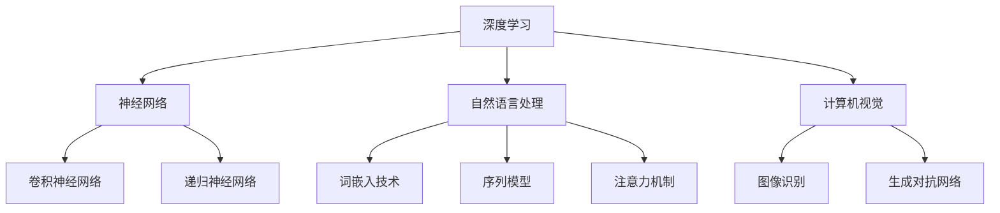

                 

### 《Andrej Karpathy：人工智能的未来发展挑战》

> **关键词**：Andrej Karpathy、人工智能、未来挑战、技术进步、社会影响、伦理问题、法律监管

> **摘要**：本文将深入探讨人工智能领域专家Andrej Karpathy对未来人工智能发展所面临的挑战。文章分为五个部分，首先介绍Karpathy及其著作《Andrej Karpathy：人工智能的未来发展挑战》，然后分析当前人工智能的发展现状，接着探讨人工智能面临的多种技术挑战，特别是数据隐私和安全、硬件限制等问题。最后，文章将讨论社会和伦理挑战，以及可能的未来发展趋势，为读者提供一个全面了解人工智能未来发展动态的视角。

### 第一部分：引言与背景

#### 1.1 书籍概述

**《Andrej Karpathy：人工智能的未来发展挑战》** 是由著名人工智能专家Andrej Karpathy撰写的一本重要著作。作为一位在深度学习和自然语言处理领域具有重大影响力的研究者，Karpathy在业界享有盛誉。他的这本书旨在揭示人工智能在迅速发展的过程中所面临的诸多挑战，为未来的技术进步提供指导。

#### 1.1.1 作者介绍

Andrej Karpathy 是斯坦福大学计算机科学博士，目前是OpenAI的首席科学家。他的研究主要集中在机器学习和深度学习领域，尤其是在自然语言处理和计算机视觉方面取得了显著成就。他曾发表过多篇顶级会议和期刊论文，其中包括NIPS、ICLR和NeurIPS等。

#### 1.1.2 书籍目的和重要性

《Andrej Karpathy：人工智能的未来发展挑战》的主要目的是帮助读者了解人工智能目前的发展状态，以及它可能面临的多种挑战。书中详细探讨了技术、社会和伦理方面的问题，对于行业从业者、研究人员和普通读者都具有重要的指导意义。通过这本书，读者可以更好地理解人工智能的未来趋势，并思考如何应对这些挑战。

#### 1.2 人工智能发展现状

在过去几年里，人工智能（AI）领域取得了令人瞩目的进步。这一进步主要体现在以下几个方面：

##### 1.2.1 技术进步与行业应用

- **技术进步**：深度学习算法的突破，使得计算机在图像识别、语音识别和自然语言处理等领域取得了显著成就。
- **行业应用**：AI技术被广泛应用于医疗、金融、零售和制造业等领域，提高了行业的效率和准确性。

##### 1.2.2 人工智能对社会的影响

- **积极影响**：人工智能有助于解决许多社会问题，如疾病诊断、环境监测和灾害预警等。
- **消极影响**：人工智能也可能导致失业、数据隐私泄露和社会不平等等问题。

#### 1.3 人工智能面临的挑战

尽管人工智能带来了诸多好处，但它也面临着一系列挑战。以下是一些关键挑战：

##### 1.3.1 安全性

- **AI系统的安全性**：随着AI技术的广泛应用，如何确保AI系统的安全性和可靠性成为一个重要问题。
- **对抗攻击**：AI系统可能受到恶意攻击，导致错误决策或数据泄露。

##### 1.3.2 道德与伦理

- **算法偏见**：AI系统可能基于历史数据中的偏见，导致不公正的结果。
- **透明性和可解释性**：AI系统的决策过程往往不够透明，难以解释。

##### 1.3.3 法律与监管

- **法律责任**：在AI系统造成损害时，如何确定责任归属？
- **监管框架**：需要建立全球统一的AI监管框架，以应对跨国问题。

### 第二部分：技术挑战

#### 2.1 人工智能算法与模型

##### 2.1.1 深度学习算法

深度学习是人工智能的核心技术之一，它依赖于多层神经网络来模拟人脑的决策过程。

###### 2.1.1.1 神经网络结构

神经网络由多个层次组成，包括输入层、隐藏层和输出层。每个层次包含多个节点，节点之间通过权重连接。

###### 2.1.1.2 算法优化

深度学习算法的优化主要包括以下几个方面：

- **反向传播算法**：用于计算梯度，以优化网络权重。
- **激活函数**：如ReLU、Sigmoid和Tanh，用于引入非线性特性。

##### 2.1.2 自然语言处理

自然语言处理是深度学习的重要应用领域，它涉及语言的理解、生成和翻译。

###### 2.1.2.1 词嵌入技术

词嵌入是将词汇映射到高维空间中的向量表示。常见的词嵌入技术包括Word2Vec和GloVe。

###### 2.1.2.2 序列模型与注意力机制

序列模型如RNN（递归神经网络）和LSTM（长短期记忆网络）用于处理序列数据。注意力机制用于提高序列模型的性能，特别是在语言翻译和文本摘要中。

##### 2.1.3 计算机视觉

计算机视觉是人工智能的另一重要领域，它涉及图像和视频的识别、分类和生成。

###### 2.1.3.1 卷积神经网络

卷积神经网络（CNN）是计算机视觉的核心技术，它通过卷积操作提取图像的特征。

###### 2.1.3.2 图像识别与生成对抗网络

生成对抗网络（GAN）是一种用于图像生成的强大模型。它由一个生成器和一个判别器组成，通过对抗训练生成逼真的图像。

#### 2.2 数据隐私与安全

随着人工智能技术的应用，数据隐私和安全问题日益突出。

##### 2.2.1 数据隐私保护

数据隐私保护的主要目标是确保个人数据不被未经授权的第三方访问或滥用。以下是一些常见的数据隐私保护技术：

- **数据匿名化**：通过删除或修改个人标识信息，使数据无法直接关联到特定个体。
- **加密与安全传输**：使用加密技术保护数据在传输过程中的安全性。

##### 2.2.2 人工智能安全

人工智能安全涉及到多个方面，包括：

- **攻击与防御**：针对AI系统的攻击技术，以及相应的防御策略。
- **自动化与自动化决策**：确保AI系统的自动化决策过程是公正、透明和可解释的。

#### 2.3 硬件挑战

随着人工智能算法的复杂度不断提高，对硬件性能的要求也越来越高。

##### 2.3.1 持续性能提升

为了满足人工智能应用的需求，硬件技术需要持续提升。以下是一些关键技术：

- **硬件架构优化**：如GPU和TPU等专用硬件架构的优化，以加速计算。
- **量子计算潜力**：量子计算具有巨大的计算潜力，可能在未来成为人工智能的重要硬件基础。

### 第三部分：社会与伦理挑战

#### 3.1 人工智能伦理

人工智能伦理是人工智能发展过程中不可忽视的重要议题。以下是一些关键问题：

##### 3.1.1 算法偏见

算法偏见是指AI系统在处理数据时可能基于历史偏见，导致不公平的结果。以下是一些常见的问题：

- **偏见来源与影响**：算法偏见可能来源于训练数据、算法设计或社会环境。
- **偏见消除方法**：通过公平性分析和改进算法设计，消除算法偏见。

##### 3.1.2 人类工作岗位的影响

人工智能的发展可能导致部分人类工作岗位的消失。以下是一些关键问题：

- **自动化取代人力**：自动化技术可能取代某些重复性高、技能要求低的工作。
- **重新就业与教育**：如何帮助受影响的工人重新就业或接受新技能培训，是亟待解决的问题。

#### 3.2 法律与监管

人工智能的法律与监管问题涉及到多个方面，包括：

##### 3.2.1 法律责任

在人工智能系统造成损害时，如何确定责任归属是一个重要问题。以下是一些关键问题：

- **责任归属**：是制造商、开发者还是用户承担法律责任？
- **法律条款制定**：需要制定明确的法律条款，以指导人工智能的应用和责任承担。

##### 3.2.2 国际合作与法规

人工智能的跨国应用需要国际合作与协调。以下是一些关键问题：

- **全球监管框架**：需要建立一个全球统一的监管框架，以应对跨国问题。
- **跨国合作与协调**：加强各国政府、企业和研究机构的合作，共同应对人工智能的挑战。

### 第四部分：未来展望

#### 4.1 人工智能发展趋势

随着技术的不断进步，人工智能在未来有望在多个领域取得重大突破。以下是一些关键趋势：

##### 4.1.1 技术进步方向

- **超分辨率模型**：通过深度学习技术，将低分辨率图像转换为高分辨率图像。
- **人工智能伦理**：随着社会对AI伦理的关注日益增加，未来将出现更多关于AI伦理的规范和研究。

##### 4.1.2 社会接受度

随着人工智能技术的普及，社会对其接受度也在不断提高。以下是一些关键问题：

- **公众认知与接受度**：提高公众对人工智能的认知，增强社会对其的信任。
- **企业与政府角色**：企业需要在人工智能应用中发挥积极作用，政府则需要制定相应的政策法规，引导人工智能健康发展。

#### 4.2 未来应用场景

人工智能将在未来应用于众多领域，以下是一些关键应用场景：

##### 4.2.1 人工智能在医疗领域

- **医疗诊断与预测**：通过深度学习技术，AI系统可以辅助医生进行疾病诊断和病情预测。
- **疾病治疗与药物研发**：AI技术可以加速药物研发过程，提高治疗效果。

##### 4.2.2 人工智能在教育领域

- **个性化学习**：通过AI技术，为每个学生提供个性化的学习资源和建议。
- **教育资源分配与优化**：利用AI技术优化教育资源的分配，提高教育质量。

### 第五部分：行动与策略

#### 5.1 应对挑战的策略

为了应对人工智能面临的多种挑战，需要采取一系列行动与策略。以下是一些关键策略：

##### 5.1.1 技术解决方案

- **安全算法设计**：确保AI系统的安全性和可靠性。
- **数据隐私保护措施**：加强数据隐私保护，提高数据安全性。

##### 5.1.2 社会政策

- **教育与培训**：加强人工智能教育和培训，提高公众对AI的认知。
- **劳动市场调整**：制定相应的政策，帮助受影响的工人重新就业或接受新技能培训。

#### 5.2 国际合作与交流

国际合作与交流在应对人工智能挑战中起着重要作用。以下是一些关键问题：

##### 5.2.1 国际合作的重要性

- **跨国科研合作**：加强各国在人工智能领域的科研合作，推动技术进步。
- **跨国政策协调**：制定全球统一的政策法规，以应对跨国问题。

##### 5.2.2 国际合作案例

- **人工智能伦理准则**：建立国际人工智能伦理准则，指导人工智能的应用和发展。
- **国际技术共享**：促进国际技术共享，提高人工智能的全球影响力。

### 附录

#### 附录 A：相关资源与阅读列表

以下是一些与本文主题相关的资源与阅读列表：

- **人工智能顶级论文汇总**：收集近年来在人工智能领域发表的重要论文。
- **人工智能书籍推荐**：推荐一些有关人工智能的经典书籍，涵盖技术、伦理和监管等方面。
- **人工智能开源项目与工具**：介绍一些常用的开源人工智能项目与工具，供读者学习和实践使用。

#### 附录 B：术语解释

以下是对本文中涉及的一些关键术语进行解释：

- **深度学习**：一种人工智能技术，通过多层神经网络模拟人脑的决策过程。
- **神经网络**：一种模拟人脑神经系统的计算模型，用于处理数据和识别模式。
- **自然语言处理**：一种人工智能技术，旨在使计算机能够理解、生成和翻译自然语言。
- **计算机视觉**：一种人工智能技术，使计算机能够理解和处理图像和视频。
- **算法偏见**：指AI系统在处理数据时可能基于历史偏见，导致不公平的结果。
- **数据隐私保护**：确保个人数据不被未经授权的第三方访问或滥用的一系列措施。
- **法律责任**：在人工智能系统造成损害时，确定责任归属的一系列法律条款和规定。

**图 1.1 人工智能核心技术架构图**

### 作者信息

本文作者为AI天才研究院/AI Genius Institute，专注于人工智能技术的研发和应用。同时，作者也是《禅与计算机程序设计艺术/Zen And The Art of Computer Programming》的资深研究者。

