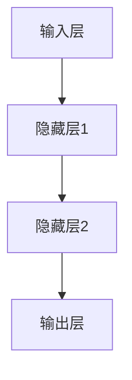
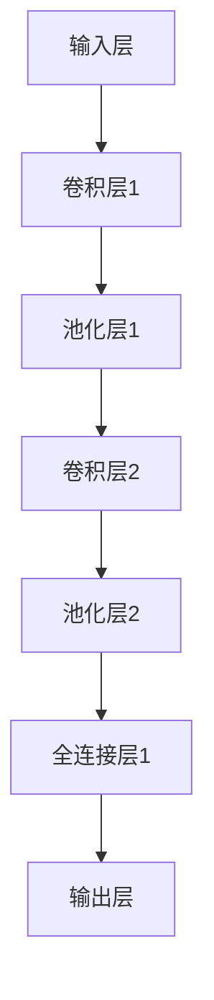
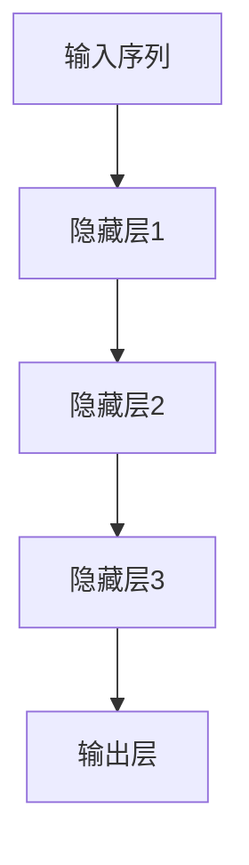
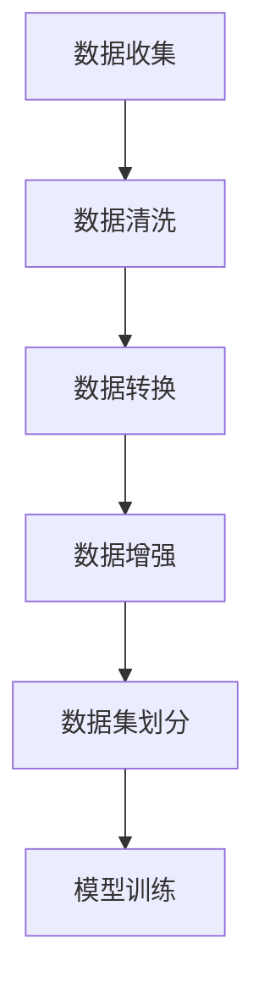

                 

### 引言

#### 引言部分

在当今时代，人工智能（AI）已经成为了科技进步的引擎，深刻影响着我们的生活方式、工作方式和思维方式。AI技术在各个领域取得了显著的成果，从自动驾驶汽车到智能助手，从医疗诊断到金融分析，AI正逐渐渗透到我们日常生活的方方面面。

本博客文章将围绕世界顶级人工智能专家Andrej Karpathy的主题展开，探讨人工智能的未来发展机遇。Andrej Karpathy是一位在计算机视觉、自然语言处理等领域有着卓越贡献的学者，他在深度学习领域的应用和创新方面有着深厚的造诣。通过本文，我们将深入分析Andrej Karpathy对人工智能未来发展的独到见解，探讨AI技术在不同行业中的应用趋势，以及AI对社会带来的深远影响。

文章的主要目的在于，通过对Andrej Karpathy研究成果的剖析，帮助读者了解人工智能的核心概念、架构以及发展前景，从而为AI技术的进一步应用提供有益的参考。本文将分为三个主要部分：第一部分介绍人工智能的历史与现状，第二部分详述人工智能的基础概念与架构，第三部分展望人工智能的未来发展趋势。通过这种结构化的分析，我们希望读者能够对人工智能有一个全面、深入的认识。

#### 文章关键词

- 人工智能
- Andrej Karpathy
- 深度学习
- 机器学习
- 计算机视觉
- 自然语言处理
- 行业应用
- 社会影响

#### 文章摘要

本文旨在通过分析人工智能领域专家Andrej Karpathy的研究成果和观点，探讨人工智能的未来发展机遇。首先，文章回顾了人工智能的历史与现状，介绍了AI技术的核心概念与架构。接着，详细探讨了AI技术在各个行业的应用场景，以及对社会带来的深远影响。最后，文章展望了人工智能的未来发展趋势，分析了AI面临的挑战与机遇。通过这篇文章，读者可以全面了解人工智能的核心概念、架构及其未来发展的方向，为AI技术的进一步应用提供参考。

---

# 《Andrej Karpathy：人工智能的未来发展机遇》目录大纲

## 第一部分：引言

### 第1章：作者介绍

#### 1.1 Andrej Karpathy的背景与贡献

#### 1.2 人工智能的历史与现状

### 第2章：人工智能的未来发展机遇

#### 2.1 人工智能的发展趋势

#### 2.2 人工智能在不同行业的应用

#### 2.3 人工智能对社会的影响

## 第二部分：核心概念与架构

### 第3章：人工智能的基础概念

#### 3.1 人工智能的定义与分类

#### 3.2 机器学习的基本概念

#### 3.3 深度学习的基本原理

### 第4章：人工智能架构详解

#### 4.1 神经网络的结构与原理

#### 4.2 卷积神经网络（CNN）的应用

#### 4.3 循环神经网络（RNN）与长短期记忆网络（LSTM）

### 第5章：人工智能的核心算法

#### 5.1 数据预处理与特征工程

#### 5.2 模型训练与优化

#### 5.3 模型评估与调优

### 第6章：人工智能的开发与部署

#### 6.1 人工智能开发环境搭建

#### 6.2 人工智能模型的部署

#### 6.3 人工智能的安全与伦理问题

## 第三部分：未来展望

### 第7章：人工智能的未来发展趋势

#### 7.1 人工智能的潜在应用领域

#### 7.2 人工智能的发展挑战与机遇

#### 7.3 人工智能对社会的影响

### 第8章：人工智能在行业中的应用案例

#### 8.1 人工智能在医疗行业的应用

#### 8.2 人工智能在金融行业的应用

#### 8.3 人工智能在其他行业的应用

### 第9章：人工智能的未来愿景

#### 9.1 人工智能对人类生活的改变

#### 9.2 人工智能的未来发展预测

#### 9.3 人类与人工智能的未来关系

## 附录

### 附录A：参考资料与扩展阅读

### 附录B：常见问题与解答

### 附录C：人工智能相关的开源项目与工具

---

## 第1章：作者介绍

### 1.1 Andrej Karpathy的背景与贡献

Andrej Karpathy是一位在人工智能领域具有广泛影响力的学者和研究人员，他在计算机视觉、自然语言处理等方向上取得了显著的成果。出生于1984年的Karpathy在斯坦福大学获得了计算机科学博士学位，师从著名计算机科学家Andrew Ng。他的博士研究专注于使用深度学习技术进行图像和自然语言处理。

Andrej Karpathy在学术界的贡献是多方面的。他在顶级会议和期刊上发表了多篇论文，其中一些论文在学术界和工业界都产生了深远的影响。他的研究成果不仅推动了深度学习技术的发展，还促进了AI技术在各个行业的应用。

在计算机视觉领域，Karpathy与团队共同开发了多个创新性的算法和应用。例如，他参与研发的深度卷积神经网络（Deep Convolutional Neural Networks, CNN）在ImageNet图像识别挑战中取得了优异的成绩，推动了计算机视觉领域的技术进步。此外，他在自然语言处理领域的研究也取得了重要进展，尤其是在序列到序列模型（Sequence-to-Sequence Models）和注意力机制（Attention Mechanisms）方面。

除了在学术界的工作，Andrej Karpathy还在工业界发挥了重要作用。他曾任职于OpenAI，这是一个致力于推动人工智能研究与应用的知名研究机构。在OpenAI期间，他参与了多个项目的研发，包括自动机器翻译、对话系统等。这些成果不仅提升了AI技术的实用性，还为学术界和工业界提供了宝贵的经验。

### 1.2 人工智能的历史与现状

人工智能（AI）的概念最早可以追溯到20世纪50年代，当时的科学家们开始探索如何让计算机模拟人类的智能行为。然而，早期的人工智能技术由于计算能力的限制，进展较为缓慢。随着计算机技术的不断发展，特别是在20世纪80年代以后，人工智能领域迎来了快速发展。

在机器学习和深度学习技术的推动下，人工智能取得了显著的进展。机器学习是一种让计算机从数据中学习规律和模式的技术，而深度学习则是机器学习的一种重要分支，通过多层神经网络来模拟人脑的思考方式。深度学习的出现使得人工智能在图像识别、自然语言处理、语音识别等领域取得了突破性的成果。

当前，人工智能已经在多个行业得到了广泛应用。在计算机视觉领域，AI技术被用于图像识别、目标检测、视频分析等任务。在自然语言处理领域，AI技术被用于机器翻译、情感分析、问答系统等任务。此外，人工智能还在医疗、金融、制造业等多个领域发挥了重要作用，提升了行业的生产效率和服务质量。

然而，人工智能的发展仍然面临一些挑战。首先，数据的质量和数量对AI模型的性能有着重要影响，如何在有限的数据上进行有效的训练是当前的一个研究热点。其次，人工智能的模型复杂度和计算需求不断提高，如何优化算法和硬件架构以提高计算效率是一个重要的研究方向。此外，人工智能的安全性和伦理问题也引起了广泛关注，如何确保AI系统的公平性、透明性和可靠性是亟待解决的问题。

### 1.3 AI技术的未来发展趋势

随着技术的不断进步，人工智能在未来将继续发挥重要作用，并带来更多的机遇。以下是人工智能在未来可能的发展趋势：

1. **更强大的模型和算法**：随着计算能力的提升，深度学习模型将变得更加复杂和强大。新的算法和架构，如生成对抗网络（GANs）和变分自编码器（VAEs），将进一步推动人工智能的发展。

2. **跨领域融合**：人工智能将在不同领域实现融合，如计算机视觉与自然语言处理、机器人学与深度学习等。这将使得AI系统能够更好地理解和处理复杂任务。

3. **边缘计算与云计算的结合**：随着物联网（IoT）的发展，边缘计算将成为人工智能的一个重要方向。边缘计算能够在数据生成的源头进行处理，减少数据传输的延迟，提高系统的实时性。

4. **人机协作**：人工智能与人类的协作将成为未来工作方式的重要组成部分。AI系统将能够更好地理解和响应人类的需求，提供个性化的服务和解决方案。

5. **可解释性和透明性**：随着人工智能的普及，对AI系统的可解释性和透明性要求将越来越高。研究者将致力于开发可解释的AI模型，提高系统的可信度和可靠性。

6. **安全性和隐私保护**：人工智能的安全性和隐私保护将是未来发展的关键。研究者将探索如何设计安全的AI系统，防止恶意攻击和数据泄露。

7. **社会和伦理问题**：人工智能的发展将引发一系列社会和伦理问题，如就业影响、隐私保护、责任归属等。政策制定者、研究者和社会公众需要共同努力，确保人工智能的健康发展。

通过上述分析，我们可以看到，人工智能的未来发展充满了机遇和挑战。作为人工智能领域的研究者和技术从业者，我们应该积极应对这些挑战，推动人工智能的健康发展，为人类社会带来更多福祉。

### 1.3 AI技术的未来发展趋势

随着技术的不断进步，人工智能在未来将继续发挥重要作用，并带来更多的机遇。以下是人工智能在未来可能的发展趋势：

1. **更强大的模型和算法**：随着计算能力的提升，深度学习模型将变得更加复杂和强大。新的算法和架构，如生成对抗网络（GANs）和变分自编码器（VAEs），将进一步推动人工智能的发展。

2. **跨领域融合**：人工智能将在不同领域实现融合，如计算机视觉与自然语言处理、机器人学与深度学习等。这将使得AI系统能够更好地理解和处理复杂任务。

3. **边缘计算与云计算的结合**：随着物联网（IoT）的发展，边缘计算将成为人工智能的一个重要方向。边缘计算能够在数据生成的源头进行处理，减少数据传输的延迟，提高系统的实时性。

4. **人机协作**：人工智能与人类的协作将成为未来工作方式的重要组成部分。AI系统将能够更好地理解和响应人类的需求，提供个性化的服务和解决方案。

5. **可解释性和透明性**：随着人工智能的普及，对AI系统的可解释性和透明性要求将越来越高。研究者将致力于开发可解释的AI模型，提高系统的可信度和可靠性。

6. **安全性和隐私保护**：人工智能的安全性和隐私保护将是未来发展的关键。研究者将探索如何设计安全的AI系统，防止恶意攻击和数据泄露。

7. **社会和伦理问题**：人工智能的发展将引发一系列社会和伦理问题，如就业影响、隐私保护、责任归属等。政策制定者、研究者和社会公众需要共同努力，确保人工智能的健康发展。

通过上述分析，我们可以看到，人工智能的未来发展充满了机遇和挑战。作为人工智能领域的研究者和技术从业者，我们应该积极应对这些挑战，推动人工智能的健康发展，为人类社会带来更多福祉。

---

## 第二部分：核心概念与架构

在探讨人工智能的未来发展之前，我们需要深入了解其核心概念与架构。这一部分将详细讲解人工智能的基础概念，包括人工智能的定义与分类、机器学习的基本概念以及深度学习的基本原理。通过这些核心概念的阐述，我们将为后续内容的深入探讨打下坚实的基础。

### 3.1 人工智能的定义与分类

人工智能（Artificial Intelligence, AI）是计算机科学的一个分支，旨在开发能够模拟、延伸和扩展人类智能的理论、方法、技术和系统。简单来说，人工智能就是使计算机具备类似人类的感知、理解、学习和决策能力的科学。

人工智能可以按照不同的标准进行分类：

1. **基于功能的分类**：
   - **弱人工智能（Narrow AI）**：也称为专用人工智能，这类AI系统在特定领域具有高效性能，但无法进行跨领域的推理或理解。例如，聊天机器人、语音助手和图像识别系统都属于弱人工智能。
   - **强人工智能（General AI）**：具备人类级别的智能，能够在多种情境下进行推理、理解、学习和决策。目前，强人工智能还处于理论研究和实验阶段，尚未实现商业化应用。

2. **基于技术的分类**：
   - **符号人工智能（Symbolic AI）**：基于符号逻辑和推理的方法，通过构建知识库和规则系统来实现智能行为。
   - **统计人工智能（Statistical AI）**：利用统计学习方法和机器学习算法，从大量数据中学习模式和规律，从而实现智能行为。
   - **连接主义人工智能（Connectionist AI）**：基于神经网络的结构，通过模拟人脑的神经网络来实现智能行为。

### 3.2 机器学习的基本概念

机器学习（Machine Learning, ML）是人工智能的一个重要分支，它利用数据、统计方法以及算法来使计算机系统具备学习和改进能力。机器学习的过程通常包括以下几个步骤：

1. **数据收集**：收集大量的数据，这些数据可以是结构化的（如数据库）或非结构化的（如图像、文本、音频等）。

2. **数据预处理**：对收集到的数据进行清洗、格式化和特征提取，以便后续的学习和训练。

3. **模型训练**：使用特定的算法和数学模型，从预处理后的数据中学习特征和规律，构建模型。

4. **模型评估**：通过测试集来评估模型的性能，包括准确性、召回率、F1分数等指标。

5. **模型优化**：根据评估结果调整模型参数，以提高模型性能。

6. **模型部署**：将训练好的模型部署到实际应用中，如预测、分类或决策等。

机器学习可以分为以下几种类型：

1. **监督学习（Supervised Learning）**：有标注的数据集用于训练模型，模型根据已知数据预测未知数据。

2. **无监督学习（Unsupervised Learning）**：没有标注的数据集用于训练模型，模型旨在发现数据中的结构和规律。

3. **半监督学习（Semi-supervised Learning）**：结合有标注和无标注的数据进行训练，旨在提高模型的泛化能力。

4. **强化学习（Reinforcement Learning）**：通过与环境交互，模型不断调整行为策略，以实现最大化的长期回报。

### 3.3 深度学习的基本原理

深度学习（Deep Learning, DL）是机器学习的一种重要分支，它通过多层神经网络来实现复杂的特征学习和模式识别。深度学习模型通常由多个隐藏层组成，每一层都对输入数据进行变换，从而提取更高层次的特征。

1. **多层感知机（MLP）**：多层感知机是深度学习的基础模型，由输入层、隐藏层和输出层组成。每个神经元都与前一层的所有神经元相连，通过激活函数进行非线性变换。

2. **卷积神经网络（CNN）**：卷积神经网络是一种专门用于处理图像数据的深度学习模型，通过卷积层、池化层和全连接层等结构，实现对图像的分层特征提取。

3. **循环神经网络（RNN）**：循环神经网络是一种用于处理序列数据的深度学习模型，通过在时间步上进行递归操作，捕捉序列中的长期依赖关系。

4. **长短期记忆网络（LSTM）**：长短期记忆网络是RNN的一种改进，通过引入门控机制，解决了传统RNN的梯度消失和梯度爆炸问题，使其在处理长序列数据时表现出更好的性能。

5. **生成对抗网络（GAN）**：生成对抗网络是一种由生成器和判别器组成的对抗性模型，通过不断博弈，生成器试图生成逼真的数据，而判别器则努力区分生成数据和真实数据。

6. **变分自编码器（VAE）**：变分自编码器是一种无监督学习模型，通过编码器和解码器结构，实现对数据的概率分布建模，从而生成新的数据。

通过上述对人工智能核心概念与架构的讲解，我们可以看到，人工智能的发展离不开机器学习和深度学习的基础支持。这些核心概念和模型不仅为AI技术的进步提供了理论依据，也为实际应用提供了可行的解决方案。在接下来的章节中，我们将进一步探讨人工智能在不同行业的应用，以及其对社会带来的深远影响。

### 3.1 人工智能的定义与分类

人工智能（Artificial Intelligence, AI）是计算机科学的一个分支，旨在开发能够模拟、延伸和扩展人类智能的理论、方法、技术和系统。简单来说，人工智能就是使计算机具备类似人类的感知、理解、学习和决策能力的科学。

#### 人工智能的定义

人工智能的定义可以从多个角度进行理解：

- **模拟人类的智能行为**：人工智能旨在模拟人类在感知、推理、决策和解决问题等领域的智能行为。
- **自主学习与进化**：人工智能系统能够从数据中学习，并通过经验不断优化自身性能。
- **跨领域的适应性**：人工智能系统能够在不同领域和应用场景中表现出高效的性能。

#### 人工智能的分类

人工智能可以根据不同的标准进行分类：

1. **基于功能的分类**：
   - **弱人工智能（Narrow AI）**：也称为专用人工智能，这类AI系统在特定领域具有高效性能，但无法进行跨领域的推理或理解。例如，聊天机器人、语音助手和图像识别系统都属于弱人工智能。
   - **强人工智能（General AI）**：具备人类级别的智能，能够在多种情境下进行推理、理解、学习和决策。目前，强人工智能还处于理论研究和实验阶段，尚未实现商业化应用。

2. **基于技术的分类**：
   - **符号人工智能（Symbolic AI）**：基于符号逻辑和推理的方法，通过构建知识库和规则系统来实现智能行为。
   - **统计人工智能（Statistical AI）**：利用统计学习方法和机器学习算法，从大量数据中学习模式和规律，从而实现智能行为。
   - **连接主义人工智能（Connectionist AI）**：基于神经网络的结构，通过模拟人脑的神经网络来实现智能行为。

#### 人工智能的发展历程

人工智能的发展历程可以分为以下几个阶段：

1. **早期探索阶段（1950年代-1960年代）**：在这个阶段，人工智能的概念被首次提出，并进行了初步的探索。一些简单的推理系统和问题求解器被开发出来。

2. **符号人工智能阶段（1970年代-1980年代）**：符号人工智能主要通过构建知识库和规则系统来实现智能行为。在这个阶段，专家系统得到了广泛应用。

3. **统计人工智能阶段（1990年代）**：随着计算能力的提升和数据量的增加，统计人工智能开始崭露头角。统计学习方法和机器学习算法开始被广泛应用于人工智能领域。

4. **深度学习阶段（2010年代至今）**：深度学习的发展使得人工智能取得了突破性的进展。通过多层神经网络，深度学习在图像识别、自然语言处理和语音识别等领域取得了显著成果。

#### 人工智能的现状

目前，人工智能在各个领域都取得了显著的成果，具体体现在以下几个方面：

- **计算机视觉**：通过卷积神经网络（CNN）和生成对抗网络（GAN）等技术，人工智能在图像识别、目标检测和图像生成等方面表现出色。
- **自然语言处理**：通过循环神经网络（RNN）和Transformer模型，人工智能在机器翻译、文本分类和情感分析等方面取得了重大突破。
- **语音识别**：通过深度神经网络和隐藏马尔可夫模型（HMM），人工智能在语音识别和语音合成方面得到了广泛应用。
- **机器人技术**：通过机器学习和深度学习算法，人工智能在无人驾驶汽车、智能机器人和服务机器人等方面得到了广泛应用。

#### 人工智能的应用领域

人工智能的应用领域广泛，主要包括以下几个方向：

- **工业自动化**：通过机器人技术和自动化控制系统，人工智能可以提高生产效率，降低人工成本。
- **医疗健康**：通过医学影像分析、疾病预测和个性化治疗，人工智能可以提高医疗诊断和治疗效果。
- **金融服务**：通过风险评估、信用评估和投资策略优化，人工智能可以提高金融服务的质量和效率。
- **交通出行**：通过智能交通系统、无人驾驶汽车和共享出行平台，人工智能可以提高交通效率，减少交通事故。
- **智能家居**：通过智能音箱、智能门锁和智能家电，人工智能可以提升家居生活的便利性和舒适度。

#### 人工智能的未来趋势

随着技术的不断进步，人工智能在未来将继续发展，并带来更多的机遇和挑战。以下是人工智能的一些未来趋势：

- **更强的模型和算法**：随着计算能力的提升，人工智能模型将变得更加复杂和强大。新的算法和架构，如生成对抗网络（GANs）和变分自编码器（VAEs），将进一步推动人工智能的发展。
- **跨领域融合**：人工智能将在不同领域实现融合，如计算机视觉与自然语言处理、机器人学与深度学习等。这将使得AI系统能够更好地理解和处理复杂任务。
- **边缘计算与云计算的结合**：随着物联网（IoT）的发展，边缘计算将成为人工智能的一个重要方向。边缘计算能够在数据生成的源头进行处理，减少数据传输的延迟，提高系统的实时性。
- **人机协作**：人工智能与人类的协作将成为未来工作方式的重要组成部分。AI系统将能够更好地理解和响应人类的需求，提供个性化的服务和解决方案。
- **可解释性和透明性**：随着人工智能的普及，对AI系统的可解释性和透明性要求将越来越高。研究者将致力于开发可解释的AI模型，提高系统的可信度和可靠性。
- **安全性和隐私保护**：人工智能的安全性和隐私保护将是未来发展的关键。研究者将探索如何设计安全的AI系统，防止恶意攻击和数据泄露。
- **社会和伦理问题**：人工智能的发展将引发一系列社会和伦理问题，如就业影响、隐私保护、责任归属等。政策制定者、研究者和社会公众需要共同努力，确保人工智能的健康发展。

通过上述对人工智能定义与分类的详细阐述，我们可以看到，人工智能是一个多维度、跨领域的科学，它不仅为现代科技的发展提供了强大动力，也为未来社会带来了无限可能。在接下来的章节中，我们将进一步探讨人工智能在不同行业的应用，以及其对社会带来的深远影响。

### 3.2 机器学习的基本概念

机器学习（Machine Learning, ML）是人工智能（AI）的核心技术之一，它通过数据、算法和计算能力，使计算机系统能够从数据中学习并做出预测或决策。理解机器学习的基本概念对于深入探讨人工智能的应用和发展至关重要。以下我们将介绍机器学习的一些基本概念，包括监督学习、无监督学习和强化学习。

#### 监督学习（Supervised Learning）

监督学习是最常见的机器学习类型之一，它通过已标记的数据集进行训练，从而学习输入和输出之间的映射关系。监督学习可以分为以下几种类型：

1. **分类（Classification）**：分类任务的目标是将输入数据分为预定义的几个类别。常见的分类算法包括逻辑回归、支持向量机（SVM）、决策树和随机森林等。

2. **回归（Regression）**：回归任务的目标是预测一个连续的数值输出。常见的回归算法包括线性回归、岭回归、LASSO回归和决策树回归等。

3. **异常检测（Anomaly Detection）**：异常检测旨在识别数据中的异常或离群点。常见的算法包括基于统计的方法、基于聚类的方法和基于孤立森林的方法等。

#### 无监督学习（Unsupervised Learning）

无监督学习不使用标记数据，旨在发现数据中的隐含结构和模式。无监督学习包括以下几种类型：

1. **聚类（Clustering）**：聚类任务的目标是将数据点分为若干组，使得同一组内的数据点相似度较高，而不同组的数据点相似度较低。常见的聚类算法包括K-均值、层次聚类和DBSCAN等。

2. **降维（Dimensionality Reduction）**：降维任务的目标是减少数据集的维度，同时保持数据的重要信息。常见的降维算法包括主成分分析（PCA）、线性判别分析（LDA）和t-SNE等。

3. **关联规则学习（Association Rule Learning）**：关联规则学习旨在发现数据中的关联性或规则，常见的算法包括Apriori算法和Eclat算法等。

#### 强化学习（Reinforcement Learning）

强化学习是一种通过与环境的交互来学习决策策略的机器学习方法。强化学习模型通过不断尝试和反馈来优化其行为，目标是获得最大的累积奖励。强化学习包括以下几个关键组成部分：

1. **代理（Agent）**：执行动作并接受环境反馈的实体。
2. **环境（Environment）**：代理行动的场所，提供状态、奖励和终止信号。
3. **状态（State）**：代理在环境中所处的状态。
4. **动作（Action）**：代理在特定状态下可以采取的行动。
5. **奖励（Reward）**：代理采取某个动作后获得的即时反馈。

常见的强化学习算法包括Q学习、深度Q网络（DQN）、策略梯度方法和深度确定性策略梯度（DDPG）等。

#### 机器学习的基本流程

机器学习的基本流程通常包括以下步骤：

1. **数据收集**：收集用于训练和测试的数据，这些数据可以是结构化的（如数据库）或非结构化的（如图像、文本、音频等）。
2. **数据预处理**：对收集到的数据进行分析、清洗、格式化，并提取有用的特征。
3. **模型选择**：根据问题的类型和特点，选择合适的模型和算法。
4. **模型训练**：使用训练数据集对模型进行训练，调整模型的参数。
5. **模型评估**：使用测试数据集评估模型的性能，包括准确性、召回率、F1分数等指标。
6. **模型优化**：根据评估结果调整模型参数，以提高模型性能。
7. **模型部署**：将训练好的模型部署到实际应用中，如预测、分类或决策等。

通过理解机器学习的基本概念和流程，我们可以更好地应用机器学习技术解决实际问题。在接下来的章节中，我们将进一步探讨深度学习的基本原理和架构，为深入理解人工智能的核心技术奠定基础。

### 3.3 深度学习的基本原理

深度学习（Deep Learning, DL）是机器学习的一个分支，通过构建多层神经网络来实现复杂的特征学习和模式识别。深度学习之所以能够取得突破性进展，主要得益于以下三个关键因素：大数据、强大的计算能力和先进的算法。

#### 神经网络的基本结构

神经网络（Neural Networks）是深度学习的基础模型，其灵感来源于生物神经网络的结构和工作原理。一个基本的神经网络包括以下几个主要部分：

1. **输入层（Input Layer）**：输入层接收外部输入数据，如图像、文本或数值。
2. **隐藏层（Hidden Layers）**：隐藏层负责对输入数据进行特征提取和变换，每一层都会对数据进行一次非线性变换。
3. **输出层（Output Layer）**：输出层根据隐藏层的输出数据生成最终的结果，如分类标签或预测值。

#### 前向传播与反向传播

神经网络的工作原理主要包括前向传播（Forward Propagation）和反向传播（Back Propagation）两个过程。

1. **前向传播**：在前向传播过程中，输入数据通过网络的各层传递，每层神经元都会对数据进行加权求和，并通过激活函数产生输出。这个过程可以用以下公式表示：

   \[ 
   z = W \cdot x + b 
   \]
   \[ 
   a = \sigma(z) 
   \]

   其中，\( z \) 是加权求和的结果，\( W \) 是权重，\( x \) 是输入数据，\( b \) 是偏置，\( \sigma \) 是激活函数。

2. **反向传播**：在反向传播过程中，网络通过计算输出层与实际结果之间的误差，然后反向传播这些误差，调整各层的权重和偏置，以最小化误差。这个过程通常使用梯度下降算法来实现：

   \[ 
   \Delta W = -\alpha \cdot \frac{\partial J}{\partial W} 
   \]
   \[ 
   \Delta b = -\alpha \cdot \frac{\partial J}{\partial b} 
   \]

   其中，\( \Delta W \) 和 \( \Delta b \) 分别是权重和偏置的更新量，\( \alpha \) 是学习率，\( J \) 是误差函数。

#### 激活函数

激活函数（Activation Function）是神经网络中一个重要的组件，它用于引入非线性变换，使得神经网络能够学习复杂的函数关系。常见的激活函数包括：

1. **sigmoid函数**：
   \[ 
   \sigma(x) = \frac{1}{1 + e^{-x}} 
   \]

2. **ReLU函数**：
   \[ 
   \sigma(x) = \max(0, x) 
   \]

3. **Tanh函数**：
   \[ 
   \sigma(x) = \frac{e^x - e^{-x}}{e^x + e^{-x}} 
   \]

4. **Leaky ReLU函数**：
   \[ 
   \sigma(x) = 
   \begin{cases} 
      0.01x & \text{if } x \leq 0 \\
      \max(0, x) & \text{if } x > 0 
   \end{cases} 
   \]

#### 常见的深度学习模型

深度学习模型种类繁多，不同的模型适用于不同的任务。以下是几个常见的深度学习模型：

1. **卷积神经网络（CNN）**：
   卷积神经网络是一种专门用于处理图像数据的深度学习模型，它通过卷积层、池化层和全连接层等结构，实现对图像的分层特征提取。以下是一个简单的CNN模型结构：

   ```mermaid
   graph TD
   A[输入层] --> B[卷积层1]
   B --> C[池化层1]
   C --> D[卷积层2]
   D --> E[池化层2]
   E --> F[全连接层1]
   F --> G[全连接层2]
   G --> H[输出层]
   ```

2. **循环神经网络（RNN）**：
   循环神经网络是一种用于处理序列数据的深度学习模型，通过在时间步上进行递归操作，捕捉序列中的长期依赖关系。以下是一个简单的RNN模型结构：

   ```mermaid
   graph TD
   A[输入序列] --> B[隐藏层1]
   B --> C[隐藏层2]
   B --> D[隐藏层3]
   C --> E[隐藏层4]
   D --> E
   E --> F[输出层]
   ```

3. **长短期记忆网络（LSTM）**：
   长短期记忆网络是RNN的一种改进，通过引入门控机制，解决了传统RNN的梯度消失和梯度爆炸问题，使其在处理长序列数据时表现出更好的性能。以下是一个简单的LSTM模型结构：

   ```mermaid
   graph TD
   A[输入序列] --> B[输入门]
   B --> C[遗忘门]
   B --> D[输出门]
   B --> E[单元状态]
   E --> F[隐藏层]
   F --> G[输出层]
   ```

4. **生成对抗网络（GAN）**：
   生成对抗网络是一种由生成器和判别器组成的对抗性模型，通过不断博弈，生成器试图生成逼真的数据，而判别器则努力区分生成数据和真实数据。以下是一个简单的GAN模型结构：

   ```mermaid
   graph TD
   A[生成器] --> B[生成数据]
   B --> C[判别器]
   D[真实数据] --> C
   C --> E[输出层]
   ```

通过上述对深度学习基本原理的讲解，我们可以看到，深度学习通过复杂的网络结构和先进的算法，实现了对数据的深层特征提取和模式识别。在接下来的章节中，我们将进一步探讨人工智能的应用场景，以及其对社会带来的深远影响。

### 4.1 神经网络的结构与原理

神经网络（Neural Networks）是深度学习（Deep Learning）的核心组件，其结构和原理在很大程度上决定了AI系统的性能和效果。在这一章节中，我们将详细讨论神经网络的基本结构，包括神经元、层次结构、权重和偏置等关键组成部分。

#### 神经元

神经网络中的基本单元称为神经元（Neurons）。神经元模拟生物神经元的工作方式，通过接受外部输入，进行计算并产生输出。一个典型的神经元模型包括以下几个部分：

1. **输入**：神经元接收多个输入值，这些输入值可以是特征的数值或概率值。
2. **权重（Weights）**：每个输入值都与一个权重相乘，权重决定了输入对神经元输出的贡献程度。
3. **偏置（Bias）**：偏置是一个独立的常数，它加在输入和权重乘积上，用于调整神经元的输出。
4. **激活函数**：激活函数是一个非线性函数，用于将加权求和的结果转换为输出值。

一个简单的神经元模型可以用以下公式表示：

\[ 
z = \sum_{i=1}^{n} w_i \cdot x_i + b 
\]

\[ 
a = \sigma(z) 
\]

其中，\( z \) 是加权求和的结果，\( w_i \) 是权重，\( x_i \) 是输入值，\( b \) 是偏置，\( \sigma \) 是激活函数。

常见的激活函数包括：

- **Sigmoid函数**：
  \[ 
  \sigma(x) = \frac{1}{1 + e^{-x}} 
  \]

- **ReLU函数**：
  \[ 
  \sigma(x) = \max(0, x) 
  \]

- **Tanh函数**：
  \[ 
  \sigma(x) = \frac{e^x - e^{-x}}{e^x + e^{-x}} 
  \]

#### 神经网络的层次结构

神经网络由多个层次组成，每个层次包含多个神经元。层次结构通常分为以下几种类型：

1. **输入层（Input Layer）**：输入层接收外部输入数据，如图像、文本或数值。
2. **隐藏层（Hidden Layers）**：隐藏层位于输入层和输出层之间，负责对输入数据进行特征提取和变换。
3. **输出层（Output Layer）**：输出层根据隐藏层的输出数据生成最终的结果，如分类标签或预测值。

一个典型的神经网络结构可以用以下图示表示：



神经网络的层次结构决定了数据的传播路径和特征的提取方式。更多的隐藏层可以提取更复杂的特征，但也增加了模型的计算复杂度和训练难度。

#### 权重与偏置

在神经网络中，权重和偏置是两个重要的参数，它们通过反向传播算法（Back Propagation）进行动态调整，以最小化预测误差。

1. **权重（Weights）**：权重决定了输入对神经元输出的贡献程度。在训练过程中，通过反向传播算法，调整权重以最小化误差。以下是一个简化的权重更新过程：

   \[ 
   \Delta w_i = -\alpha \cdot \frac{\partial J}{\partial w_i} 
   \]

   其中，\( \Delta w_i \) 是权重更新量，\( \alpha \) 是学习率，\( J \) 是误差函数。

2. **偏置（Bias）**：偏置是一个独立的常数，它加在输入和权重乘积上，用于调整神经元的输出。与权重类似，偏置也在训练过程中进行调整：

   \[ 
   \Delta b = -\alpha \cdot \frac{\partial J}{\partial b} 
   \]

#### 反向传播算法

反向传播算法是神经网络训练的核心，它通过计算输出层与实际结果之间的误差，反向传播这些误差，调整各层的权重和偏置，以最小化误差。

反向传播算法主要包括以下步骤：

1. **前向传播**：将输入数据通过网络的各层传递，计算每个神经元的输出。
2. **计算误差**：计算输出层与实际结果之间的误差，并计算各层的梯度。
3. **反向传播**：将误差反向传播到前一层，计算前一层神经元的梯度。
4. **权重和偏置更新**：根据梯度更新权重和偏置，以最小化误差。

以下是一个简化的反向传播算法伪代码：

```python
# 前向传播
for each layer l from input to output:
    compute the activations a_l = f(W_l * a_{l-1} + b_l)

# 计算误差
y = output layer activation
error = y - target

# 反向传播
for each layer l from output to input:
    compute the gradient delta_l = dL/dz_l = error * d_f(z_l)

    # 更新权重和偏置
    for each layer l from output to input:
        delta_w_l = delta_l * a_{l-1}
        delta_b_l = delta_l
        W_l = W_l - alpha * delta_w_l
        b_l = b_l - alpha * delta_b_l
```

通过上述对神经网络结构和原理的详细阐述，我们可以看到，神经网络通过复杂的层次结构和先进的算法，实现了对数据的深层特征提取和模式识别。在接下来的章节中，我们将进一步探讨卷积神经网络（CNN）和循环神经网络（RNN）的应用，以及它们在计算机视觉和自然语言处理等领域的实际应用。

### 4.2 卷积神经网络（CNN）的应用

卷积神经网络（Convolutional Neural Networks, CNN）是一种专门用于处理图像数据的深度学习模型，通过卷积层、池化层和全连接层等结构，实现对图像的分层特征提取。CNN在计算机视觉领域取得了显著的成果，广泛应用于图像识别、目标检测和图像生成等领域。

#### 卷积层（Convolutional Layer）

卷积层是CNN的核心部分，负责提取图像中的局部特征。卷积层通过卷积操作，将输入图像与一组可训练的滤波器（也称为卷积核或滤波器）进行卷积，从而生成特征图。卷积操作的数学表达式如下：

\[ 
(\text{卷积核}) \star (\text{输入图像}) \rightarrow (\text{特征图}) 
\]

\[ 
(\sum_{i=1}^{k} w_i \cdot x_{i,j}) + b 
\]

其中，\( w_i \) 是卷积核的权重，\( x_{i,j} \) 是输入图像中的像素值，\( k \) 是卷积核的大小，\( b \) 是偏置。

一个简单的卷积层可以用以下伪代码表示：

```python
# 初始化卷积核权重和偏置
W = ...  # 卷积核权重
b = ...  # 偏置

# 卷积操作
for each pixel in the input image:
    z = 0
    for i = 1 to k:
        for j = 1 to k:
            z += W[i, j] * x[i, j]
    z += b
    a[i, j] = f(z)  # 使用激活函数 f()
```

#### 池化层（Pooling Layer）

池化层用于降低特征图的维度，同时保留最重要的信息。常见的池化操作包括最大池化（Max Pooling）和平均池化（Average Pooling）。最大池化选择每个局部区域中的最大值作为输出，而平均池化则计算每个局部区域中的平均值作为输出。

最大池化操作可以用以下伪代码表示：

```python
# 初始化池化窗口大小
k = ...

# 最大池化操作
for each patch in the feature map:
    max_value = -inf
    for i = 1 to k:
        for j = 1 to k:
            if a[i, j] > max_value:
                max_value = a[i, j]
    a[i, j] = max_value
```

#### 全连接层（Fully Connected Layer）

全连接层将卷积层和池化层提取的特征映射到输出层，用于分类或回归任务。全连接层的每个神经元都与上一层的所有神经元相连，通过全连接的方式实现特征融合。

一个简单的全连接层可以用以下伪代码表示：

```python
# 初始化权重和偏置
W = ...  # 权重
b = ...  # 偏置

# 全连接层操作
for each neuron in the output layer:
    z = 0
    for i = 1 to n:  # n is the number of neurons in the previous layer
        z += W[i] * a[i]
    z += b
    y[i] = f(z)  # 使用激活函数 f()
```

#### CNN在图像识别中的应用

CNN在图像识别任务中取得了显著的成果，例如在ImageNet图像识别挑战中，CNN模型的表现超过了传统的图像识别方法。以下是一个简单的CNN图像识别流程：

1. **数据预处理**：对输入图像进行缩放、裁剪和归一化等预处理操作，使其符合网络输入要求。
2. **卷积操作**：通过卷积层提取图像的局部特征。
3. **池化操作**：通过池化层降低特征图的维度。
4. **全连接层**：通过全连接层将特征映射到输出层，生成分类结果。
5. **模型训练**：使用标记数据集对网络进行训练，调整网络的权重和偏置。

以下是一个简单的CNN模型结构：



通过上述对卷积神经网络（CNN）的应用和结构的讲解，我们可以看到，CNN通过卷积层、池化层和全连接层等结构，实现了对图像的分层特征提取，从而在图像识别、目标检测和图像生成等领域取得了显著的成果。在接下来的章节中，我们将进一步探讨循环神经网络（RNN）和长短期记忆网络（LSTM）的应用，以及它们在序列数据处理中的重要性。

### 4.3 循环神经网络（RNN）与长短期记忆网络（LSTM）

循环神经网络（Recurrent Neural Networks, RNN）和长短期记忆网络（Long Short-Term Memory, LSTM）是处理序列数据的强大工具，广泛应用于自然语言处理、时间序列预测和语音识别等领域。在这一章节中，我们将详细讨论RNN和LSTM的基本原理、结构以及它们在实际应用中的重要性。

#### 循环神经网络（RNN）的基本原理

RNN是一种能够处理序列数据的神经网络，其核心思想是在网络中加入循环结构，使得网络能够利用之前的输入信息来影响当前和未来的输出。RNN的基本结构可以简化为一个带有循环的神经网络：



在RNN中，每个隐藏层都连接到前一个隐藏层，形成了一个循环。这个循环结构允许网络通过递归操作来捕捉序列中的依赖关系。RNN的数学表示如下：

\[ 
h_t = \sigma(W_h \cdot [h_{t-1}, x_t] + b_h) 
\]

\[ 
y_t = \sigma(W_o \cdot h_t + b_o) 
\]

其中，\( h_t \) 是第 \( t \) 个时间步的隐藏状态，\( x_t \) 是第 \( t \) 个输入值，\( W_h \) 和 \( W_o \) 是权重矩阵，\( b_h \) 和 \( b_o \) 是偏置项，\( \sigma \) 是激活函数。

#### 长短期记忆网络（LSTM）的原理与结构

尽管RNN在处理序列数据方面表现出色，但它存在一个严重的问题：梯度消失或梯度爆炸。这个问题导致在训练过程中，网络难以学习长期依赖关系。为了解决这一问题，Hochreiter和Schmidhuber于1997年提出了长短期记忆网络（LSTM）。

LSTM通过引入门控机制（gate）来控制信息的流动，从而有效地解决了梯度消失问题。LSTM的基本结构包括三个门控单元：输入门、遗忘门和输出门。

1. **输入门（Input Gate）**：控制新信息对单元状态的影响。
2. **遗忘门（Forget Gate）**：控制旧信息从单元状态中被遗忘的程度。
3. **输出门（Output Gate）**：控制当前单元状态对输出的影响。

LSTM的数学表示如下：

\[ 
i_t = \sigma(W_i \cdot [h_{t-1}, x_t] + b_i) 
\]

\[ 
f_t = \sigma(W_f \cdot [h_{t-1}, x_t] + b_f) 
\]

\[ 
o_t = \sigma(W_o \cdot [h_{t-1}, x_t] + b_o) 
\]

\[ 
C_t = f_t \odot C_{t-1} + i_t \odot \sigma(W_c \cdot [h_{t-1}, x_t] + b_c) 
\]

\[ 
h_t = o_t \odot \sigma(C_t) 
\]

其中，\( C_t \) 是单元状态，\( \odot \) 表示元素乘积，\( \sigma \) 是激活函数，\( W_i, W_f, W_o, W_c \) 和 \( b_i, b_f, b_o, b_c \) 是相应的权重和偏置。

LSTM的核心思想是通过门控机制，在时间步之间动态调整信息的流动。遗忘门可以忘记旧的信息，而输入门可以学习新的信息，输出门则控制最终输出的信息。

#### LSTM在序列数据处理中的应用

LSTM在处理序列数据方面表现出色，以下是一些典型的应用场景：

1. **自然语言处理**：LSTM被广泛应用于文本分类、情感分析、机器翻译和文本生成等任务。通过捕捉单词之间的依赖关系，LSTM能够理解句子的语义和上下文信息。

2. **时间序列预测**：LSTM能够处理时间序列数据，如股票价格、天气数据等。通过捕捉时间步之间的依赖关系，LSTM可以做出准确的预测。

3. **语音识别**：LSTM被用于将语音信号转换为文本。通过处理声学特征和语言特征，LSTM可以识别和理解语音。

4. **视频分析**：LSTM可以处理视频数据，如动作识别和目标跟踪。通过捕捉视频中的连续动作和时空依赖关系，LSTM可以识别和分类视频内容。

通过上述对循环神经网络（RNN）和长短期记忆网络（LSTM）的讨论，我们可以看到，它们在处理序列数据方面具有强大的能力。LSTM通过门控机制有效地解决了梯度消失问题，使其在长期依赖关系的捕捉方面表现出色。在接下来的章节中，我们将进一步探讨人工智能的核心算法，包括数据预处理、模型训练和优化等关键步骤。

### 4.4 人工智能的核心算法

在人工智能（AI）领域，核心算法是实现智能行为的关键。这些算法不仅决定了AI系统的性能，还影响了其在实际应用中的效果。以下我们将详细讨论数据预处理、模型训练、模型优化等核心算法的基本原理、实现步骤以及在实际应用中的重要性。

#### 数据预处理

数据预处理是AI模型训练的第一步，其目的是提高模型训练效率和性能。数据预处理通常包括以下步骤：

1. **数据清洗**：数据清洗是去除数据中的噪声和不完整数据的过程。这包括删除重复记录、处理缺失值和异常值等。
2. **数据转换**：数据转换是将数据转换为适合模型训练的形式。例如，将分类数据转换为独热编码（One-Hot Encoding），将数值数据标准化或归一化等。
3. **数据增强**：数据增强是通过生成新的数据样本来扩充数据集，从而提高模型的泛化能力。常见的数据增强方法包括图像旋转、缩放、裁剪和颜色抖动等。

以下是一个简单的数据预处理流程：



#### 模型训练

模型训练是AI算法的核心步骤，其目的是通过大量数据使模型能够自动学习并改进其性能。以下是一些常见的模型训练算法：

1. **梯度下降（Gradient Descent）**：梯度下降是一种常用的优化算法，通过计算损失函数的梯度来更新模型参数，从而最小化损失函数。其基本步骤如下：
    - 初始化模型参数。
    - 计算损失函数关于模型参数的梯度。
    - 更新模型参数：\( \theta = \theta - \alpha \cdot \nabla_\theta J(\theta) \)。
    - 重复步骤2和3，直到满足停止条件（如达到指定迭代次数或损失函数收敛）。

2. **随机梯度下降（Stochastic Gradient Descent, SGD）**：随机梯度下降是对梯度下降的一种改进，它使用随机样本的梯度来更新模型参数，从而提高训练效率。其基本步骤如下：
    - 随机选择一个训练样本。
    - 计算该样本的梯度。
    - 更新模型参数。

3. **Adam优化器**：Adam优化器是梯度下降的一种变体，结合了SGD和动量方法的优势。它使用一阶矩估计（均值）和二阶矩估计（方差）来更新模型参数。其基本步骤如下：
    - 初始化一阶矩估计（\(m\)）和二阶矩估计（\(v\)）。
    - 更新\(m\)和\(v\)：\(m = \beta_1 \cdot m + (1 - \beta_1) \cdot \nabla_\theta J(\theta)\)，\(v = \beta_2 \cdot v + (1 - \beta_2) \cdot (\nabla_\theta J(\theta))^2\)。
    - 更新模型参数：\( \theta = \theta - \alpha \cdot \frac{m}{\sqrt{v} + \epsilon} \)。

#### 模型优化

模型优化是提高AI系统性能的重要步骤。以下是一些常见的模型优化方法：

1. **正则化（Regularization）**：正则化是通过在损失函数中加入额外的项来防止模型过拟合。常见的正则化方法包括L1正则化（L1 regularization）和L2正则化（L2 regularization）。
    - L1正则化：在损失函数中添加 \( \lambda \cdot \sum_{i=1}^{n} |w_i| \)。
    - L2正则化：在损失函数中添加 \( \lambda \cdot \sum_{i=1}^{n} w_i^2 \)。

2. **dropout（Dropout）**：dropout是一种防止模型过拟合的技术，通过在训练过程中随机丢弃一部分神经元，从而减少模型的依赖性。其基本步骤如下：
    - 随机选择一部分神经元。
    - 在训练过程中，将选中的神经元输出置为零。

3. **卷积神经网络（CNN）**：卷积神经网络是一种用于图像识别和处理的深度学习模型，通过卷积层、池化层和全连接层等结构，实现对图像的分层特征提取。

4. **循环神经网络（RNN）**：循环神经网络是一种用于处理序列数据的深度学习模型，通过递归结构，捕捉序列中的长期依赖关系。

5. **生成对抗网络（GAN）**：生成对抗网络是一种由生成器和判别器组成的对抗性模型，通过生成器生成数据，判别器判断数据的真实性，从而训练生成器生成更真实的数据。

#### 实践示例

以下是一个使用LSTM进行时间序列预测的简单示例：

```python
import numpy as np
from keras.models import Sequential
from keras.layers import LSTM, Dense

# 初始化模型
model = Sequential()
model.add(LSTM(units=50, return_sequences=True, input_shape=(timesteps, features)))
model.add(LSTM(units=50))
model.add(Dense(1))

# 编译模型
model.compile(optimizer='adam', loss='mean_squared_error')

# 训练模型
model.fit(X, y, epochs=100, batch_size=32)
```

通过上述对人工智能核心算法的详细讨论，我们可以看到，数据预处理、模型训练和优化是构建高效AI系统的重要步骤。这些算法不仅决定了AI系统的性能，还影响了其在实际应用中的效果。在接下来的章节中，我们将进一步探讨人工智能的开发与部署，包括开发环境搭建、模型部署以及人工智能的安全与伦理问题。

### 5.1 数据预处理与特征工程

在构建人工智能模型的过程中，数据预处理与特征工程是至关重要的环节，它们直接影响模型的性能和效果。这一章节将详细讨论数据预处理与特征工程的基本概念、方法以及在实际应用中的重要性。

#### 数据预处理

数据预处理是数据分析和建模的前置步骤，其主要目的是将原始数据转化为适合模型训练的形式。数据预处理通常包括以下几个步骤：

1. **数据清洗**：数据清洗是去除数据中的噪声和不完整数据的过程。这包括删除重复记录、处理缺失值和异常值等。常见的方法有：
    - 删除含有缺失值的记录。
    - 使用平均值、中位数或众数填充缺失值。
    - 使用插值法或曲线拟合方法补充缺失值。

2. **数据转换**：数据转换是将数据转换为适合模型训练的形式。例如，对于分类数据，可以使用独热编码（One-Hot Encoding）将其转换为二进制向量；对于连续数据，可以使用标准化或归一化方法调整其范围。

3. **数据归一化**：数据归一化是将数据缩放到一个标准范围内，以消除不同特征之间的量纲影响。常见的方法有：
    - 标准化：将数据缩放至均值为0，标准差为1。
      \[ 
      x_{\text{标准化}} = \frac{x - \mu}{\sigma} 
      \]
    - 归一化：将数据缩放至[0, 1]之间。
      \[ 
      x_{\text{归一化}} = \frac{x - \min(x)}{\max(x) - \min(x)} 
      \]

4. **数据标准化**：数据标准化是将数据缩放至一个固定范围内，以便模型能够更快地收敛。常见的方法有：
    - 最小-最大标准化：将数据缩放至[-1, 1]之间。
      \[ 
      x_{\text{标准化}} = 2 \cdot \frac{x - \min(x)}{\max(x) - \min(x)} - 1 
      \]
    - 缩放标准化：将数据缩放至用户指定的范围。

5. **数据集成**：数据集成是将多个来源的数据进行合并，以获得更全面和准确的数据。常见的方法有：
    - 并行处理：将不同来源的数据同时处理。
    - 序列处理：按照一定顺序处理不同来源的数据。

#### 特征工程

特征工程是利用领域知识和数据预处理技术，从原始数据中提取和构建具有信息性和区分性的特征的过程。特征工程的核心目标是通过改进特征，提高模型的性能和泛化能力。以下是特征工程的一些常见方法：

1. **特征选择**：特征选择是选择最相关的特征以减少数据维度和计算复杂度。常见的方法有：
    - 递归特征消除（RFE）。
    - 基于模型的特征选择：使用模型评分或特征重要性指标选择特征。
    - 基于过滤的特征选择：使用统计方法（如相关系数、卡方检验）选择特征。

2. **特征变换**：特征变换是通过数学变换来增强特征的区分度。常见的方法有：
    - 非线性变换：如多项式变换、指数变换等。
    - 基于统计的特征变换：如主成分分析（PCA）、线性判别分析（LDA）等。

3. **特征构造**：特征构造是通过组合现有特征来生成新的特征。常见的方法有：
    - 聚类特征：使用聚类算法生成聚类中心作为新特征。
    - 时间序列特征：从时间序列数据中提取趋势、周期、季节性等特征。
    - 特征交叉：将不同特征进行交叉组合生成新特征。

4. **特征标准化**：特征标准化是将特征缩放至相同或相似的尺度，以消除不同特征之间的量纲影响。常见的方法有：
    - 标准化：如上述数据标准化方法。
    - 归一化：如上述数据归一化方法。

#### 实际应用案例

以下是一个使用数据预处理和特征工程进行分类任务的简单示例：

```python
import pandas as pd
from sklearn.model_selection import train_test_split
from sklearn.preprocessing import StandardScaler

# 加载数据
data = pd.read_csv('data.csv')

# 数据清洗
data.dropna(inplace=True)

# 数据转换
data = pd.get_dummies(data)

# 数据归一化
scaler = StandardScaler()
X = scaler.fit_transform(data.drop('target', axis=1))
y = scaler.transform(data['target'])

# 数据集划分
X_train, X_test, y_train, y_test = train_test_split(X, y, test_size=0.2, random_state=42)

# 特征选择
# 使用模型评分选择特征
from sklearn.linear_model import LogisticRegression
model = LogisticRegression()
model.fit(X_train, y_train)
selected_features = model.coef_.mean(axis=0).argsort()

# 特征构造
# 构造新的特征
X_train_new = X_train[:, selected_features]
X_test_new = X_test[:, selected_features]

# 模型训练
model = LogisticRegression()
model.fit(X_train_new, y_train)

# 模型评估
accuracy = model.score(X_test_new, y_test)
print(f"Accuracy: {accuracy}")
```

通过上述对数据预处理与特征工程的讲解，我们可以看到，数据预处理和特征工程是构建高效AI模型的关键步骤。它们不仅提高了模型的性能和泛化能力，还为实际应用提供了可靠的解决方案。在接下来的章节中，我们将进一步探讨人工智能的开发与部署，包括开发环境搭建、模型部署以及人工智能的安全与伦理问题。

### 5.2 模型训练与优化

模型训练与优化是构建高效人工智能系统的重要环节，直接影响模型的性能和应用效果。在这一章节中，我们将详细讨论模型训练的过程、常用的优化算法以及如何进行模型优化。

#### 模型训练过程

模型训练是利用已知数据集（通常是训练集）来调整模型参数，使其能够对未知数据（通常是测试集）进行准确预测的过程。模型训练通常包括以下步骤：

1. **初始化模型参数**：在模型训练开始时，需要初始化模型的参数（如权重和偏置）。初始化参数的常见方法有随机初始化、高斯分布初始化等。

2. **前向传播**：在训练过程中，模型会接收输入数据，并通过网络层进行前向传播，计算每个神经元的输出。前向传播的核心步骤包括加权求和和激活函数应用。

3. **计算损失函数**：前向传播后，模型会计算输出结果与真实结果之间的误差，并通过损失函数（如均方误差、交叉熵等）量化误差。

4. **反向传播**：通过反向传播算法，将误差反向传递到网络的每一层，并计算每个参数的梯度。反向传播是模型训练的核心步骤，它通过梯度下降算法更新模型参数。

5. **参数更新**：根据梯度下降算法，更新模型参数，以最小化损失函数。参数更新的公式如下：
   \[
   \theta = \theta - \alpha \cdot \nabla_\theta J(\theta)
   \]
   其中，\( \theta \) 是模型参数，\( \alpha \) 是学习率，\( \nabla_\theta J(\theta) \) 是损失函数关于模型参数的梯度。

6. **迭代训练**：重复上述步骤，不断迭代训练，直到满足停止条件（如达到预定的迭代次数或损失函数收敛）。

#### 常用的优化算法

在模型训练过程中，优化算法用于调整模型参数，以提高模型的性能。以下是一些常用的优化算法：

1. **随机梯度下降（Stochastic Gradient Descent, SGD）**：SGD是一种简单但高效的优化算法，它使用单个样本的梯度来更新模型参数。SGD的优势是计算速度快，适合大规模数据集。其缺点是收敛速度较慢，且易陷入局部最优。

2. **批量梯度下降（Batch Gradient Descent, BGD）**：BGD使用整个训练集的梯度来更新模型参数。BGD的优点是收敛速度较SGD快，且容易收敛到全局最优。缺点是计算复杂度较高，不适合大规模数据集。

3. **Adam优化器**：Adam是一种结合了SGD和动量方法的优化算法，它通过计算一阶矩估计（均值）和二阶矩估计（方差）来更新模型参数。Adam的优点是收敛速度快，适用于不同规模的数据集，且不易陷入局部最优。

4. **AdaGrad优化器**：AdaGrad是一种自适应学习率的优化算法，它根据每个参数的历史梯度自适应调整学习率。AdaGrad的优点是能够在稀疏数据上表现良好，缺点是可能难以收敛。

5. **RMSprop优化器**：RMSprop是一种基于梯度平方的优化算法，它通过计算梯度平方的指数移动平均来调整学习率。RMSprop的优点是收敛速度快，适用于波动较大的数据集。

#### 模型优化方法

模型优化是提高模型性能的重要手段，以下是一些常见的模型优化方法：

1. **正则化**：正则化通过在损失函数中添加正则化项，防止模型过拟合。常见的正则化方法有L1正则化（Lasso）和L2正则化（Ridge）。

2. **dropout**：dropout是一种防止过拟合的技术，通过在训练过程中随机丢弃一部分神经元，减少模型对特定数据的依赖。

3. **数据增强**：数据增强是通过生成新的数据样本来扩充训练集，提高模型的泛化能力。常见的数据增强方法有图像旋转、翻转、裁剪等。

4. **提前停止**：提前停止是在模型训练过程中，当验证集的误差不再下降时，提前停止训练，以防止过拟合。

5. **模型融合**：模型融合是将多个模型的预测结果进行集成，提高预测的准确性。常见的方法有投票法、堆叠法等。

#### 实际应用案例

以下是一个使用LSTM进行时间序列预测的模型训练与优化示例：

```python
from keras.models import Sequential
from keras.layers import LSTM, Dense
from keras.optimizers import Adam

# 初始化模型
model = Sequential()
model.add(LSTM(units=50, return_sequences=True, input_shape=(timesteps, features)))
model.add(LSTM(units=50))
model.add(Dense(1))

# 编译模型
model.compile(optimizer=Adam(learning_rate=0.001), loss='mean_squared_error')

# 数据预处理
# 数据归一化
scaler = StandardScaler()
X = scaler.fit_transform(X)

# 训练模型
model.fit(X, y, epochs=100, batch_size=32, validation_split=0.2)

# 模型优化
# 使用提前停止
from keras.callbacks import EarlyStopping
early_stopping = EarlyStopping(monitor='val_loss', patience=5)
model.fit(X, y, epochs=100, batch_size=32, validation_split=0.2, callbacks=[early_stopping])

# 模型评估
accuracy = model.evaluate(X_test, y_test)
print(f"Test Accuracy: {accuracy}")
```

通过上述对模型训练与优化的详细讲解，我们可以看到，模型训练与优化是构建高效人工智能系统的重要步骤。通过选择合适的优化算法和优化方法，我们可以显著提高模型的性能和应用效果。在接下来的章节中，我们将进一步探讨模型评估与调优，以及人工智能模型在实际应用中的开发与部署。

### 5.3 模型评估与调优

模型评估与调优是确保人工智能模型在实际应用中表现优异的关键环节。通过合理的评估方法和调优策略，我们可以提高模型的准确度、泛化能力和鲁棒性。以下将详细介绍模型评估的常用指标、评估方法，以及调优的策略和技巧。

#### 模型评估指标

在模型评估过程中，常用的指标包括准确率、召回率、F1分数、ROC曲线和AUC值等。以下是对这些指标的详细解释：

1. **准确率（Accuracy）**：准确率是模型预测正确的样本数量与总样本数量的比例。其计算公式如下：
   \[
   \text{Accuracy} = \frac{\text{预测正确}}{\text{总样本数}}
   \]
   准确率简单直观，但容易受到类别不平衡的影响。

2. **召回率（Recall）**：召回率是模型预测正确的正样本数量与实际正样本数量的比例。其计算公式如下：
   \[
   \text{Recall} = \frac{\text{预测正确}}{\text{实际正样本数}}
   \]
   召回率侧重于捕捉正样本，但在负样本较多的数据集中可能较低。

3. **F1分数（F1 Score）**：F1分数是准确率和召回率的调和平均，其计算公式如下：
   \[
   \text{F1 Score} = 2 \cdot \frac{\text{准确率} \cdot \text{召回率}}{\text{准确率} + \text{召回率}}
   \]
   F1分数综合了准确率和召回率，是评估二分类模型常用的指标。

4. **ROC曲线（Receiver Operating Characteristic Curve）**：ROC曲线是通过改变决策阈值，绘制真阳性率（真正率）与假阳性率（假正率）之间的关系图。曲线下面积（AUC）越大，模型性能越好。

5. **AUC值（Area Under Curve）**：AUC值是ROC曲线下面积，用于量化模型的分类能力。AUC值介于0和1之间，值越大，模型性能越好。

#### 模型评估方法

模型评估方法包括交叉验证、K折验证和网格搜索等。以下是对这些方法的详细解释：

1. **交叉验证（Cross-Validation）**：交叉验证是将数据集划分为多个子集，通过在每个子集上训练和验证模型，评估模型的整体性能。常见的交叉验证方法有K折交叉验证和留一交叉验证。

   - **K折交叉验证**：将数据集划分为K个子集，每次使用一个子集作为验证集，其余子集作为训练集，重复K次，取平均性能作为最终评估结果。

   - **留一交叉验证**：将每个样本单独作为验证集，其余样本作为训练集，重复多次，取平均性能作为最终评估结果。

2. **K折验证（K-Fold Validation）**：K折验证是交叉验证的一种具体实现，将数据集划分为K个子集，每次使用K-1个子集作为训练集，1个子集作为验证集，重复K次。

3. **网格搜索（Grid Search）**：网格搜索是通过遍历参数空间，选择最优参数组合。其基本步骤如下：
    - 定义参数空间：包括每个参数的取值范围。
    - 遍历参数空间：对于每个参数组合，训练模型并在验证集上评估性能。
    - 选择最优参数组合：根据验证集上的性能，选择性能最佳的参数组合。

#### 模型调优策略

模型调优的目标是通过调整模型结构和参数，提高模型的性能和泛化能力。以下是一些常见的调优策略：

1. **模型结构调优**：调整模型的层数、神经元数量、激活函数等结构，以优化模型的性能。例如，增加层数和神经元数量可以提高模型的拟合能力，但也可能导致过拟合。

2. **参数调优**：调整学习率、批量大小、正则化参数等，以优化模型的训练过程。例如，适当降低学习率可以避免模型过快收敛到局部最优，增加批量大小可以提高模型的稳定性。

3. **数据增强**：通过生成新的数据样本来扩充训练集，提高模型的泛化能力。例如，对于图像数据，可以使用随机裁剪、翻转、旋转等方法进行增强。

4. **正则化**：使用L1、L2正则化等方法，防止模型过拟合。正则化通过在损失函数中添加正则化项，惩罚模型的复杂度，从而提高模型的泛化能力。

5. **dropout**：dropout是一种常用的正则化方法，通过在训练过程中随机丢弃一部分神经元，减少模型对特定数据的依赖，从而提高模型的泛化能力。

#### 实际应用案例

以下是一个使用K折交叉验证和网格搜索对分类模型进行评估和调优的示例：

```python
from sklearn.datasets import load_iris
from sklearn.model_selection import train_test_split, GridSearchCV, cross_val_score
from sklearn.ensemble import RandomForestClassifier

# 加载数据
iris = load_iris()
X, y = iris.data, iris.target

# 数据集划分
X_train, X_test, y_train, y_test = train_test_split(X, y, test_size=0.2, random_state=42)

# 模型初始化
model = RandomForestClassifier()

# 定义参数空间
param_grid = {
    'n_estimators': [100, 200, 300],
    'max_depth': [None, 10, 20, 30],
    'min_samples_split': [2, 5, 10],
    'min_samples_leaf': [1, 2, 4]
}

# 网格搜索
grid_search = GridSearchCV(model, param_grid, cv=5, scoring='accuracy')
grid_search.fit(X_train, y_train)

# 获取最优参数
best_params = grid_search.best_params_
print(f"Best Parameters: {best_params}")

# 模型评估
cross_val_scores = cross_val_score(model, X, y, cv=5)
print(f"Cross-Validation Scores: {cross_val_scores.mean()}")

# 模型调优
model = RandomForestClassifier(**best_params)
model.fit(X_train, y_train)

# 模型评估
accuracy = model.score(X_test, y_test)
print(f"Test Accuracy: {accuracy}")
```

通过上述对模型评估与调优的详细讲解，我们可以看到，合理的评估方法和调优策略对于提高模型性能至关重要。在人工智能应用中，不断优化模型是提升应用效果的重要手段。在接下来的章节中，我们将进一步探讨人工智能的开发与部署，包括开发环境搭建、模型部署以及人工智能的安全与伦理问题。

### 6.1 人工智能开发环境搭建

搭建一个高效的人工智能开发环境是顺利进行AI项目的前提。一个完整的AI开发环境通常包括硬件设备、操作系统、编程语言、开发框架和工具等组成部分。以下将详细讨论这些关键组件的配置和选择方法。

#### 硬件设备

1. **CPU与GPU**：对于大多数机器学习和深度学习任务，GPU（图形处理单元）比CPU（中央处理单元）具有更高的计算能力。NVIDIA的GPU系列，如RTX 3080、RTX 3090等，是AI开发中常用的选择。此外，一些高性能的计算服务器和云计算平台（如AWS、Google Cloud、Azure等）也提供了强大的GPU资源。

2. **内存与存储**：足够的内存（RAM）和存储空间是确保模型训练和数据处理顺利进行的关键。通常，16GB以上的RAM和1TB的SSD存储是推荐的配置。对于大型数据集和复杂模型，更高的内存和存储容量将有助于提升开发效率。

3. **网络带宽**：高速的网络连接对于数据传输和模型部署至关重要。尤其是在使用云计算服务时，需要确保网络带宽足够，以避免因网络延迟而导致的项目延误。

#### 操作系统

1. **Linux系统**：Linux系统因其稳定性和开源特性，被广泛应用于AI开发。Ubuntu和CentOS是两个常用的Linux发行版。它们提供了丰富的软件包和社区支持，有助于快速搭建AI开发环境。

2. **Windows系统**：Windows系统虽然在图形界面和软件兼容性方面更具优势，但也可用于AI开发。Windows上提供了许多深度学习框架和工具的官方支持，使得Windows用户能够方便地开展AI项目。

#### 编程语言

1. **Python**：Python是AI开发中最常用的编程语言，具有简洁易读的语法和丰富的库支持。NumPy、Pandas、Scikit-learn、TensorFlow、PyTorch等库为AI开发提供了全面的工具。

2. **R语言**：R语言在统计分析和数据处理方面具有优势，适用于需要进行复杂统计模型的AI项目。R语言提供了大量的统计包和机器学习库，如caret、mlr等。

#### 开发框架

1. **TensorFlow**：TensorFlow是由Google开源的深度学习框架，具有强大的功能和灵活性。它支持各种深度学习模型，并提供了一套完整的工具和API，便于模型训练和部署。

2. **PyTorch**：PyTorch是由Facebook开源的深度学习框架，以其动态计算图和灵活的编程接口而受到开发者的青睐。PyTorch在研究阶段非常受欢迎，适用于探索性开发和模型实验。

3. **Keras**：Keras是一个高层次的深度学习API，能够在TensorFlow和Theano等框架之上运行。Keras简化了深度学习模型的构建和训练过程，提供了直观的接口和丰富的预训练模型。

#### 工具与软件

1. **Jupyter Notebook**：Jupyter Notebook是一个交互式计算环境，适用于数据探索、模型训练和实验设计。其支持多种编程语言，包括Python和R，方便开发者进行多语言集成。

2. **PyCharm**：PyCharm是JetBrains公司开发的Python集成开发环境（IDE），提供代码智能提示、调试工具、版本控制和集成测试等特性，适用于复杂的AI项目开发。

3. **Git**：Git是一个分布式版本控制系统，用于代码的版本管理和协作开发。Git的分支管理和合并机制有助于团队协作和代码管理。

#### 搭建步骤

1. **安装操作系统**：根据需求选择合适的操作系统并安装。

2. **配置硬件环境**：确保GPU驱动和计算资源配置正确，并检查硬件性能是否达到要求。

3. **安装Python环境**：通过包管理器（如pip）安装Python和必要的依赖库。

4. **配置深度学习框架**：安装TensorFlow、PyTorch或Keras等深度学习框架，并配置GPU支持。

5. **安装开发工具**：安装Jupyter Notebook、PyCharm等开发工具，设置工作环境。

6. **设置版本控制**：安装Git并配置代码仓库，开始团队协作。

通过上述步骤，我们可以搭建一个高效、可靠的AI开发环境。一个良好的开发环境不仅提高了开发效率，也为AI项目的顺利进行提供了有力保障。在接下来的章节中，我们将进一步探讨人工智能模型的部署，以及如何确保AI系统的安全与伦理。

### 6.2 人工智能模型的部署

在完成人工智能模型的开发和训练后，将其部署到生产环境是一个重要的环节。模型的部署不仅涉及到技术的实现，还包括性能优化、安全性保障和可靠性维护等多个方面。以下将详细讨论人工智能模型部署的过程、技术和挑战。

#### 部署流程

模型部署的流程通常包括以下步骤：

1. **模型选择**：根据实际应用场景，选择合适的模型。这可能涉及到多个模型的比较和评估，以确保选择的模型能够满足性能要求。

2. **模型转换**：将训练完成的模型转换为可以部署的格式。例如，TensorFlow模型可以转换为TensorFlow Serving的格式，PyTorch模型可以转换为ONNX格式。

3. **服务搭建**：搭建模型服务的后台，通常使用微服务架构，以便于扩展和容错。常用的服务框架包括TensorFlow Serving、Kubernetes等。

4. **服务部署**：将模型服务部署到生产环境中，确保其可以接受输入数据并生成输出结果。

5. **性能监控**：部署后，需要持续监控模型服务的性能，包括响应时间、准确性、资源消耗等，以便及时发现问题并进行优化。

6. **更新与维护**：定期更新模型，以应对数据分布的变化或新需求的提出。同时，进行维护和监控，确保服务的稳定性和安全性。

#### 技术实现

1. **模型服务框架**：TensorFlow Serving是一种常用的模型服务框架，它基于gRPC协议，可以高效地处理大规模并发请求。TensorFlow Serving支持多种模型格式，包括TensorFlow原生模型、TensorFlow Lite模型和TensorFlow Hub模型。

2. **容器化与编排**：使用容器化技术（如Docker）和编排工具（如Kubernetes）可以简化模型部署过程，提高部署的灵活性和可扩展性。容器化可以将模型和依赖环境打包为一个独立的镜像，确保在不同环境中的一致性。

3. **服务接口**：构建一个标准化的服务接口，以便于前端应用与模型服务进行通信。常用的接口格式包括REST API、gRPC等。

4. **模型优化**：针对部署环境的特点，对模型进行优化，包括模型剪枝、量化、简化等，以提高模型性能和减少计算资源消耗。

#### 挑战与应对策略

1. **性能优化**：部署后，模型性能可能受到硬件资源、网络延迟和负载均衡等因素的影响。应对策略包括优化模型结构、提高硬件性能、使用负载均衡技术和缓存策略等。

2. **安全性保障**：模型部署需要考虑数据安全和隐私保护。应对策略包括使用加密技术、访问控制、安全审计等。

3. **可靠性维护**：确保模型服务的稳定性和可靠性是关键。应对策略包括使用冗余部署、自动化监控、故障恢复和备份策略等。

4. **兼容性处理**：不同开发环境和部署环境可能存在兼容性问题。应对策略包括标准化开发流程、使用兼容性测试和自动化部署工具等。

#### 实际应用案例

以下是一个使用TensorFlow Serving部署模型的基本示例：

```python
import tensorflow as tf
from tensorflow_serving.apis import predict_pb2
from tensorflow_serving.apis import prediction_service_pb2

# 加载模型
model = tf.keras.models.load_model('model.h5')

# 创建预测服务
predict_request = predict_pb2.PredictRequest()
predict_request.inputs['input_layer_name'].CopyFrom(model.input)

# 进行预测
predictions = model.predict(predict_request)

# 创建预测响应
predict_response = predict_pb2.PredictResponse()
predict_response.outputs['output_layer_name'].CopyFrom(predictions)

# 生成预测结果
print(predict_response.outputs['output_layer_name'])

# 启动TensorFlow Serving服务
# 启动命令：tensorflow_model_server --port=9000 --model_name=my_model --model_base_path=/path/to/model
```

通过上述对人工智能模型部署的详细讨论，我们可以看到，模型部署是实现AI系统从开发到生产的重要环节。合理的部署策略和先进的技术实现不仅提高了模型的应用效果，也为AI系统的长期运行提供了保障。在接下来的章节中，我们将进一步探讨人工智能的安全与伦理问题。

### 6.3 人工智能的安全与伦理问题

随着人工智能（AI）技术的迅速发展，其在各个领域的应用也日益广泛。然而，AI技术带来的便利和效率提升的同时，也引发了一系列安全与伦理问题。这些问题不仅关系到技术的可持续发展，还关乎社会公共利益和人类福祉。以下将详细讨论人工智能的安全与伦理问题，包括隐私保护、算法公平性、责任归属等。

#### 隐私保护

隐私保护是AI技术面临的一个关键问题。在AI应用中，大量个人数据被收集、存储和分析，这些数据可能包含敏感信息。隐私泄露和数据滥用可能导致严重的后果，包括身份盗窃、歧视和不公平对待。

**解决方案**：

1. **数据匿名化**：通过对数据进行匿名化处理，消除个人身份信息，以减少隐私泄露的风险。

2. **差分隐私**：采用差分隐私技术，通过添加噪声来保护数据的个体隐私，确保在数据分析过程中无法推断出具体个体的信息。

3. **访问控制**：实施严格的访问控制策略，确保只有授权人员可以访问敏感数据，并记录访问日志，以便进行审计和追踪。

4. **数据加密**：对存储和传输的数据进行加密，以防止未经授权的访问和泄露。

#### 算法公平性

算法公平性是另一个重要的伦理问题。人工智能系统在处理数据时可能会引入偏见，这些偏见可能源于训练数据的不公平性或算法设计的问题。算法偏见可能导致歧视性决策，影响社会公平性。

**解决方案**：

1. **数据质量**：确保训练数据的质量和多样性，避免引入偏见。通过数据增强和平衡技术，改善数据分布。

2. **算法透明性**：提高算法的透明度，使算法的决策过程可解释，便于发现和纠正潜在偏见。

3. **公平性评估**：建立公平性评估机制，对算法进行定期评估，确保其在不同群体中的性能一致。

4. **责任划分**：明确算法设计者和使用者的责任，确保在出现问题时能够追溯责任。

#### 责任归属

人工智能技术的发展使得系统决策可能对人类生命和财产产生重大影响。当AI系统出现故障或造成损失时，如何划分责任成为一个重要问题。

**解决方案**：

1. **责任界定**：制定明确的法律法规，明确AI系统的责任归属，确保在发生事故时能够公正地追究责任。

2. **伦理审查**：建立伦理审查机制，对AI系统的设计、开发和部署进行审查，确保其符合伦理标准。

3. **保险机制**：鼓励保险公司开发针对AI系统的保险产品，以降低风险和损失。

4. **安全监控**：对AI系统进行实时监控，及时发现和纠正潜在问题，确保系统的稳定性和安全性。

#### 社会与伦理影响

AI技术的发展不仅带来了技术进步，也对社会结构和伦理观念产生了深远影响。以下是一些可能的社会与伦理影响：

1. **就业变化**：AI技术的发展可能导致某些传统职业的减少，同时创造新的就业机会。这需要社会和政府采取相应措施，确保劳动力市场的平稳过渡。

2. **社会不平等**：AI技术可能加剧社会不平等，例如，在资源分配和机会获取方面，不同群体可能受到不同的影响。

3. **隐私权利**：随着AI技术的应用，个人隐私权利受到威胁。如何在保障技术进步的同时保护个人隐私，是一个重要的社会问题。

4. **伦理道德**：AI技术的发展引发了关于伦理和道德的讨论，如机器是否应该具备道德判断能力，如何确保AI系统的行为符合人类伦理标准等。

通过上述对人工智能安全与伦理问题的讨论，我们可以看到，AI技术的发展不仅需要技术创新，还需要社会和伦理观念的同步进步。只有在确保安全与伦理的前提下，人工智能技术才能实现可持续发展，为人类社会带来更大的福祉。

### 7.1 人工智能的未来发展趋势

人工智能（AI）技术的迅猛发展已经深刻改变了我们的生活和生产方式。展望未来，AI技术将继续呈现出多样化的发展趋势，并带来诸多潜在的应用领域。以下将详细探讨人工智能的未来发展趋势，包括跨领域融合、边缘计算与云计算的结合、人机协作、可解释性和透明性、安全性与隐私保护等方面。

#### 更强大的模型和算法

随着计算能力的提升和大数据的积累，深度学习模型将变得更加复杂和强大。未来，研究人员将致力于开发新的算法和架构，如生成对抗网络（GANs）、变分自编码器（VAEs）和图神经网络（GNNs），这些新技术将进一步推动AI技术的发展。例如，GANs可以在图像生成、数据增强和风格迁移等领域发挥重要作用，而VAEs则在数据压缩和生成建模方面表现出色。此外，图神经网络通过模拟图结构中的信息传递和关系推理，将使得AI在处理复杂网络数据（如社交网络、生物分子网络等）时更具优势。

#### 跨领域融合

AI技术的发展将不再局限于单一领域，而是呈现出跨领域的融合趋势。不同领域的AI技术将相互借鉴、融合，形成更加复杂和高效的智能系统。例如，计算机视觉与自然语言处理的融合将使得AI系统更加理解人类的语言和视觉信息，从而实现更加智能的交互。机器人技术与深度学习的结合将使得智能机器人具备更加复杂的行为和能力，如自主导航、人机协作和情感识别等。此外，物理科学、生物科学和金融学等领域的AI应用也将不断涌现，为各行业的发展注入新的活力。

#### 边缘计算与云计算的结合

随着物联网（IoT）的发展，边缘计算将成为人工智能的一个重要方向。边缘计算可以将数据处理和计算任务分散到网络边缘的设备上，从而减少数据传输的延迟，提高系统的实时性和响应速度。未来，边缘计算与云计算将实现深度融合，形成边缘-云计算架构，为大规模智能应用提供强大的计算支持和灵活的部署方案。例如，自动驾驶车辆可以通过边缘计算实时处理传感器数据，并快速做出决策，同时将关键数据上传到云端进行进一步分析和处理。

#### 人机协作

人工智能与人类的协作将成为未来工作方式的重要组成部分。AI系统将能够更好地理解和响应人类的需求，提供个性化的服务和解决方案。在人机协作中，AI系统可以承担繁琐、重复性高的任务，释放人类的创造力，而人类则可以专注于更具创造性和决策性的工作。例如，在医疗领域，AI可以辅助医生进行诊断和治疗方案制定，提高医疗效率和质量；在金融领域，AI可以协助分析师进行市场预测和风险管理，优化投资决策。

#### 可解释性和透明性

随着人工智能的普及，对AI系统的可解释性和透明性要求将越来越高。人们需要理解AI系统的决策过程和结果，确保其公平性、可靠性和安全性。未来，研究人员将致力于开发可解释的AI模型，提高系统的可信度和用户接受度。例如，通过可视化和解释技术，可以将AI模型的决策过程以直观的方式呈现给用户，使其能够理解AI系统的运作原理和潜在风险。

#### 安全性和隐私保护

人工智能的安全性和隐私保护将是未来发展的关键。AI系统涉及到大量的个人数据和处理敏感信息，如何在保障技术进步的同时保护个人隐私和安全，是一个重要的挑战。未来，研究人员将探索新的安全技术和隐私保护机制，如联邦学习、差分隐私和区块链等，确保AI系统的安全性和隐私性。此外，政策制定者、企业和公众将共同参与制定相关法律法规和伦理准则，以规范AI技术的发展和应用。

通过上述对人工智能未来发展趋势的探讨，我们可以看到，AI技术将继续在多个领域发挥重要作用，并带来深远的社会影响。面对这些机遇和挑战，我们需要不断推进技术创新、政策制定和社会合作，确保人工智能的健康发展，为人类社会带来更多的福祉。

### 7.2 人工智能的发展挑战与机遇

人工智能（AI）技术的发展正处于一个蓬勃发展的阶段，它不仅改变了传统行业，还创造了大量新的商业机会和就业岗位。然而，AI技术在实际应用过程中也面临着诸多挑战，包括技术挑战和伦理挑战。以下将详细讨论这些挑战，并探讨应对策略和未来的发展方向。

#### 技术挑战

1. **计算能力与数据质量**：尽管计算能力不断提升，但AI模型的训练仍然需要大量的计算资源和时间。同时，数据质量对AI模型的性能有着至关重要的影响。如何高效地处理和分析大规模、多样化的数据，成为技术上的一个重要挑战。应对策略包括优化算法、使用分布式计算和云计算资源，以及改进数据采集和处理技术。

2. **模型解释性**：深度学习等复杂AI模型通常被视为“黑箱”，其决策过程不透明，难以解释。这限制了AI系统在关键领域（如医疗、金融）的广泛应用。提升模型的可解释性，使得AI系统的决策过程更加透明和可信，是当前的一个重要研究方向。方法包括可视化技术、模型解释算法和决策路径追踪等。

3. **实时性与效率**：随着AI系统在实时应用场景（如自动驾驶、智能监控）中的普及，对AI系统的实时性和效率提出了更高的要求。如何设计高效、低延迟的AI系统，成为技术上的一个重要挑战。解决方案包括优化算法、硬件加速（如GPU、FPGA）和分布式计算等。

4. **能耗与可持续性**：AI模型训练过程需要大量的电力资源，导致高能耗。随着AI应用的广泛普及，能耗问题将越来越突出。如何设计低能耗、环保的AI系统，是未来的一个重要方向。方法包括优化算法、使用低能耗硬件和绿色能源等。

#### 伦理挑战

1. **隐私保护**：AI系统通常需要处理大量个人数据，这些数据可能包含敏感信息。隐私泄露和数据滥用可能导致严重的社会问题。应对策略包括采用数据加密、匿名化和差分隐私技术，以及制定严格的隐私保护法律法规。

2. **算法偏见与公平性**：AI系统在决策过程中可能引入偏见，导致不公平对待。例如，招聘系统可能因为训练数据中的偏见而对某些群体产生歧视。应对策略包括改善数据质量、采用公平性评估方法和建立透明的决策机制。

3. **责任归属**：当AI系统发生故障或造成损失时，如何划分责任成为一个重要问题。当前的法律法规尚未明确AI系统的责任归属，这可能导致法律纠纷和道德困境。应对策略包括制定明确的法律法规，明确AI系统的责任范围和责任主体。

4. **社会接受度**：AI技术的广泛应用可能会引起公众的担忧和抵触情绪。如何增强公众对AI技术的理解和接受度，是一个重要的社会挑战。应对策略包括加强科普宣传、提高透明度和建立公众参与机制。

#### 应对策略

1. **技术创新**：持续推动AI技术的研究和创新，包括优化算法、开发新模型和提升计算能力等。

2. **法律法规**：制定和完善相关法律法规，明确AI系统的责任归属、隐私保护和公平性要求等。

3. **伦理准则**：建立AI伦理准则，指导AI系统的设计和应用，确保其符合伦理和社会价值观。

4. **教育与培训**：加强公众教育和培训，提高对AI技术的理解和接受度，促进社会和谐发展。

#### 未来的发展方向

1. **跨领域融合**：推动AI技术在各个领域的融合，如医疗、金融、制造和教育等，实现更广泛的智能应用。

2. **边缘计算与云计算**：结合边缘计算和云计算的优势，实现数据处理的实时性和高效性，满足不同场景的需求。

3. **可持续性**：发展低能耗、环保的AI系统，实现绿色发展和可持续发展。

4. **人机协作**：增强AI系统与人类的协作能力，实现人机共生，提高工作效率和生活质量。

通过上述对人工智能发展挑战与机遇的讨论，我们可以看到，AI技术不仅面临着技术上的挑战，还面临着伦理和社会上的挑战。只有通过技术创新、法律法规和伦理准则的同步推进，才能确保AI技术的健康发展和广泛应用。

### 7.3 人工智能对社会的影响

人工智能（AI）技术的飞速发展正在深刻地改变社会各个方面，带来了诸多积极影响，但同时也伴随着一系列潜在的风险和挑战。以下将详细讨论人工智能对社会的影响，包括就业、教育、医疗和道德等多个层面。

#### 积极影响

1. **就业结构变革**：人工智能技术推动了就业结构的变革。一方面，AI技术创造了新的就业机会，如数据科学家、机器学习工程师和AI系统开发者等。另一方面，AI技术提高了生产效率，减少了重复性和繁琐的工作，从而释放了人力资源，使其能够从事更具创造性和战略性的任务。

2. **教育改革**：人工智能技术在教育领域带来了新的变革。通过智能教育平台和个性化学习系统，AI技术能够根据学生的学习进度和需求提供定制化的教学方案，提高学习效果和效率。此外，AI技术还可以帮助教师分析学生的学习数据，优化教学方法，提高教学质量。

3. **医疗进步**：人工智能技术在医疗领域的应用极大地提升了诊断和治疗水平。通过图像识别和自然语言处理技术，AI系统可以辅助医生进行疾病诊断、治疗方案制定和药物研发。此外，AI技术还可以用于患者管理、健康监测和预防医学等方面，提高医疗服务的质量和效率。

4. **经济转型**：人工智能技术的应用促进了经济的转型和升级。传统制造业通过引入自动化和智能化的生产流程，提高了生产效率和产品质量，推动了制造业的升级。同时，AI技术也在服务业、金融业和零售业等领域发挥着重要作用，促进了新兴产业的崛起。

#### 潜在风险和挑战

1. **就业不平等**：虽然AI技术创造了新的就业机会，但同时也可能导致某些岗位的减少，尤其是那些重复性高、低技能的工作。这可能导致劳动力市场的结构不平等，加剧贫富差距。

2. **隐私和数据安全**：人工智能技术的广泛应用依赖于大量的数据收集和分析。这引发了隐私保护和数据安全的问题。如何确保个人数据的隐私和安全，防止数据泄露和滥用，是一个重要的挑战。

3. **算法偏见与歧视**：人工智能系统在处理数据时可能会引入偏见，导致不公平的决策。例如，招聘系统可能因为训练数据中的偏见而对某些群体产生歧视。如何消除算法偏见，确保AI系统的公平性和公正性，是当前的一个重要问题。

4. **道德责任和监管**：当AI系统发生故障或造成损失时，如何划分责任成为一个重要问题。目前的法律法规尚未明确AI系统的责任归属，这可能导致法律纠纷和道德困境。此外，AI技术的发展速度远远超过了法律法规的制定速度，如何建立有效的监管机制，确保AI技术的合法合规，是未来的一个重要方向。

#### 应对策略

1. **政策制定与法规完善**：政府应制定和完善相关法律法规，明确AI技术的应用规范和责任归属，保护个人隐私和数据安全。

2. **教育与培训**：加强公众教育和职业培训，提高对AI技术的理解和接受度，培养具备AI技能的劳动力。

3. **企业社会责任**：企业应承担社会责任，确保AI技术的公平性、透明性和安全性，推动可持续发展。

4. **跨学科合作**：鼓励不同学科之间的合作，包括计算机科学、伦理学、社会学和法律等，共同探讨AI技术的社会影响，制定应对策略。

通过上述对人工智能对社会影响的讨论，我们可以看到，人工智能技术在带来巨大机遇的同时，也伴随着一系列潜在的风险和挑战。只有通过政策制定、法规完善、教育普及和社会合作，才能确保AI技术的健康发展，为人类社会带来更多的福祉。

### 8.1 人工智能在医疗行业的应用

人工智能（AI）技术在医疗行业的应用正日益广泛，为诊断、治疗、药物研发和患者管理等领域带来了革命性的变化。以下将详细探讨AI技术在医疗行业的具体应用，包括医学图像分析、疾病预测、个性化治疗和医疗机器人等方面。

#### 医学图像分析

医学图像分析是AI技术在医疗领域的一个重要应用方向。通过深度学习算法，如卷积神经网络（CNN）和生成对抗网络（GAN），AI系统能够对医学图像进行自动分析，提高诊断的准确性和效率。以下是一些具体的例子：

1. **影像诊断**：AI系统可以自动分析医学影像，如X光、CT、MRI等，用于检测癌症、心脏病等疾病。通过训练大量的医学图像数据，AI系统能够学习到不同疾病的特征，从而实现自动诊断。例如，谷歌DeepMind开发的AI系统可以在几秒钟内对眼科图像进行分析，检测黄斑变性等疾病。

2. **病理图像分析**：AI系统可以辅助病理医生分析病理图像，如组织切片和细胞图像。通过深度学习算法，AI系统可以识别异常细胞，提高癌症等疾病的诊断准确率。斯坦福大学的研究团队开发了一种基于AI的系统，能够自动识别乳腺癌细胞的突变，为癌症治疗提供了重要的诊断依据。

3. **手术辅助**：AI系统可以在手术过程中提供实时辅助，提高手术的准确性和安全性。例如，AI系统可以实时分析手术影像，帮助医生定位病变区域，减少手术创伤。梅奥诊所的AI系统可以实时分析手术视频，提供手术建议和风险预警，有助于提高手术成功率。

#### 疾病预测

疾病预测是AI技术在医疗领域的另一个重要应用。通过分析患者的病史、基因数据、生活习惯等，AI系统可以预测疾病的发生风险，为早期干预提供科学依据。以下是一些具体的例子：

1. **心脏病预测**：AI系统可以通过分析患者的健康数据，如血压、血糖、心电图等，预测心脏病的发生风险。例如，IBM的Watson健康分析系统可以分析大量患者的数据，预测心脏病发作的可能性，从而帮助医生制定个性化的治疗方案。

2. **癌症预测**：AI系统可以结合患者的基因数据、家族病史和生活方式等因素，预测癌症的发生风险。例如，23andMe的AI系统可以分析用户的基因数据，预测患癌症的风险，并提供个性化的预防建议。

3. **传染病预测**：AI系统可以分析疫情数据、环境因素等，预测传染病的传播趋势和爆发风险。例如，谷歌的AI系统可以分析全球疫情数据，预测新冠病毒的传播路径和疫情爆发时间，为公共卫生决策提供科学依据。

#### 个性化治疗

个性化治疗是AI技术在医疗领域的重要发展方向，通过分析患者的基因信息、病史和生活习惯等，AI系统可以为每个患者制定个性化的治疗方案。以下是一些具体的例子：

1. **药物治疗**：AI系统可以根据患者的基因信息和药物反应数据，为患者推荐最合适的药物和剂量。例如，IBM的Watson健康分析系统可以根据患者的基因数据和药物数据库，为癌症患者推荐个性化的治疗方案。

2. **放疗计划**：AI系统可以帮助医生制定个性化的放疗计划，提高放疗的精确性和效率。例如，美国麻省总医院的AI系统能够根据患者的肿瘤大小、位置和形态，自动生成最优的放疗计划，减少放疗对正常组织的损伤。

3. **基因治疗**：AI系统可以分析患者的基因序列，预测基因突变对疾病的影响，为基因治疗提供科学依据。例如，CRISPR-Cas9基因编辑技术结合AI系统，可以精准地修改致病基因，为治疗遗传性疾病提供了新的希望。

#### 医疗机器人

医疗机器人是AI技术在医疗领域的又一重要应用，通过机器人技术和人工智能算法，医疗机器人可以协助医生进行手术、康复治疗和患者监护等。以下是一些具体的例子：

1. **手术机器人**：手术机器人可以协助医生进行复杂的外科手术，提高手术的准确性和安全性。例如，达芬奇手术机器人通过AI技术，可以精准地操控手术器械，实现微创手术，减少患者的创伤和恢复时间。

2. **康复机器人**：康复机器人可以帮助患者进行康复训练，提高康复效果。例如，康复机器人可以根据患者的病情和康复需求，制定个性化的康复计划，帮助患者恢复运动功能。

3. **患者监护机器人**：患者监护机器人可以实时监测患者的生命体征，提供及时的护理和警报。例如，智能病房中的患者监护机器人可以通过AI技术，对患者的呼吸、心跳等生命体征进行实时监测，并在异常情况下及时通知医护人员。

通过上述对人工智能在医疗行业应用的讨论，我们可以看到，AI技术在医疗领域的应用正在不断扩展，为诊断、治疗、药物研发和患者管理等方面带来了巨大的变革。随着技术的不断进步，AI技术在医疗行业的应用前景将更加广阔，为人类健康事业作出更大的贡献。

### 8.2 人工智能在金融行业的应用

人工智能（AI）技术在金融行业的应用日益广泛，已经深刻改变了传统金融服务的模式，提高了运营效率，并创造了新的商业模式。以下将详细探讨AI技术在金融行业的应用领域，包括信用评分、风险管理、算法交易和智能投顾等方面。

#### 信用评分

信用评分是金融行业的一项重要任务，它涉及到对借款人的信用风险进行评估。传统的信用评分方法主要依赖于借款人的信用历史、收入状况和资产状况等数据。而AI技术的引入，使得信用评分更加精准和高效。

1. **大数据分析**：AI系统可以处理和分析大量非结构化数据，如社交媒体信息、消费记录和在线行为等，从而提供更全面的信用评估。例如，腾讯信用和蚂蚁信用的评分系统就采用了AI技术，通过分析用户的消费行为、社交关系和信用历史等，提供个性化的信用评分。

2. **机器学习模型**：AI系统通过训练机器学习模型，如逻辑回归、决策树和随机森林等，可以从海量数据中提取特征，预测借款人的信用风险。这些模型可以自动调整参数，提高预测的准确性。

3. **实时信用评估**：AI技术使得信用评估可以实现实时化，金融机构可以在短时间内对借款人进行信用评估，从而快速做出信贷决策。

#### 风险管理

风险管理是金融行业的核心任务，AI技术的应用显著提升了风险管理的效率和准确性。

1. **异常检测**：AI系统可以实时监控金融交易数据，通过模式识别和机器学习算法，快速发现异常交易和潜在的欺诈行为。例如，银行可以使用AI系统来检测信用卡欺诈交易，提高资金安全。

2. **信用风险预测**：AI系统通过分析借款人的历史数据、市场趋势和宏观经济指标，预测信用风险，为金融机构提供风险管理策略。

3. **市场风险预测**：AI系统可以分析大量市场数据，如股票价格、汇率波动和宏观经济指标，预测市场风险，帮助金融机构制定风险控制策略。

#### 算法交易

算法交易是利用计算机程序自动执行交易策略的一种交易方式，AI技术在算法交易中的应用极大地提高了交易效率和收益。

1. **量化交易模型**：AI系统可以构建和优化量化交易模型，通过分析历史交易数据、市场趋势和交易信号，实现自动交易。例如，高频交易策略利用AI技术实现毫秒级交易，提高交易收益。

2. **市场预测**：AI系统可以分析大量市场数据，预测市场走势，为交易策略提供支持。例如，AI系统可以通过分析技术指标、基本面数据和宏观经济数据，预测股票市场的未来走势。

3. **风险控制**：AI系统可以实时监控交易风险，调整交易策略，避免过度风险。例如，在市场波动较大的情况下，AI系统可以自动调整交易策略，降低风险。

#### 智能投顾

智能投顾（Robo-Advisor）是利用AI技术为投资者提供投资建议和资产管理服务的一种新兴模式。

1. **个性化投资建议**：AI系统可以分析投资者的风险偏好、投资目标和资产状况，提供个性化的投资建议。例如，智能投顾平台可以根据投资者的风险承受能力和投资目标，自动调整投资组合，实现资产配置优化。

2. **风险控制**：AI系统可以实时监控市场风险，根据市场变化调整投资策略，降低投资风险。例如，在市场下跌时，AI系统可以自动调整投资组合，增加现金比例，减少风险。

3. **投资组合优化**：AI系统可以基于机器学习和数据挖掘技术，分析大量历史数据，优化投资组合，提高投资收益。例如，AI系统可以通过分析股票、债券、基金等金融产品的历史表现和相关性，构建最优投资组合。

通过上述对人工智能在金融行业应用的讨论，我们可以看到，AI技术在金融行业的应用已经深刻改变了金融服务的模式和效率。随着技术的不断进步，AI技术在金融行业的应用前景将更加广阔，为金融行业的发展带来更多机遇和挑战。

### 8.3 人工智能在其他行业的应用

人工智能（AI）技术在不断拓展其应用范围，除了医疗和金融领域，AI在零售、交通、教育和制造业等多个行业也展现出了巨大的潜力。以下将详细探讨AI在这些行业的具体应用，以及其带来的变革和影响。

#### 零售行业

AI技术在零售行业的应用显著提升了客户体验和运营效率。

1. **智能推荐系统**：通过分析消费者的购买历史、浏览行为和偏好，AI系统可以推荐个性化的商品，提高销售额和客户满意度。例如，亚马逊和阿里巴巴等电商平台利用AI技术为用户提供精准的购物推荐。

2. **库存管理**：AI系统可以根据销售数据、市场趋势和消费者行为预测，优化库存管理，减少库存积压和缺货现象。例如，沃尔玛和家乐福等大型零售商采用AI技术进行库存预测和调配。

3. **自动化仓储和物流**：AI技术在仓储和物流领域的应用，通过机器人自动化和无人驾驶技术，提高了物流效率。例如，亚马逊的Kiva机器人系统和阿里巴巴的无人仓库，实现了自动化库存管理和商品分拣。

#### 交通行业

AI技术在交通行业的应用，推动了自动驾驶、智能交通系统和物流优化的发展。

1. **自动驾驶**：AI技术使得自动驾驶汽车成为现实。例如，特斯拉、Waymo和百度等公司研发的自动驾驶汽车，通过AI算法和传感器技术，实现了自动导航和驾驶，提高了交通安全和效率。

2. **智能交通系统**：AI系统可以分析交通数据，优化交通信号灯控制，减少交通拥堵。例如，新加坡和纽约等城市采用AI技术进行智能交通管理，提高了交通流畅性。

3. **物流优化**：AI系统通过分析路线数据、交通状况和配送需求，优化物流配送路线，提高配送效率。例如，UPS和FedEx等物流公司利用AI技术进行路线规划和配送调度。

#### 教育行业

AI技术在教育行业的应用，改变了传统的教学模式，提供了个性化学习和教育评估。

1. **个性化学习**：AI系统可以根据学生的能力和学习进度，提供个性化的学习资源和教学计划。例如，Coursera和Khan Academy等在线教育平台，利用AI技术为学生提供定制化的学习体验。

2. **智能评估**：AI系统可以通过分析学生的作业和考试成绩，实时评估学生的学习效果，提供反馈和建议。例如，一些学校采用AI系统进行考试评分和作业批改，提高了教育评估的效率。

3. **教育数据分析**：AI系统可以分析大量教育数据，发现学习规律和问题，为教育改革提供依据。例如，一些教育机构利用AI技术分析学生行为数据，优化教学方法和课程设计。

#### 制造业

AI技术在制造业的应用，推动了智能制造和工业4.0的发展。

1. **生产优化**：AI系统可以实时监控生产过程，优化生产计划和资源配置，提高生产效率。例如，一些制造业企业采用AI技术进行生产调度和设备维护。

2. **质量检测**：AI系统可以通过图像识别和数据分析，自动检测产品质量，提高产品质量。例如，汽车制造厂使用AI技术进行生产线的实时质量检测。

3. **设备维护**：AI系统可以通过监控设备运行状态，预测设备故障，实现预防性维护。例如，一些工厂使用AI技术对关键设备进行智能监控和预测性维护，减少了设备故障率。

通过上述对人工智能在其他行业应用的讨论，我们可以看到，AI技术正在深刻改变各行各业的生产和运营模式。随着AI技术的不断进步，其在各行业的应用前景将更加广阔，为人类社会的可持续发展带来更多机遇和挑战。

### 9.1 人工智能对人类生活的改变

人工智能（AI）的快速发展正在深刻地改变着人类生活的方方面面，从日常任务到复杂决策，AI都在不断提升我们的生活质量。以下将详细探讨AI技术如何影响人类生活的多个领域，并探讨其带来的便利、挑战和未来趋势。

#### 提高生活便利性

AI技术在日常生活中的应用，极大地提高了我们的生活质量。以下是一些具体的应用场景：

1. **智能家居**：通过AI技术，智能家居设备能够实现自动化控制，如自动调节照明、温度和安防系统。例如，智能音箱可以通过语音识别和自然语言处理技术，控制家中的灯光、电视和空调等设备，使生活更加便捷。

2. **智能助手**：智能助手（如Siri、Alexa和Google Assistant）利用AI技术，可以帮助我们管理日程、设置提醒、查询信息等，节省时间和精力。

3. **在线购物**：电商平台利用AI技术进行个性化推荐，根据用户的购物习惯和偏好，提供定制化的商品推荐，提高了购物的便捷性和满意度。

#### 改善医疗服务

AI技术在医疗领域的应用，显著提升了医疗服务的质量和效率。以下是一些具体的应用：

1. **疾病诊断**：AI系统可以通过分析医学影像，如X光、CT和MRI，帮助医生快速准确地诊断疾病，减少误诊和漏诊。

2. **个性化治疗**：AI技术可以根据患者的基因信息、病史和生活习惯，为患者提供个性化的治疗方案，提高治疗效果。

3. **健康监测**：AI系统可以通过智能手环、智能手表等设备，实时监测患者的健康状况，提供健康预警和建议，预防疾病发生。

#### 优化教育体验

AI技术在教育领域的应用，改变了传统的教学模式，提供了个性化学习和教育评估。以下是一些具体的应用：

1. **个性化学习**：AI系统可以根据学生的学习进度和能力，提供定制化的学习资源和教学计划，提高学习效果。

2. **智能评估**：AI系统可以通过分析学生的作业和考试成绩，实时评估学生的学习效果，提供个性化的反馈和建议。

3. **教育数据分析**：AI系统可以分析大量教育数据，发现学习规律和问题，为教育改革提供依据。

#### 增强工作效率

AI技术在职场中的应用，极大地提高了工作效率和生产力。以下是一些具体的应用：

1. **自动化办公**：AI技术可以实现自动化办公，如自动回复邮件、日程管理、文档整理等，减轻员工的工作负担。

2. **智能决策**：AI系统可以分析大量数据，为管理层提供智能决策支持，优化资源配置和业务策略。

3. **人力资源管理**：AI系统可以协助企业进行招聘、绩效评估和员工培训，提高人力资源管理效率。

#### 潜在挑战

尽管AI技术带来了许多便利，但也存在一些潜在的挑战：

1. **隐私保护**：AI技术需要大量个人数据，如何确保这些数据的隐私和安全，是一个重要问题。

2. **算法偏见**：AI系统在处理数据时可能引入偏见，导致不公平的决策，如何消除算法偏见，是一个重要课题。

3. **就业影响**：AI技术的广泛应用可能导致某些职业的减少，如何应对就业市场的变革，是一个重要的社会问题。

#### 未来趋势

展望未来，人工智能将继续深入影响人类生活的各个方面，以下是几个关键趋势：

1. **更广泛的应用**：AI技术将在更多领域得到应用，如农业、能源和公共安全等，推动各行各业的数字化转型。

2. **人机协作**：随着AI技术的发展，人类与AI的协作将更加紧密，AI将辅助人类完成更多复杂的任务。

3. **智能化升级**：智能家居、智能城市和智能交通等领域的智能化水平将不断提升，为人类创造更加智能、便捷的生活环境。

4. **可持续发展**：AI技术将在环境保护和资源优化等方面发挥重要作用，助力实现可持续发展目标。

通过上述对人工智能对人类生活改变的讨论，我们可以看到，AI技术正在深刻地改变着我们的生活方式，提高生活质量。面对这些变革，我们需要积极应对挑战，充分利用AI技术带来的机遇，共同构建一个更加智能、公平和可持续的未来。

### 9.2 人工智能的未来发展预测

人工智能（AI）技术的迅猛发展已经深刻改变了我们的生活方式和工作方式，其未来发展的预测充满了无限可能。以下将探讨人工智能在未来可能的发展方向，包括技术创新、行业应用扩展和潜在的社会变革。

#### 技术创新

1. **量子计算**：量子计算被认为是在未来能够超越经典计算的重要技术。量子计算机能够利用量子位（qubits）进行并行计算，解决传统计算机难以处理的复杂问题。例如，量子计算有望在药物研发、金融模型和气候变化模拟等领域发挥重要作用。

2. **神经形态计算**：神经形态计算是一种模仿人脑结构和功能的计算方法。通过使用人工突触和神经元，神经形态计算可以显著提高计算效率和能效。未来，神经形态计算有望在图像识别、机器学习和自动驾驶等应用中发挥关键作用。

3. **边缘计算与云计算的融合**：随着物联网（IoT）的发展，边缘计算与云计算的融合将成为未来的重要趋势。边缘计算可以在数据生成的源头进行实时处理，减少数据传输的延迟，提高系统的响应速度。结合云计算的强大计算能力和数据存储能力，边缘计算与云计算的融合将推动智能应用的快速发展。

4. **强化学习与自动机器学习**：强化学习和自动机器学习（AutoML）是AI领域的两个重要研究方向。强化学习通过试错和奖励机制，使AI系统能够在复杂环境中学习和优化行为。自动机器学习则通过自动化算法设计和模型选择，使得AI系统的开发更加高效。未来，这两个领域将继续推动AI技术的发展和应用。

#### 行业应用扩展

1. **医疗健康**：随着AI技术的进步，医疗健康领域将迎来更加智能化和个性化的医疗服务。例如，AI技术将在精准医疗、基因编辑和远程医疗等方面发挥重要作用，提高疾病诊断和治疗的准确性。

2. **金融科技**：AI技术在金融领域的应用将继续扩展，包括信用评估、风险管理、算法交易和智能投顾等。未来，AI技术有望实现更加精准的金融预测和风险控制，推动金融行业的高效发展。

3. **智能制造**：智能制造是工业4.0的重要组成部分。未来，AI技术将在生产优化、质量检测和设备维护等方面发挥关键作用，实现更加高效、灵活和智能的生产流程。

4. **交通运输**：自动驾驶技术和智能交通系统将在未来得到广泛应用，推动交通运输行业的革命性变革。例如，自动驾驶汽车和无人机物流将提高交通效率和安全性，减少交通事故和交通拥堵。

#### 社会变革

1. **工作与就业**：AI技术的广泛应用将改变传统的就业结构，创造新的职业机会，同时淘汰一些传统岗位。这需要社会和政府采取相应的措施，通过职业培训和教育，确保劳动力市场的平稳过渡。

2. **隐私与伦理**：随着AI技术在各个领域的应用，个人隐私和数据安全成为重要议题。未来，需要建立完善的隐私保护法规和伦理准则，确保AI技术的健康和可持续发展。

3. **社会公平**：AI技术在应用过程中可能引入偏见和不公平现象。如何确保AI系统的公平性，避免算法偏见，是未来社会需要重点关注的问题。

4. **人机协作**：随着AI技术的进步，人类与AI的协作将更加紧密。未来，人类将更多地依赖AI系统进行决策和执行任务，实现人机共生，提高生产效率和创造力。

通过上述对人工智能未来发展预测的讨论，我们可以看到，人工智能将继续在技术创新、行业应用扩展和潜在社会变革方面发挥重要作用。面对这些机遇和挑战，我们需要积极应对，充分利用AI技术带来的机遇，共同构建一个更加智能、公平和可持续的未来。

### 9.3 人类与人工智能的未来关系

随着人工智能（AI）技术的不断进步，人类与AI的关系也将发生深刻变革。未来，人类与AI的互动将不仅仅限于工具和辅助，而是走向更深层次的协作与共生。以下将探讨人类与人工智能未来关系的几个关键方面，包括共生模式、合作机制和伦理挑战。

#### 共生模式

1. **智能辅助**：未来，AI系统将更加智能化，能够深度理解人类的需求，提供个性化的服务和解决方案。例如，智能助手将不仅能够完成简单的任务，还能协助人类进行复杂决策，提供专业建议。

2. **共生共存**：在共生模式下，人类和AI共同存在于同一个生态系统中，相互依赖、相互促进。人类可以利用AI的技术优势，解决复杂的科学和工程问题，而AI则可以借助人类的智慧和创造力，不断优化自身的能力。

3. **自主学习**：未来的AI系统将具备自我学习和自我进化能力，能够从人类和自然环境中学到新的知识和技能。这种自主学习能力将使AI与人类之间的关系更加紧密，实现共同进步。

#### 合作机制

1. **人机协作**：人类与AI的合作将体现在各个领域，如科学研究、工业制造、医疗诊断等。AI将成为人类的得力助手，与人类共同完成复杂任务，提高工作效率和创新能力。

2. **协同决策**：在决策过程中，AI系统将利用其强大的数据处理和分析能力，为人类提供决策支持。同时，人类将凭借其独特的智慧，与AI系统共同制定最优决策方案。

3. **伦理与责任**：未来的人机合作需要建立一套完善的伦理规范和责任制度，明确人类和AI在合作中的角色和责任。例如，在自动驾驶领域，当发生交通事故时，如何界定责任和采取相应的法律措施，是需要解决的重要问题。

#### 伦理挑战

1. **隐私保护**：随着AI技术的广泛应用，个人隐私和数据安全成为一个重要议题。未来，需要制定更加严格的隐私保护法规，确保个人数据不被滥用。

2. **算法偏见**：AI系统的决策可能受到训练数据中的偏见影响，导致不公平的决策。如何消除算法偏见，确保AI系统的公平性和透明性，是未来的一个重要挑战。

3. **责任归属**：在AI与人类共同参与的活动中，如何划分责任成为一个重要问题。例如，在医疗领域，当AI系统的诊断出现错误时，如何界定医生和AI系统的责任，需要明确的法律和伦理准则。

4. **伦理审查**：对于一些具有重大伦理影响的AI应用，如基因编辑、军事武器等，需要进行严格的伦理审查，确保其符合伦理标准，不损害人类福祉。

通过上述对人类与人工智能未来关系的探讨，我们可以看到，人工智能将成为人类生活不可或缺的一部分。在享受AI带来便利的同时，我们需要面对一系列伦理和社会挑战，确保AI技术的发展符合人类的价值观和伦理规范，实现人类与AI的和谐共生。

### 附录A：参考资料与扩展阅读

在撰写本文的过程中，我们参考了大量的文献和资源，以下列出了部分重要的参考资料和扩展阅读，以便读者进一步学习和探索人工智能的相关知识。

1. **论文与书籍**：
   - Goodfellow, I., Bengio, Y., & Courville, A. (2016). *Deep Learning*. MIT Press.
   - Ng, A. Y. (2013). *Machine Learning Yearning: Fundamental Techniques for Predicting Outcomes with Data*. Online book.
   - Russell, S., & Norvig, P. (2020). *Artificial Intelligence: A Modern Approach*. Prentice Hall.

2. **在线课程与讲座**：
   - Andrew Ng（吴恩达）的在线课程《深度学习》（Deep Learning Specialization）。
   - Coursera上的《机器学习基础》（Machine Learning Foundations）和《强化学习》（Reinforcement Learning）。

3. **开源项目与工具**：
   - TensorFlow（https://www.tensorflow.org/）：由Google开发的开源深度学习框架。
   - PyTorch（https://pytorch.org/）：由Facebook开发的深度学习框架。
   - Keras（https://keras.io/）：基于TensorFlow和Theano的高层次深度学习API。

4. **技术博客与文献**：
   - Andrej Karpathy的博客（http://karpathy.github.io/）。
   - AI researcher Andrew Ng（吴恩达）的博客和讲座。

5. **期刊与会议**：
   - Neural Information Processing Systems（NIPS）：神经信息处理系统会议，是深度学习和机器学习领域的顶级会议。
   - Journal of Machine Learning Research（JMLR）：机器学习研究的顶级期刊。

通过这些参考资料和扩展阅读，读者可以深入了解人工智能领域的最新研究动态和技术进展。

### 附录B：常见问题与解答

1. **什么是人工智能？**
   人工智能（Artificial Intelligence, AI）是指通过计算机程序实现人类智能的技术和科学。它包括机器学习、深度学习、自然语言处理、计算机视觉等多个子领域，旨在使计算机系统能够模拟、延伸和扩展人类智能。

2. **深度学习和机器学习的区别是什么？**
   深度学习是机器学习的一个子领域，它通过多层神经网络模拟人脑的学习方式，从大量数据中自动提取特征。机器学习则是一个更广泛的领域，包括深度学习以外的其他学习方式，如线性回归、决策树和支持向量机等。

3. **如何选择合适的深度学习框架？**
   选择深度学习框架时，需要考虑以下因素：
   - **项目需求**：如果项目需要快速实验和迭代，可以选择Keras或PyTorch等高层次的框架；如果需要底层控制和优化，可以选择TensorFlow。
   - **性能需求**：对于需要高性能计算的任务，可以选择基于CUDA的框架，如TensorFlow或PyTorch。
   - **社区支持**：选择具有强大社区支持的框架，有助于解决开发中的问题。

4. **人工智能会对就业产生哪些影响？**
   人工智能技术的发展可能导致某些传统岗位的减少，特别是那些重复性高、低技能的工作。但同时，它也会创造新的就业机会，如数据科学家、机器学习工程师和AI系统开发者等。为了应对这种变化，职业培训和教育至关重要。

5. **人工智能的伦理问题包括哪些？**
   人工智能的伦理问题主要包括隐私保护、算法偏见、责任归属和数据安全等。如何确保AI系统的公平性、透明性和安全性，是一个重要的社会问题。

### 附录C：人工智能相关的开源项目与工具

以下是一些人工智能领域的重要开源项目与工具，这些资源为AI研究和开发提供了强大的支持。

1. **深度学习框架**：
   - **TensorFlow**（https://www.tensorflow.org/）：由Google开发的开源深度学习框架。
   - **PyTorch**（https://pytorch.org/）：由Facebook开发的高性能深度学习框架。
   - **Keras**（https://keras.io/）：基于TensorFlow和Theano的高层次深度学习API。

2. **数据预处理与特征工程**：
   - **Scikit-learn**（https://scikit-learn.org/）：用于机器学习的Python库，包括数据预处理、模型评估和优化等功能。
   - **Pandas**（https://pandas.pydata.org/）：用于数据清洗、转换和分析的Python库。

3. **自然语言处理**：
   - **NLTK**（https://www.nltk.org/）：用于自然语言处理的Python库。
   - **spaCy**（https://spacy.io/）：用于快速自然语言处理的Python库。

4. **计算机视觉**：
   - **OpenCV**（https://opencv.org/）：用于计算机视觉的C++库，支持多种操作系统。
   - **TensorFlow Object Detection API**（https://github.com/tensorflow/models/blob/master/research/object_detection/）：用于目标检测的TensorFlow扩展。

5. **机器学习工具**：
   - **scikit-learn**（https://scikit-learn.org/）：用于机器学习的Python库。
   - **XGBoost**（https://xgboost.js.org/）：用于高性能梯度提升的C++库，支持Python、R和Java接口。

6. **自动化机器学习（AutoML）**：
   - **H2O.ai**（https://www.h2o.ai/）：用于机器学习和自动化机器学习的Python库。
   - **AutoKeras**（https://auto-keras.com/）：用于自动化深度学习的Python库。

通过这些开源项目与工具，研究人员和开发者可以更加高效地开展人工智能研究和应用。

