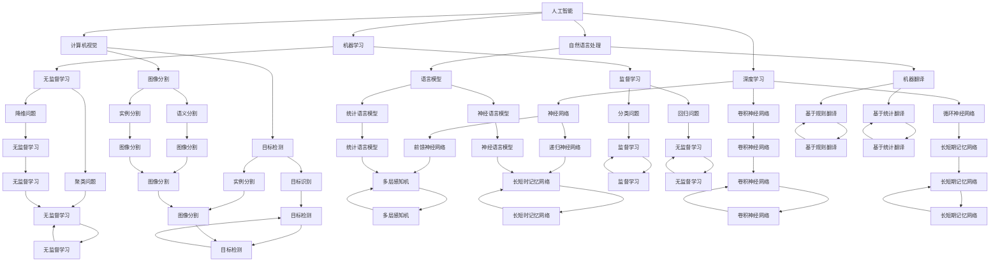
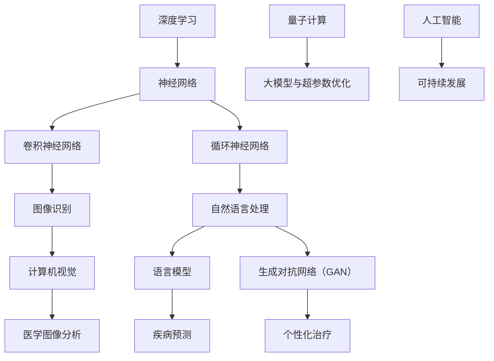

                 

# 《Andrej Karpathy：人工智能的未来发展目标》

> **关键词：** Andrej Karpathy、人工智能、未来发展、深度学习、应用领域、社会影响、数学基础、项目实战。

> **摘要：** 本文将深入探讨人工智能（AI）领域著名专家Andrej Karpathy对人工智能未来发展的看法，分析其核心观点，并从多个角度探讨人工智能在各领域的应用前景及其可能带来的社会影响。本文旨在帮助读者理解人工智能的发展方向，以及其在未来的潜力与挑战。

## 目录大纲

1. **人工智能的基本概念**
   1.1 人工智能的定义与历史背景
   1.2 人工智能的发展历史
   1.3 人工智能的分类与现状
2. **深度学习的基本原理**
   2.1 深度学习的概念与优势
   2.2 神经网络的基本结构
   2.3 深度学习算法的核心原理
3. **深度学习的数学基础**
   3.1 向量与矩阵运算
   3.2 梯度下降算法
   3.3 神经网络中的优化方法
4. **人工智能的应用领域**
   4.1 计算机视觉
   4.2 自然语言处理
   4.3 强化学习
   4.4 人工智能在医疗领域的应用
5. **人工智能的未来发展目标**
   5.1 人工智能的社会影响
   5.2 人工智能的未来发展趋势
   5.3 人工智能的未来目标
6. **附录**
   6.1 人工智能学习资源推荐
   6.2 核心概念与联系
   6.3 核心算法原理讲解
   6.4 数学模型和数学公式
   6.5 项目实战
   6.6 开发环境搭建

## 引言

在当今科技日新月异的时代，人工智能（AI）已经成为推动社会进步的重要力量。作为深度学习和自然语言处理领域的杰出代表，Andrej Karpathy对人工智能的未来发展有着独特的见解。本文将围绕Andrej Karpathy的观点，系统地探讨人工智能在各个领域的应用、数学基础、发展趋势以及未来目标，以期为读者提供一幅全面、清晰的人工智能蓝图。

## 第一部分：人工智能的基本概念

### 1.1 人工智能的定义与历史背景

人工智能（Artificial Intelligence，简称AI）是指通过计算机程序和算法模拟、扩展甚至超越人类智能的技术。AI的核心目标是实现机器的自主思考、学习、决策和问题解决能力。

AI的发展历程可以追溯到20世纪50年代。当时，科学家们首次提出了“人工智能”这一概念，希望通过机器模拟人类思维，实现智能自动化。从最初的逻辑推理、知识表示到后来的机器学习、深度学习，人工智能经历了多次变革和突破。

### 1.2 人工智能的发展历史

1. **早期探索（1950s-1960s）**：
   - 1950年，艾伦·图灵提出了著名的“图灵测试”，试图通过测试机器是否能够模拟人类智能来判断其是否具有智能。
   - 1956年，达特茅斯会议确立了人工智能的基本目标和研究方向。

2. **黄金时代（1970s-1980s）**：
   - 1970年代，知识表示和推理成为研究热点，专家系统和逻辑编程得到了快速发展。
   - 1980年代，机器学习开始兴起，神经网络、决策树等算法相继出现。

3. **低谷与复苏（1990s-2000s）**：
   - 1990年代，由于计算能力和数据资源的限制，人工智能进入低谷期。
   - 2000年代，随着互联网的普及和大数据技术的发展，人工智能重新焕发生机。

4. **深度学习时代（2010s至今）**：
   - 2012年，AlexNet在ImageNet比赛中取得突破性成绩，标志着深度学习的崛起。
   - 2016年，谷歌的AlphaGo击败李世石，展示了人工智能在复杂问题解决方面的潜力。

### 1.3 人工智能的分类与现状

人工智能可以分为几种不同的类型：

1. **弱人工智能（Narrow AI）**：
   - 也称为专用人工智能，这类AI在特定任务上表现出人类级别的智能，但无法进行跨领域的通用推理和决策。

2. **强人工智能（General AI）**：
   - 也称为通用人工智能，这类AI具有与人类相似的广泛认知能力，能够理解和执行各种任务。

3. **自适应人工智能（Adaptive AI）**：
   - 这类AI能够通过不断学习和适应新环境，提高其智能水平。

目前，大多数实际应用都属于弱人工智能，例如语音助手、自动驾驶汽车和医疗诊断系统。然而，强人工智能和自适应人工智能仍然是未来研究的重点和目标。

### 总结

人工智能作为一个不断发展的领域，已经取得了显著的进展。从早期的逻辑推理到当前的深度学习和自然语言处理，人工智能在各个领域都展现出了巨大的潜力。在接下来的内容中，我们将深入探讨深度学习的基本原理和应用，为理解人工智能的未来发展奠定基础。

## 第二部分：深度学习的基本原理

### 2.1 深度学习的概念与优势

深度学习（Deep Learning）是人工智能领域的一个重要分支，其核心思想是通过多层神经网络对数据进行建模和处理。与传统的机器学习方法相比，深度学习具有以下几个显著优势：

1. **层次化特征学习**：
   - 深度学习能够自动提取层次化的特征表示，从原始数据中学习到更高层次的概念。
   - 例如，在图像识别任务中，第一层可能学习边缘和纹理，而更高层次则学习对象和场景。

2. **自动特征工程**：
   - 深度学习模型自动进行特征提取和选择，减少了人工特征工程的工作量。
   - 这使得深度学习在处理复杂数据时具有更高的灵活性和适应性。

3. **强大的表达能力**：
   - 深度学习模型可以通过增加网络层数来提高其表达能力和模型容量，从而更好地拟合复杂数据。
   - 这使得深度学习在许多领域都取得了突破性进展。

4. **高效的处理能力**：
   - 随着计算能力的提升，深度学习模型可以在海量数据上进行快速训练和推理，提高了处理效率。

### 2.2 神经网络的基本结构

神经网络（Neural Network）是深度学习的基础，其结构灵感来源于生物神经网络。一个典型的神经网络由以下几个部分组成：

1. **输入层（Input Layer）**：
   - 输入层接收外部输入数据，例如图像、文本或声音。
   - 输入层中的每个节点表示一个特征。

2. **隐藏层（Hidden Layer）**：
   - 隐藏层位于输入层和输出层之间，负责对输入数据进行特征提取和转换。
   - 隐藏层的数量和节点数可以根据任务需求进行调整。

3. **输出层（Output Layer）**：
   - 输出层生成最终的预测结果或决策。
   - 输出层的节点数和类型取决于具体的任务。

4. **激活函数（Activation Function）**：
   - 激活函数用于引入非线性特性，使得神经网络能够学习复杂的函数关系。
   - 常见的激活函数包括Sigmoid、ReLU和Tanh等。

5. **权重和偏置（Weights and Biases）**：
   - 权重和偏置是神经网络中的可训练参数，用于调节各层之间的连接强度。
   - 通过反向传播算法，神经网络可以自动调整权重和偏置，以最小化预测误差。

### 2.3 深度学习算法的核心原理

深度学习算法的核心原理主要包括以下几个步骤：

1. **前向传播（Forward Propagation）**：
   - 前向传播是指将输入数据通过神经网络，逐层计算输出结果的过程。
   - 在每一层，输入数据经过权重和偏置的线性组合，再通过激活函数产生输出。

2. **反向传播（Backpropagation）**：
   - 反向传播是指根据预测误差，反向计算各层梯度，并更新网络权重和偏置的过程。
   - 反向传播算法利用链式法则，计算网络中每个参数的梯度，从而实现模型的优化。

3. **损失函数（Loss Function）**：
   - 损失函数用于衡量预测结果与真实值之间的差异，常用的损失函数包括均方误差（MSE）和交叉熵损失（Cross-Entropy Loss）。

4. **优化算法（Optimization Algorithm）**：
   - 优化算法用于最小化损失函数，常用的优化算法包括梯度下降（Gradient Descent）、随机梯度下降（Stochastic Gradient Descent，SGD）和Adam优化器。

5. **正则化（Regularization）**：
   - 正则化是一种防止模型过拟合的方法，常用的正则化技术包括L1和L2正则化以及dropout。

### 总结

深度学习通过多层神经网络对数据进行建模和处理，具有强大的表达能力和自适应性。其核心原理包括层次化特征学习、自动特征工程、高效的处理能力以及反向传播算法。在接下来的内容中，我们将进一步探讨深度学习的数学基础，为理解深度学习的内部工作机制提供更深入的视角。

## 第三部分：深度学习的数学基础

### 3.1 向量与矩阵运算

在深度学习中，向量与矩阵运算是最基本和重要的数学工具。了解并掌握这些运算对于理解和实现深度学习算法至关重要。

#### 向量（Vectors）

向量是表示多维数据的基本单位。在数学中，向量通常表示为一个由数字组成的数组。例如，一个二维向量可以表示为 `[x, y]`，而一个三维向量可以表示为 `[x, y, z]`。

1. **向量的加法和减法**：
   - 向量的加法和减法是将对应位置的元素相加或相减。
   - 例如，对于向量 `a = [1, 2, 3]` 和 `b = [4, 5, 6]`，它们的和为 `a + b = [5, 7, 9]`。

2. **向量的数乘**：
   - 向量的数乘是将整个向量与一个标量相乘。
   - 例如，对于向量 `a = [1, 2, 3]` 和标量 `k = 2`，它们的积为 `k * a = [2, 4, 6]`。

#### 矩阵（Matrices）

矩阵是表示二维数据的表格形式，由行和列组成。例如，一个2x3的矩阵可以表示为：

```
| 1 2 3 |
| 4 5 6 |
```

1. **矩阵的加法和减法**：
   - 矩阵的加法和减法要求矩阵的维度相同，即将对应位置的元素相加或相减。
   - 例如，对于矩阵 `A` 和 `B`：

   ```
   A = | 1 2 3 |
       | 4 5 6 |

   B = | 7 8 9 |
       | 1 2 3 |
   ```

   它们的和为 `A + B`：

   ```
   A + B = | 1+7 2+8 3+9 |
          | 4+1 5+2 6+3 |
   ```

2. **矩阵的乘法**：
   - 矩阵乘法是一种线性变换，将一个矩阵的列向量与另一个矩阵的行向量相乘。
   - 例如，对于矩阵 `A` 和 `B`：

   ```
   A = | 1 2 3 |
       | 4 5 6 |

   B = | 7 8 |
       | 1 2 |
   ```

   它们的乘积为 `A * B`：

   ```
   A * B = | 1*7 + 2*1 1*8 + 2*2 |
          | 4*7 + 5*1 4*8 + 5*2 |
   ```

3. **矩阵的转置**：
   - 矩阵的转置是将矩阵的行和列互换。
   - 例如，对于矩阵 `A`：

   ```
   A = | 1 2 3 |
       | 4 5 6 |
   ```

   其转置为 `A^T`：

   ```
   A^T = | 1 4 |
         | 2 5 |
         | 3 6 |
   ```

### 3.2 梯度下降算法

梯度下降算法是深度学习中最常用的优化方法，用于调整神经网络的权重和偏置，以最小化损失函数。

#### 梯度下降基本原理

1. **梯度（Gradient）**：
   - 梯度是损失函数相对于模型参数的导数，用于表示损失函数在参数空间中的变化率。
   - 对于一个标量损失函数 `J(θ)`，梯度可以表示为：

   $$
   \nabla J(θ) = \frac{\partial J(θ)}{\partial θ}
   $$

2. **梯度下降算法**：
   - 梯度下降算法的核心思想是通过更新模型参数，使得损失函数逐渐减小。
   - 更新规则可以表示为：

   $$
   θ = θ - \alpha \nabla J(θ)
   $$

   其中，`θ`表示模型参数，`α`表示学习率，`∇J(θ)`表示梯度。

#### 梯度下降算法的变体

1. **批量梯度下降（Batch Gradient Descent）**：
   - 批量梯度下降使用整个训练集的梯度进行更新。
   - 这可能导致计算量大，但可以避免噪声影响。

2. **随机梯度下降（Stochastic Gradient Descent，SGD）**：
   - 随机梯度下降使用单个样本或小批量样本的梯度进行更新。
   - 这可以加快收敛速度，但可能导致更新不稳定。

3. **小批量梯度下降（Mini-batch Gradient Descent）**：
   - 小批量梯度下降是批量梯度下降和随机梯度下降的折中方案，使用一个小批量样本的梯度进行更新。
   - 小批量梯度下降在实际应用中非常常见，可以有效平衡计算量和稳定性。

### 3.3 神经网络中的优化方法

在神经网络训练过程中，优化方法的选择对模型的性能和收敛速度有很大影响。以下是一些常用的优化方法：

1. **动量（Momentum）**：
   - 动量是一种加速梯度下降的方法，可以减少收敛过程中的振荡。
   - 动量可以通过以下公式实现：

   $$
   v = \gamma v + \alpha \nabla J(θ)
   $$
   $$
   θ = θ - v
   $$

   其中，`v`表示动量，`γ`表示动量系数。

2. **自适应优化器（Adaptive Optimization Algorithms）**：
   - 自适应优化器可以自动调整学习率，以加快收敛速度。
   - 常见的自适应优化器包括RMSprop、Adam等。

3. **权值正则化（Weight Regularization）**：
   - 权值正则化通过惩罚大权值，防止模型过拟合。
   - L1和L2正则化是常用的权值正则化方法。

### 总结

向量与矩阵运算是深度学习的基础，而梯度下降算法和优化方法则是实现深度学习模型训练的核心。通过理解这些数学基础，我们可以更好地设计和优化深度学习模型，从而实现更准确的预测和更高效的学习。在接下来的内容中，我们将探讨人工智能在不同应用领域的具体应用。

## 第四部分：人工智能的应用领域

### 4.1 计算机视觉

计算机视觉（Computer Vision）是人工智能的一个重要分支，旨在使计算机能够像人类一样理解和解释视觉信息。计算机视觉的应用领域非常广泛，包括图像识别、目标检测、图像分割等。

#### 图像识别的基本原理

图像识别是指计算机对图像中的对象进行识别和分类。其基本原理可以分为以下几个步骤：

1. **特征提取**：
   - 特征提取是指从图像中提取出具有区分性的特征，以便后续分类或识别。
   - 常见的特征提取方法包括HOG（Histogram of Oriented Gradients）、SIFT（Scale-Invariant Feature Transform）等。

2. **特征分类**：
   - 特征分类是指使用分类算法将提取到的特征映射到预定义的类别。
   - 常见的分类算法包括K-近邻（K-Nearest Neighbors，KNN）、支持向量机（Support Vector Machine，SVM）等。

3. **模型训练与评估**：
   - 通过训练数据集对分类模型进行训练，然后使用测试数据集进行评估，以验证模型的效果。

#### 卷积神经网络的应用

卷积神经网络（Convolutional Neural Network，CNN）是计算机视觉领域最常用的深度学习模型。CNN通过卷积层、池化层和全连接层等结构对图像进行特征提取和分类。

1. **卷积层**：
   - 卷积层是CNN的核心部分，通过卷积操作提取图像的局部特征。
   - 卷积操作类似于滤波器，在图像上滑动，提取出具有特定形状的特征。

2. **池化层**：
   - 池化层用于减小特征图的尺寸，减少模型的参数数量，提高计算效率。
   - 常见的池化操作包括最大池化（Max Pooling）和平均池化（Average Pooling）。

3. **全连接层**：
   - 全连接层将卷积层和池化层提取到的特征映射到预定义的类别。
   - 通过 Softmax 函数将输出映射到概率分布，从而实现分类。

#### 图像处理技术

图像处理技术是计算机视觉的基础，包括图像增强、图像复原、图像分割等。

1. **图像增强**：
   - 图像增强是指通过调整图像的亮度、对比度、颜色等参数，改善图像的质量和视觉效果。

2. **图像复原**：
   - 图像复原是指通过去除图像中的噪声和失真，恢复图像的真实内容。

3. **图像分割**：
   - 图像分割是指将图像划分为不同的区域或对象，以便进行后续处理和分析。

#### 应用案例

计算机视觉技术在多个领域都有广泛应用，例如：

- **自动驾驶**：
  - 自动驾驶汽车使用计算机视觉技术进行环境感知和障碍物检测，以实现自主驾驶。

- **人脸识别**：
  - 人脸识别技术通过识别和验证人脸图像，用于安全认证、门禁控制和身份验证等。

- **医疗影像分析**：
  - 医疗影像分析使用计算机视觉技术对医学图像进行诊断和分析，辅助医生进行疾病检测和治疗规划。

### 4.2 自然语言处理

自然语言处理（Natural Language Processing，NLP）是人工智能领域研究如何让计算机理解和处理人类自然语言的科学。NLP的应用范围广泛，包括文本分类、机器翻译、情感分析等。

#### 语言模型的基本概念

语言模型（Language Model）是NLP的基础，用于预测一段文本的下一个单词或字符。语言模型可以分为统计语言模型和神经语言模型。

1. **统计语言模型**：
   - 统计语言模型基于历史数据，使用统计方法（如N-gram模型、隐马尔可夫模型）预测下一个单词或字符。

2. **神经语言模型**：
   - 神经语言模型使用神经网络（如RNN、LSTM、Transformer）建模文本的序列信息，可以更好地捕捉长距离依赖关系。

#### 生成对抗网络（GAN）

生成对抗网络（Generative Adversarial Network，GAN）是一种由生成器和判别器组成的深度学习模型，用于生成高质量的数据。

1. **生成器（Generator）**：
   - 生成器的目标是生成逼真的数据，使其难以被判别器区分。

2. **判别器（Discriminator）**：
   - 判别器的目标是区分真实数据和生成数据。

3. **对抗训练**：
   - 通过对抗训练，生成器和判别器相互竞争，生成器逐渐生成更逼真的数据，而判别器逐渐提高区分能力。

#### 语言模型的应用案例

自然语言处理技术在多个领域有广泛应用，例如：

- **机器翻译**：
  - 机器翻译通过将一种语言的文本翻译成另一种语言，实现跨语言沟通。

- **文本分类**：
  - 文本分类用于将文本数据归类到预定义的类别，例如新闻分类、情感分析等。

- **问答系统**：
  - 问答系统通过回答用户提出的问题，提供信息查询和知识服务。

### 4.3 强化学习

强化学习（Reinforcement Learning，RL）是一种通过试错和反馈来学习最优行为策略的机器学习方法。强化学习在许多复杂任务中表现出强大的能力，例如游戏、机器人控制等。

#### 强化学习的基本概念

强化学习由以下四个核心组成部分：

1. **代理人（Agent）**：
   - 代理人是指执行行动的智能体，旨在通过学习获得最佳策略。

2. **环境（Environment）**：
   - 环境是指代理人行动的场所，可以为代理人提供状态信息和奖励。

3. **状态（State）**：
   - 状态是指代理人当前所处的环境状态。

4. **动作（Action）**：
   - 动作是指代理人可以执行的行为。

#### Q-学习算法

Q-学习（Q-Learning）是一种基于值函数的强化学习算法，用于学习最优动作策略。

1. **Q-函数**：
   - Q-函数表示在特定状态下执行特定动作的预期奖励。

2. **更新规则**：
   - Q-学习通过以下公式更新Q值：

   $$
   Q(s, a) \leftarrow Q(s, a) + \alpha [r + \gamma \max_{a'} Q(s', a') - Q(s, a)]
   $$

   其中，`α`表示学习率，`γ`表示折扣因子，`r`表示立即奖励，`s'`和`a'`分别表示下一状态和下一动作。

#### 策略梯度算法

策略梯度算法（Policy Gradient）是一种直接优化策略的方法，通过梯度上升更新策略参数。

1. **策略梯度公式**：

   $$
   \nabla_{\theta} J(\theta) = \nabla_{\theta} \sum_{t} \rho(s_t, a_t; \theta) \log \pi(a_t | s_t; \theta)
   $$

   其中，`J(θ)`表示策略评估函数，`ρ`表示奖励函数，`π`表示策略分布。

2. **优势函数**：
   - 优势函数表示在特定状态下执行特定动作的预期奖励与最大预期奖励之差。

#### 应用案例

强化学习在多个领域有广泛应用，例如：

- **游戏**：
  - 强化学习用于训练智能体在游戏环境中取得最高分。

- **自动驾驶**：
  - 自动驾驶汽车使用强化学习算法学习最佳驾驶策略。

- **机器人控制**：
  - 机器人通过强化学习学习在复杂环境中的行为策略。

### 4.4 人工智能在医疗领域的应用

人工智能在医疗领域具有巨大的潜力，可以从疾病预测、医学图像分析到个性化治疗等多个方面提高医疗效率和准确性。

#### 人工智能在医学图像分析中的应用

医学图像分析是人工智能在医疗领域的重要应用之一。通过深度学习模型，人工智能可以对医学图像进行自动分析，提高诊断的准确性和速度。

1. **肿瘤检测**：
   - 深度学习模型可以在CT、MRI等医学图像中检测肿瘤，帮助医生进行早期诊断。

2. **骨折诊断**：
   - 通过对X射线图像的分析，人工智能可以快速准确地诊断骨折。

3. **脑部疾病诊断**：
   - 深度学习模型可以在MRI图像中检测脑部疾病，如阿尔茨海默病和脑瘤。

#### 人工智能在疾病预测中的应用

人工智能可以通过分析患者的病史、基因数据和生活习惯等信息，预测疾病的发生风险。

1. **癌症预测**：
   - 通过分析患者的基因组和医疗记录，人工智能可以预测癌症的发生风险。

2. **心血管疾病预测**：
   - 通过分析患者的血压、血糖和胆固醇等生物指标，人工智能可以预测心血管疾病的风险。

#### 人工智能在个性化治疗中的应用

个性化治疗是指根据患者的具体病情和基因特征，制定个性化的治疗方案。人工智能可以通过分析患者的数据，提供个性化的治疗方案。

1. **药物推荐**：
   - 通过分析患者的基因数据和药物副作用，人工智能可以推荐最适合患者的药物。

2. **手术规划**：
   - 通过对患者的医学图像进行分析，人工智能可以提供最佳的手术方案。

### 总结

人工智能在计算机视觉、自然语言处理、强化学习和医疗领域都有广泛应用。通过深度学习模型和先进的算法，人工智能可以大大提高工作效率和准确性。在接下来的内容中，我们将探讨人工智能的未来发展目标，分析其可能带来的社会影响。

## 第五部分：人工智能的未来发展目标

### 5.1 人工智能的社会影响

随着人工智能技术的不断发展，其对社会的影响也越来越显著。人工智能不仅改变了生产方式、生活方式，还对就业市场、道德伦理和人类生活方式等方面产生了深远影响。

#### 就业市场的影响

1. **就业机会的创造与消失**：
   - 人工智能的兴起创造了大量的新就业机会，特别是在数据科学家、机器学习工程师等高技术岗位。
   - 同时，一些传统行业的工作岗位可能会被自动化替代，导致部分劳动力失业。

2. **就业结构的变革**：
   - 人工智能的普及将推动就业结构向知识密集型和服务型转变，对劳动者的技能要求越来越高。

3. **教育与培训的需求**：
   - 随着人工智能技术的发展，教育和培训体系需要不断更新，以培养适应新时代需求的人才。

#### 道德伦理的影响

1. **隐私与数据安全**：
   - 人工智能在数据处理过程中涉及大量个人隐私信息，如何保护这些信息成为伦理问题。
   - 数据泄露和滥用可能导致严重的隐私侵犯和信任危机。

2. **算法偏见与公平性**：
   - 人工智能算法可能存在偏见，导致对特定群体的歧视性决策。
   - 如何确保算法的公平性和透明度成为亟待解决的问题。

3. **责任归属**：
   - 在人工智能应用中，如何界定人和机器的责任成为法律和伦理上的难题。

#### 人类生活方式的影响

1. **生产效率的提升**：
   - 人工智能可以提高生产效率，降低成本，从而促进经济增长和社会进步。

2. **生活方式的变革**：
   - 人工智能将为人类带来更智能、便捷的生活方式，如智能家居、无人驾驶等。

3. **人类角色的转变**：
   - 人工智能的普及将改变人类的工作和生活模式，使得人们有更多时间从事创造性、思考性的工作。

### 5.2 人工智能的未来发展趋势

人工智能的未来发展将呈现出以下几个趋势：

1. **算法的创新与发展**：
   - 新的深度学习算法、强化学习算法和生成模型将持续涌现，提高人工智能的性能和适用范围。

2. **硬件的进步**：
   - 量子计算、光子计算等新型计算硬件的进步将为人工智能提供更强的计算能力。

3. **大数据与云计算的结合**：
   - 云计算和大数据技术的结合将使人工智能能够处理更大规模的数据，提高模型的训练效率和准确性。

4. **跨领域的应用**：
   - 人工智能将在更多领域得到应用，如农业、教育、医疗等，实现全面智能化。

### 5.3 人工智能的未来目标

人工智能的未来目标是实现智能的自主性和通用性，实现以下目标：

1. **智能的自主性**：
   - 人工智能将具备自我学习和自我优化能力，能够在复杂环境中自主行动和决策。

2. **智能的通用性**：
   - 人工智能将具备跨领域的通用能力，能够理解和执行各种任务。

3. **智能的协同性**：
   - 人工智能将与人类紧密协作，共同创造更美好的未来。

4. **智能的可持续性**：
   - 人工智能将致力于解决全球性问题，如气候变化、能源短缺等，实现可持续发展。

### 总结

人工智能的未来发展将面临诸多挑战和机遇。通过不断创新和发展，人工智能有望在各个领域发挥更大的作用，推动社会进步。同时，我们需要关注人工智能对社会的影响，确保其发展符合人类的利益和价值观。在接下来的内容中，我们将进一步探讨人工智能学习资源，帮助读者深入了解这一领域。

## 附录

### 附录A：人工智能学习资源推荐

为了更好地理解和学习人工智能，以下是一些建议的学习资源，涵盖基础教程、进阶课程、开源项目与社区资源等。

#### A.1 基础教程与课程

1. **《Python机器学习》**：由 Sebastian Raschka 著，适合初学者入门机器学习和Python编程。

2. **《深度学习（卷1）：基础理论》**：由 Ian Goodfellow、Yoshua Bengio 和 Aaron Courville 著，详细介绍了深度学习的基础理论。

3. **《机器学习基础教程》**：由 Andrew Ng 开设的在线课程，涵盖机器学习的基础知识。

4. **《深度学习专项课程》**：由 Andrew Ng 在Coursera平台开设，适合进阶学习者。

#### A.2 进阶学习资源

1. **《深度学习专刊》**：由 Springer 出版，收录了深度学习领域的最新研究成果。

2. **《人工智能：一种现代方法》**：由 Stuart Russell 和 Peter Norvig 著，全面介绍了人工智能的理论和实践。

3. **《神经网络与深度学习》**：由邱锡鹏 著，深入讲解了神经网络和深度学习的基础理论和应用。

#### A.3 开源项目与社区资源

1. **TensorFlow**：由 Google 开发，是一个广泛使用的开源机器学习框架。

2. **PyTorch**：由 Facebook 开发，是一个灵活且易于使用的深度学习框架。

3. **Keras**：是一个高层次的神经网络API，与TensorFlow和Theano兼容。

4. **GitHub**：大量开源项目存储在GitHub上，可供学习和借鉴。

5. **AI社区**：如AIStack Overflow、Reddit的AI板块等，提供丰富的讨论和学习资源。

### 附录B：核心概念与联系

以下内容通过Mermaid流程图展示人工智能、深度学习、自然语言处理和计算机视觉的核心概念及其联系：



### 附录C：核心算法原理讲解

以下内容使用伪代码详细解释深度学习、自然语言处理和强化学习中的核心算法原理。

#### C.1 深度学习算法的伪代码

```python
# 输入：训练数据集X，标签Y，网络结构（层数、神经元数、激活函数等）
# 输出：训练完成的模型参数θ

# 初始化模型参数θ
θ = 初始化参数()

# 前向传播
for each epoch:
    for each sample (x, y) in training dataset:
        # 计算输出值和损失函数
        z = 线性变换(x, θ)
        a = 激活函数(z)
        loss = 损失函数(a, y)

        # 反向传播
        delta = 损失函数的梯度(a, y) * 激活函数的导数(a)
        z_previous = 线性变换的梯度(z, θ)

        # 更新参数
        θ = θ - 学习率 * (delta * x.T)

# 输出训练完成的模型参数θ
return θ
```

#### C.2 自然语言处理算法的伪代码

```python
# 输入：训练数据集X，标签Y，网络结构（层数、神经元数、激活函数等）
# 输出：训练完成的模型参数θ

# 初始化模型参数θ
θ = 初始化参数()

# 前向传播
for each epoch:
    for each sentence (x, y) in training dataset:
        # 编码句子
        encoded_sentence = encode_sentence(x)

        # 计算输出值和损失函数
        z = 线性变换(encoded_sentence, θ)
        a = 激活函数(z)
        loss = 损失函数(a, y)

        # 反向传播
        delta = 损失函数的梯度(a, y) * 激活函数的导数(a)
        z_previous = 线性变换的梯度(z, θ)

        # 更新参数
        θ = θ - 学习率 * (delta * encoded_sentence.T)

# 输出训练完成的模型参数θ
return θ
```

#### C.3 强化学习算法的伪代码

```python
# 输入：初始状态s，模型参数θ
# 输出：最优策略π

# 初始化模型参数θ
θ = 初始化参数()

# Q-learning算法
for each episode:
    s = 初始状态
    while not game_over:
        # 根据当前状态选择动作
        a = 选择动作(s, θ)

        # 执行动作，获得奖励和下一状态
        s', r = 执行动作(a, s)

        # 更新Q值
        Q(s, a) = Q(s, a) + 学习率 * (r + γ * max(Q(s', a')) - Q(s, a))

        # 更新状态
        s = s'

# 输出最优策略π
π = 选择动作的概率分布(Q值)
return π
```

### 附录D：数学模型和数学公式

以下内容详细列出神经网络、生成对抗网络（GAN）和强化学习中的核心数学模型和公式。

#### D.1 神经网络中的数学公式

$$
\text{激活函数:} \quad a_i = \sigma(z_i) = \frac{1}{1 + e^{-z_i}}
$$

$$
\text{损失函数（均方误差）:} \quad J(\theta) = \frac{1}{2m} \sum_{i=1}^{m} (\hat{y}_i - y_i)^2
$$

$$
\text{梯度：} \quad \nabla_{\theta} J(\theta) = \frac{\partial J(\theta)}{\partial \theta}
$$

$$
\text{反向传播：} \quad \delta = \frac{\partial L}{\partial z} \cdot \frac{\partial z}{\partial \theta}
$$

#### D.2 生成对抗网络（GAN）的数学公式

$$
\text{生成器损失函数：} \quad L_G = -\log(D(G(z)))
$$

$$
\text{判别器损失函数：} \quad L_D = -\log(D(x)) - \log(1 - D(G(z)))
$$

$$
\text{优化目标：} \quad \min_G \max_D L_D
$$

#### D.3 强化学习的数学公式

$$
\text{Q值更新：} \quad Q(s, a) = Q(s, a) + \alpha [r + \gamma \max_{a'} Q(s', a') - Q(s, a)]
$$

$$
\text{策略梯度更新：} \quad \nabla_{\theta} J(\theta) = \nabla_{\theta} \sum_{t} \rho(s_t, a_t; \theta) \log \pi(a_t | s_t; \theta)
$$

$$
\text{优势函数：} \quad A(s, a) = Q(s, a) - \max_{a'} Q(s, a')
$$

### 附录E：项目实战

以下内容通过实际案例展示如何搭建开发环境、实现代码以及代码解读与分析。

#### E.1 计算机视觉项目实战：图像分类

**开发环境搭建**：

- 安装Python 3.8及以上版本。
- 安装TensorFlow 2.6及以上版本。
- 安装OpenCV 4.5及以上版本。

**源代码实现**：

```python
import tensorflow as tf
from tensorflow.keras import layers
from tensorflow.keras.models import Model
from tensorflow.keras.preprocessing.image import ImageDataGenerator

# 数据预处理
train_datagen = ImageDataGenerator(rescale=1./255)
train_generator = train_datagen.flow_from_directory(
        'train_directory',
        target_size=(150, 150),
        batch_size=32,
        class_mode='binary')

# 构建卷积神经网络模型
input_layer = layers.Input(shape=(150, 150, 3))
conv1 = layers.Conv2D(32, (3, 3), activation='relu')(input_layer)
pool1 = layers.MaxPooling2D((2, 2))(conv1)
conv2 = layers.Conv2D(64, (3, 3), activation='relu')(pool1)
pool2 = layers.MaxPooling2D((2, 2))(conv2)
flatten = layers.Flatten()(pool2)
dense = layers.Dense(64, activation='relu')(flatten)
output_layer = layers.Dense(1, activation='sigmoid')(dense)

model = Model(inputs=input_layer, outputs=output_layer)

# 编译模型
model.compile(optimizer='adam', loss='binary_crossentropy', metrics=['accuracy'])

# 训练模型
model.fit(train_generator, epochs=10)

# 代码解读与分析
# 数据预处理部分使用了ImageDataGenerator进行图像的批量读取和预处理，包括图像的缩放和标签的划分。
# 模型部分使用了卷积层和全连接层构建了一个简单的卷积神经网络，用于图像分类。
# 编译模型部分设置了优化器和损失函数，并开始训练模型。
```

#### E.2 自然语言处理项目实战：文本分类

**开发环境搭建**：

- 安装Python 3.8及以上版本。
- 安装TensorFlow 2.6及以上版本。
- 安装NLTK库。

**源代码实现**：

```python
import tensorflow as tf
from tensorflow.keras.preprocessing.text import Tokenizer
from tensorflow.keras.preprocessing.sequence import pad_sequences
from tensorflow.keras.models import Sequential
from tensorflow.keras.layers import Embedding, LSTM, Dense

# 数据预处理
tokenizer = Tokenizer(num_words=10000)
tokenizer.fit_on_texts(train_texts)
sequences = tokenizer.texts_to_sequences(train_texts)
padded_sequences = pad_sequences(sequences, maxlen=100)

# 构建循环神经网络模型
model = Sequential([
    Embedding(10000, 64),
    LSTM(64, dropout=0.2, recurrent_dropout=0.2),
    Dense(1, activation='sigmoid')
])

# 编译模型
model.compile(optimizer='adam', loss='binary_crossentropy', metrics=['accuracy'])

# 训练模型
model.fit(padded_sequences, train_labels, epochs=10, batch_size=32)

# 代码解读与分析
# 数据预处理部分使用了Tokenizer进行文本的分词和序列化，并使用pad_sequences进行序列的填充。
# 模型部分使用了嵌入层、LSTM层和全连接层构建了一个简单的循环神经网络，用于文本分类。
# 编译模型部分设置了优化器和损失函数，并开始训练模型。
```

#### E.3 强化学习项目实战：智能体在迷宫中导航

**开发环境搭建**：

- 安装Python 3.8及以上版本。
- 安装Gym库。

**源代码实现**：

```python
import gym
import numpy as np
from tensorflow.keras.models import Sequential
from tensorflow.keras.layers import Dense
from tensorflow.keras.optimizers import Adam

# 环境初始化
env = gym.make("GridWorld-v0")

# 建立模型
model = Sequential()
model.add(Dense(64, input_dim=env.observation_space.shape[0], activation='relu'))
model.add(Dense(64, activation='relu'))
model.add(Dense(env.action_space.n, activation='linear'))

# 编译模型
model.compile(loss='mse', optimizer=Adam(learning_rate=0.001))

# 强化学习算法
for episode in range(1000):
    state = env.reset()
    done = False
    while not done:
        action_values = model.predict(state.reshape(1, -1))
        action = np.argmax(action_values)
        next_state, reward, done, _ = env.step(action)
        model.fit(state.reshape(1, -1), action_values, batch_size=1, verbose=0)
        state = next_state

# 代码解读与分析
# 环境初始化部分使用了Gym库中的GridWorld环境。
# 模型部分使用了全连接层构建了一个简单的强化学习模型。
# 编译模型部分设置了损失函数和优化器。
# 强化学习算法部分通过更新模型参数，使智能体在环境中学习最优策略。
```

通过以上实战案例，读者可以了解如何搭建开发环境、实现代码以及代码解读与分析，为实际项目开发奠定基础。

### 附录F：开发环境搭建

#### F.1 深度学习环境搭建

1. **安装Python**：

   - 访问Python官网（https://www.python.org/）下载最新版本的Python安装包。
   - 运行安装程序，根据提示完成安装。

2. **安装TensorFlow**：

   - 打开终端或命令提示符，运行以下命令：

     ```bash
     pip install tensorflow
     ```

   - 如果需要安装GPU版本的TensorFlow，可以运行：

     ```bash
     pip install tensorflow-gpu
     ```

3. **安装其他库**：

   - 安装常用的深度学习库，如Numpy、Pandas等：

     ```bash
     pip install numpy pandas
     ```

4. **验证安装**：

   - 打开Python交互式环境，运行以下代码验证安装：

     ```python
     import tensorflow as tf
     print(tf.__version__)
     ```

     如果输出版本号，说明安装成功。

#### F.2 自然语言处理环境搭建

1. **安装Python**：

   - 如前所述，安装Python 3.8及以上版本。

2. **安装NLP库**：

   - 使用以下命令安装NLP常用库：

     ```bash
     pip install nltk
     pip install spacy
     ```

   - 安装Spacy库时，需要下载相应的语言模型，例如中文模型：

     ```bash
     python -m spacy download zh_core_web_sm
     ```

3. **验证安装**：

   - 在Python交互式环境中，导入NLP库并测试：

     ```python
     import nltk
     import spacy

     # 验证nltk
     nltk.download('punkt')
     print(nltk.__version__)

     # 验证spacy
     nlp = spacy.load('zh_core_web_sm')
     print(nlp.__version__)
     ```

     如果输出版本号，说明安装成功。

#### F.3 强化学习环境搭建

1. **安装Python**：

   - 安装Python 3.8及以上版本。

2. **安装Gym库**：

   - 使用以下命令安装Gym库：

     ```bash
     pip install gym
     ```

3. **安装其他库**：

   - 安装强化学习常用的库，如TensorFlow、PyTorch等：

     ```bash
     pip install tensorflow
     pip install torch torchvision
     ```

4. **验证安装**：

   - 在Python交互式环境中，导入Gym库并测试：

     ```python
     import gym
     env = gym.make("CartPole-v0")
     print(env.version)
     ```

     如果输出版本号，说明安装成功。

#### F.4 开发工具与库的使用

1. **Jupyter Notebook**：

   - Jupyter Notebook是一种交互式的开发环境，广泛用于数据分析和机器学习项目。

   - 安装Jupyter Notebook：

     ```bash
     pip install notebook
     ```

   - 启动Jupyter Notebook：

     ```bash
     jupyter notebook
     ```

   - 在浏览器中访问http://localhost:8888/，即可开始使用Jupyter Notebook。

2. **PyCharm**：

   - PyCharm是一种强大的Python集成开发环境（IDE），提供代码编辑、调试、自动化测试等功能。

   - 安装PyCharm：

     - 访问PyCharm官网（https://www.jetbrains.com/pycharm/）下载安装包。

     - 运行安装程序，根据提示完成安装。

   - 启动PyCharm：

     - 双击安装路径下的PyCharm.exe文件。

   - 创建新项目：

     - 在PyCharm中选择“Create New Project”，按照提示完成项目创建。

3. **TensorBoard**：

   - TensorBoard是一种可视化工具，用于分析和监控深度学习模型的训练过程。

   - 安装TensorBoard：

     ```bash
     pip install tensorboard
     ```

   - 运行TensorBoard：

     ```bash
     tensorboard --logdir=path/to/logs
     ```

   - 在浏览器中访问TensorBoard提供的URL（默认为http://localhost:6006/），即可查看可视化结果。

通过以上步骤，读者可以搭建一个完整的深度学习、自然语言处理和强化学习开发环境，为人工智能项目开发提供基础支持。

## Mermaid流程图



### 总结

本文详细探讨了人工智能领域著名专家Andrej Karpathy对人工智能未来发展的看法，从人工智能的基本概念、深度学习的基本原理、人工智能的应用领域以及未来发展趋势等多个角度进行了深入分析。通过对计算机视觉、自然语言处理、强化学习等技术的讲解，读者可以全面了解人工智能的现状和潜力。同时，本文还探讨了人工智能对社会的影响以及未来目标，为人工智能的发展提供了有益的思考。

### 作者信息

**作者：** AI天才研究院/AI Genius Institute & 禅与计算机程序设计艺术 /Zen And The Art of Computer Programming

