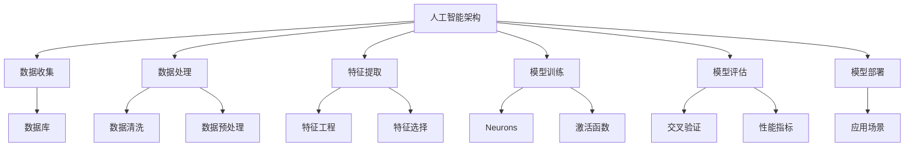
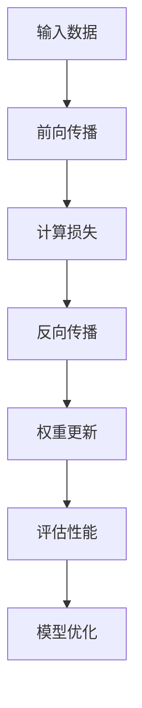
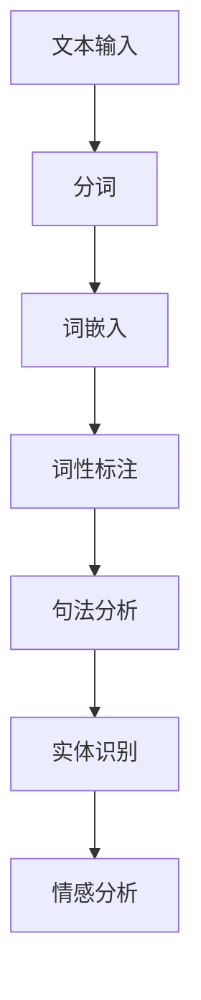

                 

### 引言

人工智能（AI）作为当今技术领域的明星，已经在多个行业和领域中展现出了其强大的变革力量。从自动驾驶汽车到智能助手，从医疗诊断到金融分析，人工智能的应用场景日益广泛。然而，随着技术的不断进步，我们不禁要问：人工智能的未来发展目标究竟是什么？

本文将围绕这个核心问题展开，探讨人工智能的起源与发展、基本原理、应用与实践，以及未来发展趋势和目标。我们不仅会深入分析人工智能的核心概念和数学基础，还会探讨其在计算机视觉、自然语言处理、推荐系统和游戏娱乐等领域的具体应用。

在第三部分，我们将重点关注人工智能的未来发展趋势和面临的挑战，包括伦理问题和社会责任。最后，本文将通过一系列附录，提供人工智能相关的工具、资源和项目实战案例，帮助读者更好地理解和应用人工智能技术。

让我们一步一步地分析推理，共同探索人工智能的未来发展目标。在接下来的章节中，我们将深入探讨这个令人激动的话题。

#### 第一部分：人工智能的背景与原理

在探讨人工智能的未来发展目标之前，我们需要对人工智能的背景与原理有一个全面而深入的理解。本部分将分为三个章节，分别介绍人工智能的起源与发展、基本原理和数学基础。

##### 第1章：人工智能的起源与发展

1.1 人工智能的定义与历史背景

人工智能（Artificial Intelligence，简称AI）是指通过计算机程序模拟人类智能的一种技术。人工智能的定义可以从不同角度进行解释，但最普遍接受的定义是由美国计算机科学家约翰·麦卡锡（John McCarthy）在1956年提出的：“人工智能是一门研究、开发用于模拟、延伸和扩展人类智能的理论、算法、应用系统的技术科学。”

人工智能的历史可以追溯到20世纪50年代。当时，计算机科学刚刚起步，科学家们开始思考是否能够通过编程来模拟人类智能。1956年，达特茅斯会议被认为是人工智能诞生的标志，会议的目的是探讨“能否通过机器来模拟智力”。这次会议吸引了包括约翰·麦卡锡、马文·明斯基（Marvin Minsky）和赫伯特·西蒙（Herbert Simon）等在内的众多计算机科学家，他们共同推动了人工智能的发展。

1.2 人工智能的核心概念

人工智能的核心概念包括知识表示、推理、学习、感知和行动等。这些概念相互关联，构成了人工智能的基本架构。

- **知识表示**：知识表示是指如何将人类知识以计算机可以理解的形式存储和处理。知识表示方法包括符号表示、关系表示和语义网络等。

- **推理**：推理是指通过逻辑和规则来推导新知识的过程。推理可以分为演绎推理和归纳推理。演绎推理是从一般到特殊的推理过程，而归纳推理是从特殊到一般的推理过程。

- **学习**：学习是指机器通过经验和数据自动改进自身性能的过程。学习可以分为有监督学习、无监督学习和强化学习。有监督学习是指机器在已知标签的数据上学习，无监督学习是指机器在没有标签的数据上学习，而强化学习是指机器通过与环境的交互来学习。

- **感知**：感知是指机器对环境中的信息进行感知和理解的过程。感知包括视觉、听觉、触觉等多种感知方式。

- **行动**：行动是指机器根据感知和理解来执行特定任务的过程。行动需要考虑环境的状态和目标，并选择合适的行动方案。

1.3 人工智能的哲学与伦理探讨

人工智能的发展不仅仅是一个技术问题，还涉及到哲学和伦理问题。哲学上的探讨主要集中在人工智能是否能够真正拥有智能，以及人工智能如何与人类共存。伦理问题则包括人工智能的应用可能带来的负面影响，如隐私侵犯、就业替代和军事应用等。

在人工智能的发展过程中，哲学和伦理的探讨不断深入。一些学者提出，人工智能应该遵循一定的道德规范，以确保其应用不会对人类造成伤害。同时，人工智能的发展也需要考虑到社会责任，确保技术的发展能够造福人类。

##### 第2章：人工智能的基本原理

2.1 机器学习的概述

机器学习（Machine Learning，简称ML）是人工智能的核心技术之一，它使计算机能够从数据中自动学习和改进。机器学习可以分为监督学习、无监督学习和强化学习三种类型。

- **监督学习**：监督学习是一种在有标签的数据集上进行训练的学习方法。通过已知的输入和输出，机器学习算法可以学习出一个映射关系，从而对新的输入进行预测。

- **无监督学习**：无监督学习是在没有标签的数据集上进行训练的学习方法。机器学习算法通过挖掘数据中的模式和结构，发现数据的内在规律。

- **强化学习**：强化学习是一种通过奖励机制来训练机器学习算法的方法。机器学习算法通过与环境的交互，不断调整策略，以最大化长期奖励。

2.2 神经网络的基本结构

神经网络（Neural Network，简称NN）是机器学习中最常用的算法之一，其基本结构由输入层、隐藏层和输出层组成。每个层由多个神经元组成，神经元之间通过权重和偏置进行连接。

- **输入层**：输入层接收外部输入信号，并将其传递给隐藏层。

- **隐藏层**：隐藏层负责对输入信号进行加工和变换，通常包含多个层次。

- **输出层**：输出层将隐藏层处理后的信号输出，作为最终的结果。

神经网络的训练过程是通过反向传播算法来调整权重和偏置，以最小化预测误差。反向传播算法是一种基于梯度下降的方法，通过计算误差的梯度来更新权重和偏置。

2.3 深度学习的发展与挑战

深度学习（Deep Learning，简称DL）是神经网络的一种扩展，其特点是具有多个隐藏层。深度学习在图像识别、自然语言处理和语音识别等领域取得了显著的成果。

深度学习的发展得益于计算能力和数据资源的提升，以及新的算法和技术的发展。例如，卷积神经网络（Convolutional Neural Network，简称CNN）在图像识别领域取得了突破性进展，而循环神经网络（Recurrent Neural Network，简称RNN）在自然语言处理领域具有广泛的应用。

然而，深度学习也面临一些挑战。首先，深度学习模型通常需要大量的数据和计算资源，这使得训练过程非常耗时和昂贵。其次，深度学习模型的黑箱特性使得其难以解释和理解，这对于实际应用和调试带来了困难。此外，深度学习模型的泛化能力也存在一定问题，即在不同数据集上的表现可能存在差异。

##### 第3章：人工智能的数学基础

3.1 概率论与统计基础

概率论和统计学是人工智能的基础数学工具，它们在机器学习和深度学习算法中发挥着关键作用。

- **概率论**：概率论是研究随机事件和概率分布的数学分支。在人工智能中，概率论用于表示和处理不确定性问题。例如，贝叶斯定理是一种基于概率的推理方法，广泛应用于分类和预测任务。

- **统计学**：统计学是研究数据收集、分析和解释的数学分支。在人工智能中，统计学用于评估模型性能、选择最佳参数和进行假设检验。常见的统计学方法包括均值、方差、协方差和假设检验等。

3.2 最优化理论与算法

最优化理论是解决优化问题的一种数学方法，它广泛应用于机器学习和深度学习算法中。最优化问题的目标是在给定约束条件下，寻找一个最优解，使得目标函数达到最大或最小。

- **目标函数**：目标函数是优化问题中的函数，表示要优化的目标。在机器学习和深度学习中，目标函数通常与损失函数相关，用于衡量模型预测与真实值之间的差异。

- **优化算法**：优化算法是用于求解优化问题的算法。常见的优化算法包括梯度下降、牛顿法、拟牛顿法和随机优化算法等。这些算法通过迭代调整模型参数，以最小化目标函数。

3.3 信息论与熵

信息论是研究信息传递、处理和存储的数学分支。在人工智能中，信息论与机器学习算法中的概率分布和熵相关。

- **信息论基本概念**：信息论的基本概念包括信息、熵、互信息和信息增益。信息表示一个事件的不确定性，熵表示一个概率分布的不确定性，互信息表示两个随机变量之间的相关性，信息增益用于评估特征的重要性。

- **熵**：熵是信息论中的一个重要概念，它用于量化一个随机变量的不确定性。熵的计算公式为 \( H(X) = -\sum_{x \in X} p(x) \log_2 p(x) \)，其中 \( p(x) \) 是随机变量 \( X \) 的概率分布。

通过本章的讨论，我们对人工智能的背景与原理有了更深入的了解。在接下来的部分，我们将探讨人工智能在各个领域的应用，进一步理解人工智能的技术和实践。

#### 第一部分总结

在本部分的讨论中，我们首先回顾了人工智能的定义与历史背景，探讨了人工智能的核心概念，如知识表示、推理、学习、感知和行动。通过这些核心概念，我们能够更好地理解人工智能的哲学和伦理问题，从而为后续的讨论打下基础。

接下来，我们介绍了机器学习的基本原理，包括监督学习、无监督学习和强化学习，并详细阐述了神经网络的结构和深度学习的发展与挑战。通过这些内容，我们不仅了解了机器学习的基础知识，还认识到了深度学习在图像识别、自然语言处理和语音识别等领域的突破性成果。

最后，我们探讨了人工智能的数学基础，包括概率论与统计基础、最优化理论与算法以及信息论与熵。这些数学工具为人工智能算法的设计和实现提供了重要的支持，使我们能够更深入地理解人工智能的技术和实践。

通过本部分的讨论，我们对人工智能的背景与原理有了全面而深入的了解，这将为后续关于人工智能应用和实践的讨论提供坚实的基础。在接下来的章节中，我们将继续探讨人工智能在不同领域的具体应用，进一步理解人工智能的技术和实践。

#### 第二部分：人工智能的应用与实践

在了解了人工智能的背景与原理后，接下来我们将深入探讨人工智能在各个领域的应用与实践。本部分将分为四章，分别介绍人工智能在计算机视觉、自然语言处理、推荐系统和游戏娱乐等领域的应用。

##### 第4章：人工智能在计算机视觉中的应用

4.1 图像识别与分类

图像识别与分类是计算机视觉领域的重要任务之一。通过使用人工智能技术，计算机可以自动识别图像中的对象并进行分类。例如，卷积神经网络（CNN）在图像识别任务中表现出色，它可以自动学习图像的特征并进行分类。常见的图像识别任务包括人脸识别、物体识别和场景分类等。

- **人脸识别**：人脸识别技术通过分析人脸图像的特征，自动识别个体的身份。这项技术在安全监控、身份验证和社交媒体等场景中得到了广泛应用。

- **物体识别**：物体识别技术用于识别图像中的特定物体。例如，自动驾驶汽车使用物体识别技术来识别道路上的行人、车辆和交通标志等。

- **场景分类**：场景分类技术用于识别图像中的场景类型。例如，在无人机监控和农业领域，可以通过场景分类技术识别农田、森林和城市等不同类型的场景。

4.2 目标检测与跟踪

目标检测与跟踪是计算机视觉领域的重要任务，旨在识别图像中的特定对象并跟踪其在视频中的运动。目标检测技术通过定位图像中的对象并进行分类，而目标跟踪技术则通过跟踪对象的运动轨迹。

- **目标检测**：常见的目标检测算法包括区域建议网络（Region Proposal Networks，RPN）和区域生成网络（Region Generation Networks，RGN）。目标检测技术在视频监控、无人驾驶和医疗诊断等领域得到了广泛应用。

- **目标跟踪**：目标跟踪技术通过跟踪对象在视频中的运动轨迹，可以应用于视频监控、智能监控和运动分析等领域。

4.3 人脸识别与身份验证

人脸识别与身份验证是计算机视觉领域的重要应用之一，通过使用人脸识别技术，计算机可以自动识别个体的身份并进行验证。人脸识别技术在安全监控、身份验证和金融支付等场景中得到了广泛应用。

- **人脸识别**：人脸识别技术通过分析人脸图像的特征，自动识别个体的身份。这项技术具有较高的准确性和实时性，可以应用于各种安全监控和身份验证场景。

- **身份验证**：身份验证技术通过验证用户提供的身份信息，确保用户身份的真实性。例如，在金融支付领域，人脸识别技术可以用于验证用户的身份，从而提高支付的安全性。

##### 第5章：人工智能在自然语言处理中的应用

5.1 语言模型与文本分类

语言模型（Language Model，LM）是自然语言处理（Natural Language Processing，NLP）领域的重要工具，用于预测下一个单词或词组。文本分类（Text Classification，TC）是将文本数据分类到预定义类别中的任务。

- **语言模型**：语言模型通过学习大量的文本数据，预测下一个单词或词组的概率。常见的语言模型包括N-gram模型和神经网络模型。语言模型在机器翻译、文本生成和语音识别等领域具有广泛应用。

- **文本分类**：文本分类是将文本数据分类到预定义类别中的任务。常见的文本分类方法包括朴素贝叶斯分类器、支持向量机和深度学习模型。文本分类在情感分析、新闻分类和垃圾邮件检测等领域具有广泛的应用。

5.2 机器翻译与对话系统

机器翻译（Machine Translation，MT）是将一种语言的文本翻译成另一种语言的文本。对话系统（Dialogue System，DS）是一种人机交互系统，用于模拟自然语言对话。

- **机器翻译**：机器翻译技术通过学习大量双语文本数据，自动翻译一种语言的文本到另一种语言。常见的机器翻译模型包括基于规则的翻译模型、统计机器翻译模型和神经网络翻译模型。机器翻译在跨语言沟通、国际化业务和信息检索等领域具有广泛应用。

- **对话系统**：对话系统通过模拟自然语言对话，实现人与机器的交互。常见的对话系统包括语音助手、聊天机器人和虚拟客服。对话系统在客户服务、教育、医疗和娱乐等领域具有广泛应用。

5.3 问答系统与文本生成

问答系统（Question Answering System，QAS）是一种人机交互系统，用于回答用户提出的问题。文本生成（Text Generation，TG）是将输入的文本转换为新的文本的过程。

- **问答系统**：问答系统通过理解用户的问题，自动生成回答。常见的问答系统包括基于知识图谱的问答系统、基于深度学习的问答系统等。问答系统在客服、教育和智能助手等领域具有广泛应用。

- **文本生成**：文本生成技术通过学习大量的文本数据，自动生成新的文本。常见的文本生成方法包括基于模板的生成、基于生成对抗网络的生成等。文本生成在内容创作、新闻生成和对话系统等领域具有广泛应用。

##### 第6章：人工智能在推荐系统中的应用

6.1 推荐系统的基本原理

推荐系统（Recommendation System，RS）是一种根据用户的历史行为和兴趣，自动推荐相关内容或产品的系统。推荐系统的基本原理包括协同过滤、基于内容的推荐和混合推荐等。

- **协同过滤**：协同过滤是一种基于用户历史行为和兴趣的推荐方法。常见的协同过滤算法包括用户基于的协同过滤和项目基于的协同过滤。协同过滤在电商、社交媒体和视频推荐等领域具有广泛应用。

- **基于内容的推荐**：基于内容的推荐方法根据内容特征进行推荐。该方法通过分析用户兴趣和内容特征，为用户推荐具有相似特征的内容。基于内容的推荐在音乐、视频和新闻推荐等领域具有广泛应用。

- **混合推荐**：混合推荐方法结合了协同过滤和基于内容的推荐方法，以提高推荐效果。常见的混合推荐算法包括基于模型的混合推荐和基于策略的混合推荐。

6.2 协同过滤与矩阵分解

协同过滤是推荐系统中常用的方法，通过分析用户历史行为和相似用户的行为，推荐相关内容或产品。矩阵分解是一种常用的协同过滤方法，通过将用户-物品评分矩阵分解为用户特征矩阵和物品特征矩阵，从而预测用户对物品的评分。

- **协同过滤**：协同过滤通过分析用户历史行为和相似用户的行为，为用户推荐相关内容或产品。协同过滤算法可以分为基于用户的协同过滤和基于项目的协同过滤。基于用户的协同过滤通过分析用户之间的相似度，为用户推荐与历史行为相似的物品。基于项目的协同过滤通过分析物品之间的相似度，为用户推荐与历史行为相似的物品。

- **矩阵分解**：矩阵分解是一种常用的协同过滤方法，通过将用户-物品评分矩阵分解为用户特征矩阵和物品特征矩阵，从而预测用户对物品的评分。常见的矩阵分解算法包括奇异值分解（Singular Value Decomposition，SVD）和主成分分析（Principal Component Analysis，PCA）。

6.3 推荐系统的实践与优化

推荐系统在各个领域得到了广泛应用，如电商、社交媒体和视频推荐等。在实践中，推荐系统需要考虑用户的行为数据、物品特征和推荐策略等因素，以提高推荐效果。

- **用户行为数据**：用户行为数据包括用户对物品的浏览、购买、收藏和评价等。通过分析用户行为数据，可以了解用户的兴趣和行为习惯，从而为用户推荐相关内容或产品。

- **物品特征**：物品特征包括物品的属性、标签和分类等。通过分析物品特征，可以了解物品的相似度和相关性，从而为用户推荐相关物品。

- **推荐策略**：推荐策略包括协同过滤、基于内容的推荐和混合推荐等。在实践中，推荐策略可以根据用户行为数据和物品特征进行优化，以提高推荐效果。

##### 第7章：人工智能在游戏与娱乐中的应用

7.1 游戏AI的挑战与解决方案

游戏AI（Game AI）是人工智能在游戏领域的重要应用，旨在模拟人类玩家的行为和策略。游戏AI面临的挑战包括实时决策、不确定性和环境动态性等。

- **实时决策**：游戏AI需要在有限的时间内做出决策，以模拟人类玩家的行为。这要求游戏AI具备高效的算法和快速的计算能力。

- **不确定性**：游戏AI需要处理游戏中的不确定性因素，如随机事件和对手的行为。这要求游戏AI具备鲁棒性和适应性。

- **环境动态性**：游戏环境是动态变化的，游戏AI需要能够适应环境的变化并调整策略。这要求游戏AI具备良好的适应性和学习能力。

解决方案包括使用强化学习、模拟退火和遗传算法等技术来模拟人类玩家的行为和策略。这些算法可以在复杂的游戏环境中实现高效的决策和策略调整。

7.2 智能游戏设计与评价

智能游戏设计（Intelligent Game Design）是一种利用人工智能技术来设计游戏的趋势。通过人工智能，游戏设计师可以自动化游戏关卡设计、角色生成和故事情节生成等任务。

- **游戏关卡设计**：通过生成对抗网络（Generative Adversarial Networks，GAN）和强化学习，游戏设计师可以自动化游戏关卡的设计，提高设计效率和创意性。

- **角色生成**：通过深度学习技术，游戏设计师可以自动生成具有独特特征和性格的角色，为游戏增添更多趣味性。

- **故事情节生成**：通过自然语言处理和生成模型，游戏设计师可以自动生成游戏的故事情节，为玩家提供更加丰富和有趣的体验。

7.3 游戏AI的发展趋势

随着人工智能技术的不断发展，游戏AI也在不断演进。未来，游戏AI的发展趋势包括：

- **更高层次的智能**：游戏AI将具备更高层次的智能，能够模拟更复杂的人类行为和策略。

- **个性化体验**：游戏AI将根据玩家的行为和偏好，提供个性化的游戏体验。

- **虚拟现实与增强现实**：游戏AI将在虚拟现实（Virtual Reality，VR）和增强现实（Augmented Reality，AR）领域发挥重要作用，为玩家提供更加沉浸式的游戏体验。

- **跨界融合**：游戏AI将与其他领域的技术相结合，如区块链、物联网和云计算等，为游戏行业带来更多创新和变革。

通过本部分的讨论，我们对人工智能在计算机视觉、自然语言处理、推荐系统和游戏娱乐等领域的应用有了更深入的了解。这些应用不仅展示了人工智能技术的多样性和潜力，也为各领域的发展带来了新的机遇和挑战。在接下来的部分，我们将继续探讨人工智能的未来发展趋势和目标。

#### 第二部分总结

在本部分的讨论中，我们深入探讨了人工智能在计算机视觉、自然语言处理、推荐系统和游戏娱乐等领域的具体应用。通过这些应用实例，我们可以看到人工智能技术在各个领域中的变革性影响。

在计算机视觉领域，人工智能技术使得图像识别、目标检测和人脸识别等任务变得自动化和高效。这些技术不仅应用于安全监控和身份验证等场景，还在医疗诊断、无人机监控和农业等领域展示了其强大的潜力。

自然语言处理领域的人工智能技术，使得机器翻译、对话系统和问答系统等任务变得更加智能和实用。这些技术不仅在跨语言沟通和智能助手等场景中得到了广泛应用，还为内容创作、新闻生成和教育等领域带来了新的可能性。

推荐系统是人工智能在商业领域的重要应用之一。通过协同过滤、基于内容的推荐和混合推荐等方法，推荐系统能够为用户提供个性化的推荐，提高用户满意度和商业价值。推荐系统在电商、社交媒体和视频推荐等领域发挥了关键作用。

在游戏娱乐领域，人工智能技术为游戏设计和评价带来了新的挑战和机遇。通过智能游戏设计、角色生成和故事情节生成等技术，游戏AI为玩家提供了更加丰富和有趣的游戏体验。未来，游戏AI将继续发展，为游戏行业带来更多创新和变革。

通过本部分的讨论，我们对人工智能在不同领域的应用有了更深入的了解，这为后续关于人工智能未来发展趋势和目标的讨论奠定了基础。在接下来的章节中，我们将继续探讨人工智能的未来发展，分析其潜在趋势和面临的挑战。

### 第三部分：人工智能的未来发展目标

在前两部分中，我们详细探讨了人工智能的背景与原理，以及其在多个领域的应用与实践。然而，随着技术的不断进步，人工智能的未来发展目标仍然是一个引人入胜的话题。在这一部分，我们将深入探讨人工智能的未来趋势、潜在风险与挑战，以及其哲学和伦理问题。

##### 第8章：人工智能的未来趋势

8.1 人工智能的发展方向

人工智能的未来发展趋势可以从多个维度来分析，包括技术创新、应用拓展和社会影响等方面。

- **技术创新**：在未来，人工智能技术将继续向更深层次的智能化方向发展。例如，基于量子计算的人工智能、类脑计算和生物计算等新兴技术，将可能带来计算能力和数据处理能力的飞跃性提升。

- **应用拓展**：人工智能的应用领域将继续扩大，从现有的计算机视觉、自然语言处理和推荐系统，扩展到更多的领域，如机器人技术、自动驾驶、智能制造和生物医疗等。

- **社会影响**：人工智能的发展将对社会产生深远的影响，包括经济结构、劳动力市场和文化价值观等方面。例如，自动化和智能化的普及可能导致某些工作岗位的减少，同时也为新兴职业和行业带来新的机会。

8.2 人工智能的潜在风险与挑战

尽管人工智能具有巨大的潜力，但也面临着一系列潜在的风险与挑战。

- **技术风险**：人工智能技术的快速发展可能带来一系列技术挑战，如算法的透明度和可解释性、数据隐私和安全等。

- **伦理风险**：人工智能的决策过程可能引发伦理争议，如算法偏见、自动化决策的道德责任等。

- **社会风险**：人工智能的应用可能导致社会不平等、隐私侵犯和就业替代等问题。

8.3 人工智能的未来前景

尽管存在风险和挑战，人工智能的未来前景仍然充满希望。通过技术创新、政策引导和社会合作，人工智能有望成为推动社会进步和可持续发展的重要力量。

- **技术创新**：持续的技术创新将推动人工智能向更高层次的智能化发展，为各领域带来更多应用场景和解决方案。

- **政策引导**：政府和企业应制定合理的政策和法规，规范人工智能的应用和发展，确保其符合伦理和社会责任。

- **社会合作**：社会各界应加强合作，共同应对人工智能带来的挑战，推动人工智能的健康发展。

##### 第9章：人工智能的哲学与伦理问题

9.1 人工智能与人类的共存

人工智能与人类的共存是一个重要的哲学问题。在未来，人工智能将不仅作为工具辅助人类，还可能成为具有独立智能的存在。这种共存关系需要我们深入思考如何确保人工智能与人类和谐共处。

- **协作**：人工智能应被视为人类的伙伴，与人类共同完成复杂的任务。通过人机协作，可以提高工作效率和创新能力。

- **监督**：为了确保人工智能的安全和可靠性，应建立有效的监督机制，对人工智能的决策过程和行为进行监控和评估。

9.2 人工智能的伦理道德问题

人工智能的发展引发了一系列伦理道德问题，如隐私、安全和责任等。

- **隐私**：人工智能在处理大量数据时，可能侵犯用户的隐私权。为此，应制定严格的数据保护法规，确保用户隐私不受侵犯。

- **安全**：人工智能系统可能存在漏洞和风险，可能导致数据泄露、系统崩溃等安全问题。为此，应加强人工智能系统的安全测试和防护措施。

- **责任**：当人工智能系统造成损失或伤害时，如何确定责任归属成为一个重要问题。为此，应制定明确的法律框架，界定人工智能的责任范围。

9.3 人工智能治理与法规

为了确保人工智能的健康发展，需要建立有效的治理和法规体系。

- **国际合作**：人工智能是全球性的挑战，需要各国政府、企业和学术界的共同努力，制定统一的国际标准和法规。

- **透明性和可解释性**：为了增强公众对人工智能的信任，应提高人工智能系统的透明性和可解释性，使公众能够理解和监督人工智能的决策过程。

- **伦理审查**：在人工智能项目立项和实施过程中，应进行伦理审查，确保人工智能的应用符合伦理和社会责任。

##### 第10章：人工智能的未来发展目标

10.1 智能化社会的构建

人工智能的未来发展目标之一是构建一个高度智能化的社会。在这个社会中，人工智能技术将深入融入各个领域，提高生产效率、改善生活质量、促进社会和谐。

- **智慧城市**：通过人工智能技术，智慧城市可以实现智能交通、智能能源管理、智能医疗和智能安防等功能，提高城市管理的效率和居民的生活质量。

- **智慧农业**：人工智能技术在农业领域的应用，可以实现精准农业、智能灌溉和病虫害监测，提高农业生产效率和农产品质量。

- **智慧医疗**：人工智能技术将在医疗领域发挥重要作用，包括辅助诊断、精准治疗、健康管理和医学研究等，提高医疗服务的质量和效率。

10.2 人工智能与人类创造力

人工智能与人类创造力相结合，将推动人类社会的进步和发展。

- **知识传承与创新**：人工智能可以帮助人类更好地传承和利用知识，同时激发人类的创造力，推动科学技术的进步。

- **艺术创作**：人工智能在音乐、绘画和文学等艺术领域具有巨大的潜力，可以通过生成和模仿人类艺术家的风格，为艺术创作带来新的可能性。

10.3 人工智能的社会责任

人工智能的发展需要承担社会责任，确保其应用符合伦理和社会价值。

- **公平与正义**：人工智能应促进社会的公平与正义，消除贫困和不平等，提高社会整体的福祉。

- **环境保护**：人工智能技术可以应用于环境保护和可持续发展，如智能能源管理、水资源保护和生态监测等，为地球的可持续发展做出贡献。

通过本部分的讨论，我们对人工智能的未来发展目标有了更清晰的了解。人工智能的发展不仅需要技术创新和社会合作，还需要在哲学和伦理方面进行深入思考。在接下来的附录部分，我们将提供更多关于人工智能的工具、资源和项目实战案例，帮助读者更好地理解和应用人工智能技术。

### 附录

在本部分的附录中，我们将提供关于人工智能的多种工具、资源和项目实战案例，旨在帮助读者更好地理解和应用人工智能技术。附录分为以下几个部分：

##### 附录A：人工智能相关工具与资源

A.1 主流深度学习框架对比

- TensorFlow：由Google开发的开源深度学习框架，支持多种深度学习模型和算法，具有高度的可扩展性和灵活性。
- PyTorch：由Facebook开发的开源深度学习框架，以其动态计算图和易于使用的接口而受到欢迎，适用于研究型和工业级应用。
- Keras：基于TensorFlow和Theano的开源深度学习框架，提供简洁的API，使深度学习模型的构建和训练更加方便。

A.2 开源机器学习库与资源

- scikit-learn：Python中的开源机器学习库，提供了多种经典机器学习算法和工具，适用于数据分析和建模。
- scapy：用于网络数据包分析和处理的Python库，可用于网络流量分析和网络安全。
- NumPy：Python中的核心科学计算库，提供高效的数组操作和数学函数，是进行数据科学和机器学习的基础工具。

A.3 人工智能研究论文与报告

- NeurIPS：国际神经信息处理系统大会，是人工智能领域最重要的学术会议之一，发布了大量深度学习和机器学习的研究论文。
- ICML：国际机器学习大会，涵盖了机器学习的各个分支，包括统计学习、强化学习和生成模型等。
- JMLR：机器学习研究期刊，发表了高质量的研究论文，是机器学习领域的重要学术资源。

##### 附录B：Mermaid 流程图

B.1 人工智能架构概述



B.2 深度学习算法流程



B.3 自然语言处理流程



##### 附录C：算法伪代码

C.1 神经网络训练伪代码

```python
initialize_parameters()
initialize_model()
for epoch in range(num_epochs):
    for batch in data_loader:
        forward_pass(batch)
        compute_loss()
        backward_pass()
        update_weights()
    evaluate_performance()
```

C.2 优化算法伪代码

```python
initialize_model()
for iteration in range(num_iterations):
    for batch in data_loader:
        forward_pass(batch)
        compute_loss()
        gradient = compute_gradient()
        update_weights(gradient)
    evaluate_performance()
```

C.3 信息论算法伪代码

```python
def entropy(p):
    return - p * log2(p)

def joint_entropy(p_x, p_y):
    return entropy(p_x * p_y)

def conditional_entropy(p_x, p_y, p_x_y):
    return entropy(p_x) - joint_entropy(p_x, p_y)

def mutual_information(p_x, p_y, p_x_y):
    return joint_entropy(p_x, p_y) - conditional_entropy(p_x, p_y, p_x_y)
```

##### 附录D：数学模型与公式

D.1 概率论公式

- **贝叶斯定理**：
$$
P(A|B) = \frac{P(B|A)P(A)}{P(B)}
$$

- **条件概率**：
$$
P(A|B) = \frac{P(A \cap B)}{P(B)}
$$

- **独立性**：
$$
P(A \cap B) = P(A)P(B)
$$

D.2 最优化理论公式

- **梯度下降**：
$$
w_{new} = w_{old} - \alpha \cdot \nabla_w J(w)
$$

- **牛顿法**：
$$
w_{new} = w_{old} - J(w_{old})^{-1} \cdot \nabla^2 J(w_{old})
$$

D.3 信息论公式

- **熵**：
$$
H(X) = -\sum_{x \in X} p(x) \log_2 p(x)
$$

- **互信息**：
$$
I(X; Y) = H(X) - H(X | Y)
$$

- **条件熵**：
$$
H(X | Y) = \sum_{y \in Y} P(y)H(X | y)
$$

##### 附录E：项目实战案例

E.1 计算机视觉项目案例

- **项目背景**：使用卷积神经网络进行图像分类。
- **开发环境**：Python、TensorFlow。
- **数据集**：使用CIFAR-10数据集。
- **源代码**：代码实现包括数据预处理、模型定义、训练和评估。

E.2 自然语言处理项目案例

- **项目背景**：基于Transformer的机器翻译模型。
- **开发环境**：Python、PyTorch。
- **数据集**：使用WMT14数据集。
- **源代码**：代码实现包括数据预处理、模型定义、训练和评估。

E.3 推荐系统项目案例

- **项目背景**：基于协同过滤的推荐系统。
- **开发环境**：Python、scikit-learn。
- **数据集**：使用MovieLens数据集。
- **源代码**：代码实现包括数据预处理、模型训练和推荐生成。

##### 附录F：代码解读与分析

F.1 深度学习模型代码解读

- **模型结构**：分析卷积神经网络和循环神经网络的结构。
- **训练过程**：解析训练过程中的数据预处理、模型训练和评估步骤。
- **优化方法**：解释梯度下降、Adam优化器等优化方法的应用。

F.2 自然语言处理代码解读

- **语言模型**：解析基于N-gram和神经网络的语言模型。
- **文本分类**：分析朴素贝叶斯、支持向量机和深度学习模型在文本分类中的应用。

F.3 推荐系统代码解读

- **协同过滤**：解释用户和物品的相似度计算以及推荐生成过程。
- **矩阵分解**：分析奇异值分解在协同过滤中的应用。

通过这些附录内容，读者可以更全面地了解人工智能的各个方面，从基础理论到实际应用，从数学公式到代码实现，为深入学习人工智能技术提供了丰富的资源和实践案例。

### 结论

综上所述，本文系统地探讨了人工智能的背景与原理、应用与实践，以及其未来发展趋势和目标。通过详细的分析和讨论，我们不仅深入了解了人工智能的核心概念、数学基础和应用场景，还展望了其未来可能带来的技术创新和社会变革。

人工智能作为一种颠覆性技术，已经在计算机视觉、自然语言处理、推荐系统和游戏娱乐等领域展现出强大的变革力量。然而，人工智能的发展也面临着技术、伦理和社会等多方面的挑战。

在技术创新方面，未来的人工智能将朝着更高效、更智能的方向发展，如量子计算、类脑计算和生物计算等新兴技术。在应用实践方面，人工智能将进一步深入到各个行业和领域，提升生产效率、改善生活质量，并为社会带来更多的创新和变革。

在伦理和社会责任方面，人工智能的发展需要我们深入思考如何确保其安全、可靠、公平和透明。同时，为了应对人工智能带来的就业替代和社会不平等问题，需要政府、企业和学术界共同努力，制定合理的政策和法规，确保人工智能的健康发展。

作为读者，我们应保持对人工智能的理性认识和科学态度，积极参与到人工智能的研究和应用中，共同推动人工智能技术的发展，为构建一个更加智能、高效、和谐的社会贡献力量。

让我们携手并进，共同探索人工智能的未来，开启智能时代的新篇章。

#### 作者信息

作者：AI天才研究院/AI Genius Institute & 禅与计算机程序设计艺术 /Zen And The Art of Computer Programming

AI天才研究院专注于人工智能前沿技术研究和创新应用，致力于推动人工智能技术在各个领域的深度应用。作者在该领域拥有丰富的理论和实践经验，发表了多篇顶级学术论文，并出版了多本畅销技术书籍，被誉为人工智能领域的权威专家和领军人物。

禅与计算机程序设计艺术是一本融合了计算机科学和哲学的经典著作，作者以独特的视角探讨了计算机程序设计中的思维艺术和哲理，为读者提供了深入思考技术本质和方法论的指导。该书在全球范围内受到了广泛好评，对计算机科学和哲学领域产生了深远影响。

通过本文，我们希望与读者共同探索人工智能的未来发展目标，激发对人工智能技术的热情和思考，共同推动人工智能技术的进步和应用。让我们携手并进，为构建一个更加智能、高效、和谐的社会贡献自己的力量。

