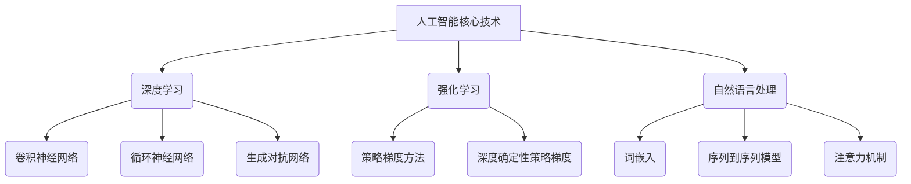

                 

### 《Andrej Karpathy：人工智能的未来发展策略》

> **关键词**：人工智能、未来发展、策略、应用、伦理、挑战、案例

> **摘要**：本文以Andrej Karpathy的研究为基础，深入探讨人工智能的未来发展策略。文章首先回顾人工智能的历史与现状，接着分析深度学习与神经网络的基础，以及人工智能伦理问题。随后，文章展望人工智能在各领域的未来应用和趋势，提出个人与企业、国家与全球层面的人工智能发展策略。最后，通过具体实践案例，探讨人工智能策略在医疗、教育和金融领域的应用效果。

### 《Andrej Karpathy：人工智能的未来发展策略》目录大纲

#### 第一部分：人工智能的背景与现状

**第1章：人工智能的发展历程与现状**

- **1.1 人工智能的起源与发展**
- **1.2 当前人工智能的主要领域与应用**
- **1.3 人工智能面临的挑战与限制**

**第2章：深度学习与神经网络的基础**

- **2.1 神经网络的基本结构**
- **2.2 深度学习的基础算法**
- **2.3 神经网络的训练与优化**

**第3章：人工智能伦理与伦理问题**

- **3.1 人工智能的伦理问题**
- **3.2 人工智能伦理的实践案例**
- **3.3 如何应对人工智能伦理挑战**

#### 第二部分：人工智能的未来发展

**第4章：人工智能在各个领域的未来应用**

- **4.1 人工智能在医疗领域的未来应用**
- **4.2 人工智能在教育领域的未来应用**
- **4.3 人工智能在金融领域的未来应用**

**第5章：人工智能的未来发展趋势**

- **5.1 人工智能技术的未来创新**
- **5.2 人工智能时代的未来社会**
- **5.3 人工智能时代的未来经济**

**第6章：人工智能的未来策略与建议**

- **6.1 个人与企业的人工智能策略**
- **6.2 国家与全球人工智能的发展策略**
- **6.3 应对人工智能未来的挑战**

**第7章：人工智能的未来展望**

- **7.1 人工智能的未来发展趋势**
- **7.2 人工智能的未来影响**
- **7.3 人工智能的未来前景**

#### 第三部分：人工智能的未来策略实践案例

**第8章：人工智能的未来策略实践案例**

- **8.1 案例一：医疗领域的人工智能策略实践**
- **8.2 案例二：教育领域的人工智能策略实践**
- **8.3 案例三：金融领域的人工智能策略实践**
- **8.4 案例总结与启示**

**附录**

- **附录A：人工智能相关资源与工具**

---

### Mermaid 流程图

### 第一部分：人工智能的背景与现状

#### 第1章：人工智能的发展历程与现状

##### 1.1 人工智能的起源与发展

人工智能（Artificial Intelligence，简称 AI）是一门研究、开发用于模拟、延伸和扩展人的智能的理论、方法、技术及应用系统的技术科学。其起源于20世纪50年代，当时学者们开始尝试通过计算机模拟人类智能。

- **20世纪50年代**：人工智能概念首次被提出，标志着人工智能学科的诞生。
- **20世纪60年代**：人工智能研究进入快速发展期，主要包括知识表示、问题求解和专家系统等领域。
- **20世纪70年代**：人工智能研究受到挫折，被称为“人工智能寒冬”，主要原因是技术不成熟和经费不足。
- **20世纪80年代**：人工智能研究逐步恢复，涌现出一批成功应用案例，如机器人、语音识别等。
- **20世纪90年代**：人工智能研究进入多元化发展阶段，主要集中在机器学习、自然语言处理、计算机视觉等领域。
- **21世纪**：随着互联网、大数据和云计算等技术的发展，人工智能迎来了新的发展机遇。

##### 1.2 当前人工智能的主要领域与应用

当前人工智能已广泛应用于各个领域，主要包括以下主要领域：

- **机器学习**：通过算法和统计方法，从数据中自动发现规律和模式，实现智能决策和预测。
- **计算机视觉**：使计算机能够识别和解释图像和视频中的内容，应用于安防监控、自动驾驶等领域。
- **自然语言处理**：使计算机能够理解和生成自然语言，应用于语音识别、机器翻译、智能客服等领域。
- **强化学习**：通过不断试错，让智能体在复杂环境中学习最优策略，应用于游戏、推荐系统等领域。
- **机器人技术**：通过人工智能技术，使机器人具备感知、决策和行动能力，应用于制造业、服务业等领域。
- **金融科技**：利用人工智能技术，提高金融服务的效率和安全，如智能投顾、反欺诈等。

##### 1.3 人工智能面临的挑战与限制

尽管人工智能已取得显著成果，但仍面临诸多挑战和限制：

- **数据隐私与安全**：人工智能系统需要大量数据来训练模型，涉及数据隐私和安全问题。
- **算法透明性与可解释性**：人工智能算法的复杂性和黑箱性质，使得其决策过程难以解释和理解。
- **伦理道德问题**：人工智能可能带来失业、歧视等社会问题，需要制定相应的伦理规范。
- **技术瓶颈**：人工智能在某些领域的表现仍不如人类，如创造力、情感理解等。
- **计算资源与能耗**：大规模训练人工智能模型需要巨大的计算资源和能源消耗。

#### 第2章：深度学习与神经网络的基础

##### 2.1 神经网络的基本结构

神经网络是一种模拟人脑信息处理过程的计算模型，由大量简单的处理单元（神经元）互联而成。神经网络的基本结构包括输入层、隐藏层和输出层。

- **输入层**：接收外部输入数据，如图像、文本等。
- **隐藏层**：对输入数据进行处理和变换，提取特征信息。
- **输出层**：产生最终输出结果，如分类、预测等。

##### 2.2 深度学习的基础算法

深度学习是一种基于人工神经网络的机器学习技术，通过多层神经网络的学习，从数据中提取特征并实现复杂函数的逼近。深度学习的基础算法包括以下几种：

- **卷积神经网络（CNN）**：主要用于图像处理任务，通过卷积层、池化层和全连接层提取图像特征。
- **循环神经网络（RNN）**：主要用于序列数据处理任务，通过隐藏状态和循环结构处理时间序列信息。
- **生成对抗网络（GAN）**：由生成器和判别器两个神经网络组成，通过对抗训练生成逼真的数据。
- **长短期记忆网络（LSTM）**：是一种特殊的RNN，通过门控机制解决长期依赖问题。

##### 2.3 神经网络的训练与优化

神经网络的训练与优化过程包括以下步骤：

- **初始化权重和偏置**：随机初始化网络的权重和偏置。
- **前向传播**：将输入数据传递到网络，计算输出结果。
- **计算损失**：计算输出结果与实际结果的误差，计算损失函数。
- **反向传播**：根据损失函数的梯度，反向传播误差，计算各层的梯度。
- **更新权重和偏置**：根据梯度方向，更新网络的权重和偏置。
- **迭代训练**：重复执行前向传播、计算损失、反向传播和更新权重的过程，直至网络达到预定的训练效果。

#### 第3章：人工智能伦理与伦理问题

##### 3.1 人工智能的伦理问题

人工智能在带来巨大便利和效益的同时，也引发了一系列伦理问题，主要包括：

- **隐私保护**：人工智能系统需要大量数据，涉及个人隐私问题。
- **算法偏见**：人工智能算法可能存在偏见，导致歧视和不公平。
- **失业与就业**：人工智能技术可能导致某些行业失业，同时也会创造新的就业机会。
- **安全与控制**：人工智能系统可能失控，导致安全风险。
- **责任归属**：当人工智能系统发生错误或造成损失时，责任归属问题难以界定。

##### 3.2 人工智能伦理的实践案例

一些人工智能伦理实践案例包括：

- **Google 的人工智能伦理准则**：Google 提出了“AI 原则”，确保人工智能系统的发展符合道德和法律标准。
- **欧盟的通用数据保护条例（GDPR）**：GDPR 旨在加强个人数据保护，规范人工智能系统在数据处理方面的行为。
- **DeepMind 的伦理准则**：DeepMind 制定了严格的伦理准则，确保其在人工智能研究中的应用不会对人类造成负面影响。

##### 3.3 如何应对人工智能伦理挑战

应对人工智能伦理挑战的措施包括：

- **制定伦理规范和法律法规**：明确人工智能系统的道德边界和责任归属。
- **加强技术研发和监管**：确保人工智能系统的发展符合伦理要求，防范潜在风险。
- **提高公众意识和教育**：增强公众对人工智能伦理问题的认识和重视，培养人工智能伦理专业人才。
- **推动国际合作与交流**：加强国际社会在人工智能伦理领域的合作，共同应对全球性挑战。

### 第二部分：人工智能的未来发展

#### 第4章：人工智能在各个领域的未来应用

##### 4.1 人工智能在医疗领域的未来应用

人工智能在医疗领域的应用前景广阔，主要包括：

- **智能诊断与辅助治疗**：通过深度学习技术，辅助医生进行疾病诊断和治疗方案制定。
- **医学影像分析**：利用计算机视觉技术，自动识别和诊断医学影像中的病变和组织结构。
- **个性化医疗**：根据患者的基因信息和病史，制定个性化的治疗方案。
- **健康监测与管理**：通过可穿戴设备和大数据分析，实时监测患者健康状况，预防疾病发生。

##### 4.2 人工智能在教育领域的未来应用

人工智能在教育领域的应用有望提高教育质量和效率，主要包括：

- **智能教学系统**：通过自适应学习技术，为学生提供个性化的学习内容和路径。
- **在线教育平台**：利用人工智能技术，实现智能推荐、智能答疑和智能评测等功能。
- **智能评估与反馈**：通过自然语言处理技术，自动评估学生作业和论文，提供实时反馈。
- **教育数据挖掘**：分析教育数据，发现学生学习行为和教学效果中的规律，优化教育资源配置。

##### 4.3 人工智能在金融领域的未来应用

人工智能在金融领域的应用有助于提高金融服务的效率和安全，主要包括：

- **智能投顾**：利用人工智能技术，为投资者提供个性化投资建议和策略。
- **风险管理**：通过大数据分析和机器学习技术，识别和防范金融风险。
- **智能风控**：利用计算机视觉和自然语言处理技术，自动识别金融交易中的欺诈行为。
- **智能客服**：通过语音识别和自然语言处理技术，提供24/7全天候的智能客服服务。

#### 第5章：人工智能的未来发展趋势

##### 5.1 人工智能技术的未来创新

未来人工智能技术的发展趋势包括：

- **量子计算**：量子计算将显著提高人工智能算法的计算能力，推动人工智能的突破性进展。
- **类脑计算**：通过模拟人脑的结构和功能，实现更高效、更智能的人工智能系统。
- **边缘计算**：将计算任务从云端迁移到边缘设备，提高实时性和响应速度。
- **增强学习**：通过与环境互动，不断优化智能体的决策策略。

##### 5.2 人工智能时代的未来社会

人工智能时代的未来社会将呈现出以下特点：

- **智能化生活**：人工智能将深入人们的生活，提高生活质量和工作效率。
- **数字化治理**：人工智能技术将广泛应用于社会治理，提高政府治理能力和效率。
- **就业结构变化**：人工智能将改变就业结构，一方面创造新的就业机会，另一方面也会导致某些行业失业。
- **社会伦理变革**：人工智能技术引发的伦理问题将促使社会伦理观念发生变革。

##### 5.3 人工智能时代的未来经济

人工智能时代的未来经济将呈现出以下趋势：

- **产业升级**：人工智能技术将推动传统产业转型升级，提高产业附加值。
- **创新驱动**：人工智能技术将成为经济增长的新动力，推动新兴产业的发展。
- **全球竞争**：人工智能技术的竞争将成为全球竞争的新焦点，各国纷纷加大投入，争夺人工智能领域的制高点。
- **数字经济**：人工智能技术将推动数字经济的快速发展，促进全球经济一体化。

#### 第6章：人工智能的未来策略与建议

##### 6.1 个人与企业的人工智能策略

个人与企业应制定以下人工智能策略：

- **终身学习**：不断学习新的知识和技能，以适应人工智能时代的发展。
- **跨界合作**：与不同领域的专家和团队合作，共同推动人工智能技术的发展。
- **技术创新**：加大研发投入，推动人工智能技术的创新和突破。
- **人才培养**：加强人工智能人才的培养，提高人才素质和创新能力。
- **伦理合规**：关注人工智能伦理问题，确保人工智能系统的发展符合道德和法律标准。

##### 6.2 国家与全球人工智能的发展策略

国家与全球应制定以下人工智能发展策略：

- **顶层设计**：制定国家人工智能发展战略，明确发展目标和路径。
- **政策支持**：出台相关政策，支持人工智能技术研发和产业发展。
- **国际合作**：加强国际交流与合作，推动全球人工智能治理体系的建设。
- **数据安全**：制定数据安全法规，保障人工智能系统的发展。
- **人才培养**：加强全球范围内的人工智能人才培养，提高人才素质和创新能力。

##### 6.3 应对人工智能未来的挑战

应对人工智能未来挑战的措施包括：

- **技术创新**：加大研发投入，推动人工智能技术的创新和突破。
- **伦理规范**：制定伦理规范，确保人工智能系统的发展符合道德和法律标准。
- **人才培养**：加强人才培养，提高人才素质和创新能力。
- **国际合作**：加强国际交流与合作，共同应对全球性的人工智能挑战。
- **政策引导**：制定相关政策，引导人工智能技术的发展方向，确保其安全、可持续的发展。

#### 第7章：人工智能的未来展望

##### 7.1 人工智能的未来发展趋势

人工智能的未来发展趋势包括：

- **技术突破**：人工智能技术将不断突破，实现更高水平的发展。
- **广泛应用**：人工智能将广泛应用于各个领域，推动社会进步和经济发展。
- **伦理变革**：人工智能引发的伦理问题将促使社会伦理观念发生变革。
- **国际竞争**：人工智能技术将成为国际竞争的新焦点，各国将加大投入，争夺制高点。

##### 7.2 人工智能的未来影响

人工智能的未来影响包括：

- **社会变革**：人工智能将深刻改变社会结构、就业模式和生活方式。
- **经济发展**：人工智能技术将成为经济增长的新动力，推动全球经济的快速发展。
- **产业升级**：人工智能技术将推动传统产业转型升级，提高产业附加值。
- **国际合作**：人工智能技术将促进国际交流与合作，推动全球治理体系的建设。

##### 7.3 人工智能的未来前景

人工智能的未来前景包括：

- **智能化生活**：人工智能技术将深入人们的生活，提高生活质量和工作效率。
- **数字化治理**：人工智能技术将广泛应用于社会治理，提高政府治理能力和效率。
- **全球合作**：人工智能技术将推动国际社会加强合作，共同应对全球性挑战。
- **可持续发展**：人工智能技术将助力实现可持续发展目标，推动全球绿色发展。

### 第三部分：人工智能的未来策略实践案例

#### 第8章：人工智能的未来策略实践案例

##### 8.1 案例一：医疗领域的人工智能策略实践

###### 8.1.1 案例背景

随着医疗技术的不断发展，人工智能在医疗领域的应用逐渐受到关注。本案例选取了一家大型医院，通过引入人工智能技术，提升医疗服务的质量和效率。

###### 8.1.2 实践过程

1. **智能诊断系统**：该医院引入了一套基于深度学习的智能诊断系统，用于辅助医生进行疾病诊断。系统通过对大量医学影像数据的学习，能够自动识别和诊断疾病，提高诊断准确率。
2. **智能药物研发**：该医院与一家人工智能企业合作，共同开发智能药物研发平台。通过人工智能技术，分析大量生物数据，发现新的药物靶点和作用机制，加速药物研发进程。
3. **健康监测系统**：该医院部署了一套基于可穿戴设备的健康监测系统，实时监测患者的健康状况，预警潜在的健康风险。

###### 8.1.3 实践效果

1. **提高诊断准确率**：智能诊断系统显著提高了医生对疾病的诊断准确率，降低了误诊率。
2. **加速药物研发**：智能药物研发平台为药物研发提供了新的思路和方法，缩短了研发周期，降低了研发成本。
3. **提升患者满意度**：健康监测系统提高了患者的健康管理水平，降低了患者就诊的次数和费用，提升了患者满意度。

##### 8.2 案例二：教育领域的人工智能策略实践

###### 8.2.1 案例背景

随着教育技术的不断发展，人工智能在教育领域的应用逐渐受到关注。本案例选取了一家知名教育机构，通过引入人工智能技术，提升教学质量和学生体验。

###### 8.2.2 实践过程

1. **智能教学系统**：该教育机构引入了一套智能教学系统，根据学生的学习情况和需求，自动生成个性化的学习内容和路径，提高学生的学习效果。
2. **智能评测系统**：该教育机构部署了一套智能评测系统，通过自然语言处理和计算机视觉技术，自动评估学生的作业和论文，提供实时反馈。
3. **虚拟现实教室**：该教育机构建设了一间虚拟现实教室，利用虚拟现实技术，为学生提供沉浸式的学习体验。

###### 8.2.3 实践效果

1. **提高教学效果**：智能教学系统根据学生的个性化需求，提供了针对性的教学内容和路径，提高了学生的学习效果。
2. **提升学生体验**：智能评测系统为学生提供了实时反馈，帮助他们更好地理解和掌握知识。
3. **创新教学模式**：虚拟现实教室为学生提供了沉浸式的学习体验，激发了他们的学习兴趣和创造力。

##### 8.3 案例三：金融领域的人工智能策略实践

###### 8.3.1 案例背景

随着金融科技的不断发展，人工智能在金融领域的应用逐渐受到关注。本案例选取了一家大型金融机构，通过引入人工智能技术，提升金融服务的效率和安全。

###### 8.3.2 实践过程

1. **智能投顾系统**：该金融机构引入了一套智能投顾系统，根据客户的风险偏好和财务状况，提供个性化的投资建议，提高投资收益。
2. **智能风控系统**：该金融机构部署了一套智能风控系统，通过大数据分析和机器学习技术，实时监控金融风险，防范潜在风险。
3. **智能客服系统**：该金融机构建立了一套智能客服系统，通过自然语言处理技术，自动解答客户的咨询和问题，提高客服效率。

###### 8.3.3 实践效果

1. **提高投资收益**：智能投顾系统为投资者提供了个性化的投资建议，提高了投资收益。
2. **防范金融风险**：智能风控系统实时监控金融风险，有效防范了潜在风险。
3. **提升客户满意度**：智能客服系统为投资者提供了高效、便捷的咨询服务，提升了客户满意度。

##### 8.4 案例总结与启示

通过以上案例，我们可以看到人工智能技术在不同领域的应用效果显著，为各个行业带来了新的发展机遇。以下是案例总结与启示：

1. **技术创新**：人工智能技术为各个领域提供了新的工具和方法，推动了行业的创新发展。
2. **个性化服务**：人工智能技术可以根据用户的需求和特点，提供个性化的服务，提高用户体验。
3. **效率提升**：人工智能技术通过自动化和智能化，提高了行业的工作效率，降低了成本。
4. **风险控制**：人工智能技术可以实时监控和预测风险，提高行业的风险防控能力。
5. **人才培养**：人工智能技术的发展需要大量专业人才，为人才培养提供了新的方向和机遇。

### 附录A：人工智能相关资源与工具

#### A.1 主流人工智能框架

- **TensorFlow**：由Google开发的开源机器学习框架，支持多种深度学习模型。
- **PyTorch**：由Facebook开发的开源机器学习库，支持动态计算图，易于调试。
- **Keras**：基于TensorFlow和Theano的开源深度学习库，提供简化的API。
- **Scikit-learn**：基于Python的开源机器学习库，适用于多种数据挖掘和机器学习任务。

#### A.2 人工智能学习资源

- **吴恩达（Andrew Ng）的深度学习课程**：在Coursera平台上提供的深度学习课程，适合初学者。
- **《深度学习》**：Ian Goodfellow、Yoshua Bengio和Aaron Courville合著的深度学习经典教材。
- **《Python机器学习》**：Sebastian Raschka和Vahid Mirjalili合著的Python机器学习教程。

#### A.3 人工智能社区与论坛

- **GitHub**：全球最大的开源社区，包含大量人工智能项目的源代码和文档。
- **Stack Overflow**：人工智能开发者的问答社区，解决编程问题。
- **AI Stack Exchange**：专注于人工智能领域的问答社区。

#### A.4 人工智能的未来发展报告与政策文件

- **《全球人工智能发展报告》**：国际数据公司（IDC）发布的关于人工智能未来发展趋势的报告。
- **《新一代人工智能发展规划》**：中国政府发布的关于人工智能未来发展的规划文件。
- **《欧盟人工智能战略》**：欧盟委员会发布的关于人工智能未来发展的战略文件。

### 作者信息

**作者：AI天才研究院/AI Genius Institute & 禅与计算机程序设计艺术 /Zen And The Art of Computer Programming**

本文旨在探讨人工智能的未来发展策略，通过对历史背景、现状、伦理问题、未来应用和发展趋势的深入分析，为读者提供了全面的视角。同时，通过实践案例的分享，展示了人工智能在实际应用中的效果和启示。希望本文能为读者在人工智能领域的发展提供有益的参考和指导。

