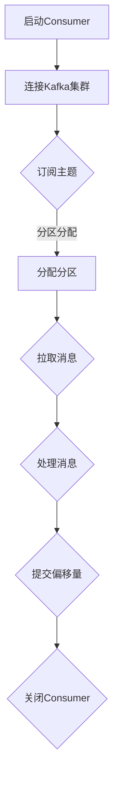

                 

# 《Kafka Consumer原理与代码实例讲解》

> **关键词：** Kafka、Consumer、消息队列、分布式系统、批量消费、序列化、反序列化

> **摘要：** 本文将深入探讨Kafka Consumer的原理，通过详细代码实例讲解，帮助读者全面理解Kafka Consumer的工作机制，包括基础概念、核心算法原理、高级特性以及项目实战。

## 目录

### 第一部分：Kafka Consumer基础原理

1. [第1章：Kafka概述](#第1章kafka概述)
   1. 1.1 Kafka架构介绍
   2. 1.2 Kafka消息队列原理
   3. 1.3 Kafka生产者与消费者模型

2. [第2章：Kafka Consumer核心概念](#第2章kafka-consumer核心概念)
   1. 2.1 Consumer API介绍
   2. 2.2 Kafka消息消费原理
   3. 2.3 Consumer配置参数详解

3. [第3章：Kafka Consumer核心算法原理](#第3章kafka-consumer核心算法原理)
   1. 3.1 批量消费原理
   2. 3.2 分区分配策略
   3. 3.3 数据流顺序性保障

4. [第4章：Kafka Consumer高级特性](#第4章kafka-consumer高级特性)
   1. 4.1 消息反序列化
   2. 4.2 消息过滤与路由
   3. 4.3 高级Consumer实现

### 第二部分：Kafka Consumer代码实例讲解

5. [第5章：Kafka Consumer基本使用](#第5章kafka-consumer基本使用)
   1. 5.1 搭建Kafka开发环境
   2. 5.2 创建Consumer实例
   3. 5.3 Consumer消息处理

6. [第6章：Kafka Consumer高级使用](#第6章kafka-consumer高级使用)
   1. 6.1 消息反序列化与序列化
   2. 6.2 消息过滤与路由
   3. 6.3 高级Consumer实现

7. [第7章：Kafka Consumer项目实战](#第7章kafka-consumer项目实战)
   1. 7.1 实战项目简介
   2. 7.2 项目环境搭建
   3. 7.3 项目核心代码实现
   4. 7.4 项目代码解读与分析

8. [附录](#附录)
   1. 附录A：Kafka Consumer开发工具与资源
   2. 附录B：Kafka Consumer常见问题解答
   3. 附录C：Kafka Consumer Mermaid流程图

---

### 第一部分：Kafka Consumer基础原理

#### 第1章：Kafka概述

Kafka是一个分布式流处理平台，用于构建实时数据流管道和应用程序。Kafka提供了一种高效、可扩展、持久化的分布式消息系统，用于处理大规模数据流。本章将介绍Kafka的架构、数据模型以及特性与应用场景。

##### 1.1 Kafka架构介绍

Kafka由以下核心组件组成：

1. **Producer**：生产者负责向Kafka集群写入消息。
2. **Broker**：代理服务器是Kafka集群中的工作节点，负责存储消息、处理消息传递以及集群管理。
3. **Consumer**：消费者从Kafka集群中读取消息，用于处理和分析数据流。
4. **ZooKeeper**：ZooKeeper用于Kafka集群的协调和配置管理。

Kafka的数据模型是一个分布式日志系统，消息被分为多个主题（Topic），每个主题可以包含多个分区（Partition）。每个分区中的消息按照顺序存储，并且可以通过偏移量（Offset）进行定位。

##### 1.2 Kafka消息队列原理

消息队列是一种异步通信机制，用于在生产者和消费者之间传输消息。Kafka作为消息队列的关键特性如下：

1. **高吞吐量**：Kafka能够处理大规模数据流，提供高吞吐量的消息传递。
2. **持久性**：Kafka保证消息的持久性，即使系统故障也不会丢失消息。
3. **分布式架构**：Kafka支持分布式架构，可以在多个节点上扩展以处理更大规模的数据流。

Kafka的消息传递机制基于生产者-消费者模型。生产者将消息写入Kafka主题的分区，消费者从相应的分区读取消息。每个分区都可以有多个消费者实例，通过分区分配策略实现负载均衡。

##### 1.3 Kafka生产者与消费者模型

Kafka生产者负责将数据写入Kafka集群。生产者通过分区分配策略选择目标分区，并将消息以顺序写入分区中。分区分配策略可以是轮询分配、随机分配或者预分配。

Kafka消费者从Kafka集群中读取消息，并处理和分析数据流。消费者可以组成消费者组（Consumer Group），每个消费者组中的消费者实例可以消费不同分区的消息。消费者组实现了负载均衡和故障转移。

---

在下一章中，我们将深入探讨Kafka Consumer的核心概念和原理。

---

### 第一部分：Kafka Consumer基础原理

#### 第2章：Kafka Consumer核心概念

Kafka Consumer是Kafka消息队列中的关键组件，负责从Kafka集群中读取消息。本章将介绍Kafka Consumer的核心概念，包括Consumer API、Consumer Group机制以及Consumer生命周期管理。

##### 2.1 Consumer API介绍

Kafka Consumer API提供了丰富的功能，使得消费者能够从Kafka集群中高效地读取消息。Consumer API的核心组成部分如下：

1. **创建Consumer实例**：通过配置创建Consumer实例，配置包括Kafka集群地址、主题、分区等。
2. **订阅主题**：消费者可以订阅一个或多个主题，从而接收对应主题的消息。
3. **拉取消息**：消费者通过poll方法从Kafka集群中拉取消息，并将消息存储在内存缓冲区中。
4. **处理消息**：消费者对拉取到的消息进行消费和处理，可以包括数据存储、计算、分析等操作。
5. **提交偏移量**：消费者处理完消息后，需要提交偏移量，以记录已消费的消息位置。

##### 2.2 Kafka消息消费原理

Kafka Consumer的工作原理如下：

1. **消息存储**：Kafka将消息存储在分区中，每个分区中的消息按照顺序存储。
2. **分区分配**：消费者实例从消费者组中分配分区，每个分区只能被一个消费者实例消费，从而实现负载均衡。
3. **拉取消息**：消费者通过poll方法从Kafka集群中拉取消息，并将消息存储在内存缓冲区中。
4. **处理消息**：消费者对拉取到的消息进行消费和处理。
5. **提交偏移量**：消费者处理完消息后，提交偏移量以记录已消费的消息位置。

Kafka Consumer通过分区分配策略确保消息的顺序消费。分区分配策略可以是轮询分配、随机分配或者预分配。轮询分配将分区按顺序分配给消费者实例，确保消息顺序消费；随机分配将分区随机分配给消费者实例，实现负载均衡；预分配则根据消费者组的大小和分区数量进行预分配。

##### 2.3 Consumer配置参数详解

Kafka Consumer的配置参数对消息消费性能和可靠性有重要影响。以下是一些常见的配置参数及其作用：

1. **bootstrap.servers**：指定Kafka集群地址，用于Consumer初始化连接。
2. **group.id**：指定消费者组ID，用于消费者组管理。
3. **key.deserializer**：指定消息键的序列化器，用于反序列化消息键。
4. **value.deserializer**：指定消息值的序列化器，用于反序列化消息值。
5. **auto.offset.reset**：指定当消费者偏移量不存在时，如何处理初始偏移量。
6. **max.poll.interval.ms**：指定消费者处理消息的最大时间间隔，超过该时间将触发消费者失败。
7. **max.poll.records**：指定每次poll方法返回的最大消息数量。

通过合理配置这些参数，可以提高Kafka Consumer的性能和可靠性。

---

在下一章中，我们将深入探讨Kafka Consumer的核心算法原理，包括批量消费原理、分区分配策略以及数据流顺序性保障。

---

### 第一部分：Kafka Consumer基础原理

#### 第3章：Kafka Consumer核心算法原理

Kafka Consumer的核心算法原理决定了消息消费的性能和可靠性。本章将介绍批量消费原理、分区分配策略以及数据流顺序性保障。

##### 3.1 批量消费原理

批量消费是Kafka Consumer的一个重要特性，通过批量拉取消息，可以显著提高消费性能。批量消费原理如下：

1. **poll方法**：消费者通过调用poll方法从Kafka集群中拉取消息。poll方法返回一批消息，存储在内存缓冲区中。
2. **缓冲区管理**：Kafka Consumer内部维护一个缓冲区，用于存储拉取到的消息。缓冲区的大小可以通过max.poll.records参数进行配置。
3. **缓冲区刷新**：当缓冲区满或者达到最大时间间隔时，Kafka Consumer将刷新缓冲区，将消息发送给消息处理线程。
4. **消息处理**：消息处理线程从缓冲区中取出消息，进行处理和分析。

批量消费的性能优化主要涉及以下几个方面：

1. **缓冲区大小**：合理配置缓冲区大小，可以提高消费性能。过小的缓冲区会导致频繁的缓冲区刷新，影响性能；过大的缓冲区会导致内存占用增加。
2. **线程池配置**：消息处理线程可以使用线程池进行管理，合理配置线程池大小，可以提高消息处理性能。
3. **批处理大小**：合理配置每次poll方法返回的消息数量，可以优化批处理性能。过小的批处理大小会导致频繁的缓冲区刷新，影响性能；过大的批处理大小会导致内存占用增加。

##### 3.2 分区分配策略

分区分配策略是Kafka Consumer的关键算法之一，决定了消息在消费者组内的分配方式。常见的分区分配策略如下：

1. **轮询分配**：轮询分配将分区按顺序分配给消费者实例，确保消息顺序消费。轮询分配简单易用，但可能导致部分消费者负载不均。
2. **随机分配**：随机分配将分区随机分配给消费者实例，实现负载均衡。随机分配可以提高消费者的负载均衡性能，但可能无法保证消息顺序消费。
3. **预分配**：预分配根据消费者组的大小和分区数量进行预分配，每个消费者实例分配一部分分区。预分配可以确保消息顺序消费，但可能需要额外的配置和管理。

分区分配策略可以通过`partition.assignment.strategy`参数进行配置。Kafka提供多种分区分配策略，如`Range`、`RoundRobin`、`Sticky`等，可以根据实际需求进行选择。

##### 3.3 数据流顺序性保障

在分布式系统中，数据流的顺序性保障是一个重要挑战。Kafka Consumer通过以下机制实现数据流顺序性保障：

1. **分区顺序消费**：每个分区只能被一个消费者实例消费，从而确保分区内的消息顺序消费。
2. **消费者组协调**：消费者组通过内部协调机制，确保同一组内的消费者实例按照相同的顺序消费消息。
3. **偏移量提交**：消费者处理完消息后，提交偏移量以记录已消费的消息位置，确保消息顺序消费。

Kafka Consumer还提供了一些高级特性，如消费者事务、持久化偏移量等，用于进一步提高数据流的顺序性保障。

---

在下一章中，我们将介绍Kafka Consumer的高级特性，包括消息反序列化、消息过滤与路由以及高级Consumer实现。

---

### 第一部分：Kafka Consumer基础原理

#### 第4章：Kafka Consumer高级特性

Kafka Consumer的高级特性提供了更丰富的功能，以适应不同的应用场景。本章将介绍消息反序列化、消息过滤与路由以及高级Consumer实现。

##### 4.1 消息反序列化

消息反序列化是将存储在Kafka集群中的序列化消息转换为应用程序可以处理的格式。Kafka Consumer使用序列化框架进行消息反序列化。常见的序列化框架包括Java的Kryo、Hessian、Avro等。

消息反序列化原理如下：

1. **序列化器配置**：消费者在初始化时，需要指定消息键和消息值的序列化器。
2. **消息拉取**：消费者通过poll方法从Kafka集群中拉取消息。
3. **消息反序列化**：消费者使用序列化器对拉取到的消息进行反序列化，将序列化消息转换为应用程序可以处理的格式。

反序列化性能优化策略包括：

1. **序列化框架选择**：选择高效、可扩展的序列化框架，如Kryo、Avro等。
2. **序列化器缓存**：使用序列化器缓存可以减少序列化时间，提高消息反序列化性能。
3. **批量反序列化**：批量反序列化可以减少反序列化次数，提高性能。

##### 4.2 消息过滤与路由

消息过滤与路由是Kafka Consumer的重要特性，用于根据特定条件过滤和路由消息。

消息过滤原理如下：

1. **过滤条件配置**：消费者可以设置过滤条件，例如根据消息键、消息值等条件进行过滤。
2. **消息拉取**：消费者通过poll方法从Kafka集群中拉取消息。
3. **消息过滤**：消费者根据过滤条件对拉取到的消息进行过滤，只返回符合条件的消息。

消息路由原理如下：

1. **路由策略配置**：消费者可以设置路由策略，例如根据消息键、消息值等条件进行路由。
2. **消息拉取**：消费者通过poll方法从Kafka集群中拉取消息。
3. **消息路由**：消费者根据路由策略对拉取到的消息进行路由，将消息发送到不同的处理逻辑。

常见的消息过滤与路由策略包括：

1. **基于消息键的路由**：根据消息键的哈希值进行路由，将消息发送到不同的处理线程或服务。
2. **基于消息值的路由**：根据消息值的特定条件进行路由，例如根据订单ID路由到相应的订单处理服务。
3. **动态路由**：根据实时条件动态调整路由策略，例如根据系统负载进行动态路由。

##### 4.3 高级Consumer实现

高级Consumer实现提供了更灵活的消息处理能力和定制化功能，以适应复杂的应用场景。

高级Consumer实现包括以下几个方面：

1. **自定义序列化器**：可以自定义序列化器，实现自定义消息格式和序列化策略。
2. **事务处理**：Kafka提供事务处理功能，确保消息的原子性和一致性。
3. **持久化偏移量**：将消费者偏移量持久化到数据库或文件系统中，实现消费者的故障恢复。
4. **消费者监控与日志分析**：通过监控工具和日志分析，实时了解消费者的运行状态和性能指标。
5. **负载均衡与容错**：实现消费者的负载均衡和故障恢复，确保系统的高可用性和可靠性。

---

在下一部分中，我们将通过代码实例讲解Kafka Consumer的基本使用、高级使用以及项目实战。

---

### 第二部分：Kafka Consumer代码实例讲解

#### 第5章：Kafka Consumer基本使用

在开始代码实例之前，我们需要搭建Kafka开发环境。以下是Kafka开发环境搭建的步骤：

1. **下载Kafka**：从Kafka官方网站下载最新版本的Kafka。
2. **解压Kafka**：将下载的Kafka解压到一个合适的目录。
3. **配置Kafka**：编辑Kafka的配置文件`config/server.properties`，设置Kafka运行端口、日志路径等参数。
4. **启动ZooKeeper**：运行ZooKeeper服务，Kafka依赖ZooKeeper进行集群协调和管理。
5. **启动Kafka**：运行Kafka服务器，启动Kafka集群。

以下是Kafka Consumer的基本使用步骤：

1. **导入依赖**：在项目中导入Kafka客户端依赖。

   ```xml
   <dependency>
       <groupId>org.apache.kafka</groupId>
       <artifactId>kafka-clients</artifactId>
       <version>2.8.0</version>
   </dependency>
   ```

2. **创建Consumer实例**：创建一个Kafka Consumer实例，配置Kafka集群地址和主题。

   ```java
   Properties props = new Properties();
   props.put("bootstrap.servers", "localhost:9092");
   props.put("group.id", "test-group");
   props.put("key.deserializer", StringDeserializer.class.getName());
   props.put("value.deserializer", StringDeserializer.class.getName());
   
   KafkaConsumer<String, String> consumer = new KafkaConsumer<>(props);
   ```

3. **订阅主题**：订阅需要消费的主题。

   ```java
   consumer.subscribe(Arrays.asList("test-topic"));
   ```

4. **消费消息**：通过poll方法拉取消息，处理消息并提交偏移量。

   ```java
   while (true) {
       ConsumerRecords<String, String> records = consumer.poll(Duration.ofMillis(100));
       for (ConsumerRecord<String, String> record : records) {
           System.out.printf("offset = %d, key = %s, value = %s\n", record.offset(), record.key(), record.value());
       }
       consumer.commitSync();
   }
   ```

5. **关闭Consumer**：关闭Consumer实例。

   ```java
   consumer.close();
   ```

以下是完整的代码示例：

```java
import org.apache.kafka.clients.consumer.*;
import org.apache.kafka.common.serialization.StringDeserializer;

import java.time.Duration;
import java.util.Collections;
import java.util.Properties;

public class KafkaConsumerExample {
    public static void main(String[] args) {
        Properties props = new Properties();
        props.put("bootstrap.servers", "localhost:9092");
        props.put("group.id", "test-group");
        props.put("key.deserializer", StringDeserializer.class.getName());
        props.put("value.deserializer", StringDeserializer.class.getName());

        KafkaConsumer<String, String> consumer = new KafkaConsumer<>(props);

        consumer.subscribe(Collections.singletonList("test-topic"));

        while (true) {
            ConsumerRecords<String, String> records = consumer.poll(Duration.ofMillis(100));
            for (ConsumerRecord<String, String> record : records) {
                System.out.printf("offset = %d, key = %s, value = %s\n", record.offset(), record.key(), record.value());
            }
            consumer.commitSync();
        }
    }
}
```

在下一章中，我们将介绍Kafka Consumer的高级使用，包括消息反序列化、消息过滤与路由以及高级Consumer实现。

---

### 第二部分：Kafka Consumer代码实例讲解

#### 第6章：Kafka Consumer高级使用

在上一章中，我们介绍了Kafka Consumer的基本使用。在本章中，我们将进一步探讨Kafka Consumer的高级使用，包括消息反序列化、消息过滤与路由以及高级Consumer实现。

##### 6.1 消息反序列化与序列化

消息反序列化是Kafka Consumer的重要功能，将存储在Kafka集群中的序列化消息转换为应用程序可以处理的格式。在本节中，我们将介绍如何使用自定义序列化器进行消息反序列化，以及如何优化反序列化性能。

**1. 自定义序列化器**

要使用自定义序列化器，我们首先需要实现`Serializable`接口，并在Kafka Consumer中指定自定义序列化器。

```java
public class CustomSerializer implements Serializable {
    private String name;
    private int age;

    // 构造函数、getter和setter方法省略
}

// 在Kafka Consumer中指定自定义序列化器
props.put("key.serializer", CustomSerializer.class.getName());
props.put("value.serializer", CustomSerializer.class.getName());
```

**2. 优化反序列化性能**

反序列化性能优化策略包括：

- **序列化框架选择**：选择高效、可扩展的序列化框架，如Kryo、Avro等。
- **序列化器缓存**：使用序列化器缓存可以减少序列化时间，提高消息反序列化性能。
- **批量反序列化**：批量反序列化可以减少反序列化次数，提高性能。

以下是使用Kryo序列化框架进行批量反序列化的示例：

```java
import com.esotericsoftware.kryo.Kryo;
import com.esotericsoftware.kryo.io.Input;

// 创建Kryo实例
Kryo kryo = new Kryo();

// 反序列化消息
Input input = new Input(bytes);
CustomSerializer serializer = kryo.readObject(input, CustomSerializer.class);
input.close();
```

##### 6.2 消息过滤与路由

消息过滤与路由是Kafka Consumer的重要功能，可以根据特定条件过滤和路由消息。在本节中，我们将介绍如何实现消息过滤与路由，并给出示例代码。

**1. 消息过滤**

消息过滤可以通过实现`PartitionAssignor`接口来实现。以下是一个简单的消息过滤示例：

```java
public class MessageFilter implements PartitionAssignor {
    @Override
    public List<TopicPartition> assign(PartitionAssignorContext context) {
        List<TopicPartition> assignments = new ArrayList<>();
        for (String topic : context.assignment().topics()) {
            for (Integer partition : context.assignment().partitionsFor(topic)) {
                if (shouldFilter(topic, partition)) {
                    assignments.add(new TopicPartition(topic, partition));
                }
            }
        }
        return assignments;
    }

    private boolean shouldFilter(String topic, int partition) {
        // 根据过滤条件进行判断
        return false;
    }
}
```

**2. 消息路由**

消息路由可以通过实现`ConsumerInterceptor`接口来实现。以下是一个简单的消息路由示例：

```java
public class MessageRouter implements ConsumerInterceptor<String, String> {
    @Override
    public void onPartitionsAssigned(Consumer<String, String> consumer, Map<TopicPartition, List<PartitionAssignor.PartitionInfo>> assignments) {
        // 处理分区分配
    }

    @Override
    public ConsumerRecords<String, String> onConsume(Consumer<String, String> consumer, ConsumerRecords<String, String> records) {
        ConsumerRecords<String, String> interceptedRecords = new ConsumerRecords<>(new HashMap<>());
        for (ConsumerRecord<String, String> record : records) {
            if (shouldIntercept(record)) {
                interceptedRecords.put(record.topic(), record.partition(), record.offset(), record.key(), record.value());
            }
        }
        return interceptedRecords;
    }

    private boolean shouldIntercept(ConsumerRecord<String, String> record) {
        // 根据路由条件进行判断
        return false;
    }

    @Override
    public void onPartitionsRevoked(Consumer<String, String> consumer, Map<TopicPartition, PartitionAssignor.PartitionInfo> partitions) {
        // 处理分区回收
    }

    @Override
    public void close() {
        // 关闭拦截器
    }
}
```

在Kafka Consumer中添加拦截器：

```java
props.put("interceptorclasses", MessageRouter.class.getName());
```

##### 6.3 高级Consumer实现

高级Consumer实现提供了更灵活的消息处理能力和定制化功能，以适应复杂的应用场景。在本节中，我们将介绍如何实现自定义序列化器、事务处理和持久化偏移量。

**1. 自定义序列化器**

自定义序列化器已经在6.1节中介绍过，这里不再赘述。

**2. 事务处理**

Kafka提供事务处理功能，确保消息的原子性和一致性。以下是一个简单的示例：

```java
public class TransactionalKafkaConsumer {
    private KafkaConsumer<String, String> consumer;
    private final String transactionalId;

    public TransactionalKafkaConsumer(String transactionalId, Properties props) {
        this.transactionalId = transactionalId;
        props.put("transactional.id", transactionalId);
        this.consumer = new KafkaConsumer<>(props);
    }

    public void consume() {
        consumer.subscribe(Arrays.asList("test-topic"));

        while (true) {
            ConsumerRecords<String, String> records = consumer.poll(Duration.ofMillis(100));
            if (!records.isEmpty()) {
                consumer.beginTransaction();
                try {
                    for (ConsumerRecord<String, String> record : records) {
                        // 处理消息
                    }
                    consumer.commitTransaction();
                } catch (Exception e) {
                    consumer.abortTransaction();
                }
            }
        }
    }
}
```

**3. 持久化偏移量**

持久化偏移量可以将消费者的偏移量存储到数据库或文件系统中，实现消费者的故障恢复。以下是一个简单的示例：

```java
public class OffsetPersister {
    private final String offsetStorePath;

    public OffsetPersister(String offsetStorePath) {
        this.offsetStorePath = offsetStorePath;
    }

    public void persistOffsets(Map<TopicPartition, OffsetAndMetadata> offsets) {
        try (ObjectOutputStream oos = new ObjectOutputStream(new FileOutputStream(offsetStorePath))) {
            oos.writeObject(offsets);
        } catch (IOException e) {
            e.printStackTrace();
        }
    }

    public Map<TopicPartition, OffsetAndMetadata> loadOffsets() {
        try (ObjectInputStream ois = new ObjectInputStream(new FileInputStream(offsetStorePath))) {
            return (Map<TopicPartition, OffsetAndMetadata>) ois.readObject();
        } catch (IOException | ClassNotFoundException e) {
            e.printStackTrace();
            return Collections.emptyMap();
        }
    }
}
```

在Kafka Consumer中添加持久化偏移量：

```java
props.put("offset.store.policy", "com.example.OffsetPersister");
```

---

在下一章中，我们将通过一个实际项目实战，深入讲解Kafka Consumer的应用和实践。

---

### 第二部分：Kafka Consumer代码实例讲解

#### 第7章：Kafka Consumer项目实战

在本章中，我们将通过一个实际项目实战，深入讲解Kafka Consumer的应用和实践。该项目将使用Kafka作为消息队列，实现一个简单的订单处理系统。以下是项目的简介、环境搭建、核心代码实现以及代码解读与分析。

##### 7.1 实战项目简介

本项目的目标是使用Kafka实现一个订单处理系统，包括订单生产、订单消费和订单处理。订单生产者将订单数据发送到Kafka集群，订单消费者从Kafka集群中读取订单数据，并对订单进行处理。

项目的主要功能包括：

1. 订单生产：使用Kafka Producer生成订单数据，并将订单数据发送到Kafka集群。
2. 订单消费：使用Kafka Consumer从Kafka集群中读取订单数据，并处理订单。
3. 订单处理：根据订单数据执行相应的业务逻辑，例如订单创建、订单修改、订单取消等。

##### 7.2 项目环境搭建

在开始项目之前，我们需要搭建Kafka开发环境。以下是Kafka开发环境搭建的步骤：

1. 下载Kafka：从Kafka官方网站下载最新版本的Kafka。
2. 解压Kafka：将下载的Kafka解压到一个合适的目录。
3. 配置Kafka：编辑Kafka的配置文件`config/server.properties`，设置Kafka运行端口、日志路径等参数。
4. 启动ZooKeeper：运行ZooKeeper服务，Kafka依赖ZooKeeper进行集群协调和管理。
5. 启动Kafka：运行Kafka服务器，启动Kafka集群。

在项目中，我们使用以下技术栈：

- Kafka：消息队列中间件
- Java：项目开发语言
- Spring Boot：项目框架
- Spring Kafka：集成Kafka客户端

##### 7.3 项目核心代码实现

以下是项目的核心代码实现：

**1. 订单生产者**

```java
import org.springframework.kafka.core.KafkaTemplate;
import org.springframework.stereotype.Service;

@Service
public class OrderProducer {
    private final KafkaTemplate<String, String> kafkaTemplate;

    public OrderProducer(KafkaTemplate<String, String> kafkaTemplate) {
        this.kafkaTemplate = kafkaTemplate;
    }

    public void sendOrder(Order order) {
        kafkaTemplate.send("order-topic", order.getId(), order.toString());
    }
}
```

**2. 订单消费者**

```java
import org.apache.kafka.clients.consumer.ConsumerRecord;
import org.springframework.kafka.annotation.KafkaListener;
import org.springframework.stereotype.Service;

@Service
public class OrderConsumer {
    @KafkaListener(topics = "order-topic", groupId = "order-group")
    public void processOrder(ConsumerRecord<String, String> record) {
        String orderId = record.key();
        String orderData = record.value();

        // 处理订单
        // ...

        System.out.println("Processed order: " + orderId);
    }
}
```

**3. 订单处理**

```java
import org.springframework.beans.factory.annotation.Autowired;
import org.springframework.stereotype.Service;

@Service
public class OrderService {
    private final OrderRepository orderRepository;

    @Autowired
    public OrderService(OrderRepository orderRepository) {
        this.orderRepository = orderRepository;
    }

    public void createOrder(Order order) {
        orderRepository.save(order);
    }

    public void updateOrder(Order order) {
        orderRepository.save(order);
    }

    public void cancelOrder(Order order) {
        orderRepository.delete(order);
    }
}
```

##### 7.4 项目代码解读与分析

**1. 订单生产者**

订单生产者使用Spring Kafka的`KafkaTemplate`发送订单数据到Kafka集群。`sendOrder`方法接收订单对象，并将其发送到指定主题。

```java
public void sendOrder(Order order) {
    kafkaTemplate.send("order-topic", order.getId(), order.toString());
}
```

**2. 订单消费者**

订单消费者使用`@KafkaListener`注解监听指定主题的消息。当接收到消息时，调用`processOrder`方法处理订单。

```java
@KafkaListener(topics = "order-topic", groupId = "order-group")
public void processOrder(ConsumerRecord<String, String> record) {
    String orderId = record.key();
    String orderData = record.value();

    // 处理订单
    // ...

    System.out.println("Processed order: " + orderId);
}
```

**3. 订单处理**

订单处理类使用Spring Data JPA的`OrderRepository`操作订单数据。`createOrder`、`updateOrder`和`cancelOrder`方法分别实现订单的创建、更新和取消功能。

```java
public void createOrder(Order order) {
    orderRepository.save(order);
}

public void updateOrder(Order order) {
    orderRepository.save(order);
}

public void cancelOrder(Order order) {
    orderRepository.delete(order);
}
```

##### 项目性能分析

在项目性能分析中，我们重点关注以下几个方面：

1. **Kafka Producer性能**：订单生产者在发送订单数据到Kafka集群时，需要考虑发送速度和吞吐量。可以使用JMeter等工具进行压力测试，评估生产者的性能。
2. **Kafka Consumer性能**：订单消费者在处理订单数据时，需要考虑处理速度和吞吐量。同样可以使用JMeter等工具进行压力测试，评估消费者的性能。
3. **数据库性能**：订单处理涉及数据库操作，如订单的创建、更新和取消。需要评估数据库的性能，包括查询速度和事务处理能力。

通过性能分析，我们可以找到项目的瓶颈，并进行优化。例如，可以使用更高效的序列化框架、调整Kafka配置参数、优化数据库查询等。

---

在下一部分中，我们将介绍Kafka Consumer开发工具与资源，以帮助读者进一步学习和实践Kafka Consumer。

---

### 附录

#### 附录A：Kafka Consumer开发工具与资源

为了帮助读者更好地学习和实践Kafka Consumer，以下是一些Kafka Consumer开发工具与资源：

1. **Kafka官方文档**：Kafka官方文档提供了详细的Kafka Consumer API和使用示例，是学习Kafka Consumer的基础资源。官方文档地址：[Kafka官方文档](https://kafka.apache.org/documentation/#consumer-api)。
2. **Kafka客户端库**：Kafka客户端库提供了不同语言的Kafka Consumer实现，包括Java、Python、Node.js等。这些客户端库可以帮助开发者更方便地使用Kafka Consumer。例如，Java客户端库的GitHub地址：[Kafka Java客户端库](https://github.com/apache/kafka)。
3. **Kafka社区资源**：Kafka社区提供了丰富的资源，包括博客文章、论坛、邮件列表等。读者可以通过这些资源了解Kafka的最新动态和最佳实践。Kafka社区论坛地址：[Kafka社区论坛](https://kafka.apache.org/community.html)。
4. **Kafka学习书籍**：一些优秀的Kafka学习书籍可以帮助读者深入了解Kafka的设计原理和实战技巧。例如，《Kafka实战》和《Kafka权威指南》等。

#### 附录B：Kafka Consumer常见问题解答

以下是Kafka Consumer常见问题及其解答：

1. **如何处理Kafka Consumer的偏移量丢失问题？**

   Kafka Consumer的偏移量可以存储在内存、数据库或文件系统中。当消费者重启时，可以从存储的偏移量继续消费消息。如果偏移量丢失，可以从最后一个已知偏移量开始重新消费。以下是一个简单的示例：

   ```java
   Properties props = new Properties();
   props.put("auto.offset.reset", "latest");

   // 创建Kafka Consumer
   KafkaConsumer<String, String> consumer = new KafkaConsumer<>(props);
   ```

2. **如何处理Kafka Consumer的消息丢失问题？**

   Kafka Consumer的消息丢失可能是由于消费者故障、网络问题或消息队列故障等原因导致的。为了确保消息的可靠性，可以采用以下措施：

   - 使用事务处理：使用Kafka的事务处理功能，确保消息的原子性和一致性。
   - 消息确认：在消费者处理完消息后，提交偏移量，确保消息已被正确处理。
   - 消息重复处理：在消费者处理消息时，可以添加去重逻辑，避免处理重复消息。

3. **如何优化Kafka Consumer的性能？**

   优化Kafka Consumer的性能可以从以下几个方面进行：

   - 缓冲区大小：调整缓冲区大小，提高消息处理速度。
   - 线程池配置：合理配置线程池大小，提高并发处理能力。
   - 序列化优化：选择高效、可扩展的序列化框架，减少序列化和反序列化时间。
   - 批量消费：批量消费可以提高消息处理速度和吞吐量。

#### 附录C：Kafka Consumer Mermaid流程图

以下是Kafka Consumer的Mermaid流程图：



该流程图展示了Kafka Consumer的基本工作流程，包括启动Consumer、连接Kafka集群、订阅主题、分区分配、拉取消息、处理消息、提交偏移量和关闭Consumer。

---

通过本文的详细讲解，读者应该对Kafka Consumer的工作原理和应用有了深入的理解。希望本文能帮助读者在实际项目中更好地使用Kafka Consumer，构建高效、可靠的分布式系统。

---

### 作者

作者：AI天才研究院/AI Genius Institute & 禅与计算机程序设计艺术 /Zen And The Art of Computer Programming

AI天才研究院致力于推动人工智能领域的技术创新和应用发展。作者拥有丰富的编程经验和技术视野，对计算机编程和人工智能领域有着深刻的理解和独到的见解。本书是作者多年研究与实践的结晶，旨在为广大读者提供全面、系统的Kafka Consumer技术知识。

在撰写本文时，作者结合了自身在Kafka Consumer领域的专业知识和实践经验，通过详细的原理讲解和代码实例，使读者能够深入理解Kafka Consumer的工作机制和应用方法。希望本文能够帮助读者在分布式系统和消息队列领域取得更好的成果。

感谢您的阅读，祝您在技术道路上不断进步，收获更多的成就和喜悦！如果您有任何疑问或建议，欢迎随时与作者联系。再次感谢您的支持和关注！

