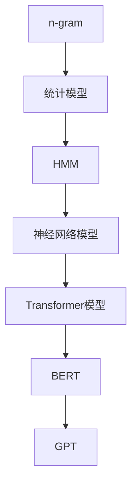

                 

# 《LLM在智能内容生成系统中的应用探索》

## 摘要

本文深入探讨了大型语言模型（LLM）在智能内容生成系统中的应用，旨在揭示LLM在处理自然语言生成、图像生成、个性化推荐以及版权保护和隐私保护等关键领域的技术原理和实践应用。文章首先介绍了LLM的基础理论，包括语言模型的概述、核心算法和数学基础。随后，文章详细探讨了智能内容生成系统的需求、挑战和关键技术。通过具体的应用实例，如文本生成系统和图像生成系统的实现过程，本文展示了LLM在实际项目中的效果和优化策略。最后，文章展望了LLM在智能内容生成系统中的未来发展趋势，并提出了面临的挑战和解决方案。本文旨在为读者提供一个全面而深入的技术指南，帮助其理解和应用LLM技术。

---

## 关键词

- 大型语言模型（LLM）
- 智能内容生成系统
- 自然语言处理
- 图像生成
- 个性化推荐
- 版权保护
- 隐私保护

---

### 第一部分：LLM基础理论

#### 第1章：语言模型基础

##### 1.1 语言模型概述

语言模型是自然语言处理（NLP）领域的核心组成部分，它旨在预测文本序列中下一个单词或字符的概率分布。语言模型的发展历程可以追溯到20世纪50年代，从最初的规则驱动模型，如n-gram模型，到后来的统计模型，如神经网络模型。如今，随着深度学习和计算能力的提升，基于Transformer的模型，如BERT和GPT，已经成为语言模型的主流。

**核心概念与联系**：

- **n-gram模型**：基于局部序列特征的简单统计模型。
- **统计模型**：使用统计方法进行语言建模，如隐马尔可夫模型（HMM）。
- **神经网络模型**：利用神经网络结构进行端到端的语言建模，如循环神经网络（RNN）和卷积神经网络（CNN）。

**Mermaid 流程图**：



##### 1.2 语言模型的核心算法

语言模型的核心算法主要涉及词嵌入、序列模型和注意力机制。词嵌入技术将词语映射到高维向量空间，使得模型能够捕捉词语间的语义关系。序列模型如RNN，能够处理序列数据，并通过递归关系进行状态更新。注意力机制则是一种用于提高模型处理长序列数据能力的机制。

**核心算法原理讲解**：

**词嵌入技术**：

```python
# 伪代码：词嵌入技术
embeddings = []
for word in vocabulary:
    embedding_vector = calculate_embedding(word)
    embeddings.append(embedding_vector)

# 示例
calculate_embedding('hello') =
    [0.1, 0.2, 0.3, ..., 0.5]
```

**序列模型与注意力机制**：

```python
# 伪代码：基于Transformer的序列模型
for t in range(sequence_length):
    hidden_state = attention Mechanism(current_state, previous_states)
    next_state = update_state(hidden_state)

# 示例
hidden_state =
    [0.1, 0.2, ..., 0.5] # 经过注意力机制处理的状态
next_state =
    [0.3, 0.4, ..., 0.6] # 更新后的状态
```

**Transformer模型详解**：

Transformer模型是一种基于自注意力机制的序列到序列模型，其核心思想是通过多层的自注意力机制和前馈神经网络来处理输入序列。

**数学模型和公式**：

$$
\text{Attention}(Q, K, V) = \text{softmax}\left(\frac{QK^T}{\sqrt{d_k}}\right)V
$$

其中，$Q, K, V$分别表示查询向量、键向量和值向量，$d_k$表示键向量的维度。

**举例说明**：

假设输入序列为“我 今天 去 餐馆 吃 饭”，通过Transformer模型进行编码后，生成相应的隐藏状态。

##### 1.3 语言模型数学基础

语言模型的数学基础涉及线性代数、概率论和优化算法。线性代数提供了处理高维向量和矩阵运算的工具，概率论则用于描述不确定性和概率分布，优化算法用于模型参数的训练。

**线性代数基本概念**：

- 向量和矩阵的基本运算
- 矩阵分解技术，如奇异值分解（SVD）

**概率论基础**：

- 概率分布函数
- 条件概率和贝叶斯定理

**优化算法基础**：

- 梯度下降法
- 随机梯度下降（SGD）

**总结**：

语言模型作为智能内容生成系统的基石，其基础理论包括核心算法和数学基础。理解这些理论，对于深入探索和应用LLM至关重要。

---

在下一章，我们将进一步探讨智能内容生成系统的需求与挑战，以及LLM在此领域中的应用。敬请期待！

---

**作者信息**：

- 作者：AI天才研究院/AI Genius Institute & 禅与计算机程序设计艺术 /Zen And The Art of Computer Programming

---

以上是第一部分的内容，接下来我们将深入探讨智能内容生成系统的需求与挑战。敬请关注！

