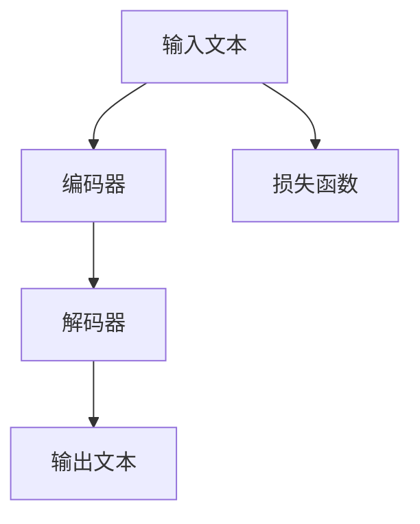

                 

### 文章标题

《LLM应用的安全性设计：从架构层面入手》

### 文章关键词

- 大型语言模型（LLM）
- 安全性设计
- 架构层面
- 数据安全
- 模型攻击防御

### 文章摘要

随着大型语言模型（LLM）的广泛应用，其安全性设计变得尤为重要。本文从架构层面出发，系统地分析了LLM应用的安全性设计，包括基础概念、安全挑战、设计策略与实践案例。通过深入剖析和实际案例，本文旨在为LLM开发者提供一套完整的架构层面安全性设计方案。

----------------------------------------------------------------

### 《LLM应用的安全性设计：从架构层面入手》目录大纲

#### 第一部分：基础概念与架构设计

##### 第1章：大型语言模型（LLM）概述

###### 1.1 大型语言模型（LLM）的定义与分类

###### 1.2 大型语言模型的发展历程与趋势

###### 1.3 大型语言模型的应用场景

##### 第2章：大型语言模型架构设计基础

###### 2.1 神经网络与深度学习基础

###### 2.2 语言模型的基本组成

###### 2.3 大型语言模型的常见架构

#### 第二部分：安全性设计

##### 第3章：大型语言模型的安全性挑战

###### 3.1 数据安全与隐私保护

###### 3.2 模型安全与攻击防御

###### 3.3 模型透明性与解释性

##### 第4章：安全性设计策略与方法

###### 4.1 安全性评估框架

###### 4.2 防护机制与实现

###### 4.3 安全性优化与提升

##### 第5章：安全性实践案例

###### 5.1 案例分析

###### 5.2 安全性设计与实现

###### 5.3 安全性评估与优化

#### 第三部分：架构层面安全设计

##### 第6章：大型语言模型架构安全性设计

###### 6.1 架构安全设计原则

###### 6.2 架构层面对抗攻击设计

###### 6.3 架构层面对抗数据污染设计

##### 第7章：安全性测试与评估

###### 7.1 安全性测试方法

###### 7.2 安全性评估工具

###### 7.3 安全性改进与迭代

#### 第四部分：展望与未来方向

##### 第8章：大型语言模型安全性的未来趋势

###### 8.1 新兴安全技术与应用

###### 8.2 安全性与性能的平衡

###### 8.3 安全性与可持续性的发展

##### 第9章：结论与建议

###### 9.1 研究总结

###### 9.2 研究展望

###### 9.3 实践建议

#### 附录

##### 附录A：常用术语表

##### 附录B：参考资料与推荐阅读

##### 附录C：相关开源工具与框架

### 第1章：大型语言模型（LLM）概述

#### 1.1 大型语言模型（LLM）的定义与分类

**概念定义：**

大型语言模型（LLM，Large Language Model）是指一类基于深度学习和神经网络技术训练而成的复杂模型，它们具有理解、生成和翻译自然语言文本的能力。LLM 通常包含数亿到数千亿个参数，能够捕捉到文本的复杂结构和语义信息。

**分类：**

1. **通用语言模型**：这类模型设计用于广泛的自然语言处理任务，如文本分类、情感分析、问答系统等。例如，OpenAI 的 GPT 系列、Google 的 BERT 等。

2. **专业语言模型**：这类模型针对特定领域或任务进行定制化训练，拥有更高的专业性和精确性。例如，用于医疗文本处理的模型、用于金融文本分析的模型等。

**示例：**

- OpenAI 的 GPT 系列：GPT-3、GPT-Neo 等。
- BERT、RoBERTa 等：用于文本分类、情感分析等通用任务。

#### 1.2 大型语言模型的发展历程与趋势

**早期阶段：**

- **1990年代**：基于规则和统计方法的早期自然语言处理模型，如朴素贝叶斯分类器、隐马尔可夫模型（HMM）等。

- **2000年代**：支持向量机（SVM）、条件随机场（CRF）等监督学习模型开始广泛应用。

**中期阶段：**

- **2010年代**：深度学习技术开始引入自然语言处理领域，如循环神经网络（RNN）和长短期记忆网络（LSTM）。

- **2017年**：Transformer 架构的提出，标志着自然语言处理领域的重大突破。BERT、GPT-2 等模型相继涌现。

**近期阶段：**

- **2020年代**：自监督预训练技术的广泛应用，如 GPT-3、OPT 等。多模态融合和知识增强技术也逐渐成为研究热点。

**趋势分析：**

1. **模型规模持续增长**：从 BERT 到 GPT-3，模型参数规模和计算资源需求不断增长。

2. **多模态融合**：将图像、音频等多模态信息与文本进行融合，以提升模型的理解能力和应用范围。

3. **知识增强与迁移学习**：通过引入外部知识库和迁移学习技术，提升模型在特定领域的专业性和精确性。

4. **应用场景不断拓展**：从文本生成、翻译到对话系统、代码生成，LLM 的应用领域持续拓展。

#### 1.3 大型语言模型的应用场景

**企业应用：**

- **客户服务**：智能客服机器人，如 OpenAI 的 GPT-3，能够模拟人类对话，提供快速、准确的客户支持。

- **内部文档自动化处理**：LLM 可用于自动生成报告、摘要，提高文档处理的效率。

- **市场调研与分析**：LLM 可用于分析大量文本数据，提取关键信息，辅助决策。

**学术研究：**

- **文本分类**：用于分类大量文本数据，如新闻、论文等。

- **情感分析**：分析文本中的情感倾向，用于情感识别、用户满意度分析等。

- **信息检索**：提升搜索引擎的性能，提供更精准的信息检索服务。

**日常生活：**

- **聊天机器人**：如 ChatGPT、BERTChat 等，提供智能对话服务。

- **信息推送**：基于用户兴趣和偏好，智能推送相关信息。

- **文本生成**：如文章写作、诗歌创作等，为用户提供创意灵感。

#### 1.3.1 生成式模型与判别式模型

**生成式模型：**

生成式模型（Generative Model）是一种能够生成新数据的模型，如生成文本、图像等。LLM 中常用的生成式模型包括变分自编码器（VAE）、生成对抗网络（GAN）和自回归模型（如 GPT）。

**判别式模型：**

判别式模型（Discriminative Model）是一种能够分类或判断数据真实性的模型，如支持向量机（SVM）、神经网络（NN）等。LLM 中常用的判别式模型包括 Transformer 架构的各种变种。

**示例：**

- **生成式模型**：GPT-3 用于生成文本，GAN 用于生成图像。
- **判别式模型**：BERT 用于文本分类，SVM 用于图像分类。

**伪代码：**

```python
# 生成式模型伪代码
def generate_text(model, seed_text):
    # 使用预训练模型生成文本
    text = model.sample(seed_text)
    return text

# 判别式模型伪代码
def classify_text(model, text):
    # 使用预训练模型分类文本
    label = model.predict(text)
    return label
```

#### 1.3.6 自监督预训练

**数学公式：**

$$
\text{损失函数} = -\sum_{i}^N \log P(y_i|x_i)
$$

**详细讲解：**

自监督预训练是一种无需人工标注数据，直接从原始数据中学习的方式。通过最小化损失函数，模型能够学会预测下一个词、分类文本或判断文本的真伪。

**举例说明：**

假设我们有一个语言模型，它的任务是预测下一个单词。训练数据是一个句子序列，每个句子由单词组成。

- **输入**：`The cat sat on the mat`
- **输出**：`The cat sat on the mat_预测的词_`

损失函数计算：

$$
\text{损失函数} = -\log P(\text{预测的词}|\text{The cat sat on the mat})
$$

如果预测的词与真实词相同，则损失为0；否则，损失为正值。

**Mermaid 流程图：**



#### 1.3.7 GPT-3 应用案例

**代码实现：**

```python
import openai

# 设置 API 密钥
openai.api_key = "your_api_key"

# 调用 GPT-3 模型生成文本
response = openai.Completion.create(
    engine="text-davinci-003",
    prompt="请你写一段关于计算机科学的描述。",
    max_tokens=50,
    n=1,
    stop=None,
    temperature=0.5
)

# 输出生成文本
print(response.choices[0].text.strip())
```

**代码解读与分析：**

1. 导入必要的库和设置 API 密钥。

2. 使用 `Completion.create()` 方法调用 GPT-3 模型，传入相应的参数。

3. 输出生成文本。

**开发环境搭建：**

- 安装 Python 3.6 或更高版本。

- 安装 openai 库，使用 `pip install openai` 命令。

**源代码详细实现和代码解读：**

1. API 密钥设置：在代码中设置 openai 的 API 密钥。

2. 模型调用：使用 `Completion.create()` 方法调用 GPT-3 模型。

3. 参数设置：设置 `engine` 为 "text-davinci-003"，`prompt` 为输入提示语，`max_tokens` 为生成文本的最大长度，`n` 为生成的文本数量，`stop` 为停止生成文本的条件，`temperature` 为生成文本的随机性程度。

**安全性设计考虑：**

1. API 密钥保护：确保 API 密钥安全存储，避免泄露。

2. 防止滥用：设置使用限制，如最大请求次数、请求频率等。

3. 数据加密：确保传输数据加密，防止数据泄露。

#### 附录

**附录A：常用术语表**

- **大型语言模型（LLM）**：一种基于深度学习的技术，能够理解、生成和翻译自然语言文本。
- **生成式模型**：一种能够生成新数据的模型，如生成文本、图像等。
- **判别式模型**：一种能够分类或判断数据真实性的模型，如支持向量机（SVM）、神经网络（NN）等。
- **自监督预训练**：一种无需人工标注数据，直接从原始数据中学习的方式。

**附录B：参考资料与推荐阅读**

- **参考资料**：
  - [OpenAI](https://openai.com/)
  - [Google AI](https://ai.google/)
  - [Transformer 论文](https://arxiv.org/abs/1706.03762)
  
- **推荐阅读**：
  - [GPT-3 论文](https://arxiv.org/abs/2005.14165)
  - [BERT 论文](https://arxiv.org/abs/1810.04805)

**附录C：相关开源工具与框架**

- **开源工具**：
  - [TensorFlow](https://www.tensorflow.org/)
  - [PyTorch](https://pytorch.org/)
  - [Hugging Face Transformers](https://huggingface.co/transformers/)

- **框架**：
  - [GPT-Neo](https://github.com/nametad/gpt-neo)
  - [Flair](https://flair.ukf.ai/)

### 作者信息

**作者：** AI天才研究院 / AI Genius Institute & 禅与计算机程序设计艺术 / Zen And The Art of Computer Programming

