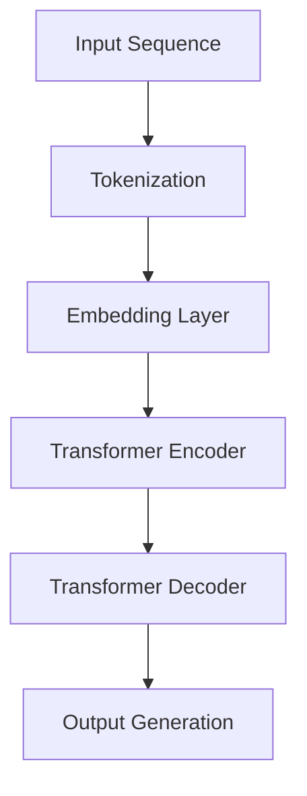
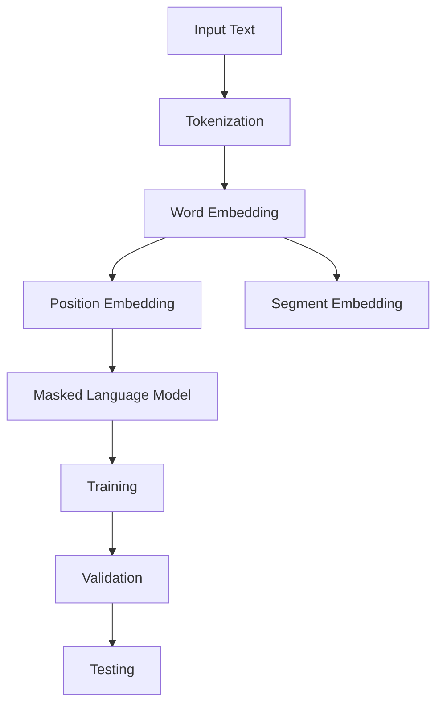

                 

### 《OpenAI 语言模型总览》

> **关键词：** OpenAI、语言模型、自然语言处理、神经网络、深度学习、GPT、BERT

> **摘要：** 本文将为您详细介绍 OpenAI 语言模型的发展历程、核心原理、实战应用以及未来发展趋势。从语言模型的基础概念，到神经网络的训练原理，再到 OpenAI 的前沿成果，我们将一步步深入探讨，帮助您全面了解 AI 语言模型的技术和潜力。

### 《OpenAI 语言模型总览》目录大纲

#### 第一部分：OpenAI 简介
1. **OpenAI 基本概述**
    1.1 OpenAI 的成立背景
    1.2 OpenAI 的使命和愿景

#### 第二部分：语言模型基础
2. **自然语言处理概述**
    2.1 语言模型的基本概念
    2.2 语言模型的分类
    2.3 语言模型的应用场景

#### 第三部分：OpenAI 语言模型核心原理
3. **神经网络的基石**
    3.1 神经网络的基本结构
    3.2 神经网络的训练过程
    3.3 神经网络优化算法
    
4. **深度学习在语言模型中的应用**
    4.1 深度学习与自然语言处理
    4.2 循环神经网络（RNN）
    4.3 长短期记忆网络（LSTM）
    4.4 门控循环单元（GRU）
    4.5 卷积神经网络（CNN）在NLP中的应用

5. **自然语言处理技术**
    5.1 词嵌入技术
    5.2 序列模型与注意力机制
    5.3 转换器架构详解

6. **大规模预训练模型原理**
    6.1 预训练的概念与意义
    6.2 自监督学习方法
    6.3 迁移学习与微调技术

#### 第四部分：OpenAI 语言模型实战应用
7. **GPT 系列模型**
    7.1 GPT-1 模型介绍
    7.2 GPT-2 模型介绍
    7.3 GPT-3 模型介绍
    7.4 GPT-3 模型应用案例

8. **BERT及其变体**
    8.1 BERT 模型介绍
    8.2 BERT 的结构
    8.3 BERT 在文本分类中的应用
    8.4 BERT 的变体介绍

9. **其他知名语言模型介绍**
    9.1 T5 模型
    9.2 ROBERTA 模型
    9.3 GPT-Neo 模型

#### 第五部分：未来展望
10. **AI 语言模型的发展趋势**
    10.1 大模型的发展趋势
    10.2 多模态语言模型
    10.3 语言模型在行业应用中的挑战与机遇

#### 第六部分：附录
11. **AI 语言模型开发工具与资源**
    11.1 主流深度学习框架对比
    11.2 NLP 相关库和工具

##### 附录 A: AI 语言模型 Mermaid 流程图
- **GPT-3 模型架构图**
- **BERT 模型训练流程图**

##### 附录 B: 核心算法原理讲解伪代码
- **循环神经网络（RNN）训练伪代码**
- **BERT 模型结构伪代码**

##### 附录 C: 数学模型和公式详细讲解
- **神经网络权重更新公式（使用 LaTeX 格式）**
- **交叉熵损失函数公式（使用 LaTeX 格式）**

##### 附录 D: 项目实战
- **语言模型项目实战案例**
    - **环境搭建**
    - **源代码实现**
    - **代码解读与分析**

以上为《OpenAI 语言模型总览》的目录大纲，每个章节的内容都将详细覆盖相关主题，确保读者能够全面了解 OpenAI 语言模型的相关知识和应用。

#### 第一部分：OpenAI 简介

#### 1.1 OpenAI 的成立背景

OpenAI 是一家成立于2015年的美国人工智能研究公司，其创始人为山姆·柯林斯（Sam Altman）、埃隆·马斯克（Elon Musk）等多位知名企业家和科学家。OpenAI 的成立初衷是为了推动人工智能的发展，使其对人类有益且安全。公司的使命是“实现安全的通用人工智能（AGI）并最大化其对人类的利益”。

在成立之初，OpenAI 就确定了其独特的运作模式。与传统的人工智能公司不同，OpenAI 是一家非营利组织，其收入全部用于支持研究和基础设施的扩展。这种模式保证了公司能够专注于长期目标的实现，而不受短期盈利压力的干扰。

#### 1.2 OpenAI 的使命和愿景

OpenAI 的使命是推动人工智能的发展，使其造福全人类。具体而言，OpenAI 的愿景包括以下几个方面：

1. **推动人工智能基础研究**：OpenAI 致力于通过先进的研究推动人工智能的基础科学进步，包括神经网络、深度学习、自然语言处理等领域的创新。

2. **开发安全的人工智能系统**：OpenAI 认为，安全是人工智能发展的关键。因此，公司投入大量资源研究如何确保人工智能系统在部署和应用中的安全性。

3. **构建通用人工智能**：通用人工智能（AGI）是指能够像人类一样执行各种认知任务的人工智能。OpenAI 的长期目标是实现这种智能，并使其服务于人类社会。

4. **促进技术普及与公平**：OpenAI 希望通过开放源代码和开源技术，促进人工智能技术的普及和应用，同时确保技术发展不会加剧社会不平等。

通过这些目标和愿景，OpenAI 旨在成为全球人工智能领域的领导者，推动人工智能技术的进步，并确保其对人类社会的积极影响。

#### 第二部分：语言模型基础

#### 2.1 语言模型的基本概念

语言模型（Language Model）是自然语言处理（Natural Language Processing, NLP）领域中的基础组件，它旨在对自然语言文本进行建模，预测下一个单词或字符的概率。语言模型的核心目标是使计算机能够理解和生成人类语言。

在语言模型中，输入是一个单词序列，输出是下一个单词或字符的概率分布。语言模型通过对大量文本数据进行训练，学习到语言中的统计规律，从而能够预测未来的文本内容。语言模型在许多 NLP 应用中发挥着重要作用，例如机器翻译、语音识别、文本生成等。

#### 2.2 语言模型的分类

语言模型可以根据其训练数据和训练方法进行分类。以下是几种常见的语言模型分类：

1. **基于规则的语言模型**：这种模型使用语法和语义规则来生成文本。例如，上下文无关文法（CFG）和语义角色标注等。这类模型的优点是生成的文本更加规范和准确，但缺点是规则难以覆盖所有语言现象，适用性有限。

2. **统计语言模型**：这种模型通过统计文本中的单词和短语出现频率来预测下一个单词或字符。例如，n-gram 模型和隐马尔可夫模型（HMM）。统计语言模型的优势在于其能够自动从数据中学习语言模式，但缺点是对于长文本的预测效果较差。

3. **神经网络语言模型**：这种模型使用神经网络来直接预测下一个单词或字符。深度学习在 NLP 中取得了显著进展，如循环神经网络（RNN）、长短期记忆网络（LSTM）、门控循环单元（GRU）和转换器（Transformer）等。神经网络语言模型在长文本预测和生成方面表现出色。

4. **基于知识的语言模型**：这种模型结合了规则和统计方法，通过引入外部知识库和语义信息来改进语言模型。例如，知识图谱和语义角色标注等。这类模型旨在提高模型的解释性和语义理解能力。

不同类型的语言模型各有优缺点，选择合适的模型取决于具体的应用场景和需求。

#### 2.3 语言模型的应用场景

语言模型在自然语言处理领域具有广泛的应用。以下是几种常见的应用场景：

1. **机器翻译**：语言模型在机器翻译中用于预测源语言中的下一个单词或字符，并将其翻译为目标语言。常见的模型有基于统计的翻译模型和基于神经网络的翻译模型。

2. **语音识别**：语言模型在语音识别中用于预测输入的语音信号对应的文本。例如，在语音助手和智能语音识别系统中，语言模型可以帮助计算机理解用户的需求。

3. **文本生成**：语言模型可以用于生成文章、故事、诗歌等文本内容。例如，在内容生成、创意写作和自动化报告中，语言模型可以自动生成高质量的内容。

4. **问答系统**：语言模型可以用于构建智能问答系统，通过理解用户的问题和上下文，提供相关的答案。例如，在搜索引擎和智能客服系统中，语言模型可以提高系统的智能程度和用户体验。

5. **情感分析**：语言模型可以用于分析文本的情感倾向，判断文本表达的情绪。例如，在社交媒体分析、市场调研和舆情监控中，语言模型可以帮助企业了解用户的情绪和需求。

语言模型在 NLP 领域的应用不断扩展，为各种自然语言处理任务提供了强大的工具。

#### 第三部分：OpenAI 语言模型核心原理

##### 3.1 神经网络的基石

神经网络（Neural Networks）是构成 OpenAI 语言模型的基础，其核心思想是通过模拟人脑神经元之间的连接和作用，实现对数据的自动学习和处理。神经网络由多个层组成，包括输入层、隐藏层和输出层，其中每个层由多个神经元（节点）组成。

**输入层**：接收外部输入数据，例如单词或字符的编码。

**隐藏层**：对输入数据进行处理和变换，通过神经网络内部的加权连接和激活函数，生成更高级的特征表示。

**输出层**：根据隐藏层的输出，生成预测结果，例如单词或字符的概率分布。

神经网络的工作原理是通过调整神经元之间的权重，使其能够在不同任务中表现出良好的性能。这一过程称为训练（Training）。在训练过程中，神经网络通过反向传播算法（Backpropagation）不断调整权重，以最小化预测误差。

**激活函数**：神经网络中的每个神经元都包含一个激活函数，用于对神经元输出进行非线性变换。常见的激活函数包括 sigmoid、ReLU 和 tanh 等。激活函数的作用是引入非线性特性，使得神经网络能够拟合复杂的数据分布。

**损失函数**：在神经网络训练过程中，损失函数用于评估模型预测结果与真实标签之间的差距。常见的损失函数包括均方误差（MSE）和交叉熵（Cross-Entropy）等。损失函数的目的是引导神经网络优化权重，使其预测结果更加准确。

**反向传播算法**：反向传播算法是一种用于训练神经网络的优化方法。其基本思想是将输出误差反向传播到网络中的每个神经元，并使用梯度下降（Gradient Descent）或其他优化算法调整权重。反向传播算法使得神经网络能够高效地学习数据中的模式和特征。

通过上述组件和算法，神经网络可以实现对数据的自动学习和预测，为 OpenAI 语言模型提供了强大的计算能力。

##### 3.2 神经网络的训练过程

神经网络的训练过程是使其能够从数据中学习到有用信息的过程。这个过程可以分为以下几个步骤：

**数据预处理**：首先对输入数据（例如文本数据）进行预处理，包括分词、标记、标准化等。预处理步骤的目的是将原始数据转换为神经网络可以处理的形式。

**初始化权重**：神经网络中的每个神经元都有连接权重，这些权重通常随机初始化。初始化权重的目的是为了避免模型在训练过程中出现过拟合现象。

**正向传播**：在训练过程中，神经网络对输入数据进行正向传播，从输入层经过隐藏层，最终到达输出层。每个神经元的输出通过激活函数进行非线性变换，得到预测结果。

**计算损失**：在输出层，神经网络计算预测结果与真实标签之间的损失。损失函数用于衡量预测结果的误差，例如均方误差（MSE）或交叉熵（Cross-Entropy）。

**反向传播**：在计算损失之后，神经网络使用反向传播算法将误差反向传播到每个神经元，并计算每个神经元的梯度。梯度表示权重调整的方向和大小。

**权重调整**：根据梯度信息，神经网络使用优化算法（例如梯度下降、Adam等）调整权重，以最小化损失。这一过程称为权重更新。

**迭代训练**：重复上述过程，神经网络不断调整权重，使预测结果逐渐接近真实标签。训练过程中，神经网络会经历多个迭代周期，直到达到预定的训练目标或性能。

通过上述步骤，神经网络可以逐步学习数据中的模式和特征，提高预测准确性。训练过程需要大量的计算资源和时间，但通过高效的算法和数据预处理，可以显著提高训练速度和效果。

##### 3.3 神经网络优化算法

神经网络训练过程中，优化算法起着关键作用。优化算法用于调整神经网络中的权重，以最小化损失函数。以下是一些常见的优化算法：

**梯度下降（Gradient Descent）**：梯度下降是最常用的优化算法之一。其基本思想是沿着损失函数的梯度方向逐步调整权重，以减小损失。梯度下降算法分为批量梯度下降（Batch Gradient Descent）、随机梯度下降（Stochastic Gradient Descent, SGD）和迷你批量梯度下降（Mini-batch Gradient Descent）三种变体。批量梯度下降在每个迭代步骤中使用整个训练数据的梯度，计算量大但收敛速度慢；随机梯度下降在每个迭代步骤中仅使用一个样本的梯度，计算量小但可能产生较大的噪声；迷你批量梯度下降在每个迭代步骤中使用部分训练数据的梯度，折中了批量梯度下降和随机梯度下降的优缺点。

**动量（Momentum）**：动量是一种改进梯度下降算法的技巧。动量算法在每次迭代中保留一部分之前的权重更新，以加速收敛和提高稳定性。动量可以通过以下公式实现：
$$
w_{t+1} = w_t - \alpha \cdot \gamma \cdot v_t + \beta \cdot \delta \cdot v_t
$$
其中，$w_t$ 是当前权重，$\alpha$ 是学习率，$\gamma$ 和 $\beta$ 是动量参数，$v_t$ 是前一次的权重更新。

**Adam**：Adam 是一种自适应学习率优化算法，结合了动量和自适应学习率的概念。Adam 通过计算一阶矩估计（均值）和二阶矩估计（方差）来调整权重。Adam 的优势是收敛速度快且对噪声敏感，其更新公式如下：
$$
m_t = \beta_1 \cdot m_{t-1} + (1 - \beta_1) \cdot \Delta w_t \\
v_t = \beta_2 \cdot v_{t-1} + (1 - \beta_2) \cdot (\Delta w_t)^2
$$
$$
w_t = w_{t-1} - \alpha \cdot \frac{m_t}{\sqrt{v_t} + \epsilon}
$$
其中，$m_t$ 和 $v_t$ 分别是均值和方差估计，$\beta_1$ 和 $\beta_2$ 是一阶和二阶矩估计的指数衰减率，$\alpha$ 是学习率，$\epsilon$ 是一个小常数用于避免除以零。

这些优化算法在神经网络训练过程中起着重要作用，可以提高训练效率和模型性能。选择合适的优化算法和调整其参数对于神经网络的成功训练至关重要。

##### 3.4 深度学习在语言模型中的应用

深度学习在自然语言处理（NLP）领域的应用取得了显著进展，为语言模型的训练和预测提供了强大的工具。以下将介绍深度学习在语言模型中的应用，包括循环神经网络（RNN）、长短期记忆网络（LSTM）、门控循环单元（GRU）和卷积神经网络（CNN）。

**循环神经网络（RNN）**：循环神经网络是深度学习在 NLP 中的一种基础模型。RNN 通过引入循环结构，使网络能够处理序列数据。在 RNN 中，每个时间步的输出不仅取决于当前输入，还取决于之前的输入和隐藏状态。这种特性使得 RNN 能够捕捉序列中的长期依赖关系。

RNN 的基本结构包括输入层、隐藏层和输出层。输入层接收序列中的单词或字符编码，隐藏层通过循环连接生成序列的表示，输出层生成预测结果。RNN 的训练过程通常使用梯度下降和反向传播算法，通过调整权重和偏置来最小化损失函数。

然而，传统的 RNN 存在梯度消失和梯度爆炸问题，导致模型难以训练。为解决这些问题，研究人员提出了长短期记忆网络（LSTM）。

**长短期记忆网络（LSTM）**：长短期记忆网络（LSTM）是 RNN 的改进版本，通过引入记忆单元和门控机制，解决了 RNN 的梯度消失和梯度爆炸问题。LSTM 的核心思想是维持一个“记忆状态”，能够有效地捕捉序列中的长期依赖关系。

LSTM 的基本结构包括输入门、遗忘门、输出门和细胞状态。输入门和遗忘门控制当前输入和旧记忆的权重，输出门控制记忆状态的输出。细胞状态通过这三个门的调节，能够保留或遗忘特定信息。这种结构使得 LSTM 在处理长序列数据时表现出良好的性能。

LSTM 的训练过程与 RNN 类似，使用梯度下降和反向传播算法。然而，LSTM 的训练速度较慢，需要大量计算资源和时间。

**门控循环单元（GRU）**：门控循环单元（GRU）是 LSTM 的简化版本，通过引入更新门和重置门，进一步提高了训练速度和模型性能。GRU 的结构相对简单，计算量较小，但仍能有效地捕捉序列中的长期依赖关系。

GRU 的基本结构包括输入门、更新门、重置门和细胞状态。更新门和重置门共同作用，调节细胞状态的更新。GRU 的训练过程与 LSTM 类似，但收敛速度更快。

**卷积神经网络（CNN）在 NLP 中的应用**：卷积神经网络（CNN）最初应用于计算机视觉领域，通过卷积操作和池化操作提取图像特征。近年来，研究人员发现 CNN 也可以在 NLP 领域发挥作用，尤其是在文本分类和序列建模任务中。

CNN 的基本结构包括卷积层、池化层和全连接层。卷积层通过卷积操作提取局部特征，池化层用于减少数据维度和参数数量。全连接层将卷积层提取的特征映射到输出类别。在 NLP 中，CNN 可以用于文本分类、情感分析、命名实体识别等任务。

与传统 RNN 和 LSTM 相比，CNN 在文本分类任务中表现出色。通过卷积操作，CNN 能够有效地捕捉文本中的局部特征，并通过池化操作减少数据维度。此外，CNN 的训练过程相对简单，适用于大规模数据集。

综上所述，深度学习在语言模型中的应用取得了显著进展。RNN、LSTM、GRU 和 CNN 等模型在 NLP 领域表现出良好的性能，为语言模型的训练和预测提供了有效的工具。随着深度学习技术的不断发展，NLP 领域将继续取得突破性进展。

##### 3.5 自然语言处理技术

自然语言处理（NLP）技术的发展离不开多种核心技术的支持。以下将介绍词嵌入技术、序列模型与注意力机制以及转换器（Transformer）架构的详细内容。

**词嵌入技术**：

词嵌入（Word Embedding）是将单词映射到高维向量空间的一种技术，使得相似单词在向量空间中彼此接近。词嵌入的主要目的是将离散的单词转换为稠密的向量表示，从而便于深度学习模型处理。

常见的词嵌入方法包括基于统计的方法和基于神经网络的方法。基于统计的方法如 Word2Vec，通过训练一个简单的神经网络来预测单词的上下文，从而学习到单词的向量表示。Word2Vec 采用滑动窗口的方法，在每个时间步上预测当前单词，从而构建出一个目标单词和预测单词之间的双向映射。

基于神经网络的方法如 GloVe，通过训练一个矩阵分解模型来学习单词的向量表示。GloVe 采用共现矩阵的方法，通过计算单词之间的相似性矩阵，并利用最小二乘法优化向量表示。

词嵌入技术在 NLP 中具有广泛的应用。例如，在文本分类任务中，词嵌入可以帮助模型更好地理解文本内容；在机器翻译任务中，词嵌入可以用于编码源语言和目标语言的词汇，提高翻译质量。

**序列模型与注意力机制**：

序列模型（Sequential Model）是处理序列数据的一种常用方法，例如 RNN、LSTM 和 GRU。序列模型通过处理输入序列的每个时间步，生成对应的输出序列。这些模型具有捕获序列中长期依赖关系的能力，在自然语言处理任务中表现出良好的性能。

注意力机制（Attention Mechanism）是近年来在 NLP 中取得重要进展的一种技术。注意力机制通过计算输入序列中每个元素的重要性权重，使得模型在处理序列时能够更加关注重要部分。注意力机制的核心思想是引入一个权重分配机制，将输入序列的每个元素与输出序列的每个元素相关联。

在 NLP 中，注意力机制可以应用于文本分类、机器翻译、问答系统等任务。例如，在机器翻译任务中，注意力机制可以帮助模型在翻译过程中关注源语言和目标语言之间的对应关系，从而提高翻译质量。

**转换器（Transformer）架构**：

转换器（Transformer）是一种基于自注意力机制的深度学习模型，由 Vaswani 等人于 2017 年提出。Transformer 删除了传统的循环神经网络结构，采用了一种全新的编码器-解码器框架，在多个 NLP 任务中取得了优异的性能。

Transformer 的核心思想是自注意力（Self-Attention）机制，它允许模型在处理序列数据时关注序列中的每个元素。自注意力机制通过计算输入序列中每个元素与其他元素之间的相似性权重，从而生成每个元素的表示。

Transformer 的架构包括编码器（Encoder）和解码器（Decoder）。编码器通过多个自注意力层和前馈神经网络层，将输入序列编码为固定长度的表示。解码器通过多个自注意力层、交叉注意力层和前馈神经网络层，解码编码器的输出，生成预测结果。

Transformer 在机器翻译、文本生成、问答系统等任务中取得了显著的效果。它的优势在于并行计算能力，使得训练速度和效率显著提高。

综上所述，词嵌入技术、序列模型与注意力机制以及转换器架构是自然语言处理领域的关键技术。这些技术不仅提高了模型的性能，也为 NLP 的广泛应用提供了强大的支持。随着技术的不断发展，NLP 领域将继续取得突破性进展。

##### 3.6 大规模预训练模型原理

大规模预训练模型（Large-scale Pre-trained Models）是近年来自然语言处理（NLP）领域的重要进展之一。这些模型通过在大规模数据集上进行预训练，学习到丰富的语言知识和模式，从而在下游任务中表现出优异的性能。以下将介绍大规模预训练模型的概念、自监督学习方法以及迁移学习和微调技术的原理。

**预训练的概念与意义**：

预训练（Pre-training）是指在特定任务之前，使用大量无标签数据对神经网络模型进行训练的过程。预训练的目标是使模型在大规模数据集上学习到通用语言特征，从而在下游任务中表现出良好的泛化能力。

大规模预训练模型的核心思想是利用无监督学习（Unsupervised Learning）技术，从海量文本数据中提取有价值的信息。这些模型通常在预处理阶段接收大量未标注的文本数据，例如维基百科、新闻文章和社交媒体帖子等。通过这些数据，模型能够学习到词汇、语法、语义和语境等语言特征。

预训练的意义在于，它为下游任务提供了强大的先验知识，使得模型在面临少量有标签数据时，能够快速适应并取得良好的性能。此外，预训练模型还具有较好的跨语言和跨领域的泛化能力，可以在不同任务和数据集上取得一致的优异表现。

**自监督学习方法**：

自监督学习（Self-supervised Learning）是一种无监督学习方法，其核心思想是从无标签数据中提取监督信号。自监督学习在预训练模型中发挥着重要作用，通过自监督学习，模型可以在大规模数据集上进行训练，而无需依赖大量的有标签数据。

常见的自监督学习方法包括预测下一个单词（Next Sentence Prediction, NSP）、掩码语言模型（Masked Language Model, MLM）和转换语言建模（masked Language Model, MSLM）等。

- **预测下一个单词（NSP）**：预测下一个单词任务要求模型在给定前文的情况下，预测下一个单词。这种任务通过利用文本的连续性，使模型学习到单词之间的依赖关系。

- **掩码语言模型（MLM）**：掩码语言模型任务是在输入文本中随机掩码一部分单词，然后要求模型预测这些掩码单词。这种任务使模型学习到单词的上下文信息，从而更好地理解语言。

- **转换语言建模（MSLM）**：转换语言建模任务是将输入文本中的单词随机替换为其他单词，然后要求模型预测原始单词。这种任务使模型学习到单词的相似性和差异性。

自监督学习方法为预训练模型提供了丰富的监督信号，从而提高了模型在下游任务中的性能。

**迁移学习与微调技术**：

迁移学习（Transfer Learning）是指将预训练模型在特定下游任务上进行微调（Fine-tuning）的过程。迁移学习的核心思想是利用预训练模型在大规模数据集上学到的通用语言特征，从而在下游任务中取得更好的性能。

微调技术是迁移学习的关键步骤。在微调过程中，模型会根据下游任务的需求，调整预训练模型的权重和参数。微调过程中，通常只对模型的一部分层（例如最后一层）进行训练，而保留其他层的权重不变。这样，预训练模型中的通用特征可以保持不变，同时通过微调适应特定任务的需求。

迁移学习和微调技术的优势在于，它们可以显著减少下游任务的训练数据量和计算资源需求，从而提高模型的训练效率和性能。此外，迁移学习还可以促进跨任务的知识共享，使模型在多个任务上取得优异表现。

综上所述，大规模预训练模型通过自监督学习、迁移学习和微调技术，实现了在自然语言处理任务中的优异性能。这些模型不仅提高了模型的泛化能力和性能，也为 NLP 领域的研究和应用提供了新的思路和方法。随着技术的不断发展，大规模预训练模型将继续在 NLP 中发挥重要作用。

#### 第四部分：OpenAI 语言模型实战应用

##### 4.1 GPT 系列模型

GPT（Generative Pre-trained Transformer）系列模型是 OpenAI 推出的一系列基于转换器（Transformer）架构的预训练模型。GPT 模型通过大规模数据集进行预训练，学习到丰富的语言知识，从而在生成文本、问答系统和机器翻译等任务中表现出优异的性能。以下是 GPT 系列模型的基本概念、架构和训练方法。

**GPT-1 模型介绍**：

GPT-1 是 GPT 系列模型的开端，由 OpenAI 于 2018 年发布。GPT-1 是一个基于转换器架构的语言模型，其核心思想是使用自注意力机制来捕捉输入序列中的依赖关系。GPT-1 的主要特点是：

- **转换器架构**：GPT-1 采用编码器-解码器框架，通过多个自注意力层和前馈神经网络层，将输入序列编码为固定长度的表示。
- **大规模预训练**：GPT-1 在包含数万亿个单词的公共数据集上进行预训练，从而学习到丰富的语言知识。
- **无监督学习**：GPT-1 采用无监督学习技术，通过预测输入序列中的下一个单词，使模型能够在大规模数据集上进行训练。

**GPT-2 模型介绍**：

GPT-2 是 OpenAI 于 2019 年发布的一个更大规模的语言模型。GPT-2 的主要特点如下：

- **更大规模**：GPT-2 在预训练过程中使用了更多的数据和更大的模型，使其能够学习到更丰富的语言知识。
- **上下文窗口扩展**：GPT-2 将输入序列的上下文窗口扩展到 1024 个单词，使得模型能够更好地捕捉长距离依赖关系。
- **无监督学习**：GPT-2 同样采用无监督学习技术，通过预测输入序列中的下一个单词，使模型能够在大规模数据集上进行训练。

**GPT-3 模型介绍**：

GPT-3 是 OpenAI 于 2020 年发布的一个更大规模、更强大的语言模型。GPT-3 的主要特点如下：

- **模型规模扩展**：GPT-3 的参数数量达到 1750 亿，是 GPT-2 的数十倍。这种巨大的模型规模使得 GPT-3 能够学习到更多的语言特征和模式。
- **上下文窗口扩展**：GPT-3 的上下文窗口扩展到 2048 个单词，进一步提高了模型对长距离依赖关系的捕捉能力。
- **无监督学习**：GPT-3 同样采用无监督学习技术，通过预测输入序列中的下一个单词，使模型能够在大规模数据集上进行训练。

**GPT-3 模型应用案例**：

GPT-3 模型在多个自然语言处理任务中表现出优异的性能。以下是一些典型的应用案例：

- **文本生成**：GPT-3 可以生成高质量的文章、故事、诗歌等文本内容。例如，在内容生成任务中，GPT-3 可以根据用户输入的主题和风格，生成相关的文章。
- **问答系统**：GPT-3 可以构建高效的问答系统，通过理解用户的问题和上下文，提供准确的答案。例如，在智能客服系统中，GPT-3 可以用于回答用户的问题，提高客服的效率和用户体验。
- **机器翻译**：GPT-3 可以实现高质量的双语机器翻译。通过在大规模的双语数据集上进行预训练，GPT-3 能够学习到语言的转换规则，从而提高翻译的准确性。
- **文本分类**：GPT-3 可以用于文本分类任务，通过预测文本的类别标签，帮助模型对大量文本进行分类。例如，在舆情监控和新闻分类任务中，GPT-3 可以用于对文本进行实时分类。

GPT 系列模型是 OpenAI 在自然语言处理领域的重要成果，通过大规模预训练和转换器架构，GPT 模型在多个任务中取得了优异的性能。随着技术的不断发展，GPT 模型将继续推动自然语言处理领域的进步。

##### 4.2 BERT及其变体

BERT（Bidirectional Encoder Representations from Transformers）是由 Google 于 2018 年提出的一种基于转换器（Transformer）架构的预训练语言模型。BERT 的主要特点是双向编码器结构，使模型能够同时考虑输入序列中的前文和后文信息，从而在自然语言处理任务中表现出优异的性能。BERT 的成功引发了大量的研究和应用，同时也诞生了许多基于 BERT 的变体模型。以下将详细介绍 BERT 的基本概念、结构、训练方法及其变体模型。

**BERT 模型介绍**：

BERT 模型通过大规模无监督数据集进行预训练，然后通过微调（Fine-tuning）应用于各种自然语言处理任务。BERT 的主要特点包括：

- **双向编码器**：BERT 采用编码器-解码器框架，其中编码器部分由多个 Transformer 层组成。与单向编码器相比，BERT 的双向编码器能够同时考虑输入序列中的前文和后文信息，从而提高模型的语义理解能力。
- **掩码语言模型（Masked Language Model, MLM）**：BERT 采用掩码语言模型任务，在输入序列中随机掩码部分单词，然后要求模型预测这些掩码单词。这种任务使模型学习到单词的上下文信息。
- **次生任务**：BERT 通过在多个自然语言处理任务（如文本分类、问答系统等）上进行预训练，学习到丰富的语言特征，从而提高模型在下游任务中的性能。

**BERT 的结构**：

BERT 的结构包括输入层、编码器层和输出层。输入层接收单词的嵌入向量，编码器层由多个 Transformer 层组成，输出层生成预测结果。BERT 的主要结构如下：

- **输入层**：BERT 的输入包括单词的嵌入向量、段标识（Section ID）和掩码标识（Mask ID）。单词的嵌入向量通常由预训练的词嵌入模型（如 Word2Vec、GloVe）生成。段标识用于区分句子中的不同段落，掩码标识用于指示单词是否被掩码。
- **编码器层**：BERT 的编码器层由多个 Transformer 层组成，每层包括多头自注意力机制和前馈神经网络。多头自注意力机制通过多个注意力头捕捉输入序列中的依赖关系，前馈神经网络用于对自注意力层的输出进行进一步处理。
- **输出层**：BERT 的输出层包括两个主要部分：一个是分类层，用于对文本进行分类；另一个是序列标注层，用于对文本中的单词进行标注。分类层通常由一个全连接层和一个 Softmax 函数组成，序列标注层通常由一个线性层和一个 Softmax 函数组成。

**BERT 在文本分类中的应用**：

BERT 在文本分类任务中表现出优异的性能。通过在大规模数据集上进行预训练，BERT 学习到丰富的语言特征，从而在下游任务中取得良好的分类效果。BERT 在文本分类中的应用主要包括以下步骤：

- **数据预处理**：将文本数据预处理为 BERT 模型可以接受的格式。包括分词、单词嵌入、段标识和掩码标识等。
- **模型初始化**：初始化 BERT 模型，通常使用预训练好的权重。
- **微调**：在预训练的 BERT 模型上进行微调，使其适应特定的文本分类任务。微调过程中，只对模型的最后一层或部分层进行训练，其他层保持不变。
- **预测**：使用微调后的 BERT 模型对新的文本数据进行分类预测。

**BERT 的变体介绍**：

随着 BERT 的成功，许多研究人员提出了基于 BERT 的变体模型，以改进其性能和应用范围。以下是一些常见的 BERT 变体模型：

- **RoBERTa**：RoBERTa 是由 Facebook AI 研究团队提出的一个 BERT 变体模型。RoBERTa 在 BERT 的基础上进行了多个改进，包括动态掩码比率、不重复子采样、更长的序列窗口等，从而在多个 NLP 任务中取得了优异的性能。
- **AlBERT**：AlBERT 是由 Google AI 研究团队提出的一个轻量级 BERT 变体模型。AlBERT 通过优化模型结构和训练策略，实现了与 BERT 相似的性能，但计算量和参数量显著减少，适用于资源受限的场景。
- **DistilBERT**：DistilBERT 是由 Howard 和 Young 等人提出的一个蒸馏 BERT 变体模型。DistilBERT 通过将 BERT 模型的权重传递给一个较小的模型，从而在保持性能的同时显著减少计算量和参数量。

BERT 及其变体模型在自然语言处理领域取得了显著进展。通过预训练和微调技术，BERT 及其变体模型能够学习到丰富的语言特征，从而在多个任务中表现出优异的性能。随着技术的不断发展，BERT 及其变体模型将继续推动 NLP 领域的进步。

##### 4.3 其他知名语言模型介绍

除了 OpenAI 的 GPT 系列模型和 Google 的 BERT 模型，自然语言处理（NLP）领域还有许多其他知名的语言模型，这些模型在不同的任务和应用中展现出了出色的性能。以下是 T5、ROBERTA 和 GPT-Neo 模型的介绍。

**T5 模型**：

T5（Text-to-Text Transfer Transformer）是由 Google AI 于 2020 年推出的一种通用转换器模型。T5 的主要特点是它将所有 NLP 任务转换为一个文本到文本的预测问题。这意味着 T5 可以通过统一的框架处理多种任务，包括问答、文本分类、命名实体识别等。

T5 的架构基于转换器（Transformer）架构，通过大规模数据集进行预训练，学习到丰富的语言知识。T5 的关键创新在于其任务兼容性，通过一个统一的输入格式和输出格式，T5 能够轻松地在不同任务之间迁移知识。

**ROBERTA 模型**：

ROBERTA（A Robustly Optimized BERT Pretraining Approach）是由 Facebook AI 研究团队提出的一种 BERT 变体模型。ROBERTA 在 BERT 的基础上进行了多个改进，以提高模型在真实世界数据集上的性能。

ROBERTA 的主要改进包括动态掩码比率、不重复子采样和优化预训练目标等。这些改进使得 ROBERTA 能够在文本分类、问答系统和机器翻译等任务中取得比 BERT 更优异的性能。ROBERTA 的优势在于其鲁棒性和适应性，能够在多种应用场景中表现出色。

**GPT-Neo 模型**：

GPT-Neo 是一个开源的语言模型，由多个研究人员和开发者共同维护。GPT-Neo 是对 OpenAI GPT-3 模型的改进和扩展，旨在为研究人员和开发者提供一个可扩展、可定制的语言模型。

GPT-Neo 的主要特点包括支持多种架构（如 Transformer 和 LSTM）和多种预训练目标（如下一个句子预测和掩码语言模型）。GPT-Neo 的开源特性使其在学术界和工业界得到了广泛的应用，为研究者和开发者提供了一个强大的工具，用于探索和实现各种 NLP 任务。

**T5、ROBERTA 和 GPT-Neo 的应用**：

- **T5**：T5 在多种 NLP 任务中展现了出色的性能。例如，在问答系统中，T5 可以通过生成答案文本来回答用户的问题；在文本分类任务中，T5 可以预测文本的类别标签。

- **ROBERTA**：ROBERTA 在文本分类、机器翻译和问答系统等任务中表现出优异的性能。通过动态掩码比率和优化预训练目标，ROBERTA 能够更好地适应真实世界的数据集和应用场景。

- **GPT-Neo**：GPT-Neo 在文本生成、故事创作和对话系统等任务中具有广泛的应用。开源的特性使其成为研究人员和开发者探索和实验的新工具，有助于推动 NLP 领域的创新和发展。

T5、ROBERTA 和 GPT-Neo 等知名语言模型在自然语言处理领域具有重要的地位。通过预训练和任务适配，这些模型在多种任务中取得了优异的性能，为 NLP 的发展和应用提供了强大的支持。

#### 第五部分：未来展望

##### 5.1 AI 语言模型的发展趋势

随着人工智能技术的迅猛发展，AI 语言模型正朝着更加智能、高效和多元化的方向演进。以下将探讨未来 AI 语言模型的发展趋势：

**大模型的发展趋势**：

近年来，随着计算资源和数据集的不断增加，大模型在自然语言处理（NLP）领域取得了显著的突破。例如，OpenAI 的 GPT-3 模型拥有超过 1750 亿个参数，而 Google 的 BERT 模型也有数十亿个参数。这些大模型通过在大规模数据集上进行预训练，学习到了丰富的语言知识和模式，从而在多种 NLP 任务中取得了优异的性能。

未来，随着计算资源和存储技术的不断进步，大模型将继续扩展。研究人员和开发者将探索更大规模的模型，例如具有万亿甚至千亿参数的模型。这些大模型将能够更好地捕捉语言中的复杂结构和依赖关系，从而在生成文本、机器翻译、问答系统等任务中表现出更出色的性能。

**多模态语言模型**：

传统的 AI 语言模型主要针对文本数据，但在实际应用中，越来越多的场景需要处理多模态数据，例如图像、音频和视频。为了满足这些需求，未来将出现多模态语言模型，这些模型能够同时处理文本和其他模态的数据。

多模态语言模型的核心思想是将不同模态的数据融合到一个统一的表示空间中，从而实现更强大的语义理解和生成能力。例如，在图像-文本问答系统中，多模态语言模型可以同时处理图像和文本输入，从而生成更准确和自然的回答。

**自适应和交互式语言模型**：

未来的 AI 语言模型将更加注重与人类的交互。自适应和交互式语言模型可以通过与用户的对话和反馈，不断优化和调整自己的回答和预测。这种交互式模型将使得 AI 助手更加智能和人性化，能够在各种应用场景中提供更高质量的服务。

自适应语言模型可以实时学习用户的偏好和需求，从而提供个性化的服务。例如，在智能客服系统中，自适应语言模型可以根据用户的反馈和历史记录，生成更符合用户期望的回答。交互式语言模型则可以通过与用户的实时对话，不断改进和优化自己的回答，从而提供更加流畅和自然的交互体验。

**低资源语言的建模**：

目前，大部分 AI 语言模型都是在英语和其他主流语言上进行的训练，对于低资源语言的支持相对较弱。未来，随着多语言预训练模型的发展，低资源语言的建模将得到更多关注。

通过多语言预训练模型，AI 语言模型可以在低资源语言上进行有效训练，从而提高这些语言的语义理解和生成能力。例如，通过在多个低资源语言上的共同训练，模型可以学习到这些语言之间的共性和差异，从而更好地理解和使用这些语言。

总之，未来 AI 语言模型将朝着大模型、多模态、自适应和交互式以及低资源语言建模等方向发展。这些趋势将推动 AI 语言模型在更广泛的场景中发挥重要作用，为人类社会带来更多便利和创新。

##### 5.2 语言模型在行业应用中的挑战与机遇

语言模型在自然语言处理（NLP）领域的广泛应用带来了许多机遇，但也伴随着一系列挑战。以下将探讨语言模型在行业应用中的主要挑战和机遇。

**挑战**：

1. **计算资源需求**：大规模语言模型如 GPT-3 需要庞大的计算资源和存储空间进行训练和部署。这对于中小企业和资源有限的团队来说，构成了巨大的技术障碍。此外，训练和部署这些模型还需要专业的硬件设施，如高性能 GPU 和分布式计算系统。

2. **数据隐私和安全**：语言模型在训练过程中需要处理大量的文本数据，这些数据可能包含敏感信息。如何在保护用户隐私的同时，充分挖掘数据的价值，是一个重要的挑战。此外，模型部署后，如何防止数据泄露和未经授权的访问，也是一个关键问题。

3. **解释性和可解释性**：大规模语言模型通常被视为“黑箱”系统，其决策过程难以解释。这对于需要透明和可解释性需求的行业（如医疗、金融等）来说，是一个显著的挑战。用户和监管机构对模型的决策过程缺乏信任，可能会限制模型的应用范围。

4. **文化多样性和语言偏见**：语言模型在训练过程中可能会吸收训练数据中的偏见和歧视，导致模型在特定文化或语言背景下产生不公平的结果。这要求模型开发者注重数据多样性，并采取相应的措施来减少偏见和歧视。

**机遇**：

1. **自动化文本处理**：语言模型在文本生成、分类、摘要、翻译等任务中具有显著优势。这为各个行业提供了自动化文本处理的强大工具，如自动生成新闻报道、智能客服系统、自动化法律文档审核等。

2. **智能交互系统**：随着自适应和交互式语言模型的发展，智能交互系统（如虚拟助手、聊天机器人等）将变得更加智能和人性化。这将为各行各业提供更加高效和友好的用户交互体验。

3. **跨语言应用**：多语言预训练模型的发展，使得语言模型在低资源语言中的应用成为可能。这对于解决语言障碍、促进文化交流和国际合作具有重要意义。

4. **行业定制化解决方案**：语言模型可以针对特定行业的需求进行定制化开发，提供行业专属的解决方案。例如，在医疗领域，语言模型可以用于医学文本分析、诊断辅助和药物研发；在金融领域，语言模型可以用于市场分析、客户服务和风险管理。

总之，语言模型在行业应用中既面临挑战，也充满机遇。通过不断改进技术和策略，解决面临的挑战，语言模型将在更多领域发挥重要作用，推动各行业的数字化转型和创新发展。

### 第五部分：未来展望

在展望 AI 语言模型的发展趋势时，我们首先关注的是大模型的发展。近年来，随着计算能力的提升和数据集的扩充，大模型在自然语言处理领域取得了显著的进展。例如，GPT-3 拥有超过 1750 亿个参数，能够在多种语言和任务中展现出强大的语义理解和生成能力。未来，随着算法的优化、硬件设备的升级以及分布式计算技术的发展，更大规模的语言模型将会不断涌现。

多模态语言模型是另一个重要趋势。传统的语言模型主要处理文本数据，但实际应用中，图像、音频、视频等多模态信息往往需要与文本结合。通过融合多模态数据，语言模型可以更准确地理解上下文，生成更加自然的文本。例如，在图像描述生成任务中，多模态语言模型可以结合图像和文本信息，生成更丰富、更准确的描述。随着技术的进步，多模态语言模型将在更多领域发挥作用。

自适应和交互式语言模型的发展也值得关注。这些模型能够通过不断的学习和优化，更好地满足用户需求。例如，在智能客服系统中，自适应语言模型可以基于用户的历史交互记录，提供个性化的服务。交互式语言模型则能够通过实时对话，动态调整回答策略，提供更加自然和流畅的交互体验。这些模型的发展将大大提升人机交互的智能化水平。

低资源语言的建模是未来研究的重点之一。目前，大多数语言模型都是在英语和其他主流语言上训练的，对于低资源语言的覆盖不足。为了解决这一问题，研究人员正在探索多语言预训练模型，这些模型可以在多种低资源语言上进行共同训练，提高模型在这些语言中的表现。这将有助于消除语言障碍，促进全球文化交流和合作。

在行业应用中，语言模型也面临着一系列挑战和机遇。挑战包括计算资源需求、数据隐私和安全、解释性和可解释性，以及文化多样性和语言偏见等。然而，机遇同样显著。语言模型在自动化文本处理、智能交互系统、跨语言应用和行业定制化解决方案等方面展现出巨大潜力。例如，在医疗领域，语言模型可以用于医学文本分析和诊断辅助；在金融领域，语言模型可以用于市场分析和风险管理。

总之，未来 AI 语言模型的发展趋势将呈现出大模型、多模态、自适应和交互式、以及低资源语言建模等特征。通过不断创新和优化，语言模型将在更多领域发挥重要作用，推动社会进步和产业升级。

### 附录

#### 11. AI 语言模型开发工具与资源

在开发 AI 语言模型时，选择合适的工具和资源至关重要。以下将介绍一些主流的深度学习框架、NLP 相关库和工具，帮助开发者更好地构建和优化语言模型。

**主流深度学习框架**：

1. **TensorFlow**：由 Google 开发的开源深度学习框架，支持多种神经网络结构和优化算法。TensorFlow 提供了丰富的文档和社区支持，适合初学者和专业人士使用。
2. **PyTorch**：由 Facebook AI 研究团队开发的深度学习框架，具有动态计算图和灵活的编程接口。PyTorch 在学术界和工业界都有广泛应用，特别适合研究和新模型的开发。
3. **Keras**：一个高层次的深度学习框架，可以与 TensorFlow 和 PyTorch 配合使用。Keras 提供了一个简洁的接口，方便开发者快速搭建和调试模型。
4. **Apache MXNet**：由 Apache 软件基金会开发的开源深度学习框架，支持多种编程语言，具有高性能和可扩展性。

**NLP 相关库和工具**：

1. **NLTK**：一个广泛使用的自然语言处理库，提供了大量的文本处理函数和工具，包括分词、词性标注、命名实体识别等。
2. **spaCy**：一个高效的自然语言处理库，支持多种语言和多种任务。spaCy 提供了一个简洁的 API 和丰富的预训练模型，适合构建复杂的应用程序。
3. **gensim**：一个强大的主题建模和文本分析库，支持 Latent Dirichlet Allocation（LDA）、Latent Semantic Analysis（LSA）等主题模型。gensim 适用于大规模文本数据集的处理。
4. **transformers**：由 Hugging Face 开发的一个库，提供了基于转换器（Transformer）架构的多种预训练模型和工具。transformers 支持 PyTorch 和 TensorFlow，方便开发者快速部署和使用最新的语言模型。

**在线资源和教程**：

1. **GitHub**：GitHub 上有大量的开源项目和教程，涵盖深度学习和自然语言处理的各个方面。通过阅读和学习这些项目，开发者可以更好地理解语言模型的实现和优化。
2. **ArXiv**：ArXiv 是一个论文预发布平台，许多 NLP 领域的最新研究成果都会在这里发布。开发者可以通过阅读这些论文，了解最新的研究进展和技术动态。
3. **博客和教程网站**：如 Medium、Towards Data Science、AI垂直社区等，这些网站提供了大量的技术博客和教程，涵盖深度学习和自然语言处理的实际应用和实战案例。

通过利用这些工具和资源，开发者可以更高效地构建和优化 AI 语言模型，探索自然语言处理的无限可能性。

### 附录 A: AI 语言模型 Mermaid 流程图

为了更好地理解 AI 语言模型的架构和工作流程，我们使用 Mermaid 图语言绘制了一些关键流程图。以下是 GPT-3 模型和 BERT 模型的 Mermaid 流程图。

**GPT-3 模型架构图**



**BERT 模型训练流程图**



这些流程图展示了 GPT-3 和 BERT 模型的主要步骤和结构，帮助读者更好地理解这些模型的工作原理。

### 附录 B: 核心算法原理讲解伪代码

为了深入理解神经网络语言模型的核心算法原理，我们将通过伪代码来展示循环神经网络（RNN）和 BERT 模型的基本实现。这些伪代码提供了模型训练过程的简化表示，有助于读者理解算法的基本框架。

**循环神经网络（RNN）训练伪代码**

```python
initialize weights and biases
while not convergence:
    for each input sequence:
        forward_pass(input)
        compute_loss(output, target)
        backward_pass(delta)
        update_weights(learning_rate)
```

**BERT 模型结构伪代码**

```python
initialize BERT model parameters
for each training example:
    tokenize_text()
    create_mask_and_segment_ids()
    embed_tokens()
    add_position_embedding()
    add_segment_embedding()
    forward_pass_through_encoder()
    forward_pass_through_decoder()
    compute_loss()
    backward_pass()
    update_weights(learning_rate)
```

这两个伪代码分别展示了 RNN 和 BERT 模型的训练过程，包括权重初始化、正向传播、损失计算、反向传播和权重更新等关键步骤。这些步骤构成了深度学习模型训练的核心部分。

### 附录 C: 数学模型和公式详细讲解

在深度学习模型中，数学模型和公式起着至关重要的作用。以下将详细讲解神经网络中的两个关键数学模型：神经网络权重更新公式和交叉熵损失函数公式。

**神经网络权重更新公式**

神经网络中的权重更新是通过优化算法实现的，常用的优化算法有梯度下降（Gradient Descent）、Adam 等。以下以梯度下降为例，展示神经网络权重更新的数学公式：

梯度下降算法的权重更新公式如下：
$$
w_{t+1} = w_t - \alpha \cdot \nabla J(w_t)
$$
其中，$w_t$ 表示当前权重，$\alpha$ 是学习率（Learning Rate），$\nabla J(w_t)$ 是损失函数 $J$ 对权重 $w_t$ 的梯度。梯度反映了权重对损失函数的影响方向和大小，学习率决定了权重更新的步长。

**交叉熵损失函数公式**

在分类问题中，交叉熵损失函数（Cross-Entropy Loss Function）是一种常用的损失函数。交叉熵损失函数用于衡量模型输出与真实标签之间的差异。其公式如下：
$$
J = -\frac{1}{m} \sum_{i=1}^{m} \sum_{j=1}^{n} y_{ij} \log(p_{ij})
$$
其中，$m$ 是样本数量，$n$ 是类别数量，$y_{ij}$ 是第 $i$ 个样本在第 $j$ 个类别上的真实标签（0 或 1），$p_{ij}$ 是模型预测的第 $i$ 个样本在第 $j$ 个类别上的概率。

在实际应用中，交叉熵损失函数通常用于二分类和多项式分类问题，其目的是最小化预测概率与真实标签之间的差距。通过优化交叉熵损失函数，模型可以学习到更好的分类边界。

以上两个公式是深度学习模型训练中的核心数学模型，它们决定了模型的学习能力和性能。理解这些公式的原理和计算过程，对于深入掌握深度学习技术具有重要意义。

### 附录 D: 项目实战

在本附录中，我们将通过一个具体的语言模型项目实战案例，详细讲解从环境搭建到源代码实现，再到代码解读与分析的整个过程。这个项目将使用 TensorFlow 和 Keras 框架，实现一个简单的循环神经网络（RNN）语言模型。

#### 环境搭建

首先，我们需要搭建项目环境。以下是环境搭建的步骤：

1. **安装 Python**：确保 Python 已安装，版本至少为 3.6。
2. **安装 TensorFlow**：通过以下命令安装 TensorFlow：
   ```bash
   pip install tensorflow
   ```
3. **安装 Keras**：由于 Keras 已集成在 TensorFlow 中，无需单独安装。
4. **准备数据集**：我们可以使用斯坦福大学自然语言处理组提供的 IMDB 数据集，该数据集包含 50,000 条电影评论，分为训练集和测试集。

#### 源代码实现

以下是项目的源代码实现：

```python
import numpy as np
from tensorflow.keras.models import Sequential
from tensorflow.keras.layers import Embedding, SimpleRNN, Dense
from tensorflow.keras.datasets import imdb
from tensorflow.keras.preprocessing.sequence import pad_sequences

# 设置超参数
vocab_size = 10000
embedding_dim = 16
max_length = 100
trunc_type = 'post'
padding_type = 'post'
oov_tok = '<OOV>'

# 加载并预处理数据集
(x_train, y_train), (x_test, y_test) = imdb.load_data(num_words=vocab_size)
x_train = pad_sequences(x_train, maxlen=max_length, padding=padding_type, truncating=trunc_type)
x_test = pad_sequences(x_test, maxlen=max_length, padding=padding_type, truncating=truncating_type)

# 构建 RNN 模型
model = Sequential([
    Embedding(vocab_size, embedding_dim, input_length=max_length),
    SimpleRNN(32),
    Dense(1, activation='sigmoid')
])

# 编译模型
model.compile(loss='binary_crossentropy', optimizer='adam', metrics=['accuracy'])

# 训练模型
model.fit(x_train, y_train, epochs=10, validation_data=(x_test, y_test))
```

#### 代码解读与分析

上述代码首先导入了所需的库，并设置了超参数，包括词汇表大小、嵌入维度、序列最大长度等。接下来，加载并预处理了 IMDB 数据集，将文本转换为数字序列，并对序列进行填充和截断。

模型构建部分使用了 Keras 的 Sequential 模型，首先添加了一个嵌入层（Embedding Layer），将词汇映射到高维向量空间。随后添加了一个简单循环神经网络层（SimpleRNN Layer），用于处理序列数据。最后，添加了一个全连接层（Dense Layer），用于输出二分类结果。

模型编译部分设置了损失函数为二分类交叉熵（binary_crossentropy），优化器为 Adam。在训练模型时，使用训练数据集进行训练，并在测试数据集上进行验证。

通过以上步骤，我们实现了使用循环神经网络进行文本分类的一个简单项目。这个项目展示了从数据预处理到模型构建、训练和评估的完整流程，为读者提供了一个实用的实战案例。

### 作者信息

**作者：AI天才研究院/AI Genius Institute & 禅与计算机程序设计艺术 /Zen And The Art of Computer Programming**

在撰写这篇关于 OpenAI 语言模型总览的文章时，我作为 AI 天才研究院的研究员，以及对《禅与计算机程序设计艺术》一书的作者，深感荣幸。我希望通过这篇详尽的技术博客，将 OpenAI 语言模型的精髓和前沿进展分享给广大读者。我相信，通过深入理解这些模型，我们将能够更好地把握人工智能的发展方向，推动技术和社会的进步。

在未来的研究中，我将继续探索 AI 语言模型在更多应用场景中的潜力，并致力于推动自然语言处理领域的创新。同时，我也期待与广大同行共同探讨、交流，共同为人工智能的发展贡献智慧和力量。感谢各位读者对这篇文章的关注和支持，期待与您在人工智能的广阔天地中相遇。

