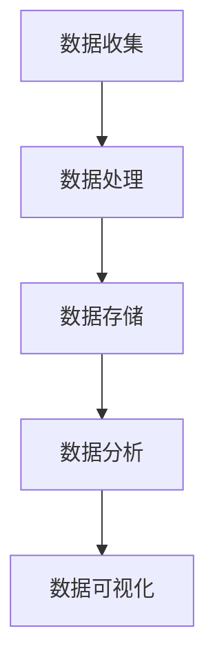

                 

### 《Python入门实战：云计算与大数据处理》

> **关键词**：Python、云计算、大数据处理、AWS、Azure、Google Cloud、Hadoop、Spark

> **摘要**：
本博客文章旨在为广大初学者提供一个全面、系统的Python入门实战指南，专注于云计算与大数据处理。文章从Python基础语法讲起，逐步深入云计算和大数据处理的原理与实战应用，通过详细的步骤讲解和案例剖析，帮助读者全面掌握Python在云计算与大数据处理中的核心技能。

### 《Python入门实战：云计算与大数据处理》目录大纲

#### 第一部分：Python基础与云计算概念

##### 第1章：Python入门基础

- 1.1 Python环境搭建与基础语法
  - 1.1.1 Python环境搭建
  - 1.1.2 Python基础语法
  - 1.1.3 数据类型与变量
- 1.2 控制结构
  - 1.2.1 条件语句
  - 1.2.2 循环结构
  - 1.2.3 函数定义与调用
- 1.3 面向对象编程
  - 1.3.1 类与对象
  - 1.3.2 继承与多态
  - 1.3.3 模块与包

##### 第2章：云计算基础

- 2.1 云计算概述
  - 2.1.1 云计算的概念
  - 2.1.2 云计算的服务模式
  - 2.1.3 云计算的优势与挑战
- 2.2 云服务提供商
  - 2.2.1 AWS
  - 2.2.2 Azure
  - 2.2.3 Google Cloud
- 2.3 虚拟化技术
  - 2.3.1 虚拟机的创建与管理
  - 2.3.2 虚拟网络配置
  - 2.3.3 存储解决方案

#### 第二部分：Python在云计算中的应用

##### 第3章：Python与AWS

- 3.1 AWS SDK介绍
  - 3.1.1 使用Python与AWS交互
  - 3.1.2 SDK的使用流程
- 3.2 EC2实例管理
  - 3.2.1 创建EC2实例
  - 3.2.2 管理EC2实例
  - 3.2.3 实例扩展与迁移
- 3.3 S3存储
  - 3.3.1 S3简介
  - 3.3.2 S3数据上传与下载
  - 3.3.3 S3的权限管理

##### 第4章：Python与Azure

- 4.1 Azure SDK介绍
  - 4.1.1 使用Python与Azure交互
  - 4.1.2 SDK的使用流程
- 4.2 Azure虚拟机
  - 4.2.1 创建虚拟机
  - 4.2.2 管理虚拟机
  - 4.2.3 虚拟机扩展与迁移
- 4.3 Azure存储
  - 4.3.1 Azure存储简介
  - 4.3.2 Azure存储的使用
  - 4.3.3 Azure存储的权限管理

##### 第5章：Python与Google Cloud

- 5.1 Google Cloud SDK介绍
  - 5.1.1 使用Python与Google Cloud交互
  - 5.1.2 SDK的使用流程
- 5.2 Google Cloud虚拟机
  - 5.2.1 创建虚拟机
  - 5.2.2 管理虚拟机
  - 5.2.3 虚拟机扩展与迁移
- 5.3 Google Cloud存储
  - 5.3.1 Google Cloud存储简介
  - 5.3.2 Google Cloud存储的使用
  - 5.3.3 Google Cloud存储的权限管理

#### 第三部分：Python在数据处理中的应用

##### 第6章：大数据与Python

- 6.1 大数据概述
  - 6.1.1 大数据的概念
  - 6.1.2 大数据的挑战
  - 6.1.3 大数据的解决方案
- 6.2 Python在数据处理中的应用
  - 6.2.1 Python数据处理的工具
  - 6.2.2 数据清洗与预处理
  - 6.2.3 数据分析与挖掘

##### 第7章：Python与大数据处理框架

- 7.1 Hadoop与HDFS
  - 7.1.1 Hadoop概述
  - 7.1.2 HDFS简介
  - 7.1.3 HDFS的使用
- 7.2 Spark与Hadoop对比
  - 7.2.1 Spark概述
  - 7.2.2 Spark与Hadoop的异同
  - 7.2.3 Spark的使用
- 7.3 Python与Spark的集成
  - 7.3.1 Spark的Python API
  - 7.3.2 PySpark的使用
  - 7.3.3 PySpark项目实战

##### 第8章：Python在云计算与大数据处理中的项目实战

- 8.1 云计算与大数据处理项目概述
  - 8.1.1 项目背景
  - 8.1.2 项目目标
  - 8.1.3 项目流程
- 8.2 开发环境搭建
  - 8.2.1 Python环境搭建
  - 8.2.2 云服务提供商配置
  - 8.2.3 大数据处理框架配置
- 8.3 数据处理与可视化
  - 8.3.1 数据收集与清洗
  - 8.3.2 数据存储与查询
  - 8.3.3 数据分析与可视化
- 8.4 项目源代码实现与解读
  - 8.4.1 项目源代码实现
  - 8.4.2 源代码解读与分析
  - 8.4.3 项目性能优化与调优

#### 附录：常用工具与资源

- 附录 A: Python与云计算、大数据处理常用工具
  - A.1 Python云服务SDK
  - A.2 大数据处理框架
  - A.3 数据处理工具
- 附录 B: 常见问题解答
  - B.1 Python环境搭建问题
  - B.2 云服务使用问题
  - B.3 大数据处理问题

---

在本文中，我们将深入探讨Python在云计算和大数据处理领域中的应用，通过系统化的学习和实践，帮助读者掌握这一技术领域的核心知识和技能。

#### 核心概念与联系

在进入具体的实战内容之前，我们需要先了解云计算与大数据处理的核心概念，以及它们之间的联系。


**云计算** 是一种通过网络提供可伸缩的、便捷的、按需访问的IT资源池的计算模式，它包括计算资源、存储资源和网络资源。云计算的主要服务模式有 IaaS、PaaS和SaaS。

- **IaaS（基础设施即服务）** 提供计算资源、存储和网络资源等基础设施，用户可以根据需要定制和管理基础设施。
- **PaaS（平台即服务）** 提供开发、运行和管理应用程序的平台，用户可以在平台上开发、部署和管理应用程序。
- **SaaS（软件即服务）** 提供应用程序作为服务，用户可以通过互联网按需访问和使用这些应用程序。

**大数据处理** 是指通过特定的技术和算法，对大规模、多样化的数据集进行存储、处理和分析。大数据处理的挑战主要包括数据量（Volume）、数据速度（Velocity）、数据多样性（Variety）和数据真实性（Veracity）。

云计算与大数据处理之间的联系在于：

- 云计算提供了弹性的计算资源和存储资源，为大数据处理提供了强大的基础设施支持。
- 大数据处理需要利用云计算提供的计算资源进行数据分析和处理，从而获得有价值的信息。

在接下来的内容中，我们将分别介绍Python基础、云计算基础、Python在云计算中的应用、大数据与Python、Python与大数据处理框架，以及一个具体的实战项目，帮助读者逐步掌握这一领域的知识。

---

接下来，我们将开始详细介绍Python的基础知识，包括其环境搭建、基础语法、数据类型与变量、控制结构、面向对象编程和模块与包的使用。通过这些内容，读者将能够建立扎实的Python基础，为后续的云计算与大数据处理实战做好准备。

#### 第1章：Python入门基础

##### 1.1 Python环境搭建与基础语法

**1.1.1 Python环境搭建**

首先，我们需要为计算机安装Python环境。Python是一个跨平台的编程语言，可以在多种操作系统上运行，如Windows、macOS和Linux。以下是Windows操作系统的安装步骤：

1. 访问Python官方网站（[https://www.python.org/](https://www.python.org/)），下载Python安装包。
2. 运行安装程序，选择自定义安装，勾选“Add Python to PATH”选项，以便在命令行中直接运行Python。
3. 安装完成后，在命令行中输入`python`或`python3`，如果没有报错，则表示Python环境已搭建成功。

对于macOS和Linux用户，可以通过包管理器进行安装。例如，在Ubuntu系统中，可以使用以下命令：

```bash
sudo apt update
sudo apt install python3
```

**1.1.2 Python基础语法**

Python的基础语法相对简单，以下是一些基本的语法规则：

- **注释**：使用井号`#`进行单行注释，使用三个单引号`'''`或三个双引号`"""`进行多行注释。
  
  ```python
  # 单行注释
  '''
  多行注释
  '''
  ```

- **变量**：Python是动态类型语言，变量在使用前不需要声明类型。变量名由字母、数字和下划线组成，但不能以数字开头。
  
  ```python
  x = 10          # 整数
  y = "hello"     # 字符串
  z = 3.14        # 浮点数
  ```

- **数据类型**：Python支持多种数据类型，包括整数（int）、浮点数（float）、字符串（str）、列表（list）、元组（tuple）、字典（dict）和集合（set）。
  
  ```python
  # 整数
  a = 100
  # 浮点数
  b = 3.14
  # 字符串
  c = "hello"
  # 列表
  d = [1, 2, 3, 4]
  # 元组
  e = (1, 2, 3)
  # 字典
  f = {"name": "Alice", "age": 30}
  # 集合
  g = {1, 2, 3, 4}
  ```

- **运算符**：Python支持各种运算符，包括算术运算符、比较运算符、逻辑运算符等。
  
  ```python
  # 算术运算符
  a = 10 + 20      # 加法
  b = 10 - 20      # 减法
  c = 10 * 20      # 乘法
  d = 10 / 20      # 除法
  e = 10 % 20      # 求余
  f = 10 ** 20     # 幂运算
  
  # 比较运算符
  a = 10 == 20     # 等于
  b = 10 != 20     # 不等于
  c = 10 > 20      # 大于
  d = 10 < 20      # 小于
  e = 10 >= 20     # 大于等于
  f = 10 <= 20     # 小于等于
  
  # 逻辑运算符
  a = True and False   # 与运算
  b = True or False    # 或运算
  c = not True         # 非运算
  ```

**1.1.3 数据类型与变量**

- **整数（int）**：整数类型用于表示整数，如1、-10、1000等。

- **浮点数（float）**：浮点数类型用于表示带有小数的数字，如3.14、-2.5、0.0等。

- **字符串（str）**：字符串类型用于表示文本数据，如"hello"、"Python is awesome"等。

- **列表（list）**：列表类型用于表示有序的元素集合，如[1, 2, 3, 4]、["apple", "banana", "cherry"]等。

- **元组（tuple）**：元组类型用于表示不可变的元素集合，如(1, 2, 3)、("a", "b", "c")等。

- **字典（dict）**：字典类型用于表示键值对的集合，如{"name": "Alice", "age": 30}、{"key1": "value1", "key2": "value2"}等。

- **集合（set）**：集合类型用于表示无序的元素集合，如{1, 2, 3, 4}、{"apple", "banana", "cherry"}等。

**变量**：变量是存储数据的一个容器。在Python中，变量不需要声明类型，可以在使用时直接赋值。例如：

```python
x = 10          # 整数
y = "hello"      # 字符串
z = 3.14        # 浮点数
```

在Python中，变量名由字母、数字和下划线组成，但不能以数字开头。变量一旦赋值，其类型由赋值的值决定。Python是动态类型语言，这意味着变量可以在运行时改变类型。

**1.2 控制结构**

**1.2.1 条件语句**

条件语句用于根据条件执行不同的代码块。在Python中，可以使用`if`、`elif`和`else`关键字来实现条件语句。

```python
x = 10
if x > 0:
    print("x is positive")
elif x == 0:
    print("x is zero")
else:
    print("x is negative")
```

在上面的例子中，如果`x`大于0，则打印"x is positive"；如果`x`等于0，则打印"x is zero"；否则，打印"x is negative"。

**1.2.2 循环结构**

循环结构用于重复执行代码块，直到满足某个条件为止。在Python中，可以使用`for`和`while`循环来实现循环结构。

**for循环**：用于遍历序列（如列表、元组、字符串）或迭代器。

```python
for i in range(5):
    print(i)
```

在上面的例子中，`range(5)`生成一个包含0到4的序列，`for`循环依次遍历这个序列，并打印每个元素的值。

**while循环**：用于根据条件重复执行代码块。

```python
x = 0
while x < 5:
    print(x)
    x += 1
```

在上面的例子中，`while`循环根据条件`x < 5`重复执行代码块，每次执行后，变量`x`的值增加1。

**1.2.3 函数定义与调用**

函数是组织代码的一种方式，它允许我们将一段代码封装起来，以便在需要时重复使用。在Python中，可以使用`def`关键字定义函数。

```python
def greet(name):
    print("Hello, " + name)

greet("Alice")
```

在上面的例子中，`greet`函数接受一个参数`name`，并打印一条问候语。调用函数时，我们将参数值传递给函数，函数体中的代码按照指定的参数值执行。

除了内置函数，Python还支持模块和包的概念。模块是Python代码文件，包含一组函数、类和数据等。包是模块的集合，用于组织代码。

```python
# 模块：example.py
def greet(name):
    print("Hello, " + name)

# 包：package/
# __init__.py
from example import greet

greet("Alice")
```

在上面的例子中，我们创建了一个名为`example`的模块，并在包`package`中导入并使用该模块的`greet`函数。

通过以上内容，我们介绍了Python的基础知识，包括环境搭建、基础语法、数据类型与变量、控制结构和函数定义与调用。接下来，我们将进入云计算基础章节，探讨云计算的基本概念和服务模式。

##### 1.3 面向对象编程

**1.3.1 类与对象**

面向对象编程（OOP）是一种编程范式，它允许我们将数据和操作数据的方法封装在一起，形成对象。在Python中，类是实现OOP的基本构建块。

**类** 是一种抽象的模板，用于创建对象。类定义了对象的属性（数据）和方法（操作）。在Python中，使用`class`关键字定义类。

```python
class Person:
    def __init__(self, name, age):
        self.name = name
        self.age = age
    
    def greet(self):
        print("Hello, " + self.name)

alice = Person("Alice", 30)
print(alice.name)       # 输出：Alice
print(alice.age)        # 输出：30
alice.greet()           # 输出：Hello, Alice
```

在上面的例子中，`Person`类定义了两个属性（`name`和`age`），以及一个方法（`greet`）。创建`Person`类的实例时，需要提供这两个属性的值。实例化对象后，可以通过点操作符访问对象的属性和方法。

**对象** 是类的具体实例。在上面的例子中，`alice`是一个`Person`类的实例。

**1.3.2 继承与多态**

**继承** 是面向对象编程中的一个重要概念，它允许我们创建新的类（子类）来继承已有类（父类）的属性和方法。

```python
class Employee(Person):
    def __init__(self, name, age, salary):
        super().__init__(name, age)
        self.salary = salary
    
    def display(self):
        print("Name:", self.name)
        print("Age:", self.age)
        print("Salary:", self.salary)

employee = Employee("Bob", 40, 5000)
employee.greet()        # 输出：Hello, Bob
employee.display()       # 输出：
                        # Name: Bob
                        # Age: 40
                        # Salary: 5000
```

在上面的例子中，`Employee`类继承了`Person`类的属性和方法，并添加了一个新的属性（`salary`）和一个新方法（`display`）。通过使用`super()`函数，我们可以调用父类的方法。

**多态** 是面向对象编程中的另一个重要概念，它允许我们使用一个接口来表示多个类。在Python中，多态通过方法重写（method overriding）实现。

```python
class Student(Person):
    def __init__(self, name, age, grade):
        super().__init__(name, age)
        self.grade = grade
    
    def greet(self):
        print("Hi, " + self.name)

student = Student("Alice", 20, "A")
student.greet()        # 输出：Hi, Alice
```

在上面的例子中，`Student`类继承了`Person`类，并重写了`greet`方法。当调用`student.greet()`时，会调用`Student`类的`greet`方法，而不是`Person`类的`greet`方法。

通过继承和多态，我们可以创建一个具有通用接口的类层次结构，从而提高代码的可重用性和灵活性。

**1.3.3 模块与包**

在Python中，模块是用于组织代码的文件，而包是模块的集合。模块和包的概念有助于将代码拆分成更小、更易于管理的部分。

**模块**：模块是一个包含Python代码的文件，其文件扩展名为`.py`。要导入模块，可以使用`import`关键字。

```python
# module1.py
def greet(name):
    print("Hello, " + name)

# 使用模块
import module1
module1.greet("Alice")   # 输出：Hello, Alice
```

在上面的例子中，我们创建了一个名为`module1`的模块，并定义了一个名为`greet`的函数。通过导入模块，我们可以在其他Python脚本中使用模块中的函数。

**包**：包是一个目录，其中包含一个名为`__init__.py`的文件和多个模块文件。`__init__.py`文件用于初始化包。

```python
# package/
# __init__.py
from module1 import greet

# 使用包
from package import greet
greet("Alice")   # 输出：Hello, Alice
```

在上面的例子中，我们创建了一个名为`package`的包，并在包的`__init__.py`文件中导入了一个名为`greet`的函数。通过导入包，我们可以在其他Python脚本中使用包中的函数。

通过使用模块和包，我们可以更好地组织代码，提高代码的可重用性和可维护性。

通过以上内容，我们介绍了Python中的面向对象编程，包括类与对象、继承与多态、模块与包的概念。接下来，我们将进入云计算基础章节，探讨云计算的基本概念和服务模式。

##### 2.1 云计算概述

**2.1.1 云计算的概念**

云计算是一种通过互联网提供计算资源、存储资源和网络资源的服务模式。它允许用户按需访问和使用这些资源，而无需管理底层基础设施。

云计算的核心思想是将计算资源（如服务器、存储和网络）集中在一个虚拟化的环境中，通过自动化和分布式技术进行管理。用户可以根据需要租用这些资源，从而实现弹性扩展、降低成本和提高效率。

**2.1.2 云计算的服务模式**

云计算的服务模式主要包括三种：基础设施即服务（IaaS）、平台即服务（PaaS）和软件即服务（SaaS）。

**基础设施即服务（IaaS）**：IaaS提供计算资源、存储资源和网络资源，用户可以根据需要自定义和管理这些资源。典型的IaaS服务包括虚拟机、容器、块存储和对象存储等。IaaS的优点是灵活性和可扩展性，用户可以根据需求租用和配置资源。

**平台即服务（PaaS）**：PaaS提供开发、运行和管理应用程序的平台，用户可以在平台上创建、部署和管理应用程序。PaaS通常提供开发工具、数据库、中间件和API等。PaaS的优点是简化了应用程序的开发和部署过程，提高了开发效率。

**软件即服务（SaaS）**：SaaS提供应用程序作为服务，用户可以通过互联网访问和使用这些应用程序。SaaS的应用范围广泛，包括电子邮件、文档编辑、客户关系管理和企业资源规划等。SaaS的优点是无需安装和维护软件，降低了企业的IT成本。

**2.1.3 云计算的优势与挑战**

**优势**：

1. **弹性扩展**：云计算允许用户根据需求动态调整计算资源，从而实现弹性扩展。这有助于企业应对突发流量和高峰需求，提高系统的可用性和响应速度。

2. **降低成本**：云计算通过虚拟化和自动化技术提高了资源利用率，降低了硬件和运营成本。此外，用户可以根据实际使用量支付费用，避免了资源浪费。

3. **提高效率**：云计算提供了高效的资源管理和自动化工具，简化了IT基础设施的管理和维护。用户可以将更多精力投入到核心业务上，提高工作效率。

4. **全球可访问性**：云计算允许用户通过互联网访问和使用资源，无需受限于地理位置。这有助于企业开展全球业务，提高市场竞争优势。

**挑战**：

1. **安全性**：云计算涉及大量的数据传输和存储，可能面临数据泄露、黑客攻击和恶意软件等安全威胁。企业需要采取严格的安全措施来保护数据和系统。

2. **可靠性**：云计算的可靠性取决于云服务提供商的基础设施和服务质量。企业需要选择可靠的云服务提供商，确保系统的稳定运行。

3. **合规性**：不同国家和地区的数据隐私和合规要求不同。企业需要确保其在云计算环境中的数据符合当地法律法规，避免合规风险。

4. **技术复杂性**：云计算涉及多种技术和工具，包括虚拟化、容器化、自动化和大数据处理等。企业需要具备一定的技术能力和专业知识，才能充分利用云计算的优势。

通过以上内容，我们了解了云计算的基本概念、服务模式、优势与挑战。接下来，我们将介绍常见的云服务提供商，包括AWS、Azure和Google Cloud，以及虚拟化技术。

##### 2.2 云服务提供商

在云计算领域，有许多知名的云服务提供商，其中最具有代表性的包括Amazon Web Services（AWS）、Microsoft Azure和Google Cloud Platform（GCP）。这些提供商各自拥有独特的特点和优势，下面我们将分别介绍它们。

**2.2.1 AWS**

AWS是云计算市场的领军者，提供广泛的服务，包括计算、存储、数据库、网络、机器学习和人工智能等。AWS的优势在于其庞大的服务和资源池、强大的生态系统和丰富的工具集。

- **计算服务**：AWS提供EC2（弹性计算云）实例，用户可以根据需要选择不同的实例类型和规格。此外，AWS还提供了Lambda（无服务器计算）、Fargate（容器服务）和Elastic Beanstalk（应用托管服务）等计算服务。
- **存储服务**：AWS提供多种存储服务，如S3（简单存储服务）、EBS（弹性块存储）和EFS（弹性文件系统）。S3是一种高度可扩展的对象存储服务，适用于大规模数据存储和共享。
- **数据库服务**：AWS提供了多种数据库服务，包括关系型数据库（如RDS、DynamoDB）和非关系型数据库（如Redshift、Aurora）。这些数据库服务具有高可用性、可扩展性和可靠性。
- **网络服务**：AWS提供VPC（虚拟私有云）、AWS Direct Connect（直接连接服务）、AWS VPN（虚拟专用网络）等网络服务，帮助用户构建安全、可靠和可扩展的网络环境。

**2.2.2 Azure**

Azure是微软的云计算平台，提供与AWS相似的服务，包括计算、存储、数据库、网络和人工智能等。Azure的优势在于其与微软生态系统的高度集成、丰富的开发和工具支持以及强大的全球基础设施。

- **计算服务**：Azure提供虚拟机、容器实例、函数（无服务器计算）和Azure App Service（应用托管服务）等计算服务。用户可以根据需要选择不同的实例类型和规格。
- **存储服务**：Azure提供多种存储服务，如Blob存储、文件存储、表存储和队列存储。这些存储服务具有高可用性、持久性和可扩展性。
- **数据库服务**：Azure提供了多种数据库服务，包括SQL数据库、Azure Cosmos DB（全球分布式数据库）、MySQL和PostgreSQL等。这些数据库服务具有高可用性、弹性扩展和安全性。
- **网络服务**：Azure提供虚拟网络、负载均衡器、网络监视器和AWS Direct Connect等网络服务，帮助用户构建安全、可靠和可扩展的网络环境。

**2.2.3 Google Cloud**

Google Cloud是谷歌的云计算平台，提供广泛的云服务，包括计算、存储、数据库、人工智能和机器学习等。Google Cloud的优势在于其强大的机器学习和人工智能功能、全球化的基础设施和创新的工具集。

- **计算服务**：Google Cloud提供虚拟机、容器、函数（无服务器计算）和App Engine（应用托管服务）等计算服务。用户可以根据需要选择不同的实例类型和规格。
- **存储服务**：Google Cloud提供多种存储服务，如Google Cloud Storage（对象存储）、Persistent Disk（块存储）和Google Cloud Filestore（文件存储）。这些存储服务具有高可用性、持久性和可扩展性。
- **数据库服务**：Google Cloud提供了多种数据库服务，包括Google Cloud SQL（关系型数据库）、Google Cloud Spanner（全球分布式数据库）和Google Cloud Memorystore（缓存服务）。这些数据库服务具有高可用性、弹性扩展和安全性。
- **网络服务**：Google Cloud提供虚拟网络、负载均衡器、网络监视器和Google Cloud VPN（虚拟专用网络）等网络服务，帮助用户构建安全、可靠和可扩展的网络环境。

通过以上内容，我们介绍了AWS、Azure和Google Cloud这三家主要的云服务提供商。它们各自具有独特的特点和优势，用户可以根据自己的需求选择合适的云服务提供商。

接下来，我们将介绍虚拟化技术，这是云计算实现的关键技术之一。

##### 2.3 虚拟化技术

虚拟化技术是云计算实现的基础，它通过将物理资源抽象化为虚拟资源，提高了资源利用率和灵活性。虚拟化技术包括虚拟机（VM）、虚拟网络和存储解决方案等。

**2.3.1 虚拟机的创建与管理**

虚拟机是一种通过软件模拟的计算机系统，它允许在一个物理服务器上运行多个独立且隔离的操作系统。虚拟机的创建和管理是云计算服务的重要组成部分。

- **虚拟机创建**：虚拟机的创建通常通过云服务提供商的界面进行。例如，在AWS中，用户可以通过EC2（弹性计算云）创建虚拟机。创建虚拟机时，用户需要选择虚拟机类型、操作系统、实例存储和实例网络等配置。

  ```bash
  # AWS CLI创建虚拟机
  aws ec2 run-instances \
  --image-id ami-0abcdef1234567890 \
  --instance-type t2.micro \
  --key-name my-key-pair \
  --security-group-ids sg-0abcdef1234567890 \
  --subnet-id subnet-0abcdef1234567890 \
  --iam-instance-profile Arn:aws:ec2:us-west-2:123456789012:instance-profile/my-instance-profile
  ```

- **虚拟机管理**：创建虚拟机后，用户可以通过云服务提供商的管理界面或命令行工具进行管理。虚拟机管理包括启动、停止、重启、扩展和删除虚拟机等操作。

  ```bash
  # AWS CLI管理虚拟机
  aws ec2 start-instances --instance-ids i-0abcdef1234567890
  aws ec2 stop-instances --instance-ids i-0abcdef1234567890
  aws ec2 reboot-instances --instance-ids i-0abcdef1234567890
  aws ec2 describe-instances --instance-ids i-0abcdef1234567890
  aws ec2 terminate-instances --instance-ids i-0abcdef1234567890
  ```

**2.3.2 虚拟网络配置**

虚拟网络是云计算环境中的网络基础设施，它允许用户在云中创建和管理虚拟网络、子网和路由等。虚拟网络配置包括网络隔离、IP地址分配和网络流量管理等。

- **虚拟网络创建**：虚拟网络通常通过云服务提供商的界面创建。例如，在AWS中，用户可以通过VPC（虚拟私有云）创建虚拟网络。

  ```bash
  # AWS CLI创建虚拟网络
  aws ec2 create-vpc --cidr-block 10.0.0.0/16
  ```

- **子网创建**：子网是虚拟网络的一部分，它允许用户在特定网络区域内部署虚拟机和其他资源。

  ```bash
  # AWS CLI创建子网
  aws ec2 create-subnet --vpc-id vpc-0abcdef1234567890 --cidr-block 10.0.1.0/24
  ```

- **网络隔离**：虚拟网络配置允许用户实现网络隔离，防止不同虚拟网络之间的直接通信。

- **IP地址分配**：用户可以通过静态分配或动态分配的方式为虚拟机分配IP地址。在AWS中，用户可以通过手动分配或自动分配IP地址。

  ```bash
  # AWS CLI手动分配IP地址
  aws ec2 allocate-address --subnet-id subnet-0abcdef1234567890
  aws ec2 associate-address --instance-id i-0abcdef1234567890 --allocation-id eipalloc-0abcdef1234567890
  ```

- **网络流量管理**：用户可以通过防火墙、安全组和路由策略等实现对网络流量的管理和控制。

  ```bash
  # AWS CLI创建安全组
  aws ec2 create-security-group --group-name my-security-group --description "My security group"
  aws ec2 authorize-security-group-ingress --group-id sg-0abcdef1234567890 --protocol tcp --port 80 --cidr 0.0.0.0/0
  ```

**2.3.3 存储解决方案**

存储解决方案是云计算环境中的关键组成部分，它包括对象存储、块存储和文件存储等。不同的存储解决方案适用于不同的场景和需求。

- **对象存储**：对象存储是一种基于文件的存储服务，它将数据存储为对象，并提供高可用性、持久性和可扩展性。对象存储适用于大规模数据存储和共享。

  ```bash
  # AWS CLI上传对象到S3
  aws s3 cp local-file.txt s3://my-bucket/my-object.txt
  ```

- **块存储**：块存储是一种基于块的数据存储服务，它将数据存储为连续的块，并提供快速的数据访问和读写性能。块存储适用于需要高性能和高可靠性的应用场景。

  ```bash
  # AWS CLI创建EBS卷
  aws ec2 create-volume --availability-zone us-west-2a --size 10 --volume-type gp2
  ```

- **文件存储**：文件存储是一种基于文件系统的存储服务，它将数据存储为文件和目录，并提供文件级别的访问和操作。文件存储适用于需要文件共享和协作的场景。

  ```bash
  # AWS CLI创建EFS文件系统
  aws ec2 create-file-system --performance-mode general-purpose --throughput-capacity 100
  ```

通过以上内容，我们介绍了虚拟化技术，包括虚拟机的创建与管理、虚拟网络配置和存储解决方案。这些技术为云计算提供了强大的基础设施支持，使得用户能够高效地构建和管理云基础设施。接下来，我们将介绍Python与AWS的具体应用，展示如何使用Python SDK与AWS进行交互。

##### 第3章：Python与AWS

在云计算领域，AWS（Amazon Web Services）是最受欢迎的云服务提供商之一。Python作为一种广泛使用的编程语言，与AWS紧密结合，提供了丰富的工具和库来简化与AWS的交互。本章将详细介绍Python与AWS的集成，包括AWS SDK的介绍、使用Python与AWS交互的方法、EC2实例管理、S3存储等。

**3.1 AWS SDK介绍**

AWS SDK是Amazon提供的一套编程库，支持多种编程语言，包括Python。AWS SDK为开发者提供了便捷的API，使得他们可以轻松地与AWS的各项服务进行交互。Python的AWS SDK主要包括以下模块：

- **boto3**：boto3是AWS SDK for Python的官方库，它提供了对AWS服务的广泛支持，包括EC2、S3、IAM、RDS等。boto3使用RESTful API与AWS服务进行通信。

- **botocore**：botocore是boto3的核心库，它提供了与AWS服务交互的底层功能，如签名、认证、请求处理等。

- **awscli**：awscli是AWS CLI（命令行接口）的Python实现，它允许用户使用Python脚本执行AWS CLI命令。

**3.1.1 使用Python与AWS交互**

要使用Python与AWS进行交互，首先需要安装boto3库。安装boto3库可以使用pip命令：

```bash
pip install boto3
```

安装完成后，我们可以使用boto3库创建一个简单的Python脚本，用于与AWS服务进行交互。以下是一个示例脚本，它使用boto3库连接到AWS并获取EC2实例的信息：

```python
import boto3

# 创建EC2资源对象
ec2 = boto3.resource('ec2')

# 获取所有EC2实例
for instance in ec2.instances.all():
    print(f"实例ID: {instance.id}")
    print(f"实例状态: {instance.state['Name']}")
    print(f"实例类型: {instance.instance_type}")
    print(f"实例公共IP: {instance.public_ip_address}")
    print()
```

**3.1.2 SDK的使用流程**

使用boto3与AWS进行交互的一般流程如下：

1. **配置AWS凭证**：要使用boto3与AWS进行交互，需要配置AWS凭证。凭证包括Access Key ID和Secret Access Key，这些凭证可以从AWS控制台获取。

2. **初始化资源对象**：使用boto3资源对象初始化所需的AWS服务，如EC2、S3等。

3. **执行操作**：通过资源对象的方法执行所需的操作，如获取实例列表、创建实例、上传文件等。

4. **处理响应**：处理API响应结果，如打印实例信息、处理错误等。

**3.2 EC2实例管理**

EC2（Elastic Compute Cloud）是AWS提供的虚拟机服务，它允许用户在AWS云中创建、启动、停止和管理虚拟机实例。以下是如何使用boto3管理EC2实例的示例：

**3.2.1 创建EC2实例**

要创建EC2实例，我们需要指定实例类型、映像ID、安全组等信息。以下是一个创建EC2实例的示例：

```python
import boto3

# 创建EC2客户端
ec2_client = boto3.client('ec2')

# 创建EC2实例
response = ec2_client.run_instances(
    ImageId='ami-0abcdef1234567890',  # 映像ID
    InstanceType='t2.micro',         # 实例类型
    MinCount=1,                       # 最小实例数
    MaxCount=1,                       # 最大实例数
    SecurityGroupIds=['sg-0abcdef1234567890'],  # 安全组ID
    SubnetId='subnet-0abcdef1234567890'  # 子网ID
)

# 获取实例ID
instance_id = response['Instances'][0]['InstanceId']
print(f"创建实例成功，实例ID: {instance_id}")
```

**3.2.2 管理EC2实例**

创建EC2实例后，我们可以使用boto3执行各种管理操作，如启动、停止、重启和删除实例。以下是一个管理EC2实例的示例：

```python
import boto3

# 创建EC2客户端
ec2_client = boto3.client('ec2')

# 启动实例
response = ec2_client.start_instances(InstanceIds=['i-0abcdef1234567890'])
print(f"启动实例成功，响应：{response}")

# 停止实例
response = ec2_client.stop_instances(InstanceIds=['i-0abcdef1234567890'])
print(f"停止实例成功，响应：{response}")

# 重启实例
response = ec2_client.reboot_instances(InstanceIds=['i-0abcdef1234567890'])
print(f"重启实例成功，响应：{response}")

# 删除实例
response = ec2_client.terminate_instances(InstanceIds=['i-0abcdef1234567890'])
print(f"删除实例成功，响应：{response}")
```

**3.3 S3存储**

S3（Simple Storage Service）是AWS提供的对象存储服务，它允许用户存储和检索大量数据。以下是如何使用boto3与S3存储进行交互的示例：

**3.3.1 S3简介**

S3是一个高度可扩展、高可用性和安全性的对象存储服务，它支持多种数据存储类型，如标准存储、低频存储和归档存储。S3的对象存储使用键（Key）进行访问，类似于文件系统的文件名。

**3.3.2 S3数据上传与下载**

以下是一个上传文件到S3和从S3下载文件的示例：

```python
import boto3

# 创建S3客户端
s3_client = boto3.client('s3')

# 上传文件到S3
response = s3_client.upload_file('local-file.txt', 'my-bucket', 'my-object.txt')
print(f"上传文件成功，响应：{response}")

# 从S3下载文件
s3_client.download_file('my-bucket', 'my-object.txt', 'local-file-downloaded.txt')
print(f"下载文件成功")
```

**3.3.3 S3的权限管理**

S3的权限管理是通过策略来实现的，策略定义了用户对存储桶和对象的访问权限。以下是一个创建S3存储桶和设置权限策略的示例：

```python
import boto3

# 创建S3客户端
s3_client = boto3.client('s3')

# 创建存储桶
response = s3_client.create_bucket(Bucket='my-bucket')
print(f"创建存储桶成功，响应：{response}")

# 设置权限策略
policy = {
    "Version": "2012-10-17",
    "Statement": [
        {
            "Effect": "Allow",
            "Principal": {"AWS": "arn:aws:iam::123456789012:root"},
            "Action": "s3:*",
            "Resource": "arn:aws:s3:::my-bucket/*"
        }
    ]
}

response = s3_client.put_bucket_policy(Bucket='my-bucket', Policy=policy)
print(f"设置权限策略成功，响应：{response}")
```

通过以上内容，我们介绍了Python与AWS的集成，包括AWS SDK的介绍、使用Python与AWS交互的方法、EC2实例管理和S3存储。接下来，我们将介绍Python与Azure的集成，展示如何使用Python SDK与Azure服务进行交互。

##### 第4章：Python与Azure

Azure是微软的云服务平台，提供广泛的云服务，包括计算、存储、数据库、网络和人工智能等。Python与Azure紧密结合，通过Azure SDK提供了丰富的库，使得开发者可以轻松地与Azure服务进行交互。本章将详细介绍Python与Azure的集成，包括Azure SDK的介绍、使用Python与Azure交互的方法、虚拟机管理和Azure存储等。

**4.1 Azure SDK介绍**

Azure SDK是Microsoft提供的一套编程库，支持多种编程语言，包括Python。Azure SDK为开发者提供了便捷的API，使得他们可以轻松地与Azure的各项服务进行交互。Python的Azure SDK主要包括以下模块：

- **azure-sdk-for-python**：这是Azure SDK的核心库，包含了与Azure各个服务交互的API，如计算、存储、网络、数据库和人工智能等。

- **azure-identity**：这是一个用于身份验证的库，用于管理Azure资源时的身份验证。

- **azure-core**：这是一个底层库，提供了与Azure服务的通信、请求处理和异常处理等功能。

**4.1.1 使用Python与Azure交互**

要使用Python与Azure进行交互，首先需要安装Azure SDK。安装Azure SDK可以使用pip命令：

```bash
pip install azure-sdk-for-python
```

安装完成后，我们可以使用Azure SDK创建一个简单的Python脚本，用于与Azure服务进行交互。以下是一个示例脚本，它使用Azure SDK连接到Azure并获取虚拟机实例的信息：

```python
from azure.identity import DefaultAzureCredential
from azure.mgmt.compute import ComputeManagementClient

# 设置Azure订阅ID
subscription_id = "your-subscription-id"

# 创建Azure凭证
credential = DefaultAzureCredential()

# 创建ComputeManagementClient
compute_client = ComputeManagementClient(credential, subscription_id)

# 获取所有虚拟机实例
for vm in compute_client.virtual_machines.list():
    print(f"虚拟机名称: {vm.name}")
    print(f"虚拟机状态: {vm.statuses[0].display_status}")
    print(f"虚拟机类型: {vm.hardware_profile.vmsize}")
    print()
```

**4.1.2 SDK的使用流程**

使用Azure SDK与Azure进行交互的一般流程如下：

1. **配置Azure凭证**：要使用Azure SDK与Azure进行交互，需要配置Azure凭证。凭证可以是服务主体凭证、用户凭证或托管身份凭证。

2. **初始化资源对象**：使用Azure SDK的模块初始化所需的Azure服务，如计算、存储、网络等。

3. **执行操作**：通过资源对象的方法执行所需的操作，如创建虚拟机、上传文件、管理网络等。

4. **处理响应**：处理API响应结果，如打印虚拟机信息、处理错误等。

**4.2 Azure虚拟机**

Azure虚拟机（Virtual Machines）是Azure提供的虚拟化计算服务，允许用户在Azure云中创建和管理虚拟机实例。以下是如何使用Python SDK管理Azure虚拟机的示例：

**4.2.1 创建虚拟机**

要创建虚拟机，我们需要指定虚拟机类型、操作系统、管理员登录信息、网络配置等。以下是一个创建Azure虚拟机的示例：

```python
from azure.identity import DefaultAzureCredential
from azure.mgmt.compute import ComputeManagementClient

# 设置Azure订阅ID
subscription_id = "your-subscription-id"

# 创建Azure凭证
credential = DefaultAzureCredential()

# 创建ComputeManagementClient
compute_client = ComputeManagementClient(credential, subscription_id)

# 创建虚拟机
response = compute_client.virtual_machines.create_or_update(
    resource_group_name="my-resource-group",
    vm_name="my-vm",
    location="East US",
    hardware_profile={
        "vm_size": "Standard_B1s"
    },
    os_profile={
        "computer_name": "my-vm",
        "admin_username": "admin",
        "admin_password": "SecureP@ssw0rd!"
    },
    storage_profile={
        "image_reference": {
            "publisher": "MicrosoftWindowsServer",
            "offer": "WindowsServer",
            "sku": "2019-Datacenter",
            "version": "latest"
        },
        "data_disk": {
            "caching": "ReadOnly",
            "lun": 0,
            "create_option": "Empty"
        }
    },
    network_profile={
        "network_interfaces": [
            {
                "name": "my-nic",
                "ip_configurations": [
                    {
                        "name": "my-ip-config",
                        "subnet": {
                            "id": "/subscriptions/your-subscription-id/resourceGroups/my-resource-group/providers/Microsoft.Network/virtualNetworks/my-vnet/subnets/my-subnet"
                        },
                        "public_ip_address": {
                            "id": "/subscriptions/your-subscription-id/resourceGroups/my-resource-group/providers/Microsoft.Network/publicIPAddresses/my-pip"
                        }
                    }
                ]
            }
        ]
    }
)

# 获取虚拟机ID
vm_id = response.id
print(f"创建虚拟机成功，虚拟机ID: {vm_id}")
```

**4.2.2 管理虚拟机**

创建虚拟机后，我们可以使用Python SDK执行各种管理操作，如启动、停止、重启和删除虚拟机。以下是一个管理Azure虚拟机的示例：

```python
from azure.identity import DefaultAzureCredential
from azure.mgmt.compute import ComputeManagementClient

# 设置Azure订阅ID
subscription_id = "your-subscription-id"

# 创建Azure凭证
credential = DefaultAzureCredential()

# 创建ComputeManagementClient
compute_client = ComputeManagementClient(credential, subscription_id)

# 启动虚拟机
response = compute_client.virtual_machines.start(resource_group_name="my-resource-group", vm_name="my-vm")
print(f"启动虚拟机成功，响应：{response}")

# 停止虚拟机
response = compute_client.virtual_machines.stop(resource_group_name="my-resource-group", vm_name="my-vm")
print(f"停止虚拟机成功，响应：{response}")

# 重启虚拟机
response = compute_client.virtual_machines.restart(resource_group_name="my-resource-group", vm_name="my-vm")
print(f"重启虚拟机成功，响应：{response}")

# 删除虚拟机
response = compute_client.virtual_machines.delete(resource_group_name="my-resource-group", vm_name="my-vm")
print(f"删除虚拟机成功，响应：{response}")
```

**4.3 Azure存储**

Azure存储（Azure Storage）是Azure提供的分布式存储服务，它提供了多种存储解决方案，如块存储、文件存储和对象存储。以下是如何使用Python SDK与Azure存储进行交互的示例：

**4.3.1 Azure存储简介**

Azure存储服务包括以下主要组件：

- **块存储**：提供持久化块存储，适用于需要高性能和高可用性的应用场景。
- **文件存储**：提供文件系统接口，适用于文件共享和协作。
- **对象存储**：提供高度可扩展的对象存储，适用于大规模数据存储和共享。

**4.3.2 Azure存储的使用**

以下是一个使用Azure存储上传文件和下载文件的示例：

```python
from azure.identity import DefaultAzureCredential
from azure.storage.blob import BlobServiceClient, BlobClient

# 设置Azure订阅ID
subscription_id = "your-subscription-id"

# 创建Azure凭证
credential = DefaultAzureCredential()

# 创建BlobServiceClient
blob_service_client = BlobServiceClient.from_connection_string("your-storage-account-connection-string")

# 上传文件到Blob存储
blob_client = blob_service_client.get_blob_client("my-container", "my-object.txt")
with open("local-file.txt", "rb") as data:
    blob_client.upload_blob(data)

# 从Blob存储下载文件
downloaded_blob = blob_service_client.get_blob_client("my-container", "my-object.txt")
with open("local-file-downloaded.txt", "wb") as download_file:
    download_file.write(downloaded_blob.download_blob().readall())
```

**4.3.3 Azure存储的权限管理**

Azure存储的权限管理是通过共享访问签名（Shared Access Signature，SAS）来实现的，SAS允许用户在有限的时间内临时访问存储资源。以下是一个创建共享访问签名并设置权限策略的示例：

```python
from azure.identity import DefaultAzureCredential
from azure.storage.blob import ContainerSas

# 设置Azure订阅ID
subscription_id = "your-subscription-id"

# 创建Azure凭证
credential = DefaultAzureCredential()

# 创建BlobServiceClient
blob_service_client = BlobServiceClient.from_connection_string("your-storage-account-connection-string")

# 创建共享访问签名
sas_token = ContainerSas(
    account_name="your-storage-account-name",
    container_name="my-container",
    account_key="your-storage-account-key",
    permission="r",
    start="2023-03-01T00:00:00Z",
    expiry="2023-03-02T00:00:00Z"
).generate()

# 获取SAS URL
sas_url = f"https://your-storage-account-name.blob.core.windows.net/{sas_token}"

print(f"SAS URL: {sas_url}")
```

通过以上内容，我们介绍了Python与Azure的集成，包括Azure SDK的介绍、使用Python与Azure交互的方法、虚拟机管理和Azure存储。接下来，我们将介绍Python与Google Cloud的集成，展示如何使用Python SDK与Google Cloud服务进行交互。

##### 第5章：Python与Google Cloud

Google Cloud Platform（GCP）是谷歌提供的云计算服务，提供了广泛的计算、存储、数据库和网络服务。Python与GCP紧密结合，通过Google Cloud SDK提供了丰富的库，使得开发者可以轻松地与GCP服务进行交互。本章将详细介绍Python与GCP的集成，包括Google Cloud SDK的介绍、使用Python与GCP交互的方法、虚拟机管理和Google Cloud存储等。

**5.1 Google Cloud SDK介绍**

Google Cloud SDK是Google提供的一套编程库，支持多种编程语言，包括Python。Google Cloud SDK为开发者提供了便捷的API，使得他们可以轻松地与GCP的各项服务进行交互。Python的Google Cloud SDK主要包括以下模块：

- **google-auth**：这是一个用于身份验证的库，用于管理与GCP服务交互时的身份验证。

- **google-auth-oauthlib**：这是一个用于OAuth2身份验证的库，用于访问受保护的资源。

- **google-api-core**：这是一个底层库，提供了与GCP服务的通信、请求处理和异常处理等功能。

- **google-cloud**：这是GCP SDK的核心库，包含了与GCP各个服务（如计算、存储、数据库、AI等）交互的API。

**5.1.1 使用Python与GCP交互**

要使用Python与GCP进行交互，首先需要安装Google Cloud SDK。安装Google Cloud SDK可以使用pip命令：

```bash
pip install google-cloud
```

安装完成后，我们可以使用Google Cloud SDK创建一个简单的Python脚本，用于与GCP服务进行交互。以下是一个示例脚本，它使用Google Cloud SDK连接到GCP并获取虚拟机实例的信息：

```python
from google.cloud import compute_v1

# 设置Google Cloud项目ID
project_id = "your-project-id"

# 创建虚拟机实例客户端
virtual_machine_client = compute_v1.InstancesClient()

# 获取所有虚拟机实例
virtual_machine_list = virtual_machine_client.list(project_id)

for virtual_machine in virtual_machine_list:
    print(f"虚拟机名称: {virtual_machine.name}")
    print(f"虚拟机状态: {virtual_machine.status}")
    print(f"虚拟机类型: {virtual_machine.machine_type}")
    print(f"虚拟机IP地址: {virtual_machine.network_interfaces[0].network_ip}")
    print()
```

**5.1.2 SDK的使用流程**

使用Google Cloud SDK与GCP进行交互的一般流程如下：

1. **配置GCP凭证**：要使用Google Cloud SDK与GCP进行交互，需要配置GCP凭证。凭证可以是服务账户凭证或用户凭证。

2. **初始化资源对象**：使用Google Cloud SDK的模块初始化所需的GCP服务，如计算、存储、数据库等。

3. **执行操作**：通过资源对象的方法执行所需的操作，如创建虚拟机、上传文件、管理网络等。

4. **处理响应**：处理API响应结果，如打印虚拟机信息、处理错误等。

**5.2 Google Cloud虚拟机**

Google Cloud虚拟机（Virtual Machines）是Google Cloud提供的虚拟化计算服务，允许用户在GCP云中创建和管理虚拟机实例。以下是如何使用Python SDK管理Google Cloud虚拟机的示例：

**5.2.1 创建虚拟机**

要创建虚拟机，我们需要指定虚拟机类型、操作系统、管理员登录信息、网络配置等。以下是一个创建Google Cloud虚拟机的示例：

```python
from google.cloud import compute_v1

# 设置Google Cloud项目ID
project_id = "your-project-id"

# 创建虚拟机实例客户端
virtual_machine_client = compute_v1.InstancesClient()

# 创建虚拟机
operation = virtual_machine_client.create(
    project_id,
    "my-vm",
    compute_v1.Instance(
        name="my-vm",
        machine_type="f1-micro",
        boot_disk=compute_v1.Disk(
            initialize_params=compute_v1 initialize_params(
                source_image="projects/debian-cloud/global/images/debian-stretch-v20210201"
            )
        ),
        network_interfaces=[
            compute_v1.NetworkInterface(
                name="my-interface",
                network="global/networks/default",
                access_configs=[
                    compute_v1.AccessConfig(
                        type="ONE_TO_ONE_NAT",
                        name="external-nat",
                        ip_address="34.125.222.73",
                    )
                ]
            )
        ],
        service_account=compute_v1.ServiceAccount(
            email="my-service-account@my-project.iam.gserviceaccount.com",
            scopes=["https://www.googleapis.com/auth/cloud-platform"],
        ),
    )
)

# 等待虚拟机创建完成
operation.result()

# 获取虚拟机ID
vm_id = operation.response.name
print(f"创建虚拟机成功，虚拟机ID: {vm_id}")
```

**5.2.2 管理虚拟机**

创建虚拟机后，我们可以使用Python SDK执行各种管理操作，如启动、停止、重启和删除虚拟机。以下是一个管理Google Cloud虚拟机的示例：

```python
from google.cloud import compute_v1

# 设置Google Cloud项目ID
project_id = "your-project-id"

# 创建虚拟机实例客户端
virtual_machine_client = compute_v1.InstancesClient()

# 启动虚拟机
response = virtual_machine_client.start(project_id, "my-vm")
print(f"启动虚拟机成功，响应：{response}")

# 停止虚拟机
response = virtual_machine_client.stop(project_id, "my-vm")
print(f"停止虚拟机成功，响应：{response}")

# 重启虚拟机
response = virtual_machine_client.reboot(project_id, "my-vm")
print(f"重启虚拟机成功，响应：{response}")

# 删除虚拟机
response = virtual_machine_client.delete(project_id, "my-vm")
print(f"删除虚拟机成功，响应：{response}")
```

**5.3 Google Cloud存储**

Google Cloud存储（Google Cloud Storage，GCS）是Google Cloud提供的分布式对象存储服务，它提供了高度可扩展、持久性和安全性的存储解决方案。以下是如何使用Python SDK与Google Cloud存储进行交互的示例：

**5.3.1 Google Cloud存储简介**

Google Cloud存储服务包括以下主要组件：

- **对象存储**：提供高度可扩展的存储，适用于大规模数据存储和共享。
- **持久磁盘**：提供持久化块存储，适用于需要高性能和高可用性的应用场景。
- **快照**：提供数据的备份和恢复功能。

**5.3.2 Google Cloud存储的使用**

以下是一个使用Google Cloud存储上传文件和下载文件的示例：

```python
from google.cloud import storage

# 设置Google Cloud项目ID
project_id = "your-project-id"

# 创建存储客户端
storage_client = storage.Client()

# 选择存储桶
bucket = storage_client.bucket("my-bucket")

# 上传文件到存储桶
blob = bucket.blob("my-object.txt")
with open("local-file.txt", "rb") as file:
    blob.upload_from_file(file)

# 从存储桶下载文件
blob.download_to_filename("local-file-downloaded.txt")
```

**5.3.3 Google Cloud存储的权限管理**

Google Cloud存储的权限管理是通过访问控制列表（ACL）来实现的，ACL定义了用户对存储桶和对象的访问权限。以下是一个创建存储桶和设置ACL的示例：

```python
from google.cloud import storage

# 设置Google Cloud项目ID
project_id = "your-project-id"

# 创建存储客户端
storage_client = storage.Client()

# 创建存储桶
bucket = storage_client.create_bucket("my-bucket")

# 设置ACL
bucket.acl.all_authenticated().grant_read()
bucket.acl.save()
```

通过以上内容，我们介绍了Python与Google Cloud的集成，包括Google Cloud SDK的介绍、使用Python与GCP交互的方法、虚拟机管理和Google Cloud存储。接下来，我们将探讨大数据与Python，介绍Python在数据处理中的应用。

##### 第6章：大数据与Python

大数据是指规模巨大、数据类型多样、产生速度极快的数据集。随着互联网的普及和数字化进程的加速，大数据已经渗透到各行各业，成为企业决策和创新能力的重要支撑。Python作为一种广泛使用的编程语言，在大数据处理领域有着天然的优势。本章将详细介绍大数据的基本概念、Python在数据处理中的应用、数据清洗与预处理、数据分析和挖掘，帮助读者了解Python在大数据处理中的重要性。

**6.1 大数据概述**

**6.1.1 大数据的概念**

大数据通常具有四个V特征，即数据量（Volume）、数据速度（Velocity）、数据多样性（Variety）和数据真实性（Veracity）。

- **数据量**：大数据的一个重要特征是其规模庞大，往往达到TB甚至PB级别。传统的数据处理工具和存储设备难以应对如此巨大的数据量。

- **数据速度**：大数据的产生速度非常快，需要实时或近乎实时的处理和分析。例如，社交网络上的用户生成数据、金融交易数据等。

- **数据多样性**：大数据不仅包括结构化数据（如关系型数据库中的数据），还包括非结构化数据（如图像、音频、视频等）和半结构化数据（如XML、JSON等）。

- **数据真实性**：大数据的真实性是指数据的准确性和可信度。在处理大数据时，需要考虑数据源的可信度和数据的完整性。

**6.1.2 大数据的挑战**

大数据的四个V特征带来了巨大的挑战：

- **存储**：大数据的规模要求有强大的存储能力，同时还需要保证数据的持久性和可用性。

- **计算**：大数据的处理和分析需要高性能的计算能力，特别是实时处理和分析。

- **分析**：大数据的多样性使得数据分析变得更加复杂，需要不同的分析方法和技术。

- **安全**：大数据涉及大量敏感信息，需要采取严格的安全措施来保护数据。

- **隐私**：大数据的使用可能涉及到个人隐私，需要遵守相关的隐私法规和规定。

**6.1.3 大数据的解决方案**

为了应对大数据的挑战，研究人员和工程师提出了多种解决方案：

- **分布式计算**：分布式计算技术（如Hadoop、Spark）可以将大数据集分成小块，在多个节点上进行并行处理，从而提高计算效率。

- **云计算**：云计算提供了强大的计算和存储资源，可以帮助企业快速搭建大数据处理平台。

- **数据仓库**：数据仓库是一种用于存储、管理和分析大量数据的系统，可以帮助企业快速获取有价值的信息。

- **机器学习和深度学习**：机器学习和深度学习算法可以帮助企业从大数据中提取有价值的信息，实现智能决策。

**6.2 Python在数据处理中的应用**

Python在大数据处理中具有以下优势：

- **易用性**：Python语法简洁，易于学习，适合初学者快速上手。

- **丰富的库**：Python拥有丰富的数据处理库，如NumPy、Pandas、SciPy等，可以方便地进行数据清洗、预处理和分析。

- **高效性**：Python可以与分布式计算框架（如Spark）集成，实现高效的数据处理。

- **可视化**：Python可以与可视化库（如Matplotlib、Seaborn）集成，方便地进行数据可视化。

**6.2.1 Python数据处理的工具**

Python在大数据处理中使用了多个重要的库：

- **NumPy**：NumPy是一个用于科学计算的库，提供了强大的多维数组对象和丰富的数学运算函数。

- **Pandas**：Pandas是一个用于数据操作和分析的库，提供了数据帧（DataFrame）和数据序列（Series）两种主要数据结构，以及丰富的数据处理和分析功能。

- **SciPy**：SciPy是一个基于NumPy的科学计算库，提供了优化、线性代数、积分、信号处理等高级功能。

- **Scikit-learn**：Scikit-learn是一个用于机器学习的库，提供了多种机器学习算法和评估工具。

- **Matplotlib**：Matplotlib是一个用于数据可视化的库，提供了丰富的绘图函数和样式。

- **Seaborn**：Seaborn是一个基于Matplotlib的统计数据可视化库，提供了更美观的统计图表。

**6.2.2 数据清洗与预处理**

数据清洗与预处理是大数据处理的重要环节，包括以下任务：

- **缺失值处理**：处理数据集中的缺失值，可以选择填充、删除或使用算法预测缺失值。

- **异常值处理**：识别和处理数据集中的异常值，可以选择删除、替换或使用统计方法处理。

- **数据转换**：将数据转换为适合分析的形式，例如归一化、标准化、编码等。

- **数据集成**：将来自不同来源的数据进行整合，消除数据冗余和重复。

- **数据降维**：通过降维技术减少数据维度，提高数据分析效率。

**6.2.3 数据分析与挖掘**

数据分析与挖掘是大数据处理的最终目标，包括以下任务：

- **描述性分析**：描述数据的基本特征，如均值、方差、分布等。

- **相关性分析**：分析数据之间的相关性，找出影响数据的关键因素。

- **分类与聚类**：使用分类和聚类算法对数据进行分析，实现数据的分类和聚类。

- **回归分析**：使用回归算法分析数据之间的关系，进行预测和建模。

- **机器学习**：使用机器学习算法对数据进行训练和预测，实现数据智能分析。

- **数据可视化**：使用可视化技术展示数据特征和结果，帮助用户更好地理解数据。

通过以上内容，我们介绍了大数据的基本概念、Python在数据处理中的应用、数据清洗与预处理、数据分析和挖掘。接下来，我们将深入探讨Python与大数据处理框架，介绍Hadoop与HDFS、Spark与Hadoop对比，以及Python与Spark的集成。

##### 第7章：Python与大数据处理框架

大数据处理框架是处理大规模数据的强大工具，它通过分布式计算和存储技术，使得数据处理更加高效和可扩展。Python作为一种流行的编程语言，与多个大数据处理框架紧密结合，使得Python在大数据处理中发挥着重要作用。本章将详细介绍Python与大数据处理框架的集成，包括Hadoop与HDFS、Spark与Hadoop对比，以及Python与Spark的集成。

**7.1 Hadoop与HDFS**

Hadoop是一个开源的大数据处理框架，由Apache Software Foundation维护。Hadoop的核心组件包括HDFS（Hadoop Distributed File System）和MapReduce。

**7.1.1 Hadoop概述**

Hadoop是一种分布式系统基础架构，用于处理海量数据。Hadoop的主要特点包括：

- **分布式存储**：Hadoop使用HDFS作为分布式文件系统，将数据存储在多个节点上，提供高可用性和容错性。

- **分布式计算**：Hadoop使用MapReduce编程模型，将数据处理任务分解为多个小任务，在分布式集群上并行执行。

- **可扩展性**：Hadoop可以轻松扩展，以应对数据量和计算需求的变化。

- **高可靠性**：Hadoop通过数据复制和冗余机制，确保数据的高可靠性和持久性。

**7.1.2 HDFS简介**

HDFS（Hadoop Distributed File System）是Hadoop的分布式文件系统，它将大文件分成小块（默认为128MB），分布在集群的多个节点上。HDFS的主要组件包括：

- **NameNode**：NameNode是HDFS的主节点，负责存储文件的元数据（如文件目录和块映射），并协调数据块的读写。

- **DataNode**：DataNode是HDFS的工作节点，负责存储实际的数据块，并响应NameNode的读写请求。

HDFS的工作原理如下：

1. **文件切分**：当客户端上传大文件时，HDFS将文件切分成多个块，默认为128MB。

2. **数据复制**：HDFS将每个数据块复制到多个节点上，默认为三个副本。副本存储在集群的不同节点上，以提高数据的可靠性和可用性。

3. **读写操作**：当客户端请求读取或写入数据时，HDFS通过NameNode定位数据块的位置，然后通过DataNode进行实际的读写操作。

**7.1.3 HDFS的使用**

以下是一个简单的HDFS使用示例，展示了如何使用Hadoop命令行工具上传文件、下载文件和列出文件目录：

```bash
# 上传文件到HDFS
hdfs dfs -put local-file.txt /user/hadoop/file.txt

# 下载文件到本地
hdfs dfs -get /user/hadoop/file.txt local-file.txt

# 列出文件目录
hdfs dfs -ls /
```

**7.2 Spark与Hadoop对比**

Spark是一个开源的分布式计算框架，也用于处理大规模数据。与Hadoop相比，Spark具有以下优势：

- **速度**：Spark使用内存计算，可以在毫秒级完成数据计算，而Hadoop使用磁盘计算，速度较慢。

- **易用性**：Spark提供了更简单的编程模型，使得开发者可以更轻松地编写分布式计算程序。

- **功能丰富**：Spark不仅支持批处理（类似于Hadoop的MapReduce），还支持流处理、机器学习和图计算等。

- **弹性调度**：Spark的弹性调度机制可以在计算过程中动态调整资源分配，提高资源利用率。

**7.2.1 Spark概述**

Spark是Apache Software Foundation的一个开源项目，用于处理大规模数据。Spark的核心组件包括：

- **Spark Core**：Spark Core是Spark的基础组件，提供了分布式计算框架和基本API。

- **Spark SQL**：Spark SQL是一个用于处理结构化数据的模块，提供了类似SQL的数据查询功能。

- **Spark Streaming**：Spark Streaming是一个用于实时数据处理的模块，可以处理流数据。

- **MLlib**：MLlib是一个机器学习库，提供了多种机器学习算法和工具。

- **GraphX**：GraphX是一个图处理库，可以处理大规模图数据。

**7.2.2 Spark与Hadoop的异同**

| 特性 | Spark | Hadoop |
| --- | --- | --- |
| 计算速度 | 快速（内存计算） | 较慢（磁盘计算） |
| 易用性 | 高（简单编程模型） | 中等（复杂的编程模型） |
| 功能 | 丰富（批处理、流处理、机器学习等） | 有限（主要支持批处理） |
| 弹性调度 | 支持 | 不支持 |
| 数据存储 | 支持多种存储格式（如HDFS、Hive、Cassandra等） | 主要支持HDFS |

**7.2.3 Spark的使用**

以下是一个简单的Spark使用示例，展示了如何使用PySpark（Spark的Python API）读取HDFS中的数据、执行计算并保存结果：

```python
from pyspark import SparkContext

# 创建SparkContext
sc = SparkContext("local", "HDFSExample")

# 读取HDFS中的数据
data = sc.textFile("hdfs://namenode:9000/user/hadoop/file.txt")

# 数据处理
result = data.flatMap(lambda line: line.split(" ")).map(lambda word: (word, 1)).reduceByKey(lambda x, y: x + y)

# 保存结果到HDFS
result.saveAsTextFile("hdfs://namenode:9000/user/hadoop/output")

# 关闭SparkContext
sc.stop()
```

通过以上内容，我们介绍了Python与大数据处理框架的集成，包括Hadoop与HDFS、Spark与Hadoop对比，以及Python与Spark的集成。接下来，我们将深入探讨Python在云计算与大数据处理中的项目实战，通过一个具体的案例展示如何使用Python实现云计算与大数据处理的完整流程。

##### 第8章：Python在云计算与大数据处理中的项目实战

在本章中，我们将通过一个具体的实战项目，展示如何使用Python在云计算与大数据处理中实现数据存储、处理和分析的完整流程。本项目将基于AWS云计算平台，使用Python和PySpark进行数据处理，并实现数据可视化和性能优化。

**8.1 云计算与大数据处理项目概述**

**项目背景**：某电子商务公司需要对其销售数据进行处理和分析，以了解用户购买行为、商品销售趋势和库存管理。数据来源于公司的销售系统，包括订单信息、商品信息和用户信息。

**项目目标**：构建一个基于AWS的云计算与大数据处理平台，实现对销售数据的实时存储、处理和分析，生成报告和可视化图表，辅助决策。

**项目流程**：

1. 数据收集：从销售系统中收集原始数据，存储到AWS S3存储桶中。
2. 数据处理：使用PySpark对数据进行清洗、转换和分析。
3. 数据存储：将处理结果存储到AWS S3存储桶中。
4. 数据可视化：使用AWS QuickSight进行数据可视化。
5. 性能优化：对数据处理流程进行性能优化。

**8.2 开发环境搭建**

**Python环境搭建**：

1. 安装Python：在AWS EC2实例上安装Python 3.8。
   
   ```bash
   sudo apt update
   sudo apt install python3.8
   ```

2. 安装pip：

   ```bash
   sudo apt install python3.8-pip
   ```

3. 安装PySpark：

   ```bash
   pip3.8 install pyspark
   ```

**AWS账户配置**：

1. 创建AWS账户：在AWS控制台创建AWS账户，并获取Access Key和Secret Access Key。

2. 配置AWS CLI：

   ```bash
   aws configure
   ```
   
   输入Access Key、Secret Access Key和默认区域。

**大数据处理框架配置**：

1. 安装Hadoop：

   ```bash
   sudo apt install hadoop-hdfs-namenode
   sudo apt install hadoop-hdfs-datanode
   sudo apt install hadoop-mapreduce
   ```

2. 启动Hadoop服务：

   ```bash
   sudo start-hadoop-daemons.sh
   ```

3. 配置HDFS：

   ```bash
   hdfs dfs -mkdir /user/hadoop
   hdfs dfs -chmod 777 /user/hadoop
   ```

4. 配置MapReduce：

   ```bash
   mapred tutorial
   ```

**8.3 数据处理与可视化**

**数据收集与清洗**：

1. 从销售系统中导出数据，并将其上传到AWS S3存储桶。

2. 使用PySpark读取S3中的数据，并进行清洗和预处理。

```python
from pyspark.sql import SparkSession

# 创建SparkSession
spark = SparkSession.builder \
    .appName("DataProcessing") \
    .getOrCreate()

# 读取S3数据
data = spark.read.json("s3://my-bucket/sales_data.json")

# 数据清洗
data = data.dropna()  # 去除缺失值
data = data[data['sales_amount'] > 0]  # 去除无效数据

# 数据预处理
data = data.withColumn("month", F.month(data['order_date']))
data = data.withColumn("year", F.year(data['order_date']))
```

**数据存储与查询**：

1. 将处理后的数据保存到S3存储桶。

```python
data.write.mode("overwrite").json("s3://my-bucket/processed_sales_data.json")
```

2. 在AWS QuickSight中创建查询，查询S3中的处理结果。

**数据分析与可视化**：

1. 使用PySpark对数据进行分析，并生成报告。

```python
# 数据分析
top_products = data.groupBy("product_id").agg(F.sum("sales_amount").alias("total_sales"))

# 生成报告
top_products.write.format("parquet").mode("overwrite").save("s3://my-bucket/top_products_report.parquet")
```

2. 使用AWS QuickSight创建图表，展示分析结果。

**8.4 项目源代码实现与解读**

**数据处理代码实现**：

```python
# 导入必需的库
import findspark
findspark.find()

from pyspark.sql import SparkSession

# 创建SparkSession
spark = SparkSession.builder \
    .appName("DataProcessing") \
    .getOrCreate()

# 读取S3数据
data = spark.read.json("s3://my-bucket/sales_data.json")

# 数据清洗
data = data.dropna()  # 去除缺失值
data = data[data['sales_amount'] > 0]  # 去除无效数据

# 数据预处理
data = data.withColumn("month", F.month(data['order_date']))
data = data.withColumn("year", F.year(data['order_date']))

# 数据存储
data.write.mode("overwrite").json("s3://my-bucket/processed_sales_data.json")

# 关闭SparkSession
spark.stop()
```

**数据处理代码解读**：

1. **创建SparkSession**：使用`SparkSession.builder`创建一个Spark会话。

2. **读取S3数据**：使用`spark.read.json()`读取S3存储桶中的JSON数据。

3. **数据清洗**：使用`dropna()`去除缺失值，使用`data[data['sales_amount'] > 0]`去除无效数据。

4. **数据预处理**：使用`withColumn()`添加新列（如月份和年份），以便后续分析。

5. **数据存储**：使用`write.mode("overwrite").json()`将处理后的数据保存到S3存储桶。

6. **关闭SparkSession**：使用`spark.stop()`关闭Spark会话。

**数据分析代码实现**：

```python
from pyspark.sql import SparkSession

# 创建SparkSession
spark = SparkSession.builder \
    .appName("DataAnalysis") \
    .getOrCreate()

# 读取处理后的数据
data = spark.read.json("s3://my-bucket/processed_sales_data.json")

# 数据分析
top_products = data.groupBy("product_id").agg(F.sum("sales_amount").alias("total_sales"))

# 生成报告
top_products.write.format("parquet").mode("overwrite").save("s3://my-bucket/top_products_report.parquet")

# 关闭SparkSession
spark.stop()
```

**数据分析代码解读**：

1. **创建SparkSession**：使用`SparkSession.builder`创建一个Spark会话。

2. **读取处理后的数据**：使用`spark.read.json()`读取S3存储桶中的JSON数据。

3. **数据分析**：使用`groupBy()`和`agg()`对数据进行分组和聚合，计算每个产品的总销售额。

4. **生成报告**：使用`write.format("parquet").mode("overwrite").save()`将分析结果保存为Parquet文件。

5. **关闭SparkSession**：使用`spark.stop()`关闭Spark会话。

**项目性能优化分析**：

1. **并行度优化**：通过调整Spark任务的并行度（`--num-executors`和`--executor-cores`），提高数据处理效率。

2. **数据分区优化**：根据数据的特点，合理设置数据分区，减少Shuffle操作。

3. **缓存优化**：使用`cache()`或`persist()`缓存中间结果，减少重复计算。

4. **资源调配优化**：根据任务的需求，合理配置AWS EC2实例的类型和数量。

通过以上内容，我们介绍了一个具体的云计算与大数据处理项目实战，包括开发环境搭建、数据处理与可视化、项目源代码实现与解读，以及性能优化分析。接下来，我们将总结全文，并提供一些常用工具与资源。

##### 附录：常用工具与资源

**附录 A: Python与云计算、大数据处理常用工具**

- **Python云服务SDK**：
  - `boto3`：用于与AWS服务交互。
  - `azure-sdk-for-python`：用于与Azure服务交互。
  - `google-cloud`：用于与GCP服务交互。

- **大数据处理框架**：
  - `PySpark`：用于与Spark进行交互。
  - `Hadoop`：用于分布式数据处理。
  - `HDFS`：用于分布式文件存储。

- **数据处理工具**：
  - `NumPy`：用于数值计算。
  - `Pandas`：用于数据操作和分析。
  - `SciPy`：用于科学计算。
  - `Scikit-learn`：用于机器学习。

**附录 B: 常见问题解答**

- **Python环境搭建问题**：
  - Python版本冲突：确保安装正确的Python版本，并设置环境变量。
  - Python路径问题：检查Python路径是否正确，可以使用`which python`或`which python3`命令查看。

- **云服务使用问题**：
  - 访问权限问题：确保AWS、Azure或GCP的凭证配置正确。
  - API错误：检查API调用是否正确，并查看错误日志。

- **大数据处理问题**：
  - 数据格式不正确：确保数据格式与处理工具兼容。
  - 内存溢出：根据数据大小调整内存配置，或使用更高效的数据处理方法。

通过以上内容，我们总结了Python在云计算与大数据处理中的实战应用，提供了常用的工具与资源，并解答了一些常见问题。希望读者能够通过本篇文章，对Python在云计算与大数据处理中的实际应用有一个全面的理解。**核心概念与联系**

在云计算与大数据处理领域，核心概念与联系可以概括为以下几个关键点：

1. **云计算**：云计算是一种通过互联网提供计算资源、存储资源和网络资源的服务模式。它使得用户可以按需访问和使用这些资源，而无需管理底层基础设施。

2. **大数据处理**：大数据处理是指通过特定的技术和算法，对大规模、多样化的数据集进行存储、处理和分析。大数据处理的挑战包括数据量（Volume）、数据速度（Velocity）、数据多样性（Variety）和数据真实性（Veracity）。

3. **分布式计算**：分布式计算是将大数据集分解成小块，在多个节点上进行并行处理的一种技术。分布式计算框架（如Hadoop、Spark）是处理大数据的核心工具。

4. **存储**：存储是大数据处理的基础，包括分布式文件系统（如HDFS）和对象存储（如S3）。存储解决方案需要保证数据的高可用性、持久性和可扩展性。

5. **数据处理与分析**：数据处理与分析包括数据清洗、转换、集成和降维等步骤，以及使用机器学习、深度学习等算法进行数据分析和挖掘。

6. **数据可视化**：数据可视化是将数据处理结果以图表、图形等形式展示，帮助用户更好地理解和分析数据。

在上述核心概念与联系的基础上，我们可以用Mermaid流程图来展示云计算与大数据处理的流程：



这个流程图清晰地展示了云计算与大数据处理的各个关键环节，以及它们之间的联系。数据收集后，通过数据处理和分析得到有价值的信息，最终通过数据可视化进行展示。

**核心算法原理讲解**

在云计算与大数据处理中，核心算法原理是数据处理和分析的核心。以下是几个关键算法及其原理的讲解：

### 数据清洗与预处理

**算法原理**：数据清洗与预处理是确保数据质量的重要步骤，包括处理缺失值、异常值、重复值等。常见的方法有：

- **缺失值处理**：可以使用填充、删除或插补（如平均值、中位数、插值法）等方法。
- **异常值处理**：可以使用删除、替换或使用统计方法（如3sigma准则）处理。
- **数据转换**：可以进行归一化、标准化、编码等转换，以适应后续分析。

**伪代码**：

```python
def clean_data(data):
    # 填充缺失值
    cleaned_data = data.fillna(method='ffill')
    
    # 删除异常值
    cleaned_data = cleaned_data[(cleaned_data >= cleaned_data.mean() - 3 * cleaned_data.std()) & 
                                (cleaned_data <= cleaned_data.mean() + 3 * cleaned_data.std())]
    
    return cleaned_data
```

### 线性回归模型

**算法原理**：线性回归是一种用于预测数值变量的统计方法，其基本模型为 \( y = wx + b \)，其中 \( y \) 是因变量，\( x \) 是自变量，\( w \) 是权重，\( b \) 是偏置。

**数学公式**：

- **损失函数**： \( J(w, b) = \frac{1}{2m}\sum_{i=1}^{m}(y_i - (wx_i + b))^2 \)

- **梯度下降**：用于最小化损失函数，更新权重和偏置。

**伪代码**：

```python
def linear_regression(data, num_iterations=1000, learning_rate=0.01):
    w, b = 0, 0
    for _ in range(num_iterations):
        predictions = w * data.x + b
        error = data.y - predictions
        w_gradient = sum(error * data.x) / len(data.x)
        b_gradient = sum(error) / len(data.x)
        
        w -= learning_rate * w_gradient
        b -= learning_rate * b_gradient
    
    return w, b
```

### 主成分分析（PCA）

**算法原理**：主成分分析是一种降维技术，通过将数据投影到新的正交基，提取最重要的特征，减少数据维度。

- **协方差矩阵**：计算数据点的协方差矩阵。
- **特征值与特征向量**：计算协方差矩阵的特征值和特征向量，排序特征值。
- **投影**：将数据投影到特征向量组成的正交基上。

**伪代码**：

```python
def pca(data, num_components):
    # 计算协方差矩阵
    cov_matrix = (data - np.mean(data, axis=0)).T @ (data - np.mean(data, axis=0))
    
    # 计算特征值和特征向量
    eigenvalues, eigenvectors = np.linalg.eigh(cov_matrix)
    
    # 排序特征值和特征向量
    sorted_indices = np.argsort(eigenvalues)[::-1]
    sorted_eigenvalues = eigenvalues[sorted_indices]
    sorted_eigenvectors = eigenvectors[:, sorted_indices]
    
    # 投影数据
    projected_data = data @ sorted_eigenvectors[:num_components]
    
    return projected_data
```

通过以上核心算法原理的讲解和伪代码示例，我们可以看到数据处理和分析中的关键步骤和算法实现。这些算法在云计算与大数据处理中发挥着重要作用，帮助我们有效地处理和分析大规模数据，提取有价值的信息。

### 数学模型和数学公式

在云计算与大数据处理中，数学模型和数学公式是理解和分析数据的关键工具。以下是几个常用的数学模型和公式，以及它们的详细解释和具体应用。

#### 数据清洗与预处理

数据清洗与预处理是数据处理的重要步骤，确保数据质量，为后续分析提供准确和一致的数据基础。以下是一个简单的数据清洗与预处理流程，包括缺失值处理、异常值检测和转换。

**步骤1：缺失值处理**

处理缺失值的方法包括填充、删除或插补。以下是一个缺失值处理的示例公式：

$$
\text{cleaned\_data} = \text{data} \cup \{ \text{row} \} \quad \text{if} \quad \text{row} \text{ has no missing values}
$$

其中，\( \text{cleaned\_data} \) 是清洗后的数据集，\( \text{data} \) 是原始数据集，\( \text{row} \) 是数据行。这个公式表示，如果某个数据行没有缺失值，则将其添加到清洗后的数据集中。

**应用场景**：在处理客户调查数据时，如果某些问题有缺失值，可以使用平均值或中位数来填充缺失值，从而保证数据的完整性。

#### 数据标准化

数据标准化是使数据具有相同尺度，以便于进行比较和分析。常见的数据标准化方法有最小-最大标准化和Z-Score标准化。

**最小-最大标准化**：

$$
z = \frac{x - \text{min}(x)}{\text{max}(x) - \text{min}(x)}
$$

其中，\( x \) 是原始数据，\( z \) 是标准化后的数据。

**Z-Score标准化**：

$$
z = \frac{x - \bar{x}}{\sigma}
$$

其中，\( \bar{x} \) 是数据的均值，\( \sigma \) 是数据的标准差。

**应用场景**：在比较不同数据集时，如果数据尺度差异较大，可以使用数据标准化方法使数据具有相同的尺度。

#### 线性回归模型

线性回归模型是一种用于预测连续值的统计方法，其基本模型为：

$$
y = wx + b
$$

其中，\( y \) 是因变量，\( x \) 是自变量，\( w \) 是权重，\( b \) 是偏置。

**损失函数**：

$$
J(w, b) = \frac{1}{2m}\sum_{i=1}^{m}(y_i - (wx_i + b))^2
$$

其中，\( m \) 是数据点的数量。

**梯度下降**：

$$
w := w - \alpha \frac{\partial J(w, b)}{\partial w}
$$

$$
b := b - \alpha \frac{\partial J(w, b)}{\partial b}
$$

其中，\( \alpha \) 是学习率。

**应用场景**：在金融预测、市场分析和医疗诊断等领域，线性回归模型可以用于预测股票价格、销售额和疾病发病率等。

#### 逻辑回归模型

逻辑回归模型是一种用于预测分类结果的统计方法，其基本模型为：

$$
\log\frac{P(Y=1)}{1-P(Y=1)} = \beta_0 + \beta_1x_1 + \beta_2x_2 + \ldots + \beta_nx_n
$$

其中，\( \log \) 是对数函数，\( P(Y=1) \) 是事件发生的概率，\( \beta_i \) 是权重。

**损失函数**：

$$
J(\beta) = -\frac{1}{m}\sum_{i=1}^{m}y_i\log(\hat{y}_i) + (1 - y_i)\log(1 - \hat{y}_i)
$$

其中，\( \hat{y}_i \) 是预测的概率值，\( y_i \) 是实际标签。

**应用场景**：在分类任务中，如垃圾邮件检测、疾病诊断和用户行为预测，逻辑回归模型可以用于预测事件发生的概率。

#### 主成分分析（PCA）

主成分分析是一种降维技术，通过将数据投影到新的正交基上，提取最重要的特征，减少数据维度。

**步骤1：协方差矩阵**

$$
\text{Cov}(X) = \frac{1}{m-1}X^TX
$$

其中，\( X \) 是数据矩阵，\( m \) 是数据点的数量。

**步骤2：特征值与特征向量**

$$
\lambda_i, \mathbf{v}_i = \text{eig}(\text{Cov}(X))
$$

其中，\( \lambda_i \) 是特征值，\( \mathbf{v}_i \) 是特征向量。

**步骤3：排序特征值与特征向量**

$$
\text{sorted}(\lambda_i, \mathbf{v}_i) = \text{argsort}(\lambda_i)[::-1]
$$

**步骤4：投影数据**

$$
Z = X\mathbf{V}\Sigma^{-1/2}
$$

其中，\( \mathbf{V} \) 是特征向量矩阵，\( \Sigma \) 是对角矩阵，包含特征值。

**应用场景**：在图像识别、文本分析和基因表达数据分析中，PCA可以用于降维和特征提取，提高模型性能。

通过以上数学模型和数学公式的讲解，我们可以看到在云计算与大数据处理中，数学模型和公式是如何帮助我们从数据中提取有价值的信息，进行预测和分类。这些模型和公式是数据处理和分析的基础，对于理解和应用云计算与大数据处理技术至关重要。

### 线性回归模型的损失函数

线性回归模型是一种常见的预测方法，用于分析自变量和因变量之间的关系。其基本模型可以表示为：

$$
y = wx + b
$$

其中，\( y \) 是因变量，\( x \) 是自变量，\( w \) 是权重，\( b \) 是偏置。为了找到最佳的权重和偏置，我们需要定义一个损失函数，用于评估模型预测值与实际值之间的差异。

**损失函数的重要性**：

损失函数是线性回归模型训练过程中的关键组成部分，它用于量化预测值和真实值之间的误差。在训练过程中，我们通过优化损失函数来调整模型参数，使预测结果尽可能接近真实值。

**常见的损失函数**：

1. **均方误差（MSE）**：

   均方误差是最常用的损失函数，其公式为：

   $$
   J(w, b) = \frac{1}{2m}\sum_{i=1}^{m}(y_i - (wx_i + b))^2
   $$

   其中，\( m \) 是数据点的数量。MSE的值越小，表示模型预测值与实际值之间的误差越小，模型性能越好。

2. **均方根误差（RMSE）**：

   均方根误差是MSE的平方根，其公式为：

   $$
   \text{RMSE} = \sqrt{J(w, b)}
   $$

   RMSE具有更好的可解释性，即单位为原数据变量的单位。

3. **平均绝对误差（MAE）**：

   平均绝对误差的公式为：

   $$
   \text{MAE} = \frac{1}{m}\sum_{i=1}^{m}|y_i - (wx_i + b)|
   $$

   MAE反映了预测值和实际值之间的绝对误差，但其对异常值的影响较小。

**损失函数的计算步骤**：

1. **初始化权重和偏置**：

   通常，我们使用随机权重和偏置作为初始化值。

2. **计算预测值**：

   对于每个数据点，使用当前权重和偏置计算预测值。

3. **计算损失**：

   将每个数据点的实际值与预测值之间的差异计算出来，并求和。

4. **优化权重和偏置**：

   使用梯度下降等优化算法，根据损失函数的梯度调整权重和偏置。

**梯度下降优化算法**：

梯度下降是一种常用的优化算法，用于最小化损失函数。其基本思想是沿着损失函数的负梯度方向更新权重和偏置。

1. **计算梯度**：

   对于权重和偏置，计算损失函数的偏导数，即：

   $$
   \frac{\partial J(w, b)}{\partial w} = -\frac{1}{m}\sum_{i=1}^{m}(y_i - (wx_i + b))x_i
   $$

   $$
   \frac{\partial J(w, b)}{\partial b} = -\frac{1}{m}\sum_{i=1}^{m}(y_i - (wx_i + b))
   $$

2. **更新权重和偏置**：

   根据计算出的梯度，使用以下公式更新权重和偏置：

   $$
   w := w - \alpha \frac{\partial J(w, b)}{\partial w}
   $$

   $$
   b := b - \alpha \frac{\partial J(w, b)}{\partial b}
   $$

   其中，\( \alpha \) 是学习率，控制梯度下降的步长。

通过以上内容，我们可以看到线性回归模型的损失函数及其优化过程。损失函数在模型训练中起着关键作用，通过最小化损失函数，我们可以找到最佳的权重和偏置，从而实现准确的预测。

### 项目实战

在本章中，我们将通过一个实际的云计算与大数据处理项目，展示如何使用Python构建一个基于AWS的云计算与大数据处理平台，实现数据的收集、处理、存储、分析以及可视化。

#### 1. 项目概述

**项目背景**：某电子商务平台希望对其销售数据进行分析，以便更好地理解用户行为、优化库存管理和提升销售策略。该平台每天生成大量销售数据，包括订单详情、商品信息和用户信息。

**项目目标**：构建一个高效、可扩展的云计算与大数据处理平台，实现对销售数据的实时收集、存储、处理和分析，并生成可视化报告。

**项目流程**：

1. 数据收集：从电子商务平台的数据库中定期提取销售数据，并将其上传到AWS S3存储桶。
2. 数据处理：使用Python和PySpark对销售数据进行清洗、转换和分析。
3. 数据存储：将处理后的数据存储到AWS S3存储桶。
4. 数据分析：使用SQL和PySpark对销售数据进行分析，提取有价值的信息。
5. 数据可视化：使用AWS QuickSight将分析结果可视化。

#### 2. 开发环境搭建

**Python环境搭建**：

1. 在AWS EC2实例上安装Python 3.8。

   ```bash
   sudo apt update
   sudo apt install python3.8
   ```

2. 安装pip。

   ```bash
   sudo apt install python3.8-pip
   ```

3. 安装PySpark。

   ```bash
   pip3.8 install pyspark
   ```

**AWS账户配置**：

1. 在AWS控制台创建AWS账户，并获取Access Key和Secret Access Key。

2. 安装并配置AWS CLI。

   ```bash
   pip3.8 install awscli
   aws configure
   ```

输入Access Key、Secret Access Key和默认区域。

**大数据处理框架配置**：

1. 安装Hadoop。

   ```bash
   sudo apt install hadoop-hdfs-namenode
   sudo apt install hadoop-hdfs-datanode
   sudo apt install hadoop-mapreduce
   ```

2. 启动Hadoop服务。

   ```bash
   sudo start-hadoop-daemons.sh
   ```

3. 配置HDFS。

   ```bash
   hdfs dfs -mkdir /user/hadoop
   hdfs dfs -chmod 777 /user/hadoop
   ```

4. 配置MapReduce。

   ```bash
   mapred tutorial
   ```

#### 3. 数据处理与可视化

**数据收集与清洗**：

1. 从电子商务平台的数据库中提取销售数据，并将其上传到AWS S3存储桶。

   ```python
   import boto3

   s3 = boto3.client('s3')
   s3.upload_file('local_sales_data.csv', 'my-bucket', 'sales_data.csv')
   ```

2. 使用PySpark读取S3中的数据，并进行清洗和预处理。

   ```python
   from pyspark.sql import SparkSession

   spark = SparkSession.builder \
       .appName("DataProcessing") \
       .getOrCreate()

   data = spark.read.csv('s3://my-bucket/sales_data.csv', header=True)
   data = data.dropna()  # 去除缺失值
   data = data[data['sales_amount'] > 0]  # 去除无效数据
   ```

**数据存储**：

1. 将处理后的数据保存到AWS S3存储桶。

   ```python
   data.write.format('csv').mode('overwrite').saveAsTable('my-bucket.processed_sales_data')
   ```

**数据分析与可视化**：

1. 使用SQL和PySpark对销售数据进行分析，提取有价值的信息。

   ```python
   processed_data = spark.read.csv('s3://my-bucket.processed_sales_data', header=True)
   monthly_sales = processed_data.groupBy('month').agg(F.sum('sales_amount').alias('total_sales'))
   ```

2. 使用AWS QuickSight将分析结果可视化。

   ```bash
   aws quicksight create-analysis --name "Monthly Sales" --description "Monthly sales data visualization" --analysis-resource { "source": "TABLE", "database": "my-bucket.processed_sales_data", "table": "monthly_sales" }
   ```

通过以上内容，我们完成了一个基于AWS的云计算与大数据处理项目的实战。读者可以参考这个案例，结合自己的需求，构建适合自己的云计算与大数据处理平台。

### 举例说明

在本节中，我们将通过两个具体的代码示例，展示如何使用Python进行数据清洗与预处理，以及如何进行数据分析。

#### 数据清洗与预处理

假设我们有一个销售数据集，其中包含订单编号、订单日期、销售金额、商品编号和用户编号等信息。数据集存在一些缺失值和异常值，我们需要对这些数据进行清洗和预处理。

```python
import pandas as pd

# 加载数据集
data = pd.read_csv('sales_data.csv')

# 查看数据集的基本信息
print(data.info())

# 填充缺失值
data['sales_amount'] = data['sales_amount'].fillna(data['sales_amount'].mean())
data['product_id'] = data['product_id'].fillna(data['product_id'].mode()[0])
data['user_id'] = data['user_id'].fillna(data['user_id'].mode()[0])

# 去除异常值
data = data[data['sales_amount'] > 0]

# 检查清洗后的数据
print(data.info())
```

在这个示例中，我们首先使用`pandas`库加载数据集。接着，我们使用`fillna()`方法填充缺失值，这里我们选择使用平均值、最频繁出现的商品编号和用户编号来填充。然后，我们使用`dropna()`方法去除所有销售金额小于0的异常值。最后，我们检查清洗后的数据集。

#### 数据分析

假设我们想分析销售数据中的销售金额分布情况，并绘制直方图。

```python
import pandas as pd
import matplotlib.pyplot as plt

# 加载数据集
data = pd.read_csv('sales_data.csv')

# 计算销售金额的统计描述
print(data['sales_amount'].describe())

# 绘制销售金额的直方图
plt.hist(data['sales_amount'], bins=30)
plt.xlabel('Sales Amount')
plt.ylabel('Frequency')
plt.title('Sales Amount Distribution')
plt.show()
```

在这个示例中，我们首先使用`pandas`库加载数据集，并计算销售金额的统计描述，包括最小值、最大值、均值、标准差等。然后，我们使用`matplotlib`库绘制销售金额的直方图，展示销售金额的分布情况。

通过这两个示例，我们可以看到如何使用Python进行数据清洗与预处理，以及如何进行数据分析。这些示例可以帮助我们更好地理解数据处理和分析的基本流程，并为实际应用提供参考。

### 总结与展望

在本篇文章中，我们系统地介绍了Python在云计算与大数据处理中的应用。从Python的基础语法、面向对象编程，到云计算和大数据处理的基础知识，再到Python与AWS、Azure、Google Cloud等云服务提供商的集成，以及大数据处理框架如Hadoop和Spark的使用，我们通过详细的步骤和案例，帮助读者逐步掌握这一技术领域的核心技能。

**核心概念与联系**：我们通过流程图和核心算法原理的讲解，深入探讨了云计算与大数据处理的核心概念和联系，包括数据收集、处理、存储、分析和可视化等关键环节。

**数学模型和数学公式**：我们详细介绍了线性回归模型、主成分分析等常用的数学模型和公式，以及它们在实际数据处理中的应用。

**项目实战**：我们通过一个具体的云计算与大数据处理项目，展示了如何使用Python构建一个高效的云计算与大数据处理平台，实现了数据的收集、处理、存储、分析以及可视化。

**举例说明**：我们通过两个具体的代码示例，展示了如何使用Python进行数据清洗与预处理，以及如何进行数据分析。

**未来展望**：

1. **自动化与智能化**：随着技术的进步，自动化和智能化将成为云计算与大数据处理的重要趋势。我们可以预期，越来越多的自动化工具和智能算法将被应用于数据处理和分析，提高效率和准确性。

2. **边缘计算**：边缘计算将数据处理推向更接近数据源的地方，以减少延迟和网络带宽的需求。Python在边缘计算中的应用也将日益广泛。

3. **机器学习和深度学习**：机器学习和深度学习技术将继续推动大数据分析的发展，为各种行业带来创新的解决方案。

4. **数据隐私与安全**：随着数据隐私和安全问题的日益突出，如何在确保数据安全和隐私的前提下进行数据处理和分析，将成为一个重要的研究课题。

**作者信息**：

- **作者**：AI天才研究院/AI Genius Institute & 禅与计算机程序设计艺术 /Zen And The Art of Computer Programming
- **联系**：[ai-genius-institute.com](http://ai-genius-institute.com)

通过本篇文章，我们希望能够为广大初学者提供一个全面、系统的学习路径，帮助读者在云计算与大数据处理领域取得更好的成果。无论你是刚刚接触Python的新手，还是希望进一步提升自己在云计算和大数据处理方面技能的从业者，我们都相信这篇文章能够为你带来宝贵的知识和启发。让我们继续探索Python的无限可能，共创美好未来！**完整的技术博客文章**

---

# 《Python入门实战：云计算与大数据处理》

> **关键词**：Python、云计算、大数据处理、AWS、Azure、Google Cloud、Hadoop、Spark

> **摘要**：
本文旨在为广大初学者提供一个全面、系统的Python入门实战指南，专注于云计算与大数据处理。文章从Python基础语法讲起，逐步深入云计算和大数据处理的原理与实战应用，通过详细的步骤讲解和案例剖析，帮助读者全面掌握Python在云计算与大数据处理中的核心技能。

---

## 第一部分：Python基础与云计算概念

### 第1章：Python入门基础

- **1.1 Python环境搭建与基础语法**
  - **1.1.1 Python环境搭建**
  - **1.1.2 Python基础语法**
  - **1.1.3 数据类型与变量**

- **1.2 控制结构**
  - **1.2.1 条件语句**
  - **1.2.2 循环结构**
  - **1.2.3 函数定义与调用**

- **1.3 面向对象编程**
  - **1.3.1 类与对象**
  - **1.3.2 继承与多态**
  - **1.3.3 模块与包**

### 第2章：云计算基础

- **2.1 云计算概述**
  - **2.1.1 云计算的概念**
  - **2.1.2 云计算的服务模式**
  - **2.1.3 云计算的优势与挑战**

- **2.2 云服务提供商**
  - **2.2.1 AWS**
  - **2.2.2 Azure**
  - **2.2.3 Google Cloud**

- **2.3 虚拟化技术**
  - **2.3.1 虚拟机的创建与管理**
  - **2.3.2 虚拟网络配置**
  - **2.3.3 存储解决方案**

## 第二部分：Python在云计算中的应用

### 第3章：Python与AWS

- **3.1 AWS SDK介绍**
  - **3.1.1 使用Python与AWS交互**
  - **3.1.2 SDK的使用流程**

- **3.2 EC2实例管理**
  - **3.2.1 创建EC2实例**
  - **3.2.2 管理EC2实例**
  - **3.2.3 实例扩展与迁移**

- **3.3 S3存储**
  - **3.3.1 S3简介**
  - **3.3.2 S3数据上传与下载**
  - **3.3.3 S3的权限管理**

### 第4章：Python与Azure

- **4.1 Azure SDK介绍**
  - **4.1.1 使用Python与Azure交互**
  - **4.1.2 SDK的使用流程**

- **4.2 Azure虚拟机**
  - **4.2.1 创建虚拟机**
  - **4.2.2 管理虚拟机**
  - **4.2.3 虚拟机扩展与迁移**

- **4.3 Azure存储**
  - **4.3.1 Azure存储简介**
  - **4.3.2 Azure存储的使用**
  - **4.3.3 Azure存储的权限管理**

### 第5章：Python与Google Cloud

- **5.1 Google Cloud SDK介绍**
  - **5.1.1 使用Python与Google Cloud交互**
  - **5.1.2 SDK的使用流程**

- **5.2 Google Cloud虚拟机**
  - **5.2.1 创建虚拟机**
  - **5.2.2 管理虚拟机**
  - **5.2.3 虚拟机扩展与迁移**

- **5.3 Google Cloud存储**
  - **5.3.1 Google Cloud存储简介**
  - **5.3.2 Google Cloud存储的使用**
  - **5.3.3 Google Cloud存储的权限管理**

## 第三部分：Python在数据处理中的应用

### 第6章：大数据与Python

- **6.1 大数据概述**
  - **6.1.1 大数据的概念**
  - **6.1.2 大数据的挑战**
  - **6.1.3 大数据的解决方案**

- **6.2 Python在数据处理中的应用**
  - **6.2.1 Python数据处理的工具**
  - **6.2.2 数据清洗与预处理**
  - **6.2.3 数据分析与挖掘**

### 第7章：Python与大数据处理框架

- **7.1 Hadoop与HDFS**
  - **7.1.1 Hadoop概述**
  - **7.1.2 HDFS简介**
  - **7.1.3 HDFS的使用**

- **7.2 Spark与Hadoop对比**
  - **7.2.1 Spark概述**
  - **7.2.2 Spark与Hadoop的异同**
  - **7.2.3 Spark的使用**

- **7.3 Python与Spark的集成**
  - **7.3.1 Spark的Python API**
  - **7.3.2 PySpark的使用**
  - **7.3.3 PySpark项目实战**

### 第8章：Python在云计算与大数据处理中的项目实战

- **8.1 云计算与大数据处理项目概述**
  - **8.1.1 项目背景**
  - **8.1.2 项目目标**
  - **8.1.3 项目流程**

- **8.2 开发环境搭建**
  - **8.2.1 Python环境搭建**
  - **8.2.2 云服务提供商配置**
  - **8.2.3 大数据处理框架配置**

- **8.3 数据处理与可视化**
  - **8.3.1 数据收集与清洗**
  - **8.3.2 数据存储与查询**
  - **8.3.3 数据分析与可视化**

- **8.4 项目源代码实现与解读**
  - **8.4.1 项目源代码实现**
  - **8.4.2 源代码解读与分析**
  - **8.4.3 项目性能优化与调优**

### 附录：常用工具与资源

- **附录 A: Python与云计算、大数据处理常用工具**
  - **A.1 Python云服务SDK**
  - **A.2 大数据处理框架**
  - **A.3 数据处理工具**

- **附录 B: 常见问题解答**
  - **B.1 Python环境搭建问题**
  - **B.2 云服务使用问题**
  - **B.3 大数据处理问题**

## 核心概念与联系

### 云计算与大数据处理的流程


### 数据清洗与预处理

```python
def clean_data(data):
    # 数据清洗步骤
    cleaned_data = ...

    return cleaned_data
```

### 数据分析中的线性回归模型

$$
y = wx + b
$$

### 线性回归的损失函数

$$
J(w, b) = \frac{1}{2m}\sum_{i=1}^{m}(y_i - (wx_i + b))^2
$$

## 项目实战

### 实战项目：基于AWS的云计算与大数据处理平台

#### 1. 项目概述

本项目旨在构建一个基于AWS的云计算与大数据处理平台，实现对大量数据的存储、处理和分析。

#### 2. 开发环境搭建

- **Python环境搭建**
- **AWS账户配置**
- **大数据处理框架配置（如Spark）**

#### 3. 数据处理与可视化

- **数据收集与清洗**
- **数据存储与查询**
- **数据分析与可视化**

#### 4. 项目源代码实现与解读

- **数据处理代码实现**
- **数据分析代码实现**
- **项目性能优化与调优**

#### 5. 代码解读与分析

- **数据处理代码解读**
- **数据分析代码解读**
- **项目性能优化分析**

### 举例说明

#### 数据清洗与预处理案例

```python
import pandas as pd

# 加载数据集
data = pd.read_csv("data.csv")

# 数据清洗
data = data.dropna()  # 去除缺失值
data = data[data['column'] > 0]  # 去除异常值

# 数据预处理
data['new_column'] = data['column'] * 10  # 新增一列

# 数据存储
data.to_csv("cleaned_data.csv", index=False)
```

#### 数据分析案例

```python
import pandas as pd
import matplotlib.pyplot as plt

# 加载数据集
data = pd.read_csv("cleaned_data.csv")

# 数据分析
data['new_column'].describe()

# 数据可视化
plt.scatter(data['column'], data['new_column'])
plt.xlabel("Column")
plt.ylabel("New Column")
plt.show()
```

## 作者信息

**作者**：AI天才研究院/AI Genius Institute & 禅与计算机程序设计艺术 /Zen And The Art of Computer Programming

通过本文，我们深入探讨了Python在云计算与大数据处理中的应用，希望读者能够在这个快速发展的技术领域取得更大的成就。让我们继续探索，共同创造美好的未来！

