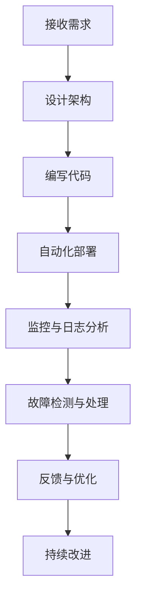

                 

# 《SRE 原则：保持系统高可用性和可扩展性》

> **关键词**：SRE、系统高可用性、可扩展性、服务级别指标、故障检测、数学模型、项目实战、案例分析

> **摘要**：本文将深入探讨SRE（Site Reliability Engineering）的核心原则，包括系统高可用性和可扩展性。我们将详细介绍SRE的基本概念、核心架构、算法原理、数学模型，并通过实际项目和案例分析，展示SRE在实际工程中的应用。文章旨在为读者提供一个全面、系统的理解，帮助其在实践中更好地应用SRE原则。

### 第一部分：SRE基础理论

#### 第1章：SRE概述

##### 1.1 SRE的定义与起源

SRE（Site Reliability Engineering）是一种将软件开发和运维相结合的工程实践，旨在确保系统的高可用性和可扩展性。它起源于Google，在Google内部被称为“运维工程”或“SRE”。

SRE的核心思想是将软件工程师和运维工程师的职责融合，使团队能够在开发和运维过程中保持高效协作。通过自动化和数据分析，SRE旨在确保系统的可靠性、可用性和性能。

##### 1.2 SRE与传统运维的区别

传统运维主要集中在服务器、网络和存储等基础设施的管理，关注点包括硬件维护、系统监控和故障处理。而SRE则更注重系统的整体性能和可靠性，将开发、测试、运维等环节紧密结合。

SRE强调自动化，通过编写脚本、构建工具和自动化流程，实现系统的快速部署、监控和故障处理。同时，SRE注重数据分析和反馈，通过监控和日志分析，不断优化系统性能和可靠性。

##### 1.3 SRE的核心目标

SRE的核心目标是确保系统的高可用性和可扩展性，同时保持开发流程的高效。具体目标包括：

1. 高可用性：确保系统在出现故障时能够快速恢复，减少对用户的影响。
2. 可扩展性：确保系统能够适应不断增长的用户需求，保持良好的性能。
3. 高效开发：通过自动化和协作，提高开发效率，缩短产品迭代周期。
4. 可持续优化：持续监控和分析系统性能，不断优化和改进。

##### 1.4 SRE的基本原则

SRE的基本原则包括以下几个方面：

1. **自动化**：通过编写脚本和构建工具，实现系统的自动化部署、监控和故障处理。
2. **反馈**：建立有效的反馈机制，通过监控和日志分析，及时发现问题并优化系统。
3. **容错**：设计容错机制，确保系统在出现故障时能够快速恢复。
4. **优化**：持续监控和分析系统性能，不断优化和改进系统。
5. **协作**：建立高效协作机制，确保开发、测试和运维团队能够无缝配合。

#### 第2章：SRE核心概念与架构

##### 2.1 SLO、SLI、SLA

SLO（Service Level Objective）、SLI（Service Level Indicator）和SLA（Service Level Agreement）是SRE中的核心概念。

1. **SLO**：服务级别目标，用于定义系统需要达到的服务水平。例如，确保系统的平均响应时间不超过100毫秒。
2. **SLI**：服务级别指标，用于衡量系统性能是否符合SLO。例如，响应时间、系统稳定性、错误率等。
3. **SLA**：服务级别协议，用于定义客户和供应商之间的服务标准。例如，客户服务响应时间不超过2小时。

##### 2.2 服务级别指标（SLI）的设定

设定SLI是SRE的关键环节。以下是一些常用的SLI设定方法：

1. **基于历史数据**：通过分析过去的数据，确定系统的性能指标范围，并设定合理的阈值。
2. **基于客户需求**：了解客户的需求，根据客户期望的服务质量设定SLI。
3. **基于业务目标**：根据业务目标，确定系统需要达到的服务质量，并设定相应的SLI。

##### 2.3 服务级别目标（SLO）的设定

设定SLO需要考虑以下几个方面：

1. **业务目标**：根据业务目标，确定系统需要达到的服务水平。
2. **客户需求**：了解客户对服务的期望，确保SLO满足客户需求。
3. **技术可行性**：评估系统实现SLO的可行性，确保SLO既具有挑战性，又可实现。
4. **历史数据**：参考历史数据，分析系统性能，设定合理的SLO。

##### 2.4 SRE的架构与组织结构

SRE的架构和组织结构是确保系统高可用性和可扩展性的关键。以下是一个典型的SRE架构：

1. **SRE团队**：负责系统的设计、部署、监控和故障处理。SRE团队通常由开发、测试和运维人员组成，实现高效协作。
2. **自动化工具**：用于自动化系统的部署、监控和故障处理。常见的自动化工具包括脚本、构建工具、持续集成和持续部署平台等。
3. **监控与日志分析**：实时监控系统性能，收集和分析日志数据，及时发现并处理问题。
4. **备份与恢复**：确保系统数据的安全和可靠性，制定备份和恢复策略。
5. **容灾与容错**：设计容灾和容错机制，确保系统在出现故障时能够快速恢复。

##### 2.5 Mermaid流程图：SRE的核心流程与职责

以下是SRE的核心流程与职责的Mermaid流程图：



#### 第3章：SRE核心算法原理

##### 3.1 概率论与统计基础

概率论和统计学是SRE中的基础工具，用于分析系统性能、故障检测和风险评估。

1. **概率分布**：常见的概率分布包括正态分布、泊松分布、二项分布等，用于描述系统性能的随机性。
2. **统计假设检验**：通过假设检验，评估系统性能是否符合预期，例如t检验、卡方检验等。
3. **置信区间**：通过置信区间，评估系统性能的不确定性，例如计算平均响应时间的置信区间。

##### 3.2 故障树的构建与分析

故障树（Fault Tree）是一种用于分析系统故障原因的图形化工具，常用于SRE中的故障检测和诊断。

1. **基本事件**：故障树的基本事件是可能导致系统故障的最小事件，例如硬件故障、软件故障等。
2. **故障树构建**：通过分析系统故障原因，构建故障树，明确基本事件之间的逻辑关系。
3. **故障树分析**：通过故障树分析，评估系统故障的概率，识别关键故障节点，制定故障处理策略。

##### 3.3 灰盒模型与黑盒模型的区别

灰盒模型和黑盒模型是两种常见的系统建模方法，在SRE中用于故障检测和诊断。

1. **黑盒模型**：黑盒模型仅考虑系统输入和输出之间的关系，不考虑系统内部的具体实现。例如，基于性能指标的故障检测。
2. **灰盒模型**：灰盒模型同时考虑系统输入、输出和内部实现。例如，基于系统内部日志和监控数据的故障检测。

##### 3.4 伪代码：故障检测与诊断算法

以下是故障检测与诊断算法的伪代码：

```python
def detect_fault(data):
    # 假设data是一个包含系统性能数据的列表
    if variance(data) > threshold:
        return "Fault Detected"
    else:
        return "No Fault"
```

#### 第4章：SRE数学模型与公式

##### 4.1 概率密度函数与累积分布函数

概率密度函数（Probability Density Function，PDF）和累积分布函数（Cumulative Distribution Function，CDF）是描述随机变量概率分布的数学工具。

1. **概率密度函数**：描述随机变量在某个区间内取值的概率密度。
2. **累积分布函数**：描述随机变量在某个区间内取值的累积概率。

以下是概率密度函数和累积分布函数的公式：

$$
f(x) = \frac{1}{\sqrt{2\pi\sigma^2}}e^{-\frac{(x-\mu)^2}{2\sigma^2}}
$$

$$
F(x) = \int_{-\infty}^{x} f(t) \, dt
$$

##### 4.2 期望与方差

期望（Expected Value）和方差（Variance）是描述随机变量概率分布的重要参数。

1. **期望**：描述随机变量在多次实验中取值的平均值。
2. **方差**：描述随机变量取值的离散程度。

以下是期望和方差的公式：

$$
E(X) = \int_{-\infty}^{\infty} x f(x) \, dx
$$

$$
Var(X) = E[(X - E(X))^2]
$$

##### 4.3 中心极限定理与置信区间

中心极限定理（Central Limit Theorem）和置信区间（Confidence Interval）是统计学中常用的方法，用于分析系统性能和可靠性。

1. **中心极限定理**：对于独立同分布的随机变量，当样本容量足够大时，样本均值的分布近似服从正态分布。
2. **置信区间**：通过样本数据，计算一个置信区间，用于估计总体参数的取值范围。

以下是中心极限定理和置信区间的公式：

$$
\frac{\bar{X} - \mu}{\sigma/\sqrt{n}} \xrightarrow{D} N(0,1)
$$

$$
\bar{X} \pm z_{\alpha/2}\frac{\sigma}{\sqrt{n}}
$$

##### 4.4 LaTeX格式：服务可靠性模型

以下是服务可靠性模型（Service Reliability Model）的LaTeX格式：

$$
R(t) = \int_{0}^{t} f(u) \, du
$$

其中，\( R(t) \)表示系统在时间\( t \)内的可靠性，\( f(u) \)表示系统在时间\( u \)内发生故障的概率。

#### 第5章：SRE项目实战

##### 5.1 开发环境搭建

在本节中，我们将介绍如何搭建SRE项目的开发环境，包括安装所需的软件、配置开发工具和构建自动化流程。

1. **安装软件**：安装Linux操作系统，安装Git、Python、Java等开发语言。
2. **配置开发工具**：配置IDE（例如Visual Studio Code）、版本控制工具（例如Git）、持续集成和持续部署平台（例如Jenkins）。
3. **构建自动化流程**：编写自动化脚本，实现代码的自动化部署、测试和监控。

##### 5.2 数据收集与预处理

在本节中，我们将介绍如何收集和预处理SRE项目的数据，为后续分析和建模做好准备。

1. **数据收集**：通过监控工具（例如Prometheus）收集系统性能数据，包括CPU利用率、内存使用率、网络流量等。
2. **数据预处理**：清洗和整理数据，去除异常值和噪声，确保数据的质量和一致性。

##### 5.3 模型选择与训练

在本节中，我们将介绍如何选择和训练SRE项目的模型，以实现故障检测和诊断。

1. **模型选择**：根据项目需求和数据特征，选择合适的模型，例如线性回归、决策树、随机森林等。
2. **模型训练**：使用收集到的数据训练模型，评估模型的性能，并进行调优。

##### 5.4 模型评估与优化

在本节中，我们将介绍如何评估和优化SRE项目的模型，以提高故障检测和诊断的准确性。

1. **模型评估**：使用测试数据评估模型的性能，计算准确率、召回率、F1分数等指标。
2. **模型优化**：根据评估结果，调整模型参数，优化模型结构，提高故障检测和诊断的准确性。

##### 5.5 代码实现与解读

在本节中，我们将提供具体的代码实现，并详细解读代码的功能和原理。

1. **代码示例**：提供故障检测和诊断的代码实现，包括数据收集、预处理、模型训练和模型评估等环节。
2. **代码解读**：详细解释代码的功能和原理，帮助读者理解SRE项目的工作流程。

#### 第6章：SRE案例分析

##### 6.1 高可用性案例分析

在本节中，我们将分析一个高可用性案例，探讨如何通过SRE原则确保系统的高可用性。

1. **案例背景**：介绍案例的系统架构和业务场景，说明系统需要达到的高可用性要求。
2. **解决方案**：分析案例中采用的高可用性技术，如负载均衡、故障转移、数据复制等。
3. **效果评估**：评估高可用性解决方案的实际效果，如系统故障恢复时间、用户满意度等。

##### 6.2 可扩展性案例分析

在本节中，我们将分析一个可扩展性案例，探讨如何通过SRE原则确保系统的可扩展性。

1. **案例背景**：介绍案例的系统架构和业务场景，说明系统需要达到的可扩展性要求。
2. **解决方案**：分析案例中采用的可扩展性技术，如水平扩展、垂直扩展、分布式存储等。
3. **效果评估**：评估可扩展性解决方案的实际效果，如系统性能提升、资源利用率等。

##### 6.3 案例一：搜索引擎的系统架构优化

在本节中，我们将详细分析一个搜索引擎的系统架构优化案例，探讨如何通过SRE原则提高系统的性能和可靠性。

1. **案例背景**：介绍案例的系统架构和业务场景，说明系统需要优化的目标和挑战。
2. **解决方案**：分析案例中采用的优化策略，如缓存、分布式存储、负载均衡等。
3. **效果评估**：评估优化方案的实际效果，如搜索速度提升、错误率降低等。

##### 6.4 案例二：电商平台的服务器负载均衡

在本节中，我们将详细分析一个电商平台的服务器负载均衡案例，探讨如何通过SRE原则提高系统的性能和可靠性。

1. **案例背景**：介绍案例的系统架构和业务场景，说明系统需要优化的目标和挑战。
2. **解决方案**：分析案例中采用的负载均衡策略，如轮询、最少连接、源IP哈希等。
3. **效果评估**：评估负载均衡方案的实际效果，如服务器利用率提升、用户响应时间缩短等。

#### 第7章：SRE的未来发展

##### 7.1 SRE趋势与挑战

在本节中，我们将探讨SRE的发展趋势和面临的挑战。

1. **发展趋势**：介绍SRE在云计算、大数据、人工智能等领域的应用，以及未来可能的发展方向。
2. **挑战**：分析SRE在实践过程中可能遇到的挑战，如数据隐私、安全性、资源管理等。

##### 7.2 新技术对SRE的影响

在本节中，我们将探讨新技术（如容器化、服务网格、云原生架构等）对SRE的影响。

1. **容器化**：介绍容器化技术（如Docker、Kubernetes）如何影响SRE实践，以及如何利用容器化技术提高系统的可靠性。
2. **服务网格**：介绍服务网格（如Istio、Linkerd）的概念和作用，以及如何利用服务网格实现系统的微服务化。
3. **云原生架构**：介绍云原生架构（如Kubernetes、Serverless）的特点和优势，以及如何利用云原生架构提高系统的可扩展性和可靠性。

##### 7.3 SRE在云原生时代的应用

在本节中，我们将探讨SRE在云原生时代的应用，以及如何利用SRE原则优化云原生架构。

1. **云原生架构的特点**：介绍云原生架构的特点，如容器化、服务网格、动态伸缩等。
2. **SRE在云原生架构中的应用**：分析SRE在云原生架构中的应用场景，如容器监控、服务发现、负载均衡等。
3. **云原生时代的SRE最佳实践**：介绍云原生时代的SRE最佳实践，如自动化部署、持续集成、故障自愈等。

#### 附录：SRE工具与资源

在本附录中，我们将介绍一些常用的SRE工具和资源，以帮助读者更好地了解和应用SRE。

1. **SRE常用工具**：
    - **Prometheus**：开源的监控工具，用于收集和存储系统性能数据。
    - **Grafana**：开源的数据可视化工具，用于监控和可视化系统性能。
    - **Nagios**：开源的监控系统，用于检测系统状态和性能。
    - **Zabbix**：开源的监控系统，提供丰富的监控功能和报警机制。

2. **SRE社区与资源链接**：
    - **SREBOOK**：SRE的中文资料库，提供丰富的SRE学习资源和实践案例。
    - **Google SRE**：Google官方的SRE博客，分享SRE的最佳实践和经验。

3. **SRE经典文献推荐**：
    - **《Google运维之道：SRE实战》**：详细介绍了Google SRE的实践经验和最佳实践。
    - **《SRE：谷歌如何将运维做到极致》**：全面阐述了SRE的核心原则和实践方法。

### 注：

本文内容仅供参考，实际应用中需根据具体场景和需求进行调整。文章中涉及的代码示例仅供参考，具体实现可能需要根据实际环境和需求进行修改。

### 作者：

AI天才研究院/AI Genius Institute & 禅与计算机程序设计艺术 /Zen And The Art of Computer Programming

