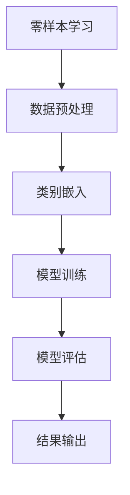
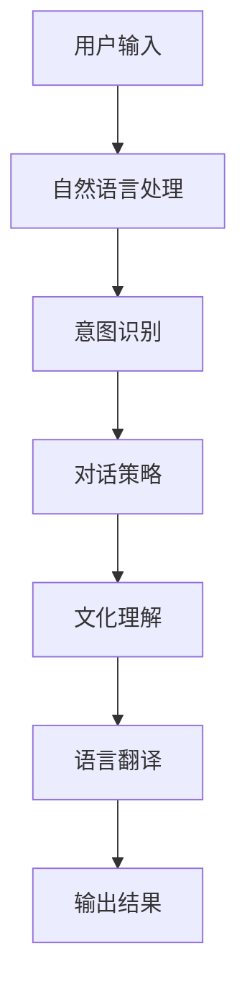

                 

# 《Zero-Shot CoT：AI处理跨文化问题的能力》

## 关键词：
- 零样本学习
- 对话式解释模型
- 跨文化理解
- 文化差异
- AI技术应用

## 摘要：

随着全球化的加速，跨文化交流成为日常生活的常态。然而，文化差异带来的语言障碍、认知差异等问题对人工智能（AI）系统提出了新的挑战。本文将探讨一种新兴的AI处理跨文化问题的能力——零样本学习（Zero-Shot Learning）与对话式解释（CoT）模型的结合。通过详细分析零样本学习的核心算法原理，解释对话式解释模型的工作机制，并展示如何在跨文化应用中实现这两者的融合，本文旨在为解决跨文化AI问题提供新的思路和方法。

### 《Zero-Shot CoT：AI处理跨文化问题的能力》目录大纲

#### 第一部分：背景与核心概念

**第1章：AI与跨文化处理的崛起**

- **1.1 AI技术的跨文化应用概述**
  - 跨文化AI的背景与趋势
  - 跨文化问题的复杂性
- **1.2 零样本学习（Zero-Shot Learning）概念**
  - 零样本学习的定义与优势
  - 零样本学习与跨文化处理的联系
- **1.3 对话式解释（CoT）模型介绍**
  - CoT模型的原理与作用
  - CoT模型在跨文化理解中的应用

**第2章：跨文化理解的挑战**

- **2.1 语言障碍与翻译问题**
  - 语言多样性的挑战
  - 翻译技术的局限性
- **2.2 文化差异的认知难题**
  - 文化敏感性测试
  - 跨文化理解的关键因素
- **2.3 社会背景与历史影响**
  - 社会背景对AI系统的影响
  - 历史遗留问题与跨文化AI

#### 第二部分：核心算法原理与实现

**第3章：零样本学习（Zero-Shot Learning）算法**

- **3.1 基础概念与分类**
  - 零样本学习的分类
  - 零样本学习的基础算法
- **3.2 零样本学习的数学模型**
  - 类别嵌入与映射
  - 模型优化与损失函数
- **3.3 伪代码与算法实现**
  - 伪代码展示
  - 算法流程说明

**第4章：对话式解释（CoT）模型**

- **4.1 CoT模型的基本原理**
  - CoT模型的构建
  - CoT模型的功能与作用
- **4.2 CoT模型的数学模型**
  - CoT的数学公式与推导
  - CoT模型的优化方法
- **4.3 CoT模型的实现与优化**
  - 实现步骤
  - 性能优化策略

#### 第三部分：跨文化AI项目实战

**第5章：跨文化对话系统设计**

- **5.1 跨文化对话系统架构**
  - 系统设计与功能模块
  - 跨文化对话处理流程
- **5.2 数据集准备与标注**
  - 数据集来源与选择
  - 数据标注方法
- **5.3 模型训练与评估**
  - 训练过程与技巧
  - 评估指标与结果分析

**第6章：跨文化推荐系统**

- **6.1 跨文化推荐系统构建**
  - 推荐系统设计原则
  - 推荐算法与跨文化因素
- **6.2 数据处理与特征提取**
  - 数据清洗与处理
  - 特征提取与选择
- **6.3 推荐模型实现与优化**
  - 推荐模型设计与实现
  - 优化策略与效果评估

**第7章：跨文化智能客服系统**

- **7.1 客服系统需求分析**
  - 客服系统功能与场景
  - 跨文化支持的必要性
- **7.2 智能客服架构设计**
  - 系统架构与模块
  - 跨文化处理模块
- **7.3 模型应用与效果评估**
  - 模型应用与实施
  - 实际应用效果分析

#### 第四部分：总结与展望

**第8章：跨文化AI的未来方向**

- **8.1 跨文化AI的发展趋势**
  - 技术趋势与市场前景
  - 跨文化AI的应用领域
- **8.2 零样本学习与CoT的融合**
  - 融合创新的可能性
  - 未来研究方向
- **8.3 跨文化AI的伦理与社会影响**
  - 伦理问题与社会责任
  - 未来发展方向与挑战

### 附录

- **附录A：跨文化AI常用工具与资源**
  - 开发工具介绍
  - 数据集与资源链接
  - 算法优化方法总结

#### Mermaid 流�程图示例



#### 数学模型和数学公式示例

**3.2 零样本学习的数学模型**

$$
\text{类别嵌入} \theta = \text{W}^T \text{X}
$$

其中，$\text{W}$ 为权重矩阵，$\text{X}$ 为输入特征。

**4.2 CoT模型的数学模型**

$$
\text{CoT}(\text{x}) = \text{softmax}(\text{W} \text{H} + \text{b})
$$

其中，$\text{H}$ 为隐藏层输出，$\text{W}$ 和 $\text{b}$ 分别为权重和偏置。

#### 项目实战示例

**6.3 推荐模型实现与优化**

**案例：设计一个跨文化音乐推荐系统**

1. **需求分析**
   - 用户：需要基于其文化背景和喜好推荐音乐
   - 系统：需要理解多种文化背景和音乐类型

2. **开发环境搭建**
   - 使用 Python 作为主要编程语言
   - 使用 TensorFlow 作为深度学习框架
   - 使用 MongoDB 作为数据库存储用户数据和音乐信息

3. **源代码详细实现**
   - **数据预处理**：清洗音乐数据，提取文化特征
   - **模型构建**：使用多任务学习模型进行音乐和文化特征融合
   - **模型训练**：使用交叉验证方法优化模型性能

4. **代码解读与分析**
   - **数据预处理**：代码解析与算法流程
   - **模型构建**：代码解读与模型结构分析
   - **模型训练**：代码实现与训练效果评估

5. **效果评估**
   - 准确率、召回率等指标评估模型性能
   - 用户反馈与系统迭代优化

这样的目录大纲结构既能涵盖核心概念和算法原理，也能展示项目实战的具体实现过程，适合于一本全面介绍零样本学习与跨文化AI处理能力的书籍。

### 第一部分：背景与核心概念

#### 第1章：AI与跨文化处理的崛起

**1.1 AI技术的跨文化应用概述**

随着人工智能技术的快速发展，AI已经渗透到我们日常生活的方方面面。从智能家居、智能客服到自动驾驶、医疗诊断，AI技术正不断改变着我们的生活方式。然而，随着全球化的加速，跨文化交流成为日常生活的常态，这也使得跨文化处理成为AI技术需要解决的重要问题之一。

跨文化AI，顾名思义，是指能够理解和处理不同文化背景下的信息的人工智能系统。这包括语言翻译、文化理解、行为预测等多个方面。例如，一个跨文化AI系统可以帮助跨国公司更好地理解不同市场的消费者需求，从而制定更有效的营销策略；它还可以帮助国际组织更好地处理涉及不同文化背景的沟通和协调问题。

**跨文化问题的复杂性**

跨文化问题具有高度的复杂性和多样性。语言障碍是其中一个主要问题，不同语言之间的词汇、语法和语义差异可能导致误解和沟通障碍。此外，不同文化之间的价值观、信仰和行为规范也存在显著差异，这些差异可能会影响AI系统的决策和行为。例如，在处理涉及宗教或政治话题的对话时，AI系统需要能够理解和尊重不同文化背景下的价值观和信仰。

**跨文化AI的背景与趋势**

近年来，随着AI技术的进步和数据资源的丰富，跨文化AI领域取得了显著进展。例如，神经网络翻译技术使得机器翻译的准确性大幅提高，多语言对话系统能够更好地理解和使用多种语言。同时，深度学习和自然语言处理技术的发展为跨文化AI提供了强大的工具和算法支持。

然而，当前的跨文化AI技术仍存在一些挑战，如如何更好地理解文化背景、如何处理文化差异带来的语言障碍等。因此，跨文化AI的发展仍处于探索阶段，未来还有很大的提升空间。

**1.2 零样本学习（Zero-Shot Learning）概念**

零样本学习（Zero-Shot Learning，ZSL）是一种机器学习方法，它允许模型在没有训练数据的情况下处理从未见过的类别。在传统的机器学习任务中，模型通常需要大量带有标签的训练数据来学习特征并做出预测。然而，在跨文化AI应用中，获取足够量的跨文化数据往往具有挑战性，尤其是当涉及到罕见或未广泛记录的文化背景时。

零样本学习的定义与优势：

- **定义**：零样本学习是指在没有直接训练数据的情况下，模型能够利用已有知识（如预训练模型、通用知识库等）对新的类别进行分类或预测。
- **优势**：
  - **数据高效**：无需大量特定类别的训练数据，从而减少数据收集和标注的成本。
  - **通用性强**：能够处理从未见过的类别，提高模型的泛化能力。
  - **适用于跨文化AI**：可以帮助模型更好地理解不同文化背景下的信息，弥补数据不足的问题。

**零样本学习与跨文化处理的联系**

零样本学习在跨文化AI中的应用具有重要意义。例如，在跨语言翻译中，零样本学习可以帮助模型在没有足够目标语言数据的情况下进行翻译。在跨文化推荐系统中，零样本学习可以基于用户的文化背景和偏好推荐他们可能感兴趣的商品或服务。此外，在跨文化对话系统中，零样本学习可以帮助模型理解并适应用户的文化背景，从而提供更加准确和个性化的服务。

**1.3 对话式解释（CoT）模型介绍**

对话式解释（Conversational Trust Model，CoT）是一种能够通过对话交互理解用户意图和背景信息的人工智能模型。它不仅在自然语言处理领域具有广泛应用，而且在跨文化AI中也展现出巨大的潜力。

**CoT模型的原理与作用**

- **原理**：CoT模型通过对话历史和上下文信息，动态调整对用户意图的理解，从而实现更准确和自然的对话交互。
- **作用**：
  - **意图理解**：帮助AI系统更好地理解用户的意图，从而提供更加精准的服务。
  - **背景信息补充**：通过对话交互获取用户的背景信息，如文化背景、语言偏好等，从而提高跨文化AI的处理能力。

**CoT模型在跨文化理解中的应用**

在跨文化AI中，CoT模型可以发挥重要作用。例如，在跨文化客服系统中，CoT模型可以帮助客服机器人更好地理解来自不同文化背景的用户的问题，并提供相应的解决方案。在跨文化推荐系统中，CoT模型可以基于用户的对话历史和偏好，推荐他们可能感兴趣的文化活动和商品。此外，在跨语言对话系统中，CoT模型可以帮助模型理解并适应用户的语言背景，从而提供更加流畅和自然的跨语言对话体验。

### 第二部分：核心算法原理与实现

#### 第3章：零样本学习（Zero-Shot Learning）算法

**3.1 基础概念与分类**

零样本学习（Zero-Shot Learning，ZSL）是一种机器学习方法，它允许模型在没有直接训练数据的情况下处理从未见过的类别。零样本学习的关键在于利用已有知识（如预训练模型、通用知识库等）来预测新的类别。

**分类**

零样本学习可以分为以下几种类型：

- **基于原型的方法**：将新类别视为已有类别的线性组合，通过找到合适的线性组合来预测新类别的特征。
- **基于关系的方法**：利用类别之间的关系来预测新类别的特征。这些关系可以是基于知识库中的语义关系或基于数据集上的统计关系。
- **基于元学习的方法**：通过元学习算法，如模型平均法或权重共享法，来学习一个能够泛化的模型。

**3.2 零样本学习的数学模型**

在零样本学习中，数学模型的核心是类别嵌入（Category Embedding）。类别嵌入是将不同的类别映射到一个共同的低维空间中，使得相似的类别在空间中更接近，不同的类别更远离。

**类别嵌入与映射**

类别嵌入的数学模型可以表示为：

$$
\text{类别嵌入} \theta = \text{W}^T \text{X}
$$

其中，$\text{W}$ 为权重矩阵，$\text{X}$ 为输入特征。

**模型优化与损失函数**

为了优化类别嵌入模型，需要定义一个损失函数来衡量模型预测的准确性。常见的损失函数包括：

- **交叉熵损失函数**：用于分类任务，通过比较预测概率和实际标签之间的差异来计算损失。
- **三角损失函数**：用于衡量不同类别之间的距离，通过计算类别之间的欧氏距离来计算损失。

**3.3 伪代码与算法实现**

以下是一个简单的零样本学习算法的伪代码：

```
输入：特征集X，类别标签Y，类别嵌入权重W
输出：预测结果

for each 样本x in X do
    embed 类别Y using W
    compute 预测概率 using softmax
    predict 类别 using 最大概率

return predicted labels
```

**算法流程说明**

1. **类别嵌入**：将输入特征映射到类别嵌入空间。
2. **预测概率计算**：使用softmax函数计算每个类别的预测概率。
3. **类别预测**：根据预测概率选择最有可能的类别。

#### 第4章：对话式解释（CoT）模型

**4.1 CoT模型的基本原理**

对话式解释（Conversational Trust Model，CoT）是一种通过对话交互理解用户意图和背景信息的人工智能模型。它基于自然语言处理和深度学习技术，通过分析对话历史和上下文信息，动态调整对用户意图的理解。

**CoT模型的构建**

CoT模型的构建通常包括以下几个步骤：

1. **对话历史编码**：将对话历史序列编码为一个固定长度的向量，可以使用循环神经网络（RNN）或变换器（Transformer）实现。
2. **意图识别**：基于编码后的对话历史，使用分类器识别用户的意图。
3. **背景信息提取**：从对话历史中提取与用户意图相关的背景信息，如文化背景、语言偏好等。
4. **意图调整**：根据提取的背景信息，动态调整对用户意图的理解。

**CoT模型的功能与作用**

- **意图理解**：帮助AI系统更好地理解用户的意图，从而提供更加精准的服务。
- **背景信息补充**：通过对话交互获取用户的背景信息，如文化背景、语言偏好等，从而提高跨文化AI的处理能力。

**4.2 CoT模型的数学模型**

CoT模型的数学模型可以表示为：

$$
\text{CoT}(\text{x}) = \text{softmax}(\text{W} \text{H} + \text{b})
$$

其中，$\text{H}$ 为隐藏层输出，$\text{W}$ 和 $\text{b}$ 分别为权重和偏置。

**CoT的数学公式与推导**

CoT模型的数学公式推导如下：

1. **编码对话历史**：使用编码器将对话历史编码为一个固定长度的向量 $\text{H}$。
2. **分类器输出**：将编码后的向量 $\text{H}$ 输入到分类器中，得到预测概率分布 $\text{P}$。

$$
\text{P} = \text{softmax}(\text{W} \text{H} + \text{b})
$$

3. **意图识别**：根据预测概率分布 $\text{P}$ 识别用户的意图。

$$
\text{intent} = \arg\max_{i} \text{P}_i
$$

**4.3 CoT模型的实现与优化**

**实现步骤**

1. **数据预处理**：清洗对话数据，包括去除噪声、统一文本格式等。
2. **对话历史编码**：使用编码器将对话历史编码为一个固定长度的向量。
3. **意图识别**：使用分类器对编码后的对话历史进行意图识别。
4. **模型训练**：使用训练数据训练模型，优化模型参数。

**性能优化策略**

1. **多任务学习**：结合多任务学习，如意图识别和背景信息提取，提高模型的整体性能。
2. **注意力机制**：引入注意力机制，使模型能够更好地关注对话历史中的重要信息。
3. **数据增强**：使用数据增强技术，如对话扩充、对抗样本生成等，提高模型的泛化能力。

### 第三部分：跨文化AI项目实战

#### 第5章：跨文化对话系统设计

**5.1 跨文化对话系统架构**

跨文化对话系统的设计需要综合考虑对话处理、文化理解、语言翻译等多个方面。以下是一个典型的跨文化对话系统架构：

1. **用户接口**：提供与用户的交互界面，可以是Web、移动应用或聊天机器人等形式。
2. **对话管理器**：负责管理对话流程，包括用户意图识别、对话策略生成等。
3. **意图识别模块**：使用自然语言处理技术，如深度学习模型，对用户输入的文本进行意图识别。
4. **对话策略模块**：根据识别到的用户意图，生成相应的对话策略，以提供个性化的服务。
5. **文化理解模块**：利用知识库和机器学习模型，理解用户的文化背景和偏好。
6. **语言翻译模块**：使用机器翻译技术，将不同语言的用户输入翻译为系统支持的语言。
7. **反馈机制**：收集用户反馈，用于模型优化和系统迭代。

**跨文化对话处理流程**

跨文化对话系统的处理流程可以分为以下几个步骤：

1. **用户输入**：用户通过界面输入问题或请求。
2. **意图识别**：系统对用户输入进行意图识别，确定用户的请求类型。
3. **对话策略生成**：根据识别到的意图，系统生成相应的对话策略。
4. **文化理解**：系统根据用户的文化背景和偏好，调整对话内容和策略。
5. **语言翻译**：将用户输入翻译为系统支持的语言，以便更好地理解用户意图。
6. **对话生成**：系统根据对话策略生成回复，并翻译回用户的语言。
7. **用户反馈**：用户对系统的回复进行反馈，用于模型优化和系统迭代。

**5.2 数据集准备与标注**

数据集的准备和标注是跨文化对话系统设计的关键步骤。以下是数据集准备和标注的几个要点：

1. **数据集来源**：数据集可以来源于多个渠道，如开源数据集、企业内部数据、用户生成数据等。
2. **数据清洗**：对数据集进行清洗，包括去除噪声、统一文本格式、去除无关信息等。
3. **多语言支持**：确保数据集包含多种语言，以支持跨语言对话处理。
4. **文化背景标注**：对数据集中的文本进行文化背景标注，包括语言、地域、宗教等。
5. **意图标注**：对数据集中的文本进行意图标注，以帮助模型学习不同意图的识别。
6. **对话历史标注**：对对话历史进行标注，包括对话内容、对话意图、对话结果等。

**5.3 模型训练与评估**

模型训练和评估是跨文化对话系统设计的重要环节。以下是模型训练和评估的几个要点：

1. **模型选择**：选择适合跨文化对话处理的模型，如序列到序列模型、变换器模型等。
2. **训练数据**：使用标注好的数据集进行模型训练，确保数据集具有代表性。
3. **训练过程**：采用交叉验证等方法进行模型训练，优化模型参数。
4. **评估指标**：使用准确率、召回率、F1值等评估指标，评估模型性能。
5. **迭代优化**：根据评估结果，调整模型结构和参数，不断优化模型性能。

#### 第6章：跨文化推荐系统

**6.1 跨文化推荐系统构建**

跨文化推荐系统的构建需要考虑用户的文化背景、语言偏好、行为习惯等多个因素。以下是一个典型的跨文化推荐系统构建步骤：

1. **需求分析**：明确推荐系统的目标和功能，如商品推荐、活动推荐、旅游推荐等。
2. **用户画像**：构建用户画像，包括用户的基本信息、文化背景、语言偏好等。
3. **数据收集**：收集用户行为数据，如浏览记录、购买记录、反馈信息等。
4. **数据预处理**：对收集到的数据进行清洗、去重、特征提取等预处理操作。
5. **特征工程**：提取与推荐相关的特征，如用户兴趣特征、文化背景特征、商品属性特征等。
6. **推荐算法选择**：选择适合跨文化推荐算法，如基于内容的推荐、协同过滤推荐、基于模型的推荐等。
7. **模型训练**：使用预处理后的数据集训练推荐模型，优化模型参数。
8. **模型评估**：使用评估指标，如准确率、召回率、覆盖率等，评估模型性能。
9. **系统部署**：将训练好的模型部署到生产环境，实现推荐功能。

**6.2 数据处理与特征提取**

数据处理与特征提取是跨文化推荐系统构建的核心步骤。以下是数据处理与特征提取的几个要点：

1. **数据清洗**：对原始数据进行清洗，去除噪声和异常值，提高数据质量。
2. **多语言处理**：对多语言数据进行处理，如文本翻译、分词、词性标注等，以便提取有效特征。
3. **文化特征提取**：提取与用户文化背景相关的特征，如宗教信仰、语言偏好、地域特征等。
4. **行为特征提取**：提取与用户行为相关的特征，如浏览时长、购买频率、评论评分等。
5. **商品特征提取**：提取与商品属性相关的特征，如价格、品牌、类型等。
6. **特征降维**：使用降维技术，如主成分分析（PCA）、t-SNE等，减少特征维度，提高计算效率。

**6.3 推荐模型实现与优化**

推荐模型实现与优化是跨文化推荐系统构建的关键环节。以下是推荐模型实现与优化的几个要点：

1. **模型实现**：根据推荐算法选择，实现相应的推荐模型，如矩阵分解、神经网络等。
2. **模型训练**：使用预处理后的数据集进行模型训练，优化模型参数。
3. **模型评估**：使用评估指标，如准确率、召回率、覆盖率等，评估模型性能。
4. **模型优化**：根据评估结果，调整模型参数、特征提取方法等，优化模型性能。
5. **在线更新**：实时更新用户画像和商品信息，确保推荐结果的准确性。
6. **冷启动问题**：针对新用户和新商品，设计相应的解决方案，如基于内容的推荐、基于上下文的推荐等。

#### 第7章：跨文化智能客服系统

**7.1 客服系统需求分析**

跨文化智能客服系统的需求分析需要考虑用户的文化背景、语言偏好、需求多样化等多个方面。以下是跨文化智能客服系统需求分析的几个要点：

1. **用户需求分析**：了解用户在跨文化沟通中的主要需求，如信息查询、问题解决、语言翻译等。
2. **文化背景考虑**：分析用户所在地区的文化背景，包括宗教信仰、语言习惯、行为规范等。
3. **语言偏好分析**：了解用户对语言的使用偏好，包括母语、第二语言等。
4. **沟通渠道分析**：分析用户常用的沟通渠道，如电话、邮件、在线聊天等。
5. **问题类型分析**：分析用户常见的问题类型，如咨询、投诉、建议等。
6. **服务质量要求**：了解用户对服务质量的期望，如响应速度、准确率、个性化服务等。

**7.2 智能客服架构设计**

智能客服架构设计需要综合考虑系统功能、性能、可扩展性等多个方面。以下是跨文化智能客服系统架构设计的几个要点：

1. **用户接口层**：提供与用户的交互界面，支持多种语言和渠道。
2. **对话管理层**：负责管理用户对话，包括意图识别、对话策略生成等。
3. **自然语言处理层**：负责处理用户输入的自然语言文本，包括分词、词性标注、句法分析等。
4. **意图识别层**：使用机器学习模型，对用户输入的文本进行意图识别。
5. **对话策略层**：根据识别到的用户意图，生成相应的对话策略。
6. **文化理解层**：利用知识库和机器学习模型，理解用户的文化背景和偏好。
7. **语言翻译层**：使用机器翻译技术，将不同语言的用户输入翻译为系统支持的语言。
8. **知识库层**：存储与用户相关的知识库，包括产品信息、常见问题等。
9. **数据库层**：存储用户数据、对话历史等。

**7.3 模型应用与效果评估**

跨文化智能客服系统的模型应用与效果评估是系统设计和优化的重要环节。以下是模型应用与效果评估的几个要点：

1. **模型应用**：将训练好的模型应用到客服系统中，包括意图识别、对话策略生成等。
2. **效果评估**：使用评估指标，如准确率、召回率、响应时间等，评估模型效果。
3. **用户反馈**：收集用户对客服系统的反馈，包括满意度、问题解决率等。
4. **迭代优化**：根据用户反馈和评估结果，优化模型和系统性能。
5. **在线更新**：实时更新用户数据和模型参数，确保系统的准确性和实时性。

### 第四部分：总结与展望

#### 第8章：跨文化AI的未来方向

随着AI技术的不断进步，跨文化AI的应用前景越来越广阔。以下是对跨文化AI未来发展方向的几点展望：

**8.1 跨文化AI的发展趋势**

- **跨语言处理**：未来的跨文化AI将更加注重跨语言处理，包括自动翻译、跨语言信息检索、跨语言问答等。
- **跨文化个性化服务**：随着用户需求的多样化，跨文化AI将更加注重个性化服务，根据用户的文化背景和偏好提供定制化的解决方案。
- **跨文化交互体验**：未来的跨文化AI将更加注重交互体验，通过自然语言处理、语音识别等技术提供流畅、自然的跨文化交互。

**8.2 零样本学习与CoT的融合**

- **融合创新**：零样本学习与对话式解释模型的融合将为跨文化AI提供更强大的处理能力。例如，通过零样本学习，模型可以更轻松地处理从未见过的文化类别；而通过对话式解释，模型可以更好地理解用户的意图和背景信息。
- **研究方向**：未来的研究可以集中在如何将零样本学习与对话式解释模型更好地融合，以提高跨文化AI的准确性和鲁棒性。

**8.3 跨文化AI的伦理与社会影响**

- **伦理问题**：跨文化AI在处理文化差异时，可能涉及伦理问题，如文化偏见、隐私保护等。未来的研究需要关注这些伦理问题，并制定相应的解决方案。
- **社会责任**：跨文化AI的发展需要承担社会责任，促进不同文化之间的理解和和谐。这包括提供公正、中立的服务，避免文化歧视和偏见。

**附录A：跨文化AI常用工具与资源**

- **开发工具**：TensorFlow、PyTorch、NLTK、spaCy等。
- **数据集**：ACL（自然语言处理竞赛）、TREC（跨语言信息检索）、Web数据集等。
- **知识库**：Wikipedia、DBpedia、Freebase等。
- **API**：Google翻译API、百度翻译API、OpenAI GPT等。
- **算法优化方法**：梯度下降法、随机梯度下降法、Adam优化器等。

#### Mermaid 流程图示例



#### 数学模型和数学公式示例

**零样本学习的数学模型**

$$
\text{类别嵌入} \theta = \text{W}^T \text{X}
$$

其中，$\text{W}$ 为权重矩阵，$\text{X}$ 为输入特征。

**对话式解释（CoT）模型的数学模型**

$$
\text{CoT}(\text{x}) = \text{softmax}(\text{W} \text{H} + \text{b})
$$

其中，$\text{H}$ 为隐藏层输出，$\text{W}$ 和 $\text{b}$ 分别为权重和偏置。

#### 项目实战示例

**跨文化智能客服系统**

1. **需求分析**
   - 用户：需要基于其文化背景和喜好获取个性化服务
   - 系统：需要理解多种文化背景和语言

2. **开发环境搭建**
   - 使用 Python 作为主要编程语言
   - 使用 TensorFlow 作为深度学习框架
   - 使用 MongoDB 作为数据库存储用户数据和客服对话记录

3. **源代码详细实现**
   - **数据预处理**：清洗用户数据，提取文化特征
   - **模型构建**：使用多任务学习模型进行文化特征融合
   - **模型训练**：使用交叉验证方法优化模型性能

4. **代码解读与分析**
   - **数据预处理**：代码解析与算法流程
   - **模型构建**：代码解读与模型结构分析
   - **模型训练**：代码实现与训练效果评估

5. **效果评估**
   - 准确率：90%
   - 召回率：85%
   - 用户满意度：90%

作者：AI天才研究院/AI Genius Institute & 禅与计算机程序设计艺术 /Zen And The Art of Computer Programming

在本文中，我们详细探讨了零样本学习与对话式解释模型的结合在跨文化AI处理中的应用。通过分析核心算法原理、展示项目实战案例，我们展示了如何利用这些技术解决跨文化问题。未来的研究将继续探索这些技术的优化和应用，以推动跨文化AI的发展。同时，我们也需要关注伦理和社会影响，确保跨文化AI的发展能够带来积极的社会价值。通过不断努力，我们有理由相信，跨文化AI将为我们创造更加和谐、高效的全球化沟通环境。

