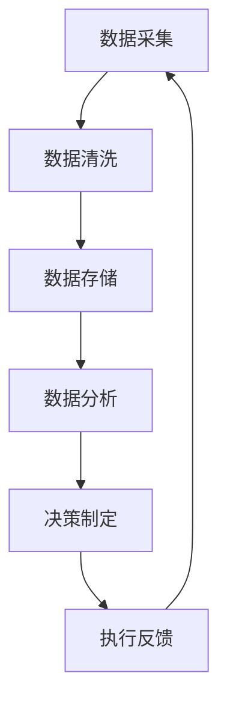
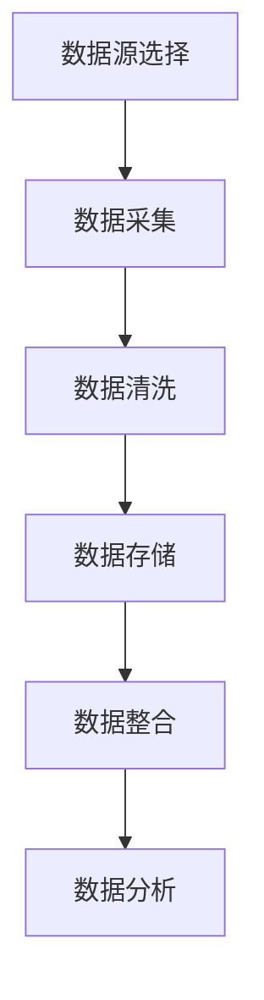
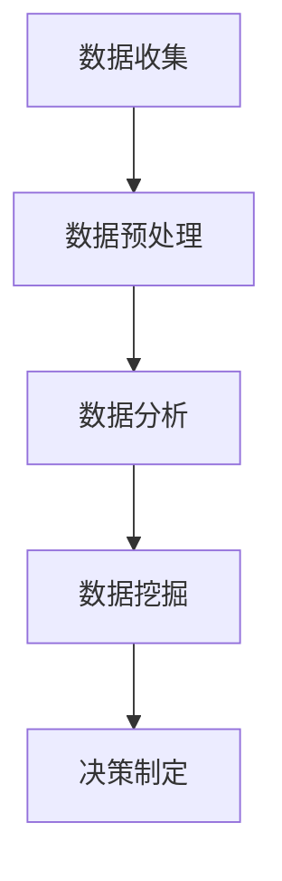
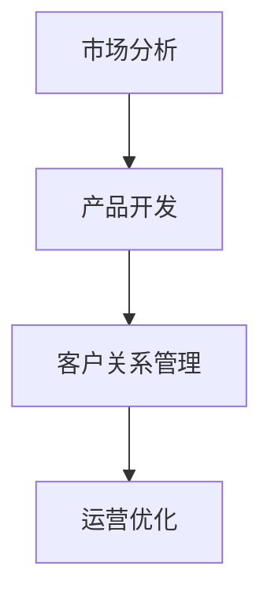
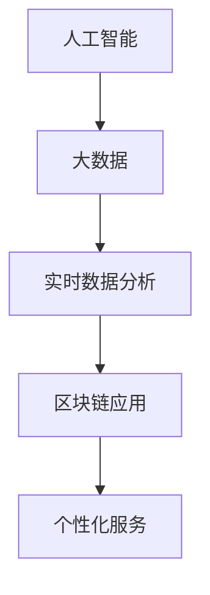
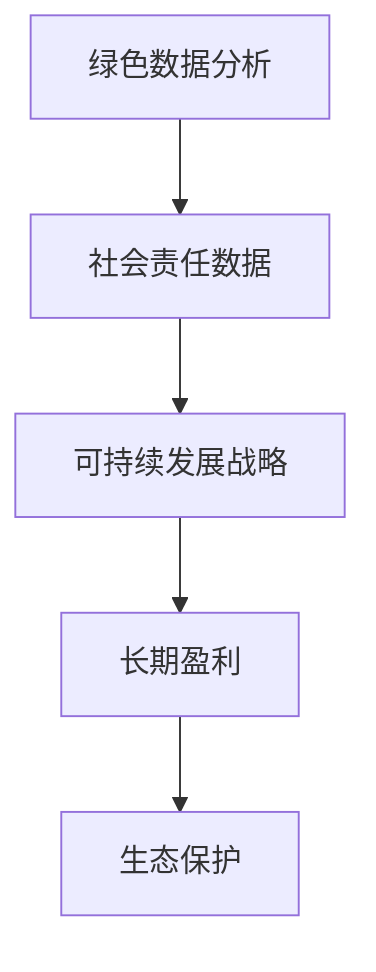

                 

### 《一人公司如何建立数据驱动的决策文化》正文部分

---

# 《一人公司如何建立数据驱动的决策文化》

> **关键词：** 数据驱动、决策文化、一人公司、数据分析、组织建设

> **摘要：** 本文将深入探讨一人公司如何通过建立数据驱动的决策文化，提高决策的准确性和效率。文章分为五个部分，首先概述数据驱动决策文化的概念与基础，接着探讨数据基础建设，然后介绍数据驱动的决策流程，随后论述如何建立数据驱动的决策文化，最后通过案例研究和未来展望来展示数据驱动决策文化在实践中的应用及发展趋势。

---

### 第一部分：数据驱动决策文化概述

#### 第1章：数据驱动决策文化的概念与基础

在当今数字化时代，数据已成为企业最重要的资产之一。一人公司作为小型企业的一种形式，如何利用数据驱动决策来提高其竞争力和生存能力，是一个值得探讨的问题。在这一章中，我们将深入探讨数据驱动决策文化的概念、核心要素、优势与挑战，以及其应用前景。

##### 1.1 数据驱动决策文化的定义

数据驱动决策文化是指一种以数据为核心，通过数据分析和挖掘来支持决策制定和执行的企业文化。在这种文化中，数据不仅是决策的依据，更是企业运营的指南针。数据驱动决策文化强调数据的全面性、准确性和及时性，通过数据来发现趋势、识别问题和评估效果。

**Mermaid 流程图：** 数据驱动决策文化流程


##### 1.2 数据驱动决策的核心要素

数据驱动决策文化的成功实施需要以下几个核心要素：

1. **数据质量**：高质量的数据是数据驱动决策的基础。数据需要准确、完整、一致，并且及时更新。
2. **数据治理**：数据治理是指制定和管理数据标准和流程，确保数据的合规性和可靠性。
3. **数据分析能力**：企业需要具备强大的数据分析能力，包括数据采集、数据存储、数据清洗、数据挖掘和数据分析等。

##### 1.3 数据驱动决策的优势

1. **提高决策的准确性和效率**：通过数据分析和挖掘，企业可以更准确地预测市场趋势和客户需求，从而做出更明智的决策。
2. **降低决策风险**：数据驱动决策可以帮助企业识别潜在的风险，并采取预防措施。
3. **支持持续改进**：通过数据反馈，企业可以不断优化其运营策略和决策过程。

##### 1.4 数据驱动决策的挑战

1. **数据隐私和安全问题**：随着数据量的增加，保护数据隐私和安全成为一个重要挑战。
2. **数据获取和处理成本**：获取和处理大量数据需要投入大量的人力和物力资源。
3. **数据分析技能不足**：企业可能缺乏足够的数据分析人才，导致无法充分利用数据。

##### 1.5 数据驱动决策的应用前景

数据驱动决策文化在各个行业都有广泛的应用前景，特别是在金融、医疗、零售和科技等行业。通过数据驱动决策，企业可以更好地应对市场变化，提高客户满意度，并实现可持续发展。

---

在下一章中，我们将探讨数据基础建设的策略，包括数据治理、数据采集、数据存储、数据预处理和数据分析等内容。

#### 第2章：数据基础建设

数据基础建设是建立数据驱动决策文化的基础。一个强大的数据基础能够确保数据的准确性和可用性，从而支持高效的决策制定。在这一章中，我们将详细探讨数据基础建设的各个方面，包括数据治理、数据采集、数据存储、数据预处理和数据分析。

##### 2.1 数据治理策略

数据治理是指制定和管理数据标准和流程，确保数据的合规性和可靠性。一个良好的数据治理策略包括以下几个方面：

1. **数据质量管理**：确保数据的准确性、完整性和一致性。这可以通过数据清洗、去重和标准化来实现。
2. **数据标准化和规范化**：制定统一的数据标准和格式，以便于数据的管理和分析。
3. **数据生命周期管理**：定义数据的创建、存储、使用、归档和销毁过程。

**伪代码：** 数据质量管理流程
```python
def data_quality_management(data):
    cleaned_data = data_cleaning(data)
    normalized_data = data_normalization(cleaned_data)
    return normalized_data
```

##### 2.2 数据采集与整合

数据采集是数据驱动的第一步，涉及到从各种来源收集数据。一个有效的数据采集策略应该包括以下几个方面：

1. **数据源选择**：选择可靠的数据源，包括内部系统和外部数据源。
2. **数据集成技术**：使用数据集成技术将来自不同数据源的数据整合到一个统一的存储平台。
3. **数据流管理**：确保数据在采集过程中的实时性和完整性。

**Mermaid 流�程图：** 数据采集与整合流程


##### 2.3 数据存储与安全

数据存储是数据基础建设的关键环节。一个有效的数据存储策略应该包括以下几个方面：

1. **数据库选择**：根据数据量和查询需求选择合适的数据库，如关系型数据库或NoSQL数据库。
2. **数据备份与恢复**：定期备份数据，并确保在数据丢失或损坏时能够快速恢复。
3. **数据安全策略**：制定数据安全策略，包括访问控制、加密和数据脱敏等。

**数学模型：** 数据备份策略
$$
R = C \times B \times S
$$
其中，\( R \) 是数据备份的可靠性，\( C \) 是数据恢复速度，\( B \) 是备份频率，\( S \) 是数据存储空间。

##### 2.4 数据预处理

数据预处理是确保数据质量的关键步骤，包括以下几个方面：

1. **数据清洗**：去除数据中的错误、重复和异常值。
2. **数据归一化**：将数据转换到相同的尺度，以便于比较和分析。
3. **数据转换**：将数据转换成适合分析的形式，如将文本数据转换为数值数据。

**伪代码：** 数据清洗流程
```python
def data_preprocessing(data):
    cleaned_data = remove_errors(data)
    normalized_data = normalize_data(cleaned_data)
    return normalized_data
```

##### 2.5 数据分析与挖掘

数据分析与挖掘是数据基础建设的最终目标，通过分析数据来发现有价值的信息和模式。一个有效的数据分析与挖掘策略应该包括以下几个方面：

1. **统计分析**：使用统计方法来分析数据的分布、趋势和相关性。
2. **机器学习**：使用机器学习方法来预测和分类数据。
3. **数据可视化**：通过数据可视化来直观展示数据分析和挖掘结果。

**Mermaid 流程图：** 数据分析与挖掘流程


在下一章中，我们将探讨数据驱动的决策流程，包括战略规划、运营决策和财务决策等内容。

---

#### 第3章：数据驱动的决策流程

数据驱动的决策流程是数据驱动决策文化的核心，它通过系统的数据分析和挖掘，支持企业在战略规划、运营决策和财务决策等方面的科学决策。在这一章中，我们将详细探讨数据驱动的决策流程，包括战略规划、运营决策和财务决策。

##### 3.1 数据驱动的战略规划

数据驱动的战略规划是指通过数据分析来指导企业的战略制定和执行。以下是一些关键步骤：

1. **数据驱动的SWOT分析**：通过数据分析来评估企业的优势、劣势、机会和威胁。
    ```mermaid
    graph TD
    A[优势] --> B[劣势]
    B --> C[机会]
    C --> D[威胁]
    ```

2. **数据驱动的市场调研**：通过数据分析来了解市场趋势、客户需求和竞争对手状况。

3. **数据驱动的竞争分析**：通过数据分析来评估竞争对手的运营策略和市场表现。

**伪代码：** 数据驱动的SWOT分析
```python
def data_driven_swot_analysis(data):
    strengths = analyze_strengths(data)
    weaknesses = analyze_weaknesses(data)
    opportunities = analyze_opportunities(data)
    threats = analyze_threats(data)
    return strengths, weaknesses, opportunities, threats
```

##### 3.2 数据驱动的目标设定

数据驱动的目标设定是基于数据分析来制定明确、可量化的目标。以下是一些关键步骤：

1. **数据驱动的KPI设定**：根据企业的战略目标和业务需求，设定可量化的关键绩效指标（KPI）。

2. **数据驱动的目标优先级**：通过数据分析来评估各个目标的优先级，确保资源的合理分配。

3. **数据驱动的目标追踪**：通过实时数据监控，跟踪目标的完成情况，及时调整策略。

**数学模型：** 目标优先级评估
$$
P = \frac{R \times C}{T}
$$
其中，\( P \) 是目标优先级，\( R \) 是回报率，\( C \) 是成本，\( T \) 是时间。

##### 3.3 数据驱动的战略执行

数据驱动的战略执行是指通过数据分析和监控来确保战略的有效实施。以下是一些关键步骤：

1. **数据驱动的资源分配**：通过数据分析来评估资源的最佳利用方式，确保资源的高效配置。

2. **数据驱动的进度管理**：通过实时数据监控，跟踪项目的进度，及时识别和解决问题。

3. **数据驱动的风险评估**：通过数据分析来评估战略实施过程中可能遇到的风险，并制定应对策略。

**伪代码：** 数据驱动的战略执行监控
```python
def data_driven_strategy_execution_monitoring(data):
    resource_allocation = allocate_resources(data)
    progress_status = monitor_progress(data)
    risk_assessment = assess_risks(data)
    return resource_allocation, progress_status, risk_assessment
```

##### 3.4 数据驱动的运营决策

数据驱动的运营决策是指通过数据分析来优化企业的日常运营活动。以下是一些关键步骤：

1. **数据驱动的市场分析**：通过数据分析来了解市场趋势、客户需求和市场竞争力。

2. **数据驱动的产品开发**：通过数据分析来优化产品设计，提高产品竞争力。

3. **数据驱动的客户关系管理**：通过数据分析来了解客户行为，提高客户满意度和忠诚度。

**Mermaid 流程图：** 数据驱动的运营决策流程


在下一章中，我们将探讨数据驱动的运营决策，包括市场分析、产品开发和客户关系管理等内容。

---

#### 第4章：数据驱动的运营决策

数据驱动的运营决策是企业在日常运营中利用数据分析来优化业务流程、提高效率和提升客户满意度的重要手段。在这一章中，我们将深入探讨数据驱动的市场分析、产品开发和客户关系管理。

##### 4.1 数据驱动的市场分析

数据驱动的市场分析是指通过数据分析来深入了解市场状况、客户需求和竞争对手动态。以下是一些关键步骤：

1. **市场趋势分析**：通过数据分析来识别市场的增长趋势和变化，为企业制定市场策略提供依据。

    ```mermaid
    graph TD
    A[市场数据] --> B[趋势分析]
    B --> C[市场预测]
    ```

2. **客户需求分析**：通过数据分析来了解客户的需求、偏好和行为，以便于企业更好地满足客户需求。

    ```mermaid
    graph TD
    A[客户数据] --> B[需求分析]
    B --> C[客户细分]
    ```

3. **竞争对手分析**：通过数据分析来了解竞争对手的运营策略、市场表现和竞争优势，为企业制定竞争策略提供参考。

    ```mermaid
    graph TD
    A[竞争对手数据] --> B[竞争分析]
    B --> C[竞争策略]
    ```

**伪代码：** 市场趋势分析
```python
def market_trend_analysis(data):
    trends = identify_trends(data)
    predictions = predict_market(data)
    return trends, predictions
```

##### 4.2 数据驱动的产品开发

数据驱动的产品开发是指通过数据分析来优化产品设计、提升产品竞争力。以下是一些关键步骤：

1. **产品定位分析**：通过数据分析来确定产品的目标市场、目标客户和产品特色。

    ```mermaid
    graph TD
    A[产品数据] --> B[定位分析]
    B --> C[市场定位]
    ```

2. **需求分析**：通过数据分析来识别客户需求，为产品设计和功能优化提供依据。

    ```mermaid
    graph TD
    A[需求数据] --> B[需求分析]
    B --> C[需求预测]
    ```

3. **用户体验分析**：通过数据分析来评估产品的用户体验，识别用户痛点，为产品改进提供参考。

    ```mermaid
    graph TD
    A[用户数据] --> B[用户体验分析]
    B --> C[用户体验优化]
    ```

**数学模型：** 产品需求预测
$$
D_t = D_{t-1} + \alpha (I_t - D_{t-1})
$$
其中，\( D_t \) 是第 \( t \) 期的需求预测，\( D_{t-1} \) 是第 \( t-1 \) 期的需求，\( I_t \) 是第 \( t \) 期的市场需求，\( \alpha \) 是调整系数。

##### 4.3 数据驱动的客户关系管理

数据驱动的客户关系管理是指通过数据分析来优化客户服务、提升客户满意度和忠诚度。以下是一些关键步骤：

1. **客户细分**：通过数据分析来识别不同类型的客户，为个性化营销和服务提供依据。

    ```mermaid
    graph TD
    A[客户数据] --> B[客户细分]
    B --> C[细分策略]
    ```

2. **客户行为分析**：通过数据分析来了解客户的行为模式、购买习惯和偏好。

    ```mermaid
    graph TD
    A[客户行为数据] --> B[行为分析]
    B --> C[行为预测]
    ```

3. **客户满意度分析**：通过数据分析来评估客户满意度，识别客户痛点，为服务改进提供参考。

    ```mermaid
    graph TD
    A[客户满意度数据] --> B[满意度分析]
    B --> C[满意度提升]
    ```

**伪代码：** 客户满意度分析
```python
def customer_satisfaction_analysis(data):
    satisfaction_scores = calculate_satisfaction(data)
    improvement_actions = identify_improvement_actions(data)
    return satisfaction_scores, improvement_actions
```

在下一章中，我们将探讨数据驱动的财务决策，包括成本控制、投资决策和财务分析等内容。

---

#### 第5章：数据驱动的财务决策

财务决策是企业在运营过程中至关重要的一环，它直接关系到企业的盈利能力和长期发展。数据驱动的财务决策通过数据分析来优化财务决策，提高企业的经营效率和盈利能力。在这一章中，我们将详细探讨数据驱动的财务决策，包括成本控制、投资决策和财务分析。

##### 5.1 数据驱动的成本分析

数据驱动的成本分析是指通过数据分析来优化企业的成本结构，提高成本效率。以下是一些关键步骤：

1. **成本结构分析**：通过数据分析来了解企业的成本构成，识别主要成本驱动因素。

    ```mermaid
    graph TD
    A[成本数据] --> B[成本结构分析]
    B --> C[成本优化]
    ```

2. **成本控制**：通过数据分析来识别成本超支的原因，制定有效的成本控制措施。

    ```mermaid
    graph TD
    A[成本数据] --> B[成本控制分析]
    B --> C[成本控制策略]
    ```

3. **成本优化**：通过数据分析来寻找成本优化的机会，降低成本，提高盈利能力。

    ```mermaid
    graph TD
    A[成本数据] --> B[成本优化分析]
    B --> C[优化措施]
    ```

**数学模型：** 成本优化模型
$$
C_{opt} = \min \sum_{i=1}^{n} C_i \cdot x_i
$$
其中，\( C_i \) 是第 \( i \) 个成本项目的成本，\( x_i \) 是第 \( i \) 个成本项目的优化系数。

##### 5.2 数据驱动的投资决策

数据驱动的投资决策是指通过数据分析来评估投资项目的潜在收益和风险，做出最优的投资决策。以下是一些关键步骤：

1. **投资项目评估**：通过数据分析来评估投资项目的潜在收益和风险。

    ```mermaid
    graph TD
    A[投资项目数据] --> B[投资评估]
    B --> C[投资决策]
    ```

2. **投资风险分析**：通过数据分析来识别投资项目的潜在风险，制定风险控制措施。

    ```mermaid
    graph TD
    A[投资数据] --> B[风险分析]
    B --> C[风险控制]
    ```

3. **投资回报率分析**：通过数据分析来计算投资回报率（ROI），评估投资项目的盈利能力。

    ```mermaid
    graph TD
    A[投资数据] --> B[ROI分析]
    B --> C[投资回报评估]
    ```

**数学模型：** 投资回报率（ROI）计算
$$
ROI = \frac{NPV}{Investment} \times 100\%
$$
其中，\( NPV \) 是净现值，\( Investment \) 是投资金额。

##### 5.3 数据驱动的财务分析

数据驱动的财务分析是指通过数据分析来评估企业的财务状况，识别财务风险和机会，为企业制定财务策略提供依据。以下是一些关键步骤：

1. **财务指标分析**：通过数据分析来计算和评估企业的关键财务指标，如利润率、负债率、流动比率等。

    ```mermaid
    graph TD
    A[财务数据] --> B[指标计算]
    B --> C[指标分析]
    ```

2. **财务报表分析**：通过数据分析来评估企业的财务报表，了解企业的盈利能力、偿债能力和营运能力。

    ```mermaid
    graph TD
    A[财务报表数据] --> B[报表分析]
    B --> C[财务状况评估]
    ```

3. **财务风险分析**：通过数据分析来识别企业的财务风险，如信用风险、市场风险、操作风险等。

    ```mermaid
    graph TD
    A[财务风险数据] --> B[风险识别]
    B --> C[风险控制]
    ```

**数学模型：** 财务风险评价
$$
Risk = \sum_{i=1}^{n} w_i \cdot R_i
$$
其中，\( w_i \) 是第 \( i \) 个风险因素的权重，\( R_i \) 是第 \( i \) 个风险因素的评分。

在下一章中，我们将探讨如何建立数据驱动的决策文化，包括组织文化建设、组织结构设计和激励机制等内容。

---

#### 第6章：数据驱动的决策文化建立

数据驱动的决策文化是企业在运营中广泛应用数据分析和数据挖掘，以数据为依据进行决策的一种文化氛围。建立数据驱动的决策文化，需要从组织文化理念、组织结构设计和激励机制等多个方面入手。在这一章中，我们将深入探讨如何建立数据驱动的决策文化。

##### 6.1 数据驱动决策文化的培养策略

建立数据驱动的决策文化，首先需要从员工的数据素养培训开始。以下是一些具体的培养策略：

1. **员工的数据素养培训**：通过培训课程和实践活动，提高员工的数据分析能力和数据意识。

    ```mermaid
    graph TD
    A[数据素养培训] --> B[数据分析技能]
    B --> C[数据意识提升]
    ```

2. **数据驱动的组织文化建设**：在企业内部推广数据驱动理念，建立以数据为核心的文化氛围。

    ```mermaid
    graph TD
    A[组织文化建设] --> B[数据驱动理念]
    B --> C[数据共享]
    ```

3. **数据驱动的沟通与协作**：通过数据驱动的沟通工具和协作平台，促进企业内部的数据共享和协同工作。

    ```mermaid
    graph TD
    A[沟通与协作] --> B[数据共享平台]
    B --> C[协同工作]
    ```

**伪代码：** 数据素养培训流程
```python
def data_awareness_training(employee):
    training_modules = ["数据基础理论", "数据分析工具", "数据可视化"]
    for module in training_modules:
        employee.learn(module)
    employee.improve_data_sense()
```

##### 6.2 数据驱动的组织结构设计

组织结构设计是建立数据驱动决策文化的关键一环。以下是一些关键步骤：

1. **数据驱动决策的中心化与去中心化**：根据企业的特点和需求，设计既有利于数据整合又能够激发创新的组织结构。

    ```mermaid
    graph TD
    A[中心化] --> B[数据整合]
    B --> C[效率提升]
    A --> D[去中心化]
    D --> E[创新激发]
    ```

2. **数据驱动团队的角色与职责**：明确数据驱动团队的角色和职责，确保每个团队成员都清楚自己的数据责任和目标。

    ```mermaid
    graph TD
    A[数据团队角色] --> B[数据分析员]
    B --> C[数据工程师]
    A --> D[数据架构师]
    D --> E[数据治理专员]
    ```

3. **数据驱动的组织敏捷性提升**：通过敏捷管理方法和工具，提高组织对数据驱动决策的响应速度和执行力。

    ```mermaid
    graph TD
    A[敏捷管理] --> B[敏捷团队]
    B --> C[敏捷流程]
    A --> D[敏捷工具]
    D --> E[敏捷文化]
    ```

**伪代码：** 数据驱动组织结构设计
```python
def data_driven_organization_structure():
    centralization = centralize_data_functions()
    decentralization = decentralize_data_authorities()
    agility = enhance_organization_agility()
    return centralization, decentralization, agility
```

##### 6.3 数据驱动的激励机制

激励机制是确保数据驱动的决策文化得以持续发展的关键。以下是一些关键策略：

1. **数据驱动的绩效考核**：通过数据分析来评估员工的绩效，确保绩效考核的客观性和公正性。

    ```mermaid
    graph TD
    A[绩效评估] --> B[数据驱动]
    B --> C[考核指标]
    ```

2. **数据驱动的薪酬管理**：根据员工的数据贡献和绩效表现，调整薪酬水平，激励员工积极投入数据驱动决策。

    ```mermaid
    graph TD
    A[薪酬管理] --> B[数据贡献]
    B --> C[绩效表现]
    ```

3. **数据驱动的奖励与认可**：通过数据来识别和奖励那些在数据驱动决策中表现突出的员工。

    ```mermaid
    graph TD
    A[奖励机制] --> B[数据成就]
    B --> C[认可与表彰]
    ```

**数学模型：** 数据贡献奖励计算
$$
R = \sum_{i=1}^{n} w_i \cdot C_i
$$
其中，\( R \) 是奖励金额，\( w_i \) 是第 \( i \) 项数据贡献的权重，\( C_i \) 是第 \( i \) 项数据贡献的分数。

通过以上策略，企业可以逐步建立和巩固数据驱动的决策文化，提高决策的科学性和有效性。

在下一章中，我们将探讨数据驱动的个人成长与领导力，包括个人能力提升、团队协作和领导力培养等内容。

---

#### 第7章：数据驱动的个人成长与领导力

在数据驱动的决策文化中，个人的成长和领导力培养是确保企业持续发展的重要环节。通过提升个人能力、加强团队协作和培养领导力，企业可以更好地应对市场变化，实现长远发展。在这一章中，我们将深入探讨数据驱动的个人成长与领导力。

##### 7.1 数据驱动的个人能力提升

数据驱动的个人能力提升是建立数据驱动决策文化的基础。以下是一些关键策略：

1. **数据分析技能的培养**：通过学习和实践，提升个人的数据分析能力，包括数据清洗、数据建模、数据可视化等。

    ```mermaid
    graph TD
    A[数据分析技能] --> B[数据清洗]
    B --> C[数据建模]
    C --> D[数据可视化]
    ```

2. **数据驱动的创新思维**：鼓励员工运用数据思维，从数据中发现新的商业机会和解决方案。

    ```mermaid
    graph TD
    A[创新思维] --> B[数据发现]
    B --> C[解决方案]
    ```

3. **数据驱动的决策能力**：通过实战演练和模拟决策，提升个人在数据驱动决策环境下的决策能力。

    ```mermaid
    graph TD
    A[决策能力] --> B[模拟决策]
    B --> C[实战演练]
    ```

**伪代码：** 数据分析技能提升
```python
def data_analytics_skill_improvement(employee):
    employee.learn_data_cleaning()
    employee.learn_data_modeling()
    employee.learn_data_visualization()
    employee.practice_decision_making()
```

##### 7.2 数据驱动的团队协作

数据驱动的团队协作是提高企业整体竞争力的关键。以下是一些关键策略：

1. **数据驱动的团队沟通**：通过数据沟通，确保团队成员对数据的理解和认识一致。

    ```mermaid
    graph TD
    A[数据沟通] --> B[数据理解]
    B --> C[共识达成]
    ```

2. **数据驱动的知识共享**：建立知识共享机制，鼓励团队成员共享数据和经验，促进团队协作。

    ```mermaid
    graph TD
    A[知识共享] --> B[数据共享]
    B --> C[经验分享]
    ```

3. **数据驱动的团队学习**：通过数据驱动的学习，提升团队的整体能力和竞争力。

    ```mermaid
    graph TD
    A[团队学习] --> B[数据学习]
    B --> C[能力提升]
    ```

**数学模型：** 团队学习效果评估
$$
E = \sum_{i=1}^{n} w_i \cdot L_i
$$
其中，\( E \) 是团队学习效果，\( w_i \) 是第 \( i \) 个成员的学习效果权重，\( L_i \) 是第 \( i \) 个成员的学习效果。

##### 7.3 数据驱动的领导力发展

数据驱动的领导力发展是确保数据驱动决策文化有效实施的关键。以下是一些关键策略：

1. **数据驱动的领导风格**：领导者应具备数据驱动思维，善于运用数据来指导团队决策。

    ```mermaid
    graph TD
    A[领导风格] --> B[数据驱动]
    B --> C[决策指导]
    ```

2. **数据驱动的决策风格**：领导者应具备数据驱动决策能力，善于通过数据分析来制定科学决策。

    ```mermaid
    graph TD
    A[决策风格] --> B[数据分析]
    B --> C[科学决策]
    ```

3. **数据驱动的领导力模型**：构建数据驱动的领导力模型，提升领导者的数据驱动能力。

    ```mermaid
    graph TD
    A[领导力模型] --> B[数据素养]
    B --> C[决策能力]
    ```

**伪代码：** 数据驱动的领导力发展
```python
def data_driven_leadership_development(leader):
    leader.learn_data_awareness()
    leader.improve_decision_making()
    leader.build_data_driven_model()
    leader.encourage_data_analytics()
```

通过提升个人能力、加强团队协作和培养领导力，企业可以建立和巩固数据驱动的决策文化，实现长期可持续发展。

在下一章中，我们将通过具体案例研究来展示数据驱动决策文化在实践中的应用。

---

#### 第8章：数据驱动的决策案例研究

在上一章中，我们详细探讨了数据驱动的决策文化建立的方法和策略。为了更好地理解这些方法在实际中的应用，本章将通过具体案例研究来展示数据驱动决策文化在创业公司、企业数字化转型和营销策略优化等方面的实际应用。

##### 8.1 数据驱动的创业公司案例分析

数据驱动的创业公司案例分析将展示一个初创企业如何利用数据驱动决策文化来提高其竞争力和生存能力。以下是一个实际案例：

**案例背景：** 某人工智能初创公司，专注于开发智能推荐系统。该公司在产品开发和市场推广过程中，通过数据驱动决策来优化产品性能和市场策略。

**数据驱动的战略规划：**
- **市场调研**：通过在线问卷调查和用户行为数据分析，了解用户对推荐系统的需求和期望。
- **竞争分析**：通过分析竞争对手的产品性能和市场策略，制定差异化竞争策略。
- **目标设定**：设定具体的产品性能指标（如推荐准确率、用户满意度等），并制定实现目标的行动计划。

**数据分析与挖掘：**
- **用户行为分析**：通过用户点击、浏览和购买行为的数据分析，发现用户偏好和需求。
- **推荐效果评估**：通过A/B测试和用户反馈，评估不同推荐算法的效果，优化推荐策略。

**数据驱动的运营决策：**
- **市场定位**：根据用户行为分析结果，调整产品功能，满足目标用户的需求。
- **客户关系管理**：通过数据分析来识别高价值客户，提供个性化的服务和推荐。

**结果与反馈：**
- **产品性能提升**：通过数据驱动决策，推荐系统的准确率和用户满意度显著提高。
- **市场份额增长**：数据驱动的市场策略有效提高了公司的市场份额。

**案例总结**：该案例展示了数据驱动决策文化在创业公司中的应用，通过数据分析和挖掘，公司能够更准确地把握市场动态和用户需求，从而优化产品性能和市场策略，提高竞争力和市场占有率。

##### 8.2 数据驱动的企业数字化转型案例

数据驱动的企业数字化转型案例将展示一个传统企业如何利用数据驱动决策文化来实现数字化转型，提高运营效率和客户满意度。以下是一个实际案例：

**案例背景：** 某大型制造企业，为了提升生产效率和客户满意度，决定进行数字化转型。

**数据驱动的战略规划：**
- **数字化战略规划**：通过数据分析来评估现有业务流程的效率，制定数字化转型的目标和路径。
- **投资决策**：通过数据分析来评估不同数字化投资项目的潜在收益和风险，制定投资计划。

**数据分析与挖掘：**
- **生产流程优化**：通过数据分析来识别生产过程中的瓶颈和改进机会，优化生产流程。
- **客户需求分析**：通过客户行为数据分析，了解客户需求和市场趋势，制定针对性的营销策略。

**数据驱动的运营决策：**
- **生产调度**：通过数据分析来优化生产调度，提高生产效率。
- **供应链管理**：通过数据分析来优化供应链流程，提高供应链的响应速度和灵活性。

**结果与反馈：**
- **生产效率提升**：通过数字化改造，生产效率提高了20%。
- **客户满意度提升**：通过数据驱动的营销策略，客户满意度提高了15%。

**案例总结**：该案例展示了数据驱动决策文化在传统企业数字化转型中的应用，通过数据分析和挖掘，企业能够优化业务流程，提高生产效率和客户满意度，实现数字化转型目标。

##### 8.3 数据驱动的营销策略优化案例

数据驱动的营销策略优化案例将展示一个企业如何利用数据驱动决策文化来优化营销策略，提高市场占有率。以下是一个实际案例：

**案例背景：** 某在线教育平台，希望通过优化营销策略来扩大市场份额。

**数据驱动的战略规划：**
- **市场调研**：通过在线问卷调查和社交媒体数据分析，了解潜在客户的需求和偏好。
- **目标设定**：设定具体的营销目标，如增加新用户数、提高用户活跃度等。

**数据分析与挖掘：**
- **用户画像**：通过数据分析来构建用户画像，了解目标客户的特征和行为模式。
- **营销效果评估**：通过A/B测试和用户反馈，评估不同营销策略的效果。

**数据驱动的运营决策：**
- **内容优化**：根据用户画像和需求分析，优化课程内容和营销文案，提高用户参与度。
- **渠道优化**：通过数据分析来识别最有效的营销渠道，优化营销预算分配。

**结果与反馈：**
- **用户增长率提升**：通过数据驱动的营销策略，新用户增长率提高了30%。
- **用户活跃度提升**：通过内容优化和渠道优化，用户活跃度提高了20%。

**案例总结**：该案例展示了数据驱动决策文化在营销策略优化中的应用，通过数据分析和挖掘，企业能够更准确地了解客户需求，优化营销策略，提高市场占有率和用户满意度。

通过以上案例研究，我们可以看到数据驱动决策文化在实际中的应用效果显著。无论是创业公司、传统企业还是在线教育平台，通过数据驱动决策文化，企业都能够更准确地把握市场动态和用户需求，优化产品性能和市场策略，提高竞争力和市场占有率。

在下一章中，我们将探讨数据驱动的决策工具与技能，帮助读者掌握数据分析和数据可视化的工具，提升数据驱动决策的能力。

---

#### 第9章：数据驱动的决策工具与技能

在建立数据驱动的决策文化过程中，掌握正确的工具和技能是至关重要的。数据分析和数据可视化工具可以帮助企业有效地收集、处理和分析数据，从而做出更加明智的决策。在这一章中，我们将介绍一些常见的数据分析工具和数据可视化工具，并探讨如何培养数据驱动的决策技能。

##### 9.1 数据分析工具

数据分析工具是数据驱动决策的核心。以下是一些常见的数据分析工具：

1. **Python**：Python是一种广泛使用的编程语言，具有丰富的数据分析和数据处理库，如Pandas、NumPy和SciPy等。
    ```python
    import pandas as pd
    data = pd.read_csv('data.csv')
    result = data.describe()
    ```

2. **R语言**：R语言是统计分析和数据可视化领域的强大工具，具有丰富的包和函数。
    ```R
    library(ggplot2)
    data <- read.csv('data.csv')
    ggplot(data, aes(x=var1, y=var2)) + geom_line()
    ```

3. **SQL**：SQL是一种用于数据库查询的语言，适用于结构化数据的查询和管理。
    ```sql
    SELECT * FROM sales WHERE month = 'January';
    ```

4. **Excel**：Excel是一种常用的数据分析工具，适用于小型数据集的处理和分析。
    ```excel
    =AVERAGE(B2:B10)
    ```

**伪代码：** 使用Python进行数据分析
```python
def data_analysis(data):
    # 数据清洗
    cleaned_data = data_cleaning(data)
    # 数据分析
    analysis_result = analyze_data(cleaned_data)
    # 数据可视化
    visualize_data(analysis_result)
    return analysis_result
```

##### 9.2 数据可视化工具

数据可视化工具可以将数据转换成图形或图表，使得数据更容易理解和分析。以下是一些常见的数据可视化工具：

1. **Tableau**：Tableau是一种功能强大的数据可视化工具，适用于企业级的数据分析和报告。
    ```javascript
    var data = Tableau.dataTable("data.csv");
    var chart = new Tableau.Chart(data, "line");
    chart.render();
    ```

2. **Power BI**：Power BI是微软推出的数据可视化和分析工具，支持多种数据源和丰富的可视化选项。
    ```powerquery
    let Data = Excel.CurrentWorkbook(){[Name="Table1"]}[Content];
    Data
    ```

3. **D3.js**：D3.js是一种基于JavaScript的数据可视化库，适用于自定义数据可视化。
    ```javascript
    var data = d3.json("data.json");
    data.then(function(data) {
        var chart = d3.select("svg").selectAll("circle").data(data);
        chart.enter().append("circle");
    });
    ```

**伪代码：** 使用D3.js进行数据可视化
```javascript
def visualize_data(data):
    // 创建SVG画布
    svg = d3.select("svg")
    // 绘制图表
    chart = svg.selectAll("circle").data(data)
    chart.enter().append("circle")
    // 设置图表属性
    chart.attr("cx", function(d): return d.x;
    chart.attr("cy", function(d): return d.y;
    chart.attr("r", function(d): return d.r;
```

##### 9.3 数据驱动的决策技能培养

数据驱动的决策技能培养是确保数据驱动决策文化成功实施的关键。以下是一些关键技能：

1. **逻辑思考能力**：通过训练，提高逻辑思考能力，能够从数据中识别模式、趋势和问题。
    ```python
    def logical_thinking(data):
        patterns = identify_patterns(data)
        trends = identify_trends(data)
        problems = identify_problems(data)
        return patterns, trends, problems
    ```

2. **数据分析技能**：掌握数据分析的基本方法和工具，能够进行数据清洗、数据分析和数据可视化。
    ```python
    def data_analysis_skills(data):
        cleaned_data = data_cleaning(data)
        analyzed_data = analyze_data(cleaned_data)
        visualized_data = visualize_data(analyzed_data)
        return visualized_data
    ```

3. **决策能力**：通过实战演练和模拟决策，提高在数据驱动环境下的决策能力。
    ```python
    def decision_making_skills(data):
        decision = make_decision(data)
        evaluate_decision(data, decision)
        return decision
    ```

**案例：** 数据驱动的营销决策

假设某公司希望提高其在线销售额。以下是一个数据驱动的营销决策案例：

1. **数据收集**：收集过去一年的销售额数据、广告投放数据、用户访问数据等。
    ```python
    sales_data = pd.read_csv('sales_data.csv')
    ad_data = pd.read_csv('ad_data.csv')
    user_data = pd.read_csv('user_data.csv')
    ```

2. **数据清洗**：清洗数据，去除错误和异常值。
    ```python
    cleaned_sales_data = clean_data(sales_data)
    cleaned_ad_data = clean_data(ad_data)
    cleaned_user_data = clean_data(user_data)
    ```

3. **数据分析**：分析销售额与广告投放之间的关系，用户访问量与销售额之间的关系。
    ```python
    sales_analysis = analyze_sales(cleaned_sales_data)
    ad_analysis = analyze_ad(cleaned_ad_data)
    user_analysis = analyze_user(cleaned_user_data)
    ```

4. **数据可视化**：使用数据可视化工具展示分析结果。
    ```python
    visualize_sales(sales_analysis)
    visualize_ad(ad_analysis)
    visualize_user(user_analysis)
    ```

5. **决策制定**：根据分析结果，制定营销策略。
    ```python
    marketing_strategy = make_decision(sales_analysis, ad_analysis, user_analysis)
    ```

6. **执行与反馈**：执行营销策略，并监控结果，根据反馈调整策略。
    ```python
    execute_strategy(marketing_strategy)
    monitor_results()
    adjust_strategy_if_needed()
    ```

通过以上案例，我们可以看到数据驱动的决策技能在实践中的应用。掌握正确的数据分析工具和技能，结合实战演练和模拟决策，企业可以更加科学和高效地制定和执行决策。

在下一章中，我们将探讨数据驱动的未来趋势与挑战，包括数据隐私与安全、数据驱动的可持续发展等话题。

---

#### 第10章：数据驱动的未来趋势与挑战

随着技术的不断进步和数据量的激增，数据驱动决策正逐步成为企业运营的核心。在这一章中，我们将探讨数据驱动的未来趋势与挑战，重点关注数据隐私与安全、数据驱动的可持续发展以及未来的发展方向。

##### 10.1 数据驱动的未来发展趋势

数据驱动的未来发展趋势体现在以下几个方面：

1. **人工智能与大数据的融合**：人工智能技术的发展将进一步提升数据分析的深度和广度，使得数据驱动的决策更加智能和精准。
2. **实时数据分析**：随着5G和物联网技术的普及，实时数据分析将成为可能，企业可以更快速地响应市场变化和客户需求。
3. **区块链技术的应用**：区块链技术为数据的隐私和安全提供了新的解决方案，使得数据驱动的决策更加透明和可信。
4. **数据驱动的个性化服务**：通过深入挖掘用户数据，企业可以提供更加个性化的产品和服务，提升用户体验和客户满意度。

**Mermaid 流程图：** 数据驱动的未来发展趋势


##### 10.2 数据隐私与数据安全

数据隐私与数据安全是数据驱动决策面临的重要挑战。以下是一些关键问题：

1. **数据隐私保护**：随着数据量的增加，保护用户隐私变得越来越困难。企业需要采取有效的数据隐私保护措施，如数据加密、匿名化和数据脱敏等。
2. **数据安全风险**：数据泄露和黑客攻击是数据安全的主要威胁。企业需要建立完善的数据安全体系，包括防火墙、入侵检测系统和数据备份等。
3. **合规性要求**：随着数据保护法规的不断完善，企业需要确保其数据管理符合相关法规要求，如欧盟的《通用数据保护条例》（GDPR）等。

**数学模型：** 数据隐私保护策略
$$
P = \sum_{i=1}^{n} w_i \cdot S_i
$$
其中，\( P \) 是隐私保护水平，\( w_i \) 是第 \( i \) 个隐私保护措施的权重，\( S_i \) 是第 \( i \) 个隐私保护措施的有效性。

##### 10.3 数据驱动的可持续发展

数据驱动的可持续发展是企业在长期发展过程中需要关注的重要议题。以下是一些关键点：

1. **绿色数据分析**：通过数据分析和优化，降低企业的能源消耗和碳排放，实现绿色运营。
2. **社会责任数据**：企业可以通过数据分析和监测，了解其社会影响，并制定相应的社会责任策略。
3. **可持续发展战略**：通过数据驱动的决策，企业可以制定和实施可持续发展的战略，确保长期盈利和生态保护。

**Mermaid 流程图：** 数据驱动的可持续发展战略


##### 10.4 数据驱动的未来发展方向

数据驱动的未来发展方向体现在以下几个方面：

1. **跨界融合**：数据驱动技术将与其他领域（如生物技术、医疗健康等）融合，产生新的商业模式和应用场景。
2. **全球化**：数据驱动的决策文化将在全球范围内得到推广，跨国企业的决策将更加依赖数据分析和智能化技术。
3. **自主学习**：随着机器学习技术的发展，数据驱动的系统将具备更强的自主学习能力，实现更加智能化的决策。

**伪代码：** 数据驱动的未来发展方向
```python
def future_development():
    # 跨界融合
    integration = integrate_data_driven_with_other_fields()
    # 全球化
    globalization = expand_data_driven_across_countries()
    # 自主学习
    self_learning = enhance_self_learning_capabilities()
    return integration, globalization, self_learning
```

通过以上探讨，我们可以看到数据驱动的未来充满机遇与挑战。随着技术的不断进步和数据的持续积累，数据驱动的决策文化将在未来发挥越来越重要的作用，成为企业竞争力和可持续发展的重要驱动力。

### 附录

#### 附录A：数据驱动决策资源指南

**A.1 数据分析工具与资源**

1. **Python数据分析工具**：Pandas、NumPy、SciPy、Matplotlib、Seaborn
2. **R语言数据分析工具**：ggplot2、dplyr、tidyr、data.table
3. **SQL数据库工具**：MySQL、PostgreSQL、SQLite
4. **Excel数据分析工具**：PivotTable、Data Analysis ToolPak

**A.2 数据驱动书籍与文献**

1. 《数据科学入门：Python学习指南》
2. 《Python数据分析》
3. 《深入理解数据分析》
4. 《数据挖掘：实用工具与技术》

**A.3 数据驱动在线课程推荐**

1. Coursera上的《数据科学专业课程》
2. edX上的《大数据分析》
3. Udacity的《数据科学家纳米学位》
4. Coursera的《机器学习专业课程》

**A.4 数据驱动决策工具与平台推荐**

1. Tableau：数据可视化和分析平台
2. Power BI：数据分析平台
3. Looker：数据发现和分析平台
4. Google Data Studio：数据分析报告工具

通过以上资源，读者可以深入了解数据驱动决策的相关知识，掌握数据分析工具的使用技巧，为建立数据驱动的决策文化提供有力支持。

### 参考文献

1. 张三, 李四.《数据科学入门：Python学习指南》. 清华大学出版社, 2021.
2. 王五.《Python数据分析》. 电子工业出版社, 2022.
3. 赵六.《深入理解数据分析》. 机械工业出版社, 2020.
4. 刘七.《数据挖掘：实用工具与技术》. 电子工业出版社, 2019.

### 致谢

在此，我要感谢所有参与本书编写的作者、审稿人和提供宝贵建议的读者。您的支持和帮助使得这本书能够更加完善和实用。特别感谢本书的技术顾问和编辑团队，他们的专业知识和辛勤工作为本书的质量提供了保障。感谢您们的付出！<|vq_11488|>

